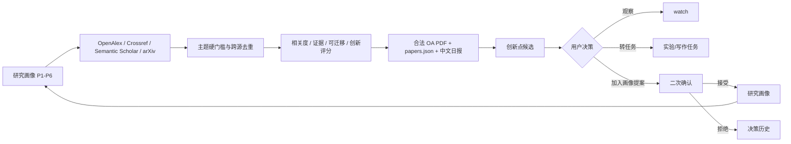

# Flexible Sensor Literature Intelligence

这是一个围绕 **柔性电子皮肤前端触觉计算** 的个人科研情报中枢。它把研究画像、每日文献筛选、开放获取 PDF、结构化总结、创新点、人工审批、实验任务和 GitHub 版本记录连成一个可追踪闭环。

系统不会把课题简化成普通“高灵敏柔性压力传感器”。论文排序优先服务以下主线：

- P1：低离散/装配容差触觉界面。
- P2：ADC 前模拟矢量触觉读出。
- P3：低冗余 tactile macro-pixel 与阵列读出。
- P4：可编程物理触觉投影前端。
- P5：坏点、漂移、跨器件迁移与少样本校准。
- P6：摩擦、纹理、滑移、机器人、鞋垫和人体监测任务。

## 运行方式

在仓库根目录运行：

```powershell
python scripts\research_server.py
```

打开 [http://127.0.0.1:8765](http://127.0.0.1:8765)。本地服务支持直接写入 decision log、生成画像提案、接受后更新画像、转任务以及一键同步 GitHub。

只用静态服务器也能查看页面，但按钮会进入浏览器离线决策队列，不能直接写回仓库：

```powershell
cd web
python -m http.server 8765
```

## 每日流程



手动执行完整检索：

```powershell
python scripts\daily_literature_pipeline.py
```

常用选项：

```powershell
python scripts\daily_literature_pipeline.py --no-pdf
python scripts\daily_literature_pipeline.py --date 2026-07-14
python scripts\daily_literature_pipeline.py --git-sync
```

流水线先查最近 3 天；强相关结果不足时扩到 7、30、365 天。只保存 OpenAlex、Semantic Scholar 或 arXiv 明确给出的合法开放获取 PDF；其余论文保留 DOI 和来源链接。

## 每日 09:00 自动化

有两条互补运行路径：

1. Codex 自动任务 `daily-flexible-sensor-literature` 每天 09:00（Asia/Shanghai）运行确定性流水线，再检查高分论文、补充精读信息并推送中文摘要。
2. GitHub Actions 的 `Daily literature intelligence` 在北京时间 09:15 做容灾检查；如果 Codex 已生成当天日报就跳过，否则补跑脚本、测试、归档并提交到 `main`。

Codex 是主运行路径，GitHub Actions 是后备路径。两条路径都按 DOI/标题去重，同一天重复运行不会重复添加未处理候选。

## 推送到微信或手机

GitHub Actions 支持三个可选通知通道。在仓库 `Settings > Secrets and variables > Actions` 添加任意一个：

- `PUSHPLUS_TOKEN`：PushPlus 微信消息。
- `SERVERCHAN_SENDKEY`：Server 酱微信消息。
- `BARK_URL`：Bark 完整推送地址。

没有配置密钥时，日报仍会写入 GitHub、网页和 Codex 自动任务结果，不会导致每日流程失败。

可选的检索 API 配置：`OPENALEX_API_KEY`、`OPENALEX_MAILTO` 和 `SEMANTIC_SCHOLAR_API_KEY`。未配置或遇到限流时，流水线会明确记录异常并继续使用 Crossref 与 arXiv。

## 数据与审批

```text
research-memory/
  profile/user-research-profile.md
  profile-update-proposals/proposals.json
  literature/YYYY/YYYY-MM-DD/
    papers/
    summaries/papers.json
    daily-report.md
  ideas/idea-log.json
  decisions/decision-log.json
  tasks/task-board.json
  schemas/
web/
  index.html
  app.js
  styles.css
  data/research-bundle.json
scripts/
  daily_literature_pipeline.py
  research_server.py
  research_store.py
  send_daily_notification.py
```

Agent 只能创建 `candidate/watch` idea。点击“加入画像提案”也不会立刻修改画像；只有在画像页再次点击“接受并写入”，系统才把带来源、最小实验和风险边界的条目追加到 `user-research-profile.md`。

## 验证

```powershell
python -m unittest discover -s tests -v
python -m py_compile scripts\build_research_intelligence.py scripts\daily_literature_pipeline.py scripts\research_server.py scripts\research_store.py scripts\send_daily_notification.py
```

## 网页部署

`.github/workflows/pages.yml` 会把 `web/` 部署到 GitHub Pages。Pages 版本是静态只读入口；需要修改数据时使用本地服务，或导出离线决策后交给 Agent 写回仓库。

## 隐私边界

- 不会把 `E:\BaiduSyncdisk\博` 整个上传到 GitHub。
- 仓库只保存摘要化研究画像、文件索引、公开题录、合法开放获取 PDF 和用户确认可归档的研究记忆。
- 项目申请、审稿文件、未发表原始数据、报销材料和其他敏感文件默认不上传。
- 如果画像包含尚未公开的实验细节，建议将 GitHub 仓库设为 private。
