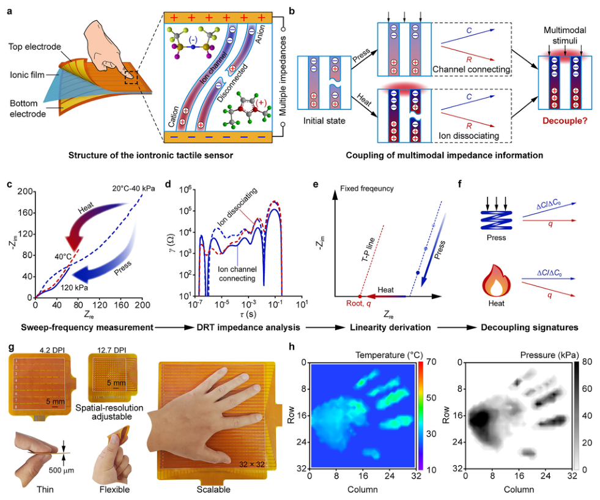
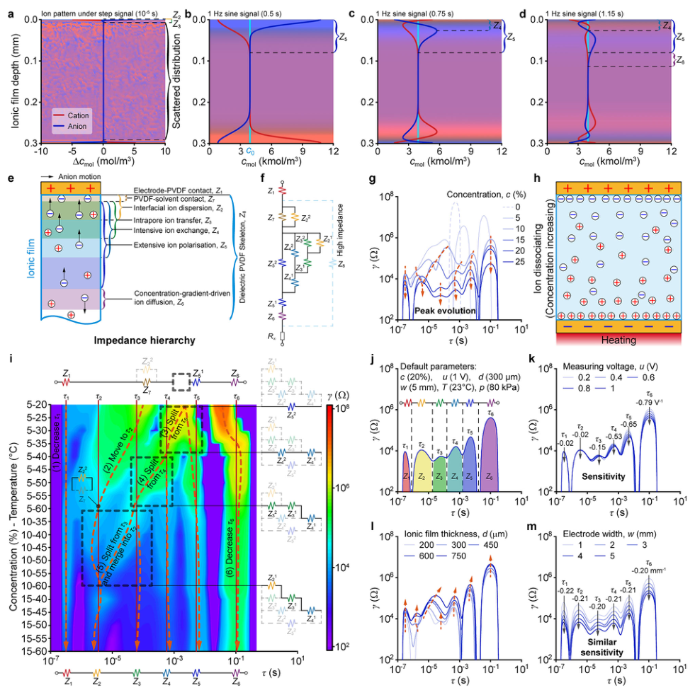
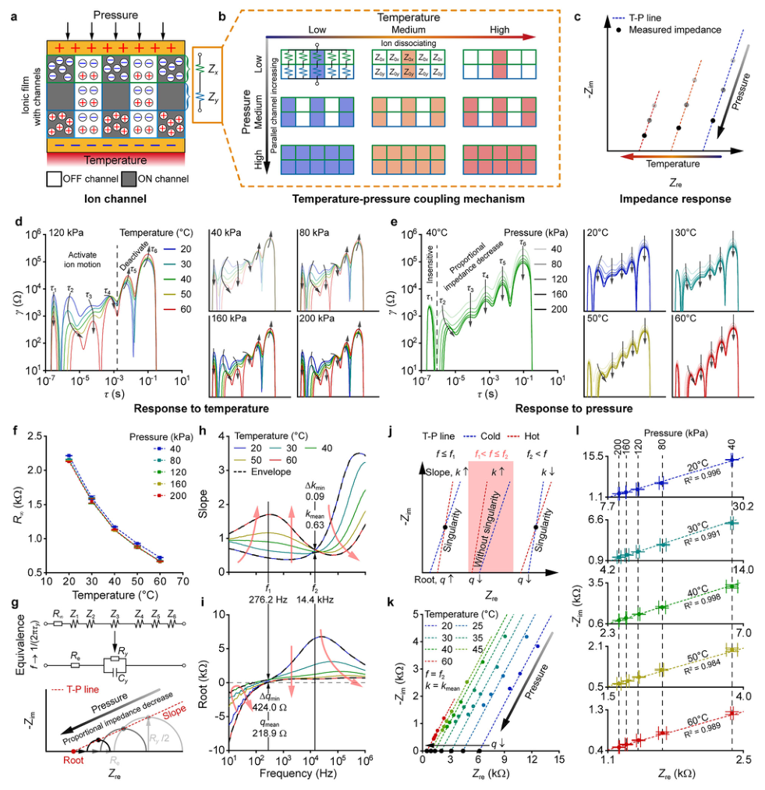
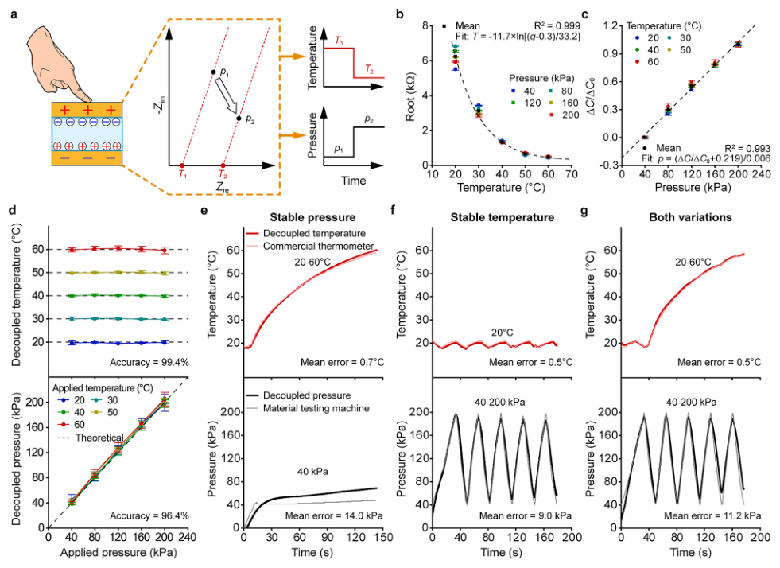
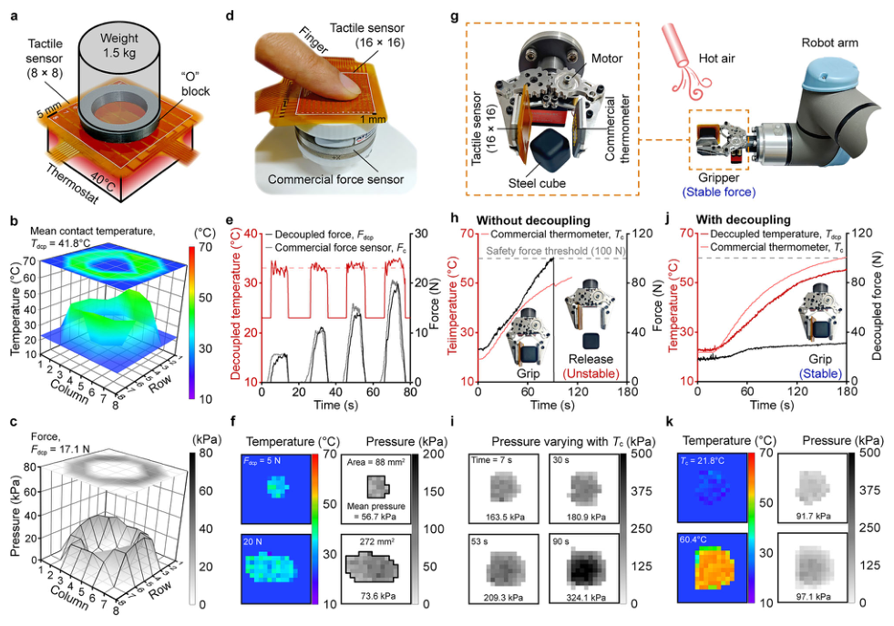

# Impedance characteristics in iontronic tactile sensors enabling intrinsic temperature-pressure decoupling

- 期刊：npj Flexible Electronics
- 日期：2026-06-17
- DOI：10.1038/s41528-026-00604-x
- 解析状态：fulltext_draft

## 摘要与研究价值

**Original:** Iontronic tactile sensors intrinsically respond to both thermal and mechanical stimuli and hold promise for skin-like multimodal tactile sensing owing to their sensitive response. However, the decoupling of temperature and pressure remains elusive due to an unclear understanding of the thermal‒mechanical‒coupled impedance characteristics, which hinders accurate pressure measurement under temperature fluctuations and limits the practical use of iontronic tactile sensors. This study elucidates the thermal-mechanical impedance characteristics of iontronic tactile sensors, by resolving nine impedance elements associated with sensor structure and ion migration pattern. Based on these insights, a thermal‒mechanical decoupling method is proposed. A temperature‒pressure linear relationship behind the impedance responses uncovers the intrinsic decoupling signatures: the pressure-insensitive root and the temperature-insensitive capacitance variation. These signatures enable high-accuracy decoupling with 99.4% for temperature and 96.4% for pressure, allowing the acquisition of temperature‒pressure distributions using tactile sensing arrays. The study lays a mechanistic foundation for iontronic sensors, opening a pathway for integrating additional modalities, such as strain and humidity, into iontronic tactile sensors.

**中文:** 可用于低离散/装配容差触觉界面的结构与对照设计；涉及 ADC 前模拟矢量、剪切/摩擦/方向相关触觉读出。摘要可核实数值包括：99.4%、96.4%。

## 创新点

- Iontronic tactile sensors intrinsically respond to both thermal and mechanical stimuli and hold promise for skin-like multimodal tactile sensing owing to their sensitive response.
- 可用于低离散/装配容差触觉界面的结构与对照设计
- 涉及 ADC 前模拟矢量、剪切/摩擦/方向相关触觉读出

## 对当前课题的启发

- 可用于低离散/装配容差触觉界面的结构与对照设计
- 涉及 ADC 前模拟矢量、剪切/摩擦/方向相关触觉读出
- 优先核查是否有 hardware output 与 software projection 的同步一致性证据

## 制备与实验步骤

### 1. 组装与封装

**Source:** p.8

**Original:** These issues can be mitigated by improving the anticreep mechanical stability of the ionic film (e.g., optimising the polymer network and encapsulation structure) and establishing a pressurecorrection model calibrated under different temperatures and loading durations to compensate for pressure nonlinearity and time-dependent drift.

**中文:** 组装与封装步骤，关键配比、时间、温度和设备参数以 p.8 原文为准。

### 2. 成膜与沉积

**Source:** p.8

**Original:** As the eigenfrequency shifts with ionic concentration, factors such as solvent evaporation, humidity, and material ageing can alter the eigenfrequency by changing the ionic concentration; a tight encapsulation can mitigate this influence.

**中文:** 成膜与沉积步骤，关键配比、时间、温度和设备参数以 p.8 原文为准。

### 3. 制备与实验操作

**Source:** p.8

**Original:** Preparation of the ionic film The preparation procedure is illustrated in Supplementary Fig. 1.

**中文:** 制备与实验操作步骤，关键配比、时间、温度和设备参数以 p.8 原文为准。

### 4. 材料混合与分散

**Source:** p.8

**Original:** Poly(- vinylidene fluoride-co-hexafluoropropylene) (PVDF-HFP, Shanghai Aichun Biological Technology) and the ionic liquid 1-ethyl-3methylimidazolium bis((trifluoromethyl)sulphonyl)imide (EMIM-TFSI, Lanzhou Greanchem) were mixed with the solvent N,N-dimethylacetamide (DMAC, Xilong Scientific).

**中文:** 材料混合与分散步骤，关键配比、时间、温度和设备参数以 p.8 原文为准。

### 5. 材料混合与分散

**Source:** p.8

**Original:** The mixture was homogenised by stirring at 300 rpm for 2 h in a 60 °C silicone oil bath using a stirrer (DF-101S, Shanghai LICHEN).

**中文:** 材料混合与分散步骤，关键配比、时间、温度和设备参数以 p.8 原文为准。

### 6. 制备与实验操作

**Source:** p.8

**Original:** Then, the solution was poured into a mould fabricated by adhering nanotapes (1 mm thickness, Sitoo) to the adhesive surface of a polyethene terephthalate (PET) release film (100 μm thickness, Huahong).

**中文:** 制备与实验操作步骤，关键配比、时间、温度和设备参数以 p.8 原文为准。

### 7. 成膜与沉积

**Source:** p.8

**Original:** The solution was then thermally cured at 120 °C for 2 h on a heating plate (TBJ-X3-XB, NBchao) to evaporate the DMAC.

**中文:** 成膜与沉积步骤，关键配比、时间、温度和设备参数以 p.8 原文为准。

### 8. 成膜与沉积

**Source:** p.8

**Original:** Consequently, if the connection of the PVDF molecular chains is loose, indicating insufficient structural stability, the solution encapsulated within the ionic film will leak out, producing a visible imprint on the PU substrate.

**中文:** 成膜与沉积步骤，关键配比、时间、温度和设备参数以 p.8 原文为准。

### 9. 成膜与沉积

**Source:** p.9

**Original:** Assembly of the iontronic tactile sensor The layout of the flexible-printed-circuit (FPC) electrode was designed using the printed circuit design software LCEDA, with predefined electrode widths and gap geometries.

**中文:** 成膜与沉积步骤，关键配比、时间、温度和设备参数以 p.9 原文为准。

### 10. 成膜与沉积

**Source:** p.9

**Original:** The FPC product, with a temperature tolerance of−20to80 °C,wasmanufacturedbytheShenzhenJLCTechnologyGroup and consists of 50-μm-thick polyimide (PI) substrates and 12-μm-thick copper (Cu) electrodes coated with 25-μm-thick gold (Au).

**中文:** 成膜与沉积步骤，关键配比、时间、温度和设备参数以 p.9 原文为准。

### 11. 组装与封装

**Source:** p.9

**Original:** The top FPC electrode, the ionic film, and the bottom FPC electrode were subsequently sandwiched together to assemble the tactile sensor.Thefinaldevicewasencapsulatedwith60-μm-thickPETscotchtape (−40 to 130 °C temperature tolerance, BENYIDA).

**中文:** 组装与封装步骤，关键配比、时间、温度和设备参数以 p.9 原文为准。

### 12. 成膜与沉积

**Source:** p.9

**Original:** The DMAC was evaporated, so the porosity was setto the experimental PVDF-ion concentration (5% in this study), and the ions were fully dissociated in the simulation.

**中文:** 成膜与沉积步骤，关键配比、时间、温度和设备参数以 p.9 原文为准。

### 13. 制备与实验操作

**Source:** p.9

**Original:** Preparation of the thermal insulator The temperature of the tactile sensor should remain stable during calibration.However,iftheheated tactilesensordirectlycontactsthecoldstainlesssteel pressing head (~15 W/m ∙K thermal conductivity39), thermal interference can be introduced.

**中文:** 制备与实验操作步骤，关键配比、时间、温度和设备参数以 p.9 原文为准。

### 14. 材料混合与分散

**Source:** p.9

**Original:** Asshown in SupplementaryFig.4, the Ecoflex precursors (00-50, Smooth-On), Part A and Part B, were mixed at a 1:1 weight ratio.

**中文:** 材料混合与分散步骤，关键配比、时间、温度和设备参数以 p.9 原文为准。

### 15. 材料混合与分散

**Source:** p.9

**Original:** After the mould filled with the mixture was degassed in a vacuum chamber (−0.05 MPa, 20 min), the Ecoflex was cured in the mould for 5 h to form a thermal insulator (witha Young’s modulus of 428.0 kPa).

**中文:** 材料混合与分散步骤，关键配比、时间、温度和设备参数以 p.9 原文为准。

## 方法原文锚点

**Source:** p.8 M001

**Original:** for directly observing local ion migration, and strategies for independently modulating individual impedance elements. The performance of the thermostat and the readout circuit will be improved to enhance the working range and dynamic response. Since temperature can affect material mechanical properties such as swelling and creep,thepressureresponse maydeteriorate atelevated temperaturesdue to creep-induced drift and pressure nonlinearity. Therefore, long-term durability under cyclic loading and continuous operation remains to be systematically evaluated. These issues can be mitigated by improving the anticreep mechanical stability of the ionic film (e.g., optimising the polymer network and encapsulation structure) and establishing a pressurecorrection model calibrated under different temperatures and loading durations to compensate for pressure nonlinearity and time-dependent drift. As the eigenfrequency shifts with ionic concentration, factors such as solvent evaporation, humidity, and material ageing can alter the eigenfrequency by changing the ionic concentration; a tight encapsulation can mitigate this influence. Additional latent factors affecting the decoupling signatures will be examined to improve the reliability. Although this study uses a PVDF-HFP/EMIM-TFSI ionic film as a model system, the proposed decoupling principle may be applicable to other iontronic systems with distinguishable thermal and mechanical impedance responses, while the DRT peak distribution, eigenfrequency, T–P line, and calibration functions should be recalibrated for each specific formulation

**中文:** 该段已进入结构化方法步骤；完整逐段翻译待智能体精读补齐。

**Source:** p.8 M002

**Original:** While this study establishes a principle for temperature‒pressure decoupling, future efforts will focus on systematically integrating multimodal iontronic sensing into practical applications. The proposed intrinsic decoupling principle may be extended to thinner multimodal sensors for space-constrained applications such as robotic skin and invasive biomedical monitoring, while the sensor structure and calibration process may require optimisation after thickness reduction. This principle also provides guidance for developing multimodal tactile sensors with higher spatial resolution (even to fibre morphology). Furthermore, the distinct stimuli‒ response characteristics among the multiple impedance elements suggest opportunities to extend iontronic tactile sensing to additional modalities such as strain and humidity.

**中文:** 该段已进入结构化方法步骤；完整逐段翻译待智能体精读补齐。

**Source:** p.8 M003

**Original:** Preparation of the ionic film The preparation procedure is illustrated in Supplementary Fig. 1. Poly(- vinylidene fluoride-co-hexafluoropropylene) (PVDF-HFP, Shanghai Aichun Biological Technology) and the ionic liquid 1-ethyl-3methylimidazolium bis((trifluoromethyl)sulphonyl)imide (EMIM-TFSI, Lanzhou Greanchem) were mixed with the solvent N,N-dimethylacetamide (DMAC, Xilong Scientific). The weight ratio of PVDF-HFP to DMAC was 1:4, ensuring complete dissolution of the PVDF-HFP. The ionic film concentration was defined as the weight percentage (%) of the ionic liquid relative to the total weight of the PVDF-HFP and the ionic liquid, i.e., the PVDF-ion concentration. The mixture was homogenised by stirring at 300 rpm for 2 h in a 60 °C silicone oil bath using a stirrer (DF-101S, Shanghai LICHEN). Then, the solution was poured into a mould fabricated by adhering nanotapes (1 mm thickness, Sitoo) to the adhesive surface of a polyethene terephthalate (PET) release film (100 μm thickness, Huahong). The mould height could be adjusted by stacking multiple nanotape layers. After the surface of the poured solution was scraped, the solution was degassed at a pressure of −0.05 MPa for 5 h in a vacuum chamber (DZF6050A, Shanghai SHKTYQ). The solution was then thermally cured at 120 °C for 2 h on a heating plate (TBJ-X3-XB, NBchao) to evaporate the DMAC. Finally, the ionic film was peeled off the PET

**中文:** 该段已进入结构化方法步骤；完整逐段翻译待智能体精读补齐。

**Source:** p.8 M004

**Original:** Characterisation of the ionic film structure The structural images of the ionic films shown in Supplementary Fig. 2a were captured using a microscope (Eclipse TI-S, Nikon). To assess the

**中文:** 该段已进入结构化方法步骤；完整逐段翻译待智能体精读补齐。

**Source:** p.9 M005

**Original:** https://doi.org/10.1038/s41528-026-00604-x Article

**中文:** 该段已进入结构化方法步骤；完整逐段翻译待智能体精读补齐。

**Source:** p.9 M006

**Original:** npj Flexible Electronics | (2026) 10:80 9

**中文:** 该段已进入结构化方法步骤；完整逐段翻译待智能体精读补齐。

**Source:** p.9 M007

**Original:** stability of the structure under pressure, a 300-μm-thick ionic film was stacked on a polyurethane (PU) substrate. A 200 g weight was then applied to the ionic film. Consequently, if the connection of the PVDF molecular chains is loose, indicating insufficient structural stability, the solution encapsulated within the ionic film will leak out, producing a visible imprint on the PU substrate. This study set the PVDF-ion concentration to below 30% to ensure the structural stability of the ionic film. This loading method qualitatively assesses the ionic film’s ability to withstand pressure, which reflects the influence of concentration on the structure of the ionic film. It provides a basic method for future analysis and optimisation of film stability under varying temperature or pressure conditions.

**中文:** 该段已进入结构化方法步骤；完整逐段翻译待智能体精读补齐。

**Source:** p.9 M008

**Original:** Assembly of the iontronic tactile sensor The layout of the flexible-printed-circuit (FPC) electrode was designed using the printed circuit design software LCEDA, with predefined electrode widths and gap geometries. The FPC product, with a temperature tolerance of−20to80 °C,wasmanufacturedbytheShenzhenJLCTechnologyGroup and consists of 50-μm-thick polyimide (PI) substrates and 12-μm-thick copper (Cu) electrodes coated with 25-μm-thick gold (Au). The impedance response of the iontronic tactile sensor originates from ion migration processes at the electrode‒film interface, making the quality of the interface contact condition critical to the performance of the tactile sensor. To ensure a uniform and clean interface contact, the electrode and ionic film surfaces were cleaned with 75% ethanol using a dust-free swab (YL-664XB, ANDAXIA). The top FPC electrode, the ionic film, and the bottom FPC electrode were subsequently sandwiched together to assemble the tactile sensor.Thefinaldevicewasencapsulatedwith60-μm-thickPETscotchtape (−40 to 130 °C temperature tolerance, BENYIDA).

**中文:** 该段已进入结构化方法步骤；完整逐段翻译待智能体精读补齐。

**Source:** p.9 M009

**Original:** Simulation of ion migration The ion migration in the ionic film was simulated using the finite element analysis software COMSOL Multiphysics (version 6.1, COMSOL), with the module “Transport of Diluted Species in Porous Media”. For the PVDF material with an electrical conductivity of 0 S/m (ideal insulator), the geometric dimensions (width, thickness, and out-of-plane thickness) of the ionic film were set to 300 μm. The DMAC was evaporated, so the porosity was setto the experimental PVDF-ion concentration (5% in this study), and the ions were fully dissociated in the simulation. According to the chemical bondlength37,thesizesofthecation( + 1charge)andtheanion(−1charge) were 0.93 nm and 0.97 nm, respectively. The initial anion and cation concentrations were the ionic liquid molarity (3893.6 mol/m3, denoted as c0 in Fig. 2b). The isotropic diffusion coefficient was set to the species-in-liquid reference value38 of1.602 × 10−9 m2/s. Boundaryconditionsassigned thetop to the electric potential and the bottom to the electrical ground. For sinesignalexcitation,theamplitudewassetto1 V,andthefrequencywas1 Hzto observe ion polarisation. For step-signal excitation, the signal was smoothed using a hyperbolic tangent (tanh) function to prevent iterating instability from discontinuous numerical transitions as:

**中文:** 该段已进入结构化方法步骤；完整逐段翻译待智能体精读补齐。

**Source:** p.9 M010

**Original:**    

**中文:** 该段已进入结构化方法步骤；完整逐段翻译待智能体精读补齐。

**Source:** p.9 M011

**Original:** Vstep

**中文:** 该段已进入结构化方法步骤；完整逐段翻译待智能体精读补齐。

**Source:** p.9 M012

**Original:** 2 1 þ tanh t  tlocation wtransition

**中文:** 该段已进入结构化方法步骤；完整逐段翻译待智能体精读补齐。

**Source:** p.9 M013

**Original:** Vsmooth ¼

**中文:** 该段已进入结构化方法步骤；完整逐段翻译待智能体精读补齐。

**Source:** p.9 M014

**Original:** ð1Þ

**中文:** 该段已进入结构化方法步骤；完整逐段翻译待智能体精读补齐。

**Source:** p.9 M015

**Original:** where Vstep is the amplitude (1 V) of the ideal step signal, tlocation is the initial time(5 × 10−5s),wtransitionisthetransitionwidth(2.5 × 10−5s)usedtoadjust the steepness, and Vsmooth is the resulting signal. The step-excited concentration distribution was analysed over the output time range of (0, 10−5s, 5 × 10−3s), during which the concentration did not change significantly, so the concentration was presented as the variation Δcmol.

**中文:** 该段已进入结构化方法步骤；完整逐段翻译待智能体精读补齐。

**Source:** p.9 M016

**Original:** Thermal stimulation The thermostat components are illustrated in Supplementary Fig. 3b. A thermoelectric (Peltier) element (TEC1-12706-12 V-51 W, Seebeck) was used as the thermal source, heating or cooling a 2-mm-thick Cu plate (as a thermal conductor). A programmable controller (XH-21540, YourCee) delivered current to the Peltier element until the thermal

**中文:** 该段已进入结构化方法步骤；完整逐段翻译待智能体精读补齐。

**Source:** p.9 M017

**Original:** conductor reached a preset temperature threshold, with the feedback of a temperature probe (XH-T110-NTC-10 k, CHADEPINGGUO). Cooling and heating modes (controlled by the parameter “P1” denoted in the controller) were switched by reversing the current polarity. The thermostat was activated when the actual temperature deviated beyond a hysteresis (“P2” denoted in the controller) from the preset temperature threshold, as shown in Supplementary Fig. 3d. Excess heat was dissipated by an aluminium heatsink (100 × 90 × 25 mm, Zave) with a fan (9025–12 V, Zave). The thermostat was powered by a 12 V switching supply (S-200-12, Weizhen). The control parameter settings for the target temperatures in this study are provided in Supplementary Table 1, which is an empirical reference at a room temperature of 23 °C and should be adjusted for specific circumstances. The temperature accuracy was evaluated using a thermometer (YET610L, YOWEXA) with a surface temperature probe (K-type, ZOTO). The tactile sensor was adhered to the thermal conductor, using double-sided tape (−40 to 80 °C temperature tolerance, 9080, 3 M) to receive thermal stimuli.

**中文:** 该段已进入结构化方法步骤；完整逐段翻译待智能体精读补齐。

**Source:** p.9 M018

**Original:** Preparation of the thermal insulator The temperature of the tactile sensor should remain stable during calibration.However,iftheheated tactilesensordirectlycontactsthecoldstainlesssteel pressing head (~15 W/m ∙K thermal conductivity39), thermal interference can be introduced. To reduce the thermal interference, as shown in Supplementary Fig. 3a, a thermal insulator made of Ecoflex (~0.2 W/m ∙K thermal conductivity40) was implemented to insulate the tactile sensor from the pressing head. Asshown in SupplementaryFig.4, the Ecoflex precursors (00-50, Smooth-On), Part A and Part B, were mixed at a 1:1 weight ratio. Then, a 2-mm-deep polylactic acid (PLA) mould was 3D-printed using a printer (A1, Bambu Lab), and the mixture was pouredinto the mould. After the mould filled with the mixture was degassed in a vacuum chamber (−0.05 MPa, 20 min), the Ecoflex was cured in the mould for 5 h to form a thermal insulator (witha Young’s modulus of 428.0 kPa). Then, the thermal insulator was adhered to the tactile sensing area. Finally, polytetrafluoroethylene (PTFE) tape (3269, Oumai) was applied to the upper surface of the thermal insulator, to prevent pressure head adhesion during mechanical stimulation.

**中文:** 该段已进入结构化方法步骤；完整逐段翻译待智能体精读补齐。

**Source:** p.9 M019

**Original:** Mechanical stimulation A material testing machine (ZQ-990B, ZHIQU) was used to apply mechanical stimuli (force or pressure). The machine controlled the force through a screw-driven pressing head, with a contact area of 10 mm × 10 mm,whichgeneratedaspecimen-deformingreactionforce.To reduce pressure shock during loading, the elastic Ecoflex thermal insulator serves another function of providing a broader deformation range than the tactile sensor itself. The pressing head moved at a speed of 0.5 mm/s (~1 kPa/s) to maintain a quasistatic tactile sensor state. For the stablepressure experiments, the machine compressed the sample (tactile sensor with a thermal insulator) until the target pressure was reached and then fixed the pressing head position during the impedance measurement. After data acquisition of a target pressure, the pressing head moved in reverse to detach the sample, and then compressed again to reach the subsequent target pressure. For the continuous-pressing experiments (Fig. 4f, g), the pressure was cycled between the preset extreme values.

**中文:** 该段已进入结构化方法步骤；完整逐段翻译待智能体精读补齐。

**Source:** p.9 M020

**Original:** Measurement of ionic film deformation The material testing machine can measure sample deformation by tracking the displacement of the pressing head. However, direct measurement of the ionic film thickness under pressure was hindered by the concurrent deformation of the elastic thermal insulator. To address this issue, this study used a micrometer (with a range of 0–12.7 mm, KOSLO) to measure the ionic film thickness. The machine pressed the micrometer supported by a sponge, as shown in Supplementary Fig. 13a, c. During the compression process, the micrometer structure deformed, introducing measurement error. Hence, to correct the systematic error, pressure-induced micrometer deformation was recorded before the ionic film was held. The ionic film

**中文:** 该段已进入结构化方法步骤；完整逐段翻译待智能体精读补齐。

**Source:** p.10 M021

**Original:** https://doi.org/10.1038/s41528-026-00604-x Article

**中文:** 该段已进入结构化方法步骤；完整逐段翻译待智能体精读补齐。

**Source:** p.10 M022

**Original:** npj Flexible Electronics | (2026) 10:80 10

**中文:** 该段已进入结构化方法步骤；完整逐段翻译待智能体精读补齐。

**Source:** p.10 M023

**Original:** thickness was subsequently calculated by subtracting the micrometer deformation from the raw measurement.

**中文:** 该段已进入结构化方法步骤；完整逐段翻译待智能体精读补齐。

**Source:** p.10 M024

**Original:** Impedance measurement The impedance parameters Rs (real part Zre) and X (imaginary part Zim) were measured using an impedance analyser (IM3570, HIOKI) with a fourterminal probe (L2000, HIOKI). The electrode ends of the tactile sensor were folded to ensure electrical contact with the four probe terminals. The measurement speed was set to “MEDIUM”. When the pressure reached the preset value, the impedance was measured once the thermostat stopped to prevent thermal shock. For the EIS frequency sweep (ranging from 4 Hz to 4 MHz) measurement, impedance sampling was initiated while the thermostat was switched OFF. For single-impedance calibration, the impedance was sampled once the temperature stabilised at the target. For the electrode width experiments (Fig. 2m and Supplementary Fig. 12c, d), to maintain consistent experimental conditions (such asionic filmproperties,electrode‒ film interface contact, and applied pressure distribution), the electrode width was adjusted by selecting channels of a tactile sensing array, and the selected rows (columns) were connected in parallel to the impedance analyser probe.

**中文:** 该段已进入结构化方法步骤；完整逐段翻译待智能体精读补齐。

**Source:** p.10 M025

**Original:** System establishment of tactile sensing arrays The tactile sensing architecture is shown in Supplementary Fig. 20. The array distribution of temperature‒pressure tactile information was measured using the readout circuit presented in our previous work41, with a measurement error of less than 20%. In this study, full-frequency EIS and DRT analyses were used for impedance-characteristic analysis, whereas practical sensing was performed by setting the sine frequency (f0) as the eigenfrequency f2 (14.4 kHz) of the tactile sensor, achieving an array sampling speed of ~12,500 units per second. Additionally, the sampling resistor (R0)ofthereadoutcircuitwassetto510Ω.Foraspecifictactilesensor,f0and R0 should be adjusted to match its impedance response, and the measurement speed may be furtherimproved by optimising the impedance-readout principle and adopting faster array-scanning strategies. However, low pressure or temperature results in high impedance of the tactile sensor, weakening the readout signal and increasing the capacitance-resistance decoupling error. Thus, this study classified the sampled impedance exceeding 100 × R0 as overload. For the overload condition, the temperature‒pressure decoupling lost reliable impedance input, so the overloaded temperature and pressure were assigned as 23 °C and 0 kPa, respectively. While the readout circuit measured impedance based on these settings, the multimodal data processing and tactile information measurement were programmed via MATLAB (R2024b, MathWorks). Then, the result was displayed in the graphical user interface (GUI) created with the MATLAB APP Designer.

**中文:** 该段已进入结构化方法步骤；完整逐段翻译待智能体精读补齐。

**Source:** p.10 M026

**Original:** Performance evaluation The array-measurement performance of a tactile sensor was evaluated with 5-mm-wide electrodes. As shown in Supplementary Fig. 22a, consistency was evaluated using eight sensing units distributedat the corner (unit 1), the inner region (units 2–4), and the edges (units 5-8). Under a specific temperature‒pressure condition, the consistency κ is evaluated based on the deviation from the mean as:

**中文:** 该段已进入结构化方法步骤；完整逐段翻译待智能体精读补齐。

**Source:** p.10 M027

**Original:** 1  j xi  x x j  

**中文:** 该段已进入结构化方法步骤；完整逐段翻译待智能体精读补齐。

**Source:** p.10 M028

**Original:** X nunitselected

**中文:** 该段已进入结构化方法步骤；完整逐段翻译待智能体精读补齐。

**Source:** p.10 M029

**Original:** κðxÞ ¼ 1 nunitselected

**中文:** 该段已进入结构化方法步骤；完整逐段翻译待智能体精读补齐。

**Source:** p.10 M030

**Original:** × 100% ð2Þ

**中文:** 该段已进入结构化方法步骤；完整逐段翻译待智能体精读补齐。

**Source:** p.10 M031

**Original:** i¼1

**中文:** 该段已进入结构化方法步骤；完整逐段翻译待智能体精读补齐。

**Source:** p.10 M032

**Original:** where nunit-selected is the number of selected units, i indicates the sensing units 1–8, and x is the evaluated item Zre or Zim. The array-measurement consistency (86.0% in Supplementary Fig. 22b) was defined as the mean of the Zre and Zim consistencies (Supplementary Fig. 22c, d).

**中文:** 该段已进入结构化方法步骤；完整逐段翻译待智能体精读补齐。

**Source:** p.10 M033

**Original:** To evaluate the minimum detectable pressure, at a stable temperature, pressure was applied to a sensing unit, and the slow pressing speed ensured that the readout circuit synchronously recorded the impedance. For realtime evaluation, after being calibrated, the tactile sensor was adhered to a

**中文:** 该段已进入结构化方法步骤；完整逐段翻译待智能体精读补齐。

**Source:** p.10 M034

**Original:** commercial force sensor (Mini40-E, INDUSTRIAL AUTOMATION). Then, while both sensors output synchronously based on a standard time (Beijing time), a finger tapped the sensing area at 0.5 Hz, facilitating the readout circuit to capture full-period signals. The response duration of the tactile sensor was used to characterise the real-time, referring to the normal force measured by the commercial sensor.

**中文:** 该段已进入结构化方法步骤；完整逐段翻译待智能体精读补齐。

**Source:** p.10 M035

**Original:** Block weighting demonstration The tactile sensor was adhered to the thermostat by masking tape (2214, 3 M), as shown in Supplementary Fig. 21. The thermometer recorded the temperature reference, and mechanical stimuli were applied using weights of 1 kg and 0.5 kg. The blocks (“C”, “N”, and “O”, ~3 g weight) were 3Dprinted using polyethene terephthalate glycol-modified (PETG). The selected block was subsequently stacked on the tactile sensor. For the stabletemperature experiment, weights were applied to the block after the thermostat reached the preset temperature. For the dynamic-temperature experiment, the thermostat started to heat after the pressure stabilised.

**中文:** 该段已进入结构化方法步骤；完整逐段翻译待智能体精读补齐。

**Source:** p.10 M036

**Original:** Finger pressing demonstration To match the impedance of the higher-spatial-resolution tactile sensor, this study adjusted the sampling resistor R0 to a higher value of 10 kΩ to amplify the sampled signal. After being calibrated, as shown in Supplementary Fig. 26, the tactile sensor was adhered to the commercial force sensor. Then, the finger pressed the tactile sensor until the commercial sensor reached the target force. The modalities were decoupled synchronously while the commercial sensor recorded data, where the infrared image was captured using a camera (K20, HIKMICRO).

**中文:** 该段已进入结构化方法步骤；完整逐段翻译待智能体精读补齐。

**Source:** p.10 M037

**Original:** Robot gripping demonstration The robot demonstration was conducted using a motor-driven (TDD8135MG, TIANKONGRC) gripper (SNM3200, MarkerBuying) mounted on a robotic arm (UR5e, Universal Robots), as shown in Supplementary Fig. 28. The gripper aperture was modulated by a controller (KSP-32, Hangzhou Xingbei Technology). To integrate the sensors into the gripper, 2-mm-thick 3D-printed PETG plates were adhered to both gripper sides to support the sensors. The tactile sensor was adhered to one side to capture distributed tactile information, whereas the thermometer detected the temperature of the opposite side. Additionally, a 2-mm-thick Ecoflex layer was adhered between the tactile sensor and the plate to achieve uniform pressure and facilitate force adjustment.

**中文:** 该段已进入结构化方法步骤；完整逐段翻译待智能体精读补齐。

**Source:** p.10 M038

**Original:** To generate thermal interference, a hot air blower (560 C, DES) served as a heat source, where the target temperature was set to 120 °C, at an air speed of 5. The gripped object was a 27-mm-long steel cube, guiding heat to both sensors. To facilitate infrared camera recording, the cube was sprayed with black paint (Matte Black, SENFINECO) to prevent thermal radiation from the environment.

**中文:** 该段已进入结构化方法步骤；完整逐段翻译待智能体精读补齐。

**Source:** p.10 M039

**Original:** During the heating experiment, the distance between the hot air outlet and the cube was 40 mm. The gripper then approached the cube, and the motor (aperture) was fixed when the gripper reached a preset position (~20 N force). Then, the hot air blower was activated to heat the cube, and the gripper released the cube when the detected force reached the safety threshold of 100 N.

**中文:** 该段已进入结构化方法步骤；完整逐段翻译待智能体精读补齐。

## 图表解读

### Fig. 1

**Source:** p.2

**Original caption:** Fig. 1 | Iontronic tactile sensor with intrinsic temperature‒pressure decoupling. a Sandwiched structure of the iontronic tactile sensor, consisting of a top electrode, an ionic film (the sensing layer), and a bottom electrode. The ionic film contains connected and disconnected ion channels, where electrically-driven ion motions generate multiple impedances. b Coupling process of multimodal impedance information. Under mechanical and thermal stimuli, either capacitance (C) or resistance (R) exhibits the same trend, which challenges the decoupling of temperature and pressure. c EIS response. Both temperature and pressure affect the measured impedance (real part Zre and imaginary part Zim), resulting in similar EIS

**中文图注:** Fig. 1 原始图注已提取；逐项含义见下方分图说明。

**Reading note:** 重点查看器件结构、材料层次、信号路径和制备流程。

- (a) 重点查看器件结构、材料层次、信号路径和制备流程。 原文：Sandwiched structure of the iontronic tactile sensor, consisting of a top electrode, an ionic film (the sensing layer), and a bottom electrode. The ionic film contains connected and disconnected ion channels, where electrically-driven ion motions generate multiple impedances
- (b) 结合正文首次引用位置和原始图注核对该图的证据角色。 原文：Coupling process of multimodal impedance information. Under mechanical and thermal stimuli, either capacitance (C) or resistance (R) exhibits the same trend, which challenges the decoupling of temperature and pressure
- (c) 重点查看标定方法、量程、误差、线性和动态响应，避免只比较单一灵敏度。 原文：EIS response. Both temperature and pressure affect the measured impedance (real part Zre and imaginary part Zim), resulting in similar EIS

### Fig. 2

**Source:** p.3

**Original caption:** Fig. 2 |Ion-migrating pattern and impedance variation with physical parameters. a Simulated pattern of intrafilm ion migration under step signal excitation. The curve represents the mean molarity cmol at each depth. Dynamic ion behaviours indicate specific impedances: interfacial ion dispersion Z2 and intrapore ion transfer Z3. The scattered distribution contributes weakly to the impedance response. Simulated pattern under sine signal excitation, indicating ion polarisation Z5 (b), counterion exchange Z4 (c), and ion diffusion Z6 (d). e Ion-migrating pattern mapped to hierarchical AC impedances, distributed across the cross-section of the iontronic tactile sensor. f Equivalent circuit model. The superscript of Z indicates the

**中文图注:** Fig. 2 原始图注已提取；逐项含义见下方分图说明。

**Reading note:** 重点查看标定方法、量程、误差、线性和动态响应，避免只比较单一灵敏度。

### Fig. 3

**Source:** p.5

**Original caption:** Fig. 3 | Impedance response to temperature and pressure. a Schematic of the ion distribution in the film channels. b Multimodal coupling mechanism. Z0 represents the impedance of the channel element. The temperature dissociates ions, and the pressure increases the quantity of parallel channels. c Linear response (T‒P line), determined by the disparate impedance-response characteristics to temperature and pressure. DRT peak responses under various temperatures (d) and pressures (e). f Electrolyte resistance R∞response, showing greater sensitivity to temperature than to pressure. g Equivalent measurement circuit and theoretical pressure response at

**中文图注:** Fig. 3 原始图注已提取；逐项含义见下方分图说明。

**Reading note:** 重点查看器件结构、材料层次、信号路径和制备流程。

- (a) 重点查看器件结构、材料层次、信号路径和制备流程。 原文：Schematic of the ion distribution in the film channels
- (b) 重点查看机制模型与实验结果是否一致，以及关键结构参数的对照关系。 原文：Multimodal coupling mechanism. Z0 represents the impedance of the channel element. The temperature dissociates ions, and the pressure increases the quantity of parallel channels
- (c) 重点查看标定方法、量程、误差、线性和动态响应，避免只比较单一灵敏度。 原文：Linear response (T‒P line), determined by the disparate impedance-response characteristics to temperature and pressure. DRT peak responses under various temperatures (d) and pressures (e). f Electrolyte resistance R∞response, showing greater sensitivity to temperature than to pressure. g Equivalent measurement circuit and theoretical pressure response at

### Fig. 4

**Source:** p.6

**Original caption:** Fig. 4 | Principle of decoupling temperature and pressure. a Schematic of the decoupling principle based on the T-P line. b Exponential relationship between root (q) and temperature (T), where the root is insensitive to pressure. c Linear relationship between ΔC/ΔC0 and pressure (p), where ΔC/ΔC0 is insensitive to temperature. d Static decoupling performance. The accuracy (a) is defined as a = 1-Rerror

**中文图注:** Fig. 4 原始图注已提取；逐项含义见下方分图说明。

**Reading note:** 重点查看器件结构、材料层次、信号路径和制备流程。

- (a) 重点查看器件结构、材料层次、信号路径和制备流程。 原文：Schematic of the decoupling principle based on the T-P line
- (b) 结合正文首次引用位置和原始图注核对该图的证据角色。 原文：Exponential relationship between root (q) and temperature (T), where the root is insensitive to pressure
- (c) 结合正文首次引用位置和原始图注核对该图的证据角色。 原文：Linear relationship between ΔC/ΔC0 and pressure (p), where ΔC/ΔC0 is insensitive to temperature
- (d) 重点查看标定方法、量程、误差、线性和动态响应，避免只比较单一灵敏度。 原文：Static decoupling performance. The accuracy (a) is defined as a = 1-Rerror

### Fig. 5

**Source:** p.7

**Original caption:** Fig. 5 | Performance and demonstration with Tactile sensing arrays. a Setup for weighting. Decoupled spatial distributions of temperature (b) and pressure (c) using an impedance-separating readout circuit42. Mean contact temperature (Tdcp) and force (Fdcp) are consistent with applied stimuli. d Setup for finger pressing, where the commercial sensor measures normal force (Fc). e Acquired temporal temperature‒ pressure signal with pressure stages of 5–20 N. The dotted red line represents the mean contact temperature. f Spatial variations of contact area and pressure during finger pressing. g Setup for robotic gripping, where hot air generates thermal

**中文图注:** Fig. 5 原始图注已提取；逐项含义见下方分图说明。

**Reading note:** 重点查看标定方法、量程、误差、线性和动态响应，避免只比较单一灵敏度。

- (b) 结合正文首次引用位置和原始图注核对该图的证据角色。 原文：and pressure
- (c) 重点查看标定方法、量程、误差、线性和动态响应，避免只比较单一灵敏度。 原文：using an impedance-separating readout circuit42. Mean contact temperature (Tdcp) and force (Fdcp) are consistent with applied stimuli. d Setup for finger pressing, where the commercial sensor measures normal force (Fc). e Acquired temporal temperature‒ pressure signal with pressure stages of 5–20
- (n) 重点查看阵列规模、空间分辨率、串扰、读出通道和空间特征表达。 原文：The dotted red line represents the mean contact temperature. f Spatial variations of contact area and pressure during finger pressing. g Setup for robotic gripping, where hot air generates thermal
