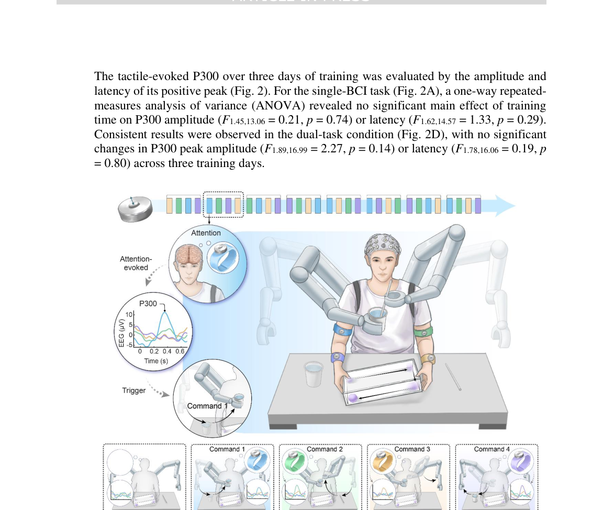
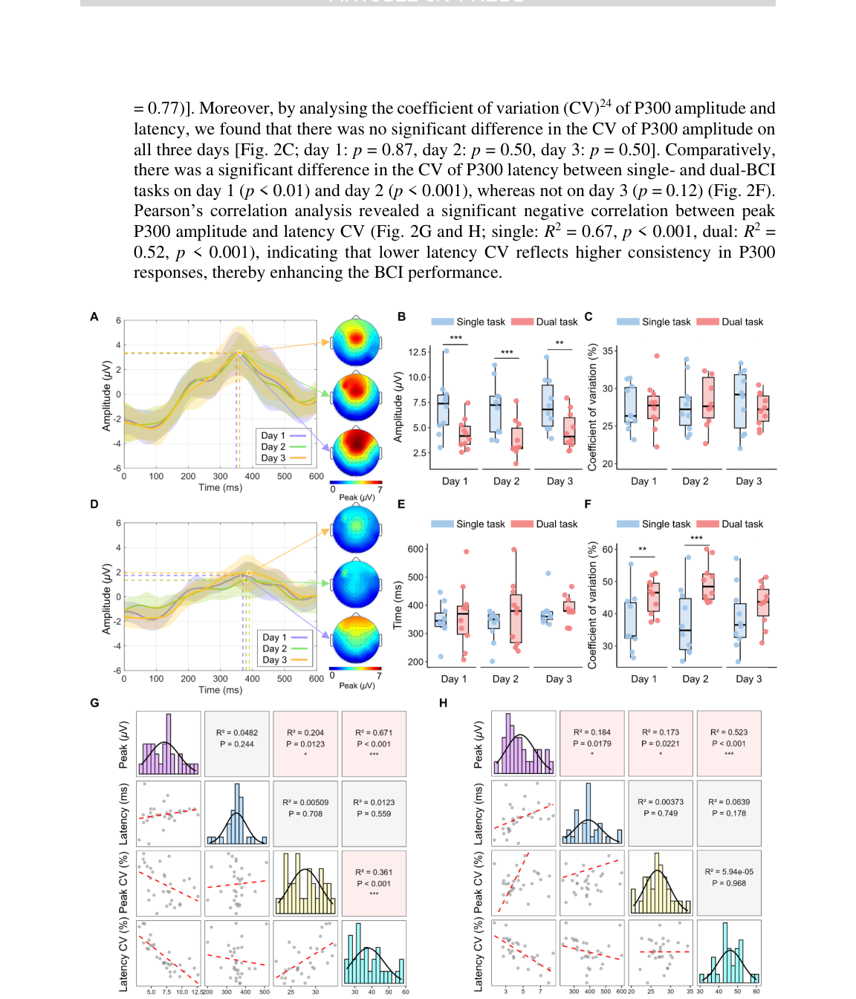
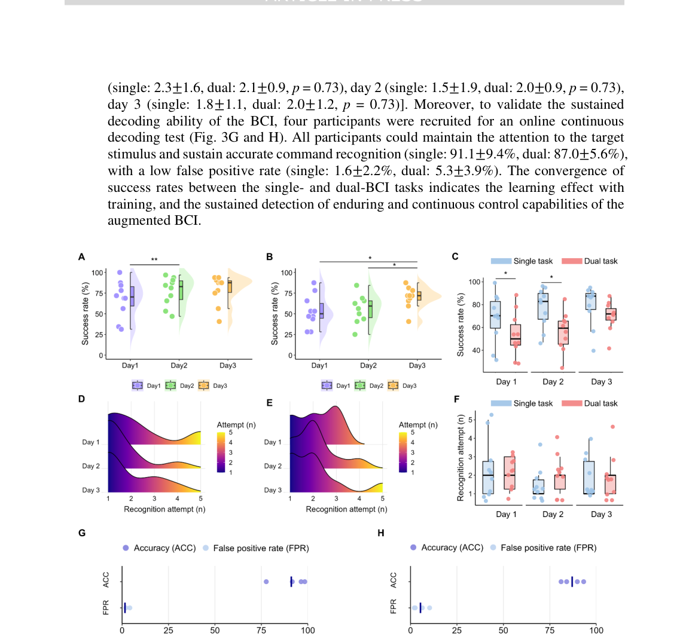
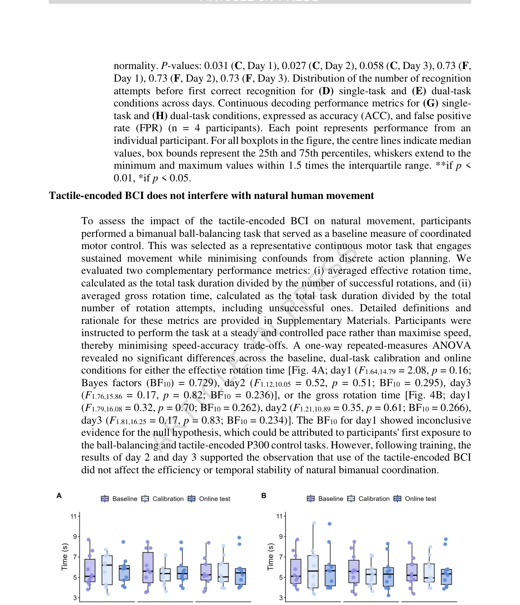
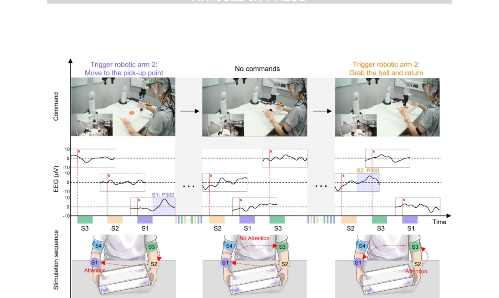

# Concurrent control of natural and robotic limbs through a tactile-encoded brain-computer interface

- 期刊：Nature Communications
- 日期：2026-07-02
- DOI：10.1038/s41467-026-75213-3
- 解析状态：fulltext_draft

## 摘要与研究价值

**Original:** Abstract Brain-computer interfaces (BCIs) promise to extend human movement capabilities by enabling direct neural control of supernumerary effectors, yet integrating augmented commands with multiple degrees of freedom without disrupting natural movement remains a key challenge. Here, we propose a tactile-encoded BCI that leverages sensory afferents through a tactile-evoked P300 paradigm, allowing reliable decoding of supernumerary motor intentions even when superimposed with voluntary actions. The interface was evaluated in a multi-day experiment comprising a single motor recognition task to validate baseline BCI performance and a dual-task paradigm to assess the potential influence between the BCI and natural human movement. The interface achieved real-time and reliable decoding of four supernumerary degrees of freedom, with significant performance improvements after three days of training. After training, performance did not differ significantly between the single-task and dual-task conditions, and natural movement remained unimpaired during concurrent supernumerary control. Lastly, the interface was deployed in a movement augmentation task, demonstrating its ability to command two supernumerary robotic arms for functional assistance during bimanual tasks. These results establish a neural interface paradigm for movement augmentation through stimulation of sensory afferents, expanding motor degrees of freedom without impairing natural movement.

**中文:** 与柔性触觉相关，但尚未显示对前端触觉计算的直接贡献。当前未从摘要提取到可比较数值。

## 创新点

- Abstract Brain-computer interfaces (BCIs) promise to extend human movement capabilities by enabling direct neural control of supernumerary effectors, yet integrating augmented commands with multiple degrees of freedom without disrupting natural movement remains a key challenge.
- 与柔性触觉相关，但尚未显示对前端触觉计算的直接贡献

## 对当前课题的启发

- 提供机器人、可穿戴或电子皮肤系统任务证据

## 制备与实验步骤

## 方法原文锚点

**Source:** p.15 M001

**Original:** Ten able-bodied participants (six males, four females, aged between 23 and 37 years) volunteered for this study. All participants were right-handed, possessed normal or corrected-to-normal vision, and had no history of neurological disorders. Two participants had BCI experience, while the others were naïve to BCI. This study was approved by the Imperial College Research Ethics Committees (ICREC reference 18IC4685). Prior to the experiment, participants received an explanation of the experiment procedure and provided signed informed consent. Potential video recording during the experiment was also approved by all participants. Consent to publish subject-identifiable information was obtained. The authors affirm that human research participants provided informed consent for publication of the images in Fig. 5, Supplementary Fig. S1, as well as Supplementary Movies S1-S4.

**中文:** 该段已进入结构化方法步骤；完整逐段翻译待智能体精读补齐。

**Source:** p.15 M002

**Original:** EEG system and vibrotactile stimulator

**中文:** 该段已进入结构化方法步骤；完整逐段翻译待智能体精读补齐。

**Source:** p.15 M003

**Original:** ARTICLE IN PRESS

**中文:** 该段已进入结构化方法步骤；完整逐段翻译待智能体精读补齐。

**Source:** p.15 M004

**Original:** EEG data were recorded at 1000 Hz using a 64-channel EEG cap and an actiCHamp Plus amplifier (Brain Products GmbH, Gilching, Germany) with a customised GUI (Supplementary Fig. S2) using MATLAB (2024a, The MathWorks Inc., Natick, MA, USA). EEG electrodes were positioned according to the international 10-10 system. A ground electrode was placed on the forehead. Electrode impedances were maintained below 5 kΩ. Event markers indicating stimulus onset and vibrator identity were transmitted via a parallel port to ensure precise alignment.

**中文:** 该段已进入结构化方法步骤；完整逐段翻译待智能体精读补齐。

**Source:** p.15 M005

**Original:** Four C2-HDLF vibrators (Engineering Acoustics Inc., Casselberry, FL, USA) were attached bilaterally to the participants’ upper and lower arms using adjustable straps (Supplementary Fig. S3). Each stimulus consisted of 200-ms bursts of vibration with 200ms interstimulus intervals. Each vibrator location was associated with a predefined command throughout the experiment. This mapping was kept consistent across participants, while the presentation order of the vibrotactile stimuli within each run was pseudorandomized according to the oddball paradigm. The vibrators were positioned symmetrically to avoid asymmetric proprioceptive cues.

**中文:** 该段已进入结构化方法步骤；完整逐段翻译待智能体精读补齐。

**Source:** p.16 M006

**Original:** ARTICLE IN PRESS

**中文:** 该段已进入结构化方法步骤；完整逐段翻译待智能体精读补齐。

**Source:** p.16 M007

**Original:** Experimental design

**中文:** 该段已进入结构化方法步骤；完整逐段翻译待智能体精读补齐。

**Source:** p.16 M008

**Original:** Baseline ball-balancing phase: At the beginning of each experimental session, participants were instructed to perform a ball-balancing task to familiarise themselves with the baseline task. Using a lightweight rectangular plastic tray (31.5 × 23.5 cm), they were instructed to roll a lightweight ball sequentially around all four corners at a steady pace. After practice, participants were required to perform a 60-second ball-balancing task for baseline task performance assessment. An overhead camera recorded the movement of the ball throughout the session. A rotation was considered successful only if the ball passed through all four corners; incomplete rotations were marked as unsuccessful.

**中文:** 该段已进入结构化方法步骤；完整逐段翻译待智能体精读补齐。

**Source:** p.16 M009

**Original:** Exploratory and calibration phase: Participants were first introduced to the tactileencoded BCI and the dual-task requirements. To familiarise themselves with the protocol, they completed one single-task and one dual-task exploratory run designed to confirm that all vibration sites were perceived consistently. In each run, one vibrator was designated as the target, and participants silently counted its activations while ignoring non-targets. During dual-task runs, the same procedure was performed while simultaneously performing the ball task. This exploratory phase ensured that participants understood the task demands before the BCI calibration phase. Calibration was conducted separately for the single-task and dual-task conditions. Four vibrators delivered stimuli in a pseudorandom order, with one designated as the attended target. Each run comprised 80 stimuli (20 targets, 60 non-targets), preserving the 1:3 target-to-non-target ratio. Three runs were completed for each of the four target locations. The calibration phase took approximately 15 minutes, and the resulting data were used to train participant-specific decoders for online testing.

**中文:** 该段已进入结构化方法步骤；完整逐段翻译待智能体精读补齐。

**Source:** p.16 M010

**Original:** ARTICLE IN PRESS

**中文:** 该段已进入结构化方法步骤；完整逐段翻译待智能体精读补齐。

**Source:** p.16 M011

**Original:** Online evaluation: Participants completed three experimental sessions on separate days. Each session included both single-task (BCI task only) and dual-task (BCI task combined with bimanual ball-balancing) conditions, with the order counterbalanced across subjects. In single-task runs, participants focused solely on the vibrotactile stimuli, whereas in dualtask runs, they performed the ball-balancing and BCI task simultaneously. For each condition, 32 online tests were conducted, with each of the four vibrators serving as the target eight times in a randomised order. At the beginning of each run, a cue displayed on the screen in front of the participant indicated the target to focus on (Supplementary Fig. S2). Participants began the ball-balancing task at their own pace following run onset. Feedback was presented on the screen, where the marker corresponding to the current decoding result was illuminated in blue.

**中文:** 该段已进入结构化方法步骤；完整逐段翻译待智能体精读补齐。

**Source:** p.16 M012

**Original:** Given that the P300 response typically requires trial averaging to achieve a detectable peak, a sliding-window approach was adopted. EEG responses evoked by four consecutive stimuli with the same vibrator were averaged and fed into the decoder. Each stimulation round consisted of four distinct vibration stimuli (one stimulus per vibrator), delivered in a pseudorandom sequence, with a total duration of 1.6 seconds per round. Due to the requirement of trial averaging, the first recognition attempt occurred after the completion of the 18th trial. Thereafter, a decoding decision was made after each set of four consecutive trials, resulting in a total of 16 attempts per run. Each of the four vibrators corresponded to one BCI command. The classifier output for each vibrator fell into one of two categories: (i) a P300 was detected (triggering the command) or (ii) no P300 was

**中文:** 该段已进入结构化方法步骤；完整逐段翻译待智能体精读补齐。

**Source:** p.17 M013

**Original:** ARTICLE IN PRESS

**中文:** 该段已进入结构化方法步骤；完整逐段翻译待智能体精读补齐。

**Source:** p.17 M014

**Original:** detected (no command output). Online testing continued until one of three outcomes occurred: (i) the target was correctly classified (success), (ii) a non-target was identified (failure: false non-target recognition), or (iii) all 80 trials were finished (failure: missed recognition). After each run, participants were given a 7 second break before the next run. The number of recognition attempts required until the target P300 was detected was recorded to represent the response time, and the number of successful online tests out of 32 tests was recorded as the success rate, serving as a metric for evaluating the responsiveness of BCI control. This online evaluation phase modelled the simultaneous control of supernumerary effectors during ongoing motor activity. The experimental protocol was repeated on three separate days to assess potential learning effects on decoding accuracy and P300 waveform modulation. To explore the feasibility of continuous decoding, four out of ten participants completed an additional test in which sustained P300 detections across sliding windows were treated as continuous control inputs. Across 80 trials, participants were instructed to maintain attention on a single target and sustain recognition for as long as possible. The indicator light remained illuminated when consecutive trials were correctly decoded.

**中文:** 该段已进入结构化方法步骤；完整逐段翻译待智能体精读补齐。

**Source:** p.17 M015

**Original:** Signal processing and BCI decoder training

**中文:** 该段已进入结构化方法步骤；完整逐段翻译待智能体精读补齐。

**Source:** p.17 M016

**Original:** ARTICLE IN PRESS

**中文:** 该段已进入结构化方法步骤；完整逐段翻译待智能体精读补齐。

**Source:** p.17 M017

**Original:** EEG pre-processing: EEG from each run was pre-processed using a standard sequence. Data were epoched from -0.1 to 0.7s relative to stimulus onset. A finite impulse response band-pass filter (1-10 Hz) and a notch filter (48-52 Hz) were applied to remove slow drifts and high-frequency noise. The signals were then re-referenced to the average of electrodes M1 and M2, placed on the mastoid processes, to reduce reference-dependent artefacts. After baseline removal, data were downsampled to 100 Hz. For each trial, the post-stimulus interval of 100-500 ms was extracted, as the P300 peaks typically appear around 300 ms20. This window emphasises the positive deflection while excluding later potentials. Due to substantial contamination from eye blinks and facial muscle artefacts, seven EEG channels over the frontal regions (Fp1, Fp2, AF7, AF3, AFz, AF4, and AF8) and two temporal electrodes (FT9, FT10) were excluded from the P300 analysis. M1, M2, and FCz, which are commonly used as references in EEG analysis, were also excluded from analysis. The remaining electrodes were all included for offline analysis, whereas those exhibiting observable P300 responses were used for online decoding.

**中文:** 该段已进入结构化方法步骤；完整逐段翻译待智能体精读补齐。

**Source:** p.17 M018

**Original:** BCI decoder calibration: At the single-trial level, the P300 ERP exhibits a low signal-tonoise ratio. To improve detectability, sliding-window averaging was applied where EEG responses from four consecutive stimuli at the same vibrator were averaged, thereby reducing random fluctuations. Feature extraction was then performed using the xDAWN algorithm45, which learns spatial filters that maximise the variance of target ERPs relative to overall variance, thereby enhancing the P300 response while suppressing background activity. The resulting spatio-temporal features were standardised and classified using a support vector machine, a method shown to perform reliably in P300 BCIs46. Classification was carried out on trial-averaged data to balance noise reduction and response latency.

**中文:** 该段已进入结构化方法步骤；完整逐段翻译待智能体精读补齐。

**Source:** p.17 M019

**Original:** P300 analysis: We analysed the P300 event-related potential. For each run, target and nontarget trials were averaged respectively within participants and then pooled to generate grand averages across the group. Channel Cz was chosen for analysis because it showed the largest P300 amplitude across all ten participants during the first calibration phase on

**中文:** 该段已进入结构化方法步骤；完整逐段翻译待智能体精读补齐。

**Source:** p.18 M020

**Original:** ARTICLE IN PRESS

**中文:** 该段已进入结构化方法步骤；完整逐段翻译待智能体精读补齐。

**Source:** p.18 M021

**Original:** Day 1, serving as a baseline. Prior studies have reported that tactile P300 amplitudes increase with training47. In this work, we tested whether comparable neurophysiological changes would emerge when the paradigm is applied to movement augmentation.

**中文:** 该段已进入结构化方法步骤；完整逐段翻译待智能体精读补齐。

**Source:** p.18 M022

**Original:** Statistics

**中文:** 该段已进入结构化方法步骤；完整逐段翻译待智能体精读补齐。

**Source:** p.18 M023

**Original:** Statistical analysis was performed using IBM SPSS Statistics and R. G*Power48 was used for a post hoc power analysis. For the online BCI performance evaluation, success rate and recognition attempt were analysed across different days and between single- and dual-task conditions. For the P300 characteristics, P300 peak amplitude and latency were analysed both across different days and between the single- and dual-task conditions. Furthermore, their CVs were compared between the two conditions. Natural movement performance was compared among the baseline, dual-task calibration test, and dual-task online test. When no differences were found among conditions, the evidence supporting the null hypothesis was quantified using Bayes factors. A one-way repeated-measures ANOVA with a Greenhouse-Geisser correction was applied with main effects of training on success rate, recognition attempt, P300 peak and latency, and natural movement performance, followed by post hoc analysis with Bonferroni correction. Two-tailed Wilcoxon signed-rank tests or two-tailed paired-sample t-tests were applied to compare BCI performance and P300 characteristics between single- and dual-task conditions with False Discovery Rate (FDR) correction for multiple comparisons, depending on whether the differences between paired observations met the assumption of normality. Pearson's correlation analysis was performed to examine the relationship of P300 characteristics, including P300 peak, latency and their CV, with two-tailed tests of significance. The statistical significance level was set to 0.05.

**中文:** 该段已进入结构化方法步骤；完整逐段翻译待智能体精读补齐。

**Source:** p.18 M024

**Original:** Ethics

**中文:** 该段已进入结构化方法步骤；完整逐段翻译待智能体精读补齐。

**Source:** p.18 M025

**Original:** Every experiment involving animals, human participants, or clinical samples have been carried out following a protocol approved by the Imperial College Research Ethics Committees. Each participant gave informed written consent.

**中文:** 该段已进入结构化方法步骤；完整逐段翻译待智能体精读补齐。

**Source:** p.18 M026

**Original:** ARTICLE IN PRESS

**中文:** 该段已进入结构化方法步骤；完整逐段翻译待智能体精读补齐。

## 图表解读

### Fig. 1

**Source:** p.5

**Original caption:** Fig. 1. Experimental setup for tactile-encoded brain-computer interface control of

**中文图注:** Fig. 1 原始图注已提取；逐项含义见下方分图说明。

**Reading note:** 结合正文首次引用位置和原始图注核对该图的证据角色。

### Fig. 2

**Source:** p.6

**Original caption:** Fig. 2. Evoked P300 underlying the tactile-encoded brain-computer interface tasks

**中文图注:** Fig. 2 原始图注已提取；逐项含义见下方分图说明。

**Reading note:** 结合正文首次引用位置和原始图注核对该图的证据角色。

### Fig. 3

**Source:** p.8

**Original caption:** Fig. 3. Participant-level online performance of tactile-encoded brain-computer

**中文图注:** Fig. 3 原始图注已提取；逐项含义见下方分图说明。

**Reading note:** 结合正文首次引用位置和原始图注核对该图的证据角色。

### Fig. 4

**Source:** p.9

**Original caption:** Fig. 4. Performance of ball-balancing task. (A) Averaged effective rotation time, and

**中文图注:** Fig. 4 原始图注已提取；逐项含义见下方分图说明。

**Reading note:** 结合正文首次引用位置和原始图注核对该图的证据角色。

- (a) 结合正文首次引用位置和原始图注核对该图的证据角色。 原文：Averaged effective rotation time, and

### Fig. 5

**Source:** p.11

**Original caption:** Fig. 5. Demonstration of online robotic arm control using tactile-encoded brain-

**中文图注:** Fig. 5 原始图注已提取；逐项含义见下方分图说明。

**Reading note:** 重点查看任务设置、基线、消融和失败案例，判断系统演示是否真正支撑前端价值。
