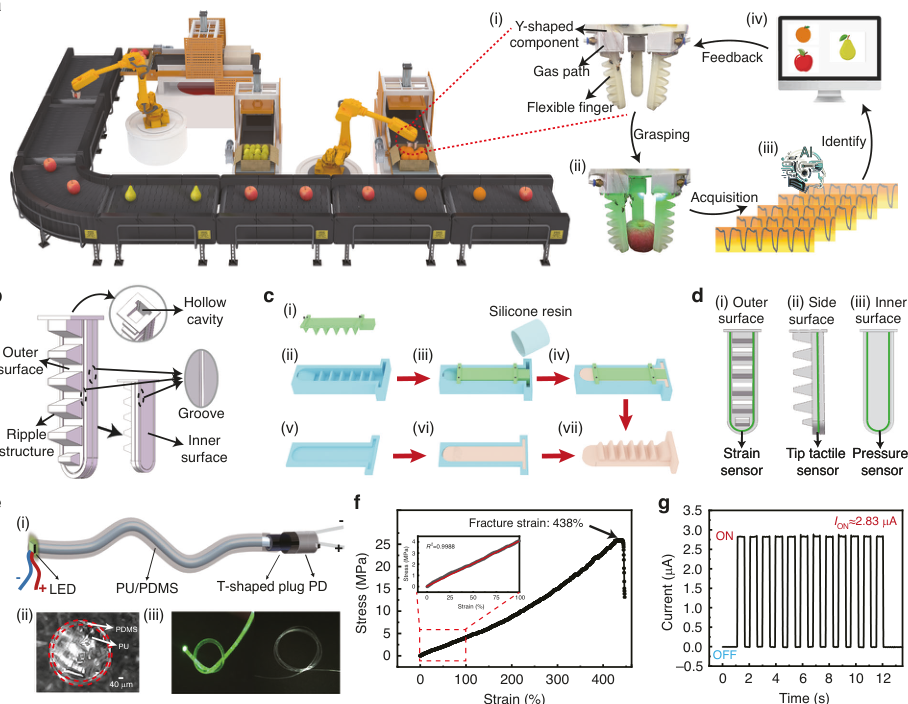
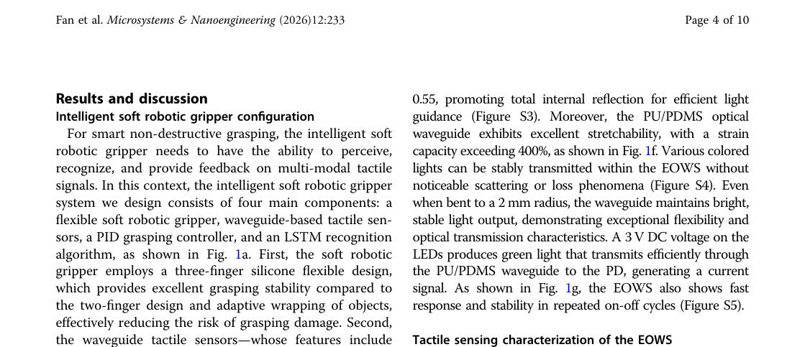
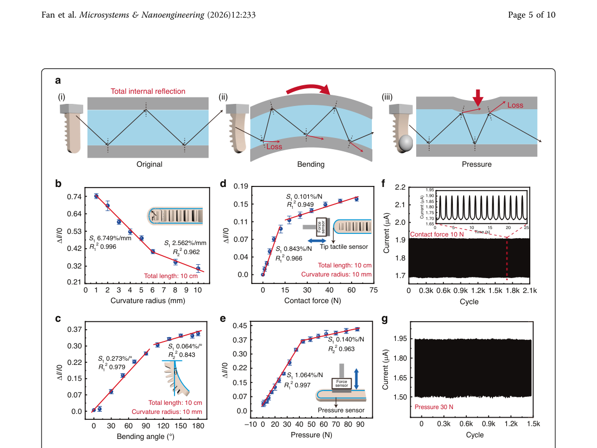
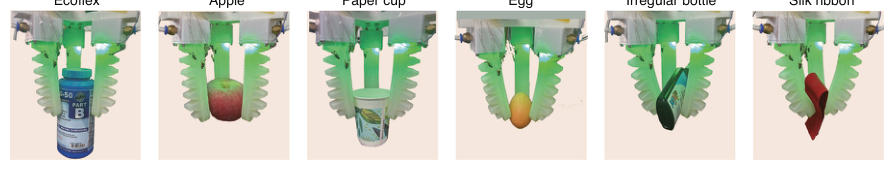
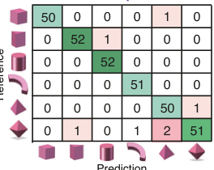
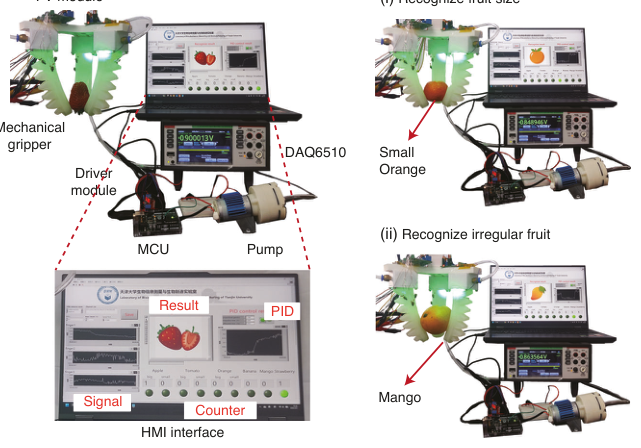

# Intelligent soft robotic gripper for non-destructive grasping and attribute recognition via multi-modal waveguide tactile sensors

- 期刊：Microsystems & Nanoengineering
- 日期：2026-06-15
- DOI：10.1038/s41378-026-01364-4
- 解析状态：fulltext_draft

## 摘要与研究价值

**Original:** Abstract The intelligent soft robotic gripper integrated with tactile sensors significantly enhances the robot’s execution capabilities in complex tasks, resolving critical shortcomings of traditional mechanical grippers—namely, fragile item breakage from rigid impacts, irregular object slippage, and inefficiency due to recognition errors. While electrical sensors (e.g ., piezoresistive, capacitive) struggle with structural complexity, signal crosstalk, and environmental interference, optical waveguide tactile sensing offers superior sensitivity, rapid dynamics, and electromagnetic immunity. However, existing waveguide tactile systems face two key limitations: millimeter-scale waveguides cause beam divergence, limiting deformation sensitivity and complicating heterogeneous integration. Additionally, critical gaps remain in adaptive grasping control and contextual object recognition during manipulation. Herein, we present a soft robotic gripper integrated with slender elastic optical waveguide sensors (EOWS) and equipped with a closed-loop feedback control module to achieve intelligent grasping and object attribute recognition. The hand comprises three flexible silicone fingers, each finger seamlessly integrates three EOWS for multi-modal tactile sensing. These sensors exhibit high sensitivity to bending angle (0.273%/°), contact force (0.843%/N), and pressure (1.064%/N). Furthermore, a PID adaptive grasping control strategy and a long short-term memory (LSTM) deep learning algorithm are introduced to dynamically adjust the grasping force and intelligently recognize object attributes such as shape, size, and hardness, with accuracies exceeding 97% for each attribute. Ultimately, experimental validation via a smart fruit-sorting system highlights the platform’s potential for precision agriculture, intelligent logistics, and medical robotics, demonstrating robust, adaptive manipulation in real-world applications.

**中文:** 涉及 ADC 前模拟矢量、剪切/摩擦/方向相关触觉读出；涉及坏点、漂移、跨器件迁移或少样本校准。摘要可核实数值包括：0.273%、0.843%、1.064%、97%。

## 创新点

- Abstract The intelligent soft robotic gripper integrated with tactile sensors significantly enhances the robot’s execution capabilities in complex tasks, resolving critical shortcomings of traditional mechanical grippers—namely, fragile item breakage from rigid impacts, irregular object slippage, and inefficiency due to recognition errors.
- 涉及 ADC 前模拟矢量、剪切/摩擦/方向相关触觉读出
- 涉及坏点、漂移、跨器件迁移或少样本校准
- 提供机器人、可穿戴或电子皮肤系统任务证据

## 对当前课题的启发

- 涉及 ADC 前模拟矢量、剪切/摩擦/方向相关触觉读出
- 涉及坏点、漂移、跨器件迁移或少样本校准
- 优先核查是否有 hardware output 与 software projection 的同步一致性证据
- 可对照 raw pixel、software feature 与 physical projection 的性能/通道/功耗

## 制备与实验步骤

### 1. 制备与实验操作

**Source:** p.2

**Original:** Fabrication of EOWS First, PU elastic fibers were ultrasonically cleaned in anhydrous ethanol and deionized water sequentially, and then dried for later use.

**中文:** 制备与实验操作步骤，关键配比、时间、温度和设备参数以 p.2 原文为准。

### 2. 制备与实验操作

**Source:** p.2

**Original:** Then, a low-refractive-index PDMS solution was prepared at a 20:1 precursor-tocuring-agent ratio and vacuum-degassed.

**中文:** 制备与实验操作步骤，关键配比、时间、温度和设备参数以 p.2 原文为准。

### 3. 成膜与沉积

**Source:** p.2

**Original:** Next, the cleaned PU fibers were dip-coated in the PDMS solution, vertically placed for 1 h to ensure uniform cladding flow, and then dried at 60°C for 2 h to achieve complete PDMS cladding curing.

**中文:** 成膜与沉积步骤，关键配比、时间、温度和设备参数以 p.2 原文为准。

### 4. 成膜与沉积

**Source:** p.2

**Original:** Fabrication of the intelligent soft robotic gripper First, 3D-printed finger molds (Fig. 1c) are poured with silicone into the molds, vacuum-degassed, and naturally cured for 24 h before demolding.

**中文:** 成膜与沉积步骤，关键配比、时间、温度和设备参数以 p.2 原文为准。

### 5. 组装与封装

**Source:** p.2

**Original:** Then, the upper and lower sections were bonded with silicone adhesive to form flexible fingers with hollow pneumatic chambers.

**中文:** 组装与封装步骤，关键配比、时间、温度和设备参数以 p.2 原文为准。

### 6. 固化与热处理

**Source:** p.2

**Original:** Next, the diameter of 500 μm of EOWS was embedded into grooves on the finger’s outer, side, and inner surfaces using tweezers, encapsulated with silicone, vacuumdegassed, and cured.

**中文:** 固化与热处理步骤，关键配比、时间、温度和设备参数以 p.2 原文为准。

### 7. 组装与封装

**Source:** p.2

**Original:** Finally, three flexible fingers were fixed at 120° intervals on a Y-shaped bracket to assemble the intelligent soft robotic gripper.

**中文:** 组装与封装步骤，关键配比、时间、温度和设备参数以 p.2 原文为准。

### 8. 图形化与结构成形

**Source:** p.3

**Original:** (i-ii) mold for the outer surface of flexible finger, (iii) pour silicone into the mold, (iv) cure at room temperature, (v) mold for the inner surface of flexible finger, (vi) pour silicone into the mold and cure, (vii) bond with silicone adhesive after demolding.

**中文:** 图形化与结构成形步骤，关键配比、时间、温度和设备参数以 p.3 原文为准。

### 9. 制备与实验操作

**Source:** p.3

**Original:** c Fabrication process of the flexible finger.

**中文:** 制备与实验操作步骤，关键配比、时间、温度和设备参数以 p.3 原文为准。

## 方法原文锚点

**Source:** p.2 M001

**Original:** The PU fiber substrate (diameter: 0.5 mm, refractive index: 1.52) was purchased from Shengyi Plastic Insulation Materials Co., Ltd., China. PDMS was purchased from Chemart Chemical Technology Co., Ltd., Tianjin, China. The LED microchip (0.5 mm*0.5 mm) was purchased from Shengyuan Electronics Co., Ltd., Shenzhen, China. The photodiode (LSSPD-1.2-2P-03) was purchased from Minguang Technology Co., Ltd., Beijing, China. The T-shaped plug was obtained from Poroclor Co., Ltd., Shenzhen, China. The UV ultraviolet light-curing adhesive (UV-20) was purchased from Yinghuoban Technology Co., Ltd., Wenzhou, China.

**中文:** 该段已进入结构化方法步骤；完整逐段翻译待智能体精读补齐。

**Source:** p.2 M002

**Original:** Fabrication of EOWS

**中文:** 该段已进入结构化方法步骤；完整逐段翻译待智能体精读补齐。

**Source:** p.2 M003

**Original:** First, PU elastic fibers were ultrasonically cleaned in anhydrous ethanol and deionized water sequentially, and then dried for later use. Then, a low-refractive-index PDMS solution was prepared at a 20:1 precursor-tocuring-agent ratio and vacuum-degassed. Next, the cleaned PU fibers were dip-coated in the PDMS solution, vertically placed for 1 h to ensure uniform cladding flow, and then dried at 60°C for 2 h to achieve complete PDMS cladding curing. Finally, one end of the PU/PDMS waveguide was coupled to an LED microchip with UVcurable adhesive, and the other end was connected to a photodiode via a T-shaped plug.

**中文:** 该段已进入结构化方法步骤；完整逐段翻译待智能体精读补齐。

**Source:** p.2 M004

**Original:** Fabrication of the intelligent soft robotic gripper

**中文:** 该段已进入结构化方法步骤；完整逐段翻译待智能体精读补齐。

**Source:** p.2 M005

**Original:** First, 3D-printed finger molds (Fig. 1c) are poured with silicone into the molds, vacuum-degassed, and naturally cured for 24 h before demolding. Then, the upper and lower sections were bonded with silicone adhesive to form flexible fingers with hollow pneumatic chambers. Next, the diameter of 500 μm of EOWS was embedded into grooves on the finger’s outer, side, and inner surfaces using tweezers, encapsulated with silicone, vacuumdegassed, and cured. Finally, three flexible fingers were fixed at 120° intervals on a Y-shaped bracket to assemble the intelligent soft robotic gripper.

**中文:** 该段已进入结构化方法步骤；完整逐段翻译待智能体精读补齐。

**Source:** p.2 M006

**Original:** Characterization and electrical measurements

**中文:** 该段已进入结构化方法步骤；完整逐段翻译待智能体精读补齐。

**Source:** p.2 M007

**Original:** The periodic strain was provided by linear motors (Linmot E1100, LinMot, Inc., Elkhorn, WI, USA). The constant pressure value was provided through the Vernier double-range force sensor (Vernier Science Education, Beaverton, OR, USA). The electrical performance was measured by a programmable electrometer (Keithley 6514, Keithley Instruments, Cleveland, OH, USA). Data

**中文:** 该段已进入结构化方法步骤；完整逐段翻译待智能体精读补齐。

**Source:** p.3 M008

**Original:** Fan et al. Microsystems & Nanoengineering (2026) 12:233 Page 3 of 10

**中文:** 该段已进入结构化方法步骤；完整逐段翻译待智能体精读补齐。

**Source:** p.3 M009

**Original:** (ii) (iii) (iv)

**中文:** 该段已进入结构化方法步骤；完整逐段翻译待智能体精读补齐。

**Source:** p.3 M010

**Original:** (v) (vi) (vii)

**中文:** 该段已进入结构化方法步骤；完整逐段翻译待智能体精读补齐。

**Source:** p.3 M011

**Original:** f g

**中文:** 该段已进入结构化方法步骤；完整逐段翻译待智能体精读补齐。

**Source:** p.3 M012

**Original:** Strain (%) 0 25 50 75 100

**中文:** 该段已进入结构化方法步骤；完整逐段翻译待智能体精读补齐。

**Source:** p.3 M013

**Original:** Strain (%) 0 100 200 300 400

**中文:** 该段已进入结构化方法步骤；完整逐段翻译待智能体精读补齐。

**Source:** p.3 M014

**Original:** Fig. 1 Intelligent soft robotic gripper configuration. a Conceptual diagram illustrating the intelligent grasping system of soft robotic grippers for non-destructive grasping and attribute recognition of fruits, irregularly shaped packages, and hazardous materials. (i) soft robotic gripper structure, (ii) multi-modal tactile signal collection, (iii) LSTM deep learning algorithm, and (iv) intelligent recognition display. b Structural design of the flexible finger. (i-ii) mold for the outer surface of flexible finger, (iii) pour silicone into the mold, (iv) cure at room temperature, (v) mold for the inner surface of flexible finger, (vi) pour silicone into the mold and cure, (vii) bond with silicone adhesive after demolding. c Fabrication process of the flexible finger. d EOWS configurations of the flexible finger on the (i) outer surface, (ii) side surface, and (iii) inner surface for the detection of bending angle, contact force, and pressure, respectively. e (i) structural design, (ii) cross-sectional optical micrograph, and (iii) knotted and coiled states of the EOWS. f Stressstrain curve of the EOWS, exhibiting a stretchability exceeding 400%. g On-off electrical signal response of the EOWS under 3 V DC actuation

**中文:** 该段已进入结构化方法步骤；完整逐段翻译待智能体精读补齐。

**Source:** p.3 M015

**Original:** a

**中文:** 该段已进入结构化方法步骤；完整逐段翻译待智能体精读补齐。

**Source:** p.3 M016

**Original:** b c

**中文:** 该段已进入结构化方法步骤；完整逐段翻译待智能体精读补齐。

**Source:** p.3 M017

**Original:** Hollow

**中文:** 该段已进入结构化方法步骤；完整逐段翻译待智能体精读补齐。

**Source:** p.3 M018

**Original:** (i)

**中文:** 该段已进入结构化方法步骤；完整逐段翻译待智能体精读补齐。

**Source:** p.3 M019

**Original:** cavity

**中文:** 该段已进入结构化方法步骤；完整逐段翻译待智能体精读补齐。

**Source:** p.3 M020

**Original:** Outer surface

**中文:** 该段已进入结构化方法步骤；完整逐段翻译待智能体精读补齐。

**Source:** p.3 M021

**Original:** Groove

**中文:** 该段已进入结构化方法步骤；完整逐段翻译待智能体精读补齐。

**Source:** p.3 M022

**Original:** Ripple structure

**中文:** 该段已进入结构化方法步骤；完整逐段翻译待智能体精读补齐。

**Source:** p.3 M023

**Original:** Inner surface

**中文:** 该段已进入结构化方法步骤；完整逐段翻译待智能体精读补齐。

**Source:** p.3 M024

**Original:** e

**中文:** 该段已进入结构化方法步骤；完整逐段翻译待智能体精读补齐。

**Source:** p.3 M025

**Original:** -

**中文:** 该段已进入结构化方法步骤；完整逐段翻译待智能体精读补齐。

**Source:** p.3 M026

**Original:** (i)

**中文:** 该段已进入结构化方法步骤；完整逐段翻译待智能体精读补齐。

**Source:** p.3 M027

**Original:** 25

**中文:** 该段已进入结构化方法步骤；完整逐段翻译待智能体精读补齐。

**Source:** p.3 M028

**Original:** 4 R 2=0.9988

**中文:** 该段已进入结构化方法步骤；完整逐段翻译待智能体精读补齐。

**Source:** p.3 M029

**Original:** +

**中文:** 该段已进入结构化方法步骤；完整逐段翻译待智能体精读补齐。

**Source:** p.3 M030

**Original:** Stress (MPa)

**中文:** 该段已进入结构化方法步骤；完整逐段翻译待智能体精读补齐。

**Source:** p.3 M031

**Original:** 3

**中文:** 该段已进入结构化方法步骤；完整逐段翻译待智能体精读补齐。

**Source:** p.3 M032

**Original:** Stress (MPa)

**中文:** 该段已进入结构化方法步骤；完整逐段翻译待智能体精读补齐。

**Source:** p.3 M033

**Original:** 20

**中文:** 该段已进入结构化方法步骤；完整逐段翻译待智能体精读补齐。

**Source:** p.3 M034

**Original:** 2

**中文:** 该段已进入结构化方法步骤；完整逐段翻译待智能体精读补齐。

**Source:** p.3 M035

**Original:** - + LED PD T-shaped plug PU/PDMS

**中文:** 该段已进入结构化方法步骤；完整逐段翻译待智能体精读补齐。

**Source:** p.3 M036

**Original:** 1

**中文:** 该段已进入结构化方法步骤；完整逐段翻译待智能体精读补齐。

**Source:** p.3 M037

**Original:** 15

**中文:** 该段已进入结构化方法步骤；完整逐段翻译待智能体精读补齐。

**Source:** p.3 M038

**Original:** 0

**中文:** 该段已进入结构化方法步骤；完整逐段翻译待智能体精读补齐。

**Source:** p.3 M039

**Original:** 10

**中文:** 该段已进入结构化方法步骤；完整逐段翻译待智能体精读补齐。

**Source:** p.3 M040

**Original:** (ii) (iii)

**中文:** 该段已进入结构化方法步骤；完整逐段翻译待智能体精读补齐。

**Source:** p.3 M041

**Original:** PDMS

**中文:** 该段已进入结构化方法步骤；完整逐段翻译待智能体精读补齐。

**Source:** p.3 M042

**Original:** 5

**中文:** 该段已进入结构化方法步骤；完整逐段翻译待智能体精读补齐。

**Source:** p.3 M043

**Original:** PU

**中文:** 该段已进入结构化方法步骤；完整逐段翻译待智能体精读补齐。

**Source:** p.3 M044

**Original:** 0

**中文:** 该段已进入结构化方法步骤；完整逐段翻译待智能体精读补齐。

**Source:** p.3 M045

**Original:** 40 m

**中文:** 该段已进入结构化方法步骤；完整逐段翻译待智能体精读补齐。

**Source:** p.3 M046

**Original:** was recorded by software written in LabVIEW. Multichannel data was measured through the data acquisition unit (Keithley DAQ6510, Keithley Instruments, Cleveland, OH, USA).

**中文:** 该段已进入结构化方法步骤；完整逐段翻译待智能体精读补齐。

**Source:** p.3 M047

**Original:** I-V transimpedance amplifier conversion circuit

**中文:** 该段已进入结构化方法步骤；完整逐段翻译待智能体精读补齐。

**Source:** p.3 M048

**Original:** As shown in Figure S13, the I-V transimpedance amplifier conversion circuit board is equipped with an AD825 operational amplifier and an LF353 operational amplifier. With a maximum gain of 1.2 × 107, this circuit enables the conversion and amplification of weak currentto-voltage signals, facilitating efficient data acquisition by the DAQ6510.

**中文:** 该段已进入结构化方法步骤；完整逐段翻译待智能体精读补齐。

**Source:** p.3 M049

**Original:** (iv)

**中文:** 该段已进入结构化方法步骤；完整逐段翻译待智能体精读补齐。

**Source:** p.3 M050

**Original:** (i)

**中文:** 该段已进入结构化方法步骤；完整逐段翻译待智能体精读补齐。

**Source:** p.3 M051

**Original:** Y-shaped component

**中文:** 该段已进入结构化方法步骤；完整逐段翻译待智能体精读补齐。

**Source:** p.3 M052

**Original:** Feedback

**中文:** 该段已进入结构化方法步骤；完整逐段翻译待智能体精读补齐。

**Source:** p.3 M053

**Original:** Gas path

**中文:** 该段已进入结构化方法步骤；完整逐段翻译待智能体精读补齐。

**Source:** p.3 M054

**Original:** Flexible finger

**中文:** 该段已进入结构化方法步骤；完整逐段翻译待智能体精读补齐。

**Source:** p.3 M055

**Original:** Grasping

**中文:** 该段已进入结构化方法步骤；完整逐段翻译待智能体精读补齐。

**Source:** p.3 M056

**Original:** Identify

**中文:** 该段已进入结构化方法步骤；完整逐段翻译待智能体精读补齐。

**Source:** p.3 M057

**Original:** (iii)

**中文:** 该段已进入结构化方法步骤；完整逐段翻译待智能体精读补齐。

**Source:** p.3 M058

**Original:** Al Al

**中文:** 该段已进入结构化方法步骤；完整逐段翻译待智能体精读补齐。

**Source:** p.3 M059

**Original:** (ii)

**中文:** 该段已进入结构化方法步骤；完整逐段翻译待智能体精读补齐。

**Source:** p.3 M060

**Original:** Acquisition

**中文:** 该段已进入结构化方法步骤；完整逐段翻译待智能体精读补齐。

**Source:** p.3 M061

**Original:** d

**中文:** 该段已进入结构化方法步骤；完整逐段翻译待智能体精读补齐。

**Source:** p.3 M062

**Original:** (i) Outer

**中文:** 该段已进入结构化方法步骤；完整逐段翻译待智能体精读补齐。

**Source:** p.3 M063

**Original:** (iii) Inner

**中文:** 该段已进入结构化方法步骤；完整逐段翻译待智能体精读补齐。

**Source:** p.3 M064

**Original:** (ii) Side

**中文:** 该段已进入结构化方法步骤；完整逐段翻译待智能体精读补齐。

**Source:** p.3 M065

**Original:** Silicone resin

**中文:** 该段已进入结构化方法步骤；完整逐段翻译待智能体精读补齐。

**Source:** p.3 M066

**Original:** surface

**中文:** 该段已进入结构化方法步骤；完整逐段翻译待智能体精读补齐。

**Source:** p.3 M067

**Original:** surface

**中文:** 该段已进入结构化方法步骤；完整逐段翻译待智能体精读补齐。

**Source:** p.3 M068

**Original:** surface

**中文:** 该段已进入结构化方法步骤；完整逐段翻译待智能体精读补齐。

**Source:** p.3 M069

**Original:** Tip tactile

**中文:** 该段已进入结构化方法步骤；完整逐段翻译待智能体精读补齐。

**Source:** p.3 M070

**Original:** Pressure

**中文:** 该段已进入结构化方法步骤；完整逐段翻译待智能体精读补齐。

**Source:** p.3 M071

**Original:** sensor Strain sensor

**中文:** 该段已进入结构化方法步骤；完整逐段翻译待智能体精读补齐。

**Source:** p.3 M072

**Original:** Tip tactile

**中文:** 该段已进入结构化方法步骤；完整逐段翻译待智能体精读补齐。

**Source:** p.3 M073

**Original:** Pressure

**中文:** 该段已进入结构化方法步骤；完整逐段翻译待智能体精读补齐。

**Source:** p.3 M074

**Original:** sensor Strain sensor

**中文:** 该段已进入结构化方法步骤；完整逐段翻译待智能体精读补齐。

**Source:** p.3 M075

**Original:** sensor

**中文:** 该段已进入结构化方法步骤；完整逐段翻译待智能体精读补齐。

**Source:** p.3 M076

**Original:** sensor

**中文:** 该段已进入结构化方法步骤；完整逐段翻译待智能体精读补齐。

**Source:** p.3 M077

**Original:** 0.0 0.5 1.0 1.5 2.0 2.5 3.0 3.5

**中文:** 该段已进入结构化方法步骤；完整逐段翻译待智能体精读补齐。

**Source:** p.3 M078

**Original:** ION≈2.83 A

**中文:** 该段已进入结构化方法步骤；完整逐段翻译待智能体精读补齐。

**Source:** p.3 M079

**Original:** Fracture strain: 438%

**中文:** 该段已进入结构化方法步骤；完整逐段翻译待智能体精读补齐。

**Source:** p.3 M080

**Original:** ON

**中文:** 该段已进入结构化方法步骤；完整逐段翻译待智能体精读补齐。

**Source:** p.3 M081

**Original:** Current (A)

**中文:** 该段已进入结构化方法步骤；完整逐段翻译待智能体精读补齐。

**Source:** p.3 M082

**Original:** OFF

**中文:** 该段已进入结构化方法步骤；完整逐段翻译待智能体精读补齐。

**Source:** p.3 M083

**Original:** –0.5

**中文:** 该段已进入结构化方法步骤；完整逐段翻译待智能体精读补齐。

**Source:** p.3 M084

**Original:** 12

**中文:** 该段已进入结构化方法步骤；完整逐段翻译待智能体精读补齐。

**Source:** p.3 M085

**Original:** 0 2 4 6 8 10 Time (s)

**中文:** 该段已进入结构化方法步骤；完整逐段翻译待智能体精读补齐。

**Source:** p.3 M086

**Original:** LSTM algorithm for intelligent attributes recognition

**中文:** 该段已进入结构化方法步骤；完整逐段翻译待智能体精读补齐。

**Source:** p.3 M087

**Original:** LSTM algorithm data set configuration: 1) Data collection: A total of 16 objects were included, with each object being grasped at least 200 times, each lasting 5 s. 2) Training and testing: Of the samples in the data set, 80% were used for training, while the remaining 20% were used for testing. To ensure the stability and reliability of the model, the S-fold cross-validation method was employed, and the training set (80%) was randomly divided into five parts. To prevent overfitting of the model, the ADAM optimizer and L2 regularization were utilized for optimization. This data set facilitates accurate classification and recognition of object attributes.

**中文:** 该段已进入结构化方法步骤；完整逐段翻译待智能体精读补齐。

**Source:** p.4 M088

**Original:** Fan et al. Microsystems & Nanoengineering (2026) 12:233 Page 4 of 10

**中文:** 该段已进入结构化方法步骤；完整逐段翻译待智能体精读补齐。

## 图表解读

### Fig. 1

**Source:** p.3

**Original caption:** Fig. 1 Intelligent soft robotic gripper configuration. a Conceptual diagram illustrating the intelligent grasping system of soft robotic grippers for non-destructive grasping and attribute recognition of fruits, irregularly shaped packages, and hazardous materials. (i) soft robotic gripper structure, (ii) multi-modal tactile signal collection, (iii) LSTM deep learning algorithm, and (iv) intelligent recognition display. b Structural design of the flexible finger. (i-ii) mold for the outer surface of flexible finger, (iii) pour silicone into the mold, (iv) cure at room temperature, (v) mold for the inner surface of flexible finger, (vi) pour silicone into the mold and cure, (vii) bond with silicone adhesive after demolding. c Fabrication process of the flexible finger. d EOWS configurations of the flexible finger on the (i) outer surface, (ii) side surface, and (iii) inner surface for the detection of bending angle, contact force, and pressure, respectively. e (i) structural design, (ii) cross-sectional optical micrograph, and (iii) knotted and coiled states of the EOWS. f Stressstrain curve of the EOWS, exhibiting a stretchability exceeding 400%. g On-off electrical signal response of the EOWS under 3 V DC actuation

**中文图注:** Fig. 1 原始图注已提取；逐项含义见下方分图说明。

**Reading note:** 重点查看器件结构、材料层次、信号路径和制备流程。

- (a) 重点查看器件结构、材料层次、信号路径和制备流程。 原文：Conceptual diagram illustrating the intelligent grasping system of soft robotic grippers for non-destructive grasping and attribute recognition of fruits, irregularly shaped packages, and hazardous materials. (i) soft robotic gripper structure, (ii) multi-modal tactile signal collection, (iii) LSTM deep learning algorithm, and (iv) intelligent recognition display
- (b) 结合正文首次引用位置和原始图注核对该图的证据角色。 原文：Structural design of the flexible finger. (i-ii) mold for the outer surface of flexible finger, (iii) pour silicone into the mold, (iv) cure at room temperature, (v) mold for the inner surface of flexible finger, (vi) pour silicone into the mold and cure, (vii) bond with silicone adhesive after demolding
- (c) 重点查看器件结构、材料层次、信号路径和制备流程。 原文：Fabrication process of the flexible finger
- (d) 重点查看标定方法、量程、误差、线性和动态响应，避免只比较单一灵敏度。 原文：EOWS configurations of the flexible finger on the (i) outer surface, (ii) side surface, and (iii) inner surface for the detection of bending angle, contact force, and pressure, respectively
- (e) 结合正文首次引用位置和原始图注核对该图的证据角色。 原文：(i) structural design, (ii) cross-sectional optical micrograph, and (iii) knotted and coiled states of the EOWS
- (f) 结合正文首次引用位置和原始图注核对该图的证据角色。 原文：Stressstrain curve of the EOWS, exhibiting a stretchability exceeding 400%
- (g) 重点查看标定方法、量程、误差、线性和动态响应，避免只比较单一灵敏度。 原文：On-off electrical signal response of the EOWS under 3 V DC actuation

### Figure 2A

**Source:** p.4

**Original caption:** Figure 2a shows the EOWS sensing mechanism. Under mechanical stimuli such as strain, bending, or pressure, the sensor undergoes controlled deformation (Figure S6), causing axial deviation of the light-guiding path and systematic variation of the incident angle. According to the principle of total internal reflection, when the incident angle is less than the critical angle, some light can’t be totally within the waveguide and escapes, leading to light loss. Therefore, by detecting the loss current variation caused by this light loss, highsensitivity sensing of the mechanical stimuli can be achieved.

**中文图注:** Figure 2A 原始图注已提取；逐项含义见下方分图说明。

**Reading note:** 重点查看标定方法、量程、误差、线性和动态响应，避免只比较单一灵敏度。

### Fig. 2

**Source:** p.5

**Original caption:** Fig. 2 Tactile sensing characterization of the EOWS. a Sensing mechanisms of the EOWS for (i) original, (ii) bending, and (iii) pressure conditions. b Response of the EOWS to different curvature radii ranging from 1 mm to 10 mm. c Response of the EOWS to different bending angles ranging from 0° to 180° at a curvature radius of 10 mm. d Response of the EOWS to different contact forces ranging from 0 to 65 N at a curvature radius of 10 mm and a bending angle of 0°. e Response of the EOWS to different pressures ranging from 0 to 90 N at a curvature radius of 10 mm and a bending angle of 0°. f Stability of the EOWS at a curvature radius of 10 mm, a bending angle of 0°, and a contact force of 10 N. g Stability of the EOWS at a curvature radius of 10 mm, a bending angle of 0°, and a pressure of 30 N

**中文图注:** Fig. 2 原始图注已提取；逐项含义见下方分图说明。

**Reading note:** 重点查看标定方法、量程、误差、线性和动态响应，避免只比较单一灵敏度。

- (a) 重点查看机制模型与实验结果是否一致，以及关键结构参数的对照关系。 原文：Sensing mechanisms of the EOWS for (i) original, (ii) bending, and (iii) pressure conditions
- (b) 重点查看标定方法、量程、误差、线性和动态响应，避免只比较单一灵敏度。 原文：Response of the EOWS to different curvature radii ranging from 1 mm to 10 mm
- (c) 重点查看标定方法、量程、误差、线性和动态响应，避免只比较单一灵敏度。 原文：Response of the EOWS to different bending angles ranging from 0° to 180° at a curvature radius of 10 mm
- (d) 重点查看标定方法、量程、误差、线性和动态响应，避免只比较单一灵敏度。 原文：Response of the EOWS to different contact forces ranging from 0 to 65 N at a curvature radius of 10 mm and a bending angle of 0°
- (e) 重点查看标定方法、量程、误差、线性和动态响应，避免只比较单一灵敏度。 原文：Response of the EOWS to different pressures ranging from 0 to 90 N at a curvature radius of 10 mm and a bending angle of 0°
- (f) 重点查看标定方法、量程、误差、线性和动态响应，避免只比较单一灵敏度。 原文：Stability of the EOWS at a curvature radius of 10 mm, a bending angle of 0°, and a contact force of 10 N
- (g) 结合正文首次引用位置和原始图注核对该图的证据角色。 原文：Stability of the EOWS at a curvature radius of 10 mm, a bending angle of 0°, and a pressure of 30 N

### Fig. 3

**Source:** p.7

**Original caption:** Fig. 3 Closed-loop feedback grasping control of intelligent soft robotic gripper. a The closed-loop closed-loop feedback grasping control system architecture, which includes the pneumatic actuation module, data acquisition module, and PID controller. b Schematic diagram of the PID closed-loop feedback grasping control logic. c During multiple grasps of a 5 cm sphere, the multi-modal tactile voltage signals output by the EOWS are used for PID parameter tuning, with the optimal parameters ultimately determined as KP = 1.1, KI = 0.009, and KD = 0.003. d Under the optimal PID parameters, the step response curve of PID controller. e The voltage response curve of the soft robotic gripper during adaptive grasping of an egg (at critical grasping force. f Demonstration of the adaptive grasping performance of the intelligent soft robotic gripper on various objects

**中文图注:** Fig. 3 原始图注已提取；逐项含义见下方分图说明。

**Reading note:** 重点查看器件结构、材料层次、信号路径和制备流程。

- (a) 重点查看器件结构、材料层次、信号路径和制备流程。 原文：The closed-loop closed-loop feedback grasping control system architecture, which includes the pneumatic actuation module, data acquisition module, and PID controller
- (b) 重点查看器件结构、材料层次、信号路径和制备流程。 原文：Schematic diagram of the PID closed-loop feedback grasping control logic
- (c) 重点查看任务设置、基线、消融和失败案例，判断系统演示是否真正支撑前端价值。 原文：During multiple grasps of a 5 cm sphere, the multi-modal tactile voltage signals output by the EOWS are used for PID parameter tuning, with the optimal parameters ultimately determined as KP = 1.1, KI = 0.009, and KD = 0.003
- (d) 重点查看标定方法、量程、误差、线性和动态响应，避免只比较单一灵敏度。 原文：Under the optimal PID parameters, the step response curve of PID controller
- (e) 重点查看标定方法、量程、误差、线性和动态响应，避免只比较单一灵敏度。 原文：The voltage response curve of the soft robotic gripper during adaptive grasping of an egg (at critical grasping force
- (f) 重点查看任务设置、基线、消融和失败案例，判断系统演示是否真正支撑前端价值。 原文：Demonstration of the adaptive grasping performance of the intelligent soft robotic gripper on various objects

### Fig. 4

**Source:** p.8

**Original caption:** Fig. 4 Intelligent attributes recognition algorithm via LSTM deep learning. a Network architecture of the LSTM algorithm. b, c Confusion matrix and recognition accuracy for 6 different shapes using the LSTM algorithm, resulting in an average accuracy of 98.08% (Fold 3). d, e Confusion matrix and recognition accuracy for 6 different sizes of spheres using the LSTM algorithm, resulting in an average accuracy of 100%. f, g Confusion matrix and recognition accuracy for 6 different hardness levels of Shore blocks using the LSTM algorithm, resulting in an average accuracy of 97.99% (Fold 2)

**中文图注:** Fig. 4 原始图注已提取；逐项含义见下方分图说明。

**Reading note:** 重点查看器件结构、材料层次、信号路径和制备流程。

- (a) 重点查看器件结构、材料层次、信号路径和制备流程。 原文：Network architecture of the LSTM algorithm
- (b,c) 重点查看任务设置、基线、消融和失败案例，判断系统演示是否真正支撑前端价值。 原文：Confusion matrix and recognition accuracy for 6 different shapes using the LSTM algorithm, resulting in an average accuracy of 98.08% (Fold 3)
- (d,e) 重点查看任务设置、基线、消融和失败案例，判断系统演示是否真正支撑前端价值。 原文：Confusion matrix and recognition accuracy for 6 different sizes of spheres using the LSTM algorithm, resulting in an average accuracy of 100%
- (f,g) 重点查看任务设置、基线、消融和失败案例，判断系统演示是否真正支撑前端价值。 原文：Confusion matrix and recognition accuracy for 6 different hardness levels of Shore blocks using the LSTM algorithm, resulting in an average accuracy of 97.99% (Fold 2)

### Fig. 5

**Source:** p.9

**Original caption:** Fig. 5 Application of intelligent soft robotic gripper in smart sorting system. a Workflow diagram of the smart fruits sorting system via the intelligent soft robotic gripper. b Demonstration of non-destructive fruit grasping and species recognition based on the intelligent soft robotic gripper system. c Demonstration of intelligent recognition of fruit sizes and irregular shapes

**中文图注:** Fig. 5 原始图注已提取；逐项含义见下方分图说明。

**Reading note:** 重点查看任务设置、基线、消融和失败案例，判断系统演示是否真正支撑前端价值。

- (a) 重点查看任务设置、基线、消融和失败案例，判断系统演示是否真正支撑前端价值。 原文：Workflow diagram of the smart fruits sorting system via the intelligent soft robotic gripper
- (b) 重点查看任务设置、基线、消融和失败案例，判断系统演示是否真正支撑前端价值。 原文：Demonstration of non-destructive fruit grasping and species recognition based on the intelligent soft robotic gripper system
- (c) 重点查看任务设置、基线、消融和失败案例，判断系统演示是否真正支撑前端价值。 原文：Demonstration of intelligent recognition of fruit sizes and irregular shapes
