# Single-Pixel Tactile Skin via compressive sampling

- 期刊：Communications Engineering
- 日期：2026-06-03
- DOI：10.1038/s44172-026-00697-2
- 解析状态：fulltext_draft

## 摘要与研究价值

**Original:** Large-area, high-speed tactile skins could improve robotics, prosthetics, and human-machine interfaces, but scaling them is limited by wiring complexity and readout bandwidth. We introduce Single-Pixel Tactile Skin (SPTS), a flexible, daisy-chainable tactile array that implements compressive sampling directly in hardware. Each sensing element uses a miniature low-cost microcontroller to apply programmable analog weights, while all pixel currents are summed into a single output channel. Repeating this process yields global projections from which tactile images are reconstructed using sparse recovery, reducing the measurements required relative to raster scanning. In a 10×10 array, SPTS achieved ≥98% object classification accuracy with 20 measurements, corresponding to an effective 3500 FPS, and captured an 8 ms projectile impact in 23 reconstructed frames. Because reconstruction quality improves progressively with measurement count, SPTS can rapidly localize contact from sparse data and refine tactile images over time, enabling scalable, responsive tactile sensing for physical interaction and control.

**中文:** 涉及 in-sensor/物理计算或可编程触觉前端；涉及低冗余阵列、空间特征或读出通道压缩。摘要可核实数值包括：98%、3500 FPS、8 ms。

## 创新点

- Large-area, high-speed tactile skins could improve robotics, prosthetics, and human-machine interfaces, but scaling them is limited by wiring complexity and readout bandwidth.
- 涉及 in-sensor/物理计算或可编程触觉前端
- 涉及低冗余阵列、空间特征或读出通道压缩

## 对当前课题的启发

- 涉及 in-sensor/物理计算或可编程触觉前端
- 涉及低冗余阵列、空间特征或读出通道压缩
- 可对照 raw pixel、software feature 与 physical projection 的性能/通道/功耗

## 制备与实验步骤

### 1. 材料混合与分散

**Source:** p.2

**Original:** CS works by linearly mixing sensor outputs into a small number of global measurements, exploiting signal sparsity to reconstruct the full signal with high fidelity.

**中文:** 材料混合与分散步骤，关键配比、时间、温度和设备参数以 p.2 原文为准。

### 2. 图形化与结构成形

**Source:** p.2

**Original:** Tactile interactions exhibit significant spatiotemporal sparsity and structured patterns [25], [26] which makes them highly compressible.

**中文:** 图形化与结构成形步骤，关键配比、时间、温度和设备参数以 p.2 原文为准。

### 3. 图形化与结构成形

**Source:** p.3

**Original:** The conceptual process of SPTS, where the tactile pressure pattern is multiplied by a series of pseudorandom weight masks (Φ).

**中文:** 图形化与结构成形步骤，关键配比、时间、温度和设备参数以 p.3 原文为准。

### 4. 成膜与沉积

**Source:** p.4

**Original:** Compressed sensing is achieved by dedicating a low-cost small footprint microcontroller for each pixel of the tactile array and programming it to output a sequence of random analog voltages defined by a pre-loaded random seed which is loaded by a globally shared I2C bus.

**中文:** 成膜与沉积步骤，关键配比、时间、温度和设备参数以 p.4 原文为准。

### 5. 成膜与沉积

**Source:** p.5

**Original:** Each pixel of SPTS uses a low-cost, small-footprint microcontroller (ATtiny412) to produce a pseudorandom driving voltage for each sensing pixel.

**中文:** 成膜与沉积步骤，关键配比、时间、温度和设备参数以 p.5 原文为准。

### 6. 成膜与沉积

**Source:** p.5

**Original:** To quantitatively evaluate these capabilities, we assessed SPTS performance using a diverse library of 17 objects, encompassing common household items and 3D-printed geometric shapes.

**中文:** 成膜与沉积步骤，关键配比、时间、温度和设备参数以 p.5 原文为准。

### 7. 成膜与沉积

**Source:** p.7

**Original:** UR5 indented 17 different daily and 3D printed objects in the tactile sensor array.

**中文:** 成膜与沉积步骤，关键配比、时间、温度和设备参数以 p.7 原文为准。

### 8. 固化与热处理

**Source:** p.12

**Original:** This hierarchical information processing allows for a paradigm where a robot could, for example, prioritize initial contact localization to secure a grip, followed by subsequent refinement to a higherresolution tactile image by acquiring and processing additional measurements (M=25 for <1-pixel localization error) to discern finer object features.

**中文:** 固化与热处理步骤，关键配比、时间、温度和设备参数以 p.12 原文为准。

### 9. 成膜与沉积

**Source:** p.12

**Original:** The Single-Pixel Tactile Skin (SPTS) was constructed using modular, flexible printed circuit board (FPCB) units.

**中文:** 成膜与沉积步骤，关键配比、时间、温度和设备参数以 p.12 原文为准。

### 10. 成膜与沉积

**Source:** p.12

**Original:** These electrodes are then uniformly coated with a piezoresistive layer of Velostat (3M).

**中文:** 成膜与沉积步骤，关键配比、时间、温度和设备参数以 p.12 原文为准。

## 方法原文锚点

**Source:** p.2 M001

**Original:** An alternative approach is compressed sensing (CS), which offers the potential to reduce both hardware and computational requirements. CS works by linearly mixing sensor outputs into a small number of global measurements, exploiting signal sparsity to reconstruct the full signal with high fidelity. This paradigm has already shown success in applications like high-speed imaging [16] and low-power sensing systems [17]. However, applying CS to large-area tactile sensing has remained largely impractical. Traditional CS implementations require individual electrical access to each sensor element for encoding, which is incompatible with flexible, large-area tactile skins due to wiring and packaging complexity. As a result, most prior work in compressive tactile sensing remains limited to simulations [18], [19], [20], [21], [22] or very small-scale rigid setups [23], [24].

**中文:** 该段已进入结构化方法步骤；完整逐段翻译待智能体精读补齐。

**Source:** p.2 M002

**Original:** Despite these challenges, tactile signals are inherently well-suited for compressive sampling. Tactile interactions exhibit significant spatiotemporal sparsity and structured patterns [25], [26] which makes them highly compressible.

**中文:** 该段已进入结构化方法步骤；完整逐段翻译待智能体精读补齐。

**Source:** p.3 M003

**Original:** Figure 1. Single-Pixel Tactile Skin. A. Single-pixel tactile skin configured as a 10x10 tactile sensor matrix, with N=100 pixels. B. SPTS cells output a random projection of the tactile signal onto a single output wire. C. A lowcost, low-rate ADC captures the projection measurements over time obtaining a few measurements M that is significantly less than the total number of sensors N . D. Sparse recovery algorithm calculates the reconstructed tactile image with N pixels using the projection matrix used for obtaining y measurements and a pre-collected tactile dictionary. E. The conceptual process of SPTS, where the tactile pressure pattern is multiplied by a series of pseudorandom weight masks (Φ). Each multiplication yields a 'single-pixel' summed output (y), representing a unique random projection of the image. A small number of these successive measurements (M<<N) are then used to reconstruct the entire tactile image.

**中文:** 该段已进入结构化方法步骤；完整逐段翻译待智能体精读补齐。

**Source:** p.4 M004

**Original:** Compressed sensing is achieved by dedicating a low-cost small footprint microcontroller for each pixel of the tactile array and programming it to output a sequence of random analog voltages defined by a pre-loaded random seed which is loaded by a globally shared I2C bus. A shared clock signal, which sets the overall measurement rate of the system, tells the sensors when to progress to their next analog voltage value.

**中文:** 该段已进入结构化方法步骤；完整逐段翻译待智能体精读补齐。

**Source:** p.5 M005

**Original:** Figure 2. SPTS Sensors and Readout. A. SPTS covering the UR5 robotic arm. Zoom-in shows the front and back of a single ‘cell’. B. Each pixel of SPTS uses a low-cost, small-footprint microcontroller (ATtiny412) to produce a pseudorandom driving voltage for each sensing pixel. An amplifier circuit centers the voltage at 0V to ensure the voltage sum does not contain a high DC offset. The output of each tactile sensor is wired together, and sensor output is combined using a summing circuit. SPTS cells are daisy-chained together to share an I2C bus for loading random seeds and share a ‘CLOCK’ signal that cycles the cells to proceed to the next random driving voltage signal.

**中文:** 该段已进入结构化方法步骤；完整逐段翻译待智能体精读补齐。

**Source:** p.5 M006

**Original:** The reduced number of measurements (M) inherent to the SPTS design directly translates to accelerated object reconstruction and classification without a significant compromise in accuracy. To quantitatively evaluate these capabilities, we assessed SPTS performance using a diverse library of 17 objects, encompassing common household items and 3D-printed geometric shapes. As depicted in Figure 3A, these objects were systematically indented into the SPTS sensor array by a robotic arm (Universal Robots UR5 Robot). For each object, 10 indentation trials were conducted, acquiring data in SPTS mode across various compressive measurement levels (M) and, for control, using a traditional raster-scan mode.

**中文:** 该段已进入结构化方法步骤；完整逐段翻译待智能体精读补齐。

**Source:** p.7 M007

**Original:** Figure 3. Rapid Tactile Reconstruction and Classification. A. UR5 indented 17 different daily and 3D printed objects in the tactile sensor array. Data was collected using SPTS-mode at different measurement levels and also raster-scan mode as a control. B. Overall accuracy of SPTS in object classification. Raster-scanned signal was down-sampled and interpolated to achieve equivalent comparison points. C. Overall accuracy of SPTS in reconstructing the support of the indented object compared to equivalent interpolated down-sampled raster-scan image. D. Frequency of reconstruction, in kilohertz, using different measurement levels for SPTS. E. Rapid classification of object at initial contact using low measurement levels. M=25 can classify the indented object within 0.4msec of data collection with 80% accuracy.

**中文:** 该段已进入结构化方法步骤；完整逐段翻译待智能体精读补齐。

**Source:** p.12 M008

**Original:** approximate location of contact across the entire array, long before a full scan could be completed. This hierarchical information processing allows for a paradigm where a robot could, for example, prioritize initial contact localization to secure a grip, followed by subsequent refinement to a higherresolution tactile image by acquiring and processing additional measurements (M=25 for <1-pixel localization error) to discern finer object features. This hierarchical information processing mirrors efficiencies found in biological sensory systems [27], [28] and offers a flexible paradigm for resource-constrained robotic perception. The potential to refine reconstructions by cumulating measurements, as suggested by the improved classification with M=50 at t=0.8ms, points towards implementations of "anytime" sensing algorithms, where information quality improves continuously with available sensing time or measurement count, a valuable feature for dynamic decision-making.

**中文:** 该段已进入结构化方法步骤；完整逐段翻译待智能体精读补齐。

**Source:** p.12 M009

**Original:** The Single-Pixel Tactile Skin (SPTS) was constructed using modular, flexible printed circuit board (FPCB) units. Each FPCB unit hosts four individual sensor pixels. A single sensor pixel comprises an ATtiny412 microcontroller (Microchip Technology) and a TLV9362 operational amplifier (Texas Instruments) with associated passive components. This op-amp circuit is configured to amplify, level-shift, and directly drive the sensor element with the microcontroller's processed DAC output. The microcontroller is programmed to generate unipolar analog voltages (0 to 3.3V) via its DAC. This DAC output serves as the input to the op-amp circuit, which transforms it into a bipolar weighting voltage spanning approximately -3.3V to +3.3V. This transformation is crucial to ensure that the sequence of pseudorandom weighting voltages has a mean close to zero, preventing DC offset accumulation in the subsequent analog summation stage, and to utilize a wider dynamic range for encoding.

**中文:** 该段已进入结构化方法步骤；完整逐段翻译待智能体精读补齐。

**Source:** p.12 M010

**Original:** The sensing element itself is integrated on the reverse side of the FPCB with interdigitated copper electrodes. These electrodes are then uniformly coated with a piezoresistive layer of Velostat (3M).

**中文:** 该段已进入结构化方法步骤；完整逐段翻译待智能体精读补齐。

## 图表解读

### Figure 1

**Source:** p.3

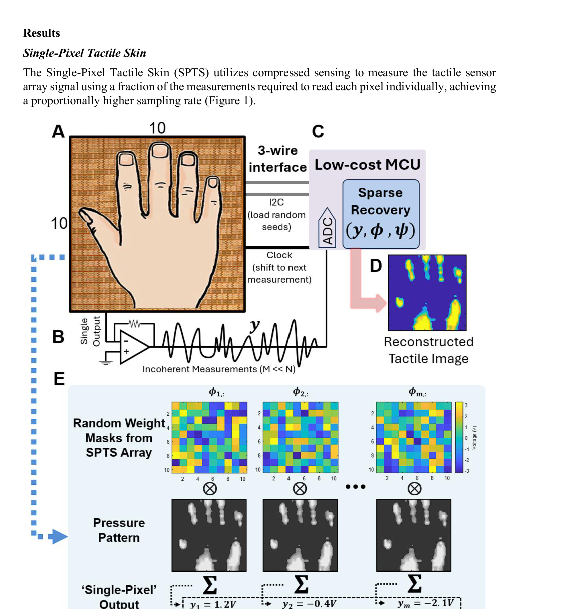

**Original caption:** Figure 1. Single-Pixel Tactile Skin. A. Single-pixel tactile skin configured as a 10x10 tactile sensor matrix, with N=100 pixels. B. SPTS cells output a random projection of the tactile signal onto a single output wire. C. A lowcost, low-rate ADC captures the projection measurements over time obtaining a few measurements M that is significantly less than the total number of sensors N . D. Sparse recovery algorithm calculates the reconstructed tactile image with N pixels using the projection matrix used for obtaining y measurements and a pre-collected tactile dictionary. E. The conceptual process of SPTS, where the tactile pressure pattern is multiplied by a series of pseudorandom weight masks (Φ). Each multiplication yields a 'single-pixel' summed output (y), representing a unique random projection of the image. A small number of these successive measurements (M<<N) are then used to reconstruct the entire tactile image.

**中文图注:** Figure 1 原始图注已提取；逐项含义见下方分图说明。

**Reading note:** 重点查看阵列规模、空间分辨率、串扰、读出通道和空间特征表达。

- (a) 重点查看阵列规模、空间分辨率、串扰、读出通道和空间特征表达。 原文：Single-pixel tactile skin configured as a 10x10 tactile sensor matrix, with N=100 pixels
- (b) 结合正文首次引用位置和原始图注核对该图的证据角色。 原文：SPTS cells output a random projection of the tactile signal onto a single output wire
- (c) 结合正文首次引用位置和原始图注核对该图的证据角色。 原文：A lowcost, low-rate ADC captures the projection measurements over time obtaining a few measurements M that is significantly less than the total number of sensors N
- (d) 重点查看阵列规模、空间分辨率、串扰、读出通道和空间特征表达。 原文：Sparse recovery algorithm calculates the reconstructed tactile image with N pixels using the projection matrix used for obtaining y measurements and a pre-collected tactile dictionary
- (e) 重点查看阵列规模、空间分辨率、串扰、读出通道和空间特征表达。 原文：The conceptual process of SPTS, where the tactile pressure pattern is multiplied by a series of pseudorandom weight masks (Φ). Each multiplication yields a 'single-pixel' summed output (y), representing a unique random projection of the image. A small number of these successive measurements (M<<N) are then used to reconstruct the entire tactile image

### Figure 2

**Source:** p.5

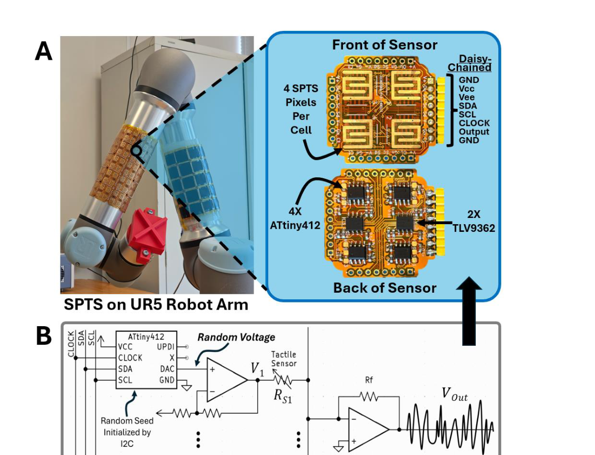

**Original caption:** Figure 2. SPTS Sensors and Readout. A. SPTS covering the UR5 robotic arm. Zoom-in shows the front and back of a single ‘cell’. B. Each pixel of SPTS uses a low-cost, small-footprint microcontroller (ATtiny412) to produce a pseudorandom driving voltage for each sensing pixel. An amplifier circuit centers the voltage at 0V to ensure the voltage sum does not contain a high DC offset. The output of each tactile sensor is wired together, and sensor output is combined using a summing circuit. SPTS cells are daisy-chained together to share an I2C bus for loading random seeds and share a ‘CLOCK’ signal that cycles the cells to proceed to the next random driving voltage signal.

**中文图注:** Figure 2 原始图注已提取；逐项含义见下方分图说明。

**Reading note:** 重点查看阵列规模、空间分辨率、串扰、读出通道和空间特征表达。

- (a) 重点查看任务设置、基线、消融和失败案例，判断系统演示是否真正支撑前端价值。 原文：SPTS covering the UR5 robotic arm. Zoom-in shows the front and back of a single ‘cell’
- (b) 重点查看阵列规模、空间分辨率、串扰、读出通道和空间特征表达。 原文：Each pixel of SPTS uses a low-cost, small-footprint microcontroller (ATtiny412) to produce a pseudorandom driving voltage for each sensing pixel. An amplifier circuit centers the voltage at 0V to ensure the voltage sum does not contain a high DC offset. The output of each tactile sensor is wired together, and sensor output is combined using a summing circuit. SPTS cells are daisy-chained together to share an I2C bus for loading random seeds and share a ‘CLOCK’ signal that cycles the cells to proceed to the next random driving voltage signal

### Figure 3

**Source:** p.7

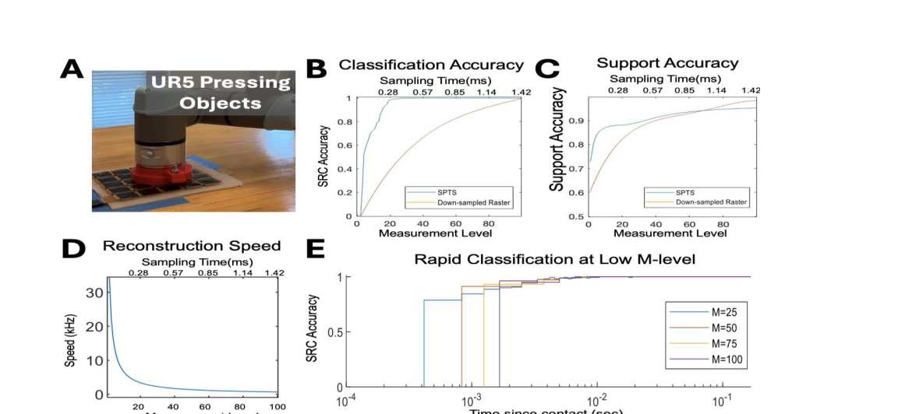

**Original caption:** Figure 3. Rapid Tactile Reconstruction and Classification. A. UR5 indented 17 different daily and 3D printed objects in the tactile sensor array. Data was collected using SPTS-mode at different measurement levels and also raster-scan mode as a control. B. Overall accuracy of SPTS in object classification. Raster-scanned signal was down-sampled and interpolated to achieve equivalent comparison points. C. Overall accuracy of SPTS in reconstructing the support of the indented object compared to equivalent interpolated down-sampled raster-scan image. D. Frequency of reconstruction, in kilohertz, using different measurement levels for SPTS. E. Rapid classification of object at initial contact using low measurement levels. M=25 can classify the indented object within 0.4msec of data collection with 80% accuracy.

**中文图注:** Figure 3 原始图注已提取；逐项含义见下方分图说明。

**Reading note:** 重点查看阵列规模、空间分辨率、串扰、读出通道和空间特征表达。

- (a) 重点查看阵列规模、空间分辨率、串扰、读出通道和空间特征表达。 原文：UR5 indented 17 different daily and 3D printed objects in the tactile sensor array. Data was collected using SPTS-mode at different measurement levels and also raster-scan mode as a control
- (b) 重点查看任务设置、基线、消融和失败案例，判断系统演示是否真正支撑前端价值。 原文：Overall accuracy of SPTS in object classification. Raster-scanned signal was down-sampled and interpolated to achieve equivalent comparison points
- (c) 重点查看阵列规模、空间分辨率、串扰、读出通道和空间特征表达。 原文：Overall accuracy of SPTS in reconstructing the support of the indented object compared to equivalent interpolated down-sampled raster-scan image
- (d) 结合正文首次引用位置和原始图注核对该图的证据角色。 原文：Frequency of reconstruction, in kilohertz, using different measurement levels for SPTS
- (e) 重点查看任务设置、基线、消融和失败案例，判断系统演示是否真正支撑前端价值。 原文：Rapid classification of object at initial contact using low measurement levels. M=25 can classify the indented object within 0.4msec of data collection with 80% accuracy

### Figure 4

**Source:** p.8

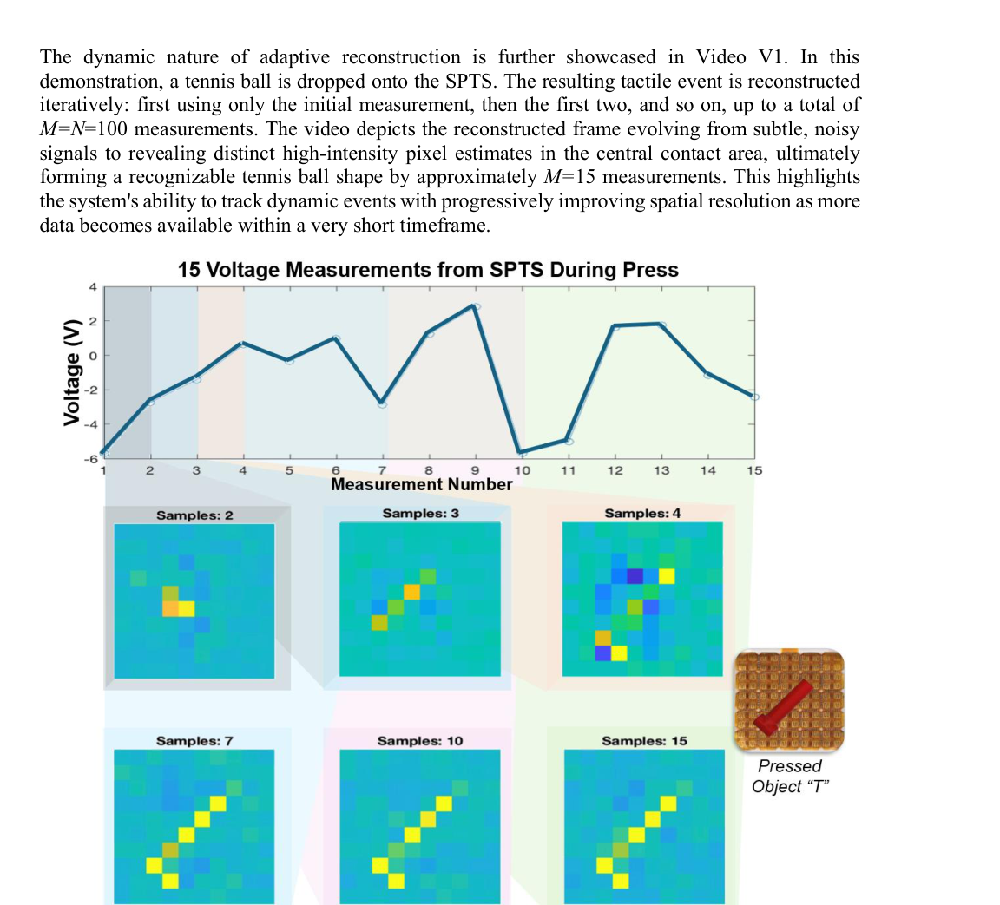

**Original caption:** Figure 4. Adaptive Reconstruction. As additional voltage measurements are recorded, the reconstruction accuracy of the tactile image improves. 15 voltage measurements are shown, and tactile image reconstructions are calculated using progressively more of the measurements: with only the first 2 measurements, through using all 15 measurements. Measurements and their reconstructions are associated with colored groupings. The indented object, the shape “T”, is shown as an inset on the sensor.

**中文图注:** Figure 4 原始图注已提取；逐项含义见下方分图说明。

**Reading note:** 重点查看阵列规模、空间分辨率、串扰、读出通道和空间特征表达。

### Figure 5

**Source:** p.9

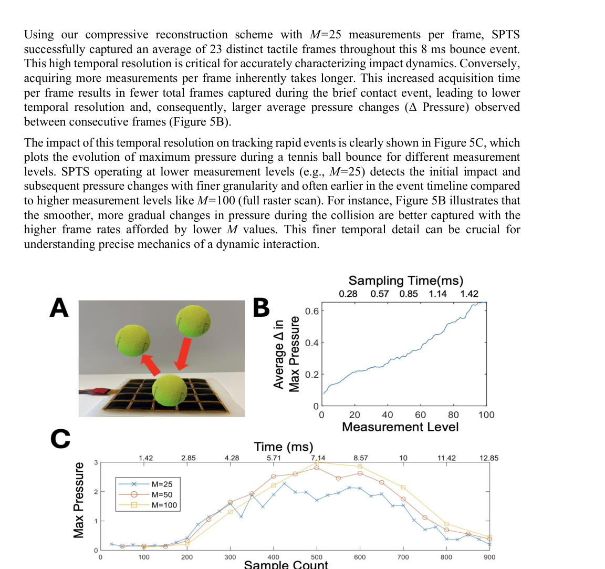

**Original caption:** Figure 5. High-Speed Projectile Tracking. A. Tennis ball is bounced on the sensor array, making contact with the array for only ~8msec. B. Lower measurement levels capture the dynamic signal with higher accuracy due to higher frame rates, and the average change (Δ) in pressure value is plotted. Higher measurement levels have lower frame rates and accordingly have larger average pressure changes per frame. C. Evolution of maximum pressure during a tennis ball bounce versus measurement level. Lower measurement levels (M=25) ‘notice’ the bounce of the ball earlier, and track the deformation pressure with finer granularity than higher measurement levels (M=100).

**中文图注:** Figure 5 原始图注已提取；逐项含义见下方分图说明。

**Reading note:** 重点查看阵列规模、空间分辨率、串扰、读出通道和空间特征表达。

- (a) 重点查看阵列规模、空间分辨率、串扰、读出通道和空间特征表达。 原文：Tennis ball is bounced on the sensor array, making contact with the array for only ~8msec
- (b) 结合正文首次引用位置和原始图注核对该图的证据角色。 原文：Lower measurement levels capture the dynamic signal with higher accuracy due to higher frame rates, and the average change (Δ) in pressure value is plotted. Higher measurement levels have lower frame rates and accordingly have larger average pressure changes per frame
- (c) 结合正文首次引用位置和原始图注核对该图的证据角色。 原文：Evolution of maximum pressure during a tennis ball bounce versus measurement level. Lower measurement levels (M=25) ‘notice’ the bounce of the ball earlier, and track the deformation pressure with finer granularity than higher measurement levels (M=100)

### Figure 6

**Source:** p.10

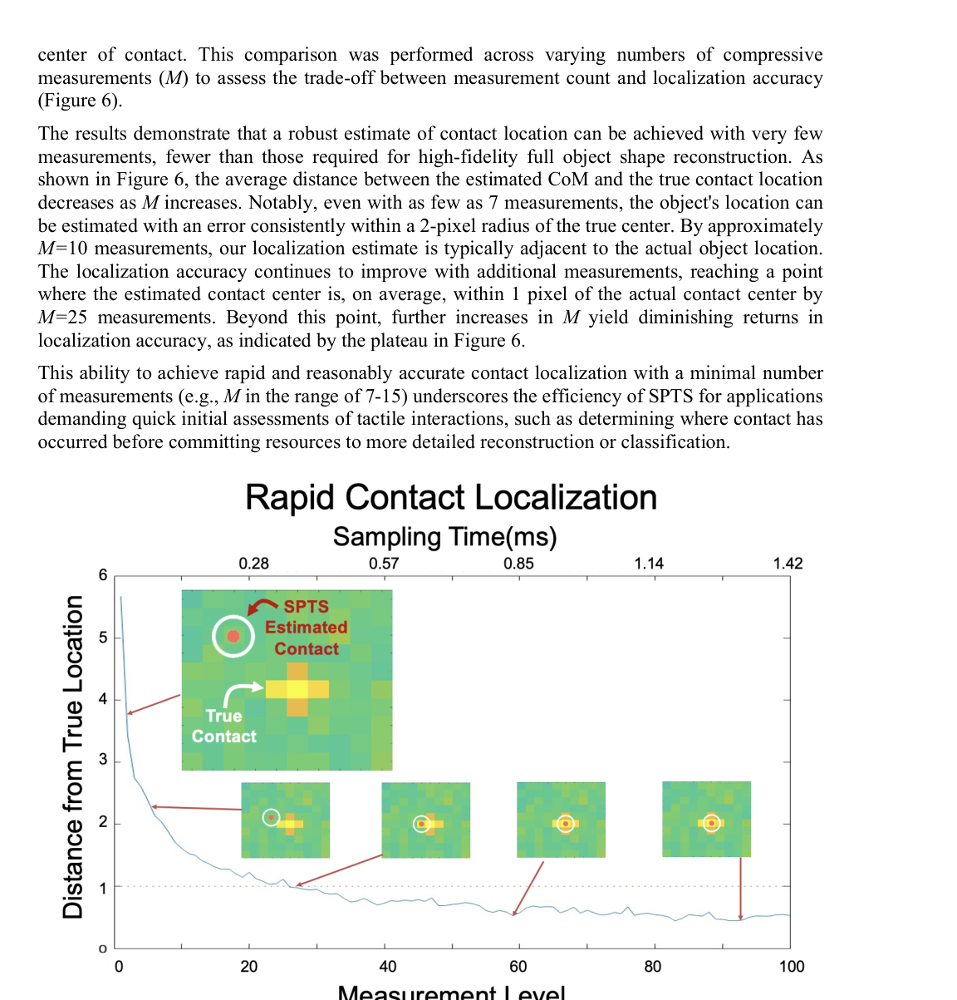

**Original caption:** Figure 6. Rapid Contact Localization. Center of contact can be estimated with fewer measurements than accurate object reconstruction requires. During various tennis ball bounces, the average distance from true contact location was estimated using a low measurement level. As the level increase, the contact localization accuracy improves and plateaus after 25 measurements. Within 7 measurements, the objects location can be accurately estimated within span of 2 pixels error.

**中文图注:** Figure 6 原始图注已提取；逐项含义见下方分图说明。

**Reading note:** 重点查看标定方法、量程、误差、线性和动态响应，避免只比较单一灵敏度。

### Figure S1

**Source:** p.19

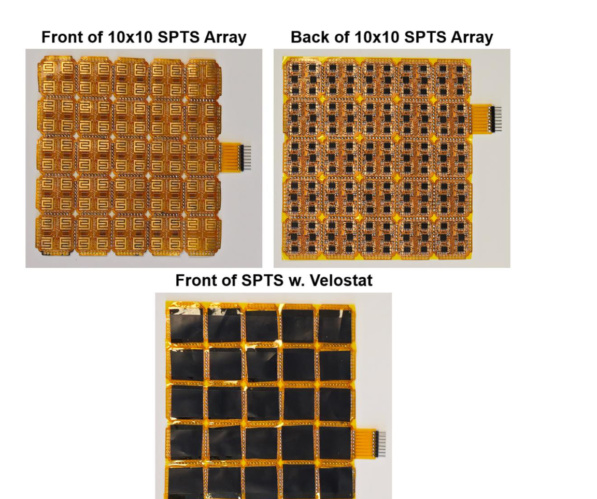

**Original caption:** Figure S1. SPTS array assembly

**中文图注:** Figure S1 原始图注已提取；逐项含义见下方分图说明。

**Reading note:** 重点查看阵列规模、空间分辨率、串扰、读出通道和空间特征表达。

### Figure S2

**Source:** p.20

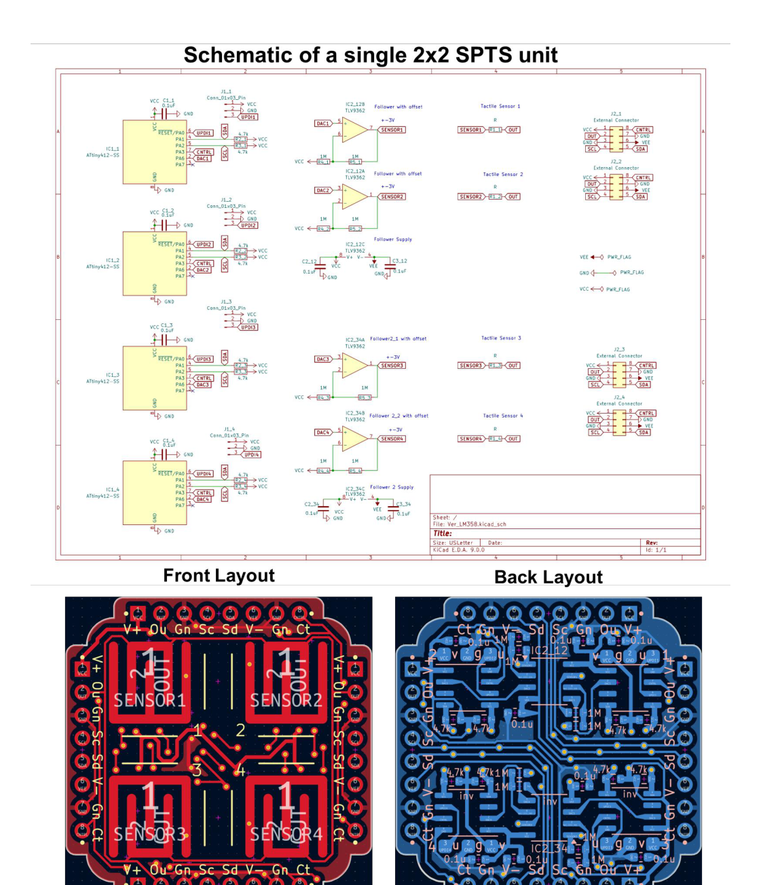

**Original caption:** Figure S2. SPTS cell schematic and board layout.

**中文图注:** Figure S2 原始图注已提取；逐项含义见下方分图说明。

**Reading note:** 重点查看器件结构、材料层次、信号路径和制备流程。

### Figure S3

**Source:** p.21

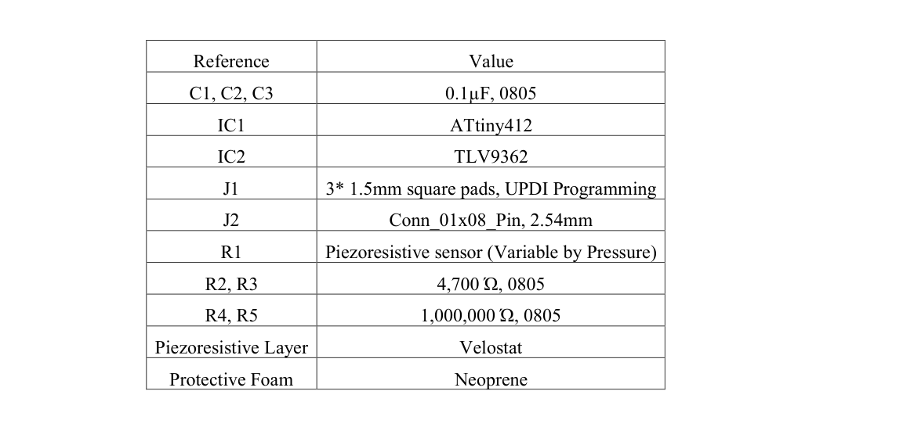

**Original caption:** Figure S3. Component list for SPTS cell.

**中文图注:** Figure S3 原始图注已提取；逐项含义见下方分图说明。

**Reading note:** 结合正文首次引用位置和原始图注核对该图的证据角色。

### Figure S4

**Source:** p.22

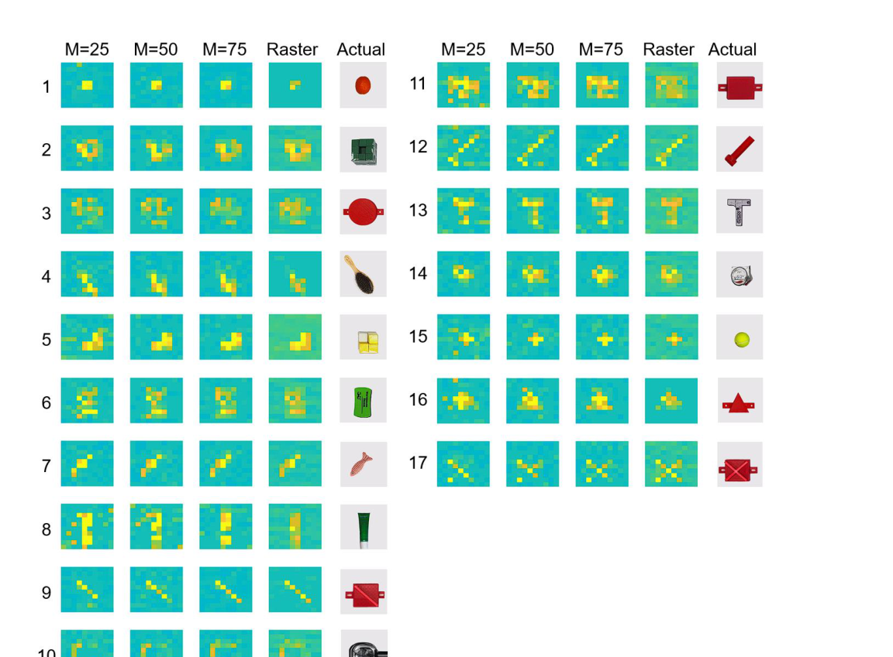

**Original caption:** Figure S4. Example tactile reconstructions of SPTS at various measurement levels.

**中文图注:** Figure S4 原始图注已提取；逐项含义见下方分图说明。

**Reading note:** 结合正文首次引用位置和原始图注核对该图的证据角色。

### Figure S5

**Source:** p.23

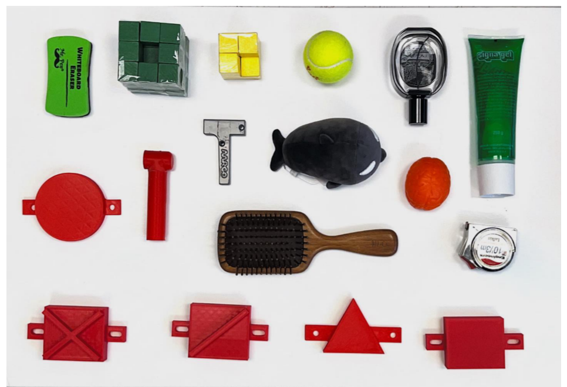

**Original caption:** Figure S5. Picture of 17 objects used in object classification test.

**中文图注:** Figure S5 原始图注已提取；逐项含义见下方分图说明。

**Reading note:** 重点查看任务设置、基线、消融和失败案例，判断系统演示是否真正支撑前端价值。

### Figure S6

**Source:** p.24

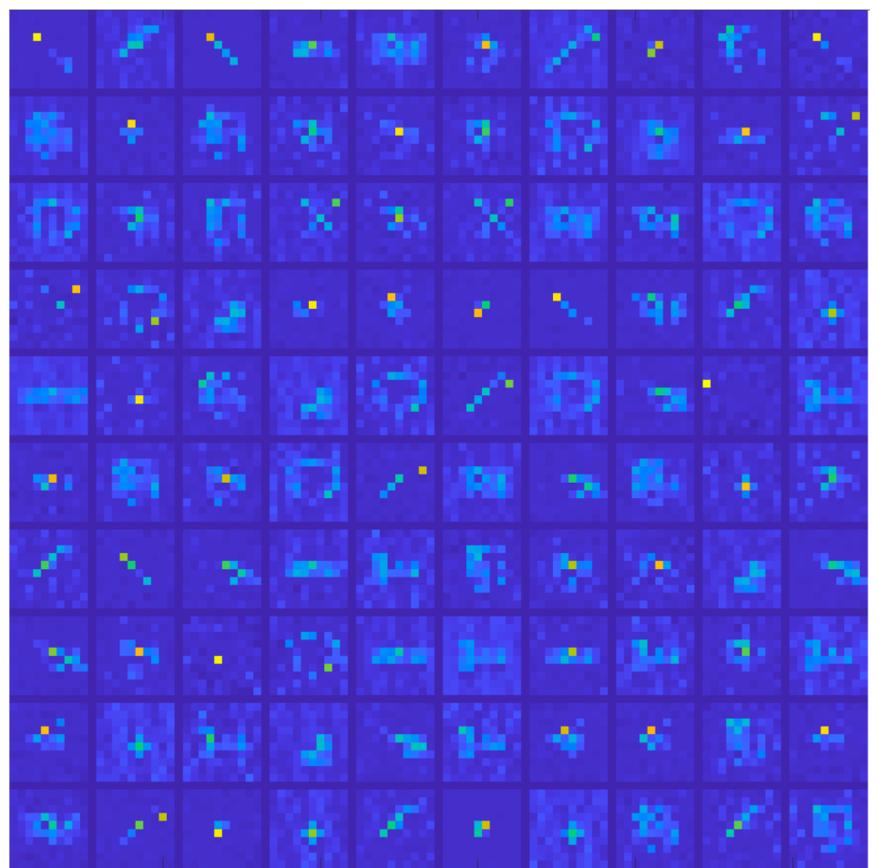

**Original caption:** Figure S6. Learned tactile dictionary for sparse recovery of tactile signals.

**中文图注:** Figure S6 原始图注已提取；逐项含义见下方分图说明。

**Reading note:** 结合正文首次引用位置和原始图注核对该图的证据角色。
