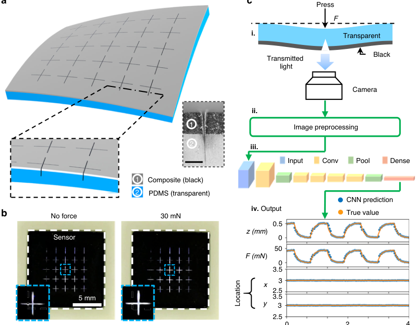
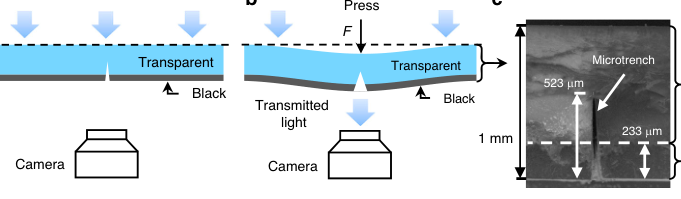
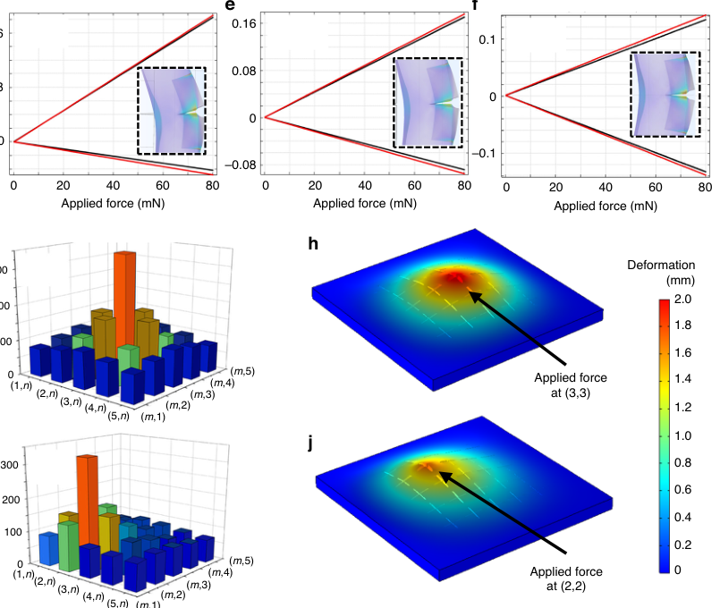
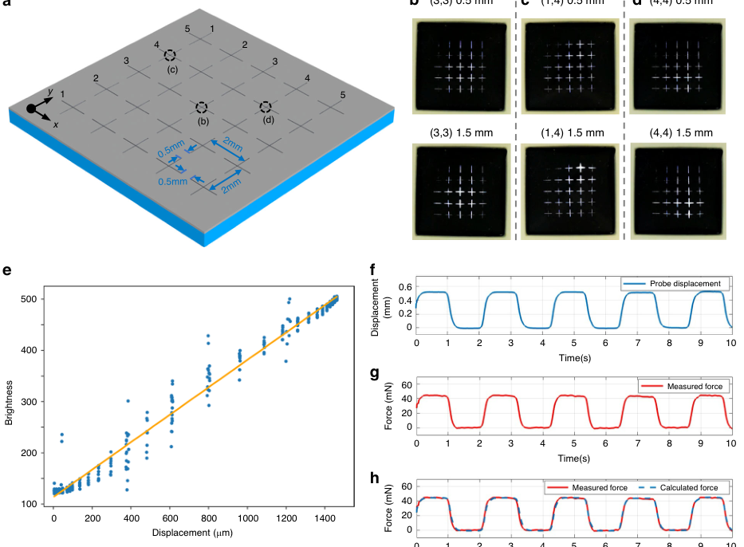
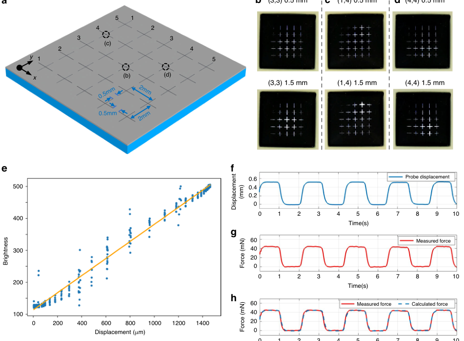
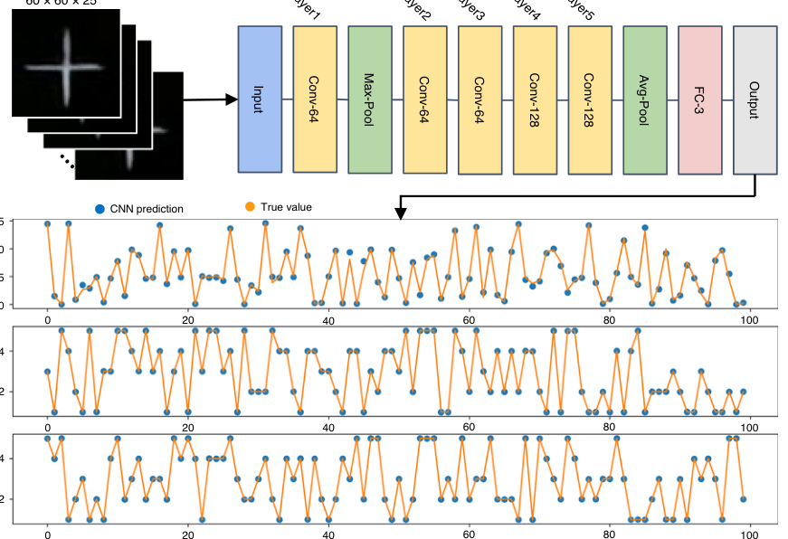
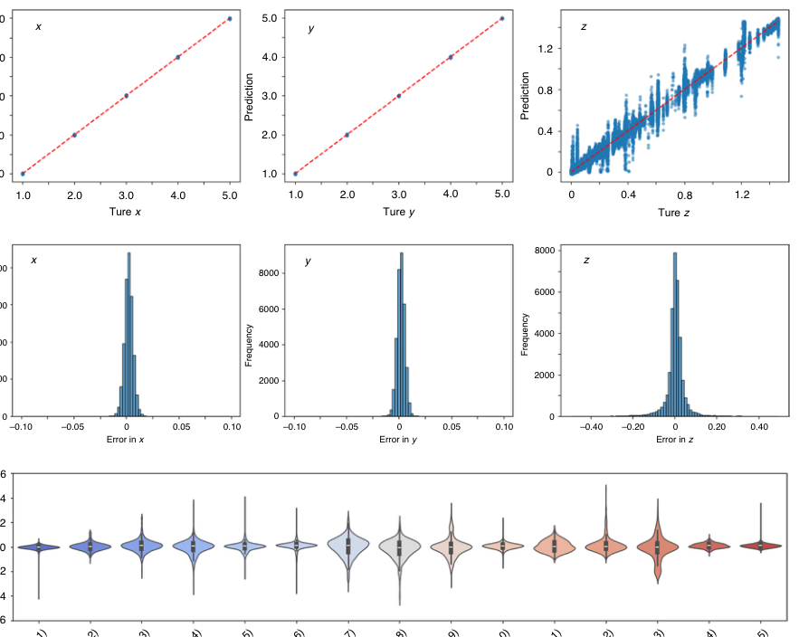
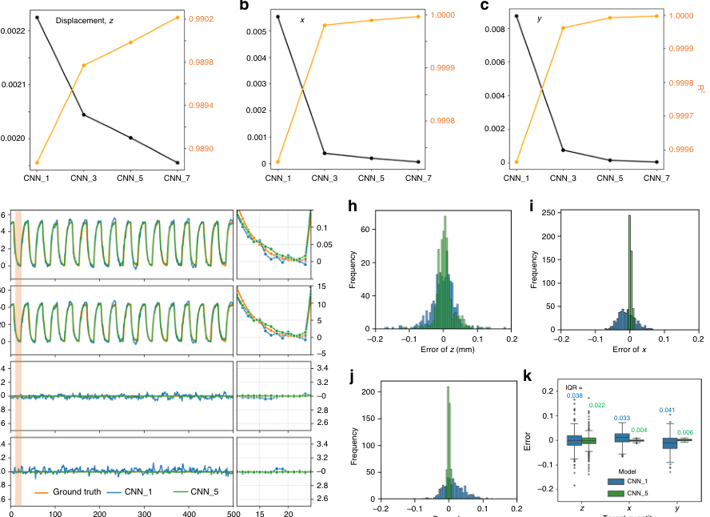

# Vision-based tactile sensing enhanced by microstructures and lightweight convolutional neural network

- 期刊：Microsystems & Nanoengineering
- 日期：2026-06-15
- DOI：10.1038/s41378-026-01355-5
- 解析状态：fulltext_draft

## 摘要与研究价值

**Original:** Abstract Tactile sensing can provide a critical function in advanced interactive systems by emulating the human sense of touch to detect stimuli. Vision-based tactile sensors are promising for providing multimodal capabilities and high robustness, yet existing technologies still have limitations in sensitivity, spatial resolution and the high computational demands of deep learning-based image processing. This paper presents a comprehensive approach combining a novel microstructure-based sensor design and efficient image processing, demonstrating that carefully engineered microstructures can significantly enhance performance while reducing computational load. Without traditional tracking markers, our sensor incorporates a surface with micromachined trenches, as an example of microstructures which can modulate light transmission and amplify the visual response to applied force. The amplified image features can be extracted by an ultra-lightweight convolutional neural network to accurately infer contact location, displacement, and applied force with high precision. Through theoretical analysis, we demonstrate that the micro trenches significantly amplify the visual effects of surface deformation. Using only a commercial webcam, the sensor system effectively detected forces below 5 mN and achieved a millimetre-level single-point spatial resolution. Using a model with only one convolutional layer, a mean absolute error below 0.05 mm was achieved. The compliant sensor body and optical readout design make the system inherently compatible with soft robotic integration and immune to electrical crosstalk or electromagnetic interference that often affects electronic tactile arrays. These characteristics highlight its potential for reliable operation in complex human–machine environments.

**中文:** 该工作提出一种无标记的视觉触觉传感器：在透明 PDMS/石墨-PDMS 双层弹性体中加工十字微沟槽，用受压后透光图案的变化在器件端放大接触特征，再由轻量卷积网络同时反演接触位置、法向位移和力。系统使用商用摄像头，可检测低于 5 mN 的力并达到毫米级单点空间分辨率；仅使用一层卷积的模型即可将平均绝对误差控制在 0.05 mm 以下。其核心不是单独提高材料灵敏度，而是通过微结构与算法协同设计降低后端特征提取负担。

## 创新点

- 利用受压微沟槽调制透射光，把接触形变在传感器结构内转换为更易分辨的图像特征，形成器件级物理特征放大。
- 将微结构、光学读出和轻量 CNN 联合设计，用同一输入同时估计接触 x/y 位置、法向位移和作用力，而不依赖传统跟踪标记。
- 通过模型深度消融证明硬件产生的强特征允许极浅网络工作：一层卷积模型仍可达到低于 0.05 mm 的平均绝对误差，并保持低于 5 mN 的力检测能力。

## 对当前课题的启发

- 把论文的“微结构先放大任务相关特征”迁移到你的电极/微结构前端：目标不只是提高灵敏度，而是在 ADC 前增强方向、接触位置或纹理可分性。
- 建立 raw pixel、软件特征和硬件物理特征三组对照，同时比较精度、ADC 通道数、模型参数量、延迟和功耗，形成前端计算证据链。
- 借鉴其位置误差分布和模型深度消融，在你的器件中增加偏移、旋转、接触半径及坏点比例下的性能地图，证明结构特征对装配误差和器件离散的容忍度。
- 该论文是光学视觉触觉方案，不能直接证明电阻式阵列的 ADC 前计算价值；可迁移的是器件-信息-算法协同设计方法和消融框架。

## 制备与实验步骤

### 1. 制备与实验操作

**Source:** p.14

**Original:** We first fabricated a thin PDMS substrate film.

**中文:** 先制备一层薄的透明 PDMS 基底膜，作为后续石墨复合层和微沟槽结构的承载层。

### 2. 材料混合与分散

**Source:** p.14

**Original:** The PDMS base and curing agent (Dow Corning, SYLGARD 184 silicone elastomer) were mixed in a ratio of 10:1 (w/ w), after which the mixture was spin-coated on a plate before being transferred to an oven for curing at 70 °C for 2 h.

**中文:** 按质量比 10:1 混合 Sylgard 184 的 PDMS 基胶与固化剂，旋涂到平板后在 70 °C 烘箱中固化 2 h。

### 3. 材料混合与分散

**Source:** p.14

**Original:** To prepare the graphite/PDMS composite, 10 wt% graphite (Sigma-Aldrich, 282863) was fully mixed with uncured PDMS (base: curing agent = 10:1, w/w) to form a black composite, enhancing image contrast.

**中文:** 将 10 wt% 石墨加入未固化 PDMS（基胶:固化剂 = 10:1）并充分混合，得到用于增强图像对比度的黑色石墨/PDMS 复合物。

### 4. 材料混合与分散

**Source:** p.14

**Original:** Toluene was added to the mixture to assist in uniform dispersion and adjust its viscosity.

**中文:** 向石墨/PDMS 混合物加入甲苯，以改善均匀分散并调节旋涂黏度；原文未在该句给出甲苯用量。

### 5. 材料混合与分散

**Source:** p.14

**Original:** The mixture was spin-coated on the transparent PDMS film (300 rpm, 60 s) to ensure uniformity.

**中文:** 将复合物旋涂到透明 PDMS 薄膜上，参数为 300 rpm、60 s，以形成均匀的第二层。

### 6. 固化与热处理

**Source:** p.14

**Original:** The film was transferred to an oven at 70 °C for 4 h.

**中文:** 把双层薄膜转移到 70 °C 烘箱中继续固化 4 h。

### 7. 图形化与结构成形

**Source:** p.14

**Original:** After preparing a double-layer elastomer film, the micro trenches were fabricated with high-precision ultraviolet laser cutting.

**中文:** 在固化后的双层弹性体上使用高精度紫外激光切割微沟槽；相邻方法原文给出的激光波长为 355 nm。

### 8. 图形化与结构成形

**Source:** p.14

**Original:** As shown in Fig. S4b, the multi-layer film was first placed on a glass plate, after which the film was patterned with the cross-shaped trench structure using a computer-controlled laser cutter.

**中文:** 将多层薄膜放在玻璃板上，使用计算机控制的激光切割机加工十字形沟槽阵列；结构位置见原文 Fig. S4b。

## 方法原文锚点

**Source:** p.14 M001

**Original:** We first fabricated a thin PDMS substrate film. The PDMS base and curing agent (Dow Corning, SYLGARD 184 silicone elastomer) were mixed in a ratio of 10:1 (w/ w), after which the mixture was spin-coated on a plate before being transferred to an oven for curing at 70 °C for 2 h. To prepare the graphite/PDMS composite, 10 wt% graphite (Sigma-Aldrich, 282863) was fully mixed with uncured PDMS (base: curing agent = 10:1, w/w) to form a black composite, enhancing image contrast. Toluene was added to the mixture to assist in uniform dispersion and adjust its viscosity. The mixture was spin-coated on the transparent PDMS film (300 rpm, 60 s) to ensure uniformity. The film was transferred to an oven at 70 °C for

**中文:** 该段已进入结构化方法步骤；完整逐段翻译待智能体精读补齐。

**Source:** p.14 M002

**Original:** 4 h. After preparing a double-layer elastomer film, the micro trenches were fabricated with high-precision ultraviolet laser cutting. The wavelength of the UV laser was 355 nm. As shown in Fig. S4b, the multi-layer film was first placed on a glass plate, after which the film was patterned with the cross-shaped trench structure using a computer-controlled laser cutter.

**中文:** 该段已进入结构化方法步骤；完整逐段翻译待智能体精读补齐。

**Source:** p.14 M003

**Original:** Experimental set-up

**中文:** 该段已进入结构化方法步骤；完整逐段翻译待智能体精读补齐。

**Source:** p.14 M004

**Original:** The bespoke experimental setup aims to repeatedly apply vertical forces onto the sensor with a given displacement. The setup’s actuation mechanism consists of a magnetic linear motor (Faulhaber LM038004001) and a 3-D printed cone-shaped probe (1 mm tip diameter). The position sensor in the linear motor provides highly accurate displacement measurements with a precision of 1 μm and is capable of outputting and recording displacement data. The probe driven by the linear motor enables applying a controllable and high-precision displacement against the sensor surface.

**中文:** 该段已进入结构化方法步骤；完整逐段翻译待智能体精读补齐。

**Source:** p.14 M005

**Original:** Calibration of the force–displacement relationship

**中文:** 该段已进入结构化方法步骤；完整逐段翻译待智能体精读补齐。

**Source:** p.14 M006

**Original:** We placed the targeted sensing point at the centre of the bespoke probe. A high-precision scale (MAXREFDES82) was placed beneath the VBTS, which measures the forces applied. Subsequently, the position of the probe was adjusted to a height where it just contacted the sensor body. This scale module integrates a precision strain gauge sensor and a 24-bit ADC, capable of measuring forces in the millinewton range with high resolution and stability. The sensor was connected to a laptop via USB for real-time data acquisition. It was calibrated using standard weights before use.

**中文:** 该段已进入结构化方法步骤；完整逐段翻译待智能体精读补齐。

**Source:** p.14 M007

**Original:** By initialising the linear motor with a pre-set displacement, we were able to measure the change of forces with the scale. We measured the force, and the sensing points located at the top left corner of the sensor were tested: (1,1), (2,1), (2,2), (3,1), (3,2), and (3,3). Hence, the rest sensing points can be estimated symmetrically. For each sensing point, displacements of 0.5, 1.0, 1.5, and 1.75 mm were applied. And each force application was repeated for 10 s with a frequency of 0.5 Hz.

**中文:** 该段已进入结构化方法步骤；完整逐段翻译待智能体精读补齐。

## 图表解读

### Figure 2

**Source:** p.3

**Original caption:** Figure 2 illustrates the working principle of this MicroVBTS sensor that leverages the deformation of microstructures to measure applied force. Initially, the laserwritten trenches are nearly closed, allowing minimal light through the structure. When force is applied on the transparent side, the trench in the black layer opens, creating a clear visual feature even for very slight deformation of the overall diaphragm shape. Importantly, the optical effect is amplified by the high depth-to-width ratio of the trench. The detailed structure of a micro trench is illustrated in Fig. 2c. Images are captured by a camera under the sensor body. For instance, the images of our sensor body clearly showed distinguishable features under an applied force of only 30 mN (Fig. 1b), which indicates its high sensitivity. With the diaphragm structure and elastic sensor body, the sensor recovers spontaneously after removal of the applied force.

**中文图注:** Figure 2 原始图注已提取；逐项含义见下方分图说明。

**Reading note:** 重点查看器件结构、材料层次、信号路径和制备流程。

- (c) 重点查看器件结构、材料层次、信号路径和制备流程。 原文：Images are captured by a camera under the sensor body. For instance, the images of our sensor body clearly showed distinguishable features under an applied force of only 30 mN (Fig. 1b), which indicates its high sensitivity. With the diaphragm structure and elastic sensor body, the sensor recovers spontaneously after removal of the applied force

### Fig. 1

**Source:** p.4

**Original caption:** Fig. 1 Structural schematic diagram and system design. a Structural design of the sensor body, and a sectional view showing trench structures in the film (scale bar: 200 μm). b Optical images of the sensor under different applied forces. Left: no force is applied. Right: a 30 mN force is applied at the circled cross centre in row 3, column 3. Diameter of contact area: 1 mm. c System design. i. Sensor body with micro trench patterns modulates light under pressure. ii. Camera captures images with transmitted light patterns and then iii. the images are pre-processed, and iv. feed into a lightweight CNN for analysis. v. Four outputs of CNN represent vertical displacement, applied force, and the location of the contact point on the sensor surface

**中文图注:** 传感器结构与完整信息链：微沟槽弹性体在受压时改变透光图案，摄像头采集后由轻量 CNN 输出位置、位移和力。

**Reading note:** 重点查看器件结构、材料层次、信号路径和制备流程。

- (a) 展示传感器本体及薄膜截面中的沟槽结构，比例尺为 200 μm，用于说明物理特征调制发生的位置。 原文：Structural design of the sensor body, and a sectional view showing trench structures in the film (scale bar: 200 μm)
- (b) 对比无载荷与在第 3 行第 3 列施加 30 mN、1 mm 接触直径时的光学图像，直接显示受压后图案变化。 原文：Optical images of the sensor under different applied forces. Left: no force is applied. Right: a 30 mN force is applied at the circled cross centre in row 3, column 3. Diameter of contact area: 1 mm
- (c) 给出从微沟槽调光、摄像头采集、图像预处理到轻量 CNN 的完整链路，最终输出法向位移、力和接触位置。 原文：System design. i. Sensor body with micro trench patterns modulates light under pressure. ii. Camera captures images with transmitted light patterns and then iii. the images are pre-processed, and iv. feed into a lightweight CNN for analysis. v. Four outputs of CNN represent vertical displacement, applied force, and the location of the contact point on the sensor surface

### Fig. 2

**Source:** p.5

**Original caption:** Fig. 2 Principle of structure-enhanced vision-based sensor. a No applied force; b with applied force. The deformation allows light to transmit, forming specific patterns captured by the camera. c Scanning electron micrograph of a trench

**中文图注:** 微沟槽增强视觉触觉的工作机理与沟槽形貌。

**Reading note:** 重点查看器件结构、材料层次、信号路径和制备流程。

- (a) 无外力时沟槽保持初始形态，透光图案作为基线。 原文：No applied force
- (b) 受力后局部形变允许更多或不同分布的光透过，形成可供算法识别的特征。 原文：with applied force. The deformation allows light to transmit, forming specific patterns captured by the camera
- (c) 沟槽的扫描电镜图用于核实实际加工形貌，而不是只依赖示意图。 原文：Scanning electron micrograph of a trench

### Fig. 3

**Source:** p.6

**Original caption:** Fig. 3 Modelling and simulation analysis. a, b Modelling of the sensor body structure. a Provides the illustration of simplified stress concentration. c Local stress distribution at location A under applied force based on FEA analysis. The deformation pattern of the notched beam at locations d A, e B, and f C simulated using COMSOL Multiphysics. The load range analysed was from 0 to 80 mN. Comparison between the simulated (black) and modelled (red) deformations demonstrates our model consistently predicts a slightly larger deformation at both edges, with discrepancies within 13% across varying applied loads. The average diagonal length (g, i) and deformation (h, j) of all 25 micro trenches under an applied force of 60 mN at location (3, 3) and location (2, 2)

**中文图注:** 解析模型与有限元分析验证微沟槽的应力集中和形变放大机制。

**Reading note:** 重点查看器件结构、材料层次、信号路径和制备流程。

- (a,b) 建立带缺口梁的简化模型并说明应力集中来源，为结构放大机制提供解析解释。 原文：Modelling of the sensor body structure. a Provides the illustration of simplified stress concentration
- (c) 展示位置 A 在载荷下的局部应力分布，用有限元结果验证高应力区域。 原文：Local stress distribution at location A under applied force based on FEA analysis. The deformation pattern of the notched beam at locations d A, e B, and f C simulated using COMSOL Multiphysics. The load range analysed was from 0 to 80 mN. Comparison between the simulated (black) and modelled (red) deformations demonstrates our model consistently predicts a slightly larger deformation at both edges, with discrepancies within 13% across varying applied loads. The average diagonal length (g, i) and deformation (h, j) of all 25 micro trenches under an applied force of 60 mN at location (3, 3) and location (2, 2)

### Fig. 4

**Source:** p.7

**Original caption:** Fig. 4 Sensor response to applied force. a Structure and parameters of the sensor body. b–d Optical images captured using a camera at three typical locations. The data above each image indicates the contact location and the displacement of the linear motor toward the sensor. For example, (3,3) indicates the applied force was at the cross centre in row 3, column 3. Diameter of contact area: 1 mm. e Brightness of the central region (3,3) and linear regression on the displacement–brightness data. f–h The force–displacement calibration of a testing point (3,3). f Displacement and g force were measured to calibrate the coefficient k33. h Comparison of the measured force and the calculated force according to the displacement over time (k33 = 85.4 mN/mm)

**中文图注:** 传感器在不同接触位置和载荷下的光学响应、亮度线性及力-位移标定。

**Reading note:** 重点查看器件结构、材料层次、信号路径和制备流程。

- (a) 列出传感器几何结构和关键尺寸，作为后续位置与标定结果的结构基准。 原文：Structure and parameters of the sensor body
- (b-d) 展示三个典型位置受压时的相机图像，图上同时标注接触坐标和电机位移，用于验证空间编码能力。 原文：Optical images captured using a camera at three typical locations. The data above each image indicates the contact location and the displacement of the linear motor toward the sensor. For example, (3,3) indicates the applied force was at the cross centre in row 3, column 3. Diameter of contact area: 1 mm
- (e) 对中心位置 (3,3) 的亮度与位移做线性回归，检验光学特征能否稳定表征形变。 原文：Brightness of the central region (3,3) and linear regression on the displacement–brightness data
- (f-h) 用同步位移和力测量标定 k33，并比较实测力与由位移计算的力随时间变化是否一致。 原文：The force–displacement calibration of a testing point (3,3). f Displacement and g force were measured to calibrate the coefficient k33. h Comparison of the measured force and the calculated force according to the displacement over time (k33 = 85.4 mN/mm)

### Figure S3

**Source:** p.7

**Original caption:** Figure S3 shows the displacement–brightness scatter plots for all 25 regions. A clear monotonic trend is observed, particularly in the centre region where the force is applied. The central region (3,3) shows the steepest slope, indicating the strongest brightness modulation in response to vertical displacement. Peripheral regions

**中文图注:** Figure S3 原始图注已提取；逐项含义见下方分图说明。

**Reading note:** 重点查看标定方法、量程、误差、线性和动态响应，避免只比较单一灵敏度。

### Fig. 5

**Source:** p.8

**Original caption:** Fig. 5 Architecture of the CNN model. a Pre-processed image as input. b Model architecture with 5 CNN layers (CNN_5). c A comparison between the predicted values by the CNN model and the true values for the first 100 images in the test set. x and y coordinates: contact position in units of inter-trench spacing (2 mm/unit); z coordinates: out-of-plane displacement (mm)

**中文图注:** CNN 输入、五层卷积网络结构以及前 100 个测试样本的预测与真值对比。

**Reading note:** 重点查看器件结构、材料层次、信号路径和制备流程。

- (a) 展示送入网络的预处理光学图像。 原文：Pre-processed image as input
- (b) 给出五层卷积模型 CNN_5 的结构，作为后续模型深度消融的高容量基线。 原文：Model architecture with 5 CNN layers (CNN_5)
- (c) 比较前 100 个测试样本的预测值与真值，观察接触位置和法向位移的跟随情况。 原文：A comparison between the predicted values by the CNN model and the true values for the first 100 images in the test set. x and y coordinates: contact position in units of inter-trench spacing (2 mm/unit); z coordinates: out-of-plane displacement (mm)

### Figure 5C

**Source:** p.9

**Original caption:** Figure 5c demonstrates the prediction results of 100 sample images in the test set with our CNN_5 model, which reflects that the simple lightweight model performed well in predicting the applied forces’ x, y, and zcoordinates. Here, the x and y coordinates represent contact position in units of inter-trench spacing (1 unit = 2 mm), while the z coordinate represents out-ofplane displacement in mm. The predictions for the x and y-coordinates are particularly accurate. The displacement

**中文图注:** Figure 5C 原始图注已提取；逐项含义见下方分图说明。

**Reading note:** 重点查看标定方法、量程、误差、线性和动态响应，避免只比较单一灵敏度。

### Fig. 6

**Source:** p.10

**Original caption:** Fig. 6 Statistical evaluation of model performance. a Scatter plots comparing the predicted values to the true values. b Histograms of the prediction errors. c Distribution of displacement prediction errors across different ranges of actual values

**中文图注:** 模型预测误差的统计评估。

**Reading note:** 重点查看标定方法、量程、误差、线性和动态响应，避免只比较单一灵敏度。

- (a) 预测值对真值散点图用于检查线性一致性和离群点。 原文：Scatter plots comparing the predicted values to the true values
- (b) 误差直方图用于观察误差中心、离散程度和长尾。 原文：Histograms of the prediction errors
- (c) 按真实位移区间统计误差，判断不同载荷/形变区间的鲁棒性。 原文：Distribution of displacement prediction errors across different ranges of actual values

### Fig. 7

**Source:** p.11

**Original caption:** Fig. 7 Error distribution for location resolution across different positions of the sensor

**中文图注:** 传感器不同空间位置的接触定位误差分布。

**Reading note:** 重点查看标定方法、量程、误差、线性和动态响应，避免只比较单一灵敏度。

### Fig. 8

**Source:** p.12

**Original caption:** Fig. 8 Comparison of performance for different CNN models. a–c Performance metrics for models with varying numbers of convolutional layers. d–k The experimental testing results and error analysis at location (3,3) using CNN_1 (blue) and CNN_5 (green). Specifically, ground truth and model predictions for d displacement and e calculated force in z-direction, f x and g y-coordinate results are shown. The shaded amber region highlights a low-force segment, with zoomed-in views provided on the right. h–k The error distributions and boxplots to evaluate prediction accuracy for this sensor system

**中文图注:** 不同 CNN 深度的性能消融，以及一层与五层模型在位置 (3,3) 的动态预测和误差比较。

**Reading note:** 重点查看标定方法、量程、误差、线性和动态响应，避免只比较单一灵敏度。

- (a-c) 比较不同卷积层数模型的总体性能，回答增加网络深度是否真正必要。 原文：Performance metrics for models with varying numbers of convolutional layers
- (d-k) 在位置 (3,3) 对比 CNN_1 与 CNN_5 的位移、法向力、x/y 坐标及误差分布；黄色区域放大低力段，检查最困难工况。 原文：The experimental testing results and error analysis at location (3,3) using CNN_1 (blue) and CNN_5 (green). Specifically, ground truth and model predictions for d displacement and e calculated force in z-direction, f x and g y-coordinate results are shown. The shaded amber region highlights a low-force segment, with zoomed-in views provided on the right. h–k The error distributions and boxplots to evaluate prediction accuracy for this sensor system
