# Triboelectric Wearable Sensors for Human-Centric Smart Electronics: From Self-Powered Sensing to Artificial Intelligence-Assisted Human–Machine Interface Systems

- 期刊：Nano-Micro Letters
- 日期：2026-06-16
- DOI：10.1007/s40820-026-02263-z
- 解析状态：fulltext_draft

## 摘要与研究价值

**Original:** As intelligent electronics become increasingly integrated into daily life, health care, virtual interaction, and assistive systems, human-machine interfaces (HMIs) require sensing platforms that are not only wearable and self-powered but also capable of translating human signals into adaptive machine functions. Triboelectric wearable sensors are particularly attractive in this regard because they directly transduce human-generated mechanical stimuli, provide broad material and structural design freedom, and are readily adaptable to body-interfaced formats. In this review, wearability refers to body-mounted, skin-interfaced, textile-integrated, or otherwise human-attached triboelectric sensing platforms, whereas human-centric smart electronics refers to downstream electronic systems that remain functionally anchored to human-originated sensing, interpretation, feedback, or control. From this perspective, we review triboelectric wearable sensors from fundamentals to applications, covering working principles, material selection, device architectures, and fabrication strategies. We further discuss artificial intelligence-assisted signal processing, triboelectric artificial synapses, and neuromorphic computing as key bridges from self-powered sensing to intelligent HMI. Representative application spaces, including health care, gesture recognition, device control, immersive virtual interaction, wearable-to-robotic extensions, and intelligent transportation are discussed only when wearable triboelectric sensing serves as the primary human-input interface. Finally, the remaining challenges and future directions toward next-generation human-centric smart electronics are outlined.

**中文:** 涉及 ADC 前模拟矢量、剪切/摩擦/方向相关触觉读出；涉及 in-sensor/物理计算或可编程触觉前端。当前未从摘要提取到可比较数值。

## 创新点

- As intelligent electronics become increasingly integrated into daily life, health care, virtual interaction, and assistive systems, human-machine interfaces (HMIs) require sensing platforms that are not only wearable and self-powered but also capable of translating human signals into adaptive machine functions.
- 涉及 ADC 前模拟矢量、剪切/摩擦/方向相关触觉读出
- 涉及 in-sensor/物理计算或可编程触觉前端
- 提供机器人、可穿戴或电子皮肤系统任务证据

## 对当前课题的启发

- 涉及 ADC 前模拟矢量、剪切/摩擦/方向相关触觉读出
- 涉及 in-sensor/物理计算或可编程触觉前端
- 优先核查是否有 hardware output 与 software projection 的同步一致性证据
- 可对照 raw pixel、software feature 与 physical projection 的性能/通道/功耗

## 制备与实验步骤

### 1. 制备与实验操作

**Source:** p.1

**Original:** selection, device architectures, and fabrication strategies.

**中文:** 制备与实验操作步骤，关键配比、时间、温度和设备参数以 p.1 原文为准。

### 2. 制备与实验操作

**Source:** p.1

**Original:** and fabrication strategies.

**中文:** 制备与实验操作步骤，关键配比、时间、温度和设备参数以 p.1 原文为准。

### 3. 图形化与结构成形

**Source:** p.1

**Original:** Instead, AI enhances the interpretation and utilization of triboelectric sensing signals by improving noise filtering, feature extraction, pattern recognition, multimodal data fusion, and user-specific adaptation, thereby increasing the overall accuracy, reliability, and practical functionality of wearable sensing systems [39].

**中文:** 图形化与结构成形步骤，关键配比、时间、温度和设备参数以 p.1 原文为准。

### 4. 图形化与结构成形

**Source:** p.1

**Original:** Furthermore, the integration of AI has pushed triboelectric wearable sensors beyond simple stimulus detection, enabling higher-level functions such as feature extraction, pattern recognition, multimodal fusion, adaptive learning, and personalized interaction.

**中文:** 图形化与结构成形步骤，关键配比、时间、温度和设备参数以 p.1 原文为准。

### 5. 制备与实验操作

**Source:** p.4

**Original:** We discuss the fundamental principles, material characteristics, and fabrication strategies of triboelectric sensors.

**中文:** 制备与实验操作步骤，关键配比、时间、温度和设备参数以 p.4 原文为准。

### 6. 组装与封装

**Source:** p.4

**Original:** Figure 2b shows the charge transfer phenomenon with an electron cloud model to describe the occurrence of the triboelectric effect when two different material surfaces come into contact with each other [57].

**中文:** 组装与封装步骤，关键配比、时间、温度和设备参数以 p.4 原文为准。

### 7. 组装与封装

**Source:** p.4

**Original:** Moreover, the electrons have to be able to transfer easily from one potential well to another of the contact materials based on the fundamental principle of the triboelectric effect so that the amount of the generated charge pairs increases.

**中文:** 组装与封装步骤，关键配比、时间、温度和设备参数以 p.4 原文为准。

### 8. 成膜与沉积

**Source:** p.4

**Original:** Representative directions include the progression from patterned PDMS-based triboelectric materials to fingerprint-structured e-skin, triboelectric–electrochemical hybrid materials, breathable biodegradable all-nanofiber materials, flexible conformal droplet e-skin, and machine learning-assisted fibrous thermoplastic e-skin.

**中文:** 成膜与沉积步骤，关键配比、时间、温度和设备参数以 p.4 原文为准。

### 9. 成膜与沉积

**Source:** p.9

**Original:** printing [139], and freeze–thaw processes [69].

**中文:** 成膜与沉积步骤，关键配比、时间、温度和设备参数以 p.9 原文为准。

### 10. 组装与封装

**Source:** p.9

**Original:** Because it can be effectively established by the most simple construction with the reduction of electrodes and wires, the single-electrode mode triboelectric sensor is widely applied to wearable electronics and IoT systems [140].

**中文:** 组装与封装步骤，关键配比、时间、温度和设备参数以 p.9 原文为准。

### 11. 图形化与结构成形

**Source:** p.9

**Original:** Moreover, the textile structure and patterned electrode can be useful in this mode because it can work by sliding-like method.

**中文:** 图形化与结构成形步骤，关键配比、时间、温度和设备参数以 p.9 原文为准。

### 12. 制备与实验操作

**Source:** p.9

**Original:** The material characteristics and fabrication processes are not only limited by each operation mode and various design strategies of the triboelectric sensor are possible for desired operation in optimal application.

**中文:** 制备与实验操作步骤，关键配比、时间、温度和设备参数以 p.9 原文为准。

### 13. 制备与实验操作

**Source:** p.9

**Original:** As is well known, the triboelectric sensor inherits the features of TENG such as the fundamental principle, material characteristics, working mechanism, operation modes, and fabrication process.

**中文:** 制备与实验操作步骤，关键配比、时间、温度和设备参数以 p.9 原文为准。

### 14. 制备与实验操作

**Source:** p.9

**Original:** Figure 6 presents the operation modes of the triboelectric sensors, related characteristics of used materials in each mode, and previously reported fabrication processes for them [73, 117–128].

**中文:** 制备与实验操作步骤，关键配比、时间、温度和设备参数以 p.9 原文为准。

### 15. 图形化与结构成形

**Source:** p.9

**Original:** Therefore, the self-assembly [131], origami/ kirigami [132], electrospinning [133], and molding-based processes [124] are often used to fabricate the vertical contact/separation mode triboelectric sensor.

**中文:** 图形化与结构成形步骤，关键配比、时间、温度和设备参数以 p.9 原文为准。

### 16. 图形化与结构成形

**Source:** p.9

**Original:** The single-electrode mode triboelectric sensor can include the material characteristics of stretchability, softness, and flexibility by employing resin curing [138], multidimensional Fig. 6 Operation modes, material characteristics, and fabrication processes of the triboelectric sensor.

**中文:** 图形化与结构成形步骤，关键配比、时间、温度和设备参数以 p.9 原文为准。

## 方法原文锚点

**Source:** p.1 M001

**Original:** selection, device architectures, and fabrication strategies.

**中文:** 该段已进入结构化方法步骤；完整逐段翻译待智能体精读补齐。

**Source:** p.1 M002

**Original:** and fabrication strategies. We further discuss artificial intelligence-assisted signal

**中文:** 该段已进入结构化方法步骤；完整逐段翻译待智能体精读补齐。

**Source:** p.2 M003

**Original:** monitoring [34], robotics with tactile sensing [35], and electronic skin [36]. Self-powered sensors are particularly attractive for HMI because they can directly convert external stimuli into electrical output without relying on external power supplies or batteries. Compared with conventional sensors, this enables lower power dependence, simpler system integration, improved wearability, and more continuous operation in human-centered interactive electronics. Among the various self-powered sensing technologies, triboelectric sensors are especially suitable for wearable HMI because they combine simple operating principles, broad material choices, and strong design flexibility with compatibility for flexible, stretchable, and skin-interfaced formats. These features have enabled a wide range of representative wearable triboelectric devices, while also highlighting remaining challenges in stability, signal interpretation, and practical system integration. Recently, efforts to develop AI-assisted wearable sensor technologies for the higher level of HMI have been highlighted with the advent of the Artificial Intelligence of Things (AIoT), which is a concept of the combination of AI and IoT [37]. With AI technology, the self-powered wearable sensor has set the stage for a leap to the next level beyond just detection of stimuli [38]. The introduction of AI does not directly alter the intrinsic physical sensitivity of the sensor, which is primarily determined by material selection, device structure, and operating mechanism. Instead, AI enhances the interpretation and utilization of triboelectric sensing signals by improving noise filtering, feature extraction, pattern recognition, multimodal data fusion, and user-specific adaptation, thereby increasing the overall accuracy, reliability, and practical functionality of wearable sensing systems [39]. Furthermore, the integration of AI has pushed triboelectric wearable sensors beyond simple stimulus detection, enabling higher-level functions such as feature extraction, pattern recognition, multimodal fusion, adaptive learning, and personalized interaction.

**中文:** 该段已进入结构化方法步骤；完整逐段翻译待智能体精读补齐。

**Source:** p.4 M004

**Original:** Based on this framework, this review focuses on the system-level transition from self-powered triboelectric wearable sensing to AI-assisted human-centric HMI systems [53]. We discuss the fundamental principles, material characteristics, and fabrication strategies of triboelectric sensors. We then examine AI-enabled signal interpretation, triboelectric artificial synapses, and neuromorphic computing as enabling routes toward intelligent sensing. Finally, we summarize representative human-centered application strategies and discuss the remaining challenges and future directions for next-generation smart electronics [54–56].

**中文:** 该段已进入结构化方法步骤；完整逐段翻译待智能体精读补齐。

**Source:** p.4 M005

**Original:** Figure 2b shows the charge transfer phenomenon with an electron cloud model to describe the occurrence of the triboelectric effect when two different material surfaces come into contact with each other [57]. As shown in Fig. 2b<i>, the electrons of atoms and molecules form the electron clouds. The electron cloud includes the atomic or molecular orbitals and each atom is assumed as a potential well containing electrons. The distance between the electron clouds of the atoms of two materials, A and B, is defined as d. E1 and E2 are the depths of potential wells, which are the required energies for electrons to escape from the surfaces of materials A and B, respectively. EA and EB indicate the occupied energy levels of electrons in the atoms of materials A and B, respectively. In the normal condition, the electrons are confined in the potential well because EA and EB are smaller than E1 and E2, respectively. When the surfaces of the materials A and B come into contact with each other, the electron

**中文:** 该段已进入结构化方法步骤；完整逐段翻译待智能体精读补齐。

**Source:** p.6 M006

**Original:** Although both the triboelectric and electrode layers are necessary to the triboelectric sensor, the major factor that affects the performance of the triboelectric sensor has been considered the electrical characteristic of the material of the triboelectric layer [75–78]. The triboelectric sensor performance is mainly determined by the generated charge density on the contact surface based on its working mechanism. Moreover, the electrons have to be able to transfer easily from one potential well to another of the contact materials based on the fundamental principle of the triboelectric effect so that the amount of the generated charge pairs increases. Given that, the triboelectric characteristics of the various materials have been analyzed with wide attention and a number of research groups have reported triboelectric series [79–81]. The triboelectric series is a list that ranks materials depending on their tendency to gain or lose electrons as shown in Fig. 4 [82]. It indicates how many a material makes positive or negative charges relative to others on the list. Therefore, we can get the optimal pair of triboelectric materials, which consists of one being positively well charged and the other being negatively well charged when they come into contact,

**中文:** 该段已进入结构化方法步骤；完整逐段翻译待智能体精读补齐。

**Source:** p.8 M007

**Original:** interfaces, recent progress has expanded toward intelligent wearable e-skin systems with greater multifunctionality and environmental adaptability. Representative directions include the progression from patterned PDMS-based triboelectric materials to fingerprint-structured e-skin, triboelectric–electrochemical hybrid materials, breathable biodegradable all-nanofiber materials, flexible conformal droplet e-skin, and machine learning-assisted fibrous thermoplastic e-skin. Furthermore, recent triboelectric wearable systems are increasingly being organized through 1D fibers, 2D fabrics/films, and 3D gels, while integrating functional characteristics such as stretchability, self-healing, waterproofness, breathability, biocompatibility, and high sensitivity [89]. These advances highlight the transition of triboelectric wearable sensors from simple self-powered sensing units toward intelligent and human-centered wearable electronics.

**中文:** 该段已进入结构化方法步骤；完整逐段翻译待智能体精读补齐。

**Source:** p.9 M008

**Original:** printing [139], and freeze–thaw processes [69]. The single-electrode mode is one of the most primarily used in the triboelectric sensor. Because it can be effectively established by the most simple construction with the reduction of electrodes and wires, the single-electrode mode triboelectric sensor is widely applied to wearable electronics and IoT systems [140]. The freestanding mode does not include direct contact between the two material surfaces. It has airy space between the two surfaces, and therefore, the high-level charge density of the surface can be effective. Given that, many researchers have introduced the corona discharging method to accumulate net charges on the target surface [141]. Moreover, the textile structure and patterned electrode can be useful in this mode because it can work by sliding-like method. In this respect, the laser-induced graphene [142] and yarn-weaving/fiber processes [143] can be adopted. The material characteristics and fabrication processes are not only limited by each operation mode and various design strategies of the triboelectric sensor are possible for desired operation in optimal application. The expandability is one of the strongest points of the triboelectric sensor as a promising sensory technology for wearable electronics and future HMIs.

**中文:** 该段已进入结构化方法步骤；完整逐段翻译待智能体精读补齐。

**Source:** p.9 M009

**Original:** As is well known, the triboelectric sensor inherits the features of TENG such as the fundamental principle, material characteristics, working mechanism, operation modes, and fabrication process. Figure 6 presents the operation modes of the triboelectric sensors, related characteristics of used materials in each mode, and previously reported fabrication processes for them [73, 117–128]. The triboelectric sensor can be operated with four types of operation modes, vertical contact/separation, lateral sliding, single-electrode, and freestanding modes [37]. The vertical contact/separation and single-electrode modes can be applied to the case when two surfaces face each other. The lateral sliding and freestanding modes can be used when the two surfaces are rubbed against each other [129]. The vertical contact/separation and lateral sliding modes adopt two electrodes connected to each other [130]. The singleelectrode and freestanding modes employ the electrode in only one of the contact layers. In this regard, the rigid substrate, surface structure, and three-dimensional structure can be available to construct the vertical contact/separation mode. Therefore, the self-assembly [131], origami/ kirigami [132], electrospinning [133], and molding-based processes [124] are often used to fabricate the vertical contact/separation mode triboelectric sensor. In the lateral sliding mode, a low frictional and durable contact surface is considered a major factor for its higher performance. Given that, liquid material-based solution process [134], film-based process like roll-to-roll [135], and lubrication process [136] can be employed. Moreover, mechanical design is known as a potential strategy for efficient rotational operation and durability of components because the lateral sliding mode can effectively achieve high performance by rotational movement of components [137]. The single-electrode mode triboelectric sensor can include the material characteristics of stretchability, softness, and flexibility by employing resin curing [138], multidimensional

**中文:** 该段已进入结构化方法步骤；完整逐段翻译待智能体精读补齐。

**Source:** p.10 M010

**Original:** Fig. 6 Operation modes, material characteristics, and fabrication processes of the triboelectric sensor. Reprinted with permission from Ref. [117]. © 2018 Elsevier Ltd. All rights reserved. Reprinted with permission from Ref. [118]. © 2021 Jihoon Chung et al. Reprinted with permission from Ref. [119]. Copyright © 2016, Dhakar, L., et al. Reprinted with permission from Ref. [120]. © 2020 Elsevier Ltd. All rights reserved. Reprinted with permission from Ref. [121]. © 2018 Lee, S., et al. Published by Elsevier Ltd. Reprinted with permission from Ref. [73]. © 2024 Elsevier Ltd. All rights are reserved, including those for text and data mining, AI training, and similar technologies. Reprinted with permission from Ref. [122]. © 2022 Elsevier Ltd. All rights reserved. Reprinted with permission from Ref. [123]. © Ra, Y., et al. 2025. Reprinted with permission from Ref. [124]. Copyright © 2023 Yoonsang Ra et al. Reprinted with permission from Ref. [125]. Copyright © 2014 Woodhead Publishing Limited. All rights reserved. Reprinted with permission from Ref. [126]. © 2020 Wu, J., et al. Published by Elsevier Ltd. Reprinted with permission from Ref. [127]. © 2019 Elsevier Ltd. All rights reserved. Reprinted with permission from Ref. [128]. Copyright © 2017, American Chemical Society

**中文:** 该段已进入结构化方法步骤；完整逐段翻译待智能体精读补齐。

**Source:** p.11 M011

**Original:** Wu et al. introduce a self-powered intelligent tactile sensor leveraging a single-electrode-based triboelectric nanogenerator (SE-TENG) that mimics synaptic functionalities such as learning and memory, akin to biological mechanoreceptors and neural systems as shown in Fig. 7a [145]. The sensor consists primarily of a polyimide: reduced graphene oxide (PI: rGO) hybrid nanocomposite layer, where rGO sheets are integrated into PI serving as electron body traps to facilitate neuromorphic behavior. Upon mechanical stimulation, the device actively generates voltage signals without external power, with a waveform resembling biological action potentials. The tactile sensor demonstrates synaptic potentiation behavior as successive mechanical stimulations progressively increase the generated output voltage from an initial 0.3 V to approximately 5 V at saturation after about 42 presses under constant pressure of 400 Pa and a short pressure-holding time of 0.05 s. The SE-TENG exhibits synaptic learning by integrating individual voltage increments (ΔEPSP) from repeated stimulations, demonstrating STM and LTM characteristics through controlled material and structural designs. The negative friction layers involve PI and rGO, wherein rGO sheets act as electron traps, enhancing electron transfer efficiency during repeated mechanical stimuli. Two types of devices were studied: INS-I with a singlelayer PI:rGO film and INS-II with a stacked PI:rGO/PI layer, which demonstrates adjustable memory retention times corresponding to short-term and long-term memory, respectively. The INS-I shows relaxation times of approximately 70 min and 519 min for short-term and prolonged memory phases, while INS-II demonstrates a significantly extended LTM with a relaxation time of about 3082 min. The device’s memory performance closely resembles human cognitive processes such as rapid forgetting followed by gradual retention loss. Furthermore, the sensor’s capability to store and spontaneously release memory

**中文:** 该段已进入结构化方法步骤；完整逐段翻译待智能体精读补齐。

**Source:** p.13 M012

**Original:** (10 s) compared to lower concentrations or pure polymer layers, thus clearly distinguishing meaningful signals from noise. Additionally, the sensor array can memorize the sequence and number of touches without the requirement of external signal processing, thus mimicking biological sensory memory transitions from sensory to short-term and eventually long-term memory states. This integration offers significant advantages for AI applications by enhancing energy efficiency and reducing the complexity of processing systems, facilitating their potential usage in neurorobotics, intelligent electronic skins, and autonomous AI-based decision-making systems. Yu et al. describe an artificial afferent neuron activated by triboelectric contact electrification at ultralow energy consumption, specifically femtojoule level (11.9 fJ per spike), designed to mimic biological sensory neurons and synapses for advanced neuromorphic sensing networks and AI-related applications as shown in Fig. 7c [147]. The core device structure comprises an ion-gel-gated molybdenum disulfide (MoS2) transistor coupled directly to a TENG, leveraging the intrinsic contact electrification phenomenon to self-activate synaptic functionalities. The transistor utilizes atomically thin MoS2 as the semiconductor channel and employs ion gel dielectric as the gating layer, enabling efficient triboelectric potential coupling and ultralowpower operation. The principle of operation relies on CEinduced triboelectric potentials acting as presynaptic input spikes, modulating channel conductance in the MoS2-based transistor through electric double-layer (EDL) formation within the ion gel electrolyte. Such modulation mimics synaptic plasticity phenomena observed in biological afferents, including EPSCs, STP, paired-pulse facilitation (PPF), and dynamic logic functions, which collectively emulate the adaptive recognition of spatiotemporal tactile information such as displacement, pressure, and touch patterns. Specifically, the device demonstrates synaptic responses with measurable EPSCs reaching approximately 0.34 nA at a small displacement of 20 µm, with a decay time of around 54 ms corresponding closely to sensory memory processes. The synaptic characteristics exhibit an EPSC enhancement ratio (PPF index) controlled by the inter-spike interval (ranging from 1 to 4 s). Under repetitive stimuli (60 pulses), EPSC significantly increases from an initial value of 0.03 nA to approximately 9.7 nA, demonstrating short-term potentiation characteristics that closely mimic biological synaptic plasticity. Moreover,

**中文:** 该段已进入结构化方法步骤；完整逐段翻译待智能体精读补齐。

**Source:** p.14 M013

**Original:** dynamic logic capabilities were experimentally validated using dual-gate configurations, enabling recognition of complex spatiotemporal stimulation patterns. The artificial neuron efficiently identifies multiple external stimuli based on variations in amplitude and frequency, confirmed through Fourier transform analysis of the recorded EPSC signals, thus enabling advanced AI-like functionalities for tactile sensing networks. Compared to previous studies, this work advances artificial synapse technologies by eliminating the requirement for external voltage sources, dramatically reducing energy dissipation, and offering integration of synaptic behaviors directly triggered by ambient mechanical stimuli. This approach helps to simplify the sensor–device interface and provides a robust platform for building distributed, self-powered neuromorphic sensory networks beneficial for applications in intelligent human–machine interfaces, robotics, and adaptive AI systems. Zeng et al. report a flexible tribotronic artificial synapse (TAS) device inspired by biological neurosensory systems as shown in Fig. 7d [148]. The TAS structurally combines an EDL-gated organic thin-film transistor (OTFT) with a TENG, which generates triboelectric potentials upon external mechanical stimuli. Specifically, the OTFT consists of a semiconductor layer made from poly(3-hexylthiophene) nanofibrils (P3HT-NF) and poly(dimethylsiloxane) (PDMS) composite, and an ion gel dielectric composed of poly(vinylidene fluoride-co-hexafluoropropylene) (PVDF-HFP) mixed with ionic liquid EMIM-TFSI. The integration of these materials provides superior mechanical flexibility, withstanding repeated bending cycles (bending radius of 20 mm) without significant degradation in device performance even after 1000 cycles. The TAS utilizes triboelectric potentials generated via contact electrification between copper (Cu) and polytetrafluoroethylene (PTFE) layers, directly serving as the gate voltage of the OTFT to modulate the carrier transport through ion migration within the ion gel electrolyte. This mechanism enables the TAS to exhibit synaptic functionalities that closely mimic biological synapses. Under a single mechanical stimulus (duration 0.1 s, displacement 2 mm), the TAS achieves EPSC peaks around 1.6 μA, which increase progressively with longer stimuli durations and higher repetition frequency. For multiple consecutive mechanical stimuli, the device exhibits EPSC peaks as high as 99.9 μA after 100 stimulations, demonstrating memory reinforcement akin to biological learning

**中文:** 该段已进入结构化方法步骤；完整逐段翻译待智能体精读补齐。

**Source:** p.14 M014

**Original:** processes. Furthermore, the TAS successfully simulates associative learning through Pavlovian conditioning experiments, where vibration and mechanical force represent "bell" and "food" stimuli, respectively. Initially, the vibration stimulus alone does not surpass the threshold EPSC (set at 10 μA) required for triggering a salivation response, whereas, after repeated combined stimuli, the vibration alone can evoke significant EPSC responses, illustrating successful associative learning and memory retention. This bioinspired capability of associative learning enhances the potential applicability of TAS in intelligent systems, adaptive robotics, and advanced AI platforms by inherently integrating perception, learning, and memory functionalities within a single flexible device. Lastly, Guo et al., present a zero-biased, flexible electronic skin (e-skin) designed for multimodal tactile perception, effectively enhancing tactile awareness by integrating advanced AI for improved object identification and sensory interpretation as shown in Fig. 7e [149]. This bionic fingertipinspired e-skin consists of two sensing components: a triboelectric-based transient voltage artificial neuron (TVAN) and an ionic hydrogel-based sustained potential artificial neuron (SPAN). The TVAN is structured using an Ecoflex film optimized with a honeycomb surface pattern, facilitating comprehensive texture, vibration, and material identification in a single pixel. The ionic hydrogel-based SPAN comprises polyvinyl alcohol/polyacrylamide (PVA/PAAm) hydrogels with lithium chloride (LiCl) and glycerol (Gly), capable of simultaneously detecting static pressure (ranging from 1 to 25 N) and temperature (ranging from 15 to 55 °C) without bias voltage and crosssignal interference commonly observed in prior sensors. Further advancement lies in synergistically integrating these sensors into a single fingertip unit and applying machine learning methods for feature fusion, significantly surpassing traditional tactile sensing systems that normally require complex arrays or separate sensors for tactile sensation. Specifically, the TVAN employs a triboelectricbased honeycomb pattern optimized for isotropic and uniform tactile sensation, yielding a high recognition accuracy of 92% for texture differentiation and up to 99.1% for material classification, outperforming linear or fingerprintpatterned devices. Concurrently, the SPAN sensor independently monitors pressure and temperature through ionic resistance modulation, demonstrated by distinct signal baselines and peak variations for each parameter.

**中文:** 该段已进入结构化方法步骤；完整逐段翻译待智能体精读补齐。

**Source:** p.15 M015

**Original:** Neuromorphic computing has attracted growing attention because conventional von Neumann architectures are often not well suited for processing large volumes of continuous, multimodal, and temporally complex sensory data in real time [151]. In wearable and interactive systems, such data streams are frequently sparse, event-driven, and highly user-dependent, making repeated data transfer between sensing, memory, and computation units inefficient in terms of latency and power consumption. Neuromorphic computing offers an alternative by emulating biological neural systems, where information is processed through distributed synaptic weighting, spike-based communication, and adaptive plasticity. In this way, neuromorphic systems can perform sensing, memory, and inference in a more tightly integrated and energy-efficient manner.

**中文:** 该段已进入结构化方法步骤；完整逐段翻译待智能体精读补齐。

**Source:** p.16 M016

**Original:** integrating such devices with neuromorphic computing platforms facilitates advanced cognitive functions, including pattern recognition, sensory data interpretation, and adaptive learning. This convergence opens pathways to next-generation AI applications, spanning interactive HMI, intelligent robotics, and immersive mixed reality experiences, thereby significantly enhancing the interaction between machines and their dynamic environments.

**中文:** 该段已进入结构化方法步骤；完整逐段翻译待智能体精读补齐。

**Source:** p.16 M017

**Original:** performance due to its intrinsic ability to harness temporal relationships between different sensory inputs. Furthermore, practical tests validate that this neuromorphic system substantially accelerates decision-making processes critical for rapid self-protection scenarios, exemplified through robotic manipulation tasks simulating human protective reflexes. Reaction times decreased markedly—from approximately 6 s using only vestibular perception to 2 s upon integrating visual–vestibular modalities—highlighting the functional and computational superiority provided by the proposed multisensory neuromorphic approach. By effectively integrating sensory signal detection, synaptic plasticity simulation, and biologically inspired neural encoding, the AMSS contributes toward the development of neuromorphic computing systems capable of processing complex multimodal information. The improved computational efficiency and enhanced accuracy underscore its benefits in advancing AI applications, especially in robotics, prosthetic technologies, and intelligent soft electronics. Kim et al. describe a tactile neuromorphic system designed for real-time sensory data processing, specifically by integrating a PDMS-based triboelectric sensor with a ferroelectric polymer synapse composed of MoS2 and P(VDF-TrFE) as shown in Fig. 8b [156]. The goal of this system is to emulate human tactile sensory functions within a hardware-based artificial neural network (ANN), thereby enabling more effective real-time data processing. In the proposed tactile neuromorphic system, the triboelectric sensor, constructed from a Cu/PDMS/Cu structure, translates tactile stimuli into electrical signals that closely mimic human mechanoreceptors. Real-time measurements show that mechanical pressing resulted in positive voltage pulses ranging from 1.86 to 2.44 V with pulse widths of approximately 12 ms while releasing stimuli generated negative voltage pulses ranging from − 0.26 to − 0.46 V with pulse widths of about 50 ms. These tactile signals were processed and converted into visualized 20 × 20-pixel patterns for further analysis and recognition tasks. To replicate neural functionality, an artificial synapse was fabricated utilizing a ferroelectric field-effect transistor (FeFET) structure consisting of a MoS2 channel and a ferroelectric gate dielectric layer made from P(VDF-TrFE). The ferroelectric polymer provides nonvolatile polarization switching, enabling the device to exhibit both long-term potentiation and depression. Specifically, EPSCs and inhibitory postsynaptic currents (IPSCs) were modulated via external voltage pulses, demonstrating a maximum dynamic range of 78 and

**中文:** 该段已进入结构化方法步骤；完整逐段翻译待智能体精读补齐。

**Source:** p.16 M018

**Original:** Chen et al. present a self-powered artificial motion sensory system (AMSS) inspired by the integration of visual and vestibular perception in biological organisms, specifically designed to enable advanced neuromorphic computing through multisensory integration as shown in Fig. 8a [155]. The proposed system combines a TENG, simulating vestibular input by detecting rotational movements, and an artificial retina constructed from a synaptic transistor array that transforms optical signals into EPSCs. The synaptic transistors are fabricated using a blended semiconductor channel comprising indacenodithiophene–benzothiadiazole polymer and CsPbBr3 quantum dots, exhibiting broad optical responsiveness and stable long-term synaptic plasticity behaviors, including PPF and long-term potentiation/depression (LTP/ LTD). The advancement achieved in this work involves the successful realization of temporal congruency—an essential principle underpinning multisensory neural integration— where synchronized visual and vestibular signals result in substantially enhanced neural activity. To effectively mimic biological sensory processing and decision-making, the authors employed machine learning algorithms and neuromorphic computing techniques, particularly multilayer perceptrons (MLP) and spiking correlated neural networks (SCNN). Experimental validations conducted on the MNIST digit recognition task show that the combined visual–vestibular inputs improve recognition accuracy from 69.67% (vestibular only) to 85.83%, reflecting a clear computational advantage arising from multisensory integration. Moreover, leveraging the capability of AMSS to simultaneously perceive visual and rotational stimuli, the specifically designed SCNN was implemented, encoding information through integrated spatiotemporal neuron activation patterns. This network architecture facilitates multimodal information recognition, such as numerical digit classification coupled with precise angular orientation identification, with an accuracy as high as 89.82%. Compared with existing neural network frameworks employing single-mode sensing or purely spatial coding strategies, this approach demonstrates better

**中文:** 该段已进入结构化方法步骤；完整逐段翻译待智能体精读补齐。

**Source:** p.18 M019

**Original:** symmetricity of 4.7 under optimized conditions. These synaptic characteristics are critical for accurately training hardware ANN by effectively updating synaptic weights through electrical stimuli. For neuromorphic computing validation, the proposed tactile neuromorphic system utilized ANNs, specifically single-layer perceptron (SLP) and multilayer perceptron (MLP) architectures, to perform training and recognition tasks using Morse code alphabets and MNIST handwritten digit data. The SLP with an input layer size of 400 (representing 20 × 20-pixel tactile image patterns) and an output layer of 26 neurons corresponding to alphabet classification, achieved a recognition accuracy as high as 96.17%. Simulations also incorporated randomness to the Morse code dataset to prevent overfitting during ANN training. Furthermore, an MLP consisting of a 784-neuron input layer, a 100-neuron hidden layer, and a 10-neuron output layer was implemented and tested on the MNIST handwritten digits dataset, achieving a recognition accuracy of 85.4%. These performances illustrate significant computational effectiveness and validate the applicability of the MoS2/P(VDF-TrFE)-based FeFET synaptic devices in complex pattern recognition tasks typically encountered in neuromorphic computing applications. The practical neuromorphic tactile system demonstrated by this work through combining real-time sensing with neuromorphic synaptic functionalities, lays the groundwork for future hardware implementations of sensory–neuromorphic systems capable of handling complex real-world data efficiently in real-time AI applications. Xie et al. introduce a neuromorphic computing-assisted triboelectric–capacitive-coupled tactile sensor (TCTS) array tailored specifically for wireless mixed reality (MR) interaction, integrating dynamic and static tactile sensing capabilities as shown in Fig. 8c [157]. The system employs a dual-mode sensing approach, combining a capacitive sensor array for static tactile pressure mapping and a triboelectric sensor array for dynamic pressure variation detection. The TCTS array comprises two flexible electrode layers cross-stacked to form a 4 × 4 sensor matrix, utilizing liquid metal (EGaIn) as conductive electrodes encapsulated by silicone rubber, enabling flexibility and adaptability. Each sensor pixel measures approximately 7 mm, achieving high spatial resolution and providing sensitive detection down to 0.8 Pa with a rapid response time of about 6 ms. The operational principle of the TCTS involves two distinct sensing modes. In the static capacitive mode, applied pressure modulates capacitance values within each

**中文:** 该段已进入结构化方法步骤；完整逐段翻译待智能体精读补齐。

**Source:** p.19 M020

**Original:** As technology moves toward hyper-personalization, the demand for seamless, intuitive, and self-sufficient interactive systems continues to grow. In this regard, triboelectric wearable sensors are poised to become a cornerstone of personalized interactive technology, enabling direct and real-time interaction between humans and devices without external power constraints. These sensors offer an ideal solution for applications such as healthcare monitoring [159], gesture recognition [160], and intelligent device control [161], where continuous and adaptive sensing is critical. A key advantage of triboelectric sensors is their ability to selfpowered sensing through natural human motion, thanks to the triboelectric effect Triboelectric wearable sensors are likely to alleviate part of the need for batteries, ensuring sustainability, long-term operation, and uninterrupted realtime sensing. This makes such interactive applications more personalized and adaptive to individual users. Furthermore, integrating AI with triboelectric wearable sensors significantly expands their system-level capabilities. Rather than changing the intrinsic sensing mechanism itself, AI refines the downstream processing of triboelectric signals through denoising, feature extraction, temporal pattern recognition, multimodal fusion, and adaptive calibration, thereby improving classification performance, user-specific adaptability, and personalized feedback. This combination of selfpowered sensing and AI-assisted intelligence expands the practical scope of applications including health care, smart gloves, virtual interaction, intelligent HMI, and robotics, because the sensor-generated signals can be more reliably converted into interpretable commands, recognized patterns, and context-aware responses.

**中文:** 该段已进入结构化方法步骤；完整逐段翻译待智能体精读补齐。

**Source:** p.19 M021

**Original:** shown in Fig. 8d [158]. The system architecture integrates an optoelectronic transistor and a TENG, effectively emulating biological synaptic functions. Specifically, the artificial synapse comprises a graphene/MoS₂-based optoelectronic transistor integrated with a Cu/PTFE/Cu contact–separation TENG. The TENG generates triboelectric potentials in the range of approximately + 62 to − 52 V under mechanical displacements between − 1.75 and 1.75 mm, serving as a gate modulation source to control charge transfer between graphene and MoS₂ layers. The graphene/MoS₂ heterostructure functions by transferring photogenerated charge carriers in MoS₂ to graphene via electrostatic band bending, enabling persistent photoconductivity crucial for neuromorphic behavior. The optoelectronic characteristics demonstrate tunable photosensitivity between 2.4 × 104 and 9.3 × 105 A W−1, directly modulated by mechanical displacement from 0.5 to 1.5 mm under a fixed illumination power of 11.5 mW cm−2. Such displacement-controlled optoelectronic tuning represents significant progress compared to prior unimodal neuromorphic devices, enabling dual-modal plasticization via mechanical and optical stimuli simultaneously. The mechano-photonic synaptic behavior was investigated by applying mechanical displacement alongside optical stimuli (green LED, 525 nm wavelength). Postsynaptic photocurrents exhibited a distinct modulation from 9 µA at 0.75 mm displacement to 24 µA at 1.5 mm displacement under consistent optical excitation (3.5 mW cm−2, 50 ms pulses). The synaptic plasticity exhibited long-term depression-like behaviors with persistent photoconductivity and tunable retention exceeding one hour. The synaptic plasticity is attributed to the triboelectric potential-induced modulation of the graphene Fermi level and MoS₂ energy band alignments, controlling electron injection and recombination processes. Specifically, displacement-induced triboelectric potentials shift carrier populations within the heterostructure, creating persistent charge states essential for synaptic emulation. Furthermore, ANN simulations incorporating these synaptic characteristics demonstrated substantial enhancements in image recognition accuracy. A three-layer ANN (784 input neurons corresponding to 28 × 28 pixels, 100 hidden neurons, and 10 output neurons) trained on the MNIST dataset achieved recognition accuracy improvements from 37 to 54% as displacement varied from 0.5 to 1.5 mm with only 360 training samples. With increased training samples (up to 60,000), accuracy further improved significantly to 92%, underscoring the efficacy of mechanical

**中文:** 该段已进入结构化方法步骤；完整逐段翻译待智能体精读补齐。

**Source:** p.20 M022

**Original:** acupressure intensity visualization, facilitating cross-spatial information communication in real-time mixed reality for individual therapy. While AI does not directly alter the intrinsic pressure sensitivity of the device, it improves the interpretation of acupressure data by enhancing classification accuracy and patient-specific pattern recognition, the next study uses AI to distinguish patients based on a personalized database [164]. As shown in Fig. 9c, Zhang et al. proposed a textile-based triboelectric sensory system for gait analysis and waist motion capture to improve the performance of the robot-aided lower limb and waist rehabilitation, which are representative therapies for patients [163]. They developed a universal type of textile-based triboelectric wearable sensor, which is structured by the pyramidpatterned layers by encapsulating with TPU-coated fabric via heat sealing for its robustness. To distinguish patients individually, the proposed sensors can be used on the waist, wrist, and insole. Each sensor can collect the database by recording different gait analyses, walking speeds, and conditions of each patient. In particular, the diversified information from insole TENGs (I-TENGs), the machine learning technique is applied to recognize the features of users and to establish rehabilitation plan selection with protecting personal privacy. Similarly, An et al. conduct a deep learning (DL)-enabled self-powered neck motion triboelectric sensor (SNM-TS) with various advantageous aspects of skinfriendly, flexible, stretchable, low-cost, and easy-to-fabricate neck motion, as presented in Fig. 9d [165]. Importantly a carbon-doped silicon rubber layer attached to the neck collar enhances the SNR. Therefore, the SNM-TS recognizes the motion state of the neck with the four channels stably by analyzing the generated voltage signals. Therefore, with an accuracy rate of 92.63% through AI technology, SNM-TS can be utilized to detect and correct cervical spine posture, rehabilitation training for neck diseases, and improving the lives of people with upper limb disabilities. Considering the above research, continuously analyzing a posture of person with the triboelectric wearable sensor can be of great help in preventing variety of diseases and illnesses [166]. Liu et al. investigated the method to prevent lumbar degenerative disease (LDD), in which the lumbar canal narrows and compresses the dural sac, cauda equian, or nerve root. They designed a wearable in-shoe monitoring system, which consists of a flexible insole with active-matrix sensing sports, and a data processing circuit board, as presented in Fig. 9e [167]. A support vector machine (SVM) is employed for AI

**中文:** 该段已进入结构化方法步骤；完整逐段翻译待智能体精读补齐。

**Source:** p.20 M023

**Original:** In modern health care, continuous physiological monitoring is essential for disease prevention, early diagnosis, and patient management [162]. Triboelectric wearable sensors offer a game-changing solution by harvesting biomechanical energy from body movements to generate electrical signal in real-time health monitoring [163]. These sensors can track vital signs such as heart rate, respiratory patterns, and rehabilitation therapy [159]. Moreover, the AI-assisted triboelectric wearable sensor enables these devices to predict health risks with high accuracy. AI technologies can analyze long-term trends, allowing for personalized treatment recommendations and early detection of conditions. In this regard, Hui et al. reported a systematical investigation on the electromechanical output character of a contact–separation mode (C–S) TENG and propose its superior advantage with low-intensity and low-frequency cardiac sounds as presented in Fig. 9a [159]. The C–S TENG features more flexible design capabilities to further increase the sensitivity of heart sound detection by optimally incorporating lowfrequency mechanical information without compromising electromechanical coefficients, demonstrating high sensitivity (1215 mV Pa−1) in the 50─80 dB sound pressure range. A power-law shaped auscultatory cavity is designed to optimize acoustic impedance matching, improving signal-to-noise ratio (SNR) by 2.3 times of 56 dB. Leveraging machine learning algorithms, the accuracy can be increased to 97% in diagnosing five cardiac states, contributing to the evolution of sophisticated medical equipment. Another is research into healthcare monitoring, not through the sensing of highly sensitive mechanical energy like heart rate but rather through the sensing of foot pressure, which is the weight-bearing capacity of the body. Xie et al. introduce a dual-mode flexible triboelectric–capacitive-coupled tactile sensor (TCTS) array by coated stripe electrodes and silicone rubber lamination, as shown in Fig. 9b [157]. The TCTS consists of 16 sensing units (4 × 4 array) with a total of 16 pixels for tactile pressure mapping and recognition. In triboelectric sensing mode, it can achieve 7.88 kPa−1 sensitivity (0─8.78 kPa range), with a 0.8 Pa detection limit and 6 ms response time. In addition, by integrating with the synaptic transistor-based neuromorphic computing for artificial neural network (ANN), the TCTS attains 100% accuracy in recognizing handwriting. Consequently, the TCTS array functions as a multichannel tactile sensor for

**中文:** 该段已进入结构化方法步骤；完整逐段翻译待智能体精读补齐。

**Source:** p.22 M024

**Original:** recognition with the real-time plantar pressure mapping by active-matrix sensing array (AMSA). In particular, various human body motions including squat, half-squat, jump, walk and jog, which are helpful for diagnostic of LDD, leading to recognizing accuracy 100%. Thus, as AI-assisted triboelectric wearable sensor improves, individuals can be better equipped to prevent and respond to illnesses with the help of doctors based on the recorded database. Recently, there has been a lot of research into triboelectric wearable sensors capable of detecting pulse. Zhang et al. demonstrated the photoreticulated strain localization films (prslPDMS) [168]. The proposed ultrathin pressure sensor is configured by stacking the Ag NF, prslPDMS, and micropatterned graphene layer, thereby achieving high-pressure resolution to sense the 1g (~ 150 Pa) weight. Figure 9f reveals a human pulse detection ability by attaching to various arteries in human body, such as carotid, wrist, and ankle [168]. In this regard, the blood pressure and pulse are crucial for assessing cardiovascular health, and preventing serious conditions like heart disease and stroke, enabling early intervention and personalized treatment. Then, the typical pulse waveform was measured with three distinguishable peaks, such as systolic peak (Ps), point of inflection (Pi), and dicrotic wave (PD). In this section, AI-assisted triboelectric wearable sensors are showing promise in revolutionizing healthcare monitoring by enabling real-time, self-powered, continuous tracking of vital signs such as blood pressure, heart activity, and gait patterns. These studies could contribute to future medical advances by combining triboelectric energy harvesting with AI analytics to improve data accuracy, predictive diagnostics, and personalized health care, enabling early disease detection, remote monitoring, and intelligent health care without relying on external power sources.

**中文:** 该段已进入结构化方法步骤；完整逐段翻译待智能体精读补齐。

**Source:** p.22 M025

**Original:** sensors function reliably in diverse environments. Moreover, AI-driven algorithms further enhance their performance by learning complex gesture patterns, adapting to different users, and reducing classification errors. In this regard, Tan et al. presented a gesture recognition wristband (GRW) based on the wristband-style sensor capable of realizing a full keyboard and multicommand input. The GRW has great advantages with convenient use, low cost, and high adaptability, considering the user experience, as exhibited in Fig. 10a [169]. Notably, since this gesture sensor is based on physiological anatomy as well as aided by active sensor and machine learning technology, the machine learning model achieves up to 92.6% recognition accuracy for 26 letters by learning user-specific signal patterns from the triboelectric wristband outputs. Therefore, with above features, GRW has the potential to be employed in various fields such as health care, biomedical engineering, military, aerospace, and as an assistive tool for people with disabilities. Recently, the advancement of multimodal sensors that can sense various conditions as well as measure simple hand gesture has been attracting attention. With respect to multimodal sensing, Zhu et al. developed a modular soft glove for multimodal sensing and feedback functions from the same unit, called Tactile+ (tactile plus) in Fig. 10b [29]. Tactile plus units consist of five-finger modules and a palm module, providing various types of conditions, such as triboelectric tactile and strain sensing, pneumatic actuation, triboelectric-based monitoring of pneumatic actuation, temperature sensing, and thermal feedback. Thus, the as-fabricated tactile plus exhibits its feasibility for the intelligent fusion of sensing and feedback capabilities, thereby enabling the mutual communication in virtual space among different users. With the help of these various capabilities, machine learning technologies, and IoT infrastructure, smart perception can be achieved by intelligently detecting motion and external stimuli and presenting a variety of stimuli with comprehensive information. In the process of advancing gesture sensing, Yang et al. presented the potential of both triboelectric wearable sensor and existing circuits [170]. In Fig. 10c, a triboelectric–inertial dualmode sensing glove (TI-Glove) is proposed. The TI-Glove is configured by five triboelectric-based sensors for finger bending motion sensing, and even IMU for hand orientation detecting. This innovative integration of triboelectric sensor and IMU circuit enables real-time operation, precise sensing, and continuous motion recognition of hand motion with zero-power bending sensing with the advantages of

**中文:** 该段已进入结构化方法步骤；完整逐段翻译待智能体精读补齐。

**Source:** p.24 M026

**Original:** above. Yang et al. presented a hybrid tactile sensor based on both triboelectric effect and piezoelectric effect with the advantageous characteristics for wearable device, such as multifunctional integrated, stretchable, and high-durability self-powered tactile sensor, as presented in Fig. 10d [160]. It is noteworthy that they fabricate the hybrid sensor by employing the electrospinning process with polyvinylidene fluoride (PVDF), a well-known material for its stability. Thus, The SNR is 22.5 dB, the response time is 5 ms, and the pressure resolution is 1%. In addition, the convolutional neural network (CNN) is used to recognize the gesture and interaction, providing meaningful results for its human–computer interaction, signal monitoring and intelligent sensing. Similarly, Wen et al. developed a research to increase the water stability as a wearable sensor by imposing a superhydrophobic coating on a textile-type sensor during exercising [171]. In Fig. 10e, a glove-based HMI with superhydrophobic-coated textile achieves to recognize complex gestures by training finger motion signals with machine learning with the accuracy of from 99.4% to 96.9% in sweat conditions. Therefore, this sensor shows great potential in sports applications, such as baseball pitching, shooting games, and floral arrangements. Additionally, to maximize user convenience, a ring-type wearable sensor is also being developed. Sun et al. showed augmented tactile perception and haptic feedback rings (ATH-Rings) with multimodal sensing and even feedback capabilities, in Fig. 10f [172]. They intended to fabricate minimalistic-designed ring with the merits of a high level of integration and excellent portability compared to other previously reported solutions. Additionally, we use sensor signals to operate integrated vibrators and heaters to achieve adjustable vibration and thermal tactile feedback to simulate the sensation of touching objects in virtual space. Therefore, the combination of advanced triboelectric wearable sensor, highly integrated circuit, and machine learning could accelerate the opening of interactive social, education, entertainment, and virtual social experience. This section explores the practical implementation of AI-enhanced triboelectric sensors in gesture-based interfaces and their role in assistive technologies, gaming, and augmented reality.

**中文:** 该段已进入结构化方法步骤；完整逐段翻译待智能体精读补齐。

**Source:** p.24 M027

**Original:** wearable sensors offer a promising solution by converting human movement into electrical signals that can be used to control electronic systems. These sensors can detect subtle hand gestures, limb movements, or even facial expressions to trigger predefined actions in smart home devices, industrial automation, and wearable electronics. AI-driven signal processing further refines the accuracy of sensor responses by learning user-specific movement patterns, reducing false triggers, and enabling customized interactions. Tan et al. developed a sophisticated, highly integrated, and real-time gesture recognition wristband (GRW) that can be employed in the mechanical control, keyboard input, and other scenarios, as presented in Fig. 11a [169]. To demonstrate its ability to recognize the gesture, they performed the wristband as a keyboard input device to recognize the user’s real-time sign language gestures, convert them into sentences, and broadcast them out loud [174]. Moreover, the linear discriminant analysis (LDA) model is used to improve recognition accuracy up to 92.6% after 600 iterations of repeated training. On the other hand, Luo et al. reported a wearable glove-based system for real-time intuitive multidimensional HMI in Fig. 11b [175]. They developed a bending angle triboelectric nanogenerators (BA-TENG) to control many applications, such as light control, advanced robotic hand control, and a virtual keyboard. Furthermore, the BA-TENG demonstrates that it is possible to distinguish users by identifying their habits or patterns through machine learning algorithm with a high recognition rate of 93.1% against 7 different users. Similarly, Yang et al. suggested a novel solution with smart glove by leveraging the dexterity of human hands for applications including complex robotic control, surgical robotics, and smart factory [170]. This smart glove, which consists of triboelectric and inertial sensing unit, enables a well-balanced mix of versatility and system simplicity considering the user experience in Fig. 11c. In particular, the potential utility of the proposed sensor in remote synchronous control of robot for rigid material handling. With this device, for example, employees can remotely guide the robot to a designated location with only hand gestures, synchronize more sophisticated motions to pinpoint the target object, and move the object to a safe place again. In addition, triboelectric wearable sensors can also be used to play virtual instruments such as the piano. Playing the piano is very complex and requires high accuracy of gesture recognition, and it should not interfere with the user’s ability to play the piano when worn. In this regard, Sun et al. developed a

**中文:** 该段已进入结构化方法步骤；完整逐段翻译待智能体精读补齐。

**Source:** p.25 M028

**Original:** Fig. 11 Applications of device control. a Smart gesture recognition sensor for universal sign language. Reprinted with permission from Ref. [169]. © 2022 Wiley‐ VCH GmbH. b Smart glove based on triboelectric bending sensor. Reprinted with permission from Ref. [175]. © 2021 Elsevier Ltd. All rights reserved. c Playing virtual piano with multiple fingers. Reprinted with permission from Ref. [170]. © 2024 Linghong Ji et al., Advanced Science published by Wiley‐VCH GmbH. d A self-powered intelligent shooting system for improving police shooting technology. Reprinted with permission from Ref. [172]. Copyright © 2022, Zhongda Sun et al. e Toy cars control by recognizing hand gesture. Reprinted with permission from Ref. [176]. © 2024 Wiley‐VCH GmbH. f Smart belt based on TES to control the vehicle. Reprinted with permission from Ref. [163]. © 2021 Chengkuo Lee et al., Advanced Science published by Wiley‐VCH GmbH. g TENG-based electrostatic interface for sensing eye tracking. Reprinted with permission from Ref. [161]. Copyright © 2023, Yuxiang Shi et al. h 3D-printed flexible wearable glove assembled with STTS. Reprinted with permission from Ref. [177]. © 2022 Elsevier Ltd. All rights reserved. i Triboelectric smart wristband for HMI. Reprinted with permission from Ref. [178]. © 2023 Hao Wu et al., Advanced Science published by Wiley‐VCH GmbH

**中文:** 该段已进入结构化方法步骤；完整逐段翻译待智能体精读补齐。

**Source:** p.26 M029

**Original:** ring-type wearable sensor that can interact with piano playing to make it highly immersive thanks to the machine learning (ML) analytics [163, 176]. The ring on each finger can independently monitor the gesture in real time, and return the specific vibration feedback after receiving the collision signal in the virtual space, presenting the next-generation educational training applications in the future. In addition, similar sensors can also be employed for mobility control, such as operating a toy car. Specifically, as shown in Fig. 11e, f, the fabricated sensor can be worn on the hand or attached to a waist belt, allowing the user to wirelessly control the movement of the car according to their intentions. Each hand motion has already be input in a predetermined control command, such as “start,” “left,” “right,” “accelerating,” “decelerating,” and “stop.” To increase the accuracy, convolutional neural network (CNN) and gated recurrent unit (GRU) are used for deep learning. Interestingly, Zhang et al. reported an active eye-tracking (AEF) sensor for eye movements monitoring and eye-controlled HCI in real time [161]. In addition, in Fig. 11g, the triple-layer structure with silver nanowires electrode, ultrathin dielectric layer of polychlorotrifluoroethylene (PCTFE) grafted onto PDMS, enables an amplified charge storage effect, maintaining an ultrapersistent electrostatic charge density over thousands operation cycles. This high stability allows the AET system to accurately decode eyelid movements induced by oculogyria and the corresponding skin fluctuations. Ultimately, a real-time eye movement and gaze tracking designed for visual preference analysis and commercial applications were demonstrated. Therefore, they presented an eye-controlled input modality aimed at assisting individuals with disabilities in achieving seamless HCI. To improve wearability of sensor, Zhang et al. fabricated a self-powered toroidal triboelectric sensor (STTS) based on an MXene/Ecoflex nanocomposite by using the 3D printing technology, as depicted in Fig. 11h [177]. 3D printing has emerged as a transformative approach to improving the wearability of triboelectric sensor, offering customized designs, lightweight materials, and flexible form factors tailored to individual users. Therefore, a 3D-printed toroidal structure was implemented along the whole glove portion using a flexible TPU filament for user convenient wear. With as-fabricated smart glove, they succeed the control of gaming car and balancing ball game on plate, which require complicated control ability. Fang et al. presented research that could open the horizons of smart wearable technologies by suggesting the passive response of

**中文:** 该段已进入结构化方法步骤；完整逐段翻译待智能体精读补齐。

**Source:** p.28 M030

**Original:** detection and virtual reality [183]. They employed the principal component analysis (PCA) algorithm, t-distributed stochastic neighbor embedding (t-SNE) algorithm, Gaussian mixed model (GMM) algorithm, and K-means clustering algorithm, all machine learning-based methods, effectively enhanced identification accuracy by reinforcing distinctions between different datasets, improving motion pattern recognition and decoupling for more precise classification. Therefore, in Fig. 12b, the self-powered HMI sensor can recognize our hand motions and switch cameras angle or manipulate movements in the virtual world, presenting the potential for the development of digital twin technology in industrial settings. On the other hand, triboelectric wearable sensor can be used to collect user data for gathering personalized experiences and real-time interactions in the metaverse, driving its advancement. Yang et al. developed an innovative selfpowered sensing smart monitoring system (SSSMS) that harvests low-frequency inertial energy from human motion, enabling gait recognition and fall monitoring (GR-FM) capabilities, as shown in Fig. 12c [184]. The electrical signals representing the conditions captured are transmitted to the computer terminal in real time via OpenBCI, and the GRU deep learning model analyzes and extracts features, which can not only accurately recognize different amplitudes and frequencies but also precisely recognize eight different gait patterns with recognition accuracy of 96.13%, 96.60%, and 92.22%, respectively. Finally provided a personalized and intelligent implementation interaction experience, demonstrating its potential as an interactive device for the next generation of metaverses. Additionally, the metaverse could also be an excellent training ground for police and military personnel to improve their shooting skills. Le et al. proposed a self-powered intelligent shooting system with electronic skin to monitor physiological and biochemical indexes including hand muscle motion track, force direction, and joint angle change, as presented in Fig. 12d [185]. In this study, a human–computer interaction system is used to collect and identify signals. SPTENG, the detection device of the human–computer interaction system, provides accurate detection signals and connects real shooting behavior with virtual games, offering military police with safe and valuable experience and training, which can be provided as a cheap and universal solution for shooting action and stability. In order for our characters’ movements in the metaverse to be varied and active, we need to be able to capture the movements. Therefore, for user-friendliness, here are some

**中文:** 该段已进入结构化方法步骤；完整逐段翻译待智能体精读补齐。

**Source:** p.31 M031

**Original:** triboelectric sensing principle was implemented in both vehicle-side and roadside modules through self-powered vehicle–road integrated electronics, enabling collaborative perception of road conditions, vehicle motion, and tire life cycle health [198]. The proposed system achieved at least 88.3% accuracy for road condition recognition, 100% accuracy for transfer learning-assisted road surface identification, 97% accuracy for tire motion recognition, and 99% accuracy for tire health monitoring. Although this approach extends beyond strictly wearable sensing, it is highly relevant to the present review because it demonstrates how triboelectric sensing can expand from human-attached interfaces toward broader intelligent transportation ecosystems integrating vehicles and infrastructure. Similarly, as shown in Fig. 14e, Kim et al. reported a laser-induced graphene-based triboelectric tire monitoring system was designed to extract road contact information from tire–road friction signals, while short-time Fourier transform and a CNN–LSTM hybrid model were used to decouple driving information from environmental noise [199]. The system enabled recognition of driving information such as traffic lines and road states even under severe environmental fluctuations, including relative humidity from 10 to 90% and temperatures from 50 to 70 °C, and its real-time operation was verified on a mobile platform under foggy, damp, intense sunlight, and heat shimmer conditions. This work underscores that triboelectric sensing can provide a robust self-powered route toward road-aware mobility intelligence, especially when conventional visionbased perception becomes unreliable.

**中文:** 该段已进入结构化方法步骤；完整逐段翻译待智能体精读补齐。

**Source:** p.36 M032

**Original:** are designed with multiple operational modes, including vertical contact–separation, lateral sliding, single-electrode, and freestanding modes, each optimized for specific applications. The continuous improvements in triboelectric material engineering and fabrication strategies have expanded the functionality and performance of triboelectric wearable sensors.

**中文:** 该段已进入结构化方法步骤；完整逐段翻译待智能体精读补齐。

**Source:** p.36 M033

**Original:** The integration of AI with triboelectric sensors has significantly enhanced their capabilities, enabling real-time data processing, pattern recognition, and predictive analytics. AI-driven signal processing techniques, including deep learning and neuromorphic computing, improve the analysis efficiency and inference performance of triboelectric sensing systems by extracting discriminative features, suppressing noise, and enabling more robust classification and prediction. AI models, such as convolutional neural networks (CNNs) and recurrent neural networks (RNNs), refine the interpretation of sensor outputs by filtering noise, extracting task-relevant temporal and spatial features, enabling adaptive learning, and improving classification accuracy under variable real-world conditions. The development of neuromorphic computing architectures mimics biological synapses, facilitating intelligent sensory data interpretation. Additionally, AI-assisted triboelectric sensing systems enable more effective multimodal interpretation of mechanical, thermal, and electrical inputs when these signals are acquired simultaneously, thereby improving data integration and contextual understanding rather than directly changing the intrinsic transduction sensitivity of the sensor itself. The integration of AI with triboelectric sensors has unlocked new possibilities for advanced HMI applications, including gesture recognition, tactile sensing, and autonomous decision-making in robotics. The provided illustration visually summarizes the role of AI in triboelectric wearable sensors, showcasing their applications across various domains in Fig. 14. Key elements include material advancements such as biodegradable, waterproof, and additive-manufactured sensors, AI-driven enhancements like multimodal fusion algorithms and neuromorphic computing, smart infrastructure including environmental monitoring, robotics, and metaverse applications, and personal applications such as medical devices, intelligent sports equipment, and implantable sensors. Figure 16 emphasizes how AI augments the efficiency and adaptability of triboelectric sensors, enabling seamless HMIs.

**中文:** 该段已进入结构化方法步骤；完整逐段翻译待智能体精读补齐。

**Source:** p.36 M034

**Original:** Triboelectric wearable sensors, a critical component of nextgeneration HMIs, have emerged as a self-powered solution for continuous and real-time sensing applications. Unlike conventional sensors that require external power sources, triboelectric sensors convert mechanical motion to generate electrical signals, making them ideal for integration into wearable and flexible electronics. With the integration of AI, these sensors have advanced beyond basic stimulus detection by enabling more sophisticated signal interpretation, adaptive analysis, and real-time decision-making. In this regard, AI primarily enhances how triboelectric signals are processed and utilized, whereas the intrinsic sensing characteristics remain governed by the materials, structures, and operating principles of the devices. Triboelectric sensors operate based on the triboelectric effect, where contact between two different materials induces charge transfer. This charge generation mechanism is influenced by material properties, surface structures, and fabrication techniques. The core components of triboelectric sensors include a triboelectric layer for charge transfer and an electrode layer for charge collection. Common materials for triboelectric layers include fluorinated polymers such as PTFE and FEP, natural materials such as paper and animal fur, and advanced composites like metal–organic frameworks and liquid-based interfaces. The fabrication of triboelectric sensors has evolved through various techniques, such as self-assembly, electrospinning, and additive manufacturing, enabling the development of flexible, lightweight, and biocompatible sensors. These sensors

**中文:** 该段已进入结构化方法步骤；完整逐段翻译待智能体精读补齐。

**Source:** p.37 M035

**Original:** particularly in improving user experience, accessibility, and interactivity. However, at the present stage, most of these systems remain largely within laboratory validation and prototype-level demonstration, and further efforts are still required for large-scale implementation, long-term reliability, and practical deployment. AI-assisted triboelectric wearable sensors enable continuous health monitoring, tracking physiological signals such as heart rate, respiratory patterns, and rehabilitation progress. The incorporation of machine learning algorithms allows for early disease detection and personalized treatment plans. Triboelectric sensors facilitate real-time gesture-based control, improving accessibility in assistive technologies, gaming, and augmented reality. AI enhances gesture classification accuracy, ensuring seamless user interaction. These sensors provide an intuitive interface for controlling electronic devices, smart home systems, and industrial automation tools. AI-driven learning algorithms optimize response accuracy and user-specific adaptability. AI-assisted triboelectric sensors enhance VR and AR experiences by enabling precise motion tracking and haptic feedback. These sensors improve avatar control, object interaction, and real-time engagement in digital environments. In robotic applications, triboelectric sensors enhance object recognition, force detection, and adaptive grasping [210]. AI-driven perception systems enable soft grippers to manipulate objects with precision, expanding their use in

**中文:** 该段已进入结构化方法步骤；完整逐段翻译待智能体精读补齐。

**Source:** p.37 M036

**Original:** Despite their promising potential, triboelectric wearable sensors face several challenges that need to be addressed for broader commercialization and real-world adoption. For applications in medical and implantable devices, triboelectric sensors have to exhibit high biocompatibility and longterm stability without causing adverse biological reactions [211]. To reduce latency and power consumption, future research should focus on integrating AI-driven computing within the sensor itself, enabling real-time processing without reliance on external computation units [53]. Enhancing the energy harvesting efficiency of triboelectric sensors will enable them to function independently from traditional power sources, supporting sustainable and off-grid applications. Scalable production methods, including 3D printing and roll-to-roll fabrication, are essential to reducing manufacturing costs and making triboelectric sensors commercially viable. By addressing these challenges, triboelectric wearable sensors can fully realize their potential in next-generation smart electronics, paving the way for advanced HMI

**中文:** 该段已进入结构化方法步骤；完整逐段翻译待智能体精读补齐。

**Source:** p.38 M037

**Original:** J.-T. Kim et al., A wireless haptic interface for programmable patterns of touch across large areas of the skin. Nat. Electron. 5(6), 374–385 (2022). https://​doi.​org/​10.​1038/​ s41928-​022-​00765-3 4. Y.J. Kang, H.M. Arafa, J.-Y. Yoo, C. Kantarcigil, J.-T. Kim

**中文:** 该段已进入结构化方法步骤；完整逐段翻译待智能体精读补齐。

**Source:** p.40 M038

**Original:** tron-transfer mechanism in the contact-electrification effect. Adv. Mater. 30(15), 1706790 (2018). https://​doi.​org/​10.​1002/​ adma.​20170​6790 58. X. Gu, X. Liu, B. Tan, Y. Liao, Y. Li, A commercial fluo-

**中文:** 该段已进入结构化方法步骤；完整逐段翻译待智能体精读补齐。

**Source:** p.41 M039

**Original:** laminated pressure sensor based on triboelectric nanogenerator for monitoring human motion. Soft Sci. 4(1), 10 (2024). https://​doi.​org/​10.​20517/​ss.​2023.​54 69. Z. Jin, F. Zhao, Y. Lei, Y.-C. Wang, Hydrogel-based tribo-

**中文:** 该段已进入结构化方法步骤；完整逐段翻译待智能体精读补齐。

**Source:** p.41 M040

**Original:** cally crosslinked dry ion-conducting elastomers for soft iontronics. Adv. Mater. 33(31), 2101396 (2021). https://​doi.​org/​ 10.​1002/​adma.​20210​1396 75. Z.L. Wang, From contact electrification to triboelectric nano-

**中文:** 该段已进入结构化方法步骤；完整逐段翻译待智能体精读补齐。

## 图表解读

### Fig. 1

**Source:** p.3

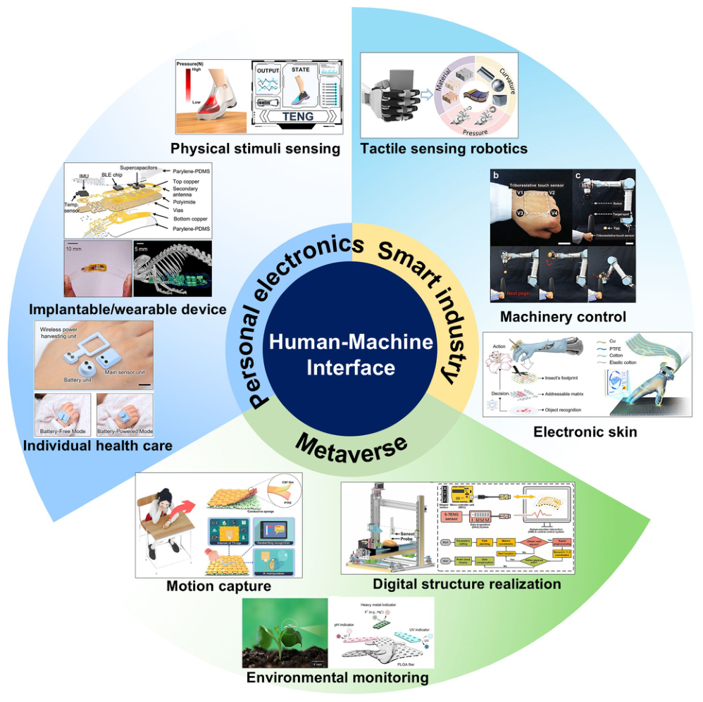

**Original caption:** Fig. 1 HMI technologies playing varied and crucial roles in next-generation human–machine interactions for the development of the automated and intelligent future lifestyle: Reprinted with permission from Ref. [5]. © 2023 Elsevier B.V. All rights reserved. Reprinted with permission from Ref. [6]. © 2024 Elsevier Inc. Reprinted with permission from Ref. [7]. Copyright © 2022, American Chemical Society. Reprinted with permission from Ref. [8]. © 2022 Wiley‐VCH GmbH. Reprinted with permission from Ref. [9]. © 2023 Elsevier Inc. Reprinted with permission from Ref. [10]. © 2024 Wiley‐VCH GmbH. Reprinted with permission from Ref. [11]. Copyright © 2022, Shen, S., et al. Reprinted with permission from Ref. [12]. Copyright © 2022, The American Association for the Advancement of Science. Reprinted with permission from Ref. [13]. © 2022 Elsevier Ltd. All rights reserved

**中文图注:** Fig. 1 原始图注已提取；逐项含义见下方分图说明。

**Reading note:** 结合正文首次引用位置和原始图注核对该图的证据角色。

- (v) 结合正文首次引用位置和原始图注核对该图的证据角色。 原文：All rights reserved. Reprinted with permission from Ref. [6]. © 2024 Elsevier Inc. Reprinted with permission from Ref. [7]. Copyright © 2022, American Chemical Society. Reprinted with permission from Ref. [8]. © 2022 Wiley‐VCH GmbH. Reprinted with permission from Ref. [9]. © 2023 Elsevier Inc. Reprinted with permission from Ref. [10]. © 2024 Wiley‐VCH GmbH. Reprinted with permission from Ref. [11]. Copyright © 2022, Shen, S., et al. Reprinted with permission from Ref. [12]. Copyright © 2022, The American Association for the Advancement of Science. Reprinted with permission from Ref. [13]. © 2022 Elsevier Ltd. All rights reserved

### Figure 2B

**Source:** p.4

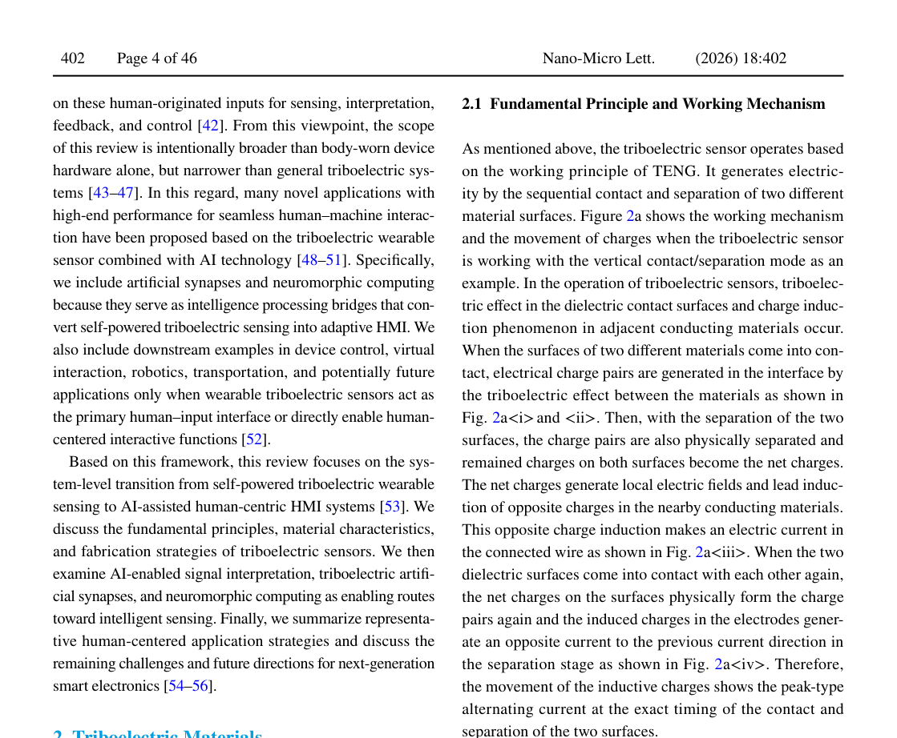

**Original caption:** Figure 2b shows the charge transfer phenomenon with an electron cloud model to describe the occurrence of the triboelectric effect when two different material surfaces come into contact with each other [57]. As shown in Fig. 2b<i>, the electrons of atoms and molecules form the electron clouds. The electron cloud includes the atomic or molecular orbitals and each atom is assumed as a potential well containing electrons. The distance between the electron clouds of the atoms of two materials, A and B, is defined as d. E1 and E2 are the depths of potential wells, which are the required energies for electrons to escape from the surfaces of materials A and B, respectively. EA and EB indicate the occupied energy levels of electrons in the atoms of materials A and B, respectively. In the normal condition, the electrons are confined in the potential well because EA and EB are smaller than E1 and E2, respectively. When the surfaces of the materials A and B come into contact with each other, the electron

**中文图注:** Figure 2B 原始图注已提取；逐项含义见下方分图说明。

**Reading note:** 重点查看机制模型与实验结果是否一致，以及关键结构参数的对照关系。

- (d) 结合正文首次引用位置和原始图注核对该图的证据角色。 原文：E1 and E2 are the depths of potential wells, which are the required energies for electrons to escape from the surfaces of materials A and B, respectively. EA and EB indicate the occupied energy levels of electrons in the atoms of materials A and B, respectively. In the normal condition, the electrons are confined in the potential well because EA and EB are smaller than E1 and E2, respectively. When the surfaces of the materials A and B come into contact with each other, the electron

### Fig. 2

**Source:** p.5

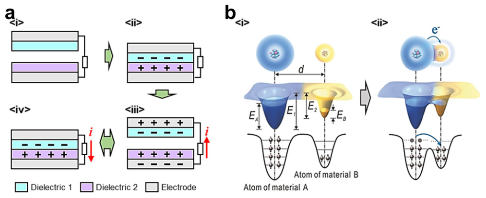

**Original caption:** Fig. 2 a Working mechanism of triboelectric sensor and b fundamental principle of triboelectric effect. Reprinted with permission from Ref. [57]. © 2018 WILEY‐VCH Verlag GmbH & Co. KGaA, Weinheim

**中文图注:** Fig. 2 原始图注已提取；逐项含义见下方分图说明。

**Reading note:** 重点查看机制模型与实验结果是否一致，以及关键结构参数的对照关系。

### Fig. 3

**Source:** p.6

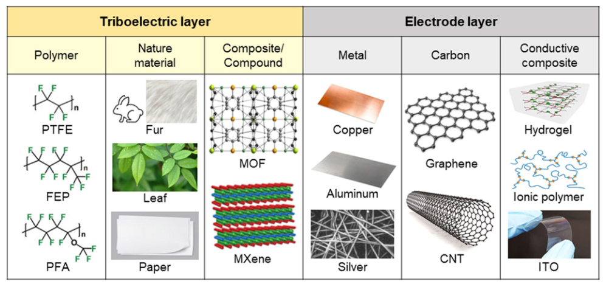

**Original caption:** Fig. 3 Major components and materials of the triboelectric sensor. Reprinted with permission from Ref. [71]. Copyright © 2023 Elsevier Ltd. All rights reserved. Reprinted with permission from Ref. [72]. © 2020 Elsevier Ltd. All rights reserved. Reprinted with permission from Ref. [73]. © 2024 Elsevier Ltd. All rights are reserved, including those for text and data mining, AI training, and similar technologies. Reprinted with permission from Ref. [74]. © 2021 Wiley‐VCH GmbH

**中文图注:** Fig. 3 原始图注已提取；逐项含义见下方分图说明。

**Reading note:** 结合正文首次引用位置和原始图注核对该图的证据角色。

### Fig. 4

**Source:** p.7

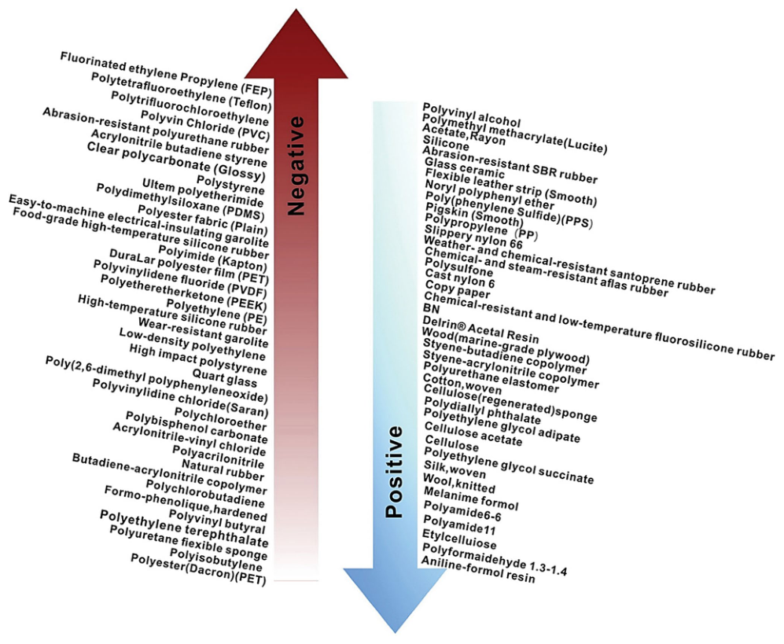

**Original caption:** Fig. 4 Triboelectric series. Reprinted with permission from Ref. [82]. © 2020 Wiley‐VCH GmbH

**中文图注:** Fig. 4 原始图注已提取；逐项含义见下方分图说明。

**Reading note:** 结合正文首次引用位置和原始图注核对该图的证据角色。

### Fig. 5

**Source:** p.8

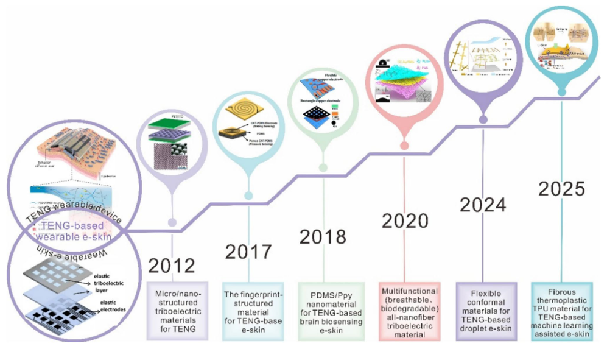

**Original caption:** Fig. 5 Rapid development of self-powered wearable sensor technologies. Reprinted with permission from Ref. [88]. © 2025 Elsevier Ltd. All rights are reserved, including those for text and data mining, AI training, and similar technologies

**中文图注:** Fig. 5 原始图注已提取；逐项含义见下方分图说明。

**Reading note:** 结合正文首次引用位置和原始图注核对该图的证据角色。

### Fig. 6

**Source:** p.10

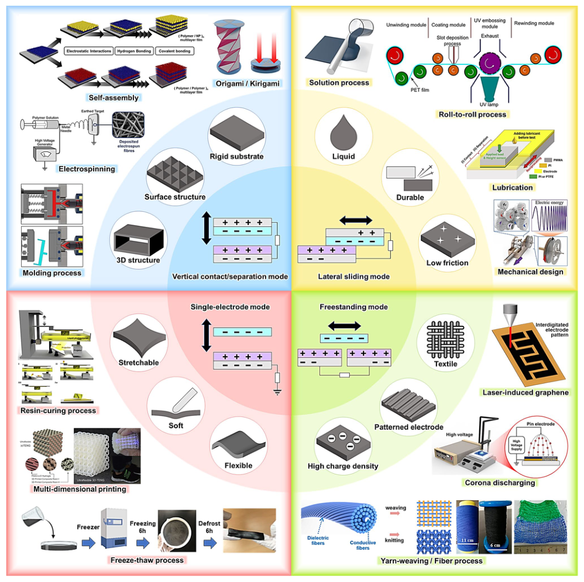

**Original caption:** Fig. 6 Operation modes, material characteristics, and fabrication processes of the triboelectric sensor. Reprinted with permission from Ref. [117]. © 2018 Elsevier Ltd. All rights reserved. Reprinted with permission from Ref. [118]. © 2021 Jihoon Chung et al. Reprinted with permission from Ref. [119]. Copyright © 2016, Dhakar, L., et al. Reprinted with permission from Ref. [120]. © 2020 Elsevier Ltd. All rights reserved. Reprinted with permission from Ref. [121]. © 2018 Lee, S., et al. Published by Elsevier Ltd. Reprinted with permission from Ref. [73]. © 2024 Elsevier Ltd. All rights are reserved, including those for text and data mining, AI training, and similar technologies. Reprinted with permission from Ref. [122]. © 2022 Elsevier Ltd. All rights reserved. Reprinted with permission from Ref. [123]. © Ra, Y., et al. 2025. Reprinted with permission from Ref. [124]. Copyright © 2023 Yoonsang Ra et al. Reprinted with permission from Ref. [125]. Copyright © 2014 Woodhead Publishing Limited. All rights reserved. Reprinted with permission from Ref. [126]. © 2020 Wu, J., et al. Published by Elsevier Ltd. Reprinted with permission from Ref. [127]. © 2019 Elsevier Ltd. All rights reserved. Reprinted with permission from Ref. [128]. Copyright © 2017, American Chemical Society

**中文图注:** Fig. 6 原始图注已提取；逐项含义见下方分图说明。

**Reading note:** 重点查看器件结构、材料层次、信号路径和制备流程。

### Fig. 7

**Source:** p.12

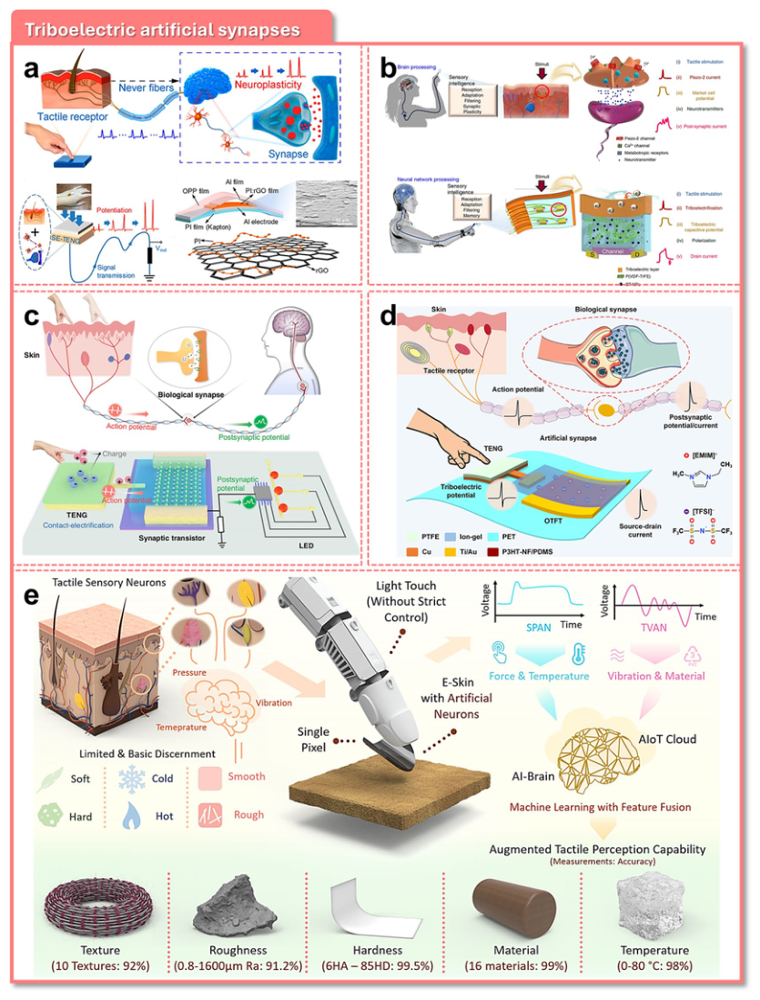

**Original caption:** Fig. 7 Triboelectric artificial synapses. a Artificial self-powered tactile sensor with learning and memory. Reprinted with permission from Ref. [145]. Copyright © 2020, American Chemical Society. b A flexible artificial intrinsic-synaptic tactile sensor. Reprinted with permission from Ref. [146]. Copyright © 2020, Yu Rim Lee et al. c Contact electrification-activated artificial afferents. Reprinted with permission from Ref. [147]. Copyright © 2021, Jinran Yu et al. d Biological afferent nervous system-based TAS device. Reprinted with permission from Ref. [148]. Copyright © 2022, Jianhua Zeng et al. e Zero-biased bionic fingertip e-skin with multimodal tactile perception. Reprinted with permission from Ref. [149]. © 2024 Wiley‐VCH GmbH

**中文图注:** Fig. 7 原始图注已提取；逐项含义见下方分图说明。

**Reading note:** 结合正文首次引用位置和原始图注核对该图的证据角色。

- (a) 结合正文首次引用位置和原始图注核对该图的证据角色。 原文：Artificial self-powered tactile sensor with learning and memory. Reprinted with permission from Ref. [145]. Copyright © 2020, American Chemical Society
- (b) 结合正文首次引用位置和原始图注核对该图的证据角色。 原文：A flexible artificial intrinsic-synaptic tactile sensor. Reprinted with permission from Ref. [146]. Copyright © 2020, Yu Rim Lee et al
- (c) 结合正文首次引用位置和原始图注核对该图的证据角色。 原文：Contact electrification-activated artificial afferents. Reprinted with permission from Ref. [147]. Copyright © 2021, Jinran Yu et al
- (d) 结合正文首次引用位置和原始图注核对该图的证据角色。 原文：Biological afferent nervous system-based TAS device. Reprinted with permission from Ref. [148]. Copyright © 2022, Jianhua Zeng et al
- (e) 结合正文首次引用位置和原始图注核对该图的证据角色。 原文：Zero-biased bionic fingertip e-skin with multimodal tactile perception. Reprinted with permission from Ref. [149]. © 2024 Wiley‐VCH GmbH

### Fig. 8

**Source:** p.17

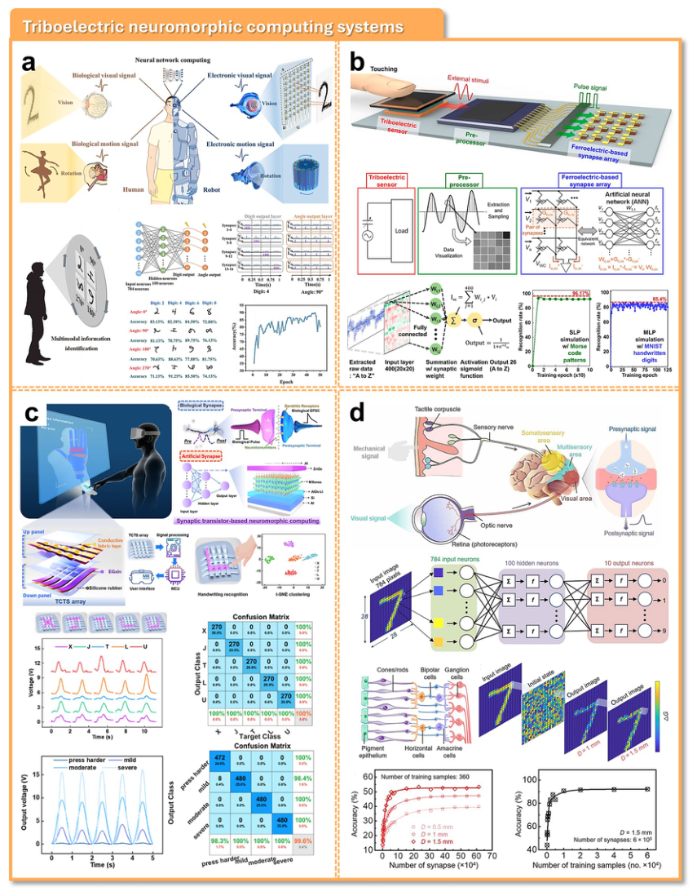

**Original caption:** Fig. 8 Triboelectric neuromorphic computing systems. a Bioinspired artificial motion sensory system for rapid self-protection. Reprinted with permission from Ref. [155]. Copyright © 2022, American Chemical Society. b Tactile neuromorphic system based on triboelectric polymer sensor. Reprinted with permission from Ref. [156]. Copyright © 2023, American Chemical Society. c Neuromorphic computing-assisted triboelectric–capacitive-coupled tactile sensor array. Reprinted with permission from Ref. [157]. © 2024 American Chemical Society. d Biological tactile/visual neurons and mechano-photonic artificial synapse. Reprinted with permission from Ref. [158]. Copyright © 2021, The American Association for the Advancement of Science

**中文图注:** Fig. 8 原始图注已提取；逐项含义见下方分图说明。

**Reading note:** 重点查看阵列规模、空间分辨率、串扰、读出通道和空间特征表达。

- (a) 结合正文首次引用位置和原始图注核对该图的证据角色。 原文：Bioinspired artificial motion sensory system for rapid self-protection. Reprinted with permission from Ref. [155]. Copyright © 2022, American Chemical Society
- (b) 结合正文首次引用位置和原始图注核对该图的证据角色。 原文：Tactile neuromorphic system based on triboelectric polymer sensor. Reprinted with permission from Ref. [156]. Copyright © 2023, American Chemical Society
- (c) 重点查看阵列规模、空间分辨率、串扰、读出通道和空间特征表达。 原文：Neuromorphic computing-assisted triboelectric–capacitive-coupled tactile sensor array. Reprinted with permission from Ref. [157]. © 2024 American Chemical Society
- (d) 结合正文首次引用位置和原始图注核对该图的证据角色。 原文：Biological tactile/visual neurons and mechano-photonic artificial synapse. Reprinted with permission from Ref. [158]. Copyright © 2021, The American Association for the Advancement of Science

### Fig. 9

**Source:** p.21

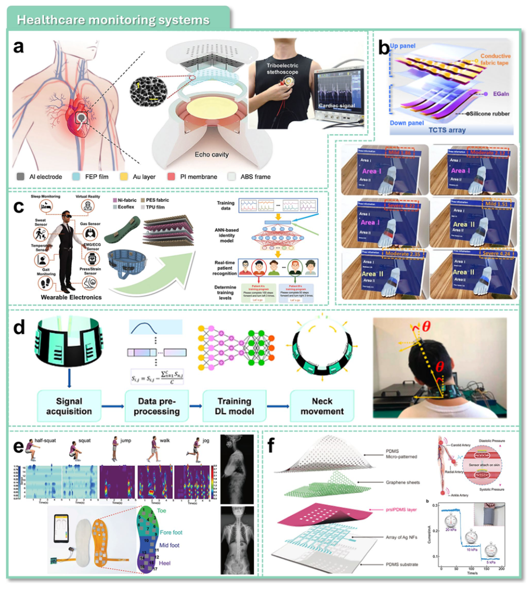

**Original caption:** Fig. 9 Applications of health care. a Triboelectric stethoscope for ultrasensitive cardiac sounds sensing. Reprinted with permission from Ref. [159]. © 2024 Wiley‐VCH GmbH. b Self-powered acupressure sensing. Reprinted with permission from Ref. [157]. © 2024 American Chemical Society. c Triboelectric wearable sensor enabled gait analysis and waist motion. Reprinted with permission from Ref. [163]. © 2021 Zhang, Q., et al. Advanced Science published by Wiley‐VCH GmbH. d Triboelectric sensor enabled neck motion detection. Reprinted with permission from Ref. [165]. Copyright © 2022, American Chemical Society. e Active-matrix sensing array for lumbar degenerative disease diagnosis. Reprinted with permission from Ref. [167]. © 2022 Wiley‐VCH GmbH. f Real-time detection of human pulse. Reprinted with permission from Ref. [168]. Copyright © 2023, Yufei Zhang et al.

**中文图注:** Fig. 9 原始图注已提取；逐项含义见下方分图说明。

**Reading note:** 重点查看阵列规模、空间分辨率、串扰、读出通道和空间特征表达。

- (a) 结合正文首次引用位置和原始图注核对该图的证据角色。 原文：Triboelectric stethoscope for ultrasensitive cardiac sounds sensing. Reprinted with permission from Ref. [159]. © 2024 Wiley‐VCH GmbH
- (b) 结合正文首次引用位置和原始图注核对该图的证据角色。 原文：Self-powered acupressure sensing. Reprinted with permission from Ref. [157]. © 2024 American Chemical Society
- (c) 结合正文首次引用位置和原始图注核对该图的证据角色。 原文：Triboelectric wearable sensor enabled gait analysis and waist motion. Reprinted with permission from Ref. [163]. © 2021 Zhang, Q., et al. Advanced Science published by Wiley‐VCH GmbH
- (d) 结合正文首次引用位置和原始图注核对该图的证据角色。 原文：Triboelectric sensor enabled neck motion detection. Reprinted with permission from Ref. [165]. Copyright © 2022, American Chemical Society
- (e) 重点查看阵列规模、空间分辨率、串扰、读出通道和空间特征表达。 原文：Active-matrix sensing array for lumbar degenerative disease diagnosis. Reprinted with permission from Ref. [167]. © 2022 Wiley‐VCH GmbH
- (f) 结合正文首次引用位置和原始图注核对该图的证据角色。 原文：Real-time detection of human pulse. Reprinted with permission from Ref. [168]. Copyright © 2023, Yufei Zhang et al

### Fig. 10

**Source:** p.23

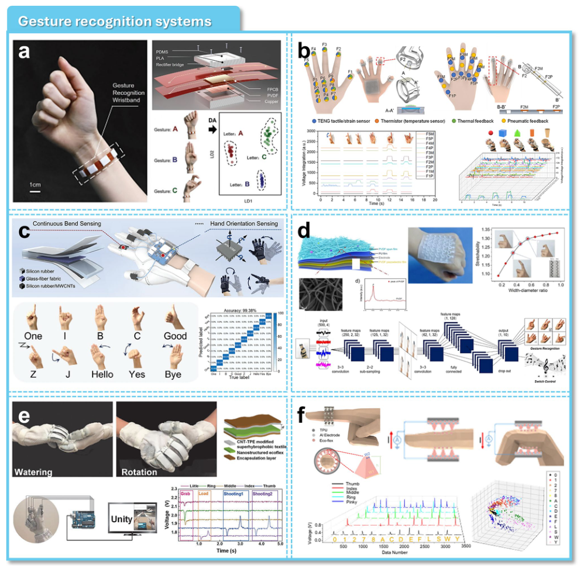

**Original caption:** Fig. 10 Applications of gesture recognition. a A self-powered gesture recognition wristband for full keyboard. Reprinted with permission from Ref. [169]. © 2022 Wiley‐VCH GmbH. b Smart modular glove for multimodal sensing and augmented haptic feedback. Reprinted with permission from Ref. [29]. Copyright © 2022, American Chemical Society. c Triboelectric-inertial sensing glove. Reprinted with permission from Ref. [170]. © 2024 Linhong Ji et al., Advanced Science published by Wiley‐VCH GmbH. d Self-powered tactile sensor using deep learning algorithms. Reprinted with permission from Ref. [160]. Copyright © 2022, American Chemical Society. e A Self-powered conductive superhydrophobic triboelectric textile sensor. Reprinted with permission from Ref. [171]. © 2020 Wen, F., et al. Published by WILEY‐VCH Verlag GmbH & Co. KGaA, Weinheim. f ATH-Ring-based intelligent system. Reprinted with permission from Ref. [172]. Copyright © 2022, Zhongda Sun et al.

**中文图注:** Fig. 10 原始图注已提取；逐项含义见下方分图说明。

**Reading note:** 重点查看任务设置、基线、消融和失败案例，判断系统演示是否真正支撑前端价值。

- (a) 重点查看任务设置、基线、消融和失败案例，判断系统演示是否真正支撑前端价值。 原文：A self-powered gesture recognition wristband for full keyboard. Reprinted with permission from Ref. [169]. © 2022 Wiley‐VCH GmbH
- (b) 结合正文首次引用位置和原始图注核对该图的证据角色。 原文：Smart modular glove for multimodal sensing and augmented haptic feedback. Reprinted with permission from Ref. [29]. Copyright © 2022, American Chemical Society
- (c) 结合正文首次引用位置和原始图注核对该图的证据角色。 原文：Triboelectric-inertial sensing glove. Reprinted with permission from Ref. [170]. © 2024 Linhong Ji et al., Advanced Science published by Wiley‐VCH GmbH
- (d) 结合正文首次引用位置和原始图注核对该图的证据角色。 原文：Self-powered tactile sensor using deep learning algorithms. Reprinted with permission from Ref. [160]. Copyright © 2022, American Chemical Society
- (e) 结合正文首次引用位置和原始图注核对该图的证据角色。 原文：A Self-powered conductive superhydrophobic triboelectric textile sensor. Reprinted with permission from Ref. [171]. © 2020 Wen, F., et al. Published by WILEY‐VCH Verlag GmbH & Co. KGaA, Weinheim
- (f) 结合正文首次引用位置和原始图注核对该图的证据角色。 原文：ATH-Ring-based intelligent system. Reprinted with permission from Ref. [172]. Copyright © 2022, Zhongda Sun et al

### Fig. 11

**Source:** p.25

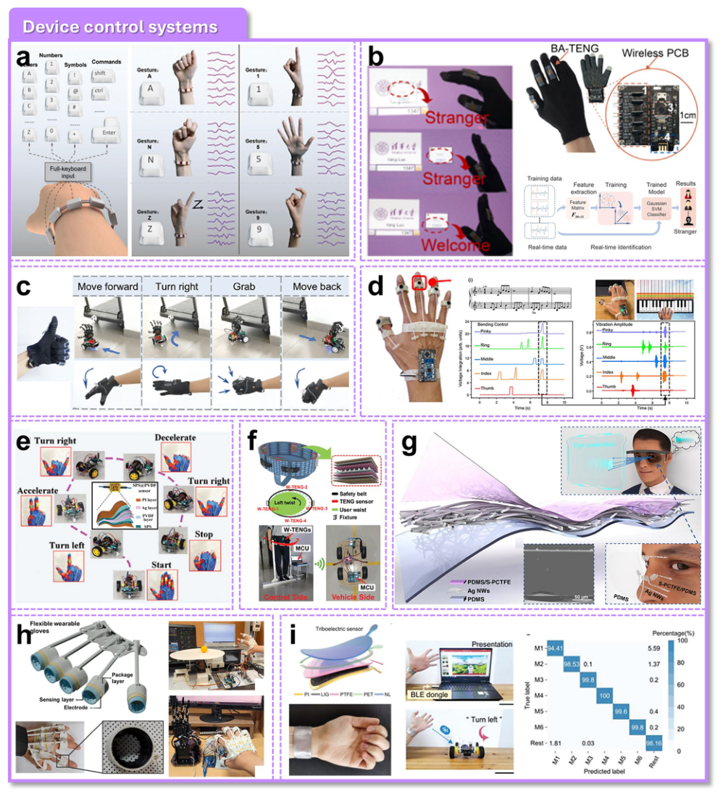

**Original caption:** Fig. 11 Applications of device control. a Smart gesture recognition sensor for universal sign language. Reprinted with permission from Ref. [169]. © 2022 Wiley‐ VCH GmbH. b Smart glove based on triboelectric bending sensor. Reprinted with permission from Ref. [175]. © 2021 Elsevier Ltd. All rights reserved. c Playing virtual piano with multiple fingers. Reprinted with permission from Ref. [170]. © 2024 Linghong Ji et al., Advanced Science published by Wiley‐VCH GmbH. d A self-powered intelligent shooting system for improving police shooting technology. Reprinted with permission from Ref. [172]. Copyright © 2022, Zhongda Sun et al. e Toy cars control by recognizing hand gesture. Reprinted with permission from Ref. [176]. © 2024 Wiley‐VCH GmbH. f Smart belt based on TES to control the vehicle. Reprinted with permission from Ref. [163]. © 2021 Chengkuo Lee et al., Advanced Science published by Wiley‐VCH GmbH. g TENG-based electrostatic interface for sensing eye tracking. Reprinted with permission from Ref. [161]. Copyright © 2023, Yuxiang Shi et al. h 3D-printed flexible wearable glove assembled with STTS. Reprinted with permission from Ref. [177]. © 2022 Elsevier Ltd. All rights reserved. i Triboelectric smart wristband for HMI. Reprinted with permission from Ref. [178]. © 2023 Hao Wu et al., Advanced Science published by Wiley‐VCH GmbH

**中文图注:** Fig. 11 原始图注已提取；逐项含义见下方分图说明。

**Reading note:** 重点查看任务设置、基线、消融和失败案例，判断系统演示是否真正支撑前端价值。

- (a) 重点查看任务设置、基线、消融和失败案例，判断系统演示是否真正支撑前端价值。 原文：Smart gesture recognition sensor for universal sign language. Reprinted with permission from Ref. [169]. © 2022 Wiley‐ VCH GmbH
- (b) 结合正文首次引用位置和原始图注核对该图的证据角色。 原文：Smart glove based on triboelectric bending sensor. Reprinted with permission from Ref. [175]. © 2021 Elsevier Ltd. All rights reserved
- (c) 结合正文首次引用位置和原始图注核对该图的证据角色。 原文：Playing virtual piano with multiple fingers. Reprinted with permission from Ref. [170]. © 2024 Linghong Ji et al., Advanced Science published by Wiley‐VCH GmbH
- (d) 结合正文首次引用位置和原始图注核对该图的证据角色。 原文：A self-powered intelligent shooting system for improving police shooting technology. Reprinted with permission from Ref. [172]. Copyright © 2022, Zhongda Sun et al
- (e) 结合正文首次引用位置和原始图注核对该图的证据角色。 原文：Toy cars control by recognizing hand gesture. Reprinted with permission from Ref. [176]. © 2024 Wiley‐VCH GmbH
- (f) 结合正文首次引用位置和原始图注核对该图的证据角色。 原文：Smart belt based on TES to control the vehicle. Reprinted with permission from Ref. [163]. © 2021 Chengkuo Lee et al., Advanced Science published by Wiley‐VCH GmbH
- (g) 结合正文首次引用位置和原始图注核对该图的证据角色。 原文：TENG-based electrostatic interface for sensing eye tracking. Reprinted with permission from Ref. [161]. Copyright © 2023, Yuxiang Shi et al
- (h) 结合正文首次引用位置和原始图注核对该图的证据角色。 原文：3D-printed flexible wearable glove assembled with STTS. Reprinted with permission from Ref. [177]. © 2022 Elsevier Ltd. All rights reserved
- (i) 结合正文首次引用位置和原始图注核对该图的证据角色。 原文：Triboelectric smart wristband for HMI. Reprinted with permission from Ref. [178]. © 2023 Hao Wu et al., Advanced Science published by Wiley‐VCH GmbH

### Fig. 12

**Source:** p.27

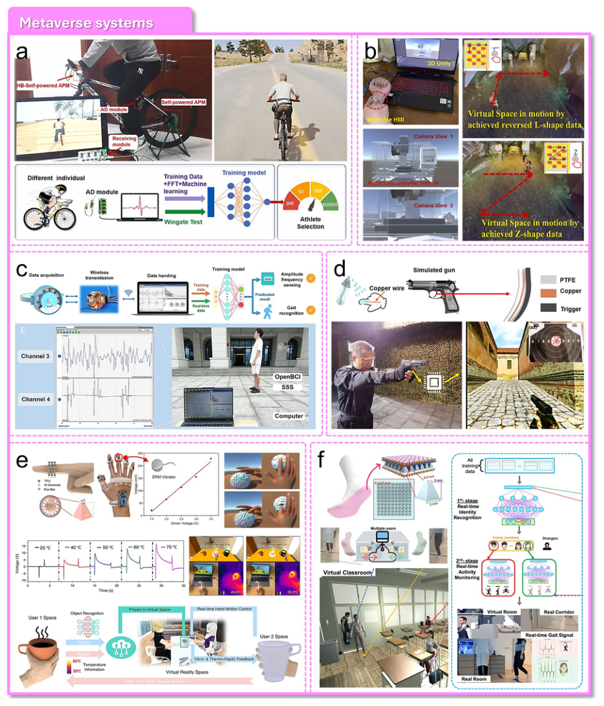

**Original caption:** Fig. 12 Applications of metaverse. a A real–virtual interaction system. Reprinted with permission from Ref. [182]. © 2023 Elsevier Ltd. All rights reserved. b A self-powered HMI sensor and virtual game activities applications. Reprinted with permission from Ref. [183]. © 2022 Elsevier Ltd. All rights reserved. c Amplitude–frequency sensing and gait recognition based on deep learning. Reprinted with permission from Ref. [182]. © 2024 Elsevier B.V. All rights are reserved, including those for text and data mining, AI training, and similar technologies. d A selfpowered intelligent shooting system for improving police shooting technology. Reprinted with permission from Ref. [185]. Songyang Li et al., Materials, published by MDPI, 2022. e Multimodal sensing and feedback platform for metaverse. Reprinted with permission from Ref. [172]. Copyright © 2022, Zhongda Sun et al. f Multimodal sensing and feedback platform for metaverse. Reprinted with permission from Ref. [186]. Copyright © 2020, Zixuan Zhang et al.

**中文图注:** Fig. 12 原始图注已提取；逐项含义见下方分图说明。

**Reading note:** 重点查看任务设置、基线、消融和失败案例，判断系统演示是否真正支撑前端价值。

- (a) 结合正文首次引用位置和原始图注核对该图的证据角色。 原文：A real–virtual interaction system. Reprinted with permission from Ref. [182]. © 2023 Elsevier Ltd. All rights reserved
- (b) 重点查看任务设置、基线、消融和失败案例，判断系统演示是否真正支撑前端价值。 原文：A self-powered HMI sensor and virtual game activities applications. Reprinted with permission from Ref. [183]. © 2022 Elsevier Ltd. All rights reserved
- (c) 重点查看任务设置、基线、消融和失败案例，判断系统演示是否真正支撑前端价值。 原文：Amplitude–frequency sensing and gait recognition based on deep learning. Reprinted with permission from Ref. [182]. © 2024 Elsevier B.V. All rights are reserved, including those for text and data mining, AI training, and similar technologies
- (d) 结合正文首次引用位置和原始图注核对该图的证据角色。 原文：A selfpowered intelligent shooting system for improving police shooting technology. Reprinted with permission from Ref. [185]. Songyang Li et al., Materials, published by MDPI, 2022
- (e) 结合正文首次引用位置和原始图注核对该图的证据角色。 原文：Multimodal sensing and feedback platform for metaverse. Reprinted with permission from Ref. [172]. Copyright © 2022, Zhongda Sun et al
- (f) 结合正文首次引用位置和原始图注核对该图的证据角色。 原文：Multimodal sensing and feedback platform for metaverse. Reprinted with permission from Ref. [186]. Copyright © 2020, Zixuan Zhang et al

### Fig. 13

**Source:** p.30

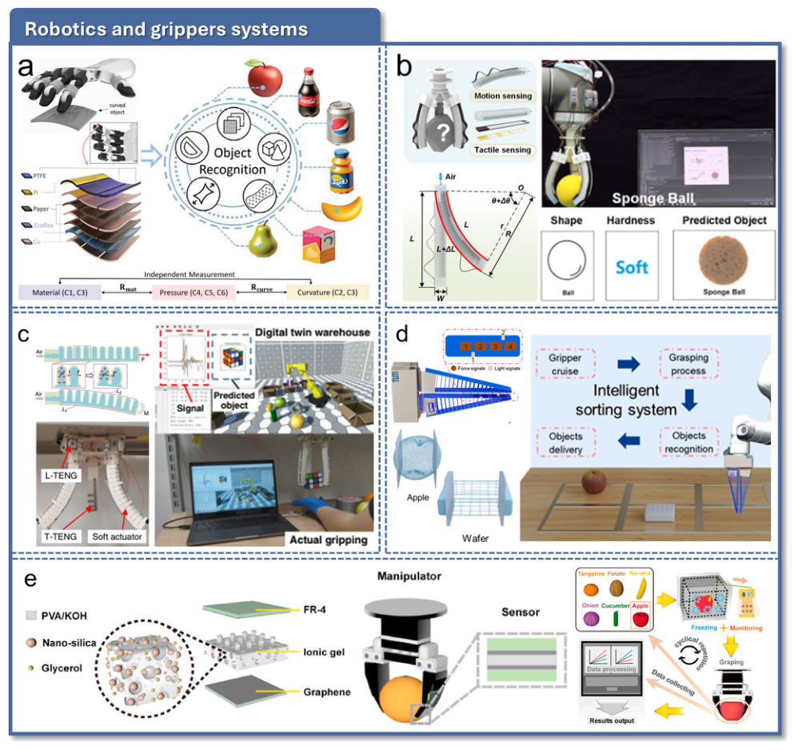

**Original caption:** Fig. 13 Applications of robotics and soft gripper. a Triboelectric multimodal tactile sensor (TMTS) with intelligent robotic finger for object recognition. Reprinted with permission from Ref. [10]. © 2024 Wiley‐VCH GmbH. b Soft gripper based on multimodal sensing for real-time recognition by using the trained CNN model. Reprinted with permission from Ref. [191]. Copyright © 2024, American Chemical Society. c Smart gripper integrated digital twin unmanned warehouse system. Reprinted with permission from Ref. [192]. Copyright © 2020, The Tao Jin et al. d Smart grasp by the tactile perception system for intelligent sorting system. Reprinted with permission from Ref. [193]. © 2024 Tianxiao Xiao et al., Published by Elsevier Ltd. e Object recognition function of smart gripper for grabbing different fruits and vegetables. Reprinted with permission from Ref. [194]. © 2024 Elsevier Ltd. All rights reserved

**中文图注:** Fig. 13 原始图注已提取；逐项含义见下方分图说明。

**Reading note:** 重点查看任务设置、基线、消融和失败案例，判断系统演示是否真正支撑前端价值。

- (a) 重点查看任务设置、基线、消融和失败案例，判断系统演示是否真正支撑前端价值。 原文：Triboelectric multimodal tactile sensor (TMTS) with intelligent robotic finger for object recognition. Reprinted with permission from Ref. [10]. © 2024 Wiley‐VCH GmbH
- (b) 重点查看任务设置、基线、消融和失败案例，判断系统演示是否真正支撑前端价值。 原文：Soft gripper based on multimodal sensing for real-time recognition by using the trained CNN model. Reprinted with permission from Ref. [191]. Copyright © 2024, American Chemical Society
- (c) 结合正文首次引用位置和原始图注核对该图的证据角色。 原文：Smart gripper integrated digital twin unmanned warehouse system. Reprinted with permission from Ref. [192]. Copyright © 2020, The Tao Jin et al
- (d) 重点查看任务设置、基线、消融和失败案例，判断系统演示是否真正支撑前端价值。 原文：Smart grasp by the tactile perception system for intelligent sorting system. Reprinted with permission from Ref. [193]. © 2024 Tianxiao Xiao et al., Published by Elsevier Ltd
- (e) 重点查看任务设置、基线、消融和失败案例，判断系统演示是否真正支撑前端价值。 原文：Object recognition function of smart gripper for grabbing different fruits and vegetables. Reprinted with permission from Ref. [194]. © 2024 Elsevier Ltd. All rights reserved

### Fig. 14

**Source:** p.32

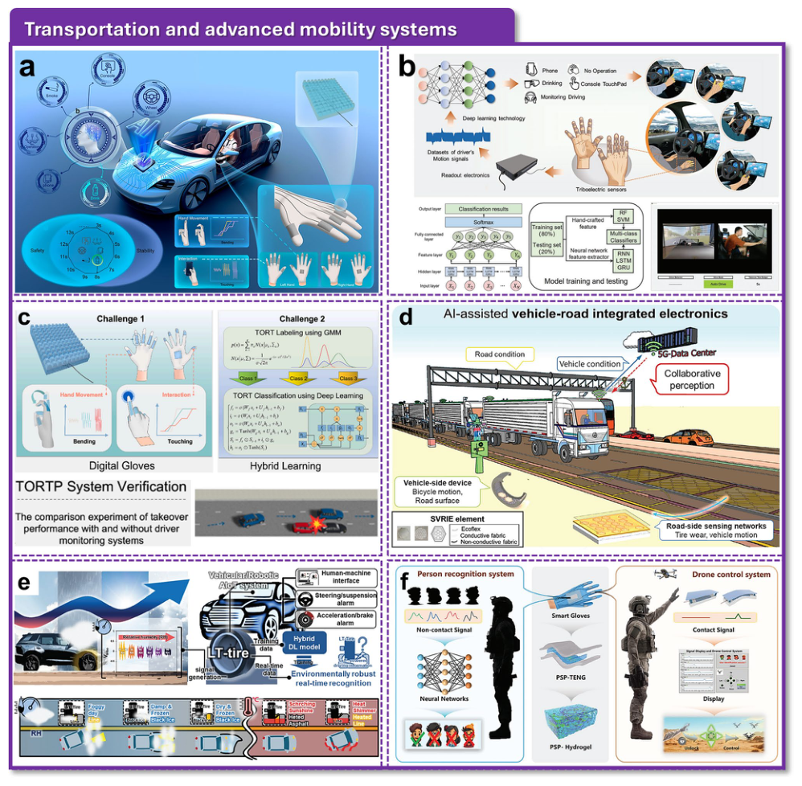

**Original caption:** Fig. 14 Applications of intelligent transportation and advanced mobility. a Wearable triboelectric sensor gloves for real-time behavior identification and takeover time adjustment in conditionally automated vehicles. Reprinted with permission from Ref. [195]. Copyright © 2025, Xiao Lu et al. b Real-time non-driving behavior recognition using deep learning-assisted triboelectric sensors in conditionally automated driving. Reprinted with permission from Ref. [196]. © 2022 Wiley‐VCH GmbH. c Inference of takeover time budget for level 3 autonomous vehicles using triboelectric sensors and hybrid learning. Reprinted with permission from Ref. [197]. © 2025 Elsevier B.V. All rights are reserved, including those for text and data mining, AI training, and similar technologies. d AI-assisted self-powered vehicle–road integrated electronics for intelligent transportation collaborative perception. Reprinted with permission from Ref. [198]. © 2024 Wiley‐VCH GmbH. e Environmentally robust triboelectric tire monitoring system for self-powered driving information recognition. Reprinted with permission from Ref. [199]. © 2024 Wiley‐VCH GmbH f Self-healing hydrogel-based triboelectric smart glove for integrated drone safety protection and motion control. Reprinted with permission from Ref. [200]. © 2024 Wiley‐VCH GmbH

**中文图注:** Fig. 14 原始图注已提取；逐项含义见下方分图说明。

**Reading note:** 重点查看任务设置、基线、消融和失败案例，判断系统演示是否真正支撑前端价值。

- (a) 结合正文首次引用位置和原始图注核对该图的证据角色。 原文：Wearable triboelectric sensor gloves for real-time behavior identification and takeover time adjustment in conditionally automated vehicles. Reprinted with permission from Ref. [195]. Copyright © 2025, Xiao Lu et al
- (b) 重点查看任务设置、基线、消融和失败案例，判断系统演示是否真正支撑前端价值。 原文：Real-time non-driving behavior recognition using deep learning-assisted triboelectric sensors in conditionally automated driving. Reprinted with permission from Ref. [196]. © 2022 Wiley‐VCH GmbH
- (c) 结合正文首次引用位置和原始图注核对该图的证据角色。 原文：Inference of takeover time budget for level 3 autonomous vehicles using triboelectric sensors and hybrid learning. Reprinted with permission from Ref. [197]. © 2025 Elsevier B.V. All rights are reserved, including those for text and data mining, AI training, and similar technologies
- (d) 结合正文首次引用位置和原始图注核对该图的证据角色。 原文：AI-assisted self-powered vehicle–road integrated electronics for intelligent transportation collaborative perception. Reprinted with permission from Ref. [198]. © 2024 Wiley‐VCH GmbH
- (e) 重点查看任务设置、基线、消融和失败案例，判断系统演示是否真正支撑前端价值。 原文：Environmentally robust triboelectric tire monitoring system for self-powered driving information recognition. Reprinted with permission from Ref. [199]. © 2024 Wiley‐VCH GmbH f Self-healing hydrogel-based triboelectric smart glove for integrated drone safety protection and motion control. Reprinted with permission from Ref. [200]. © 2024 Wiley‐VCH GmbH

### Fig. 15

**Source:** p.35

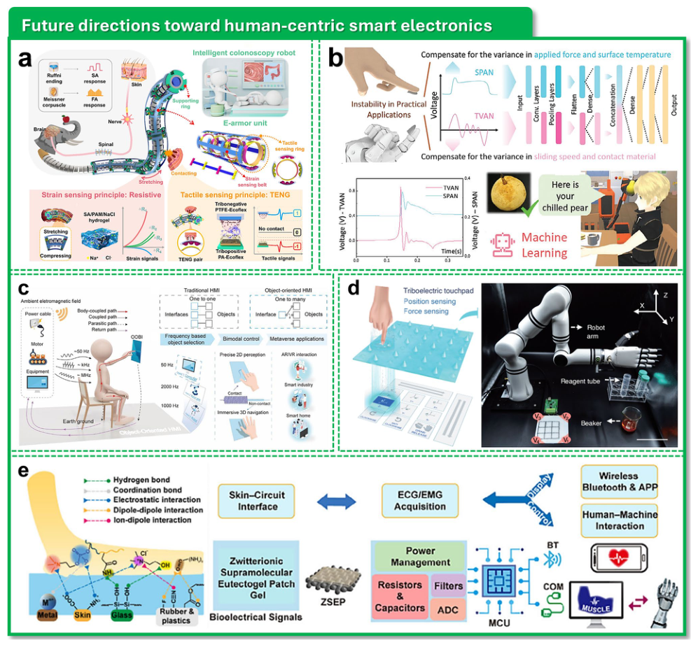

**Original caption:** Fig. 15 Future directions toward human-centric smart electronics. a Intelligent colonoscopy robot with stretchable electronic armor for bimodal tactile and strain sensing. Reprinted with permission from Ref. [207]. © 2025 Sun et al., Advanced Materials published by Wiley‐VCH GmbH. b Zero-biased bionic fingertip e-skin for multimodal tactile perception and machine learning-assisted holistic touch awareness. Reprinted with permission from Ref. [149]. © 2024 Wiley‐VCH GmbH. c Body-coupled-driven object-oriented natural interactive interface for hybrid 2D tactile and 3D spatial interaction. Reprinted with permission from Ref. [208]. © 2025 Wiley‐VCH GmbH. d Biomimetic hairy triboelectric touchpad for multimodal position and force sensing with dexterous robotic manipulation. Reprinted with permission from Ref. [150]. Copyright © 2026, Hong et al. e Skin-inspired supramolecular zwitterionic eutectogel interfaces for wearable sensing, physiological monitoring, and human– machine interaction. Reprinted with permission from Ref. [209]. © 2025 Wiley‐VCH GmbH

**中文图注:** Fig. 15 原始图注已提取；逐项含义见下方分图说明。

**Reading note:** 重点查看标定方法、量程、误差、线性和动态响应，避免只比较单一灵敏度。

- (a) 重点查看任务设置、基线、消融和失败案例，判断系统演示是否真正支撑前端价值。 原文：Intelligent colonoscopy robot with stretchable electronic armor for bimodal tactile and strain sensing. Reprinted with permission from Ref. [207]. © 2025 Sun et al., Advanced Materials published by Wiley‐VCH GmbH
- (b) 结合正文首次引用位置和原始图注核对该图的证据角色。 原文：Zero-biased bionic fingertip e-skin for multimodal tactile perception and machine learning-assisted holistic touch awareness. Reprinted with permission from Ref. [149]. © 2024 Wiley‐VCH GmbH
- (c) 重点查看阵列规模、空间分辨率、串扰、读出通道和空间特征表达。 原文：Body-coupled-driven object-oriented natural interactive interface for hybrid 2D tactile and 3D spatial interaction. Reprinted with permission from Ref. [208]. © 2025 Wiley‐VCH GmbH
- (d) 重点查看标定方法、量程、误差、线性和动态响应，避免只比较单一灵敏度。 原文：Biomimetic hairy triboelectric touchpad for multimodal position and force sensing with dexterous robotic manipulation. Reprinted with permission from Ref. [150]. Copyright © 2026, Hong et al
- (e) 结合正文首次引用位置和原始图注核对该图的证据角色。 原文：Skin-inspired supramolecular zwitterionic eutectogel interfaces for wearable sensing, physiological monitoring, and human– machine interaction. Reprinted with permission from Ref. [209]. © 2025 Wiley‐VCH GmbH

### Fig. 16

**Source:** p.37

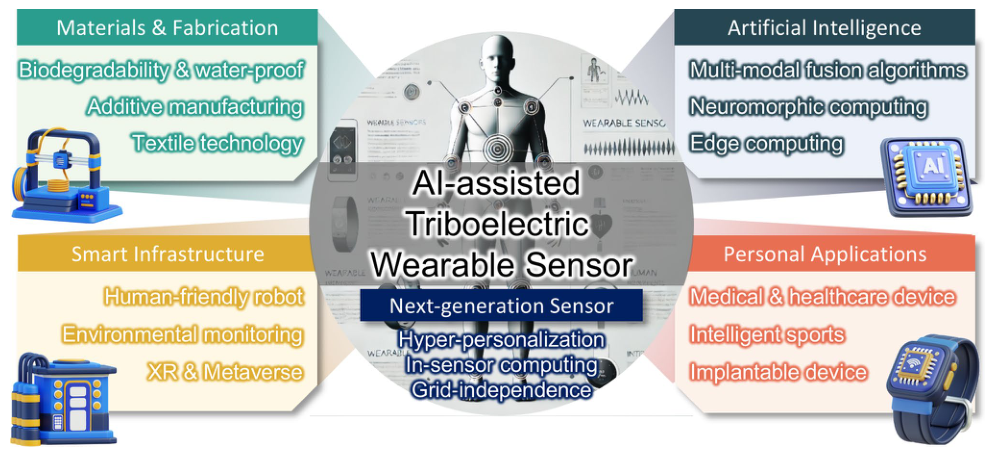

**Original caption:** Fig. 16 Summary, challenges, and perspectives of AI-assisted triboelectric wearable sensor

**中文图注:** Fig. 16 原始图注已提取；逐项含义见下方分图说明。

**Reading note:** 结合正文首次引用位置和原始图注核对该图的证据角色。
