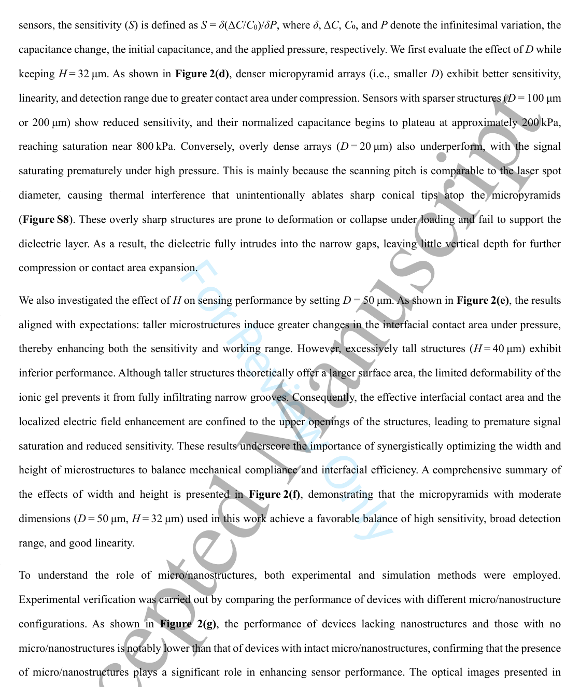
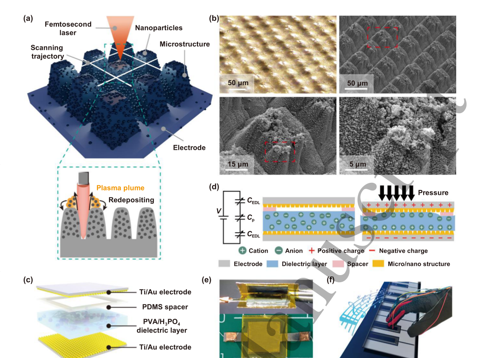
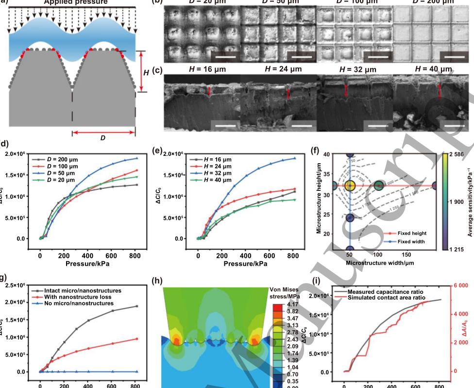
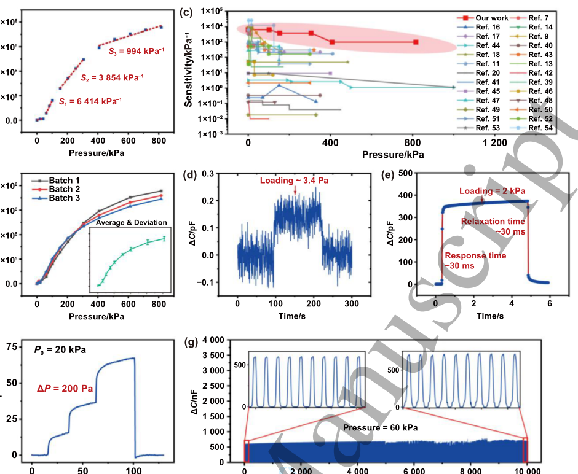
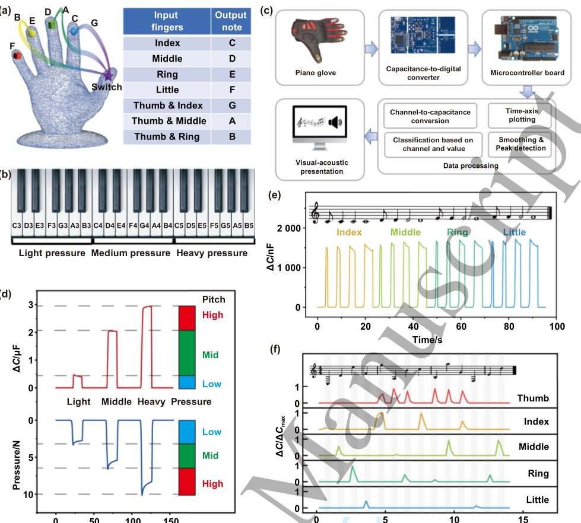
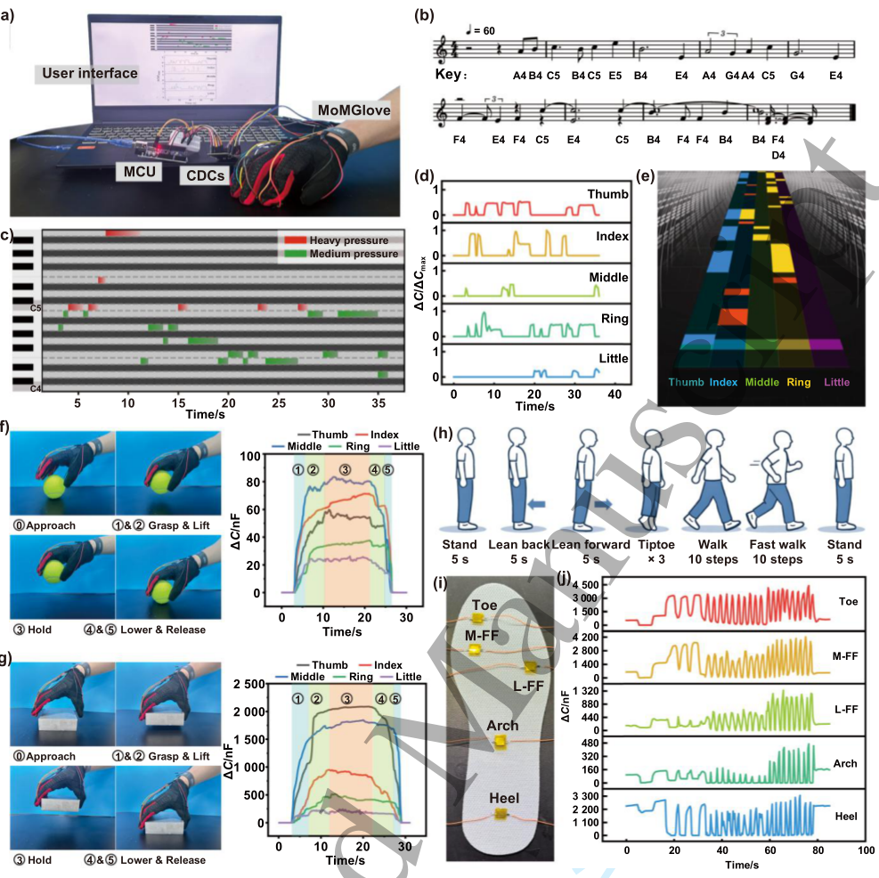

# Femtosecond laser-engraved ultra-broad-range pressure sensors with enhanced sensitivity

- 期刊：International Journal of Extreme Manufacturing
- 日期：2026-06-29
- DOI：10.1088/2631-7990/ae83ec
- 解析状态：fulltext_draft

## 摘要与研究价值

**Original:** Abstract Achieving flexible pressure sensors that simultaneously combine ultra-high sensitivity, ultra-broad detection range, and low detection limit remains a major challenge due to the intrinsic trade-off between signal sensitivity and working span. Here, we demonstrate a femtosecond laser engraving approach that directly constructs programmable hybrid micro/nanostructures on metallic electrodes in a single, mask-free step. This top-down laser patterning process produces dual-scale micro/nanostructures, significantly expanding the interfacial coupling region and enhancing sensor performance. The resulting iontronic pressure sensors exhibit extreme capabilities, characterized by a maximum sensitivity reaching 6414 kPa -1 , a wide sensing range up to 800 kPa, a low detection threshold of 3.4 Pa, rapid signal response (~30 ms), and excellent cycling stability. For demonstration, the sensors were integrated into a wearable multi-octave glove system, validating their robustness in multifunctional pressure recognition. This work highlights the femtosecond laser-based approach as an efficient and scalable manufacturing method for tunable, hybrid micro/nanostructures, opening new opportunities for advanced electronic skins, intelligent robotics, and human-machine interfaces.

**中文:** 提供机器人、可穿戴或电子皮肤系统任务证据；可用于低离散/装配容差触觉界面的结构与对照设计。摘要可核实数值包括：6414 kPa、800 kPa、3.4 Pa、30 ms。

## 创新点

- Abstract Achieving flexible pressure sensors that simultaneously combine ultra-high sensitivity, ultra-broad detection range, and low detection limit remains a major challenge due to the intrinsic trade-off between signal sensitivity and working span.
- 提供机器人、可穿戴或电子皮肤系统任务证据
- 可用于低离散/装配容差触觉界面的结构与对照设计
- 涉及 in-sensor/物理计算或可编程触觉前端

## 对当前课题的启发

- 提供机器人、可穿戴或电子皮肤系统任务证据
- 可用于低离散/装配容差触觉界面的结构与对照设计
- 可对照 raw pixel、software feature 与 physical projection 的性能/通道/功耗

## 制备与实验步骤

### 1. 制备与实验操作

**Source:** p.12

**Original:** Preparation of the ionic gel component in the pressure sensor assembly.

**中文:** 制备与实验操作步骤，关键配比、时间、温度和设备参数以 p.12 原文为准。

### 2. 制备与实验操作

**Source:** p.12

**Original:** Fabrication of the microstructured electrode which served as the upper and lower conductive plates.

**中文:** 制备与实验操作步骤，关键配比、时间、温度和设备参数以 p.12 原文为准。

### 3. 制备与实验操作

**Source:** p.12

**Original:** Preparation of iontronic pressure sensors Page 10 of 20 Page 11 of 20 International Journal of Extreme Manufacturing the sensor stack was composed of a Ti-Au upper electrode, a PDMS spacer, a PVA-H3PO4 dielectric, and a Ti-Au lower electrode.

**中文:** 制备与实验操作步骤，关键配比、时间、温度和设备参数以 p.12 原文为准。

### 4. 组装与封装

**Source:** p.12

**Original:** The device periphery was encapsulated with PI insulating tape, and silicone sealing adhesive was used to prevent moisture ingress.

**中文:** 组装与封装步骤，关键配比、时间、温度和设备参数以 p.12 原文为准。

### 5. 图形化与结构成形

**Source:** p.13

**Original:** Characterization and measurements The surface morphology and hierarchical micro/nanostructures of the laser-patterned electrodes were examined using a field-emission scanning electron microscope (FE SEM, Thermo Fisher).

**中文:** 图形化与结构成形步骤，关键配比、时间、温度和设备参数以 p.13 原文为准。

### 6. 组装与封装

**Source:** p.13

**Original:** For Review Only Construction of the MoMGlove system The microcontroller unit (MCU), implemented using an Arduino Uno development board, served as the core of the data acquisition system, operating at a base clock speed of 16 MHz.

**中文:** 组装与封装步骤，关键配比、时间、温度和设备参数以 p.13 原文为准。

### 7. 制备与实验操作

**Source:** p.14

**Original:** contributed to the device preparation and performance measurements.

**中文:** 制备与实验操作步骤，关键配比、时间、温度和设备参数以 p.14 原文为准。

## 方法原文锚点

**Source:** p.12 M001

**Original:** Preparation of the ionic gel

**中文:** 该段已进入结构化方法步骤；完整逐段翻译待智能体精读补齐。

**Source:** p.12 M002

**Original:** component in the pressure sensor assembly.

**中文:** 该段已进入结构化方法步骤；完整逐段翻译待智能体精读补齐。

**Source:** p.12 M003

**Original:** Fabrication of the microstructured electrode

**中文:** 该段已进入结构化方法步骤；完整逐段翻译待智能体精读补齐。

**Source:** p.12 M004

**Original:** which served as the upper and lower conductive plates.

**中文:** 该段已进入结构化方法步骤；完整逐段翻译待智能体精读补齐。

**Source:** p.12 M005

**Original:** Preparation of iontronic pressure sensors

**中文:** 该段已进入结构化方法步骤；完整逐段翻译待智能体精读补齐。

**Source:** p.12 M006

**Original:** Page 10 of 20

**中文:** 该段已进入结构化方法步骤；完整逐段翻译待智能体精读补齐。

**Source:** p.13 M007

**Original:** Page 11 of 20

**中文:** 该段已进入结构化方法步骤；完整逐段翻译待智能体精读补齐。

**Source:** p.13 M008

**Original:** International Journal of Extreme Manufacturing

**中文:** 该段已进入结构化方法步骤；完整逐段翻译待智能体精读补齐。

**Source:** p.13 M009

**Original:** the sensor stack was composed of a Ti-Au upper electrode, a PDMS spacer, a PVA-H3PO4 dielectric, and a Ti-Au lower

**中文:** 该段已进入结构化方法步骤；完整逐段翻译待智能体精读补齐。

**Source:** p.13 M010

**Original:** electrode. The device periphery was encapsulated with PI insulating tape, and silicone sealing adhesive was used to

**中文:** 该段已进入结构化方法步骤；完整逐段翻译待智能体精读补齐。

**Source:** p.13 M011

**Original:** prevent moisture ingress.

**中文:** 该段已进入结构化方法步骤；完整逐段翻译待智能体精读补齐。

**Source:** p.13 M012

**Original:** Characterization and measurements

**中文:** 该段已进入结构化方法步骤；完整逐段翻译待智能体精读补齐。

**Source:** p.13 M013

**Original:** The surface morphology and hierarchical micro/nanostructures of the laser-patterned electrodes were examined using a

**中文:** 该段已进入结构化方法步骤；完整逐段翻译待智能体精读补齐。

**Source:** p.13 M014

**Original:** field-emission scanning electron microscope (FE SEM, Thermo Fisher). Mechanical loading experiments were carried

**中文:** 该段已进入结构化方法步骤；完整逐段翻译待智能体精读补齐。

**Source:** p.13 M015

**Original:** out on a computer-controlled universal testing platform (ZQ-990B, Zhiqu) in conjunction with a Python program for

**中文:** 该段已进入结构化方法步骤；完整逐段翻译待智能体精读补齐。

**Source:** p.13 M016

**Original:** stability testing. To measure the LOD, small paper fragments were progressively stacked onto the sensor, with the mass

**中文:** 该段已进入结构化方法步骤；完整逐段翻译待智能体精读补齐。

**Source:** p.13 M017

**Original:** gradually increasing until a detectable change in capacitance was observed. The capacitance characteristics were

**中文:** 该段已进入结构化方法步骤；完整逐段翻译待智能体精读补齐。

**Source:** p.13 M018

**Original:** recorded with a precision LCR meter (TH2830, Tonghui) at 1 kHz unless otherwise stated. Unless otherwise specified,

**中文:** 该段已进入结构化方法步骤；完整逐段翻译待智能体精读补齐。

**Source:** p.13 M019

**Original:** all the sensors had a square shape with a 7 mm side length.

**中文:** 该段已进入结构化方法步骤；完整逐段翻译待智能体精读补齐。

**Source:** p.13 M020

**Original:** Finite element analysis

**中文:** 该段已进入结构化方法步骤；完整逐段翻译待智能体精读补齐。

**Source:** p.13 M021

**Original:** Finite element simulations were performed with the commercial Abaqus/Explicit solver. The laser-engraved Ti

**中文:** 该段已进入结构化方法步骤；完整逐段翻译待智能体精读补齐。

**Source:** p.13 M022

**Original:** electrodes were represented as a linear elastic solid with a Young’s modulus of 116 GPa. The ionic gel was modeled

**中文:** 该段已进入结构化方法步骤；完整逐段翻译待智能体精读补齐。

**Source:** p.13 M023

**Original:** using an incompressible Mooney‒Rivlin hyperelastic formulation with an effective small-strain modulus of ~100 kPa

**中文:** 该段已进入结构化方法步骤；完整逐段翻译待智能体精读补齐。

**Source:** p.13 M024

**Original:** (experimentally measured; Figure S33) and a Poisson’s ratio of 0.49. Interfacial behavior was described by hard normal

**中文:** 该段已进入结构化方法步骤；完整逐段翻译待智能体精读补齐。

**Source:** p.13 M025

**Original:** contact (no penetration) combined with a Coulomb friction law, adopting a friction coefficient of 0.1 to account for

**中文:** 该段已进入结构化方法步骤；完整逐段翻译待智能体精读补齐。

**Source:** p.13 M026

**Original:** nanoscale surface roughness. A uniform pressure load was applied to the upper electrode, while the lower electrode was

**中文:** 该段已进入结构化方法步骤；完整逐段翻译待智能体精读补齐。

**Source:** p.13 M027

**Original:** fully constrained. The mesh employed four-node plane stress elements (CPS4) for the ionic gel and four-node reduced

**中文:** 该段已进入结构化方法步骤；完整逐段翻译待智能体精读补齐。

**Source:** p.13 M028

**Original:** integration plane stress elements (CPS4R) for the electrodes. The contact area evolution was tracked during loading,

**中文:** 该段已进入结构化方法步骤；完整逐段翻译待智能体精读补齐。

**Source:** p.13 M029

**Original:** and the initial contact area (A0) at 100 Pa was extracted.

**中文:** 该段已进入结构化方法步骤；完整逐段翻译待智能体精读补齐。

**Source:** p.13 M030

**Original:** For Review Only

**中文:** 该段已进入结构化方法步骤；完整逐段翻译待智能体精读补齐。

**Source:** p.13 M031

**Original:** Construction of the MoMGlove system

**中文:** 该段已进入结构化方法步骤；完整逐段翻译待智能体精读补齐。

**Source:** p.13 M032

**Original:** The microcontroller unit (MCU), implemented using an Arduino Uno development board, served as the core of the data

**中文:** 该段已进入结构化方法步骤；完整逐段翻译待智能体精读补齐。

**Source:** p.13 M033

**Original:** acquisition system, operating at a base clock speed of 16 MHz. Signal readout from the five MoMGlove sensing

**中文:** 该段已进入结构化方法步骤；完整逐段翻译待智能体精读补齐。

**Source:** p.13 M034

**Original:** channels was achieved through two high-resolution capacitance-to-digital converter chips (FDC2214, Texas

**中文:** 该段已进入结构化方法步骤；完整逐段翻译待智能体精读补齐。

**Source:** p.13 M035

**Original:** Instruments), each providing four input channels with 28-bit resolution. The internal reference clock frequency was 40

**中文:** 该段已进入结构化方法步骤；完整逐段翻译待智能体精读补齐。

**Source:** p.13 M036

**Original:** MHz, and the sensor excitation frequency was set to 10 kHz. Distinct I²C addresses were assigned to the two CDC chips.

**中文:** 该段已进入结构化方法步骤；完整逐段翻译待智能体精读补齐。

**Source:** p.13 M037

**Original:** Capacitance values were acquired by the CDCs, stored in their registers, read by the MCU via the I²C interface, and

**中文:** 该段已进入结构化方法步骤；完整逐段翻译待智能体精读补齐。

**Source:** p.13 M038

**Original:** then converted into capacitance units. The press detection operated with a minimum time resolution of 0.25 s, with 0.1

**中文:** 该段已进入结构化方法步骤；完整逐段翻译待智能体精读补齐。

**Source:** p.13 M039

**Original:** 1 2 3 4 5 6 7 8 9 10 11 12 13 14 15 16 17 18 19 20 21 22 23 24 25 26 27 28 29 30 31 32 33 34 35 36 37 38 39 40 41 42 43 44 45 46 47 48 49 50 51 52 53 54 55 56 57 58 59 60

**中文:** 该段已进入结构化方法步骤；完整逐段翻译待智能体精读补齐。

**Source:** p.13 M040

**Original:** μF set as the minimum capacitance threshold for registering a press. Press strength was classified as light (<0.5 μF),

**中文:** 该段已进入结构化方法步骤；完整逐段翻译待智能体精读补齐。

**Source:** p.13 M041

**Original:** medium (0.5–2 μF), or heavy (>2 μF), with a maximum detection limit of 3 μF. The algorithm assigned different pitches

**中文:** 该段已进入结构化方法步骤；完整逐段翻译待智能体精读补齐。

**Source:** p.13 M042

**Original:** https://mc04.manuscriptcentral.com/ijem-caep

**中文:** 该段已进入结构化方法步骤；完整逐段翻译待智能体精读补齐。

**Source:** p.13 M043

**Original:** Accepted Manuscript

**中文:** 该段已进入结构化方法步骤；完整逐段翻译待智能体精读补齐。

**Source:** p.14 M044

**Original:** International Journal of Extreme Manufacturing

**中文:** 该段已进入结构化方法步骤；完整逐段翻译待智能体精读补齐。

**Source:** p.14 M045

**Original:** based on capacitance ranges, and the corresponding notes were output for audio-visual display.

**中文:** 该段已进入结构化方法步骤；完整逐段翻译待智能体精读补齐。

**Source:** p.14 M046

**Original:** Accepted Manuscript

**中文:** 该段已进入结构化方法步骤；完整逐段翻译待智能体精读补齐。

**Source:** p.14 M047

**Original:** Z. H. and D. S. contributed equally to this work. D. S. planned the study and supervised the project. Z. H. conceived the

**中文:** 该段已进入结构化方法步骤；完整逐段翻译待智能体精读补齐。

**Source:** p.14 M048

**Original:** main experimental work. L. G., H. P., and G. Z. contributed to the device preparation and performance measurements.

**中文:** 该段已进入结构化方法步骤；完整逐段翻译待智能体精读补齐。

**Source:** p.14 M049

**Original:** H. L. assisted in performing the finite element analysis. J. H., D. Z., Q. G., and R. T. analyzed the data and composed

**中文:** 该段已进入结构化方法步骤；完整逐段翻译待智能体精读补齐。

**Source:** p.14 M050

**Original:** the manuscript. H. Z., H. H. Kim, X. Z., M. R., and L. Z. revised the manuscript and guided its writing. All the authors

**中文:** 该段已进入结构化方法步骤；完整逐段翻译待智能体精读补齐。

**Source:** p.14 M051

**Original:** discussed the results and contributed to the writing of the paper.

**中文:** 该段已进入结构化方法步骤；完整逐段翻译待智能体精读补齐。

**Source:** p.14 M052

**Original:** This work was supported by the National Natural Science Foundation of China (52305388, BE0200030), the SJTU

**中文:** 该段已进入结构化方法步骤；完整逐段翻译待智能体精读补齐。

**Source:** p.14 M053

**Original:** For Review Only

**中文:** 该段已进入结构化方法步骤；完整逐段翻译待智能体精读补齐。

**Source:** p.14 M054

**Original:** Explore X program, and the Shanghai Jiao Tong University Initiative Scientific Research Program (WH220402021).

**中文:** 该段已进入结构化方法步骤；完整逐段翻译待智能体精读补齐。

**Source:** p.14 M055

**Original:** The authors acknowledge the provision of facilities and technical support from the Center for Advanced Electronic

**中文:** 该段已进入结构化方法步骤；完整逐段翻译待智能体精读补齐。

**Source:** p.14 M056

**Original:** Materials and Devices of Shanghai Jiao Tong University. The authors also acknowledge Prof. Jing Wang from Shanghai

**中文:** 该段已进入结构化方法步骤；完整逐段翻译待智能体精读补齐。

**Source:** p.14 M057

**Original:** Jiao Tong University for providing support with the super-depth-of-field camera.

**中文:** 该段已进入结构化方法步骤；完整逐段翻译待智能体精读补齐。

**Source:** p.14 M058

**Original:** [1] Chang Y, Wang L, Li R Y, Zhang Z C, Wang Q, Yang J L, Guo C F and Pan T R. 2021. First decade of interfacial iontronic sensing: from droplet sensors to artificial skins. Adv. Mater. 33, 2003464. [2] Lee J H, Cho K and Kim J K. 2024. Age of flexible electronics: emerging trends in soft multifunctional sensors. Adv. Mater. 36, 2310505. [3] Zhao C, Wang Y J, Tang G Q, Ru J, Zhu Z C, Li B, Guo C F, Li L J and Zhu D L. 2022. Ionic flexible sensors: mechanisms, materials, structures, and applications. Adv. Funct. Mater. 32, 2110417. [4] Cheng A J, Wu L, Sha Z, Chang W K, Chu D W, Wang C H and Peng S H. 2023. Recent advances of capacitive sensors: materials, microstructure designs, applications, and opportunities. Adv. Mater. Technol. 8, 2201959. [5] Shi J L, Xie S, Liu Z G, Cai M K and Guo C F. 2024. Non-hygroscopic ionogel-based humidity-insensitive iontronic sensor arrays for intra-articular pressure sensing. Natl. Sci. Rev. 11, nwae351. [6] Han L Y, Liang W J, Xie Q S, Zhao J J, Dong Y, Wang X H and Lin L W. 2023. Health monitoring via heart, breath, and Korotkoff sounds by wearable piezoelectret patches. Adv. Sci. 10, 2301180. [7] Bai N N et al. 2023. A robotic sensory system with high spatiotemporal resolution for texture recognition. Nat. Commun. 14, 7121. [8] Wang J X, Wei X Y, Shi J L, Bai N N, Wan X, Li B, Chen Y G, Jiang Z D and Guo C F. 2024. High-resolution flexible iontronic skins for both negative and positive pressure measurement in room temperature wind tunnel applications. Nat. Commun. 15, 7094. [9] Wei D Y, Guo J J, Qiu Y Q, Liu S Y, Mao J Y, Liu Y T, Chen Z B, Wu H and Yin Z P. 2022. Monitoring the delicate operations of surgical robots via ultra-sensitive ionic electronic skin. Natl. Sci. Rev. 9, nwac227. [10] Zhang J H et al. 2022. Finger-inspired rigid-soft hybrid tactile sensor with superior sensitivity at high frequency. Nat. Commun. 13, 5076.

**中文:** 该段已进入结构化方法步骤；完整逐段翻译待智能体精读补齐。

**Source:** p.14 M059

**Original:** https://mc04.manuscriptcentral.com/ijem-caep

**中文:** 该段已进入结构化方法步骤；完整逐段翻译待智能体精读补齐。

**Source:** p.14 M060

**Original:** 1 2 3 4 5 6 7 8 9 10 11 12 13 14 15 16 17 18 19 20 21 22 23 24 25 26 27 28 29 30 31 32 33 34 35 36 37 38 39 40 41 42 43 44 45 46 47 48 49 50 51 52 53 54 55 56 57 58 59 60

**中文:** 该段已进入结构化方法步骤；完整逐段翻译待智能体精读补齐。

## 图表解读

### Figure S16

**Source:** p.7

**Original caption:** Figure S16 illustrate the gradual increase in contact area as the pressure increases, highlighting the relationship between

**中文图注:** Figure S16 原始图注已提取；逐项含义见下方分图说明。

**Reading note:** 结合正文首次引用位置和原始图注核对该图的证据角色。

### Figure 1

**Source:** p.18

**Original caption:** Figure 1. Design and principle of the iontronic pressure sensor with femtosecond laser-induced surface micro/nanostructures. (a) Fabrication process of the electrode. (b) Tilt-view optical and SEM images of the electrode surface microstructures at different magnifications. (c) Schematic illustration of the sensing mechanism of the iontronic pressure sensor. (d) Schematic illustration of the sensor structure based on micro/nano hybrid architecture. (e) Demonstration of the musical performance system developed in this study, where the sensor enables multi-level pressure sensing. (f) Optical photograph of the sensor integrated into the musical glove.

**中文图注:** Figure 1 原始图注已提取；逐项含义见下方分图说明。

**Reading note:** 重点查看器件结构、材料层次、信号路径和制备流程。

- (a) 重点查看器件结构、材料层次、信号路径和制备流程。 原文：Fabrication process of the electrode
- (b) 重点查看器件结构、材料层次、信号路径和制备流程。 原文：Tilt-view optical and SEM images of the electrode surface microstructures at different magnifications
- (c) 重点查看器件结构、材料层次、信号路径和制备流程。 原文：Schematic illustration of the sensing mechanism of the iontronic pressure sensor
- (d) 重点查看器件结构、材料层次、信号路径和制备流程。 原文：Schematic illustration of the sensor structure based on micro/nano hybrid architecture
- (e) 结合正文首次引用位置和原始图注核对该图的证据角色。 原文：Demonstration of the musical performance system developed in this study, where the sensor enables multi-level pressure sensing
- (f) 结合正文首次引用位置和原始图注核对该图的证据角色。 原文：Optical photograph of the sensor integrated into the musical glove

### Figure 2

**Source:** p.19

**Original caption:** Figure 2. Characterization of micro/nanostructures and their influence on sensing performance. (a) Schematic crosssection of a single microstructure, showing its geometric parameters: width and height. (b) Top-view SEM images of microstructure arrays with varying widths (scale bars: 20 μm, 50 μm, 100 μm, and 200 μm). (c) Cross-sectional SEM images of microstructure arrays with different heights (scale bars: 50 μm). Comparison of pressure sensing performance for sensors with varying microstructures (d) widths and (e) heights. (f) Sensitivity contour map as a function of microstructure width and height under 300 kPa. (g) Performance comparison of pressure sensors with different micro/nanostructure configurations. (h) Finite element simulation results showing the stress distribution and contact region between the electrode and the dielectric layer under an applied pressure of 800 kPa. (i) Simulated contact area evolution as a function of pressure, overlaid with experimental capacitance data.

**中文图注:** Figure 2 原始图注已提取；逐项含义见下方分图说明。

**Reading note:** 重点查看器件结构、材料层次、信号路径和制备流程。

- (a) 重点查看器件结构、材料层次、信号路径和制备流程。 原文：Schematic crosssection of a single microstructure, showing its geometric parameters: width and height
- (b) 重点查看器件结构、材料层次、信号路径和制备流程。 原文：Top-view SEM images of microstructure arrays with varying widths (scale bars: 20 μm, 50 μm, 100 μm, and 200 μm)
- (c) 重点查看器件结构、材料层次、信号路径和制备流程。 原文：Cross-sectional SEM images of microstructure arrays with different heights (scale bars: 50 μm). Comparison of pressure sensing performance for sensors with varying microstructures
- (d) 结合正文首次引用位置和原始图注核对该图的证据角色。 原文：widths and
- (e) 结合正文首次引用位置和原始图注核对该图的证据角色。 原文：heights
- (f) 重点查看器件结构、材料层次、信号路径和制备流程。 原文：Sensitivity contour map as a function of microstructure width and height under 300 kPa
- (g) 重点查看器件结构、材料层次、信号路径和制备流程。 原文：Performance comparison of pressure sensors with different micro/nanostructure configurations
- (h) 重点查看机制模型与实验结果是否一致，以及关键结构参数的对照关系。 原文：Finite element simulation results showing the stress distribution and contact region between the electrode and the dielectric layer under an applied pressure of 800 kPa
- (i) 结合正文首次引用位置和原始图注核对该图的证据角色。 原文：Simulated contact area evolution as a function of pressure, overlaid with experimental capacitance data

### Figure 3

**Source:** p.20

**Original caption:** Figure 3. Sensing properties of the iontronic pressure sensor. (a) Normalized capacitance change over the pressure range up to 800 kPa, with a maximum sensitivity of 6 414 kPa−1. (b) The performance curves of devices from different batches and their average performance, with error bars indicating the standard deviation. (c) Comparison of the sensitivity and sensing range between our sensor and previously reported iontronic pressure sensors[7,9,11,13,14,16–18,20,39-54]. (d) Limit of detection of the sensor. (e) Response and relaxation time under an applied pressure of 2 kPa. (f) Pressure resolution of 200 Pa under a baseline pressure of 20 kPa. (g) Working stability over 10 000 repeated pressure cycles under 60 kPa.

**中文图注:** Figure 3 原始图注已提取；逐项含义见下方分图说明。

**Reading note:** 重点查看标定方法、量程、误差、线性和动态响应，避免只比较单一灵敏度。

- (a) 重点查看标定方法、量程、误差、线性和动态响应，避免只比较单一灵敏度。 原文：Normalized capacitance change over the pressure range up to 800 kPa, with a maximum sensitivity of 6 414 kPa−1
- (b) 重点查看标定方法、量程、误差、线性和动态响应，避免只比较单一灵敏度。 原文：The performance curves of devices from different batches and their average performance, with error bars indicating the standard deviation
- (c) 重点查看标定方法、量程、误差、线性和动态响应，避免只比较单一灵敏度。 原文：Comparison of the sensitivity and sensing range between our sensor and previously reported iontronic pressure sensors[7,9,11,13,14,16–18,20,39-54]
- (d) 结合正文首次引用位置和原始图注核对该图的证据角色。 原文：Limit of detection of the sensor
- (e) 重点查看标定方法、量程、误差、线性和动态响应，避免只比较单一灵敏度。 原文：Response and relaxation time under an applied pressure of 2 kPa
- (f) 结合正文首次引用位置和原始图注核对该图的证据角色。 原文：Pressure resolution of 200 Pa under a baseline pressure of 20 kPa
- (g) 结合正文首次引用位置和原始图注核对该图的证据角色。 原文：Working stability over 10 000 repeated pressure cycles under 60 kPa

### Figure 4

**Source:** p.21

**Original caption:** Figure 4. Application of the iontronic pressure sensor in the Multi-Octave Musical Glove (MoMGlove) controlled by finger gestures and multi-level pressure. (a) Diagram illustrating the correspondence between specific finger press patterns and musical note outputs. (b) The system enables musical note generation across three octaves (C3–B5) by combining finger gestures with three pressure levels. (c) Workflow of real-time signal conversion: pressure input is sensed, digitized via a CDC, processed by the microcontroller, and transformed into visual and audio outputs on a computer. (d) Capacitance thresholds used to distinguish three pressure levels based on measurements under equally spaced force conditions. (e) Pressing time determines note duration, allowing control over rhythmic values, including eighth, quarter, half, and whole notes. (f) Normalized capacitance changes from the five finger sensors during the performance of a melody spanning three octaves.

**中文图注:** Figure 4 原始图注已提取；逐项含义见下方分图说明。

**Reading note:** 重点查看标定方法、量程、误差、线性和动态响应，避免只比较单一灵敏度。

- (a) 结合正文首次引用位置和原始图注核对该图的证据角色。 原文：Diagram illustrating the correspondence between specific finger press patterns and musical note outputs
- (b) 结合正文首次引用位置和原始图注核对该图的证据角色。 原文：The system enables musical note generation across three octaves (C3–B5) by combining finger gestures with three pressure levels
- (c) 结合正文首次引用位置和原始图注核对该图的证据角色。 原文：Workflow of real-time signal conversion: pressure input is sensed, digitized via a CDC, processed by the microcontroller, and transformed into visual and audio outputs on a computer
- (d) 重点查看标定方法、量程、误差、线性和动态响应，避免只比较单一灵敏度。 原文：Capacitance thresholds used to distinguish three pressure levels based on measurements under equally spaced force conditions
- (e) 结合正文首次引用位置和原始图注核对该图的证据角色。 原文：Pressing time determines note duration, allowing control over rhythmic values, including eighth, quarter, half, and whole notes
- (f) 结合正文首次引用位置和原始图注核对该图的证据角色。 原文：Normalized capacitance changes from the five finger sensors during the performance of a melody spanning three octaves

### Figure 5

**Source:** p.22

**Original caption:** Figure 5. Interactive musical interface and human motion monitoring capability enabled by the MoMGlove system. (a) Structural overview of the MoMGlove system. (b) Excerpt from the music score of “Castle in the Sky”. (c) Piano roll visualization confirming the successful performance of the piece “Castle in the Sky” using the MoMGlove. (d) Normalized capacitance variations from the five sensor channels during performance. (e) A rhythm-training interface, demonstrated using “Castle in the Sky”, where falling colored blocks indicate which finger to press and the required pressure level—red, yellow, and blue, corresponding to high, medium, and low pressure, respectively. Sequential images and corresponding capacitance evolution curves during MoMGlove-assisted grasping, lifting, holding, lowering, and releasing of (f) a tennis ball and (g) an aluminum block. (h) Sequence of movements performed during the gait analysis. (i) Experimental setup with five sensors on the insole. (j) Capacitance pressure outputs recorded during the movements.

**中文图注:** Figure 5 原始图注已提取；逐项含义见下方分图说明。

**Reading note:** 重点查看阵列规模、空间分辨率、串扰、读出通道和空间特征表达。

- (a) 结合正文首次引用位置和原始图注核对该图的证据角色。 原文：Structural overview of the MoMGlove system
- (b) 结合正文首次引用位置和原始图注核对该图的证据角色。 原文：Excerpt from the music score of “Castle in the Sky”
- (c) 结合正文首次引用位置和原始图注核对该图的证据角色。 原文：Piano roll visualization confirming the successful performance of the piece “Castle in the Sky” using the MoMGlove
- (d) 结合正文首次引用位置和原始图注核对该图的证据角色。 原文：Normalized capacitance variations from the five sensor channels during performance
- (e) 重点查看阵列规模、空间分辨率、串扰、读出通道和空间特征表达。 原文：A rhythm-training interface, demonstrated using “Castle in the Sky”, where falling colored blocks indicate which finger to press and the required pressure level—red, yellow, and blue, corresponding to high, medium, and low pressure, respectively. Sequential images and corresponding capacitance evolution curves during MoMGlove-assisted grasping, lifting, holding, lowering, and releasing of
- (f) 结合正文首次引用位置和原始图注核对该图的证据角色。 原文：a tennis ball and
- (g) 结合正文首次引用位置和原始图注核对该图的证据角色。 原文：an aluminum block
- (h) 结合正文首次引用位置和原始图注核对该图的证据角色。 原文：Sequence of movements performed during the gait analysis
- (i) 结合正文首次引用位置和原始图注核对该图的证据角色。 原文：Experimental setup with five sensors on the insole
- (j) 结合正文首次引用位置和原始图注核对该图的证据角色。 原文：Capacitance pressure outputs recorded during the movements
