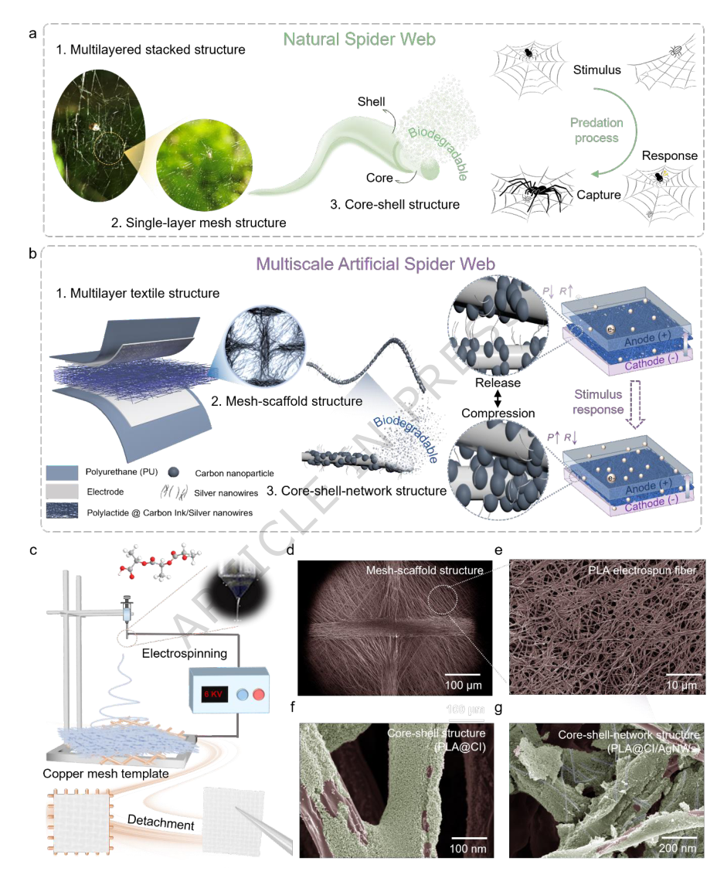
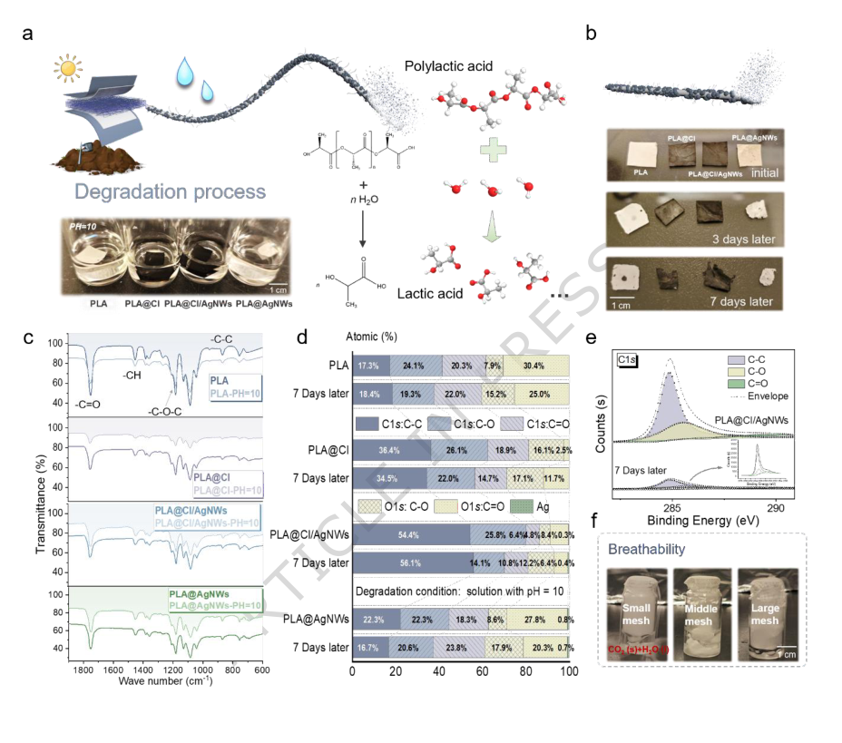
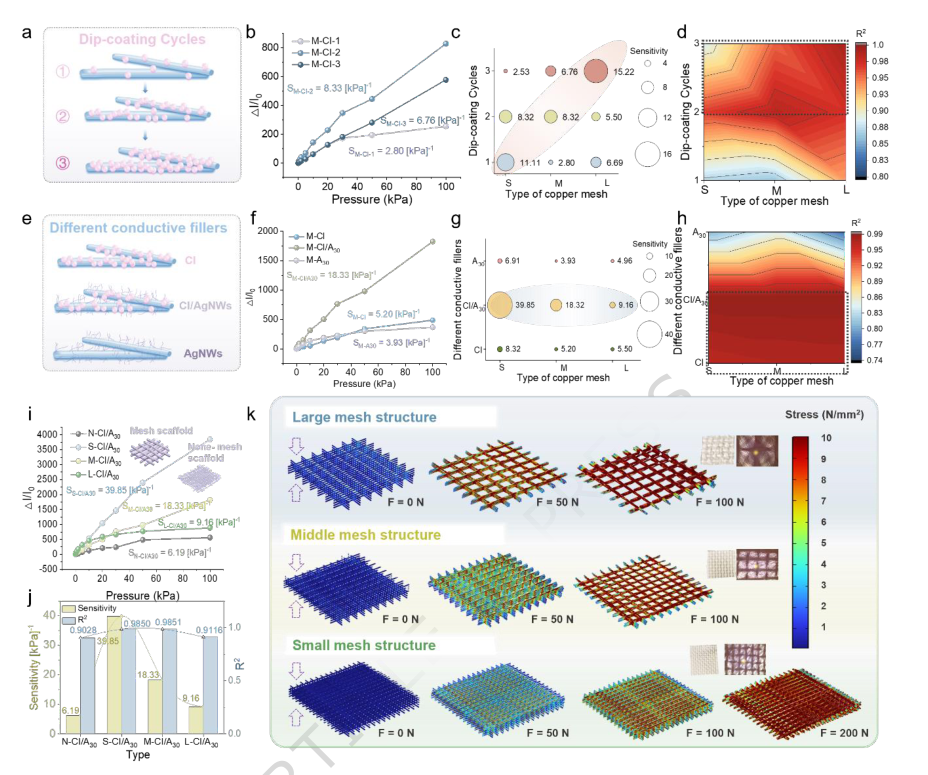
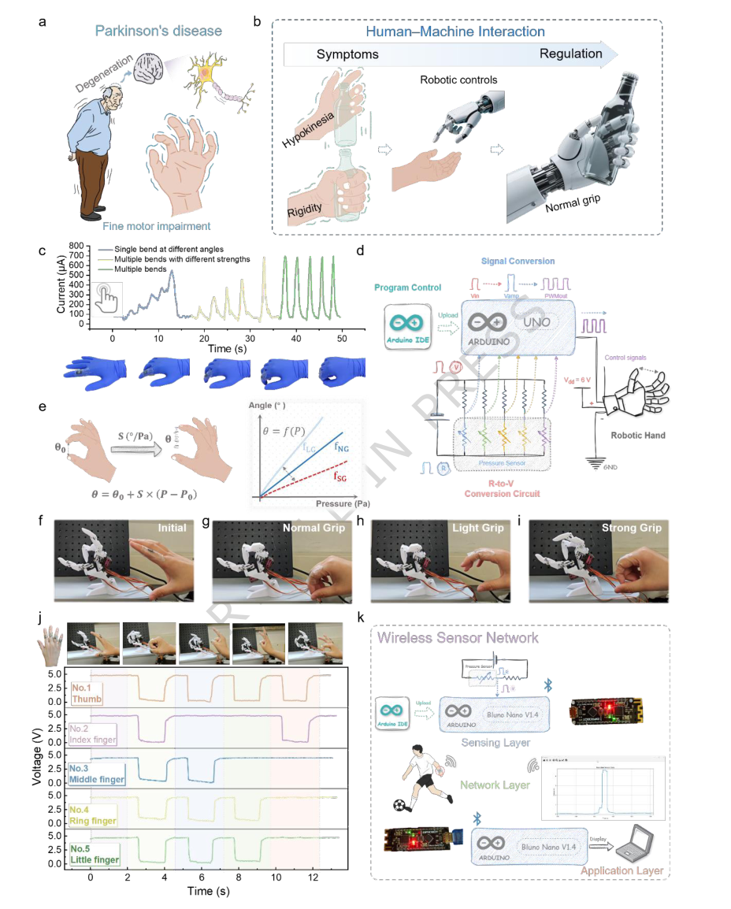

# Multiscale artificial spider web for comprehensive pressure sensing and human-machine interaction

- 期刊：Nature Communications
- 日期：2026-07-04
- DOI：10.1038/s41467-026-74200-y
- 解析状态：fulltext_draft

## 摘要与研究价值

**Original:** Abstract Flexible pressure sensors are key components of Internet of Things systems for monitoring environmental and physiological signals, yet simultaneously achieving a high sensitivity, a fast response time, and a high mechanical durability remains challenging owing to the lack of sophisticated structural designs that balance sensing performance and robustness. Here, we demonstrate a multiscale artificial spider web (MASW) fabricated via copper-mesh-assisted electrospinning of biodegradable polylactic acid, forming a nanofiber network that efficiently transmits stress while enhancing mechanical stability. The resulting pressure sensor simultaneously shows a high sensitivity of 39.85 [kPa] −1 , a fast response of 42 ms and high durability over 6000 loading cycles, enabling reliable and versatile neural-network-assisted real-time monitoring of multiple physiological signals, including pulse, breathing, and vocalization. Furthermore, leveraging precise joint movement signal acquisition, a human-machine interaction system was developed with potential applications in fine motor rehabilitation for Parkinson’s disease, suggesting strong promise for sustainable healthcare and IoT systems.

**中文:** 涉及坏点、漂移、跨器件迁移或少样本校准；材料性能词较多、前端/阵列/系统证据偏少，已降权。摘要可核实数值包括：42 ms。

## 创新点

- Abstract Flexible pressure sensors are key components of Internet of Things systems for monitoring environmental and physiological signals, yet simultaneously achieving a high sensitivity, a fast response time, and a high mechanical durability remains challenging owing to the lack of sophisticated structural designs that balance sensing performance and robustness.
- 涉及坏点、漂移、跨器件迁移或少样本校准
- 材料性能词较多、前端/阵列/系统证据偏少，已降权

## 对当前课题的启发

- 涉及坏点、漂移、跨器件迁移或少样本校准
- 可对照 raw pixel、software feature 与 physical projection 的性能/通道/功耗

## 制备与实验步骤

### 1. 材料混合与分散

**Source:** p.18

**Original:** Fabrication of MASW ARTICLE IN PRESS Fabrication of electrospun fiber membranes: 2.4 g PLA granules were dissolved in 20 mL of a DCM/DMF mixture (7:3 v/v) and stirred in a water bath at 40 °C for 2 h to obtain a uniform spinning solution (10 wt%).

**中文:** 材料混合与分散步骤，关键配比、时间、温度和设备参数以 p.18 原文为准。

### 2. 材料混合与分散

**Source:** p.19

**Original:** Fabrication of pressure-sensitive layers: A 10 wt% carbon ink/ethanol solution and a 0.1 wt% AgNWs/IPA solution were prepared and mixed at a mass ratio of 10:1, followed by stirring at

**中文:** 材料混合与分散步骤，关键配比、时间、温度和设备参数以 p.19 原文为准。

### 3. 成膜与沉积

**Source:** p.19

**Original:** Repeated dip-coating cycles were performed to regulate the utilization of ARTICLE IN PRESS the sensitive material.

**中文:** 成膜与沉积步骤，关键配比、时间、温度和设备参数以 p.19 原文为准。

### 4. 制备与实验操作

**Source:** p.19

**Original:** (Figure S10) Assembly of sensors: Plain conductive fabric was cut into 0.8 × 0.8 cm pieces and used as flexible electrodes.

**中文:** 制备与实验操作步骤，关键配比、时间、温度和设备参数以 p.19 原文为准。

### 5. 固化与热处理

**Source:** p.19

**Original:** Copper wires were fixed at one corner of the electrodes with graphite conductive adhesive and cured at 40 °C for 2 h.

**中文:** 固化与热处理步骤，关键配比、时间、温度和设备参数以 p.19 原文为准。

### 6. 组装与封装

**Source:** p.19

**Original:** The electrodes were laminated above and below the pressure-sensitive layer, and the entire structure was encapsulated with polyurethane (PU) to form a sandwich-type device.

**中文:** 组装与封装步骤，关键配比、时间、温度和设备参数以 p.19 原文为准。

## 方法原文锚点

**Source:** p.18 M001

**Original:** Materials

**中文:** 该段已进入结构化方法步骤；完整逐段翻译待智能体精读补齐。

**Source:** p.18 M002

**Original:** Polylactic acid (PLA, 4032D) was purchased from NatureWorks (USA). Dichloromethane

**中文:** 该段已进入结构化方法步骤；完整逐段翻译待智能体精读补齐。

**Source:** p.18 M003

**Original:** (DCM, ≥99.5%) and N,N-dimethylformamide (DMF, ≥99.5%) were purchased from Sigma-

**中文:** 该段已进入结构化方法步骤；完整逐段翻译待智能体精读补齐。

**Source:** p.18 M004

**Original:** Aldrich, Carbon ink (particle size ~60 nm) was supplied by Platinum Pen Co., Ltd. (Japan), and

**中文:** 该段已进入结构化方法步骤；完整逐段翻译待智能体精读补齐。

**Source:** p.18 M005

**Original:** ARTICLE IN PRESS

**中文:** 该段已进入结构化方法步骤；完整逐段翻译待智能体精读补齐。

**Source:** p.18 M006

**Original:** silver nanowires (AgNWs, length ~30 μ m) were purchased from Novarials. Graphite

**中文:** 该段已进入结构化方法步骤；完整逐段翻译待智能体精读补齐。

**Source:** p.18 M007

**Original:** conductive adhesive (A528) was obtained from Xinwei Electronic Materials Co., Ltd. (China),

**中文:** 该段已进入结构化方法步骤；完整逐段翻译待智能体精读补齐。

**Source:** p.18 M008

**Original:** and plain conductive fabric was purchased from Qingdao Shir Textile Co., Ltd. (China). Deionized

**中文:** 该段已进入结构化方法步骤；完整逐段翻译待智能体精读补齐。

**Source:** p.18 M009

**Original:** (DI) water was purchased from Samchun Chemical (Korea), and isopropyl alcohol (IPA) was

**中文:** 该段已进入结构化方法步骤；完整逐段翻译待智能体精读补齐。

**Source:** p.18 M010

**Original:** purchased from Fisher Scientific (USA).

**中文:** 该段已进入结构化方法步骤；完整逐段翻译待智能体精读补齐。

**Source:** p.18 M011

**Original:** Fabrication of MASW

**中文:** 该段已进入结构化方法步骤；完整逐段翻译待智能体精读补齐。

**Source:** p.19 M012

**Original:** ARTICLE IN PRESS

**中文:** 该段已进入结构化方法步骤；完整逐段翻译待智能体精读补齐。

**Source:** p.19 M013

**Original:** Fabrication of electrospun fiber membranes: 2.4 g PLA granules were dissolved in 20 mL of a

**中文:** 该段已进入结构化方法步骤；完整逐段翻译待智能体精读补齐。

**Source:** p.19 M014

**Original:** DCM/DMF mixture (7:3 v/v) and stirred in a water bath at 40 °C for 2 h to obtain a uniform

**中文:** 该段已进入结构化方法步骤；完整逐段翻译待智能体精读补齐。

**Source:** p.19 M015

**Original:** spinning solution (10 wt%). A 10 mL syringe with a 21G needle was used for electrospinning

**中文:** 该段已进入结构化方法步骤；完整逐段翻译待智能体精读补齐。

**Source:** p.19 M016

**Original:** under environmental conditions of 35 °C and 55% RH. The electrospinning parameters were as

**中文:** 该段已进入结构化方法步骤；完整逐段翻译待智能体精读补齐。

**Source:** p.19 M017

**Original:** follows: receiving distance, 12 cm; feeding rate, 0.8 μL/min; applied voltage, 6.0 kV. Copper

**中文:** 该段已进入结构化方法步骤；完整逐段翻译待智能体精读补齐。

**Source:** p.19 M018

**Original:** meshes with mesh sizes of 10, 20, and 30 (10×10 cm) were placed on the collector. After 2 h of

**中文:** 该段已进入结构化方法步骤；完整逐段翻译待智能体精读补齐。

**Source:** p.19 M019

**Original:** electrospinning, PLA nanofiber films with embedded mesh-like skeletons were obtained. The

**中文:** 该段已进入结构化方法步骤；完整逐段翻译待智能体精读补齐。

**Source:** p.19 M020

**Original:** films were dried at 50 °C for 6 h, carefully peeled off from the copper mesh, and cut into 1.0 × 1.0

**中文:** 该段已进入结构化方法步骤；完整逐段翻译待智能体精读补齐。

**Source:** p.19 M021

**Original:** cm sheets for subsequent use.

**中文:** 该段已进入结构化方法步骤；完整逐段翻译待智能体精读补齐。

**Source:** p.19 M022

**Original:** Fabrication of pressure-sensitive layers: A 10 wt% carbon ink/ethanol solution and a 0.1 wt%

**中文:** 该段已进入结构化方法步骤；完整逐段翻译待智能体精读补齐。

**Source:** p.19 M023

**Original:** AgNWs/IPA solution were prepared and mixed at a mass ratio of 10:1, followed by stirring at

**中文:** 该段已进入结构化方法步骤；完整逐段翻译待智能体精读补齐。

**Source:** p.19 M024

**Original:** 30 °C for 10 min to obtain a homogeneous carbon ink/AgNWs solution. The PLA textile films

**中文:** 该段已进入结构化方法步骤；完整逐段翻译待智能体精读补齐。

**Source:** p.19 M025

**Original:** were immersed in solutions containing carbon nanoparticles, AgNWs, or their mixture for 2 min,

**中文:** 该段已进入结构化方法步骤；完整逐段翻译待智能体精读补齐。

**Source:** p.19 M026

**Original:** dried at 50 °C for 2 h, and yielded uniform conductive black films with core-shell/core-shell-

**中文:** 该段已进入结构化方法步骤；完整逐段翻译待智能体精读补齐。

**Source:** p.19 M027

**Original:** network architectures. Repeated dip-coating cycles were performed to regulate the utilization of

**中文:** 该段已进入结构化方法步骤；完整逐段翻译待智能体精读补齐。

**Source:** p.19 M028

**Original:** ARTICLE IN PRESS

**中文:** 该段已进入结构化方法步骤；完整逐段翻译待智能体精读补齐。

**Source:** p.19 M029

**Original:** the sensitive material. (Figure S10)

**中文:** 该段已进入结构化方法步骤；完整逐段翻译待智能体精读补齐。

**Source:** p.19 M030

**Original:** Assembly of sensors: Plain conductive fabric was cut into 0.8 × 0.8 cm pieces and used as

**中文:** 该段已进入结构化方法步骤；完整逐段翻译待智能体精读补齐。

**Source:** p.19 M031

**Original:** flexible electrodes. Copper wires were fixed at one corner of the electrodes with graphite

**中文:** 该段已进入结构化方法步骤；完整逐段翻译待智能体精读补齐。

**Source:** p.19 M032

**Original:** conductive adhesive and cured at 40 °C for 2 h. The electrodes were laminated above and below

**中文:** 该段已进入结构化方法步骤；完整逐段翻译待智能体精读补齐。

**Source:** p.19 M033

**Original:** the pressure-sensitive layer, and the entire structure was encapsulated with polyurethane (PU) to

**中文:** 该段已进入结构化方法步骤；完整逐段翻译待智能体精读补齐。

**Source:** p.19 M034

**Original:** form a sandwich-type device.

**中文:** 该段已进入结构化方法步骤；完整逐段翻译待智能体精读补齐。

**Source:** p.19 M035

**Original:** Characterization and Performance Testing of the MASW

**中文:** 该段已进入结构化方法步骤；完整逐段翻译待智能体精读补齐。

**Source:** p.20 M036

**Original:** ARTICLE IN PRESS

**中文:** 该段已进入结构化方法步骤；完整逐段翻译待智能体精读补齐。

**Source:** p.20 M037

**Original:** The surface morphologies of the samples were characterized using field-emission scanning

**中文:** 该段已进入结构化方法步骤；完整逐段翻译待智能体精读补齐。

**Source:** p.20 M038

**Original:** electron microscopy (FESEM, ZEISS, Germany). The X-Ray Photoelectron Spectroscope (XPS)

**中文:** 该段已进入结构化方法步骤；完整逐段翻译待智能体精读补齐。

**Source:** p.20 M039

**Original:** was measured using AXIS-His (KRATOS). The Fourier Transform Infrared (FTIR) was measured

**中文:** 该段已进入结构化方法步骤；完整逐段翻译待智能体精读补齐。

**Source:** p.20 M040

**Original:** using Nicolet iS50 (Thermo Fisher Scientific). The Energy Dispersive Spectroscopy (EDS) was

**中文:** 该段已进入结构化方法步骤；完整逐段翻译待智能体精读补齐。

**Source:** p.20 M041

**Original:** measured suing Field-Emission Scanning Electronic Microscopy AURIGA (Carl Zeiss) The

**中文:** 该段已进入结构化方法步骤；完整逐段翻译待智能体精读补齐。

**Source:** p.20 M042

**Original:** surface topology and phase were examined with an atomic force microscope (AFM, NX-10, Park

**中文:** 该段已进入结构化方法步骤；完整逐段翻译待智能体精读补齐。

**Source:** p.20 M043

**Original:** ARTICLE IN PRESS

**中文:** 该段已进入结构化方法步骤；完整逐段翻译待智能体精读补齐。

**Source:** p.20 M044

**Original:** Systems). The electrical properties of the devices were measured with a semiconductor parameter

**中文:** 该段已进入结构化方法步骤；完整逐段翻译待智能体精读补齐。

**Source:** p.20 M045

**Original:** analyzer (Keithley B1500A, Keysight). During dynamic response measurements, a constant bias

**中文:** 该段已进入结构化方法步骤；完整逐段翻译待智能体精读补齐。

**Source:** p.20 M046

**Original:** voltage of 1 V was applied across the sensor, and the corresponding output current was recorded

**中文:** 该段已进入结构化方法步骤；完整逐段翻译待智能体精读补齐。

**Source:** p.20 M047

**Original:** in real time. The participants provided their informed consent to participate in this study and the

**中文:** 该段已进入结构化方法步骤；完整逐段翻译待智能体精读补齐。

**Source:** p.20 M048

**Original:** informed signed consent was obtained from the volunteer.

**中文:** 该段已进入结构化方法步骤；完整逐段翻译待智能体精读补齐。

**Source:** p.20 M049

**Original:** The model was meshed with triangular elements (Figure S11). During the simulation, different

**中文:** 该段已进入结构化方法步骤；完整逐段翻译待智能体精读补齐。

**Source:** p.20 M050

**Original:** pressure were applied to the upper and lower boundaries, while the remaining boundaries were left

**中文:** 该段已进入结构化方法步骤；完整逐段翻译待智能体精读补齐。

**Source:** p.20 M051

**Original:** free. Stress distribution of multilayer mesh structures (1.0 × 1.0 cm, with varying mesh sizes) were

**中文:** 该段已进入结构化方法步骤；完整逐段翻译待智能体精读补齐。

**Source:** p.20 M052

**Original:** simulated under applied pressure ranging from 0 to 200 N.

**中文:** 该段已进入结构化方法步骤；完整逐段翻译待智能体精读补齐。

**Source:** p.20 M053

**Original:** The sensitivity of the sensor reported in this work refers to the normalized sensitivity, defined

**中文:** 该段已进入结构化方法步骤；完整逐段翻译待智能体精读补齐。

**Source:** p.20 M054

**Original:** Where ∆𝐼 is the relative current variation, 𝐼0 is the initial current without applied pressure,

**中文:** 该段已进入结构化方法步骤；完整逐段翻译待智能体精读补齐。

**Source:** p.20 M055

**Original:** and ∆𝑃 is the applied pressure variation. the sensitivity is not constant over the entire pressure

**中文:** 该段已进入结构化方法步骤；完整逐段翻译待智能体精读补齐。

**Source:** p.20 M056

**Original:** range due to the nonlinear contact evolution and conductive pathway reconstruction under

**中文:** 该段已进入结构化方法步骤；完整逐段翻译待智能体精读补齐。

**Source:** p.20 M057

**Original:** Finite Element Simulation

**中文:** 该段已进入结构化方法步骤；完整逐段翻译待智能体精读补齐。

**Source:** p.20 M058

**Original:** Parameter Definition

**中文:** 该段已进入结构化方法步骤；完整逐段翻译待智能体精读补齐。

**Source:** p.20 M059

**Original:** as:

**中文:** 该段已进入结构化方法步骤；完整逐段翻译待智能体精读补齐。

**Source:** p.20 M060

**Original:** ∆𝐼/𝐼0

**中文:** 该段已进入结构化方法步骤；完整逐段翻译待智能体精读补齐。

**Source:** p.20 M061

**Original:** ∆𝑃 (7)

**中文:** 该段已进入结构化方法步骤；完整逐段翻译待智能体精读补齐。

**Source:** p.20 M062

**Original:** 𝑆=

**中文:** 该段已进入结构化方法步骤；完整逐段翻译待智能体精读补齐。

**Source:** p.21 M063

**Original:** ARTICLE IN PRESS

**中文:** 该段已进入结构化方法步骤；完整逐段翻译待智能体精读补齐。

**Source:** p.21 M064

**Original:** compression. In this work, the reported sensitivity represents the average sensitivity within the 0-

**中文:** 该段已进入结构化方法步骤；完整逐段翻译待智能体精读补齐。

**Source:** p.21 M065

**Original:** 100 kPa pressure range, calculated from the slope of the best linear fitting of the corresponding

**中文:** 该段已进入结构化方法步骤；完整逐段翻译待智能体精读补齐。

**Source:** p.21 M066

**Original:** pressure-response curve.

**中文:** 该段已进入结构化方法步骤；完整逐段翻译待智能体精读补齐。

**Source:** p.21 M067

**Original:** The linearity of the sensor was evaluated by fitting the measured pressure-response curve using

**中文:** 该段已进入结构化方法步骤；完整逐段翻译待智能体精读补齐。

**Source:** p.21 M068

**Original:** the least-squares method. The coefficient of determination (R2) of the linear fit was calculated to

**中文:** 该段已进入结构化方法步骤；完整逐段翻译待智能体精读补齐。

**Source:** p.21 M069

**Original:** quantify the linearity.

**中文:** 该段已进入结构化方法步骤；完整逐段翻译待智能体精读补齐。

**Source:** p.21 M070

**Original:** The response time was defined as the time required for the output signal to increase from 0% to

**中文:** 该段已进入结构化方法步骤；完整逐段翻译待智能体精读补齐。

**Source:** p.21 M071

**Original:** 90% of its steady-state value (T90).

**中文:** 该段已进入结构化方法步骤；完整逐段翻译待智能体精读补齐。

**Source:** p.21 M072

**Original:** Neural Network Model

**中文:** 该段已进入结构化方法步骤；完整逐段翻译待智能体精读补齐。

**Source:** p.21 M073

**Original:** A neural network model using the Transformer architecture was employed. The Transformer

**中文:** 该段已进入结构化方法步骤；完整逐段翻译待智能体精读补齐。

**Source:** p.21 M074

**Original:** relies entirely on self-attention mechanisms to model input and output waveform representations,

**中文:** 该段已进入结构化方法步骤；完整逐段翻译待智能体精读补齐。

**Source:** p.21 M075

**Original:** without using sequence-aligned recurrent neural networks (RNNs) or convolutional operations.

**中文:** 该段已进入结构化方法步骤；完整逐段翻译待智能体精读补齐。

**Source:** p.21 M076

**Original:** This design enables efficient modeling of long-range dependencies while allowing parallel

**中文:** 该段已进入结构化方法步骤；完整逐段翻译待智能体精读补齐。

**Source:** p.21 M077

**Original:** computation during training, thereby improving computational efficiency.

**中文:** 该段已进入结构化方法步骤；完整逐段翻译待智能体精读补齐。

**Source:** p.21 M078

**Original:** Raw signals were first interpolated to ensure a uniform number of data points across different

**中文:** 该段已进入结构化方法步骤；完整逐段翻译待智能体精读补齐。

**Source:** p.21 M079

**Original:** ARTICLE IN PRESS

**中文:** 该段已进入结构化方法步骤；完整逐段翻译待智能体精读补齐。

**Source:** p.21 M080

**Original:** samples. Subsequently, dimensionality reduction was performed using an autoencoder to extract

**中文:** 该段已进入结构化方法步骤；完整逐段翻译待智能体精读补齐。

**Source:** p.21 M081

**Original:** compact latent representations and reduce redundancy in the original feature space. The

**中文:** 该段已进入结构化方法步骤；完整逐段翻译待智能体精读补齐。

**Source:** p.21 M082

**Original:** compressed features were then fed into a softmax classifier for pressure signal recognition and

**中文:** 该段已进入结构化方法步骤；完整逐段翻译待智能体精读补齐。

**Source:** p.21 M083

**Original:** movement state identification.

**中文:** 该段已进入结构化方法步骤；完整逐段翻译待智能体精读补齐。

**Source:** p.21 M084

**Original:** For pulse signal monitoring and recognition, the classifier consisted of one input layer (200

**中文:** 该段已进入结构化方法步骤；完整逐段翻译待智能体精读补齐。

**Source:** p.21 M085

**Original:** neurons), two hidden layers (50 and 20 neurons), and one output layer (8 neurons). Eight distinct

**中文:** 该段已进入结构化方法步骤；完整逐段翻译待智能体精读补齐。

**Source:** p.21 M086

**Original:** pulse categories were included, with 300 samples collected per category, resulting in a total of

**中文:** 该段已进入结构化方法步骤；完整逐段翻译待智能体精读补齐。

**Source:** p.21 M087

**Original:** 2400 samples.

**中文:** 该段已进入结构化方法步骤；完整逐段翻译待智能体精读补齐。

**Source:** p.22 M088

**Original:** ARTICLE IN PRESS

**中文:** 该段已进入结构化方法步骤；完整逐段翻译待智能体精读补齐。

**Source:** p.22 M089

**Original:** For laryngeal movement monitoring and recognition, the classifier included one input layer (100

**中文:** 该段已进入结构化方法步骤；完整逐段翻译待智能体精读补齐。

**Source:** p.22 M090

**Original:** neurons), two hidden layers (50 and 20 neurons), and one output layer (6 neurons). Six different

**中文:** 该段已进入结构化方法步骤；完整逐段翻译待智能体精读补齐。

**Source:** p.22 M091

**Original:** laryngeal movement categories were involved, with 300 samples per category, yielding a total of

**中文:** 该段已进入结构化方法步骤；完整逐段翻译待智能体精读补齐。

**Source:** p.22 M092

**Original:** 1800 samples.

**中文:** 该段已进入结构化方法步骤；完整逐段翻译待智能体精读补齐。

**Source:** p.22 M093

**Original:** The activation function used in all hidden layers was the Rectified Linear Unit (ReLU), while

**中文:** 该段已进入结构化方法步骤；完整逐段翻译待智能体精读补齐。

**Source:** p.22 M094

**Original:** the output layer employed the softmax activation function to generate probability distributions

**中文:** 该段已进入结构化方法步骤；完整逐段翻译待智能体精读补齐。

**Source:** p.22 M095

**Original:** over the target classes.

**中文:** 该段已进入结构化方法步骤；完整逐段翻译待智能体精读补齐。

**Source:** p.22 M096

**Original:** The dataset was randomly divided using stratified sampling, with 80% of the data used for

**中文:** 该段已进入结构化方法步骤；完整逐段翻译待智能体精读补齐。

**Source:** p.22 M097

**Original:** training (cross-validation) and 20% reserved for independent testing. For pulse recognition, this

**中文:** 该段已进入结构化方法步骤；完整逐段翻译待智能体精读补齐。

**Source:** p.22 M098

**Original:** corresponds to 1920 training samples and 480 testing samples. For laryngeal movement

**中文:** 该段已进入结构化方法步骤；完整逐段翻译待智能体精读补齐。

**Source:** p.22 M099

**Original:** recognition, 1440 samples were used for training and 360 for testing.

**中文:** 该段已进入结构化方法步骤；完整逐段翻译待智能体精读补齐。

**Source:** p.22 M100

**Original:** The model was trained using the Adam optimizer with an initial learning rate of 1 × 10-3. The

**中文:** 该段已进入结构化方法步骤；完整逐段翻译待智能体精读补齐。

## 图表解读

### Figure 1

**Source:** p.31

**Original caption:** Figure 1. Design, fabrication, and structural characterization of the MASW. (a) Hierarchical structures of the natural spider web and spider predation processes; (b) Hierarchical structures of multiscale artificial spider web and pressure-sensitive mechanisms; (c) Copper-mesh-assisted

**中文图注:** Figure 1 原始图注已提取；逐项含义见下方分图说明。

**Reading note:** 重点查看器件结构、材料层次、信号路径和制备流程。

- (a) 重点查看器件结构、材料层次、信号路径和制备流程。 原文：Hierarchical structures of the natural spider web and spider predation processes
- (b) 重点查看器件结构、材料层次、信号路径和制备流程。 原文：Hierarchical structures of multiscale artificial spider web and pressure-sensitive mechanisms
- (c) 结合正文首次引用位置和原始图注核对该图的证据角色。 原文：Copper-mesh-assisted

### Figure 2

**Source:** p.32

**Original caption:** Figure 2. Biodegradability and breathability of MASWs. (a) Schematic illustration of the degradation process of PLA-based pressure-sensitive layers; (b) Optical images of MASWs before and after degradation; (c) FTIR spectra of MASWs before and after degradation; (d) Elemental compositions and chemical bonding states of MASWs before and after degradation based on XPS analysis;(e) XPS peak fitting of carbon in PLA@CI/AgNWs before and after degradation; (f) Breathability verification of the MASWs.

**中文图注:** Figure 2 原始图注已提取；逐项含义见下方分图说明。

**Reading note:** 重点查看器件结构、材料层次、信号路径和制备流程。

- (a) 重点查看器件结构、材料层次、信号路径和制备流程。 原文：Schematic illustration of the degradation process of PLA-based pressure-sensitive layers
- (b) 重点查看阵列规模、空间分辨率、串扰、读出通道和空间特征表达。 原文：Optical images of MASWs before and after degradation
- (c) 结合正文首次引用位置和原始图注核对该图的证据角色。 原文：FTIR spectra of MASWs before and after degradation
- (d) 结合正文首次引用位置和原始图注核对该图的证据角色。 原文：Elemental compositions and chemical bonding states of MASWs before and after degradation based on XPS analysis
- (e) 结合正文首次引用位置和原始图注核对该图的证据角色。 原文：XPS peak fitting of carbon in PLA@CI/AgNWs before and after degradation
- (f) 结合正文首次引用位置和原始图注核对该图的证据角色。 原文：Breathability verification of the MASWs

### Figure 3

**Source:** p.33

**Original caption:** Figure 3. Pressure-sensing performance optimization of MASWs. (a) Schematic illustration of the fabrication of MASWs with different dip-coating cycles; Pressure-sensing performance of MASWs prepared with different dip-coating cycles: (b) Pressure-response curves; (c) Sensitivity; (d) Linearity; (e) Schematic illustration of MASWs fabricated with different conductive fillers; Pressure-sensing performance of MASWs with different conductive fillers: (f) Pressure-response curves; (g) Sensitivity; (h) Linearity; Comparison of pressure-sensing performance between MASWs with different mesh skeleton sizes: (i) Pressure-response curves; (j) Sensitivity and linearity; (k) Finite element simulations of stress distribution in MASWs with different mesh skeleton sizes.

**中文图注:** Figure 3 原始图注已提取；逐项含义见下方分图说明。

**Reading note:** 重点查看器件结构、材料层次、信号路径和制备流程。

- (a) 重点查看器件结构、材料层次、信号路径和制备流程。 原文：Schematic illustration of the fabrication of MASWs with different dip-coating cycles; Pressure-sensing performance of MASWs prepared with different dip-coating cycles
- (b) 重点查看标定方法、量程、误差、线性和动态响应，避免只比较单一灵敏度。 原文：Pressure-response curves
- (c) 重点查看标定方法、量程、误差、线性和动态响应，避免只比较单一灵敏度。 原文：Sensitivity
- (d) 重点查看标定方法、量程、误差、线性和动态响应，避免只比较单一灵敏度。 原文：Linearity
- (e) 重点查看器件结构、材料层次、信号路径和制备流程。 原文：Schematic illustration of MASWs fabricated with different conductive fillers; Pressure-sensing performance of MASWs with different conductive fillers
- (f) 重点查看标定方法、量程、误差、线性和动态响应，避免只比较单一灵敏度。 原文：Pressure-response curves
- (g) 重点查看标定方法、量程、误差、线性和动态响应，避免只比较单一灵敏度。 原文：Sensitivity
- (h) 重点查看标定方法、量程、误差、线性和动态响应，避免只比较单一灵敏度。 原文：Linearity; Comparison of pressure-sensing performance between MASWs with different mesh skeleton sizes
- (i) 重点查看标定方法、量程、误差、线性和动态响应，避免只比较单一灵敏度。 原文：Pressure-response curves
- (j) 重点查看标定方法、量程、误差、线性和动态响应，避免只比较单一灵敏度。 原文：Sensitivity and linearity
- (k) 重点查看机制模型与实验结果是否一致，以及关键结构参数的对照关系。 原文：Finite element simulations of stress distribution in MASWs with different mesh skeleton sizes

### Figure 6

**Source:** p.36

**Original caption:** Figure 6. Human-machine interaction enabled by MASW. (a) Illustration of Parkinson’s disease symptoms; (b) Correction strategies via human-machine interaction; (c) Monitoring of finger movements with varying angles, forces, and repetitions; (d) Circuit diagram for MASWcontrolled robotic hand; (e) Adjustable robotic hand control using sensitivity factors; MASW-

**中文图注:** Figure 6 原始图注已提取；逐项含义见下方分图说明。

**Reading note:** 重点查看标定方法、量程、误差、线性和动态响应，避免只比较单一灵敏度。

- (a) 结合正文首次引用位置和原始图注核对该图的证据角色。 原文：Illustration of Parkinson’s disease symptoms
- (b) 结合正文首次引用位置和原始图注核对该图的证据角色。 原文：Correction strategies via human-machine interaction
- (c) 重点查看标定方法、量程、误差、线性和动态响应，避免只比较单一灵敏度。 原文：Monitoring of finger movements with varying angles, forces, and repetitions
- (d) 重点查看任务设置、基线、消融和失败案例，判断系统演示是否真正支撑前端价值。 原文：Circuit diagram for MASWcontrolled robotic hand
- (e) 重点查看标定方法、量程、误差、线性和动态响应，避免只比较单一灵敏度。 原文：Adjustable robotic hand control using sensitivity factors; MASW-
