# 2D Materials Powering Neuromorphic Intelligence

- 期刊：Nano-Micro Letters
- 日期：2026-06-24
- DOI：10.1007/s40820-026-02253-1
- 解析状态：fulltext_draft

## 摘要与研究价值

**Original:** The exponential demand for energy-efficient and adaptive computing architectures drives the evolution of artificial intelligence (AI) and machine learning (ML). Neuromorphic computing, inspired by biological neural networks, overcomes the limitations of traditional von Neumann architectures, including high energy consumption and limited scalability. The introduction of two-dimensional (2D) materials, such as transition metal dichalcogenides, hexagonal boron nitride, black phosphorus, and tellurene, enables neuromorphic devices with unprecedented control over electronic and optoelectronic properties. These materials exhibit atomic-scale thickness, high carrier mobility, and tunable bandgaps, facilitating synaptic behaviours such as spike-timing-dependent plasticity and paired-pulse facilitation. This review describes the integration of 2D materials into neuromorphic systems, highlighting applications in wearable electronics, brain-machine interfaces, and quantum neuromorphic platforms. In wearable and edge computing, 2D-based devices enable localized, ultra-low-power data processing. In brain-machine interfaces, they enhance signal transduction and neural interfacing. Quantum effects in 2D materials further enable hybrid quantum-classical neuromorphic architectures for high-dimensional computational tasks. Despite significant advances, challenges in reproducibility, scalability, and stability remain. Addressing these limitations through innovations in synthesis and defect passivation is essential for practical application. This review underscores the transformative potential of 2D-material-based neuromorphic computing for energy-efficient AI. Integration of 2D materials into neuromorphic computing architectures offers a promising pathway toward energy-efficient and adaptive systems that bridge biological learning mechanisms with machine intelligence.

**中文:** 涉及 in-sensor/物理计算或可编程触觉前端；可用于低离散/装配容差触觉界面的结构与对照设计。当前未从摘要提取到可比较数值。

## 创新点

- The exponential demand for energy-efficient and adaptive computing architectures drives the evolution of artificial intelligence (AI) and machine learning (ML).
- 涉及 in-sensor/物理计算或可编程触觉前端
- 可用于低离散/装配容差触觉界面的结构与对照设计
- 提供机器人、可穿戴或电子皮肤系统任务证据

## 对当前课题的启发

- 涉及 in-sensor/物理计算或可编程触觉前端
- 可用于低离散/装配容差触觉界面的结构与对照设计
- 可对照 raw pixel、software feature 与 physical projection 的性能/通道/功耗

## 制备与实验步骤

### 1. 材料混合与分散

**Source:** p.23

**Original:** used LPE to prepare a uniform dispersion of few-layer-thick 2D MoS2 nanosheets in N-methyl-2-pyrrolidone (NMP) and later transferred to isopropyl alcohol [201].

**中文:** 材料混合与分散步骤，关键配比、时间、温度和设备参数以 p.23 原文为准。

### 2. 制备与实验操作

**Source:** p.23

**Original:** (2026) 18:413 413 Page 24 of 61 https://doi.org/10.1007/s40820-026-02253-1 © The authors two electrodes to fabricate memristors and demonstrated edge computation and adaptive learning behaviour.

**中文:** 制备与实验操作步骤，关键配比、时间、温度和设备参数以 p.23 原文为准。

### 3. 制备与实验操作

**Source:** p.23

**Original:** At present, no single fabrication method can simultaneously satisfy the requirements for wafer-scale uniformity, low defect density, CMOS compatibility, and low-temperature processing.

**中文:** 制备与实验操作步骤，关键配比、时间、温度和设备参数以 p.23 原文为准。

### 4. 固化与热处理

**Source:** p.24

**Original:** During device fabrication, these flakes were precisely aligned onto the desired GB regions using a dry-transfer process, enabling controlled ion migration pathways and significantly reducing the set voltage—by nearly 16 folds (Fig. 9c) [212].

**中文:** 固化与热处理步骤，关键配比、时间、温度和设备参数以 p.24 原文为准。

### 5. 图形化与结构成形

**Source:** p.25

**Original:** h Schematic illustrations of three-layer neural network for pattern recognition simulation and simulated pattern recognition accuracy of the 2D-SnO2 memristor with gate bias [232].

**中文:** 图形化与结构成形步骤，关键配比、时间、温度和设备参数以 p.25 原文为准。

### 6. 图形化与结构成形

**Source:** p.25

**Original:** For example, the memristors are built into a network array for handwritten digit pattern memory and recognition [212], showcasing their ability to perform in-memory computing, reducing energy consumption and latency.

**中文:** 图形化与结构成形步骤，关键配比、时间、温度和设备参数以 p.25 原文为准。

### 7. 制备与实验操作

**Source:** p.25

**Original:** (v) Scalability and Fabrication: Advances in fabrication techniques like CVD and ALD have made it possible to produce large-area, uniform 2D material films, crucial for scaling up memristor arrays.

**中文:** 制备与实验操作步骤，关键配比、时间、温度和设备参数以 p.25 原文为准。

### 8. 成膜与沉积

**Source:** p.25

**Original:** demonstrated the deposition of polycrystalline, wafer-scale MoS2, TiS2, and WS2 films of controlled thickness at record-low temperatures down to 100 ℃ using plasma-enhanced ALD.

**中文:** 成膜与沉积步骤，关键配比、时间、温度和设备参数以 p.25 原文为准。

### 9. 制备与实验操作

**Source:** p.26

**Original:** When fabricated using 2D materials, these devices offer distinctive advantages due to the atomically thin nature of the materials, enabling high-density integration, low power consumption, and potential for flexible electronics.

**中文:** 制备与实验操作步骤，关键配比、时间、温度和设备参数以 p.26 原文为准。

### 10. 成膜与沉积

**Source:** p.27

**Original:** used liquid–metal printing technique to synthesize 2D-SnO2 to fabricate memtransistors.

**中文:** 成膜与沉积步骤，关键配比、时间、温度和设备参数以 p.27 原文为准。

### 11. 制备与实验操作

**Source:** p.27

**Original:** employed 2D-SnO2 via a liquid–metal route to fabricate memtransistor to examine the synaptic behaviour and achieved improved digit recognition accuracy up to 92.25% simply by gating [232].

**中文:** 制备与实验操作步骤，关键配比、时间、温度和设备参数以 p.27 原文为准。

### 12. 成膜与沉积

**Source:** p.27

**Original:** used MoS2 ink to develop a scalable and low-temperature printing technique to realize a CBA structure based on aerosol-jet printed Ag/MoS2/Ag memristors.

**中文:** 成膜与沉积步骤，关键配比、时间、温度和设备参数以 p.27 原文为准。

### 13. 成膜与沉积

**Source:** p.27

**Original:** The fully printed devices exhibit an ultra-low switching voltage (0.18 V), a high switching ratio (107), tunable resistance states for multibit data storage, and a low standby power consumption of 1 fW and a switching energy of 4.5 fJ per transition set, demonstrating the potential to enable energy-efficient artificial neuromorphic computing [243].

**中文:** 成膜与沉积步骤，关键配比、时间、温度和设备参数以 p.27 原文为准。

### 14. 组装与封装

**Source:** p.28

**Original:** For instance, combining graphene with TMDs like MoS2 or WSe2 provides a platform where graphene acts as an electrode, and TMDs serve as the active channel, allowing for efficient charge transfer and memory effects [212].

**中文:** 组装与封装步骤，关键配比、时间、温度和设备参数以 p.28 原文为准。

### 15. 制备与实验操作

**Source:** p.28

**Original:** Figure 9n shows that CBA can be fabricated with PdSeOx/PdSe2 heterostructure to implement convolutional image processing.

**中文:** 制备与实验操作步骤，关键配比、时间、温度和设备参数以 p.28 原文为准。

### 16. 制备与实验操作

**Source:** p.28

**Original:** In addition, vertical heterostructures have been used to fabricate devices that mimic the firing behaviour of neurons [235].

**中文:** 制备与实验操作步骤，关键配比、时间、温度和设备参数以 p.28 原文为准。

## 方法原文锚点

**Source:** p.23 M001

**Original:** typically involve the chemical reaction of precursors in a liquid medium or intercalation, often at lower temperatures than that required for CVD [216]. Techniques such as liquid-phase exfoliation, hydrothermal synthesis and solvothermal synthesis and are commonly used. Liquid-phase exfoliation (LPE) involves the mechanical or chemical exfoliation of bulk layered materials in a solvent, producing few-layer or single-layer 2D materials. Saha et al. used LPE to prepare a uniform dispersion of few-layer-thick 2D MoS2 nanosheets in N-methyl-2-pyrrolidone (NMP) and later transferred to isopropyl alcohol [201]. A thin film was then grown using a biphasic method, which involved scooping a thin film at the liquid–liquid interface of two immiscible liquids (Fig. 8j–l). As shown in Fig. 8m, a thin film of LPE 2D MoS2 was pinched between

**中文:** 该段已进入结构化方法步骤；完整逐段翻译待智能体精读补齐。

**Source:** p.24 M002

**Original:** Nano-Micro Lett. (2026) 18:413 413 Page 24 of 61

**中文:** 该段已进入结构化方法步骤；完整逐段翻译待智能体精读补齐。

**Source:** p.24 M003

**Original:** https://doi.org/10.1007/s40820-026-02253-1 © The authors

**中文:** 该段已进入结构化方法步骤；完整逐段翻译待智能体精读补齐。

**Source:** p.24 M004

**Original:** two electrodes to fabricate memristors and demonstrated edge computation and adaptive learning behaviour. In hydrothermal and solvothermal processes, on the other hand, precursors react in a sealed vessel under high pressure and temperature, allowing for the growth of 2D materials like TMDs or metal oxides (MOs) in solution [202]. These approaches are particularly advantageous for ease of doping or functionalization, the ability to produce materials in macroscopic quantities, although they might not always yield the same level of crystallinity or purity compared to vapour-phase methods. To conclude, different synthesis techniques offer distinct advantages and limitations for neuromorphic applications. CVD is highly attractive for large-area growth, although defect formation and non-uniform thickness remain major concerns. MBE provides excellent crystal quality and interface control but is expensive and difficult to scale. Solution-based methods offer low-cost and flexible processing, but reproducibility and thickness control remain limited. At present, no single fabrication method can simultaneously satisfy the requirements for wafer-scale uniformity, low defect density, CMOS compatibility, and low-temperature processing. Table 2 summarizes and compares the strengths and limitations of the above-mentioned growth methods, with some typical materials and corresponding applications. Each method has advantages and limitations and should be chosen on the basis of the desired target materials and experimental conditions.

**中文:** 该段已进入结构化方法步骤；完整逐段翻译待智能体精读补齐。

**Source:** p.24 M005

**Original:** 4.2 Device Architectures: Memristors, Memtransistors, and Vertical Heterostructures in Neuromorphic Circuits

**中文:** 该段已进入结构化方法步骤；完整逐段翻译待智能体精读补齐。

**Source:** p.24 M006

**Original:** 4.2.1 Memristors

**中文:** 该段已进入结构化方法步骤；完整逐段翻译待智能体精读补齐。

**Source:** p.24 M007

**Original:** As briefly described earlier, memristor (short for memory resistor; Fig. 9a) is a fundamental electronic component whose resistance depends on the history of the current that has passed through it, thereby providing a memory function analogous to the operation of biological synapses. First theorized by Leon Chua in 1971 and physically realized by HP Labs in 2008 [229], memristors have since been widely studied for applications in non-volatile memory, neuromorphic computing, and logic circuits. Their analogue resistance states allow efficient, low-power in-memory processing and parallel matrix operations, addressing the von Neumann bottleneck in conventional architectures.

**中文:** 该段已进入结构化方法步骤；完整逐段翻译待智能体精读补齐。

**Source:** p.24 M008

**Original:** 4.2.1.1 Basic Principles and Operation 2D-materialbased memristors operate through ionic or electronic transport within the active layer, which modulates the device’s resistance under an applied electric field. Depending on the material system, resistive switching can arise from vacancy migration, charge trapping/detrapping, or interface modulation. Representative examples include TMDs, h-BN, and 2D metal oxides (Fig. 9b), each exhibiting distinct switching dynamics governed by their atomic thickness and surface defect chemistry [212, 236].

**中文:** 该段已进入结构化方法步骤；完整逐段翻译待智能体精读补齐。

**Source:** p.24 M009

**Original:** 4.2.1.2 Recent Progress

**中文:** 该段已进入结构化方法步骤；完整逐段翻译待智能体精读补齐。

**Source:** p.24 M010

**Original:** (i) Integration with 2D Materials: Recent advancements include the successful integration of 2D materials like MoS2[212], WSe2[237], h-BN[231], and graphene into memristor structures. These materials enable the creation of ultrathin, flexible, and transparent memristive devices, expanding their potential applications in wearable electronics and flexible displays. (ii) Enhanced Performance: Research has focused on improving the switching speed, endurance, and retention time of 2D-material-based memristors. For instance, studies have shown that vertical stacking of 2D materials can lead to multilevel resistance states, enhancing memory density and enabling analogue computing capabilities [238]. (iii) Material Exploration: Material engineering, especially defect engineering, can be used to improve the performance of TMDs-based memristors. Recently, Lan et al. synthesized position-controlled, starshaped MoS2 flakes with well-defined grain boundaries (GBs). During device fabrication, these flakes were precisely aligned onto the desired GB regions using a dry-transfer process, enabling controlled ion migration pathways and significantly reducing the set voltage—by nearly 16 folds (Fig. 9c) [212]. Besides, other 2D materials beyond TMDs like BP [165], MXenes [239], and 2D Mos [207] are being explored for their memristive properties. These materials offer different mechanisms for resistance switching, such as electrochemical memristor (ECM), valence change memristor (VCM), or phase-change memristor (PCM), providing a rich palette for device design with different device properties (Fig. 9d). (iv) Neuromorphic Computing: 2D materials-based memristors have shown promise in neuromorphic computing, as demonstrated in Fig. 9i, j, where they can mimic synaptic functions under spiking signal input. Recent work has demonstrated the use of these mem-

**中文:** 该段已进入结构化方法步骤；完整逐段翻译待智能体精读补齐。

**Source:** p.25 M011

**Original:** Nano-Micro Lett. (2026) 18:413 Page 25 of 61 413

**中文:** 该段已进入结构化方法步骤；完整逐段翻译待智能体精读补齐。

**Source:** p.25 M012

**Original:** MoO3 Memristors MBE High Purity: Produces highly pure, defect-free films. Precision: Offers atomic layer control over growth. Interface quality: Atomically sharp interfaces Versatility: Can grow complex heterostructures. In-situ monitoring: Allows real-time monitoring of growth

**中文:** 该段已进入结构化方法步骤；完整逐段翻译待智能体精读补齐。

**Source:** p.25 M013

**Original:** Cost: High setup and operational costs due to ultrahigh vacuum requirements. Slow growth: Growth rates are typically very slow. Scalability: Not easily scalable to large areas. Complexity: Requires highly skilled operators and precise control. Limited materials: Not all materials can be grown due to high-temperature requirements

**中文:** 该段已进入结构化方法步骤；完整逐段翻译待智能体精读补齐。

**Source:** p.25 M014

**Original:** Growth method Advantages Disadvantages Typical Materials Applications References

**中文:** 该段已进入结构化方法步骤；完整逐段翻译待智能体精读补齐。

**Source:** p.25 M015

**Original:** [224]

**中文:** 该段已进入结构化方法步骤；完整逐段翻译待智能体精读补齐。

**Source:** p.25 M016

**Original:** WSe2 Artificial synapse [219] ReS2 Memristors for neuromorphic computing [220]

**中文:** 该段已进入结构化方法步骤；完整逐段翻译待智能体精读补齐。

**Source:** p.25 M017

**Original:** SnS2 Ferroelectric analogue synaptic device [221]

**中文:** 该段已进入结构化方法步骤；完整逐段翻译待智能体精读补齐。

**Source:** p.25 M018

**Original:** PtSe2 Bidirectional photoresponse and artificial optoelectronic synapses [222]

**中文:** 该段已进入结构化方法步骤；完整逐段翻译待智能体精读补齐。

**Source:** p.25 M019

**Original:** MoTe2 Memristor array for artificial synapses [223]

**中文:** 该段已进入结构化方法步骤；完整逐段翻译待智能体精读补齐。

**Source:** p.25 M020

**Original:** Graphene Memristive synapse [217] MoS2 Memristors for neuromorphic computing [218]

**中文:** 该段已进入结构化方法步骤；完整逐段翻译待智能体精读补齐。

**Source:** p.25 M021

**Original:** Mo-ReS2 Non-volatile switching, programmable multilevel resistance states, long-term synaptic plasticity

**中文:** 该段已进入结构化方法步骤；完整逐段翻译待智能体精读补齐。

**Source:** p.25 M022

**Original:** Growth Rate: Can be slow, especially for high-quality films. Defects: Generation of defects like grain boundaries and impurities. Complexity: Many influential factors like temperature, pressure, and gas flow and precise control is hard. Scalability Challenges: Uniformity over large areas and thickness control can be challenging. The growth temperature is usually high

**中文:** 该段已进入结构化方法步骤；完整逐段翻译待智能体精读补齐。

**Source:** p.25 M023

**Original:** Table 2 Comparison of the above-mentioned growth methods with typical materials and applications

**中文:** 该段已进入结构化方法步骤；完整逐段翻译待智能体精读补齐。

**Source:** p.25 M024

**Original:** CVD Versatility: Suitable for a wide range of 2D materials. Cost-effective: Relatively low setup cost compared to other methods. Handling easiness: Generally easy to handle. Scalability: Can produce large-area films. Integration: Compatible with existing semiconductor processes

**中文:** 该段已进入结构化方法步骤；完整逐段翻译待智能体精读补齐。

**Source:** p.25 M025

**Original:** [200]

**中文:** 该段已进入结构化方法步骤；完整逐段翻译待智能体精读补齐。

**Source:** p.25 M026

**Original:** VO2 Sensory neuron, spike-based neuromorphic multisensory system [225]

**中文:** 该段已进入结构化方法步骤；完整逐段翻译待智能体精读补齐。

**Source:** p.25 M027

**Original:** In2Se3 Ferroresistive memory Junction, giant Electroresistance Switching [226]

**中文:** 该段已进入结构化方法步骤；完整逐段翻译待智能体精读补齐。

**Source:** p.25 M028

**Original:** MXene Reservoir computing networks [227] 2D Metal–organic framework Optoelectronic neuromorphic Transistors, human Emotion Simulation [228]

**中文:** 该段已进入结构化方法步骤；完整逐段翻译待智能体精读补齐。

**Source:** p.25 M029

**Original:** Black phosphorus Optoelectronic memristive synapses, artificial visual perception [165]

**中文:** 该段已进入结构化方法步骤；完整逐段翻译待智能体精读补齐。

**Source:** p.25 M030

**Original:** MoS2 nanosheets Memristors, edge computation and adaptive learning [201]

**中文:** 该段已进入结构化方法步骤；完整逐段翻译待智能体精读补齐。

**Source:** p.25 M031

**Original:** HfSe2 Memristor crossbar array, hardware multiply-and accumulate (MAC) operation, hard ware convolution image processing

**中文:** 该段已进入结构化方法步骤；完整逐段翻译待智能体精读补齐。

**Source:** p.25 M032

**Original:** Thickness control: Limited control over layer thickness. Uniformity: Can struggle with achieving uniform film thickness over large areas. Oxidation: Materials can be prone to oxidation or degradation in solution. Contamination: Potential for impurities from solvents or precursors. Limited materials: Not all 2D materials are suitable for liquid synthesis

**中文:** 该段已进入结构化方法步骤；完整逐段翻译待智能体精读补齐。

**Source:** p.25 M033

**Original:** Solution based synthesis Scalability: Can be highly scalable for solution processable materials. Low cost: Generally lower setup and operational costs. Flexibility: Suitable for flexible electronics and solution-processed devices. Tunability: Easy to modify material properties through solution chemistry. Ambient conditions: Often does not require ultrahigh vacuum or extreme temperatures

**中文:** 该段已进入结构化方法步骤；完整逐段翻译待智能体精读补齐。

**Source:** p.26 M034

**Original:** Nano-Micro Lett. (2026) 18:413 413 Page 26 of 61

**中文:** 该段已进入结构化方法步骤；完整逐段翻译待智能体精读补齐。

**Source:** p.26 M035

**Original:** process with the alignment on specific position GBs [212]. d Evolution of the critical benchmarks for three types of switching mechanism, including ECM, VCM and PCM. Open stars indicate the IRDS 2022 requirements [207]. e Schematic of a MoS2 memtransistor device built on 300-nm-thick thermal SiO2 on doped Si (gate) [124, 232]. f ID–VD curves for ten consecutive sweeps at each gate bias VG for the MoS2 memtransistor. The switching directions are indicated by the curved arrows. g Illustration of the inverted FET structure memtransistor using the 2D-SnO2 memristor channel and cross-sectional TEM images of the 2D-SnO2 nanosheet [232]. h Schematic illustrations of three-layer neural network for pattern recognition simulation and simulated pattern recognition accuracy of the 2D-SnO2 memristor with gate bias [232]. i Schematic depiction of a biological neuron [212]. j Circuit diagram for mimicking neuron behaviour [212]. k Change of resistance of the memristor based on WS2/MoS2 heterostructure is caused by the band modulation of the heterogeneous junction. It is similar to a “lift gate” on the expressway l [233]. m Schematic image showing single-crystalline PdSe2 nanosheet treated by UVozone. The pristine PdSe2 nanosheet is converted into heterostructure with an amorphous PdSeOx overlying the defective PdSe2 [234]. n Convolutional image processing implemented using PdSeOx/PdSe2 memristor crossbar array [235]. Reproduced with permission. Copyright 2008, 2018, 2023, Springer Nature. Copyright 2021, 2024 American Chemical Society

**中文:** 该段已进入结构化方法步骤；完整逐段翻译待智能体精读补齐。

**Source:** p.26 M036

**Original:** https://doi.org/10.1007/s40820-026-02253-1 © The authors

**中文:** 该段已进入结构化方法步骤；完整逐段翻译待智能体精读补齐。

**Source:** p.26 M037

**Original:** ristors in neural networks. For example, the memristors are built into a network array for handwritten digit pattern memory and recognition [212], showcasing their ability to perform in-memory computing, reducing energy consumption and latency. (v) Scalability and Fabrication: Advances in fabrication techniques like CVD and ALD have made it possible to produce large-area, uniform 2D material films, crucial for scaling up memristor arrays. For instance, Mattinen et al. demonstrated the deposition of polycrystalline, wafer-scale MoS2, TiS2, and WS2 films of controlled thickness at record-low temperatures down to 100 ℃ using plasma-enhanced ALD. They observed that high H2 flow ratio can enhance the

**中文:** 该段已进入结构化方法步骤；完整逐段翻译待智能体精读补齐。

**Source:** p.26 M038

**Original:** crystallinity [240]. These progress aids in the practical realization of high-density memory devices. (vi) Quantum and topological Memristors: The exploration of quantum and topological effects in 2D materials-based memristors is promising for quantum memory and computing applications. The use of quantum tunnelling and other topological phenomena to enhance or modify memristive behaviour is currently under investigation [241, 242].

**中文:** 该段已进入结构化方法步骤；完整逐段翻译待智能体精读补齐。

**Source:** p.26 M039

**Original:** 4.2.2 Memtransistors

**中文:** 该段已进入结构化方法步骤；完整逐段翻译待智能体精读补齐。

**Source:** p.26 M040

**Original:** Memtransistors, a combination of memristor and transistor, are emerging devices that combine the memory functionality

**中文:** 该段已进入结构化方法步骤；完整逐段翻译待智能体精读补齐。

**Source:** p.27 M041

**Original:** Nano-Micro Lett. (2026) 18:413 Page 27 of 61 413

**中文:** 该段已进入结构化方法步骤；完整逐段翻译待智能体精读补齐。

**Source:** p.27 M042

**Original:** of a memristor with the switching capabilities of a transistor, offering multiterminal control and enhanced tunability. They can emulate complex synaptic behaviours, such as STDP, which is key for neuromorphic systems mimicking brain-like learning. Memtransistors provide greater control over synaptic weights, improving precision in learning algorithms. When fabricated using 2D materials, these devices offer distinctive advantages due to the atomically thin nature of the materials, enabling high-density integration, low power consumption, and potential for flexible electronics.

**中文:** 该段已进入结构化方法步骤；完整逐段翻译待智能体精读补齐。

**Source:** p.27 M043

**Original:** 4.2.2.1 Basic Principles and Operation A 2D materialsbased memtransistor typically features a horizontal structure where a 2D material serves as channel between two electrodes with a third electrode as a gate, similar to the fieldeffect transistor, as shown in Fig. 9e [124, 232]. Figure 9f shows that the device can operate by controlling both charge transport and memory effect. The gate electrode modulates the channel’s conductivity, while the memory effect arises from the modulation of the channel’s resistance or conductance based on the history of applied voltages or currents. This dual functionality allows for in-memory computing, where data processing and storage occur in the same device, reducing latency and power consumption.

**中文:** 该段已进入结构化方法步骤；完整逐段翻译待智能体精读补齐。

**Source:** p.27 M044

**Original:** 4.2.2.2 Recent Progress

**中文:** 该段已进入结构化方法步骤；完整逐段翻译待智能体精读补齐。

**Source:** p.27 M045

**Original:** (I) Material Exploration Recent studies have featured various 2D materials for memtransistor applications, such as TMDs like MoS2, WSe2, and ReS2. As shown in Fig. 9g, recently, Huang et al. used liquid–metal printing technique to synthesize 2D-SnO2 to fabricate memtransistors. By varying the gate voltage, the recognition accuracy of handwritten digits was improved to 92.25% (Fig. 9h) [232]. This memtransistor also offers low-power consumption operation and showed high potential to be developed as an energy-efficient biological neural systems such as the human brain (~ fJ), putting forward metal oxides as strong candidates for memristors with excellent resistive switching characteristics [232]. All these materials offer tunable electronic properties, allowing for the design of memtransistors with specific memory and switching characteristics. (II) Enhanced Memory and Switching Advances have been reported in improving the memory retention time, switching speed, and endurance of 2D materials-based memtransistors. For instance, researchers have demonstrated multilevel memory states in 2D MoS2-based memtransistors, enabling analogue computing capabilities. The MoS2 memtransistors show gate tunability in

**中文:** 该段已进入结构化方法步骤；完整逐段翻译待智能体精读补齐。

**Source:** p.27 M046

**Original:** individual resistance states by four orders of magnitude, as well as large switching ratios (higher than 100), high cycling endurance (475 times) and long-term retention of states (24 h and can be further projected into one year) [124]. These devices can store multiple resistance states, facilitating complex neural network operations. (III) Neuromorphic Computing 2D materials-based memtransistors are particularly promising for neuromorphic computing, where they can emulate the behaviour of biological synapses and neurons. Recent studies have shown that these devices can perform synaptic plasticity, STDP, and other neuromorphic functions, paving the way for brain-inspired computing systems. For instance, Huang et al. employed 2D-SnO2 via a liquid–metal route to fabricate memtransistor to examine the synaptic behaviour and achieved improved digit recognition accuracy up to 92.25% simply by gating [232]. (IV) Flexible Electronics The inherent flexibility of 2D materials makes them ideal for use in flexible electronics. Recent progress includes the demonstration of flexible, transparent, and wearable memtransistor devices, opening up applications in wearable technology, flexible displays, and electronic skin. Feng et al. used MoS2 ink to develop a scalable and low-temperature printing technique to realize a CBA structure based on aerosol-jet printed Ag/MoS2/Ag memristors. The fully printed devices exhibit an ultra-low switching voltage (0.18 V), a high switching ratio (107), tunable resistance states for multibit data storage, and a low standby power consumption of 1 fW and a switching energy of 4.5 fJ per transition set, demonstrating the potential to enable energy-efficient artificial neuromorphic computing [243]. (V) Integration with Existing Technologies Efforts are underway to integrate 2D materials-based memtransistors with CMOS technology, aiming to leverage the benefits of both worlds. This hybrid approach seeks to combine the non-volatility, low power consumption, and in-memory computing capabilities of memtransistors using the established manufacturing processes of silicon-based electronics.

**中文:** 该段已进入结构化方法步骤；完整逐段翻译待智能体精读补齐。

**Source:** p.27 M047

**Original:** Although two-terminal memristors and three-terminal memtransistors are often discussed together as neuromorphic devices, their operating mechanisms and system-level advantages differ significantly. Two-terminal memristors are generally attractive for high-density crossbar arrays because of their simple structure, small footprint, and low operating

**中文:** 该段已进入结构化方法步骤；完整逐段翻译待智能体精读补齐。

**Source:** p.28 M048

**Original:** Nano-Micro Lett. (2026) 18:413 413 Page 28 of 61

**中文:** 该段已进入结构化方法步骤；完整逐段翻译待智能体精读补齐。

**Source:** p.28 M049

**Original:** https://doi.org/10.1007/s40820-026-02253-1 © The authors

**中文:** 该段已进入结构化方法步骤；完整逐段翻译待智能体精读补齐。

**Source:** p.28 M050

**Original:** energy. These devices are particularly suitable for vector–matrix multiplication and in-memory computing applications. However, their weight-update behaviour is often affected by nonlinear conductance changes, cycle-to-cycle variability, and sneak-path currents in large arrays, which can reduce training accuracy and complicate precise synaptic tuning. In contrast, three-terminal memtransistors provide an additional gate terminal that enables improved control over channel conductance and synaptic weight updates. This extra degree of freedom allows more linear and gradual conductance modulation, better separation between read and write operations, and reduced risk of unintended state disturbance during training. As a result, memtransistors are often more suitable for applications requiring precise analogue weight control, stable multilevel states, and on-chip learning, although their larger footprint may limit array density compared with two-terminal devices.

**中文:** 该段已进入结构化方法步骤；完整逐段翻译待智能体精读补齐。

**Source:** p.28 M051

**Original:** 4.2.3 Vertical Heterostructures in Neuromorphic Devices

**中文:** 该段已进入结构化方法步骤；完整逐段翻译待智能体精读补齐。

**Source:** p.28 M052

**Original:** Vertical heterostructures, where different 2D materials are stacked layer by layer, have emerged as a promising approach for neuromorphic circuits [79, 244]. These structures influence the distinctive electronic, optical, and mechanical properties of 2D materials to mimic the functionality of biological neural networks, offering potential for energy-efficient, high-density, and versatile computing systems.

**中文:** 该段已进入结构化方法步骤；完整逐段翻译待智能体精读补齐。

**Source:** p.28 M053

**Original:** 4.2.3.1 Basic Principles and Operation In vertical heterostructures for neuromorphic circuits, 2D materials like graphene, TMDs, and h-BN are vertically stacked to form complex architectures [245]. Each layer can serve different roles, such as acting as a synaptic connection, a neuron, or a gate for controlling charge transport, tunnelling, or ion migration between layers. Besides, the energy band modulation in the vertical heterostructures can be used as a switching vehicle in memristors [233]. The vertical stacking allows for high integration density, where each layer can be individually addressed, enabling the realization of artificial synapses and neurons with tunable properties.

**中文:** 该段已进入结构化方法步骤；完整逐段翻译待智能体精读补齐。

**Source:** p.28 M054

**Original:** 4.2.3.2 Recent Progress

**中文:** 该段已进入结构化方法步骤；完整逐段翻译待智能体精读补齐。

**Source:** p.28 M055

**Original:** (I) Material Combinations various combinations of 2D materials have been explored to create vertical heterostructures with tailored properties. For instance, combining graphene with TMDs like MoS2 or

**中文:** 该段已进入结构化方法步骤；完整逐段翻译待智能体精读补齐。

**Source:** p.28 M056

**Original:** WSe2 provides a platform where graphene acts as an electrode, and TMDs serve as the active channel, allowing for efficient charge transfer and memory effects [212]. Additionally, combining two different TMDs, for example, WS2 and MoS2, allows to use the band modulation region to release or block the carrier in the passages, enabling switching of vertical heterostructure-based memristors. Figure 9k, l shows that the band modulation by heterostructure is like a “lift gate” on the expressway for the charge carriers and effectively avoids direct “damage” to the memristor layer [233]. (II) Synaptic Devices Recent advancements include the development of synaptic devices which exhibit analogue memory states using vertical heterostructures, enabling the emulation of synaptic weights in neural networks [233]. These structures can mimic short-term and long-term plasticity, crucial for learning and memory in neuromorphic systems. For example, as shown in Fig. 9m, Li et al. oxidized the surface of PdSe2 with UV-ozone to synthesize PdSeOx/PdSe2 heterostructure to utilize the point defects (Pd and Se vacancies) for diffusion channels in a vertical memristor [234]. Figure 9n shows that CBA can be fabricated with PdSeOx/PdSe2 heterostructure to implement convolutional image processing. In addition, vertical heterostructures have been used to fabricate devices that mimic the firing behaviour of neurons [235]. By integrating different 2D materials, researchers have realized devices that can generate action potentials, integrate synaptic inputs, and exhibit threshold behaviour, closely resembling biological neurons. (III) In-Memory Computing Vertical heterostructures facilitate in-memory computing, where data processing and storage occur in the same device. This approach reduces latency and power consumption, as the data does not need to be transferred between memory and processing units. Sun et al. has constructed heterostructures of h-BN/WSe2/h-BN as a transistor. The device can be switched between the p- and n-type mode, exhibiting subthreshold swing of 64 mV dec−1 and on/off current ratio approaching 108. Implementation of reconfigurable linear logic operations of NOR, RNIMP, NIMP, AND, NAND, IMP, RIMP, and OR directly within these structures [235]. (IV) Flexible and Transparent Devices The use of 2D materials allows for the creation of flexible and transparent neuromorphic devices. This opens up applications in wearable technology, electronic

**中文:** 该段已进入结构化方法步骤；完整逐段翻译待智能体精读补齐。

**Source:** p.29 M057

**Original:** Nano-Micro Lett. (2026) 18:413 Page 29 of 61 413

**中文:** 该段已进入结构化方法步骤；完整逐段翻译待智能体精读补齐。

**Source:** p.29 M058

**Original:** skin, and brain–machine interfaces, where the devices can conform to non-flat surfaces or be integrated into displays.

**中文:** 该段已进入结构化方法步骤；完整逐段翻译待智能体精读补齐。

**Source:** p.29 M059

**Original:** In addition, vertical heterostructure devices offer additional advantages by combining multiple 2D materials within a single stacked architecture. These structures can simultaneously exploit charge trapping, ferroelectric switching, tunnelling, optoelectronic modulation, and interlayer coupling, enabling more complex synaptic functions such as multistate memory, optical plasticity, and gate-tunable learning behaviour. Furthermore, vertical heterostructures can improve leakage suppression and enhance retention characteristics, making them promising for multifunctional neuromorphic systems. However, challenges remain in achieving uniform interlayer interfaces, scalable fabrication, and reproducible performance across large arrays.

**中文:** 该段已进入结构化方法步骤；完整逐段翻译待智能体精读补齐。

**Source:** p.29 M060

**Original:** 4.3 Challenges in Fabrication: Addressing Variability, Scaling, and Integration Issues in Neuromorphic Devices

**中文:** 该段已进入结构化方法步骤；完整逐段翻译待智能体精读补齐。

**Source:** p.29 M061

**Original:** The fabrication of neuromorphic devices using 2D materials presents a unique set of challenges that must be addressed to harness their full potential. These challenges primarily revolve around variability, scaling, and integration issues, which are critical for the practical application of these devices in large-scale neural networks and computing systems. Variability in 2D-material-based devices—including cycle-to-cycle (C2C) and device-to-device (D2D) fluctuations—remains a major challenge affecting the reproducibility and stability of memristive performance. For instance, Fig. 10a exhibits the typical C2C, D2D variability in the h-BN RRAM by Jo et al. [246]. The device variability poses significant challenges for the application in reality. Ensuring material uniformity across large areas is essential, as variations in material properties can lead to inconsistent electrical properties, affecting device performance and reliability. Techniques like CVD and epitaxial growth need refinement to produce uniform, high-quality 2D material films. Additionally, the interface between 2D materials and metal contacts can introduce variability due to the formation of Schottky barriers or poor adhesion, requiring engineering solutions to minimize contact resistance. Controlled doping or functionalization of 2D materials to achieve desired

**中文:** 该段已进入结构化方法步骤；完整逐段翻译待智能体精读补齐。

**Source:** p.29 M062

**Original:** electronic properties often results in variability, requiring precise methods for uniform modification at the atomic scale [209]. Scaling down these devices while maintaining their desired properties presents another challenge. As devices are miniaturized, the effects of defects, edge states, and quantum confinement become more pronounced, potentially altering device behaviour [62, 249]. Achieving high integration density without compromising functionality is crucial for neuromorphic computing, which involves reducing the size of individual devices as well as managing interconnects and ensuring dense packing. Compatibility with current CMOS technology is key to realize large-scale integration and applications. Recently, as shown in Fig. 10b, Zhu et al. reported significant progress to fabricate h-BN-CMOS microchips. The CMOS transistors provide outstanding control over the currents across the h-BN memristors, allowing for endurances of roughly six million cycles in memristors as small as 0.053 μm2. STDP signals were measured for implementation of spiking neural networks [231]. Crossbar Array (Fig. 10c, d), representing a simple structure that can integrate multiple-layer array structures in large scale, is a highly promising architecture for application in reality. The leakage current and the connection resistances are the most pressing issues yet to be resolved. In large crossbar arrays, sneak-path currents can lead to inaccurate weight updates and degraded read accuracy, making selector devices such as transistors, diodes, or threshold switches necessary. Furthermore, peripheral circuitry including ADCs, DACs, sense amplifiers, and control units may occupy a significant fraction of the total chip area and power consumption, limiting the practical scalability of large neuromorphic systems. Thermal management also becomes critical as devices shrink, with 2D materials offering excellent in-plane thermal conductivity yet facing challenges in vertical heat dissipation in stacked structures. Integration challenges further complicate the fabrication process. Compatibility with existing semiconductor manufacturing processes is not straightforward, as it requires the development of fabrication techniques that can withstand the harsh conditions of traditional semiconductor fabrication while maintaining the integrity of 2D materials [199]. As shown in Fig. 10e, interconnects and wiring for 2D materials-based circuits require ad hoc solutions, because traditional interconnect techniques might not be optimal due to issues like insufficient integration density and contact

**中文:** 该段已进入结构化方法步骤；完整逐段翻译待智能体精读补齐。

**Source:** p.30 M063

**Original:** Nano-Micro Lett. (2026) 18:413 413 Page 30 of 61

**中文:** 该段已进入结构化方法步骤；完整逐段翻译待智能体精读补齐。

**Source:** p.30 M064

**Original:** Fig. 10 a Results indicating cycle-to-cycle and device-to-device variability of memristors [246]. b Fabrication of hybrid 2D-CMOS memristive microchips. In the characterizations. the atomic force microscopy of the vias in the 5 × 5 crossbar arrays on the wafers and the cross-sectional transmission electron microscope image of the 1T1M cell in the crossbar array [231]. c Depiction of the crossbar array with crossing top electrodes and bottom electrodes [199]. d Scanning electron microscope image of a 10 × 10 crossbar array of metal/hNB/metal memristors [199]. e Illustration of interconnections between different layers of 2D materials and chips [247]. f Depiction of interfacing of transferred CVD graphene and the 3D image sensor read-out circuity on silicon wafer [248]. Reproduced with permission. Copyright 2017, 2018, Springer Nature

**中文:** 该段已进入结构化方法步骤；完整逐段翻译待智能体精读补齐。

**Source:** p.30 M065

**Original:** https://doi.org/10.1007/s40820-026-02253-1 © The authors

**中文:** 该段已进入结构化方法步骤；完整逐段翻译待智能体精读补齐。

**Source:** p.30 M066

**Original:** resistance at interfaces [247]. Heterogeneous integration, where different 2D materials or different dimensional materials are combined, presents challenges in terms of material compatibility, interface engineering, and ensuring consistent performance across different materials. Figure 10f shows CVD-grown graphene and CMOS read-out circuitry heterointegrated to form image sensor dies on CMOS wafer [248]. Additionally, packaging and encapsulation are also crucial to protect 2D materials from environmental factors like oxidation or degradation while preserving their electrical properties [250]. Recent progress in addressing these challenges includes the refinement of advanced fabrication techniques like ALD [240], MBE [193, 200], and transfer printing [251], which aim to improve the quality and uniformity of 2D material films, thereby reducing variability [250]. In situ characterization during fabrication, typically referred to as in operando

**中文:** 该段已进入结构化方法步骤；完整逐段翻译待智能体精读补齐。

**Source:** p.30 M067

**Original:** techniques, helps control growth and minimize defects. Materials engineering strategies, such as defect engineering, strain engineering, or the creation of hybrid materials, are being explored to address variability and scaling issues. Hybrid integration approaches are also being developed, whereby 2D materials are integrated with traditional silicon technology or other materials to leverage the strengths of both while addressing integration challenges [251–253]. While 2D materials offer immense potential for neuromorphic computing, overcoming fabrication challenges related to variability, scaling, and integration is essential for their practical implementation. Significant research and development efforts are still required to refine fabrication techniques, explore new materials, and develop strategies for integration, ensuring that these materials attain their true potential in enhancing the performance of neuromorphic devices.

**中文:** 该段已进入结构化方法步骤；完整逐段翻译待智能体精读补齐。

**Source:** p.31 M068

**Original:** Nano-Micro Lett. (2026) 18:413 Page 31 of 61 413

**中文:** 该段已进入结构化方法步骤；完整逐段翻译待智能体精读补齐。

**Source:** p.31 M069

**Original:** 5 Machine Learning‑Driven Optimization of Neuromorphic Devices

**中文:** 该段已进入结构化方法步骤；完整逐段翻译待智能体精读补齐。

**Source:** p.31 M070

**Original:** 5.1 Training and Inference Techniques: Implementing Supervised, Unsupervised, and Reinforcement Learning Algorithms in 2D‑Material‑Based Neuromorphic Systems

**中文:** 该段已进入结构化方法步骤；完整逐段翻译待智能体精读补齐。

**Source:** p.31 M071

**Original:** In neuromorphic hardware, machine-learning algorithms, including supervised, unsupervised, and reinforcement learning, serve as critical enablers for efficient training and inference [1–3, 33]. These algorithms allow neuromorphic systems to replicate biological processes, significantly enhancing their capabilities in tasks such as image recognition, decision-making, and anomaly detection. Supervised learning relies on labelled data to train models for accurate outcome predictions. Neuromorphic systems implement this learning paradigm through synaptic devices, which follow rules like STDP to adjust synaptic weights based on spike timing. STDP-based learning is especially relevant for SNNs because the relative timing between pre-synaptic and postsynaptic spikes determines the synaptic update, directly mimicking biological event-driven learning. Among the various synaptic devices, memristors fabricated with 2D materials have shown exceptional promise in emulating and storing synaptic weights [71, 254]. These devices dynamically adjust their conductance states during the training process, analogous to the weight updates in artificial neural networks. The gradual and linear conductance modulation of these devices is particularly important for CNN and ANN implementations because it enables accurate multiply-andaccumulate operations during feature extraction and classification. In addition, multilevel conductance states improve weight precision and reduce training error in hardware neural networks. In such systems, algorithms such as gradient descent iteratively minimize the error between predicted and target outputs, while backpropagation propagates this error backward through the network to fine-tune each memristive synapse’s conductance. This enables hardware-level learning and adaptation directly within the memristor array. For example, MoS2-based memristors were used as synaptic devices demonstrating linear and distinct synaptic behaviours [244]. These memristors were subsequently integrated into artificial neural networks, achieving an impressive 98.55% recognition accuracy on the MNIST dataset using

**中文:** 该段已进入结构化方法步骤；完整逐段翻译待智能体精读补齐。

**Source:** p.31 M072

**Original:** a deep neural network (DNN). Figure 11a illustrates the baseline CNN (convolutional neural network) architecture employed in the simulation, consisting of three convolutional layers—which extract features from input images by applying small trainable filters—and two fully connected layers. The model was trained over 30 epochs (i.e. complete passes through the entire training dataset), with convolutional layers performing operations between the input feature maps and kernels. The recognition accuracy of the hardware neural network (HW-NN) reached 98.55%, closely approximating the software neural network (SW-NN) accuracy of 99.41%, as shown in Fig. 11b, highlighting the potential of 2D-material-based memristors in advancing neuromorphic systems for high-performance computing tasks. On the other hand, unsupervised learning plays a pivotal role in identifying patterns within unlabelled datasets, making it essential for clustering and anomaly detection tasks. Techniques such as Hebbian learning, which strengthens the connection between neurons that activate simultaneously (“cells that fire together, wire together”), and autoencoders, which use unsupervised neural networks to compress and reconstruct input data by extracting latent features, are widely implemented in neuromorphic hardware to enable self-organized pattern recognition and feature learning. The unique multiconductance state properties of memristors have been shown to significantly improve clustering accuracy compared to traditional architectures when processing complex datasets. In a notable example, a graphene-based memristive device was employed as synapse within SNNs to realize STDP for efficient unsupervised learning [255]. In this case, the combination of STDP, multilevel conductance states, and lateral inhibition enabled efficient spike-based competition between neurons, which is particularly important for unsupervised SNN learning and clustering tasks. To enhance competitive Hebbian learning among neurons, inhibitory synapses were integrated between all output neurons, enabling lateral inhibition, as illustrated in Fig. 11c. This configuration introduced a biologically inspired competitive mechanism, optimizing the network’s ability to distinguish patterns. To evaluate performance, the network was trained on the original 60,000 images from the MNIST training set and tested on 10,000 images from the MNIST test set. After a sample training phase, the synaptic receptive fields demonstrated the network’s capacity to learn handwritten digits. This was reflected in the high average test-set classification accuracy, which was approximately 80%, as depicted in Fig. 11d. The

**中文:** 该段已进入结构化方法步骤；完整逐段翻译待智能体精读补齐。

**Source:** p.32 M073

**Original:** Nano-Micro Lett. (2026) 18:413 413 Page 32 of 61

**中文:** 该段已进入结构化方法步骤；完整逐段翻译待智能体精读补齐。

**Source:** p.32 M074

**Original:** Fig. 11 a Architecture of the convolutional neural network model used to evaluate the accuracy of the MNIST dataset. b A comparison of recognition accuracy between hardware-based neural networks (HW-NN) and software-based neural networks (SW-NN), emphasizing the performance improvements enabled by 2D-material-based memristors. Reproduced with permission from Ref. [244]. c A biologically inspired neuromorphic computing mechanism designed for unsupervised character recognition. d Classification accuracy as a function of the number of output neurons, measured after a single training epoch for handwritten digit recognition on the MNIST dataset; e A confusion matrix illustrating classification accuracy for individual digits, highlighting the most and least accurately recognized digits. Reproduced with permission from Ref. [255]. f Memory matrix update process of the agent under the gate-modulated mode during reinforcement learning. g Memory matrix update process of the agent under the cooperative mode during reinforcement learning. h Rewards obtained by the agent as a function of training epochs in a maze game, demonstrating the rabbit’s probability of finding a water source under the two modes across multiple training epochs. Reproduced with permission from Ref. [256]

**中文:** 该段已进入结构化方法步骤；完整逐段翻译待智能体精读补齐。

**Source:** p.32 M075

**Original:** https://doi.org/10.1007/s40820-026-02253-1 © The authors

**中文:** 该段已进入结构化方法步骤；完整逐段翻译待智能体精读补齐。

## 图表解读

### Fig. 1

**Source:** p.3

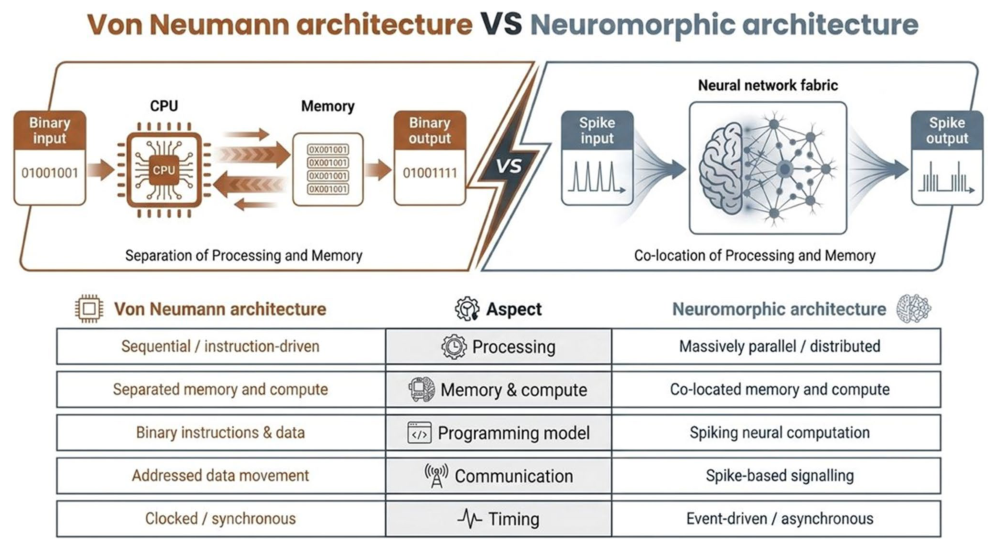

**Original caption:** Fig. 1 Comparison of the von Neumann architecture with the neuromorphic architecture

**中文图注:** Fig. 1 原始图注已提取；逐项含义见下方分图说明。

**Reading note:** 重点查看器件结构、材料层次、信号路径和制备流程。

### Fig. 2

**Source:** p.4

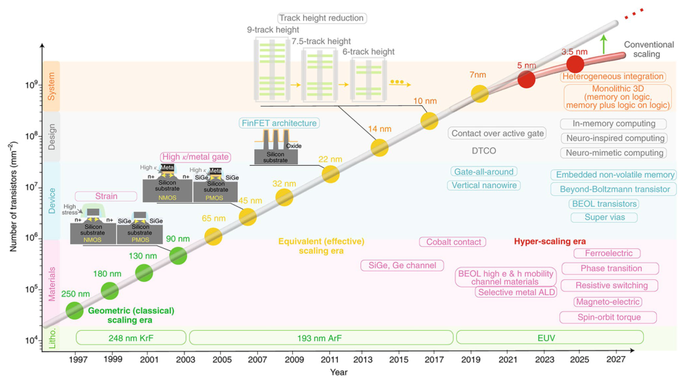

**Original caption:** Fig. 2 Scaling trends in electronic device density, transitioning through geometric scaling, equivalent scaling, and hyper-scaling eras. Innovations in materials, architectures, and integration enable functional diversification for next-generation electronics. Litho., lithography; BEOL, back-end-of-line; ALD, atomic layer deposition. Reproduced with permission from Ref. [56]

**中文图注:** Fig. 2 原始图注已提取；逐项含义见下方分图说明。

**Reading note:** 重点查看器件结构、材料层次、信号路径和制备流程。

### Fig. 3

**Source:** p.6

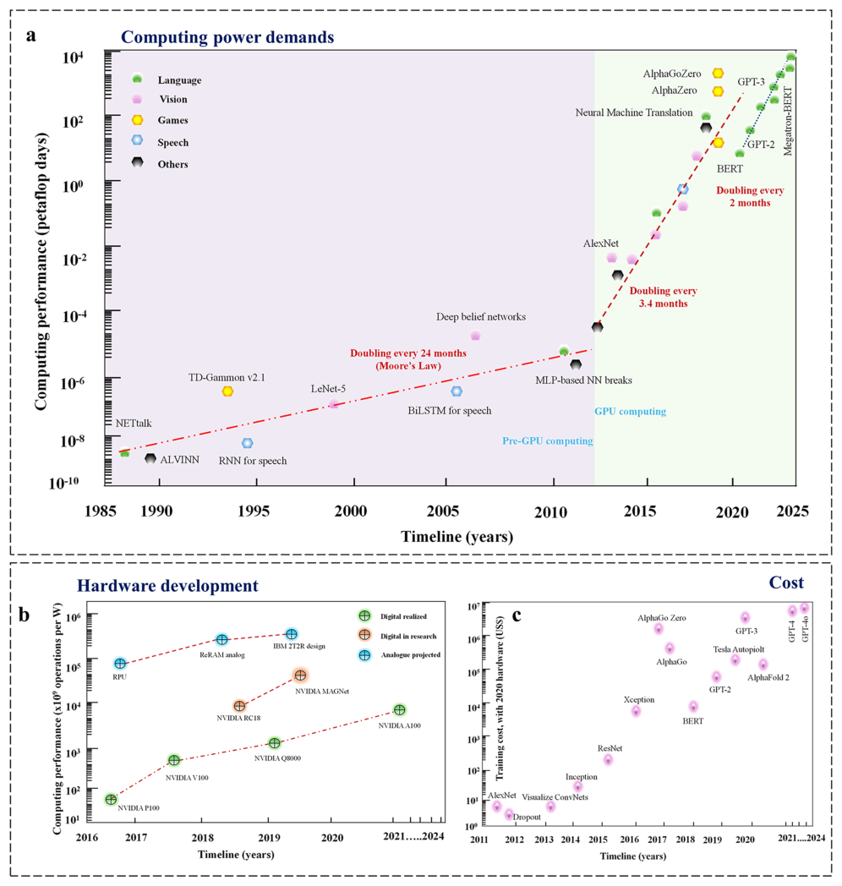

**Original caption:** Fig. 3 a The growth in computing power demand over the last four decades, measured in petaflops per day. Up until 2012, the demand doubled every 24 months, but this interval has now shortened to roughly every two months. Different application domains are indicated by the colour key. b Advancements in AI hardware efficiency over the past eight years, showing a more than 300-fold improvement due to cutting-edge solutions. Ongoing research and development efforts aim to achieve even greater gains. c Rise in AI model training costs since 2011, illustrating an exponential increase that is unsustainable in the long term

**中文图注:** Fig. 3 原始图注已提取；逐项含义见下方分图说明。

**Reading note:** 重点查看任务设置、基线、消融和失败案例，判断系统演示是否真正支撑前端价值。

### Fig. 4

**Source:** p.14

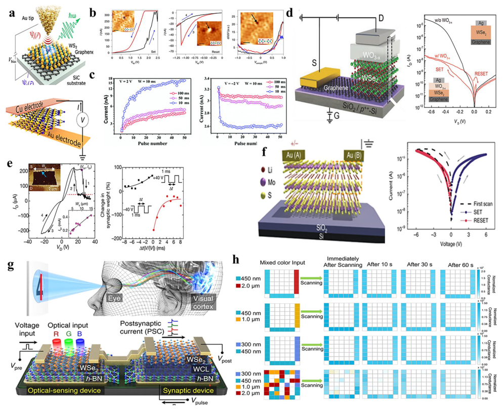

**Original caption:** Fig. 4 Structure and synaptic characteristics of 2D TMDs. a Schematic illustration of TMD layers with possible intrinsic defects and their applications in synaptic applications. Reproduced with permission from Ref. [116–120]. b Observation of critical role played by single sulphur vacancy (VS2) in an MoS2 atomic sheet memristor by scanning tunnelling microscopy. Reproduced with permission from Ref. [121]. c Synaptic characteristics exhibited by two-dimensional layers of WSe2 nanosheet. Reproduced with permission from Ref. [122]. d Schematic illustration of Ag/WOx/WSe2/graphene heterostructure barrister with corresponding I–V characteristics well-suited to mimic neuronal-based synapse. Reproduced with permission from Ref. [123]. e Atomic force microscope topographic images of polycrystalline monolayer MoS2-based memtransistor, its electrical characteristics and the spike time dependent plasticity achieved by the device. Reproduced with permission from Ref. [124]. f Schematic diagram of synaptic device and phenomenon depicting the controlled 2H-ITʹ phase transition ion modulated MoSe2-based device, its I–V characteristics and conductance change through pulse programming. Reproduced with permission from Ref. [125]. g Optical neural synaptic device consists of hybrid structured h-BN/WS2 and testing of dataset for single and coloured images. Reproduced with permission from Ref. [29]. h Self-denoising with mixed colour input of MoS2 transistor with p-Si/PtTe buried electrodes. Reproduced with permission from Ref. [96]

**中文图注:** Fig. 4 原始图注已提取；逐项含义见下方分图说明。

**Reading note:** 重点查看器件结构、材料层次、信号路径和制备流程。

- (a) 重点查看器件结构、材料层次、信号路径和制备流程。 原文：Schematic illustration of TMD layers with possible intrinsic defects and their applications in synaptic applications. Reproduced with permission from Ref. [116–120]
- (b) 结合正文首次引用位置和原始图注核对该图的证据角色。 原文：Observation of critical role played by single sulphur vacancy (VS2) in an MoS2 atomic sheet memristor by scanning tunnelling microscopy. Reproduced with permission from Ref. [121]
- (c) 结合正文首次引用位置和原始图注核对该图的证据角色。 原文：Synaptic characteristics exhibited by two-dimensional layers of WSe2 nanosheet. Reproduced with permission from Ref. [122]
- (d) 重点查看器件结构、材料层次、信号路径和制备流程。 原文：Schematic illustration of Ag/WOx/WSe2/graphene heterostructure barrister with corresponding I–V characteristics well-suited to mimic neuronal-based synapse. Reproduced with permission from Ref. [123]
- (e) 重点查看标定方法、量程、误差、线性和动态响应，避免只比较单一灵敏度。 原文：Atomic force microscope topographic images of polycrystalline monolayer MoS2-based memtransistor, its electrical characteristics and the spike time dependent plasticity achieved by the device. Reproduced with permission from Ref. [124]
- (f) 重点查看器件结构、材料层次、信号路径和制备流程。 原文：Schematic diagram of synaptic device and phenomenon depicting the controlled 2H-ITʹ phase transition ion modulated MoSe2-based device, its I–V characteristics and conductance change through pulse programming. Reproduced with permission from Ref. [125]
- (g) 重点查看器件结构、材料层次、信号路径和制备流程。 原文：Optical neural synaptic device consists of hybrid structured h-BN/WS2 and testing of dataset for single and coloured images. Reproduced with permission from Ref. [29]
- (h) 结合正文首次引用位置和原始图注核对该图的证据角色。 原文：Self-denoising with mixed colour input of MoS2 transistor with p-Si/PtTe buried electrodes. Reproduced with permission from Ref. [96]

### Fig. 5

**Source:** p.16

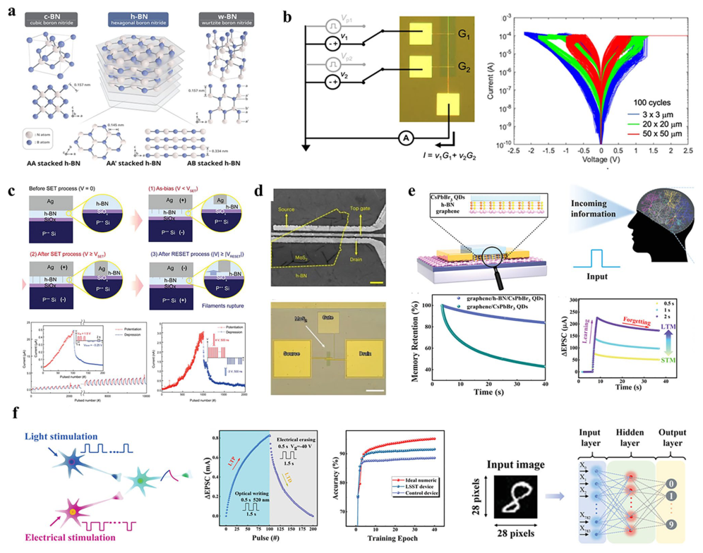

**Original caption:** Fig. 5 Structure and neuromorphic application of h-BN and its heterojunction devices. a Schematics of crystal structure of BN and the structural polytypes of h-BN. Reproduced with permission from Ref. [144]. b Top view optical image of h-BN-based crossbar array with its HRTEM cross-section visualizing the conducting paths. The 100 cycles of I–V characteristics of three different devices with different active areas and three different cases of pulse programming of the array. Reproduced with permission from Ref. [139]. c Proposed switching mechanism of the attojoule h-BN-based memristor and its potentiation and depression performance for the neuromorphic applications. Reproduced with permission from Ref. [145]. d h-BN dielectric for the transistor with its transfer curves in the dark and light environment. Reproduced with permission from Ref. [142]. e Light stimulated h-BN/graphene base synaptic transistor with its ability to train on the date and synaptic function for the artificial visual perception system. Reproduced with permission from Ref. [146]. f Optical writing performance for the pattern recognition of LLST device with 520 nm wavelength for the writing. Reproduced with permission from Ref. [146]

**中文图注:** Fig. 5 原始图注已提取；逐项含义见下方分图说明。

**Reading note:** 重点查看器件结构、材料层次、信号路径和制备流程。

- (a) 重点查看器件结构、材料层次、信号路径和制备流程。 原文：Schematics of crystal structure of BN and the structural polytypes of h-BN. Reproduced with permission from Ref. [144]
- (b) 重点查看阵列规模、空间分辨率、串扰、读出通道和空间特征表达。 原文：Top view optical image of h-BN-based crossbar array with its HRTEM cross-section visualizing the conducting paths. The 100 cycles of I–V characteristics of three different devices with different active areas and three different cases of pulse programming of the array. Reproduced with permission from Ref. [139]
- (c) 重点查看任务设置、基线、消融和失败案例，判断系统演示是否真正支撑前端价值。 原文：Proposed switching mechanism of the attojoule h-BN-based memristor and its potentiation and depression performance for the neuromorphic applications. Reproduced with permission from Ref. [145]
- (d) 结合正文首次引用位置和原始图注核对该图的证据角色。 原文：h-BN dielectric for the transistor with its transfer curves in the dark and light environment. Reproduced with permission from Ref. [142]
- (e) 结合正文首次引用位置和原始图注核对该图的证据角色。 原文：Light stimulated h-BN/graphene base synaptic transistor with its ability to train on the date and synaptic function for the artificial visual perception system. Reproduced with permission from Ref. [146]
- (f) 重点查看任务设置、基线、消融和失败案例，判断系统演示是否真正支撑前端价值。 原文：Optical writing performance for the pattern recognition of LLST device with 520 nm wavelength for the writing. Reproduced with permission from Ref. [146]

### Fig. 6

**Source:** p.18

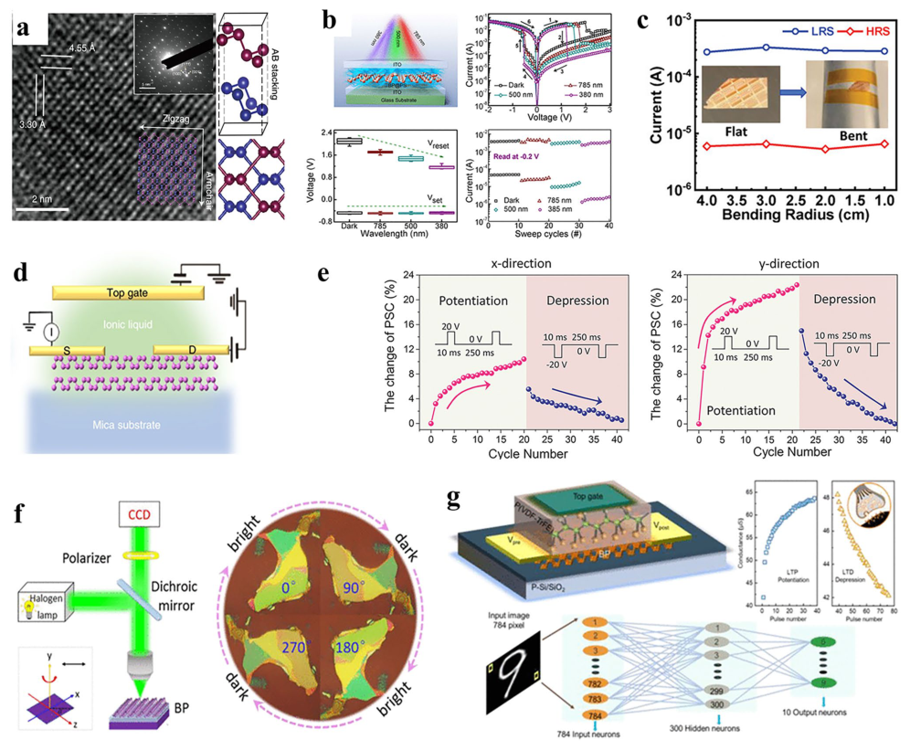

**Original caption:** Fig. 6 a Plan and cross-sectional HRTEM image of the large-scale-grown few-layer 2D BP. The plan view matches with the orthorhombic symmetry and cross-section layers showing the unique puckered structure. Reproduced with permission from Ref. [164]. b Light modulated memristive characteristics of BP. The BP as a switching material demonstrated the enhanced switching performance for the shorted wavelengths of light. Reproduced with permission from Ref. [162]. c Flexible optoelectronic synapse base on the BP for the visual perception application. It successfully demonstrated the PPF index variation and post-synaptic current response for the appropriate input light stimuli. Reproduced with permission from Ref. [165]. d Schematic image of the BP-based transistor. Reproduced with permission from Ref. [164]. e Anisotropic synaptic behaviour of the first fabricated BP-based transistor with distinct potentiation, depression and STDP for the x and y-direction of the device. Reproduced with permission from Ref. [163]. f Sensitive optical anisotropy of the BP-flakes in the visible region. Reproduced with permission from Ref. [166]. g Heterostructure of BP/(PCVDF-TrFe), with its transfer curves, synaptic function and synaptic illustration for the pattern recognition. Reproduced with permission from Ref. [167]

**中文图注:** Fig. 6 原始图注已提取；逐项含义见下方分图说明。

**Reading note:** 重点查看器件结构、材料层次、信号路径和制备流程。

### Fig. 7

**Source:** p.21

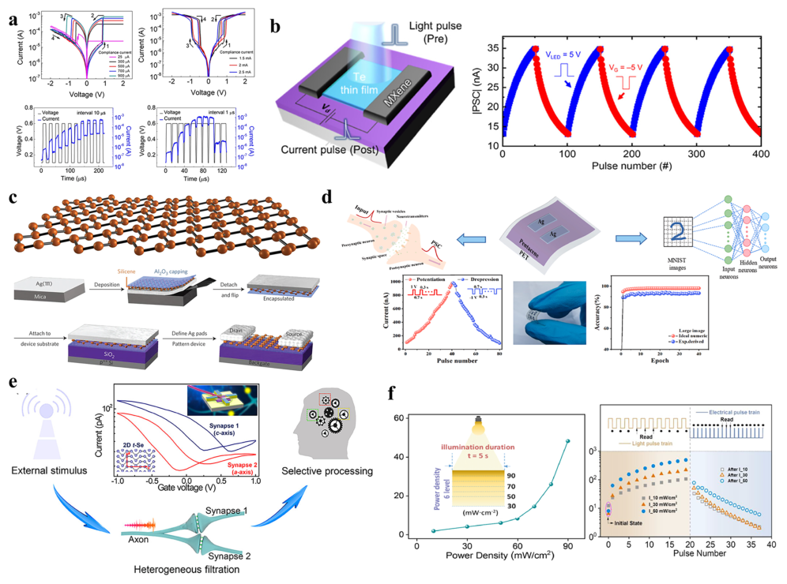

**Original caption:** Fig. 7 Performance of memristive and neuromorphic devices fabricated by tellurene and other emerging 2D materials. a All Te-based memristor showing the unprecedented non-volatile and volatile switching for higher and lower compliance currents and synaptic response for an appropriate input voltage pulse. Reproduced with permission from Ref. [183]. b Te-based optical synaptic device for the reservoir computing and pattern recognition. The light pulses were used to emulate the synaptic functions. Reproduced with permission from Ref. [184]. c Silicene (2D-Si)-based transistor fabricated by synthesis-transfer-fabrication process Reproduced with permission from Ref. [185]. d Trigonal selenium nanosheet channel transistor with the unique electrical anisotropy. The anisotropic weight modulation well suited for the temporal filtering ability. Reproduced with permission from Ref. [186]. e Flexible Ag/pentacene/SiO2/Si structure device demonstrating the digital and analogue switching for the higher and lower voltage sweeps respectively. The device in its analogue switching regime demonstrated the PPF index, potentiation and depression for the appropriate voltage input stimuli. Reproduced with permission from Ref. [187]. f TIPS-pentacene-based optical phototransistor array retina to mimic bionic eye, which demonstrated unique potentiation for the different intensities of light irradiated on it. Reproduced with permission from Ref. [188]

**中文图注:** Fig. 7 原始图注已提取；逐项含义见下方分图说明。

**Reading note:** 重点查看器件结构、材料层次、信号路径和制备流程。

- (a) 重点查看标定方法、量程、误差、线性和动态响应，避免只比较单一灵敏度。 原文：All Te-based memristor showing the unprecedented non-volatile and volatile switching for higher and lower compliance currents and synaptic response for an appropriate input voltage pulse. Reproduced with permission from Ref. [183]
- (b) 重点查看任务设置、基线、消融和失败案例，判断系统演示是否真正支撑前端价值。 原文：Te-based optical synaptic device for the reservoir computing and pattern recognition. The light pulses were used to emulate the synaptic functions. Reproduced with permission from Ref. [184]
- (c) 重点查看器件结构、材料层次、信号路径和制备流程。 原文：Silicene (2D-Si)-based transistor fabricated by synthesis-transfer-fabrication process Reproduced with permission from Ref. [185]
- (d) 结合正文首次引用位置和原始图注核对该图的证据角色。 原文：Trigonal selenium nanosheet channel transistor with the unique electrical anisotropy. The anisotropic weight modulation well suited for the temporal filtering ability. Reproduced with permission from Ref. [186]
- (e) 重点查看器件结构、材料层次、信号路径和制备流程。 原文：Flexible Ag/pentacene/SiO2/Si structure device demonstrating the digital and analogue switching for the higher and lower voltage sweeps respectively. The device in its analogue switching regime demonstrated the PPF index, potentiation and depression for the appropriate voltage input stimuli. Reproduced with permission from Ref. [187]
- (f) 重点查看阵列规模、空间分辨率、串扰、读出通道和空间特征表达。 原文：TIPS-pentacene-based optical phototransistor array retina to mimic bionic eye, which demonstrated unique potentiation for the different intensities of light irradiated on it. Reproduced with permission from Ref. [188]

### Fig. 8

**Source:** p.23

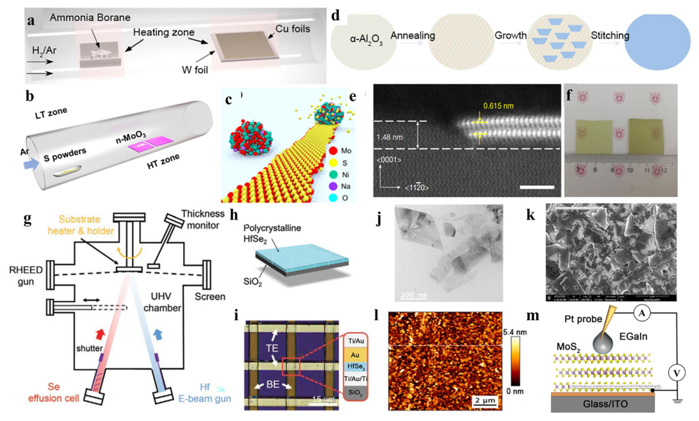

**Original caption:** Fig. 8 a Schematic illustration of experimental setup of CVD growth of h-BN [193]. b Illustration of growth method for TMDs. LT stands for low temperature. HT stands for high temperature. c Schematic diagram of growth of TMDs nanoribbons through VLS mechanisms [194]. d Illustration of the growth process of a TMDs film by atomic step edge induced orientation aligned growth and coalescence of domains growth [195–198]. e Transmission electron microscope (TEM) picture of the bilayer MoS2 grown from the step edge. f Picture of 1 × 1 cm2 continuous bilayer MoS2 film [199]. g Depiction of the setup of MBE to grow wafer-scale polycrystalline HfSe2 thin film h on SiO2. i HfSe2 film was employed to fabricate the memristor crossbar array with Ti and Au electrodes. j TEM picture of liquid exfoliated 2D MoS2 nanosheets [200]. k Scanning electron microscope (SEM) image of 2D MoS2 thin film deposited on a glass substrate. l AFM topographic images of the continuous 2D MoS2 thin film assembled by LPE MoS2 nanosheets [201]. m Schematic representation of ITO/MoS2/EGaIn memristor device [202]. Reproduced with permission. Copyright 2022, IOP Publishing. Copyright 2022, Springer Nature. Copyright 2021, Wiley. Copyright 2024, American Chemical Society

**中文图注:** Fig. 8 原始图注已提取；逐项含义见下方分图说明。

**Reading note:** 重点查看器件结构、材料层次、信号路径和制备流程。

### Fig. 9

**Source:** p.26

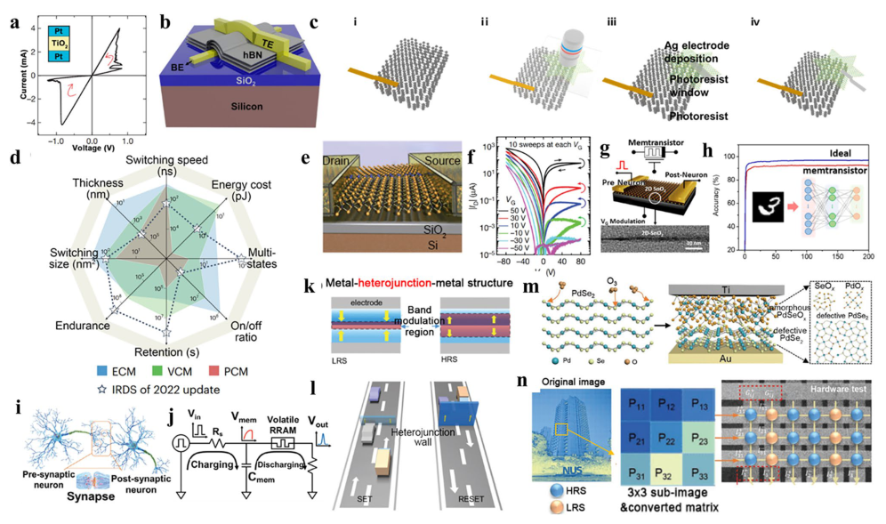

**Original caption:** Fig. 9 a Experimental I–V plot of a Pt-TiO2-x-Pt device [230]. b Schematic drawing of the memristor based on h-BN. BE: bottom electrode. TE: top electrode [231]. c Depiction of the device fabrication process with the alignment on specific position GBs [212]. d Evolution of the critical benchmarks for three types of switching mechanism, including ECM, VCM and PCM. Open stars indicate the IRDS 2022 requirements [207]. e Schematic of a MoS2 memtransistor device built on 300-nm-thick thermal SiO2 on doped Si (gate) [124, 232]. f ID–VD curves for ten consecutive sweeps at each gate bias VG for the MoS2 memtransistor. The switching directions are indicated by the curved arrows. g Illustration of the inverted FET structure memtransistor using the 2D-SnO2 memristor channel and cross-sectional TEM images of the 2D-SnO2 nanosheet [232]. h Schematic illustrations of three-layer neural network for pattern recognition simulation and simulated pattern recognition accuracy of the 2D-SnO2 memristor with gate bias [232]. i Schematic depiction of a biological neuron [212]. j Circuit diagram for mimicking neuron behaviour [212]. k Change of resistance of the memristor based on WS2/MoS2 heterostructure is caused by the band modulation of the heterogeneous junction. It is similar to a “lift gate” on the expressway l [233]. m Schematic image showing single-crystalline PdSe2 nanosheet treated by UVozone. The pristine PdSe2 nanosheet is converted into heterostructure with an amorphous PdSeOx overlying the defective PdSe2 [234]. n Convolutional image processing implemented using PdSeOx/PdSe2 memristor crossbar array [235]. Reproduced with permission. Copyright 2008, 2018, 2023, Springer Nature. Copyright 2021, 2024 American Chemical Society

**中文图注:** Fig. 9 原始图注已提取；逐项含义见下方分图说明。

**Reading note:** 重点查看器件结构、材料层次、信号路径和制备流程。

### Fig. 10

**Source:** p.30

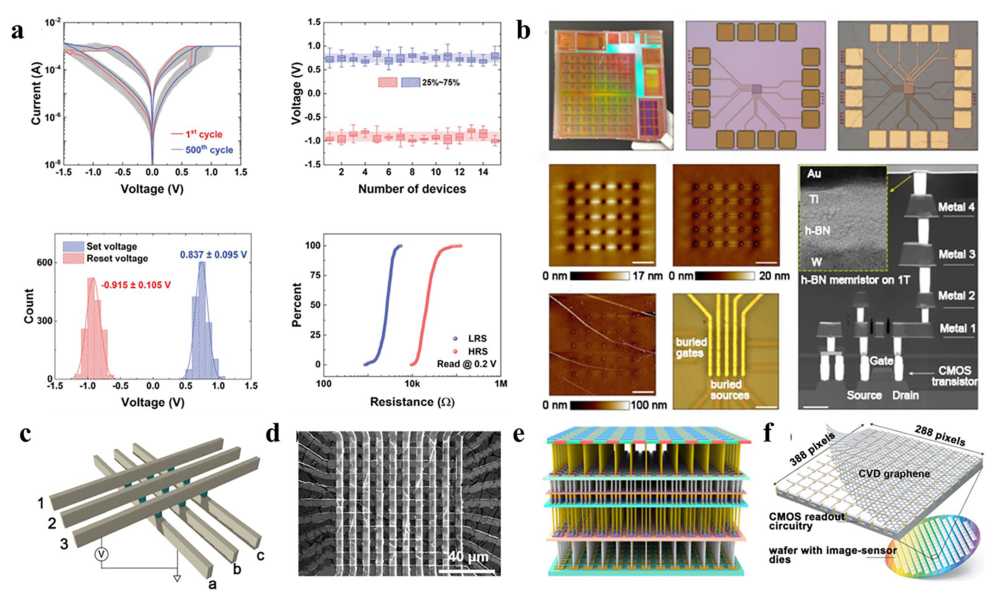

**Original caption:** Fig. 10 a Results indicating cycle-to-cycle and device-to-device variability of memristors [246]. b Fabrication of hybrid 2D-CMOS memristive microchips. In the characterizations. the atomic force microscopy of the vias in the 5 × 5 crossbar arrays on the wafers and the cross-sectional transmission electron microscope image of the 1T1M cell in the crossbar array [231]. c Depiction of the crossbar array with crossing top electrodes and bottom electrodes [199]. d Scanning electron microscope image of a 10 × 10 crossbar array of metal/hNB/metal memristors [199]. e Illustration of interconnections between different layers of 2D materials and chips [247]. f Depiction of interfacing of transferred CVD graphene and the 3D image sensor read-out circuity on silicon wafer [248]. Reproduced with permission. Copyright 2017, 2018, Springer Nature

**中文图注:** Fig. 10 原始图注已提取；逐项含义见下方分图说明。

**Reading note:** 重点查看器件结构、材料层次、信号路径和制备流程。

### Fig. 11

**Source:** p.32

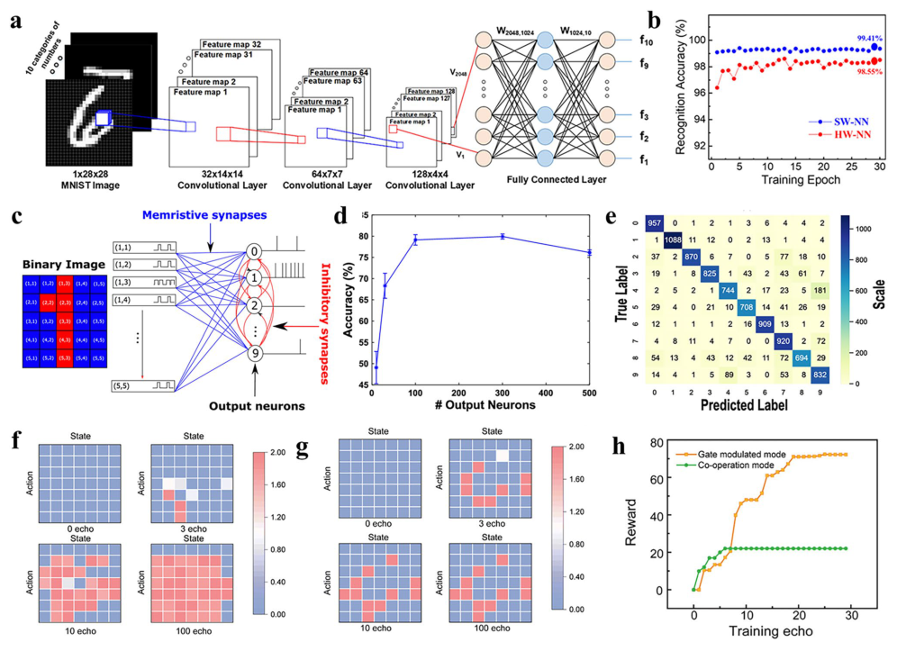

**Original caption:** Fig. 11 a Architecture of the convolutional neural network model used to evaluate the accuracy of the MNIST dataset. b A comparison of recognition accuracy between hardware-based neural networks (HW-NN) and software-based neural networks (SW-NN), emphasizing the performance improvements enabled by 2D-material-based memristors. Reproduced with permission from Ref. [244]. c A biologically inspired neuromorphic computing mechanism designed for unsupervised character recognition. d Classification accuracy as a function of the number of output neurons, measured after a single training epoch for handwritten digit recognition on the MNIST dataset; e A confusion matrix illustrating classification accuracy for individual digits, highlighting the most and least accurately recognized digits. Reproduced with permission from Ref. [255]. f Memory matrix update process of the agent under the gate-modulated mode during reinforcement learning. g Memory matrix update process of the agent under the cooperative mode during reinforcement learning. h Rewards obtained by the agent as a function of training epochs in a maze game, demonstrating the rabbit’s probability of finding a water source under the two modes across multiple training epochs. Reproduced with permission from Ref. [256]

**中文图注:** Fig. 11 原始图注已提取；逐项含义见下方分图说明。

**Reading note:** 重点查看器件结构、材料层次、信号路径和制备流程。

### Fig. 12

**Source:** p.35

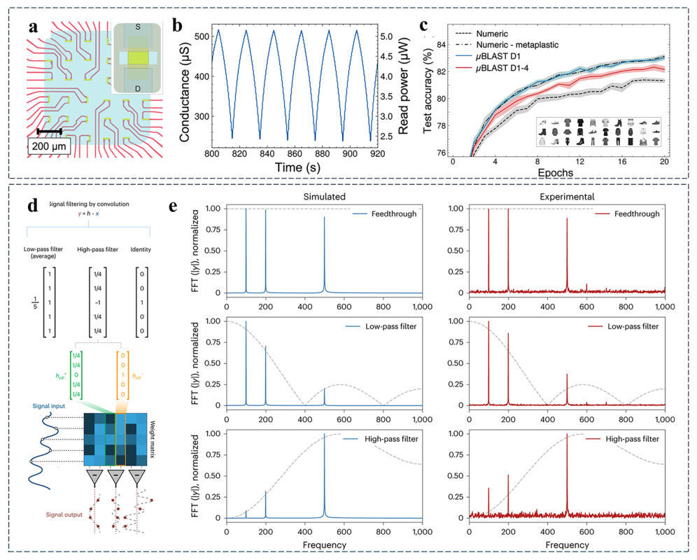

**Original caption:** Fig. 12 a Schematic representation of the 32 µBLASTs array, highlighting metal feedlines (red), the graphene channel (green), passivation with polyimide, and coverage with Nafion (blue). b Synaptic behaviour observed in µBLASTs, demonstrating low read power and high energy efficiency during operation. c Online training simulation of a multilayer perceptron using µBLAST devices, applying experimental data to neuromorphic tasks on the Fashion-MNIST dataset (clothing articles) [a-c] reproduced with permission from Ref. [259]. d Convolution-based signal processing for different filters (low-pass, high-pass, and identity) within the architecture of a 32 × 32 integrated vector–matrix multiplier based on monolayer MoS₂, illustrating in-memory computing [260] e Fast Fourier Transform (FFT) analysis comparing simulated and experimental signal processing results, confirming system accuracy. Reproduced with permission from Ref. [260]

**中文图注:** Fig. 12 原始图注已提取；逐项含义见下方分图说明。

**Reading note:** 重点查看器件结构、材料层次、信号路径和制备流程。

### Fig. 13

**Source:** p.37

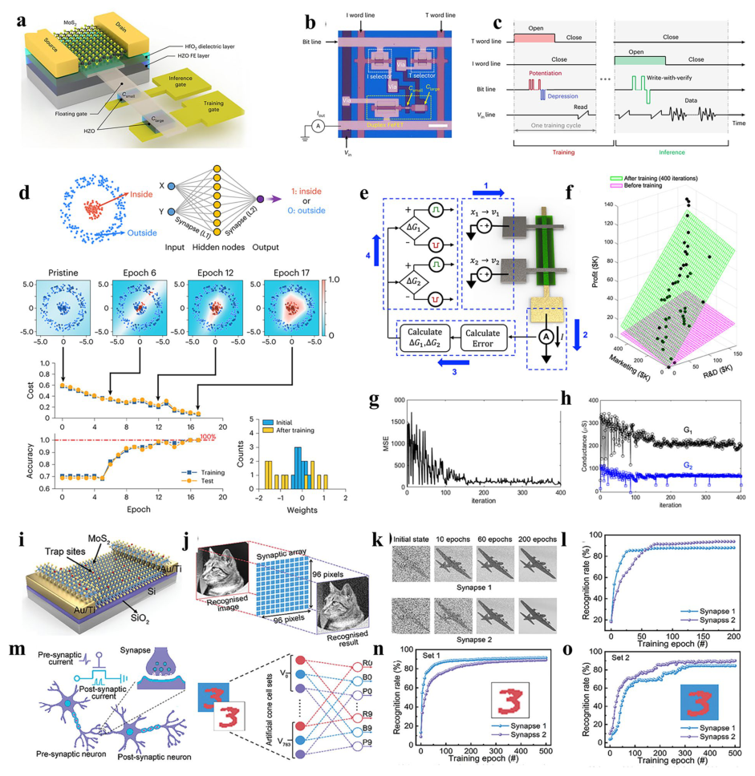

**Original caption:** Fig. 13 a Schematic of a duplex 2D material computing-in-memory device. b Optical microscopy image and programming sequence of a TIIO cell comprising 2T1D. c In the duplex FeFET core, two selector transistors (T and I) are involved in forming a pseudo crossbar structure. d Illustration of the 2D localization task, a nonlinear classification problem requiring a neural network with at least two synapse layers. The target of this ANN was to classify location data as “inside (1)” or “outside (0)” with high accuracy, with cost and accuracy plotted as a function of training epoch (blue for training data and yellow for test data). The training completed at the 17th epoch with 100% accuracy. Reproduced with permission from Ref. [263]. e Hexagonal boron nitride (h-BN) memristor arrays performing dot-product operations for multivariable stochastic linear regression. f Predictions before and after training on a dataset of 50 start-up companies, illustrating improved regression accuracy. g Reduction in mean squared error (MSE) with successive training steps, confirming effective optimization. h Changes in conductance during training, demonstrating parameter stabilization after initial fluctuations. Reproduced with permission from Ref. [139]. i Structural schematic of the MoS2-based transistor and schematic illustration of the biological synapse compared to the MoS2-based artificial synaptic device. j–l Performance of the artificial neural network (ANN) for grayscale image recognition using STL-10 datasets. m–o Dual-layer optoelectronic neural network (ONN) based on MoS₂ transistors for coloured-digit recognition, showing accuracy improvements across datasets. Reproduced with permission from Ref. [264]

**中文图注:** Fig. 13 原始图注已提取；逐项含义见下方分图说明。

**Reading note:** 重点查看器件结构、材料层次、信号路径和制备流程。

- (d) 重点查看器件结构、材料层次、信号路径和制备流程。 原文：c In the duplex FeFET core, two selector transistors (T and I) are involved in forming a pseudo crossbar structure. d Illustration of the 2D localization task, a nonlinear classification problem requiring a neural network with at least two synapse layers. The target of this ANN was to classify location data as “inside (1)” or “outside (0)” with high accuracy, with cost and accuracy plotted as a function of training epoch (blue for training data and yellow for test data). The training completed at the 17th epoch with 100% accuracy. Reproduced with permission from Ref. [263]. e Hexagonal boron nitride (h-BN) memristor arrays performing dot-product operations for multivariable stochastic linear regression. f Predictions before and after training on a dataset of 50 start-up companies, illustrating improved regression accuracy. g Reduction in mean squared error (MSE) with successive training steps, confirming effective optimization. h Changes in conductance during training, demonstrating parameter stabilization after initial fluctuations. Reproduced with permission from Ref. [139]. i Structural schematic of the MoS2-based transistor and schematic illustration of the biological synapse compared to the MoS2-based artificial synaptic device. j–l Performance of the artificial neural network (ANN) for grayscale image recognition using STL-10 datasets. m–o Dual-layer optoelectronic neural network (ONN) based on MoS₂ transistors for coloured-digit recognition, showing accuracy improvements across datasets. Reproduced with permission from Ref. [264]

### Fig. 14

**Source:** p.39

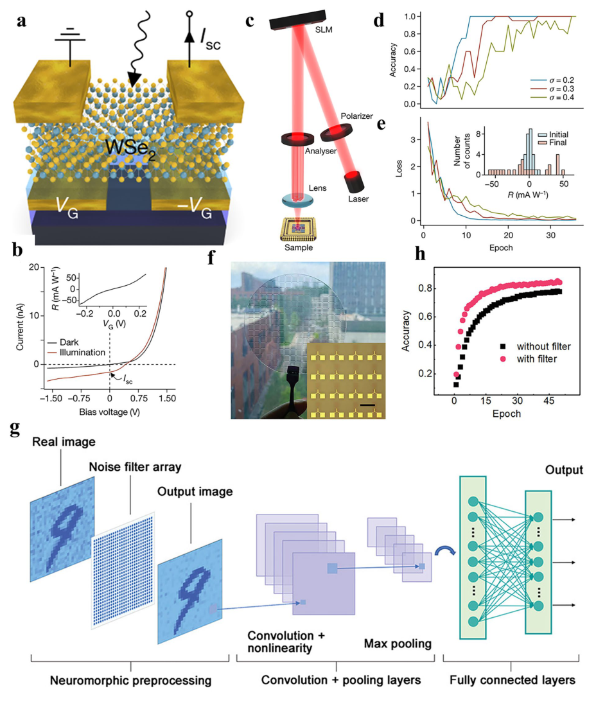

**Original caption:** Fig. 14 a Reconfigurable 2D semiconductor photodiode array constructed using lateral p–n junction photodiodes based on WSe2. b Current– voltage characteristic curve of a photodetector in the dark (blue line) and under optical illumination (red line), with the inset showing gate-voltage tunability of photoresponsivity. c Scheme of the optical setup: laser light is linearly polarized by a wire-grid polarizer, reflected by a spatial light modulator (SLM), filtered by an analyser for intensity modulation, and projected onto the photodiode array. d–e Performance metrics of the ANN during training, depicting loss reduction and accuracy improvements under various noise levels. Reproduced with permission from Ref. [269]. f Photograph of a transparent wafer-scale MoS2 FET on sapphire, with the inset showing a magnified image of the transistors. g Illustration of an artificial neuromorphic visual system utilizing the MoS2 synapse for image noise filtering (preprocessing) and a CNN for image recognition. h Image recognition rate and accuracy with and without noise filtering. Reproduced with permission from Ref. [270]

**中文图注:** Fig. 14 原始图注已提取；逐项含义见下方分图说明。

**Reading note:** 重点查看阵列规模、空间分辨率、串扰、读出通道和空间特征表达。

### Fig. 15

**Source:** p.41

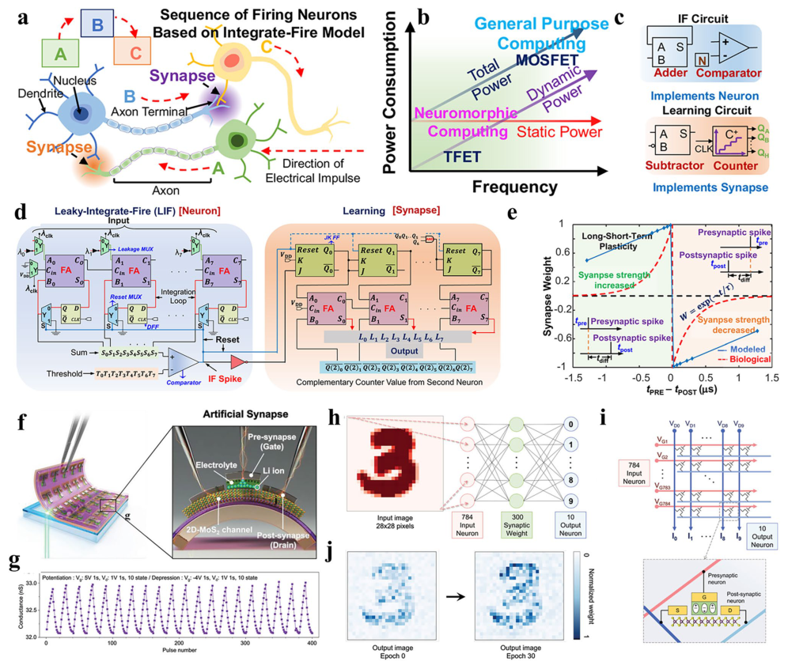

**Original caption:** Fig. 15 a Illustration of three firing neurons (A, B, C) in the brain and their synaptic connections. b Operating power consumption of a circuit as a function of clock frequency, showing that dynamic power dissipation is lower for low-frequency neuromorphic circuits that mimic neuronal and synaptic behaviour in the brain. c IF circuitry (centre) for neuron firing, implemented using a feedback loop adder and comparator circuit with a firing threshold of N, while neural learning (right) is achieved through synaptic behaviour using a subtractor and a counter circuit (C + represents an up-counter, with Qs as the output). d Schematic of the neuromorphic circuit architecture for a single firing neuron, including Leaky-Integrate-and-Fire (LIF) circuitry (left) and Hebbian learning circuitry (right). e Simulation of long short-term plasticity (solid blue line) compared with the biological model (dashed red line). Reproduced with permission from Ref. [272]. f Design of a flexible artificial synapse array, with a magnified cross-sectional view of each device. g Endurance characteristics of the neuromorphic device over 20 cycles. h Schematic of a multilayer neural network structure for recognizing handwritten digits with 28 × 28 pixels. i Circuit design of a synaptic transistor-based crossbar array for matrix operations, where VG, VD, and I denote the input signal, read signal, and output current, respectively. The inset shows an image of the synaptic transistor. j Output images showing progression with different synaptic weights during training epochs from 0 to 30. Reproduced with permission from Ref. [273]

**中文图注:** Fig. 15 原始图注已提取；逐项含义见下方分图说明。

**Reading note:** 重点查看器件结构、材料层次、信号路径和制备流程。

### Fig. 16

**Source:** p.43

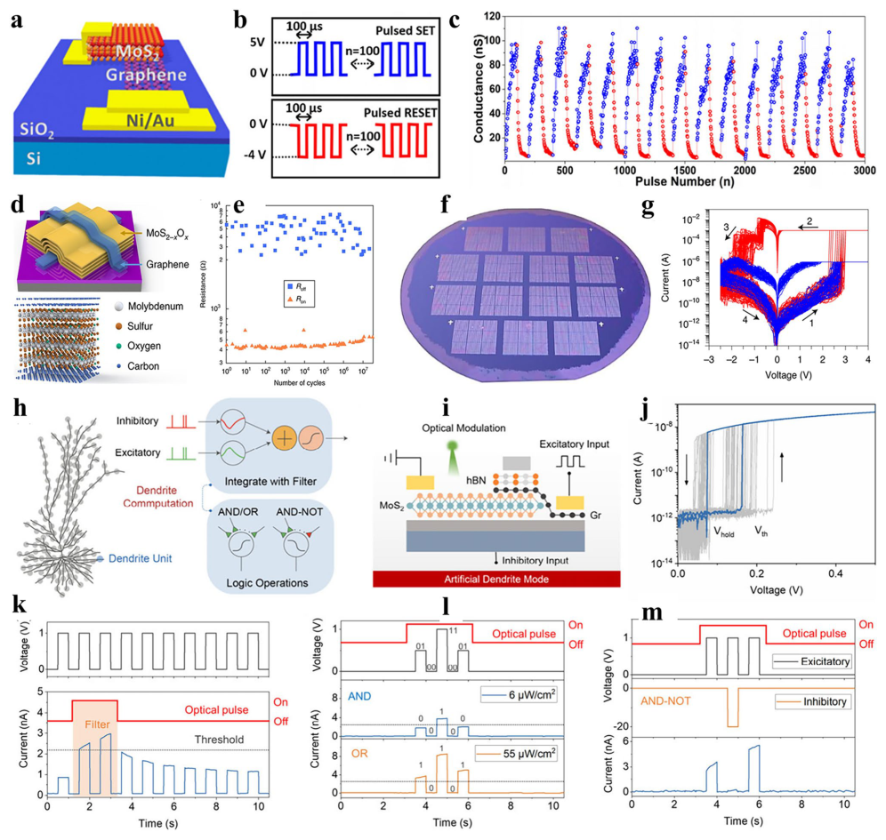

**Original caption:** Fig. 16 a Schematic illustration of the MoS2/graphene devices. b Pulsed I–V measurements showcasing synaptic behaviour with multiple distinct conductance states. c Near-linear weight updates achieved in MoS2/graphene devices, underscoring their potential for unsupervised learning applications. Reproduced with permission from Ref. [275]. d Schematic illustration of the GMG (Graphene/MoS2/Graphene) devices, including the crystal structure of the GMG stack (bottom). e Stability and endurance performance of graphene/MoS2-xOx/graphene memristors under extreme environmental and operational conditions. Reproduced with permission from Ref. [119]. f Photograph of a 2-inch wafer featuring Au/hBN/Au memristive crossbar arrays distributed across its surface. g Representative I–V characteristics recorded over 120 cycles from a single Au/h-BN/Au memristor, using ICC = 1 µA (blue lines) and ICC = 1 mA (red lines), demonstrating scalability and high yield. Reproduced with permission from Ref. [276]. h Schematic representation of a dendritic tree with distributed equivalent dendrites acting as computational elements. Excitatory (green) and inhibitory (red) spike trains are received, filtered, and integrated nonlinearly (via a combination of linear summation and sigmoidal nonlinearity). The active and passive properties of dendrites allow them to perform logic operations such as AND, OR, and AND-NOT. i Schematic depiction of the working mechanism of artificial dendrites under electrical stimuli combined with optical modulation. j Volatile resistive switching curves for the on-state current clamped by the MoS2 channel (50 cycles). k Measured current response of the artificial dendrite modulated by external light pulses. l Logic operation toggling between AND and OR achieved by varying light intensity, with higher light intensity enabling a larger photogating current to surpass the threshold. m Introduction of inhibitory input to implement the ANDNOT logic operation. Reproduced with permission from Ref. [235]

**中文图注:** Fig. 16 原始图注已提取；逐项含义见下方分图说明。

**Reading note:** 重点查看器件结构、材料层次、信号路径和制备流程。

### Fig. 17

**Source:** p.47

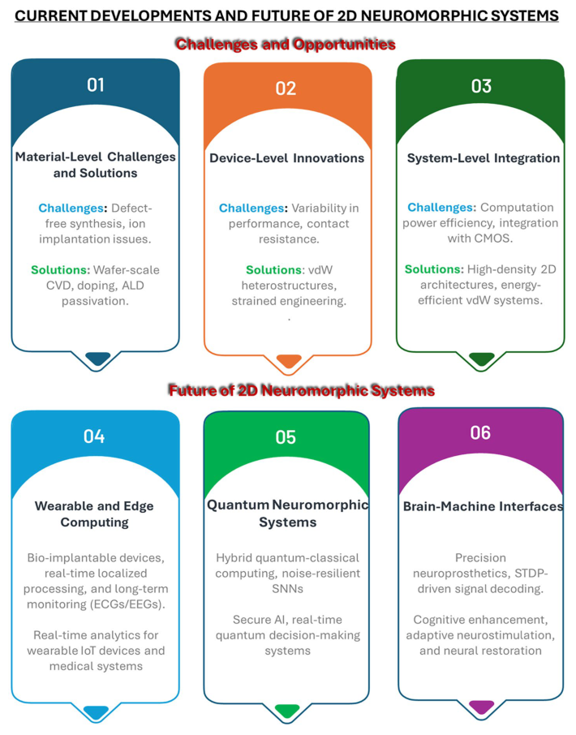

**Original caption:** Fig. 17 Current challenges and future directions of 2D materials-enabled neuromorphic computing system

**中文图注:** Fig. 17 原始图注已提取；逐项含义见下方分图说明。

**Reading note:** 结合正文首次引用位置和原始图注核对该图的证据角色。
