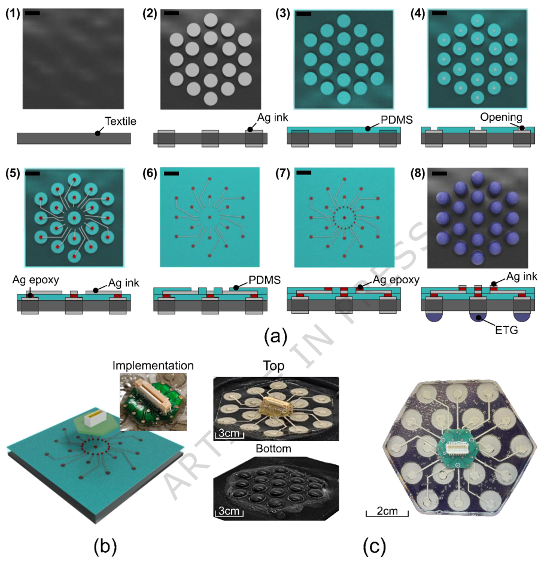
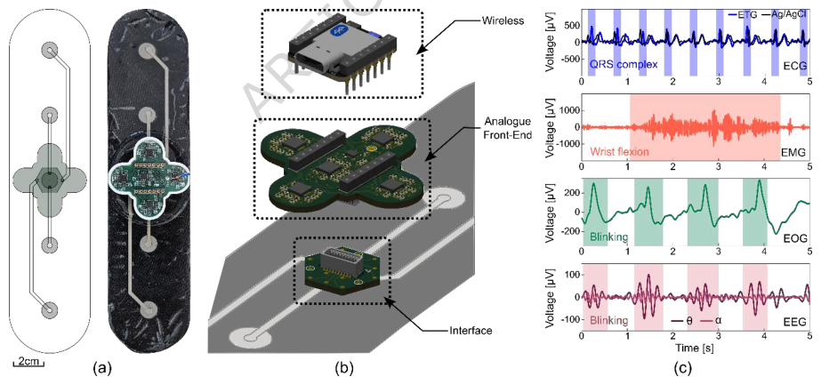
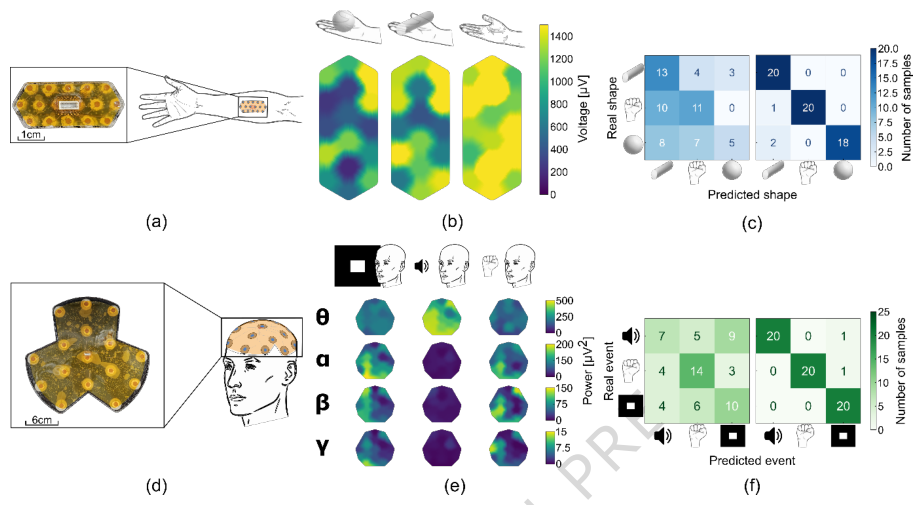
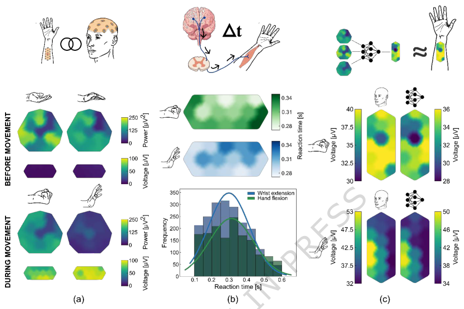

# Body surface potential mapping of the cortico-muscular axis using smart textile electrode arrays

- 期刊：Nature Communications
- 日期：2026-07-08
- DOI：10.1038/s41467-026-75134-1
- 解析状态：fulltext_draft

## 摘要与研究价值

**Original:** Abstract Cutaneous electrophysiology is a fundamental non-invasive technique for assessing electrically active organs such as the brain, heart, and muscles. Standard approaches, however, are limited in spatial resolution, reducing sensitivity to certain pathological features. The development of body surface potential mapping using electrode arrays has helped overcome these limitations, enhancing the diagnostic power of cutaneous recordings, yet clinical adoption remains constrained by challenges in electrode performance, wiring complexity, wearability, data transmission, and interpretability. Here, we present a hybrid e-textile electrode array system that overcomes these barriers, enabling simultaneous mapping of electrical activity along the cortico-muscular axis. The system combines application-specific conducting polymer coatings to improve electrode performance, a flexible fabrication process for robust connectivity and wearability, and interpretable machine learning algorithms for data analysis. In controlled single-subject experiments, we demonstrate reliable muscle and brain recordings, enabling classification of grasped object shapes and somatosensory stimuli. Simultaneous multi-site recordings along the cortico-muscular axis provide spatial maps of reaction time distributions and allow prediction of muscle activation patterns from cortical activity. This platform establishes a framework for wearable, multi-modal electrophysiological mapping and non-invasive study of cortico-muscular dynamics, representing a step towards practical brain–body interfaces with applications in neurorehabilitation, prosthetics, and human–machine interaction.

**中文:** 提供机器人、可穿戴或电子皮肤系统任务证据；可用于低离散/装配容差触觉界面的结构与对照设计。当前未从摘要提取到可比较数值。

## 创新点

- Abstract Cutaneous electrophysiology is a fundamental non-invasive technique for assessing electrically active organs such as the brain, heart, and muscles.
- 提供机器人、可穿戴或电子皮肤系统任务证据
- 可用于低离散/装配容差触觉界面的结构与对照设计
- 涉及坏点、漂移、跨器件迁移或少样本校准

## 对当前课题的启发

- 提供机器人、可穿戴或电子皮肤系统任务证据
- 可用于低离散/装配容差触觉界面的结构与对照设计
- 可对照 raw pixel、software feature 与 physical projection 的性能/通道/功耗

## 制备与实验步骤

### 1. 图形化与结构成形

**Source:** p.14

**Original:** Fabrication of smart textile electrode arrays A 100 µm-thick blend of lycra and nylon fabric (Nylon Lycra, UK Fabrics Online) was pre-stretched using a custom-designed frame (see Supplementary Figure S1).

**中文:** 图形化与结构成形步骤，关键配比、时间、温度和设备参数以 p.14 原文为准。

### 2. 图形化与结构成形

**Source:** p.14

**Original:** Double-sided tape (152212, 3M; 120 µm thickness) was laser-patterned into electrode geometries using a laser cutter (VLS2.30, Universal Laser Systems) and manually aligned and adhered to both sides of the fabric.

**中文:** 图形化与结构成形步骤，关键配比、时间、温度和设备参数以 p.14 原文为准。

### 3. 成膜与沉积

**Source:** p.14

**Original:** Silver nanoparticle paste (LS-453-6B, Asahi Kagaku) was blade-coated over the masks using a 15 cm × 12 cm × 5 cm stainlesssteel squeegee with a 1 mm metallic edge.

**中文:** 成膜与沉积步骤，关键配比、时间、温度和设备参数以 p.14 原文为准。

### 4. 成膜与沉积

**Source:** p.14

**Original:** Blade-coating was performed manually in a single pass under constant pressure, allowing the paste to permeate through the porous textile and form vertical electrical connections between both sides of the fabric.

**中文:** 成膜与沉积步骤，关键配比、时间、温度和设备参数以 p.14 原文为准。

### 5. 成膜与沉积

**Source:** p.14

**Original:** The coated fabric was cured in a standard oven at 105 °C for 30 minutes.

**中文:** 成膜与沉积步骤，关键配比、时间、温度和设备参数以 p.14 原文为准。

### 6. 成膜与沉积

**Source:** p.14

**Original:** To ensure complete electrical insulation, particularly at the edges of the silver layer, a second identical tape mask was applied and a second PDMS deposition was performed, yielding a final insulation thickness of approximately 240 µm.

**中文:** 成膜与沉积步骤，关键配比、时间、温度和设备参数以 p.14 原文为准。

### 7. 图形化与结构成形

**Source:** p.14

**Original:** A low-tack, silicone release agent-free surface protection tape (“Bluetape”, 1009R-6.0, SPS Ltd; 70 µm thickness) was laser-patterned with holes matching the rastered openings and applied to the PDMS surface.

**中文:** 图形化与结构成形步骤，关键配比、时间、温度和设备参数以 p.14 原文为准。

### 8. 成膜与沉积

**Source:** p.14

**Original:** Silver epoxy (8330S-21G, MG Chemicals) was applied to the exposed openings using a swab and blade-coated to ensure complete filling.

**中文:** 成膜与沉积步骤，关键配比、时间、温度和设备参数以 p.14 原文为准。

### 9. 固化与热处理

**Source:** p.14

**Original:** The tape mask was then removed and the epoxy cured in an oven at 105 °C for 30 minutes.

**中文:** 固化与热处理步骤，关键配比、时间、温度和设备参数以 p.14 原文为准。

### 10. 图形化与结构成形

**Source:** p.14

**Original:** A second laser-patterned Bluetape mask was applied to define the conductive track layout.

**中文:** 图形化与结构成形步骤，关键配比、时间、温度和设备参数以 p.14 原文为准。

### 11. 成膜与沉积

**Source:** p.14

**Original:** Silver nanoparticle paste was blade-coated onto the exposed PDMS surface using the same stainless-steel squeegee and cured at 105 °C for 30 minutes, resulting in conductive tracks with a thickness of ARTICLE IN PRESS approximately 60 µm.

**中文:** 成膜与沉积步骤，关键配比、时间、温度和设备参数以 p.14 原文为准。

### 12. 图形化与结构成形

**Source:** p.15

**Original:** A third patterned Bluetape mask was applied to expose the central pads, and silver epoxy was swabbed onto the exposed regions.

**中文:** 图形化与结构成形步骤，关键配比、时间、温度和设备参数以 p.15 原文为准。

### 13. 固化与热处理

**Source:** p.15

**Original:** After mask removal, the epoxy was cured at 105 °C for 30 minutes, producing contact pads with a thickness of approximately 70 µm.

**中文:** 固化与热处理步骤，关键配比、时间、温度和设备参数以 p.15 原文为准。

### 14. 成膜与沉积

**Source:** p.15

**Original:** A fourth patterned Bluetape mask, identical to the third, was then applied, and silver nanoparticle paste was blade-coated over the epoxy pads.

**中文:** 成膜与沉积步骤，关键配比、时间、温度和设备参数以 p.15 原文为准。

### 15. 固化与热处理

**Source:** p.15

**Original:** The silver paste was subsequently cured at 105 °C for 30 minutes.

**中文:** 固化与热处理步骤，关键配比、时间、温度和设备参数以 p.15 原文为准。

### 16. 成膜与沉积

**Source:** p.15

**Original:** A final contour-defining double-sided tape mask was applied to guide a final PDMS deposition that sealed the PCB and reinforced the conductive tracks against bending-induced stress.

**中文:** 成膜与沉积步骤，关键配比、时间、温度和设备参数以 p.15 原文为准。

## 方法原文锚点

**Source:** p.14 M001

**Original:** Fabrication of smart textile electrode arrays

**中文:** 该段已进入结构化方法步骤；完整逐段翻译待智能体精读补齐。

**Source:** p.14 M002

**Original:** A 100 µm-thick blend of lycra and nylon fabric (Nylon Lycra, UK Fabrics Online) was pre-stretched using a custom-designed frame (see Supplementary Figure S1). Double-sided tape (152212, 3M; 120 µm thickness) was laser-patterned into electrode geometries using a laser cutter (VLS2.30, Universal Laser Systems) and manually aligned and adhered to both sides of the fabric. Silver nanoparticle paste (LS-453-6B, Asahi Kagaku) was blade-coated over the masks using a 15 cm × 12 cm × 5 cm stainlesssteel squeegee with a 1 mm metallic edge. Blade-coating was performed manually in a single pass under constant pressure, allowing the paste to permeate through the porous textile and form vertical electrical connections between both sides of the fabric. The coated fabric was cured in a standard oven at 105 °C for 30 minutes. After cooling, the electrode mask was removed from one side of the fabric, yielding a final electrode silver thickness of approximately 200 µm. A new double-sided tape mask was then applied to define the overall outline of the array.

**中文:** 该段已进入结构化方法步骤；完整逐段翻译待智能体精读补齐。

**Source:** p.14 M003

**Original:** ARTICLE IN PRESS

**中文:** 该段已进入结构化方法步骤；完整逐段翻译待智能体精读补齐。

**Source:** p.14 M004

**Original:** Uncured polydimethylsiloxane (PDMS; Sylgard 184, Dow Corning; 10:1 base-to-curing-agent ratio by weight) was poured over the electrodes and spread with a squeegee to remove excess material, forming a uniform insulation layer approximately 120 µm thick and shaped by the tape mask. This PDMS layer was thermally cross-linked in an oven at 105 °C for one hour. To ensure complete electrical insulation, particularly at the edges of the silver layer, a second identical tape mask was applied and a second PDMS deposition was performed, yielding a final insulation thickness of approximately 240 µm. After curing, circular openings were rastered into the PDMS layer above the electrode sites using the same laser cutter (VLS2.30). The opening diameter was set to 50% of the electrode diameter to tolerate laserto-mask misalignment on the order of hundreds of micrometres without compromising electrical access to the electrode.

**中文:** 该段已进入结构化方法步骤；完整逐段翻译待智能体精读补齐。

**Source:** p.14 M005

**Original:** A low-tack, silicone release agent-free surface protection tape (“Bluetape”, 1009R-6.0, SPS Ltd; 70 µm thickness) was laser-patterned with holes matching the rastered openings and applied to the PDMS surface. Silver epoxy (8330S-21G, MG Chemicals) was applied to the exposed openings using a swab and blade-coated to ensure complete filling. The tape mask was then removed and the epoxy cured in an oven at 105 °C for 30 minutes.

**中文:** 该段已进入结构化方法步骤；完整逐段翻译待智能体精读补齐。

**Source:** p.14 M006

**Original:** A second laser-patterned Bluetape mask was applied to define the conductive track layout. Silver nanoparticle paste was blade-coated onto the exposed PDMS surface using the same stainless-steel squeegee and cured at 105 °C for 30 minutes, resulting in conductive tracks with a thickness of

**中文:** 该段已进入结构化方法步骤；完整逐段翻译待智能体精读补齐。

**Source:** p.15 M007

**Original:** ARTICLE IN PRESS

**中文:** 该段已进入结构化方法步骤；完整逐段翻译待智能体精读补齐。

**Source:** p.15 M008

**Original:** approximately 60 µm. To prevent delamination and improve mechanical robustness under bending, uncured PDMS was carefully brushed over the tracks, leaving the central contact pads exposed, and subsequently cross-linked at 105 °C for one hour.

**中文:** 该段已进入结构化方法步骤；完整逐段翻译待智能体精读补齐。

**Source:** p.15 M009

**Original:** A third patterned Bluetape mask was applied to expose the central pads, and silver epoxy was swabbed onto the exposed regions. After mask removal, the epoxy was cured at 105 °C for 30 minutes, producing contact pads with a thickness of approximately 70 µm. A fourth patterned Bluetape mask, identical to the third, was then applied, and silver nanoparticle paste was blade-coated over the epoxy pads. While still uncured, a custom interface PCB was manually aligned and placed on top to ensure contact between the PCB pads and the device interface. The silver paste was subsequently cured at 105 °C for 30 minutes.

**中文:** 该段已进入结构化方法步骤；完整逐段翻译待智能体精读补齐。

**Source:** p.15 M010

**Original:** A final contour-defining double-sided tape mask was applied to guide a final PDMS deposition that sealed the PCB and reinforced the conductive tracks against bending-induced stress. This PDMS layer had a thickness of approximately 2 mm. After thermal cross-linking at 105 °C for one hour, all tape masks were removed, yielding an overall device thickness of 2 mm ± 0.5 mm.

**中文:** 该段已进入结构化方法步骤；完整逐段翻译待智能体精读补齐。

**Source:** p.15 M011

**Original:** To improve electrode–skin coupling, a conducting polymer eutectogel (ETG) composed of PEDOT:LS, glycerol/choline chloride (Gly:ChCl), and gelatin was deposited on the opposite side of the textile. The ETG material was solvent-free and processed by melt deposition. ETG was melted into approximately 3 mm-thick sheets and cut using a 100 µm-thick stainless steel mould matching the electrode geometry, providing a mass of approximately 0.15 g of ETG per 10 mm diameter electrode (approximately 0.00191 g/mm⁻²). Each ETG piece was placed directly onto the corresponding electrode site and heated in an oven at 105 °C for 10 minutes. Due to the hydrophobic nature of the ETG, the material melted and reflowed into a stable, drop-like geometry confined to the electrode area, without lateral spreading or leakage beyond the electrode boundary. Upon cooling, the ETG solidified to form a conformal, mechanically stable coating. The resulting ETG protrusion above the textile surface was measured using a stylus profilometer (Veeco Dektak 6M Stylus Surface Profilometer), yielding a height of 1 mm ± 5 µm.

**中文:** 该段已进入结构化方法步骤；完整逐段翻译待智能体精读补齐。

**Source:** p.15 M012

**Original:** ARTICLE IN PRESS

**中文:** 该段已进入结构化方法步骤；完整逐段翻译待智能体精读补齐。

**Source:** p.15 M013

**Original:** For single-layer designs, flexible printed circuit boards (FPCBs; PCBWay) can replace blade-coated silver tracks. In this configuration, bottom-side pads on the FPCB align with the Ag epoxy vias above the textile electrodes, while the top side houses the required connectors or circuitry. An additional layer of silver epoxy is applied to both the textile contact pads and the FPCB pads, and the assembly is cocured at 105 °C for 30 minutes to establish electromechanical connections. A final layer of uncured PDMS is applied across the assembly to seal the external connector and enhance mechanical stability.

**中文:** 该段已进入结构化方法步骤；完整逐段翻译待智能体精读补齐。

**Source:** p.15 M014

**Original:** Reliable electrical performance was confirmed throughout fabrication and use by continuity testing and by verifying stable electrophysiological recordings following repeated handling, applied pressure and device attachment, ensuring robust electrical integrity under realistic experimental conditions.

**中文:** 该段已进入结构化方法步骤；完整逐段翻译待智能体精读补齐。

**Source:** p.15 M015

**Original:** Synthesis of PEDOT:LS ETG coating material

**中文:** 该段已进入结构化方法步骤；完整逐段翻译待智能体精读补齐。

**Source:** p.15 M016

**Original:** Choline chloride-glycerol DES was prepared by mixing ChCl and Gly at a 1:2 molar ratio. The mixture was heated to 90 °C under continuous magnetic stirring until a clear and homogeneous liquid was obtained. Upon cooling to room temperature, the DES remained liquid and exhibited an ionic conductivity of 2.6 mS cm⁻¹.

**中文:** 该段已进入结构化方法步骤；完整逐段翻译待智能体精读补齐。

**Source:** p.15 M017

**Original:** PEDOT:LS was synthesised via oxidative chemical polymerisation of 3,4-ethylenedioxythiophene (EDOT) in the presence of lignin sulfonate (LS), following a previously reported procedure 50. Polymerisation was carried out at room temperature for 8 h using iron(III) chloride as a catalyst and

**中文:** 该段已进入结构化方法步骤；完整逐段翻译待智能体精读补齐。

**Source:** p.16 M018

**Original:** ARTICLE IN PRESS

**中文:** 该段已进入结构化方法步骤；完整逐段翻译待智能体精读补齐。

**Source:** p.16 M019

**Original:** ammonium persulfate as the primary oxidant, with an initial EDOT:LS weight ratio of 90:10. The resulting PEDOT:LS dispersion was freeze-dried to obtain a dark-blue powder for subsequent processing.

**中文:** 该段已进入结构化方法步骤；完整逐段翻译待智能体精读补齐。

**Source:** p.16 M020

**Original:** ETGs were prepared by dispersing PEDOT:LS powder (2% w/v) into the ChCl/Gly DES (2:1 molar ratio) and mixing until homogeneous. Gelatin (20% w/v) was then added, and the mixture was heated to 90 °C under stirring to ensure complete dissolution and uniform incorporation. The resulting solution was cooled and stored at 4 °C overnight to promote gelatin triple-helix formation through hydrogen bonding, yielding a mechanically stable PEDOT:LS-based eutectogel suitable for electrode coating.

**中文:** 该段已进入结构化方法步骤；完整逐段翻译待智能体精读补齐。

**Source:** p.16 M021

**Original:** Mechanical testing and cyclic bending

**中文:** 该段已进入结构化方法步骤；完整逐段翻译待智能体精读补齐。

**Source:** p.16 M022

**Original:** Mechanical compliance and robustness of the gel-free smart textile electrode arrays were evaluated using four-point bending tests performed on a Tinius Olsen 1st testing machine. A 4 mm displacement corresponded approximately to the MBR for silver-track devices (0.5 mm radius). Devices incorporating FPCB tracks exhibited higher bending stiffness than silver-track devices, while both configurations remained within accepted limits for wearable applications. The MBR was quantified by gradually displacing devices over metal rods of defined radii (10, 8, 6, 5, 4, 3, 2, 1, and 0.5 mm) until loss of electrical performance and fractured was observed after 10 seconds of holding. Cyclic bending tests were conducted at radii slightly exceeding the MBR to represent subcritical loading conditions relevant to repeated physiological deformation (2 mm radius, κ = 500 m⁻¹, for laminated silver-track devices; 3 mm radius, κ = 333 m⁻¹, for FPCB-based devices). Devices were manually bent for 100 cycles, with each bending and relaxation phase lasting approximately 1 s. Electrical continuity was verified using a standard DC multimeter connected via a custom PCB breakout board, with testing performed every 10 cycles. Three independent devices were tested per configuration for three different measurements, and no evidence of delamination, cracking, or loss of continuity was observed (Supplementary Figures S5– S7).

**中文:** 该段已进入结构化方法步骤；完整逐段翻译待智能体精读补齐。

**Source:** p.16 M023

**Original:** Electrical performance and impedance testing

**中文:** 该段已进入结构化方法步骤；完整逐段翻译待智能体精读补齐。

**Source:** p.16 M024

**Original:** ARTICLE IN PRESS

**中文:** 该段已进入结构化方法步骤；完整逐段翻译待智能体精读补齐。

**Source:** p.16 M025

**Original:** Electrical continuity of all electrodes was confirmed during fabrication and following mechanical tests. To provide additional verification, the impedance of ETG-coated electrodes was measured on human skin at 50 Hz using a potentiostat (Autolab). Five independent devices were measured, each with ten repeated recordings across 19-electrode hexagonal arrays. Average impedance values at 50 Hz with a median of 0.427 MΩ and an interquartile range (IQR) of 0.529 MΩ across 19-electrode hexagonal arrays, with electrode-to-electrode variability of approximately 69.7 kΩ (Supplementary Figure S9). These measurements are consistent with previously published characterisation of ETG electrodes, providing additional confirmation of uniform electrical performance.

**中文:** 该段已进入结构化方法步骤；完整逐段翻译待智能体精读补齐。

**Source:** p.16 M026

**Original:** Motion artifact characterisation

**中文:** 该段已进入结构化方法步骤；完整逐段翻译待智能体精读补齐。

**Source:** p.16 M027

**Original:** Motion artifact resilience was assessed for Ag/AgCl, ETG, and gold electrodes during standardised forearm trials covering the flexor carpi ulnaris and radialis. The trial consisted of sequential phases of baseline (10 s), fist contraction (10 s), wrist side-to-side movement (10 s), arm up-and-down movement (10 s), erratic circular arm movements (10 s), and recovery (10 s) (Supplementary Figure S10). For each electrode type, three independent devices were tested, with three recordings per device. Motion artifact metrics were computed from raw voltage traces, with baseline defined as the initial 10 s. Key metrics included:

**中文:** 该段已进入结构化方法步骤；完整逐段翻译待智能体精读补齐。

**Source:** p.16 M028

**Original:** - Motion Artifact Index (MAI): standard deviation during motion divided by baseline standard deviation.

**中文:** 该段已进入结构化方法步骤；完整逐段翻译待智能体精读补齐。

**Source:** p.17 M029

**Original:** ARTICLE IN PRESS

**中文:** 该段已进入结构化方法步骤；完整逐段翻译待智能体精读补齐。

**Source:** p.17 M030

**Original:** - Peak-to-peak voltage: maximum voltage excursion during motion phases. - Spike rate: fraction of samples exceeding three times baseline standard deviation.

**中文:** 该段已进入结构化方法步骤；完整逐段翻译待智能体精读补齐。

**Source:** p.17 M031

**Original:** ETG electrodes demonstrated superior robustness, with MAI of approximately 2-4, peak-to-peak voltages of approximately 8-12 mV, and spike rates of 0.16-0.21. Ag/AgCl and gold electrodes were measured as controls. Ag/AgCl electrodes exhibited intermediate artifacts (MAI 4-9, peak-to-peak 1015 mV, spike rate 0.26-0.56), while gold electrodes were most susceptible (MAI 15–24, peak-to-peak 14–18 mV, spike rate 0.37-0.45). These results confirm that ETG arrays maintain mechanical integrity, functional electrical continuity, and robust signal quality under repeated bending and realistic motion.

**中文:** 该段已进入结构化方法步骤；完整逐段翻译待智能体精读补齐。

**Source:** p.17 M032

**Original:** Environmental conditions and reproducibility

**中文:** 该段已进入结构化方法步骤；完整逐段翻译待智能体精读补齐。

**Source:** p.17 M033

**Original:** All mechanical and motion tests were performed at room temperature without controlled humidity. Data were collected across multiple devices and trials, and all quantitative metrics are reported as mean ± standard deviation to provide a clear representation of variability and reproducibility.

**中文:** 该段已进入结构化方法步骤；完整逐段翻译待智能体精读补齐。

**Source:** p.17 M034

**Original:** Interpretation framework and causal assumptions

**中文:** 该段已进入结构化方法步骤；完整逐段翻译待智能体精读补齐。

**Source:** p.17 M035

**Original:** Analyses relating EEG spectral features to EMG spatial activation were designed to identify statistical associations between cortical and muscular signals rather than establish causal relationships. Reactiontime measurements and EEG-to-EMG mapping analyses therefore quantify temporal and correlational relationships only. No directed connectivity models, causal inference frameworks, or perturbation-based validation were employed.

**中文:** 该段已进入结构化方法步骤；完整逐段翻译待智能体精读补齐。

**Source:** p.17 M036

**Original:** To reduce potential confounds arising from shared motion artefacts, preprocessing steps included bandpass filtering, exclusion of low-frequency components dominated by movement artefacts, and comparison across electrode materials with different motion sensitivities. Consequently, results should be interpreted as evidence of predictive relationships within a controlled single-subject framework rather than proof of causal neural drive.

**中文:** 该段已进入结构化方法步骤；完整逐段翻译待智能体精读补齐。

**Source:** p.17 M037

**Original:** Computation of optimal electrode array parameters

**中文:** 该段已进入结构化方法步骤；完整逐段翻译待智能体精读补齐。

**Source:** p.17 M038

**Original:** ARTICLE IN PRESS

**中文:** 该段已进入结构化方法步骤；完整逐段翻译待智能体精读补齐。

**Source:** p.17 M039

**Original:** Optimal electrode array parameters for 16-channel EMG and EEG arrays were computed strictly following the design framework and analytical procedure described in 36. All assumptions, parameter choices and calculations reported here directly implement the instructions provided in that reference.

**中文:** 该段已进入结构化方法步骤；完整逐段翻译待智能体精读补齐。

**Source:** p.17 M040

**Original:** Circular electrodes were selected, as prescribed in 36 to account for non-uniform spatial propagation of bioelectric fields and to minimise orientation-dependent effects.

**中文:** 该段已进入结构化方法步骤；完整逐段翻译待智能体精读补齐。

**Source:** p.17 M041

**Original:** For EMG recordings, a maximum signal frequency of 400 Hz was assumed, consistent with the known spectral content of surface EMG 64. For EEG recordings, the maximum frequency of interest was set to 40 Hz, encompassing the canonical theta, alpha, beta and low-gamma bands analysed in this study 65. Electrode diameters were chosen using the selection criteria specified in 36, to balance SNR and spatial averaging effects, yielding optimal values of 5 mm for EMG and 20 mm for EEG.

**中文:** 该段已进入结构化方法步骤；完整逐段翻译待智能体精读补齐。

**Source:** p.17 M042

**Original:** Inter-electrode distance (IED) was calculated using the spatial sampling criterion outlined in 36 to avoid spatial aliasing while preserving spatial resolution. Calculations assumed an average conduction velocity of 4 m/s for bioelectric signal propagation along the skin surface, in accordance with prior literature 36. Based on these assumptions, the resulting optimal IEDs were 10 mm for EMG and 50 mm for EEG.

**中文:** 该段已进入结构化方法步骤；完整逐段翻译待智能体精读补齐。

**Source:** p.17 M043

**Original:** Recording support electronics

**中文:** 该段已进入结构化方法步骤；完整逐段翻译待智能体精读补齐。

**Source:** p.18 M044

**Original:** ARTICLE IN PRESS

**中文:** 该段已进入结构化方法步骤；完整逐段翻译待智能体精读补齐。

**Source:** p.18 M045

**Original:** For the experiments shown in Figures 3-4, electrophysiological signals were recorded using an RHS Stim/Recording System (INTAN Technologies) at a 30 kHz sampling rate. Signals were acquired in a monopolar configuration, with the reference and ground shorted and connected to a commercial electrode (Meditrace) placed over a bony region. The INTAN front-end provided analogue bandpass filtering and gain adjustment; hardware filtering settings were chosen to accommodate the wide frequency range required for EEG and EMG recordings. IntanRHX Software v3.2.0 was used for data collection.

**中文:** 该段已进入结构化方法步骤；完整逐段翻译待智能体精读补齐。

**Source:** p.18 M046

**Original:** For Figure 2, recordings were acquired using a custom wireless PCB at a 1 kHz sampling rate (Supplementary Figures S5–S17). This system was also configured in a monopolar montage with reference and ground shorted to a commercial electrode placed in a bony area. The wireless PCB includes analogue bandpass filtering (0.5–100 Hz) and gain adjustment prior to digitisation. The lower sampling rate was chosen to match the bandwidth requirements of ECG signals (its original intended use) and to reduce power consumption for wireless operation.

**中文:** 该段已进入结构化方法步骤；完整逐段翻译待智能体精读补齐。

**Source:** p.18 M047

**Original:** Experimental protocols and data collection

**中文:** 该段已进入结构化方法步骤；完整逐段翻译待智能体精读补齐。

**Source:** p.18 M048

**Original:** All experiments were conducted on a single healthy adult male participant. Recordings shown in Figure 2 were obtained from a participant in his 20s, while those in Figures 3-4 were obtained from a participant in his 40s. Ethical approval was obtained in accordance with University of Cambridge requirements, and informed consent was provided prior to participation. Repeated trials were used to assess within-subject consistency rather than inter-subject variability; quantitative metrics reported in the Results (e.g. SNR, impedance, band power) are averaged across trials.

**中文:** 该段已进入结构化方法步骤；完整逐段翻译待智能体精读补齐。

**Source:** p.18 M049

**Original:** Figure 2 (multimodal signal acquisition):

**中文:** 该段已进入结构化方法步骤；完整逐段翻译待智能体精读补齐。

**Source:** p.18 M050

**Original:** ARTICLE IN PRESS

**中文:** 该段已进入结构化方法步骤；完整逐段翻译待智能体精读补齐。

**Source:** p.18 M051

**Original:** For all recordings in Figure 2, the same five-electrode linear textile array was repositioned across anatomical sites in separate trials. To ensure stable placement and consistent skin contact across these distinct locations, the array was affixed using a medical-grade adhesive film (3M 152212, 120 µm thickness). No conductive gels were used. For ECG recordings, the array was positioned longitudinally over the precordial region, approximately spanning V2–V6. A commercial Ag/AgCl reference electrode (Meditrace) was placed on a bony region at the right ankle to minimise interference. Three 2-minute recordings were acquired while the participant was seated at rest with controlled breathing.

**中文:** 该段已进入结构化方法步骤；完整逐段翻译待智能体精读补齐。

**Source:** p.18 M052

**Original:** For EMG recordings, the array was placed circumferentially around the forearm, over the extensor muscle compartment, with placement guided by palpation during voluntary contraction. A commercial reference electrode was placed posterior to the elbow on a bony region. The participant rested the arm on a table while seated, with the right palm facing upward. Following a 10 s baseline period, the participant performed a single sustained 90° wrist flexion lasting 4 s, followed by 5 s of rest. Three trials were recorded. The task timing is explicitly annotated in Figure 2, and a processed EMG envelope is provided in Supplementary Figure S26.

**中文:** 该段已进入结构化方法步骤；完整逐段翻译待智能体精读补齐。

**Source:** p.18 M053

**Original:** For EOG/EEG recordings, the array was positioned longitudinally along the forehead. A commercial reference electrode was placed on a bony area behind the ear. The participant was instructed to blink naturally at regular, self-paced intervals (approximately 500 ms per blink, with ~1 s between blinks) for 30 s, followed by 30 s of rest, across three 2-minute trials. EEG and EOG were recorded simultaneously at this location. Appropriate bandpass filtering was applied to minimise cross-talk from non-dominant physiological signals.

**中文:** 该段已进入结构化方法步骤；完整逐段翻译待智能体精读补齐。

**Source:** p.19 M054

**Original:** ARTICLE IN PRESS

**中文:** 该段已进入结构化方法步骤；完整逐段翻译待智能体精读补齐。

**Source:** p.19 M055

**Original:** In all Figure 2 experiments, the adhesive fixation ensured that the array moved with the body segment rather than sliding on the skin. No visible electrode detachment or lateral displacement was observed during recordings.

**中文:** 该段已进入结构化方法步骤；完整逐段翻译待智能体精读补齐。

**Source:** p.19 M056

**Original:** Figure 3 (EMG BSPM during grasping and EEG responses to sensory and motor stimuli):

**中文:** 该段已进入结构化方法步骤；完整逐段翻译待智能体精读补齐。

**Source:** p.19 M057

**Original:** For EMG recordings in Figure 3, a 16-electrode EMG array was positioned over the forearm flexor– extensor region, with placement guided by palpation during voluntary contraction to ensure coverage of the primary muscles involved in grasping. The array was secured using a Velcro strap that applied uniform circumferential pressure. No adhesives or conductive gels were used. The strap mechanically coupled the array to the forearm, minimising relative displacement during movement. The participant performed three grasping conditions: spherical grasp, cylindrical grasp, and unladen (imaginary) grasp. Each condition consisted of 10 trials, with alternating 5 s contraction and 5 s rest periods, separated by 10 s rest intervals between trials.

**中文:** 该段已进入结构化方法步骤；完整逐段翻译待智能体精读补齐。

**Source:** p.19 M058

**Original:** For EEG recordings in Figure 3, a separate 16-electrode EEG array was integrated into a textile headcap and secured using laces to provide uniform pressure across the scalp. No adhesives or gels were used. EEG recordings were performed in independent trials from the EMG experiments. After a 10 s baseline period, three types of stimuli were presented: visual, auditory, and motor. Visual stimuli consisted of a white rectangular shape displayed on a black background; auditory stimuli consisted of a single musical note played through speakers; motor stimuli consisted of voluntary fist closure. Each stimulus was presented for 2 s, followed by 2 s of rest, and each condition was repeated for 10 trials of 10 cycles each. Stimulus presentation and timing were controlled using custom scripts.

**中文:** 该段已进入结构化方法步骤；完整逐段翻译待智能体精读补齐。

**Source:** p.19 M059

**Original:** Figure 4 (simultaneous EEG–EMG during motor tasks):

**中文:** 该段已进入结构化方法步骤；完整逐段翻译待智能体精读补齐。

**Source:** p.19 M060

**Original:** ARTICLE IN PRESS

**中文:** 该段已进入结构化方法步骤；完整逐段翻译待智能体精读补齐。

**Source:** p.19 M061

**Original:** For Figure 4, EMG arrays were secured to the forearm using Velcro straps, while the 16-electrode EEG array was integrated into a headcap with laces to provide uniform pressure across the scalp (similarly to Figure 3). No adhesives or gels were used. Sustained hand flexion was performed for 2s followed by 2 s of rest for 10 cycles, across 10 trials. A similar protocol was followed for 90° wrist extension. EEG and EMG recordings were acquired simultaneously. Task design avoided large shear forces at the electrode– skin interface, and the arrays remained mechanically stable throughout the protocol. Across all experiments, electrode fixation relied on either adhesive films (Figure 2) or pressure-based attachment (Figures 3-4), ensuring consistent skin contact while allowing the devices to adjust to body movements. Motion artefact robustness was further evaluated through dedicated tests reported in Supplementary Figure S10.

**中文:** 该段已进入结构化方法步骤；完整逐段翻译待智能体精读补齐。

**Source:** p.19 M062

**Original:** Preprocessing of recorded electrophysiological signals

**中文:** 该段已进入结构化方法步骤；完整逐段翻译待智能体精读补齐。

**Source:** p.19 M063

**Original:** All electrophysiological signals were processed offline using custom scripts (Python). Raw data were visually inspected prior to analysis to verify signal integrity and identify gross artefacts. Unless otherwise stated, all filters were implemented as zero-phase, fourth-order Butterworth filters to avoid phase distortion.

**中文:** 该段已进入结构化方法步骤；完整逐段翻译待智能体精读补齐。

**Source:** p.19 M064

**Original:** For all modalities except EOG, a 50 Hz notch filter was applied to suppress power-line interference. Signals were then detrended using a median filter to remove slow baseline drift.

**中文:** 该段已进入结构化方法步骤；完整逐段翻译待智能体精读补齐。

**Source:** p.19 M065

**Original:** ECG signals were band-pass filtered between 0.5 and 100 Hz to preserve P waves, QRS complexes, and T waves while attenuating low-frequency motion artefacts and high-frequency noise. Heart rate was estimated from R–R intervals detected using a peak-finding algorithm applied to the filtered signal.

**中文:** 该段已进入结构化方法步骤；完整逐段翻译待智能体精读补齐。

**Source:** p.20 M066

**Original:** ARTICLE IN PRESS

**中文:** 该段已进入结构化方法步骤；完整逐段翻译待智能体精读补齐。

**Source:** p.20 M067

**Original:** EMG signals were band-pass filtered between 5 and 400 Hz, full-wave rectified, and subsequently smoothed using a moving-average window of 500 samples to generate EMG envelopes. The envelope was used for temporal alignment and qualitative comparison of muscle activation patterns; a representative envelope is provided in the Supplementary Information.

**中文:** 该段已进入结构化方法步骤；完整逐段翻译待智能体精读补齐。

**Source:** p.20 M068

**Original:** EOG signals were band-pass filtered between 0.5 and 10 Hz to isolate slow ocular potentials associated with blinking and eye movements. No notch filtering was applied to EOG to avoid distorting lowfrequency blink dynamics.

**中文:** 该段已进入结构化方法步骤；完整逐段翻译待智能体精读补齐。

**Source:** p.20 M069

**Original:** EEG signals were band-pass filtered into canonical frequency bands: theta (4–8 Hz), alpha (8–13 Hz), beta (13–30 Hz), and gamma (30–40 Hz). For spectral analysis, a fast Fourier transform (FFT) was applied to segmented epochs after filtering, and band power was computed by integrating the power spectral density within each frequency range. Median detrending was applied prior to band-pass filtering to reduce low-frequency ocular and motion-related artefacts.

**中文:** 该段已进入结构化方法步骤；完整逐段翻译待智能体精读补齐。

**Source:** p.20 M070

**Original:** For all modalities, identical preprocessing pipelines were applied across trials and conditions to ensure consistency and comparability.

**中文:** 该段已进入结构化方法步骤；完整逐段翻译待智能体精读补齐。

**Source:** p.20 M071

**Original:** All signal processing, feature extraction, and statistical analyses were performed using custom scripts written in Python (v3.10). External auditory and visual stimuli for EEG experiments were generated using a dedicated custom script (“External stimuli.ipynb”), ensuring precise timing control during stimulus presentation. Data processing and analysis were implemented in additional custom scripts (“Wireless_BSPM.ipynb” and “Additional_figures.ipynb”). All custom code is publicly available at https://doi.org/10.5281/zenodo.20041637.

**中文:** 该段已进入结构化方法步骤；完整逐段翻译待智能体精读补齐。

**Source:** p.20 M072

**Original:** EEG Signal Processing and Analytical Procedures

**中文:** 该段已进入结构化方法步骤；完整逐段翻译待智能体精读补齐。

**Source:** p.20 M073

**Original:** Evoked Response Potentials (ERPs):

**中文:** 该段已进入结构化方法步骤；完整逐段翻译待智能体精读补齐。

**Source:** p.20 M074

**Original:** Continuous EEG data were acquired at 30 kHz, down-sampled to 1kHz and preprocessed to remove artifacts. Epochs were defined relative to stimulus onset, spanning −200 to +800 ms. Stimuli consisted of repeated cycles of 2 s stimulation followed by 2 s rest, yielding 100 pseudo-trials per condition. Electrodes exhibiting excessive noise (A-004, A-025, A-030, A-031) were excluded.

**中文:** 该段已进入结构化方法步骤；完整逐段翻译待智能体精读补齐。

**Source:** p.20 M075

**Original:** ARTICLE IN PRESS

**中文:** 该段已进入结构化方法步骤；完整逐段翻译待智能体精读补齐。

**Source:** p.20 M076

**Original:** Channels were grouped according to anatomical regions (Anterior Frontal, Frontal, Central, Temporal, Parietal, Occipital). Within each region, trial-wise data were averaged across channels to isolate regional responses. ERPs were computed as the mean across trials, and variability was quantified using the standard error of the mean (SEM). This approach captures phase-locked neural activity associated with sensory and motor stimuli.

**中文:** 该段已进入结构化方法步骤；完整逐段翻译待智能体精读补齐。

**Source:** p.20 M077

**Original:** Spectral Decomposition and Periodic vs. Aperiodic Components:

**中文:** 该段已进入结构化方法步骤；完整逐段翻译待智能体精读补齐。

**Source:** p.20 M078

**Original:** Power spectral densities (PSDs) were estimated using Welch’s method with 2 s windows and 50% overlap over the 1–100 Hz range. For each stimulus, channel spectra were averaged to obtain a global PSD. To separate oscillatory (periodic) activity from the broadband (aperiodic) background, the spectra were parameterized using the FOOOF algorithm, which decomposes log-power spectra into an aperiodic 1/f component, characterized by slope and offset, and oscillatory peaks representing canonical neural rhythms. Model parameters were set with peak width limits of 1–12 Hz, a maximum of six peaks, and a minimum peak height of 0.1. This approach enables independent quantification of oscillatory activity while avoiding confounds from broadband spectral shifts.

**中文:** 该段已进入结构化方法步骤；完整逐段翻译待智能体精读补齐。

**Source:** p.20 M079

**Original:** Evoked vs. Induced Activity:

**中文:** 该段已进入结构化方法步骤；完整逐段翻译待智能体精读补齐。

**Source:** p.21 M080

**Original:** ARTICLE IN PRESS

**中文:** 该段已进入结构化方法步骤；完整逐段翻译待智能体精读补齐。

**Source:** p.21 M081

**Original:** Phase-locked and non-phase-locked neural responses were separated by first extracting epochs for all trials. The ERP was calculated as the trial-average waveform, with evoked activity defined as the flattened ERP. Induced activity was obtained by subtracting the ERP from individual trials, thereby removing phase-locked components while retaining trial-specific oscillatory variability. Feature matrices derived from both evoked and induced activity were subsequently used for multiclass classification using multinomial logistic regression (lbfgs solver, maximum 1000 iterations). Classification performance was evaluated using five-fold cross-validation, providing confusion matrices and per-stimulus as well as overall accuracies.

**中文:** 该段已进入结构化方法步骤；完整逐段翻译待智能体精读补齐。

**Source:** p.21 M082

**Original:** Event-Related Desynchronisation/Synchronisation (ERD/ERS):

**中文:** 该段已进入结构化方法步骤；完整逐段翻译待智能体精读补齐。

**Source:** p.21 M083

**Original:** Motor-related ERD/ERS was quantified from sensorimotor EEG channels. Movement events were detected automatically by identifying peaks in the broadband envelope, smoothed with a Gaussian kernel (σ = 0.2 s). Epochs spanning −2 to +4 s relative to event onset were extracted.

**中文:** 该段已进入结构化方法步骤；完整逐段翻译待智能体精读补齐。

**Source:** p.21 M084

**Original:** ARTICLE IN PRESS

**中文:** 该段已进入结构化方法步骤；完整逐段翻译待智能体精读补齐。

**Source:** p.21 M085

**Original:** Band-limited signals were obtained using fourth-order Butterworth filters in canonical alpha (8–12 Hz) and beta (13–30 Hz) frequency bands. Instantaneous power was calculated via the Hilbert transform, log-transformed, and averaged across channels. Power was baseline-normalized using the interval −1.5 to −0.5 s relative to movement onset:

**中文:** 该段已进入结构化方法步骤；完整逐段翻译待智能体精读补齐。

**Source:** p.21 M086

**Original:** 𝐸𝑅𝐷/𝐸𝑅𝑆= 𝑃(𝑡) −𝑃baseline

**中文:** 该段已进入结构化方法步骤；完整逐段翻译待智能体精读补齐。

**Source:** p.21 M087

**Original:** ∣𝑃baseline ∣ × 100 (1)

**中文:** 该段已进入结构化方法步骤；完整逐段翻译待智能体精读补齐。

**Source:** p.21 M088

**Original:** Trial-averaged time courses and standard deviations were computed for each frequency band, providing robust estimates of task-related desynchronization and synchronization.

**中文:** 该段已进入结构化方法步骤；完整逐段翻译待智能体精读补齐。

**Source:** p.21 M089

**Original:** All analyses were implemented in Python using standard scientific libraries. Channel selection, filtering, Hilbert transformation, and spectral parameterisation followed fixed parameters across trials and conditions. Random seeds were fixed to ensure reproducibility, and all feature extraction pipelines were validated against raw data to confirm accuracy of ERP, ERD/ERS, and spectral decomposition metrics.

**中文:** 该段已进入结构化方法步骤；完整逐段翻译待智能体精读补齐。

**Source:** p.21 M090

**Original:** All feature scaling and dimensionality reduction steps were performed using parameters derived exclusively from the training data within each cross-validation fold to avoid data leakage.

**中文:** 该段已进入结构化方法步骤；完整逐段翻译待智能体精读补齐。

**Source:** p.21 M091

**Original:** EMG and ECG SNR were computed per channel as the ratio of signal power during contraction to noise power during rest, expressed in decibels. Power was computed as the mean squared amplitude of the processed waveform, and SNR was calculated as:

**中文:** 该段已进入结构化方法步骤；完整逐段翻译待智能体精读补齐。

**Source:** p.21 M092

**Original:** SNR (dB) = 10log⁡10 (∑∣𝑠∣2/𝑁

**中文:** 该段已进入结构化方法步骤；完整逐段翻译待智能体精读补齐。

**Source:** p.21 M093

**Original:** where 𝑠 and 𝑛 are the signal and noise segments of equal length.

**中文:** 该段已进入结构化方法步骤；完整逐段翻译待智能体精读补齐。

**Source:** p.21 M094

**Original:** EEG band power was computed after bandpass filtering (0.5–100 Hz) and resampling to 1 kHz. Welch’s method (2-s non-overlapping windows) was used to estimate power spectral density, and band power was obtained by integrating the PSD within canonical frequency bands: delta (0.5–4 Hz), theta (4–8 Hz), alpha (8–13 Hz), beta (13–30 Hz), and gamma (30–100 Hz). The first 10 s of each recording were excluded as baseline.

**中文:** 该段已进入结构化方法步骤；完整逐段翻译待智能体精读补齐。

**Source:** p.21 M095

**Original:** Reaction time was defined as the latency between peak pre-movement beta activity and EMG onset, where EMG onset was detected using a threshold above baseline noise.

**中文:** 该段已进入结构化方法步骤；完整逐段翻译待智能体精读补齐。

**Source:** p.21 M096

**Original:** Feature extraction

**中文:** 该段已进入结构化方法步骤；完整逐段翻译待智能体精读补齐。

**Source:** p.21 M097

**Original:** ∑∣𝑛∣2/𝑁) (2)

**中文:** 该段已进入结构化方法步骤；完整逐段翻译待智能体精读补齐。

**Source:** p.22 M098

**Original:** ARTICLE IN PRESS

**中文:** 该段已进入结构化方法步骤；完整逐段翻译待智能体精读补齐。

**Source:** p.22 M099

**Original:** Feature importance analysis using correlation circles

**中文:** 该段已进入结构化方法步骤；完整逐段翻译待智能体精读补齐。

**Source:** p.22 M100

**Original:** To explore the contribution of spatially distributed features to classification performance, correlation circles were generated using principal component analysis (PCA) applied to the feature matrices used for classification. Feature vectors (per-electrode SNR for EMG and band-power features for EEG) were standardised to zero mean and unit variance prior to analysis.

**中文:** 该段已进入结构化方法步骤；完整逐段翻译待智能体精读补齐。

## 图表解读

### Figure 1

**Source:** p.5

**Original caption:** Figure 1 | Fabrication process of the smart textile electrode array. An alternative routing strategy based on flexible printed circuit boards (FPCBs) can be employed instead of blade-coated silver tracks to interface the textile electrodes with external electronics. In this configuration, the bottom-side pads of the FPCB align with the Ag epoxy vias above the textile electrodes, while the top side accommodates connectors or recording circuitry (Supplementary Figure S4 and Methods). The FPCB approach simplifies fabrication and improves connection reliability by leveraging established PCB manufacturing techniques; however, it introduces a trade-off in mechanical behaviour, reducing flexibility and breathability relative to fully laminated silver-track architectures. Selection between FPCB-based routing and laminated conductive tracks can therefore be guided by the specific mechanical, ergonomic, and integration requirements of the intended application. While the multilayer textile architecture enables scalable and spatially dense routing, the quality and stability of electrophysiological recordings are ultimately governed by the electrode-skin interface 39.

**中文图注:** Figure 1 原始图注已提取；逐项含义见下方分图说明。

**Reading note:** 重点查看器件结构、材料层次、信号路径和制备流程。

### Figure 2

**Source:** p.8

**Original caption:** Figure 2 | Performance evaluation via wireless multi-site electrophysiology.

**中文图注:** Figure 2 原始图注已提取；逐项含义见下方分图说明。

**Reading note:** 结合正文首次引用位置和原始图注核对该图的证据角色。

### Figure 3

**Source:** p.10

**Original caption:** Figure 3 | Classification of forearm EMG and scalp EEG activity using spatially distributed

**中文图注:** Figure 3 原始图注已提取；逐项含义见下方分图说明。

**Reading note:** 重点查看阵列规模、空间分辨率、串扰、读出通道和空间特征表达。

### Figure 4

**Source:** p.13

**Original caption:** Figure 4 | Multimodal electrophysiology for cortico-muscular mapping and prediction.

**中文图注:** Figure 4 原始图注已提取；逐项含义见下方分图说明。

**Reading note:** 重点查看阵列规模、空间分辨率、串扰、读出通道和空间特征表达。
