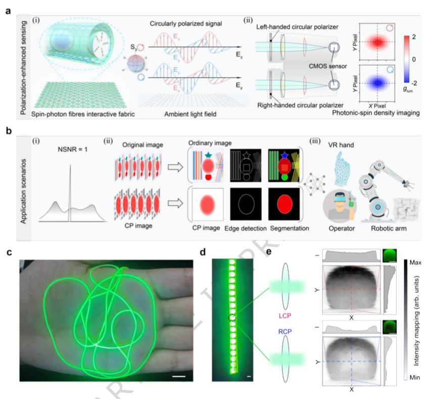
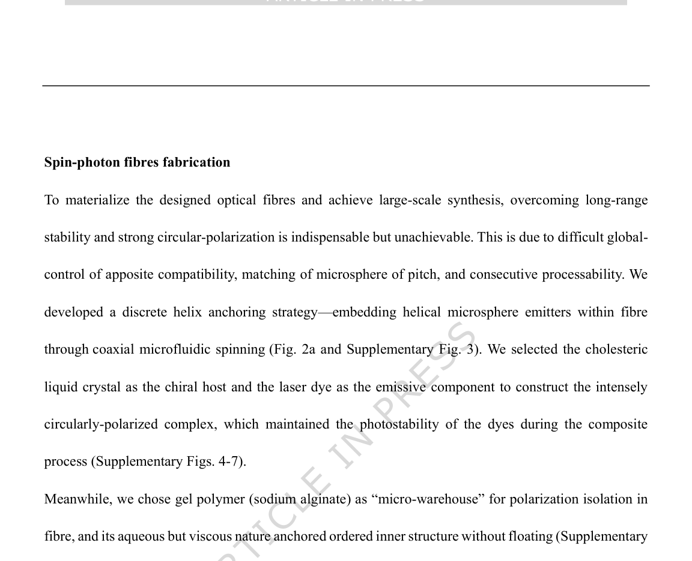
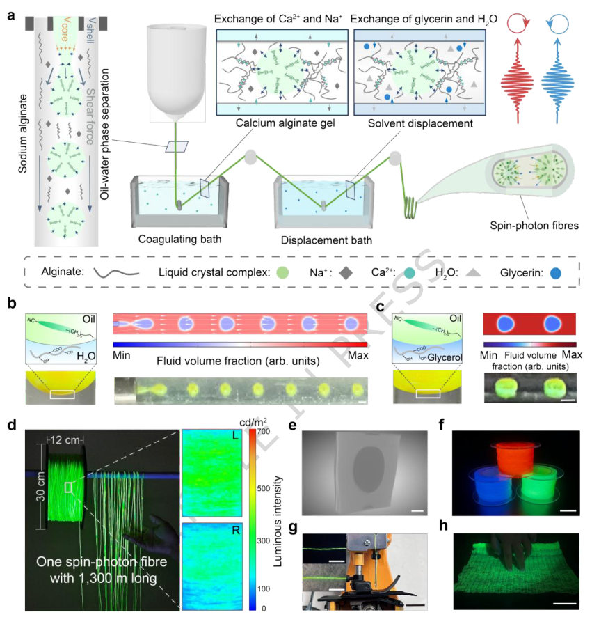
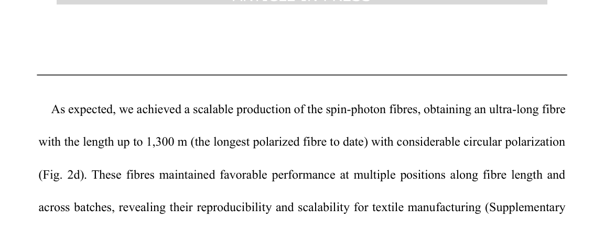
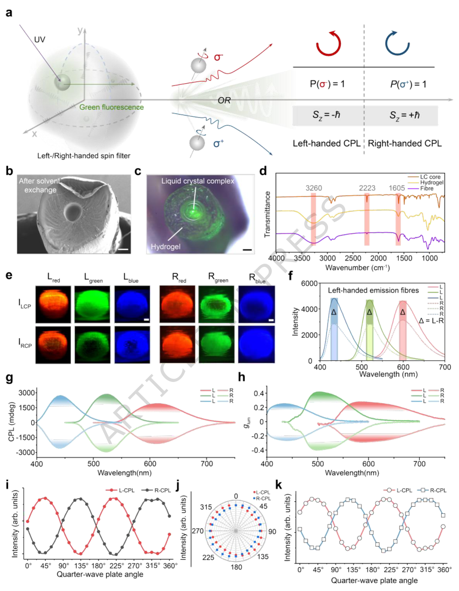
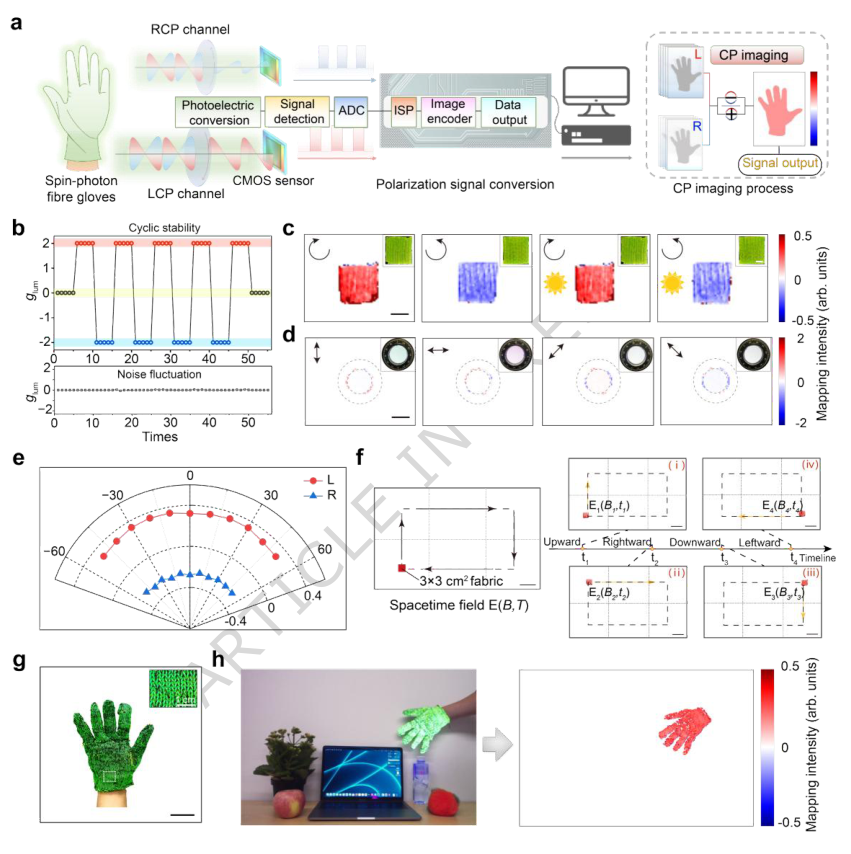
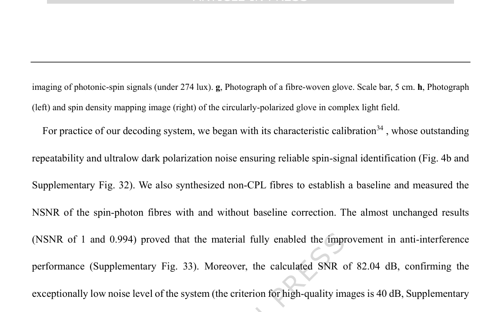
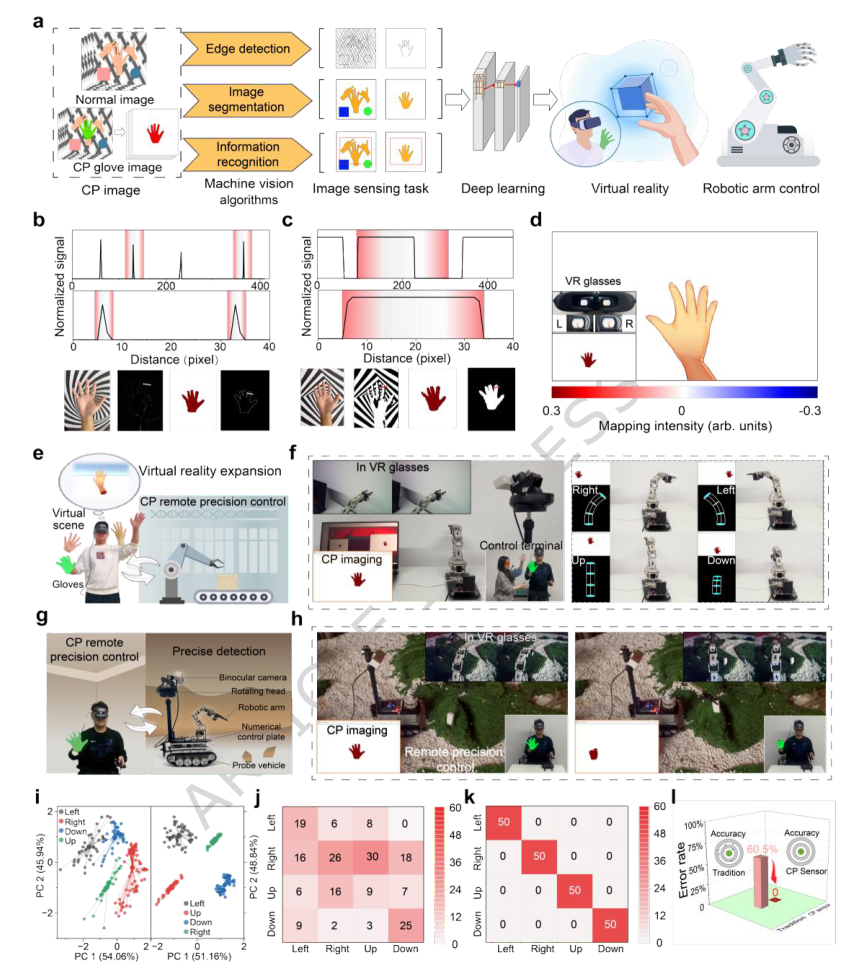
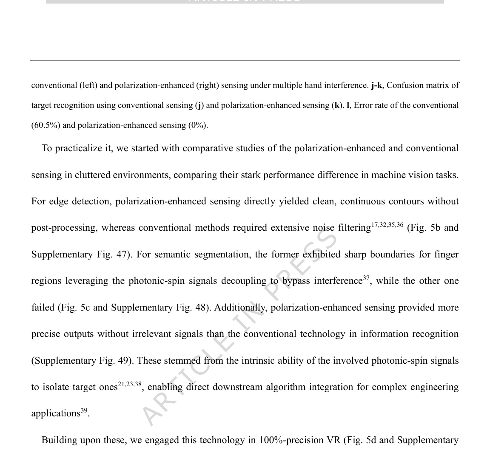

# Ultralong, spin-photon fibres enable polarization-enhanced wearable sensing

- 期刊：Nature Communications
- 日期：2026-07-01
- DOI：10.1038/s41467-026-75025-5
- 解析状态：fulltext_draft

## 摘要与研究价值

**Original:** Photon-in-textile offers transformative potential for wearable sensing, yet persistent challenges in signal overlap, coupling, and quality degradation in dynamic, multivariate environments limit their efficacy. A new polarization-enhanced sensing technology, enabled by a spin fibre-textile capable of efficient decoupling between multivariable interference, is presented. We develop a discrete helix anchoring strategy that autonomously embeds circularly polarized materials within fibres during extrusion, yielding kilometer-scale spin-photon fibres-exceeding 1300 m in continuous length. More importantly, the resulting core-sheath beaded fibres exhibit a luminescence asymmetry factor of 0.41. The fibre-woven fabrics are then produced, allowing for dynamic, real-time signal acquisition by our developed polarization-enhanced sensing approach-that is, distinguishing spin light from surrounding optical fields-achieving signal segmentation and noise suppression at source with 92.63% signal entropy reduction in dynamic scenarios. This spin-photon-digital signal conversion system realizes a superior normalized signal-to-noise ratio of 1.0 (noiseless), thereby enabling multi-dimensional robotic control with 100% sensing accuracy under interference. Furthermore, we demonstrate the scalability and compatibility of this technology in polarization-based image processing, target recognition, and virtual reality. This work offers an innovative solution for robust, embedded intelligence in soft robotics and human-machine symbiosis.

**中文:** 提供机器人、可穿戴或电子皮肤系统任务证据；涉及坏点、漂移、跨器件迁移或少样本校准。摘要可核实数值包括：92.63%、100%。

## 创新点

- Photon-in-textile offers transformative potential for wearable sensing, yet persistent challenges in signal overlap, coupling, and quality degradation in dynamic, multivariate environments limit their efficacy.
- 提供机器人、可穿戴或电子皮肤系统任务证据
- 涉及坏点、漂移、跨器件迁移或少样本校准

## 对当前课题的启发

- 提供机器人、可穿戴或电子皮肤系统任务证据
- 涉及坏点、漂移、跨器件迁移或少样本校准
- 可对照 raw pixel、software feature 与 physical projection 的性能/通道/功耗
- 把其传感源端的物理编码或抗干扰机制抽象为 ADC 前投影，对比源端输出与采样后软件补偿的信噪比和通道成本。

## 制备与实验步骤

### 1. 材料混合与分散

**Source:** p.21

**Original:** Preparation of spinning pulp The cholesteric liquid crystal mixtures were formulated by doping chiral dopants S5011 and R5011 into nematic liquid crystal E7.

**中文:** 材料混合与分散步骤，关键配比、时间、温度和设备参数以 p.21 原文为准。

### 2. 材料混合与分散

**Source:** p.21

**Original:** Chloroform was added for homogeneous dispersion, followed by 8-min sonication and solvent evaporation at 80 °C in an oven to ARTICLE IN PRESS obtain the composite mixtures.

**中文:** 材料混合与分散步骤，关键配比、时间、温度和设备参数以 p.21 原文为准。

### 3. 制备与实验操作

**Source:** p.21

**Original:** A 3.5 wt% sodium alginate hydrogel precursor solution was prepared by gradual addition of sodium alginate to deionized water under controlled conditions to prevent flocculent aggregation.

**中文:** 制备与实验操作步骤，关键配比、时间、温度和设备参数以 p.21 原文为准。

### 4. 材料混合与分散

**Source:** p.21

**Original:** The beaker was maintained at 60 °C in a water bath with continuous magnetic stirring for 5 h until complete dissolution, yielding a homogeneous transparent solution.

**中文:** 材料混合与分散步骤，关键配比、时间、温度和设备参数以 p.21 原文为准。

### 5. 制备与实验操作

**Source:** p.21

**Original:** Concurrently, a 4 wt% calcium chloride crosslinking solution was prepared for hydrogel curing.

**中文:** 制备与实验操作步骤，关键配比、时间、温度和设备参数以 p.21 原文为准。

### 6. 材料混合与分散

**Source:** p.22

**Original:** Under shear stress within the needle, the liquid crystal phase underwent Rayleigh- Plateau instability, fragmenting into monodisperse microspheres that were encapsulated by the alginate solution to form core-shell precursor fibres.

**中文:** 材料混合与分散步骤，关键配比、时间、温度和设备参数以 p.22 原文为准。

### 7. 制备与实验操作

**Source:** p.22

**Original:** Spin-photon textile fabrication and processing Spin-photon textiles were fabricated using a manual loom (Huanxibeier) through continuous weaving with single-strand spin-photon fibres filaments.

**中文:** 制备与实验操作步骤，关键配比、时间、温度和设备参数以 p.22 原文为准。

### 8. 制备与实验操作

**Source:** p.24

**Original:** The processed optical signals were coupled into a fibre-optic spectrometer via an optical fibre assembly.

**中文:** 制备与实验操作步骤，关键配比、时间、温度和设备参数以 p.24 原文为准。

## 方法原文锚点

**Source:** p.21 M001

**Original:** Materials

**中文:** 该段已进入结构化方法步骤；完整逐段翻译待智能体精读补齐。

**Source:** p.21 M002

**Original:** The nematic liquid crystal E7 and chiral dopants R/S5011 were sourced from Shijiazhuang Yesheng

**中文:** 该段已进入结构化方法步骤；完整逐段翻译待智能体精读补齐。

**Source:** p.21 M003

**Original:** Chemical Technology Co., Ltd. Fluorescent dyes including 4-(dicyanomethylene)-2-methyl-6-(4-

**中文:** 该段已进入结构化方法步骤；完整逐段翻译待智能体精读补齐。

**Source:** p.21 M004

**Original:** dimethylaminostyryl)-4H-pyran (DCM, 95% purity), coumarin 7 (C7, 98%) and coumarin 1 (C1, 98%)

**中文:** 该段已进入结构化方法步骤；完整逐段翻译待智能体精读补齐。

**Source:** p.21 M005

**Original:** were procured from Sigma-Aldrich. Glycerol, calcium chloride, chloroform and n-hexane were obtained

**中文:** 该段已进入结构化方法步骤；完整逐段翻译待智能体精读补齐。

**Source:** p.21 M006

**Original:** from Sinopharm Chemical Reagent Co., Ltd., while sodium alginate was acquired from Macklin Chemical

**中文:** 该段已进入结构化方法步骤；完整逐段翻译待智能体精读补齐。

**Source:** p.21 M007

**Original:** Technology Co., Ltd. All chemical reagents were used without further purification as commercially

**中文:** 该段已进入结构化方法步骤；完整逐段翻译待智能体精读补齐。

**Source:** p.21 M008

**Original:** supplied.

**中文:** 该段已进入结构化方法步骤；完整逐段翻译待智能体精读补齐。

**Source:** p.21 M009

**Original:** Preparation of spinning pulp

**中文:** 该段已进入结构化方法步骤；完整逐段翻译待智能体精读补齐。

**Source:** p.21 M010

**Original:** The cholesteric liquid crystal mixtures were formulated by doping chiral dopants S5011 and R5011 into

**中文:** 该段已进入结构化方法步骤；完整逐段翻译待智能体精读补齐。

**Source:** p.21 M011

**Original:** nematic liquid crystal E7. The photonic bandgap was modulated by controlling dopant concentrations to

**中文:** 该段已进入结构化方法步骤；完整逐段翻译待智能体精读补齐。

**Source:** p.21 M012

**Original:** achieve red (2.3 wt%), green (2.8 wt%), and blue (3.3 wt%) chiral structural colors. Corresponding

**中文:** 该段已进入结构化方法步骤；完整逐段翻译待智能体精读补齐。

**Source:** p.21 M013

**Original:** fluorescent dyes—DCM (0.8 wt%, red emission), C7 (0.8 wt%, green), and C1 (1 wt%, blue)—were

**中文:** 该段已进入结构化方法步骤；完整逐段翻译待智能体精读补齐。

**Source:** p.21 M014

**Original:** introduced into their respective photonic bandgap-tuned cholesteric systems. Chloroform was added for

**中文:** 该段已进入结构化方法步骤；完整逐段翻译待智能体精读补齐。

**Source:** p.21 M015

**Original:** homogeneous dispersion, followed by 8-min sonication and solvent evaporation at 80 °C in an oven to

**中文:** 该段已进入结构化方法步骤；完整逐段翻译待智能体精读补齐。

**Source:** p.21 M016

**Original:** ARTICLE IN PRESS

**中文:** 该段已进入结构化方法步骤；完整逐段翻译待智能体精读补齐。

**Source:** p.21 M017

**Original:** obtain the composite mixtures.

**中文:** 该段已进入结构化方法步骤；完整逐段翻译待智能体精读补齐。

**Source:** p.21 M018

**Original:** A 3.5 wt% sodium alginate hydrogel precursor solution was prepared by gradual addition of sodium

**中文:** 该段已进入结构化方法步骤；完整逐段翻译待智能体精读补齐。

**Source:** p.21 M019

**Original:** alginate to deionized water under controlled conditions to prevent flocculent aggregation. The beaker was

**中文:** 该段已进入结构化方法步骤；完整逐段翻译待智能体精读补齐。

**Source:** p.21 M020

**Original:** maintained at 60 °C in a water bath with continuous magnetic stirring for 5 h until complete dissolution,

**中文:** 该段已进入结构化方法步骤；完整逐段翻译待智能体精读补齐。

**Source:** p.21 M021

**Original:** yielding a homogeneous transparent solution. After cooling to ambient temperature, the solution was

**中文:** 该段已进入结构化方法步骤；完整逐段翻译待智能体精读补齐。

**Source:** p.21 M022

**Original:** degassed for 5 min using a vacuum system to eliminate residual bubbles. Concurrently, a 4 wt% calcium

**中文:** 该段已进入结构化方法步骤；完整逐段翻译待智能体精读补齐。

**Source:** p.21 M023

**Original:** chloride crosslinking solution was prepared for hydrogel curing.

**中文:** 该段已进入结构化方法步骤；完整逐段翻译待智能体精读补齐。

**Source:** p.21 M024

**Original:** Microfluidic spinning process

**中文:** 该段已进入结构化方法步骤；完整逐段翻译待智能体精读补齐。

**Source:** p.22 M025

**Original:** ARTICLE IN PRESS

**中文:** 该段已进入结构化方法步骤；完整逐段翻译待智能体精读补齐。

**Source:** p.22 M026

**Original:** The inner-phase liquid crystal composite and outer-phase sodium alginate hydrogel precursor were

**中文:** 该段已进入结构化方法步骤；完整逐段翻译待智能体精读补齐。

**Source:** p.22 M027

**Original:** delivered via independent microfluidic syringe pumps (models QHZS001A and YHBP01,

**中文:** 该段已进入结构化方法步骤；完整逐段翻译待智能体精读补齐。

**Source:** p.22 M028

**Original:** Yuanhangdongli Technology Co., Ltd.) to the coaxial spinneret's core and shell channels, respectively. We

**中文:** 该段已进入结构化方法步骤；完整逐段翻译待智能体精读补齐。

**Source:** p.22 M029

**Original:** have chosen coaxial spinneret nozzles with an inner diameter of 200 μm and an outer diameter of 900 μm.

**中文:** 该段已进入结构化方法步骤；完整逐段翻译待智能体精读补齐。

**Source:** p.22 M030

**Original:** We have set the flow rate parameters in the microfluidic injection pump, with the inner phase flow rate at

**中文:** 该段已进入结构化方法步骤；完整逐段翻译待智能体精读补齐。

**Source:** p.22 M031

**Original:** 0.58 mm·min-1 and the outer phase flow rate at 0.51 mm·min-1. Precise flow rate control established a

**中文:** 该段已进入结构化方法步骤；完整逐段翻译待智能体精读补齐。

**Source:** p.22 M032

**Original:** biphasic fluidic system. Under shear stress within the needle, the liquid crystal phase underwent Rayleigh-

**中文:** 该段已进入结构化方法步骤；完整逐段翻译待智能体精读补齐。

**Source:** p.22 M033

**Original:** Plateau instability, fragmenting into monodisperse microspheres that were encapsulated by the alginate

**中文:** 该段已进入结构化方法步骤；完整逐段翻译待智能体精读补齐。

**Source:** p.22 M034

**Original:** solution to form core-shell precursor fibres. These fibres were subsequently vertically extruded into a

**中文:** 该段已进入结构化方法步骤；完整逐段翻译待智能体精读补齐。

**Source:** p.22 M035

**Original:** CaCl2 coagulation bath, where sufficient residence time ensured complete ionic crosslinking. Continuous

**中文:** 该段已进入结构化方法步骤；完整逐段翻译待智能体精读补齐。

**Source:** p.22 M036

**Original:** fibre collection was achieved using a servo motor-driven spooling system, followed by rotational solvent

**中文:** 该段已进入结构化方法步骤；完整逐段翻译待智能体精读补齐。

**Source:** p.22 M037

**Original:** exchange in a glycerol immersion bath.

**中文:** 该段已进入结构化方法步骤；完整逐段翻译待智能体精读补齐。

**Source:** p.22 M038

**Original:** Numerical simulation

**中文:** 该段已进入结构化方法步骤；完整逐段翻译待智能体精读补齐。

**Source:** p.22 M039

**Original:** To elucidate the microfluidic spinning mechanism, a phase-field numerical model was developed to

**中文:** 该段已进入结构化方法步骤；完整逐段翻译待智能体精读补齐。

**Source:** p.22 M040

**Original:** simulate the coaxial flow within the spinneret, whereby the oil-phase liquid crystal core flow and aqueous-

**中文:** 该段已进入结构化方法步骤；完整逐段翻译待智能体精读补齐。

**Source:** p.22 M041

**Original:** phase gel sheath flow were co-extruded into a cylindrical needle channel. Numerical solutions were

**中文:** 该段已进入结构化方法步骤；完整逐段翻译待智能体精读补齐。

**Source:** p.22 M042

**Original:** obtained using COMSOL Multiphysics 6.0 software (COMSOL Inc.), enabling simulation of the dynamic

**中文:** 该段已进入结构化方法步骤；完整逐段翻译待智能体精读补齐。

**Source:** p.22 M043

**Original:** ARTICLE IN PRESS

**中文:** 该段已进入结构化方法步骤；完整逐段翻译待智能体精读补齐。

**Source:** p.22 M044

**Original:** interfacial shear processes and visualization of associated flow field profiles. The complete mathematical

**中文:** 该段已进入结构化方法步骤；完整逐段翻译待智能体精读补齐。

**Source:** p.22 M045

**Original:** formulation and boundary conditions are provided in the Supplementary Information.

**中文:** 该段已进入结构化方法步骤；完整逐段翻译待智能体精读补齐。

**Source:** p.22 M046

**Original:** Spin-photon textile fabrication and processing

**中文:** 该段已进入结构化方法步骤；完整逐段翻译待智能体精读补齐。

**Source:** p.22 M047

**Original:** Spin-photon textiles were fabricated using a manual loom (Huanxibeier) through continuous weaving

**中文:** 该段已进入结构化方法步骤；完整逐段翻译待智能体精读补齐。

**Source:** p.22 M048

**Original:** with single-strand spin-photon fibres filaments. To validate co-spinning compatibility with commercial

**中文:** 该段已进入结构化方法步骤；完整逐段翻译待智能体精读补齐。

**Source:** p.22 M049

**Original:** fibres, hybrid textiles were produced by integrating cotton and polyurethane yarns with spin-photon fibres

**中文:** 该段已进入结构化方法步骤；完整逐段翻译待智能体精读补齐。

**Source:** p.22 M050

**Original:** filaments on conventional weaving equipment. For embroidery processing, an industrial embroidery

**中文:** 该段已进入结构化方法步骤；完整逐段翻译待智能体精读补齐。

**Source:** p.22 M051

**Original:** machine (Feiren) equipped with spin-photon fibres threads was employed. Prior to embroidery, critical

**中文:** 该段已进入结构化方法步骤；完整逐段翻译待智能体精读补齐。

**Source:** p.23 M052

**Original:** ARTICLE IN PRESS

**中文:** 该段已进入结构化方法步骤；完整逐段翻译待智能体精读补齐。

**Source:** p.23 M053

**Original:** parameters including needle penetration frequency (2 Hz) and stitch spacing (0.8 mm) were systematically

**中文:** 该段已进入结构化方法步骤；完整逐段翻译待智能体精读补齐。

**Source:** p.23 M054

**Original:** adjusted to ensure substrate compatibility with commercial fabrics.

**中文:** 该段已进入结构化方法步骤；完整逐段翻译待智能体精读补齐。

**Source:** p.23 M055

**Original:** Bending radius quantification

**中文:** 该段已进入结构化方法步骤；完整逐段翻译待智能体精读补齐。

**Source:** p.23 M056

**Original:** Optical fibres were affixed onto glass slides using adhesive tape and mounted on an optical microscope

**中文:** 该段已进入结构化方法步骤；完整逐段翻译待智能体精读补齐。

**Source:** p.23 M057

**Original:** stage. The objective lens magnification was adjusted to fully encompass the bending region within the

**中文:** 该段已进入结构化方法步骤；完整逐段翻译待智能体精读补齐。

**Source:** p.23 M058

**Original:** field of view, with transmitted light illumination optimized to enhance edge contrast. Multi-focal plane

**中文:** 该段已进入结构化方法步骤；完整逐段翻译待智能体精读补齐。

**Source:** p.23 M059

**Original:** images were captured, from which the frame exhibiting optimal fibre curvature definition was selected

**中文:** 该段已进入结构化方法步骤；完整逐段翻译待智能体精读补齐。

**Source:** p.23 M060

**Original:** for analysis. The digitized image was processed using ImageJ or Adobe Illustrator software, wherein the

**中文:** 该段已进入结构化方法步骤；完整逐段翻译待智能体精读补齐。

**Source:** p.23 M061

**Original:** fibre's bending profile was traced using freehand selection or brush tools to delineate the central axis. An

**中文:** 该段已进入结构化方法步骤；完整逐段翻译待智能体精读补齐。

**Source:** p.23 M062

**Original:** inscribed circle was computationally generated along the curvature, enabling measurement of the

**中文:** 该段已进入结构化方法步骤；完整逐段翻译待智能体精读补齐。

**Source:** p.23 M063

**Original:** curvature radius. Absolute dimensions were determined through scale calibration, with final values

**中文:** 该段已进入结构化方法步骤；完整逐段翻译待智能体精读补齐。

**Source:** p.23 M064

**Original:** derived from averaging repeated measurements.

**中文:** 该段已进入结构化方法步骤；完整逐段翻译待智能体精读补齐。

**Source:** p.23 M065

**Original:** Laundering durability assessment

**中文:** 该段已进入结构化方法步骤；完整逐段翻译待智能体精读补齐。

**Source:** p.23 M066

**Original:** Three designated measurement zones were marked on the finger regions of spin-photon fibres knitted

**中文:** 该段已进入结构化方法步骤；完整逐段翻译待智能体精读补齐。

**Source:** p.23 M067

**Original:** gloves for baseline characterization (0 laundering cycles). The gloves were subjected to accelerated

**中文:** 该段已进入结构化方法步骤；完整逐段翻译待智能体精读补齐。

**Source:** p.23 M068

**Original:** laundering in a commercial top-loading washer (Shishang) under domestic laundering conditions: water

**中文:** 该段已进入结构化方法步骤；完整逐段翻译待智能体精读补齐。

**Source:** p.23 M069

**Original:** ARTICLE IN PRESS

**中文:** 该段已进入结构化方法步骤；完整逐段翻译待智能体精读补齐。

**Source:** p.23 M070

**Original:** temperature maintained at 25 °C, 10 min per cycle, with standard detergent and companion fabric loading

**中文:** 该段已进入结构化方法步骤；完整逐段翻译待智能体精读补齐。

**Source:** p.23 M071

**Original:** to simulate routine washing. Sequential laundering cycles (20, 40, 60 cycles) were performed with

**中文:** 该段已进入结构化方法步骤；完整逐段翻译待智能体精读补齐。

**Source:** p.23 M072

**Original:** intermediate fluorescence characterization. Immediately following each target cycle count, samples were

**中文:** 该段已进入结构化方法步骤；完整逐段翻译待智能体精读补齐。

**Source:** p.23 M073

**Original:** retrieved for optical evaluation. Fluorescence intensity measurements were conducted at all three fingertip

**中文:** 该段已进入结构化方法步骤；完整逐段翻译待智能体精读补齐。

**Source:** p.23 M074

**Original:** zones, with cycle-dependent performance calculated through spatial averaging.

**中文:** 该段已进入结构化方法步骤；完整逐段翻译待智能体精读补齐。

**Source:** p.23 M075

**Original:** Polarization characterization

**中文:** 该段已进入结构化方法步骤；完整逐段翻译待智能体精读补齐。

**Source:** p.23 M076

**Original:** To investigate the circular polarization properties of spin-photon fibres, a custom optical characterization

**中文:** 该段已进入结构化方法步骤；完整逐段翻译待智能体精读补齐。

**Source:** p.23 M077

**Original:** platform was established. A collimated 365 nm ultraviolet light source was aligned with the optical axis

**中文:** 该段已进入结构化方法步骤；完整逐段翻译待智能体精读补齐。

**Source:** p.23 M078

**Original:** to ensure beam-path consistency. The UV beam irradiated fibres samples mounted on a stage, inducing

**中文:** 该段已进入结构化方法步骤；完整逐段翻译待智能体精读补齐。

**Source:** p.24 M079

**Original:** ARTICLE IN PRESS

**中文:** 该段已进入结构化方法步骤；完整逐段翻译待智能体精读补齐。

**Source:** p.24 M080

**Original:** wavelength-specific responses. The emitted light was subsequently modulated through sequential

**中文:** 该段已进入结构化方法步骤；完整逐段翻译待智能体精读补齐。

**Source:** p.24 M081

**Original:** polarization elements: a linear polarizer (400 to 700 nm, Thorlabs) followed by a quarter-wave plate (QWP,

**中文:** 该段已进入结构化方法步骤；完整逐段翻译待智能体精读补齐。

**Source:** p.24 M082

**Original:** 350 to 850 nm, Thorlabs) for polarization state decomposition. The processed optical signals were coupled

**中文:** 该段已进入结构化方法步骤；完整逐段翻译待智能体精读补齐。

**Source:** p.24 M083

**Original:** into a fibre-optic spectrometer via an optical fibre assembly. Intensity measurements were recorded as

**中文:** 该段已进入结构化方法步骤；完整逐段翻译待智能体精读补齐。

**Source:** p.24 M084

**Original:** functions of polarizer/waveplate angular orientations (0-360° in 15° increments), with sinusoidal

**中文:** 该段已进入结构化方法步骤；完整逐段翻译待智能体精读补齐。

**Source:** p.24 M085

**Original:** periodicity analysis enabling precise determination of circular polarization fluctuating characteristics. All

**中文:** 该段已进入结构化方法步骤；完整逐段翻译待智能体精读补齐。

**Source:** p.24 M086

**Original:** measurements were performed under darkroom conditions (ambient light < 1 lux) to minimize photonic

**中文:** 该段已进入结构化方法步骤；完整逐段翻译待智能体精读补齐。

**Source:** p.24 M087

**Original:** interference.

**中文:** 该段已进入结构化方法步骤；完整逐段翻译待智能体精读补齐。

**Source:** p.24 M088

**Original:** Machine vision task evaluation

**中文:** 该段已进入结构化方法步骤；完整逐段翻译待智能体精读补齐。

**Source:** p.24 M089

**Original:** To evaluate the performance of polarization-enhanced sensing versus conventional imaging in edge

**中文:** 该段已进入结构化方法步骤；完整逐段翻译待智能体精读补齐。

**Source:** p.24 M090

**Original:** detection and image segmentation tasks, image datasets from both sensing modalities were acquired and

**中文:** 该段已进入结构化方法步骤；完整逐段翻译待智能体精读补齐。

**Source:** p.24 M091

**Original:** processed using ImageJ software. For edge detection, the workflow comprised: grayscale conversion of

**中文:** 该段已进入结构化方法步骤；完整逐段翻译待智能体精读补齐。

**Source:** p.24 M092

**Original:** raw images, intensity inversion to reduce background signals, Gaussian blur denoising, adaptive threshold

**中文:** 该段已进入结构化方法步骤；完整逐段翻译待智能体精读补齐。

**Source:** p.24 M093

**Original:** binarization, and edge extraction using the built-in Sobel operator. The image segmentation protocol

**中文:** 该段已进入结构化方法步骤；完整逐段翻译待智能体精读补齐。

**Source:** p.24 M094

**Original:** followed identical grayscale conversion, inversion, and Gaussian denoising steps, succeeded by

**中文:** 该段已进入结构化方法步骤；完整逐段翻译待智能体精读补齐。

**Source:** p.24 M095

**Original:** automated threshold binarization and morphological operations (hole filling, erosion, and dilation) to

**中文:** 该段已进入结构化方法步骤；完整逐段翻译待智能体精读补齐。

**Source:** p.24 M096

**Original:** optimize segmentation accuracy. Full methodological details are provided in the Supplementary

**中文:** 该段已进入结构化方法步骤；完整逐段翻译待智能体精读补齐。

**Source:** p.24 M097

**Original:** ARTICLE IN PRESS

**中文:** 该段已进入结构化方法步骤；完整逐段翻译待智能体精读补齐。

**Source:** p.24 M098

**Original:** Information.

**中文:** 该段已进入结构化方法步骤；完整逐段翻译待智能体精读补齐。

**Source:** p.24 M099

**Original:** Virtual reality integration system

**中文:** 该段已进入结构化方法步骤；完整逐段翻译待智能体精读补齐。

**Source:** p.24 M100

**Original:** The GOOVIS Lite VR head-mounted display was employed to deliver VR visual stimuli, featuring dual

**中文:** 该段已进入结构化方法步骤；完整逐段翻译待智能体精读补齐。

## 图表解读

### Fig. 1

**Source:** p.7

**Original caption:** Fig. 1 | Spin-photon fibres enabled polarization-enhanced wearable sensing. a, Schematic illustrates the polarization-

**中文图注:** Fig. 1 原始图注已提取；逐项含义见下方分图说明。

**Reading note:** 重点查看器件结构、材料层次、信号路径和制备流程。

### Fig. 8

**Source:** p.8

**Original caption:** Fig. 8). The generated flow shear force6,26 stemmed from well-chosen flow rate ratio between two phase

**中文图注:** Fig. 8 原始图注已提取；逐项含义见下方分图说明。

**Reading note:** 重点查看标定方法、量程、误差、线性和动态响应，避免只比较单一灵敏度。

### Fig. 2

**Source:** p.9

**Original caption:** Fig. 2 | Spin-photon fibre fabrication. a, Schematic showing the setup used to continuously produce spin-photon fibres.

**中文图注:** Fig. 2 原始图注已提取；逐项含义见下方分图说明。

**Reading note:** 重点查看器件结构、材料层次、信号路径和制备流程。

### Fig. 12

**Source:** p.10

**Original caption:** Fig. 12). X-ray three-dimensional reconstruction proved the microscopic phase-separated structure (Fig.

**中文图注:** Fig. 12 原始图注已提取；逐项含义见下方分图说明。

**Reading note:** 重点查看器件结构、材料层次、信号路径和制备流程。

### Fig. 3

**Source:** p.12

**Original caption:** Fig. 3 | Circular polarization examination of fibres. a, Schematic of the photonic spin selectivity of the helical

**中文图注:** Fig. 3 原始图注已提取；逐项含义见下方分图说明。

**Reading note:** 重点查看器件结构、材料层次、信号路径和制备流程。

### Fig. 4

**Source:** p.15

**Original caption:** Fig. 4 | Polarization-enhanced sensing. a, System-level block diagram of photonic-spin signals decoding with a fibre-

**中文图注:** Fig. 4 原始图注已提取；逐项含义见下方分图说明。

**Reading note:** 结合正文首次引用位置和原始图注核对该图的证据角色。

### Fig. 34

**Source:** p.16

**Original caption:** Fig. 34). The photonic-spin imaging under 0 lux (darkness) and 274 lux (daylight simulation) further

**中文图注:** Fig. 34 原始图注已提取；逐项含义见下方分图说明。

**Reading note:** 重点查看机制模型与实验结果是否一致，以及关键结构参数的对照关系。

### Fig. 5

**Source:** p.18

**Original caption:** Fig. 5 | Wearable sensing applications. a, Diagram of the multi-modal sensing and applications based on fibre-emitted

**中文图注:** Fig. 5 原始图注已提取；逐项含义见下方分图说明。

**Reading note:** 重点查看任务设置、基线、消融和失败案例，判断系统演示是否真正支撑前端价值。

### Fig. 50

**Source:** p.19

**Original caption:** Fig. 50), and developed an immersive accurate robotic arm control system (Fig. 5e). The operator wearing

**中文图注:** Fig. 50 原始图注已提取；逐项含义见下方分图说明。

**Reading note:** 重点查看任务设置、基线、消融和失败案例，判断系统演示是否真正支撑前端价值。
