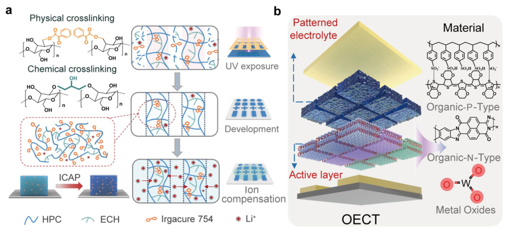
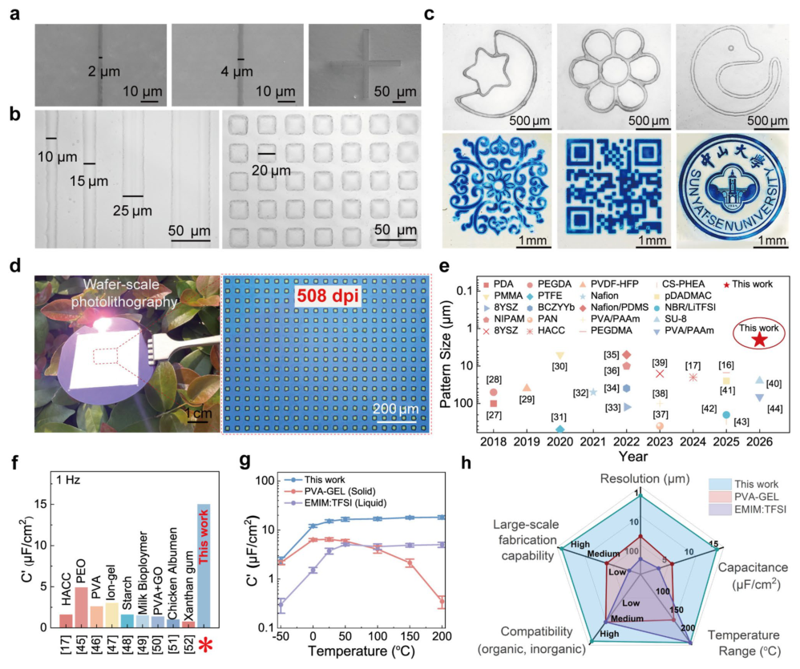
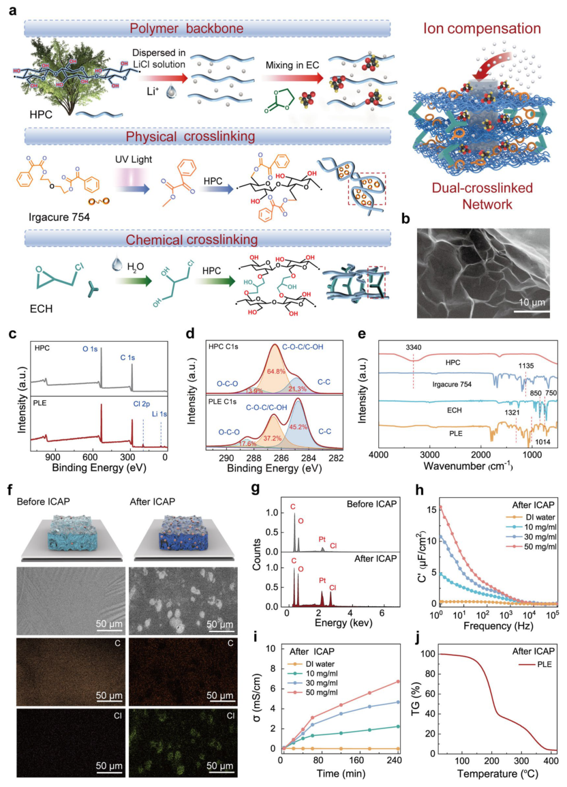
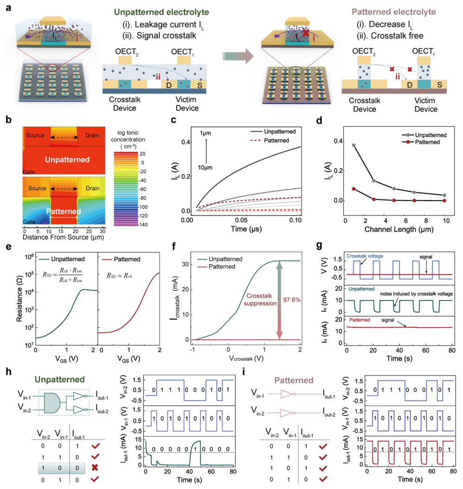
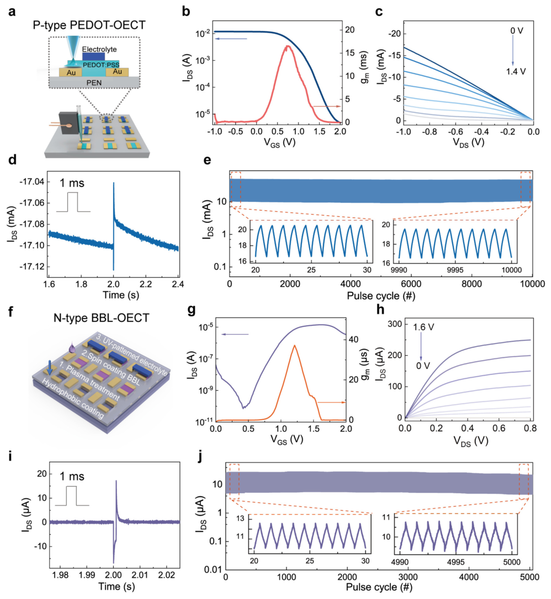
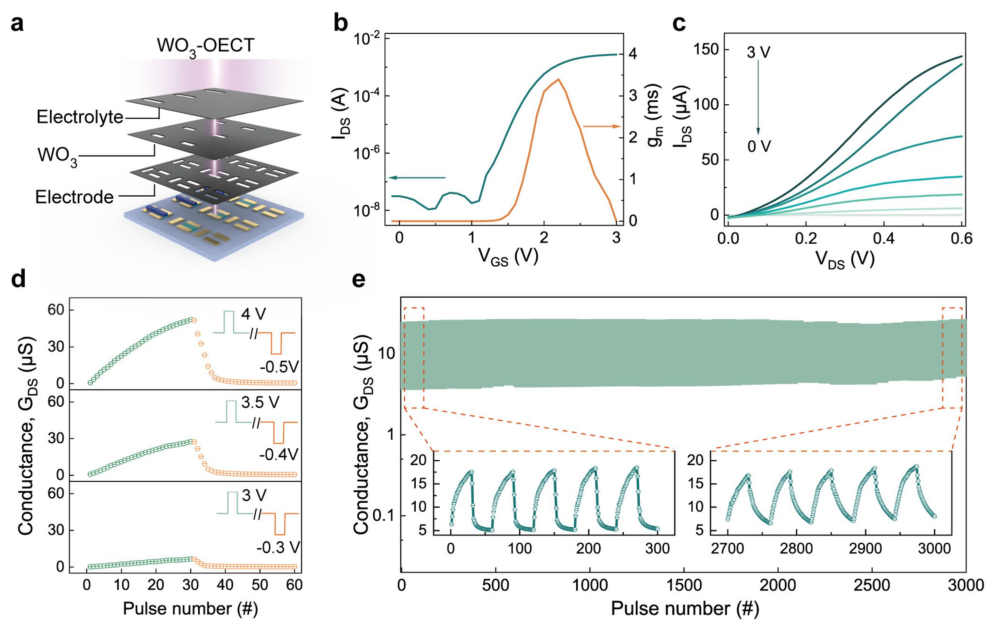

# Ion Compensation-Assisted Photolithography Enables High-Resolution Electrolytes for Neuromorphic Transistors

- 期刊：Nano-Micro Letters
- 日期：2026-07-13
- DOI：10.1007/s40820-026-02288-4
- 解析状态：fulltext_draft

## 摘要与研究价值

**Original:** Abstract High-density organic electrochemical transistor (OECT) arrays are essential for neuromorphic computing and bioelectronic interfaces, but progress has been limited by the low resolution of electrolyte patterning. Although conventional photolithography offers high feature resolution, it involves a fundamental trade-off among spatial resolution, ionic capacitance, and stability in the electrolyte. Here we report an ion compensation-assisted photolithography (ICAP) strategy that yields electrolyte micro-patterns combining high precision, high capacitance and high stability. A molecularly engineered electrolyte forms, under UV exposure, a physicochemical dual cross-linked network with strong solvent resistance and hydrophobicity, which suppresses swelling during both aqueous development and the subsequent ion-compensation step, preserving pattern fidelity. Ion compensation then restores and enhances the mobile-ion content, increasing areal capacitance. The resulting electrolytes achieve a record 2 μm resolution, 15.6 μF cm −2 capacitance, and strong thermal stability from − 50 to 200 °C. Integrated into OECTs, the ICAP-patterned electrolytes suppress crosstalk by 97.6% and boost on/off ratios by 325%, reducing parasitic coupling by more than 40 times compared to unpatterned arrays. The method is compatible with p -type and n -type organic semiconductors and inorganic oxides, providing a versatile route to scalable neuromorphic circuits and advanced bioelectronics.

**中文:** 涉及 in-sensor/物理计算或可编程触觉前端。摘要可核实数值包括：2 μm、97.6%、325%。

## 创新点

- Abstract High-density organic electrochemical transistor (OECT) arrays are essential for neuromorphic computing and bioelectronic interfaces, but progress has been limited by the low resolution of electrolyte patterning.
- 涉及 in-sensor/物理计算或可编程触觉前端

## 对当前课题的启发

- 涉及 in-sensor/物理计算或可编程触觉前端
- 可对照 raw pixel、software feature 与 physical projection 的性能/通道/功耗

## 制备与实验步骤

### 1. 图形化与结构成形

**Source:** p.1

**Original:** • Ion compensation–assisted photolithography (ICAP) combines UV-triggered dual crosslinking with a post-patterning ion replenish- ment step, enabling patterned electrolytes with a spatial resolution of 2 μm, a capacitance of 15.6 μF cm−2.

**中文:** 图形化与结构成形步骤，关键配比、时间、温度和设备参数以 p.1 原文为准。

### 2. 图形化与结构成形

**Source:** p.1

**Original:** • ICAP-patterned electrolytes provide array-level ionic isolation by spatially confining ion transport, suppressing lateral ionic leakage lishing a versatile electrolyte-patterning strategy for high-density electrolyte-gated devices.

**中文:** 图形化与结构成形步骤，关键配比、时间、温度和设备参数以 p.1 原文为准。

### 3. 图形化与结构成形

**Source:** p.1

**Original:** ABSTRACT High-density organic electrochemical transistor (OECT) arrays are essential for neuromorphic computing and bioelectronic interfaces, but progress has been limited by the low resolution of electrolyte patterning.

**中文:** 图形化与结构成形步骤，关键配比、时间、温度和设备参数以 p.1 原文为准。

### 4. 图形化与结构成形

**Source:** p.1

**Original:** Here we report an ion compensationassisted photolithography (ICAP) strategy that yields electrolyte micro-patterns combining high precision, high capacitance and high stability.

**中文:** 图形化与结构成形步骤，关键配比、时间、温度和设备参数以 p.1 原文为准。

### 5. 图形化与结构成形

**Source:** p.1

**Original:** A molecularly engineered electrolyte forms, under UV exposure, a physicochemical dual cross-linked network with strong solvent resistance and hydrophobicity, which suppresses swelling during both aqueous development and the subsequent ioncompensation step, preserving pattern fidelity.

**中文:** 图形化与结构成形步骤，关键配比、时间、温度和设备参数以 p.1 原文为准。

### 6. 图形化与结构成形

**Source:** p.1

**Original:** Integrated into OECTs, the ICAP-patterned electrolytes suppress crosstalk by 97.6% and boost on/off ratios by 325%, reducing parasitic coupling by more than 40 times compared to unpatterned arrays.

**中文:** 图形化与结构成形步骤，关键配比、时间、温度和设备参数以 p.1 原文为准。

### 7. 图形化与结构成形

**Source:** p.2

**Original:** Moreover, beyond the need to simultaneously achieve high patterning resolution and high capacitance, temperature stability also represents a critical requirement for practical device operation.

**中文:** 图形化与结构成形步骤，关键配比、时间、温度和设备参数以 p.2 原文为准。

### 8. 图形化与结构成形

**Source:** p.2

**Original:** Thus, the trade-off among high resolution, high capacitance, and high stability arises not only from intrinsic material limitations, but more fundamentally from the incompatibility between traditional patterning processes and the ionic functionality required for electrolyte-gated operation.

**中文:** 图形化与结构成形步骤，关键配比、时间、温度和设备参数以 p.2 原文为准。

### 9. 图形化与结构成形

**Source:** p.2

**Original:** Here, we introduce an ion compensation-assisted photolithography (ICAP) strategy to address the long-standing trade-off among patterning resolution, ionic capacitance, and operational stability in miniaturized electrolytes.

**中文:** 图形化与结构成形步骤，关键配比、时间、温度和设备参数以 p.2 原文为准。

### 10. 图形化与结构成形

**Source:** p.2

**Original:** The key conceptual advance of ICAP is that it decouples two requirements that are usually incompatible in conventional electrolyte patterning: precise structural definition during photolithography and high mobile-ion content for effective electrolyte gating.

**中文:** 图形化与结构成形步骤，关键配比、时间、温度和设备参数以 p.2 原文为准。

### 11. 图形化与结构成形

**Source:** p.2

**Original:** Using ICAP, we achieve patterned electrolytes with a spatial resolution of 2 μm, a large capacitance of 15.6 μF cm−2, and exceptional stability across an ultrawide temperature range (− 50–200 °C).

**中文:** 图形化与结构成形步骤，关键配比、时间、温度和设备参数以 p.2 原文为准。

### 12. 图形化与结构成形

**Source:** p.2

**Original:** However, recent research has predominantly focused on single-OECT architectures, and the inability to precisely pattern electrolytes has critically limited the development of scalable, integrated circuits based on highdensity OECT arrays [8, 9].

**中文:** 图形化与结构成形步骤，关键配比、时间、温度和设备参数以 p.2 原文为准。

### 13. 成膜与沉积

**Source:** p.2

**Original:** Printing-based techniques such as screen printing, inkjet printing, self-assembly, and transfer printing allow straightforward electrolyte patterning, yet they suffer from limited resolution, low yield, and poor throughput [10–14].

**中文:** 成膜与沉积步骤，关键配比、时间、温度和设备参数以 p.2 原文为准。

### 14. 图形化与结构成形

**Source:** p.2

**Original:** Standard mask-based photolithography has recently enabled tens-of-micrometer-scale patterned electrolyte features by using photo-assisted crosslinking to form an insoluble resistlike network upon UV exposure [15–17].

**中文:** 图形化与结构成形步骤，关键配比、时间、温度和设备参数以 p.2 原文为准。

### 15. 图形化与结构成形

**Source:** p.2

**Original:** In conventional photolithographic approaches, the highly cross-linked networks needed to preserve high-resolution patterns often restrict mobile-ion content and transport, thereby reducing ionic conductivity and capacitance.

**中文:** 图形化与结构成形步骤，关键配比、时间、温度和设备参数以 p.2 原文为准。

### 16. 图形化与结构成形

**Source:** p.2

**Original:** While increasing the ion concentration in the precursor formulation can improve capacitance, it generally compromises the mechanical integrity of the patterned electrolyte and makes precise lithographic definition more challenging [18–20].

**中文:** 图形化与结构成形步骤，关键配比、时间、温度和设备参数以 p.2 原文为准。

## 方法原文锚点

**Source:** p.1 M001

**Original:** • Ion compensation–assisted photolithography (ICAP) combines UV-triggered dual crosslinking with a post-patterning ion replenish-

**中文:** 该段已进入结构化方法步骤；完整逐段翻译待智能体精读补齐。

**Source:** p.1 M002

**Original:** ment step, enabling patterned electrolytes with a spatial resolution of 2 μm, a capacitance of 15.6 μF cm−2.

**中文:** 该段已进入结构化方法步骤；完整逐段翻译待智能体精读补齐。

**Source:** p.1 M003

**Original:** • ICAP-patterned electrolytes provide array-level ionic isolation by spatially confining ion transport, suppressing lateral ionic leakage

**中文:** 该段已进入结构化方法步骤；完整逐段翻译待智能体精读补齐。

**Source:** p.1 M004

**Original:** lishing a versatile electrolyte-patterning strategy for high-density electrolyte-gated devices.

**中文:** 该段已进入结构化方法步骤；完整逐段翻译待智能体精读补齐。

**Source:** p.1 M005

**Original:** ABSTRACT High-density organic electrochemical transistor (OECT) arrays are essential for neuromorphic computing and bioelectronic interfaces, but progress has been limited by the low resolution of electrolyte patterning. Although conventional photolithography offers high feature resolution, it involves a fundamental trade-off among spatial resolution, ionic capacitance, and stability in the electrolyte. Here we report an ion compensationassisted photolithography (ICAP) strategy that yields electrolyte micro-patterns combining high precision, high capacitance and high stability. A molecularly engineered electrolyte forms, under UV exposure, a physicochemical dual cross-linked network with strong solvent resistance and hydrophobicity, which suppresses swelling during both aqueous development and the subsequent ioncompensation step, preserving pattern fidelity. Ion compensation then restores and enhances the mobile-ion content, increasing areal capacitance. The resulting electrolytes achieve a record 2 μm resolution, 15.6 μF cm−2 capacitance, and strong thermal stability from − 50 to 200 °C. Integrated into OECTs, the ICAP-patterned electrolytes suppress crosstalk by 97.6% and boost on/off ratios by 325%, reducing parasitic coupling by more than 40 times compared to unpatterned arrays. The method is compatible with p-type and n-type organic semiconductors and inorganic oxides, providing a versatile route to scalable neuromorphic circuits and advanced bioelectronics.

**中文:** 该段已进入结构化方法步骤；完整逐段翻译待智能体精读补齐。

**Source:** p.2 M006

**Original:** Moreover, beyond the need to simultaneously achieve high patterning resolution and high capacitance, temperature stability also represents a critical requirement for practical device operation. Conventional hydrogel-based electrolytes offer excellent ionic transport and high capacitance but suffer from rapid water loss at small scales, leading to structural instability and device degradation. In contrast, polyelectrolytes, though more stable, exhibit slow ion mobility, resulting in hysteretic behavior and limited response speed [16, 21]. Thus, the trade-off among high resolution, high capacitance, and high stability arises not only from intrinsic material limitations, but more fundamentally from the incompatibility between traditional patterning processes and the ionic functionality required for electrolyte-gated operation. To date, no electrolyte has been reported that simultaneously satisfies the requirements for both high capacitance and stability under miniaturized conditions [22, 23]. Here, we introduce an ion compensation-assisted photolithography (ICAP) strategy to address the long-standing trade-off among patterning resolution, ionic capacitance, and operational stability in miniaturized electrolytes. The key conceptual advance of ICAP is that it decouples two requirements that are usually incompatible in conventional electrolyte patterning: precise structural definition during photolithography and high mobile-ion content for effective electrolyte gating. To implement this concept, we developed a photolithographic electrolyte (PLE) that forms a solvent-resistant physicochemical dual cross-linked network upon UV irradiation. This network enables accurate photopatterning with minimal swelling, while the subsequent ion-compensation step replenishes mobile ions after lithographic fixation, improving the capacitance of the electrolyte without compromising structural integrity. Using ICAP, we achieve patterned electrolytes with a spatial resolution of 2 μm, a large capacitance of 15.6 μF cm−2, and exceptional stability across an ultrawide temperature range (− 50–200 °C). When integrated into OECTs, the well-defined ICAP-electrolytes boost the on/ off ratio by 325% and suppress inter-device crosstalk by 97.6% compared to unpatterned counterparts. The ICAPpatterned electrolyte is broadly compatible with p-type and n-type organic semiconductors and inorganic oxide semiconductors, underscoring its versatility across diverse material systems. The ICAP strategy provides a scalable platform for high-performance electrolyte-gated transistors

**中文:** 该段已进入结构化方法步骤；完整逐段翻译待智能体精读补齐。

**Source:** p.2 M007

**Original:** Organic electrochemical transistors (OECTs) have emerged as a distinctive class of transistors that combine low-voltage operation, high transconductance, flexibility, and biocompatibility [1]. These unique advantages make OECTs highly promising for applications ranging from neuromorphic computing to bioelectronic interfaces and flexible integrated circuits [2–4]. Conductivity modulation is achieved through the electrolyte-to-channel ion injection, which dynamically alters the doping state of the semiconductor [5, 6]. The very property that enables OECTs, their dependence on mobile ionic electrolytes, also introduces significant challenges for miniaturization and large-scale integration. The presence of unpatterned electrolyte in densely packed arrays can degrade the on/off ratio, increase power consumption, and induce severe inter-device crosstalk due to parasitic ionic currents and capacitive coupling [7]. To fully exploit their properties in large-scale integrated circuits, OECT arrays need to achieve high integration density while maintaining robust electrical isolation. However, recent research has predominantly focused on single-OECT architectures, and the inability to precisely pattern electrolytes has critically limited the development of scalable, integrated circuits based on highdensity OECT arrays [8, 9]. Multiple strategies have been explored to address this issue. Printing-based techniques such as screen printing, inkjet printing, self-assembly, and transfer printing allow straightforward electrolyte patterning, yet they suffer from limited resolution, low yield, and poor throughput [10–14]. Standard mask-based photolithography has recently enabled tens-of-micrometer-scale patterned electrolyte features by using photo-assisted crosslinking to form an insoluble resistlike network upon UV exposure [15–17]. However, the continued shrinking of electrolyte dimensions imposes stringent requirements on mobile-ion density, because micropatterned electrolytes must retain a high capacitance to drive OECT operation. In conventional photolithographic approaches, the highly cross-linked networks needed to preserve high-resolution patterns often restrict mobile-ion content and transport, thereby reducing ionic conductivity and capacitance. While increasing the ion concentration in the precursor formulation can improve capacitance, it generally compromises the mechanical integrity of the patterned electrolyte and makes precise lithographic definition more challenging [18–20].

**中文:** 该段已进入结构化方法步骤；完整逐段翻译待智能体精读补齐。

**Source:** p.3 M008

**Original:** this treatment only removes the water, preserving EC within the polymer matrix to function as the plasticizing phase. Subsequent cooling to room temperature solidified the EC, yielding a solid film. The samples were then exposed to ultraviolet light (SEN PL17-110) through a quartz mask for 5 min, followed by development in water to yield patterned structures. The patterned electrolytes were immersed in LiCl solutions (10, 30, and 50 mg mL−1) for 4 h to enhance their capacitance. The residual LiCl solution was removed by blowing with a N2 gun.

**中文:** 该段已进入结构化方法步骤；完整逐段翻译待智能体精读补齐。

**Source:** p.3 M009

**Original:** 2.2.3 Fabrication of P‑type OECTs

**中文:** 该段已进入结构化方法步骤；完整逐段翻译待智能体精读补齐。

**Source:** p.3 M010

**Original:** 2.2 Fabrication of ICAP‑Patterned Electrolytes and OECTs

**中文:** 该段已进入结构化方法步骤；完整逐段翻译待智能体精读补齐。

**Source:** p.3 M011

**Original:** The PET substrate was subjected to plasma treatment to enhance surface hydrophilicity. Subsequently, source, drain, and gate electrodes (5 nm Cr, 50 nm Au) were deposited via thermal evaporation, with channel dimensions defined as 50 μm in length and 1000 μm in width. PEDOT:PSS doped with 10 wt% DMSO was printed using a Sonoplot Microplotter II system. The printed film was then annealed at 100 °C for 15 min to remove residual solvents. The average thickness of the PEDOT:PSS was 347 nm. Finally, the PLE layer was patterned via ICAP process.

**中文:** 该段已进入结构化方法步骤；完整逐段翻译待智能体精读补齐。

**Source:** p.3 M012

**Original:** 2.2.1 PLE Precursor Preparation

**中文:** 该段已进入结构化方法步骤；完整逐段翻译待智能体精读补齐。

**Source:** p.3 M013

**Original:** 2.2.4 Fabrication of N‑type OECTs

**中文:** 该段已进入结构化方法步骤；完整逐段翻译待智能体精读补齐。

**Source:** p.3 M014

**Original:** First, HPC (125 mg mL−1) and LiCl (5 mg mL−1) were dissolved in an aqueous mixture of EC and water (10:90, w/w). The mixture was stirred at 90 °C for 2 h and then cooled to room temperature to yield the HPC/EC solution. Separately, Irgacure 754 was diluted with an equal volume of ethanol. Subsequently, the HPC/EC solution, Irgacure 754 solution, and ECH were mixed in a volume ratio of 2:7:1. The mixture was vortex-mixed for 30 s to obtain a homogeneous, optically transparent precursor solution.

**中文:** 该段已进入结构化方法步骤；完整逐段翻译待智能体精读补齐。

**Source:** p.3 M015

**Original:** The glass substrate was sequentially cleaned by ultrasonication in isopropanol, ethanol, and deionized water for 10 min each, followed by nitrogen gas drying. Source, drain, and gate electrodes were then deposited via thermal evaporation, with channel dimensions defined as 50 μm in length and 1000 μm in width. A hydrophobic organic solution was spincoated onto the substrate at 2000 rpm for 30 s, and annealed at 100 °C for 10 min to remove residual solvents, forming a hydrophobic film. Thereafter, the substrate, covered with a shadow mask, was then treated with 70 W oxygen plasma etching for 300 s. BBL solution (5 mg mL−1 in MSA) was spin-coated at 2000 rpm for 30 s. The sample was immersed in DI water for 4 h to remove the MSA, followed by annealing on a hot plate at 140 °C for 30 min. A uniform BBL film with an average thickness of 71 nm was obtained. Finally, the PLE layer was patterned via ICAP process to yield the BBL-OECT.

**中文:** 该段已进入结构化方法步骤；完整逐段翻译待智能体精读补齐。

**Source:** p.3 M016

**Original:** Polyethylene terephthalate (PET) or silicon wafer substrates were treated with vacuum plasma (SUNJUNE PLASMA PT-5S) to enhance surface hydrophilicity. Then, the PLE precursor was spin-coated onto the substrate at 2000 rpm for 30 s. The film was then subjected to a two-stage annealing (125 °C for 5 min and 85 °C for 40 min). Given the higher volatility of water compared to the high-boiling-point EC,

**中文:** 该段已进入结构化方法步骤；完整逐段翻译待智能体精读补齐。

**Source:** p.4 M017

**Original:** 2.2.5 Fabrication of WO3‑OECTs

**中文:** 该段已进入结构化方法步骤；完整逐段翻译待智能体精读补齐。

**Source:** p.4 M018

**Original:** The WO3-OECTs were fabricated on Si/SiO2 wafers. The substrate cleaning procedure was identical to that described for glass substrates. Gate, source, and drain electrodes (5 nm Cr, 50 nm Au) were deposited onto the substrate via thermal evaporation. 0.1 mol L−1 WCl6 precursor solution was prepared and spin-coated at 4000 rpm for 30 s. Then, the sample was annealed in air at 200 °C for 10 min, followed by 400 °C for 1 h, yielding a WO3 film with an average thickness of 28 nm. The WO3 channel was patterned by dry etching using SF6 and O2. The PLE was subsequently deposited and patterned to produce the WO3-OECT.

**中文:** 该段已进入结构化方法步骤；完整逐段翻译待智能体精读补齐。

**Source:** p.4 M019

**Original:** The dpi of the patterned electrolyte is calculated based on the number of electrolyte features (e.g., dots, lines) deposited within a unit length of the substrate. The formula is given by:

**中文:** 该段已进入结构化方法步骤；完整逐段翻译待智能体精读补齐。

**Source:** p.4 M020

**Original:** Two-dimensional TCAD simulations were performed to compare OECT structures with unpatterned and patterned electrolyte configurations. The simulated model consisted of a semiconductor channel, source/drain electrodes, a gate electrode, and an electrolyte region. Ion transport in the electrolyte was described by the Nernst–Planck drift–diffusion equation coupled with the Poisson equation:

**中文:** 该段已进入结构化方法步骤；完整逐段翻译待智能体精读补齐。

**Source:** p.4 M021

**Original:** The microstructure of the patterned electrolyte was examined using a polarization microscope (Leica DM2700P). The infrared spectra of the synthesized materials were analyzed by Fourier-transform infrared spectroscopy (FTIR, Thermo Fisher Nicolet iS5). X-ray photoelectron spectroscopy (XPS) measurements were carried out by Thermo Scientific ESCALAB Xi + . The structure and elemental composition of the patterned electrolyte were analyzed using a scanning electron microscope (SEM, Carl Zeiss, SUPRA 60). The physical properties of the materials were evaluated using differential scanning calorimetry (DSC, Netzsch 204 F1) and thermogravimetric analysis (TGA, Netzsch TG209F1 Libra). The electrical properties of the OECTs were assessed with a Semiconductor Parameter Analyzer (PDA FS Pro). The thermal endurance of the devices was evaluated by electrical characterization using a temperature-controlled hot plate in combination with a Semiconductor Parameter Analyzer [24]. Electrochemical properties were investigated using an electrochemical workstation (CHI660E, Shanghai Chenhua) with an applied alternating current voltage of 5 mV and a scanning frequency range of 105 to 1 Hz. Contact angles of the electrolytes were quantitatively analyzed using a contact angle goniometer (Data Physics OCA 15 EC).

**中文:** 该段已进入结构化方法步骤；完整逐段翻译待智能体精读补齐。

**Source:** p.5 M022

**Original:** via nucleophilic substitution, thereby establishing a dual physicochemical network with enhanced solvent resistance and hydrophobicity [26]. This robust network allows the patterned films to be processed entirely in water, enabling high-resolution patterning without the need for additional photoresists or dry etching steps. The patterned electrolyte can then be immersed in a concentrated LiCl solution for enhanced electrical performance, achieved through ion compensation. Thus, the combined effect of dual crosslinking and ion-compensation ensures structural fidelity while maintaining high electrochemical performance, which is essential for scaling OECT arrays. This aqueous development, resistfree approach also avoids damage to active semiconductors, ensuring broad material compatibility across both organic and inorganic systems, such as PEDOT:PSS, BBL, and WO3 (Fig. 1b). SEM images and optical microscopy (OM) images reveal that the patterned PLE supports minimum linewidths of 2 μm (Figs. 2a–c and S1). Demonstrating its scalability, we achieved wafer-level fabrication of a uniform electrolyte array at a high density of 508 dpi (Fig. 2d). These results position our technique among the highest resolution electrolyte patterning methods reported to date (Fig. 2e) [16, 17, 27–44]. Figure S2 shows an array-level demonstration of ICAP-patterned OECTs with various channel lengths, highlighting the importance of micrometer-scale electrolyte

**中文:** 该段已进入结构化方法步骤；完整逐段翻译待智能体精读补齐。

**Source:** p.5 M023

**Original:** A persistent challenge in integrating OECTs into highdensity circuits is the long-standing trade-off between patterning resolution, ionic capacitance, and stability of the electrolytes, which fundamentally constrains device miniaturization and performance. To overcome this limitation, we developed an ion compensation-assisted photolithography (ICAP) strategy, which integrates UV-triggered dual physicochemical crosslinking with a post-patterning ion replenishment step. In Fig. 1a, the thick blue lines denote the HPC chains, which serve as the backbone of the electrolyte matrix. Upon UV irradiation, radicals generated from Irgacure 754 become covalently grafted onto the HPC chains, introducing hydrophobic moieties into the polymer structure. These hydrophobic moieties subsequently induce reversible non-covalent associations within the polymer matrix, including hydrophobic interactions and chain entanglement, forming a hydrophobically associated physical crosslinking network [25]. This physical crosslinking network enhances the swelling resistance, structural stability, and pattern fidelity of the electrolyte. Concurrently, ECH reacts with the hydroxyl groups of HPC, forming chemical crosslinks

**中文:** 该段已进入结构化方法步骤；完整逐段翻译待智能体精读补齐。

**Source:** p.5 M024

**Original:** Fig. 1 Fabrication and basic characteristics of ICAP-patterned photolithographic electrolytes (PLEs). a Schematic of ICAP-patterned electrolyte fabrication. b Compatibility of aqueous development with organic and inorganic semiconductors

**中文:** 该段已进入结构化方法步骤；完整逐段翻译待智能体精读补齐。

**Source:** p.6 M025

**Original:** patterning for future highly integrated OECT arrays. By defining well-confined electrolyte regions, such patterning can suppress lateral ionic diffusion, parasitic ionic currents, and capacitive coupling between adjacent devices, thus enabling isolated electrolyte islands and narrow inter-device isolation gaps. These features are essential for reducing crosstalk in dense arrays. Electrochemical impedance spectroscopy (EIS) confirms that the patterned PLE achieves a capacitance of 15.6 μF cm−2 (Fig. S3), significantly surpassing the reported solid-state electrolytes by 3–15-fold improvement (Fig. 2f)

**中文:** 该段已进入结构化方法步骤；完整逐段翻译待智能体精读补齐。

**Source:** p.6 M026

**Original:** [17, 45–52]. To benchmark the ICAP-fabricated electrolyte against reported state-of-the-art electrolytes, key parameters including minimum feature size, capacitance, and ionic conductivity are summarized in Table S1. The ICAP-fabricated electrolyte shows a combined improvement in patterning resolution, capacitance, and ionic conductivity, highlighting the balanced and enhanced performance enabled by the ICAP method. Moreover, the PLE maintains stable capacitance across an ultrawide thermal window from − 50 to 200 °C (Figs. 2g and S4), expanding the operational window by approximately

**中文:** 该段已进入结构化方法步骤；完整逐段翻译待智能体精读补齐。

**Source:** p.6 M027

**Original:** Fig. 2 a SEM images and b OM images showing 2 μm resolution features. c OM images showing complex features. d Photograph of the waferscale fabrication of ICAP-patterned electrolyte array. e Benchmark comparison of electrolyte patterning resolution. f Benchmark comparison of electrolyte patterning capacitance. g Thermal stability (− 50 to 200 °C) of the capacitance. h Summary of multifunctional advantages: high resolution, capacitance, large-scale fabrication capability, compatibility and thermal tolerance

**中文:** 该段已进入结构化方法步骤；完整逐段翻译待智能体精读补齐。

**Source:** p.7 M028

**Original:** 100 °C compared to typical hydrogel electrolytes (~ 167% of their window). This high thermal stability is attributed to the ethylene carbonate (EC)-plasticized matrix. EC’s high boiling point (~ 248 °C) limits solvent loss at elevated temperatures, while the dual cross-linked network retains mechanical integrity. To further evaluate device-level thermal robustness, we measured the transfer characteristics of ICAP electrolyte-based OECTs over a temperature range of 25 to 150 °C (Fig. S5). The OECTs were fabricated with PEDOT:PSS as the semiconductor on flexible PEN substrates. The devices retained gate modulation up to 125 °C, indicating that the ICAP electrolyte can support OECT operation under moderately elevated temperatures. At 150 °C, the transfer characteristics degraded with reduced initial channel current and weakened gate modulation. This degradation suggests that the thermal limit of the present OECT is governed by the full device stack rather than the electrolyte alone. Possible contributing factors include changes at the electrode/electrolyte interface, semiconductor layer, contact region, or bias-induced interfacial electrochemical reactions. Overall, these results demonstrate that ICAP provides a robust and scalable solution for electrolyte patterning and successfully addresses the long-standing trade-off among structural fidelity, electrochemical performance, and stability in photolithographic electrolytes. This combination of high resolution, capacitance, wafer-scale processability, material compatibility and thermal robustness have, to our knowledge, not been demonstrated together previously (Fig. 2h). This capability enables the monolithic integration of OECTs with electrochemical random-access memory (ECRAM), and/or CMOS, making feasible highdensity, wafer-scale hybrid integrated circuits.

**中文:** 该段已进入结构化方法步骤；完整逐段翻译待智能体精读补齐。

**Source:** p.7 M029

**Original:** methyl 2-oxo-2-phenylacetate radicals, which react with the hydroxyl groups of HPC to produce hydrophobic side chains [55, 56]. These side chains enhance in situ chain entanglement and induce physical crosslinking nodes (Fig. S6). At the same time, ECH undergoes nucleophilic substitution with the hydroxyl groups on HPC, initiating epoxide ring opening and forming additional chemical crosslinks [57]. As shown in Figs. 3b and S7, the crosslinked electrolyte exhibits an interconnected porous structure, with pore/free-volume features mainly distributed in the range of approximately 10–20 μm. Since these pore/ free-volume features are much larger than solvated lithium ions, they present minimal resistance to ion migration. Therefore, the interconnected pore/free-volume features provide continuous ion-transport channels, allowing the electrolyte to maintain high ionic conductivity despite the presence of the cross-linked network. Moreover, during the ion-compensation process, the porous structure facilitates the diffusion of ions from the compensation solution into the interior of the gel electrolyte under a concentration gradient, thereby increasing the ion content throughout the electrolyte. Therefore, the microporous structure of the electrolyte enhances its electrochemical performance by preserving efficient ion transport and promoting effective ion compensation. Spectroscopic analyses confirm the occurrence of these reactions. X-ray photoelectron spectroscopy (XPS) (Fig. 3c, d) reveals an enhanced intensity ratio of C–C (284.8 eV) to C–O (286.4 eV), consistent with hydroxyl group consumption via etherification [58]. Similarly, Fourier-transform infrared spectroscopy (FTIR) (Fig. 3e) shows a distinct reduction in the C–Cl stretching band (~ 750 cm−1) and the epoxy vibration (~ 850 cm−1), validating the epoxide ring-opening mechanism [59]. Additional O 1s XPS spectra (Fig. S8) demonstrate the appearance of C=O peaks at 531.5 eV relative to C–O–H at 532.5 eV, supporting the phenylacetate grafting hypothesis [60]. The disappearance of the O–H stretching band at 3340 cm−1 further corroborates hydroxyl substitution along the HPC backbone (Fig. 3e) [61]. The macroscopic film properties further reflect these chemical modifications. The contact angle of the PLE increases markedly from 16.3° to 62° (Fig. S9), indicating reduced surface hydroxyl content and enhanced hydrophobicity. Notably, the combined physical and chemical crosslinking network enhances the structural stability of the electrolyte films and suppresses their swelling during aqueous processing. As shown in Fig. S10, the patterned electrolyte

**中文:** 该段已进入结构化方法步骤；完整逐段翻译待智能体精读补齐。

**Source:** p.7 M030

**Original:** To understand the molecular origin of the exceptional performance of ICAP-patterned electrolytes, we systematically investigated the underlying dual crosslinking chemistry and ion-compensation mechanism (Fig. 3a). The PLE leverages HPC as the structural backbone due to its biocompatibility and mechanical robustness, with EC selected as the solvent owing to its wide electrochemical stability window and high boiling point [53, 54]. Upon UV exposure, Irgacure 754 undergoes photolysis to generate

**中文:** 该段已进入结构化方法步骤；完整逐段翻译待智能体精读补齐。

**Source:** p.8 M031

**Original:** Fig. 3 Mechanistic and spectroscopic evidence of PLE crosslinking and ion compensation. a Schematic of dual crosslinking mechanism: radical grafting via photoinitiator and etherification via epichlorohydrin. b SEM image of microporous structure facilitating ion transport. c, d XPS spectra showing hydroxyl consumption and ether bond formation. e FTIR spectra confirming epoxy ring opening and hydroxyl substitution. f, g EDS mapping and spectra before and after LiCl ion compensation. h Capacitance–frequency curves of PLEs treated with different LiCl concentrations. i Evolution of ionic conductivity during immersion in LiCl and DI water (different concentrations). j Thermogravimetric measurement demonstrating thermal stability up to 200 °C

**中文:** 该段已进入结构化方法步骤；完整逐段翻译待智能体精读补齐。

**Source:** p.9 M032

**Original:** For practical integration of OECT arrays, suppressing leakage current and minimizing electrical crosstalk between neighboring devices is critical but remains challenging due to uncontrolled ion migration in unpatterned electrolytes. As illustrated in Fig. 4a, unpatterned OECT arrays allow mobile ions to migrate freely across adjacent transistors, which leads to substantial leakage current (IL) and strong inter-device coupling. These parasitic effects limit circuit scalability and result in unpredictable logic behavior. To overcome this limitation, we fabricated OECT arrays using ICAP-patterned electrolytes, which spatially confine ion transport and establish robust electrical isolation between neighboring channels. To clarify the role of electrolyte patterning in suppressing ionic crosstalk, two-dimensional TCAD simulations were performed to compare ion distribution and leakage-current pathways in OECT with continuous and patterned electrolytes (Fig. 4b, see Table S4 for details). For the continuous-electrolyte configuration, the electrolyte was modeled as an unpatterned film covering the channel region and overlapping with the source/drain electrodes. In contrast, for the patterned electrolyte configuration, the electrolyte was confined to the active channel region without direct contact with the source/drain electrodes, and the surrounding gap region was treated as ion-blocking. The simulations show that the continuous electrolyte leads to pronounced lateral ionic diffusion and leakage-current pathways, whereas the ICAP-patterned electrolyte effectively confines mobile ions near the addressed channel and suppresses leakage current. Additionally, as the channel length decreases (Fig. 4c, d), unpatterned devices exhibit sharply rising leakage currents, whereas patterned OECTs maintain consistently low IL values, confirming the isolation effect of the patterned electrolytes. To further verify the impact of leakage current and electrical crosstalk in practical devices, patterned and unpatterned OECT arrays were fabricated with PEDOT:PSS as the channel semiconductor. In unpatterned devices (Fig. 4e), large leakage currents introduce an additional ionic conduction pathway, such that RSD reflects the combined contributions

**中文:** 该段已进入结构化方法步骤；完整逐段翻译待智能体精读补齐。

**Source:** p.9 M033

**Original:** retained clear boundaries and well-defined stripe structures after development and ICAP treatment, with no obvious delamination, peeling, or pattern collapse. The profilometer profiles further confirm that the electrolyte film underwent minor thickness variations throughout the process. In addition, after 24 h of immersion in DI water and subsequent water flushing, the patterned electrolyte remained intact without obvious deformation or pattern loss (Fig. S11). These results indicate that the cross-linked network endows the patterned electrolyte with sufficient structural and interfacial stability to withstand aqueous development and ICAP treatment. During the compensation step, Li+ ions diffuse into the microporous matrix and form stable Li+–EC solvation complexes, effectively improving thermal and electrochemical stability [62]. Energy-dispersive X-ray spectroscopy (EDS) mapping (Figs. 3f and S12) reveals a significant enhancement of the Cl signal both on the electrolyte surface and across the electrolyte cross section after ion compensation. Although Li cannot be directly detected by EDS, the enhanced Cl signal serves as indirect evidence of LiCl incorporation, indicating that the compensation process occurs throughout the electrolyte film rather than being confined to the surface. Consistently, EDS and XPS analyses (Figs. 3g and S13, Tables S2 and S3) show a markedly increased Cl content after compensation, further supporting successful ion incorporation. Electrochemical impedance measurements reveal that immersion of the PLE in deionized (DI) water depletes mobile ions, leading to a marked reduction in capacitance and thus degraded electrochemical performance. In contrast, capacitance and conductivity increase steadily with increasing LiCl concentration (10, 30, and 50 mg mL−1) in the compensation solution and with immersion duration (Fig. 3h, i), indicating progressive ion uptake by the electrolyte. These findings demonstrate that the ICAP strategy not only restores the electrochemical performance of the patterned electrolyte but also enables continuous tuning of its capacitance by adjusting the concentration of the compensation solution. Finally, TGA/DSC were performed on the ion-compensated films (post-LiCl), which retain ≥ 90% mass up to 200 °C; capacitance–temperature measurements were taken on the same film, ensuring a like-for-like comparison (Figs. 3j and S14). In summary, dual crosslinking ensures structural robustness and localized ionic confinement, whereas ion-compensation restores and increases the mobile-ion content of the patterned electrolyte to enhance its electrochemical performance. By integrating these two mechanisms, the ICAP strategy enables a high-precision, high-capacitance patterned

**中文:** 该段已进入结构化方法步骤；完整逐段翻译待智能体精读补齐。

**Source:** p.10 M034

**Original:** OECTs generate correct logic outputs, reliably switching between logical “0” (Iout < 7.5 mA) and “1” (Iout > 7.5 mA) under input signals (Vin = 1.5 V/ − 0.5 V). These devices also exhibit strong immunity against crosstalk from adjacent inputs. These findings demonstrate that precise ionic confinement in ICAP-patterned electrolytes effectively suppresses leakage and minimizes crosstalk. This dual benefit directly addresses the fundamental limitations of OECT miniaturization, positioning ICAP as a practical route to scalable neuromorphic computing and logic circuits. By eliminating parasitic capacitive pathways while maintaining high ionic capacitance, ICAP provides a robust framework for the next generation of low-power, high-performance OECT electronics.

**中文:** 该段已进入结构化方法步骤；完整逐段翻译待智能体精读补齐。

**Source:** p.10 M035

**Original:** of the channel and electrolyte resistance (i.e., Rch and Rion). This results in a non-monotonic RSD–VGS dependence, showing an initial increase followed by a decrease as ionic conduction dominates. By contrast, ICAP-patterned devices effectively suppress IL, ensuring that RSD is governed solely by the semiconductor channel. Consequently, the on/off ratio of patterned OECTs improves by 325% compared to unpatterned counterparts. Compared with previous strategies, ICAP suppresses leakage currents by spatially confining mobile ions without relying on encapsulation layers, whose complex processes often increase the difficulty of integrated circuit manufacturing [63, 64]. In addition, the crosstalk behavior of OECT arrays was quantitatively evaluated by biasing OECT2 as the aggressor gate while monitoring the parasitic current in the neighboring OECT1 (Fig. 4f). In unpatterned configurations, increasing the aggressor gate bias (Vcrosstalk) causes a substantial rise in the victim current (Icrosstalk), defined as Icrosstalk = I0 − I, where I0 and I represent the initial and instantaneous currents of OECT1, respectively. This response originates from lateral ionic conduction and capacitive coupling within the shared electrolyte. In sharp contrast, ICAP-patterned arrays exhibit negligible parasitic response, achieving a 97.6% suppression of crosstalk under Vcrosstalk = 1.5 V, corresponding to more than 40-fold reduction in parasitic coupling relative to unpatterned devices. Transient measurements further emphasize the benefits of electrolyte isolation (Fig. 4g). For unpatterned arrays, switching Vcrosstalk between + 1.5 and − 0.5 V (with Vvictim = 0 V) yields a signal-to-noise ratio (SNR) of − 7.75 dB, meaning that noise dominates the victim device response. Such negative SNR values indicate that inter-device crosstalk severely distorts signals and renders them indistinguishable from noise. In contrast, patterned arrays strongly suppress parasitic ionic currents, ensuring that the victim device remains electrically quiescent even under large aggressor gate swings, thereby preserving signal integrity. The functional impact of ICAP is further demonstrated in pseudo-PMOS inverter circuits (Fig. 4h, i). In unpatterned arrays, parasitic ion capacitance through the shared electrolyte introduces wiring faults, producing NAND-like erroneous outputs instead of the expected inverter transfer characteristics. This malfunction arises because stray ionic coupling alters the effective gate bias of neighboring transistors, distorting logic thresholds and corrupting the truth table. In contrast, inverters constructed with ICAP-patterned

**中文:** 该段已进入结构化方法步骤；完整逐段翻译待智能体精读补齐。

**Source:** p.10 M036

**Original:** Beyond array-level integration, neuromorphic electronics demand electrolytes that are universally compatible with both organic and inorganic semiconductors. To assess this universality and reproducibility, we systematically evaluated the ICAP-patterned electrolyte across three representative semiconductors: p-type PEDOT:PSS, n-type BBL, and inorganic WO3. For each material system, five devices were independently fabricated and characterized. These systems cover the majority of OECT architectures, where ion capacitance critically governs performance and hybrid circuit functionality. For the p-type device, PEDOT:PSS films were precisely deposited using Sonoplot microplotter printing (Fig. 5a). The transfer and output characteristics (Fig. 5b, c) exhibit the expected depletion-mode behavior, where the drain current (IDS) decreases with increasing gate bias (VGS). Notably, with the ICAP-patterned electrolyte, PEDOT-OECTs achieve an on/off ratio of 104 and an average transconductance of 16.5 ± 1.12 mS, nearly 10 times higher than conventional PEDOT:PSS OECTs (typically 102 ~ 103) [65]. This performance enhancement originates from the precise ionic confinement and high ionic capacitance in ICAPpatterned electrolytes, which suppress the off-state current and improves gate-channel coupling. Additionally, Fig. S15 shows the performance of the PEDOT-OECTs after bending. The devices were separately subjected to 200 bending cycles (bending radius of 5 mm) parallel and perpendicular

**中文:** 该段已进入结构化方法步骤；完整逐段翻译待智能体精读补齐。

**Source:** p.11 M037

**Original:** Fig. 4 Suppression of leakage and electrical crosstalk in OECT arrays via ICAP electrolytes. a Schematics of unpatterned vs patterned OECT arrays. b TCAD simulations of ion distributions. c, d Leakage current (IL) as a function of channel length (simulated). e RSD–VGS characteristics fitted with equivalent circuit models. f Crosstalk current (Icrosstalk) versus crosstalk voltage (Vcrosstalk), showing 97.6% suppression in patterned arrays. g Transient crosstalk measurements for unpatterned vs patterned OECTs (vertical axis: the victim current Iv), demonstrating suppression of crosstalk effect in the latter. h, i Pseudo-PMOS inverter operation: unpatterned devices exhibit NAND-like erroneous outputs, whereas patterned devices yield correct inverter logic with strong noise immunity

**中文:** 该段已进入结构化方法步骤；完整逐段翻译待智能体精读补齐。

**Source:** p.12 M038

**Original:** The ICAP-patterned BBL-OECT achieves an on/off ratio exceeding 105, nearly 10 times higher than conventional planar n-type OECTs (typically 103 ~ 104), while maintaining an average transconductance of 40 ± 8 μS [66, 67]. Dynamic neuromorphic responses are equally robust. The excitatory postsynaptic current (EPSC) scales with pulse amplitude (Figs. 5i and S17a), and the device achieves ~ 1 ms temporal resolution. Synaptic functionalities, including PPF and LTP, are faithfully reproduced (Fig. S17b, c), and the device retains 85.3% of its initial IDS after 5000 pulsing cycles (Fig. 5j), confirming excellent operational stability. These results together demonstrate that ICAP-patterned electrolytes are universally compatible with both p-type and n-type organic semiconductors, while enabling high on/off ratios, millisecond-scale synaptic responses, and long-term operational endurance. To further validate the universality, we fabricated a fully lithographically defined OECT using WO3 as the channel semiconductor (Fig. 6a). The transfer and output curves (Fig. 6b, c) confirm accumulation-mode operation, with an on/off ratio of 105 and an average transconductance of 3.4 ± 0.6 mS. Importantly, WO3 exhibits clear electrochromic modulation, where increasing VGS reduces optical transmittance (Fig. S18). This provides a direct spectroscopic signature of ion-driven doping via the redox transition from W6+ to W5+ [68], and indicates a direct connection between ionic transport, redox activity, and tunable conductance states in WO3 film. These devices also exhibit robust neuromorphic behavior, including long-term potentiation (LTP) and longterm depression (LTD) under excitatory and inhibitory pulse trains (Figs. 6d and S19). The conductance states of the device scale proportionally with both pulse amplitude and pulse number, enabling precise analog modulation of synaptic weight and making it highly suitable for hardware-based synaptic learning. With + 3/ − 0.3 V pulse trains, programmable conductance states persist over 3000 consecutive stimulation cycles (Fig. 6e). Compared with previously reported oxide-based ECTs (on/off < 103) [69], ICAP-enabled WO3-OECT achieves an order-of-magnitude improvement in switching range. Together with the PEDOT:PSS-based p-type and BBL-based n-type OECTs, the demonstration of WO3-OECTs validates the universal compatibility of ICAP-patterned electrolytes across both organic and inorganic semiconductors. Unlike conventional polymer electrolytes that often suffer from poor adhesion or

**中文:** 该段已进入结构化方法步骤；完整逐段翻译待智能体精读补齐。

**Source:** p.12 M039

**Original:** to the channel length, after which the transfer characteristics remained comparable to those of the initial state. This result indicates that the ICAP-patterned electrolyte can maintain effective gate coupling under mechanical deformation. The bending stability is attributed to the balanced structure of the electrolyte: the dual cross-linked HPC framework provides sufficient structural integrity to suppress delamination or severe deformation. In addition, the patterned electrolyte may help reduce stress accumulation compared with a largearea continuous-electrolyte film. These results suggest that ICAP-patterned electrolytes possess promising mechanical robustness for flexible OECTs. Beyond conventional transistor behavior, PEDOT-OECTs also emulate synaptic behaviors relevant to neuromorphic systems. In this configuration, the gate electrode functions as a presynaptic neuron, while the channel acts as the postsynaptic neuron. Applying a positive VGS drives cations into the PEDOT:PSS film, generating an inhibitory postsynaptic current (IPSC). Upon bias removal, IDS rapidly returns to baseline, demonstrating short-term plasticity (STP) with ~ 1 ms temporal resolution enabled by the efficient ion transport of ICAP-patterned electrolytes (Fig. 5d). The brief negative transient at the leading edge arises from capacitive displacement current and interfacial charging, a common feature in EGT/OECT dynamics. The IPSC increases with pulse intensity, resembling synaptic weight modulation in biological neurotransmission (Fig. S16a). Furthermore, when two sequential voltage pulses are applied (Fig. S16b), the second evokes a stronger response than the first, indicative of paired-pulse facilitation (PPF), where a fitted relaxation time of τ1 = 44.8 ms and τ2 = 679.3 ms, consistent with the reported biological synaptic dynamics. With an increasing number of pulses, IDS gradually declines, marking the transition from STP to long-term plasticity (LTP) (Fig. S16c). Furthermore, the devices exhibit excellent operational endurance by retaining more than 95% of their initial current response after 10,000 continuous pulsing cycles as shown in Fig. 5e. This high level of cyclic reliability indicates that the ICAP-based OECT can sustain repeated synaptic weight updates without performance degradation. Such robust endurance is a key requirement for the practical devices in long-term neuromorphic computing tasks. Complementarily, we fabricated n-type BBL-OECTs using the same ICAP-patterned electrolyte (Fig. 5f). The transfer and output curves (Fig. 5g, h) exhibit accumulation-mode behavior, where IDS increases with positive VGS.

**中文:** 该段已进入结构化方法步骤；完整逐段翻译待智能体精读补齐。

**Source:** p.13 M040

**Original:** Fig. 5 Compatibility of ICAP electrolytes with organic semiconductors and neuromorphic emulation. a Schematic of PEDOT-OECT fabrication. b, c Transfer and output curves demonstrating depletion-mode behavior with on/off ratio of 104. d Inhibitory postsynaptic current (IPSC) responses showing millisecond-scale resolution and paired-pulse facilitation fitted with double-exponential function. e Long-term endurance with < 4.7% degradation after 10,000 cycles. f Fabrication schematic of BBL-OECT. g, h Transfer and output curves confirming accumulationmode operation with on/off > 105. i Excitatory postsynaptic current (EPSC) responses with 1 ms temporal resolution. j Endurance performance showing 85.3% current retention after 5000 cycles

**中文:** 该段已进入结构化方法步骤；完整逐段翻译待智能体精读补齐。

## 图表解读

### Fig. 1

**Source:** p.5

**Original caption:** Fig. 1 Fabrication and basic characteristics of ICAP-patterned photolithographic electrolytes (PLEs). a Schematic of ICAP-patterned electrolyte fabrication. b Compatibility of aqueous development with organic and inorganic semiconductors

**中文图注:** Fig. 1 原始图注已提取；逐项含义见下方分图说明。

**Reading note:** 重点查看器件结构、材料层次、信号路径和制备流程。

- (a) 重点查看器件结构、材料层次、信号路径和制备流程。 原文：Schematic of ICAP-patterned electrolyte fabrication
- (b) 结合正文首次引用位置和原始图注核对该图的证据角色。 原文：Compatibility of aqueous development with organic and inorganic semiconductors

### Fig. 2

**Source:** p.6

**Original caption:** Fig. 2 a SEM images and b OM images showing 2 μm resolution features. c OM images showing complex features. d Photograph of the waferscale fabrication of ICAP-patterned electrolyte array. e Benchmark comparison of electrolyte patterning resolution. f Benchmark comparison of electrolyte patterning capacitance. g Thermal stability (− 50 to 200 °C) of the capacitance. h Summary of multifunctional advantages: high resolution, capacitance, large-scale fabrication capability, compatibility and thermal tolerance

**中文图注:** Fig. 2 原始图注已提取；逐项含义见下方分图说明。

**Reading note:** 重点查看器件结构、材料层次、信号路径和制备流程。

### Fig. 3

**Source:** p.8

**Original caption:** Fig. 3 Mechanistic and spectroscopic evidence of PLE crosslinking and ion compensation. a Schematic of dual crosslinking mechanism: radical grafting via photoinitiator and etherification via epichlorohydrin. b SEM image of microporous structure facilitating ion transport. c, d XPS spectra showing hydroxyl consumption and ether bond formation. e FTIR spectra confirming epoxy ring opening and hydroxyl substitution. f, g EDS mapping and spectra before and after LiCl ion compensation. h Capacitance–frequency curves of PLEs treated with different LiCl concentrations. i Evolution of ionic conductivity during immersion in LiCl and DI water (different concentrations). j Thermogravimetric measurement demonstrating thermal stability up to 200 °C

**中文图注:** Fig. 3 原始图注已提取；逐项含义见下方分图说明。

**Reading note:** 重点查看器件结构、材料层次、信号路径和制备流程。

- (a) 重点查看器件结构、材料层次、信号路径和制备流程。 原文：Schematic of dual crosslinking mechanism: radical grafting via photoinitiator and etherification via epichlorohydrin
- (b) 重点查看器件结构、材料层次、信号路径和制备流程。 原文：SEM image of microporous structure facilitating ion transport
- (c,d) 结合正文首次引用位置和原始图注核对该图的证据角色。 原文：XPS spectra showing hydroxyl consumption and ether bond formation
- (e) 结合正文首次引用位置和原始图注核对该图的证据角色。 原文：FTIR spectra confirming epoxy ring opening and hydroxyl substitution
- (f,g) 重点查看阵列规模、空间分辨率、串扰、读出通道和空间特征表达。 原文：EDS mapping and spectra before and after LiCl ion compensation
- (h) 结合正文首次引用位置和原始图注核对该图的证据角色。 原文：Capacitance–frequency curves of PLEs treated with different LiCl concentrations
- (i) 结合正文首次引用位置和原始图注核对该图的证据角色。 原文：Evolution of ionic conductivity during immersion in LiCl and DI water (different concentrations)
- (j) 结合正文首次引用位置和原始图注核对该图的证据角色。 原文：Thermogravimetric measurement demonstrating thermal stability up to 200 °C

### Fig. 4

**Source:** p.11

**Original caption:** Fig. 4 Suppression of leakage and electrical crosstalk in OECT arrays via ICAP electrolytes. a Schematics of unpatterned vs patterned OECT arrays. b TCAD simulations of ion distributions. c, d Leakage current (IL) as a function of channel length (simulated). e RSD–VGS characteristics fitted with equivalent circuit models. f Crosstalk current (Icrosstalk) versus crosstalk voltage (Vcrosstalk), showing 97.6% suppression in patterned arrays. g Transient crosstalk measurements for unpatterned vs patterned OECTs (vertical axis: the victim current Iv), demonstrating suppression of crosstalk effect in the latter. h, i Pseudo-PMOS inverter operation: unpatterned devices exhibit NAND-like erroneous outputs, whereas patterned devices yield correct inverter logic with strong noise immunity

**中文图注:** Fig. 4 原始图注已提取；逐项含义见下方分图说明。

**Reading note:** 重点查看器件结构、材料层次、信号路径和制备流程。

- (a) 重点查看器件结构、材料层次、信号路径和制备流程。 原文：Schematics of unpatterned vs patterned OECT arrays
- (b) 重点查看机制模型与实验结果是否一致，以及关键结构参数的对照关系。 原文：TCAD simulations of ion distributions
- (c,d) 结合正文首次引用位置和原始图注核对该图的证据角色。 原文：Leakage current (IL) as a function of channel length (simulated)
- (e) 重点查看机制模型与实验结果是否一致，以及关键结构参数的对照关系。 原文：RSD–VGS characteristics fitted with equivalent circuit models
- (f) 重点查看阵列规模、空间分辨率、串扰、读出通道和空间特征表达。 原文：Crosstalk current (Icrosstalk) versus crosstalk voltage (Vcrosstalk), showing 97.6% suppression in patterned arrays
- (g) 结合正文首次引用位置和原始图注核对该图的证据角色。 原文：Transient crosstalk measurements for unpatterned vs patterned OECTs (vertical axis: the victim current Iv), demonstrating suppression of crosstalk effect in the latter
- (h,i) 结合正文首次引用位置和原始图注核对该图的证据角色。 原文：Pseudo-PMOS inverter operation: unpatterned devices exhibit NAND-like erroneous outputs, whereas patterned devices yield correct inverter logic with strong noise immunity

### Fig. 5

**Source:** p.13

**Original caption:** Fig. 5 Compatibility of ICAP electrolytes with organic semiconductors and neuromorphic emulation. a Schematic of PEDOT-OECT fabrication. b, c Transfer and output curves demonstrating depletion-mode behavior with on/off ratio of 104. d Inhibitory postsynaptic current (IPSC) responses showing millisecond-scale resolution and paired-pulse facilitation fitted with double-exponential function. e Long-term endurance with < 4.7% degradation after 10,000 cycles. f Fabrication schematic of BBL-OECT. g, h Transfer and output curves confirming accumulationmode operation with on/off > 105. i Excitatory postsynaptic current (EPSC) responses with 1 ms temporal resolution. j Endurance performance showing 85.3% current retention after 5000 cycles

**中文图注:** Fig. 5 原始图注已提取；逐项含义见下方分图说明。

**Reading note:** 重点查看器件结构、材料层次、信号路径和制备流程。

- (a) 重点查看器件结构、材料层次、信号路径和制备流程。 原文：Schematic of PEDOT-OECT fabrication
- (b,c) 结合正文首次引用位置和原始图注核对该图的证据角色。 原文：Transfer and output curves demonstrating depletion-mode behavior with on/off ratio of 104
- (d) 重点查看标定方法、量程、误差、线性和动态响应，避免只比较单一灵敏度。 原文：Inhibitory postsynaptic current (IPSC) responses showing millisecond-scale resolution and paired-pulse facilitation fitted with double-exponential function
- (e) 结合正文首次引用位置和原始图注核对该图的证据角色。 原文：Long-term endurance with < 4.7% degradation after 10,000 cycles
- (f) 重点查看器件结构、材料层次、信号路径和制备流程。 原文：Fabrication schematic of BBL-OECT
- (g,h) 结合正文首次引用位置和原始图注核对该图的证据角色。 原文：Transfer and output curves confirming accumulationmode operation with on/off > 105
- (i) 重点查看标定方法、量程、误差、线性和动态响应，避免只比较单一灵敏度。 原文：Excitatory postsynaptic current (EPSC) responses with 1 ms temporal resolution
- (j) 结合正文首次引用位置和原始图注核对该图的证据角色。 原文：Endurance performance showing 85.3% current retention after 5000 cycles

### Fig. 6

**Source:** p.14

**Original caption:** Fig. 6 Compatibility of ICAP electrolytes with inorganic semiconductors and system-level neuromorphic applications. a Fabrication of WO3-OECT. b, c Transfer and output curves showing on/off ratio of 105. d Long-term potentiation (LTP) and depression (LTD) characteristics under varying pulse amplitudes (VD = 0.5 V, tP = 0.75 s, Δt = 2 s). e Endurance of programmable conductance states over 3000 cycles

**中文图注:** Fig. 6 原始图注已提取；逐项含义见下方分图说明。

**Reading note:** 重点查看器件结构、材料层次、信号路径和制备流程。

- (a) 重点查看器件结构、材料层次、信号路径和制备流程。 原文：Fabrication of WO3-OECT
- (b,c) 结合正文首次引用位置和原始图注核对该图的证据角色。 原文：Transfer and output curves showing on/off ratio of 105
- (d) 结合正文首次引用位置和原始图注核对该图的证据角色。 原文：Long-term potentiation (LTP) and depression (LTD) characteristics under varying pulse amplitudes (VD = 0.5 V, tP = 0.75 s, Δt = 2 s)
- (e) 结合正文首次引用位置和原始图注核对该图的证据角色。 原文：Endurance of programmable conductance states over 3000 cycles
