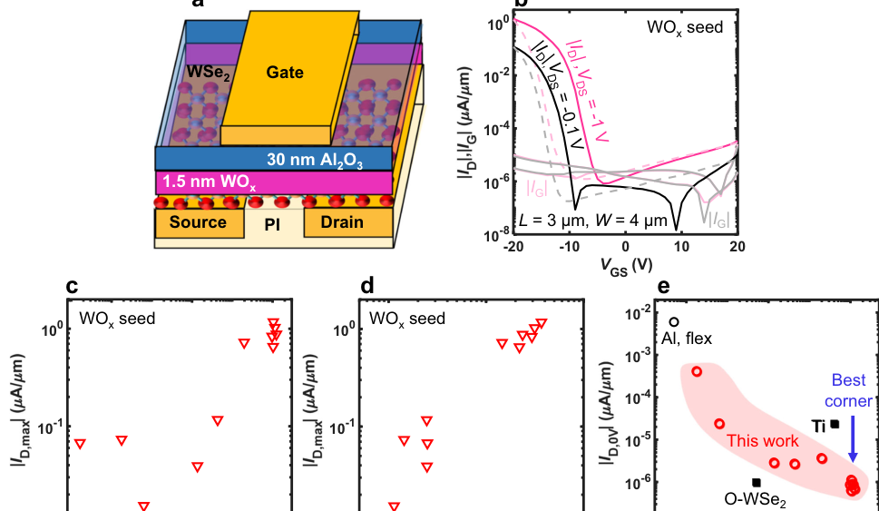
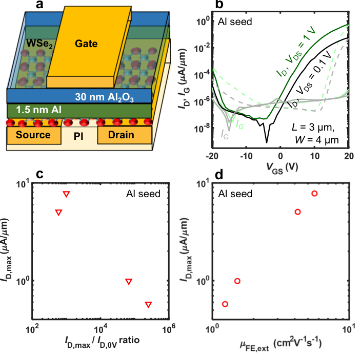
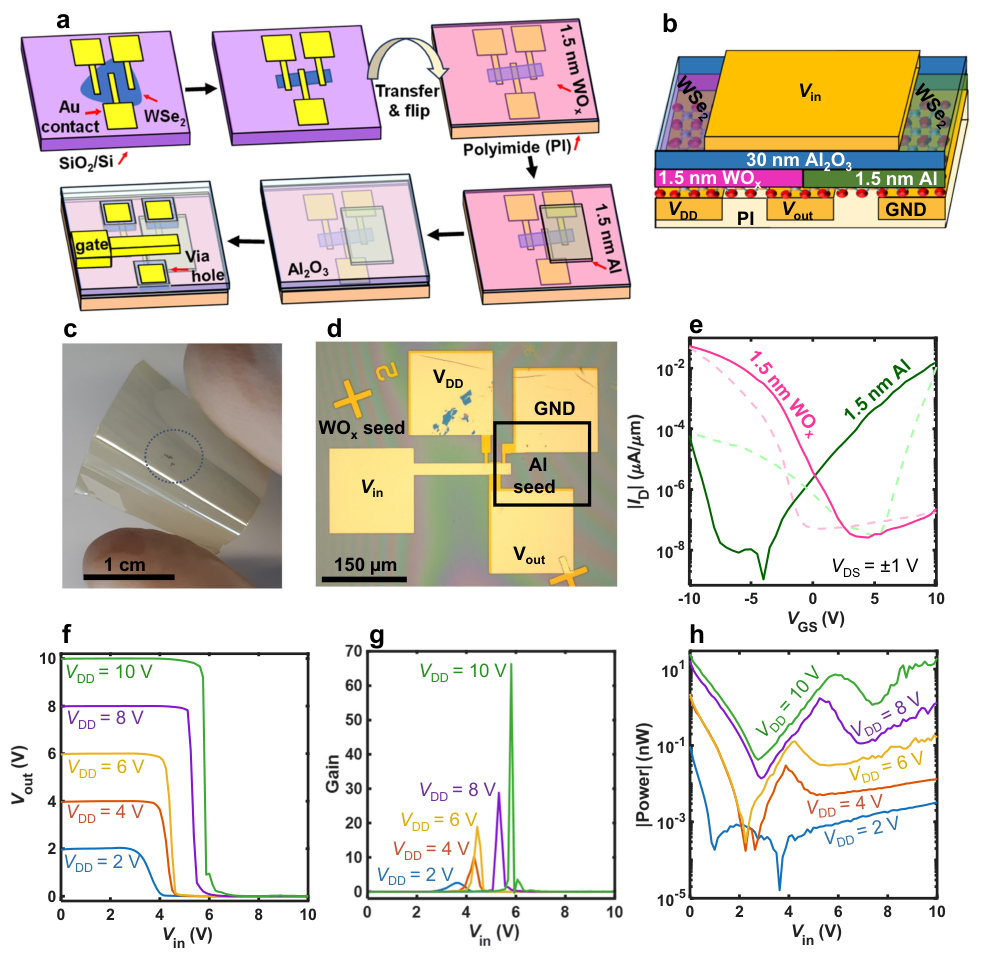
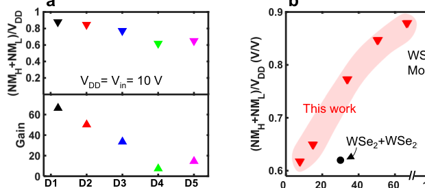

# Seed-assisted polarity control of flexible WSe2 transistors and demonstration of CMOS inverter

- 期刊：npj Flexible Electronics
- 日期：2026-07-20
- DOI：10.1038/s41528-026-00621-w
- 解析状态：fulltext_draft

## 摘要与研究价值

**Original:** Abstract Polarity engineering of transition metal dichalcogenide field-effect transistors (FETs) has become a key requirement for complementary logic. Here, we report the polarity control of flexible tungsten diselenide (WSe 2 ) FETs with atomic layer deposited (ALD) top-gate dielectrics. We identify evaporated WO x as suitable seeds for ALD top-gates enabling p-channel WSe 2 FETs, while evaporated Al seeds lead to n-channel FETs. Our flexible p-channel FETs achieve good drain current on/off ratio up to 10 6 , enhancement-mode operation with a negative threshold voltage, and low off-current down to ~6 × 10 − 7 µA/µm, which are important for low-power operation. Combining both seed layers in one fabrication process, we demonstrate flexible WSe 2 complementary metal-oxide-semiconductor (CMOS) inverters. Our inverters show good switching behavior with voltage gain up to 65 and total noise margin up to ~88%. Overall, this study provides a strategy on polarity engineering of flexible WSe 2 FETs and highlights the potential of flexible complementary WSe 2 electronics.

**中文:** 与柔性触觉相关，但尚未显示对前端触觉计算的直接贡献。摘要可核实数值包括：88%。

## 创新点

- Abstract Polarity engineering of transition metal dichalcogenide field-effect transistors (FETs) has become a key requirement for complementary logic.
- 与柔性触觉相关，但尚未显示对前端触觉计算的直接贡献

## 对当前课题的启发

- 提供机器人、可穿戴或电子皮肤系统任务证据

## 制备与实验步骤

### 1. 制备与实验操作

**Source:** p.6

**Original:** Material Few-layer WSe2 (1.8 nm to 6.2 nm) were prepared by mechanical exfoliation from a bulk crystal on Si/SiO2 substrates (bulk flux-grown WSe2 was purchased from 2D materials).

**中文:** 制备与实验操作步骤，关键配比、时间、温度和设备参数以 p.6 原文为准。

### 2. 组装与封装

**Source:** p.6

**Original:** Bulk WSe2 was first cleaved using scotch tape (3M Magic)andrepeatedlyfoldedandpeeledtothinthematerial.Thethinlayers were then transferred on the Si/SiO2 substrate by pressing the tape onto the substrate surface and slowly removing it.

**中文:** 组装与封装步骤，关键配比、时间、温度和设备参数以 p.6 原文为准。

### 3. 组装与封装

**Source:** p.6

**Original:** After transfer, the few-layer WSe2 was inspected using an optical microscope.

**中文:** 组装与封装步骤，关键配比、时间、温度和设备参数以 p.6 原文为准。

### 4. 制备与实验操作

**Source:** p.6

**Original:** Most devices in this manuscript have been fabricated with exfoliated WSe2, but we have also verified that similar results can be achieved with few-layer CVD WSe2 (see Suppl.

**中文:** 制备与实验操作步骤，关键配比、时间、温度和设备参数以 p.6 原文为准。

### 5. 制备与实验操作

**Source:** p.7

**Original:** Flexible top-gated FET fabrication Flexibletop-gatedFETswerefabricatedinasimilarprocessasdemonstrated in our previous works (Figure S2a)32,38.

**中文:** 制备与实验操作步骤，关键配比、时间、温度和设备参数以 p.7 原文为准。

### 6. 成膜与沉积

**Source:** p.7

**Original:** Initially, 50 nm Au source/drain contacts were electron-beam evaporated and patterned by lifted-off.

**中文:** 成膜与沉积步骤，关键配比、时间、温度和设备参数以 p.7 原文为准。

### 7. 图形化与结构成形

**Source:** p.7

**Original:** The channel was patterned using a photoresist (PR) mask and etched using O2/ CF4 plasma at gas flows of 10 sccm/30 sccm, 50 W power and ~7 mTorr pressure (PlasmaTherm RIE).

**中文:** 图形化与结构成形步骤，关键配比、时间、温度和设备参数以 p.7 原文为准。

### 8. 成膜与沉积

**Source:** p.7

**Original:** Next, a 5 µm thick polyimide (U-Vanish S, UBE Europe GmbH) layer was spin-coated on top, baked at 120 °C for 2 min and cured in N2 at 250 °C for 30 min.

**中文:** 成膜与沉积步骤，关键配比、时间、温度和设备参数以 p.7 原文为准。

### 9. 组装与封装

**Source:** p.7

**Original:** The PI/Au/ WSe2 stack was transferred in deionized water.

**中文:** 组装与封装步骤，关键配比、时间、温度和设备参数以 p.7 原文为准。

### 10. 成膜与沉积

**Source:** p.7

**Original:** Subsequently, a 1.5 nmthick seed layer (WOx or Al) was electron-beam evaporated at a rateof 0.1–0.2 Å/ s, followed by the deposition of 30 nm Al2O3 using thermal ALD at 200 °C (trimethylaluminum (TMA) precursor).

**中文:** 成膜与沉积步骤，关键配比、时间、温度和设备参数以 p.7 原文为准。

### 11. 成膜与沉积

**Source:** p.7

**Original:** Finally, a 50 nm Au top-gate was deposited by electron-beam evaporation and lifted-off, and the contacts were opened by wet etching of Al2O3 in standard Al etchant at 40 °C (TechniEtch Al80).

**中文:** 成膜与沉积步骤，关键配比、时间、温度和设备参数以 p.7 原文为准。

### 12. 制备与实验操作

**Source:** p.7

**Original:** During fabrication steps (e.g., lithography), the PI film wastemporarilyattachedtoarigidSisubstrateusingPRtoprovidesufficient mechanical stability for processing76.

**中文:** 制备与实验操作步骤，关键配比、时间、温度和设备参数以 p.7 原文为准。

## 方法原文锚点

**Source:** p.6 M001

**Original:** Material Few-layer WSe2 (1.8 nm to 6.2 nm) were prepared by mechanical exfoliation from a bulk crystal on Si/SiO2 substrates (bulk flux-grown WSe2 was purchased from 2D materials). First, the substrates were cleaned in ozone plasma for 15 minutes (power density of 50 mW/cm2 and flow rate of 500 sccm O2) to remove residues and create a hydrophilic surface for better adhesion with WSe2. Bulk WSe2 was first cleaved using scotch tape (3M Magic)andrepeatedlyfoldedandpeeledtothinthematerial.Thethinlayers were then transferred on the Si/SiO2 substrate by pressing the tape onto the substrate surface and slowly removing it. After transfer, the few-layer WSe2 was inspected using an optical microscope. The actual thickness of WSe2 was measured using atomic force microscopy (AFM). Most devices in this manuscript have been fabricated with exfoliated WSe2, but we have also verified that similar results can be achieved with few-layer CVD WSe2 (see Suppl. Fig. 1 and Suppl. Fig. 14). For the CVD material, WSe2 was synthesized using Se powder as the chalcogen source and a mixture of NaCl and WO2.9 as both the growth promoter and tungsten precursor, respectively. The precursor mixture was positioned at the center of the furnace, while the Se powder was placed upstream to facilitate vapor transport. A SiO2/Si substrate was placed face

**中文:** 该段已进入结构化方法步骤；完整逐段翻译待智能体精读补齐。

**Source:** p.7 M002

**Original:** https://doi.org/10.1038/s41528-026-00621-w Article

**中文:** 该段已进入结构化方法步骤；完整逐段翻译待智能体精读补齐。

**Source:** p.7 M003

**Original:** npj Flexible Electronics | (2026) 10:88 7

**中文:** 该段已进入结构化方法步骤；完整逐段翻译待智能体精读补齐。

**Source:** p.7 M004

**Original:** down directly above the tungsten precursor. The growth was conducted at 825 °C for 15 min under a controlled flow of Ar/H2 (50/10 sccm), followed by natural cooling to room temperature74,75.

**中文:** 该段已进入结构化方法步骤；完整逐段翻译待智能体精读补齐。

**Source:** p.7 M005

**Original:** Flexible top-gated FET fabrication Flexibletop-gatedFETswerefabricatedinasimilarprocessasdemonstrated in our previous works (Figure S2a)32,38. Initially, 50 nm Au source/drain contacts were electron-beam evaporated and patterned by lifted-off. The channel was patterned using a photoresist (PR) mask and etched using O2/ CF4 plasma at gas flows of 10 sccm/30 sccm, 50 W power and ~7 mTorr pressure (PlasmaTherm RIE). The PR was removed in solvent stripper (Technistrip NI555, acetone and iso-propanol). Next, a 5 µm thick polyimide (U-Vanish S, UBE Europe GmbH) layer was spin-coated on top, baked at 120 °C for 2 min and cured in N2 at 250 °C for 30 min. The PI/Au/ WSe2 stack was transferred in deionized water. Subsequently, a 1.5 nmthick seed layer (WOx or Al) was electron-beam evaporated at a rateof 0.1–0.2 Å/ s, followed by the deposition of 30 nm Al2O3 using thermal ALD at 200 °C (trimethylaluminum (TMA) precursor). Finally, a 50 nm Au top-gate was deposited by electron-beam evaporation and lifted-off, and the contacts were opened by wet etching of Al2O3 in standard Al etchant at 40 °C (TechniEtch Al80). During fabrication steps (e.g., lithography), the PI film wastemporarilyattachedtoarigidSisubstrateusingPRtoprovidesufficient mechanical stability for processing76. For lift-off processes, the PI chip was immersed in lift-off solvent for several hours until the unwanted metal was completely detached.

**中文:** 该段已进入结构化方法步骤；完整逐段翻译待智能体精读补齐。

**Source:** p.7 M006

**Original:** Characterizations Electrical measurements of FETs and inverters were performed in ambient conditions using Keysight B1500A Semiconductor Device Parameter Analyzer. The thicknesses of WSe2 were measured using AC mode imaging (JPK NanoWizard4 AFM system). Raman measurements were performed using an excitation laser of 532 nm, laser power 1 mW (WITec Alpha300R Raman microscope). Extrinsic field-effect mobility µFE,ext was extracted at VDS = ± 0.1 V following the equation of maximum transconductance gm = µFE,extCoxVDSW/L.

**中文:** 该段已进入结构化方法步骤；完整逐段翻译待智能体精读补齐。

## 图表解读

### Fig. 1

**Source:** p.2

**Original caption:** Fig. 1 | Flexible p-channel WSe2 FETs with WOx seed. a Schematic FET crosssection on polyimide (PI) substrate. b Transfer characteristics of a p-channel WSe2 FET. The solid lines present the off-to-on VGS sweeps and the dashed lines present the on-to-off VGS sweeps. c, d |ID,max| extracted at VGS = −20 V, ID on/off ratio and µFE,ext. The µFE,ext were extracted at VDS = −0.1 V. e Benchmarking of off-current |

**中文图注:** Fig. 1 原始图注已提取；逐项含义见下方分图说明。

**Reading note:** 重点查看器件结构、材料层次、信号路径和制备流程。

- (a) 重点查看器件结构、材料层次、信号路径和制备流程。 原文：Schematic FET crosssection on polyimide (PI) substrate
- (b) 结合正文首次引用位置和原始图注核对该图的证据角色。 原文：Transfer characteristics of a p-channel WSe2 FET. The solid lines present the off-to-on VGS sweeps and the dashed lines present the on-to-off VGS sweeps
- (c,d) 结合正文首次引用位置和原始图注核对该图的证据角色。 原文：|ID,max| extracted at VGS = −20 V, ID on/off ratio and µFE,ext. The µFE,ext were extracted at VDS = −0.1 V
- (e) 结合正文首次引用位置和原始图注核对该图的证据角色。 原文：Benchmarking of off-current |

### Fig. 2

**Source:** p.3

**Original caption:** Fig. 2 | Flexible n-channel WSe2 FETs with Al seed. a Schematic FET cross-section on polyimide (PI) substrate. b Transfer characteristics of an n-channel WSe2 FET. The solid lines present the off-to-on VGS sweeps and the dashed lines present the on-to-off VGS sweeps. c, d Extraction of ID, max at VGS = 20 V, ID on/off ratio and µFE,ext.

**中文图注:** Fig. 2 原始图注已提取；逐项含义见下方分图说明。

**Reading note:** 重点查看器件结构、材料层次、信号路径和制备流程。

- (a) 重点查看器件结构、材料层次、信号路径和制备流程。 原文：Schematic FET cross-section on polyimide (PI) substrate
- (b) 结合正文首次引用位置和原始图注核对该图的证据角色。 原文：Transfer characteristics of an n-channel WSe2 FET. The solid lines present the off-to-on VGS sweeps and the dashed lines present the on-to-off VGS sweeps
- (c,d) 结合正文首次引用位置和原始图注核对该图的证据角色。 原文：Extraction of ID, max at VGS = 20 V, ID on/off ratio and µFE,ext

### Fig. 3

**Source:** p.5

**Original caption:** Fig. 3 | Flexible CMOS inverter based on WSe2. a Integration process of flexible WSe2 inverter. b Architecture of flexible WSe2 inverter. c Picture of flexible chip after the fabrication (circle marks the area with devices). d Optical image of flexible inverter. e Transfer characteristics of the two FETs in the inverter. The solid lines present the off-to-on VGS sweeps and the dashed lines present the on-to-off VGS

**中文图注:** Fig. 3 原始图注已提取；逐项含义见下方分图说明。

**Reading note:** 重点查看器件结构、材料层次、信号路径和制备流程。

- (a) 结合正文首次引用位置和原始图注核对该图的证据角色。 原文：Integration process of flexible WSe2 inverter
- (b) 重点查看器件结构、材料层次、信号路径和制备流程。 原文：Architecture of flexible WSe2 inverter
- (c) 重点查看器件结构、材料层次、信号路径和制备流程。 原文：Picture of flexible chip after the fabrication (circle marks the area with devices)
- (d) 重点查看阵列规模、空间分辨率、串扰、读出通道和空间特征表达。 原文：Optical image of flexible inverter
- (e) 结合正文首次引用位置和原始图注核对该图的证据角色。 原文：Transfer characteristics of the two FETs in the inverter. The solid lines present the off-to-on VGS sweeps and the dashed lines present the on-to-off VGS

### Figure 3H

**Source:** p.5

**Original caption:** Figure 3h displays the static power consumption as function of Vin, following the equation P = VDD × IDD, where IDD is the current through the inverter. The peak of power consumption of the inverter is ~25 nW at VDD = 10 V. However, the power peak reaches 95 pW when VDD = 2 V demonstrating the promise of our approach for WSe2 CMOS technology toward low-power flexible electronics. The static current IDD vs. Vin of this deviceisshowninSuppl.Fig.11b.AthighVDD,IDDshowsanotableincrease at low- and high-Vin levels, which can be attributed to non-ideal off-current, residual ambipolar conduction, FETs mismatch and hysteresis in both nand p-channel FETs. This can be improved by several approaches such as optimizing the symmetry of the transistors18, the overlap between the gate and contacts68, and reduction of EOT69. We note that this work mainly focuses on static inverter operation based on flexible WSe2 FETs. As a first-

**中文图注:** Figure 3H 原始图注已提取；逐项含义见下方分图说明。

**Reading note:** 结合正文首次引用位置和原始图注核对该图的证据角色。

- (v) 结合正文首次引用位置和原始图注核对该图的证据角色。 原文：However, the power peak reaches 95 pW when VDD = 2 V demonstrating the promise of our approach for WSe2 CMOS technology toward low-power flexible electronics. The static current IDD vs. Vin of this deviceisshowninSuppl.Fig.11b.AthighVDD,IDDshowsanotableincrease at low- and high-Vin levels, which can be attributed to non-ideal off-current, residual ambipolar conduction, FETs mismatch and hysteresis in both nand p-channel FETs. This can be improved by several approaches such as optimizing the symmetry of the transistors18, the overlap between the gate and contacts68, and reduction of EOT69. We note that this work mainly focuses on static inverter operation based on flexible WSe2 FETs. As a first-

### Fig. 4

**Source:** p.6

**Original caption:** Fig. 4 | Statistics of flexible WSe2 inverters and benchmarking. a Total noise margin and gain extraction of five inverters. b Benchmarking of flexible inverters based on TMDs (the inverter in the other work with WSe2/WSe2 channels used an ion gel based-dielectric). Our data were extracted from forward sweeps.

**中文图注:** Fig. 4 原始图注已提取；逐项含义见下方分图说明。

**Reading note:** 结合正文首次引用位置和原始图注核对该图的证据角色。

- (a) 结合正文首次引用位置和原始图注核对该图的证据角色。 原文：Total noise margin and gain extraction of five inverters
- (b) 结合正文首次引用位置和原始图注核对该图的证据角色。 原文：Benchmarking of flexible inverters based on TMDs (the inverter in the other work with WSe2/WSe2 channels used an ion gel based-dielectric). Our data were extracted from forward sweeps
