# Convergence of Soft Electronics and Artificial Intelligence: From Materials to Intelligent Systems

- 期刊：Nano-Micro Letters
- 日期：2026-06-30
- DOI：10.1007/s40820-026-02265-x
- 解析状态：fulltext_draft

## 摘要与研究价值

**Original:** Abstract Soft electronics are an emerging class of mechanically compliant platforms that enable conformal, skin-interfaced sensing and actuation on curvilinear and dynamic surfaces. These systems combine deformation-tolerant electrical functionality with soft contact mechanics, but their in-use performance is strongly influenced by time-varying interfaces, motion-induced artifacts, and the system burden associated with dense multimodal integration. Advances in soft electronics are now converging with artificial intelligence, which supports reliable information extraction from high-dimensional signals and enables on-device inference that tolerates variability across users and day-to-day conditions. Here, progress in this convergence from materials to intelligent systems is summarized. Material and interface foundations are introduced first, focusing on deformation-tolerant conductors, low-impedance biointerfaces, and breathable substrate strategies that support extended wear. Manufacturing and integration approaches are then discussed, highlighting scalable fabrication, multilayer interconnects, and energy-autonomous wireless operation that enable higher channel counts and multifunctional architectures. Learning-based pipelines are subsequently reviewed with emphasis on artifact suppression, nonideality compensation, multimodal inference, and efficient edge deployment. Finally, emerging directions including neuromorphic computing and in-sensor computing are discussed, together with current challenges and future opportunities toward deployable intelligent soft systems that operate continuously and reliably in everyday settings.

**中文:** 涉及 in-sensor/物理计算或可编程触觉前端。当前未从摘要提取到可比较数值。

## 创新点

- Abstract Soft electronics are an emerging class of mechanically compliant platforms that enable conformal, skin-interfaced sensing and actuation on curvilinear and dynamic surfaces.
- 涉及 in-sensor/物理计算或可编程触觉前端

## 对当前课题的启发

- 涉及 in-sensor/物理计算或可编程触觉前端
- 可对照 raw pixel、software feature 与 physical projection 的性能/通道/功耗
- 把文中的传感/计算耦合机制映射为可编程物理投影核，增加原始像素、软件投影和硬件投影三组严格消融。

## 制备与实验步骤

### 1. 制备与实验操作

**Source:** p.1

**Original:** Manufacturing and integration approaches are then discussed, highlighting scalable fabrication, multilayer interconnects, and energy-autonomous wireless operation that enable higher channel counts and multifunctional architectures.

**中文:** 制备与实验操作步骤，关键配比、时间、温度和设备参数以 p.1 原文为准。

### 2. 制备与实验操作

**Source:** p.3

**Original:** This section therefore defines the material and interfacial basis on which the later discussions of fabrication, system integration, and intelligence are built.

**中文:** 制备与实验操作步骤，关键配比、时间、温度和设备参数以 p.3 原文为准。

### 3. 图形化与结构成形

**Source:** p.4

**Original:** In practice, device performance is often governed by network morphology and junction behavior rather than the intrinsic conductivity of individual nanotubes, so architectural control of alignment and bundle patterning has been used to tune strain response under deformation [44].

**中文:** 图形化与结构成形步骤，关键配比、时间、温度和设备参数以 p.4 原文为准。

### 4. 图形化与结构成形

**Source:** p.4

**Original:** Laser-induced graphene (LIG) provides a practical route to patterned graphene-like conductors on polymeric precursors, and wearable demonstrations have leveraged crack-engineered designs [47].

**中文:** 图形化与结构成形步骤，关键配比、时间、温度和设备参数以 p.4 原文为准。

### 5. 图形化与结构成形

**Source:** p.4

**Original:** reported robust freestanding LIG electrodes formed by double-sided laser irradiation of a PEDOT:PSS–Kevlar composite film, which reduced ablation and promoted more uniform through-thickness porosity, retained low resistance after 1000 bending cycles, and showed minimal change before and after adhesive-free transfer, enabling reattachment and circuit rearrangement on diverse substrates for wearable energy devices [48] (Fig. 2a).

**中文:** 图形化与结构成形步骤，关键配比、时间、温度和设备参数以 p.4 原文为准。

### 6. 材料混合与分散

**Source:** p.4

**Original:** In parallel, conducting polymers such as PEDOT:PSS and emerging two-dimensional materials such as MXenes support bioelectronic interfaces through mixed ionic-electronic transport, hydrophilic surfaces, and high effective surface area [1, 2, 4, 39].

**中文:** 材料混合与分散步骤，关键配比、时间、温度和设备参数以 p.4 原文为准。

### 7. 图形化与结构成形

**Source:** p.5

**Original:** a Process schematic illustration for laser-induced graphene, transfer application, and bending-cycle durability test.

**中文:** 图形化与结构成形步骤，关键配比、时间、温度和设备参数以 p.5 原文为准。

### 8. 图形化与结构成形

**Source:** p.5

**Original:** b Laser-patterned Ag nanowire percolation electrodes in kirigami layouts for stretchability, including a kirigami EP sensor for capturing electrophysiology signals.

**中文:** 图形化与结构成形步骤，关键配比、时间、温度和设备参数以 p.5 原文为准。

### 9. 制备与实验操作

**Source:** p.5

**Original:** c PDMS microfluidic diaphragm pressure sensor using Galinstan channels for wearable monitoring, including a photograph of the fabricated device.

**中文:** 制备与实验操作步骤，关键配比、时间、温度和设备参数以 p.5 原文为准。

### 10. 组装与封装

**Source:** p.5

**Original:** e Elastomer-encapsulated MXene-based yarn electrodes for fiber and textile devices.

**中文:** 组装与封装步骤，关键配比、时间、温度和设备参数以 p.5 原文为准。

### 11. 图形化与结构成形

**Source:** p.5

**Original:** High-resolution LM patterning on hydrogel interfaces further supports skin-conformal layouts and self-recovering electrical pathways under damage [51].

**中文:** 图形化与结构成形步骤，关键配比、时间、温度和设备参数以 p.5 原文为准。

### 12. 图形化与结构成形

**Source:** p.6

**Original:** introduced a kirigami-patterned nanowire percolation electrode with application-tunable elasticity, achieving ultrahigh stretchability beyond 400% tensile strain while largely preserving electrical characteristics, and maintaining strain reversibility over 10,000 stretch–release cycles with optical transparency above 80% [2] (Fig. 2b).

**中文:** 图形化与结构成形步骤，关键配比、时间、温度和设备参数以 p.6 原文为准。

### 13. 图形化与结构成形

**Source:** p.6

**Original:** In wearable implementations, performance and reliability are closely tied to oxide-mediated interfacial behavior, robust encapsulation against leakage, and stable electrical contact under repeated bending and stretching.

**中文:** 图形化与结构成形步骤，关键配比、时间、温度和设备参数以 p.6 原文为准。

### 14. 材料混合与分散

**Source:** p.6

**Original:** They further implemented an Conducting polymers, represented by poly(3,4-ethylenedi oxythiophene):poly(styrenesulfonate) (PEDOT:PSS), are central to wearable bioelectronic interfaces because mixed ionic–electronic transport can reduce interfacial impedance and stabilize on-skin recordings under motion.

**中文:** 材料混合与分散步骤，关键配比、时间、温度和设备参数以 p.6 原文为准。

### 15. 固化与热处理

**Source:** p.6

**Original:** For longterm wear, self-adhesive and sweat-tolerant PEDOT:PSS dry electrodes have been developed to support conformal ECG/ EMG acquisition without auxiliary fixation, emphasizing stable adhesion and environmental robustness as practical determinants of signal quality [6, 7].

**中文:** 固化与热处理步骤，关键配比、时间、温度和设备参数以 p.6 原文为准。

### 16. 成膜与沉积

**Source:** p.6

**Original:** In parallel, binder-free vapor-phase deposition on everyday fabrics expands process compatibility for breathable, textile-integrated PEDOT:PSS sensors [53].

**中文:** 成膜与沉积步骤，关键配比、时间、温度和设备参数以 p.6 原文为准。

## 方法原文锚点

**Source:** p.1 M001

**Original:** ABSTRACT Soft electronics are an emerging class of mechanically compliant platforms that enable conformal, skin-interfaced sensing and actuation on curvilinear and dynamic surfaces. These systems combine deformation-tolerant electrical functionality with soft contact mechanics, but their in-use performance is strongly influenced by time-varying interfaces, motion-induced artifacts, and the system burden associated with dense multimodal integration. Advances in soft electronics are now converging with artificial intelligence, which supports reliable information extraction from high-dimensional signals and enables on-device inference that tolerates variability across users and day-to-day conditions. Here, progress in this convergence from materials to intelligent systems is summarized. Material and interface foundations are introduced first, focusing on deformation-tolerant conductors, low-impedance biointerfaces, and breathable substrate strategies that support extended wear. Manufacturing and integration approaches are then discussed, highlighting scalable fabrication, multilayer interconnects, and energy-autonomous wireless operation that enable higher channel counts and multifunctional architectures. Learning-based pipelines are subsequently reviewed with emphasis on artifact suppression, nonideality compensation, multimodal inference, and efficient edge deployment. Finally, emerging directions including neuromorphic computing and in-sensor computing are discussed, together with current challenges and future opportunities toward deployable intelligent soft systems that operate continuously and reliably in everyday settings.

**中文:** 该段已进入结构化方法步骤；完整逐段翻译待智能体精读补齐。

**Source:** p.3 M002

**Original:** requirements: preserving reliable electrical performance under deformation, adapting to environmental changes, and sustaining breathable, skin-compatible contact over extended wear [4, 12, 37]. We address these challenges through three broad material directions: electrically active conductors and semiconductors, stimuli-responsive functional materials, and breathable substrates for skin interfacing. Because intelligent wearables must also convert dynamic mechanical inputs into meaningful electrical signals, this chapter additionally considers electromechanical transduction materials, particularly piezoelectric and triboelectric platforms, as part of the broader material foundation for dynamic and self-powered operation [11, 38]. This section therefore defines the material and interfacial basis on which the later discussions of fabrication, system integration, and intelligence are built.

**中文:** 该段已进入结构化方法步骤；完整逐段翻译待智能体精读补齐。

**Source:** p.4 M003

**Original:** including fabrics and smart textiles, paper-based platforms, and porous foams, enabling conformal sensing under repeated deformation and daily-use conditions [40–43]. In practice, device performance is often governed by network morphology and junction behavior rather than the intrinsic conductivity of individual nanotubes, so architectural control of alignment and bundle patterning has been used to tune strain response under deformation [44]. Zhu et al. reported electronic skins that employ aligned few-walled CNT arrays embedded in polymer composites, where deformation modulated anisotropic conduction pathways and intertube contact resistance and the devices maintained stable responses after 15,000 bend–release cycles at power levels below 10 µW [1]. Graphene offers complementary advantages through high carrier mobility and accessible surface area, and wearable implementations frequently employ porous frameworks or controlled microcrack networks to amplify resistance modulation for motion and physiological-signal detection [45, 46]. Laser-induced graphene (LIG) provides a practical route to patterned graphene-like conductors on polymeric precursors, and wearable demonstrations have leveraged crack-engineered designs [47]. Choi et al. reported robust freestanding LIG electrodes formed by double-sided laser irradiation of a PEDOT:PSS–Kevlar composite film, which reduced ablation and promoted more uniform through-thickness porosity, retained low resistance after 1000 bending cycles, and showed minimal change before and after adhesive-free transfer, enabling reattachment and circuit rearrangement on diverse substrates for wearable energy devices [48] (Fig. 2a). Overall, carbon-based nanostructures are best interpreted through a structure–property–integration perspective, where network topology, junction stability, and transferability collectively determine on-body signal reliability and multifunctional device integration.

**中文:** 该段已进入结构化方法步骤；完整逐段翻译待智能体精读补齐。

**Source:** p.4 M004

**Original:** Stable biosignal acquisition during daily activity remains challenging because mechanical deformation and time-varying skin contact continuously disrupt the electrical interface. Accordingly, material selection for wearable electronics is guided not only by how reliably electrical pathways are preserved under deformation, but also by how effectively mechanical inputs can be converted into usable electrical signals under practical wearing conditions [38]. In this context, conductive and semiconducting materials provide the basic electrical framework for signal transport, amplification, and interfacial stability, whereas electromechanical transduction materials directly translate deformation, pressure, or motion into measurable electrical output [10, 11]. Carbon-based nanostructures such as carbon nanotubes and graphene form percolation networks that provide mechanically resilient conduction, while metallic nanomaterials such as silver nanowires and deformable liquid metals deliver low resistivity for interconnects and high-current operation. In parallel, conducting polymers such as PEDOT:PSS and emerging two-dimensional materials such as MXenes support bioelectronic interfaces through mixed ionic-electronic transport, hydrophilic surfaces, and high effective surface area [1, 2, 4, 39]. Beyond these conductive pathways, piezoelectric and triboelectric materials broaden the material basis of soft electronics by enabling dynamic sensing and, in some cases, self-powered operation [11, 38]. From this standpoint, the following discussion considers four complementary material directions: carbon-based nanostructures, metallic conductors and liquid metals, conducting polymers and MXene-based materials, and electromechanical transduction materials for dynamic and self-powered sensing.

**中文:** 该段已进入结构化方法步骤；完整逐段翻译待智能体精读补齐。

**Source:** p.5 M005

**Original:** Fig. 2 Conductive and semiconducting materials for soft and stretchable electronics. a Process schematic illustration for laser-induced graphene, transfer application, and bending-cycle durability test. Reproduced with permission [48]. Copyright 2025, Elsevier. b Laser-patterned Ag nanowire percolation electrodes in kirigami layouts for stretchability, including a kirigami EP sensor for capturing electrophysiology signals. Reproduced with permission [2]. Copyright 2019, American Chemical Society. c PDMS microfluidic diaphragm pressure sensor using Galinstan channels for wearable monitoring, including a photograph of the fabricated device. Reproduced with permission [49]. Copyright 2017, Wiley– VCH. d Morphology schematics comparing a conventional PEDOT:PSS film and a STEC-enhanced stretchable PEDOT film, with additiveengineered stretchable PEDOT:PSS conductors. Reproduced with permission [4]. Copyright 2017, American Association for the Advancement of Science (AAAS). e Elastomer-encapsulated MXene-based yarn electrodes for fiber and textile devices. Reproduced with permission [39]. Copyright 2024, Elsevier

**中文:** 该段已进入结构化方法步骤；完整逐段翻译待智能体精读补齐。

**Source:** p.6 M006

**Original:** embedded equivalent Wheatstone-bridge configuration that increased the voltage sensitivity to 0.0835 kPa−1 and enabled temperature self-compensation over 20–50 °C [49] (Fig. 2c). Wearable demonstrations included a PDMS wristband for real-time pulse monitoring and a multi-sensor PDMS glove for distributed tactile feedback. High-resolution LM patterning on hydrogel interfaces further supports skin-conformal layouts and self-recovering electrical pathways under damage [51].

**中文:** 该段已进入结构化方法步骤；完整逐段翻译待智能体精读补齐。

**Source:** p.6 M007

**Original:** deformation, making them suitable for precise biosignal sensing and sensor arrays. Recent advancements have demonstrated that integrating AgNW percolation networks into Kirigami-inspired architectures facilitates extreme mechanical stretchability while maintaining high transparency. This structural approach allows the conductive network to withstand large-scale strains by redistributing mechanical stress through engineered cuts, preventing the abrupt failure of electrical connections. Won et al. introduced a kirigami-patterned nanowire percolation electrode with application-tunable elasticity, achieving ultrahigh stretchability beyond 400% tensile strain while largely preserving electrical characteristics, and maintaining strain reversibility over 10,000 stretch–release cycles with optical transparency above 80% [2] (Fig. 2b). They further demonstrated wearable-relevant implementations including an ultrastretchable transparent heater and a conformal electrophysiology sensor, and extended the platform toward human–machine interfacing by integrating the e-skin sensor with a quadrotor drone. Beyond kirigami architectures, aligned AgNW frameworks have also enabled ultrasensitive monitoring of subtle human motion, providing a complementary example of how nanowire orientation and network geometry can improve strain-sensing performance [50]. Liquid metals (LMs), such as gallium-based alloys, offer a unique combination of metallic conductivity and fluidic deformability, enabling intrinsically stretchable conductors and interconnects that can accommodate large strains without the fatigue typical of solid metals. Unlike solid conductors, LMs remain in a liquid state at room temperature, allowing them to flow and reconfigure within microfluidic channels or elastomeric matrices under deformation. In wearable implementations, performance and reliability are closely tied to oxide-mediated interfacial behavior, robust encapsulation against leakage, and stable electrical contact under repeated bending and stretching. These materials support high-performance sensing platforms, such as microfluidic diaphragm pressure sensors for health and tactile monitoring, which leverage the fluidic nature of LMs to detect subtle pressure changes through geometric deformation. Gao et al. demonstrated a microfluidic tactile diaphragm pressure sensor based on embedded Galinstan microchannels with a 70× 70 µm cross-section, achieving sub-50 Pa pressure resolution with detection limits below 100 Pa and a response time of 90 ms. They further implemented an

**中文:** 该段已进入结构化方法步骤；完整逐段翻译待智能体精读补齐。

**Source:** p.6 M008

**Original:** Conducting polymers, represented by poly(3,4-ethylenedi oxythiophene):poly(styrenesulfonate) (PEDOT:PSS), are central to wearable bioelectronic interfaces because mixed ionic–electronic transport can reduce interfacial impedance and stabilize on-skin recordings under motion. Beyond geometric strain engineering, recent progress has progressively targeted intrinsically stretchable molecular conductors that preserve high conductivity under large deformation. Wang et al. reported an intrinsically stretchable PEDOT:PSS platform in which ionic “enhancer” additives both promote morphology reorganization and increase doping efficiency. Under large deformation, the films still exceeded 100 S cm−1 at 600% strain, with fracture occurring near 800%. In cyclic loading, conductivity remained ~ 3600 S cm−1 after 1000 cycles to 100% strain. Under static strain conditions, the system delivered > 4100 S cm−1 at 100% strain and > 3100 S cm−1 at 0% strain [4] (Fig. 2d). Biointerface performance has also been improved through molecular and mesoscale structuring, including topological supramolecular network designs and vertical phase-separation strategies that promote robust charge transport and stable contact for electrophysiology sensing [5, 52]. For longterm wear, self-adhesive and sweat-tolerant PEDOT:PSS dry electrodes have been developed to support conformal ECG/ EMG acquisition without auxiliary fixation, emphasizing stable adhesion and environmental robustness as practical determinants of signal quality [6, 7]. In parallel, binder-free vapor-phase deposition on everyday fabrics expands process compatibility for breathable, textile-integrated PEDOT:PSS sensors [53]. MXenes, particularly Ti3C2Tx, provide a rapidly expanding materials platform for wearable sensing due to metallic conductivity and hydrophilic, functionalized surfaces

**中文:** 该段已进入结构化方法步骤；完整逐段翻译待智能体精读补齐。

**Source:** p.7 M009

**Original:** that integrate well with soft matrices and fibers [54–56]. Mechanical sensing has been advanced through composite and hierarchical architectures, including tile-like stacked microstructures for broad-range strain sensing, electrostatically assembled MXene/CNT hybrids for waterproof pressure sensing in e-skin formats [57, 58]. Yu et al. developed a stretchable multimodal textile sensor using a core–sheath coaxial yarn in which a Ti3C2Tx-coated elastic yarn serves as the core electrode and a carbon black/PDMS layer functions as the piezoresistive sheath; the multilevel structure supported pressure sensitivity up to 16.21 N−1 over a 5 N range and a gauge factor of 12.09 over 100% strain with good cyclic stability, while multi-electrode acquisition and stimulus-dependent signal polarity allowed a single yarn platform to differentiate pressure, strain, and bending [39] (Fig. 2e). Collectively, MXene-supported fibers, papers, and printed devices support multimodal, high-density sensing layers that can be embedded into wearable form factors while maintaining soft, body-compatible integration [54, 55, 59]. Collectively, carbon nanomaterials, metallic conductors including deformable liquid metals, and conducting polymers with emerging MXene-based 2D conductors each define distinct materials platforms for wearable sensing, with device-level performance governed not only by intrinsic electrical properties but also by the adopted form factor and integration strategy.

**中文:** 该段已进入结构化方法步骤；完整逐段翻译待智能体精读补齐。

**Source:** p.7 M010

**Original:** Conductive fillers and mixed ionic-electronic materials provide the basic electrical framework for wearable biointerfaces, but they do not fully explain how intelligent wearables read dynamic events on the body. Signals such as pulse waves, transient touch, and body motion originate from mechanical deformation, so materials that directly convert deformation into electrical output are also needed [38, 60]. In this respect, piezoelectric and triboelectric materials extend the material foundation of intelligent wearables by introducing transduction modes that are suited to dynamic sensing and, in some cases, power generation [61]. This role is well illustrated by piezoelectric systems for physiological monitoring. Li et al. developed a wristmounted platform that combined a piezoelectric sensor array with contact control, signal acquisition, and learning-based

**中文:** 该段已进入结构化方法步骤；完整逐段翻译待智能体精读补齐。

**Source:** p.8 M011

**Original:** Fig. 3 Piezoelectric and Triboelectric Materials and Systems Beyond Purely Conductive Pathways. a Wireless piezoelectric wristband for continuous blood-pressure monitoring, showing local pulse-wave sensing, airbag-assisted backpressure control, and mounted-device images under wrist and elbow deformation. Reproduced with permission [38]. Copyright 2023, Springer Nature. b Dopamine-coated electrospun nanofibers for multimodal physiological monitoring, showing fiber morphology, pulse waveforms from different users wearing the MFP textile on the neck, and dynamic output signals for spontaneous voice recognition. Reproduced with permission [60]. Copyright 2021, Wiley–VCH. c Working mechanism of the STENG and its self-charging operation, showing the energy-harvesting principle, a self-charging system powering an electronic watch, and the voltage profile of a 2.2 µF capacitor during charging and watch operation. Reproduced with permission [11]. Copyright 2017, American Association for the Advancement of Science (AAAS). d Structural design and operating principle of the 3DB-TENG, showing the braided architecture with an outer braced frame and inner axial core, the 3D four-step rectangular braiding strategy, and the vertical contactseparation working mechanism. Reproduced with permission [62]. Copyright 2020, Springer Nature

**中文:** 该段已进入结构化方法步骤；完整逐段翻译待智能体精读补齐。

**Source:** p.9 M012

**Original:** Piezoelectric platforms are effective for converting small biomechanical inputs into stable electrical signals, whereas triboelectric platforms are particularly useful when selfpowered sensing, tactile interaction, and textile-compatible energy harvesting are required at the same time. Considering both therefore extends the material discussion beyond maintaining conductivity under strain to selecting transduction routes for dynamic and multifunctional wearable operation [65, 66]. These distinctions suggest that material selection in intelligent wearable systems depends not only on conductivity, but also on how each material class balances deformability, interface stability, and transduction function for the intended application. Carbon nanomaterials are useful for mechanically resilient conductive networks, although their performance can depend strongly on network morphology and junction stability. AgNWs are attractive for transparent and highly conductive electrodes, whereas liquid metals are more suitable for large-strain interconnects and deformable current pathways, despite the need for encapsulation and leakage control. Conducting polymers such as PEDOT:PSS are effective at soft biointerfaces because their mixed ionicelectronic transport can reduce interfacial impedance, while MXenes are particularly attractive for multimodal and highsurface-area sensing because their hydrophilic and functionalized surfaces support printing, fiber integration, and chemical interfacing, despite concerns regarding oxidation and long-term stability. In contrast, piezoelectric and triboelectric materials extend the material framework beyond conductive pathways by directly converting mechanical inputs into electrical output. Piezoelectric materials are generally better suited for stable readout of subtle biomechanical signals, whereas triboelectric materials are more attractive for selfpowered sensing, tactile interaction, and textile-compatible energy harvesting. Table 1 further summarizes representative examples across these material classes by comparing their device forms, key performance metrics, and wearable applications.

**中文:** 该段已进入结构化方法步骤；完整逐段翻译待智能体精读补齐。

**Source:** p.9 M013

**Original:** their surrounding environment. In soft electronics, these environmental perturbations span a broad range of conditions, from changes in temperature and local chemical environment to repeated deformation and abrasion at material networks or skin interfaces [67–69]. This shift from passive sensing to “smart” functionality is essential for enhancing the long-term reliability and user interactivity of soft electronics, particularly under daily-use conditions where sweat, temperature fluctuations, repetitive deformation, and abrasion continuously perturb both material networks and skin interfaces. To achieve this, materials are increasingly designed to embed adaptation directly into the material platform rather than relying solely on electronic or algorithmic compensation [70]. In this context, environmental responsiveness in wearable materials should be understood not only as immediate stimulus-driven functional change, but also as a broader adaptive capacity that helps preserve usability, readability, and operational reliability under variable real-world conditions. From this perspective, representative strategies include reversible physical transformation, intuitive optical signaling, and, under harsher conditions, autonomous recovery [71–73]. Phase change materials allow adaptive mechanical and thermal management by reversibly tuning stiffness, shape, and heat transport, which is particularly valuable for conformal biointerfaces and thermally robust operation. Thermochromic and colorimetric materials add visualized sensing through stimulus-induced color changes, enabling immediate feedback and low-power, human-interpretable readout. When repeated use conditions progress from functional perturbation to actual structural damage such as cracks, delamination, or percolation-network disruption, autonomous self-healing materials supported by dynamic bonding chemistries become important as an extended strategy for restoring structural and functional integrity. Collectively, these environmentally responsive materials transform wearable platforms into resilient and interactive systems that can perform reliably under the complex and variable conditions of real-world use [74].

**中文:** 该段已进入结构化方法步骤；完整逐段翻译待智能体精读补齐。

**Source:** p.10 M014

**Original:** LM-on-hydrogel fine-line patterning Minimum linewidth 85 µm Hydrogel interconnect patterning Self-healing prototyping

**中文:** 该段已进入结构化方法步骤；完整逐段翻译待智能体精读补齐。

**Source:** p.11 M015

**Original:** PDMS-coated yarn 3D braided triboelectric textile

**中文:** 该段已进入结构化方法步骤；完整逐段翻译待智能体精读补齐。

**Source:** p.11 M016

**Original:** adaptive functional switching in wearable systems, where mechanical compliance is not always a fixed requirement. Phase change materials (PCMs) support reconfigurable wearable and implantable systems by providing reversible transitions in physical state and mechanical properties, thereby allowing devices to actively tune stiffness, shape, and stretchability in response to thermal stimuli. This adaptive switching is particularly valuable for intelligent wearables because mechanical compliance is not always a fixed requirement. Devices often benefit from being rigid during handling, alignment, or insertion, while remaining soft and conformal during long-term operation on the body. A representative advance in this direction is temperaturetriggered mechanically transformative electronics, where platform-level tuning of mechanical characteristics supports shape- and flexibility-reconfigurable systems without sacrificing functional reliability. In this context, Byun et al. outlined a framework spanning device architectures, materials and underlying physical principles, and scalable fabrication approaches to achieve programmable stiffness while retaining stretchability. Their gallium-based transformative platform exhibited a stiffness tuning ratio greater than 104, with effective elastic moduli ranging from 50 to 950 MPa in the rigid state and decreasing to about 30 kPa in the soft state after phase transition. In addition, their tunable pressure sensor showed an onset sensitivity change from 15.77

**中文:** 该段已进入结构化方法步骤；完整逐段翻译待智能体精读补齐。

**Source:** p.13 M017

**Original:** directly or captured using simple imaging tools such as a smartphone camera, enabling low-power and user-friendly sensing layers that complement electrical transduction. In temperature visualization, material and structural design determine whether color change remains fast, repeatable, and mechanically stable under bending and stretching. Micro/ nanoencapsulated phase-change-based thermochromic membranes offer flexible platforms for reversible color switching under thermal cycling, while porous nanofiber architectures further enhance sensitivity by increasing surface area and accelerating thermal exchange [75, 76]. At the device level, these optical layers can be integrated into textile formats to realize dynamic thermochromic smart textiles for temperaturevisualized healthcare and thermal management, where spatial color patterns directly report local thermal states [77]. As a representative example of wearable-ready colorimetric temperature sensing, Choe et al. developed a stretchable hydrogel patch embedding thermoresponsive plasmonic microgels based on AuNP-decorated PNIPAM. The patch exhibited rapid, strain-insensitive color switching with an extinction-peak shift of 176 nm within ~ 1 s and a temperature resolution of ~ 0.2 °C. By tuning the transition temperature, they further implemented array-type patches that enable clear visualization across 25–40 °C [72] (Fig. 4b). Moving beyond thermal readout alone, Wu et al. demonstrated a multimode hydrogel wearable patch that integrates a strain-responsive conductive hydrogel with a colorimetric hydrogel for sweat analysis. The conductive hydrogel exhibited a toughness of 1279.6 kJ m−3, conductivity of 3.06 S m−1, self-healing efficiency of 95% within 12 h, an ultralow strain detection limit of 0.25%, and fast response and recovery times of 113 and 69 ms, respectively. In parallel, the colorimetric module covered physiologically relevant sweat ranges of pH 4–6.8, Cl− 40–60 mM, Ca2+ 0–2 mM, and glucose 0.06–0.2 mM, thereby extending the system from visual signal indication to semi-quantitative physiological assessment. Together, these features enabled simultaneous monitoring of pulse, ECG, breathing, joint motion, and sweat biomarkers through a smartphone-assisted vision interface, while maintaining self-healing, tissue adhesion, transparency, flexibility, and antibacterial behavior [68] (Fig. 4c). Finally, fiber-level integration strategies provide a scalable route to textile-integrated, multifunctional systems. One representative approach incorporates thermochromic particles into coaxial composite fibers, allowing optical cues

**中文:** 该段已进入结构化方法步骤；完整逐段翻译待智能体精读补齐。

**Source:** p.14 M018

**Original:** and maintain a dry, comfortable interface during prolonged use [84]. In parallel, controlling nanofiber alignment supports anisotropic sensing platforms, where fiber orientation governs directional response and supports selective multidirectional strain detection with improved signal discriminability [85]. Beyond passive breathability, nanofiber scaffolds provide a versatile framework for integrating functional conductors and sensing layers without compromising permeability. A representative demonstration of nanofiber-supported system integration was reported by Hao et al. who developed a stretchable, breathable, and self-adhesive electronic skin using a scalable multilayer architecture that combines a fibrous thermoplastic polyurethane scaffold for tissue-like softness and permeability with MXene-based functional layers for both strain sensing and adhesive biopotential acquisition [12] (Fig. 5a). In this system, the fibrous scaffold exhibited a Young’s modulus of 3.36 MPa, while the MXene-CNT@TPU strain layer delivered ultrahigh sensitivity over a broad working range, with a maximum gauge factor of 63,494 at 485% strain. At the same time, the adhesive MXene-WPU electrode layer provided an adhesive strength of about 145 N m−1 even on dry, sweaty, and hairy skin, and showed lower skin–electrode interfacial impedance than commercial Ag/AgCl electrodes across 1–104 Hz, thereby enabling higher-fidelity ECG, EMG, and EEG acquisition under dynamic disturbances and supporting wireless long-duration monitoring in practical use conditions. Nanofiber architectures also support broader functionality relevant to intelligent wearables, including self-powered electronic skins based on all-nanofiber triboelectric nanogenerators with breathable and antibacterial characteristics, and breathable MXene-supported epidermic sensors that couple photothermal functionality with ultrasensitive human–machine interaction [37, 87]. Finally, iontronic pressure-sensing formats based on all-nanofiber ionic membranes and porous electrodes provide a complementary route to high-performance pressure transduction while preserving ultraviolet shielding and antibacterial features, highlighting how breathability and data fidelity can be co-optimized within fibrous platforms [88, 89].

**中文:** 该段已进入结构化方法步骤；完整逐段翻译待智能体精读补齐。

**Source:** p.15 M019

**Original:** Fig. 5 Conformal contact and breathable substrate designs for skin-interfaced electronics. a Top-view and cross-sectional SEM of SPRABEskin, a schematic of the 90° adhesion test, and photographs on dry, damp, and hairy human skin. Scale bar 100 µm. Reproduced with permission [12]. Copyright 2023, Wiley–VCH. b PAM/(MXene-SF) hydrogel preparation schematic, circuit operation under stretching and twisting, and wearable responses (ΔR/R0) to elbow rotation, frowning, and smiling. Reproduced with permission [8]. Copyright 2024, Elsevier. c Compression comparison of nonporous and porous EGaIn composites, antimicrobial formulation, and 3-day skin-wear photographs. Scale bar 5 mm. Reproduced with permission [86]. Copyright 2023, American Association for the Advancement of Science (AAAS)

**中文:** 该段已进入结构化方法步骤；完整逐段翻译待智能体精读补齐。

**Source:** p.15 M020

**Original:** effective medium for stable skin-interfaced bioelectronics [90, 91]. Compared with conventional dry electrodes, hydrogels can form low-impedance and conformal contact on curvilinear, textured skin, which is particularly important for maintaining stable biopotential acquisition

**中文:** 该段已进入结构化方法步骤；完整逐段翻译待智能体精读补齐。

**Source:** p.16 M021

**Original:** approximately 2.0 × 105 S m−1, which increased up to about 1.2 × 106 S m−1 at 55% EGaIn. At the same time, the porous architecture provided a water vapor transmission rate of about 4900 g m−2 day−1 and reduced the elastic modulus to about 1.5 MPa, compared with about 16.7 MPa for the nonporous counterpart, thereby improving both breathability and tissuelevel mechanical compliance. The material also showed only about 15% resistance change after 1000 cycles at 500% strain, exhibited no observable leakage before rupture at about 550% strain, and presented a magnetic susceptibility of − 3.23 ppm. Together with the antimicrobial functionality introduced by ε-polylysine, these characteristics enabled a mechanically stable, breathable, and MRI-compatible soft conductor that maintained high electrical performance under deformation, making it well suited for skin-interfaced bioelectronics for cardiac monitoring and mechanically imperceptible electrical stimulation [86] (Fig. 5c). Complementary material and architecture approaches include gradient porous elastomers combined with self-assembled silver nanowires to improve gas permeability and sensing fidelity, and breathable multilayer e-skin designs that reduce strain dependence of output to maintain consistent readout during daily use [13, 94]. Together, these porous elastomeric foundations expand breathable and mechanically compliant platforms toward robust, long-lasting wearable systems that can support high-quality physiological data streams for intelligent diagnostics. Taken together, these material strategies define the functional basis of intelligent wearable systems, but their practical impact depends on how reliably they can be translated into manufacturable, interconnected, and scalable device architectures. On this basis, the following section turns to fabrication and interconnection strategies that convert these material capabilities into integrated wearable systems.

**中文:** 该段已进入结构化方法步骤；完整逐段翻译待智能体精读补齐。

**Source:** p.16 M022

**Original:** The transformation of active soft materials into integrated intelligent wearable systems depends on manufacturing and interconnection strategies that preserve structural integrity while sustaining functional reliability [16, 95]. While material innovations define electrical performance and mechanical compliance, fabrication and packaging determine whether those properties remain reproducible when assembled into dense, deformable networks on skincompatible platforms [14]. By combining high-resolution

**中文:** 该段已进入结构化方法步骤；完整逐段翻译待智能体精读补齐。

**Source:** p.17 M023

**Original:** inkjet printing and laser-induced patterning for rapid, material-specific fabrication, manufacturing frameworks can be tailored to the mechanical and electrical constraints of each device layer while maintaining overall integration density and functional reliability [96].

**中文:** 该段已进入结构化方法步骤；完整逐段翻译待智能体精读补齐。

**Source:** p.17 M024

**Original:** 3.1.1 Inkjet Printing of Functional Inks for Soft Electronics

**中文:** 该段已进入结构化方法步骤；完整逐段翻译待智能体精读补齐。

**Source:** p.17 M025

**Original:** patterning with scalable architectures, diverse device functions can be integrated with accurate registration and robust interconnectivity without compromising softness [96, 97]. Consequently, these manufacturing advances provide the hardware basis for stable, high-fidelity signal transduction across large-area interfaces, enabling the practical deployment of sophisticated wearable systems. In this context, this section demonstrates how soft material functionalities are organized into reproducible system layouts through precise patterning, multilayer integration, and scalable interconnection, thereby bridging material capability and operational device architecture.

**中文:** 该段已进入结构化方法步骤；完整逐段翻译待智能体精读补齐。

**Source:** p.17 M026

**Original:** 3.1 High Resolution Patterning and Printing for Precise Circuitry

**中文:** 该段已进入结构化方法步骤；完整逐段翻译待智能体精读补齐。

**Source:** p.17 M027

**Original:** Additive direct-write printing based on inkjet techniques provides a maskless and material-efficient route to pattern functional nanomaterials on nonconventional substrates, which is progressively important for soft electronics that must remain compatible with low thermal budgets and mechanically compliant form factors. These digital processes support selective deposition of conductive, semiconductive, and dielectric inks with minimal material waste, and ink formulation together with droplet formation and wetting behavior becomes a central design variable that governs feature fidelity and electrical continuity after deformation. Inkjet printing has also been applied to active layers for soft sensing and bioelectronics, including graphene and PEDOT:PSS patterns on skin-conformable polyurethane for temperature sensing and biomimicking stretchable organic electrochemical transistors that support bioinspired signal transduction [99]. More broadly, recent perspectives and system-level demonstrations emphasize that printed nanomaterials can serve as a unifying platform for integrated flexible wearables, and sustainable process choices are progressively highlighted as practical constraints for scaling electronic textiles [95, 102]. A key bottleneck for printed metallic conductors on heat-sensitive substrates is the conversion of nanoparticle inks into percolated conductive networks, because conventional thermal sintering can deform polymer substrates or degrade soft matrices. Tavakoli et al. introduced an EGaIn-assisted room-temperature sintering strategy for inkjet-printed silver nanoparticle traces that uses a thin EGaIn coating to bind Ag nanoparticles into a continuous conductive pathway, increases conductivity by orders of magnitude, and improves tolerance to tensile strain while enabling transferable tattoo-like thin-film circuits for conformal integration on complex three-dimensional surfaces such as skin [103] (Fig. 6a).

**中文:** 该段已进入结构化方法步骤；完整逐段翻译待智能体精读补齐。

**Source:** p.17 M028

**Original:** High-resolution patterning is a fundamental pillar in advanced wearable electronics because it supports miniaturized sensor arrays and dense integration of heterogeneous functions within restricted, curvilinear form factors [16, 98]. Such spatial resolution is often necessary for placing multiple sensing nodes on a single skin-interfaced patch, supporting applications such as spatial temperature mapping and high-density electrophysiological recording [99, 100]. In this context, conventional lithography remains a cornerstone because it can deliver submicrometer feature definition and high-throughput fabrication of dense circuitry on flexible substrates. The geometric fidelity of lithographic patterning directly influences signal integrity in high-density layouts by reducing parasitic coupling and electrical crosstalk between adjacent interconnects, thereby preserving channel clarity and improving the reliability of physiological readout [101]. Alongside lithography, maskless additive approaches have expanded as practical routes for patterning functional materials with higher design flexibility and improved material efficiency [102]. Inkjet printing supports selective deposition of conductive, semiconductive, and dielectric inks only where needed, reducing material waste and eliminating mask fabrication and aggressive etching steps. These approaches are particularly useful for soft electronics because they are often compatible with chemically sensitive organic materials and elastomers that cannot tolerate high thermal budgets. By combining lithography for extreme feature control with

**中文:** 该段已进入结构化方法步骤；完整逐段翻译待智能体精读补齐。

**Source:** p.18 M029

**Original:** flexible electrodes with microscale definition for electrochemical sensing, extending laser fabrication from geometric patterning to functional electrode synthesis [26]. Collectively, these approaches position laser-induced manufacturing as a versatile route to robust, material-specific circuit formation that supports long-duration wearable operation and stable data acquisition.

**中文:** 该段已进入结构化方法步骤；完整逐段翻译待智能体精读补齐。

**Source:** p.18 M030

**Original:** Inkjet manufacturing is also expanding from planar patterns toward integrated three-dimensional and fluidic architectures that reduce interconnect burden by co-fabricating multiple functions within a single platform. A representative direction is 3D-printed epifluidic electronic skin designed for multimodal data capture and machine-learning-based health surveillance, underscoring that low-temperature material compatibility and interlayer adhesion are decisive for maintaining data integrity in continuously operating wearable systems [25].

**中文:** 该段已进入结构化方法步骤；完整逐段翻译待智能体精读补齐。

**Source:** p.18 M031

**Original:** 3.1.3 Microscale Patterning Strategies for High Resolution Flexible Electronics

**中文:** 该段已进入结构化方法步骤；完整逐段翻译待智能体精读补齐。

**Source:** p.18 M032

**Original:** 3.1.2 Laser‑Induced Patterning and Scribing for Nanostructured Functional Circuits

**中文:** 该段已进入结构化方法步骤；完整逐段翻译待智能体精读补齐。

**Source:** p.18 M033

**Original:** Laser-induced patterning and scribing provide a maskless, high-precision fabrication route for nanostructured functional circuits on soft hardware, enabling localized conversion or restructuring of materials without exposing the entire substrate to harsh chemicals or high thermal budgets. By directly transforming precursors into conductive or semiconductive networks with spatial selectivity, laser strategies support rapid prototyping of high-resolution layouts while preserving the mechanical compliance and breathability that are often required for wearable platforms. A persistent reliability challenge in soft electronics is the weak adhesion and mechanical fragility of metallic nanowire networks on deformable substrates, which can lead to delamination and performance loss under repeated deformation. Jung et al. reported a generalized laser-induced nanowire percolation interlocking process in which interfacial photothermal energy drives interpenetration between the nanowire network and the thermoplastic matrix, creating a mechanically interlocked percolation network that improves adhesion and robustness without relying on an insulating protective layer and supports reusable wearable physiological sensors as well as stable functionalization in wet environments [96] (Fig. 6b). In addition to metallic systems, laser processing progressively serves as a tool for local property engineering across carbonaceous and polymeric platforms, allowing designers to tune porosity, microstructure, and interfacial bonding in a spatially programmable manner. Laserinduced conversion can also generate MOF-derived

**中文:** 该段已进入结构化方法步骤；完整逐段翻译待智能体精读补齐。

**Source:** p.18 M034

**Original:** Microscale patterning strategies are essential for achieving the device density and functional complexity required for next-generation flexible electronics, particularly as wearables evolve toward multifunctional on-skin computing platforms. High-resolution patterning of conductive and semiconductive materials reduces footprint while enabling dense sensor arrays and local signal-conditioning circuits, which is difficult to realize through low-resolution direct-write approaches alone. Accordingly, photolithography, transfer printing, and microcontact printing provide scalable routes to compact layouts that preserve mechanical compliance through appropriate structural design, supporting high-fidelity signal acquisition and processing on stretchable substrates [98]. Kim et al. reported a nanofabrication strategy for allsoft and high-density electronic devices based on eutectic gallium indium, in which a hybrid approach combining electron-beam lithography with soft lithography patterns a biphasic structure that embeds high-resolution EGaIn features within elastomeric matrices and achieves feature sizes down to 180 nm with 1 μm line spacing, thereby enabling an unusually high combination of resolution, conductivity, and wiring density in soft interconnects that can remain functional under deformation [101] (Fig. 6c). Beyond liquid metals, microscale patterning supports high-resolution integration of soft organic and permeable textile electronics. Multilayer patterning strategies for intrinsically stretchable electronics highlight how stacked architectures can increase functional density without sacrificing deformability, while sacrificial-layerassisted nanoscale transfer printing provides a reliable route to assemble high-resolution components with controlled interfaces [16, 104]. In parallel, photo-patternable PEDOT:PSS hydrogels expand microscale lithography into bioelectronic interfaces by enabling fine patterns through

**中文:** 该段已进入结构化方法步骤；完整逐段翻译待智能体精读补齐。

**Source:** p.19 M035

**Original:** Fig. 6 High-resolution patterning and printing routes for precise soft circuitry. A 3D hydrographic printing of ultrathin soft electronics, including printed AgNP traces, an AgNP–Ga–In circuit with surface-mounted components, hydrographic transfer onto 3D objects, LED operation under deformation, and conductivity and failure-strain changes after EGaIn deposition. Reproduced with permission [103]. Copyright 2018, Wiley–VCH. b Laser-Induced Nanowire Percolation Interlocking, including a process schematic and cross-sectional SEM images before and after backside laser irradiation. Reproduced with permission [96]. Copyright 2025, Springer Nature. c Soft-material encapsulation and release of EGaIn micro–nano lines, including SEM images from 10 µm to 500 nm and 3D profiles and cross-sections of representative line widths. Scale bar 2 µm. Reproduced with permission [101]. Copyright 2020, Springer Nature

**中文:** 该段已进入结构化方法步骤；完整逐段翻译待智能体精读补齐。

**Source:** p.20 M036

**Original:** UV-curable chemistries, and in-textile photolithography addresses substrate roughness by enabling localized polymerization directly on fibers while maintaining permeability and flexibility [100, 105]. Collectively, these microscale fabrication approaches build the manufacturing basis for compact, mechanically compliant, and high-density soft systems suitable for continuous wearable monitoring.

**中文:** 该段已进入结构化方法步骤；完整逐段翻译待智能体精读补齐。

**Source:** p.20 M037

**Original:** The transition of wearable electronics from laboratory prototypes to integrated systems requires large-area scalable manufacturing that can deliver uniform performance over the body’s wide and curvilinear surfaces, because practical “smart skin” deployment depends on both meter-scale coverage and reproducible device characteristics across many sensing nodes [14]. High-throughput processes such as roll-to-roll manufacturing and automated large-scale printing support cost-effective production and consistent layer deposition, which supports multi-node arrays that capture systemic physiological information with stable quality and reduces device-to-device variability that can otherwise limit model generalization and increase calibration burden [106, 107]. As functionality grows to include multimodal sensing, local signal processing, and power modules, scalability must be coupled with high-density integration through multilayer stacking and mechanically compatible interconnect architectures, where vertical routing and through-via technologies alleviate planar wiring congestion without sacrificing conformability [15, 97]. Finally, complex circuit geometries that exploit three-dimensional deformation modes can mitigate the trade-off between stretchability and active area ratio, allowing dense electronics to remain mechanically robust under extreme multi-axial deformation while maintaining a compact on-skin footprint, which collectively establishes the hardware foundation for reliable operation of next-generation intelligent wearables [108, 109].

**中文:** 该段已进入结构化方法步骤；完整逐段翻译待智能体精读补齐。

**Source:** p.20 M038

**Original:** prototypes to deployable wearable products, because integrated wearable systems must maintain uniform electrical performance and mechanical integrity across expansive, deformable substrates. High-throughput manufacturing routes such as roll-to-roll processing and continuous solution-based printing support rapid production of functional layers at reduced unit cost while improving reproducibility, which is essential for multi-node sensor arrays that must generate consistent data quality at scale. Bariya et al. implemented roll-to-roll gravure printing to produce electrode arrays on continuous rolls of flexible substrates, achieving highly uniform electrochemical kinetics by optimizing both ink formulation and the resulting microstructure. They further showed that the same printed electrodes can be readily functionalized into sensors with reproducibly high performance across multiple analyte targets in noninvasively collected biofluids, including real-time sweat tracking during exercise, thereby highlighting a practical pathway to low-cost, disposable wearable electrochemical sensors [14] (Fig. 7a). Sun et al. established all-solution processes for ultrathin organic optoelectronics using a universal trilayer device structure and demonstrated a large-area self-powered photoplethysmogram sensor array integrated with a large-area organic solar module, highlighting how complex multimaterial functions can be manufactured on ultrathin substrates without vacuum-intensive steps [110] (Fig. 7b). Beyond device examples, scalable manufacturing progressively targets interconnect and architecture complexity, including full roll-to-roll fabrication of through-substrate vias for double-sided wearable electronics and continuous production of patterned multilayer elastic substrates with liquid metal wiring, which together expand large-area processing from single-layer printing toward high-density and multilayer system integration [15, 107]. Scalable manufacturing in intelligent soft electronics should therefore be evaluated not only by throughput, cost, or achievable device area, but also by how reproducibly device and signal characteristics are preserved across fabrication batches and extended use. Even when the nominal device design remains unchanged, variations in material deposition, microstructural uniformity, interfacial integrity, and encapsulation quality can alter sensor baselines, sensitivities, and noise statistics. These variations become increasingly consequential as manufacturing scales, because they raise calibration burden and can reduce the transferability of calibration models across devices produced under different process windows. For this reason, scalability

**中文:** 该段已进入结构化方法步骤；完整逐段翻译待智能体精读补齐。

**Source:** p.21 M039

**Original:** Fig. 7 Scalable manufacturing and high-density interconnect architectures for soft bioelectronics. a Roll-to-roll gravure-printed PET electrode arrays using silver, carbon, and insulation layers, with roll-scale production and optical/SEM characterization. Reproduced with permission [14]. Copyright 2018, American Chemical Society. b All-solution-processed ultrathin OLED/OPD photoplethysmography system, including device photographs, multicolor displays, operation schematic, and long-term pulse-wave and air-stability results. Scale bar 1 cm. Reproduced with permission [110]. Copyright 2024, American Association for the Advancement of Science (AAAS). c Vertically-Separated Multilayer Stretchable Circuit with rigid islands and vertically separated stretchable interconnectors, including multilayer schematics, deformation illustrations, fabricated devices, and in vivo ECG sensing and stimulation. Reproduced with permission [97]. Copyright 2024, Springer Nature. d PA-ABL– assisted OLED assembly on biaxially prestrained elastomers, including planar-to-pop-up transition schematics and representative device images. Reproduced with permission [109]. Copyright 2024, Springer Nature

**中文:** 该段已进入结构化方法步骤；完整逐段翻译待智能体精读补齐。

**Source:** p.22 M040

**Original:** and standardization should be considered together. In practice, this requires process-aware quality control, standardized electrical and mechanical benchmarking, and fabrication-aware calibration frameworks that link manufacturing conditions with sensor outputs, so that large-area manufacturing supports not only hardware yield but also reproducible data generation for artificial-intelligence-enabled wearable systems [106, 111].

**中文:** 该段已进入结构化方法步骤；完整逐段翻译待智能体精读补齐。

## 图表解读

### Fig. 1

**Source:** p.3

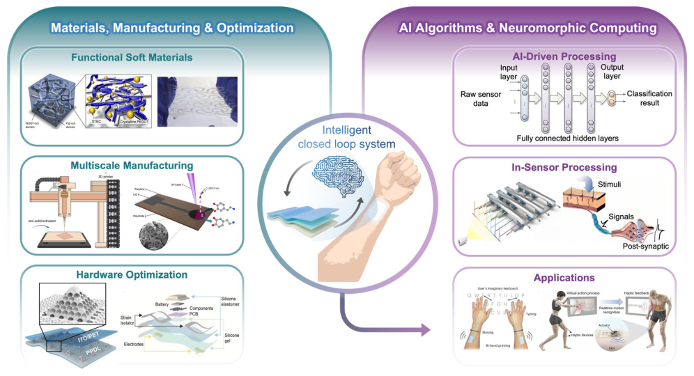

**Original caption:** Fig. 1 Overview of the synergistic integration of functional soft materials and artificial intelligence for next-generation intelligent soft systems. The schematic highlights two complementary pillars for next-generation intelligent soft systems. The left side focuses on materials, manufacturing, and hardware optimization to generate high-fidelity sensing signals, while the right side presents AI algorithms and neuromorphic in-sensor processing that enable real-time enhancement, inference, and application-level decision-making. The center illustrates an intelligent closed-loop paradigm in which material–device–algorithm co-optimization provides continuous feedback to improve performance in wearable electronics, human–machine interfaces, and soft robotics. Reproduced with permission [4]. Copyright 2017, American Association for the Advancement of Science (AAAS). Reproduced with permission [25]. Copyright 2023, American Association for the Advancement of Science (AAAS). Reproduced with permission [26]. Copyright 2025, American Chemical Society. Reproduced with permission [27]. Copyright 2019, American Chemical Society. Reproduced with permission [28]. Copyright 2021, Wiley–VCH. Reproduced with permission [29]. Copyright 2024, Springer Nature. Reproduced with permission [30]. Copyright 2025, Springer Nature. Reproduced with permission [31]. Copyright 2023, Springer Nature. Reproduced with permission [32]. Copyright 2023, Springer Nature. Reproduced with permission [33]. Copyright 2025, Springer Nature

**中文图注:** Fig. 1 原始图注已提取；逐项含义见下方分图说明。

**Reading note:** 重点查看器件结构、材料层次、信号路径和制备流程。

### Fig. 2

**Source:** p.5

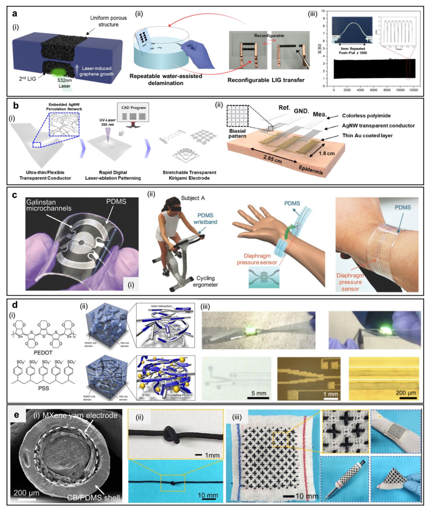

**Original caption:** Fig. 2 Conductive and semiconducting materials for soft and stretchable electronics. a Process schematic illustration for laser-induced graphene, transfer application, and bending-cycle durability test. Reproduced with permission [48]. Copyright 2025, Elsevier. b Laser-patterned Ag nanowire percolation electrodes in kirigami layouts for stretchability, including a kirigami EP sensor for capturing electrophysiology signals. Reproduced with permission [2]. Copyright 2019, American Chemical Society. c PDMS microfluidic diaphragm pressure sensor using Galinstan channels for wearable monitoring, including a photograph of the fabricated device. Reproduced with permission [49]. Copyright 2017, Wiley– VCH. d Morphology schematics comparing a conventional PEDOT:PSS film and a STEC-enhanced stretchable PEDOT film, with additiveengineered stretchable PEDOT:PSS conductors. Reproduced with permission [4]. Copyright 2017, American Association for the Advancement of Science (AAAS). e Elastomer-encapsulated MXene-based yarn electrodes for fiber and textile devices. Reproduced with permission [39]. Copyright 2024, Elsevier

**中文图注:** Fig. 2 原始图注已提取；逐项含义见下方分图说明。

**Reading note:** 重点查看器件结构、材料层次、信号路径和制备流程。

- (a) 重点查看器件结构、材料层次、信号路径和制备流程。 原文：Process schematic illustration for laser-induced graphene, transfer application, and bending-cycle durability test. Reproduced with permission [48]. Copyright 2025, Elsevier
- (b) 结合正文首次引用位置和原始图注核对该图的证据角色。 原文：Laser-patterned Ag nanowire percolation electrodes in kirigami layouts for stretchability, including a kirigami EP sensor for capturing electrophysiology signals. Reproduced with permission [2]. Copyright 2019, American Chemical Society
- (c) 结合正文首次引用位置和原始图注核对该图的证据角色。 原文：PDMS microfluidic diaphragm pressure sensor using Galinstan channels for wearable monitoring, including a photograph of the fabricated device. Reproduced with permission [49]. Copyright 2017, Wiley– VCH
- (d) 重点查看器件结构、材料层次、信号路径和制备流程。 原文：Morphology schematics comparing a conventional PEDOT:PSS film and a STEC-enhanced stretchable PEDOT film, with additiveengineered stretchable PEDOT:PSS conductors. Reproduced with permission [4]. Copyright 2017, American Association for the Advancement of Science (AAAS)
- (e) 结合正文首次引用位置和原始图注核对该图的证据角色。 原文：Elastomer-encapsulated MXene-based yarn electrodes for fiber and textile devices. Reproduced with permission [39]. Copyright 2024, Elsevier

### Fig. 3

**Source:** p.8

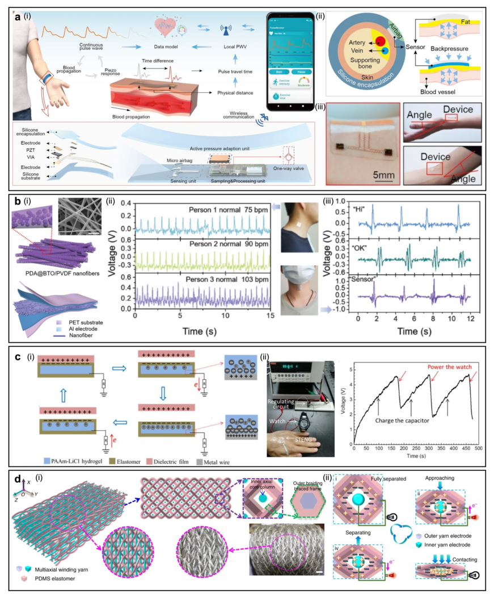

**Original caption:** Fig. 3 Piezoelectric and Triboelectric Materials and Systems Beyond Purely Conductive Pathways. a Wireless piezoelectric wristband for continuous blood-pressure monitoring, showing local pulse-wave sensing, airbag-assisted backpressure control, and mounted-device images under wrist and elbow deformation. Reproduced with permission [38]. Copyright 2023, Springer Nature. b Dopamine-coated electrospun nanofibers for multimodal physiological monitoring, showing fiber morphology, pulse waveforms from different users wearing the MFP textile on the neck, and dynamic output signals for spontaneous voice recognition. Reproduced with permission [60]. Copyright 2021, Wiley–VCH. c Working mechanism of the STENG and its self-charging operation, showing the energy-harvesting principle, a self-charging system powering an electronic watch, and the voltage profile of a 2.2 µF capacitor during charging and watch operation. Reproduced with permission [11]. Copyright 2017, American Association for the Advancement of Science (AAAS). d Structural design and operating principle of the 3DB-TENG, showing the braided architecture with an outer braced frame and inner axial core, the 3D four-step rectangular braiding strategy, and the vertical contactseparation working mechanism. Reproduced with permission [62]. Copyright 2020, Springer Nature

**中文图注:** Fig. 3 原始图注已提取；逐项含义见下方分图说明。

**Reading note:** 重点查看器件结构、材料层次、信号路径和制备流程。

- (a) 重点查看阵列规模、空间分辨率、串扰、读出通道和空间特征表达。 原文：Wireless piezoelectric wristband for continuous blood-pressure monitoring, showing local pulse-wave sensing, airbag-assisted backpressure control, and mounted-device images under wrist and elbow deformation. Reproduced with permission [38]. Copyright 2023, Springer Nature
- (b) 重点查看任务设置、基线、消融和失败案例，判断系统演示是否真正支撑前端价值。 原文：Dopamine-coated electrospun nanofibers for multimodal physiological monitoring, showing fiber morphology, pulse waveforms from different users wearing the MFP textile on the neck, and dynamic output signals for spontaneous voice recognition. Reproduced with permission [60]. Copyright 2021, Wiley–VCH
- (c) 重点查看机制模型与实验结果是否一致，以及关键结构参数的对照关系。 原文：Working mechanism of the STENG and its self-charging operation, showing the energy-harvesting principle, a self-charging system powering an electronic watch, and the voltage profile of a 2.2 µF capacitor during charging and watch operation. Reproduced with permission [11]. Copyright 2017, American Association for the Advancement of Science (AAAS)
- (d) 重点查看器件结构、材料层次、信号路径和制备流程。 原文：Structural design and operating principle of the 3DB-TENG, showing the braided architecture with an outer braced frame and inner axial core, the 3D four-step rectangular braiding strategy, and the vertical contactseparation working mechanism. Reproduced with permission [62]. Copyright 2020, Springer Nature

### Fig. 4

**Source:** p.12

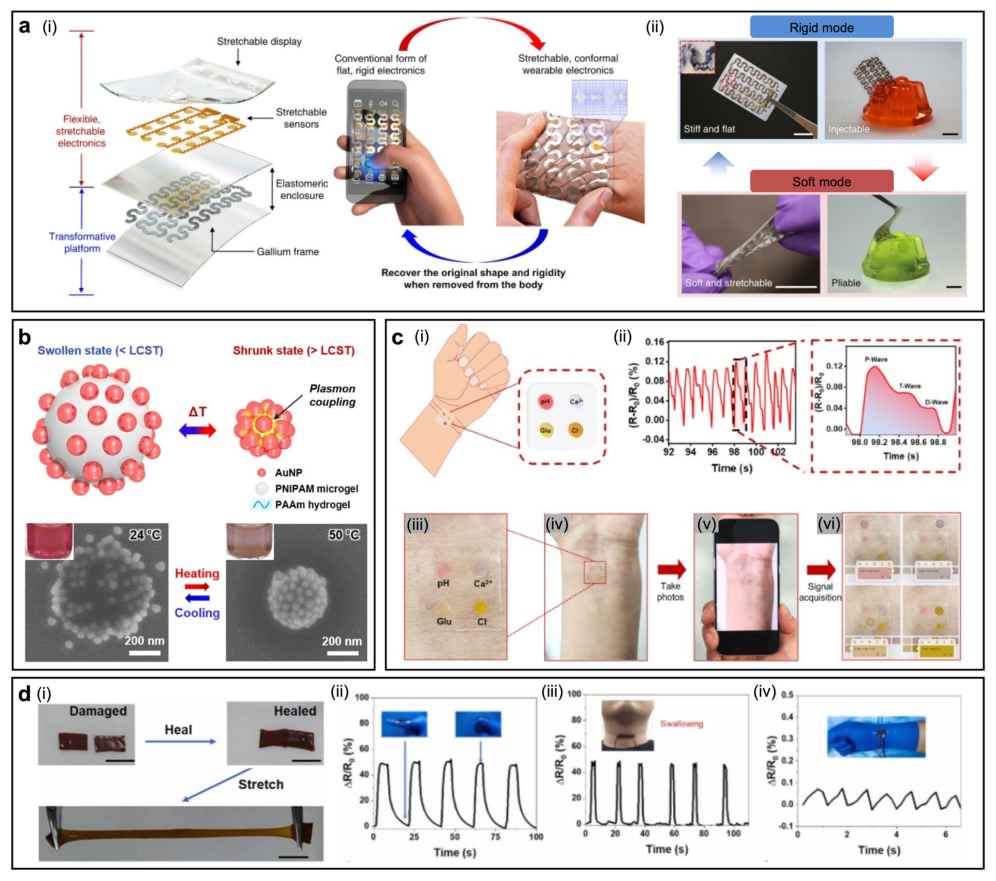

**Original caption:** Fig. 4 Advanced functional materials with environmental responsiveness for reliable, adaptive, and visualized soft electronics. a Temperaturetriggered rigid-to-soft transition from a flat handheld device to a skin-mounted wearable for EMG/ECG recording, with photographs of rigid (top) and soft (bottom) modes. Reproduced with permission [71]. Copyright 2019, American Association for the Advancement of Science (AAAS). b SEM images of 51 nm AuNP plasmonic microgels in swollen (24 °C) and shrunken (50 °C) states, with inset photos of the dispersions. Reproduced with permission [72]. Copyright 2018, Springer Nature. c Wearable hydrogel patch for sweat detection and pulse monitoring, including an on-skin image after sweat secretion and a smartphone app–based colorimetric analysis schematic. Reproduced with permission [68]. Copyright 2025, Elsevier. d PGS-0.2DA-0.2PIL self-healing sensor with tensile recovery after 9 h healing at room temperature and onbody monitoring of finger flexion, swallowing, and pulse. Scale bar 500 µm. Reproduced with permission [69]. Copyright 2024, Elsevier

**中文图注:** Fig. 4 原始图注已提取；逐项含义见下方分图说明。

**Reading note:** 重点查看器件结构、材料层次、信号路径和制备流程。

- (a) 结合正文首次引用位置和原始图注核对该图的证据角色。 原文：Temperaturetriggered rigid-to-soft transition from a flat handheld device to a skin-mounted wearable for EMG/ECG recording, with photographs of rigid (top) and soft (bottom) modes. Reproduced with permission [71]. Copyright 2019, American Association for the Advancement of Science (AAAS)
- (b) 重点查看阵列规模、空间分辨率、串扰、读出通道和空间特征表达。 原文：SEM images of 51 nm AuNP plasmonic microgels in swollen (24 °C) and shrunken (50 °C) states, with inset photos of the dispersions. Reproduced with permission [72]. Copyright 2018, Springer Nature
- (c) 重点查看器件结构、材料层次、信号路径和制备流程。 原文：Wearable hydrogel patch for sweat detection and pulse monitoring, including an on-skin image after sweat secretion and a smartphone app–based colorimetric analysis schematic. Reproduced with permission [68]. Copyright 2025, Elsevier
- (d) 结合正文首次引用位置和原始图注核对该图的证据角色。 原文：PGS-0.2DA-0.2PIL self-healing sensor with tensile recovery after 9 h healing at room temperature and onbody monitoring of finger flexion, swallowing, and pulse. Scale bar 500 µm. Reproduced with permission [69]. Copyright 2024, Elsevier

### Fig. 5

**Source:** p.15

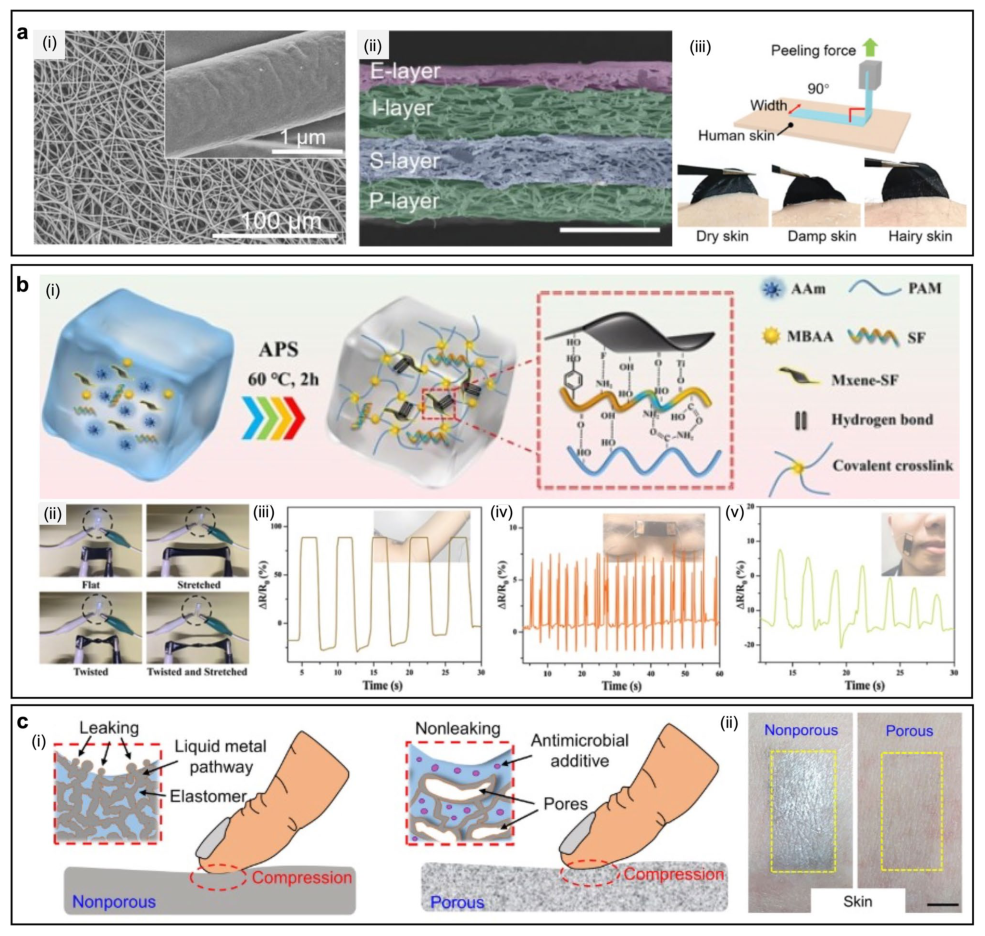

**Original caption:** Fig. 5 Conformal contact and breathable substrate designs for skin-interfaced electronics. a Top-view and cross-sectional SEM of SPRABEskin, a schematic of the 90° adhesion test, and photographs on dry, damp, and hairy human skin. Scale bar 100 µm. Reproduced with permission [12]. Copyright 2023, Wiley–VCH. b PAM/(MXene-SF) hydrogel preparation schematic, circuit operation under stretching and twisting, and wearable responses (ΔR/R0) to elbow rotation, frowning, and smiling. Reproduced with permission [8]. Copyright 2024, Elsevier. c Compression comparison of nonporous and porous EGaIn composites, antimicrobial formulation, and 3-day skin-wear photographs. Scale bar 5 mm. Reproduced with permission [86]. Copyright 2023, American Association for the Advancement of Science (AAAS)

**中文图注:** Fig. 5 原始图注已提取；逐项含义见下方分图说明。

**Reading note:** 重点查看器件结构、材料层次、信号路径和制备流程。

- (a) 重点查看器件结构、材料层次、信号路径和制备流程。 原文：Top-view and cross-sectional SEM of SPRABEskin, a schematic of the 90° adhesion test, and photographs on dry, damp, and hairy human skin. Scale bar 100 µm. Reproduced with permission [12]. Copyright 2023, Wiley–VCH
- (b) 重点查看器件结构、材料层次、信号路径和制备流程。 原文：PAM/(MXene-SF) hydrogel preparation schematic, circuit operation under stretching and twisting, and wearable responses (ΔR/R0) to elbow rotation, frowning, and smiling. Reproduced with permission [8]. Copyright 2024, Elsevier
- (c) 结合正文首次引用位置和原始图注核对该图的证据角色。 原文：Compression comparison of nonporous and porous EGaIn composites, antimicrobial formulation, and 3-day skin-wear photographs. Scale bar 5 mm. Reproduced with permission [86]. Copyright 2023, American Association for the Advancement of Science (AAAS)

### Fig. 6

**Source:** p.19

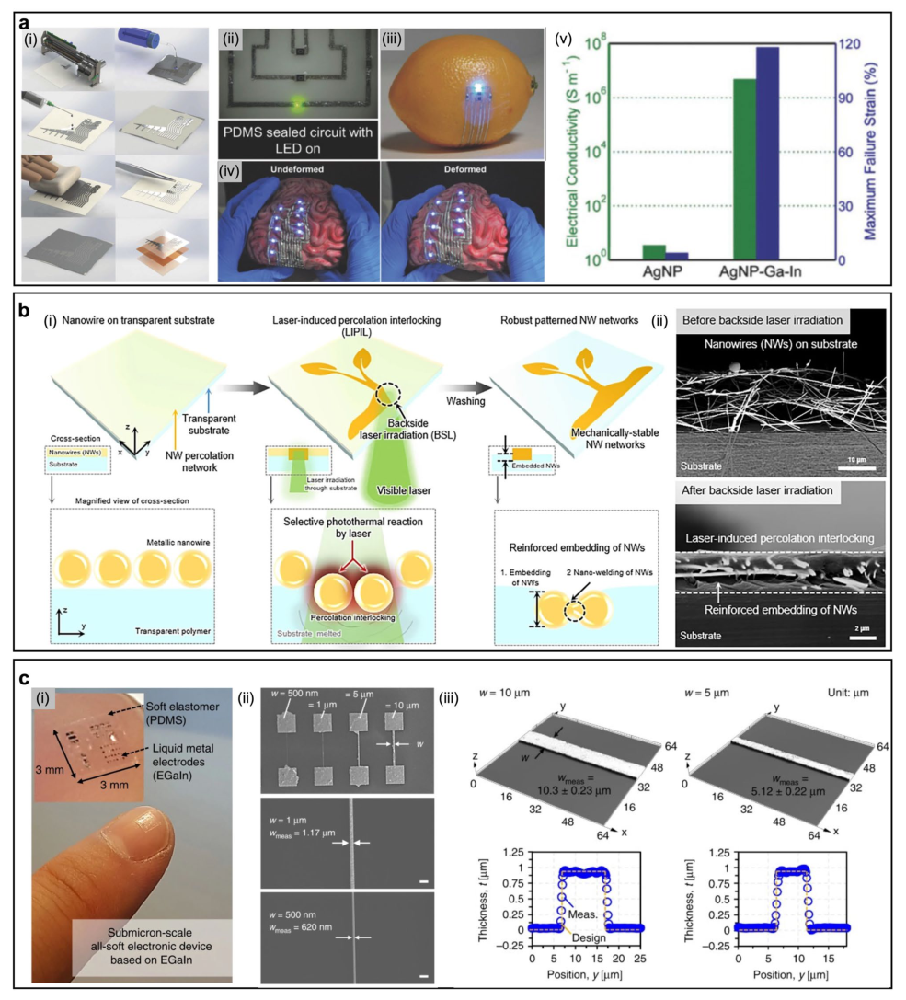

**Original caption:** Fig. 6 High-resolution patterning and printing routes for precise soft circuitry. A 3D hydrographic printing of ultrathin soft electronics, including printed AgNP traces, an AgNP–Ga–In circuit with surface-mounted components, hydrographic transfer onto 3D objects, LED operation under deformation, and conductivity and failure-strain changes after EGaIn deposition. Reproduced with permission [103]. Copyright 2018, Wiley–VCH. b Laser-Induced Nanowire Percolation Interlocking, including a process schematic and cross-sectional SEM images before and after backside laser irradiation. Reproduced with permission [96]. Copyright 2025, Springer Nature. c Soft-material encapsulation and release of EGaIn micro–nano lines, including SEM images from 10 µm to 500 nm and 3D profiles and cross-sections of representative line widths. Scale bar 2 µm. Reproduced with permission [101]. Copyright 2020, Springer Nature

**中文图注:** Fig. 6 原始图注已提取；逐项含义见下方分图说明。

**Reading note:** 重点查看器件结构、材料层次、信号路径和制备流程。

- (a) 结合正文首次引用位置和原始图注核对该图的证据角色。 原文：3D hydrographic printing of ultrathin soft electronics, including printed AgNP traces, an AgNP–Ga–In circuit with surface-mounted components, hydrographic transfer onto 3D objects, LED operation under deformation, and conductivity and failure-strain changes after EGaIn deposition. Reproduced with permission [103]. Copyright 2018, Wiley–VCH
- (b) 重点查看器件结构、材料层次、信号路径和制备流程。 原文：Laser-Induced Nanowire Percolation Interlocking, including a process schematic and cross-sectional SEM images before and after backside laser irradiation. Reproduced with permission [96]. Copyright 2025, Springer Nature
- (c) 重点查看阵列规模、空间分辨率、串扰、读出通道和空间特征表达。 原文：Soft-material encapsulation and release of EGaIn micro–nano lines, including SEM images from 10 µm to 500 nm and 3D profiles and cross-sections of representative line widths. Scale bar 2 µm. Reproduced with permission [101]. Copyright 2020, Springer Nature

### Fig. 7

**Source:** p.21

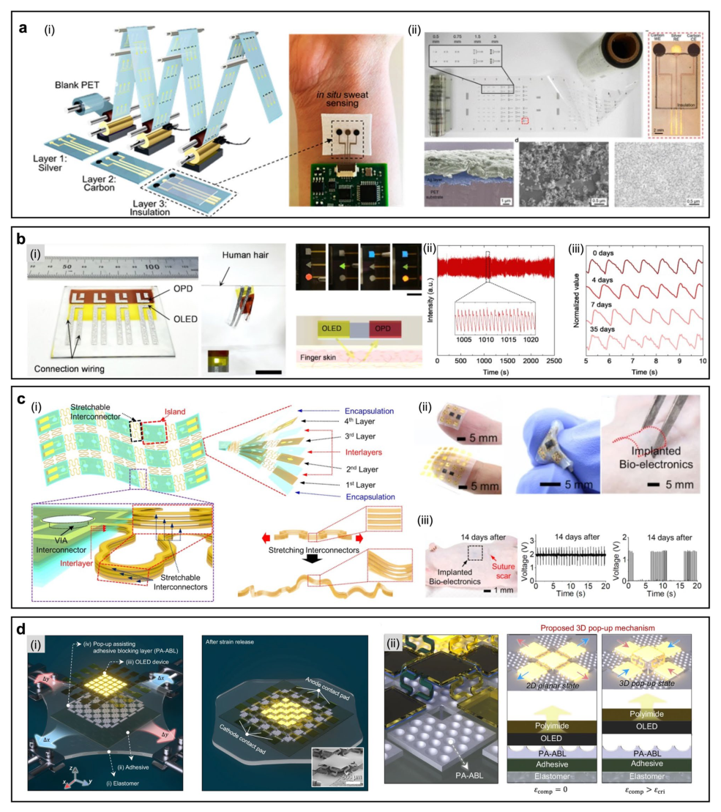

**Original caption:** Fig. 7 Scalable manufacturing and high-density interconnect architectures for soft bioelectronics. a Roll-to-roll gravure-printed PET electrode arrays using silver, carbon, and insulation layers, with roll-scale production and optical/SEM characterization. Reproduced with permission [14]. Copyright 2018, American Chemical Society. b All-solution-processed ultrathin OLED/OPD photoplethysmography system, including device photographs, multicolor displays, operation schematic, and long-term pulse-wave and air-stability results. Scale bar 1 cm. Reproduced with permission [110]. Copyright 2024, American Association for the Advancement of Science (AAAS). c Vertically-Separated Multilayer Stretchable Circuit with rigid islands and vertically separated stretchable interconnectors, including multilayer schematics, deformation illustrations, fabricated devices, and in vivo ECG sensing and stimulation. Reproduced with permission [97]. Copyright 2024, Springer Nature. d PA-ABL– assisted OLED assembly on biaxially prestrained elastomers, including planar-to-pop-up transition schematics and representative device images. Reproduced with permission [109]. Copyright 2024, Springer Nature

**中文图注:** Fig. 7 原始图注已提取；逐项含义见下方分图说明。

**Reading note:** 重点查看器件结构、材料层次、信号路径和制备流程。

- (a) 重点查看阵列规模、空间分辨率、串扰、读出通道和空间特征表达。 原文：Roll-to-roll gravure-printed PET electrode arrays using silver, carbon, and insulation layers, with roll-scale production and optical/SEM characterization. Reproduced with permission [14]. Copyright 2018, American Chemical Society
- (b) 重点查看器件结构、材料层次、信号路径和制备流程。 原文：All-solution-processed ultrathin OLED/OPD photoplethysmography system, including device photographs, multicolor displays, operation schematic, and long-term pulse-wave and air-stability results. Scale bar 1 cm. Reproduced with permission [110]. Copyright 2024, American Association for the Advancement of Science (AAAS)
- (c) 重点查看器件结构、材料层次、信号路径和制备流程。 原文：Vertically-Separated Multilayer Stretchable Circuit with rigid islands and vertically separated stretchable interconnectors, including multilayer schematics, deformation illustrations, fabricated devices, and in vivo ECG sensing and stimulation. Reproduced with permission [97]. Copyright 2024, Springer Nature
- (d) 重点查看器件结构、材料层次、信号路径和制备流程。 原文：PA-ABL– assisted OLED assembly on biaxially prestrained elastomers, including planar-to-pop-up transition schematics and representative device images. Reproduced with permission [109]. Copyright 2024, Springer Nature

### Fig. 8

**Source:** p.25

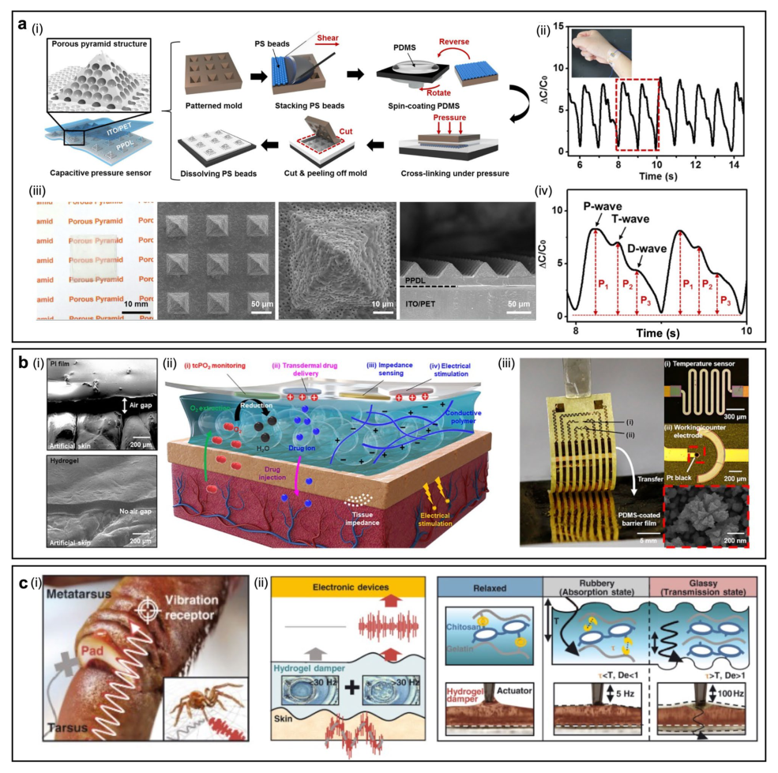

**Original caption:** Fig. 8 Hardware optimization for high-fidelity signal acquisition and energy-autonomous wireless systems. a Capacitive pressure sensor based on a porous pyramid dielectric layer (PPDL), including a PPDL fabrication schematic, optical photo of PPDL on ITO/PET, top-view and crosssectional SEM images, and real-time radial-artery pulse signals with a magnified segment. Reproduced with permission [27]. Copyright 2019, American Chemical Society. b SEM images of PI film and tissue-like ultrasoft hydrogel mounted on artificial skin, and wearable transcutaneous biosensors for tcPO2 and local tissue impedance on PDMS. Reproduced with permission [116]. Copyright 2021, American Association for the Advancement of Science (AAAS). c Bioinspired selective frequency damping through a hydrogel damper, showing low-frequency suppression, high-frequency signal transmission, and relaxation-time-dependent filtering. Reproduced with permission [118]. Copyright 2022, American Association for the Advancement of Science (AAAS)

**中文图注:** Fig. 8 原始图注已提取；逐项含义见下方分图说明。

**Reading note:** 重点查看器件结构、材料层次、信号路径和制备流程。

- (a) 重点查看器件结构、材料层次、信号路径和制备流程。 原文：Capacitive pressure sensor based on a porous pyramid dielectric layer (PPDL), including a PPDL fabrication schematic, optical photo of PPDL on ITO/PET, top-view and crosssectional SEM images, and real-time radial-artery pulse signals with a magnified segment. Reproduced with permission [27]. Copyright 2019, American Chemical Society
- (b) 重点查看阵列规模、空间分辨率、串扰、读出通道和空间特征表达。 原文：SEM images of PI film and tissue-like ultrasoft hydrogel mounted on artificial skin, and wearable transcutaneous biosensors for tcPO2 and local tissue impedance on PDMS. Reproduced with permission [116]. Copyright 2021, American Association for the Advancement of Science (AAAS)
- (c) 结合正文首次引用位置和原始图注核对该图的证据角色。 原文：Bioinspired selective frequency damping through a hydrogel damper, showing low-frequency suppression, high-frequency signal transmission, and relaxation-time-dependent filtering. Reproduced with permission [118]. Copyright 2022, American Association for the Advancement of Science (AAAS)

### Fig. 9

**Source:** p.28

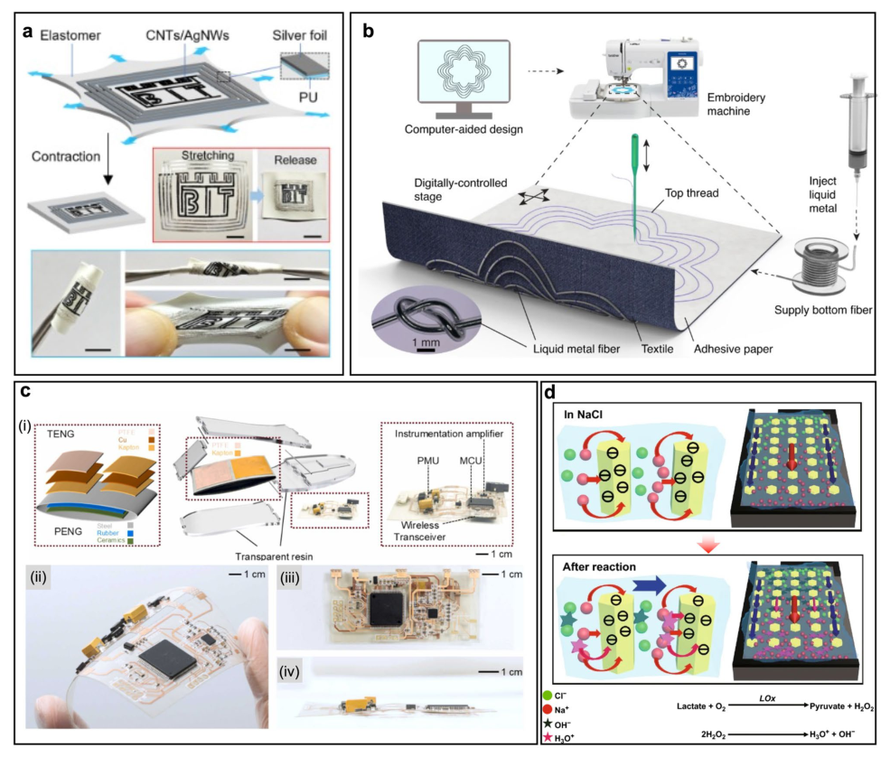

**Original caption:** Fig. 9 Self-powered and energy-harvesting approaches for intelligent soft electronics. a Schematic and profile display of stretchable integrated circuit fabrication via an omnidirectional stretch–contraction strategy, with photos of the circuit on an elastic balloon in stretched and released states and flexibility demonstration. Scale bar 1 cm. Reproduced with permission [117]. Copyright 2025, American Association for the Advancement of Science (AAAS). b Schematic illustration of the digital embroidery process, in which liquid metal fibers are prepared by filling perfluoroalkoxy alkane tubing with galinstan. Reproduced with permission [127]. Copyright 2022, Springer Nature. c Schematic and photographs of a self-powered wearable heart-rate monitoring system, including a 3D-printed sole with TPHG and a data-processing module, and FPCB images in planar, folded, and side views. Reproduced with permission [119]. Copyright 2025, Elsevier. d Schematic illustration of the power generation and biosensing operation of the perspiration-analyzing sites. Reproduced with permission [130]. Copyright 2020, Springer Nature

**中文图注:** Fig. 9 原始图注已提取；逐项含义见下方分图说明。

**Reading note:** 重点查看器件结构、材料层次、信号路径和制备流程。

- (a) 重点查看器件结构、材料层次、信号路径和制备流程。 原文：Schematic and profile display of stretchable integrated circuit fabrication via an omnidirectional stretch–contraction strategy, with photos of the circuit on an elastic balloon in stretched and released states and flexibility demonstration. Scale bar 1 cm. Reproduced with permission [117]. Copyright 2025, American Association for the Advancement of Science (AAAS)
- (b) 重点查看器件结构、材料层次、信号路径和制备流程。 原文：Schematic illustration of the digital embroidery process, in which liquid metal fibers are prepared by filling perfluoroalkoxy alkane tubing with galinstan. Reproduced with permission [127]. Copyright 2022, Springer Nature
- (c) 重点查看器件结构、材料层次、信号路径和制备流程。 原文：Schematic and photographs of a self-powered wearable heart-rate monitoring system, including a 3D-printed sole with TPHG and a data-processing module, and FPCB images in planar, folded, and side views. Reproduced with permission [119]. Copyright 2025, Elsevier
- (d) 重点查看器件结构、材料层次、信号路径和制备流程。 原文：Schematic illustration of the power generation and biosensing operation of the perspiration-analyzing sites. Reproduced with permission [130]. Copyright 2020, Springer Nature

### Fig. 10

**Source:** p.31

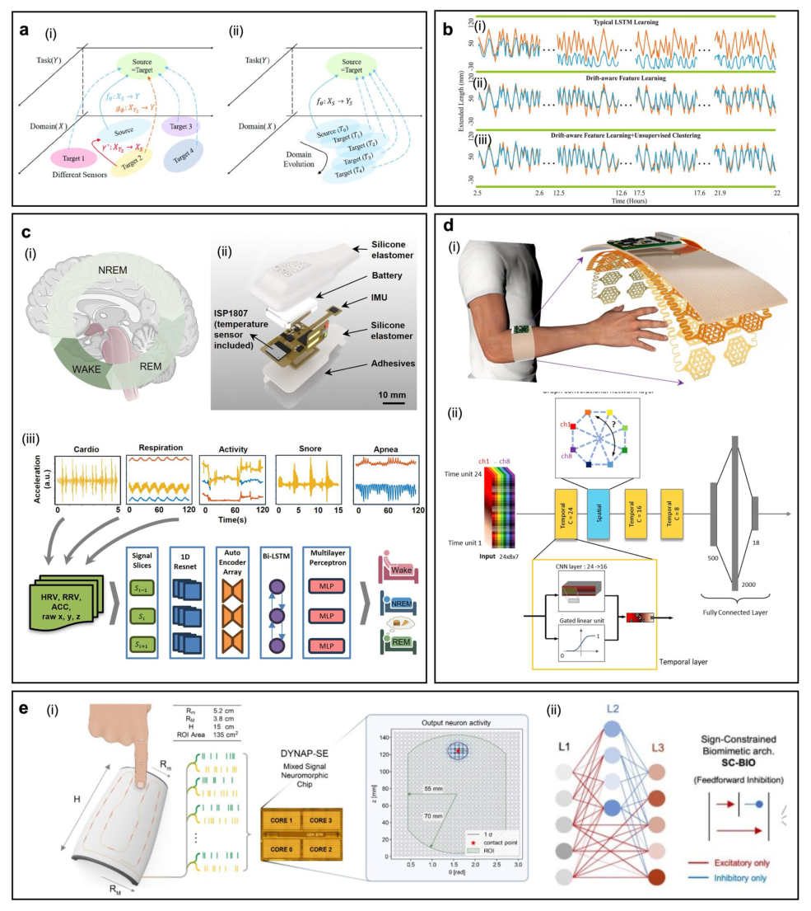

**Original caption:** Fig. 10 AI-Driven Approaches for Overcoming Material Limitations and Enabling Multimodal Analysis in Soft Electronics. a Optimal transport-based domain mappings (γ) for soft sensor calibration, resolving sensor-to-sensor variability through target-to-source mapping and modeling aging-induced long-term drift via successive mappings. Reproduced with permission [111]. Copyright 2020, Wiley–VCH. b Comparison of long-term estimation performance in neural networks, contrasting a standard LSTM calibration baseline with improved results achieved via drift-aware feature learning using segmentation and unsupervised clustering. Reproduced with permission [21]. Copyright 2024, Wiley–VCH. c System architecture of the neck-mounted LMA wearable and its accompanying signal-processing pipeline, which maps cardiorespiratory and acceleration signals into sleep-stage features for the proposed LMASN model. Reproduced with permission [139]. Copyright 2025, National Academy of Sciences. d Overview of a wearable setup in which a stretchable array EMG sensor is integrated with a wireless acquisition module for real-time EMG monitoring and the architecture of the graph attention network. Reproduced with permission [140]. Copyright 2023, Springer Nature. e Overview of the touch-encoding system, integrating an FBG-embedded e-skin with a neuromorphic chip, featuring the bioinspired spiking architecture alongside example output-neuron activity. Reproduced with permission [141]. Copyright 2026, Springer Nature

**中文图注:** Fig. 10 原始图注已提取；逐项含义见下方分图说明。

**Reading note:** 重点查看器件结构、材料层次、信号路径和制备流程。

- (a) 重点查看标定方法、量程、误差、线性和动态响应，避免只比较单一灵敏度。 原文：Optimal transport-based domain mappings (γ) for soft sensor calibration, resolving sensor-to-sensor variability through target-to-source mapping and modeling aging-induced long-term drift via successive mappings. Reproduced with permission [111]. Copyright 2020, Wiley–VCH
- (b) 重点查看标定方法、量程、误差、线性和动态响应，避免只比较单一灵敏度。 原文：Comparison of long-term estimation performance in neural networks, contrasting a standard LSTM calibration baseline with improved results achieved via drift-aware feature learning using segmentation and unsupervised clustering. Reproduced with permission [21]. Copyright 2024, Wiley–VCH
- (c) 重点查看器件结构、材料层次、信号路径和制备流程。 原文：System architecture of the neck-mounted LMA wearable and its accompanying signal-processing pipeline, which maps cardiorespiratory and acceleration signals into sleep-stage features for the proposed LMASN model. Reproduced with permission [139]. Copyright 2025, National Academy of Sciences
- (d) 重点查看器件结构、材料层次、信号路径和制备流程。 原文：Overview of a wearable setup in which a stretchable array EMG sensor is integrated with a wireless acquisition module for real-time EMG monitoring and the architecture of the graph attention network. Reproduced with permission [140]. Copyright 2023, Springer Nature
- (e) 重点查看器件结构、材料层次、信号路径和制备流程。 原文：Overview of the touch-encoding system, integrating an FBG-embedded e-skin with a neuromorphic chip, featuring the bioinspired spiking architecture alongside example output-neuron activity. Reproduced with permission [141]. Copyright 2026, Springer Nature

### Fig. 11

**Source:** p.37

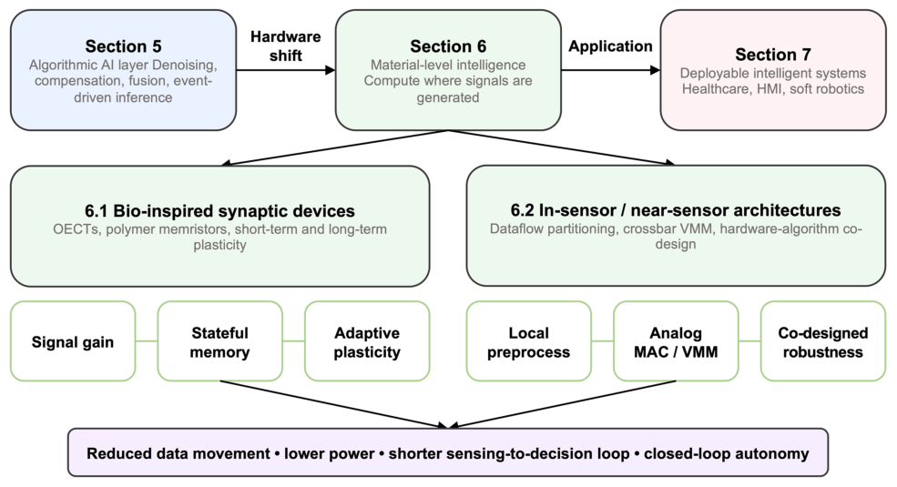

**Original caption:** Fig. 11 Conceptual framework of neuromorphic and in-sensor computing in intelligent soft electronics. This schematic illustrates the transition from algorithmic AI (Sect. 5) to material-level intelligence (Sect. 6), where computation occurs directly at the signal source. By integrating bio-inspired synaptic devices (Sect. 6.1) with in-/near-sensor architectures (Sect. 6.2), the framework provides essential capabilities like stateful memory, analog MAC/VMM, and local preprocessing. This integration significantly reduces data movement and power consumption, enabling closed-loop autonomy for deployable intelligent systems in healthcare, human–machine interaction, and soft robotics (Sect. 7)

**中文图注:** Fig. 11 原始图注已提取；逐项含义见下方分图说明。

**Reading note:** 重点查看器件结构、材料层次、信号路径和制备流程。

### Fig. 12

**Source:** p.38

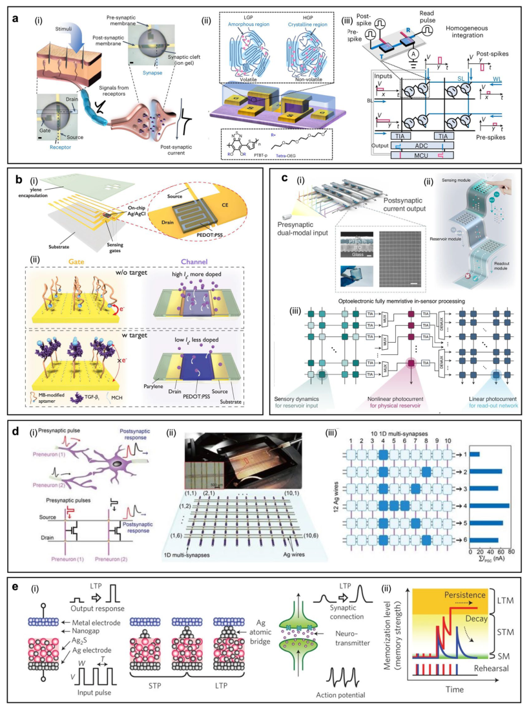

**Original caption:** Fig. 12 Emulation of Biological Neural Networks via Organic Electrochemical Transistors and Polymer Memristors. a Comparison of biological neural function with a cv-OECT-based artificial nervous system, illustrating the device’s dual operation as a volatile receptor and non-volatile synapse and its integration into a homogeneous spiking neural network architecture. Reproduced with permission [31]. Copyright 2023, Springer Nature. b Schematic and detection principle of a reference-OECT-integrated electrochemical aptamer-based sensor for TGF-β1, where target binding induces an aptamer conformational change that distances the methylene blue reporter from the gate. Reproduced with permission [168]. Copyright 2023, Springer Nature. c Design and morphological characterization of a fabricated optoelectronic memristor crossbar array utilized within an analog, fully memristive in-sensor reservoir computing system. Reproduced with permission [30]. Copyright 2025, Springer Nature. d Biological and artificial signal transmission comparison using a NOR-type synaptic array, combined with array implementation demonstrating pattern encoding via LTP/LTD states and row-wise IPSC readouts. Reproduced with permission [161]. Copyright 2020, American Association for the Advancement of Science (AAAS). e Comparison of an Ag2S inorganic synapse and a biological system, illustrating a multistore memory model where repeated stimuli form Ag atomic bridges to consolidate short-term into long-term memory. Reproduced with permission [169]. Copyright 2011, Springer Nature

**中文图注:** Fig. 12 原始图注已提取；逐项含义见下方分图说明。

**Reading note:** 重点查看器件结构、材料层次、信号路径和制备流程。

- (a) 重点查看器件结构、材料层次、信号路径和制备流程。 原文：Comparison of biological neural function with a cv-OECT-based artificial nervous system, illustrating the device’s dual operation as a volatile receptor and non-volatile synapse and its integration into a homogeneous spiking neural network architecture. Reproduced with permission [31]. Copyright 2023, Springer Nature
- (b) 重点查看器件结构、材料层次、信号路径和制备流程。 原文：Schematic and detection principle of a reference-OECT-integrated electrochemical aptamer-based sensor for TGF-β1, where target binding induces an aptamer conformational change that distances the methylene blue reporter from the gate. Reproduced with permission [168]. Copyright 2023, Springer Nature
- (c) 重点查看阵列规模、空间分辨率、串扰、读出通道和空间特征表达。 原文：Design and morphological characterization of a fabricated optoelectronic memristor crossbar array utilized within an analog, fully memristive in-sensor reservoir computing system. Reproduced with permission [30]. Copyright 2025, Springer Nature
- (d) 重点查看阵列规模、空间分辨率、串扰、读出通道和空间特征表达。 原文：Biological and artificial signal transmission comparison using a NOR-type synaptic array, combined with array implementation demonstrating pattern encoding via LTP/LTD states and row-wise IPSC readouts. Reproduced with permission [161]. Copyright 2020, American Association for the Advancement of Science (AAAS)
- (e) 重点查看机制模型与实验结果是否一致，以及关键结构参数的对照关系。 原文：Comparison of an Ag2S inorganic synapse and a biological system, illustrating a multistore memory model where repeated stimuli form Ag atomic bridges to consolidate short-term into long-term memory. Reproduced with permission [169]. Copyright 2011, Springer Nature

### Fig. 13

**Source:** p.42

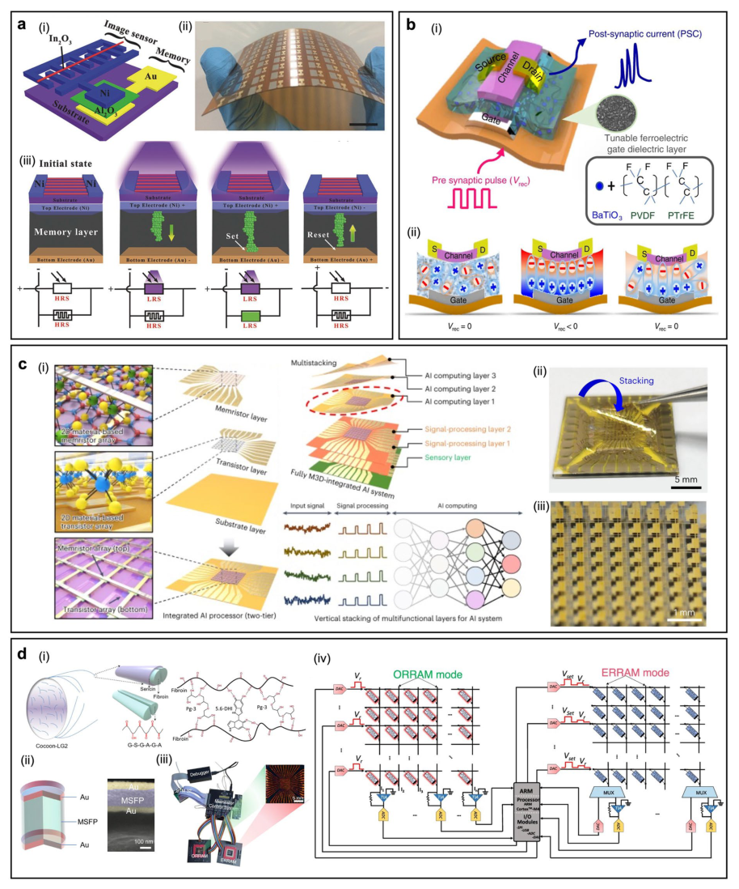

**Original caption:** Fig. 13 Hardware-Algorithm Co-Design Strategies for Efficient Neuromorphic Interfaces and Sensor-Level Processing. a A bioinspired visual memory unit integrating an image sensor with a resistive-switching memory element, featuring photographs of fabricated arrays on rigid SiO2 and flexible polyimide substrates alongside its underlying resistive-switching mechanism. Reproduced with permission [180]. Copyright 2018, Wiley–VCH. b Schematic and operating mechanism of a flexible intrinsic-synaptic tactile device, demonstrating postsynaptic current generation via ferroelectric dipole polarization. Reproduced with permission [181]. Copyright 2020, Springer Nature. c Schematic and morphological views of an edge-computing platform enabled by monolithic 3D integration of 2D materials, featuring stacked sensory, signal-processing, and parallel AI-computing layers. Reproduced with permission [182]. Copyright 2023, Springer Nature. d Overview of an MSFP-based multimodal resistive memory device, detailing its cross-sectional FE-SEM and modified silk fibroin protein structure, alongside the architecture and photograph of a fully hardware neuromorphic vision system. Reproduced with permission [183]. Copyright 2023, Springer Nature

**中文图注:** Fig. 13 原始图注已提取；逐项含义见下方分图说明。

**Reading note:** 重点查看器件结构、材料层次、信号路径和制备流程。

- (a) 重点查看阵列规模、空间分辨率、串扰、读出通道和空间特征表达。 原文：A bioinspired visual memory unit integrating an image sensor with a resistive-switching memory element, featuring photographs of fabricated arrays on rigid SiO2 and flexible polyimide substrates alongside its underlying resistive-switching mechanism. Reproduced with permission [180]. Copyright 2018, Wiley–VCH
- (b) 重点查看器件结构、材料层次、信号路径和制备流程。 原文：Schematic and operating mechanism of a flexible intrinsic-synaptic tactile device, demonstrating postsynaptic current generation via ferroelectric dipole polarization. Reproduced with permission [181]. Copyright 2020, Springer Nature
- (c) 重点查看器件结构、材料层次、信号路径和制备流程。 原文：Schematic and morphological views of an edge-computing platform enabled by monolithic 3D integration of 2D materials, featuring stacked sensory, signal-processing, and parallel AI-computing layers. Reproduced with permission [182]. Copyright 2023, Springer Nature
- (d) 重点查看器件结构、材料层次、信号路径和制备流程。 原文：Overview of an MSFP-based multimodal resistive memory device, detailing its cross-sectional FE-SEM and modified silk fibroin protein structure, alongside the architecture and photograph of a fully hardware neuromorphic vision system. Reproduced with permission [183]. Copyright 2023, Springer Nature

### Fig. 14

**Source:** p.45

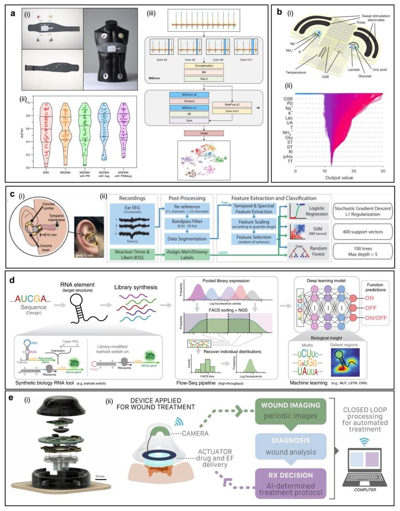

**Original caption:** Fig. 14 AI-integrated soft electronics for closed-loop personalized healthcare systems. a Overview of a wearable 12-lead ECG device and standard electrode placement highlighting real-world artifacts from electrode displacement and weak skin contact, and the architecture of the proposed multiscale convolutional network. Reproduced with permission [200]. Copyright 2023, Springer Nature. b Schematic of the flexible e-skin patch highlighting its integrated functions for vital-sign tracking and sweat-based sensing, alongside a decision plot demonstrating how a machine-learning model combines these physiological and biochemical markers. Reproduced with permission [201]. Copyright 2024, Springer Nature. c Electrode placement and signal processing pipeline for ear ExG recordings, followed by re-referencing, filtering, and motion artifact removal prior to feature extraction and model training. Reproduced with permission [193]. Copyright 2024, Springer Nature. d End-to-end design workflow for programmable RNA switches, demonstrating a toehold-switch model that combines switch/trigger architecture, pooled flow-seq measurements, and DNN-based functional prediction. Reproduced with permission [34]. Copyright 2020, Springer Nature. e CAD rendering of the wearable heal platform for adaptive bioelectronic wound therapy. Reproduced with permission [195]. Copyright 2025, Springer Nature

**中文图注:** Fig. 14 原始图注已提取；逐项含义见下方分图说明。

**Reading note:** 重点查看器件结构、材料层次、信号路径和制备流程。

- (a) 重点查看器件结构、材料层次、信号路径和制备流程。 原文：Overview of a wearable 12-lead ECG device and standard electrode placement highlighting real-world artifacts from electrode displacement and weak skin contact, and the architecture of the proposed multiscale convolutional network. Reproduced with permission [200]. Copyright 2023, Springer Nature
- (b) 重点查看器件结构、材料层次、信号路径和制备流程。 原文：Schematic of the flexible e-skin patch highlighting its integrated functions for vital-sign tracking and sweat-based sensing, alongside a decision plot demonstrating how a machine-learning model combines these physiological and biochemical markers. Reproduced with permission [201]. Copyright 2024, Springer Nature
- (c) 重点查看机制模型与实验结果是否一致，以及关键结构参数的对照关系。 原文：Electrode placement and signal processing pipeline for ear ExG recordings, followed by re-referencing, filtering, and motion artifact removal prior to feature extraction and model training. Reproduced with permission [193]. Copyright 2024, Springer Nature
- (d) 重点查看器件结构、材料层次、信号路径和制备流程。 原文：End-to-end design workflow for programmable RNA switches, demonstrating a toehold-switch model that combines switch/trigger architecture, pooled flow-seq measurements, and DNN-based functional prediction. Reproduced with permission [34]. Copyright 2020, Springer Nature
- (e) 结合正文首次引用位置和原始图注核对该图的证据角色。 原文：CAD rendering of the wearable heal platform for adaptive bioelectronic wound therapy. Reproduced with permission [195]. Copyright 2025, Springer Nature

### Fig. 15

**Source:** p.48

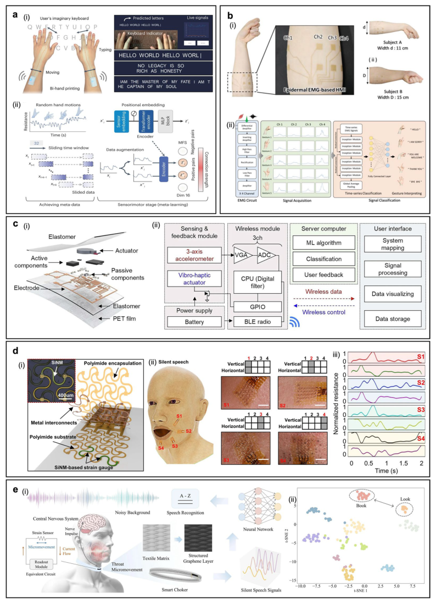

**Original caption:** Fig. 15 AI-integrated soft HMI platforms for immersive and bidirectional interaction. a Real-time two-handed typing recognition using nanomesh sensors, alongside the sensor signal-processing pipeline and unsupervised TD-C learning to construct the meta-feature space. Reproduced with permission [32]. Copyright 2023, Springer Nature. b An NW-DLF-printed epidermal EMG human–machine interface featuring its conformal forearm lamination, customized user layouts, and a block diagram of the associated hand-gesture recognition system. Reproduced with permission [211]. Copyright 2024, Wiley–VCH. c Exploded schematic of the elastomer-encapsulated device stack and electronic components, alongside a system-level block diagram detailing the main modules and wireless communication protocols. Reproduced with permission [33]. Copyright 2025, Springer Nature. d Ultrathin single-crystalline silicon nanomembrane stretchable strain gauge, illustrating a four-device facial mounting configuration alongside corresponding sensor deformations and time-series/heatmap resistance patterns during silent speech. Reproduced with permission [212]. Copyright 2022, Springer Nature. e A textile-graphene smart choker for silent speech recognition via neural-driven throat micromovements, featuring a lightweight decoding network and corresponding t-SNE visualizations of fine-tuned feature embeddings. Reproduced with permission [213]. Copyright 2024, Springer Nature

**中文图注:** Fig. 15 原始图注已提取；逐项含义见下方分图说明。

**Reading note:** 重点查看器件结构、材料层次、信号路径和制备流程。

- (a) 重点查看任务设置、基线、消融和失败案例，判断系统演示是否真正支撑前端价值。 原文：Real-time two-handed typing recognition using nanomesh sensors, alongside the sensor signal-processing pipeline and unsupervised TD-C learning to construct the meta-feature space. Reproduced with permission [32]. Copyright 2023, Springer Nature
- (b) 重点查看任务设置、基线、消融和失败案例，判断系统演示是否真正支撑前端价值。 原文：An NW-DLF-printed epidermal EMG human–machine interface featuring its conformal forearm lamination, customized user layouts, and a block diagram of the associated hand-gesture recognition system. Reproduced with permission [211]. Copyright 2024, Wiley–VCH
- (c) 重点查看器件结构、材料层次、信号路径和制备流程。 原文：Exploded schematic of the elastomer-encapsulated device stack and electronic components, alongside a system-level block diagram detailing the main modules and wireless communication protocols. Reproduced with permission [33]. Copyright 2025, Springer Nature
- (d) 结合正文首次引用位置和原始图注核对该图的证据角色。 原文：Ultrathin single-crystalline silicon nanomembrane stretchable strain gauge, illustrating a four-device facial mounting configuration alongside corresponding sensor deformations and time-series/heatmap resistance patterns during silent speech. Reproduced with permission [212]. Copyright 2022, Springer Nature
- (e) 重点查看任务设置、基线、消融和失败案例，判断系统演示是否真正支撑前端价值。 原文：A textile-graphene smart choker for silent speech recognition via neural-driven throat micromovements, featuring a lightweight decoding network and corresponding t-SNE visualizations of fine-tuned feature embeddings. Reproduced with permission [213]. Copyright 2024, Springer Nature

### Fig. 16

**Source:** p.52

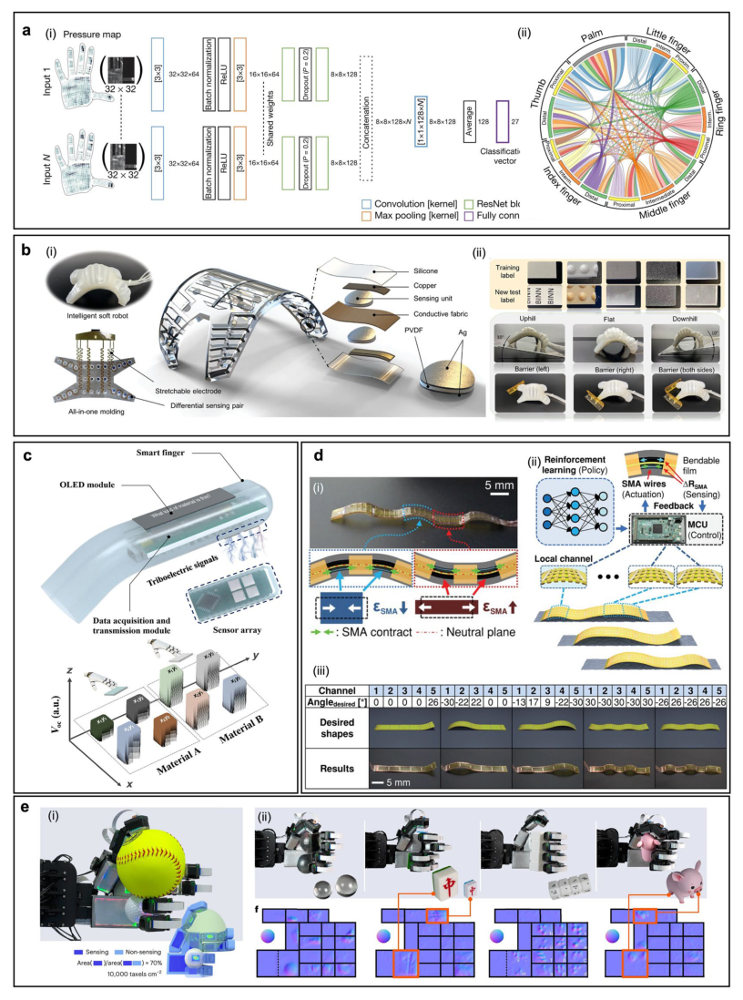

**Original caption:** Fig. 16 Tactile intelligence in soft robotics for autonomous sensing and interaction. a CNN architecture for tactile glove-based object recognition and corresponding hand-region co-activation maps during forceful gripping. Reproduced with permission [226]. Copyright 2019, Springer Nature. b Schematic of a soft robot integrated with an SSES-based electronic skin sensing interface, alongside a demonstration of model generalization in recognizing five previously unseen terrains. Reproduced with permission [222]. Copyright 2023, Wiley–VCH. c Architecture of the triboelectric tactile smart finger and its conceptual output waveforms for distinguishing contacted materials. Reproduced with permission [227]. Copyright 2022, American Association for the Advancement of Science (AAAS). d Design and actuation of a multichannel shape-memory alloy-driven soft robotic flatworm, alongside an RL-based closed-loop control. Reproduced with permission [225]. Copyright 2023, Wiley–VCH. e F-TAC Hand, a dexterous robotic hand equipped with a physiologically benchmarked, high-density tactile sensor array that records high-resolution contact patterns during grasping to enable adaptive, human-like manipulation. Reproduced with permission [228]. Copyright 2025, Springer Nature

**中文图注:** Fig. 16 原始图注已提取；逐项含义见下方分图说明。

**Reading note:** 重点查看器件结构、材料层次、信号路径和制备流程。

- (a) 重点查看器件结构、材料层次、信号路径和制备流程。 原文：CNN architecture for tactile glove-based object recognition and corresponding hand-region co-activation maps during forceful gripping. Reproduced with permission [226]. Copyright 2019, Springer Nature
- (b) 重点查看器件结构、材料层次、信号路径和制备流程。 原文：Schematic of a soft robot integrated with an SSES-based electronic skin sensing interface, alongside a demonstration of model generalization in recognizing five previously unseen terrains. Reproduced with permission [222]. Copyright 2023, Wiley–VCH
- (c) 重点查看器件结构、材料层次、信号路径和制备流程。 原文：Architecture of the triboelectric tactile smart finger and its conceptual output waveforms for distinguishing contacted materials. Reproduced with permission [227]. Copyright 2022, American Association for the Advancement of Science (AAAS)
- (d) 重点查看任务设置、基线、消融和失败案例，判断系统演示是否真正支撑前端价值。 原文：Design and actuation of a multichannel shape-memory alloy-driven soft robotic flatworm, alongside an RL-based closed-loop control. Reproduced with permission [225]. Copyright 2023, Wiley–VCH
- (e) 重点查看阵列规模、空间分辨率、串扰、读出通道和空间特征表达。 原文：F-TAC Hand, a dexterous robotic hand equipped with a physiologically benchmarked, high-density tactile sensor array that records high-resolution contact patterns during grasping to enable adaptive, human-like manipulation. Reproduced with permission [228]. Copyright 2025, Springer Nature
