# Monolithic 6-Axis Force/Torque Sensing by a Single Ultrathin Piezoceramic Shell

- 期刊：Nature Communications
- 日期：2026-07-21
- DOI：10.1038/s41467-026-75631-3
- 解析状态：fulltext_draft

## 摘要与研究价值

**Original:** Miniature multi-axis force/torque sensors are essential for advanced robotics and wearable devices, yet their development is hindered by complex multi-beam structures and laborious calibration. We overcome this by introducing a monolithic 6-axis force/torque sensor constructed from a single, ultrathin-walled piezoceramic shell. This architecture eliminates the need for multi-component assembly and algorithm-driven decoupling, relying instead on the intrinsic mechanical deformation modes of the engineered shell for direct and reliable dynamic force/torque variation measurement. Leveraging this architecture, our sensor enables straightforward calibration and achieves a decoupling accuracy of 99.37% across 120,000 randomized dynamic tests. We fabricated the core sensing element as a 50-μm-thick annular piezoceramic shell to maximize sensitivity and limit of detection, achieving detection limits better than 3 mN in normal force, 4 mN in tangential force, and 0.3 mN·m in torque. We demonstrate a compact, 3.85-gram sensor (2.53 cm³) that integrates seamlessly into robotic grippers for event-driven delicate assembly and into exoskeletons for high-fidelity dynamic monitoring of in-home rehabilitation. This work establishes an architecture for inherently decoupled force/torque sensing, with broad potential in advanced robotics, prosthetics, and personalized medicine.

**中文:** 可用于低离散/装配容差触觉界面的结构与对照设计；涉及 ADC 前模拟矢量、剪切/摩擦/方向相关触觉读出。摘要可核实数值包括：99.37%、3 mN、4 mN、0.3 mN、2.53 cm。

## 创新点

- Miniature multi-axis force/torque sensors are essential for advanced robotics and wearable devices, yet their development is hindered by complex multi-beam structures and laborious calibration.
- 可用于低离散/装配容差触觉界面的结构与对照设计
- 涉及 ADC 前模拟矢量、剪切/摩擦/方向相关触觉读出
- 涉及坏点、漂移、跨器件迁移或少样本校准
- 材料性能词较多、前端/阵列/系统证据偏少，已降权

## 对当前课题的启发

- 可用于低离散/装配容差触觉界面的结构与对照设计
- 涉及 ADC 前模拟矢量、剪切/摩擦/方向相关触觉读出
- 优先核查是否有 hardware output 与 software projection 的同步一致性证据
- 可对照 raw pixel、software feature 与 physical projection 的性能/通道/功耗
- 将法向/剪切/摩擦信息改写为 ADC 前差分或矢量组合，并同步比较 hardware output 与 software vector 的 R2、PSD/SNR。
- 加入坏点比例、增益漂移和跨器件迁移实验，比较重标定样本量与性能渐进退化，形成可靠性主张。

## 制备与实验步骤

### 1. 制备与实验操作

**Source:** p.14

**Original:** Fabrication and assembly procedures.

**中文:** 制备与实验操作步骤，关键配比、时间、温度和设备参数以 p.14 原文为准。

### 2. 图形化与结构成形

**Source:** p.14

**Original:** The encapsulation and inner layer of the F/T sensor were fabricated using silicone molding processes.

**中文:** 图形化与结构成形步骤，关键配比、时间、温度和设备参数以 p.14 原文为准。

### 3. 成膜与沉积

**Source:** p.14

**Original:** Supplementary Fig. S6a shows the fabrication of the soft layer with microstructures: first, the 3D-printed molds are assembled, and uncured PDMS is poured for the initial molding ARTICLE IN PRESS step.

**中文:** 成膜与沉积步骤，关键配比、时间、温度和设备参数以 p.14 原文为准。

### 4. 图形化与结构成形

**Source:** p.14

**Original:** After heating and curing, the PDMS mold is prepared.

**中文:** 图形化与结构成形步骤，关键配比、时间、温度和设备参数以 p.14 原文为准。

### 5. 图形化与结构成形

**Source:** p.14

**Original:** Subsequently, it is assembled with the heat-resistant resin part, and 30A silicone is poured for the second molding step.

**中文:** 图形化与结构成形步骤，关键配比、时间、温度和设备参数以 p.14 原文为准。

### 6. 组装与封装

**Source:** p.14

**Original:** Notably, the tips of the microstructures are curved to ensure better bonding to the inner surface of the annular PZT shell.

**中文:** 组装与封装步骤，关键配比、时间、温度和设备参数以 p.14 原文为准。

### 7. 制备与实验操作

**Source:** p.14

**Original:** Supplementary Fig. S6b illustrates the integrated fabrication of the soft lid and inner layer.

**中文:** 制备与实验操作步骤，关键配比、时间、温度和设备参数以 p.14 原文为准。

### 8. 图形化与结构成形

**Source:** p.14

**Original:** First, a customized mold featuring a regular array of internal conical recesses was designed.

**中文:** 图形化与结构成形步骤，关键配比、时间、温度和设备参数以 p.14 原文为准。

### 9. 图形化与结构成形

**Source:** p.14

**Original:** These recesses mechanically interlocked with the microstructures on the pre-fabricated soft layer, securely anchoring it within the casting cavity.

**中文:** 图形化与结构成形步骤，关键配比、时间、温度和设备参数以 p.14 原文为准。

### 10. 图形化与结构成形

**Source:** p.14

**Original:** Subsequently, liquid silicone with a Shore hardness of 60A was cast into the mold.

**中文:** 图形化与结构成形步骤，关键配比、时间、温度和设备参数以 p.14 原文为准。

### 11. 制备与实验操作

**Source:** p.14

**Original:** The assembly was then subjected to mechanical pressurization and elevated temperatures for thermal curing.

**中文:** 制备与实验操作步骤，关键配比、时间、温度和设备参数以 p.14 原文为准。

### 12. 组装与封装

**Source:** p.14

**Original:** Supplementary Fig.S6c illustrates the fabrication of the soft encapsulation.

**中文:** 组装与封装步骤，关键配比、时间、温度和设备参数以 p.14 原文为准。

### 13. 固化与热处理

**Source:** p.14

**Original:** The uncured 60A silicone is poured into heat-resistant resin part, after heating and curing, the fabricated encapsulation is removed.

**中文:** 固化与热处理步骤，关键配比、时间、温度和设备参数以 p.14 原文为准。

### 14. 制备与实验操作

**Source:** p.15

**Original:** Supplementary Fig. S7a depicts the assembly process of the designed F/T sensor, which can be divided into three steps.

**中文:** 制备与实验操作步骤，关键配比、时间、温度和设备参数以 p.15 原文为准。

### 15. 固化与热处理

**Source:** p.15

**Original:** First, the PZT shell was aligned with the PCB and electrically connected using conductive silver paste (cured at 70 °C, 16 h) to avoid thermal depolarization, with epoxy resin infused into the gaps via capillary action to reinforce the ceramic.

**中文:** 固化与热处理步骤，关键配比、时间、温度和设备参数以 p.15 原文为准。

### 16. 成膜与沉积

**Source:** p.15

**Original:** Second, a dip- ARTICLE IN PRESS coating method was used to apply adhesive to the microstructures of the soft inner layer

**中文:** 成膜与沉积步骤，关键配比、时间、温度和设备参数以 p.15 原文为准。

## 方法原文锚点

**Source:** p.14 M001

**Original:** Fabrication and assembly procedures.

**中文:** 该段已进入结构化方法步骤；完整逐段翻译待智能体精读补齐。

**Source:** p.14 M002

**Original:** The encapsulation and inner layer of the F/T sensor were fabricated using silicone molding

**中文:** 该段已进入结构化方法步骤；完整逐段翻译待智能体精读补齐。

**Source:** p.14 M003

**Original:** processes. Supplementary Fig. S6a shows the fabrication of the soft layer with microstructures:

**中文:** 该段已进入结构化方法步骤；完整逐段翻译待智能体精读补齐。

**Source:** p.14 M004

**Original:** first, the 3D-printed molds are assembled, and uncured PDMS is poured for the initial molding

**中文:** 该段已进入结构化方法步骤；完整逐段翻译待智能体精读补齐。

**Source:** p.15 M005

**Original:** ARTICLE IN PRESS

**中文:** 该段已进入结构化方法步骤；完整逐段翻译待智能体精读补齐。

**Source:** p.15 M006

**Original:** step. After heating and curing, the PDMS mold is prepared. Subsequently, it is assembled with the

**中文:** 该段已进入结构化方法步骤；完整逐段翻译待智能体精读补齐。

**Source:** p.15 M007

**Original:** heat-resistant resin part, and 30A silicone is poured for the second molding step. Following high

**中文:** 该段已进入结构化方法步骤；完整逐段翻译待智能体精读补齐。

**Source:** p.15 M008

**Original:** temperature heating and curing, the soft inner layer with microstructures is completed. Notably,

**中文:** 该段已进入结构化方法步骤；完整逐段翻译待智能体精读补齐。

**Source:** p.15 M009

**Original:** the tips of the microstructures are curved to ensure better bonding to the inner surface of the

**中文:** 该段已进入结构化方法步骤；完整逐段翻译待智能体精读补齐。

**Source:** p.15 M010

**Original:** annular PZT shell. Supplementary Fig. S6b illustrates the integrated fabrication of the soft lid and

**中文:** 该段已进入结构化方法步骤；完整逐段翻译待智能体精读补齐。

**Source:** p.15 M011

**Original:** inner layer. First, a customized mold featuring a regular array of internal conical recesses was

**中文:** 该段已进入结构化方法步骤；完整逐段翻译待智能体精读补齐。

**Source:** p.15 M012

**Original:** designed. These recesses mechanically interlocked with the microstructures on the pre-fabricated

**中文:** 该段已进入结构化方法步骤；完整逐段翻译待智能体精读补齐。

**Source:** p.15 M013

**Original:** soft layer, securely anchoring it within the casting cavity. Subsequently, liquid silicone with a

**中文:** 该段已进入结构化方法步骤；完整逐段翻译待智能体精读补齐。

**Source:** p.15 M014

**Original:** Shore hardness of 60A was cast into the mold. The assembly was then subjected to mechanical

**中文:** 该段已进入结构化方法步骤；完整逐段翻译待智能体精读补齐。

**Source:** p.15 M015

**Original:** pressurization and elevated temperatures for thermal curing. This process ultimately yielded the

**中文:** 该段已进入结构化方法步骤；完整逐段翻译待智能体精读补齐。

**Source:** p.15 M016

**Original:** soft inner layer part, a composite structure comprising two distinct silicone elastomers with

**中文:** 该段已进入结构化方法步骤；完整逐段翻译待智能体精读补齐。

**Source:** p.15 M017

**Original:** disparate hardness levels. Supplementary Fig.S6c illustrates the fabrication of the soft

**中文:** 该段已进入结构化方法步骤；完整逐段翻译待智能体精读补齐。

**Source:** p.15 M018

**Original:** encapsulation. The uncured 60A silicone is poured into heat-resistant resin part, after heating and

**中文:** 该段已进入结构化方法步骤；完整逐段翻译待智能体精读补齐。

**Source:** p.15 M019

**Original:** curing, the fabricated encapsulation is removed.

**中文:** 该段已进入结构化方法步骤；完整逐段翻译待智能体精读补齐。

**Source:** p.15 M020

**Original:** Supplementary Fig. S7a depicts the assembly process of the designed F/T sensor, which can

**中文:** 该段已进入结构化方法步骤；完整逐段翻译待智能体精读补齐。

**Source:** p.15 M021

**Original:** be divided into three steps. First, the PZT shell was aligned with the PCB and electrically

**中文:** 该段已进入结构化方法步骤；完整逐段翻译待智能体精读补齐。

**Source:** p.15 M022

**Original:** connected using conductive silver paste (cured at 70 °C, 16 h) to avoid thermal depolarization,

**中文:** 该段已进入结构化方法步骤；完整逐段翻译待智能体精读补齐。

**Source:** p.15 M023

**Original:** with epoxy resin infused into the gaps via capillary action to reinforce the ceramic. Second, a dip-

**中文:** 该段已进入结构化方法步骤；完整逐段翻译待智能体精读补齐。

**Source:** p.15 M024

**Original:** ARTICLE IN PRESS

**中文:** 该段已进入结构化方法步骤；完整逐段翻译待智能体精读补齐。

**Source:** p.15 M025

**Original:** coating method was used to apply adhesive to the microstructures of the soft inner layer

**中文:** 该段已进入结构化方法步骤；完整逐段翻译待智能体精读补齐。

**Source:** p.15 M026

**Original:** (Supplementary Fig.S7b), which was then aligned and interlocked with the PZT electrodes using

**中文:** 该段已进入结构化方法步骤；完整逐段翻译待智能体精读补齐。

**Source:** p.15 M027

**Original:** positioning features. Finally, the outer encapsulation was integrated using a 0.2 mm dimensional

**中文:** 该段已进入结构化方法步骤；完整逐段翻译待智能体精读补齐。

**Source:** p.15 M028

**Original:** offset strategy to limit contact to the rigid support regions. This design protected the internal

**中文:** 该段已进入结构化方法步骤；完整逐段翻译待智能体精读补齐。

**Source:** p.15 M029

**Original:** components while eliminating parasitic constraints, ensuring the free deformation of

**中文:** 该段已进入结构化方法步骤；完整逐段翻译待智能体精读补齐。

**Source:** p.15 M030

**Original:** microstructures and high sensor sensitivity (More details can be found in Supplementary Note 2).

**中文:** 该段已进入结构化方法步骤；完整逐段翻译待智能体精读补齐。

**Source:** p.15 M031

**Original:** Fabrication process for annular PZT shells.

**中文:** 该段已进入结构化方法步骤；完整逐段翻译待智能体精读补齐。

**Source:** p.15 M032

**Original:** The subtractive process involves removing surface PZT material from initial workpieces through

**中文:** 该段已进入结构化方法步骤；完整逐段翻译待智能体精读补齐。

**Source:** p.15 M033

**Original:** the interaction between the soft milling cutter and the workpieces, thereby achieving shell

**中文:** 该段已进入结构化方法步骤；完整逐段翻译待智能体精读补齐。

**Source:** p.16 M034

**Original:** ARTICLE IN PRESS

**中文:** 该段已进入结构化方法步骤；完整逐段翻译待智能体精读补齐。

**Source:** p.16 M035

**Original:** formation, where the soft cutter is fabricated with 95A TPU in a layered structure, enabling

**中文:** 该段已进入结构化方法步骤；完整逐段翻译待智能体精读补齐。

**Source:** p.16 M036

**Original:** stiffness regulation through layer jamming. Typically, the fabrication of PZT shells using annular

**中文:** 该段已进入结构化方法步骤；完整逐段翻译待智能体精读补齐。

**Source:** p.16 M037

**Original:** PZT workpieces (PZT, C-601, Fuji Piezo Ceramics, Inc.) mainly involves three stages: rough

**中文:** 该段已进入结构化方法步骤；完整逐段翻译待智能体精读补齐。

**Source:** p.16 M038

**Original:** machining, finish machining, and polishing (Fig. 2c and Supplementary Fig. S2a). The soft

**中文:** 该段已进入结构化方法步骤；完整逐段翻译待智能体精读补齐。

**Source:** p.16 M039

**Original:** machining system primarily consists of a robotic arm and a soft cutter. The robotic arm's

**中文:** 该段已进入结构化方法步骤；完整逐段翻译待智能体精读补齐。

**Source:** p.16 M040

**Original:** displacement control system and end-effector force sensor are used to regulate milling parameters

**中文:** 该段已进入结构化方法步骤；完整逐段翻译待智能体精读补齐。

**Source:** p.16 M041

**Original:** and monitor variations in milling forces, respectively. During the actual machining process, a

**中文:** 该段已进入结构化方法步骤；完整逐段翻译待智能体精读补齐。

**Source:** p.16 M042

**Original:** multi-segment machining strategy is employed to mitigate the risk of workpiece breakage caused

**中文:** 该段已进入结构化方法步骤；完整逐段翻译待智能体精读补齐。

**Source:** p.16 M043

**Original:** by excessive milling forces and stress concentrations. The approach ensures both a high success

**中文:** 该段已进入结构化方法步骤；完整逐段翻译待智能体精读补齐。

**Source:** p.16 M044

**Original:** rate and machining efficiency. The machining process is segmented into five distinct phases with

**中文:** 该段已进入结构化方法步骤；完整逐段翻译待智能体精读补齐。

**Source:** p.16 M045

**Original:** milling force feedback and thickness estimation (Supplementary Fig. S3). The first three segments

**中文:** 该段已进入结构化方法步骤；完整逐段翻译待智能体精读补齐。

**Source:** p.16 M046

**Original:** correspond to the rough machining process, the fourth segment to the finishing process, and the

**中文:** 该段已进入结构化方法步骤；完整逐段翻译待智能体精读补齐。

**Source:** p.16 M047

**Original:** final segment to the polishing process. And Supplementary Fig. S2b shows the process diagram.

**中文:** 该段已进入结构化方法步骤；完整逐段翻译待智能体精读补齐。

**Source:** p.16 M048

**Original:** Once the target thickness is defined, the joint force sensors integrated into the robotic arm provide

**中文:** 该段已进入结构化方法步骤；完整逐段翻译待智能体精读补齐。

**Source:** p.16 M049

**Original:** continuous real-time feedback on the milling force, which serves as a critical input to the

**中文:** 该段已进入结构化方法步骤；完整逐段翻译待智能体精读补齐。

**Source:** p.16 M050

**Original:** machining system. If the estimated thickness of the PZT workpiece remains within the range of

**中文:** 该段已进入结构化方法步骤；完整逐段翻译待智能体精读补齐。

**Source:** p.16 M051

**Original:** the current machining segment, the system continues to operate under the existing parameters.

**中文:** 该段已进入结构化方法步骤；完整逐段翻译待智能体精读补齐。

**Source:** p.16 M052

**Original:** However, when the estimated thickness falls below the threshold of the current segment, the

**中文:** 该段已进入结构化方法步骤；完整逐段翻译待智能体精读补齐。

**Source:** p.16 M053

**Original:** ARTICLE IN PRESS

**中文:** 该段已进入结构化方法步骤；完整逐段翻译待智能体精读补齐。

**Source:** p.16 M054

**Original:** system automatically transitions to the next machining stage. Taking the machining process of a

**中文:** 该段已进入结构化方法步骤；完整逐段翻译待智能体精读补齐。

**Source:** p.16 M055

**Original:** 20-mm-diameter annular PZT shell with a target thickness of 55 μm as an example (Fig. 2c), it can

**中文:** 该段已进入结构化方法步骤；完整逐段翻译待智能体精读补齐。

**Source:** p.16 M056

**Original:** be divided into three stages at a milling speed of 110 rpm. During rough machining (0 to 1.2 h), a

**中文:** 该段已进入结构化方法步骤；完整逐段翻译待智能体精读补齐。

**Source:** p.16 M057

**Original:** higher milling force is applied for rapid material removal from the initial 1-mm-thick PZT

**中文:** 该段已进入结构化方法步骤；完整逐段翻译待智能体精读补齐。

**Source:** p.16 M058

**Original:** workpiece. As its thickness drops below 150 μm, the system transitions to finish machining (1.2 h

**中文:** 该段已进入结构化方法步骤；完整逐段翻译待智能体精读补齐。

**Source:** p.16 M059

**Original:** to 1.5 h), reducing milling force to minimize stress concentration and preserve structural integrity.

**中文:** 该段已进入结构化方法步骤；完整逐段翻译待智能体精读补齐。

**Source:** p.16 M060

**Original:** Finally, when the workpiece’s thickness reaches 60 μm, polishing begins (1.5 h to 2 h), replacing

**中文:** 该段已进入结构化方法步骤；完整逐段翻译待智能体精读补齐。

**Source:** p.16 M061

**Original:** the milling layer with a polyurethane layer embedded with 3000-5000 mesh diamond abrasives.

**中文:** 该段已进入结构化方法步骤；完整逐段翻译待智能体精读补齐。

**Source:** p.16 M062

**Original:** Characterization of the machined annular PZT shells.

**中文:** 该段已进入结构化方法步骤；完整逐段翻译待智能体精读补齐。

**Source:** p.17 M063

**Original:** ARTICLE IN PRESS

**中文:** 该段已进入结构化方法步骤；完整逐段翻译待智能体精读补齐。

**Source:** p.17 M064

**Original:** Images of the machined shells (Fig. 2d) and its surface morphology (Fig. 2e) were captured using

**中文:** 该段已进入结构化方法步骤；完整逐段翻译待智能体精读补齐。

**Source:** p.17 M065

**Original:** a high depth of field camera and SEM. The overall morphology, surface details, and surface

**中文:** 该段已进入结构化方法步骤；完整逐段翻译待智能体精读补齐。

**Source:** p.17 M066

**Original:** roughness of the electrodes were characterized using a high depth of field camera, SEM, and AFM

**中文:** 该段已进入结构化方法步骤；完整逐段翻译待智能体精读补齐。

**Source:** p.17 M067

**Original:** (Supplementary Fig. S5b and S5c), respectively. For the dimensional precision of the machined

**中文:** 该段已进入结构化方法步骤；完整逐段翻译待智能体精读补齐。

**Source:** p.17 M068

**Original:** annular PZT shells with various dimensions, the following measurements were conducted: the

**中文:** 该段已进入结构化方法步骤；完整逐段翻译待智能体精读补齐。

**Source:** p.17 M069

**Original:** thickness was measured using a laser rangefinder LK-G80 from KEYENCE Co., Ltd.; the

**中文:** 该段已进入结构化方法步骤；完整逐段翻译待智能体精读补齐。

**Source:** p.17 M070

**Original:** roundness was measured with a Mitutoyo Round-Test RA-1200 roundness meter from Mitutoyo

**中文:** 该段已进入结构化方法步骤；完整逐段翻译待智能体精读补齐。

**Source:** p.17 M071

**Original:** Co., Ltd.; and the cylindricity was measured using a Zeiss ACCURA Coordinate Measuring

**中文:** 该段已进入结构化方法步骤；完整逐段翻译待智能体精读补齐。

**Source:** p.17 M072

**Original:** Machine from Carl Zeiss AG Co., Ltd. The acoustic pressure characterization of the PZT-shell-

**中文:** 该段已进入结构化方法步骤；完整逐段翻译待智能体精读补齐。

**Source:** p.17 M073

**Original:** based microphone involves sound signal generation, acoustoelectric signal conversion, and data

**中文:** 该段已进入结构化方法步骤；完整逐段翻译待智能体精读补齐。

**Source:** p.17 M074

**Original:** acquisition. An arbitrary function generator (AFG3022C, Tektronix) generates sinusoidal signals,

**中文:** 该段已进入结构化方法步骤；完整逐段翻译待智能体精读补齐。

**Source:** p.17 M075

**Original:** which are amplified by a power amplifier (5016, SAST) before driving a speaker (SUINY). A

**中文:** 该段已进入结构化方法步骤；完整逐段翻译待智能体精读补齐。

**Source:** p.17 M076

**Original:** commercial microphone (MPA231, BSWA), positioned equidistant from the sound source as the

**中文:** 该段已进入结构化方法步骤；完整逐段翻译待智能体精读补齐。

**Source:** p.17 M077

**Original:** PZT-shell microphone, serves as a reference for measuring incident sound pressure. A data

**中文:** 该段已进入结构化方法步骤；完整逐段翻译待智能体精读补齐。

**Source:** p.17 M078

**Original:** acquisition system (DHDAS, Donghua) records signals from both the PZT-shell microphone and

**中文:** 该段已进入结构化方法步骤；完整逐段翻译待智能体精读补齐。

**Source:** p.17 M079

**Original:** the reference microphone simultaneously. Sensitivity was determined by fitting sensor responses

**中文:** 该段已进入结构化方法步骤；完整逐段翻译待智能体精读补齐。

**Source:** p.17 M080

**Original:** at different sound pressure levels using the least squares method. The entire test is conducted in a

**中文:** 该段已进入结构化方法步骤；完整逐段翻译待智能体精读补齐。

**Source:** p.17 M081

**Original:** semi-anechoic chamber with a background noise level of 15.6 dB (Fig. 2f).

**中文:** 该段已进入结构化方法步骤；完整逐段翻译待智能体精读补齐。

**Source:** p.17 M082

**Original:** ARTICLE IN PRESS

**中文:** 该段已进入结构化方法步骤；完整逐段翻译待智能体精读补齐。

**Source:** p.17 M083

**Original:** Design of the piezoelectric sensor metrology chain.

**中文:** 该段已进入结构化方法步骤；完整逐段翻译待智能体精读补齐。

**Source:** p.17 M084

**Original:** To guarantee high resolution and accuracy in the piezoelectric F/T sensing system, two distinct

**中文:** 该段已进入结构化方法步骤；完整逐段翻译待智能体精读补齐。

**Source:** p.17 M085

**Original:** metrology chains were designed for different application scenarios. For calibration,

**中文:** 该段已进入结构化方法步骤；完整逐段翻译待智能体精读补齐。

**Source:** p.17 M086

**Original:** characterization, and high-precision applications (Supplementary Fig. S9a), the tethered chain

**中文:** 该段已进入结构化方法步骤；完整逐段翻译待智能体精读补齐。

**Source:** p.17 M087

**Original:** comprised an independent multi-channel charge amplifier (Type: KDT128AMP-072-AMP; KOST

**中文:** 该段已进入结构化方法步骤；完整逐段翻译待智能体精读补齐。

**Source:** p.17 M088

**Original:** Technology Co., Ltd., Tianjin, China) as the analog front-end. The front-end features an

**中文:** 该段已进入结构化方法步骤；完整逐段翻译待智能体精读补齐。

**Source:** p.17 M089

**Original:** electrometer-grade low input bias current of 75 fA and a nominal charge sensitivity of 1011 V/C.

**中文:** 该段已进入结构化方法步骤；完整逐段翻译待智能体精读补齐。

**Source:** p.17 M090

**Original:** The conditioned signals were subsequently digitized by a 24-bit, 32-Ch synchronous data

**中文:** 该段已进入结构化方法步骤；完整逐段翻译待智能体精读补齐。

**Source:** p.17 M091

**Original:** acquisition module (Type: DH5902N Rugged data acquisition system, Jiangsu Donghua Testing

**中文:** 该段已进入结构化方法步骤；完整逐段翻译待智能体精读补齐。

**Source:** p.18 M092

**Original:** ARTICLE IN PRESS

**中文:** 该段已进入结构化方法步骤；完整逐段翻译待智能体精读补齐。

**Source:** p.18 M093

**Original:** Technology Co., Ltd.) serving as the digital back-end. This configuration provided an input-

**中文:** 该段已进入结构化方法步骤；完整逐段翻译待智能体精读补齐。

**Source:** p.18 M094

**Original:** referred RMS noise floor of less than 40 μV at 1 ksps, which is significantly lower than the

**中文:** 该段已进入结构化方法步骤；完整逐段翻译待智能体精读补齐。

**Source:** p.18 M095

**Original:** effective voltage LSB of less than 120 μV (detailed parameters are provided in Supplementary

**中文:** 该段已进入结构化方法步骤；完整逐段翻译待智能体精读补齐。

**Source:** p.18 M096

**Original:** Table 5). Furthermore, to expand the practical application boundaries, we introduced a portable

**中文:** 该段已进入结构化方法步骤；完整逐段翻译待智能体精读补齐。

**Source:** p.18 M097

**Original:** wireless metrology chain (Supplementary Fig. S9b, with detailed specifications in Supplementary

**中文:** 该段已进入结构化方法步骤；完整逐段翻译待智能体精读补齐。

**Source:** p.18 M098

**Original:** Table 6) specifically designed for untethered scenarios, optimizing the balance between form factor,

**中文:** 该段已进入结构化方法步骤；完整逐段翻译待智能体精读补齐。

**Source:** p.18 M099

**Original:** power, and precision. In this configuration, six sensing electrodes were sequentially routed to a

**中文:** 该段已进入结构化方法步骤；完整逐段翻译待智能体精读补齐。

**Source:** p.18 M100

**Original:** single charge amplifier via a low leakage 8-channel CMOS multiplexer (MAX338, typical leakage

**中文:** 该段已进入结构化方法步骤；完整逐段翻译待智能体精读补齐。

## 图表解读

### Fig. S5A

**Source:** p.6

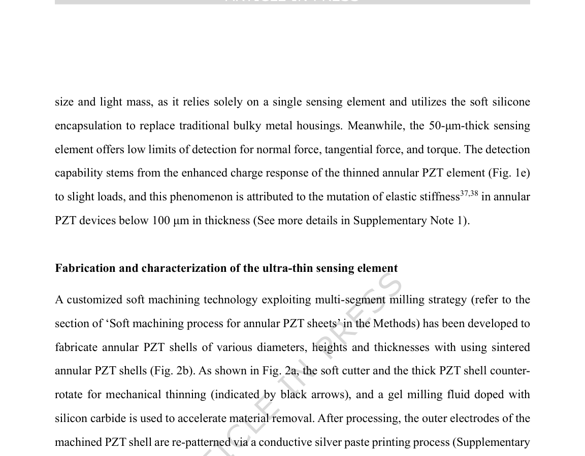

**Original caption:** Fig. S5a). The entire machining process involves three stages: rough machining, finish machining,

**中文图注:** Fig. S5A 原始图注已提取；逐项含义见下方分图说明。

**Reading note:** 结合正文首次引用位置和原始图注核对该图的证据角色。

### Fig. 2F

**Source:** p.6

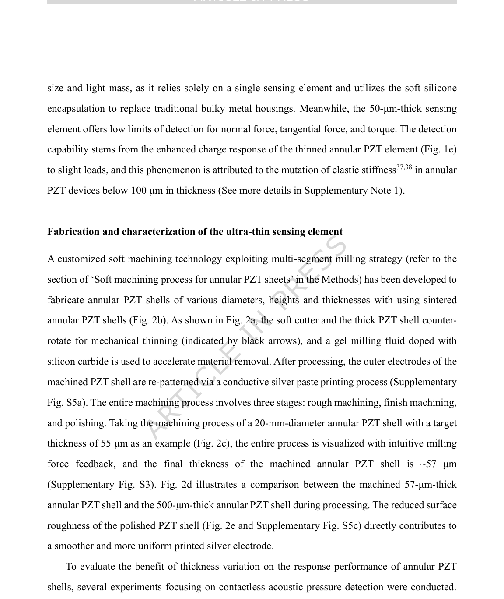

**Original caption:** Fig. 2f illustrates the experimental setup, where a sound level meter serves as the reference for

**中文图注:** Fig. 2F 原始图注已提取；逐项含义见下方分图说明。

**Reading note:** 结合正文首次引用位置和原始图注核对该图的证据角色。

### Fig. 3C

**Source:** p.7

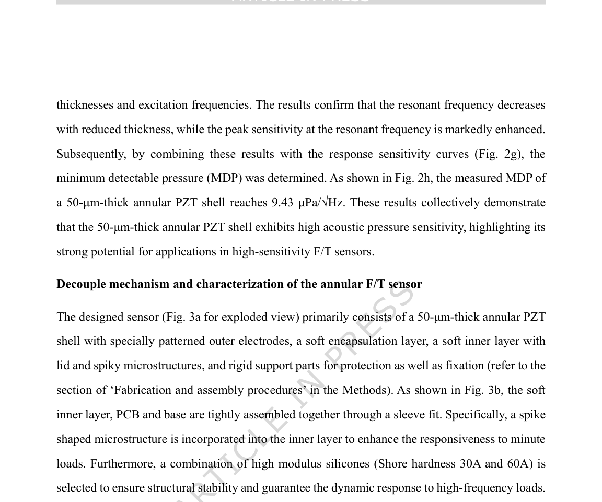

**Original caption:** Fig. 3c shows the fabricated F/T sensors (with its key performance indicators summarized in

**中文图注:** Fig. 3C 原始图注已提取；逐项含义见下方分图说明。

**Reading note:** 结合正文首次引用位置和原始图注核对该图的证据角色。

### Fig. 3E

**Source:** p.7

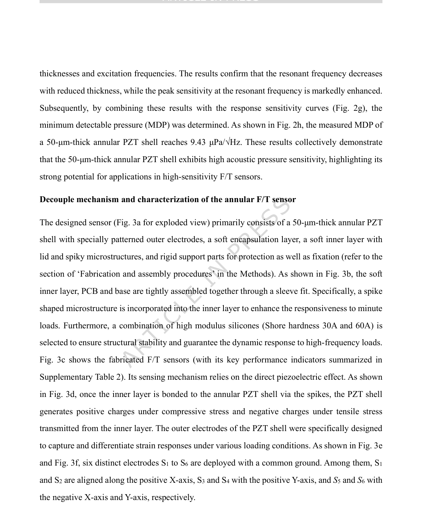

**Original caption:** Fig. 3e illustrates the simulated charge response of electrodes S1 to S4 under various loading

**中文图注:** Fig. 3E 原始图注已提取；逐项含义见下方分图说明。

**Reading note:** 重点查看标定方法、量程、误差、线性和动态响应，避免只比较单一灵敏度。

### Fig. S43

**Source:** p.11

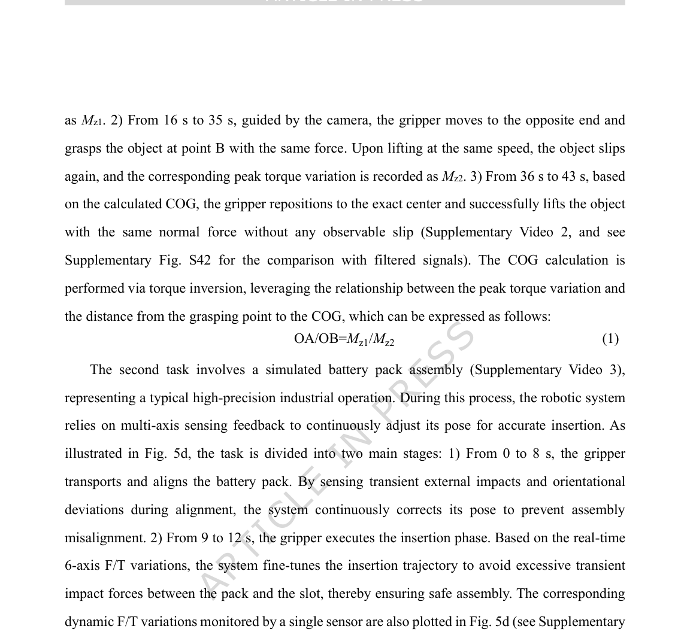

**Original caption:** Fig. S43 for the comparison with filtered signals). Overall, these results demonstrate that the

**中文图注:** Fig. S43 原始图注已提取；逐项含义见下方分图说明。

**Reading note:** 结合正文首次引用位置和原始图注核对该图的证据角色。

### Fig. 1

**Source:** p.29

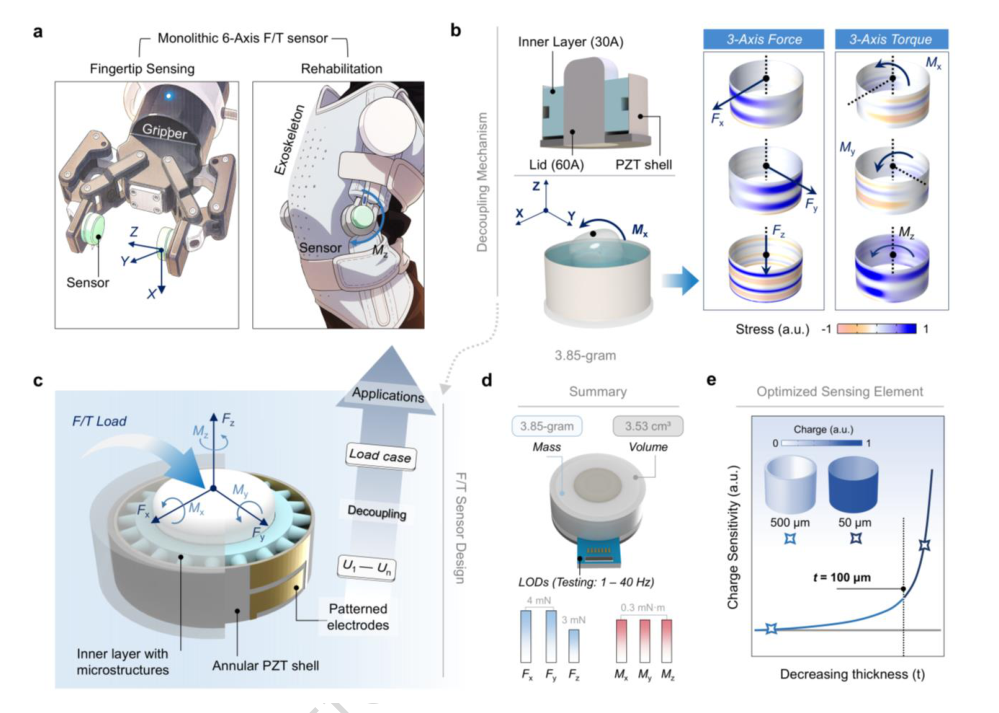

**Original caption:** Fig. 1. General concept of the monolithic 6-axis F/T sensor. (a) Demonstration of F/T sensors integrated

**中文图注:** Fig. 1 原始图注已提取；逐项含义见下方分图说明。

**Reading note:** 结合正文首次引用位置和原始图注核对该图的证据角色。

- (a) 结合正文首次引用位置和原始图注核对该图的证据角色。 原文：Demonstration of F/T sensors integrated

### Fig. 2

**Source:** p.30

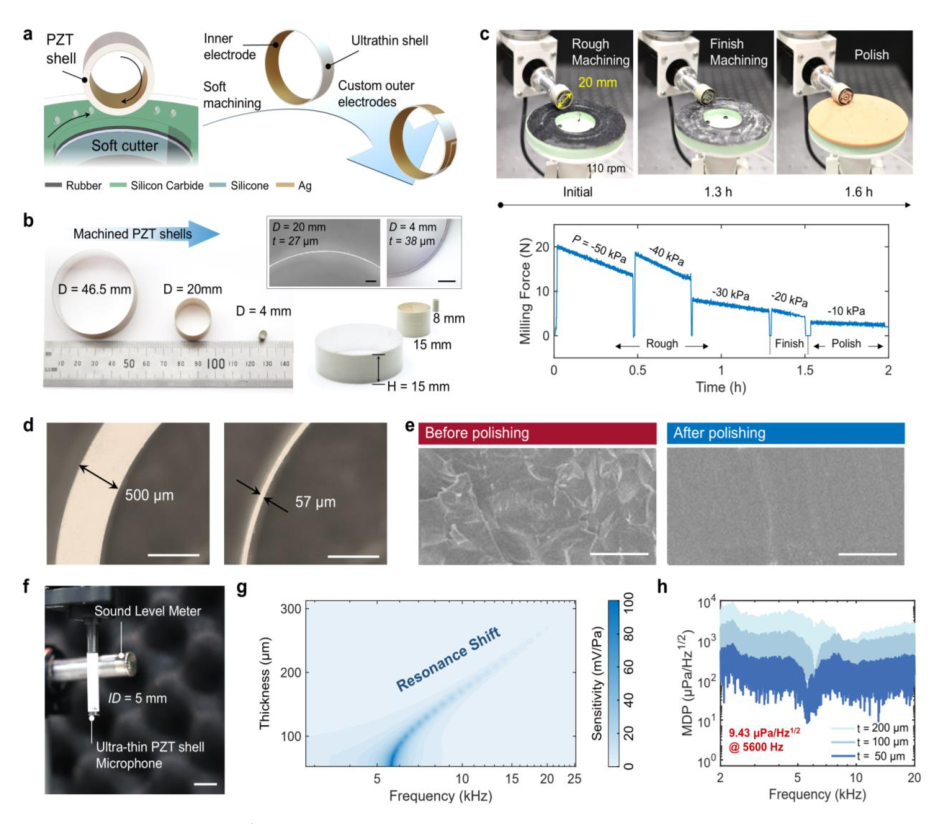

**Original caption:** Fig. 2. Processing and characterization of annular PZT shells. (a) Illustration of the PZT shell-forming

**中文图注:** Fig. 2 原始图注已提取；逐项含义见下方分图说明。

**Reading note:** 结合正文首次引用位置和原始图注核对该图的证据角色。

- (a) 结合正文首次引用位置和原始图注核对该图的证据角色。 原文：Illustration of the PZT shell-forming

### Fig. 3

**Source:** p.32

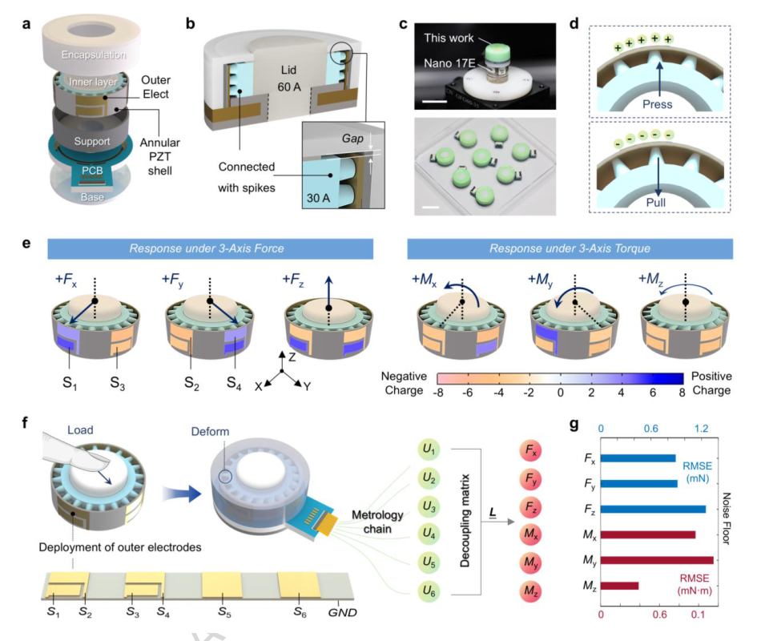

**Original caption:** Fig. 3. Design and load decoupling of the 6-axis F/T sensor. (a) Exploded view of the designed F/T sensor.

**中文图注:** Fig. 3 原始图注已提取；逐项含义见下方分图说明。

**Reading note:** 结合正文首次引用位置和原始图注核对该图的证据角色。

- (a) 结合正文首次引用位置和原始图注核对该图的证据角色。 原文：Exploded view of the designed F/T sensor

### Fig. 4

**Source:** p.33

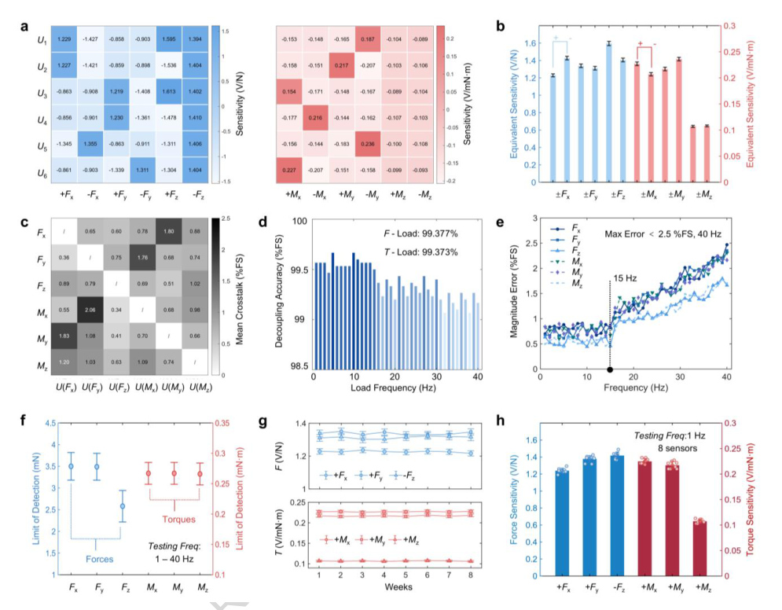

**Original caption:** Fig. 4. Characterization of the 6-axis F/T sensor. (a) Measured average response sensitivity of the sensor

**中文图注:** Fig. 4 原始图注已提取；逐项含义见下方分图说明。

**Reading note:** 重点查看标定方法、量程、误差、线性和动态响应，避免只比较单一灵敏度。

- (a) 重点查看标定方法、量程、误差、线性和动态响应，避免只比较单一灵敏度。 原文：Measured average response sensitivity of the sensor

### Fig. 5

**Source:** p.34

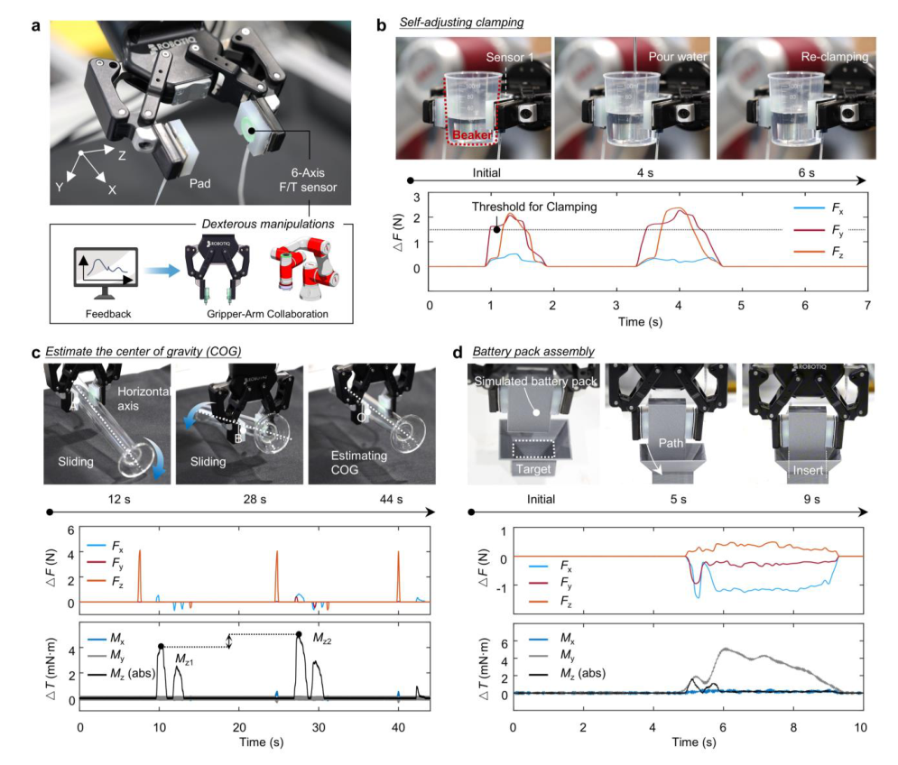

**Original caption:** Fig. 5. F/T sensors enabling dexterous robotic gripper-arm collaboration. (a) Photograph of a robotic

**中文图注:** Fig. 5 原始图注已提取；逐项含义见下方分图说明。

**Reading note:** 重点查看任务设置、基线、消融和失败案例，判断系统演示是否真正支撑前端价值。

- (a) 重点查看任务设置、基线、消融和失败案例，判断系统演示是否真正支撑前端价值。 原文：Photograph of a robotic

### Fig. 5A

**Source:** p.34

**Original caption:** Fig. 5a is created in BioRender. qu, J. (2026) https://BioRender.com/m87t8vp

**中文图注:** Fig. 5A 原始图注已提取；逐项含义见下方分图说明。

**Reading note:** 结合正文首次引用位置和原始图注核对该图的证据角色。

- (j) 结合正文首次引用位置和原始图注核对该图的证据角色。 原文：(2026) https://BioRender.com/m87t8vp

### Fig. 6

**Source:** p.35

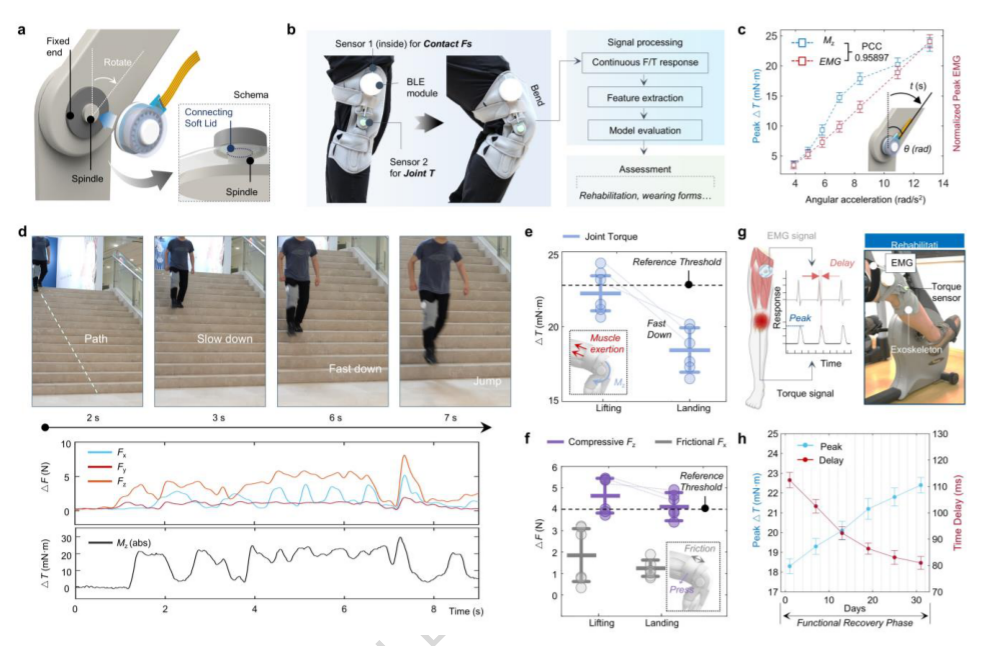

**Original caption:** Fig. 6. F/T sensors enabling intelligent exoskeletons for motion monitoring and functional assessment.

**中文图注:** Fig. 6 原始图注已提取；逐项含义见下方分图说明。

**Reading note:** 结合正文首次引用位置和原始图注核对该图的证据角色。
