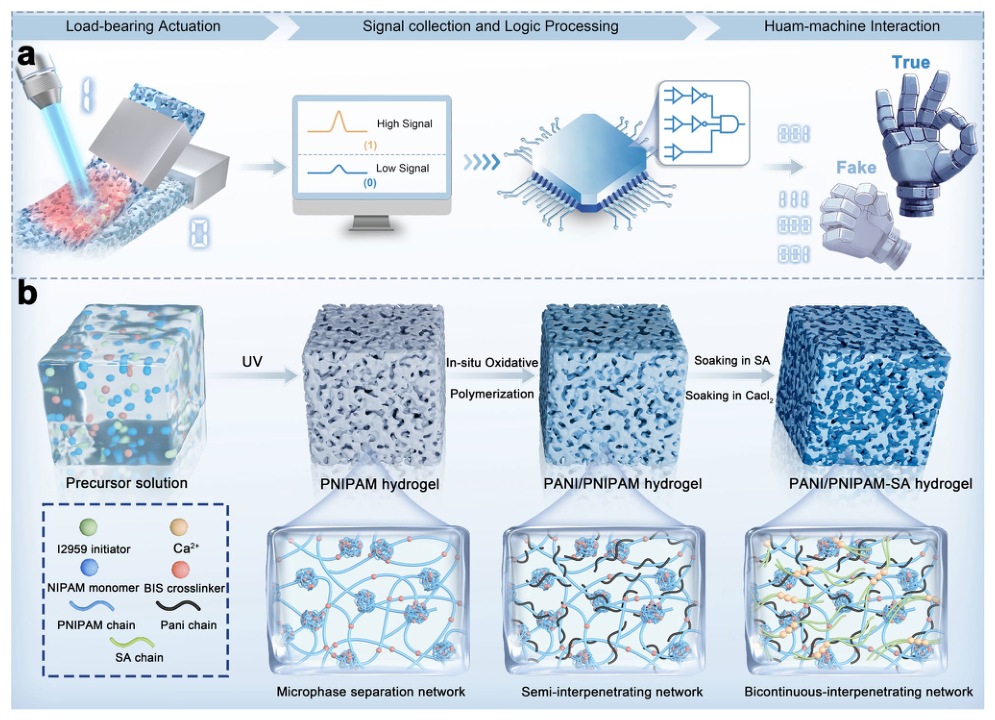
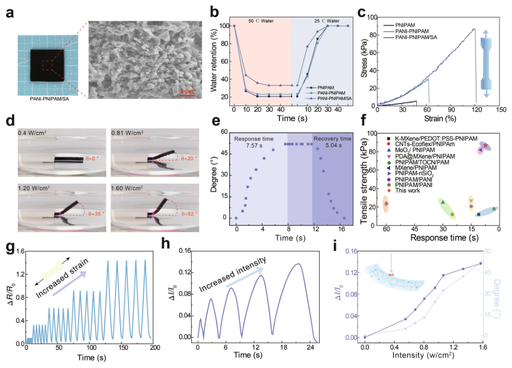
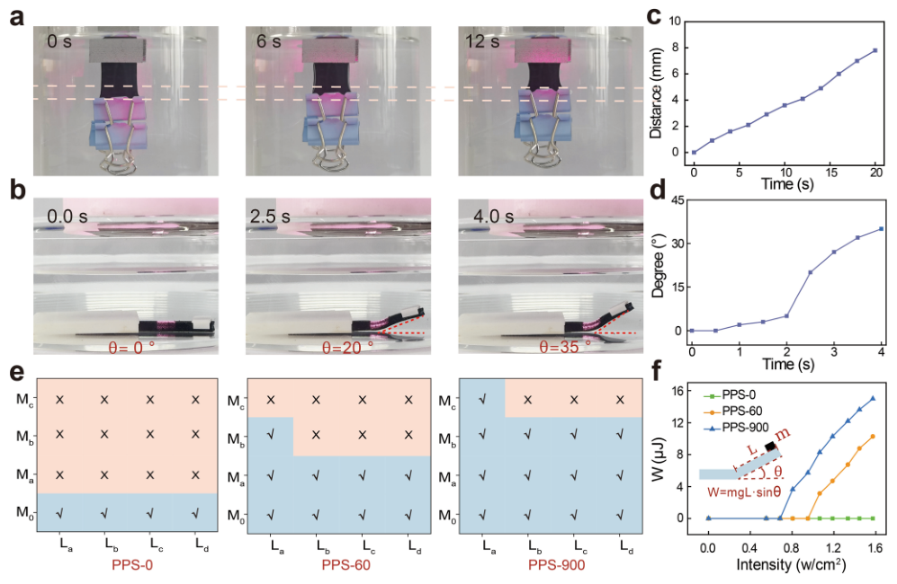
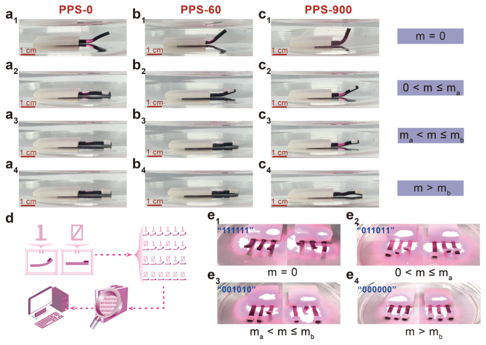
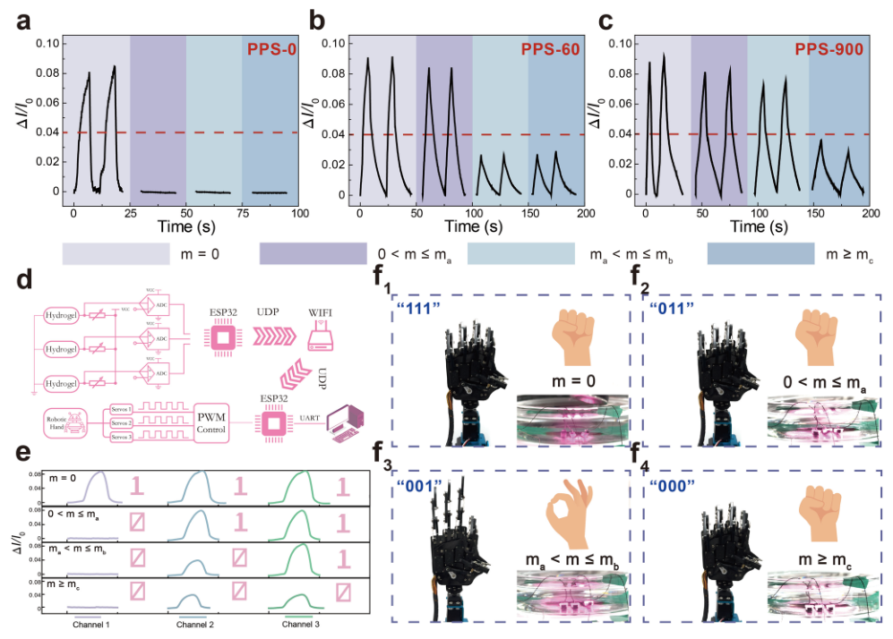

# High-Strength, Self-Sensing Multiphase Hydrogels for Load-Bearing Actuation and Logical Human–Machine Interaction

- 期刊：Nano-Micro Letters
- 日期：2026-07-23
- DOI：10.1007/s40820-026-02280-y
- 解析状态：fulltext_draft

## 摘要与研究价值

**Original:** Abstract Stimuli-responsive shape-changing hydrogels are the most competitive candidates for artificial muscles, electronic skins, and soft robotics. However, existing actuating hydrogels often suffer a trade-off between actuation performance and mechanical strength, which greatly limits their application prospects as actuators under external force loads. Here, we adopt a cascade polymerization strategy to successively introduce electrical sensing and mechanically enhanced polymer network phases into sponge-like PNIPAM hydrogels to achieve PNIPAM-based photothermal-responsive actuating hydrogels with fast response, high strength, and self-sensing performance. The as-prepared hydrogel actuator can execute rapid actuation missions even under external loading far exceeding its own mass and generate differentiated electrical sensing signals according to the magnitude of the external load. Based on the corresponding relationship between the mass of the load and the actuation behavior (such as "0/1" encoding), we develop a novel material-based binary information encoding system. Furthermore, by manufacturing logic gates to analyze differentiated feedback sensing signals and integrating them with Internet of Things technology, a closed-loop logic control system is established for remote logic-based interactive communication. This study fills the gap of traditional hydrogels in load-bearing actuation and complex interactive applications and opens up a new direction for the next generation of smart soft materials.

**中文:** 提供机器人、可穿戴或电子皮肤系统任务证据；涉及 in-sensor/物理计算或可编程触觉前端。当前未从摘要提取到可比较数值。

## 创新点

- Abstract Stimuli-responsive shape-changing hydrogels are the most competitive candidates for artificial muscles, electronic skins, and soft robotics.
- 提供机器人、可穿戴或电子皮肤系统任务证据
- 涉及 in-sensor/物理计算或可编程触觉前端

## 对当前课题的启发

- 提供机器人、可穿戴或电子皮肤系统任务证据
- 涉及 in-sensor/物理计算或可编程触觉前端
- 可对照 raw pixel、software feature 与 physical projection 的性能/通道/功耗

## 制备与实验步骤

### 1. 固化与热处理

**Source:** p.1

**Original:** • The cascade polymerization synergistic toughening mechanism overcomes the problem of mutual constraints between "mechanical ABSTRACT Stimuli-responsive shape-changing hydrogels are the most competitive candidates for artificial muscles, electronic skins, and soft robotics.

**中文:** 固化与热处理步骤，关键配比、时间、温度和设备参数以 p.1 原文为准。

### 2. 固化与热处理

**Source:** p.1

**Original:** Here, we adopt a cascade polymerization strategy to successively introduce electrical sensing and mechanically enhanced polymer network phases into sponge-like PNIPAM hydrogels to achieve PNIPAMbased photothermal-responsive actuating hydrogels with fast response, high strength, and self-sensing performance.

**中文:** 固化与热处理步骤，关键配比、时间、温度和设备参数以 p.1 原文为准。

### 3. 制备与实验操作

**Source:** p.1

**Original:** The as-prepared hydrogel actuator can execute rapid actuation missions even under external loading far exceeding its own mass and generate differentiated electrical sensing signals according to the magnitude of the external load.

**中文:** 制备与实验操作步骤，关键配比、时间、温度和设备参数以 p.1 原文为准。

### 4. 材料混合与分散

**Source:** p.2

**Original:** The aforementioned limitations stem from two fundamental issues: (1) the lack of mechanical robustness in single-network hydrogels, which restricts stress transmission [17] and (2) the absence of appropriate structural design to disperse stress resulting in failure under load [18, 19].

**中文:** 材料混合与分散步骤，关键配比、时间、温度和设备参数以 p.2 原文为准。

### 5. 固化与热处理

**Source:** p.2

**Original:** To achieve hydrogel actuators featuring load-bearing actuation, rapid stimuli-response, as well as intelligent self-sensing capability through the synergistic effect of network structure, we herein propose a cascade polymerization strategy to in situ oxidatively polymerize aniline (ANI) monomers as the electrical phase within sponge-like poly (N-isopropylacrylamide) (PNIPAM) hydrogels, which are then immersed in a sodium alginate (SA) solution to introduce short polymer chains as the mechanical reinforcement phase, forming a multi-scale synergistic network structure and fabricating a mechanically tunable high-strength self-sensing hydrogel actuator.

**中文:** 固化与热处理步骤，关键配比、时间、温度和设备参数以 p.2 原文为准。

### 6. 制备与实验操作

**Source:** p.2

**Original:** Benefiting from the highly interconnected spongy porous structure and the introduction of SA mechanical reinforcement phase, the as-prepared PANI-PNIPAM/SA (PPS) hydrogel not only shows rapid stimuli-response, but also features further improved mechanical strength, which enables the PPS actuator to achieve rapid actuation deformation even under loading of external force.

**中文:** 制备与实验操作步骤，关键配比、时间、温度和设备参数以 p.2 原文为准。

### 7. 组装与封装

**Source:** p.2

**Original:** Moreover, by logically analyzing the distinguishable feedback sensing signals and integrating with Internet of Things (IoT) technology, logical interactive communication between soft and rigid robotic systems was further constructed, enabling binary information transmission through human–machine collaboration (Fig. 1a).

**中文:** 组装与封装步骤，关键配比、时间、温度和设备参数以 p.2 原文为准。

### 8. 制备与实验操作

**Source:** p.3

**Original:** 2.2 Preparation of Sponge‑Like PNIPAM, PANI‑PNIPAM and PPS Hydrogel

**中文:** 制备与实验操作步骤，关键配比、时间、温度和设备参数以 p.3 原文为准。

### 9. 材料混合与分散

**Source:** p.3

**Original:** 2 g of NIPAM powder was dissolved in 8 mL deionized water, followed by vigorously stirred for 30 min to obtain a 20 wt% NIPAM monomer homogeneous solution.

**中文:** 材料混合与分散步骤，关键配比、时间、温度和设备参数以 p.3 原文为准。

### 10. 制备与实验操作

**Source:** p.3

**Original:** Then, 0.02 g BIS (2 mg mL−1) and initiator 2959 (I2959) (2 mg Fig. 1 Schematic diagram of the logical human–computer interaction application and fabrication procedure of the continuous-interpenetrating high-strength self-sensing hydrogel.

**中文:** 制备与实验操作步骤，关键配比、时间、温度和设备参数以 p.3 原文为准。

### 11. 材料混合与分散

**Source:** p.3

**Original:** b The PANI-PNIPAM/SA hydrogel actuator is prepared through a sequential cascade polymerization strategy combining microphase separation polymerization of PNIPAM, in situ oxidative polymerization of PANI, and Ca2+ induced crosslinking of SA mL−1) were added to the NIPAM solution under continuous stirring to obtain PNIPAM hydrogel precursor solution.

**中文:** 材料混合与分散步骤，关键配比、时间、温度和设备参数以 p.3 原文为准。

### 12. 图形化与结构成形

**Source:** p.3

**Original:** The aqueous solution with NIPAM monomer, BIS crosslinker and I2959 photo-initiator was cast into a special silicone mold (70 mm (length) × 70 mm (width) × 1 mm (thickness)) and exposed to UV light (365 nm, 2 W cm−2) at temperature above LCST for 30 min to form sponge-like PNIPAM hydrogel (abbreviated as S-PNIPAM).

**中文:** 图形化与结构成形步骤，关键配比、时间、温度和设备参数以 p.3 原文为准。

### 13. 制备与实验操作

**Source:** p.3

**Original:** For comparison, a control PNIPAM hydrogel sample was also prepared at room temperature (named as normal PNIPAM hydrogel, N-PNIPAM).

**中文:** 制备与实验操作步骤，关键配比、时间、温度和设备参数以 p.3 原文为准。

### 14. 固化与热处理

**Source:** p.4

**Original:** Water retention was calculated as WR = (Wt − Wd)/ (W0 − Wd) × 100%, where Wt is the mass at time t (at 50 °C or 25 °C), W0 is the mass at full swelling, and Wd is the dry mass.

**中文:** 固化与热处理步骤，关键配比、时间、温度和设备参数以 p.4 原文为准。

### 15. 固化与热处理

**Source:** p.4

**Original:** The PANI-PNIPAM hydrogels were prepared by in situ oxidative polymerization of aniline within the sponge-like PNIPAM hydrogels.

**中文:** 固化与热处理步骤，关键配比、时间、温度和设备参数以 p.4 原文为准。

### 16. 制备与实验操作

**Source:** p.4

**Original:** Subsequently, 10 mL of precooled hydrochloric acid (0.1 M) with 0.2 M APS was added into the above solution in an ice bath and react for 12 h to prepare PANI-PNIPAM hydrogel.

**中文:** 制备与实验操作步骤，关键配比、时间、温度和设备参数以 p.4 原文为准。

## 方法原文锚点

**Source:** p.1 M001

**Original:** • The cascade polymerization synergistic toughening mechanism overcomes the problem of mutual constraints between "mechanical

**中文:** 该段已进入结构化方法步骤；完整逐段翻译待智能体精读补齐。

**Source:** p.1 M002

**Original:** ABSTRACT Stimuli-responsive shape-changing hydrogels are the most competitive candidates for artificial muscles, electronic skins, and soft robotics. However, existing actuating hydrogels often suffer a trade-off between actuation performance and mechanical strength, which greatly limits their application prospects as actuators under external force loads. Here, we adopt a cascade polymerization strategy to successively introduce electrical sensing and mechanically enhanced polymer network phases into sponge-like PNIPAM hydrogels to achieve PNIPAMbased photothermal-responsive actuating hydrogels with fast response, high strength, and self-sensing performance. The as-prepared hydrogel actuator can execute rapid actuation missions even under external loading far exceeding its own mass and generate differentiated electrical sensing signals according to the magnitude of the external load. Based on the corresponding relationship between the mass of the load and the actuation behavior (such as "0/1" encoding), we develop a novel material-based binary information encoding system. Furthermore, by manufacturing logic gates to analyze differentiated feedback sensing signals and integrating them with Internet of Things technology, a closed-loop logic control system is established for remote logic-based interactive communication. This study fills the gap of traditional hydrogels in load-bearing actuation and complex interactive applications and opens up a new direction for the next generation of smart soft materials.

**中文:** 该段已进入结构化方法步骤；完整逐段翻译待智能体精读补齐。

**Source:** p.2 M003

**Original:** Shape-transformation soft actuators that can undergo reversible volume or shape changes in response to external stimuli (such as temperature, light, magnetic field, pH, or ionic strength [1–6]) have attracted broad interest in artificial muscles and biomimetic soft robots [7, 8]. Among all soft actuating materials, stimuli-responsive hydrogels are highly promising candidate materials for soft robotics due to their resemblance to biological tissues [9–11]. However, the intrinsic mechanical strength of traditional stimuli-responsive hydrogels is insufficient, rendering them susceptible to structural failure under external loads [12–14]. Meanwhile, the energy generated by volume contraction is often insufficient to overcome gravitational forces, particularly when lifting objects exceeding the hydrogel’s own mass [15, 16]. These limitations seriously restrict the actuation performance and application scenarios of stimuli-responsive hydrogel-based soft actuators, especially under external loads. The aforementioned limitations stem from two fundamental issues: (1) the lack of mechanical robustness in single-network hydrogels, which restricts stress transmission [17] and (2) the absence of appropriate structural design to disperse stress resulting in failure under load [18, 19]. Therefore, developing hydrogel actuators with adequate mechanical strength is highly desirable especially aiming to load-bearing actuation tasks under complicated external force environment.

**中文:** 该段已进入结构化方法步骤；完整逐段翻译待智能体精读补齐。

**Source:** p.2 M004

**Original:** To achieve hydrogel actuators featuring load-bearing actuation, rapid stimuli-response, as well as intelligent self-sensing capability through the synergistic effect of network structure, we herein propose a cascade polymerization strategy to in situ oxidatively polymerize aniline (ANI) monomers as the electrical phase within sponge-like poly (N-isopropylacrylamide) (PNIPAM) hydrogels, which are then immersed in a sodium alginate (SA) solution to introduce short polymer chains as the mechanical reinforcement phase, forming a multi-scale synergistic network structure and fabricating a mechanically tunable high-strength self-sensing hydrogel actuator. Benefiting from the highly interconnected spongy porous structure and the introduction of SA mechanical reinforcement phase, the as-prepared PANI-PNIPAM/SA (PPS) hydrogel not only shows rapid stimuli-response, but also features further improved mechanical strength, which enables the PPS actuator to achieve rapid actuation deformation even under loading of external force. Meanwhile, the continuous conductive pathways formed by the embedded PANI network also endows the PPS hydrogel with remarkable sensing capabilities to generate distinguishable electrical feedback sensing signals according to actuation behavior under different external force. Together with all these synergistic characteristics, a novel material-based binary information encoding system was established based on the actuation behavior of the PPS actuators under different external loads (“0” for contraction and “1” for inflection). Moreover, by logically analyzing the distinguishable feedback sensing signals and integrating with Internet of Things (IoT) technology, logical interactive communication between soft and rigid robotic systems was further constructed, enabling binary information transmission through human–machine collaboration (Fig. 1a). Notably, this study achieves synergistic integration of high strength, rapid response, and intelligent perception through material

**中文:** 该段已进入结构化方法步骤；完整逐段翻译待智能体精读补齐。

**Source:** p.3 M005

**Original:** 2.2 Preparation of Sponge‑Like PNIPAM, PANI‑PNIPAM and PPS Hydrogel

**中文:** 该段已进入结构化方法步骤；完整逐段翻译待智能体精读补齐。

**Source:** p.3 M006

**Original:** 2 g of NIPAM powder was dissolved in 8 mL deionized water, followed by vigorously stirred for 30 min to obtain a 20 wt% NIPAM monomer homogeneous solution. Then, 0.02 g BIS (2 mg mL−1) and initiator 2959 (I2959) (2 mg

**中文:** 该段已进入结构化方法步骤；完整逐段翻译待智能体精读补齐。

**Source:** p.3 M007

**Original:** Fig. 1 Schematic diagram of the logical human–computer interaction application and fabrication procedure of the continuous-interpenetrating high-strength self-sensing hydrogel. a Human–computer interaction through logical analysis of hydrogel’s actuation behavior and feedback sensing signals under load state. b The PANI-PNIPAM/SA hydrogel actuator is prepared through a sequential cascade polymerization strategy combining microphase separation polymerization of PNIPAM, in situ oxidative polymerization of PANI, and Ca2+ induced crosslinking of SA

**中文:** 该段已进入结构化方法步骤；完整逐段翻译待智能体精读补齐。

**Source:** p.4 M008

**Original:** mL−1) were added to the NIPAM solution under continuous stirring to obtain PNIPAM hydrogel precursor solution. Subsequently, the aqueous solution was bubbled with N2 for 15 min to remove the air in water. The aqueous solution with NIPAM monomer, BIS crosslinker and I2959 photo-initiator was cast into a special silicone mold (70 mm (length) × 70 mm (width) × 1 mm (thickness)) and exposed to UV light (365 nm, 2 W cm−2) at temperature above LCST for 30 min to form sponge-like PNIPAM hydrogel (abbreviated as S-PNIPAM). Finally, the sponge-like PNIPAM hydrogel was immersed in deionized water for 24 h to wash out the unreacted monomer, during which the deionized water was exchanged at least three times. For comparison, a control PNIPAM hydrogel sample was also prepared at room temperature (named as normal PNIPAM hydrogel, N-PNIPAM).

**中文:** 该段已进入结构化方法步骤；完整逐段翻译待智能体精读补齐。

**Source:** p.4 M009

**Original:** an IR spectrophotometer (Bruker VERTEX70) in the scanning range of 4000–400 cm−1, the samples were obtained by a KBr disk technique. Mechanical performance tests were performed using a universal testing machine (ZQ990LB, ZHIQU Precision Instrument) at room temperature on hydrogel specimens (25 mm × 2 mm × 1 mm) at a tensile speed of 50 mm min⁻1. The LCR electrical signal changes of the PPS hydrogel under tensile deformation and near-infrared stimulation were recorded using an LCR meter (Tonghui, TH2829C). Photothermal bending tests were conducted on hydrogel strips (20 mm × 2 mm × 1 mm) fixed at one end in a container and irradiated at the midpoint with an NIR laser; the underwater deformation was recorded in real time using an iPhone and tuned by varying the NIR intensity. Swelling/deswelling kinetics were evaluated in 50 °C and 25 °C water baths by periodically removing the hydrogel, blotting the surface, and recording its mass. Water retention was calculated as WR = (Wt − Wd)/ (W0 − Wd) × 100%, where Wt is the mass at time t (at 50 °C or 25 °C), W0 is the mass at full swelling, and Wd is the dry mass. To quantitatively characterize the displacement evolution and bending dynamics under external load constraints, vertical lifting and eccentric-load bending tests were performed using hydrogel samples with geometrical shape of 70 mm × 15 mm × 1 mm and 20 mm × 2 mm × 1 mm, respectively.

**中文:** 该段已进入结构化方法步骤；完整逐段翻译待智能体精读补齐。

**Source:** p.4 M010

**Original:** The PANI-PNIPAM hydrogels were prepared by in situ oxidative polymerization of aniline within the sponge-like PNIPAM hydrogels. Firstly, the fully swollen PNIPAM hydrogel was freeze-dried to remove the water in the matrix. Then, it was soaked in 10 mL hydrochloric acid solution (0.1 M) with 0.2 M aniline monomer, fully swelled for 6 h to make the aniline monomer evenly distributed in the PNIPAM hydrogel matrix. Subsequently, 10 mL of precooled hydrochloric acid (0.1 M) with 0.2 M APS was added into the above solution in an ice bath and react for 12 h to prepare PANI-PNIPAM hydrogel. Finally, the PANI-PNIPAM hydrogel was washed with deionized water to remove unreacted reagents and free ions.

**中文:** 该段已进入结构化方法步骤；完整逐段翻译待智能体精读补齐。

**Source:** p.4 M011

**Original:** 3.1 Preparation of the PANI‑PNIPAM/SA (PPS) Actuating Hydrogel

**中文:** 该段已进入结构化方法步骤；完整逐段翻译待智能体精读补齐。

**Source:** p.4 M012

**Original:** PANI-PNIPAM/SA hydrogel was prepared by soaking PANI-PNIPAM in sodium alginate solution (0.6 wt%) for 24 h, and then soaking it in calcium chloride solution (1 M) for a certain time to crosslink sodium alginate. Similarly, the performance of PANI-PNIPAM/SA hydrogel could be adjusted by changing the concentration of sodium alginate solution and the immersion time in calcium chloride solution. Unless otherwise specified, samples soaked in 0.6 wt% sodium alginate solution for 24 h and crosslinked within calcium chloride solution for 900 s will be used for subsequent testing.

**中文:** 该段已进入结构化方法步骤；完整逐段翻译待智能体精读补齐。

**Source:** p.4 M013

**Original:** The PANI-PNIPAM/SA (PPS) actuating hydrogel was prepared through a sequential cascade polymerization strategy including microphase separation polymerization of PNIPAM, in situ oxidative polymerization of PANI, and Ca2+-induced crosslinking of SA (Fig. 1b). The thermoresponsive PNIPAM hydrogel matrix with highly interconnected spongy porous structure was initially synthesized via temperatureinduced microphase separation polymerization [34–36]. During polymerization at elevated temperatures (T > LCST), polymerized PNIPAM chains undergo hydrophobic collapse, driving the formation of dense polymer clusters within the loose network. This phase separation mechanism creates

**中文:** 该段已进入结构化方法步骤；完整逐段翻译待智能体精读补齐。

**Source:** p.5 M014

**Original:** interconnected, sponge-like micropores, which facilitate efficient water migration across the hydrogel matrix, playing an important role for rapid actuation response. Notably, while the high crosslinking density enhances mechanical robustness, the denser network structure greatly influences its thermoresponsive deswelling behavior at temperatures above LCST (Fig. S1). Subsequently, PANI was in situ polymerized within the sponge-like PNIPAM matrix, where its conductive chains anchored to hydrophobic domains via π–π stacking, mimicking the neural network in muscle tissue to achieve self-sensing feature based on the chain migration during actuation deformation. Meanwhile, the highly efficient light-to-heat conversion of PANI also endows the hydrogel actuator with rapid photothermal-responsiveness. After the introduction of conductive PANI, the composite hydrogel was then infiltrated with short-chain SA based on hydrogenbond interactions with both PNIPAM and PANI to predefine crosslinking sites. Finally, selective Ca2+ coordination with SA carboxylate groups formed a dynamic “egg-box” ionic network, which synergistically reinforced mechanical integrity with little influence on responsiveness (Fig. S2). Fourier transform infrared (FTIR) spectra of the hydrogel matrix at different synthesis stages further indicate the successful introduction of PANI and Ca2+-crosslinked SA components within the PSS hydrogel matrix after the sequential cascade polymerization (Fig. S3). Notably, the Ca signal in the XPS survey spectrum and the characteristic Ca2+ peaks in the high-resolution Ca 2p spectrum support the formation of Ca2+-mediated ionic coordination/crosslinking in the PSS network (Fig. S4). Moreover, SEM–EDS elemental mapping (Fig. S5) reveals that both Cl and Ca are homogeneously distributed throughout the hydrogel framework. Considering that Cl originates from the HCl-doped PANI phase and Ca from the SA/Ca2+-crosslinked phase, these results indicate that the different functional components are integrated across the entire porous network, supporting the formation of a continuous-interpenetrating multiphase structure in the PPS hydrogel.

**中文:** 该段已进入结构化方法步骤；完整逐段翻译待智能体精读补齐。

**Source:** p.5 M015

**Original:** remain abundant spongy open-celled pores within the hydrogel matrix, even after the introduction of PANI and SA, enabling rapid thermoresponsiveness deswelling and reswelling at different temperature (Fig. S6). The deswelling and swelling kinetics behaviors of S-PNIPAM, PANIPNIPAM (PP), and PPS hydrogels were compared as shown in Fig. 2b. All the hydrogels reached deswelling equilibrium in ~ 20 s with barely slight decrease of deswelling ratio (from ~ 80% to ~ 70%) upon transferring hydrogels from 25 to 50 °C, and reabsorbed water rapidly to achieve swelling equilibrium in ~ 30 s when decreasing the temperature to 25 °C. It is worthy to note that the rapid response rate is mainly attributed to the sponge-like open-pore structure within the spongy hydrogel matrix. Despite N2 adsorption–desorption measurements (Fig. S7) revealed that the accessible porosity gradually decreased from PNIPAM to PP and then to PPS, indicating progressive pore contraction after PANI polymerization and subsequent SA/Ca2+ crosslinking, which also induced a corresponding decrease in the equilibrium swelling ratio of the hydrogels (Fig. S8). Compared with the normal PNIPAM hydrogel (N-PNIPAM) with a relatively closed-cell structure, the as-prepared PPS hydrogel still maintain an open and interconnected porous network similar as that of the sponge-like PNIPAM hydrogel (S-PNIPAM) (Fig. S9), which is more favorable for rapid water transport during the thermal-responsive swelling/ deswelling process. As a result, the incorporation of conductive PANI and the secondary Ca2+-crosslinked SA network has negligible impact on the response rate. Meanwhile, the Ca2+-crosslinked alginate network introduces further reversible and dynamic crosslinking sites, resulting in dramatical improvement on the mechanical property of the PPS hydrogel. As shown in the uniaxial tensile tests of hydrogels at different synthesis stages: pure PNIPAM, PP, and PPS (Figs. 2c and S10), the tensile strength increased from 5.56 kPa (pure PNIPAM) to 30.89 kPa (PP) and further to 86.83 kPa (PPS), while Young’s modulus rose from 4.85 kPa (pure PNIPAM) to 23.82 kPa (PP) and 27.61 kPa (PPS). Rheological tests revealed that all hydrogels exhibited typical viscoelastic behavior, with G′′ consistently higher than G′. Relative to PNIPAM, the PP hydrogel displayed enhanced moduli owing to the reinforcing effect of in situ polymerized polyaniline, while the incorporation of sodium alginate together with Ca2+-induced ionic crosslinking further strengthened the PPS network (Fig. S10). The PPS hydrogel exhibited greatly

**中文:** 该段已进入结构化方法步骤；完整逐段翻译待智能体精读补齐。

**Source:** p.6 M016

**Original:** Fig. 2 Morphology and basic characteristics of the PPS hydrogel. a Optical (left) and SEM images (right) of PPS hydrogel. b Deswelling kinetics and Swelling kinetics. c Strain – stress curves of hydrogels at different stages of material preparation. i.e., PNIPAM, PANI-PNIPAM (PP) and PANI-PNIPAM/SA (PPS). d Optical image of the flectional PPS hydrogel soft actuator under NIR irradiation with different intensities. e The real-time bending angle of PPS hydrogel actuator under 1.6 W/cm2 NIR irradiation indicates its response rate and recovery rate. f Comparison chart by plotting the tensile strength and response time of homogeneous PNIPAM-based hydrogel actuators. g Sensing signal of PPS hydrogel stretched with strains ranging from 10 to 100% (10%, 30%, 50%, 70%, and 100% strain, respectively). h Real-time electrical sensing signal of PPS hydrogel actuator during intermittently switching on/off the NIR laser with different intensities. i Bending angle and electrical signal of PPS hydrogel actuator

**中文:** 该段已进入结构化方法步骤；完整逐段翻译待智能体精读补齐。

**Source:** p.6 M017

**Original:** (SA) microphase interface absorbs energy through dynamic bond dissociation under stress, while SA’s ionic crosslinking maintains network stability. (3) Multiscale toughening: SA short chains create localized Ca2+-crosslinked zones within the PNIPAM network, restricting chain slippage via physical entanglement and ionic interactions, thereby reducing irreversible deformation. Crucially, the material stiffnesstoughness balance of the PPS composite hydrogel shows significant relationship with the Ca2+-crosslinking density, which can be precisely controlled by immersion duration in CaCl2 solution (Fig. S13).

**中文:** 该段已进入结构化方法步骤；完整逐段翻译待智能体精读补齐。

**Source:** p.6 M018

**Original:** improved flexibility and high strength, enduring diverse mechanical deformations—including folding, rolling, stretching, and load-bearing (exceeding 2500 times its own weight, Fig. S12). In contrast, the pure PNIPAM hydrogels failed under high mechanical loads due to inferior strength. This enhancement is mainly attributed to three multi-scale synergy effect: (1) Dual-network synergy: The covalent PNIPAM network constrains large deformations, while the SA-Ca2+ dynamic network dissipates energy via reversible “egg-box” bond (-COO⁻/Ca2+) rupture-reformation, mitigating stress concentration. (2) Microphase interface reinforcement: Hydrogen bonding (e.g., -NH of PNIPAM with -OH/- COOH of SA) at the hydrophobic (PNIPAM)-hydrophilic

**中文:** 该段已进入结构化方法步骤；完整逐段翻译待智能体精读补齐。

**Source:** p.7 M019

**Original:** conversion, the prepared PPS hydrogel also exhibits excellent photothermal-responsiveness. In contrast to pure PNIPAM hydrogel, owing to the efficient NIR absorption of PANI, the surface temperature of PP and PPS hydrogels reaches PNIPAM’s phase transition temperature rapidly within only 10 s under 1.6 W cm−2 NIR irradiation (Figs. S14 and 15), triggering volume contraction (Figure S16). Meanwhile, the surface temperature of PPS hydrogels could be precisely and reversibly tuned by modulating the NIR intensity (Fig. S17). Leveraging the exceptional photothermal conversion capability, the PPS hydrogel also exhibits tunable photothermal-responsive actuation behaviors. A rectangular hydrogel strip (20 mm (length) × 1 mm (width) × 1 mm (thickness)) was anchored at one end to the substrate as a flectional soft actuator. Upon localized nearinfrared (NIR) laser irradiation, the asymmetric temperature gradient across the hydrogel induced by localized irradiation will result in anisotropic contraction of the hydrogel, thus further inducing phototropic bending (Movie S1). Crucially, since the local temperature is highly dependent on the irradiation intensity of the NIR laser, the deformation magnitude can be precisely modulated by adjusting the NIR laser intensity (Fig. 2d). At NIR power densities below 0.4 W cm−2, insufficient heat generation prevents the PNIPAM network from reaching its phase transition temperature, resulting in negligible bending. Increasing the intensity beyond 0.8 W cm−2 elevates the localized temperature above the LCST, driving contraction-dependent bending. By tuning the NIR power density between 0.4 and 1.6 W cm−2, the bending angle could be controllably adjusted within 0°–52°, and gravitational potential energy analysis (classical mechanical formulation) revealed a maximum energy gain of 0.588 μJ (Fig. S18). Furthermore, the PPS actuator exhibited fast photothermal response, achieving maximum bending in 7.57 s under NIR irradiation (1.6 W cm−2) and recovering to its original state within 5.04 s post-irradiation (Fig. 2e) with excellent cyclic stability over 50 on/off cycles (Fig. S19). This rapid kinetics is attributed to the sponge-like porous framework enabling efficient water migration as well as the high photothermal efficiency of the interpenetrating PANI network. These results demonstrate that the PPS hydrogel synergizes exceptional mechanical properties with rapid responsivity, outperforming conventional homogeneous PNIPAM-based hydrogels (Fig. 2f and Table S1).

**中文:** 该段已进入结构化方法步骤；完整逐段翻译待智能体精读补齐。

**Source:** p.7 M020

**Original:** Given that the composite PPS hydrogel exhibits markedly enhanced mechanical performance compared with pure PNIPAM hydrogel, we further evaluated its load-bearing actuation performance under two representative loading conditions. Specifically, vertical lifting and eccentric-load bending were employed to quantitatively characterize the displacement evolution and bending dynamics under external load constraints (Fig. 3a, b). Under NIR irradiation (1.6 W cm−2), the soft robot can lift object 300 × its dry weight, with the lifting height increasing monotonically and reaching ~ 8 mm within ~ 20 s (Fig. 3c and Movie S2). When the weight was applied in an eccentric-load configuration, the hydrogel likewise maintained rapid bending output, with the bending angle increasing from 0° to ~ 35° within ~ 4 s and quickly approaching a steady state (Fig. 3d), indicating that effective deformation and mechanical output are retained under the coupled constraints of gravity and external loading.

**中文:** 该段已进入结构化方法步骤；完整逐段翻译待智能体精读补齐。

**Source:** p.8 M021

**Original:** Fig. 3 Load-bearing photothermal actuation and energy output of PPS hydrogel actuators. a Photographs showing the PPS actuator lifting a suspended object (300 × its dry weight) under NIR irradiation (0, 6, and 12 s). b Photographs of NIR-triggered bending PPS actuator under eccentric-load configuration (0, 2.5, and 4.0 s). c Corresponding lifting displacement (distance) as a function of time during the load-bearing lifting actuation. d Corresponding bending angle versus time during the bending actuation under eccentric-load configuration. e Actuation state phase diagrams constructed by systematically varying the payload mass m (ma = 0.3 g, mb = 0.6 g, mc = 1.0 g) and lever arm L (relative to the hydrogel center, La = 1.5 mm, Lb = 2.5 mm, Lc = 3.5 mm, Ld = 5 mm), with the external torque defined as τ = mgL (√, actuated; × , non-actuated). f Mechanical energy output W of PPS-0, PPS-60, and PPS-900 under an identical loading configuration (fixed m and L) as a function of NIR power density; W was calculated from the experimentally measured lifting height (Δh) based on the equation of W = mgΔh

**中文:** 该段已进入结构化方法步骤；完整逐段翻译待智能体精读补齐。

**Source:** p.8 M022

**Original:** reinforcement effect by Ca2+-crosslinked alginate network. Therefore, through adjusting the immersion duration in CaCl2 solution (1 M) to regulate the crosslinking density of the alginate network, it is possible to adjust the load-bearing photothermal actuation capacity of the PPS hydrogel actuator. To achieve this, three different hydrogel variants—PPS-0 (un-crosslinked SA), PPS-60 (partially crosslinked SA), and PPS-900 (fully crosslinked SA)—were fabricated through crosslinking the PPS hydrogel in CaCl₂ solution for different immersion duration (0, 60, and 900 s, respectively). With increasing immersion time, the crosslinking density and mechanical strength of the PPS hydrogels progressively increased. Subsequently, we adopted the torque, τ = mgL, as

**中文:** 该段已进入结构化方法步骤；完整逐段翻译待智能体精读补齐。

**Source:** p.9 M023

**Original:** binary information encoding system (Fig. 4d and Movie S4) that leverages the load-dependent actuation behavior of the photothermal-responsive PPS hydrogel actuators, encoded as binary states ("0" or "1"), distinct from conventional electronic or optical information processing methods. Under NIR laser irradiation, hydrogels with tailored mechanical properties exhibit differential phototropic bending behaviors depending on applied load mass: a “1” is assigned if bending occurs, whereas “0” denotes the absence of bending. A sixunit PPS hydrogel actuator array was engineered to function as a logic-based binary encoding system (Fig. S25), generating dynamic binary codes under varying load conditions. For instance: Load = 0: Code “111,111”; Load = ma (0.3 g): Code “011011”; Load = mb (0.6 g): Code “001010”; Load = mc (1.0 g): Code “000000” (Fig. 4e1–e4). Here, the predefined binary pattern “001010” serves as a target encoded output, while the load mass functions as a stimulus parameter, where only a specific load condition (e.g., mb) generates the corresponding binary sequence. Furthermore, reconfiguring the array’s spatial arrangement enables the generation of higher complexity binary patterns for advanced information encoding. This approach uniquely integrates mechanical load as a physical encoding variable, providing a material-based strategy for stimulus-dependent binary information generation beyond conventional electronic systems.

**中文:** 该段已进入结构化方法步骤；完整逐段翻译待智能体精读补齐。

**Source:** p.9 M024

**Original:** Since the PPS hydrogels with different crosslinking densities in the alginate network exhibit distinguishable loadbearing actuation capacities, it is possible to construct a novel material-based binary information encoding system by integrating PPS hydrogel actuators with different loadbearing actuation capacities. As shown in Fig. 4a-c, three different PPS hydrogel actuators exhibit different photothermal actuation behaviors (Under NIR irradiation, 1.6 W cm−2) upon gradually increasing the external load (Movie S3). The PPS-0 actuator, which exhibits inferior mechanical properties, can only execute bending actuation under nonload condition, and lose bending actuation capacity under any applied load owing to insufficient energy to overcome gravitational forces (Fig. 4a1–a4). The PPS-60 actuator with moderate mechanical properties demonstrates partial load tolerance: Bending occurs at loads ≤ ma (0.3 g) but fails at higher loads (Fig. 4b1–b4). Remarkably, owing to the reinforced mechanical properties, the PPS-900 actuator can lift masses up to ~ 0.6 g (mb, 30 × its dry weight) with obvious bending actuation behavior, featuring robust load-bearing actuation capacity (Fig. 4c1–c4). Capitalizing on this intriguing phenomenon, we developed a novel material-based

**中文:** 该段已进入结构化方法步骤；完整逐段翻译待智能体精读补齐。

**Source:** p.11 M025

**Original:** Fig. 5 Self-sensing performance and human–computer interaction application of mechanically adjustable PPS hydrogel under load. Real-time electrical signals of the a PPS-0, b PPS-60 and c PPS-900 hydrogel actuator during actuation under varying mass loads. d Schematic diagram of the human–machine interaction logic. e Real-time electrical signals and the decoded binary sequence of the hydrogel actuator array assembled in the order PPS-0, PPS-60, and PPS-900 when actuating under different external loads. f1–f4 The self-sensing actuator array loaded with different masses exhibit distinct behaviors under NIR stimulation, generating unique binary codes, which are then recognized by the robotic arm to perform corresponding gestures

**中文:** 该段已进入结构化方法步骤；完整逐段翻译待智能体精读补齐。

**Source:** p.12 M026

**Original:** We demonstrate a cascade polymerization strategy to construct a high-strength, fast response, mechanically tunable, self-sensing PPS hydrogel actuator, which is further developed for load-bearing actuation, binary information processing, and soft–rigid robotic logical interaction applications. Thanks to its markedly improved mechanical performance, the PPS hydrogel exhibits greatly enhanced load-bearing actuation capacity, achieving rapid vertical lifting and eccentric-load bending actuations under loading conditions far exceeding its own mass without structural failure. Critically, the loadbearing actuation capacity, resulting from the crosslinking reinforcement of the mechanical properties, can be precisely modulated by adjusting the CaCl₂ immersion time, and a novel material-based information processing system was established by leveraging the distinguished load-dependent actuation behavior of PPS hydrogel actuators. Meanwhile, the incorporation of polyaniline (PANI) established continuous conductive pathways, endowing the PPS hydrogel with remarkable dual strain- and actuation-sensing capabilities with high sensitivity. Benefiting from the differentiable feedback electrical signals corresponding to the actuation mode (bending/unbending) of the PPS hydrogel actuator, integration with Internet of Things (IoT) technology further enabled the development of a closed-loop logical interactive control system, seamlessly linking NIR laser generators, intelligent selfsensing actuators, and an interactive robotic hand. This system pioneers a bioinspired paradigm where mechanical load acts as a physical control parameter, bridging soft material

**中文:** 该段已进入结构化方法步骤；完整逐段翻译待智能体精读补齐。

**Source:** p.13 M027

**Original:** stretchability, ultralow-hysteresis conductingpolymer hydrogel strain sensors for soft machines. Adv. Mater. 34(32), e2203650 (2022). https://​doi.​org/​10.​1002/​adma.​20220​3650 8. W. Yu, W. Zhao, X. Zhu, M. Li, X. Yi et al., Laser-printed all-

**中文:** 该段已进入结构化方法步骤；完整逐段翻译待智能体精读补齐。

**Source:** p.13 M028

**Original:** ing of chain rigidity and hydrogen bond cross-linking toward ultra-strong, healable, recyclable, and water-resistant elastomers. Adv. Mater. 35(21), e2300286 (2023). https://​doi.​org/​ 10.​1002/​adma.​20230​0286 15. C.-Y. Lo, Y. Zhao, C. Kim, Y. Alsaid, R. Khodambashi et al.,

**中文:** 该段已进入结构化方法步骤；完整逐段翻译待智能体精读补齐。

**Source:** p.14 M029

**Original:** ant bioelectronic interfaces through fatigue-resistant conducting polymer hydrogel coating. Adv. Mater. 35(40), e2304095 (2023). https://​doi.​org/​10.​1002/​adma.​20230​4095 30. P. Zhang, I.M. Lei, G. Chen, J. Lin, X. Chen et al., Integrated

**中文:** 该段已进入结构化方法步骤；完整逐段翻译待智能体精读补齐。

**Source:** p.14 M030

**Original:** 3d printing of flexible electroluminescent devices and soft robots. Nat. Commun. 13(1), 4775 (2022). https://​doi.​org/​10.​ 1038/​s41467-​022-​32126-1 31. H. Kim, S.-k Ahn, D.M. Mackie, J. Kwon, S.H. Kim et al.,

**中文:** 该段已进入结构化方法步骤；完整逐段翻译待智能体精读补齐。

**Source:** p.14 M031

**Original:** ence of shrinking kinetics of poly(N-isopropylacrylamide) gels on preparation temperature. Polymer 43(10), 3101–3107 (2002). https://​doi.​org/​10.​1016/​S0032-​3861(02)​00089-7 35. Y. Hirokawa, H. Jinnai, Y. Nishikawa, T. Okamoto, T. Hashi-

**中文:** 该段已进入结构化方法步骤；完整逐段翻译待智能体精读补齐。

**Source:** p.14 M032

**Original:** ric metal–organic framework-based mixed matrix membrane for reversible self-assembling 3d architecture. ACS Appl. Polym. Mater. 5(9), 7090–7097 (2023). https://​doi.​org/​10.​ 1021/​acsapm.​3c011​32 26. F. Zhu, S. Feng, Z. Wang, Z. Zuo, S. Zhu et al., Co-ion spe-

**中文:** 该段已进入结构化方法步骤；完整逐段翻译待智能体精读补齐。

## 图表解读

### Fig. 1

**Source:** p.3

**Original caption:** Fig. 1 Schematic diagram of the logical human–computer interaction application and fabrication procedure of the continuous-interpenetrating high-strength self-sensing hydrogel. a Human–computer interaction through logical analysis of hydrogel’s actuation behavior and feedback sensing signals under load state. b The PANI-PNIPAM/SA hydrogel actuator is prepared through a sequential cascade polymerization strategy combining microphase separation polymerization of PNIPAM, in situ oxidative polymerization of PANI, and Ca2+ induced crosslinking of SA

**中文图注:** Fig. 1 原始图注已提取；逐项含义见下方分图说明。

**Reading note:** 重点查看器件结构、材料层次、信号路径和制备流程。

- (a) 结合正文首次引用位置和原始图注核对该图的证据角色。 原文：Human–computer interaction through logical analysis of hydrogel’s actuation behavior and feedback sensing signals under load state
- (b) 结合正文首次引用位置和原始图注核对该图的证据角色。 原文：The PANI-PNIPAM/SA hydrogel actuator is prepared through a sequential cascade polymerization strategy combining microphase separation polymerization of PNIPAM, in situ oxidative polymerization of PANI, and Ca2+ induced crosslinking of SA

### Fig. 2

**Source:** p.6

**Original caption:** Fig. 2 Morphology and basic characteristics of the PPS hydrogel. a Optical (left) and SEM images (right) of PPS hydrogel. b Deswelling kinetics and Swelling kinetics. c Strain – stress curves of hydrogels at different stages of material preparation. i.e., PNIPAM, PANI-PNIPAM (PP) and PANI-PNIPAM/SA (PPS). d Optical image of the flectional PPS hydrogel soft actuator under NIR irradiation with different intensities. e The real-time bending angle of PPS hydrogel actuator under 1.6 W/cm2 NIR irradiation indicates its response rate and recovery rate. f Comparison chart by plotting the tensile strength and response time of homogeneous PNIPAM-based hydrogel actuators. g Sensing signal of PPS hydrogel stretched with strains ranging from 10 to 100% (10%, 30%, 50%, 70%, and 100% strain, respectively). h Real-time electrical sensing signal of PPS hydrogel actuator during intermittently switching on/off the NIR laser with different intensities. i Bending angle and electrical signal of PPS hydrogel actuator

**中文图注:** Fig. 2 原始图注已提取；逐项含义见下方分图说明。

**Reading note:** 重点查看标定方法、量程、误差、线性和动态响应，避免只比较单一灵敏度。

- (a) 重点查看阵列规模、空间分辨率、串扰、读出通道和空间特征表达。 原文：Optical (left) and SEM images (right) of PPS hydrogel
- (b) 结合正文首次引用位置和原始图注核对该图的证据角色。 原文：Deswelling kinetics and Swelling kinetics
- (c) 结合正文首次引用位置和原始图注核对该图的证据角色。 原文：Strain – stress curves of hydrogels at different stages of material preparation. i.e., PNIPAM, PANI-PNIPAM (PP) and PANI-PNIPAM/SA (PPS)
- (d) 重点查看阵列规模、空间分辨率、串扰、读出通道和空间特征表达。 原文：Optical image of the flectional PPS hydrogel soft actuator under NIR irradiation with different intensities
- (e) 重点查看标定方法、量程、误差、线性和动态响应，避免只比较单一灵敏度。 原文：The real-time bending angle of PPS hydrogel actuator under 1.6 W/cm2 NIR irradiation indicates its response rate and recovery rate
- (f) 重点查看标定方法、量程、误差、线性和动态响应，避免只比较单一灵敏度。 原文：Comparison chart by plotting the tensile strength and response time of homogeneous PNIPAM-based hydrogel actuators
- (g) 结合正文首次引用位置和原始图注核对该图的证据角色。 原文：Sensing signal of PPS hydrogel stretched with strains ranging from 10 to 100% (10%, 30%, 50%, 70%, and 100% strain, respectively)
- (h) 结合正文首次引用位置和原始图注核对该图的证据角色。 原文：Real-time electrical sensing signal of PPS hydrogel actuator during intermittently switching on/off the NIR laser with different intensities
- (i) 结合正文首次引用位置和原始图注核对该图的证据角色。 原文：Bending angle and electrical signal of PPS hydrogel actuator

### Fig. 3

**Source:** p.8

**Original caption:** Fig. 3 Load-bearing photothermal actuation and energy output of PPS hydrogel actuators. a Photographs showing the PPS actuator lifting a suspended object (300 × its dry weight) under NIR irradiation (0, 6, and 12 s). b Photographs of NIR-triggered bending PPS actuator under eccentric-load configuration (0, 2.5, and 4.0 s). c Corresponding lifting displacement (distance) as a function of time during the load-bearing lifting actuation. d Corresponding bending angle versus time during the bending actuation under eccentric-load configuration. e Actuation state phase diagrams constructed by systematically varying the payload mass m (ma = 0.3 g, mb = 0.6 g, mc = 1.0 g) and lever arm L (relative to the hydrogel center, La = 1.5 mm, Lb = 2.5 mm, Lc = 3.5 mm, Ld = 5 mm), with the external torque defined as τ = mgL (√, actuated; × , non-actuated). f Mechanical energy output W of PPS-0, PPS-60, and PPS-900 under an identical loading configuration (fixed m and L) as a function of NIR power density; W was calculated from the experimentally measured lifting height (Δh) based on the equation of W = mgΔh

**中文图注:** Fig. 3 原始图注已提取；逐项含义见下方分图说明。

**Reading note:** 结合正文首次引用位置和原始图注核对该图的证据角色。

- (a) 结合正文首次引用位置和原始图注核对该图的证据角色。 原文：Photographs showing the PPS actuator lifting a suspended object (300 × its dry weight) under NIR irradiation (0, 6, and 12 s)
- (b) 结合正文首次引用位置和原始图注核对该图的证据角色。 原文：Photographs of NIR-triggered bending PPS actuator under eccentric-load configuration (0, 2.5, and 4.0 s)
- (c) 结合正文首次引用位置和原始图注核对该图的证据角色。 原文：Corresponding lifting displacement (distance) as a function of time during the load-bearing lifting actuation
- (d) 结合正文首次引用位置和原始图注核对该图的证据角色。 原文：Corresponding bending angle versus time during the bending actuation under eccentric-load configuration
- (e) 结合正文首次引用位置和原始图注核对该图的证据角色。 原文：Actuation state phase diagrams constructed by systematically varying the payload mass m (ma = 0.3 g, mb = 0.6 g, mc = 1.0 g) and lever arm L (relative to the hydrogel center, La = 1.5 mm, Lb = 2.5 mm, Lc = 3.5 mm, Ld = 5 mm), with the external torque defined as τ = mgL (√, actuated; × , non-actuated)
- (f) 结合正文首次引用位置和原始图注核对该图的证据角色。 原文：Mechanical energy output W of PPS-0, PPS-60, and PPS-900 under an identical loading configuration (fixed m and L) as a function of NIR power density; W was calculated from the experimentally measured lifting height (Δh) based on the equation of W = mgΔh

### Fig. 4

**Source:** p.10

**Original caption:** Fig. 4 Actuation performance and binary information encoding application of mechanically adjustable PPS hydrogel under load. The actuation behavior under NIR irradiation (808 nm, 1.6 W/cm2) for a1–a4 PPS-0 hydrogel, b1–b4 PPS-60 hydrogel, and c1–c4 PPS-900 hydrogel with varying mass loads. d Schematic diagram of the binary information encoding principle. e1–e4 Passwords displayed by the PPS hydrogel array based on its actuation behavior under varying mass loads

**中文图注:** Fig. 4 原始图注已提取；逐项含义见下方分图说明。

**Reading note:** 重点查看器件结构、材料层次、信号路径和制备流程。

### Fig. 5

**Source:** p.11

**Original caption:** Fig. 5 Self-sensing performance and human–computer interaction application of mechanically adjustable PPS hydrogel under load. Real-time electrical signals of the a PPS-0, b PPS-60 and c PPS-900 hydrogel actuator during actuation under varying mass loads. d Schematic diagram of the human–machine interaction logic. e Real-time electrical signals and the decoded binary sequence of the hydrogel actuator array assembled in the order PPS-0, PPS-60, and PPS-900 when actuating under different external loads. f1–f4 The self-sensing actuator array loaded with different masses exhibit distinct behaviors under NIR stimulation, generating unique binary codes, which are then recognized by the robotic arm to perform corresponding gestures

**中文图注:** Fig. 5 原始图注已提取；逐项含义见下方分图说明。

**Reading note:** 重点查看器件结构、材料层次、信号路径和制备流程。
