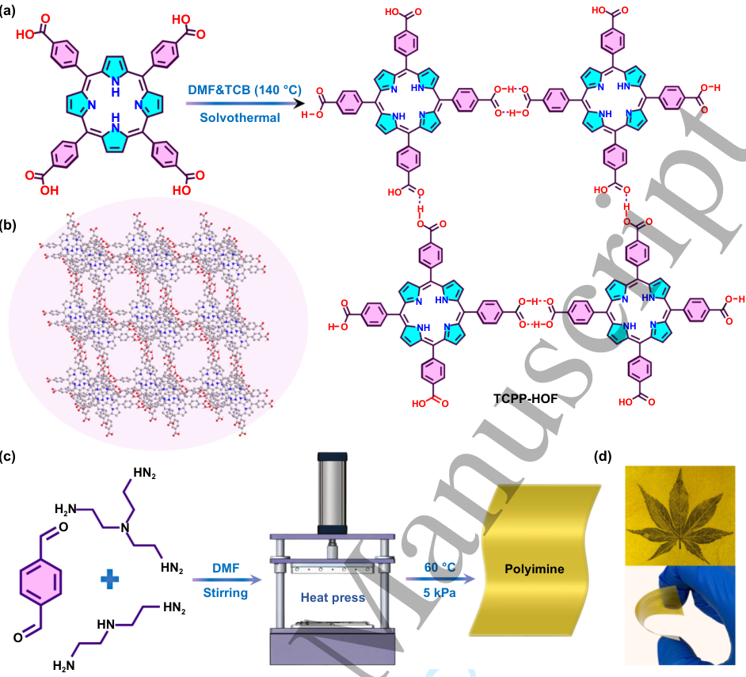
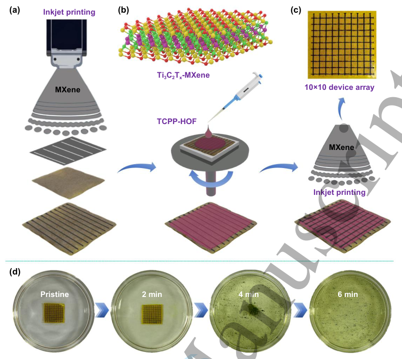
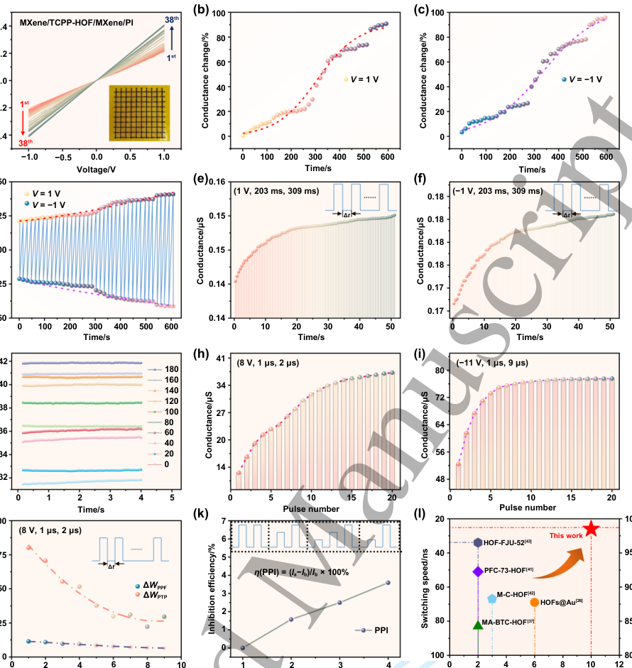
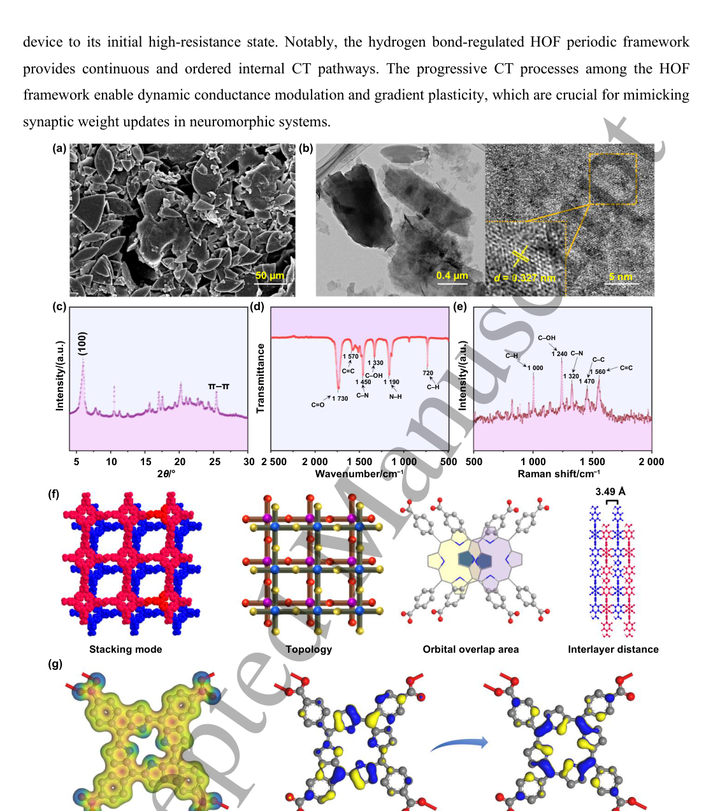
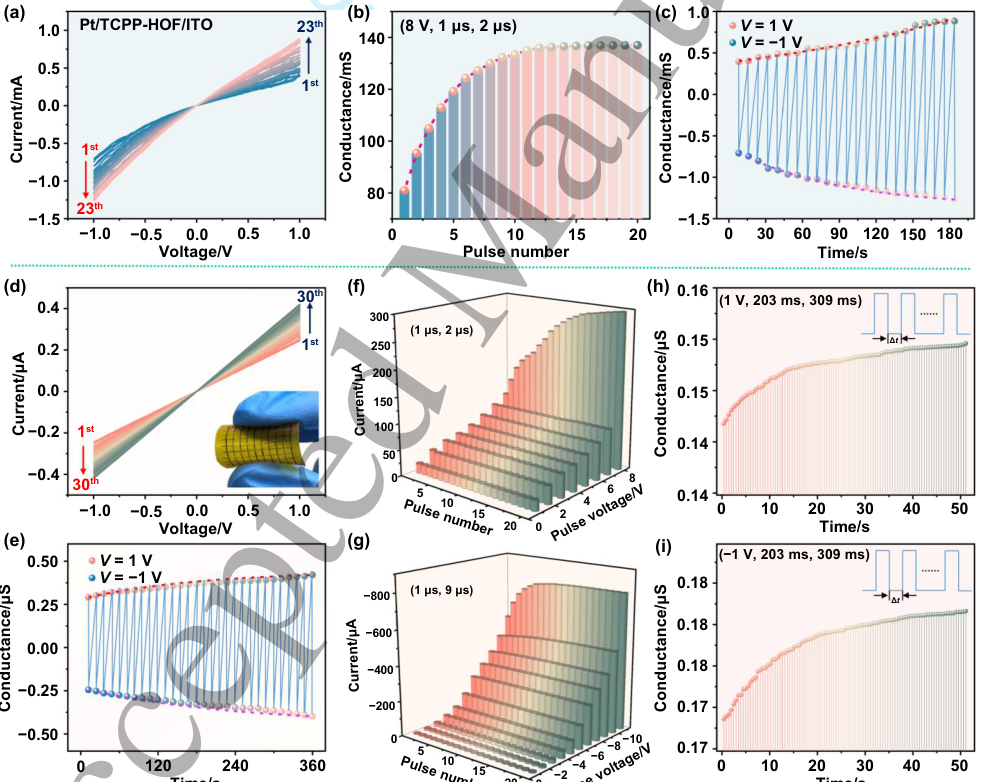
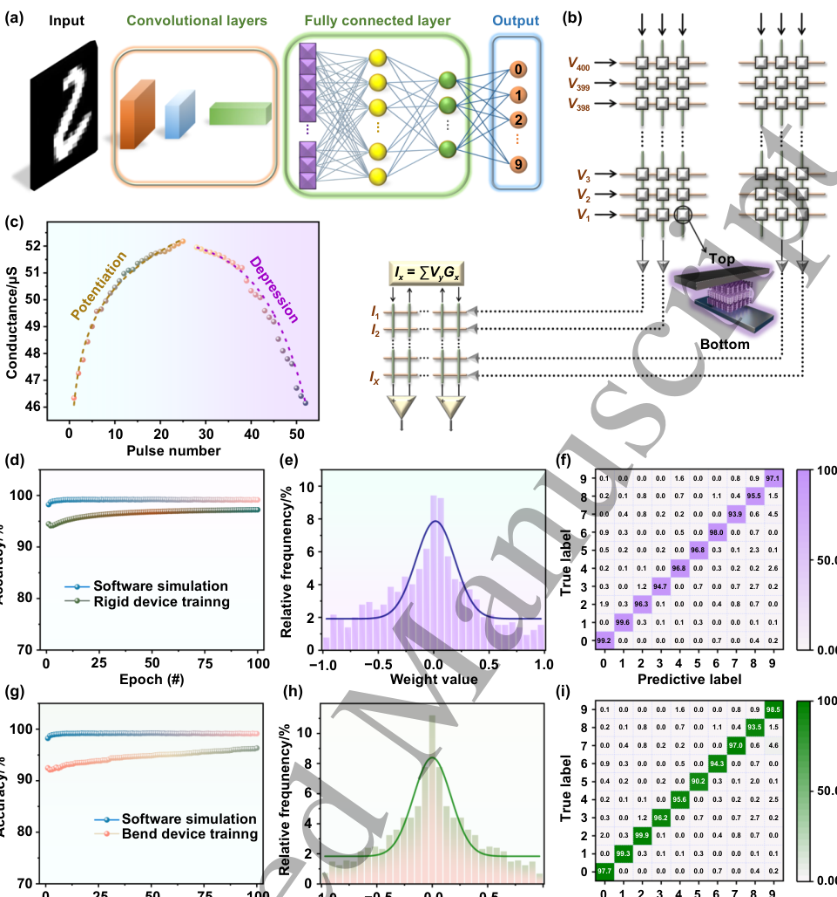

# All-solution-processable hydrogen-bonded organic framework artificial synapse for neuromorphic application

- 期刊：International Journal of Extreme Manufacturing
- 日期：2026-07-23
- DOI：10.1088/2631-7990/ae8f85
- 解析状态：fulltext_draft

## 摘要与研究价值

**Original:** Abstract Organic materials that exhibit gradient conductance plasticity are currently regarded as promising candidates to play the key role of bionic synapses in flexible neuromorphic circuits, mimicking the brain-like processing behavior. However, due to the poor long-term operating stability, low intrinsic conductivity, and inferior charge transfer ability, their electronic synaptic applications are largely restricted. Herein, we controllably synthesize a two-dimensional (2D) flake-like hydrogen-bonded organic framework composed of meso-tetra(carboxyphenyl)porphyrin monomers (TCPP-HOF), which serves as a reliable synaptic media with high material stability and enhanced charge-carrier transportation. An all-solution-processed 10×10 2D MXene/TCPP-HOF/MXene/polyimine (PI) heterostructured flexible device array using MXene as electrode and PI as substrate is fabricated, presenting gradient conductance modulation under both continuous electrical scanning and pulse algorithm, closely simulating the biological synaptic behaviors. More importantly, such metal-electrode-free device is easily degradable, giving the possibility of recyclable transient electronics and information security. This work sets a precedent for the development of highly viable HOF-manipulated artificial synaptic mimicry for low cost, easily-processed, and highly-efficient neuromorphic applications.

**中文:** 涉及 in-sensor/物理计算或可编程触觉前端；可用于低离散/装配容差触觉界面的结构与对照设计。当前未从摘要提取到可比较数值。

## 创新点

- Abstract Organic materials that exhibit gradient conductance plasticity are currently regarded as promising candidates to play the key role of bionic synapses in flexible neuromorphic circuits, mimicking the brain-like processing behavior.
- 涉及 in-sensor/物理计算或可编程触觉前端
- 可用于低离散/装配容差触觉界面的结构与对照设计

## 对当前课题的启发

- 涉及 in-sensor/物理计算或可编程触觉前端
- 可用于低离散/装配容差触觉界面的结构与对照设计
- 可对照 raw pixel、software feature 与 physical projection 的性能/通道/功耗

## 制备与实验步骤

### 1. 材料混合与分散

**Source:** p.5

**Original:** The hydrogen-bonded porphyrin framework (TCPP-HOF) was synthesized by self-assembly of 5,10,15,20- tetra(4-carboxyphenyl)porphyrin (TCPP) in a mixed solvent of N,N-dimethylformamide (DMF) and 1,2,4- trichlorobenzene (TCB) at 140 °C, as schematically illustrated in Figure 1(a) [19-21].

**中文:** 材料混合与分散步骤，关键配比、时间、温度和设备参数以 p.5 原文为准。

### 2. 材料混合与分散

**Source:** p.5

**Original:** Following the dissolution of p- phthalaldehyde (0.02 mol) in DMF (50 mL), diethylenetriamine (0.6 mmol) was added with stirring.

**中文:** 材料混合与分散步骤，关键配比、时间、温度和设备参数以 p.5 原文为准。

### 3. 材料混合与分散

**Source:** p.5

**Original:** After thorough mixing, tris(2-aminoethyl)amine (9.4 mmol) was added dropwise.

**中文:** 材料混合与分散步骤，关键配比、时间、温度和设备参数以 p.5 原文为准。

### 4. 成膜与沉积

**Source:** p.5

**Original:** The solution was promptly transferred into a mold made of silicone-coated release paper.

**中文:** 成膜与沉积步骤，关键配比、时间、温度和设备参数以 p.5 原文为准。

### 5. 固化与热处理

**Source:** p.5

**Original:** The film was cured through a step-wise room temperature to 80 °C thermal treatment, followed by a heat-pressing operation (Figure 1(c)) [22].

**中文:** 固化与热处理步骤，关键配比、时间、温度和设备参数以 p.5 原文为准。

### 6. 成膜与沉积

**Source:** p.5

**Original:** After complete evaporation of the volatiles, a transparent yellow PI film was obtained, serving as a flexible and https://mc04.manuscriptcentral.com/ijem-caep Page 3 of 19

**中文:** 成膜与沉积步骤，关键配比、时间、温度和设备参数以 p.5 原文为准。

### 7. 制备与实验操作

**Source:** p.5

**Original:** (d) In light of the all-solution-processable design, we fabricated a 10×10 TCPP-HOF-based synaptic device array using highly conductive MXenes as the top/bottom electrodes and a degradable PI film as the substrate, affording a 2D MXene/TCPP-HOF/MXene/PI stacked structure (Figure 2(a)).

**中文:** 制备与实验操作步骤，关键配比、时间、温度和设备参数以 p.5 原文为准。

### 8. 成膜与沉积

**Source:** p.5

**Original:** A solution of MXene-Ti3C2Tx (Figure 2(b)) with a concentration of 1.0 mg·mL−1 was spray-coated onto the PI film through a strip-shaped mask.

**中文:** 成膜与沉积步骤，关键配比、时间、温度和设备参数以 p.5 原文为准。

### 9. 成膜与沉积

**Source:** p.5

**Original:** Then a TCPP- HOF solution (1.0 mg·mL−1) was spin-coated onto the MXene electrode surface and dried at 50 °C to form a uniform active layer.

**中文:** 成膜与沉积步骤，关键配比、时间、温度和设备参数以 p.5 原文为准。

### 10. 成膜与沉积

**Source:** p.5

**Original:** Compared with traditional inorganic devices (e.g., metal oxide synapses) requiring high-vacuum and energy-intensive deposition, this all-solution-processed strategy not only simplifies the fabrication procedure but also enables low-cost manufacturing, providing a scalable route for green and printable electronics.

**中文:** 成膜与沉积步骤，关键配比、时间、温度和设备参数以 p.5 原文为准。

### 11. 材料混合与分散

**Source:** p.6

**Original:** (c) HN2 N H2N O HN2 Stirring Heat press HN2 HN O H2N Transparency and flexibility of the PI film.

**中文:** 材料混合与分散步骤，关键配比、时间、温度和设备参数以 p.6 原文为准。

## 方法原文锚点

**Source:** p.4 M001

**Original:** procedures are solution processable, which guarantees low cost, scalability, and ease of operation. The device

**中文:** 该段已进入结构化方法步骤；完整逐段翻译待智能体精读补齐。

**Source:** p.4 M002

**Original:** exhibits gradient conductance modulation with an ultrafast switching speed of 26 ns under a continuous

**中文:** 该段已进入结构化方法步骤；完整逐段翻译待智能体精读补齐。

**Source:** p.4 M003

**Original:** voltage scanning and pulse algorithm, thus approximating the essential synaptic functions and implementing

**中文:** 该段已进入结构化方法步骤；完整逐段翻译待智能体精读补齐。

**Source:** p.4 M004

**Original:** https://mc04.manuscriptcentral.com/ijem-caep

**中文:** 该段已进入结构化方法步骤；完整逐段翻译待智能体精读补齐。

**Source:** p.4 M005

**Original:** 1 2 3 4 5 6 7 8 9 10 11 12 13 14 15 16 17 18 19 20 21 22 23 24 25 26 27 28 29 30 31 32 33 34 35 36 37 38 39 40 41 42 43 44 45 46 47 48 49 50 51 52 53 54 55 56 57 58 59 60

**中文:** 该段已进入结构化方法步骤；完整逐段翻译待智能体精读补齐。

**Source:** p.4 M006

**Original:** transient electronics, neuromorphic systems

**中文:** 该段已进入结构化方法步骤；完整逐段翻译待智能体精读补齐。

**Source:** p.4 M007

**Original:** 1. Introduction

**中文:** 该段已进入结构化方法步骤；完整逐段翻译待智能体精读补齐。

**Source:** p.4 M008

**Original:** (STDP) [9].

**中文:** 该段已进入结构化方法步骤；完整逐段翻译待智能体精读补齐。

**Source:** p.4 M009

**Original:** intelligent devices.

**中文:** 该段已进入结构化方法步骤；完整逐段翻译待智能体精读补齐。

**Source:** p.4 M010

**Original:** Page 2 of 19

**中文:** 该段已进入结构化方法步骤；完整逐段翻译待智能体精读补齐。

**Source:** p.4 M011

**Original:** 2

**中文:** 该段已进入结构化方法步骤；完整逐段翻译待智能体精读补齐。

**Source:** p.5 M012

**Original:** International Journal of Extreme Manufacturing

**中文:** 该段已进入结构化方法步骤；完整逐段翻译待智能体精读补齐。

**Source:** p.5 M013

**Original:** highly efficient HOF-based neuromorphic application. In addition, this device can rapidly degrade in the

**中文:** 该段已进入结构化方法步骤；完整逐段翻译待智能体精读补齐。

**Source:** p.5 M014

**Original:** monomer solution of the PI film, especially under heated conditions, ensuring information security in special

**中文:** 该段已进入结构化方法步骤；完整逐段翻译待智能体精读补齐。

**Source:** p.5 M015

**Original:** Accepted Manuscript

**中文:** 该段已进入结构化方法步骤；完整逐段翻译待智能体精读补齐。

**Source:** p.5 M016

**Original:** scenarios. Moreover, such a bionic device demonstrates convolutional neural network (CNN)-based

**中文:** 该段已进入结构化方法步骤；完整逐段翻译待智能体精读补齐。

**Source:** p.5 M017

**Original:** computing with an exalted digit recognition accuracy of up to 97.23%, providing a promising paradigm for

**中文:** 该段已进入结构化方法步骤；完整逐段翻译待智能体精读补齐。

**Source:** p.5 M018

**Original:** the development of green, easy-to-process, and highly efficient neuromorphic computing systems.

**中文:** 该段已进入结构化方法步骤；完整逐段翻译待智能体精读补齐。

**Source:** p.5 M019

**Original:** The hydrogen-bonded porphyrin framework (TCPP-HOF) was synthesized by self-assembly of 5,10,15,20-

**中文:** 该段已进入结构化方法步骤；完整逐段翻译待智能体精读补齐。

**Source:** p.5 M020

**Original:** tetra(4-carboxyphenyl)porphyrin (TCPP) in a mixed solvent of N,N-dimethylformamide (DMF) and 1,2,4-

**中文:** 该段已进入结构化方法步骤；完整逐段翻译待智能体精读补齐。

**Source:** p.5 M021

**Original:** trichlorobenzene (TCB) at 140 °C, as schematically illustrated in Figure 1(a) [19-21]. The theoretical

**中文:** 该段已进入结构化方法步骤；完整逐段翻译待智能体精读补齐。

**Source:** p.5 M022

**Original:** molecular simulation revealed the formation of a square-layered topological TCPP-HOF structure (Figure

**中文:** 该段已进入结构化方法步骤；完整逐段翻译待智能体精读补齐。

**Source:** p.5 M023

**Original:** For Review Only

**中文:** 该段已进入结构化方法步骤；完整逐段翻译待智能体精读补齐。

**Source:** p.5 M024

**Original:** 1(b)). Moreover, the PI film was synthesized via a condensation reaction. Following the dissolution of p-

**中文:** 该段已进入结构化方法步骤；完整逐段翻译待智能体精读补齐。

**Source:** p.5 M025

**Original:** phthalaldehyde (0.02 mol) in DMF (50 mL), diethylenetriamine (0.6 mmol) was added with stirring. After

**中文:** 该段已进入结构化方法步骤；完整逐段翻译待智能体精读补齐。

**Source:** p.5 M026

**Original:** thorough mixing, tris(2-aminoethyl)amine (9.4 mmol) was added dropwise. The solution was promptly

**中文:** 该段已进入结构化方法步骤；完整逐段翻译待智能体精读补齐。

**Source:** p.5 M027

**Original:** transferred into a mold made of silicone-coated release paper. The film was cured through a step-wise room

**中文:** 该段已进入结构化方法步骤；完整逐段翻译待智能体精读补齐。

**Source:** p.5 M028

**Original:** temperature to 80 °C thermal treatment, followed by a heat-pressing operation (Figure 1(c)) [22]. After

**中文:** 该段已进入结构化方法步骤；完整逐段翻译待智能体精读补齐。

**Source:** p.5 M029

**Original:** complete evaporation of the volatiles, a transparent yellow PI film was obtained, serving as a flexible and

**中文:** 该段已进入结构化方法步骤；完整逐段翻译待智能体精读补齐。

**Source:** p.5 M030

**Original:** https://mc04.manuscriptcentral.com/ijem-caep

**中文:** 该段已进入结构化方法步骤；完整逐段翻译待智能体精读补齐。

**Source:** p.5 M031

**Original:** Page 3 of 19

**中文:** 该段已进入结构化方法步骤；完整逐段翻译待智能体精读补齐。

**Source:** p.5 M032

**Original:** 1 2 3 4 5 6 7 8 9 10 11 12 13 14 15 16 17 18 19 20 21 22 23 24 25 26 27 28 29 30 31 32 33 34 35 36 37 38 39 40 41 42 43 44 45 46 47 48 49 50 51 52 53 54 55 56 57 58 59 60

**中文:** 该段已进入结构化方法步骤；完整逐段翻译待智能体精读补齐。

**Source:** p.5 M033

**Original:** 2. Results and Discussion

**中文:** 该段已进入结构化方法步骤；完整逐段翻译待智能体精读补齐。

**Source:** p.5 M034

**Original:** degradable substrate.

**中文:** 该段已进入结构化方法步骤；完整逐段翻译待智能体精读补齐。

**Source:** p.5 M035

**Original:** 3

**中文:** 该段已进入结构化方法步骤；完整逐段翻译待智能体精读补齐。

**Source:** p.6 M036

**Original:** International Journal of Extreme Manufacturing

**中文:** 该段已进入结构化方法步骤；完整逐段翻译待智能体精读补齐。

**Source:** p.6 M037

**Original:** Accepted Manuscript

**中文:** 该段已进入结构化方法步骤；完整逐段翻译待智能体精读补齐。

**Source:** p.6 M038

**Original:** For Review Only

**中文:** 该段已进入结构化方法步骤；完整逐段翻译待智能体精读补齐。

**Source:** p.6 M039

**Original:** Polyimine DMF

**中文:** 该段已进入结构化方法步骤；完整逐段翻译待智能体精读补齐。

**Source:** p.6 M040

**Original:** Figure 1. Synthesis of TCPP-HOF and PI film. (a) Synthetic procedure of TCPP-HOF. (b) Theoretically

**中文:** 该段已进入结构化方法步骤；完整逐段翻译待智能体精读补齐。

**Source:** p.6 M041

**Original:** calculated topology of the TCPP-HOF along the channel direction. (c) Synthetic procedure of the PI film. (d)

**中文:** 该段已进入结构化方法步骤；完整逐段翻译待智能体精读补齐。

**Source:** p.6 M042

**Original:** In light of the all-solution-processable design, we fabricated a 10×10 TCPP-HOF-based synaptic device

**中文:** 该段已进入结构化方法步骤；完整逐段翻译待智能体精读补齐。

**Source:** p.6 M043

**Original:** array using highly conductive MXenes as the top/bottom electrodes and a degradable PI film as the substrate,

**中文:** 该段已进入结构化方法步骤；完整逐段翻译待智能体精读补齐。

**Source:** p.6 M044

**Original:** affording a 2D MXene/TCPP-HOF/MXene/PI stacked structure (Figure 2(a)). Firstly, a PI film substrate (2.0

**中文:** 该段已进入结构化方法步骤；完整逐段翻译待智能体精读补齐。

**Source:** p.6 M045

**Original:** cm × 2.0 cm) was pre-heated on a hotplate at 50 °C. A solution of MXene-Ti3C2Tx (Figure 2(b)) with a

**中文:** 该段已进入结构化方法步骤；完整逐段翻译待智能体精读补齐。

**Source:** p.6 M046

**Original:** concentration of 1.0 mg·mL−1 was spray-coated onto the PI film through a strip-shaped mask. Then a TCPP-

**中文:** 该段已进入结构化方法步骤；完整逐段翻译待智能体精读补齐。

**Source:** p.6 M047

**Original:** HOF solution (1.0 mg·mL−1) was spin-coated onto the MXene electrode surface and dried at 50 °C to form a

**中文:** 该段已进入结构化方法步骤；完整逐段翻译待智能体精读补齐。

**Source:** p.6 M048

**Original:** uniform active layer. Finally, a second layer of MXene was evenly sprayed and dried, yielding a flexible

**中文:** 该段已进入结构化方法步骤；完整逐段翻译待智能体精读补齐。

**Source:** p.6 M049

**Original:** device with a 10×10 2D MXene/TCPP-HOF/MXene/PI architecture (Figure 2(c)). Compared with traditional

**中文:** 该段已进入结构化方法步骤；完整逐段翻译待智能体精读补齐。

**Source:** p.6 M050

**Original:** inorganic devices (e.g., metal oxide synapses) requiring high-vacuum and energy-intensive deposition, this

**中文:** 该段已进入结构化方法步骤；完整逐段翻译待智能体精读补齐。

**Source:** p.6 M051

**Original:** all-solution-processed strategy not only simplifies the fabrication procedure but also enables low-cost

**中文:** 该段已进入结构化方法步骤；完整逐段翻译待智能体精读补齐。

**Source:** p.6 M052

**Original:** manufacturing, providing a scalable route for green and printable electronics.

**中文:** 该段已进入结构化方法步骤；完整逐段翻译待智能体精读补齐。

**Source:** p.6 M053

**Original:** https://mc04.manuscriptcentral.com/ijem-caep

**中文:** 该段已进入结构化方法步骤；完整逐段翻译待智能体精读补齐。

**Source:** p.6 M054

**Original:** 1 2 3 4 5 6 7 8 9 10 11 12 13 14 15 16 17 18 19 20 21 22 23 24 25 26 27 28 29 30 31 32 33 34 35 36 37 38 39 40 41 42 43 44 45 46 47 48 49 50 51 52 53 54 55 56 57 58 59 60

**中文:** 该段已进入结构化方法步骤；完整逐段翻译待智能体精读补齐。

**Source:** p.6 M055

**Original:** (a)

**中文:** 该段已进入结构化方法步骤；完整逐段翻译待智能体精读补齐。

**Source:** p.6 M056

**Original:** O HO

**中文:** 该段已进入结构化方法步骤；完整逐段翻译待智能体精读补齐。

**Source:** p.6 M057

**Original:** O HO

**中文:** 该段已进入结构化方法步骤；完整逐段翻译待智能体精读补齐。

**Source:** p.6 M058

**Original:** N H N

**中文:** 该段已进入结构化方法步骤；完整逐段翻译待智能体精读补齐。

**Source:** p.6 M059

**Original:** DMF&TCB (140 °C)

**中文:** 该段已进入结构化方法步骤；完整逐段翻译待智能体精读补齐。

**Source:** p.6 M060

**Original:** O

**中文:** 该段已进入结构化方法步骤；完整逐段翻译待智能体精读补齐。

**Source:** p.6 M061

**Original:** N

**中文:** 该段已进入结构化方法步骤；完整逐段翻译待智能体精读补齐。

**Source:** p.6 M062

**Original:** H

**中文:** 该段已进入结构化方法步骤；完整逐段翻译待智能体精读补齐。

**Source:** p.6 M063

**Original:** O

**中文:** 该段已进入结构化方法步骤；完整逐段翻译待智能体精读补齐。

**Source:** p.6 M064

**Original:** H N

**中文:** 该段已进入结构化方法步骤；完整逐段翻译待智能体精读补齐。

**Source:** p.6 M065

**Original:** Solvothermal

**中文:** 该段已进入结构化方法步骤；完整逐段翻译待智能体精读补齐。

**Source:** p.6 M066

**Original:** O

**中文:** 该段已进入结构化方法步骤；完整逐段翻译待智能体精读补齐。

**Source:** p.6 M067

**Original:** O HO

**中文:** 该段已进入结构化方法步骤；完整逐段翻译待智能体精读补齐。

**Source:** p.6 M068

**Original:** OH

**中文:** 该段已进入结构化方法步骤；完整逐段翻译待智能体精读补齐。

**Source:** p.6 M069

**Original:** (b)

**中文:** 该段已进入结构化方法步骤；完整逐段翻译待智能体精读补齐。

**Source:** p.6 M070

**Original:** O

**中文:** 该段已进入结构化方法步骤；完整逐段翻译待智能体精读补齐。

**Source:** p.6 M071

**Original:** H

**中文:** 该段已进入结构化方法步骤；完整逐段翻译待智能体精读补齐。

**Source:** p.6 M072

**Original:** O

**中文:** 该段已进入结构化方法步骤；完整逐段翻译待智能体精读补齐。

**Source:** p.6 M073

**Original:** (c)

**中文:** 该段已进入结构化方法步骤；完整逐段翻译待智能体精读补齐。

**Source:** p.6 M074

**Original:** HN2

**中文:** 该段已进入结构化方法步骤；完整逐段翻译待智能体精读补齐。

**Source:** p.6 M075

**Original:** N H2N

**中文:** 该段已进入结构化方法步骤；完整逐段翻译待智能体精读补齐。

**Source:** p.6 M076

**Original:** O

**中文:** 该段已进入结构化方法步骤；完整逐段翻译待智能体精读补齐。

**Source:** p.6 M077

**Original:** HN2

**中文:** 该段已进入结构化方法步骤；完整逐段翻译待智能体精读补齐。

**Source:** p.6 M078

**Original:** Stirring

**中文:** 该段已进入结构化方法步骤；完整逐段翻译待智能体精读补齐。

**Source:** p.6 M079

**Original:** Heat press

**中文:** 该段已进入结构化方法步骤；完整逐段翻译待智能体精读补齐。

**Source:** p.6 M080

**Original:** HN2 HN

**中文:** 该段已进入结构化方法步骤；完整逐段翻译待智能体精读补齐。

**Source:** p.6 M081

**Original:** O

**中文:** 该段已进入结构化方法步骤；完整逐段翻译待智能体精读补齐。

**Source:** p.6 M082

**Original:** H2N

**中文:** 该段已进入结构化方法步骤；完整逐段翻译待智能体精读补齐。

**Source:** p.6 M083

**Original:** Transparency and flexibility of the PI film.

**中文:** 该段已进入结构化方法步骤；完整逐段翻译待智能体精读补齐。

**Source:** p.6 M084

**Original:** Page 4 of 19

**中文:** 该段已进入结构化方法步骤；完整逐段翻译待智能体精读补齐。

**Source:** p.6 M085

**Original:** O HO

**中文:** 该段已进入结构化方法步骤；完整逐段翻译待智能体精读补齐。

**Source:** p.6 M086

**Original:** O HO

**中文:** 该段已进入结构化方法步骤；完整逐段翻译待智能体精读补齐。

**Source:** p.6 M087

**Original:** HN N

**中文:** 该段已进入结构化方法步骤；完整逐段翻译待智能体精读补齐。

**Source:** p.6 M088

**Original:** O

**中文:** 该段已进入结构化方法步骤；完整逐段翻译待智能体精读补齐。

**Source:** p.6 M089

**Original:** H

**中文:** 该段已进入结构化方法步骤；完整逐段翻译待智能体精读补齐。

**Source:** p.6 M090

**Original:** HN N

**中文:** 该段已进入结构化方法步骤；完整逐段翻译待智能体精读补齐。

**Source:** p.6 M091

**Original:** O

**中文:** 该段已进入结构化方法步骤；完整逐段翻译待智能体精读补齐。

**Source:** p.6 M092

**Original:** H

**中文:** 该段已进入结构化方法步骤；完整逐段翻译待智能体精读补齐。

**Source:** p.6 M093

**Original:** O

**中文:** 该段已进入结构化方法步骤；完整逐段翻译待智能体精读补齐。

**Source:** p.6 M094

**Original:** O

**中文:** 该段已进入结构化方法步骤；完整逐段翻译待智能体精读补齐。

**Source:** p.6 M095

**Original:** O

**中文:** 该段已进入结构化方法步骤；完整逐段翻译待智能体精读补齐。

**Source:** p.6 M096

**Original:** H

**中文:** 该段已进入结构化方法步骤；完整逐段翻译待智能体精读补齐。

**Source:** p.6 M097

**Original:** O

**中文:** 该段已进入结构化方法步骤；完整逐段翻译待智能体精读补齐。

**Source:** p.6 M098

**Original:** NH N

**中文:** 该段已进入结构化方法步骤；完整逐段翻译待智能体精读补齐。

**Source:** p.6 M099

**Original:** NH N

**中文:** 该段已进入结构化方法步骤；完整逐段翻译待智能体精读补齐。

**Source:** p.6 M100

**Original:** O HO

**中文:** 该段已进入结构化方法步骤；完整逐段翻译待智能体精读补齐。

## 图表解读

### Figure 1

**Source:** p.6

**Original caption:** Figure 1. Synthesis of TCPP-HOF and PI film. (a) Synthetic procedure of TCPP-HOF. (b) Theoretically

**中文图注:** Figure 1 原始图注已提取；逐项含义见下方分图说明。

**Reading note:** 结合正文首次引用位置和原始图注核对该图的证据角色。

- (a) 结合正文首次引用位置和原始图注核对该图的证据角色。 原文：Synthetic procedure of TCPP-HOF
- (b) 结合正文首次引用位置和原始图注核对该图的证据角色。 原文：Theoretically

### Figure 2

**Source:** p.7

**Original caption:** Figure 2. The device fabrication and decomposition processes. (a) The preparation flow chart of the 10×10

**中文图注:** Figure 2 原始图注已提取；逐项含义见下方分图说明。

**Reading note:** 重点查看器件结构、材料层次、信号路径和制备流程。

- (a) 结合正文首次引用位置和原始图注核对该图的证据角色。 原文：The preparation flow chart of the 10×10

### Figure 3

**Source:** p.10

**Original caption:** Figure 3. Synaptic behaviors of the MXene/TCPP-HOF/MXene/PI device. (a) Cyclic I–V characteristics

**中文图注:** Figure 3 原始图注已提取；逐项含义见下方分图说明。

**Reading note:** 结合正文首次引用位置和原始图注核对该图的证据角色。

- (a) 结合正文首次引用位置和原始图注核对该图的证据角色。 原文：Cyclic I–V characteristics

### Figure 4

**Source:** p.12

**Original caption:** Figure 4. Characterization and structural display of TCPP-HOF. (a) SEM image of TCPP-HOF. (b) TEM and

**中文图注:** Figure 4 原始图注已提取；逐项含义见下方分图说明。

**Reading note:** 重点查看阵列规模、空间分辨率、串扰、读出通道和空间特征表达。

- (a) 重点查看阵列规模、空间分辨率、串扰、读出通道和空间特征表达。 原文：SEM image of TCPP-HOF
- (b) 结合正文首次引用位置和原始图注核对该图的证据角色。 原文：TEM and

### Figure 5

**Source:** p.13

**Original caption:** Figure 5. Electrical characterizations of the synaptic device under various electrode and bending states. (a)

**中文图注:** Figure 5 原始图注已提取；逐项含义见下方分图说明。

**Reading note:** 结合正文首次引用位置和原始图注核对该图的证据角色。

### Figure 6

**Source:** p.15

**Original caption:** Figure 6. Neuromorphic computing based on CNN. (a) CNN architecture for MNIST recognition. (b)

**中文图注:** Figure 6 原始图注已提取；逐项含义见下方分图说明。

**Reading note:** 重点查看器件结构、材料层次、信号路径和制备流程。

- (a) 重点查看器件结构、材料层次、信号路径和制备流程。 原文：CNN architecture for MNIST recognition. (b)
