# Knittable electronic textiles for intelligent soft wearables

- 期刊：npj Flexible Electronics
- 日期：2026-07-09
- DOI：10.1038/s41528-026-00611-y
- 解析状态：fulltext_draft

## 摘要与研究价值

**Original:** This review examines knittable electronic textiles as a foundational platform for soft wearable systems. Knitting’s interlooped, three-dimensional architectures and computationally-enabled design allow the fabrication of customized electronic textiles that conform to the body while supporting integrated sensing, actuation, processing, communication, and power delivery. By constructing structures from fibers to full fabrics, knitted systems offer stretchability, breathability, and mechanical resilience, supporting functional garments and pathways toward intelligent soft wearable technologies.

**中文:** 提供机器人、可穿戴或电子皮肤系统任务证据。当前未从摘要提取到可比较数值。

## 创新点

- This review examines knittable electronic textiles as a foundational platform for soft wearable systems.
- 提供机器人、可穿戴或电子皮肤系统任务证据

## 对当前课题的启发

- 提供机器人、可穿戴或电子皮肤系统任务证据

## 制备与实验步骤

### 1. 图形化与结构成形

**Source:** p.43

**Original:** Therefore, knitting is preferable because knitting allows for the fabrica- tion of hierarchical and multilayered textile patterns, which significantly amplifies the available surface area for charge storage.

**中文:** 图形化与结构成形步骤，关键配比、时间、温度和设备参数以 p.43 原文为准。

### 2. 成膜与沉积

**Source:** p.43

**Original:** use intarsia knitting to interlace MXene-coated cotton yarns into a dense interlock rib structure, creating 2D flat electrodes that achieve a high capacitance of 707 mF/cm2 [206] (Fig. 9.g-h).

**中文:** 成膜与沉积步骤，关键配比、时间、温度和设备参数以 p.43 原文为准。

### 3. 成膜与沉积

**Source:** p.44

**Original:** 415 mF/cm2, where stiff vertical polyester monofilaments are knitted between outer elec- trode layers with MXene-coated nylon multifilaments [207].

**中文:** 成膜与沉积步骤，关键配比、时间、温度和设备参数以 p.44 原文为准。

### 4. 成膜与沉积

**Source:** p.44

**Original:** To implement energy-efficient, scalable wireless powering textiles, a low- loss and stretchable conductor such as liquid metal (e.g., eGaIn: 3.4 × 106 S/m [210]) is promising [210, 211], because standard metal-coated conductive yarns have relatively high resistance (∼105 S/m) that degrades power transfer efficiency.

**中文:** 成膜与沉积步骤，关键配比、时间、温度和设备参数以 p.44 原文为准。

### 5. 制备与实验操作

**Source:** p.44

**Original:** To embed such fiber into the textile, plate knitting is useful to fabricate hollow tubular channels within the garments, which are filled with liquid metal-filled tubes.

**中文:** 制备与实验操作步骤，关键配比、时间、温度和设备参数以 p.44 原文为准。

### 6. 组装与封装

**Source:** p.45

**Original:** Therefore, the meander-coil-based inductive power transfer system enables safe, Watt- class power delivery for high-performance wearable electronics.

**中文:** 组装与封装步骤，关键配比、时间、温度和设备参数以 p.45 原文为准。

### 7. 组装与封装

**Source:** p.45

**Original:** In addition to inductive approaches, body-coupled capacitive power transfer leverages the human body’s high per- mittivity as a conductive path to deliver energy.

**中文:** 组装与封装步骤，关键配比、时间、温度和设备参数以 p.45 原文为准。

### 8. 图形化与结构成形

**Source:** p.46

**Original:** 10.a), sleeves, and lower-body garments (Fig. 10.b) can track finger flexion, joint angles, and gait patterns (Fig. 10.c) while remaining unobtrusive to the wearer.

**中文:** 图形化与结构成形步骤，关键配比、时间、温度和设备参数以 p.46 原文为准。

### 9. 图形化与结构成形

**Source:** p.46

**Original:** Knit- ted sensors integrated into vests, pants, or footwear have been shown to capture shoulder activity, knee motion, and foot pressure distributions (Fig. 10.d), supporting classification of movement patterns and biomechanical states while preserving a low-profile, wearable form factor [216, 55, 217, 218].

**中文:** 图形化与结构成形步骤，关键配比、时间、温度和设备参数以 p.46 原文为准。

## 方法原文锚点

**Source:** p.43 M001

**Original:** to improve overall efficiency [201, 202]

**中文:** 该段已进入结构化方法步骤；完整逐段翻译待智能体精读补齐。

**Source:** p.43 M002

**Original:** While the knittable energy harvesters provide comfortable self-powered energy storage

**中文:** 该段已进入结构化方法步骤；完整逐段翻译待智能体精读补齐。

**Source:** p.43 M003

**Original:** in the e-textiles, their harvesting capability fluctuates significantly depending on exter-

**中文:** 该段已进入结构化方法步骤；完整逐段翻译待智能体精读补齐。

**Source:** p.43 M004

**Original:** nal environmental conditions and user activity. As reliable textile-based power sources,

**中文:** 该段已进入结构化方法步骤；完整逐段翻译待智能体精读补齐。

**Source:** p.43 M005

**Original:** fiber-shaped batteries such as lithium-ion [203, 204] and solid-state zinc-ion fibers [205]

**中文:** 该段已进入结构化方法步骤；完整逐段翻译待智能体精读补齐。

**Source:** p.43 M006

**Original:** are typically employed. Furthermore, textile-based supercapacitors have also been gaining

**中文:** 该段已进入结构化方法步骤；完整逐段翻译待智能体精读补齐。

**Source:** p.44 M007

**Original:** ARTICLE IN PRESS

**中文:** 该段已进入结构化方法步骤；完整逐段翻译待智能体精读补齐。

**Source:** p.44 M008

**Original:** attention for e-textile applications requiring rapid charging and high instantaneous power

**中文:** 该段已进入结构化方法步骤；完整逐段翻译待智能体精读补齐。

**Source:** p.44 M009

**Original:** output. Unlike the fiber-based chemical design of the battery, the textile-based super-

**中文:** 该段已进入结构化方法步骤；完整逐段翻译待智能体精读补齐。

**Source:** p.44 M010

**Original:** capacitor needs a physical design of textile-based electrodes and separators to maximize

**中文:** 该段已进入结构化方法步骤；完整逐段翻译待智能体精读补齐。

**Source:** p.44 M011

**Original:** surface area. Therefore, knitting is preferable because knitting allows for the fabrica-

**中文:** 该段已进入结构化方法步骤；完整逐段翻译待智能体精读补齐。

**Source:** p.44 M012

**Original:** tion of hierarchical and multilayered textile patterns, which significantly amplifies the

**中文:** 该段已进入结构化方法步骤；完整逐段翻译待智能体精读补齐。

**Source:** p.44 M013

**Original:** available surface area for charge storage. Levitt et al. use intarsia knitting to interlace

**中文:** 该段已进入结构化方法步骤；完整逐段翻译待智能体精读补齐。

**Source:** p.44 M014

**Original:** MXene-coated cotton yarns into a dense interlock rib structure, creating 2D flat electrodes

**中文:** 该段已进入结构化方法步骤；完整逐段翻译待智能体精读补齐。

**Source:** p.44 M015

**Original:** that achieve a high capacitance of 707 mF/cm2 [206] (Fig. 9.g-h). To enhance mechan-

**中文:** 该段已进入结构化方法步骤；完整逐段翻译待智能体精读补齐。

**Source:** p.44 M016

**Original:** ical stability under pressure, Zhang et al. introduce a 3D spacer knit architecture with

**中文:** 该段已进入结构化方法步骤；完整逐段翻译待智能体精读补齐。

**Source:** p.44 M017

**Original:** 415 mF/cm2, where stiff vertical polyester monofilaments are knitted between outer elec-

**中文:** 该段已进入结构化方法步骤；完整逐段翻译待智能体精读补齐。

**Source:** p.44 M018

**Original:** trode layers with MXene-coated nylon multifilaments [207]. The polyester spacer yarns

**中文:** 该段已进入结构化方法步骤；完整逐段翻译待智能体精读补齐。

**Source:** p.44 M019

**Original:** function as a physical separator capable of mechanical cushioning, effectively preventing

**中文:** 该段已进入结构化方法步骤；完整逐段翻译待智能体精读补齐。

**Source:** p.44 M020

**Original:** short circuits and retaining 97 % of capacitance even after 1000 compression cycles at 55 %

**中文:** 该段已进入结构化方法步骤；完整逐段翻译待智能体精读补齐。

**Source:** p.44 M021

**Original:** strain. Unlike simple yarn-based supercapacitors whose small surface area limits capac-

**中文:** 该段已进入结构化方法步骤；完整逐段翻译待智能体精读补齐。

**Source:** p.44 M022

**Original:** itance around tens of mF/cm2 [208, 209], the knittable supercapacitors achieve over ten

**中文:** 该段已进入结构化方法步骤；完整逐段翻译待智能体精读补齐。

**Source:** p.44 M023

**Original:** times higher capacitance performance by utilizing the expanded textile surface area.

**中文:** 该段已进入结构化方法步骤；完整逐段翻译待智能体精读补齐。

**Source:** p.44 M024

**Original:** Finally, knitted textiles serve as near-field wireless power hubs for skin devices, such

**中文:** 该段已进入结构化方法步骤；完整逐段翻译待智能体精读补齐。

**Source:** p.44 M025

**Original:** as ultra-thin epidermal devices, which often lack the volume and space for the equipped

**中文:** 该段已进入结构化方法步骤；完整逐段翻译待智能体精读补齐。

**Source:** p.44 M026

**Original:** ARTICLE IN PRESS

**中文:** 该段已进入结构化方法步骤；完整逐段翻译待智能体精读补齐。

**Source:** p.44 M027

**Original:** bulky batteries. To implement energy-efficient, scalable wireless powering textiles, a low-

**中文:** 该段已进入结构化方法步骤；完整逐段翻译待智能体精读补齐。

**Source:** p.44 M028

**Original:** loss and stretchable conductor such as liquid metal (e.g., eGaIn: 3.4 × 106 S/m [210])

**中文:** 该段已进入结构化方法步骤；完整逐段翻译待智能体精读补齐。

**Source:** p.44 M029

**Original:** is promising [210, 211], because standard metal-coated conductive yarns have relatively

**中文:** 该段已进入结构化方法步骤；完整逐段翻译待智能体精读补齐。

**Source:** p.44 M030

**Original:** high resistance (∼105 S/m) that degrades power transfer efficiency. To embed such fiber

**中文:** 该段已进入结构化方法步骤；完整逐段翻译待智能体精读补齐。

**Source:** p.44 M031

**Original:** into the textile, plate knitting is useful to fabricate hollow tubular channels within the

**中文:** 该段已进入结构化方法步骤；完整逐段翻译待智能体精读补齐。

**Source:** p.44 M032

**Original:** garments, which are filled with liquid metal-filled tubes. For example, Takahashi et al.

**中文:** 该段已进入结构化方法步骤；完整逐段翻译待智能体精读补齐。

**Source:** p.44 M033

**Original:** present safe, body-scale wireless powering garments based on a meander coil composed of

**中文:** 该段已进入结构化方法步骤；完整逐段翻译待智能体精读补齐。

**Source:** p.44 M034

**Original:** the liquid metal tube [47, 212] (Fig. 9.i-j). As described below, the meander coil is specif-

**中文:** 该段已进入结构化方法步骤；完整逐段翻译待智能体精读补齐。

**Source:** p.44 M035

**Original:** ically designed to localize the strong electromagnetic field near the skin surface, enabling

**中文:** 该段已进入结构化方法步骤；完整逐段翻译待智能体精读补齐。

**Source:** p.45 M036

**Original:** ARTICLE IN PRESS

**中文:** 该段已进入结构化方法步骤；完整逐段翻译待智能体精读补齐。

**Source:** p.45 M037

**Original:** the suppression of the specific absorption rate (SAR), established by ICNIRP, which is a

**中文:** 该段已进入结构化方法步骤；完整逐段翻译待智能体精读补齐。

**Source:** p.45 M038

**Original:** measure of how much radiation energy is absorbed by the body per unit mass when using

**中文:** 该段已进入结构化方法步骤；完整逐段翻译待智能体精读补齐。

**Source:** p.45 M039

**Original:** wireless devices. The evaluation shows 2.5 W-level power delivery to advanced wearable

**中文:** 该段已进入结构化方法步骤；完整逐段翻译待智能体精读补齐。

**Source:** p.45 M040

**Original:** devices at 25 % DC-to-DC efficiency, while maintaining the SAR below the 2.0 W/kg limit

**中文:** 该段已进入结构化方法步骤；完整逐段翻译待智能体精读补齐。

**Source:** p.45 M041

**Original:** for localized human exposure and the 0.08 W/kg limit for whole-body human exposure.

**中文:** 该段已进入结构化方法步骤；完整逐段翻译待智能体精读补齐。

**Source:** p.45 M042

**Original:** Therefore, the meander-coil-based inductive power transfer system enables safe, Watt-

**中文:** 该段已进入结构化方法步骤；完整逐段翻译待智能体精读补齐。

**Source:** p.45 M043

**Original:** class power delivery for high-performance wearable electronics. In addition to inductive

**中文:** 该段已进入结构化方法步骤；完整逐段翻译待智能体精读补齐。

**Source:** p.45 M044

**Original:** approaches, body-coupled capacitive power transfer leverages the human body’s high per-

**中文:** 该段已进入结构化方法步骤；完整逐段翻译待智能体精读补齐。

**Source:** p.45 M045

**Original:** mittivity as a conductive path to deliver energy. For example, Song et al. present a

**中文:** 该段已进入结构化方法步骤；完整逐段翻译待智能体精读补齐。

**Source:** p.45 M046

**Original:** body-coupled electrical stimulation system that uses a knittable dual-layered electrode

**中文:** 该段已进入结构化方法步骤；完整逐段翻译待智能体精读补齐。

**Source:** p.45 M047

**Original:** socks that can harvest ambient electromagnetic noise from electronics and static elec-

**中文:** 该段已进入结构化方法步骤；完整逐段翻译待智能体精读补齐。

**Source:** p.45 M048

**Original:** tricity from physical activity. By concentrating localized electric fields through potential

**中文:** 该段已进入结构化方法步骤；完整逐段翻译待智能体精读补齐。

**Source:** p.45 M049

**Original:** distortion, these socks directly stimulate muscle fibers by activating voltage-gated ion

**中文:** 该段已进入结构化方法步骤；完整逐段翻译待智能体精读补齐。

**Source:** p.45 M050

**Original:** channels [213] (Fig. 9.k-l). Note that the summary table for knittable e-textiles with

**中文:** 该段已进入结构化方法步骤；完整逐段翻译待智能体精读补齐。

**Source:** p.45 M051

**Original:** communication and powering functionality is provided in Table 6.

**中文:** 该段已进入结构化方法步骤；完整逐段翻译待智能体精读补齐。

**Source:** p.45 M052

**Original:** Applications

**中文:** 该段已进入结构化方法步骤；完整逐段翻译待智能体精读补齐。

**Source:** p.45 M053

**Original:** ARTICLE IN PRESS

**中文:** 该段已进入结构化方法步骤；完整逐段翻译待智能体精读补齐。

**Source:** p.45 M054

**Original:** Building on the material, structural, and electronic capabilities described above, knitted

**中文:** 该段已进入结构化方法步骤；完整逐段翻译待智能体精读补齐。

**Source:** p.45 M055

**Original:** e-textiles enable a broad range of application domains that extend far beyond conven-

**中文:** 该段已进入结构化方法步骤；完整逐段翻译待智能体精读补齐。

**Source:** p.45 M056

**Original:** tional wearable devices. These capabilities enable garments and soft structures that can

**中文:** 该段已进入结构化方法步骤；完整逐段翻译待智能体精读补齐。

**Source:** p.45 M057

**Original:** sense motion, physiology, and touch; respond through actuation or feedback; and oper-

**中文:** 该段已进入结构化方法步骤；完整逐段翻译待智能体精读补齐。

**Source:** p.45 M058

**Original:** ate autonomously through embedded energy and communication systems. The following

**中文:** 该段已进入结构化方法步骤；完整逐段翻译待智能体精读补齐。

**Source:** p.45 M059

**Original:** sections survey how these integrated functionalities manifest across key application areas,

**中文:** 该段已进入结构化方法步骤；完整逐段翻译待智能体精读补齐。

**Source:** p.45 M060

**Original:** including activity and gesture recognition, physiological monitoring, interactive wearables,

**中文:** 该段已进入结构化方法步骤；完整逐段翻译待智能体精读补齐。

**Source:** p.45 M061

**Original:** and soft robotics.

**中文:** 该段已进入结构化方法步骤；完整逐段翻译待智能体精读补齐。

**Source:** p.46 M062

**Original:** ARTICLE IN PRESS

**中文:** 该段已进入结构化方法步骤；完整逐段翻译待智能体精读补齐。

**Source:** p.46 M063

**Original:** Activity and gesture recognition

**中文:** 该段已进入结构化方法步骤；完整逐段翻译待智能体精读补齐。

**Source:** p.46 M064

**Original:** Several non-textile activity-monitoring approaches, such as IMUs, optical motion-capture,

**中文:** 该段已进入结构化方法步骤；完整逐段翻译待智能体精读补齐。

**Source:** p.46 M065

**Original:** and rigid pressure sensors, work well in certain scenarios but may not be the best option

**中文:** 该段已进入结构化方法步骤；完整逐段翻译待智能体精读补齐。

**Source:** p.46 M066

**Original:** for wearable systems that have to fit around the curves of our bodies, maintain accurate

**中文:** 该段已进入结构化方法步骤；完整逐段翻译待智能体精读补齐。

**Source:** p.46 M067

**Original:** sensing during large-range movement, and for long periods of time. Knitted sensors are

**中文:** 该段已进入结构化方法步骤；完整逐段翻译待智能体精读补齐。

**Source:** p.46 M068

**Original:** well suited to activity monitoring on humans because of their intrinsic elasticity and

**中文:** 该段已进入结构化方法步骤；完整逐段翻译待智能体精读补齐。

**Source:** p.46 M069

**Original:** breathable nature. These mechanical advantages reduce motion artifacts and improve

**中文:** 该段已进入结构化方法步骤；完整逐段翻译待智能体精读补齐。

**Source:** p.46 M070

**Original:** signal continuity compared to stiff sensors. In this way, knitted sensors can prioritize

**中文:** 该段已进入结构化方法步骤；完整逐段翻译待智能体精读补齐。

**Source:** p.46 M071

**Original:** sensitivity and accuracy without compromising conformability and comfort.

**中文:** 该段已进入结构化方法步骤；完整逐段翻译待智能体精读补齐。

**Source:** p.46 M072

**Original:** Knitted strain and pressure sensors have been widely used to capture joint movement,

**中文:** 该段已进入结构化方法步骤；完整逐段翻译待智能体精读补齐。

**Source:** p.46 M073

**Original:** posture, and gesture by embedding sensing elements directly into garments. Gloves (Fig.

**中文:** 该段已进入结构化方法步骤；完整逐段翻译待智能体精读补齐。

**Source:** p.46 M074

**Original:** 10.a), sleeves, and lower-body garments (Fig. 10.b) can track finger flexion, joint angles,

**中文:** 该段已进入结构化方法步骤；完整逐段翻译待智能体精读补齐。

**Source:** p.46 M075

**Original:** and gait patterns (Fig. 10.c) while remaining unobtrusive to the wearer. By adjusting knit

**中文:** 该段已进入结构化方法步骤；完整逐段翻译待智能体精读补齐。

**Source:** p.46 M076

**Original:** architectures, sensor sensitivity can be tuned to support both fine-grained gestures and

**中文:** 该段已进入结构化方法步骤；完整逐段翻译待智能体精读补齐。

**Source:** p.46 M077

**Original:** large-amplitude movements, enabling applications ranging from hand gesture recognition

**中文:** 该段已进入结构化方法步骤；完整逐段翻译待智能体精读补齐。

**Source:** p.46 M078

**Original:** to full-body activity classification [214, 104, 215].

**中文:** 该段已进入结构化方法步骤；完整逐段翻译待智能体精读补齐。

**Source:** p.46 M079

**Original:** Such systems are particularly relevant for exercise monitoring and rehabilitation, where

**中文:** 该段已进入结构化方法步骤；完整逐段翻译待智能体精读补齐。

**Source:** p.46 M080

**Original:** ARTICLE IN PRESS

**中文:** 该段已进入结构化方法步骤；完整逐段翻译待智能体精读补齐。

**Source:** p.46 M081

**Original:** accurate tracking of complex joint motion is required without restricting movement. Knit-

**中文:** 该段已进入结构化方法步骤；完整逐段翻译待智能体精读补齐。

**Source:** p.46 M082

**Original:** ted sensors integrated into vests, pants, or footwear have been shown to capture shoulder

**中文:** 该段已进入结构化方法步骤；完整逐段翻译待智能体精读补齐。

**Source:** p.46 M083

**Original:** activity, knee motion, and foot pressure distributions (Fig. 10.d), supporting classification

**中文:** 该段已进入结构化方法步骤；完整逐段翻译待智能体精读补齐。

**Source:** p.46 M084

**Original:** of movement patterns and biomechanical states while preserving a low-profile, wearable

**中文:** 该段已进入结构化方法步骤；完整逐段翻译待智能体精读补齐。

**Source:** p.46 M085

**Original:** form factor [216, 55, 217, 218]. These approaches highlight how knitting enables continu-

**中文:** 该段已进入结构化方法步骤；完整逐段翻译待智能体精读补齐。

**Source:** p.46 M086

**Original:** ous activity sensing without the bulk or discomfort of rigid sensor assemblies.

**中文:** 该段已进入结构化方法步骤；完整逐段翻译待智能体精读补齐。

**Source:** p.46 M087

**Original:** Beyond human-worn systems, knitted sensing has also been explored for human–robot

**中文:** 该段已进入结构化方法步骤；完整逐段翻译待智能体精读补齐。

**Source:** p.46 M088

**Original:** interaction and robotic perception. Knitted robotic skins distribute pressure and defor-

**中文:** 该段已进入结构化方法步骤；完整逐段翻译待智能体精读补齐。

**Source:** p.46 M089

**Original:** mation sensing across soft surfaces, enabling robots to detect contact, compression, and

**中文:** 该段已进入结构化方法步骤；完整逐段翻译待智能体精读补齐。

**Source:** p.46 M090

**Original:** environmental interaction in confined or occluded settings. When combined with human-

**中文:** 该段已进入结构化方法步骤；完整逐段翻译待智能体精读补齐。

**Source:** p.47 M091

**Original:** ARTICLE IN PRESS

**中文:** 该段已进入结构化方法步骤；完整逐段翻译待智能体精读补齐。

**Source:** p.47 M092

**Original:** worn knitted garments, these systems support gesture-based control and shared tactile

**中文:** 该段已进入结构化方法步骤；完整逐段翻译待智能体精读补齐。

**Source:** p.47 M093

**Original:** understanding between humans and robots (Fig. 10.e)[121, 51].

**中文:** 该段已进入结构化方法步骤；完整逐段翻译待智能体精读补齐。

**Source:** p.47 M094

**Original:** Physiological sensing and intervention

**中文:** 该段已进入结构化方法步骤；完整逐段翻译待智能体精读补齐。

**Source:** p.47 M095

**Original:** Knitting provides a compelling platform for physiological sensing by enabling electrodes

**中文:** 该段已进入结构化方法步骤；完整逐段翻译待智能体精读补齐。

**Source:** p.47 M096

**Original:** and sensors that conform closely to the body while remaining soft, breathable, and suitable

**中文:** 该段已进入结构化方法步骤；完整逐段翻译待智能体精读补齐。

**Source:** p.47 M097

**Original:** for long-term wear. Unlike conventional rigid or gel-based electrodes, knitted sensors inte-

**中文:** 该段已进入结构化方法步骤；完整逐段翻译待智能体精读补齐。

**Source:** p.47 M098

**Original:** grate directly into garments, improving comfort, reusability, and skin compatibility while

**中文:** 该段已进入结构化方法步骤；完整逐段翻译待智能体精读补齐。

**Source:** p.47 M099

**Original:** achieving signal quality comparable to traditional approaches [219, 124]. This makes knit-

**中文:** 该段已进入结构化方法步骤；完整逐段翻译待智能体精读补齐。

**Source:** p.47 M100

**Original:** ted textiles particularly well suited for continuous physiological monitoring in everyday,

**中文:** 该段已进入结构化方法步骤；完整逐段翻译待智能体精读补齐。

## 图表解读

### Fig. 12

**Source:** p.59

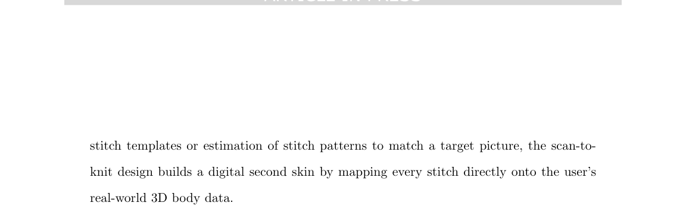

**Original caption:** Fig. 12.a illustrates an end-to-end workflow example of the scan-to-knit pipeline, which

**中文图注:** Fig. 12 原始图注已提取；逐项含义见下方分图说明。

**Reading note:** 结合正文首次引用位置和原始图注核对该图的证据角色。

### Figure 1

**Source:** p.105

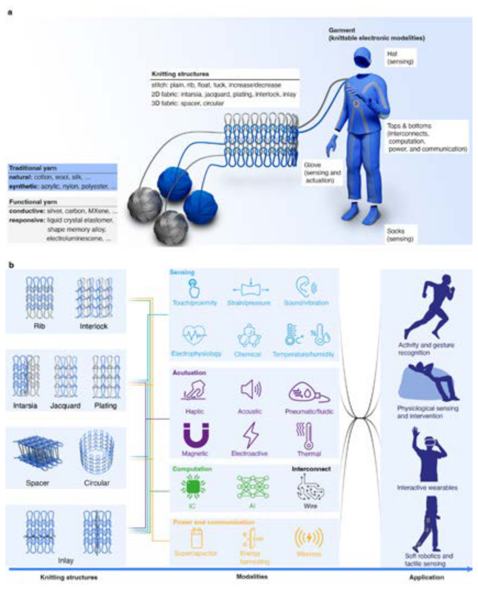

**Original caption:** Figure 1: a: Schematic illustration of knittable electronic textiles (e-textiles). Functional yarns are knitted into everyday garments using loop structures. Their mechanical flexibility and high surface area can facilitate intelligent soft wearables. b: Fibers and yarns, knitting structures, modalities, and applications of knittable e-textiles. Icons in Modalities and Application were obtained from istockphoto.com under standard license.

**中文图注:** Figure 1 原始图注已提取；逐项含义见下方分图说明。

**Reading note:** 重点查看器件结构、材料层次、信号路径和制备流程。

### Figure 2

**Source:** p.106

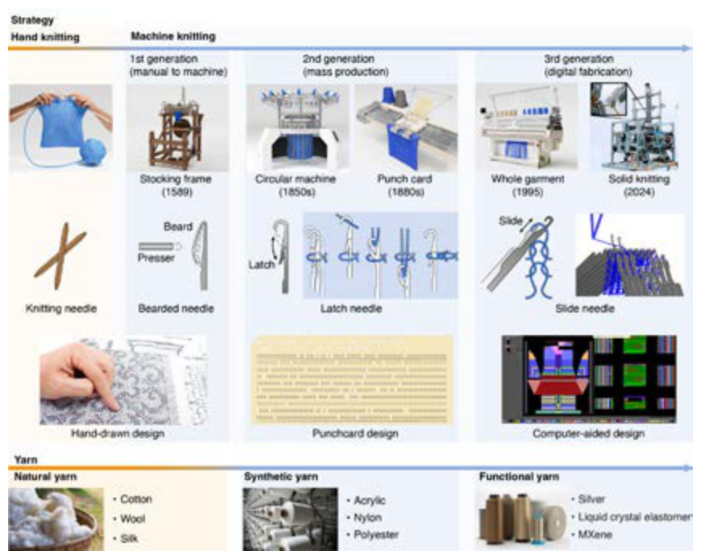

**Original caption:** Figure 2: Technological timeline in knitting technologies and fiber development. (solid knit, right top) reproduced from ACM [21], under CC BY 4.0 license.

**中文图注:** Figure 2 原始图注已提取；逐项含义见下方分图说明。

**Reading note:** 结合正文首次引用位置和原始图注核对该图的证据角色。

### Figure 3

**Source:** p.107

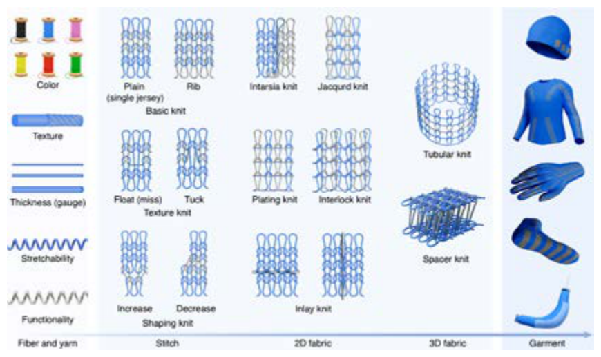

**Original caption:** Figure 3: Hierarchical structural design of knittable e-textiles composed of five levels. Yarn level: modulation of physical and functional properties. Stitch level: fundamental loop structures and shaping techniques. Fabric level: 2D and 3D fabrics through intarsia, jacquard, plating, interlock, inlay, circular, and spacer knitting. Garment level: diverse wearable and soft-robotic smart garments enabled by digital knitting.

**中文图注:** Figure 3 原始图注已提取；逐项含义见下方分图说明。

**Reading note:** 重点查看器件结构、材料层次、信号路径和制备流程。

### Figure 4

**Source:** p.108

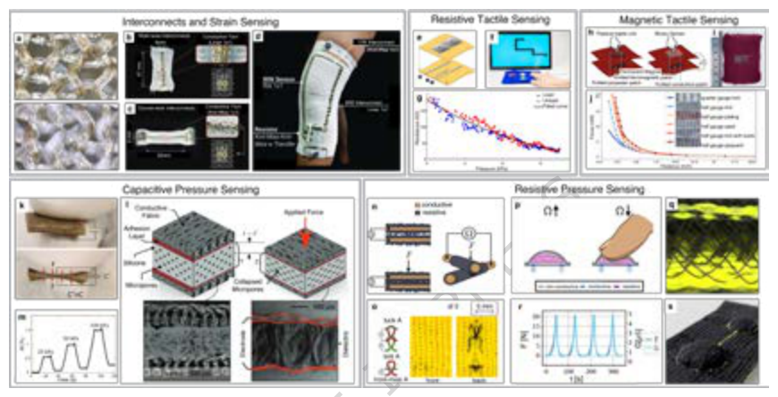

**Original caption:** Figure 4: Examples of knittable interconnects and sensors utilizing capacitive and piezoresistive capabilities. a: Weft knitted capacitive pressure sensors with conductive yarn interconnects. Reproduced with permission [58]. Copyright 2018, Taylor & Francis. b: Close up of walewise interconnect made with a linen 1x1 stitch. c: Close up of course-wise interconnect made with knit-miss 1x1 stitch. Reproduced with permission [54]. Copyright 2023, John Wiley & Sons. d: Integration of coursewise and walewise interconnects and rib-knit strain sensor knitted into knee joint monitoring sleeve. Reproduced with permission [105]. Copyright 2023, IEEE. e-g: Piezoresistive tactile sensing for a game controller. Reproduced from ACM [84], 2021 under CC BY 4.0 license. e: Assembly schematic of piezoresistive tactile sensor f: Usage of the game controller for snake game. g: Sensor data based on touch pressure and resistance change. h-j: Magnetic haptic touch sensor. Reproduced from ACM [86], 2023 under CC BY 4.0 license. h: Schematic for magnetic passive haptic touch unit and binary touch sensor. i: Example swatch of ferromagnetic patch knitted into non-conductive fabric. j: Sensor data of magnetic force vs distance for different knit types. k-m: Capacitive pressure sensor. Reproduced with permission [106]. Copyright 2018, John Wiley & Sons. k: Prototype of knitted sensor under pressure. l: Schematic of sensor cross section showing collapsed micropores of dielectric elastomer (top) and SEM images of sensor (bottom) m: Sensor capacitance response under applied pressure. n-o: Piezoresistive touch sensor made with intermeshed loops. Reproduced from ACM [113], 2024 under CC BY 4.0 license. n: Schematic of force sensitive resistor (FSR), where external stress varies the surface contact and alters conductivity. o: Implementation of FSR using two types of stitches: knit and front miss. p-s: Piezoresistive touch sensor made with resistive filler material. Reproduced from ACM [114], 2022 under CC BY 4.0 license. p: Schematic of touch sensor cross section, highlighting predicted resistance changes during touch, as well as nonconductive out layers, resistive filler, and conductive electrodes. q: Cross-sectional image of touch sensor with resistive filler. r: Force and conductivity measurements align during touch sensing. s: Sensor implementation in two buttons.

**中文图注:** Figure 4 原始图注已提取；逐项含义见下方分图说明。

**Reading note:** 重点查看器件结构、材料层次、信号路径和制备流程。

### Figure 5

**Source:** p.109

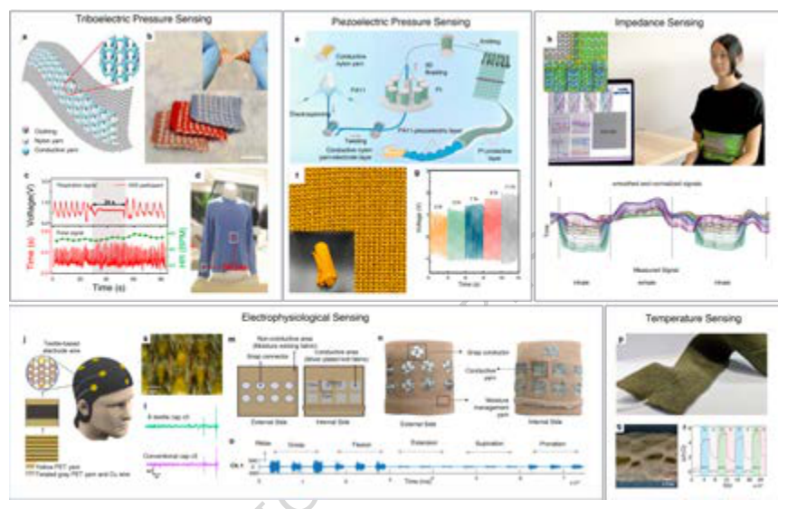

**Original caption:** Figure 5: Examples of knittable strain and tactile pressure sensors. a-d: Triboelectric strain sensor for wearable health monitoring. Reproduced with permission [117]. Copyright 2020, AAAS. a: Sensor schematic with areas of nylon (non-conductive) and conductive yarn. b: The fabricated sensor prototype remains soft and flexible after fabrication. c: When integrated, it can sense respiration and pulse in real time based on voltage changes, and d: seamlessly integrate into a shirt. e-g: Piezoelectric pressure sensor made from twisting and braiding conductive and piezoelectric fibers. Reproduced with permission [110]. Copyright 2025, Elsevier. e: Fabrication schematic of piezoelectric yarn sensor f: Fabric made of knitted piezoelectric yarns. g: Voltage response with increasing pressures from 3 N to 11 N at a frequency of 4 Hz. h-i: Knitted garment for health and gesture monitoring. Reproduced from ACM [126], 2022 under CC BY 4.0 license. h: When the user is wearing this garment, breathing can be detected through EIT enabled via impedance sensing. i: Respiration rate monitoring around the waist. j-l: Knitted EEG cap with knitted electrode wiring. Reproduced with permission [127]. Copyright 2025, Elsevier. j: Visualization of knitted e-textile EEG cap. k: close-up image of knitted structure of electrode. l: Sensor data showing the cap is comparable to traditional caps. m-o: Knitted armband with electrodes for surface EMG signal detection. Reproduced with permission [128]. Copyright 2018, IEEE. m: Schematic of arm band, with conductive areas knitted with intarsia. n: Prototype of an arm band. o: One of eight sEMG channels able to detect signals during various hand gestures. p-r: Temperature sensing arm band using an embedded RTD sensor. Reproduced from MDPI [136], 2022 under CC BY 4.0 license. p: garment prototype with sensor embedded in knit fabric. q: A knitted coating was applied over the temperature sensor. r: Sensor data for temperature change was collected for the user at rest, during and after exercise.

**中文图注:** Figure 5 原始图注已提取；逐项含义见下方分图说明。

**Reading note:** 重点查看器件结构、材料层次、信号路径和制备流程。

### Figure 6

**Source:** p.110

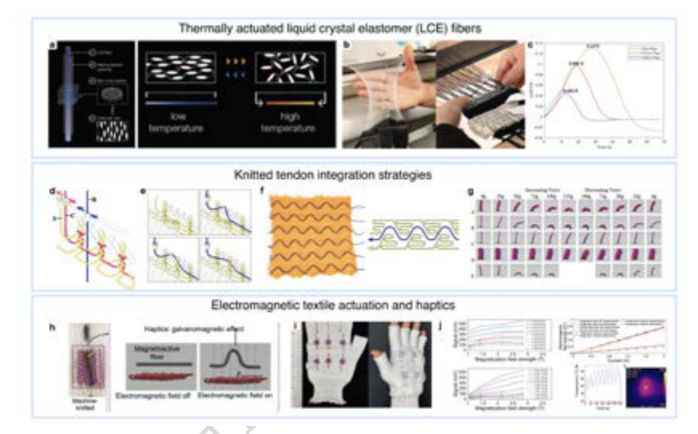

**Original caption:** Figure 6: Examples of knittable actuation techniques. a–c: Thermally actuated liquid crystal elastomer (LCE) fibers. Reproduced from ACM [150], 2023 under CC BY 4.0 license. a: Schematic of an LCE fiber actuator with an embedded heating element, illustrating molecular alignment changes under temperature variation. b: Fabrication pipeline from individual actuating fibers to integrated 4D knitted fabrics. c: Peak tensile loads generated during heating–cooling cycles for LCE fibers of different diameters (1.0 mm, 0.7 mm, and 0.5 mm). d–f: Knitted tendon integration strategies. Reproduced from ACM [42], 2019 under CC BY 4.0 license. d: Tangling technique for embedding vertical tendons, where carriers move along dedicated rails to avoid interference during directional transitions. e: Inlay technique for embedding horizontal tendons within knit structures. f: Diagram illustrating the resulting knit row configurations and tendon routing. g: Mechanical response comparison of fabrics using different stuffing materials under increasing and decreasing applied forces. h–j: MagTex electromagnetic textile actuation and haptics. Reproduced from ACM [78], 2025 under CC BY 4.0 license. h: Working principle of the MagTex haptic mechanism, where an alternating current induces vibration through galvanomagnetic and electromagnetic induction effects. i: Smart glove prototype incorporating six distributed MagTex actuator units. j: Characterization of the knitted electromagnet, showing signal response as a function of thermal variation and applied electromagnetic field strength.

**中文图注:** Figure 6 原始图注已提取；逐项含义见下方分图说明。

**Reading note:** 重点查看器件结构、材料层次、信号路径和制备流程。

### Figure 7

**Source:** p.111

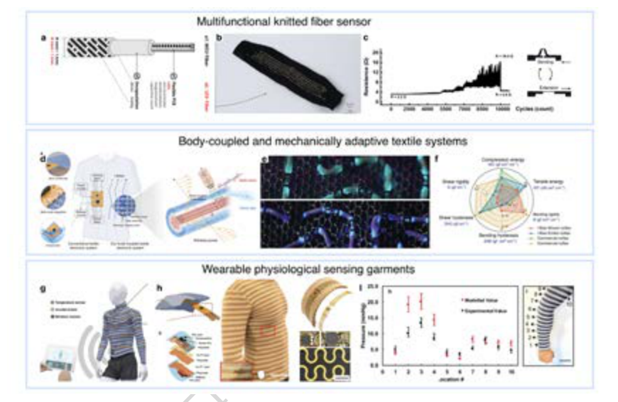

**Original caption:** Figure 7: Examples of textile-based sensing and integrated wearable electronic systems. Multifunctional knitted fiber sensor. a-c: Multifunctional knitted fiber sensor structure and its resistive response for strain. Reproduced from ACM [166], 2025 under CC BY 4.0 license. a: Schematic of a knitted fiber integrating an MCU fiber and LED fiber, encapsulated with flexible polymer layers and connected to a flexible PCB for signal processing. b: Photograph of the fabricated knitted sensor embedded within a textile substrate. c: Electrical resistance response under repeated bending and extension cycles, demonstrating mechanical durability over 10,000 cycles. d–f: Body-coupled and mechanically adaptive textile systems. Reproduced with permission [167]. Copyright 2024, AAAS. d: System overview comparing conventional textile electronics with a body-coupled textile electronic system that integrates sensing fibers, wireless power transfer, and display fibers. e: Close-up optical images of the textile structure showing embedded functional elements under illumination. f: Radar plot comparing mechanical properties, including compression energy, tensile energy, bending rigidity, and hysteresis across i-fiber woven textiles, commercial cortex fabrics, and conventional nyltex. g–i: Wearable physiological sensing garments. Reproduced from Springer Nature [287], 2020 under CC BY 4.0 license.g: Smart garment integrating temperature sensors, accelerometers, and wireless modules distributed across the textile for continuous monitoring. h: Layered structure and fabrication details of a stretchable sensor module embedded within knit fabrics, along with garment-level integration examples. i: Validation of pressure sensing performance, showing modeled versus experimental pressure measurements across multiple sensing locations on the garment.

**中文图注:** Figure 7 原始图注已提取；逐项含义见下方分图说明。

**Reading note:** 重点查看器件结构、材料层次、信号路径和制备流程。

### Figure 8

**Source:** p.112

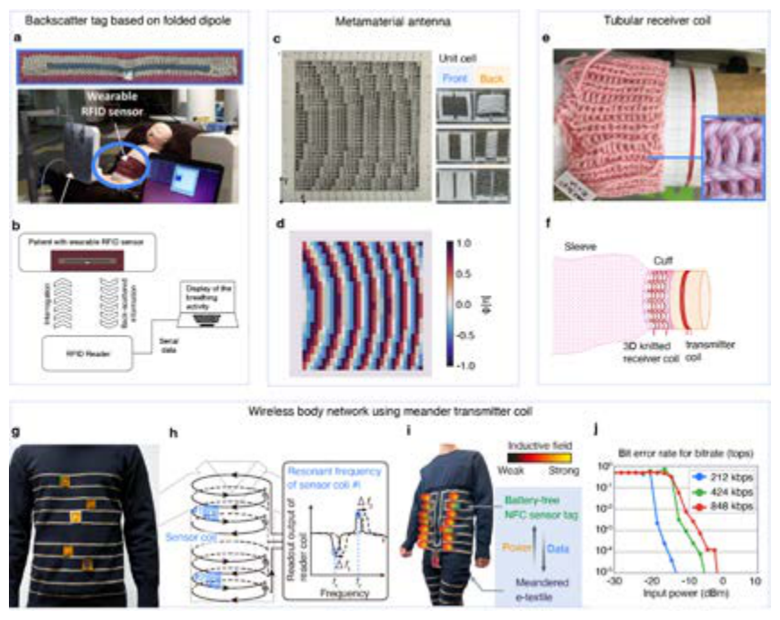

**Original caption:** Figure 8: Examples of knittable communication-enabled e-textiles. a-b: Knitted RFID tag created by intarsia knitting of conductive yarns. Reproduced with permission [179]. Copyright 2016, IEEE. a: System overview of wearable RFID sensor. b: Backscatter communication between the knittable RFID tags and an external wireless reader. c-d: Knittable matamaterial antenna created by double-layered jacquard knitting of conductive yarn and dielectric nylon yarn. Reproduced with permission [46]. Copyright 2024, John Wiley & Sons. c: Photograph of the knittable metamaterial antenna and d: its phased modulation pattern. e-f: Knittable 3D spiral receiver (RX) coil. Reproduced with permission [188]. Copyright 2021, Elsevier. e: Photograph of the knittable RX spiral coil and f: schematics around the wrist. g-h: Knittable 3D meander coil by intarsia knitting. Reproduced from ACM [31], 2021 under CC BY 4.0 license. g: Photograph of the knittable meander coil. h: Wireless interrogation of the meander coil for battery-free on-body resonant sensor coils. i-j: NFC-based knittable meandered e-textiles. Reproduced with permission from Ryo Takahashi [50].i: Photograph of the NFC-based knittable meandered e-textiles. j: NFC performance of the meandered e-textiles for different NFC data rates.

**中文图注:** Figure 8 原始图注已提取；逐项含义见下方分图说明。

**Reading note:** 重点查看器件结构、材料层次、信号路径和制备流程。

### Figure 9

**Source:** p.113

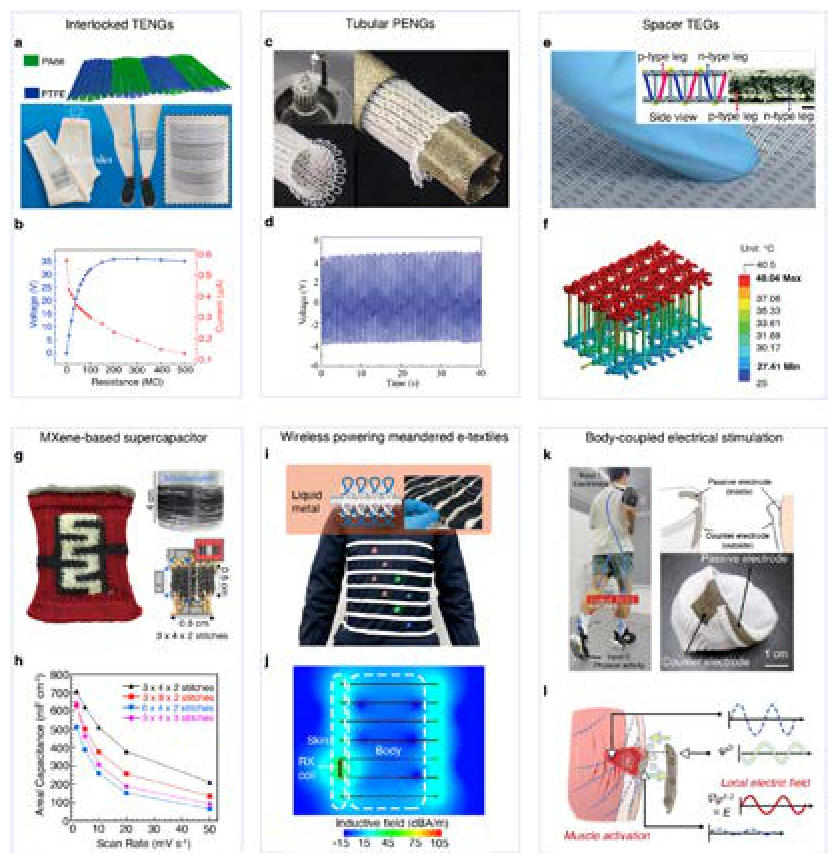

**Original caption:** Figure 9: Examples of knittable powering e-textiles. a-b: Knittable triboelectric nanogenerators (TENGs) by interlock knitting of PA66 and PTFE yarns. Reproduced with permission [194]. Copyright 2020, Elsevier. a: Prototype photograph of the knittable TENGs. b: Electrical output performance of the TENG textile showing voltage and current relative to load resistance. c-d: Knittable piezoelectric nanogenerators (PENGs) with a tubular knit structure. Reproduced from John Wiley & Sons [111], 2020, under CC BY 4.0 license. c: Prototype photograph of the knittable PENGs. d: Voltage output of the PENG textile over time under mechanical deformation. e-f: Knittable thermoelectric generator (TEG) based on a 3D spacer knit structure, where vertical carbon-nanotube yarns serve as pillars to maintain a temperature gradient. Reproduced with permission [194]. Copyright 2020, The Royal Society of Chemistry.e: Prototype photograph of the knittable TEG. f: Thermal simulation across the textile. g-h: knittable supercapacitor fabricated via intarsia knitting, interlacing MXene-coated cotton yarns into a dense interlock rib structure to create 2D planar electrodes. Reproduced with permission [206]. Copyright 2020, Elsevier. g: Prototype photograph of the knittable supercapacitor. h: Areal capacitance performance for scan rates. i-j: Knittable meander coil integrated into a garment by inserting a liquid-metal-filled tube in a plating-knitted tube holder. Reproduced from ACM [47], 2022, under CC BY 4.0 license.i: Prototype photograph of the knittable meander coil for Watt-class wireless powering. j: Simulation of the inductive field generation around the meander coil. k-l: Knittable socks with two pairs of electrodes for body-coupled electrical stimulation. Reproduced from ACM [213], 2024, under CC BY 4.0 license. k: Prototype photograph of the knittable socks for body-coupled electrical stimulation. l: Schematic of wireless electrical stimulation of muscle via the local electric field generated between the electrodes.

**中文图注:** Figure 9 原始图注已提取；逐项含义见下方分图说明。

**Reading note:** 重点查看器件结构、材料层次、信号路径和制备流程。

### Figure 10

**Source:** p.114

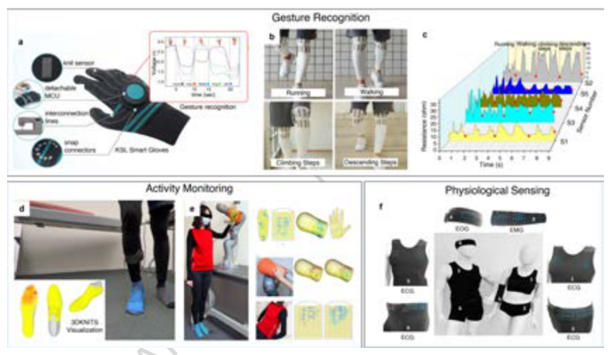

**Original caption:** Figure 10: Examples of knittable e-textiles applications for gesture recognition, activity monitoring, and physiological sensing. a: A Korean Sign Language glove that can recognize 8 different KSL gestures. Reproduced from MDPI [104], 2025 under CC BY 4.0 license. b: Knitted sensors on sweatpants that enable detection of lower body movement type, such as walking, running, ascending or descending stairs. Reproduced from MDPI [215], 2019 under CC BY 4.0 license. c: Distinct signals from each movement type for categorization. d: Knitted shoe able to detect pressure during activity. Reproduced with permission [55]. Copyright 2022, IEEE. e: Full body garments for human-environment and human-robot sensing. Reproduced with permission [51]. Copyright 2021, Springer Nature. f: Garments enabling EOG, ECG, and EMG signal detection. Reproduced with permission [124]. Copyright 2022, John Wiley & Sons.

**中文图注:** Figure 10 原始图注已提取；逐项含义见下方分图说明。

**Reading note:** 重点查看任务设置、基线、消融和失败案例，判断系统演示是否真正支撑前端价值。

### Figure 11

**Source:** p.115

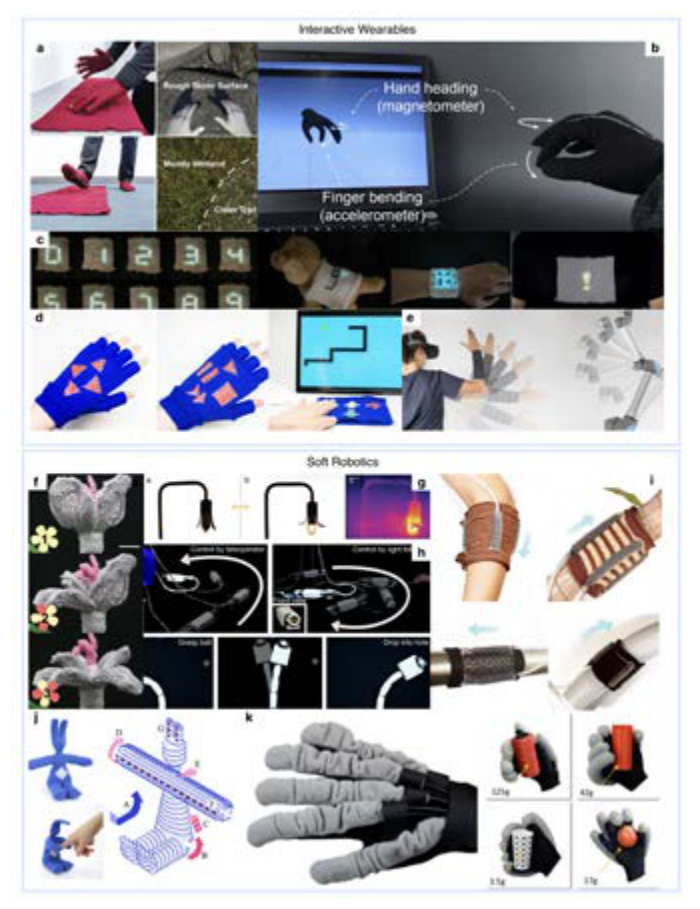

**Original caption:** Figure 11: a: Knittable interactive surfaces enabling integrated sensing and haptic feedback for virtual reality interaction. Reproduced from ACM [288], 2023 under CC BY 4.0 license. b: Glove-based input system capturing hand orientation and finger bending using embedded inertial sensors. Reproduced from ACM [166], 2025 under CC BY 4.0 license. c: Fabric-integrated textile displays providing dynamic visual feedback directly on garments. Reproduced from ACM [162], 2025 under CC BY 4.0 license. d: Knitted glove interface with conductive patterns supporting directional and gesture-based input. Reproduced from ACM [84], 2021 under CC BY 4.0 license.e: Wearable textile controller enabling continuous arm and hand interaction for robotic control. Reproduced with permission [160]. Copyright 2024, AAAS. f: The textilebased actuator morphs through the activation of a shape-memory alloy. Reproduced with permission [149]. Copyright 2027, John Wiley and Sons . g: A morphing lamp cover using textile actuators that respond to thermal stimuli. Reproduced from ACM [150], 2023 under CC BY 4.0 license. h: Wearable soft robotic sleeve providing assistive arm bending via fabric-based actuation. Reproduced with permission [120]. Copyright 2018, AAAS. i: Textile reinforced soft actuators enabling controlled deformation and directional motion for health and assistive applications. Reproduced from ACM [152], 2022 under CC BY 4.0 license. j: Schematic and prototype of a textile actuator illustrating stitch- and fiber-defined motion behaviors. Reproduced from ACM [42], 2019 under CC BY 4.0 license. k: Soft robotic glove with integrated pneumatic textile actuators enabling adaptive grasping of objects with diverse shapes and weights. Reproduced from MDPI [155], 2021 under CC BY 4.0 license.

**中文图注:** Figure 11 原始图注已提取；逐项含义见下方分图说明。

**Reading note:** 重点查看器件结构、材料层次、信号路径和制备流程。

### Figure 12

**Source:** p.116

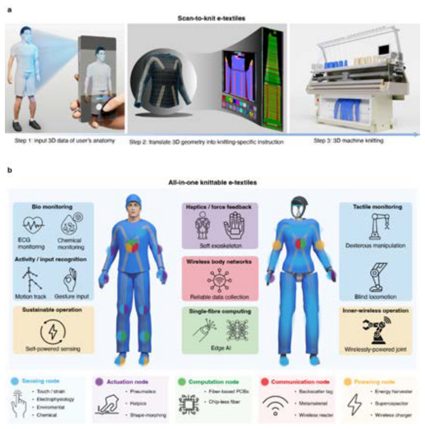

**Original caption:** Figure 12: Outlook of knittable e-textiles. a: scan-to-knit e-textiles, mainly comprising three steps: 3D body scanning of the user, computational design for mapping functional patterns onto the garment geometry, and automated fabrication using industrial 3D knitting machines. b: all-in-one knittable e-textiles. The integration of sensing, actuation, computation, communication, and powering nodes enables diverse applications ranging from bio-monitoring and haptic feedback to edge AI and a self-powered wearable ecosystem.

**中文图注:** Figure 12 原始图注已提取；逐项含义见下方分图说明。

**Reading note:** 重点查看器件结构、材料层次、信号路径和制备流程。
