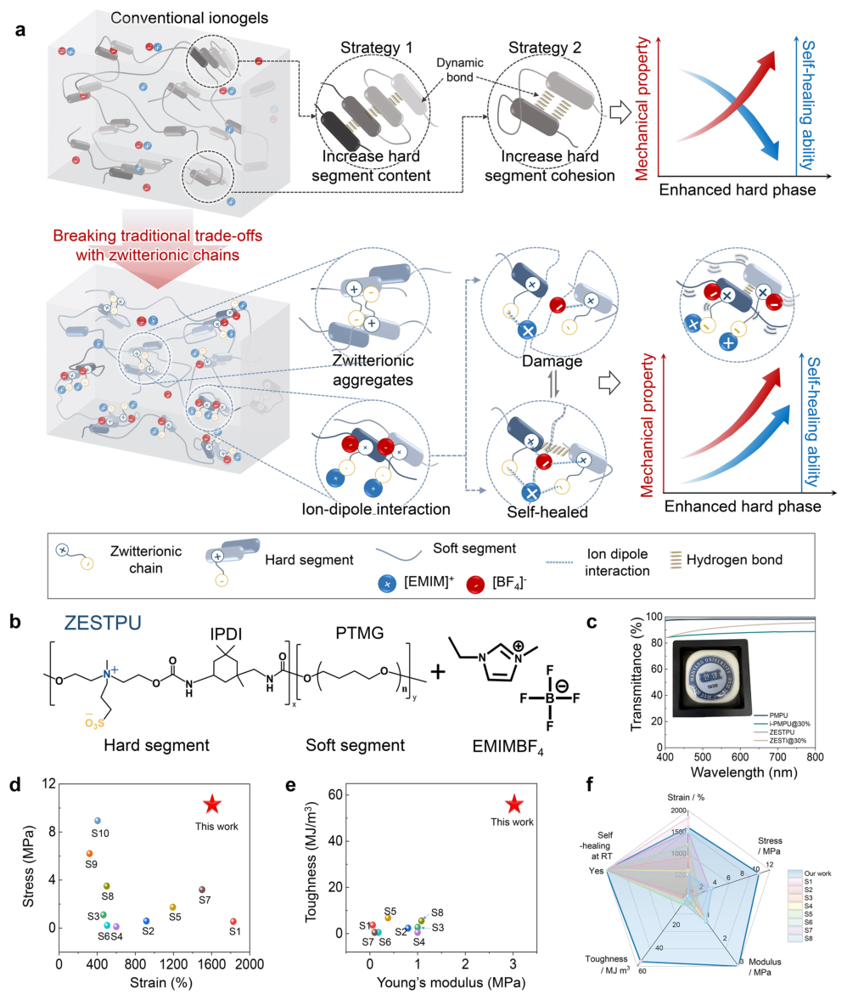
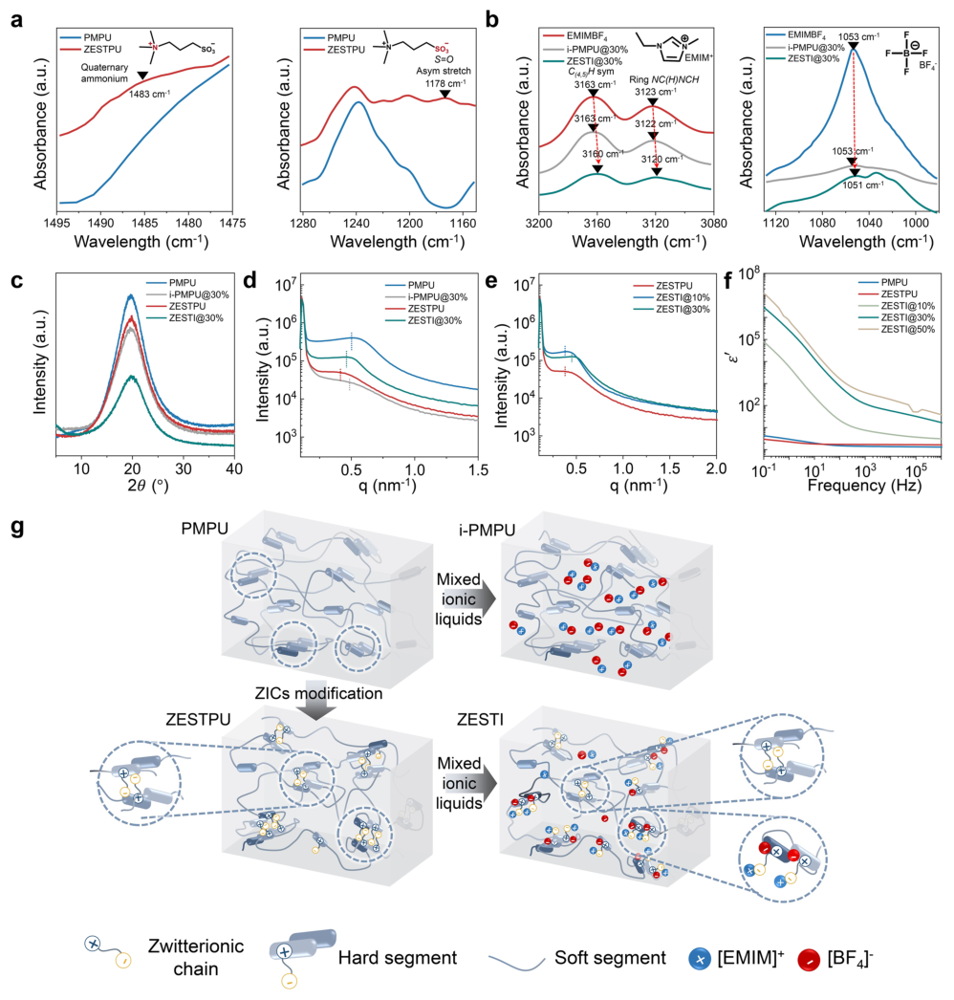
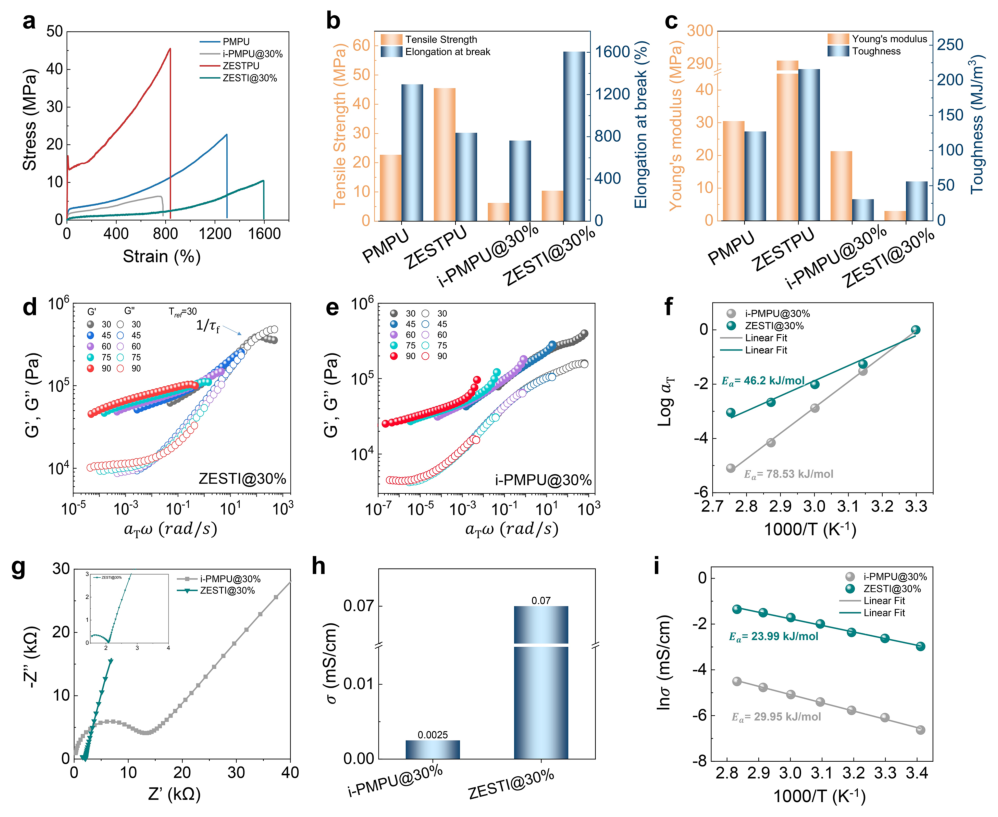
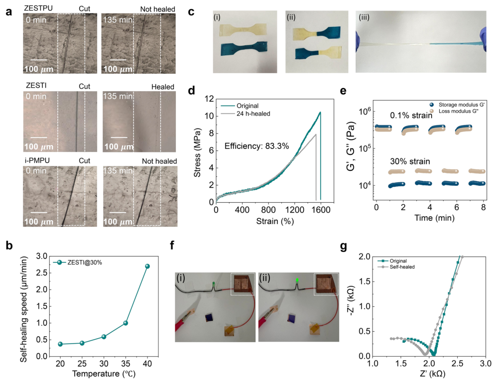
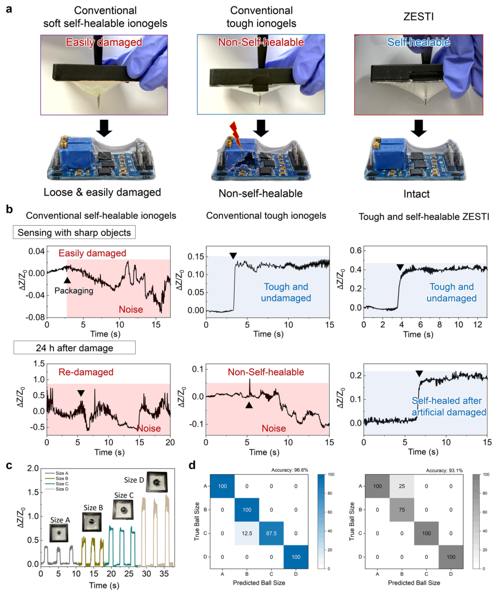

# Zwitterionic Ionogels Resolving the Trade-Off Between Mechanical Strength and Autonomous Self-Healing for Iontronics

- 期刊：Nano-Micro Letters
- 日期：2026-07-30
- DOI：10.1007/s40820-026-02318-1
- 解析状态：fulltext_draft

## 摘要与研究价值

**Original:** Abstract Simultaneously achieving mechanical robustness and autonomous self-healing in ionogels remains a fundamental challenge for durable, skin-like electronics. Conventional approaches often improve mechanical strength by introducing rigid or densely cross-linked polymer networks, but such strategies inevitably restrict polymer chain mobility and hinder dynamic bond reconfiguration required for healing. Here, a zwitterionic side-chain engineered tough ionogel (ZESTI) is developed to overcome this trade-off through molecular-level design. Hydrophilic zwitterions are covalently grafted onto a hydrophobic polyurethane backbone to preferentially interact with the ionic liquid through ion–dipole interactions and thereby regulate its distribution. This architecture simultaneously facilitates dipole–dipole interactions for mechanical reinforcement and ion–dipole coordination for efficient self-healing under ambient conditions. As a result, ZESTI exhibits an exceptional combination of tensile strength (10.40 MPa), stretchability (1606%), toughness (56.03 MJ m −3 ), and ambient self-healing efficiency exceeding 83%, while maintaining high ionic conductivity via enhanced ion hopping. When constructed as a self-reporting packaging interface, ZESTI provides stable protection and state perception under sharp contact and restores signal output after mechanical damage through self-healing. This work offers a generalizable design strategy that reconciles mechanical toughness with dynamic functionality in ionogels, establishing a general design paradigm for next-generation self-sustaining iontronic devices.

**中文:** 涉及坏点、漂移、跨器件迁移或少样本校准。摘要可核实数值包括：10.40 MPa、1606%、83%。

## 创新点

- Abstract Simultaneously achieving mechanical robustness and autonomous self-healing in ionogels remains a fundamental challenge for durable, skin-like electronics.
- 涉及坏点、漂移、跨器件迁移或少样本校准

## 对当前课题的启发

- 涉及坏点、漂移、跨器件迁移或少样本校准
- 可对照 raw pixel、software feature 与 physical projection 的性能/通道/功耗

## 制备与实验步骤

### 1. 组装与封装

**Source:** p.1

**Original:** polymer chain mobility and hinder dynamic bond reconfiguration required for heal- ion hopping.

**中文:** 组装与封装步骤，关键配比、时间、温度和设备参数以 p.1 原文为准。

### 2. 组装与封装

**Source:** p.1

**Original:** When constructed as a self-reporting packaging interface, ZESTI provides stable protection and state perception under Flexible and wearable electronic skins are poised to transform applications into flexible electronics [1, 2], intelligent packaging [3, 4], soft robotics [5–7], and physically embodied artificial intelligence [8, 9].

**中文:** 组装与封装步骤，关键配比、时间、温度和设备参数以 p.1 原文为准。

### 3. 组装与封装

**Source:** p.1

**Original:** While such networks enhance structural stability, they inevitably restrict polymer chain mobility, limiting the dynamic bond reconfiguration required for autonomous healing.

**中文:** 组装与封装步骤，关键配比、时间、温度和设备参数以 p.1 原文为准。

### 4. 组装与封装

**Source:** p.1

**Original:** Physical cross-linking within PU hard domains, mediated by hydrogen bonding and dipole–dipole interactions, provides excellent mechanical strength and energy dissipation.

**中文:** 组装与封装步骤，关键配比、时间、温度和设备参数以 p.1 原文为准。

### 5. 组装与封装

**Source:** p.1

**Original:** Incorporating dynamic bonding motifs into PU networks has further enabled self-healing through reversible bond exchange.

**中文:** 组装与封装步骤，关键配比、时间、温度和设备参数以 p.1 原文为准。

### 6. 制备与实验操作

**Source:** p.1

**Original:** However, integrating ionic liquids (ILs) into PU-based ionogels remains inherently difficult, as ILs can disrupt hard-segment self-assembly, diminishing phase separation and undermining both mechanical performance and healing functionality.

**中文:** 制备与实验操作步骤，关键配比、时间、温度和设备参数以 p.1 原文为准。

### 7. 组装与封装

**Source:** p.1

**Original:** Leveraging this multifunctional architecture, we employed the ZESTI as a multifunctional encapsulation platform while sustaining electrical and mechanical integrity under repeated deformation.

**中文:** 组装与封装步骤，关键配比、时间、温度和设备参数以 p.1 原文为准。

### 8. 材料混合与分散

**Source:** p.3

**Original:** 2.4 Preparation of i‑PMPU and ZESTI ZESTI was prepared by dissolving ZESTPU and 30 wt% [EMIM]+[BF4]– ionic liquid (IL) in DMF, while stirring at room temperature for 8 h.

**中文:** 材料混合与分散步骤，关键配比、时间、温度和设备参数以 p.3 原文为准。

### 9. 图形化与结构成形

**Source:** p.3

**Original:** The solution was then poured into a square PTFE mold and annealed for 48–72 h at 60 °C under optimized conditions (initially starting at 40 °C with temperature intervals of 10 °C h−1).

**中文:** 图形化与结构成形步骤，关键配比、时间、温度和设备参数以 p.3 原文为准。

### 10. 制备与实验操作

**Source:** p.3

**Original:** Likewise, i-PMPU (used as reference) was prepared by combining PMPU and IL following the same procedure as described above.

**中文:** 制备与实验操作步骤，关键配比、时间、温度和设备参数以 p.3 原文为准。

### 11. 材料混合与分散

**Source:** p.3

**Original:** After the reactants were completely dissolved at 45 °C, IPDI (5.78 g) was added using a vacuum syringe.

**中文:** 材料混合与分散步骤，关键配比、时间、温度和设备参数以 p.3 原文为准。

### 12. 图形化与结构成形

**Source:** p.3

**Original:** After the reaction, the solution was cast into a PTFE mold and placed on a heating plate for drying.

**中文:** 图形化与结构成形步骤，关键配比、时间、温度和设备参数以 p.3 原文为准。

### 13. 成膜与沉积

**Source:** p.3

**Original:** Following solvent evaporation, the target product was further dried in a vacuum oven at 60 °C for 24 h to obtain ZESTPU (Scheme S2 and Fig. S1).

**中文:** 成膜与沉积步骤，关键配比、时间、温度和设备参数以 p.3 原文为准。

### 14. 制备与实验操作

**Source:** p.4

**Original:** To evaluate the potential application of high-performance ZESTI in flexible electronic devices, ZESTI-based selfreporting packaging interface and strain sensor devices were designed and fabricated for functional demonstration.

**中文:** 制备与实验操作步骤，关键配比、时间、温度和设备参数以 p.4 原文为准。

### 15. 组装与封装

**Source:** p.4

**Original:** Additionally, the reversible nature of the ion–dipole interactions allows noncovalent bonds to repeatedly dissociate and reform, enabling ZESTI to self-heal efficiently at room temperature.

**中文:** 组装与封装步骤，关键配比、时间、温度和设备参数以 p.4 原文为准。

### 16. 组装与封装

**Source:** p.4

**Original:** To provide a comprehensive assessment, a radar chart was constructed (Fig. 1f), Fig. 2 a ATR-FTIR spectra of PMPU and ZESTPU confirming the presence of zwitterionic side chains.

**中文:** 组装与封装步骤，关键配比、时间、温度和设备参数以 p.4 原文为准。

## 方法原文锚点

**Source:** p.1 M001

**Original:** polymer chain mobility and hinder dynamic bond reconfiguration required for heal-

**中文:** 该段已进入结构化方法步骤；完整逐段翻译待智能体精读补齐。

**Source:** p.1 M002

**Original:** ion hopping. When constructed as a self-reporting packaging interface, ZESTI provides stable protection and state perception under

**中文:** 该段已进入结构化方法步骤；完整逐段翻译待智能体精读补齐。

**Source:** p.2 M003

**Original:** Flexible and wearable electronic skins are poised to transform applications into flexible electronics [1, 2], intelligent packaging [3, 4], soft robotics [5–7], and physically embodied artificial intelligence [8, 9]. A key prerequisite for these technologies is the development of materials that are not only intrinsically conductive but also mechanically robust and autonomously self-healing [10, 11]. These combined attributes are essential for ensuring long-term durability, enabling devices to withstand continuous mechanical deformation and recover from physical damage without external intervention. Ionogels, polymer networks swollen with ionic liquids, have emerged as promising candidates for such platforms due to their inherent ionic conductivity and mechanical flexibility [12]. However, achieving both high mechanical strength and efficient self-healing within a single ionogel remains a significant challenge [13, 14]. Conventional strategies often rely on rigid or densely cross-linked polymer networks to improve mechanical integrity [15–17]. While such networks enhance structural stability, they inevitably restrict polymer chain mobility, limiting the dynamic bond reconfiguration required for autonomous healing. Consequently, many mechanically strong ionogels demand external stimuli to initiate healing, which undermines their practicality in wearable applications. This long-standing trade-off between mechanical toughness and autonomous reparability continues to constrain the design space for truly sustainable iontronic materials. To address this challenge, recent efforts have focused on engineering microphase-separated or hierarchically organized ionogel networks that couple mechanically reinforcing domains with dynamic soft phases within a single matrix [12, 18, 19]. Recent breakthroughs based on synergistic entanglement and multiphase interlocking architectures have further expanded this design space by improving mechanical robustness, deformation adaptability, and energy dissipation in high-performance ionogels [20–22]. These architectures highlight the importance of spatially organized networks for balancing strength and flexibility. However, mechanical reinforcement alone does not fully address the requirements of self-sustaining iontronic materials, because autonomous repair also requires reversible interactions, polymer chain reconfigurability, and efficient ion transport after damage. Polyurethanes (PUs) are widely recognized for their ability

**中文:** 该段已进入结构化方法步骤；完整逐段翻译待智能体精读补齐。

**Source:** p.2 M004

**Original:** to form well-defined microphase-separated morphologies, owing to strong polarity contrast between their hard and soft segments [23, 24]. Physical cross-linking within PU hard domains, mediated by hydrogen bonding and dipole–dipole interactions, provides excellent mechanical strength and energy dissipation. Incorporating dynamic bonding motifs into PU networks has further enabled self-healing through reversible bond exchange. However, integrating ionic liquids (ILs) into PU-based ionogels remains inherently difficult, as ILs can disrupt hard-segment self-assembly, diminishing phase separation and undermining both mechanical performance and healing functionality. Here, we report a zwitterion-enabled molecular engineering strategy that simultaneously imparts tough and spontaneous self-healing by leveraging reversible ion–dipole interactions in the network. Specifically, hydrophilic zwitterions are covalently grafted onto a hydrophobic polyurethane backbone, forming well-defined phase-separated domains. The zwitterionic blocks preferentially interact with [EMIM]+[BF4]− through ion–dipole interactions, thereby preserving the physical cross-linking points within the hard segments while maintaining uniform IL distribution. Compared with typical zwitterionic ionogels in which zwitterionic groups mainly serve as ion-coordination or iontransport sites, our design uses zwitterionic side chains to regulate the microphase-separated polyurethane architecture itself. This dual role enables the same molecular motif to preserve hard-segment cohesion, regulate the distribution of the ionic liquid, and provide reversible ion–dipole interactions for autonomous healing and efficient ion transport. Simultaneously, dipole–dipole interactions between zwitterionic moieties promote partial hard-domain aggregation, synergistically reinforcing the network. This design yields a zwitterionic side-chain engineered tough ionogel (ZESTI) that simultaneously achieves high tensile strength, large elongation, outstanding toughness, and robust Young’s modulus. Beyond mechanical enhancement, the zwitterionic motifs promote dynamic ion–dipole interactions with the IL, enabling autonomous self-healing at ambient temperature while suppressing plasticization. Additionally, these motifs facilitate efficient ion-hopping mechanisms, leading to enhanced ionic conductivity compared to conventional self-healing gels. Leveraging this multifunctional architecture, we employed the ZESTI as a multifunctional encapsulation platform while sustaining electrical and mechanical integrity under repeated deformation. Intrinsic self-healing

**中文:** 该段已进入结构化方法步骤；完整逐段翻译待智能体精读补齐。

**Source:** p.3 M005

**Original:** 2.4 Preparation of i‑PMPU and ZESTI

**中文:** 该段已进入结构化方法步骤；完整逐段翻译待智能体精读补齐。

**Source:** p.3 M006

**Original:** ZESTI was prepared by dissolving ZESTPU and 30 wt% [EMIM]+[BF4]– ionic liquid (IL) in DMF, while stirring at room temperature for 8 h. The solution was then poured into a square PTFE mold and annealed for 48–72 h at 60 °C under optimized conditions (initially starting at 40 °C with temperature intervals of 10 °C h−1). Notably, in this study, the weight percentage of IL represents the weight ratio of IL to IL + PU. Hence, ZESTI@10% was composed of 10 wt% IL + ZESTPU. Likewise, i-PMPU (used as reference) was prepared by combining PMPU and IL following the same procedure as described above.

**中文:** 该段已进入结构化方法步骤；完整逐段翻译待智能体精读补齐。

**Source:** p.3 M007

**Original:** In a glove box filled with 99.999% N₂, PTMG (10.00 g), chain extender MDEA (2.50 g), catalyst DBTDL (0.25 g), and anhydrous THF (40 g) were added into a three-neck reactor equipped with a mechanical stirrer. After the reactants were completely dissolved at 45 °C, IPDI (5.78 g) was added using a vacuum syringe. The reaction mixture was heated at 70 °C for 6 h. The target product was washed several times with deionized water and then dried in a vacuum oven at 60 °C for 24 h to obtain PMPU (Scheme S1 and Fig. S1).

**中文:** 该段已进入结构化方法步骤；完整逐段翻译待智能体精读补齐。

**Source:** p.3 M008

**Original:** In a glove box filled with 99.999% N₂, PMPU (10.00 g), PS (2.10 g, molar ratio of PS/MDEA = 1:1.5), and DMF (40 g) were added into a round-bottom flask. The reaction was heated at 70 °C for 24 h. After the reaction, the solution was cast into a PTFE mold and placed on a heating plate for drying. Following solvent evaporation, the target product was further dried in a vacuum oven at 60 °C for 24 h to obtain ZESTPU (Scheme S2 and Fig. S1).

**中文:** 该段已进入结构化方法步骤；完整逐段翻译待智能体精读补齐。

**Source:** p.4 M009

**Original:** To evaluate the potential application of high-performance ZESTI in flexible electronic devices, ZESTI-based selfreporting packaging interface and strain sensor devices were designed and fabricated for functional demonstration. In the

**中文:** 该段已进入结构化方法步骤；完整逐段翻译待智能体精读补齐。

**Source:** p.5 M010

**Original:** zwitterionic chain. The sulfonate-type zwitterionic side chains exhibit a preferential ion–dipole interaction with hydrophilic ionic liquids enabled by their high dipole moment and anti-polyelectrolyte behavior [27]. These dynamic interactions promote effective mechanical energy dissipation under deformation, thereby enhancing mechanical performance [26]. Under an applied electric field, the zwitterionic side chains also tend to align along the field direction, forming efficient ion conduction pathways within the ionogel network [28, 29]. Additionally, the reversible nature of the ion–dipole interactions allows noncovalent bonds to repeatedly dissociate and reform, enabling ZESTI to self-heal efficiently at room temperature. We incorporated an ionic liquid into PMPU- and ZESTPU-based matrix (i-PMPU and ZESTI, respectively) to investigate the influence of zwitterionic side chains on the ionic liquid behavior within the ionogel network. Figure 1b shows the chemical structures of the ZESTPU and ionic liquid. As shown in Fig. 1c, all four samples exhibit excellent optical transparency, with transmittance exceeding 80% across the visible range (400–800 nm), suggesting that the ionogel networks remain optically homogeneous on the visible-light length scale. Notably, ZESTPU and PMPU show comparable transmittance values of approximately 98% and 99% at 550 nm, respectively, indicating that the introduction of zwitterionic side chains has a limited effect on the optical transparency of the polyurethane matrix. This result suggests that the zwitterionic component mainly modulates the weak microphaseseparated structure without inducing large phase-separated domains or strong light scattering, which is advantageous for potential applications in flexible displays and wearable electronics. Importantly, enabled by the zwitterionic side-chain engineering strategy, ZESTI (IL 30 wt%) simultaneously achieves outstanding mechanical strength, ambient selfhealing capability, and high ionic conductivity. Compared with previously reported self-healing ionogels, ZESTI demonstrates superior performance in multiple mechanical parameters, including tensile strength, elongation at break, Young’s modulus, and toughness, achieving a comprehensive enhancement in mechanical properties, as shown in Fig. 1d, e. This comprehensive performance improvement highlights the effectiveness and advancement of the zwitterionic side-chain engineering strategy in constructing highperformance multifunctional ionogels. To provide a comprehensive assessment, a radar chart was constructed (Fig. 1f),

**中文:** 该段已进入结构化方法步骤；完整逐段翻译待智能体精读补齐。

**Source:** p.7 M011

**Original:** Fig. 2 a ATR-FTIR spectra of PMPU and ZESTPU confirming the presence of zwitterionic side chains. b ATR-FTIR spectra of [EMIM]+[BF4]−, i-PMPU, and ZESTI@30% verifying ion–dipole interactions. c XRD patterns and d, e SAXS profiles of PMPU, ZESTPU, i-PMPU, and ZESTI. f Frequency-dependent dielectric responses of PMPU, ZESTPU, and ZESTIs with different IL contents. g Schematic representations of internal structures of PMPU, ZESTPU, i-PMPU, and ZESTI

**中文:** 该段已进入结构化方法步骤；完整逐段翻译待智能体精读补齐。

**Source:** p.10 M012

**Original:** interfaces. As a result, polymer chains are restricted at the phase boundaries and cannot fully disperse into the ionic liquid, thus hindering chain mobility and flexibility recovery, ultimately compromising both ductility and toughness [12]. Given that the mechanical strength of the hard phase is critical for the mechanical performance of the polyurethane matrix, it is necessary to systematically investigate the effect of ionic liquid content. For this purpose, ionogels containing 10%, 30%, and 50% ionic liquid were tested using UTM, as shown in Fig. S5a–c and Table S7. As the ionic liquid content increased, a clear decreasing trend in tensile strength,

**中文:** 该段已进入结构化方法步骤；完整逐段翻译待智能体精读补齐。

**Source:** p.11 M013

**Original:** excellent network reconfigurability [43]. To further quantify the polymer chain dynamics in ionogels, horizontal shift factors (aT) obtained during the construction of the master curves were extracted and plotted as a function of temperature (Fig. 3f), which follows an Arrhenius relationship (Eq. 1) [41, 44]:

**中文:** 该段已进入结构化方法步骤；完整逐段翻译待智能体精读补齐。

**Source:** p.11 M014

**Original:** ZESTI hereafter refers to ZESTI@30%. In this study, the polyurethane hard/soft segment ratio and zwitterionic grafting condition were kept constant to isolate the role of zwitterionic side chains and their coupled interactions with the ionic liquid. Therefore, the ionic liquid content varied from 10 to 50 wt% as the primary compositional parameter to identify a formulation that balances mechanical integrity, ionic conductivity, and self-healing performance. For ionogels intended for flexible electronic applications, mechanical toughness and high elongation at break are key determinants of structural durability and device reliability under large deformations and cyclic loading. Therefore, it is essential to explore the structure–property relationship from the perspective of polymer chain dynamics at the microscopic scale to elucidate the origin of macroscopic toughness and extensibility. As shown in Fig. S7a, b, dynamic viscoelastic properties of ZESTI and i-PMPU were measured under 1% strain over a wide frequency and temperature range (30 ~ 90 °C) using a rheometer. The results show that, at lower temperatures, limited chain mobility and enhanced ion–dipole interactions lead to increased storage modulus (G′) and loss modulus (G″). Furthermore, based on the time–temperature superposition (TTS) principle, master curves of G′ and G″ over the frequency range of 0.05 ~ 500 rad s−1 were constructed at a reference temperature of 30 °C (Fig. 3d, e) [41]. For ZESTI, both G′ and G″ increase with frequency, exhibiting the typical response of viscoelastic materials. In the plateau region, G′ is significantly higher than G″, and a crossover point is observed at high frequency, indicating the presence of chain relaxation, slippage, or rearrangement, which facilitates stress release and energy dissipation under large deformation [42]. In contrast, i-PMPU shows a solid-like behavior, with G′ remaining higher than G″ across the entire frequency range and no crossover point observed. This suggests that chain mobility is restricted and that the system lacks effective energy-dissipation mechanisms, resulting in greater rigidity and reduced flexibility. This conclusion is further supported by stress relaxation experiments. As shown in Fig. S7c, under the same constant strain (1%), ZESTI exhibits rapid stress decay of approximately 80% within 50 s, stabilizing below 1/e, indicating a significantly faster relaxation capacity compared to i-PMPU. The decay behavior of the stress–time curve reflects time-dependent slippage and rearrangement of polymer chains at room temperature, further demonstrating

**中文:** 该段已进入结构化方法步骤；完整逐段翻译待智能体精读补齐。

**Source:** p.15 M015

**Original:** reproducibility before and after self-healing, indicating that the system can effectively recover its sensing functionality and maintain stable long-term operation. To quantitatively assess the size recognition capability, we constructed confusion matrices based on the impedance signals. As shown in Figs. 5d and S15, the classification accuracies reach 96.6% and 93.1% before and after self-healing, respectively. These results demonstrate the high sensitivity of ZESTI to small deformations and provide proof-ofconcept validation that its mechanical damage tolerance and self-healing-enabled recovery of ionic pathways translate into a functional, damage-tolerant sensing interface.

**中文:** 该段已进入结构化方法步骤；完整逐段翻译待智能体精读补齐。

**Source:** p.17 M016

**Original:** the zwitterionic moieties facilitate efficient ion hopping, resulting in markedly improved ionic conductivity. Critically, the intrinsic segmental mobility of the zwitterionic side chains enables spontaneous self-healing under ambient conditions, achieving over 83% recovery efficiency without external stimuli. To demonstrate its practical properties, ZESTI was implemented as a multifunctional encapsulation platform to deliver stable electrical readout under severe deformation and sharp surface abrasion. Even after surface-induced damage, ZESTI autonomously restores mechanical and electrical functionality via spontaneous self-healing, enabling repeatable operation under mechanically harsh conditions. These proof-of-concept demonstrations establish ZESTI as a promising multifunctional, sustainable ionogel platform for next-generation wearable electronics, human–machine interfaces, and soft bioelectronic systems demanding high durability, reversibility, and stable ionic performance under real-world conditions.

**中文:** 该段已进入结构化方法步骤；完整逐段翻译待智能体精读补齐。

**Source:** p.18 M017

**Original:** 1. E.K. Boahen, Z. Kong, S.Y. Kim, H. Oh, H. Yoo et al., Autonomous polymer frameworks for sustainable tissue-interfaced plastic bioelectronics. Adv. Sci. 13(4), e15320 (2026). https://​ doi.​org/​10.​1002/​advs.​20251​5320 2. J.-H. Lee, K. Cho, J.-K. Kim, Age of flexible electronics: emerging trends in soft multifunctional sensors. Adv. Mater. 36(16), 2310505 (2024). https://​doi.​org/​10.​1002/​adma.​ 20231​0505 3. Z. Zhang, S. Xue, R. Zhou, C. Wang, H. Jayan et al., Advanced applications of responsive nanomaterials in intelligent food packaging. Adv. Funct. Mater. 36(15), e19324 (2026). https://​doi.​org/​10.​1002/​adfm.​20251​9324 4. S. Hussain, R. Akhter, S.S. Maktedar, Advancements in sustainable food packaging: from eco-friendly materials to innovative technologies. Sustain. Food Technol. 2(5), 1297–1364 (2024). https://​doi.​org/​10.​1039/​d4fb0​0084f 5. Z. Kong, E.K. Boahen, D.J. Kim, F. Li, J.S. Kim et al., Ultrafast underwater self-healing piezo-ionic elastomer via dynamic hydrophobic-hydrolytic domains. Nat. Commun. 15, 2129 (2024). https://​doi.​org/​10.​1038/​ s41467-​024-​46334-4 6. W.B. Ying, G. Wang, Z. Kong, C.K. Yao, Y. Wang et al., A biologically muscle-inspired polyurethane with super-tough, thermal reparable and self-healing capabilities for stretchable electronics. Adv. Funct. Mater. 31(10), 2009869 (2021). https://​doi.​org/​10.​1002/​adfm.​20200​9869 7. J. Byun, Y. Lee, J. Yoon, B. Lee, E. Oh et al., Electronic skins for soft, compact, reversible assembly of wirelessly activated fully soft robots. Sci. Robot. 3(18), eaas9020 (2018). https://​ doi.​org/​10.​1126/​sciro​botics.​aas90​20 8. H. Tran, R. Gurnani, C. Kim, G. Pilania, H.-K. Kwon et al., Design of functional and sustainable polymers assisted by artificial intelligence. Nat. Rev. Mater. 9(12), 866–886 (2024). https://​doi.​org/​10.​1038/​s41578-​024-​00708-8 9. X. Xue, H. Dhumras, G. Thakur, V. Shukla, Integrating artificial intelligence and sustainable materials for smart eco innovation in production. Sci. Rep. 15, 36942 (2025). https://​doi.​ org/​10.​1038/​s41598-​025-​20803-2

**中文:** 该段已进入结构化方法步骤；完整逐段翻译待智能体精读补齐。

**Source:** p.18 M018

**Original:** 10. E.K. Boahen, B. Pan, H. Kweon, J.S. Kim, H. Choi et al., Ultrafast, autonomous self-healable iontronic skin exhibiting piezo-ionic dynamics. Nat. Commun. 13, 7699 (2022). https://​ doi.​org/​10.​1038/​s41467-​022-​35434-8 11. J. Kang, J.B.H. Tok, Z. Bao, Self-healing soft electronics. Nat. Electron. 2(4), 144–150 (2019). https://​doi.​org/​10.​1038/​ s41928-​019-​0235-0 12. M. Wang, P. Zhang, M. Shamsi, J.L. Thelen, W. Qian et al., Tough and stretchable ionogels by in situ phase separation. Nat. Mater. 21(3), 359–365 (2022). https://​doi.​org/​10.​1038/​ s41563-​022-​01195-4 13. J. Jung, S. Lee, H. Kim, W. Lee, J. Chong et al., Self-healing electronic skin with high fracture strength and toughness. Nat. Commun. 15, 9763 (2024). https://​doi.​org/​10.​1038/​ s41467-​024-​53957-0 14. J. Chen, Y. Gao, L. Shi, W. Yu, Z. Sun et al., Phase-locked constructing dynamic supramolecular ionic conductive elastomers with superior toughness, autonomous self-healing and recyclability. Nat. Commun. 13, 4868 (2022). https://​doi.​org/​ 10.​1038/​s41467-​022-​32517-4 15. M. Wang, J. Hu, M.D. Dickey, Tough ionogels: synthesis, toughening mechanisms, and mechanical properties—a perspective. JACS Au 2(12), 2645–2657 (2022). https://​doi.​org/​ 10.​1021/​jacsau.​2c004​89 16. L. Sun, H. Huang, L. Zhang, R.E. Neisiany, X. Ma et al., Spider-silk-inspired tough, self-healing, and melt-spinnable ionogels. Adv. Sci. 11(3), 2305697 (2024). https://​doi.​org/​ 10.​1002/​advs.​20230​5697 17. Y. Jin, S. Peng, C. Yan, X. Chen, X. Zhang et al., Multifunctional ionic thermoelectric elastomer enhanced by Le Chatlier principle in synergistic supramolecular hydrogen bonding system. Sci. Adv. 12(16), eaef5852 (2026). https://​ doi.​org/​10.​1126/​sciadv.​aef58​52 18. J. Xie, X. Li, J. Liu, F. Su, R. Gao et al., A transparent and robust ionogel prepared via phase separation for sensitive strain sensing. J. Mater. Chem. A 12(26), 16160–16173 (2024). https://​doi.​org/​10.​1039/​d4ta0​2305f 19. G. Zeng, W. Gao, W. Qiu, G. Li, S. Chen et al., Microphaseseparation-induced polyzwitterionic ionogel with tough, highly conductive, self-healing and shape–memory properties for wearable electrical devices. J. Mater. Chem. A 12(44), 30618–30628 (2024). https://​doi.​org/​10.​1039/​d4ta0​ 4228j 20. H. Deng, Z. Cao, J. Yang, M. Yin, C. Yu et al., Nanomesh reinforced eutectogel by interfacial engineering for human motion monitoring and machine learning-enabled gesture recognition. Adv. Funct. Mater. 36(37), e74510 (2026). https://​doi.​org/​10.​ 1002/​adfm.​74510 21. S. Chen, Q. Wang, J. Shao, X. Li, Y. Bian et al., Decoupling of bonding strength and water retention in aqueous wood adhesive inspired by plant cell. ACS Nano 19(16), 15876–15885 (2025). https://​doi.​org/​10.​1021/​acsna​no.​5c011​65 22. Z. Zhao, Z. Cao, Z. Wu, W. Du, X. Meng et al., Bicontinuous vitrimer heterogels with wide-span switchable stiffness-gated iontronic coordination. Sci. Adv. 10, eadl2737 (2024)

**中文:** 该段已进入结构化方法步骤；完整逐段翻译待智能体精读补齐。

**Source:** p.19 M019

**Original:** 36. H. Yuan, S. University, H. Huang, S. University, G. Huang et al., Dynamically adaptive and durable poly(ionic liquid) elastomer enabled by ion–dipole interactions for underwater sensing. Macromolecules 59(7), 4519–4534 (2026). https://​ doi.​org/​10.​1021/​acs.​macro​mol.​6c004​96 37. Q. Shao, Y. He, S. Jiang, Molecular dynamics simulation study of ion interactions with zwitterions. J. Phys. Chem. B 115(25), 8358–8363 (2011). https://​doi.​org/​10.​1021/​jp204​046f 38. M.Y. Tadesse, Z. Zhang, N. Marioni, E.S. Zofchak, T.J. Duncan et al., Mechanisms of ion transport in lithium salt-doped zwitterionic polymer-supported ionic liquid electrolytes. J. Chem. Phys. 160(2), 024905 (2024). https://​doi.​org/​10.​1063/5.​ 01761​49 39. M.E. Taylor, M.J. Panzer, Fully-zwitterionic polymer-supported ionogel electrolytes featuring a hydrophobic ionic liquid. J. Phys. Chem. B 122(35), 8469–8476 (2018). https://​doi.​ org/​10.​1021/​acs.​jpcb.​8b059​85 40. W.B. Ying, J.S. Kim, Z. Kong, Z. Yu, E.K. Boahen et al., A reconfigurable piezo-ionotropic polymer membrane for sustainable multi-resonance acoustic sensing. Nat. Commun. 16, 8180 (2025). https://​doi.​org/​10.​1038/​s41467-​025-​63643-4 41. Y. Shi, B. Wu, S. Sun, P. Wu, Peeling–stiffening self-adhesive ionogel with superhigh interfacial toughness. Adv. Mater. 36(11), 2310576 (2024). https://​doi.​org/​10.​1002/​adma.​20231​ 0576 42. J. Xu, Y. Li, T. Liu, D. Wang, F. Sun et al., Room-temperature self-healing soft composite network with unprecedented crack propagation resistance enabled by a supramolecular assembled lamellar structure. Adv. Mater. 35(26), 2300937 (2023). https://​doi.​org/​10.​1002/​adma.​20230​0937 43. Y. Eom, S.-M. Kim, M. Lee, H. Jeon, J. Park et al., Mechano-responsive hydrogen-bonding array of thermoplastic polyurethane elastomer captures both strength and self-healing. Nat. Commun. 12, 621 (2021). https://​doi.​org/​10.​1038/​ s41467-​021-​20931-z 44. R.G. Ricarte, S. Shanbhag, D. Ezzeddine, D. Barzycki, K. Fay, Time–temperature superposition of polybutadiene vitrimers. Macromolecules 56(17), 6806–6817 (2023). https://​doi.​org/​ 10.​1021/​acs.​macro​mol.​3c008​83 45. J. Yang, L. Chang, H. Deng, Z. Cao, Zwitterionic eutectogels with high ionic conductivity for environmentally tolerant and self-healing triboelectric nanogenerators. ACS Nano 18(29), 18980–18991 (2024). https://​doi.​org/​10.​1021/​acsna​no.​4c026​ 61 46. Y. Wang, S. Li, J. Han, K. Yin, W. Chen et al., Supramolecular coupling effect enhanced highly transparent, conductive ionic skin for underwater sensory and interactive robotics. Adv. Mater. 38(9), e18076 (2026). https://​doi.​org/​10.​1002/​adma.​ 20251​8076 47. B. Zhou, Y. Li, Y. Chen, J. Li, J. Guo et al., Initiator-free supramolecular zwitterionic gels for skin-inspired soft iontronics. Adv. Mater. 38(8), e14037 (2026). https://​doi.​org/​10.​1002/​ adma.​20251​4037 48. A.J. D’Angelo, J.J. Grimes, M.J. Panzer, Deciphering physical versus chemical contributions to the ionic conductivity of functionalized poly(methacrylate)-based ionogel electrolytes.

**中文:** 该段已进入结构化方法步骤；完整逐段翻译待智能体精读补齐。

**Source:** p.19 M020

**Original:** 23. Z. Kong, Q. Tian, R. Zhang, J. Yin, L. Shi et al., Reexamination of the microphase separation in MDI and PTMG based polyurethane: fast and continuous association/dissociation processes of hydrogen bonding. Polymer 185, 121943 (2019). https://​doi.​org/​10.​1016/j.​polym​er.​2019.​121943 24. B.-X. Cheng, W.-C. Gao, X.-M. Ren, X.-Y. Ouyang, Y. Zhao et al., A review of microphase separation of polyurethane: characterization and applications. Polym. Test. 107, 107489 (2022). https://​doi.​org/​10.​1016/j.​polym​ertes​ting.​2022.​107489 25. F. Lind, L. Rebollar, P. Bengani-Lutz, A. Asatekin, M.J. Panzer, Zwitterion-containing ionogel electrolytes. Chem. Mater. 28(23), 8480–8483 (2016). https://​doi.​org/​10.​1021/​ acs.​chemm​ater.​6b044​56 26. N. Sun, X. Gao, A. Wu, F. Lu, L. Zheng, Mechanically strong ionogels formed by immobilizing ionic liquid in polyzwitterion networks. J. Mol. Liq. 248, 759–766 (2017). https://​doi.​ org/​10.​1016/j.​molliq.​2017.​10.​121 27. A. Clark, M.E. Taylor, M.J. Panzer, P. Cebe, Interactions between ionic liquid and fully zwitterionic copolymers probed using thermal analysis. Thermochim. Acta 691, 178710 (2020). https://​doi.​org/​10.​1016/j.​tca.​2020.​178710 28. S. Wang, D. Zhang, X. He, J. Yuan, W. Que et al., Polyzwitterionic double-network ionogel electrolytes for supercapacitors with cryogenic-effective stability. Chem. Eng. J. 438, 135607 (2022). https://​doi.​org/​10.​1016/j.​cej.​2022.​135607 29. L. Rebollar, M.J. Panzer, Zwitterionic copolymer-supported ionogel electrolytes: impacts of varying the zwitterionic group and ionic liquid identities. ChemElectroChem 6(9), 2482–2488 (2019). https://​doi.​org/​10.​1002/​celc.​20190​0378 30. J. Zhu, X. Yin, W. Zhang, M. Chen, D. Feng et al., Simultaneous and sensitive detection of three pesticides using a functional poly(sulfobetaine methacrylate)-coated paper-based colorimetric sensor. Biosensors 13(3), 309 (2023). https://​ doi.​org/​10.​3390/​bios1​30303​09 31. H. Wen, S. Chen, Z. Ge, H. Zhuo, J. Ling et al., Development of humidity-responsive self-healing zwitterionic polyurethanes for renewable shape memory applications. RSC Adv. 7(50), 31525–31534 (2017). https://​doi.​org/​10.​1039/​c7ra0​5212j 32. O. Plohl, K. Fric, A. Filipić, P. Kogovšek, M. Tušek Žnidarič et al., First insights into the antiviral activity of chitosan-based bioactive polymers towards the bacteriophage Phi6: physicochemical characterization, inactivation potential, and inhibitory mechanisms. Polymers 14(16), 3357 (2022). https://​doi.​ org/​10.​3390/​polym​14163​357 33. C. Ma, H. Zhou, B. Wu, G. Zhang, Preparation of polyurethane with zwitterionic side chains and their protein resistance. ACS Appl. Mater. Interfaces 3(2), 455–461 (2011). https://​doi.​org/​ 10.​1021/​am101​039q 34. D.H. Ho, Y.M. Kim, U.J. Kim, K.S. Yu, J.H. Kwon et al., Zwitterionic polymer gel-based fully self-healable ionic thermoelectric generators with pressure-activated electrodes. Adv. Energy Mater. 13(32), 2301133 (2023). https://​doi.​org/​10.​ 1002/​aenm.​20230​1133 35. G. Bellisola, C. Sorio, Infrared spectroscopy and microscopy in cancer research and diagnosis. Am. J. Cancer Res. 2(1), 1 (2011)

**中文:** 该段已进入结构化方法步骤；完整逐段翻译待智能体精读补齐。

**Source:** p.20 M021

**Original:** 53. P. Bertsch, M. Diba, D.J. Mooney, S.C.G. Leeuwenburgh, Self-healing injectable hydrogels for tissue regeneration. Chem. Rev. 123(2), 834–873 (2023). https://​doi.​org/​10.​1021/​ acs.​chemr​ev.​2c001​79 54. Z.-H. Zhao, D.-P. Wang, J.-L. Zuo, C.-H. Li, A tough and self-healing polymer enabled by promoting bond exchange in boronic esters with neighboring hydroxyl groups. ACS Mater. Lett. 3(9), 1328–1338 (2021). https://​doi.​org/​10.​1021/​acsma​ teria​lslett.​1c003​14

**中文:** 该段已进入结构化方法步骤；完整逐段翻译待智能体精读补齐。

## 图表解读

### Fig. 1

**Source:** p.6

**Original caption:** Fig. 1 a Schematic illustration of traditional ionogels and ZESTI featuring aggregated zwitterionic chains, ion-transport channels, and dynamic interactions. b Representation of the design chemistry of ZESTPU and ionic liquid. c UV–Vis transmittance spectra of PMPU, i-PMPU, ZESTPU, and ZESTI. d Comparison of stress and strain performance between ZESTI and previously reported self-healing ionogels. e Comparison of Young’s modulus and toughness between ZESTI and previously reported self-healing ionogels. f Radar chart compares that the mechanical and self-healing properties of ZESTI with those of previously reported self-healing ionogels

**中文图注:** Fig. 1 原始图注已提取；逐项含义见下方分图说明。

**Reading note:** 重点查看器件结构、材料层次、信号路径和制备流程。

### Fig. 2

**Source:** p.7

**Original caption:** Fig. 2 a ATR-FTIR spectra of PMPU and ZESTPU confirming the presence of zwitterionic side chains. b ATR-FTIR spectra of [EMIM]+[BF4]−, i-PMPU, and ZESTI@30% verifying ion–dipole interactions. c XRD patterns and d, e SAXS profiles of PMPU, ZESTPU, i-PMPU, and ZESTI. f Frequency-dependent dielectric responses of PMPU, ZESTPU, and ZESTIs with different IL contents. g Schematic representations of internal structures of PMPU, ZESTPU, i-PMPU, and ZESTI

**中文图注:** Fig. 2 原始图注已提取；逐项含义见下方分图说明。

**Reading note:** 重点查看器件结构、材料层次、信号路径和制备流程。

### Fig. 3

**Source:** p.10

**Original caption:** Fig. 3 a Stress–strain curves of PMPU, ZESTPU, i-PMPU@30%, and ZESTI@30%. b Comparison of tensile strength and elongation at break, and c comparison of Young’s modulus and toughness for PMPU, ZESTPU, i-PMPU@30%, and ZESTI@30%. Time–temperature superposition rheological curves of the d ZESTI@30% and e i-PMPU@30% at the reference temperature of 30 °C. f Time–temperature horizontal shift factors for i-PMPU@30% and ZESTI@30%. g Impedance Nyquist plots, h ionic conductivity, and i temperature-dependent ionic conductivity analysis of i-PMPU@30% and ZESTI@30%

**中文图注:** Fig. 3 原始图注已提取；逐项含义见下方分图说明。

**Reading note:** 结合正文首次引用位置和原始图注核对该图的证据角色。

- (c) 结合正文首次引用位置和原始图注核对该图的证据角色。 原文：f Time–temperature horizontal shift factors for i-PMPU@30% and ZESTI@30%. g Impedance Nyquist plots, h ionic conductivity, and i temperature-dependent ionic conductivity analysis of i-PMPU@30% and ZESTI@30%

### Fig. 4

**Source:** p.13

**Original caption:** Fig. 4 a Optical microscope images showing autonomous self-healing of surface scars in ZESTPU, ZESTI, and i-PMPU at room temperature (scale bar: 100 µm). b Self-healing speed of ZESTI at different temperatures. c Two individually cut and rejoined ZESTI films successfully healed and stretched without failure. d Stress–strain curves of original and self-healed ZESTI films. e Oscillatory time sweep of ZESTI at 25 °C. f Photographs of an LED circuit before and after self-healing of the ZESTI-based conductive path. g Impedance Nyquist plots of ZESTI before and after self-healing. The environmental stability of ZESTI was further examined by measuring its ionic conductivity under varying humidity and during prolonged exposure to RH 90%. As shown in Fig. S11, the ionic conductivity remained stable across the measured humidity range and was largely maintained under RH 90%, confirming reliable ionic performance under environmentally relevant humidity.

**中文图注:** Fig. 4 原始图注已提取；逐项含义见下方分图说明。

**Reading note:** 重点查看阵列规模、空间分辨率、串扰、读出通道和空间特征表达。

- (c) 结合正文首次引用位置和原始图注核对该图的证据角色。 原文：f Photographs of an LED circuit before and after self-healing of the ZESTI-based conductive path. g Impedance Nyquist plots of ZESTI before and after self-healing. The environmental stability of ZESTI was further examined by measuring its ionic conductivity under varying humidity and during prolonged exposure to RH 90%. As shown in Fig. S11, the ionic conductivity remained stable across the measured humidity range and was largely maintained under RH 90%, confirming reliable ionic performance under environmentally relevant humidity

### Fig. 5

**Source:** p.16

**Original caption:** Fig. 5 a Conceptual illustration of device packaging using ionogel protective interface, comparing conventional soft self-healable ionogels, conventional tough ionogels, and ZESTI. ZESTI enables conformal protection of devices with protruding structures while maintaining structural integrity. b Real-time impedance response under sharp object-induced mechanical damage. ZESTI maintains stable sensing signals and recovers after damage, whereas conventional ionogels show instability or irreversible failure. c Demonstration of compression-dependent impedance responses for objects with different diameters (14 mm, 19 mm, 22 mm, and 25 mm), illustrating the capability of the ZESTI interface to convert mechanical packaging states into distinguishable electrical signals. d Confusion matrices for size classification using the impedance signals obtained from the ionogel interface, showing high classification accuracy and reliable identification of different object sizes

**中文图注:** Fig. 5 原始图注已提取；逐项含义见下方分图说明。

**Reading note:** 重点查看器件结构、材料层次、信号路径和制备流程。
