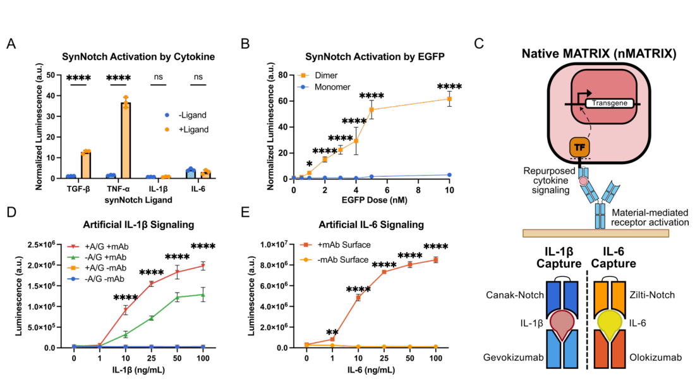
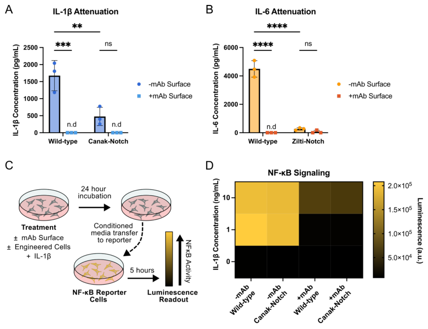
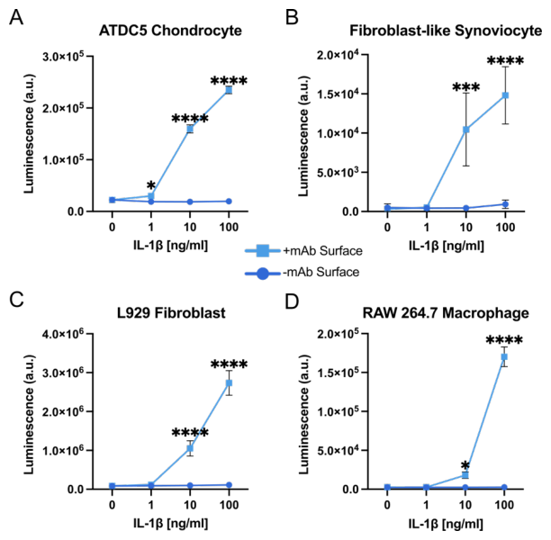
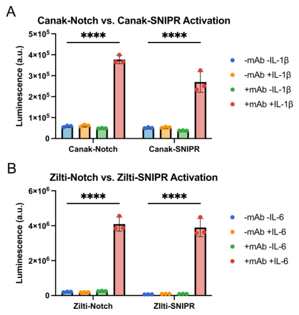
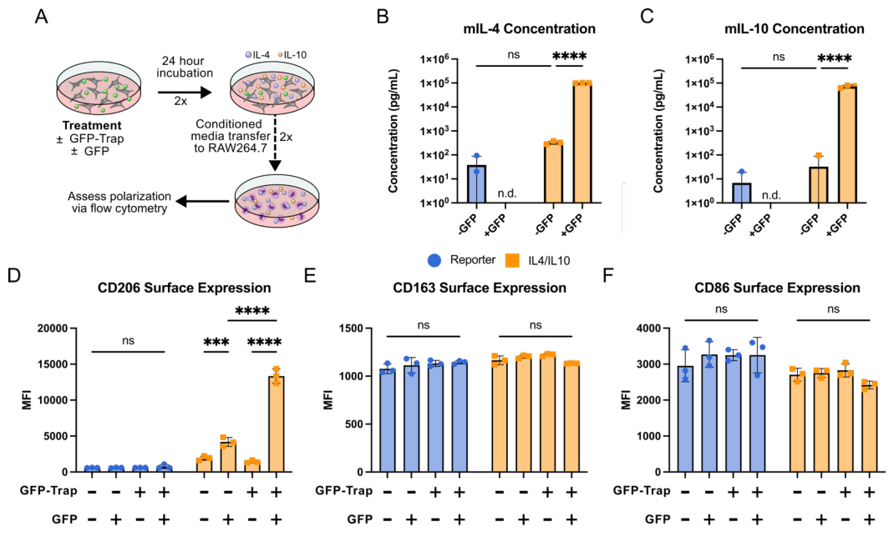
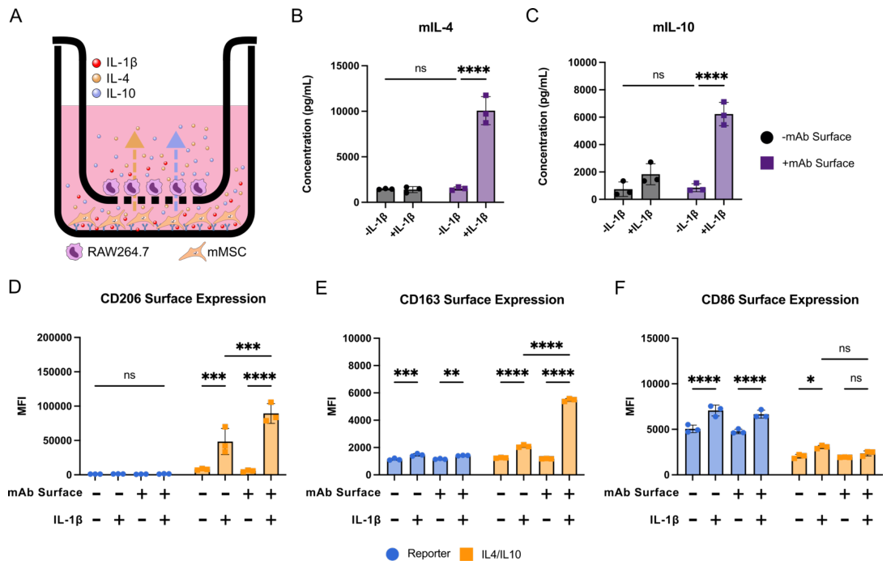

# Encoded Cell‐Material Interactions to Reroute Cytokine Signaling for Regenerative Medicine

- 期刊：Advanced Healthcare Materials
- 日期：2026-07-28
- DOI：10.1002/adhm.71481
- 解析状态：fulltext_draft

## 摘要与研究价值

**Original:** ABSTRACT Regenerative engineering harnesses materials science and stem cell biology to develop strategies to repair damaged and diseased tissue. Despite advances in designer materials, few techniques effectively provide auto‐regulated feedback mechanisms that govern how cells sense and respond to discrete microenvironmental changes. Here, we demonstrate that the artificial, juxtacrine‐like receptor synthetic Notch (synNotch) can be activated by endogenous multimeric cytokines in solution, without immobilizing materials, revealing a previously unreported activation modality and yielding up to 24‐fold dynamic range. To broaden synNotch sensing to monomeric cytokines, we developed nMATRIX, a co‐engineered material‐cell platform that detects endogenous, soluble ligands and routes them to programmed gene circuits with spatially confined effects. nMATRIX can be tuned to recognize the interleukins IL‐1β and IL‐6 using synNotch receptors plus cognate biomaterials, yielding more than 68‐fold dynamic range and converting these inflammatory inputs into orthogonal outputs that reprogram nearby cell phenotypes. nMATRIX functions across multiple cell types and can incorporate the synNotch‐related SNIPR synthetic receptor platform. nMATRIX repurposed inflammatory signals and converted them into anti‐inflammatory cues to modulate macrophage surface marker expression. Thus, nMATRIX couples native soluble cues to customized cellular responses with tunable sensitivity, offering a flexible materials‐based approach for self‐regulating regenerative therapies.

**中文:** 与柔性触觉相关，但尚未显示对前端触觉计算的直接贡献。当前未从摘要提取到可比较数值。

## 创新点

- ABSTRACT Regenerative engineering harnesses materials science and stem cell biology to develop strategies to repair damaged and diseased tissue.
- 与柔性触觉相关，但尚未显示对前端触觉计算的直接贡献

## 对当前课题的启发

- 提供机器人、可穿戴或电子皮肤系统任务证据

## 制备与实验步骤

### 1. 材料混合与分散

**Source:** p.8

**Original:** Plasmids and Cloning: Plasmids were constructed using NEB HiFi DNA Assembly Mix (New England Biolabs) and were subsequently transformed into DH5α competent cells.

**中文:** 材料混合与分散步骤，关键配比、时间、温度和设备参数以 p.8 原文为准。

### 2. 组装与封装

**Source:** p.8

**Original:** Virus production: Lentivirus was produced by transfecting Lx293T cells (Clontech) with 2 μg of transfer vector, 1.5 μg of pCMV-dR8.91 packaging vector[104] and 0.6 μg of pMD2.G envelope vector[105] (Addgene #12259) using Lipofectamine 3000 (Thermo Scientific) following manufacturer's instructions.

**中文:** 组装与封装步骤，关键配比、时间、温度和设备参数以 p.8 原文为准。

### 3. 组装与封装

**Source:** p.9

**Original:** Two naturally occurring cysteines, C48 and C70, were mutated to alanine to reduce offtarget disulfide bonds, while the aspartic acid residue, D117, was mutated to cysteine for disulfide bonding.

**中文:** 组装与封装步骤，关键配比、时间、温度和设备参数以 p.9 原文为准。

### 4. 组装与封装

**Source:** p.9

**Original:** Dimerization: The GFP protein was then induced to form disulfide bonds using 10 mL dimerization buffer (20 mM Tris pH 9.0, 100 mM NaCl, 5 mM CuSO4).

**中文:** 组装与封装步骤，关键配比、时间、温度和设备参数以 p.9 原文为准。

### 5. 成膜与沉积

**Source:** p.10

**Original:** Gevokizumab (MedChemExpress) or Olokizumab (MedChemExpress) were diluted to 10 μg/mL and 100 μl were added to the Protein A/G coated wells and left to coat overnight at 4°C.

**中文:** 成膜与沉积步骤，关键配比、时间、温度和设备参数以 p.10 原文为准。

### 6. 成膜与沉积

**Source:** p.11

**Original:** ; https://doi.org/10.1101/2025.10.24.684449 doi: bioRxiv preprint IL-1β ELISA: 96-well TC plates were coated with Protein A/G and gevokizumab as previously mentioned.

**中文:** 成膜与沉积步骤，关键配比、时间、温度和设备参数以 p.11 原文为准。

### 7. 成膜与沉积

**Source:** p.11

**Original:** IL-6 ELISA: 96-well TC plates were coated with Protein A/G and olokizumab as previously mentioned.

**中文:** 成膜与沉积步骤，关键配比、时间、温度和设备参数以 p.11 原文为准。

### 8. 组装与封装

**Source:** p.11

**Original:** SynNotch and SNIPR activation: IL-1β and IL-6 SNIPR receptors (Canak-SNIPR and Zilti-SNIPR, respectively) were created by replacing the transmembrane domain of their synNotch counterparts with the CD8 Hinge, Notch 1TM and Notch2JM domains derived from an anti-CD19 SNIPR construct (Addgene #188375)[34] via PCR and Gibson assembly.

**中文:** 组装与封装步骤，关键配比、时间、温度和设备参数以 p.11 原文为准。

### 9. 成膜与沉积

**Source:** p.11

**Original:** Wells of a 24 well non-TC plate were coated with GFP-TRAP-PEG as previously described[38] and 80,000 mMSCs were plated and treated with 5 nM GFP.

**中文:** 成膜与沉积步骤，关键配比、时间、温度和设备参数以 p.11 原文为准。

### 10. 组装与封装

**Source:** p.11

**Original:** Media without GFP were added to the anti-GFP mMSCs and were allowed to incubate another 24 hours before being transferred to the RAW264.7 macrophages as previously described.

**中文:** 组装与封装步骤，关键配比、时间、温度和设备参数以 p.11 原文为准。

### 11. 组装与封装

**Source:** p.11

**Original:** After 24 hours of incubation, the RAW264.7 transwell inserts were transferred into the mMSC wells and allowed to incubate for an additional 48 hours.

**中文:** 组装与封装步骤，关键配比、时间、温度和设备参数以 p.11 原文为准。

## 方法原文锚点

**Source:** p.8 M001

**Original:** Plasmids and Cloning: Plasmids were constructed using NEB HiFi DNA Assembly Mix (New England Biolabs) and were subsequently transformed into DH5α competent cells. Cultures were plated on LB Agar + Ampicillin (Sigma) and grown overnight at 37°C. Colonies were picked and validated via whole plasmid sequencing (Plasmidsaurus).

**中文:** 该段已进入结构化方法步骤；完整逐段翻译待智能体精读补齐。

**Source:** p.8 M002

**Original:** Virus production: Lentivirus was produced by transfecting Lx293T cells (Clontech) with 2 μg of transfer vector, 1.5 μg of pCMV-dR8.91 packaging vector[104] and 0.6 μg of pMD2.G envelope vector[105] (Addgene #12259) using Lipofectamine 3000 (Thermo Scientific) following manufacturer's instructions. 16 hours later, medium was exchanged for fresh DMEM-High Glucose supplemented with GlutaMAX and sodium pyruvate + 10% heatinactivated FBS. 24 and 48 hours later, viral supernatant was collected, filtered with a 0.45 μm PVDF filter (CELLTREAT) and pooled for cell transduction or stored short-term (<1 week) at 4°C or long-term at −80°C.

**中文:** 该段已进入结构化方法步骤；完整逐段翻译待智能体精读补齐。

**Source:** p.8 M003

**Original:** Dimeric EGFP (dEGFP) production and purification:

**中文:** 该段已进入结构化方法步骤；完整逐段翻译待智能体精读补齐。

**Source:** p.8 M004

**Original:** dEGFP Cloning: A mutated superfolder GFP sequence was used as the basis of the GFP dimer for coppermediated disulfide-based dimerization, based on a previously reported amino acid

**中文:** 该段已进入结构化方法步骤；完整逐段翻译待智能体精读补齐。

**Source:** p.9 M005

**Original:** . CC-BY-NC-ND 4.0 International license available under a (which was not certified by peer review) is the author/funder, who has granted bioRxiv a license to display the preprint in perpetuity. It is made The copyright holder for this preprint this version posted October 25, 2025. ; https://doi.org/10.1101/2025.10.24.684449 doi: bioRxiv preprint

**中文:** 该段已进入结构化方法步骤；完整逐段翻译待智能体精读补齐。

**Source:** p.9 M006

**Original:** sequence [234,235]. Two naturally occurring cysteines, C48 and C70, were mutated to alanine to reduce offtarget disulfide bonds, while the aspartic acid residue, D117, was mutated to cysteine for disulfide bonding. In addition, a His-tag was added for protein purification. The mutated superfolder GFP coding sequence was produced through Thermo Fisher Scientific’s GeneArt service and cloned into a pBH4 backbone for protein production.

**中文:** 该段已进入结构化方法步骤；完整逐段翻译待智能体精读补齐。

**Source:** p.9 M007

**Original:** Protein expression: Plasmids containing the mutant GFP dimer sequence were transformed into BL21-DE3 E. coli competent cells (NEB) and plated on an LB+agar with ampicillin supplementation plate for overnight incubation at 37°C. Colonies were then picked for three 4 mL starter cultures to be grown with ampicillin supplementation overnight at 37°C. The next day, the starter cultures were added into 1L of LB broth supplemented with ampicillin and allowed to grow at 37°C until the OD was measured in the 0.6-0.8 range. The culture was then induced with 1 mM IPTG (Gold Bio) and incubated for another 4 hours at 37°C. Then the culture was spun down at 4000xg for 20 minutes to harvest the cells. The pellets were then consolidated into 5 mL of PBS and then spun down again at 4000xg for 10 minutes. Pellets were frozen and stored at -20°C for up to 2 months before purification.Cell pellets were lysed using the BugBuster (Novagen) reagent. Briefly, the wet weight of the pellet was determined, and 5 mL of BugBuster reagent was added per 1.5 g of pellet. 10 µL of Lysonase reagent was then added to the suspension, which was then incubated at room temperature for 30 minutes on a rotating mixer. To remove insoluble cell debris, the suspension was then centrifuged at 4000xg for 1 hour at 4°C.

**中文:** 该段已进入结构化方法步骤；完整逐段翻译待智能体精读补齐。

**Source:** p.9 M008

**Original:** Protein purification: His-tagged protein was isolated using a cobalt resin column. After the suspension was passed through the gravity column, the column was washed with one column volume wash buffer (20 mM TrisHCl, 150 mM NaCl, 10 mM imidazole). The protein was then collected in fractions using elution buffer (20 mM Tris-HCl, 150 mM NaCl, 250 mM imidazole). Fractions were pooled and then concentrated into 1 mL buffer (20 mM Tris pH 9.0, 100 mM NaCl) [235] using Amicon molecular weight cutoff (MWCO) filters (Sigma-Aldrich).

**中文:** 该段已进入结构化方法步骤；完整逐段翻译待智能体精读补齐。

**Source:** p.9 M009

**Original:** Dimerization: The GFP protein was then induced to form disulfide bonds using 10 mL dimerization buffer (20 mM Tris pH 9.0, 100 mM NaCl, 5 mM CuSO4). The reaction was allowed to proceed for 15 minutes at room temperature until quenching by addition of 50 mM EDTA. The protein was then exchanged into anion exchange buffer (10 mM Tris pH 9.5, 1 mM EDTA) using Amicon MWCO filters. Using an anion exchange column (Cytiva), the dimers were purified from the monomers via a salt gradient of 0-1 M NaCl in anion exchange buffer [235]. Fractions were collected and validated using non-reducing SDS-PAGE. Fractions containing GFP dimers were desalted into DPBS using Amicon MWCO filters and aliquoted and frozen at -80°C.

**中文:** 该段已进入结构化方法步骤；完整逐段翻译待智能体精读补齐。

**Source:** p.9 M010

**Original:** Cell Culture:

**中文:** 该段已进入结构化方法步骤；完整逐段翻译待智能体精读补齐。

**Source:** p.9 M011

**Original:** Murine Mesenchymal Stem Cell: Bone-marrow derived C57BL/6 mMSCs (Cyagen) were cultured in ΜEM-α + GlutaMAX (Gibco) supplemented with 15% FBS in an incubator at 37°C and 5% carbon dioxide. For routine subcultivation, cells were rinsed with 1X DPBS (Gibco) and treated with TrypLE for five minutes at 37°C to detach cells. After quenching cells with complete medium, they were spun at 300xg for 5 minutes and replated in culture medium.

**中文:** 该段已进入结构化方法步骤；完整逐段翻译待智能体精读补齐。

**Source:** p.9 M012

**Original:** L929 Fibroblasts: Mouse L929 fibroblasts (ATCC# CCL-1) were cultured in DMEM + GlutaMAX (Gibco) supplemented with 10% heat-inactivated FBS in an incubator at 37°C and 5% carbon dioxide. For routine subcultivation, cells were treated with TrypLE for five minutes at 37°C to detach cells. After quenching cells with complete medium, they were spun at 300xg for 5 minutes and replated in culture medium.

**中文:** 该段已进入结构化方法步骤；完整逐段翻译待智能体精读补齐。

**Source:** p.9 M013

**Original:** RAW 264.7 Macrophages: RAW 264.7 macrophages (ATCC# TIB-71) were cultured in DMEM + GlutaMAX (Gibco) supplemented with 10% FBS in an incubator at 37°C and 5% carbon dioxide. For routine subcultivation, cells were rinsed with 1X DPBS (Gibco) and treated with TrypLE for five minutes at 37°C to detach cells. After quenching cells with complete medium, they were spun at 300xg for 5 minutes and replated in culture medium.

**中文:** 该段已进入结构化方法步骤；完整逐段翻译待智能体精读补齐。

**Source:** p.10 M014

**Original:** . CC-BY-NC-ND 4.0 International license available under a (which was not certified by peer review) is the author/funder, who has granted bioRxiv a license to display the preprint in perpetuity. It is made The copyright holder for this preprint this version posted October 25, 2025. ; https://doi.org/10.1101/2025.10.24.684449 doi: bioRxiv preprint

**中文:** 该段已进入结构化方法步骤；完整逐段翻译待智能体精读补齐。

**Source:** p.10 M015

**Original:** ATDC5 Chondrocytes: ATDC5s (Sigma Aldrich) were cultured in DMEM:F12 + GlutaMAX (Gibco) supplemented with 5% FBS in an incubator at 37°C and 5% carbon dioxide. For routine subcultivation, cells were rinsed with 1X DPBS (Gibco) and treated with TrypLE for five minutes at 37°C to detach cells. After quenching cells with complete medium, they were spun at 300xg for 5 minutes and replated in culture medium.

**中文:** 该段已进入结构化方法步骤；完整逐段翻译待智能体精读补齐。

**Source:** p.10 M016

**Original:** Fibroblast-like Synoviocytes: Primary fibroblast-like synoviocytes were harvested from 8 week old C57BL/6 mice according to the following protocol.[106] Isolated FLS cells were cultured on adsorbed rat tail collagen I (Gibco) in DMEM + GlutaMAX (Gibco) supplemented with 10% FBS in an incubator at 37°C and 5% carbon dioxide. For routine subcultivation, cells were rinsed with 1X DPBS (Gibco) and treated with TrypLE for five minutes at 37°C to detach cells. After quenching cells with complete medium, they were spun at 300xg for 5 minutes and replated on rat tail collagen I in culture medium.

**中文:** 该段已进入结构化方法步骤；完整逐段翻译待智能体精读补齐。

**Source:** p.10 M017

**Original:** Lentiviral Transduction: All cell lines were produced using reverse transduction using virus concentrated with LentiX Concentrator (Takara). Viral media was supplemented with 4 μg/mL of polybrene to enhance transduction efficiency and incubated with cells overnight at 37°C before being replaced with fresh cell culture media. Cells were selected using 10 μg/mL of puromycin (Sigma) when applicable. Unless otherwise noted, all cells following transduction were sorted for synNotch and transgene expression via fluorescence activated cell sorting (FACS).

**中文:** 该段已进入结构化方法步骤；完整逐段翻译待智能体精读补齐。

**Source:** p.10 M018

**Original:** Material-free activation of cytokine responsive synNotch receptors: mMSCs were co-engineered with synNotch receptors with scFvs that each bind to one of TNF-α, TGF-β1, IL-1β or IL-6 and a transgene cassette expressing a tetracycline response element (TRE) driven mCherry and luciferase output. 8,000 cells were plated in a whitewalled 96-well plate (Corning) and treated with their respective ligands: TNF-α (25 ng/mL, StemCellTech), TGFβ1 (50ng/mL, StemCellTech), IL-1β (10 ng/mL, MedChemExpress) or IL-6 (10 ng/mL, MedChemExpress). After 48 hours, CellTiter-Fluor (Promega) was performed according to manufacturer’s instructions and read on a Tecan Infinite M1000 Pro plate reader. Following this, a BrightGlo (Promega) assay measuring firefly luminescence as a measure of synNotch activity was performed according to manufacturer’s protocol on a Tecan Infinite M1000 Pro plate reader. Normalization was performed by dividing luminescence values each well’s respective CellTiterFluor output.

**中文:** 该段已进入结构化方法步骤；完整逐段翻译待智能体精读补齐。

**Source:** p.10 M019

**Original:** GFP Dimer Activation Assay: synNotch L929 fibroblasts were plated at a density of 18,000 cells/well (56,250 cells/cm2) on a control surface of streptavidin only. The LaG16 (Kd of 0.7 nM) synNotch receptor was exposed to a range of concentrations from 0 to 100 nM of either recombinant GFP purified from E. coli via immobilized metal affinity chromatography or mutant purified GFP dimer (purification process described above). After 48 hours, firefly luminescence was measured using the BrightGlo luminescence assay (Promega) on a Tecan Infinite M1000 Pro plate reader. Results are expressed as fold change relative to GFP-free conditions.

**中文:** 该段已进入结构化方法步骤；完整逐段翻译待智能体精读补齐。

**Source:** p.10 M020

**Original:** Antibody surface functionalization: Recombinant protein A/G (ThermoFisher) was reconstituted according to manufacturer’s recommendations. Aliquoted Protein A/G was further diluted to 10ug/mL in BupH CarbonateBicarbonate buffer (ThermoFisher) and 100ul per well was added to tissue culture (TC) treated 96-well plates (Corning). After incubating 1 hour at room temperature (RT), the solution was aspirated and washed with 200 μl of 1X DPBS (Gibco). Gevokizumab (MedChemExpress) or Olokizumab (MedChemExpress) were diluted to 10 μg/mL and 100 μl were added to the Protein A/G coated wells and left to coat overnight at 4°C. The following day, wells were washed with 200 μl of 1X DPBS and used immediately.

**中文:** 该段已进入结构化方法步骤；完整逐段翻译待智能体精读补齐。

**Source:** p.10 M021

**Original:** Biomaterial based activation of synNotch: After functionalizing a plate with gevokizumab, 12,000 canakinumab synNotch engineered mMSCs were plated in each well and supplemented with media containing IL-1β in a range of concentrations from 0-100 ng/mL. After 48 hours, firefly luminescence was measured via BrightGlo (Promega) luminescence assay on a Tecan Infinite M1000 Pro plate reader. To assess IL-6 synNotch activation, this same procedure was performed using an olokizumab functionalized surface and ziltivekimab engineered synNotch cells dosed with 0-100 ng/mL of IL-6.

**中文:** 该段已进入结构化方法步骤；完整逐段翻译待智能体精读补齐。

**Source:** p.11 M022

**Original:** . CC-BY-NC-ND 4.0 International license available under a (which was not certified by peer review) is the author/funder, who has granted bioRxiv a license to display the preprint in perpetuity. It is made The copyright holder for this preprint this version posted October 25, 2025. ; https://doi.org/10.1101/2025.10.24.684449 doi: bioRxiv preprint

**中文:** 该段已进入结构化方法步骤；完整逐段翻译待智能体精读补齐。

**Source:** p.11 M023

**Original:** IL-1β ELISA: 96-well TC plates were coated with Protein A/G and gevokizumab as previously mentioned. 12,000 of either wild-type or canakinumab synNotch engineered cells were plated in each well and dosed with 10 ng/mL of IL-1β. After 48 hours of culture, conditioned media were spun at 1500xg for 15 minutes and were analyzed using an IL-1β ELISA kit (R&DSystems DY201) according to the manufacturer’s protocol.

**中文:** 该段已进入结构化方法步骤；完整逐段翻译待智能体精读补齐。

**Source:** p.11 M024

**Original:** IL-6 ELISA: 96-well TC plates were coated with Protein A/G and olokizumab as previously mentioned. 12,000 of either wild-type or ziltivekimab synNotch engineered cells were plated in each well and dosed with 10 ng/mL of IL-6. After 48 hours of culture, conditioned media was spun at 1500xg for 15 minutes and was analyzed using an IL-6 ELISA kit (R&DSystems DY206) according to the manufacturer’s protocol.

**中文:** 该段已进入结构化方法步骤；完整逐段翻译待智能体精读补齐。

**Source:** p.11 M025

**Original:** NF-κB Transcriptional Activity Assay: NF-κB reporter mMSCs were generated via lentiviral transduction of a plasmid encoding 4 repeats of the NF-κB response elements followed by a minimal promoter sequence,[107] allowing for activation of a downstream luciferase transgene when NF-κB is active. To assess modulation of native NF-κB signaling, 96-well TC plates were treated with Protein A/G and gevokizumab as previously described and 12,000 of either wild-type or canakinumab engineered reporter mMSCs were added to each well and supplemented with 0, 1, or 10ng/mL of IL-1β in 100 μl of media. After 24 hours, conditioned media from these groups were added to NF-κB reporter mMSCs, which were plated at a density of 8,000 cells per well in a 96-well, white-walled TC treated plate the day prior. After 5 hours of co-culture, a BrightGlo (Promega) luminescence assay was performed on the NF-κB reporter cells to quantify NF-κB activity.

**中文:** 该段已进入结构化方法步骤；完整逐段翻译待智能体精读补齐。

**Source:** p.11 M026

**Original:** SynNotch and SNIPR activation: IL-1β and IL-6 SNIPR receptors (Canak-SNIPR and Zilti-SNIPR, respectively) were created by replacing the transmembrane domain of their synNotch counterparts with the CD8 Hinge, Notch 1TM and Notch2JM domains derived from an anti-CD19 SNIPR construct (Addgene #188375)[34] via PCR and Gibson assembly. A flexible (G3S)x3 linker was added between the scFv and CD8 Hinge domains for additional flexibility. 12,000 mMSCs expressing either canakinumab engineered synNotch or canakinumab engineered SNIPR and a reporter luciferase transgene were plated on a white-walled, 96-well plate. Wells were treated with gevokizumab as previously described. Cells were treated with 10ng/mL of IL-1β and a BrightGlo luminescence assay was performed 48 hours after plating to assess receptor activity. The same procedure was performed to assess IL-6 mediated activity of ziltivekimab engineered synNotch and SNIPR cells plated on olokizumab functionalized surfaces.

**中文:** 该段已进入结构化方法步骤；完整逐段翻译待智能体精读补齐。

**Source:** p.11 M027

**Original:** GFP mediated polarization: anti-GFP LaG16-synNotch engineered cells were transduced with a synNotch inducible transgene circuit that expresses mouse IL-4 and mouse IL-10 in response to activation. Wells of a 24 well non-TC plate were coated with GFP-TRAP-PEG as previously described[38] and 80,000 mMSCs were plated and treated with 5 nM GFP. In a separate TC-treated 24-well plate, 180,000 RAW264.7 macrophages were plated. After 24 hours, conditioned media from the anti-GFP mMSCs were spun down at 1500xg for 10 minutes and added to the RAW264.7 cells. Media without GFP were added to the anti-GFP mMSCs and were allowed to incubate another 24 hours before being transferred to the RAW264.7 macrophages as previously described. After an additional 24 hours of incubation, RAW264.7 were lifted using Accutase and labeled for CD86, CD163 and CD206 surface markers using antibodies listed in Supplementary Table 2 before undergoing flow cytometry.

**中文:** 该段已进入结构化方法步骤；完整逐段翻译待智能体精读补齐。

**Source:** p.11 M028

**Original:** IL-1β mediated polarization: Canakinumab-synNotch mMSCs were engineered with the mouse IL-4/IL-10 payload via lentiviral transduction as described earlier. 80,000 mMSCs were added to the basal chamber of a gevokizumab functionalized transwell plate (Corning) and were treated with 10 ng/mL of IL-1β. Simultaneously, 30,000 RAW264.7 macrophages were added to the apical chamber of a transwell and kept in a separate well with 500 μl of media. After 24 hours of incubation, the RAW264.7 transwell inserts were transferred into the mMSC wells and allowed to incubate for an additional 48 hours. After co-culturing, RAW264.7 cells were lifted using Accutase and stained for CD86, CD163 and CD206 surface markers before undergoing flow cytometry.

**中文:** 该段已进入结构化方法步骤；完整逐段翻译待智能体精读补齐。

**Source:** p.11 M029

**Original:** mIL-4 and mIL-10 ELISA: Mouse IL-4 and mouse IL-10 ELISA levels were assessed using respective ELISA kits (R&DSystems, DY404 and DY417) according to manufacturer instructions.

**中文:** 该段已进入结构化方法步骤；完整逐段翻译待智能体精读补齐。

**Source:** p.12 M030

**Original:** . CC-BY-NC-ND 4.0 International license available under a (which was not certified by peer review) is the author/funder, who has granted bioRxiv a license to display the preprint in perpetuity. It is made The copyright holder for this preprint this version posted October 25, 2025. ; https://doi.org/10.1101/2025.10.24.684449 doi: bioRxiv preprint

**中文:** 该段已进入结构化方法步骤；完整逐段翻译待智能体精读补齐。

**Source:** p.12 M031

**Original:** Flow Cytometry: All quantitative flow cytometry was performed on Amnis Cellstream flow cytometer. Cells were resuspended in DPBS supplemented with 2% FBS. Fluorescence activated cell sorting (FACS) was performed at the Vanderbilt Flow Core using a BD 5 Laser FACS Aria. Antibodies were diluted according to manufacturer’s instructions for all samples. A list of antibodies used can be found in Supplemental Table 2.

**中文:** 该段已进入结构化方法步骤；完整逐段翻译待智能体精读补齐。

**Source:** p.12 M032

**Original:** Statistical analysis: Graphs were produced using GraphPad Prism 10. All bar graphs display the mean of triplicate values with errors bars showing the standard deviation. To determine significance in experiments, a two- or three-way ANOVA with an alpha of 0.05 was used to compare between groups as needed. ANOVA tests were conducted along with Tukey’s post-hoc test with multiple comparisons.

**中文:** 该段已进入结构化方法步骤；完整逐段翻译待智能体精读补齐。

## 图表解读

### Figure 1

**Source:** p.12

**Original caption:** Figure 1. Repurposing MATRIX platform for native inputs. (A) Firefly luminescence normalized to viability indicating synNotch activation in response a panel of synNotch receptors targeted to TGFβ-1, TNF, IL-1β and IL-6. (B) Firefly luminescence normalized to ligand-free conditions indicating Anti-GFP synNotch activation in response to varied doses of monomer versus mutant dimer EGFP. Depicted significance indicated compares +Dimer vs. +Monomer at respective dose. (C) Schematic demonstrating native MATRIX system used to immobilize soluble ligands for presentation to synNotch-engineered cells. (D) Dual binding of either IL-1β or IL6. Gevokizumab and canakinumab synNotch (Canak-Notch) bind to non-overlapping epitopes of IL-1β. Olokizumab and ziltivekimab synNotch (Zilti-Notch) bind to non-overlapping epitopes of IL-6. (E) Effect of Protein A/G coating on activation of IL-1β-responsive synNotch. Firefly luminescence readout in response to varied doses of IL-1β indicating Canak-Notch activation. Depicted significance indicates +Protein A/G +mAb group

**中文图注:** Figure 1 原始图注已提取；逐项含义见下方分图说明。

**Reading note:** 重点查看器件结构、材料层次、信号路径和制备流程。

- (a) 重点查看标定方法、量程、误差、线性和动态响应，避免只比较单一灵敏度。 原文：Firefly luminescence normalized to viability indicating synNotch activation in response a panel of synNotch receptors targeted to TGFβ-1, TNF, IL-1β and IL-6
- (b) 重点查看标定方法、量程、误差、线性和动态响应，避免只比较单一灵敏度。 原文：Firefly luminescence normalized to ligand-free conditions indicating Anti-GFP synNotch activation in response to varied doses of monomer versus mutant dimer EGFP. Depicted significance indicated compares +Dimer vs. +Monomer at respective dose
- (c) 重点查看器件结构、材料层次、信号路径和制备流程。 原文：Schematic demonstrating native MATRIX system used to immobilize soluble ligands for presentation to synNotch-engineered cells
- (d) 结合正文首次引用位置和原始图注核对该图的证据角色。 原文：Dual binding of either IL-1β or IL6. Gevokizumab and canakinumab synNotch (Canak-Notch) bind to non-overlapping epitopes of IL-1β. Olokizumab and ziltivekimab synNotch (Zilti-Notch) bind to non-overlapping epitopes of IL-6
- (e) 重点查看标定方法、量程、误差、线性和动态响应，避免只比较单一灵敏度。 原文：Effect of Protein A/G coating on activation of IL-1β-responsive synNotch. Firefly luminescence readout in response to varied doses of IL-1β indicating Canak-Notch activation. Depicted significance indicates +Protein A/G +mAb group

### Figure 2

**Source:** p.13

**Original caption:** Figure 2. nMATRIX modulates IL-1β and IL-6 levels via receptor and surface neutralization. (A) IL-1β as measured by ELISA 48 hours after supplementing 10 ng/mL to either wild-type mMSCs or Canak-Notch mMSCs with or without the gevokizumab surface. (B) IL-6 as measured by ELISA 48 hours after supplementing 10 ng/mL to either wild-type or Zilti-Notch mMSCs with or without the olokizumab surface. (C) Schematic showing conditioned media treatment of NF-κB reporter cells. (D) Resultant NF-κB signaling 5 hours after transferring IL1β conditioned media to NF-κB reporter cells. All statistics were performed using a two-way ANOVA with Tukey’s multiple comparisons. n=3 for all experimental groups. **p<0.01 ***p<0.001 ****p<0.0001.

**中文图注:** Figure 2 原始图注已提取；逐项含义见下方分图说明。

**Reading note:** 重点查看器件结构、材料层次、信号路径和制备流程。

- (a) 结合正文首次引用位置和原始图注核对该图的证据角色。 原文：IL-1β as measured by ELISA 48 hours after supplementing 10 ng/mL to either wild-type mMSCs or Canak-Notch mMSCs with or without the gevokizumab surface
- (b) 结合正文首次引用位置和原始图注核对该图的证据角色。 原文：IL-6 as measured by ELISA 48 hours after supplementing 10 ng/mL to either wild-type or Zilti-Notch mMSCs with or without the olokizumab surface
- (c) 重点查看器件结构、材料层次、信号路径和制备流程。 原文：Schematic showing conditioned media treatment of NF-κB reporter cells
- (d) 结合正文首次引用位置和原始图注核对该图的证据角色。 原文：Resultant NF-κB signaling 5 hours after transferring IL1β conditioned media to NF-κB reporter cells. All statistics were performed using a two-way ANOVA with Tukey’s multiple comparisons. n=3 for all experimental groups. **p<0.01 ***p<0.001 ****p<0.0001

### Figure 3

**Source:** p.14

**Original caption:** Figure 3. nMATRIX is applicable to different cell types. (A) IL-1β dose dependent activation of (A) ATDC5 chondrocyte-like cells, (B) primary fibroblast-like synoviocyte cells, (C) L929 fibroblasts, and (D) RAW264.7 macrophages. All statistics were performed using a two-way ANOVA with Tukey’s multiple comparisons. n=3 for all experimental groups. *p<0.05, ***p<0.001 ****p<0.0001.

**中文图注:** Figure 3 原始图注已提取；逐项含义见下方分图说明。

**Reading note:** 结合正文首次引用位置和原始图注核对该图的证据角色。

- (a) 结合正文首次引用位置和原始图注核对该图的证据角色。 原文：IL-1β dose dependent activation of
- (a) 结合正文首次引用位置和原始图注核对该图的证据角色。 原文：ATDC5 chondrocyte-like cells,
- (b) 结合正文首次引用位置和原始图注核对该图的证据角色。 原文：primary fibroblast-like synoviocyte cells,
- (c) 结合正文首次引用位置和原始图注核对该图的证据角色。 原文：L929 fibroblasts, and
- (d) 结合正文首次引用位置和原始图注核对该图的证据角色。 原文：RAW264.7 macrophages. All statistics were performed using a two-way ANOVA with Tukey’s multiple comparisons. n=3 for all experimental groups. *p<0.05, ***p<0.001 ****p<0.0001

### Figure 4

**Source:** p.14

**Original caption:** Figure 4. nMATRIX can be adapted to a different receptor platform. (Α) SNIPR engineered with canakinumab scFv can be activated in an nMATRIX-dependent manner. (Β) SNIPR engineered with ziltivekimab scFv can be activated in an nMATRIX-dependent manner. All statistics were performed using a two-way ANOVA with Tukey’s multiple comparisons. n=3 for all experimental groups. ****p<0.0001.

**中文图注:** Figure 4 原始图注已提取；逐项含义见下方分图说明。

**Reading note:** 结合正文首次引用位置和原始图注核对该图的证据角色。

### Figure 5

**Source:** p.15

**Original caption:** Figure 5. MATRIX can enhance CD206 expression in macrophages (A) Schematic of experimental setup. GFPresponsive synNotch mMSCs containing an inducible reporter transgene or an inducible IL4/IL10 cassette were stimulated with GFP. Conditioned media from these cells was added to RAW 264.7 cells at 24 and 48 hour timepoints. At 72 hours, RAW264.7 surface marker expression was measured via flow cytometry to evaluate polarization. (B-C) Mouse IL-4(B) and mouse IL-10(C) concentrations as measured by ELISA after 24 hours of GFP stimulation of anti-GFP reporter and IL4/IL10 mMSCs. (D-F) Quantified mean fluorescence intensity of CD206(D), CD163(E), and CD86(F) surface expression of RAW264.7 cells after treatment with GFP-induced reporter and IL4/IL10 cell conditioned media. All statistics were performed using a two- way ANOVA (B,C) or three-way ANOVA (D-F) with Tukey’s multiple comparisons n=3 for all experimental groups. ***p<0.001 ****p<0.0001.

**中文图注:** Figure 5 原始图注已提取；逐项含义见下方分图说明。

**Reading note:** 重点查看器件结构、材料层次、信号路径和制备流程。

- (a) 重点查看器件结构、材料层次、信号路径和制备流程。 原文：Schematic of experimental setup. GFPresponsive synNotch mMSCs containing an inducible reporter transgene or an inducible IL4/IL10 cassette were stimulated with GFP. Conditioned media from these cells was added to RAW 264.7 cells at 24 and 48 hour timepoints. At 72 hours, RAW264.7 surface marker expression was measured via flow cytometry to evaluate polarization. (B-C) Mouse IL-4
- (b) 结合正文首次引用位置和原始图注核对该图的证据角色。 原文：and mouse IL-10
- (c) 结合正文首次引用位置和原始图注核对该图的证据角色。 原文：concentrations as measured by ELISA after 24 hours of GFP stimulation of anti-GFP reporter and IL4/IL10 mMSCs. (D-F) Quantified mean fluorescence intensity of CD206(D), CD163(E), and CD86
- (f) 结合正文首次引用位置和原始图注核对该图的证据角色。 原文：surface expression of RAW264.7 cells after treatment with GFP-induced reporter and IL4/IL10 cell conditioned media. All statistics were performed using a two- way ANOVA (B,C) or three-way ANOVA (D-F) with Tukey’s multiple comparisons n=3 for all experimental groups. ***p<0.001 ****p<0.0001

### Figure 6

**Source:** p.16

**Original caption:** Figure 6. nMATRIX can polarize macrophages toward M2-like phenotypes. (A) Schematic of transwell setup. Canak-Notch synNotch mMSCs containing an inducible reporter transgene or an inducible IL4/IL10 cassette were stimulated with 10 ng/mL IL-1β. After 24 hours of mMSC stimulation, RAW264.7 cells in the apical transwell chamber were transferred into the basal mMSC chamber. After 48 hours of co-culture, RAW264.7 surface marker expression was measured via flow cytometry to evaluate polarization. (B-C) Murine IL-4 (B) and murine IL-10 (C) concentrations as measured by ELISA after co-culture with RAW264.7 cells. (D-F) Quantified mean fluorescence intensity of CD206 (D), CD163 (E), and CD86 (F) surface expression of RAW264.7 cells after treatment with IL-1β-induced reporter and IL4/IL10 co-culture. All statistics were performed using a two- way ANOVA (B,C) or three-way ANOVA (D-F) with Tukey’s multiple comparisons. n=3 for all experimental groups. *p<0.05 **p<0.01 ***p<0.001 ****p<0.0001.

**中文图注:** Figure 6 原始图注已提取；逐项含义见下方分图说明。

**Reading note:** 重点查看器件结构、材料层次、信号路径和制备流程。

- (a) 重点查看器件结构、材料层次、信号路径和制备流程。 原文：Schematic of transwell setup. Canak-Notch synNotch mMSCs containing an inducible reporter transgene or an inducible IL4/IL10 cassette were stimulated with 10 ng/mL IL-1β. After 24 hours of mMSC stimulation, RAW264.7 cells in the apical transwell chamber were transferred into the basal mMSC chamber. After 48 hours of co-culture, RAW264.7 surface marker expression was measured via flow cytometry to evaluate polarization. (B-C) Murine IL-4
- (b) 结合正文首次引用位置和原始图注核对该图的证据角色。 原文：and murine IL-10
- (c) 结合正文首次引用位置和原始图注核对该图的证据角色。 原文：concentrations as measured by ELISA after co-culture with RAW264.7 cells. (D-F) Quantified mean fluorescence intensity of CD206 (D), CD163 (E), and CD86
- (f) 结合正文首次引用位置和原始图注核对该图的证据角色。 原文：surface expression of RAW264.7 cells after treatment with IL-1β-induced reporter and IL4/IL10 co-culture. All statistics were performed using a two- way ANOVA (B,C) or three-way ANOVA (D-F) with Tukey’s multiple comparisons. n=3 for all experimental groups. *p<0.05 **p<0.01 ***p<0.001 ****p<0.0001
