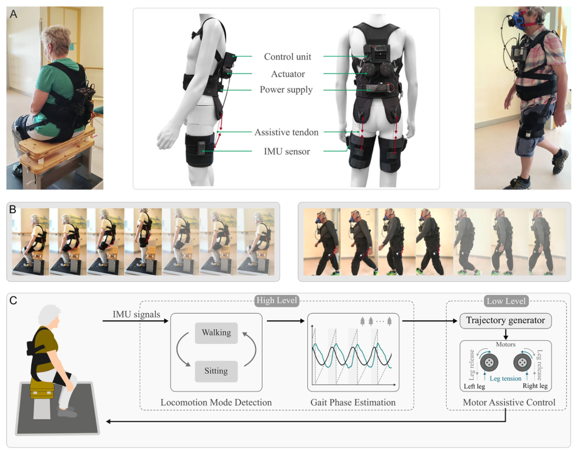
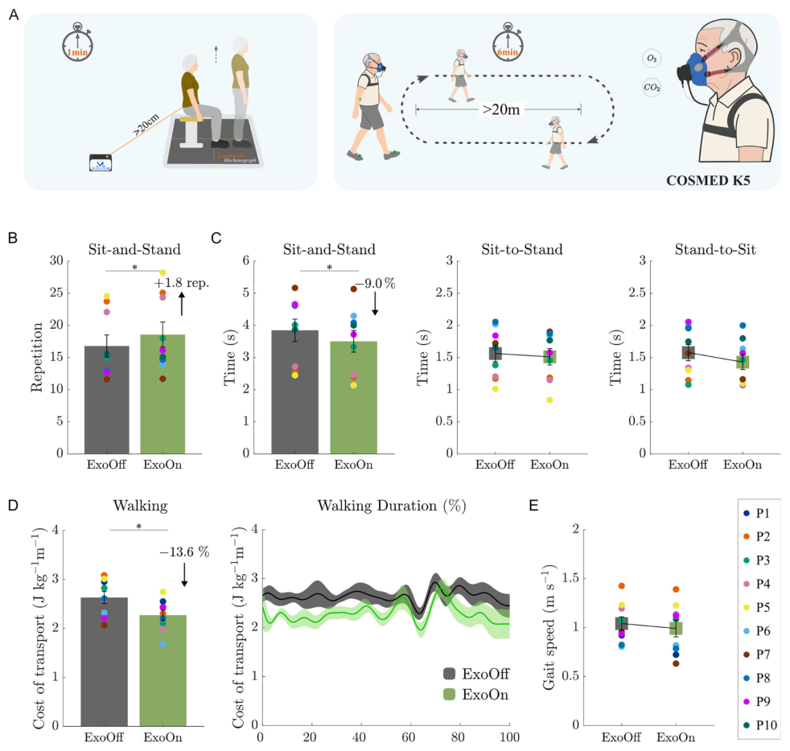
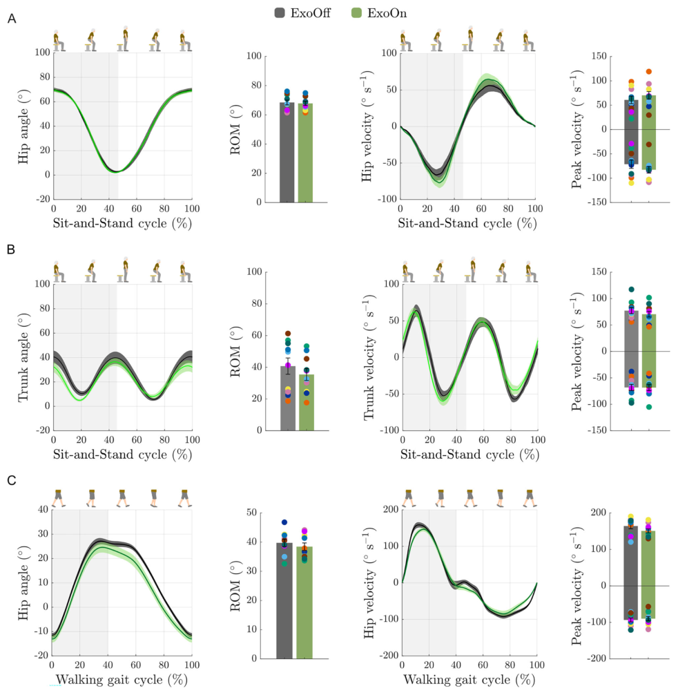
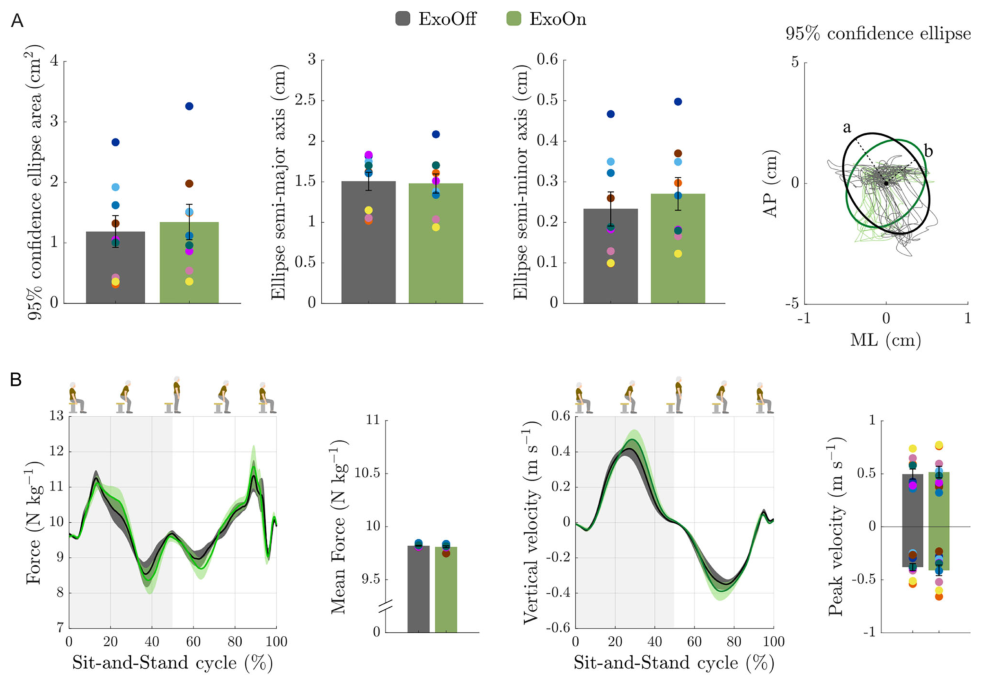
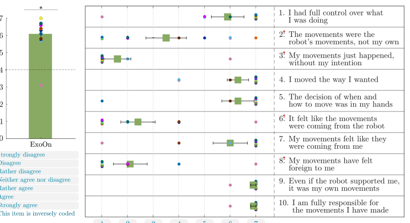

# Enhancing sit-to-stand transitions and walking efficiency in older adults with a soft robotic suit

- 期刊：Nature Communications
- 日期：2026-07-17
- DOI：10.1038/s41467-026-75528-1
- 解析状态：fulltext_draft

## 摘要与研究价值

**Original:** Abstract Age-related declines in muscle strength and neuromuscular control make sit-to-stand transitions and walking progressively more difficult, compromising mobility and independence. Although wearable assistive technologies have been proposed to alleviate these challenges, few have demonstrated clear benefits in facilitating sit-to-stand movements for older adults who retain a degree of independent mobility. Here, we introduce a soft hip exosuit designed to assist both sit-to-stand transitions and walking activities. In a feasibility study involving ten older adults, the exosuit increased 1-minute sit-to-stand repetitions by an average of 1.8 and reduced the metabolic cost of walking by 13.6% compared with the unassisted condition. These improvements were achieved while preserving natural kinematics, lower-limb stability, and maintaining a strong sense of agency. Our findings demonstrate that soft exosuits can enhance sit-to-stand and walking performance in older adults while preserving biomechanical naturalness and user autonomy, highlighting their potential for practical home-integrated mobility assistance.

**中文:** 提供机器人、可穿戴或电子皮肤系统任务证据。摘要可核实数值包括：13.6%。

## 创新点

- Abstract Age-related declines in muscle strength and neuromuscular control make sit-to-stand transitions and walking progressively more difficult, compromising mobility and independence.
- 提供机器人、可穿戴或电子皮肤系统任务证据

## 对当前课题的启发

- 提供机器人、可穿戴或电子皮肤系统任务证据

## 制备与实验步骤

### 1. 图形化与结构成形

**Source:** p.8

**Original:** Exosuit hardware The exosuit uses artificial tendons to provide hip extension assistance in response to the user’s movement patterns, enabling assistance during both sit-to-stand transitions and walking.

**中文:** 图形化与结构成形步骤，关键配比、时间、温度和设备参数以 p.8 原文为准。

### 2. 图形化与结构成形

**Source:** p.9

**Original:** We further examined lower-limb postural stability, kinematics, and users’ sense of agency to determine whether the assistive system maintained stability, preserved natural movement patterns, and perception of being in control over movements in older adults while providing assistance.

**中文:** 图形化与结构成形步骤，关键配比、时间、温度和设备参数以 p.9 原文为准。

## 方法原文锚点

**Source:** p.8 M001

**Original:** Exosuit hardware The exosuit uses artificial tendons to provide hip extension assistance in response to the user’s movement patterns, enabling assistance during both sit-to-stand transitions and walking. Fig. 1A, B illustrate older adult participants wearing the exosuit while performing sit-to-stand and walking tasks, respectively. The central schematic of Fig. 1A depicts the main components of the system, including the control unit, actuator, power supply, assistive tendons, and IMU sensors integrated into a lightweight textile structure. The detailed schematics and locations of the hardware components are illustrated in Supplementary Fig. S1. The inertial measurement unit (IMU) sensor modules mounted on the left and right lateral sides of the thighs transmit the recorded user kinematic signals to the control board via Bluetooth Low Energy (BLE) protocol. The algorithms running on the control board recognize the user’s locomotion mode and gait phase according to the current user kinematics information, and then generate the corresponding actuator reference signals to guide the motor operation (AK60-6, CubeMars actuator, China). The motor actuation drives a 3D-printed pulley mounted above the motor to rotate, causing the artificial assistive tendons (black woven Kevlar, USA) wrapped around the pulley to tighten

**中文:** 该段已进入结构化方法步骤；完整逐段翻译待智能体精读补齐。

**Source:** p.8 M002

**Original:** and relax alternately. The resulting forces are transmitted through the Bowden sheaths (Shimano SLR, 4 mm diameter, Japan) to the 3D-printed anchor points fixed at the hip (proximal anchor points) and the thigh (distal anchor points). The main hardware components of each IMU module are a Feather board (BLE, Feather nRF52 Bluefruit, Adafruit, USA), a BNO055 board (Bosch, BNO055, Germany), and a battery (Lithium-Ion polymer battery, China). The Feather board serves to generate and send BLE signals, the BNO055 board is utilized for measuring kinematic signals, and the battery powers the entire IMU module. The control unit module mounted on the back primarily consists of a Nvidia Jetson board (Nvidia Jetson Nano, USA), an Arduino board (Arduino MKR 1010 WiFi, Italy), a Can-bus extension board (Can-bus Shield V2.0, Seeed Studio, China), and a Feather board (BLE, Feather nRF52 Bluefruit, Adafruit, USA). The Nvidia Jetson board is capable of handling computationally demanding control algorithms and machine-learning-based algorithms while simultaneously collecting experimental data. The Arduino and Can-bus boards manage tasks such as reading sensor signals, executing less demanding control algorithms, and directing motor operations. The Feather board is utilized to receive BLE signals from IMU modules. All electrical components in the control unit module are powered by a 14.8 V battery (Tattu, 14.8 V, 3700 mAh, 45 C, USA) located beneath it, either directly or after passing through a buck power converter board (24 V/12 V to 5 V 5 A DC-DC, China).

**中文:** 该段已进入结构化方法步骤；完整逐段翻译待智能体精读补齐。

**Source:** p.8 M003

**Original:** Controller The exosuit operates under a hierarchical control framework designed to provide adaptive assistance based on the lower-limb kinematics of the user, as shown in Fig. 1C. The system architecture follows a closedloop control strategy, progressing from real-time IMU sensor signals acquisition to control decision-making and finally to actuator assistance. Kinematic data are continuously collected via two IMUs mounted on the thigh braces. At the high-level control layer, the kinematic data are processed to identify locomotion modes (e.g., sitting or walking) and to estimate the gait phase. Based on this estimation, the low-level control layer generates reference trajectories for the actuators tailored to the current locomotion phase and executes corresponding actuator commands to provide targeted assistance to the user. This control architecture enables the exosuit to facilitate natural and timely movement during daily activities. Detailed algorithmic descriptions of the control framework are provided further below and in Supplementary Fig. S2. The high-level layer of the controller includes a locomotion mode recognition module and a gait phase estimation module. It utilizes IMU sensor data to identify the user’s movement state and guide the timing of assistance. The locomotion mode recognition module in the exosuit is implemented as a finite state machine (FSM) to enable real-time classification of user activities, such as sitting and walking. It uses two IMUs mounted on the user’s thighs to acquire key kinematic parameters, including the angles and movement velocities of the left and right thighs. The state transition logic is implemented using the Chart block in the Stateflow toolbox of MATLAB R2021b environment, enabling seamless integration with the overall control architecture. The decision logic is based on two computed features: the sum of hip angles (AngSum) and the sum of angular velocities (VelSum). These features were selected to provide a compact yet informative representation of the user’s lower-limb posture and dynamic state. Summing signals from both thighs helps mitigate the effects of transient asymmetrical limb movements, thereby improving the reliability of locomotion mode recognition. The FSM comprises two states: State 1, which includes the Reset and Walking sub-states, and State 2, corresponding to the Sitting state. The system initializes in the Reset substate of State 1, representing an upright posture at the onset of locomotion, and remains in the Walking sub-state of State 1 as long as the composite joint angle satisfies AngSum≤0.8 rad. The system switches

**中文:** 该段已进入结构化方法步骤；完整逐段翻译待智能体精读补齐。

**Source:** p.9 M004

**Original:** Article https://doi.org/10.1038/s41467-026-75528-1

**中文:** 该段已进入结构化方法步骤；完整逐段翻译待智能体精读补齐。

**Source:** p.9 M005

**Original:** Nature Communications| (2026) 17:6540 9

**中文:** 该段已进入结构化方法步骤；完整逐段翻译待智能体精读补齐。

**Source:** p.9 M006

**Original:** Table 1 | Older participants information

**中文:** 该段已进入结构化方法步骤；完整逐段翻译待智能体精读补齐。

**Source:** p.9 M007

**Original:** Participant Sex (F/M) Age (year) Weight (kg) Height (cm) FTSS (≥10 s) CFS

**中文:** 该段已进入结构化方法步骤；完整逐段翻译待智能体精读补齐。

**Source:** p.9 M008

**Original:** P1 M 84 73 178 Y 3

**中文:** 该段已进入结构化方法步骤；完整逐段翻译待智能体精读补齐。

**Source:** p.9 M009

**Original:** P2 F 82 66 164 Y 3

**中文:** 该段已进入结构化方法步骤；完整逐段翻译待智能体精读补齐。

**Source:** p.9 M010

**Original:** P3 F 69 75 176 Y 3

**中文:** 该段已进入结构化方法步骤；完整逐段翻译待智能体精读补齐。

**Source:** p.9 M011

**Original:** P4 M 85 61 172 Y 3

**中文:** 该段已进入结构化方法步骤；完整逐段翻译待智能体精读补齐。

**Source:** p.9 M012

**Original:** P5 M 76 70 170 N 1

**中文:** 该段已进入结构化方法步骤；完整逐段翻译待智能体精读补齐。

**Source:** p.9 M013

**Original:** P6 F 85 65 165 Y 4

**中文:** 该段已进入结构化方法步骤；完整逐段翻译待智能体精读补齐。

**Source:** p.9 M014

**Original:** P7 F 76 84 172 Y 2

**中文:** 该段已进入结构化方法步骤；完整逐段翻译待智能体精读补齐。

**Source:** p.9 M015

**Original:** P8 F 78 53 170 Y 3

**中文:** 该段已进入结构化方法步骤；完整逐段翻译待智能体精读补齐。

**Source:** p.9 M016

**Original:** P9 F 71 64 154 Y 2

**中文:** 该段已进入结构化方法步骤；完整逐段翻译待智能体精读补齐。

**Source:** p.9 M017

**Original:** P10 M 71 80 172 Y 2

**中文:** 该段已进入结构化方法步骤；完整逐段翻译待智能体精读补齐。

**Source:** p.9 M018

**Original:** from Walking to Sitting when AngSum > 0.8 rad and the composite angular velocity VelSum ≥0 rad s−1, indicating a continued increase in joint flexion characteristic of the descent into a seated posture. For sitto-stand movement, this composite angle threshold corresponds to approximately 25% of the sit-to-stand transition progression, or about 23∘for each thigh, and partial hip-extension assistance is provided during the remaining phase of the transition. The transition back to Walking is triggered when AngSum ≤2 rad and VelSum ≤0 rad s−1, corresponding to the restoration of an upright posture after completion of the sit-to-stand transition. All threshold values were empirically determined by analyzing the correlation and variability of kinematic features across different locomotion modes, sensor noise, and hardware settings, and were guided by prior domain knowledge to optimize control performance and generalization. The gait phase estimation module of the exosuit employs a random forest regression algorithm37,38, which extracts bilateral lower-limb kinematic (hip angle and velocity as input) features from IMUs mounted on the user’s thighs to enable real-time, continuous prediction of the gait phase (output). The gait phase estimation model was trained31 using data collected from eight healthy adults (six males, two females; average age 25.9 ± 1.8 years) in a data collection-oriented experimental session. Detailed training data collection and model training process are provided in the Controller Implementation section in the Supplementary Information. The low-level controller generates customized reference trajectories for the actuator based on the outputs of the high-level locomotion mode and gait phase estimation model. A proportional controller with a first-order low-pass characteristic then tracks these trajectories by converting the error between the desired and actual motor positions into a motor angular velocity command, thereby driving the actuators to deliver assistive forces to the user.

**中文:** 该段已进入结构化方法步骤；完整逐段翻译待智能体精读补齐。

**Source:** p.9 M019

**Original:** Experiment protocol and data processing The experiment was conducted as a controlled trial aimed at evaluating the effectiveness of the exosuit device in assisting older adults with sit-to-stand and walking activities. Ten participants were enrolled in the study, with a mean age of 77.8 ± 6.1 years. Detailed participant information is provided in Table 1. Nine participants exhibited a five-times sit-to-stand (FTSS) time of ≥10 s20. Frailty status was also assessed by using the Clinical Frailty Scale (CFS)21, providing complementary information22: five participants classified themselves as level 3 (-well, with treated comorbid disease-), three as level 2 (-well-), one as level 4 (-apparently vulnerable- ), and one as level 1 (-very fit-).

**中文:** 该段已进入结构化方法步骤；完整逐段翻译待智能体精读补齐。

**Source:** p.9 M020

**Original:** Ethics. Prior to the experiment, each participant provided written informed consent, including consent for the publication of identifiable images. All procedures were conducted in accordance with the principles of the Declaration of Helsinki. The Ethical Committee of the Medical Faculty Heidelberg approved this research (resolution S-313/2020).

**中文:** 该段已进入结构化方法步骤；完整逐段翻译待智能体精读补齐。

**Source:** p.9 M021

**Original:** Experiment design protocol. Participants were asked to complete two functional mobility tests while wearing the exosuit under two experimental conditions: ExoOff (in which no assistive force was provided) and ExoOn (in which assistive forces were generated by the exosuit device). Prior to the start of the experiment, an instructor introduced the operational principles of the exosuit system and demonstrated the required tasks. Participants subsequently donned the exosuit and practiced the sit-to-stand and walking tasks until they were fully familiarized with the procedure. The familiarization period included at least 5 sit-to-stand repetitions and 20 m of walking. A trained examiner closely supervised the entire testing procedure to ensure participant safety and compliance with instructions. 1-Min Sit-To-Stand test (1MSTS; Fig. 2A): Participants were required to perform as many sit-and-stand cycles as possible within 1 min period while maintaining balance and a natural movement rhythm. Prior to testing, they donned the exosuit device and were seated on a 46 cm armless chair integrated with a ground reaction force platform (Leonardo Mechanography, Novotec Medical, Germany). Their feet were positioned flat on the designated left and right force-sensing areas, naturally spaced at shoulder width. To minimize external support and ensure consistency, participants were instructed to cross their arms over their chest during the sit-to-stand task. If necessary for safety, they were allowed to rest their hands lightly on their thighs, without pushing or otherwise assisting the movement. A MuscleLab linear encoder (Ergotest Innovation, Norway) was attached to the right posterior waist to record sit-to-stand test data and deliver voice prompts for test initiation and termination in older adults. 6-Min Walking Test (6MWT; Fig. 2A): Participants were instructed to walk back and forth continuously for 6 min at a self-selected pace along a flat, straight walkway that was more than 20 meters long, with clearly marked indicators at both ends. The examiner announced the elapsed time at 2 min intervals. Prior to testing, participants were equipped with both the exosuit and a portable respirometer (COSMED K5, Italy). They stood at one end of the walkway marker. After a 4 min standing rest period for baseline respiratory data collection, the mGait module of the mHealth system (mHealth Technologies, Italy) provided voice prompts to initiate and terminate the test and recorded walking test data. During the testing period, participants were permitted to reduce their pace or take breaks when necessary, with all pause durations counted into the total testing time. The sequence of experimental conditions (ExoOff and ExoOn) was randomized for each participant. Within each condition, the order of the functional mobility tests was fixed. To minimize the effects of fatigue, a minimum rest period of 20 min was provided between the two conditions (ExoOff and ExoOn), and at least 15 min of rest was required between each test (1MSTS and 6MWT). Data collection was conducted throughout all experiments to evaluate the differences in participants’ performance with and without the exosuit assistance. The IMUs integrated in the exosuit system continuously recorded participants’ kinematic information during all tasks. After completing the experimental tasks under ExoOn, participants were asked to complete a ten-item sense-of-agency questionnaire to assess their perceived level of control during exosuitassisted movements.

**中文:** 该段已进入结构化方法步骤；完整逐段翻译待智能体精读补齐。

**Source:** p.9 M022

**Original:** Data processing and statistics. To evaluate the effectiveness of the exosuit, we assessed sit-to-stand transition efficiency and the metabolic cost of walking in older adults with exosuit assistance. We further examined lower-limb postural stability, kinematics, and users’ sense of agency to determine whether the assistive system maintained stability, preserved natural movement patterns, and perception of being in control over movements in older adults while providing assistance. During the 1-min sit-to-stand test, we quantified both the total number of completed sit-and-stand cycles and the average time duration required for each cycle as key metrics for evaluating the

**中文:** 该段已进入结构化方法步骤；完整逐段翻译待智能体精读补齐。

**Source:** p.10 M023

**Original:** Article https://doi.org/10.1038/s41467-026-75528-1

**中文:** 该段已进入结构化方法步骤；完整逐段翻译待智能体精读补齐。

**Source:** p.10 M024

**Original:** Nature Communications| (2026) 17:6540 10

**中文:** 该段已进入结构化方法步骤；完整逐段翻译待智能体精读补齐。

**Source:** p.10 M025

**Original:** assistive performance of the exosuit. In addition, the sit-to-stand and stand-to-sit phases were segmented, and the duration of each phase was analyzed and reported separately. The timing data were recorded with a precision of 0.01 s using the MuscleLab system, ensuring accurate temporal resolution for performance analysis. During the 6-min walking test, the metabolic cost of transport was adopted as the principal evaluation metric to assess the effectiveness of the exosuit in improving walking efficiency. The metabolic cost of transport, which represents the metabolic energy expenditure of walking normalized by body weight and distance, was calculated using the Péronnet and Massicotte equation39. Detailed calculation information is provided in the Supplementary Information. As we described in the Experiment Section, participants were instructed to stand quietly for 4 min to establish a resting metabolic baseline. Considering that metabolic responses undergo a brief adjustment period at the onset of movement as the body transitions from rest to steady-state walking metabolism, the first 2 min of both resting and walking metabolic data were excluded to ensure that only steady-state values were analyzed. The vertical ground reaction force, vertical center of mass velocity, and center of force data recorded by the force plate system, together with the joint angle and movement velocity captured by the onboard IMU sensors, were analyzed to evaluate the physiological impact of the exosuit on participants’ natural sitting, standing, and walking movements. The collected data were segmented into individual sit-and-stand and walking gait cycles for comparative analysis and intuitive illustration. Kinematic data were assessed by comparing the hip joint and trunk angle, range of motion (ROM), and the positive/negative peak movement velocities across segmented gait cycles. Postural stability was quantified using the 95% confidence ellipse of the center of force trajectory, with the corresponding semimajor and semi-minor axes extracted to characterize sway magnitude. To evaluate participants’ perceived sense of agency during exosuit-assisted movements, a ten-item questionnaire was administered at the end of the experiment under ExoOn condition. The questionnaire was adopted from the study [12]12, with items originally derived from the theoretical literature on the sense of agency and further refined for the context of wearable assistive devices40. Each item was rated on a 7-point Likert scale ranging from 1 (-Strongly disagree-) to 7 (-Strongly agree-). The questionnaire included six positively framed items (1, 4, 5, 7, 9, 10) and four negatively framed items (2, 3, 6, 8), with negatively framed items inversely coded so that higher scores consistently reflected a stronger sense of agency. After reversecoding the negatively framed items, a total sense-of-agency score for each participant was obtained by averaging the ten items. In addition, the distribution of participant responses for each questionnaire item was calculated to provide a more detailed understanding of how participants perceived their sense of agency during exosuit-assisted tasks. The mean scores for each questionnaire item across participants were provided in Supplementary Fig. S6. The normality of data distributions was verified using the ShapiroWilk test with a significance level of α = 0.05. For variables that satisfied the normality assumption, paired two-tailed t-tests were then performed to compare the results between the ExoOff and ExoOn conditions. Otherwise, the non-parametric Wilcoxon signed-rank test was applied. For the sense of agency, the overall mean questionnaire score was compared with the scale midpoint of 4 using a two-tailed onesample t-test. All statistical analyses were conducted using SPSS Statistics (version 27, IBM Corp., USA).

**中文:** 该段已进入结构化方法步骤；完整逐段翻译待智能体精读补齐。

**Source:** p.10 M026

**Original:** Reporting summary Further information on research design is available in the Nature Portfolio Reporting Summary linked to this article.

**中文:** 该段已进入结构化方法步骤；完整逐段翻译待智能体精读补齐。

## 图表解读

### Fig. 1

**Source:** p.2

**Original caption:** Fig. 1 | Soft wearable exosuit. A Exosuit consists of textile components (vest, waist belt, and thigh harnesses) and integrated mechatronic modules (control unit, actuators, power supply, assistive tendons, and IMU sensors), which assist with the lower-limb during sit-to-stand transition and walking tasks via artificial tendons. B Time-lapse sequences of older adult participants performing sit-to-stand

**中文图注:** Fig. 1 原始图注已提取；逐项含义见下方分图说明。

**Reading note:** 结合正文首次引用位置和原始图注核对该图的证据角色。

- (a) 结合正文首次引用位置和原始图注核对该图的证据角色。 原文：Exosuit consists of textile components (vest, waist belt, and thigh harnesses) and integrated mechatronic modules (control unit, actuators, power supply, assistive tendons, and IMU sensors), which assist with the lower-limb during sit-to-stand transition and walking tasks via artificial tendons
- (b) 结合正文首次引用位置和原始图注核对该图的证据角色。 原文：Time-lapse sequences of older adult participants performing sit-to-stand

### Fig. 2

**Source:** p.4

**Original caption:** Fig. 2 | Experiment and performance evaluation of the exosuit in older adults (n = 9). A Experiment overview of sit-to-stand and walking. Sit-to-stand performance evaluation in 1-min sit-to-stand test: B the total repetitions and C time of each sit-and-stand cycle and transitions across participants. Walking performance evaluation in 6-min walking test: D the walking metabolic cost of transport and

**中文图注:** Fig. 2 原始图注已提取；逐项含义见下方分图说明。

**Reading note:** 结合正文首次引用位置和原始图注核对该图的证据角色。

### Fig. 3

**Source:** p.5

**Original caption:** Fig. 3 | Kinematic evaluation during sit-to-stand and walking movements in older adults (n = 10). Angle and velocity profiles during sit-to-stand and walking tasks: A Hip and B trunk profiles during sit-and-stand cycles; C hip profile during walking. Range of motion (ROM) was calculated as the difference between the maximum and minimum angles within each segmented sit-and-stand or walking

**中文图注:** Fig. 3 原始图注已提取；逐项含义见下方分图说明。

**Reading note:** 结合正文首次引用位置和原始图注核对该图的证据角色。

### Fig. 4

**Source:** p.6

**Original caption:** Fig. 4 | Biomechanical analysis and stability assessment of sit-to-stand movement in older adults through force plate metrics (n = 9). A 95% confidence ellipse fitted to center of force (COF) data points across participants during sit-tostand test. The lengths of the semi-major axis (a) and semi-minor axis (b) also served as metrics for quantifying postural sway of the plantar pressure in the

**中文图注:** Fig. 4 原始图注已提取；逐项含义见下方分图说明。

**Reading note:** 重点查看标定方法、量程、误差、线性和动态响应，避免只比较单一灵敏度。

- (a) 结合正文首次引用位置和原始图注核对该图的证据角色。 原文：and semi-minor axis
- (b) 结合正文首次引用位置和原始图注核对该图的证据角色。 原文：also served as metrics for quantifying postural sway of the plantar pressure in the

### Fig. 5

**Source:** p.7

**Original caption:** Fig. 5 | Sense of agency questionnaire in older adults (n = 10). Mean score (±s.e.m.; green bar) for each questionnaire item across all participants, along with the distribution of participant responses to each item (1–10) on the 7-point (ranging from -Strongly disagree- to -Strongly agree-) sense of agency questionnaire. The y-axis represents each question item, the x-axis represents the Likert response

**中文图注:** Fig. 5 原始图注已提取；逐项含义见下方分图说明。

**Reading note:** 重点查看标定方法、量程、误差、线性和动态响应，避免只比较单一灵敏度。
