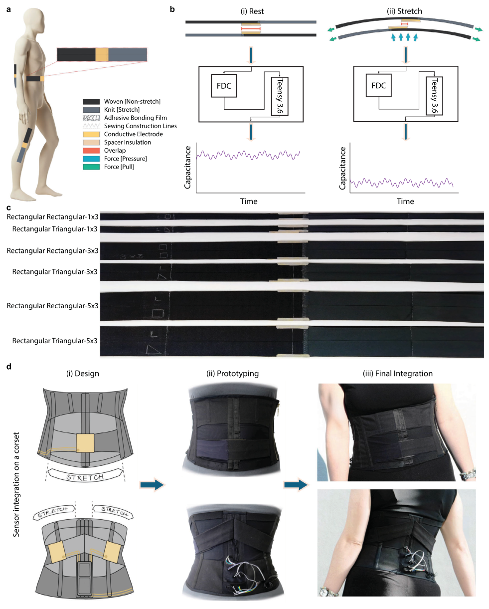
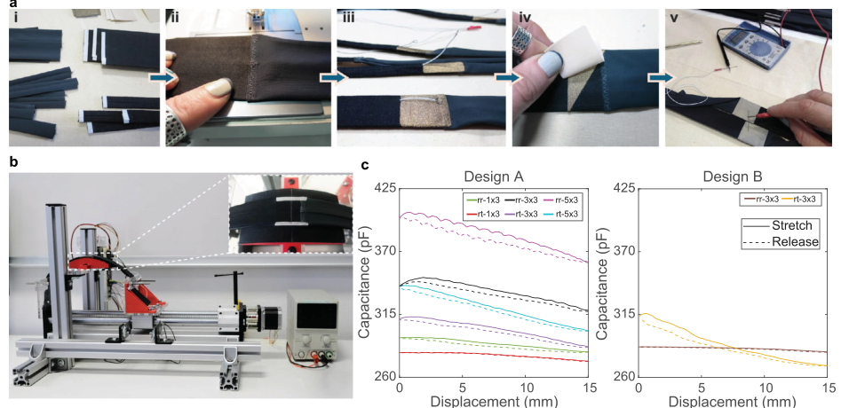
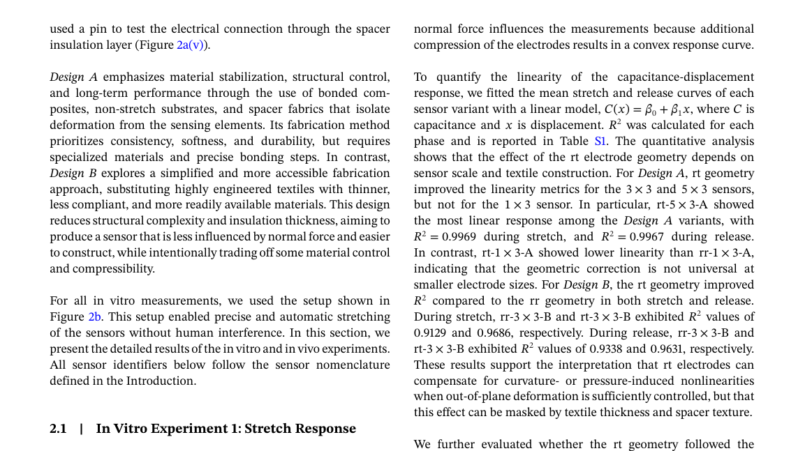
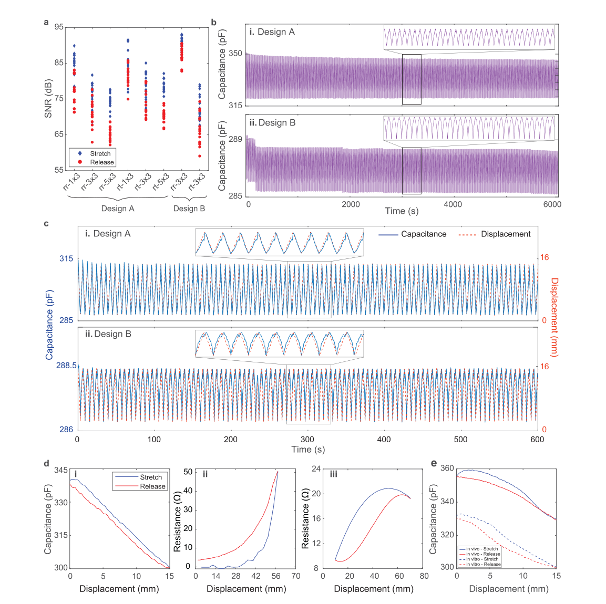
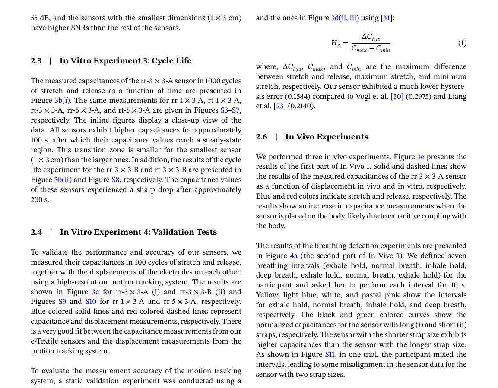
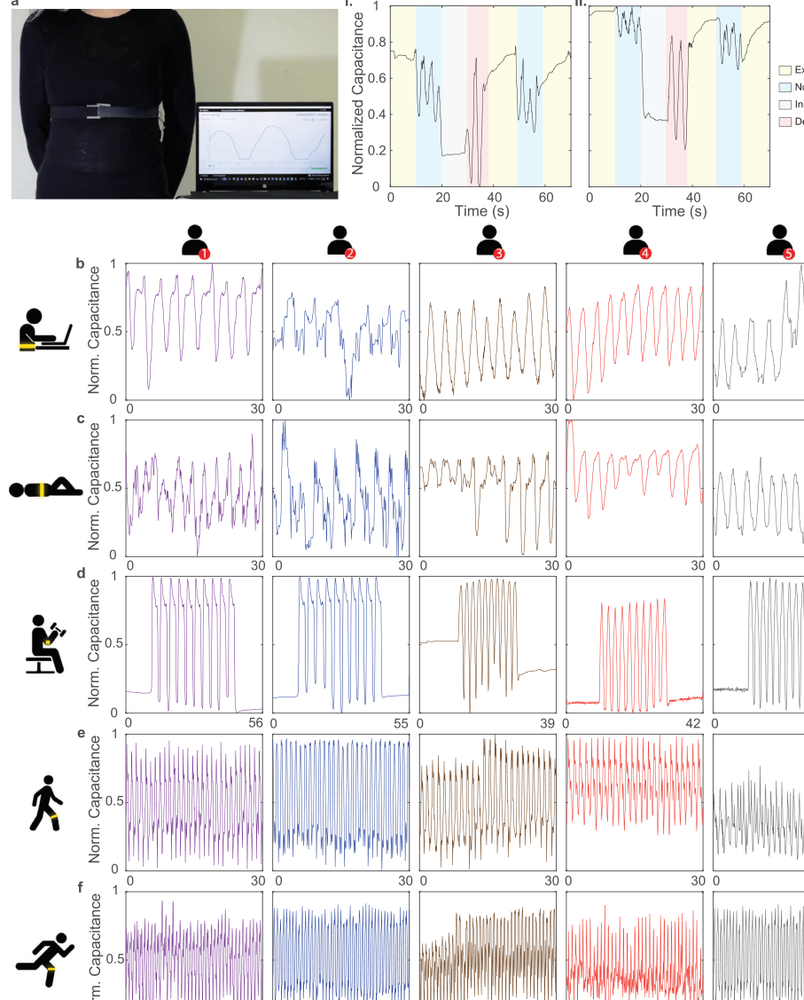

# An All‐Textile, Mechano‐Capacitive Subtle Movement Sensor

- 期刊：Advanced Functional Materials
- 日期：2026-07-14
- DOI：10.1002/adfm.76802
- 解析状态：fulltext_draft

## 摘要与研究价值

**Original:** ABSTRACT Designing garments that effectively capture human movements demands a focus on the wearer's comfort and freedom of motion. Electronic textile (e‐Textile) sensors offer a promising avenue due to their soft and flexible properties. However, these sensors are most responsive to large motions, as their precision is usually relatively low compared to other sensing solutions. Furthermore, e‐Textile sensors that measure physical force or deformation often require the sensing element itself to undergo deformation and be subject to force. This leads to degradation of the sensor due to repeated mechanical strain. To address these issues, a novel all‐textile mechanical capacitive sensor design is presented. This sensor is optimized for measuring subtle movements, such as thoracic wall movements, in breath monitoring. The design is more robust than other e‐Textile sensing approaches, as the deforming textile elements are separated from the sensing element. This design choice results in sensors with improved signal response, higher accuracy, and longer cycle life than the other comparable textile sensors. In this paper, we share the design and implementation guidelines, in vitro measurements (such as evaluation of the effects of electrode shape and size and cycle life tests), and multiple in vivo measurements of sensor prototypes.

**中文:** 可用于低离散/装配容差触觉界面的结构与对照设计；涉及坏点、漂移、跨器件迁移或少样本校准。当前未从摘要提取到可比较数值。

## 创新点

- ABSTRACT Designing garments that effectively capture human movements demands a focus on the wearer's comfort and freedom of motion.
- 可用于低离散/装配容差触觉界面的结构与对照设计
- 涉及坏点、漂移、跨器件迁移或少样本校准

## 对当前课题的启发

- 可用于低离散/装配容差触觉界面的结构与对照设计
- 涉及坏点、漂移、跨器件迁移或少样本校准
- 可对照 raw pixel、software feature 与 physical projection 的性能/通道/功耗

## 制备与实验步骤

### 1. 组装与封装

**Source:** p.12

**Original:** 5.1 Sensor Design and Implementation In this section, we first provide the general design considerations and our construction method.

**中文:** 组装与封装步骤，关键配比、时间、温度和设备参数以 p.12 原文为准。

### 2. 图形化与结构成形

**Source:** p.12

**Original:** 5.1.3 Mechanical Design The sensor consists of two-layered straps with a tubular construction to stabilize edges and control stretch properties.

**中文:** 图形化与结构成形步骤，关键配比、时间、温度和设备参数以 p.12 原文为准。

## 方法原文锚点

**Source:** p.12 M001

**Original:** 5.1 Sensor Design and Implementation

**中文:** 该段已进入结构化方法步骤；完整逐段翻译待智能体精读补齐。

**Source:** p.12 M002

**Original:** In this section, we first provide the general design considerations and our construction method. Then, we proceed to discuss the specific implementations.

**中文:** 该段已进入结构化方法步骤；完整逐段翻译待智能体精读补齐。

**Source:** p.12 M003

**Original:** 5.1.1 General Principles

**中文:** 该段已进入结构化方法步骤；完整逐段翻译待智能体精读补齐。

**Source:** p.12 M004

**Original:** We propose a two-layered mechanical capacitive e-Textile sensor with a shearing motion for measuring stretch in on-body applications. Two overlaid straps with a centrally aligned electrode of opposing sections of stretch and non-stretch materials create a shearing motion when strain is applied (Figure 1b). The design leverages the positive curvature of the body with the tension of the non-active stretch materials to stabilize the structure.

**中文:** 该段已进入结构化方法步骤；完整逐段翻译待智能体精读补齐。

**Source:** p.12 M005

**Original:** 5.1.2 Design Considerations

**中文:** 该段已进入结构化方法步骤；完整逐段翻译待智能体精读补齐。

**Source:** p.12 M006

**Original:** Beyond the technological functionality of the system, for a technological system to become wearable, the design should include properties such as the ability to adapt to the varied shape of bodies, match with human abilities, and finally be deployable in everyday use and socially acceptable [42]. In the present work, we optimize a sensor for optimal deployability in everyday garments by optimizing the design to adapt to and move with the body. Such optimization, in turn, leads to better technological functionality, enabling the sensor to precisely measure subtle human behaviors.

**中文:** 该段已进入结构化方法步骤；完整逐段翻译待智能体精读补齐。

**Source:** p.12 M007

**Original:** In addition, since the sensing element is continuously mechanically manipulated as the fabric deforms, the deformation of sensing materials causes fatigue, hysteresis, and general instability in longitudinal readings [23]. We address this issue by applying a design strategy that creates a separation between the mechanical moving parts of the sensor and its electrical parts. This is achieved by combining non-stretch (woven) with stretch (knit) elements in such a way that the place at which the fabric is stretched is carefully chosen and controlled, enabling sensing materials to be placed in areas that are not stretched.

**中文:** 该段已进入结构化方法步骤；完整逐段翻译待智能体精读补齐。

**Source:** p.12 M008

**Original:** 5.1.3 Mechanical Design

**中文:** 该段已进入结构化方法步骤；完整逐段翻译待智能体精读补齐。

**Source:** p.12 M009

**Original:** The sensor consists of two-layered straps with a tubular construction to stabilize edges and control stretch properties. Each strap has a non-stretch element and a shorter stretch element. The straps are oriented oppositely, with non-stretch parts overlapping in the center. Conductive electrodes are placed on the nonstretch overlap. When pulled, the conductive elements slide apart, reducing the overlap (see Figure 1b).

**中文:** 该段已进入结构化方法步骤；完整逐段翻译待智能体精读补齐。

**Source:** p.12 M010

**Original:** 5.1.4 Electrical Design

**中文:** 该段已进入结构化方法步骤；完整逐段翻译待智能体精读补齐。

**Source:** p.12 M011

**Original:** We measure the capacitance between the two conductive electrode areas. Capacitance is defined as:

**中文:** 该段已进入结构化方法步骤；完整逐段翻译待智能体精读补齐。

**Source:** p.12 M012

**Original:** 12 of 17 Advanced Functional Materials, 2026

**中文:** 该段已进入结构化方法步骤；完整逐段翻译待智能体精读补齐。

**Source:** p.12 M013

**Original:** the current geometry is appropriate for the subtle respiratory and postural movements targeted in this work.

**中文:** 该段已进入结构化方法步骤；完整逐段翻译待智能体精读补齐。

**Source:** p.12 M014

**Original:** Respiration monitoring was selected as the primary target application because thoracic and abdominal breathing produce relatively small textile deformations that are difficult to capture reliably using many conventional textile strain sensors. The additional body location measurements demonstrate that the sensing principle is more general and can support broader wearable movement monitoring applications beyond respiration alone.

**中文:** 该段已进入结构化方法步骤；完整逐段翻译待智能体精读补齐。

**Source:** p.12 M015

**Original:** Larger body movements, such as high amplitude elbow or knee flexion, shoulder motion, trunk bending, or large changes in garment circumference during vigorous activity, can impose strains and local textile displacements that exceed the tested 15 mm range. Prior wearable textile strain-sensing work for elbow and knee monitoring has therefore used sensors designed for substantially larger strain ranges, for example, flexion measurements within approximately 30% strain [40]. Similarly, wearable respiration systems evaluated during walking, running, or stair climbing highlight that dynamic activities can introduce larger garment deformation and motion artifacts than quiet breathing [41].

**中文:** 该段已进入结构化方法步骤；完整逐段翻译待智能体精读补齐。

**Source:** p.12 M016

**Original:** For applications requiring larger displacement ranges, the proposed mechano-capacitive principle can be scaled in several ways. First, the electrode length can be increased so that a larger shear displacement can occur before the electrode overlap becomes too small for reliable capacitance measurement. Second, the mechanical textile linkage can be redesigned so that a larger garment extension is converted into a smaller electrode displacement, for example, by increasing the length of the stretch region, adding compliant intermediate textile sections, or using multiple stretch zones in series. Third, multiple sensors can be distributed across a garment so that large body motion is measured as the sum of several smaller local displacements rather than by a single sensor operating over its full travel. Finally, the sensor can be pre-positioned or pre-strained so that the expected motion occurs near the center of the calibrated range, where the capacitance response remains most reliable.

**中文:** 该段已进入结构化方法步骤；完整逐段翻译待智能体精读补齐。

## 图表解读

### Figure 1

**Source:** p.3

**Original caption:** FIGURE 1 (a) Our e-Textile sensors can be used to measure breath and various body movements precisely. (b) Cross-section of the sensor at resting position with aligned electrodes (i) and cross-section of expanded textile construction layers and substrates (ii). The capacitance is high when the sensor is at rest since the overlapping area between the two electrodes is maximum. The capacitance drops as the sensor gets stretched due to the decrease in the overlapping area between the electrodes. The data was recorded using an FDC connected to a Teensy 3.6 MCU. (c) Two sets of Design A sensors with rectangular and triangular electrodes, annotated on the left side of the strap. Sizes (W × L) are 1 × 3 cm, 3 × 3 cm, and 5 × 3 cm for top, middle, and bottom, respectively. (d) Sensors deployed in a corset to measure breath at the abdomen and mid-back. The hybrid “anti-corset” is designed to stretch where a corset would typically restrict movement (i). The prototype uses the sensor construction as in Design A (ii). Finished corset, as worn by a participant.

**中文图注:** Figure 1 原始图注已提取；逐项含义见下方分图说明。

**Reading note:** 结合正文首次引用位置和原始图注核对该图的证据角色。

- (a) 结合正文首次引用位置和原始图注核对该图的证据角色。 原文：Our e-Textile sensors can be used to measure breath and various body movements precisely
- (b) 结合正文首次引用位置和原始图注核对该图的证据角色。 原文：Cross-section of the sensor at resting position with aligned electrodes
- (i) 结合正文首次引用位置和原始图注核对该图的证据角色。 原文：and cross-section of expanded textile construction layers and substrates (ii). The capacitance is high when the sensor is at rest since the overlapping area between the two electrodes is maximum. The capacitance drops as the sensor gets stretched due to the decrease in the overlapping area between the electrodes. The data was recorded using an FDC connected to a Teensy 3.6 MCU
- (c) 结合正文首次引用位置和原始图注核对该图的证据角色。 原文：Two sets of Design A sensors with rectangular and triangular electrodes, annotated on the left side of the strap. Sizes (W × L) are 1 × 3 cm, 3 × 3 cm, and 5 × 3 cm for top, middle, and bottom, respectively
- (d) 结合正文首次引用位置和原始图注核对该图的证据角色。 原文：Sensors deployed in a corset to measure breath at the abdomen and mid-back. The hybrid “anti-corset” is designed to stretch where a corset would typically restrict movement (i). The prototype uses the sensor construction as in Design A (ii). Finished corset, as worn by a participant

### Figure 2

**Source:** p.4

**Original caption:** FIGURE 2 (a) Sensor construction overview: Applying a seam of adhesive film to stabilize the stretch textile for stitching (i). Stitching the stretch and non-stretch sections of the strap with a zigzag stitch to increase stability (ii). Feeding the looped e-Textile connectors through the straps to connect the sensors (iii). Applying the spacer to the electrode, a layered material made from Powernet and Sewfree adhesive film (iv). Using a pin to test the electrical connection through the spacer insulation layer (v). (b) Evaluation Apparatus with the stepper motor rig and a sensor placed on a 3D printed block to represent body curvature. The inline figure shows the sensor electrodes centrally aligned with a 10% base tension. (c) Average values of the measured capacitances as a function of displacement for Design A (left) and Design B (right). (d) The individual results of the stretch response experiment for Design A (i–iii and v–vii) and Design B (iv and viii). The top and bottom rows show the measured capacitances as a function of displacement for the rr and rt sensors, respectively. The first, second, third, and fourth columns present the data for the sensors with plate geometries of 1 × 3 cm, 3 × 3 cm, 5 × 3 cm, and 3 × 3 cm, respectively.

**中文图注:** Figure 2 原始图注已提取；逐项含义见下方分图说明。

**Reading note:** 重点查看标定方法、量程、误差、线性和动态响应，避免只比较单一灵敏度。

- (a) 结合正文首次引用位置和原始图注核对该图的证据角色。 原文：Sensor construction overview: Applying a seam of adhesive film to stabilize the stretch textile for stitching (i). Stitching the stretch and non-stretch sections of the strap with a zigzag stitch to increase stability (ii). Feeding the looped e-Textile connectors through the straps to connect the sensors (iii). Applying the spacer to the electrode, a layered material made from Powernet and Sewfree adhesive film (iv). Using a pin to test the electrical connection through the spacer insulation layer (v)
- (b) 结合正文首次引用位置和原始图注核对该图的证据角色。 原文：Evaluation Apparatus with the stepper motor rig and a sensor placed on a 3D printed block to represent body curvature. The inline figure shows the sensor electrodes centrally aligned with a 10% base tension
- (c) 结合正文首次引用位置和原始图注核对该图的证据角色。 原文：Average values of the measured capacitances as a function of displacement for Design A (left) and Design B (right)
- (d) 重点查看标定方法、量程、误差、线性和动态响应，避免只比较单一灵敏度。 原文：The individual results of the stretch response experiment for Design A (i–iii and v–vii) and Design B (iv and viii). The top and bottom rows show the measured capacitances as a function of displacement for the rr and rt sensors, respectively. The first, second, third, and fourth columns present the data for the sensors with plate geometries of 1 × 3 cm, 3 × 3 cm, 5 × 3 cm, and 3 × 3 cm, respectively

### Figure 2C

**Source:** p.5

**Original caption:** Figure 2c displays the average values of the measured capacitances of the sensors as a function of displacement. The average results for the sensors of Design A are shown on the left-hand side, where green, black, and magenta colors indicate rr-1 × 3-A, rr-3 × 3-A, and rr-5 × 3-A sensors, respectively, and red, purple, and cyan colors indicate rt-1 × 3-A, rt-3 × 3-A, and rt-5 × 3-A sensors, respectively. The average results for the sensors of Design B are presented on the right-hand side, where the brown and yellow-colored curves indicate rr-3 × 3-B and rt-3 × 3-B sensors, respectively. The 15 mm displacement range for measurements was chosen to cover the expected electrode travel for subtle thoracic, abdominal, and garment-integrated breathing movements, and should therefore be interpreted as the calibrated range of the present prototypes rather than as the maximum range of the sensing principle.

**中文图注:** Figure 2C 原始图注已提取；逐项含义见下方分图说明。

**Reading note:** 结合正文首次引用位置和原始图注核对该图的证据角色。

### Figure 3

**Source:** p.6

**Original caption:** FIGURE 3 (a) The SNR values of the sensors. Stretch and release responses are shown in blue and red colors, respectively. (b) The measured capacitance of rr-3 × 3-A (i) and rr-3 × 3-B (ii) sensors as a function of time in 1000 cycles of stretch and release. The inline figures display a close-up view of the data. (c) Measured capacitance (blue-colored solid line) and displacement (red-colored dashed line) of rr-3 × 3-A (i) and rr-3 × 3-B (ii) sensors as a function of time in 100 cycles of stretch and release. The displacement of the sensors was measured using a high-resolution motion tracking system. The inline figures display a close-up view of the data. (d) Comparison of our sensor (i) with the resistive sensors in the literature: Vogl et al. [30] (ii) and Liang et al. [23] (iii). The blue and red-colored curves represent the stretch and release responses of the sensor, respectively. (e) In vivo and in vitro measurements of the rr-3 × 3-A sensor as a function of displacement. The results of in vivo and in vitro experiments are presented by solid and dashed lines, respectively. The blue and red-colored curves represent the stretch and release responses of the sensor, respectively.

**中文图注:** Figure 3 原始图注已提取；逐项含义见下方分图说明。

**Reading note:** 重点查看标定方法、量程、误差、线性和动态响应，避免只比较单一灵敏度。

- (a) 重点查看标定方法、量程、误差、线性和动态响应，避免只比较单一灵敏度。 原文：The SNR values of the sensors. Stretch and release responses are shown in blue and red colors, respectively
- (b) 结合正文首次引用位置和原始图注核对该图的证据角色。 原文：The measured capacitance of rr-3 × 3-A
- (i) 结合正文首次引用位置和原始图注核对该图的证据角色。 原文：and rr-3 × 3-B (ii) sensors as a function of time in 1000 cycles of stretch and release. The inline figures display a close-up view of the data
- (c) 结合正文首次引用位置和原始图注核对该图的证据角色。 原文：Measured capacitance (blue-colored solid line) and displacement (red-colored dashed line) of rr-3 × 3-A
- (i) 结合正文首次引用位置和原始图注核对该图的证据角色。 原文：and rr-3 × 3-B (ii) sensors as a function of time in 100 cycles of stretch and release. The displacement of the sensors was measured using a high-resolution motion tracking system. The inline figures display a close-up view of the data
- (d) 结合正文首次引用位置和原始图注核对该图的证据角色。 原文：Comparison of our sensor
- (i) 重点查看标定方法、量程、误差、线性和动态响应，避免只比较单一灵敏度。 原文：with the resistive sensors in the literature: Vogl et al. [30] (ii) and Liang et al. [23] (iii). The blue and red-colored curves represent the stretch and release responses of the sensor, respectively
- (e) 重点查看标定方法、量程、误差、线性和动态响应，避免只比较单一灵敏度。 原文：In vivo and in vitro measurements of the rr-3 × 3-A sensor as a function of displacement. The results of in vivo and in vitro experiments are presented by solid and dashed lines, respectively. The blue and red-colored curves represent the stretch and release responses of the sensor, respectively

### Figure 4B

**Source:** p.7

**Original caption:** Figure 4b–f presents the first 30 s of the first trial from the In Vivo 2 experiments. For each measurement, data were continuously recorded for three minutes. The complete recordings, including all trials for participants P2–P6, are provided in Figures S12– S16, respectively. The rr-3 × 3-A sensor was attached to the participant’s lower thorax (see Figure S17) to monitor breathing over a three-minute period while the participant performed routine office work (Figure 4b) and during rest lying (Figure 4c). Figure 4d presents the normalized capacitance measured from the elbow using the rr-3 × 3-A sensor (see Figure S18) during three consecutive intervals of exercise and rest. The knee movement measurements (see Figure S19) are shown in Figure 4e,f, where the participant walked and jogged, respectively, for three minutes along a circular track.

**中文图注:** Figure 4B 原始图注已提取；逐项含义见下方分图说明。

**Reading note:** 结合正文首次引用位置和原始图注核对该图的证据角色。

### Figure 4

**Source:** p.8

**Original caption:** FIGURE 4 The in vivo measurements using the rr-3 × 3-A sensor. (a) The sensor is worn as a simple strap to measure natural breathing. Twolayered straps comprise opposing stretch (gray) and non-stretch (black) elements, displacing centrally aligned electrodes in a shearing motion during inhalation. The experiment was performed by one female participant in seven consecutive intervals of 10 s using a Long strap sensor (i). The same measurement with a short strap sensor (ii). (b,c) In vivo breath monitoring of five participants during (b) office work and (c) while resting in a lying position. (d) In vivo measurements of elbow motion in five participants recorded over three consecutive cycles of exercise and rest. (e,f) In vivo measurements of knee motion in five participants during (e) walking and (f) jogging on a treadmill. Each column corresponds to one participant. Representative 30-second data segments are shown for all measurements, while the complete datasets for each participant are provided in Figures S12–S16.

**中文图注:** Figure 4 原始图注已提取；逐项含义见下方分图说明。

**Reading note:** 结合正文首次引用位置和原始图注核对该图的证据角色。

- (a) 结合正文首次引用位置和原始图注核对该图的证据角色。 原文：The sensor is worn as a simple strap to measure natural breathing. Twolayered straps comprise opposing stretch (gray) and non-stretch (black) elements, displacing centrally aligned electrodes in a shearing motion during inhalation. The experiment was performed by one female participant in seven consecutive intervals of 10 s using a Long strap sensor (i). The same measurement with a short strap sensor (ii). (b,c) In vivo breath monitoring of five participants during
- (b) 结合正文首次引用位置和原始图注核对该图的证据角色。 原文：office work and
- (c) 结合正文首次引用位置和原始图注核对该图的证据角色。 原文：while resting in a lying position
- (d) 结合正文首次引用位置和原始图注核对该图的证据角色。 原文：In vivo measurements of elbow motion in five participants recorded over three consecutive cycles of exercise and rest. (e,f) In vivo measurements of knee motion in five participants during
- (e) 结合正文首次引用位置和原始图注核对该图的证据角色。 原文：walking and
- (f) 结合正文首次引用位置和原始图注核对该图的证据角色。 原文：jogging on a treadmill. Each column corresponds to one participant. Representative 30-second data segments are shown for all measurements, while the complete datasets for each participant are provided in Figures S12–S16
