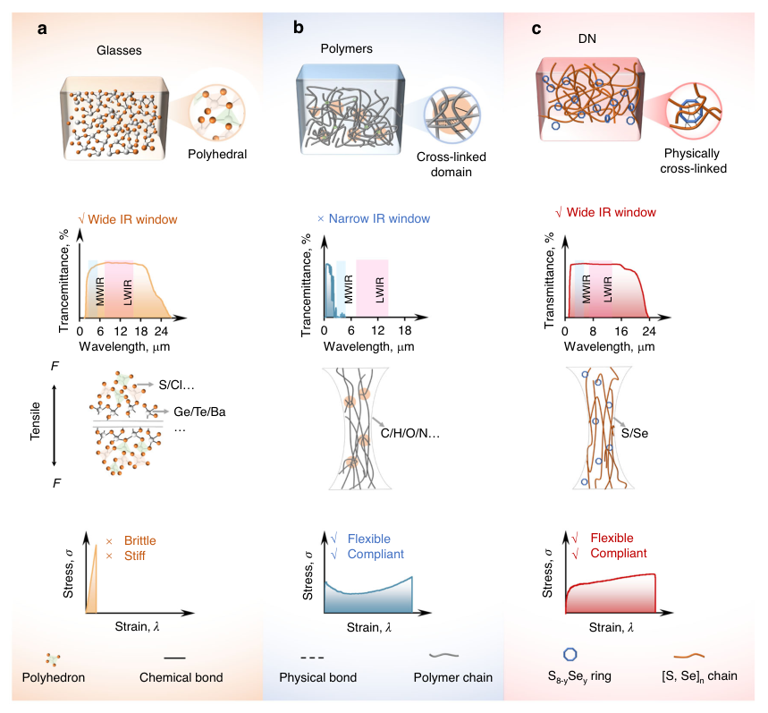
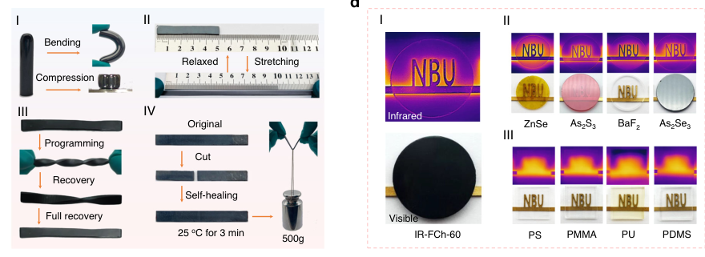
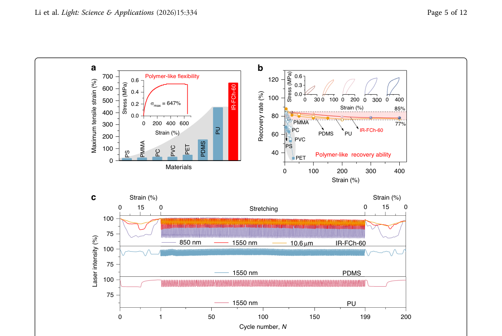
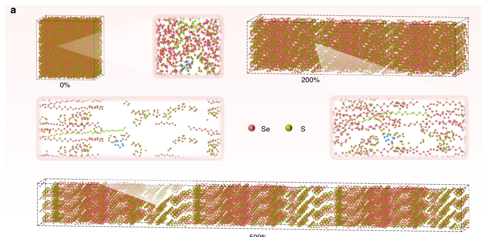
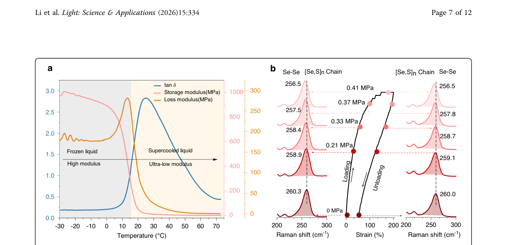
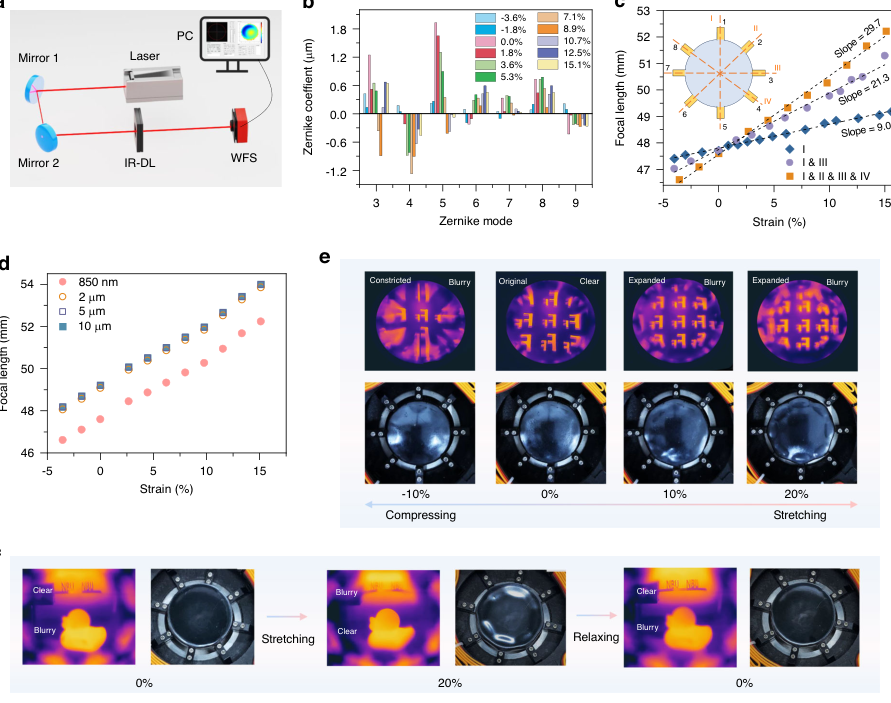

# An infrared-transparent flexible glass for adaptive optics

- 期刊：Light: Science & Applications
- 日期：2026-07-30
- DOI：10.1038/s41377-026-02409-z
- 解析状态：fulltext_draft

## 摘要与研究价值

**Original:** Abstract Transparent, flexible inorganic-organic composites are essential for next-generation adaptive optics, bio-integrated sensing, and reconfigurable photonics. Despite progress in hybrid material design, achieving a material that is simultaneously flexible and transparent across a broad infrared spectrum remains a fundamental challenge. Here, we report a S 60 Se 40 chalcogenide glass designed with a chain-ring dual-network architecture that overcomes this classic limitation. By integrating a dynamic covalent network of physical cross-links with heavy chalcogen elements (S, Se), this dual-network design suppresses multi-phonon absorption and ensures broadband transparency up to 21 μm, combining these optical properties with an ultralow Young’s modulus ( E ≈ 0.0037 GPa), extreme tensile strain (~650%), and high elastic recovery (~80%). The material further exhibits autonomous self-healing and shape-memory behavior at room temperature. We demonstrate its applicability through IR deformable lenses with tunable focal length and real-time aberration correction, showcasing capabilities in adaptive imaging and wavefront control. This work provides a versatile material platform that bridges the gap between glass-like optical performance and polymer-like mechanics, opening avenues for soft infrared photonics and reconfigurable optical systems.

**中文:** 与柔性触觉相关，但尚未显示对前端触觉计算的直接贡献。摘要可核实数值包括：21 μm、650%、80%。

## 创新点

- Abstract Transparent, flexible inorganic-organic composites are essential for next-generation adaptive optics, bio-integrated sensing, and reconfigurable photonics.
- 与柔性触觉相关，但尚未显示对前端触觉计算的直接贡献

## 对当前课题的启发

- 提供机器人、可穿戴或电子皮肤系统任务证据

## 制备与实验步骤

### 1. 材料混合与分散

**Source:** p.10

**Original:** Refractive dispersion curves of the glasses were measured by using a J.A.

**中文:** 材料混合与分散步骤，关键配比、时间、温度和设备参数以 p.10 原文为准。

### 2. 固化与热处理

**Source:** p.10

**Original:** Simulation details Atomic models of pure Se, IR-FCh-30, and IR-FCh-60 glasses were constructed in Materials Studio 2023, annealed, and subjected to tensile deformation using Large-scale Atomic/Molecular Massively Parallel Simulator software (LAMMPS 2023)47,48.

**中文:** 固化与热处理步骤，关键配比、时间、温度和设备参数以 p.10 原文为准。

### 3. 组装与封装

**Source:** p.10

**Original:** Structural characterization, including measurements of bond lengths, bond angles, and the temporal evolution of molecular chains and ring structures, was conducted using the OVITO software package48.

**中文:** 组装与封装步骤，关键配比、时间、温度和设备参数以 p.10 原文为准。

### 4. 制备与实验操作

**Source:** p.10

**Original:** Finally, the prepared glass samples were subjected to uniaxial tensile deformation along the x-axis at a constant rate of 8 × 10−8 nm ps−1 (equivalent 5 mm min−1), with calculations ceased upon reaching a strain of 500%.

**中文:** 制备与实验操作步骤，关键配比、时间、温度和设备参数以 p.10 原文为准。

### 5. 组装与封装

**Source:** p.10

**Original:** The relationship between bond lengths, bond angles, and tensile strain was statistically analyzed using Python to call the relevant modules in OVITO.

**中文:** 组装与封装步骤，关键配比、时间、温度和设备参数以 p.10 原文为准。

### 6. 制备与实验操作

**Source:** p.11

**Original:** Light: Science & Applications (2026) 15:334 Page 11 of 12 Design and fabrication of the IR-DL The IR-DL (Supplementary Fig. S7a) was fabricated from IR-FCh-60 material (in this work: S60Se40) with an initial diameter (D) and radius of curvature (R0).

**中文:** 制备与实验操作步骤，关键配比、时间、温度和设备参数以 p.11 原文为准。

### 7. 图形化与结构成形

**Source:** p.11

**Original:** The plano-convex and plano-concave IR-DLs (d0 = 31 mm, D = 45 mm) were fabricated by the melt pouring molding method (Supplementary Fig. S7b).

**中文:** 图形化与结构成形步骤，关键配比、时间、温度和设备参数以 p.11 原文为准。

### 8. 图形化与结构成形

**Source:** p.11

**Original:** Initially, eight metal T-shaped anchors (thickness = 2 mm; height = 4 mm; width = 10 mm) were aligned symmetrically in four diametrical pairs in the designated slots of the predesigned graphite mold, 5 mm from the edge.

**中文:** 图形化与结构成形步骤，关键配比、时间、温度和设备参数以 p.11 原文为准。

### 9. 图形化与结构成形

**Source:** p.11

**Original:** Prefabricated IR-FCh-60 glass was melted at 300 °C for 30 min under N₂ atmosphere, poured into the mold, and quenched.

**中文:** 图形化与结构成形步骤，关键配比、时间、温度和设备参数以 p.11 原文为准。

## 方法原文锚点

**Source:** p.10 M001

**Original:** Synthesis of polymer-like IR-FCh glasses Chalcogenide glasses with compositions SxSe100-x (x = 0, 30, 45, and 60, molar ratios) were synthesized via vacuum melt-quenching. Remarkably, glasses with high sulfur content (x = 30, 45, and 60) exhibited polymer-like ultra-flexibility and a broad transmission window, leading to their designation as IR ultra-flexible chalcogenide (IRFCh) glasses specifically IR-FCh-30, IR-FCh-45, and IRFCh-60. The synthesis procedure was followed: Highpurity sulfur (99.999%, Aladdin) and selenium (99.999%, Aladdin) were weighed (40 g total) according to stoichiometric ratios, loaded into a quartz tube, and flamesealed under vacuum (≈10−3 Pa). The sealed quartz tube was heated in a rocking furnace to 673 K at 0.8 K min−1

**中文:** 该段已进入结构化方法步骤；完整逐段翻译待智能体精读补齐。

**Source:** p.10 M002

**Original:** and held for 48 h for homogenization. The melt was water-quenched to obtain a cylindrical glass ingot, which was then sectioned into 2 mm-thick wafers and polished to optical quality.

**中文:** 该段已进入结构化方法步骤；完整逐段翻译待智能体精读补齐。

**Source:** p.10 M003

**Original:** Characterizations The structural analyses of glasses were investigated by Micro-Raman spectra on a Raman spectrometer (Renishaw in Via, London, UK) using a 785 nm laser source for excitation. Transmission spectra of the samples were obtained using a Perkin-Elmer-Lambda 950 UV/VIS/NIR spectrophotometer (250–2500 nm range) and a Nicolet 380

**中文:** 该段已进入结构化方法步骤；完整逐段翻译待智能体精读补齐。

**Source:** p.10 M004

**Original:** Fourier-transform IR spectrometer (2.5–25 μm range). Refractive dispersion curves of the glasses were measured by using a J.A. Woollam IR-VASE spectroscopic ellipsometry with a measurement precision of ±0.0005. Room-temperature compression, three-point bending, tensile, and tensile relaxation tests were conducted on a horizontally placed mechanical testing machine ZW990LA (Dongguan Zhiqu Precision Instrument Co., Ltd). For compression, ϕ6 × 10 mm cylindrical samples were used; the loading speed was set at 0.1 mm min−1. For the three-point bending, the specimen size was 20 × 3 × 1.5 mm (length × width × thickness), and the span was set to 10 mm; the loading speed was set at 0.1 mm min−1. For tension testing and tensile relaxation testing, bar-shaped samples (52 × 15 × 1.1 mm) were further machined into bone-shaped specimens with spans of 30 × 5 × 1.1 mm; the loading speeds were set at 5 mm min−1 and 1 mm min−1, respectively. DMA was conducted on a DMA850 instrument in tension mode with a temperature ramp rate of 4 °C min−1 at 6.2 Hz. All mechanical and optical tests were conducted under ambient conditions at ambient laboratory atmosphere without the use of an inert environment.

**中文:** 该段已进入结构化方法步骤；完整逐段翻译待智能体精读补齐。

**Source:** p.10 M005

**Original:** Simulation details Atomic models of pure Se, IR-FCh-30, and IR-FCh-60 glasses were constructed in Materials Studio 2023, annealed, and subjected to tensile deformation using Large-scale Atomic/Molecular Massively Parallel Simulator software (LAMMPS 2023)47,48. Structural characterization, including measurements of bond lengths, bond angles, and the temporal evolution of molecular chains and ring structures, was conducted using the OVITO software package48. The pure Se model contained 21600 atoms in a cubic cell of 89.13 × 89.13 × 89.13 Å; IRFCh-30 and IR-FCh-60 models each contained 21688 atoms in cells of 87.28 × 87.28 × 87.28 Å and 83.92 × 83.92 × 83.92 Å, respectively. The samples were first melted and maintained at 670 K for 0.5 ns, a time span that is sufficiently long to equilibrate the liquids. Subsequently, the melts were cooled down to 300 K for 0.5 ns to obtain disordered amorphous glasses40. All the simulations were carried out in the isothermal-isobaric (NPT) ensemble under zero pressure and Universal Force Field47. Finally, the prepared glass samples were subjected to uniaxial tensile deformation along the x-axis at a constant rate of 8 × 10−8 nm ps−1 (equivalent 5 mm min−1), with calculations ceased upon reaching a strain of 500%. The relationship between bond lengths, bond angles, and tensile strain was statistically analyzed using Python to call the relevant modules in OVITO. All simulations were carried out using LAMMPS with a time step of 0.1 fs.

**中文:** 该段已进入结构化方法步骤；完整逐段翻译待智能体精读补齐。

**Source:** p.11 M006

**Original:** Li et al. Light: Science & Applications (2026) 15:334 Page 11 of 12

**中文:** 该段已进入结构化方法步骤；完整逐段翻译待智能体精读补齐。

**Source:** p.11 M007

**Original:** Design and fabrication of the IR-DL The IR-DL (Supplementary Fig. S7a) was fabricated from IR-FCh-60 material (in this work: S60Se40) with an initial diameter (D) and radius of curvature (R0). Eight metal anchors were embedded in the IR-DL. The metal anchors also define the clear aperture (d0), which is the distance between the two vertices of the opaque anchors at zero strain. The focal length of IR-DL may be varied by application of strain. When a force, Ff, is applied radially to the metal anchors, these move outward while the counterforce (Fe) is provided by the Young’s modulus (E = 3.77 MPa). While straining the IR-DL in the equatorial plane (Poisson’s ratio v = 0.38 > 0), the radius of curvature increases and so does the focal length of the lens. The strain, ϵ, which uses the initial clear aperture d0 of the lens as a reference, is expressed as25

**中文:** 该段已进入结构化方法步骤；完整逐段翻译待智能体精读补齐。

**Source:** p.11 M008

**Original:** ϵ ¼ Δd=d0 ð1Þ

**中文:** 该段已进入结构化方法步骤；完整逐段翻译待智能体精读补齐。

**Source:** p.11 M009

**Original:** where Δd is the diameter increment due to the movement of the metal anchors. The plano-convex and plano-concave IR-DLs (d0 = 31 mm, D = 45 mm) were fabricated by the melt pouring molding method (Supplementary Fig. S7b). Initially, eight metal T-shaped anchors (thickness = 2 mm; height = 4 mm; width = 10 mm) were aligned symmetrically in four diametrical pairs in the designated slots of the predesigned graphite mold, 5 mm from the edge. Prefabricated IR-FCh-60 glass was melted at 300 °C for 30 min under N₂ atmosphere, poured into the mold, and quenched. The resulting lens was optically polished and integrated with an eight-actuator drive system to form the final electrically tunable IR-DL. Initial properties of lenses are summarized in Supplementary Table S5.

**中文:** 该段已进入结构化方法步骤；完整逐段翻译待智能体精读补齐。

**Source:** p.11 M010

**Original:** Optical metrology of the IR-DL Transmitted wavefronts were measured using a selfbuilt optical bench equipped with a wavefront sensor (WFS), as depicted in Fig. 6a. The IR-DL’s surface profiles were characterized with a Mach-Zehnder interferometer (HMB 150MWIR) with a 3.39 µm laser source. Surface wavefront aberrations were fitted using the first 36 Zernike polynomials. Measurements used an 8 mm aperture, 30 Hz acquisition, 3 frame averaging, and 30 ms exposure. All tests were performed at room temperature.

**中文:** 该段已进入结构化方法步骤；完整逐段翻译待智能体精读补齐。

## 图表解读

### Fig. 1

**Source:** p.3

**Original caption:** Fig. 1 DN architecture of an IR-transparent flexible glass. Schematic comparison of material design and the resultant properties: a stiff IRtransparent glasses with rigid three-dimensional covalent networks; b soft polymers with dynamically cross‑linked chains; c S60Se40-based DN chalcogenide glass, which integrates physically cross-linked S8−ySey rings with polymeric [Se, S]n chains. Representative transmission spectra and stress-strain curves illustrate how the DN architecture achieves both a broad IR transmission window and a compliant, hyperelastic mechanical response

**中文图注:** Fig. 1 原始图注已提取；逐项含义见下方分图说明。

**Reading note:** 重点查看器件结构、材料层次、信号路径和制备流程。

### Fig. 2

**Source:** p.4

**Original caption:** Fig. 2 IR-FCh-60 glass with polymer-like flexibility and glass-like IR transparency compared with conventional optical materials. a Property map showing that IR-FCh-60 glass overcomes the conventional IR transparency-flexibility trade-off (gray band), which restricts typical optical materials to being either “IR transparency and stiff” or “strong IR absorption and flexible.” b Transmission spectra (2 mm thickness) of IR-FCh-60 compared with standard IR materials (ZnSe, As₂S₃, BaF2, As₂Se₃) and optical polymers (PS, PMMA, PU, DBA, PDMS). IR-FCh-60 exhibits a long-wave IR cutoff (>20 μm) and an ultra-broad transmission window of 20.38 μm. In contrast, polymers display strong characteristic absorption bands across the MWIR to LWIR, leading to narrow transmission windows and short cutoff wavelengths (<6.5 μm). c Visual evidence for mechanical behavior demonstrating polymer-like flexibility: (I) bending and compression, (II) stretching, (III) shape memory, (IV) self-healing (Supplementary Movies S1–S5). These behaviors resemble those of organic elastomers (e.g., PU and PDMS), and contrast with the brittle nature of conventional IR optical materials. A cylindrical sample (Φ9 mm × 70 mm) and a rectangular strip (length × width × thickness = 50 mm × 5 mm × 1.5 mm) were used. d Visual evidence for the IR transmission performance of IR-FCh-60 glass, like conventional IR optical materials, whereas organic substances exhibit complete opacity in the same spectral regime. (I) IR-FCh-60, (II) typical IR optical materials (ZnSe, As2S3, BaF2, and As2Se3), and (III) optical polymers (PS, PMMA, PU, and PDMS) were shown. Top row: IR images; bottom row: visible-light images. All 2 mm-thick samples were placed against a heated brass background consisting of the characters “NBU”

**中文图注:** Fig. 2 原始图注已提取；逐项含义见下方分图说明。

**Reading note:** 重点查看阵列规模、空间分辨率、串扰、读出通道和空间特征表达。

- (m) 结合正文首次引用位置和原始图注核对该图的证据角色。 原文：In contrast, polymers display strong characteristic absorption bands across the MWIR to LWIR, leading to narrow transmission windows and short cutoff wavelengths (<6.5 μm). c Visual evidence for mechanical behavior demonstrating polymer-like flexibility
- (i) 结合正文首次引用位置和原始图注核对该图的证据角色。 原文：bending and compression, (II) stretching, (III) shape memory, (IV) self-healing (Supplementary Movies S1–S5). These behaviors resemble those of organic elastomers (e.g., PU and PDMS), and contrast with the brittle nature of conventional IR optical materials. A cylindrical sample (Φ9 mm × 70 mm) and a rectangular strip (length × width × thickness = 50 mm × 5 mm × 1.5 mm) were used. d Visual evidence for the IR transmission performance of IR-FCh-60 glass, like conventional IR optical materials, whereas organic substances exhibit complete opacity in the same spectral regime
- (i) 重点查看阵列规模、空间分辨率、串扰、读出通道和空间特征表达。 原文：IR-FCh-60, (II) typical IR optical materials (ZnSe, As2S3, BaF2, and As2Se3), and (III) optical polymers (PS, PMMA, PU, and PDMS) were shown. Top row: IR images; bottom row: visible-light images. All 2 mm-thick samples were placed against a heated brass background consisting of the characters “NBU”

### Figure 2D

**Source:** p.4

**Original caption:** Figure 2d shows visual evidence for the IR transmission performance of the IR-FCh-60 glass material. Its imaging quality matches that of high-cost transmissive materials such as fluoride and sulfide crystals/glasses, while being distinctly superior to conventional organic materials (e.g., PS, PMMA, PU, PDMS), which are largely opaque in the IR region1,34. The ultralow modulus endows IR-FCh-60 with a large tensile strain of 647%, substantially surpassing that of traditional organic optical materials (high-modulus PC, PS, PMMA, PET: <50%; ultralow modulus PDMS and PU:

**中文图注:** Figure 2D 原始图注已提取；逐项含义见下方分图说明。

**Reading note:** 结合正文首次引用位置和原始图注核对该图的证据角色。

### Fig. 3

**Source:** p.5

**Original caption:** Fig. 3 IR-FCh-60 glass shows polymer-like flexibility together with self-recovery capability and optomechanical stability during cyclic stretching. a Maximum tensile strain of IR-FCh-60 glass as compared with existing optical polymers (inset: representative stress-strain curve of IR-Ch60) (Supplementary Fig. S3a, b). b High recovery rate (~80%) of the IR-FCh-60 across a wide tensile strain range (25–400%), contrasting with conventional optical polymers, including high elastic modulus variants (PC, PS, PMMA, PET) and ultralow modulus systems (PDMS, PU) (Supplementary Fig. S3c-i). Inset: stress relaxation behavior of IR-FCh-60 at varied strains. The recovery rate is defined as the ratio of the strain range with non-zero stress during the recovery phase of the tensile recovery curve to the maximum tensile strain within the same cycle. c Transmission during cyclic stretching (0–15% strain) for polymer-like IR-FCh-60 (at 850 nm, 1550 nm, and 10.6 µm), PDMS, and PU (at 1550 nm) as a function of cycle elongation. Cycles 1 and 200 show deformation-dependent attenuation, while cycles 2–199 demonstrate repeatable behavior

**中文图注:** Fig. 3 原始图注已提取；逐项含义见下方分图说明。

**Reading note:** 结合正文首次引用位置和原始图注核对该图的证据角色。

- (a) 结合正文首次引用位置和原始图注核对该图的证据角色。 原文：Maximum tensile strain of IR-FCh-60 glass as compared with existing optical polymers (inset: representative stress-strain curve of IR-Ch60) (Supplementary Fig. S3a, b)
- (b) 结合正文首次引用位置和原始图注核对该图的证据角色。 原文：High recovery rate (~80%) of the IR-FCh-60 across a wide tensile strain range (25–400%), contrasting with conventional optical polymers, including high elastic modulus variants (PC, PS, PMMA, PET) and ultralow modulus systems (PDMS, PU) (Supplementary Fig. S3c-i). Inset: stress relaxation behavior of IR-FCh-60 at varied strains. The recovery rate is defined as the ratio of the strain range with non-zero stress during the recovery phase of the tensile recovery curve to the maximum tensile strain within the same cycle
- (c) 结合正文首次引用位置和原始图注核对该图的证据角色。 原文：Transmission during cyclic stretching (0–15% strain) for polymer-like IR-FCh-60 (at 850 nm, 1550 nm, and 10.6 µm), PDMS, and PU (at 1550 nm) as a function of cycle elongation. Cycles 1 and 200 show deformation-dependent attenuation, while cycles 2–199 demonstrate repeatable behavior

### Fig. 4

**Source:** p.6

**Original caption:** Fig. 4 Strain-driven structural evolution of polymer-like IR-FCh-60 glass. a Molecular dynamics snapshots and cross-sectional views (partially enlarged views) at 0, 200, and 500% tensile strain. Polymeric [Se, S]n chains and eight-membered SeyS8−y rings are highlighted in green and blue, respectively, to track structural evolution during deformation. Under uniaxial elongation, the coiled polymeric chains progressively extend toward linear configurations, while the eight-membered rings largely retain their structural integrity. Evolution of b bond length and c bond angle in chain versus ring during elongation. Chains show significant covalent bond elongation, especially Se–Se bond elongation (>0.3 Å increase) and angular distortion (>10° increase), whereas rings exhibit minimal changes in bond parameters (<0.05 Å variation). d Raman shift of the Se–Se bond as a function of strain. The redshift (Δν = −4 cm−1 at 170% strain) confirms strain-induced bond elongation and angular expansion within the chains, which reduces vibrational frequency by increasing interatomic distances49

**中文图注:** Fig. 4 原始图注已提取；逐项含义见下方分图说明。

**Reading note:** 结合正文首次引用位置和原始图注核对该图的证据角色。

### Fig. 5

**Source:** p.7

**Original caption:** Fig. 5 Origin of the polymer-like ultra-flexibility. a Dynamic mechanical analysis of IR-FCh-60 glass, showing temperature dependence of the storage modulus (Eʹ), loss modulus (E"), and tan δ (E"/Eʹ). As the temperature rises, Eʹ decreases significantly, while E" peaks at 13.5 °C, indicating the glass transition temperature (Tg). The subsequent decline in modulus above Tg leads to ultralow modulus behavior at room temperature. b In situ Raman spectra during tensile loading (left: 0 →0.41 MPa) and unloading (right: 0.41 →0 MPa). The reversible shift of the Se–Se vibration frequency from 260.3 to 256.5 cm−1 under load, and its recovery to 260 cm−1 upon unloading, confirms elastic elongation of covalent bonds during deformation. Rectangular strip sample (length × width = 10 mm × 5 mm, thickness ≈10 µm) was used

**中文图注:** Fig. 5 原始图注已提取；逐项含义见下方分图说明。

**Reading note:** 结合正文首次引用位置和原始图注核对该图的证据角色。

- (a) 结合正文首次引用位置和原始图注核对该图的证据角色。 原文：Dynamic mechanical analysis of IR-FCh-60 glass, showing temperature dependence of the storage modulus (Eʹ), loss modulus (E"), and tan δ (E"/Eʹ). As the temperature rises, Eʹ decreases significantly, while E" peaks at 13.5 °C, indicating the glass transition temperature (Tg). The subsequent decline in modulus above Tg leads to ultralow modulus behavior at room temperature
- (b) 结合正文首次引用位置和原始图注核对该图的证据角色。 原文：In situ Raman spectra during tensile loading (left: 0 →0.41 MPa) and unloading (right: 0.41 →0 MPa). The reversible shift of the Se–Se vibration frequency from 260.3 to 256.5 cm−1 under load, and its recovery to 260 cm−1 upon unloading, confirms elastic elongation of covalent bonds during deformation. Rectangular strip sample (length × width = 10 mm × 5 mm, thickness ≈10 µm) was used

### Fig. 6

**Source:** p.9

**Original caption:** Fig. 6 Programmable IR optics enabled by IR-FCh-60 deformable lenses. a Schematic of the transmitted wavefront characterization setup for an IR-DL using a custom optical bench equipped with a wavefront sensor (WFS). A collimated 850 nm laser beam passes through the IR-DL and is collected by the WFS (8 mm aperture, 1 ms exposure, 7 Hz acquisition rate). Wavefront aberrations were characterized by fitting the first 65 Zernike terms, excluding tilt components. The defocus coefficient was measured with a precision of ±0.05 µm (λ ∙12−1). b Evolution of Zernike coefficients under simultaneous quadra-axial strain (axes I–IV). c Focal length tuning under vectored actuation: uniaxial (I), biaxial (I + III), and quadra-axial (I–IV). Defocus was nulled at each strain by WFS displacement. Inset: Actuator numbering and axes. d Focal length tuning range under quadra-axial strain at 850 nm. Focal lengths derived from lens curvature and refractive index f = R/(n −1), where R is the radius of curvature and n the refractive index) were extrapolated to wavelengths of 2, 5, and 10 µm. e Visible-light and thermal IR images of a plano-convex IR-DL under relaxed, compressive, and tensile states, showing deformation-dependent imaging evolution. f Real-time focal switching and depth selectivity demonstrated with a planoconcave IR-DL: the distant “NBU” object is sharply imaged in the relaxed state; focus shifts to the nearer “Duck” object under stretching; and original focus recovers upon strain release

**中文图注:** Fig. 6 原始图注已提取；逐项含义见下方分图说明。

**Reading note:** 重点查看器件结构、材料层次、信号路径和制备流程。

- (a) 重点查看器件结构、材料层次、信号路径和制备流程。 原文：Schematic of the transmitted wavefront characterization setup for an IR-DL using a custom optical bench equipped with a wavefront sensor (WFS). A collimated 850 nm laser beam passes through the IR-DL and is collected by the WFS (8 mm aperture, 1 ms exposure, 7 Hz acquisition rate). Wavefront aberrations were characterized by fitting the first 65 Zernike terms, excluding tilt components. The defocus coefficient was measured with a precision of ±0.05 µm (λ ∙12−1)
- (b) 结合正文首次引用位置和原始图注核对该图的证据角色。 原文：Evolution of Zernike coefficients under simultaneous quadra-axial strain (axes I–IV)
- (c) 结合正文首次引用位置和原始图注核对该图的证据角色。 原文：Focal length tuning under vectored actuation: uniaxial (I), biaxial (I + III), and quadra-axial (I–IV). Defocus was nulled at each strain by WFS displacement. Inset: Actuator numbering and axes
- (d) 结合正文首次引用位置和原始图注核对该图的证据角色。 原文：Focal length tuning range under quadra-axial strain at 850 nm. Focal lengths derived from lens curvature and refractive index f = R/(n −1), where R is the radius of curvature and n the refractive index) were extrapolated to wavelengths of 2, 5, and 10 µm
- (e) 重点查看阵列规模、空间分辨率、串扰、读出通道和空间特征表达。 原文：Visible-light and thermal IR images of a plano-convex IR-DL under relaxed, compressive, and tensile states, showing deformation-dependent imaging evolution
- (f) 重点查看阵列规模、空间分辨率、串扰、读出通道和空间特征表达。 原文：Real-time focal switching and depth selectivity demonstrated with a planoconcave IR-DL: the distant “NBU” object is sharply imaged in the relaxed state; focus shifts to the nearer “Duck” object under stretching; and original focus recovers upon strain release
