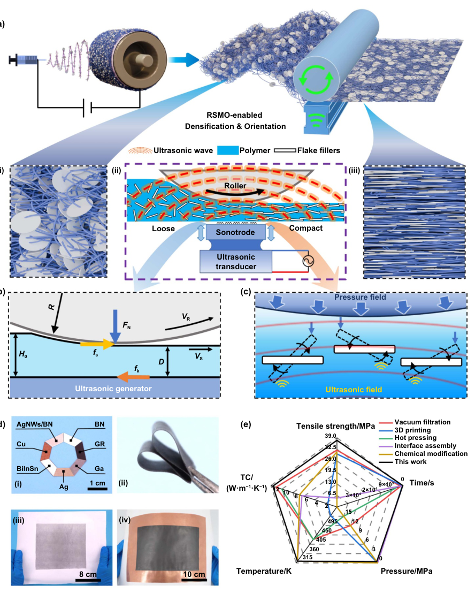
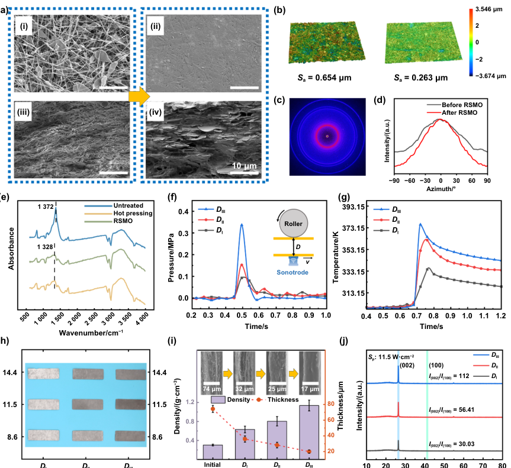
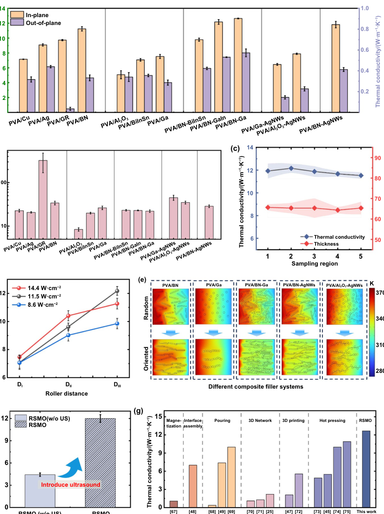
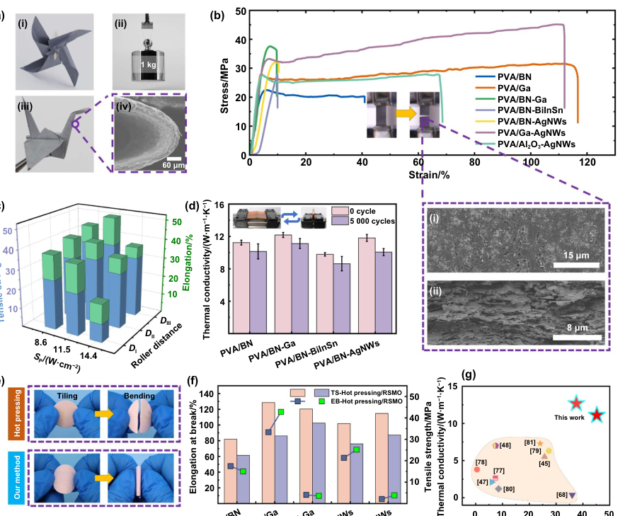
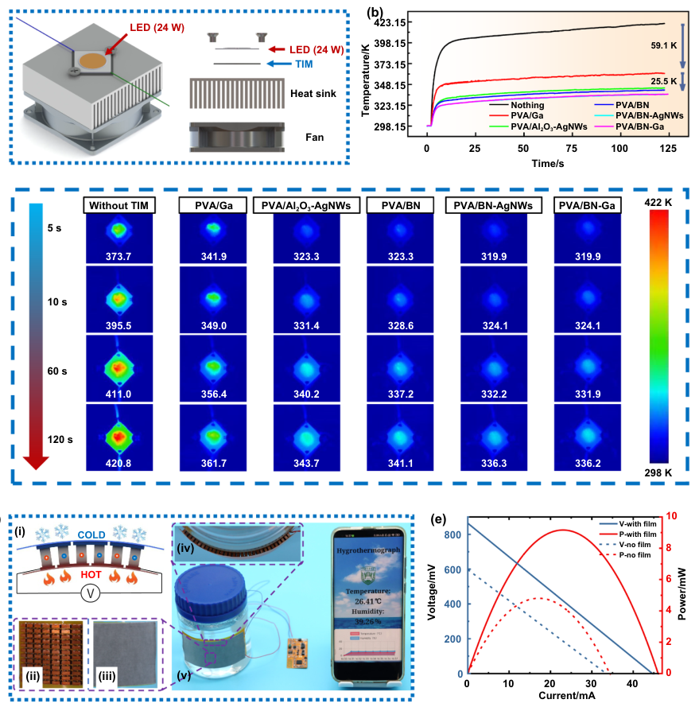

# Rolled-sonicating enabled orientation of microstructures in flexible nanocomposites

- 期刊：International Journal of Extreme Manufacturing
- 日期：2026-08-10
- DOI：10.1088/2631-7990/ae8a91
- 解析状态：fulltext_draft

## 摘要与研究价值

**Original:** Abstract Polymer nanocomposites filled with highly thermally conductive nano/microparticles have shown promise for efficient thermal management in power electronics due to their excellent flexibility and thermal conductivity. However, it remains challenging to align particulate fillers into an optimal heat transfer path through a fast and large-scale green fabrication process, especially when adapting to various types of fillers and flexible matrices. Herein, we report a unique rolled sonication-enabled microstructure orientation (RSMO) method that enables superfast densification and orientation of various fillers in polymers through the synergistic thermo-mechanical effects of high-frequency vibration with roller pressing, achieving full processing within one second without external heating. Ultrasound-induced dense packing and oriented structures synergistically enhance both thermal conductivity (an increase of 171%) and tensile strength (19-fold enhancement) compared with simple roller pressing. RSMO has been demonstrated to be applicable to a wide range of fillers, including metals, inorganic nonmetals, and organic materials, as well as various film-forming techniques, such as electrospinning and screen printing. We successfully fabricated large-area thermally conductive films using RSMO and demonstrated their thermal management capabilities in power electronics and flexible thermoelectric generation, thereby confirming their significant potential in preparing high-performance thermal management materials for flexible electronic devices.

**中文:** 可用于低离散/装配容差触觉界面的结构与对照设计。摘要可核实数值包括：171%。

## 创新点

- Abstract Polymer nanocomposites filled with highly thermally conductive nano/microparticles have shown promise for efficient thermal management in power electronics due to their excellent flexibility and thermal conductivity.
- 可用于低离散/装配容差触觉界面的结构与对照设计

## 对当前课题的启发

- 可用于低离散/装配容差触觉界面的结构与对照设计

## 制备与实验步骤

### 1. 材料混合与分散

**Source:** p.1

**Original:** Rolled-sonicating enabled orientation of microstructures in flexible nanocomposites Liquid metal printing for atomically thin metal-based materials and devices: toward atomic-level manufacturing Jiaqi He, Haoming Yan, Chunfeng Wang et al.

**中文:** 材料混合与分散步骤，关键配比、时间、温度和设备参数以 p.1 原文为准。

### 2. 成膜与沉积

**Source:** p.1

**Original:** Heterogeneous material 3D printing: from multi-material integration to spatiotemporal functionality programming Xueli Zhou, Hongpei Liu, Chao Xu et al.

**中文:** 成膜与沉积步骤，关键配比、时间、温度和设备参数以 p.1 原文为准。

### 3. 材料混合与分散

**Source:** p.2

**Original:** Rolled-sonicating enabled orientation of microstructures in flexible nanocomposites Abstract Polymer nanocomposites filled with highly thermally conductive nano/microparticles have shown promise for efficient thermal management in power electronics due to their excellent flexibility and thermal conductivity.

**中文:** 材料混合与分散步骤，关键配比、时间、温度和设备参数以 p.2 原文为准。

### 4. 组装与封装

**Source:** p.2

**Original:** However, it remains challenging to align particulate fillers into an optimal heat transfer path through a fast and large-scale green fabrication process, especially when adapting to various types of fillers and flexible matrices.

**中文:** 组装与封装步骤，关键配比、时间、温度和设备参数以 p.2 原文为准。

### 5. 材料混合与分散

**Source:** p.2

**Original:** Herein, we report a unique rolled sonication-enabled microstructure orientation (RSMO) method that enables superfast densification and orientation of various fillers in polymers through the synergistic thermo-mechanical effects of high-frequency vibration with roller pressing, achieving full processing within one second without external heating.

**中文:** 材料混合与分散步骤，关键配比、时间、温度和设备参数以 p.2 原文为准。

### 6. 成膜与沉积

**Source:** p.2

**Original:** RSMO has been demonstrated to be applicable to a wide range of fillers, including metals, inorganic nonmetals, and organic materials, as well as various film-forming techniques, such as electrospinning and screen printing.

**中文:** 成膜与沉积步骤，关键配比、时间、温度和设备参数以 p.2 原文为准。

### 7. 制备与实验操作

**Source:** p.2

**Original:** We successfully fabricated large-area thermally conductive films using RSMO and demonstrated their thermal management capabilities in power electronics and flexible thermoelectric generation, thereby confirming their significant potential in preparing high-performance thermal management materials for flexible electronic devices.

**中文:** 制备与实验操作步骤，关键配比、时间、温度和设备参数以 p.2 原文为准。

### 8. 材料混合与分散

**Source:** p.3

**Original:** Rolled-sonicating enabled orientation of microstructures ...

**中文:** 材料混合与分散步骤，关键配比、时间、温度和设备参数以 p.3 原文为准。

### 9. 材料混合与分散

**Source:** p.3

**Original:** Keywords: sonicating process, large-scale fabrication, polymer nanocomposites, flexible electronics, thermal management The rapid development of high-power density integrated electronics has driven transformative progress in flexible electronics, such as foldable displays[1–3], wearable bioelectronics[4,5], soft robotics[6], and sensors for extreme environments[7–10].

**中文:** 材料混合与分散步骤，关键配比、时间、温度和设备参数以 p.3 原文为准。

### 10. 制备与实验操作

**Source:** p.3

**Original:** In this context, these three core requirements—high thermal performance, excellent flexibility, and adaptability to mass manufacturing—drive researchers to advance thermal management materials and fabrication technologies that can effectively integrate all three characteristics.

**中文:** 制备与实验操作步骤，关键配比、时间、温度和设备参数以 p.3 原文为准。

### 11. 成膜与沉积

**Source:** p.3

**Original:** Against this backdrop, researchers have devised a multitude of orientation regulation techniques, including directional freezing[24,25], vacuum filtration[26,27], blade coating[28,29], electrospinning[30,31], magnetic/electric field alignment[32,33], hybrid filler systems[34,35] and interfacial modifications[36].

**中文:** 成膜与沉积步骤，关键配比、时间、温度和设备参数以 p.3 原文为准。

### 12. 成膜与沉积

**Source:** p.3

**Original:** Furthermore, the freeze-drying process, which involves solvent evaporation, tends to leave numerous residual voids that induce substantial air thermal resistance, structural defects, and low mechanical strength, thereby reducing the material’s heat transfer efficiency and bending resistance[40].

**中文:** 成膜与沉积步骤，关键配比、时间、温度和设备参数以 p.3 原文为准。

### 13. 组装与封装

**Source:** p.3

**Original:** Therefore, post-processing steps such as encapsulation or hot pressing are required before application[11,24].

**中文:** 组装与封装步骤，关键配比、时间、温度和设备参数以 p.3 原文为准。

### 14. 制备与实验操作

**Source:** p.3

**Original:** The single preparation process is limited by the filtration speed and takes 10−30 minutes, allowing the production of membranes with diameters of only 5−10 cm.

**中文:** 制备与实验操作步骤，关键配比、时间、温度和设备参数以 p.3 原文为准。

### 15. 组装与封装

**Source:** p.3

**Original:** Moreover, the interfacial bonding between the polymer matrix and fillers remains insufficient following vacuum filtration, necessitating hot-pressing treatment to mitigate filler delamination or shedding[27].

**中文:** 组装与封装步骤，关键配比、时间、温度和设备参数以 p.3 原文为准。

### 16. 成膜与沉积

**Source:** p.3

**Original:** Blade coating utilizes shear forces to induce the ordered alignment of two-dimensional fillers within the polymer matrix[29].

**中文:** 成膜与沉积步骤，关键配比、时间、温度和设备参数以 p.3 原文为准。

## 方法原文锚点

**Source:** p.1 M001

**Original:** Rolled-sonicating enabled orientation of microstructures in flexible nanocomposites

**中文:** 该段已进入结构化方法步骤；完整逐段翻译待智能体精读补齐。

**Source:** p.1 M002

**Original:** Liquid metal printing for atomically thin metal-based materials and devices: toward atomic-level manufacturing Jiaqi He, Haoming Yan, Chunfeng Wang et al.

**中文:** 该段已进入结构化方法步骤；完整逐段翻译待智能体精读补齐。

**Source:** p.1 M003

**Original:** Heterogeneous material 3D printing: from multi-material integration to spatiotemporal functionality programming Xueli Zhou, Hongpei Liu, Chao Xu et al.

**中文:** 该段已进入结构化方法步骤；完整逐段翻译待智能体精读补齐。

**Source:** p.2 M004

**Original:** Rolled-sonicating enabled orientation of microstructures in flexible nanocomposites

**中文:** 该段已进入结构化方法步骤；完整逐段翻译待智能体精读补齐。

**Source:** p.2 M005

**Original:** Abstract Polymer nanocomposites filled with highly thermally conductive nano/microparticles have shown promise for efficient thermal management in power electronics due to their excellent flexibility and thermal conductivity. However, it remains challenging to align particulate fillers into an optimal heat transfer path through a fast and large-scale green fabrication process, especially when adapting to various types of fillers and flexible matrices. Herein, we report a unique rolled sonication-enabled microstructure orientation (RSMO) method that enables superfast densification and orientation of various fillers in polymers through the synergistic thermo-mechanical effects of high-frequency vibration with roller pressing, achieving full processing within one second without external heating. Ultrasound-induced dense packing and oriented structures synergistically enhance both thermal conductivity (an increase of 171%) and tensile strength (19-fold enhancement) compared with simple roller pressing. RSMO has been demonstrated to be applicable to a wide range of fillers, including metals, inorganic nonmetals, and organic materials, as well as various film-forming techniques, such as electrospinning and screen printing. We successfully fabricated large-area thermally conductive films using RSMO and demonstrated their thermal management capabilities in power electronics and flexible thermoelectric generation, thereby confirming their significant potential in preparing high-performance thermal management materials for flexible electronic devices.

**中文:** 该段已进入结构化方法步骤；完整逐段翻译待智能体精读补齐。

**Source:** p.3 M006

**Original:** Rolled-sonicating enabled orientation of microstructures ...

**中文:** 该段已进入结构化方法步骤；完整逐段翻译待智能体精读补齐。

**Source:** p.3 M007

**Original:** Keywords: sonicating process, large-scale fabrication, polymer nanocomposites, flexible electronics, thermal management

**中文:** 该段已进入结构化方法步骤；完整逐段翻译待智能体精读补齐。

**Source:** p.3 M008

**Original:** The rapid development of high-power density integrated electronics has driven transformative progress in flexible electronics, such as foldable displays[1–3], wearable bioelectronics[4,5], soft robotics[6], and sensors for extreme environments[7–10]. However, inevitable heat accumulation during their operation not only significantly impairs working life and performance stability but also poses a fire risk. Thus, there is an urgent need for high-thermal-conductivity materials to enable efficient heat dissipation[11]. Meanwhile, the unique deformation requirements of flexible electronic devices impose higher standards on the flexibility and fatigue resistance of heat-dissipating materials[12,13]. For industrial applications, a stable, cost-effective production process is equally critical, as it directly corresponds to compatibility with large-scale manufacturing. In this context, these three core requirements—high thermal performance, excellent flexibility, and adaptability to mass manufacturing—drive researchers to advance thermal management materials and fabrication technologies that can effectively integrate all three characteristics.

**中文:** 该段已进入结构化方法步骤；完整逐段翻译待智能体精读补齐。

**Source:** p.3 M009

**Original:** Against this backdrop, researchers have devised a multitude of orientation regulation techniques, including directional freezing[24,25], vacuum filtration[26,27], blade coating[28,29], electrospinning[30,31], magnetic/electric field alignment[32,33], hybrid filler systems[34,35] and interfacial modifications[36]. Nonetheless, a unidimensional approach often yields suboptimal filler orientation and is frequently associated with the development of detrimental mechani-

**中文:** 该段已进入结构化方法步骤；完整逐段翻译待智能体精读补齐。

**Source:** p.3 M010

**Original:** cal flaws, which inherently limit the overall performance of the nanocomposites. Therefore, numerous research groups have explored the combination of multiple technologies, such as orientation techniques coupled with pressing processes, which involve initial alignment and subsequent densification. The freezing orientation utilizes ice crystal growth to effectively promote vertical filler alignment. This treatment requires an ultra-low temperature environment ranging from 193.15 K to 233.15 K, and the duration can be as long as 12−72 hours[37–39]. Furthermore, the freeze-drying process, which involves solvent evaporation, tends to leave numerous residual voids that induce substantial air thermal resistance, structural defects, and low mechanical strength, thereby reducing the material’s heat transfer efficiency and bending resistance[40]. Therefore, post-processing steps such as encapsulation or hot pressing are required before application[11,24]. Its large-scale cost is extremely high because of prolonged ultra-low temperature treatment and custom large-scale equipment. Vacuum filtration facilitates the formation of highly aligned planar structures through gravity-driven sedimentation and negative-pressure consolidation[41]. The single preparation process is limited by the filtration speed and takes 10−30 minutes, allowing the production of membranes with diameters of only 5−10 cm. When scaling up to larger areas (>20 cm2), maintaining a uniform pressure field becomes challenging. The resulting uneven negative pressure distribution on the membrane induces different sedimentation rates of the fillers. Consequently, this leads to structural heterogeneity, which significantly deteriorates the spatial consistency and reliability of the thermal conductivity of the final film[42]. Moreover, the interfacial bonding between the polymer matrix and fillers remains insufficient following vacuum filtration, necessitating hot-pressing treatment to mitigate filler delamination or shedding[27]. Blade coating utilizes shear forces to induce the ordered alignment of two-dimensional fillers within the polymer matrix[29]. For the blade coating process, inevitable solvent evaporation during heating often leads to severe matrix distortion and concentration of internal stresses. These structural defects substantially compromise the mechanical reliability of the nanocomposites under tensile and bending loads[43]. Similarly, in the fabrication of nanocomposites through electrospinning, fillers achieve a certain degree of in-plane orientation with significant inter-filler voids, which act as obstacles to phonon transport. Following this, a hot-pressing step is necessary to eliminate air gaps and concurrently regulate the compactness and increase the filler orientation. Studies have demonstrated that extended high-temperature pressing can significantly increase the thermal conductivity, glass transition temperature, and heat resistance index of polyvinyl alcohol (PVA)

**中文:** 该段已进入结构化方法步骤；完整逐段翻译待智能体精读补齐。

**Source:** p.4 M011

**Original:** Rolled-sonicating enabled orientation of microstructures ...

**中文:** 该段已进入结构化方法步骤；完整逐段翻译待智能体精读补齐。

**Source:** p.4 M012

**Original:** nanocomposites[14,44]. While hot-pressing has emerged as a conventional yet time-intensive technique for fabricating thermally conductive polymers, harsh processing conditions can lead to cracking or embrittlement in the film, thus impairing the flexibility of the composites[45]. The current orientation strategies struggle to efficiently synergize mechanical properties and thermal conductivities in large-scale production. Thus, developing a multi-technology coupled approach, capable of precisely aligning fillers, enabling large-scale densification, and preserving the polymer matrix’s flexibility, is essential for overcoming bottlenecks in flexible thermal management materials.

**中文:** 该段已进入结构化方法步骤；完整逐段翻译待智能体精读补齐。

**Source:** p.4 M013

**Original:** The versatility of the RSMO strategy extends beyond fiber-based systems to include composite films containing spherical particles and those fabricated via screen printing. As shown in Figures S1, S2, and Movie S2, within the roll pressure field, ultrasonic induces localized, highintensity interfacial interactions between the polymer-coated particles. These interactions drive particles rearrangement and dense packing[50,55–57], effectively disrupting the surface oxide layers and polymer coating on the particle surface[58]. Consequently, the particles undergo thermal softening and inter-particle bonding[50], forming a dense network that serves as an efficient channel for heat carrier transport. This densification effect is substantial, which will be further elaborated on in the subsequent sections and Supplementary Note 1.

**中文:** 该段已进入结构化方法步骤；完整逐段翻译待智能体精读补齐。

**Source:** p.4 M014

**Original:** Herein, we report an innovative rolled sonicating-enabled microstructure-orientation (RSMO) method, which functions through the synergistic effect of high-frequency ultrasonic vibration and mild rolling pressure, facilitating the controlled alignment and densification of thermally conductive fillers in polymer matrices under low-pressure conditions without external heating. This transformation occurs within the span of a single second. This versatile approach is compatible with diverse film-forming methods (electrospinning or screen printing) and various filler types (metals, inorganic non-metals, organic materials, etc). By facilitating the horizontal alignment of fillers, the RSMO constructs continuous in-plane thermal conduction networks while minimizing matrix damage and porosity—synergistically enhancing both thermal conductivity and mechanical flexibility. For a PVA-based system as the testing model, the RSMO can achieve in-plane thermal conductivities of 11.54 W·m−1·K−1 with 30 wt% BNNSs and 7.53 W·m−1·K−1 with 30 wt% gallium (Ga)-based liquid metal, as well as high flexibility (bending radius <1 mm), mechanical strength (tensile strength >30 MPa), and over 90% thermal conductivity retention after repeated bending cycles. Notably, this method enables simultaneous cross-material coupling and orientation of heterogeneous films while also boasting potential for large-scale production. In addition, the effects of the process parameters on the degree of orientation and the thermal and mechanical properties of the nanocomposites are discussed. In real applications, RSMO-prepared flexible thermally conductive films demonstrate exceptional thermal management performance in light-emitting diode (LED) devices and flexible thermoelectric systems. This work provides new insights into the efficient preparation of flexible thermal management membranes and directional property regulation in multicomponent composites, offering potential solutions for high-power chips and flexible electronics in thermal management.

**中文:** 该段已进入结构化方法步骤；完整逐段翻译待智能体精读补齐。

**Source:** p.4 M015

**Original:** The synergistic interaction of ultrasonic and roll pressing endows the RSMO with broad universality, enabling the mass preparation of large-area, thermally conductive composite films across diverse material systems, such as boron nitride (BN), Cu, and BN-Ga in PVA electrospinning systems (Figures 1(d–i) and S3), as well as BiInSn, GR, and Cu in paper-based screen printing (Figure S4). Specifically, RSMO achieves excellent densification and orientation at a processing speed of 50 mm·s−1 for composite films with a width of 200 mm. By optimizing the dimensions of the ultrasonicrolling equipment, the processing width can be scaled to 500 mm or more. Additionally, this method preserves material flexibility (Figure 1(d–ii)) and facilitates the synergistic coupling of orientation and heterogeneous integration of multiple materials. Different thermally conductive fillers can achieve regionalized filler compounding and orientation simultaneously through the RSMO, which in turn modulates the heat transfer pathway, as shown in Figures 1(d–iii), (d–iv), and S5. In Figure 1(e), we benchmark the RSMO against mainstream alignment techniques[27,46,48,49,59]. Notably, without relying on external high temperature or high pressure, RSMO can efficiently produce composites with superior thermal conductivity and mechanical strength within a timescale of seconds.

**中文:** 该段已进入结构化方法步骤；完整逐段翻译待智能体精读补齐。

**Source:** p.5 M016

**Original:** Rolled-sonicating enabled orientation of microstructures ...

**中文:** 该段已进入结构化方法步骤；完整逐段翻译待智能体精读补齐。

**Source:** p.5 M017

**Original:** Vacuum filtration 3D printing Hot pressing Interface assembly Chemical modification This work

**中文:** 该段已进入结构化方法步骤；完整逐段翻译待智能体精读补齐。

**Source:** p.5 M018

**Original:** Figure 1. Descriptions of the RSMO method. (a) Oriented and compact thermally conductive films can be stably prepared via RSMO; schematic cross-sectional morphologies (i) before and (iii) after treatment, and (ii) schematic of the RSMO working principle. (b) macroscopic force analysis of samples during the RSMO process. FN: preload, f s: dynamic friction force, f k: static friction force. (c) microscopic force analysis of samples during the RSMO process under optimal operating conditions. (d) digital photographs of RSMO-treated thermally conductive films. (i) photographs of samples from various material systems assembled into regular heptagons after cutting, (ii) flexibility of the treated electrospun film, (iii) large-sized PVA/BN and PVA/Ga electrospun films prepared by RSMO, and (iv) large-area paper-based Cu&GR composite thermally conductive films prepared by RSMO. (e) comparison of the tensile strength and thermal conductivity of the RSMO-processed samples versus other orientation methods, alongside the corresponding processing parameters, including temperature, pressure magnitude, and duration. (Vacuum filtration[27]; 3D printing[46]; hot pressing[47]; interface assembly[48]; chemical modification[49]).

**中文:** 该段已进入结构化方法步骤；完整逐段翻译待智能体精读补齐。

**Source:** p.6 M019

**Original:** Rolled-sonicating enabled orientation of microstructures ...

**中文:** 该段已进入结构化方法步骤；完整逐段翻译待智能体精读补齐。

**Source:** p.6 M020

**Original:** Sonication power density/(W·cm−2)

**中文:** 该段已进入结构化方法步骤；完整逐段翻译待智能体精读补齐。

**Source:** p.6 M021

**Original:** Figure 2. Characterization of dense and oriented structures (using PVA/BN-Ga composites as the model samples). (a) SEM images of the PVA/BN-Ga sample: (i) surface before RSMO; (ii) surface after RSMO; (iii) cross-section before RSMO; (iv) cross-section after RSMO. (b) Laser microscopy 3D images of PVA/BN-Ga composites before and after RSMO treatment. (c) WAXS of the PVA/BN-Ga composite. (d) The azimuth angle intensity curves of the BN characteristic crystal planes of the samples before and after RSMO treatment; (e) FTIR-ATR spectra of untreated, hot pressed, and RSMO-treated PVA/BN-Ga composites. (f) Pressure−time curves of samples processed by RSMO at different roller distances with the sonication power density fixed at 11.5 W·cm−2. The inset shows a schematic of the roller distance with a protective film. (g) Temperature−time curves of samples treated by RSMO at different roller distances with the sonication power density fixed at 11.5 W·cm−2. (h) Photographs of samples processed at different sonication power densities and roller distances. (i) Thickness and density of samples treated at different roller distances under a sonication power density of 11.5 W·cm−2. Insets show cross-sectional SEM images of the corresponding samples. (j) XRD results of samples after treatment at a fixed sonication power density of 11.5 W·cm−2 and different roller distances.

**中文:** 该段已进入结构化方法步骤；完整逐段翻译待智能体精读补齐。

**Source:** p.7 M022

**Original:** Rolled-sonicating enabled orientation of microstructures ...

**中文:** 该段已进入结构化方法步骤；完整逐段翻译待智能体精读补齐。

**Source:** p.7 M023

**Original:** with intensity inhomogeneity. For the samples treated by RSMO, the intensity−azimuth angle curve of this crystal plane exhibits a prominent peak at 0◦and an extremely low signal at ±90◦, demonstrating the distinct in-plane alignment of BNNSs (Figure 2(d))[51,60]. Additionally, Fourier transform infrared (FTIR) analysis (Figure 2(e)) revealed a red-shift and intensity decrease of the PVA methylene (−CH2−) peak at 1 372 cm−1, suggesting that the RSMO process induces molecular chain rearrangement and increased crystallinity[61]. Interfacial hydrogen bonding between the hydroxyl groups (−OH) and BN may also be strengthened. Crucially, this RSMO-induced structural ordering is a universal phenomenon, consistently observed across various PVAbased thermally conductive fiber films (with fillers such as Cu, Ga, Al2O3, etc., Figures S3 and S8−S11) and screen-printed films (Figures S4, S6, and S7).

**中文:** 该段已进入结构化方法步骤；完整逐段翻译待智能体精读补齐。

**Source:** p.7 M024

**Original:** Thermoplastic PVA serves as the core material in the RSMO process, and its performance varies significantly with morphology and concentration. In fiber-rich electrospun films, PVA serves a dual purpose: it acts as a structural scaffold and promotes ultrasonic-induced softening and rheological flow. This behavior facilitates the redistribution of thermally conductive fillers[62,63] and decreases the torsional orientation torque[54], thereby streamlining the densification process[52,53]. Furthermore, its thermally softened bonding characteristics ensure the stability of particles during the RSMO process. In contrast, in screen-printed systems where PVA exists as a thin coating, it primarily ensures the prefixation of particles (as shown in Figures S1 and S2). Under ultrasonic excitation, this interfacial layer acts as a viscoelastic buffer that absorbs kinetic energy, dampening rigid interparticle collisions and optimizing the stress distribution on particle surfaces to achieve stable densification[58] (Figure S4, metallic luster in practical imaging confirms this favorable microstructural evolution). Without this protective layer, the fillers suffer from unbuffered mechanical shocks that hinder densification, leading to poor consolidation (detailed comparative analysis is available in Figure S7 and Supplementary Note 1).

**中文:** 该段已进入结构化方法步骤；完整逐段翻译待智能体精读补齐。

**Source:** p.7 M025

**Original:** To elucidate the physical drivers behind this transformation, we monitored key process parameters in real-time. Figure 2(f) illustrates that the pressure exerted on the film during the RSMO process is directly controlled by the roller distance (D). Specifically, as the roller distance decreases from DI (360 µm) to DIII (300 µm) at a constant ultrasonic energy of 11.5 W·cm−2, the pressure increases from 0.09 MPa to 0.33 MPa (the definition and adjustment method of the roller distance are shown in section 4.4). Simultaneously, ultrasonic vibration generates significant frictional heat (Figures 2(g) and S12). Under optimized conditions (11.5 W·cm−2, DIII), the film reaches a transient temperature of ∼376.15 K (temperatures under other conditions are shown in Figure S12), which is significantly higher than the glass transition temperature (Tg) of the composite (Figure S13). This temperature rise is critical because it induces thermal softening of the PVA matrix, enabling plastic deformation and facilitating the rearrangement of fillers. Notably, a high degree of temperature uniformity (<6 K variance) was achieved across the lateral width of the composite during large-area processing (Figure S14). The moisture evaporation of the PVA matrix potentially induced thereby was also quantified, as shown in Figure S15.

**中文:** 该段已进入结构化方法步骤；完整逐段翻译待智能体精读补齐。

**Source:** p.7 M026

**Original:** The structural quality is highly sensitive to the processing parameters. As presented in Figures 2(h) and S11, samples subjected to higher preload and sonication power density (Sp) exhibited superior densification, characterized by a darker, more uniform surface color and smoother morphology. This is attributed to the tight interconnection of fibers and the homogeneous distribution of liquid metal (the specific definition of sonication power density is provided in section 4.4). However, at higher sonication power densities, the intense ultrasonic thermal effect leads to particle aggregation and exudation, thereby possibly disrupting the uniformity of the thermal network.

**中文:** 该段已进入结构化方法步骤；完整逐段翻译待智能体精读补齐。

**Source:** p.8 M027

**Original:** Rolled-sonicating enabled orientation of microstructures ...

**中文:** 该段已进入结构化方法步骤；完整逐段翻译待智能体精读补齐。

**Source:** p.8 M028

**Original:** To recap the key effects of sonication power density, the temperature rise is insignificant, and the superposition of acoustic and compressive stresses is insufficient; consequently, reducing the roller distance primarily induces vertical displacement of the fillers, hindering effective rotational alignment. At a moderate power density (11.5 W·cm−2), the ultrasonic thermal effect appropriately softens the polymer matrix, whereas stress superposition amplifies filler compression and torsion; combining this with the minimum roller distance (DIII) yields optimal alignment and densification. However, at excessively high power density (14.4 W·cm−2), intense heat triggers the melting and exudation of the liquid metal. Furthermore, the stress superposition becomes imbalanced as ultrasonic forces overwhelm mechanical pressure, causing excessive filler torsion and significantly deteriorating the alignment performance (Supplementary Note 1).

**中文:** 该段已进入结构化方法步骤；完整逐段翻译待智能体精读补齐。

**Source:** p.8 M029

**Original:** systems, RSMO demonstrates exceptional efficacy in regulating thermal conductivity in hybrid filler systems. In the PVA/BN-Ga composite, Ga undergoes a melting transition under the RSMO thermal field and infiltrates the micro-gaps between the BNNSs and the PVA matrix via cyclic extrusion. This liquid metal bridging effect interconnects adjacent BNNSs both horizontally and vertically, creating a robust “brick and mortar” interfacial structure (Figure S9). The multi-dimensional interface modulation mechanism effectively optimizes heat conduction paths at low filler loadings, significantly enhancing both in-plane (12.67 W·m−1·K−1) and out-of-plane thermal conductivities[35] (0.61 W·m−1·K−1). Conversely, adding BiInSn has the opposite effect, likely due to its high melting point, poor deformability, and low thermal conductivity, which undermine the construction of BN heat transfer networks. Furthermore, to verify the method’s versatility, 1D silver nanowires (AgNWs) were introduced to bridge other fillers. Driven by RSMO-induced vibration and extrusion, the AgNWs formed intimate contacts with spherical or flake-shaped fillers (Figure S10). The PVA/Al2O3AgNWs and PVA/BN-AgNWs composites achieve inplane conductivities of 7.94 and 12.15 W·m−1·K−1, respectively.

**中文:** 该段已进入结构化方法步骤；完整逐段翻译待智能体精读补齐。

**Source:** p.8 M030

**Original:** To further evaluate the thermal conductivity of the RSMOtreated composites, we investigated the effects of different processing parameters. As shown in Figure 3(d), the peak thermal conductivity was attained at a final roll gap of DIII and an ultrasonic power density of 11.5 W·cm−2, simultaneously maximizing density and orientation. Furthermore, the cushion film showed negligible influence on conductivity (Figure S21). Next, a finite element simulation was conducted to visually compare the heat-transfer behavior in the composites (Figure 3(e); additional details are provided in Supplementary Note 2). Compared with the initial random distribution, the RSMO-treated fillers formed well-aligned, horizontally interconnected conduction chains, significantly improving the heat transfer efficiency from the heat source to the cold side.

**中文:** 该段已进入结构化方法步骤；完整逐段翻译待智能体精读补齐。

**Source:** p.9 M031

**Original:** Rolled-sonicating enabled orientation of microstructures ...

**中文:** 该段已进入结构化方法步骤；完整逐段翻译待智能体精读补齐。

**Source:** p.9 M032

**Original:** Pouring 3D Network Hot pressing 3D printing RSMO

**中文:** 该段已进入结构化方法步骤；完整逐段翻译待智能体精读补齐。

**Source:** p.9 M033

**Original:** Interface assembly

**中文:** 该段已进入结构化方法步骤；完整逐段翻译待智能体精读补齐。

**Source:** p.9 M034

**Original:** Figure 3. Characterization of thermal properties. (a) In-plane and out-of-plane thermal conductivity of multiple thermally conductive material systems (including flake, wire, sphere, and their hybrid systems) after RSMO treatment. (b) Anisotropic thermal conductivity of nanocomposites after RSMO treatment. (c) Uniformity of thermal conductivity and thickness across a large-area composite film after RSMO treatment. (d) Effect of different sonication power densities and roller distances on the in-plane thermal conductivity of samples. (e) Finite element simulation results comparing the thermal conductivity of various composites in randomly distributed versus oriented states. (f) Significant enhancement of thermal conductivity achieved by introducing ultrasonication compared with simple roller pressing (0.4 MPa, 363.15 K, 50 mm·s−1). (g) Comparison of the thermal conductivity of BN composites prepared by different methods reported in the literature.

**中文:** 该段已进入结构化方法步骤；完整逐段翻译待智能体精读补齐。

**Source:** p.10 M035

**Original:** Rolled-sonicating enabled orientation of microstructures ...

**中文:** 该段已进入结构化方法步骤；完整逐段翻译待智能体精读补齐。

**Source:** p.10 M036

**Original:** transforming the material from a fluffy fibrous state to a dense solid structure while enhancing the interfacial bonding strength of the matrix-filler (Figure 2(e)). The experimental results and analysis indicate that composite densification considerably increases the mechanical strength and structural stability of electrospun nanocomposites.

**中文:** 该段已进入结构化方法步骤；完整逐段翻译待智能体精读补齐。

**Source:** p.10 M037

**Original:** To elucidate the fracture mechanism of the RSMO sample, the surface and cross-sectional morphology of the stretched film are shown in Figures 4(b-i) and (b-ii), respectively. The poststretching surface morphology reveals increased porosity at the BN−PVA interfaces, indicating a tendency for crack initiation, whereas the interfaces in other areas remain intact. A cross-sectional analysis shows that BNNSs are uniformly layered, with the PVA exhibiting fracturing. To this end, a simplified tensile fracture model is proposed (Figures S24 (a) and (b)). Despite the RSMO treatment, the films retain residual gaps that act as initial sites for the formation of microcracks. As the tensile stress intensifies, the closely arranged PVA fibers gradually overcome the interfacial bonding force with the BNNS surface, accompanied by significant sliding and plastic deformation, ultimately exceeding the tensile limit and fracturing. These microdefects subsequently propagate, manifesting macroscopically as cracks that elongate and extend until the ultimate failure of the film occurs.

**中文:** 该段已进入结构化方法步骤；完整逐段翻译待智能体精读补齐。

**Source:** p.10 M038

**Original:** Finally, Figure 3(g) and Table S2 systematically benchmark the thermal conductivity of composites with similar BN contents prepared via various processes reported in recent literature, including magnetic field orientation[67], interface assembly[48], pouring[49,68,69], 3D network[25,70,71], 3D printing[47,72], and hot pressing[45,73–76]. The in-plane thermal conductivity of our PVA/BN-Ga composite film (12.67 W·m−1·K−1) surpasses that of the composites prepared by all the previously mentioned approaches. These results highlight that RSMO stands out as a novel, efficient, and scalable approach for enhancing the thermal conductivity of polymer-based thermal conductive composites.

**中文:** 该段已进入结构化方法步骤；完整逐段翻译待智能体精读补齐。

**Source:** p.10 M039

**Original:** Given that these residual defects act as the principal catalysts for tensile failure, minimizing them through process optimization becomes critical for enhancing mechanical performance. Experimental evidence corroborates this: under optimal densification and orientation conditions (sonication power density: 11.5 W·cm−2, roller distance DIII), the PVA/BNGa composite reaches a peak tensile strength of 36.25 MPa (Figure 4(c)). This confirms a definitive causal link: microscopic densification and orientation directly determine macroscopic thermal and mechanical performance.

**中文:** 该段已进入结构化方法步骤；完整逐段翻译待智能体精读补齐。

**Source:** p.10 M040

**Original:** Beyond tensile strength, the long-term service performance of thermal conductive composites, such as durability and fatigue resistance, is highly important. As shown in Figure 4(d), we investigated the thermal conductivity stability of the PVA composite film. After 5 000 bending cycles (bending radius < 1 mm), the attenuation rate is ∼9.6%. Furthermore, additional environmental stability tests revealed remarkable resilience (Figure S25). After thermal aging (368.15 K for 5 days), the thermal conductivity increased by approximately 10%, attributed to a secondary annealing effect that released internal stress and removed moisture. Even after prolonged exposure to high humidity (98% RH), the conductivity decreased by only ∼4.6%, proving that the densified network effectively resists moisture ingress.

**中文:** 该段已进入结构化方法步骤；完整逐段翻译待智能体精读补齐。

## 图表解读

### Figure 1

**Source:** p.5

**Original caption:** Figure 1. Descriptions of the RSMO method. (a) Oriented and compact thermally conductive films can be stably prepared via RSMO; schematic cross-sectional morphologies (i) before and (iii) after treatment, and (ii) schematic of the RSMO working principle. (b) macroscopic force analysis of samples during the RSMO process. FN: preload, f s: dynamic friction force, f k: static friction force. (c) microscopic force analysis of samples during the RSMO process under optimal operating conditions. (d) digital photographs of RSMO-treated thermally conductive films. (i) photographs of samples from various material systems assembled into regular heptagons after cutting, (ii) flexibility of the treated electrospun film, (iii) large-sized PVA/BN and PVA/Ga electrospun films prepared by RSMO, and (iv) large-area paper-based Cu&GR composite thermally conductive films prepared by RSMO. (e) comparison of the tensile strength and thermal conductivity of the RSMO-processed samples versus other orientation methods, alongside the corresponding processing parameters, including temperature, pressure magnitude, and duration. (Vacuum filtration[27]; 3D printing[46]; hot pressing[47]; interface assembly[48]; chemical modification[49]).

**中文图注:** Figure 1 原始图注已提取；逐项含义见下方分图说明。

**Reading note:** 重点查看器件结构、材料层次、信号路径和制备流程。

- (a) 重点查看器件结构、材料层次、信号路径和制备流程。 原文：Oriented and compact thermally conductive films can be stably prepared via RSMO; schematic cross-sectional morphologies
- (i) 重点查看器件结构、材料层次、信号路径和制备流程。 原文：before and (iii) after treatment, and (ii) schematic of the RSMO working principle
- (b) 重点查看标定方法、量程、误差、线性和动态响应，避免只比较单一灵敏度。 原文：macroscopic force analysis of samples during the RSMO process. FN: preload, f s: dynamic friction force, f k: static friction force
- (c) 重点查看标定方法、量程、误差、线性和动态响应，避免只比较单一灵敏度。 原文：microscopic force analysis of samples during the RSMO process under optimal operating conditions
- (d) 结合正文首次引用位置和原始图注核对该图的证据角色。 原文：digital photographs of RSMO-treated thermally conductive films
- (i) 结合正文首次引用位置和原始图注核对该图的证据角色。 原文：photographs of samples from various material systems assembled into regular heptagons after cutting, (ii) flexibility of the treated electrospun film, (iii) large-sized PVA/BN and PVA/Ga electrospun films prepared by RSMO, and (iv) large-area paper-based Cu&GR composite thermally conductive films prepared by RSMO
- (e) 结合正文首次引用位置和原始图注核对该图的证据角色。 原文：comparison of the tensile strength and thermal conductivity of the RSMO-processed samples versus other orientation methods, alongside the corresponding processing parameters, including temperature, pressure magnitude, and duration. (Vacuum filtration[27]; 3D printing[46]; hot pressing[47]; interface assembly[48]; chemical modification[49])

### Figure 2

**Source:** p.6

**Original caption:** Figure 2. Characterization of dense and oriented structures (using PVA/BN-Ga composites as the model samples). (a) SEM images of the PVA/BN-Ga sample: (i) surface before RSMO; (ii) surface after RSMO; (iii) cross-section before RSMO; (iv) cross-section after RSMO. (b) Laser microscopy 3D images of PVA/BN-Ga composites before and after RSMO treatment. (c) WAXS of the PVA/BN-Ga composite. (d) The azimuth angle intensity curves of the BN characteristic crystal planes of the samples before and after RSMO treatment; (e) FTIR-ATR spectra of untreated, hot pressed, and RSMO-treated PVA/BN-Ga composites. (f) Pressure−time curves of samples processed by RSMO at different roller distances with the sonication power density fixed at 11.5 W·cm−2. The inset shows a schematic of the roller distance with a protective film. (g) Temperature−time curves of samples treated by RSMO at different roller distances with the sonication power density fixed at 11.5 W·cm−2. (h) Photographs of samples processed at different sonication power densities and roller distances. (i) Thickness and density of samples treated at different roller distances under a sonication power density of 11.5 W·cm−2. Insets show cross-sectional SEM images of the corresponding samples. (j) XRD results of samples after treatment at a fixed sonication power density of 11.5 W·cm−2 and different roller distances.

**中文图注:** Figure 2 原始图注已提取；逐项含义见下方分图说明。

**Reading note:** 重点查看器件结构、材料层次、信号路径和制备流程。

- (a) 重点查看阵列规模、空间分辨率、串扰、读出通道和空间特征表达。 原文：SEM images of the PVA/BN-Ga sample
- (i) 结合正文首次引用位置和原始图注核对该图的证据角色。 原文：surface before RSMO; (ii) surface after RSMO; (iii) cross-section before RSMO; (iv) cross-section after RSMO
- (b) 重点查看阵列规模、空间分辨率、串扰、读出通道和空间特征表达。 原文：Laser microscopy 3D images of PVA/BN-Ga composites before and after RSMO treatment
- (c) 结合正文首次引用位置和原始图注核对该图的证据角色。 原文：WAXS of the PVA/BN-Ga composite
- (d) 结合正文首次引用位置和原始图注核对该图的证据角色。 原文：The azimuth angle intensity curves of the BN characteristic crystal planes of the samples before and after RSMO treatment
- (e) 结合正文首次引用位置和原始图注核对该图的证据角色。 原文：FTIR-ATR spectra of untreated, hot pressed, and RSMO-treated PVA/BN-Ga composites
- (f) 重点查看器件结构、材料层次、信号路径和制备流程。 原文：Pressure−time curves of samples processed by RSMO at different roller distances with the sonication power density fixed at 11.5 W·cm−2. The inset shows a schematic of the roller distance with a protective film
- (g) 结合正文首次引用位置和原始图注核对该图的证据角色。 原文：Temperature−time curves of samples treated by RSMO at different roller distances with the sonication power density fixed at 11.5 W·cm−2
- (h) 结合正文首次引用位置和原始图注核对该图的证据角色。 原文：Photographs of samples processed at different sonication power densities and roller distances
- (i) 重点查看阵列规模、空间分辨率、串扰、读出通道和空间特征表达。 原文：Thickness and density of samples treated at different roller distances under a sonication power density of 11.5 W·cm−2. Insets show cross-sectional SEM images of the corresponding samples
- (j) 结合正文首次引用位置和原始图注核对该图的证据角色。 原文：XRD results of samples after treatment at a fixed sonication power density of 11.5 W·cm−2 and different roller distances

### Figure 3

**Source:** p.9

**Original caption:** Figure 3. Characterization of thermal properties. (a) In-plane and out-of-plane thermal conductivity of multiple thermally conductive material systems (including flake, wire, sphere, and their hybrid systems) after RSMO treatment. (b) Anisotropic thermal conductivity of nanocomposites after RSMO treatment. (c) Uniformity of thermal conductivity and thickness across a large-area composite film after RSMO treatment. (d) Effect of different sonication power densities and roller distances on the in-plane thermal conductivity of samples. (e) Finite element simulation results comparing the thermal conductivity of various composites in randomly distributed versus oriented states. (f) Significant enhancement of thermal conductivity achieved by introducing ultrasonication compared with simple roller pressing (0.4 MPa, 363.15 K, 50 mm·s−1). (g) Comparison of the thermal conductivity of BN composites prepared by different methods reported in the literature.

**中文图注:** Figure 3 原始图注已提取；逐项含义见下方分图说明。

**Reading note:** 重点查看机制模型与实验结果是否一致，以及关键结构参数的对照关系。

- (a) 结合正文首次引用位置和原始图注核对该图的证据角色。 原文：In-plane and out-of-plane thermal conductivity of multiple thermally conductive material systems (including flake, wire, sphere, and their hybrid systems) after RSMO treatment
- (b) 结合正文首次引用位置和原始图注核对该图的证据角色。 原文：Anisotropic thermal conductivity of nanocomposites after RSMO treatment
- (c) 结合正文首次引用位置和原始图注核对该图的证据角色。 原文：Uniformity of thermal conductivity and thickness across a large-area composite film after RSMO treatment
- (d) 结合正文首次引用位置和原始图注核对该图的证据角色。 原文：Effect of different sonication power densities and roller distances on the in-plane thermal conductivity of samples
- (e) 重点查看机制模型与实验结果是否一致，以及关键结构参数的对照关系。 原文：Finite element simulation results comparing the thermal conductivity of various composites in randomly distributed versus oriented states
- (f) 结合正文首次引用位置和原始图注核对该图的证据角色。 原文：Significant enhancement of thermal conductivity achieved by introducing ultrasonication compared with simple roller pressing (0.4 MPa, 363.15 K, 50 mm·s−1)
- (g) 结合正文首次引用位置和原始图注核对该图的证据角色。 原文：Comparison of the thermal conductivity of BN composites prepared by different methods reported in the literature

### Figure 4

**Source:** p.11

**Original caption:** Figure 4. Characterization of flexibility. (a) RSMO-prepared PVA/BN-Ga thermal conductive films show excellent (i) flexibility, (ii) tensile properties, and (iii) foldability; (iv) SEM image of the 180◦folded area. (b) Stress−strain curves of various thermally conductive material systems after RSMO treatment, alongside SEM images of (i) surface and (ii) cross-section of fractured samples; insets show digital photographs of PVA/BN-Ga nanocomposites before and after fracture. (c) Effect of different sonication power densities and roller distances on the tensile strength and elongation at break of samples. (d) Comparison of in-plane thermal conductivity changes for multiple thermally conductive material systems before and after 5 000 bending cycles; insets show digital photographs of the sample in folded and unfolded states. (e) Morphology comparison of PVA/BN (50 wt%) samples after hot pressing (15 MPa, 373.15 K, 30 min) and RSMO treatment when bent at 180◦. (f) Average tensile strength and elongation at break of nanocomposites after hot pressing and RSMO. (g) Comparison of thermal conductivity and tensile strength for low-filler-content composites fabricated using various orientation processes.

**中文图注:** Figure 4 原始图注已提取；逐项含义见下方分图说明。

**Reading note:** 重点查看阵列规模、空间分辨率、串扰、读出通道和空间特征表达。

- (a) 结合正文首次引用位置和原始图注核对该图的证据角色。 原文：RSMO-prepared PVA/BN-Ga thermal conductive films show excellent
- (i) 重点查看阵列规模、空间分辨率、串扰、读出通道和空间特征表达。 原文：flexibility, (ii) tensile properties, and (iii) foldability; (iv) SEM image of the 180◦folded area
- (b) 重点查看阵列规模、空间分辨率、串扰、读出通道和空间特征表达。 原文：Stress−strain curves of various thermally conductive material systems after RSMO treatment, alongside SEM images of
- (i) 结合正文首次引用位置和原始图注核对该图的证据角色。 原文：surface and (ii) cross-section of fractured samples; insets show digital photographs of PVA/BN-Ga nanocomposites before and after fracture
- (c) 结合正文首次引用位置和原始图注核对该图的证据角色。 原文：Effect of different sonication power densities and roller distances on the tensile strength and elongation at break of samples
- (d) 结合正文首次引用位置和原始图注核对该图的证据角色。 原文：Comparison of in-plane thermal conductivity changes for multiple thermally conductive material systems before and after 5 000 bending cycles; insets show digital photographs of the sample in folded and unfolded states
- (e) 结合正文首次引用位置和原始图注核对该图的证据角色。 原文：Morphology comparison of PVA/BN (50 wt%) samples after hot pressing (15 MPa, 373.15 K, 30 min) and RSMO treatment when bent at 180◦
- (f) 结合正文首次引用位置和原始图注核对该图的证据角色。 原文：Average tensile strength and elongation at break of nanocomposites after hot pressing and RSMO
- (g) 结合正文首次引用位置和原始图注核对该图的证据角色。 原文：Comparison of thermal conductivity and tensile strength for low-filler-content composites fabricated using various orientation processes

### Figure 5

**Source:** p.12

**Original caption:** Figure 5. Application of composite films in LEDs and thermoelectric devices. (a) Schematic of the high-power LED cooling system. (b) Surface temperature curves of LEDs with different thermally conductive composites as TIMs. (c) Thermal infrared images of the LED surface with different thermally conductive composites as TIMs. (d) Installation of thermally conductive films for thermoelectric devices. (i) Working principle of the thermoelectric device; (ii) photograph of the thermoelectric device without and (iii) with an RSMO-treated film; (iv) top view of RSMO-treated PVA/BN-Ga films attached to the cold end of the thermoelectric device; (v) electricity generated by the thermoelectric device powers a temperature and humidity sensing circuit, with sensor data transmitted to a mobile device via Bluetooth. (e) V−P−I curves of thermoelectric devices with and without a thermally conductive film attached to the cold end.

**中文图注:** Figure 5 原始图注已提取；逐项含义见下方分图说明。

**Reading note:** 重点查看器件结构、材料层次、信号路径和制备流程。

- (a) 重点查看器件结构、材料层次、信号路径和制备流程。 原文：Schematic of the high-power LED cooling system
- (b) 结合正文首次引用位置和原始图注核对该图的证据角色。 原文：Surface temperature curves of LEDs with different thermally conductive composites as TIMs
- (c) 重点查看阵列规模、空间分辨率、串扰、读出通道和空间特征表达。 原文：Thermal infrared images of the LED surface with different thermally conductive composites as TIMs
- (d) 结合正文首次引用位置和原始图注核对该图的证据角色。 原文：Installation of thermally conductive films for thermoelectric devices
- (i) 结合正文首次引用位置和原始图注核对该图的证据角色。 原文：Working principle of the thermoelectric device; (ii) photograph of the thermoelectric device without and (iii) with an RSMO-treated film; (iv) top view of RSMO-treated PVA/BN-Ga films attached to the cold end of the thermoelectric device
- (v) 结合正文首次引用位置和原始图注核对该图的证据角色。 原文：electricity generated by the thermoelectric device powers a temperature and humidity sensing circuit, with sensor data transmitted to a mobile device via Bluetooth
- (e) 结合正文首次引用位置和原始图注核对该图的证据角色。 原文：V−P−I curves of thermoelectric devices with and without a thermally conductive film attached to the cold end
