# Materials–Structure–Hardware–Algorithm Co-Driven Hierarchical Optimization for Flexible Sensors

- 期刊：Nano-Micro Letters
- 日期：2026-08-10
- DOI：10.1007/s40820-026-02274-w
- 解析状态：fulltext_draft

## 摘要与研究价值

**Original:** Abstract Flexible electronics represent a paradigm shift in modern electronics, with flexible sensors serving as pivotal components in these systems. Despite significant advances driven by innovations in materials, structures, hardware, and algorithms, conventional design approaches that focus on optimizing individual hierarchies have inherent performance trade-offs, limiting further development. This review contends that future performance enhancements can no longer rely solely on breakthroughs in separate components. Still, it must adopt a new co-design paradigm spanning the “materials–structure–hardware–algorithm” hierarchy. In this review, we systematically organized the research landscape and representative advances across these four key hierarchies, analyzed the importance and recent breakthroughs in hierarchical synergy, and established a forward-looking theoretical framework to foster innovation and development in the field of flexible sensing.

**中文:** 与柔性触觉相关，但尚未显示对前端触觉计算的直接贡献。当前未从摘要提取到可比较数值。

## 创新点

- Abstract Flexible electronics represent a paradigm shift in modern electronics, with flexible sensors serving as pivotal components in these systems.
- 与柔性触觉相关，但尚未显示对前端触觉计算的直接贡献

## 对当前课题的启发

- 提供机器人、可穿戴或电子皮肤系统任务证据

## 制备与实验步骤

### 1. 成膜与沉积

**Source:** p.35

**Original:** For high-fidelity application scenarios such as spatially sensitive, implantable, or wearable devices, some research teams have directly designed dedicated, highly integrated printed circuit board (PCB) modules [169].

**中文:** 成膜与沉积步骤，关键配比、时间、温度和设备参数以 p.35 原文为准。

### 2. 成膜与沉积

**Source:** p.35

**Original:** [262] fabricated a fully printed highly integrated multifunctional sensor array system (IISAS) using laser etching and nanofabrication processes, as shown in Fig. 13a.

**中文:** 成膜与沉积步骤，关键配比、时间、温度和设备参数以 p.35 原文为准。

### 3. 制备与实验操作

**Source:** p.35

**Original:** [102] fabricated a 19-element Mo/Sc-AlN/Mo piezoelectric sensor array (PMUT) with a hexagonal arrangement and a compact size of only 3.5 × 3.5 mm2.

**中文:** 制备与实验操作步骤，关键配比、时间、温度和设备参数以 p.35 原文为准。

### 4. 制备与实验操作

**Source:** p.35

**Original:** The assembly was packaged using flexible materials such as Ecoflex and 3 M 9907 T medical adhesive to form a flexible laryngeal speech recognition system.

**中文:** 制备与实验操作步骤，关键配比、时间、温度和设备参数以 p.35 原文为准。

### 5. 成膜与沉积

**Source:** p.36

**Original:** [160] developed a fully inkjet-printed, chip-less wearable flexible sensing system (CSPINS), in which flexible neuromorphic computing devices can replace traditional MCUs to enable local real-time health monitoring and decision-making.

**中文:** 成膜与沉积步骤，关键配比、时间、温度和设备参数以 p.36 原文为准。

### 6. 成膜与沉积

**Source:** p.36

**Original:** All components were fabricated on a PI/PET flexible substrate using inkjet printing, enabling synchronous monitoring of multimodal physicochemical biomarkers (lactate 0 ~ 8 mM, glucose 0 ~ 8 mM, heart rate 55 ~ 160 BPM, core body temperature 30 ~ 40 °C) without rigid chips.

**中文:** 成膜与沉积步骤，关键配比、时间、温度和设备参数以 p.36 原文为准。

### 7. 制备与实验操作

**Source:** p.39

**Original:** 6.2 Defect Compensation During the algorithm preparation stage, dataset quality and algorithm generalization capability are two key factors that deserve full attention.

**中文:** 制备与实验操作步骤，关键配比、时间、温度和设备参数以 p.39 原文为准。

### 8. 组装与封装

**Source:** p.39

**Original:** Methods to address these issues include the construction of diverse datasets, transfer learning, domain adaptation methods, and meta-learning.

**中文:** 组装与封装步骤，关键配比、时间、温度和设备参数以 p.39 原文为准。

### 9. 组装与封装

**Source:** p.39

**Original:** The transfer learning allows for continuous and adaptive supplementary fine-tuning (training) of pre-existing algorithms on new datasets and under unforeseen conditions.

**中文:** 组装与封装步骤，关键配比、时间、温度和设备参数以 p.39 原文为准。

### 10. 图形化与结构成形

**Source:** p.41

**Original:** They can learn mathematical relationships from large volumes of data [83, 208] and are particularly effective for modeling highly complex nonlinear patterns [166].

**中文:** 图形化与结构成形步骤，关键配比、时间、温度和设备参数以 p.41 原文为准。

### 11. 制备与实验操作

**Source:** p.41

**Original:** [208] fabricated a bifunctional (pressure + temperature), bi-modal (capacitive + resistive) dualdielectric-layer iontronic pressure sensor (DLIPS) with an Au/SCOG/PU foam/Au sandwich structure.

**中文:** 制备与实验操作步骤，关键配比、时间、温度和设备参数以 p.41 原文为准。

### 12. 图形化与结构成形

**Source:** p.42

**Original:** This capability also transcends basic signal processing, because it can extract high-level information embedded in the data, recognize complex dynamic patterns, and, ultimately, it can realize intelligent decision-making and control, all of which represent a transition from mere sensing to actual cognition.

**中文:** 图形化与结构成形步骤，关键配比、时间、温度和设备参数以 p.42 原文为准。

## 方法原文锚点

**Source:** p.34 M001

**Original:** being differential potential measurement [168]. For measuring the impedance of biological tissues, which exhibits both resistive and capacitive components and is also very weak, methods such as the excitation-response impedance analysis principle [47] and the active AC impedance analysis principle [121, 167] are used. For detecting specific molecules such as ethanol, lactate, uric acid, and purines, the surface enhanced Raman spectroscopy (SERS) principle [59] is an alternative to the (enzyme/-) amperometric detection principle [60, 62]. For pH sensing, the potentiometric measurement principle based on the Nernst equation has been typically employed [53]

**中文:** 该段已进入结构化方法步骤；完整逐段翻译待智能体精读补齐。

**Source:** p.34 M002

**Original:** 5.3 Parameter Selection Based on Sensor System Application Scenarios

**中文:** 该段已进入结构化方法步骤；完整逐段翻译待智能体精读补齐。

**Source:** p.34 M003

**Original:** Key parameters for the hardware component of a sensor system include response speed, signal-to-noise ratio (SNR), power consumption, integration density, ADC resolution, ADC sampling rate, communication scheme, on-chip computing capability, cost, and reliability. The response speed (contributed by the communication scheme and on-chip computing capability) determines the system’s real-time capability, with the SNR dictating its signal detection/analysis capability and interference immunity. ADC resolution and sampling rate assess its ability to detect weak signals. Power consumption directly affects the operation lifetime, and the integration density and cost influence its feasibility and deployment scope. The specific requirements for these parameters highly depend on specific applications. For example, response speed or power consumption are typically not highly required in sensing applications involving non-transient phenomena with access to stable power, such as monitoring compound density fields [53] or ambient temperature fields [262].

**中文:** 该段已进入结构化方法步骤；完整逐段翻译待智能体精读补齐。

**Source:** p.34 M004

**Original:** 5.4 Implementation and Integration Techniques in Advanced Sensor Systems

**中文:** 该段已进入结构化方法步骤；完整逐段翻译待智能体精读补齐。

**Source:** p.34 M005

**Original:** For specific implementation approaches, the most straightforward method is to use an MCU with an integrated ADC

**中文:** 该段已进入结构化方法步骤；完整逐段翻译待智能体精读补齐。

**Source:** p.35 M006

**Original:** Nano-Micro Lett. (2027) 19:30 Page 35 of 71 30

**中文:** 该段已进入结构化方法步骤；完整逐段翻译待智能体精读补齐。

**Source:** p.35 M007

**Original:** Fig. 12 a Typical hardware implementation of a sensor system. b Schematic diagram of a wireless sensing system implemented via RF induction [27]. I/O: input/output interfaces, SCC: signal conditioning circuit, ADC: analog-to-digital converter, CDC: capacitance-to-digital converter, RST: reset module, CLK: clock module, COM module: communication module. b Reproduced with permission from Ref. [27]. Copyright 2025, Springer Nature

**中文:** 该段已进入结构化方法步骤；完整逐段翻译待智能体精读补齐。

**Source:** p.35 M008

**Original:** [232] or to combine a high-precision discrete ADC/CDC module with an MCU [258], together with external discrete electrical components to interface with the sensor. This method has the advantages of simplicity, rapid development, and low cost. However, it has the disadvantages of low

**中文:** 该段已进入结构化方法步骤；完整逐段翻译待智能体精读补齐。

**Source:** p.35 M009

**Original:** integration density, poor stability and reliability, a large footprint occupied by discrete components (e.g., resistors, filter circuits), and susceptibility of the signal to environmental interferences. Notably, related research usually investigate

**中文:** 该段已进入结构化方法步骤；完整逐段翻译待智能体精读补齐。

**Source:** p.36 M010

**Original:** Nano-Micro Lett. (2027) 19:30 30 Page 36 of 71

**中文:** 该段已进入结构化方法步骤；完整逐段翻译待智能体精读补齐。

**Source:** p.36 M011

**Original:** https://doi.org/10.1007/s40820-026-02274-w © The authors

**中文:** 该段已进入结构化方法步骤；完整逐段翻译待智能体精读补齐。

**Source:** p.36 M012

**Original:** more on the intrinsic properties of the sensors rather than on the systematic optimization of the entire sensing system. For high-fidelity application scenarios such as spatially sensitive, implantable, or wearable devices, some research teams have directly designed dedicated, highly integrated printed circuit board (PCB) modules [169]. Sun, Rong et al. [262] fabricated a fully printed highly integrated multifunctional sensor array system (IISAS) using laser etching and nanofabrication processes, as shown in Fig. 13a. This system integrated six types of sensors: temperature (20 ~ 100 C, sensitivity 0.42% °C−1, response time 9 s), pressure (25.0 ~ 500.0 kPa, response/recovery time 0.9 s), strain (0.1 ~ 1.0%, response/recovery time 0.3 s), H2 gas (1 ~ 2500 ppm), DMC vapor (10 ~ 2000 ppm), and electrolyte leakage (detection threshold 0.1 μL). By integrating components such as voltage-divider resistors, AD8226 amplifiers, RC low-pass filters, and an ESP32 MCU chip onto a FPC module, it can be embedded in the packaging foil of a LIB to create a real-time health-monitoring system for LIBs. This integration added only 49 mg in weight and 16.844 mm3 in volume, with minimal impact on the battery’s electrochemical performance. The system was found to be adaptable to different battery types. Coupled with a CNN-LSTM hybrid deep learning model, it enabled state-of-health (SOH) estimation and real-time diagnosis and early warning of faults such as over-discharging/charging, low-temperature/high-rate Li-plating, internal short circuits, breakage, or thermal abuse. Its effectiveness has been validated in practical applications such as unmanned aerial vehicles (operating under 9.7C discharge rates). A further step in integration employs flexible hybrid electronics (FHE) technology to realize a flex-on-chip solution [256, 263], achieving optimal performance and miniaturization [252, 264]. As shown in Fig. 13b, Liu, Li et al. [102] fabricated a 19-element Mo/Sc-AlN/Mo piezoelectric sensor array (PMUT) with a hexagonal arrangement and a compact size of only 3.5 × 3.5 mm2. This PMUT was then integrated with an ESP32 MCU chip, an ADS78223 ADC, a lithium-ion battery, and other electrical components onto a single FPC. The assembly was packaged using flexible materials such as Ecoflex and 3 M 9907 T medical adhesive to form a flexible laryngeal speech recognition system. Combined with a transferlearned ResNet model, the system achieved high recognition accuracy of 99.5% for phonemes and 99.8% for daily sentences, offering advantages of small size, light

**中文:** 该段已进入结构化方法步骤；完整逐段翻译待智能体精读补齐。

**Source:** p.36 M013

**Original:** weight, low-power consumption, and excellent recognition capability.

**中文:** 该段已进入结构化方法步骤；完整逐段翻译待智能体精读补齐。

**Source:** p.36 M014

**Original:** 5.5 Near‑Sensor Computing & In‑Sensor Computing

**中文:** 该段已进入结构化方法步骤；完整逐段翻译待智能体精读补齐。

**Source:** p.36 M015

**Original:** A cutting-edge, highly integrated approach involves integrating neuromorphic processing circuits with sensors into a unified, co-designed system [253, 254] (nearsensor computing & in-sensor computing), as depicted in Fig. 14a. In this configuration, the neuromorphic processing circuit fully assumes the functions of the SCC, ADC, and MCU mentioned previously [170, 253, 265], while also eliminating most of the communication chain. A power supply serves as the primary external requirement of the relevant system. Compared to the implementation methods mentioned earlier, this approach demonstrates significant advantages in terms of real-time performance and power consumption [254]. As shown in Fig. 14b, Choi, Gao et al. [160] developed a fully inkjet-printed, chip-less wearable flexible sensing system (CSPINS), in which flexible neuromorphic computing devices can replace traditional MCUs to enable local real-time health monitoring and decision-making. This system comprises four layers: a multifunctional sensor layer, a complementary circuit amplification layer, a neuromorphic processing layer, and a customized hardware neural network layer. These sensors include two biomarker sensors (lactate and glucose), two temperature sensors, and one heart rate sensor, for a total of five multimodal sensing channels. The complementary circuit amplification layer amplifies and denoises these five signal channels. The neuromorphic processing layer can convert the 5-channel multimodal signals into standardized synaptic currents. The hardware neural network layer (essentially a hardware-implemented medical algorithm based on predefined logic, consisting of 4 artificial synapses and 5 synaptic node circuits, each containing one Au/Nafion/Ag memristor and two MWCNT resistors) implements the physical neural network to perform local decision-making. All components were fabricated on a PI/PET flexible substrate using inkjet printing, enabling synchronous monitoring of multimodal physicochemical biomarkers (lactate 0 ~ 8 mM, glucose 0 ~ 8 mM, heart rate 55 ~ 160 BPM, core body temperature 30 ~ 40 °C) without rigid chips. This system can achieve a hierarchical diagnostic accuracy of 84.4% for differentiating healthy individuals,

**中文:** 该段已进入结构化方法步骤；完整逐段翻译待智能体精读补齐。

**Source:** p.37 M016

**Original:** Nano-Micro Lett. (2027) 19:30 Page 37 of 71 30

**中文:** 该段已进入结构化方法步骤；完整逐段翻译待智能体精读补齐。

**Source:** p.37 M017

**Original:** Fig. 13 a Schematic diagram of a hardware architecture and system composition for the IISAS battery health sensing system [262] Copyright 2025, Springer Nature. b Schematic diagram of the hardware architecture and system composition for the PMUT array sensing system [102] Copyright 2025, Springer Nature

**中文:** 该段已进入结构化方法步骤；完整逐段翻译待智能体精读补齐。

**Source:** p.37 M018

**Original:** SIRS patients, septic patients, and septic shock patients (including validation against 11 non-inflammatory cases) and offering significantly lower power consumption (synaptic operation power of only 37.6 μW, full system power of 5.3 mW), providing a new solution for real-time, portable, low-cost wearable medical diagnostic technologies. Currently, neuromorphic computing technology is still in its early stages of development. The computational capacity of associated circuits falls significantly short of that of traditional von Neumann architecture hardware, as exemplified by the aforementioned ADCs and various master devices. Consequently, these designs remain confined to

**中文:** 该段已进入结构化方法步骤；完整逐段翻译待智能体精读补齐。

**Source:** p.37 M019

**Original:** simple functional applications for now. Several representative hardware schemes are summarized in Table 6.

**中文:** 该段已进入结构化方法步骤；完整逐段翻译待智能体精读补齐。

**Source:** p.37 M020

**Original:** 6 Algorithm

**中文:** 该段已进入结构化方法步骤；完整逐段翻译待智能体精读补齐。

**Source:** p.37 M021

**Original:** Following hardware processing, sensor signals are ultimately transmitted to master devices (e.g., PCs, smartphones, servers, or cloud platforms [266]). At this stage, algorithms play a critical role as the final link in the entire sensor system chain, directly determining the system’s ultimate performance and compensating for non-idealities introduced in upstream stages [267]. On this basis, advanced applications

**中文:** 该段已进入结构化方法步骤；完整逐段翻译待智能体精读补齐。

**Source:** p.38 M022

**Original:** Nano-Micro Lett. (2027) 19:30 30 Page 38 of 71

**中文:** 该段已进入结构化方法步骤；完整逐段翻译待智能体精读补齐。

**Source:** p.38 M023

**Original:** Fig. 14 a Schematic diagram illustrating the trend toward integrated sensing and neuromorphic computing [265] Copyright 2025, John Wiley and Sons. b Schematic diagram of the system composition and operational logic of the chip-less CSPINS integrated sensing-neuromorphic computing system [160] Copyright 2025, Springer Nature

**中文:** 该段已进入结构化方法步骤；完整逐段翻译待智能体精读补齐。

**Source:** p.38 M024

**Original:** https://doi.org/10.1007/s40820-026-02274-w © The authors

**中文:** 该段已进入结构化方法步骤；完整逐段翻译待智能体精读补齐。

**Source:** p.38 M025

**Original:** such as data visualization, sophisticated control strategies, and human–computer interaction (e.g., limb motion detection with remote control [47] and robotic multimodal tactile perception [118]) become feasible. By technologies, algorithms can be categorized into mathematical model-based algorithms and machine-learning algorithms, and, by function, into decoupling (or calibration) algorithms and interpretation algorithms. Among

**中文:** 该段已进入结构化方法步骤；完整逐段翻译待智能体精读补齐。

**Source:** p.38 M026

**Original:** these, mathematical model algorithms rely on the inversion of mechanical models based on physical principles, whereas machine-learning algorithms are data-driven; the latter demonstrates particularly outstanding performance in handling strong nonlinear coupling.

**中文:** 该段已进入结构化方法步骤；完整逐段翻译待智能体精读补齐。

**Source:** p.39 M027

**Original:** Nano-Micro Lett. (2027) 19:30 Page 39 of 71 30

**中文:** 该段已进入结构化方法步骤；完整逐段翻译待智能体精读补齐。

**Source:** p.39 M028

**Original:** 6.1 Signal Preprocessing and Algorithm Design

**中文:** 该段已进入结构化方法步骤；完整逐段翻译待智能体精读补齐。

**Source:** p.39 M029

**Original:** Typically, raw digital signals undergo a series of preprocessing steps to computationally enhance their quality prior to algorithmic analysis, a process entirely distinct from the physical signal enhancement methods discussed in previous sections. These mathematical operations generally involve the following: digital filtering, which retains frequency bands of interest while suppressing out-of-band interference [99, 101]; algorithmic denoising, which mitigates residual random noise and anomalous disturbances to reconstruct a high-fidelity waveform [268]; domain transformation, which mathematically maps the signal into a feature space optimal for information extraction [256]; and time-domain segmentation (e.g., using fixed-length frames or sliding windows), which partitions the continuous digital data into discrete segments to capture temporal dynamics and ensure dimensional compatibility with downstream processing units [123].

**中文:** 该段已进入结构化方法步骤；完整逐段翻译待智能体精读补齐。

**Source:** p.39 M030

**Original:** 6.2 Defect Compensation

**中文:** 该段已进入结构化方法步骤；完整逐段翻译待智能体精读补齐。

**Source:** p.39 M031

**Original:** During the algorithm preparation stage, dataset quality and algorithm generalization capability are two key factors that deserve full attention. They determine the defect compensation ability of the algorithm, and even the actual applicable range of flexible sensors. First, data collection is of critical importance. For both signal decoupling tasks and sensing interpretation tasks, high-quality datasets—with sufficient volume, accurate annotation, and coverage of as many operating conditions as possible—serve as an essential prerequisite for algorithms to achieve satisfactory performance, and directly dictate the upper limit of the performance boundary that the entire sensing system can ultimately reach. Second, the generalization capability of the algorithm determines the ultimate applicable scope of the sensing system. Most sensing systems are developed in laboratory environments; however, actual service conditions are highly diverse and variable, making it impossible to cover all application scenarios from the outset. Significant differences often exist in the physiological characteristics, living habits, and wearing modes of different users. The temperature–humidity ranges and mechanical deformation

**中文:** 该段已进入结构化方法步骤；完整逐段翻译待智能体精读补齐。

**Source:** p.39 M032

**Original:** laws under distinct environments also vary considerably. Furthermore, performance degradation caused by material aging during long-term operation can lead to a drastic drop in the performance of models trained in the source domain (e.g., controlled laboratory environments) when deployed in the target domain (new users or new scenarios), resulting in pronounced drift issues in flexible sensors. Methods to address these issues include the construction of diverse datasets, transfer learning, domain adaptation methods, and meta-learning. The first approach recommends initially accounting for as many scenarios as possible and encourages the establishment of datasets covering multiple conditions so as to enhance the model’s generalization ability. The transfer learning allows for continuous and adaptive supplementary fine-tuning (training) of pre-existing algorithms on new datasets and under unforeseen conditions. The domain adaptation method allows for continuous and online adaptation of the algorithms to long-term performance degradation of the sensors (e.g., aging, hysteresis). The metalearning allows for fast adaptation to new applications of the models. In addition, the generalization should be verified on cross-dataset (e.g., testing across different populations and environments) rather than solely on the partitioning of a single dataset.

**中文:** 该段已进入结构化方法步骤；完整逐段翻译待智能体精读补齐。

**Source:** p.39 M033

**Original:** 6.3 Decoupling Algorithms

**中文:** 该段已进入结构化方法步骤；完整逐段翻译待智能体精读补齐。

**Source:** p.39 M034

**Original:** Decoupling algorithms disentangle and calibrate sensor signals to recover the actual physical quantities, a practice that is nearly indispensable in sensor systems. The anti-crosstalk algorithms mentioned above essentially fall into this category. In practice, after signals are generated by flexible devices and collected and transmitted by the hardware system, the signals received by the back-end master device are highly complex mixtures. These composite signals generally incorporate four components: (1) the target sensing signal (the most critical component, which may involve multiple functions, dimensions, or modalities); (2) intrinsic sensor artifacts (e.g., nonlinearity and hysteresis, which cannot be entirely eliminated despite the hardware-level optimizations discussed in previous sections); (3) crosstalk (as previously addressed); and (4) environmental clutter and baseline drift (caused by material aging, electrical interference, or variations in ambient factors like temperature, humidity, and pressure) [208].

**中文:** 该段已进入结构化方法步骤；完整逐段翻译待智能体精读补齐。

**Source:** p.40 M035

**Original:** Nano-Micro Lett. (2027) 19:30 30 Page 40 of 71

**中文:** 该段已进入结构化方法步骤；完整逐段翻译待智能体精读补齐。

**Source:** p.40 M036

**Original:** https://doi.org/10.1007/s40820-026-02274-w © The authors

**中文:** 该段已进入结构化方法步骤；完整逐段翻译待智能体精读补齐。

**Source:** p.40 M037

**Original:** 7-channel 12-bit (in MCU) ESP32WROOM-32 Bluetooth 0.1 Hz ~ 100 mW [262]

**中文:** 该段已进入结构化方法步骤；完整逐段翻译待智能体精读补齐。

**Source:** p.40 M038

**Original:** LIB – 22-channel 12-bit (in MCU) AVR128DA64 Bluetooth 32 Hz 10.7 mW [165]

**中文:** 该段已进入结构化方法步骤；完整逐段翻译待智能体精读补齐。

**Source:** p.40 M039

**Original:** LIB Amplifier + lowpass filter circuit 1-channel 12-bit (in MCU) ESP32 Bluetooth ~ 10 s ~ 150 mW [127]

**中文:** 该段已进入结构化方法步骤；完整逐段翻译待智能体精读补齐。

**Source:** p.40 M040

**Original:** 0.5 Hz 0.033 Hz ~ 21.7 mW [11]

**中文:** 该段已进入结构化方法步骤；完整逐段翻译待智能体精读补齐。

**Source:** p.40 M041

**Original:** Gesture recognition 5 V – 8-channel 10-Bit (in MCU) ATmega328 UART-TTL 40 Hz 0.25 mW [31]

**中文:** 该段已进入结构化方法步骤；完整逐段翻译待智能体精读补齐。

**Source:** p.40 M042

**Original:** Modal Detection principle Scenarios Power Signal conditioning circuit (SCC) Signal dimension ADC MCU Communication Reaction rate (Hz or ms) Power consumption (mW) Ref

**中文:** 该段已进入结构化方法步骤；完整逐段翻译待智能体精读补齐。

**Source:** p.40 M043

**Original:** 12-bit (in MCU) – Frequency shift keying (FSK) communication

**中文:** 该段已进入结构化方法步骤；完整逐段翻译待智能体精读补齐。

**Source:** p.40 M044

**Original:** 5-channel (2 for temperature, 3 for strain at least)

**中文:** 该段已进入结构化方法步骤；完整逐段翻译待智能体精读补齐。

**Source:** p.40 M045

**Original:** Table 6 Comparative analysis of circuit architectures of some representative sensors

**中文:** 该段已进入结构化方法步骤；完整逐段翻译待智能体精读补齐。

**Source:** p.40 M046

**Original:** LIB AD8226 amplifier + RC low-pass filter circuit

**中文:** 该段已进入结构化方法步骤；完整逐段翻译待智能体精读补齐。

**Source:** p.40 M047

**Original:** LIB Two-level operational amplifier (OPA)

**中文:** 该段已进入结构化方法步骤；完整逐段翻译待智能体精读补齐。

**Source:** p.40 M048

**Original:** *6 functions, 6-channel sensing

**中文:** 该段已进入结构化方法步骤；完整逐段翻译待智能体精读补齐。

**Source:** p.40 M049

**Original:** *Singlepoint temperature identification

**中文:** 该段已进入结构化方法步骤；完整逐段翻译待智能体精读补齐。

**Source:** p.40 M050

**Original:** 22-point pressure identification

**中文:** 该段已进入结构化方法步骤；完整逐段翻译待智能体精读补齐。

**Source:** p.40 M051

**Original:** Resistive Wheatstone bridge Force/temperature detection

**中文:** 该段已进入结构化方法步骤；完整逐段翻译待智能体精读补齐。

**Source:** p.40 M052

**Original:** Voltage dividing resistance

**中文:** 该段已进入结构化方法步骤；完整逐段翻译待智能体精读补齐。

**Source:** p.40 M053

**Original:** 10-bit (in MCU) Arduino nano UART-TTL 7.3 Hz (~ 137 ms) – [239]

**中文:** 该段已进入结构化方法步骤；完整逐段翻译待智能体精读补齐。

**Source:** p.40 M054

**Original:** – Operational amplifier 48-channel (6 ADCs) 12-bit (AD7928) ESP32 UART-TTL 13 Hz – [135]

**中文:** 该段已进入结构化方法步骤；完整逐段翻译待智能体精读补齐。

**Source:** p.40 M055

**Original:** – Operational amplifier 1-channel Timedivision multiplexing via 32 SPDT switches and a 32:1 analog MUX

**中文:** 该段已进入结构化方法步骤；完整逐段翻译待智能体精读补齐。

**Source:** p.40 M056

**Original:** 1152-point hand pressure field (24 × 48) identification

**中文:** 该段已进入结构化方法步骤；完整逐段翻译待智能体精读补齐。

**Source:** p.40 M057

**Original:** 548-point hand pressure field (32 × 32) recognition

**中文:** 该段已进入结构化方法步骤；完整逐段翻译待智能体精读补齐。

**Source:** p.40 M058

**Original:** Operational amplifier conversion

**中文:** 该段已进入结构化方法步骤；完整逐段翻译待智能体精读补齐。

**Source:** p.41 M059

**Original:** Nano-Micro Lett. (2027) 19:30 Page 41 of 71 30

**中文:** 该段已进入结构化方法步骤；完整逐段翻译待智能体精读补齐。

**Source:** p.41 M060

**Original:** Power supply for small electrical appliances (468 leds/1 clock)

**中文:** 该段已进入结构化方法步骤；完整逐段翻译待智能体精读补齐。

**Source:** p.41 M061

**Original:** LIB FDC1004 CDC 1-channel 16-bit (in CDC) nRF52832 Soc Bluetooth (in Soc) ~ 10 ms 3.23 mW [147]

**中文:** 该段已进入结构化方法步骤；完整逐段翻译待智能体精读补齐。

**Source:** p.41 M062

**Original:** 1-channel – – – 28.7 ~ 39.8 ms – [82]

**中文:** 该段已进入结构化方法步骤；完整逐段翻译待智能体精读补齐。

**Source:** p.41 M063

**Original:** 1-channel 16-bit (in MCU) STM32H750 RS485 – – [26]

**中文:** 该段已进入结构化方法步骤；完整逐段翻译待智能体精读补齐。

**Source:** p.41 M064

**Original:** Full bridge rectifier circuit 1-channel Not applicable Not applicable Not applicable Almost real time ~ 0 [94]

**中文:** 该段已进入结构化方法步骤；完整逐段翻译待智能体精读补齐。

**Source:** p.41 M065

**Original:** Modal Detection principle Scenarios Power Signal conditioning circuit (SCC) Signal dimension ADC MCU Communication Reaction rate (Hz or ms) Power consumption (mW) Ref

**中文:** 该段已进入结构化方法步骤；完整逐段翻译待智能体精读补齐。

**Source:** p.41 M066

**Original:** – Desktop LCR meter (TH2817B) + signal conditioning unit (M162LCR)

**中文:** 该段已进入结构化方法步骤；完整逐段翻译待智能体精读补齐。

**Source:** p.41 M067

**Original:** LIB OPA333 amplifier + voltage follower

**中文:** 该段已进入结构化方法步骤；完整逐段翻译待智能体精读补齐。

**Source:** p.41 M068

**Original:** A capacitor, no other power

**中文:** 该段已进入结构化方法步骤；完整逐段翻译待智能体精读补齐。

**Source:** p.41 M069

**Original:** *Shear force identification

**中文:** 该段已进入结构化方法步骤；完整逐段翻译待智能体精读补齐。

**Source:** p.41 M070

**Original:** *Singlepoint pressure identification

**中文:** 该段已进入结构化方法步骤；完整逐段翻译待智能体精读补齐。

**Source:** p.41 M071

**Original:** *Singlepoint pressure identification

**中文:** 该段已进入结构化方法步骤；完整逐段翻译待智能体精读补齐。

**Source:** p.41 M072

**Original:** Capacitance digital conversion

**中文:** 该段已进入结构化方法步骤；完整逐段翻译待智能体精读补齐。

**Source:** p.41 M073

**Original:** Triboelectric Direct voltage amplification

**中文:** 该段已进入结构化方法步骤；完整逐段翻译待智能体精读补齐。

**Source:** p.41 M074

**Original:** Full bridge rectifier circuit

**中文:** 该段已进入结构化方法步骤；完整逐段翻译待智能体精读补齐。

**Source:** p.41 M075

**Original:** Capacitive AC impedance analysis

**中文:** 该段已进入结构化方法步骤；完整逐段翻译待智能体精读补齐。

**Source:** p.41 M076

**Original:** Table 6 (continued)

**中文:** 该段已进入结构化方法步骤；完整逐段翻译待智能体精读补齐。

**Source:** p.41 M077

**Original:** * this is a multimodal sensor. ’-’ denotes that corresponding parameters are not mentioned in the original work. All other performance data in this table are as reported in the original literature

**中文:** 该段已进入结构化方法步骤；完整逐段翻译待智能体精读补齐。

**Source:** p.41 M078

**Original:** – – Very low 5.3 mW in total [160]

**中文:** 该段已进入结构化方法步骤；完整逐段翻译待智能体精读补齐。

**Source:** p.41 M079

**Original:** 19-channel 16-bit (ADS78223) ESP32 Bluetooth 360 ms Standby: ~ 150 mW Work: ~ 720 mW [102]

**中文:** 该段已进入结构化方法步骤；完整逐段翻译待智能体精读补齐。

**Source:** p.41 M080

**Original:** 3-channel 12-bit (in MCU) STM32WB5M Bluetooth (in MCU) – – [53]

**中文:** 该段已进入结构化方法步骤；完整逐段翻译待智能体精读补齐。

**Source:** p.41 M081

**Original:** 2-channel Local processing of neural morphological operation circuit

**中文:** 该段已进入结构化方法步骤；完整逐段翻译待智能体精读补齐。

**Source:** p.41 M082

**Original:** – Complementary amplification circuit + neuromorphic modulation circuit

**中文:** 该段已进入结构化方法步骤；完整逐段翻译待智能体精读补齐。

**Source:** p.41 M083

**Original:** LIB JFET amplifier + low-pass filter circuit

**中文:** 该段已进入结构化方法步骤；完整逐段翻译待智能体精读补齐。

**Source:** p.41 M084

**Original:** *Body fluid detection LIB TLV9004 amplifier + low-pass filter circuit

**中文:** 该段已进入结构化方法步骤；完整逐段翻译待智能体精读补齐。

**Source:** p.41 M085

**Original:** *Two point biomarker detection

**中文:** 该段已进入结构化方法步骤；完整逐段翻译待智能体精读补齐。

**Source:** p.41 M086

**Original:** Voiceprint vibration detection

**中文:** 该段已进入结构化方法步骤；完整逐段翻译待智能体精读补齐。

**Source:** p.41 M087

**Original:** Amperometric Principle of enzymatic amperometric

**中文:** 该段已进入结构化方法步骤；完整逐段翻译待智能体精读补齐。

**Source:** p.41 M088

**Original:** Charge-tovoltage conversion

**中文:** 该段已进入结构化方法步骤；完整逐段翻译待智能体精读补齐。

**Source:** p.42 M089

**Original:** Nano-Micro Lett. (2027) 19:30 30 Page 42 of 71

**中文:** 该段已进入结构化方法步骤；完整逐段翻译待智能体精读补齐。

**Source:** p.42 M090

**Original:** https://doi.org/10.1007/s40820-026-02274-w © The authors

**中文:** 该段已进入结构化方法步骤；完整逐段翻译待智能体精读补齐。

**Source:** p.42 M091

**Original:** Relying on the collected data (including input features and ground-truth labels), decoupling algorithms serve to extract the specific target signals (which may cover multiple functions, dimensions)—as defined by these labels— from such complex signal mixtures. The lower the relative intensity of the sensing signal within the composite signal, the more challenging the development of decoupling algorithms. The suppression of crosstalk discussed earlier is, in essence, a preventive measure against this consequence. Decoupling algorithms based on mathematical models rely on specific sensor structures and layouts [112]. This category of methods establishes explicit mathematical fitting models through derivations based on first-principles mechanical models, finite-element simulations, and experimental data calibration, to achieve high-precision sensing [11, 89]. For sensor systems operating within their linear response range, decoupling can be achieved using linear equations fitted via low-complexity least-squares methods [167], offering the advantages of simple processing and low computational complexity [78, 147, 239]. As shown in Fig. 15, Liu, Zhang et al. [75] designed an octopus-inspired, cage-like, three-dimensional (normal force, shear force, and strain) resistive, flexible sensor array. The researchers developed a mathematical decoupling algorithm based on static equilibrium analysis, with all decoupling formulas validated for accuracy through finite-element simulation and experimental calibration. For the normal force, a weighted summation of the relative resistance changes from 8 force sensors was used (Eq. 1 in Fig. 15). For shear force, it was first decomposed into x and y components based on the angular symmetry of the cage structure (Eq. 2 in Fig. 15), and then vector synthesis was applied to obtain the force magnitude and direction angle (Eq. 3 in Fig. 15). For strain, a linear relationship based on the simple piezoresistive effect was fitted, requiring only the calibration of a coefficient by applying a known tensile strain. The entire process achieved accurate, effective quantitative decoupling of three-dimensional signals solely through analytical formulas, without requiring machine learning. Prediction errors for shear force magnitude and angle were only 0.008 N and 1.5°, respectively, demonstrating the reliability and effectiveness of mathematical decoupling. Using a similar approach, as shown in Fig. 16, Xu, Han et al. [76] designed a highly linear flexible sensor composed of orthogonally warped micro-strain gauges (μSGs) and an independent Cr/Au temperature module. By deriving

**中文:** 该段已进入结构化方法步骤；完整逐段翻译待智能体精读补齐。

**Source:** p.42 M092

**Original:** mathematical decoupling formulas from the principles of differentiated resistive responses and experimentally fitted linear relationships, the researchers achieved high-precision decoupling of three-dimensional/multifunctional quantities (normal force, shear force, and temperature), with decoupling deviations for each amount less than 8%. Decoupling algorithms using machine-learning models have gained widespread adoption. Machine-learning algorithms are, in essence, powerful fitting tools adept at capturing and mapping relationships that are difficult to model explicitly. They can learn mathematical relationships from large volumes of data [83, 208] and are particularly effective for modeling highly complex nonlinear patterns [166]. The super-resolution algorithms mentioned previously [75, 210] also fall within this domain. Various algorithms have been successfully applied, including the multiple linear regression model [111], MLP [43, 75], convolutional neural network (CNN) [26], long short-term memory (LSTM) [118, 210], and hybrid architectures such as the CNN-LSTM-AM hybrid neural network [87]. Pu, Zhang et al. [208] fabricated a bifunctional (pressure + temperature), bi-modal (capacitive + resistive) dualdielectric-layer iontronic pressure sensor (DLIPS) with an Au/SCOG/PU foam/Au sandwich structure. The researchers trained a CNN-LSTM hybrid neural network (FC16 + 1Conv + 1LSTM + FC16 + FC128 + FC32 + 2) on a dataset of 2601 samples from a single sensor, covering a pressure (capacitive) range of 1 ~ 40 kPa and a temperature (resistive) range of 30 ~ 50 °C. This model achieved decoupling accuracies of 99.1% for pressure and 99.9% for temperature, respectively. In a subsequent silent speech recognition (SSR) application, the same DLIPS sensor was attached to the throats of four volunteers to capture signals during unvoiced articulation. An LSTM classification network (FC13 + LSTM16 + LSTM16 + FC16 + softmax) was then trained on a collected dataset of 600 samples (100 samples per word), achieving an overall recognition accuracy of 98.5% for 6 target words, as shown in Fig. 17.

**中文:** 该段已进入结构化方法步骤；完整逐段翻译待智能体精读补齐。

**Source:** p.42 M093

**Original:** 6.4 Interpretation Algorithms

**中文:** 该段已进入结构化方法步骤；完整逐段翻译待智能体精读补齐。

**Source:** p.42 M094

**Original:** In contrast, interpretation algorithms are designed to extract in-depth understanding from the information derived from decoupled data [269]. Such algorithms enable a more

**中文:** 该段已进入结构化方法步骤；完整逐段翻译待智能体精读补齐。

**Source:** p.43 M095

**Original:** Nano-Micro Lett. (2027) 19:30 Page 43 of 71 30

**中文:** 该段已进入结构化方法步骤；完整逐段翻译待智能体精读补齐。

**Source:** p.43 M096

**Original:** Fig. 15 Schematic diagram of the mathematical decoupling process (pressure, strain and shear force) for the octopus-inspired, cage-like structured three-dimensional resistive flexible sensor array. a Structural design. b Decoupling formula. c Decoupled data [75] Copyright 2024, The American Association for the Advancement of Science

**中文:** 该段已进入结构化方法步骤；完整逐段翻译待智能体精读补齐。

**Source:** p.43 M097

**Original:** comprehensive and high-dimensional perception [88, 127], for example, the perception of gestures/postures/expression/ emotion [140], texture [270], speech decoding [208], and physiological states [127]. This includes both in-depth mining of individual sensor data [40] and fusion of multi-sensor information [127]. Interpretation algorithms using machine-learning models play a key role in sensor systems. Machine-learning algorithms can not only decouple complex signals and recover specific physical quantities, but can also deconstruct and analyze the sensor data at a higher-dimension. This capability also transcends basic signal processing, because it can extract high-level information embedded in the data, recognize complex dynamic patterns, and, ultimately, it can

**中文:** 该段已进入结构化方法步骤；完整逐段翻译待智能体精读补齐。

**Source:** p.43 M098

**Original:** realize intelligent decision-making and control, all of which represent a transition from mere sensing to actual cognition. A technological framework should be used as required by the specific processing task and the data’s characteristics. For fundamental classification and regression tasks, traditional models are usually used, such as linear regression [71], partial least-squares regression [116], logistic regression [59, 108], Bayesian methods [108], support vector machines (SVM) [98, 112], random forest [108, 165], XGBoost [150], K-nearest neighbors (KNN) [214], and MLP [221]. For the handling of sensor data with spatial structure, CNNs [256, 259] and their derivatives, such as AlexNet [268] and ResNet [239, 252, 268], usually have exceptional feature-extraction capabilities for modeling

**中文:** 该段已进入结构化方法步骤；完整逐段翻译待智能体精读补齐。

**Source:** p.44 M099

**Original:** Nano-Micro Lett. (2027) 19:30 30 Page 44 of 71

**中文:** 该段已进入结构化方法步骤；完整逐段翻译待智能体精读补齐。

**Source:** p.44 M100

**Original:** Fig. 16 Schematic diagram of mathematical decoupling process (normal force, shear force, and temperature) of the μSGs flexible sensor array. a Structural design. b Decoupling formula. c Decoupled data [76] Copyright 2024, The American Association for the Advancement of Science

**中文:** 该段已进入结构化方法步骤；完整逐段翻译待智能体精读补齐。

## 图表解读

### Fig. 1

**Source:** p.5

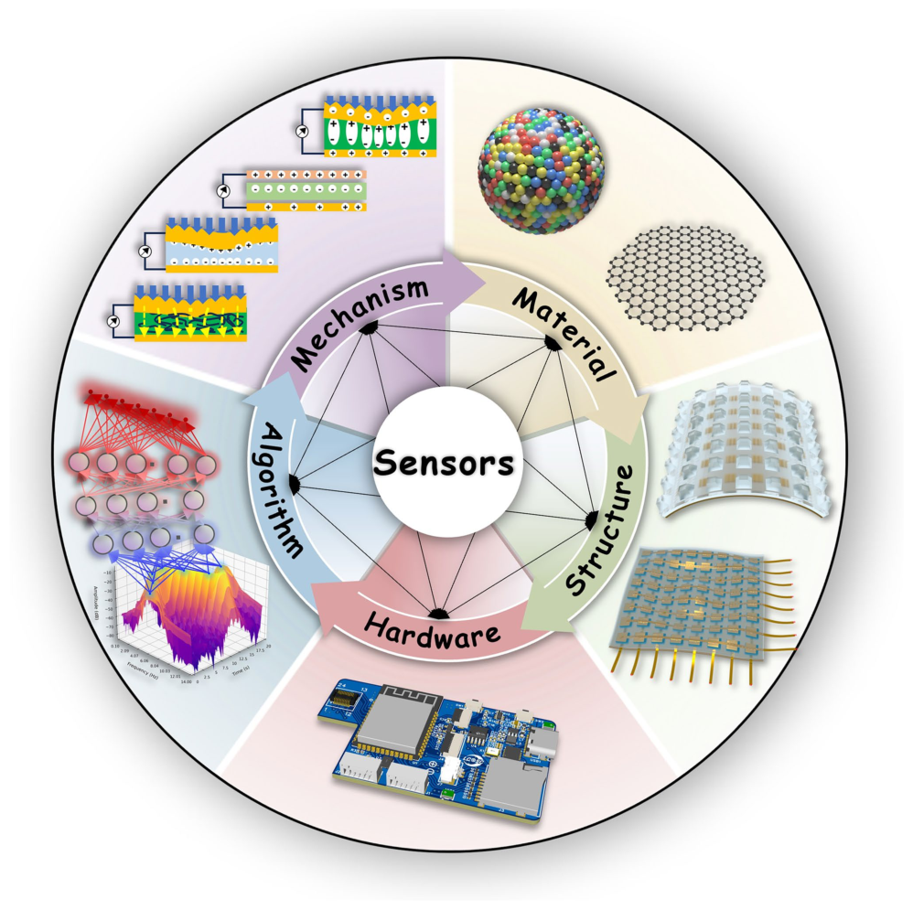

**Original caption:** Fig. 1 Schematic of holistic co-design. Sensing mechanisms, Material, Structure, Hardware, Algorithms

**中文图注:** Fig. 1 原始图注已提取；逐项含义见下方分图说明。

**Reading note:** 重点查看器件结构、材料层次、信号路径和制备流程。

### Fig. 2

**Source:** p.6

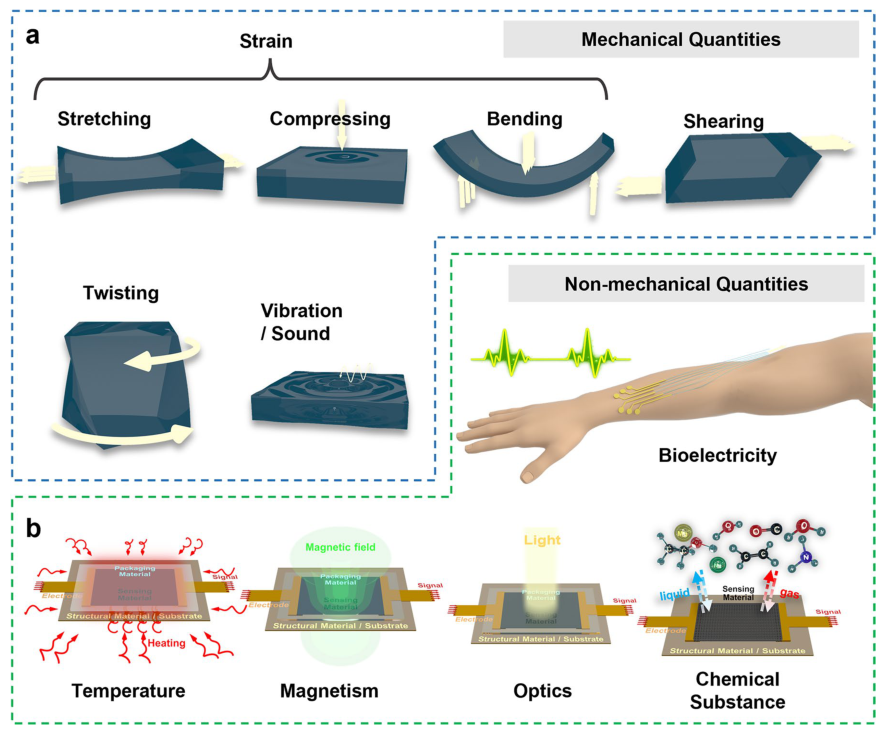

**Original caption:** Fig. 2 Sensing quantities. a Mechanical quantities. b Non-mechanical quantities

**中文图注:** Fig. 2 原始图注已提取；逐项含义见下方分图说明。

**Reading note:** 结合正文首次引用位置和原始图注核对该图的证据角色。

- (a) 结合正文首次引用位置和原始图注核对该图的证据角色。 原文：Mechanical quantities
- (b) 结合正文首次引用位置和原始图注核对该图的证据角色。 原文：Non-mechanical quantities

### Fig. 3

**Source:** p.7

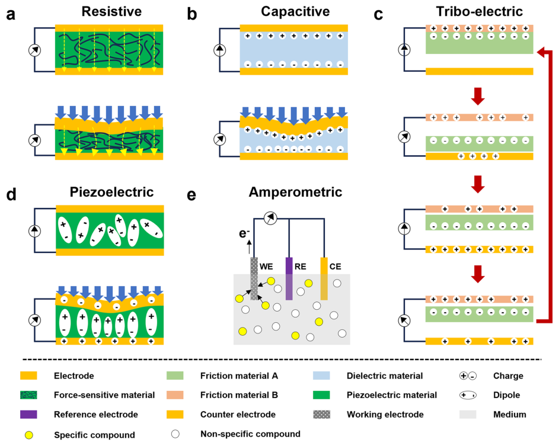

**Original caption:** Fig. 3 Fundamental sensing mechanisms: a Resistive, b Capacitive, c Triboelectric, d Piezoelectric, and e Amperometric

**中文图注:** Fig. 3 原始图注已提取；逐项含义见下方分图说明。

**Reading note:** 重点查看机制模型与实验结果是否一致，以及关键结构参数的对照关系。

### Fig. 4

**Source:** p.12

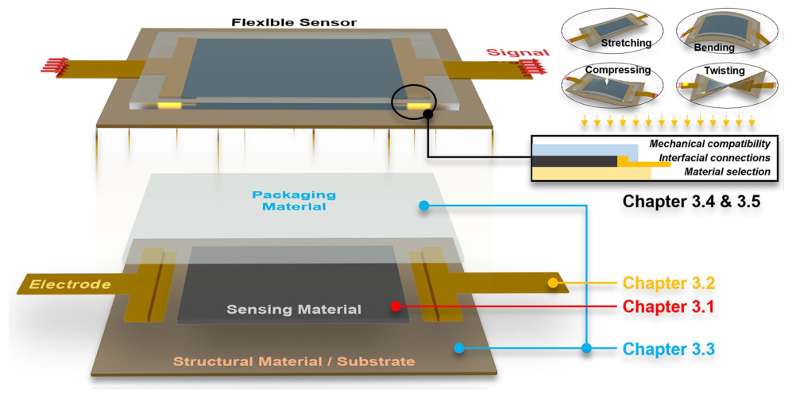

**Original caption:** Fig. 4 Flexible sensors’ three types of materials by functions: sensing, electrode, and structural/packaging materials

**中文图注:** Fig. 4 原始图注已提取；逐项含义见下方分图说明。

**Reading note:** 结合正文首次引用位置和原始图注核对该图的证据角色。

### Fig. 5

**Source:** p.18

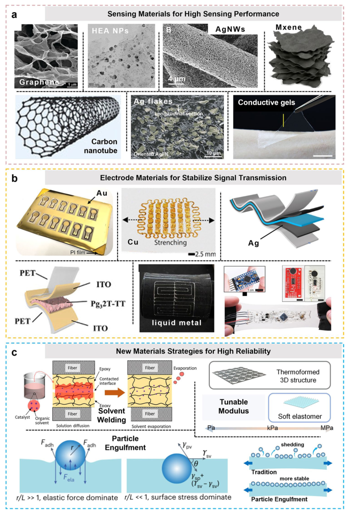

**Original caption:** Fig. 5 Schematic diagram depicting materials for sensors. a Sensing materials: graphene [184] Copyright 2010, American Chemical Society, HEA nanoparticles [185] Copyright 2024, Springer Nature, AgNWs [186] Copyright 2024, Elsevier, MXene [116] Copyright 2025, Springer Nature, CNTs [187] Copyright 2025, American Chemical Society, Ag flakes/particles [188] Copyright 2025, Springer Nature, conductive gel [120] Copyright 2025, The American Association for the Advancement of Science. b Electrode materials: Au [147] Copyright 2025, American Chemical Society, Cu [189] Copyright 2025, The American Association for the Advancement of Science, Ag [31] Copyright 2025, John Wiley and Sons, ITO [40] Copyright 2025, John Wiley and Sons, liquid metal [190] Copyright 2025, John Wiley and Sons, liquid metal electrodebased flexible and stretchable monolithic Arduino pro mini system [191] Copyright 2024, The American Association for the Advancement of Science. c Solvent welding [192] Copyright 2025, Elsevier, Tunable-modulus/stiffness design [33] Copyright 2025, The American Association for the Advancement of Science, and Particle engulfment [193] Copyright 2025, Springer Nature

**中文图注:** Fig. 5 原始图注已提取；逐项含义见下方分图说明。

**Reading note:** 重点查看器件结构、材料层次、信号路径和制备流程。

- (a) 结合正文首次引用位置和原始图注核对该图的证据角色。 原文：Sensing materials: graphene [184] Copyright 2010, American Chemical Society, HEA nanoparticles [185] Copyright 2024, Springer Nature, AgNWs [186] Copyright 2024, Elsevier, MXene [116] Copyright 2025, Springer Nature, CNTs [187] Copyright 2025, American Chemical Society, Ag flakes/particles [188] Copyright 2025, Springer Nature, conductive gel [120] Copyright 2025, The American Association for the Advancement of Science
- (b) 结合正文首次引用位置和原始图注核对该图的证据角色。 原文：Electrode materials: Au [147] Copyright 2025, American Chemical Society, Cu [189] Copyright 2025, The American Association for the Advancement of Science, Ag [31] Copyright 2025, John Wiley and Sons, ITO [40] Copyright 2025, John Wiley and Sons, liquid metal [190] Copyright 2025, John Wiley and Sons, liquid metal electrodebased flexible and stretchable monolithic Arduino pro mini system [191] Copyright 2024, The American Association for the Advancement of Science
- (c) 结合正文首次引用位置和原始图注核对该图的证据角色。 原文：Solvent welding [192] Copyright 2025, Elsevier, Tunable-modulus/stiffness design [33] Copyright 2025, The American Association for the Advancement of Science, and Particle engulfment [193] Copyright 2025, Springer Nature

### Fig. 6

**Source:** p.23

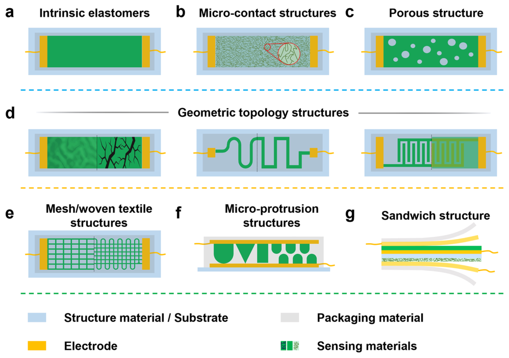

**Original caption:** Fig. 6 Main functional structures of flexible sensors: a Homogeneous intrinsic conductive elastomers, b Micro-contact structures, c Porous structures, d Geometric topological designs, e Mesh/woven structures, f Micro-protrusion mechanical structures, and g Sandwich structures

**中文图注:** Fig. 6 原始图注已提取；逐项含义见下方分图说明。

**Reading note:** 重点查看器件结构、材料层次、信号路径和制备流程。

### Fig. 7

**Source:** p.24

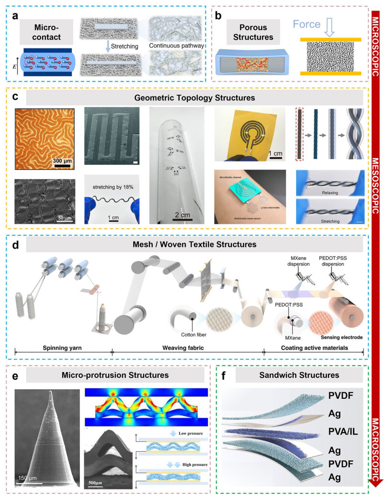

**Original caption:** Fig. 7 Typical example of sensor functional structure design. a Micro-contact structures: capacitive [187], resistive [143]. b Porous structures [165, 205]. c Geometric topology structures: predefined textures [181], predefined circuits/cracks [68], interdigitated [220], serpentine [67], spiral [67, 164], vortex [80]. d Woven/textile structure [166]. e Micro-protrusion structures [42, 70]. f Sandwich structure [88]. a Reproduced with permission from Ref. [187]. Copyright 2025, American Chemical Society. Reproduced with permission from Ref. [143]. Copyright 2025, John Wiley and Sons. b Reproduced with permission from Ref. [165]. Copyright 2025, The American Association for the Advancement of Science. Reproduced with permission from Ref. [205]. Copyright 2025, John Wiley and Sons. c Reproduced with permission from Ref. [181]. Copyright 2025, Springer Nature. Reproduced with permission from Ref. [68]. Copyright 2023, John Wiley and Sons. Reproduced with permission from Ref. [220]. Copyright 2022, Royal Society of Chemistry. Reproduced with permission from Ref. [67]. Copyright 2025, Springer Nature. Reproduced with permission from Ref. [164]. Copyright 2025, Springer Nature. Reproduced with permission from Ref. [80]. Copyright 2025, The American Association for the Advancement of Science. d Reproduced with permission from Ref. [166]. Copyright 2025, John Wiley and Sons. e Reproduced with permission from Ref. [42]. Copyright 2025, Springer Nature. Reproduced with permission from Ref. [70]. Copyright 2025, John Wiley and Sons. f Reproduced with permission from Ref. [88]. Copyright 2025, John Wiley and Sons

**中文图注:** Fig. 7 原始图注已提取；逐项含义见下方分图说明。

**Reading note:** 重点查看器件结构、材料层次、信号路径和制备流程。

- (a) 重点查看器件结构、材料层次、信号路径和制备流程。 原文：Micro-contact structures: capacitive [187], resistive [143]
- (b) 重点查看器件结构、材料层次、信号路径和制备流程。 原文：Porous structures [165, 205]
- (c) 重点查看器件结构、材料层次、信号路径和制备流程。 原文：Geometric topology structures: predefined textures [181], predefined circuits/cracks [68], interdigitated [220], serpentine [67], spiral [67, 164], vortex [80]
- (d) 重点查看器件结构、材料层次、信号路径和制备流程。 原文：Woven/textile structure [166]
- (e) 重点查看器件结构、材料层次、信号路径和制备流程。 原文：Micro-protrusion structures [42, 70]
- (f) 重点查看器件结构、材料层次、信号路径和制备流程。 原文：Sandwich structure [88]. a Reproduced with permission from Ref. [187]. Copyright 2025, American Chemical Society. Reproduced with permission from Ref. [143]. Copyright 2025, John Wiley and Sons. b Reproduced with permission from Ref. [165]. Copyright 2025, The American Association for the Advancement of Science. Reproduced with permission from Ref. [205]. Copyright 2025, John Wiley and Sons. c Reproduced with permission from Ref. [181]. Copyright 2025, Springer Nature. Reproduced with permission from Ref. [68]. Copyright 2023, John Wiley and Sons. Reproduced with permission from Ref. [220]. Copyright 2022, Royal Society of Chemistry. Reproduced with permission from Ref. [67]. Copyright 2025, Springer Nature. Reproduced with permission from Ref. [164]. Copyright 2025, Springer Nature. Reproduced with permission from Ref. [80]. Copyright 2025, The American Association for the Advancement of Science. d Reproduced with permission from Ref. [166]. Copyright 2025, John Wiley and Sons. e Reproduced with permission from Ref. [42]. Copyright 2025, Springer Nature. Reproduced with permission from Ref. [70]. Copyright 2025, John Wiley and Sons. f Reproduced with permission from Ref. [88]. Copyright 2025, John Wiley and Sons

### Fig. 8

**Source:** p.26

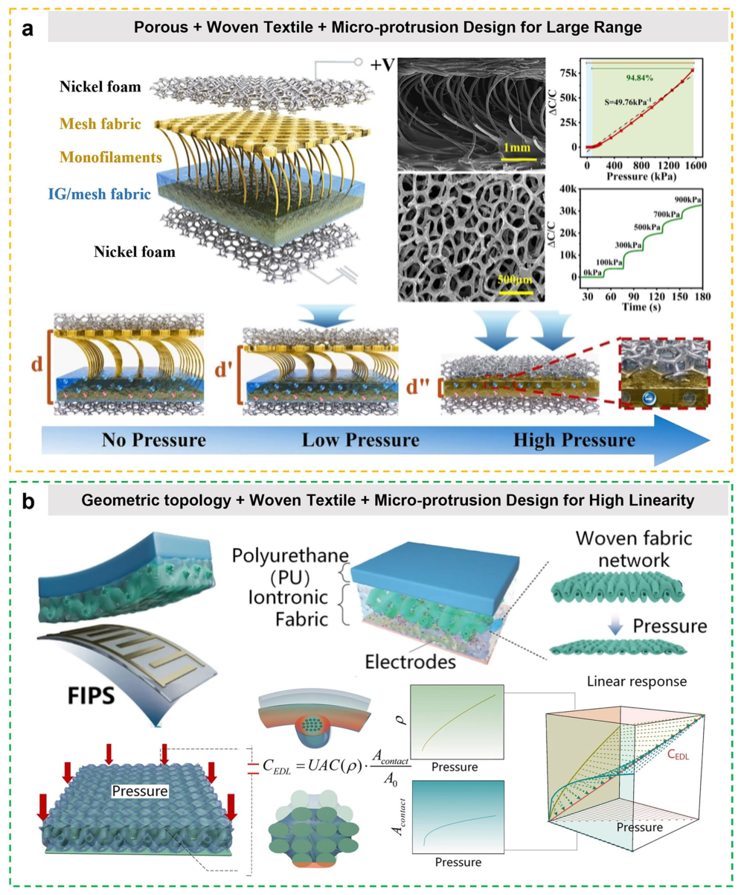

**Original caption:** Fig. 8 Typical example of multi-structure coupling design. a 3DPLE/IG capacitive pressure sensor [83] Copyright 2025, Elsevier. b FIPS capacitive pressure sensor [92] Copyright 2025, Springer Nature

**中文图注:** Fig. 8 原始图注已提取；逐项含义见下方分图说明。

**Reading note:** 重点查看器件结构、材料层次、信号路径和制备流程。

- (a) 结合正文首次引用位置和原始图注核对该图的证据角色。 原文：3DPLE/IG capacitive pressure sensor [83] Copyright 2025, Elsevier
- (b) 结合正文首次引用位置和原始图注核对该图的证据角色。 原文：FIPS capacitive pressure sensor [92] Copyright 2025, Springer Nature

### Fig. 9

**Source:** p.28

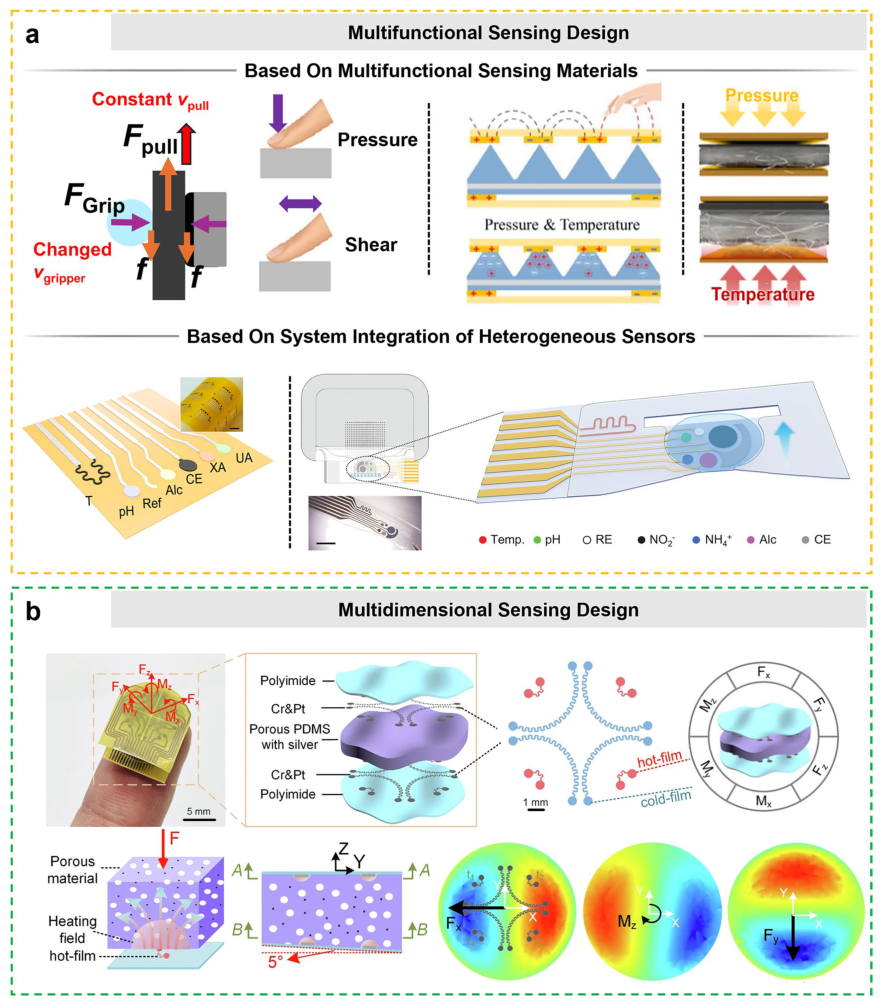

**Original caption:** Fig. 9 Multifunctional, multidimensional designs of flexible sensors. a Multifunctional sensing based on multifunctional-sensing materials [82, 91, 208], and based on the system integration of heterogeneous sensors [53, 57]. b Multidimensional force/moment sensor based on the mechanism of force-induced-thermal-field [43]. a Reproduced with permission from Ref. [82]. Copyright 2025, Springer Nature. Reproduced with permission from Ref. [91]. Copyright 2025, John Wiley and Sons. Reproduced with permission from Ref. [208]. Copyright 2025, John Wiley and Sons. Reproduced with permission from Ref. [53]. Copyright 2025, The American Association for the Advancement of Science. Reproduced with permission from Ref. [57]. Copyright 2024, The American Association for the Advancement of Science. b Reproduced with permission from Ref. [43]. Copyright 2025, Springer Nature

**中文图注:** Fig. 9 原始图注已提取；逐项含义见下方分图说明。

**Reading note:** 重点查看标定方法、量程、误差、线性和动态响应，避免只比较单一灵敏度。

- (a) 结合正文首次引用位置和原始图注核对该图的证据角色。 原文：Multifunctional sensing based on multifunctional-sensing materials [82, 91, 208], and based on the system integration of heterogeneous sensors [53, 57]
- (b) 重点查看标定方法、量程、误差、线性和动态响应，避免只比较单一灵敏度。 原文：Multidimensional force/moment sensor based on the mechanism of force-induced-thermal-field [43]. a Reproduced with permission from Ref. [82]. Copyright 2025, Springer Nature. Reproduced with permission from Ref. [91]. Copyright 2025, John Wiley and Sons. Reproduced with permission from Ref. [208]. Copyright 2025, John Wiley and Sons. Reproduced with permission from Ref. [53]. Copyright 2025, The American Association for the Advancement of Science. Reproduced with permission from Ref. [57]. Copyright 2024, The American Association for the Advancement of Science. b Reproduced with permission from Ref. [43]. Copyright 2025, Springer Nature

### Fig. 10

**Source:** p.29

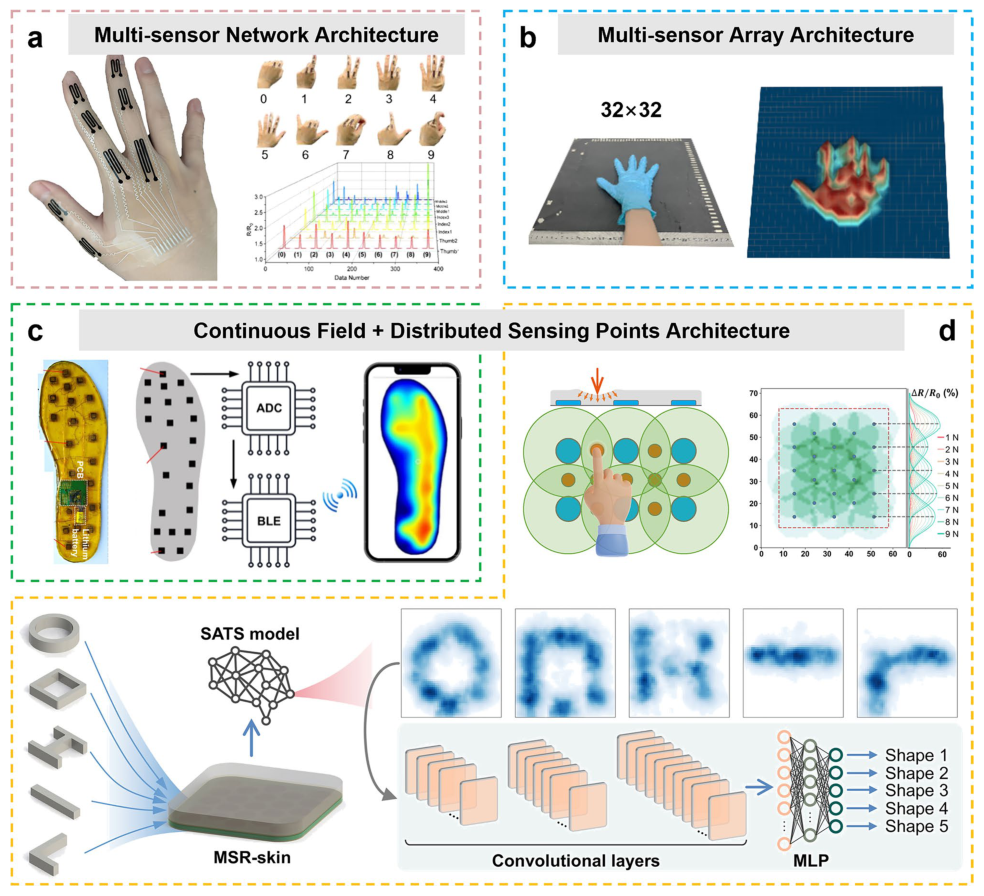

**Original caption:** Fig. 10 Schematic diagram of architectural designs of sensors. a Multi-sensor network architecture [31] Copyright 2025, John Wiley and Sons. b Multi-sensor array architecture [92] Copyright 2025, Springer Nature. Continuous field + distributed sensing points architecture: c mapping of pressure distribution using the smart insole system with a 22-sensor network [165] Copyright 2025, The American Association for the Advancement of Science, and d mapping of pressure distribution using the 23-sensor array system with the SATS super-resolution algorithm [210]. Copyright 2025, The American Association for the Advancement of Science

**中文图注:** Fig. 10 原始图注已提取；逐项含义见下方分图说明。

**Reading note:** 重点查看器件结构、材料层次、信号路径和制备流程。

- (a) 重点查看器件结构、材料层次、信号路径和制备流程。 原文：Multi-sensor network architecture [31] Copyright 2025, John Wiley and Sons
- (b) 重点查看器件结构、材料层次、信号路径和制备流程。 原文：Multi-sensor array architecture [92] Copyright 2025, Springer Nature. Continuous field + distributed sensing points architecture: c mapping of pressure distribution using the smart insole system with a 22-sensor network [165] Copyright 2025, The American Association for the Advancement of Science, and d mapping of pressure distribution using the 23-sensor array system with the SATS super-resolution algorithm [210]. Copyright 2025, The American Association for the Advancement of Science

### Fig. 11

**Source:** p.32

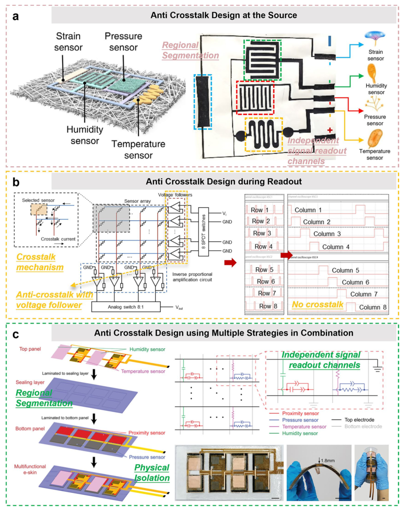

**Original caption:** Fig. 11 Anti-crosstalk designs of flexible sensors. a Multifunctional integration and the anti-crosstalk design of the SMED sensor [143] Copyright 2025, John Wiley and Sons. b Crosstalk in sensor arrays and anti-crosstalk design based on voltage followers [76] Copyright 2024, The American Association for the Advancement of Science. c Multifunctional integration, device architecture, and the anti-crosstalk design of the dual-modal, quad-functional E-skin [89] Copyright 2023, John Wiley and Sons

**中文图注:** Fig. 11 原始图注已提取；逐项含义见下方分图说明。

**Reading note:** 重点查看器件结构、材料层次、信号路径和制备流程。

- (a) 结合正文首次引用位置和原始图注核对该图的证据角色。 原文：Multifunctional integration and the anti-crosstalk design of the SMED sensor [143] Copyright 2025, John Wiley and Sons
- (b) 重点查看阵列规模、空间分辨率、串扰、读出通道和空间特征表达。 原文：Crosstalk in sensor arrays and anti-crosstalk design based on voltage followers [76] Copyright 2024, The American Association for the Advancement of Science
- (c) 重点查看器件结构、材料层次、信号路径和制备流程。 原文：Multifunctional integration, device architecture, and the anti-crosstalk design of the dual-modal, quad-functional E-skin [89] Copyright 2023, John Wiley and Sons

### Fig. 12

**Source:** p.35

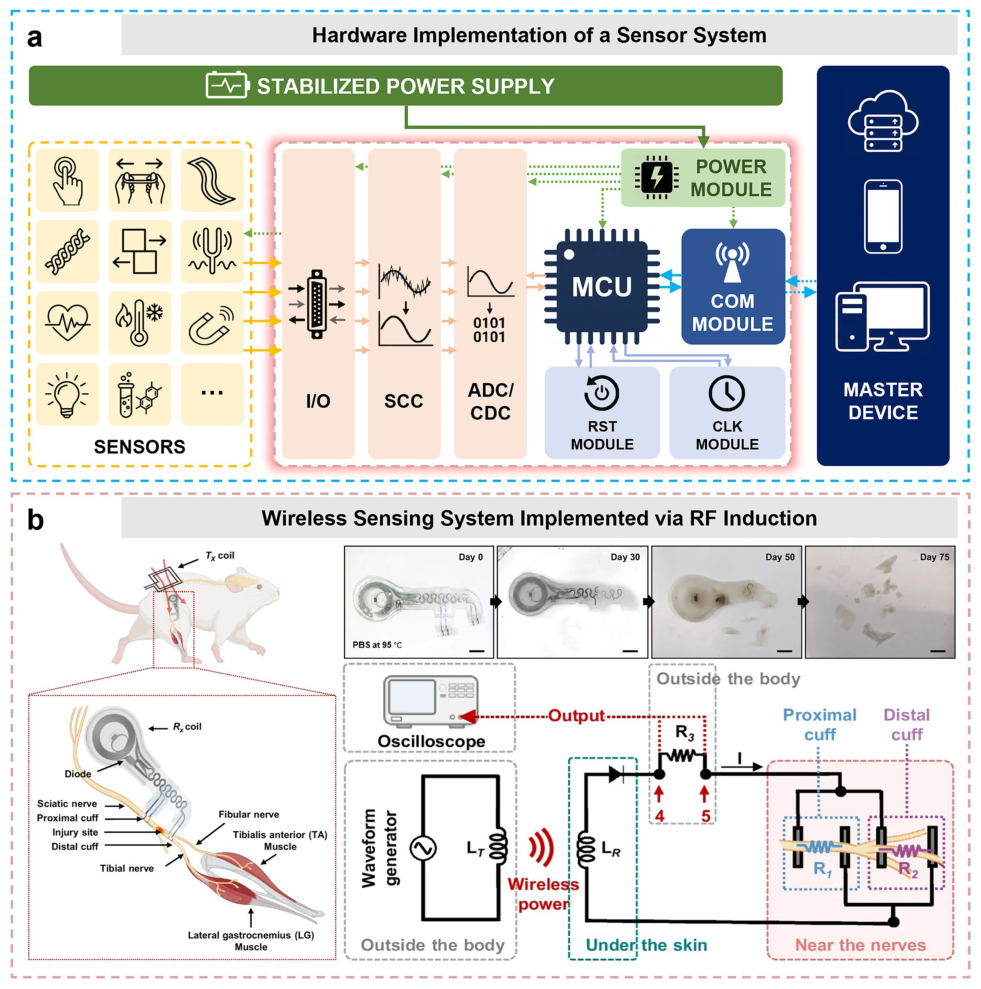

**Original caption:** Fig. 12 a Typical hardware implementation of a sensor system. b Schematic diagram of a wireless sensing system implemented via RF induction [27]. I/O: input/output interfaces, SCC: signal conditioning circuit, ADC: analog-to-digital converter, CDC: capacitance-to-digital converter, RST: reset module, CLK: clock module, COM module: communication module. b Reproduced with permission from Ref. [27]. Copyright 2025, Springer Nature

**中文图注:** Fig. 12 原始图注已提取；逐项含义见下方分图说明。

**Reading note:** 重点查看器件结构、材料层次、信号路径和制备流程。

### Fig. 13

**Source:** p.37

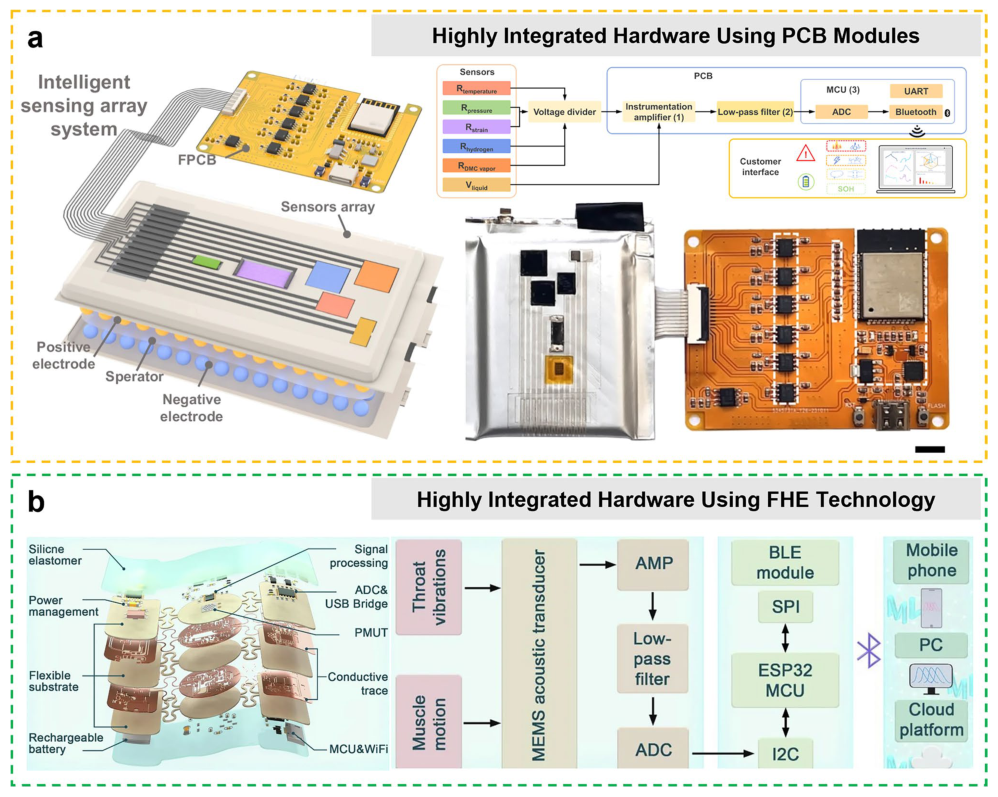

**Original caption:** Fig. 13 a Schematic diagram of a hardware architecture and system composition for the IISAS battery health sensing system [262] Copyright 2025, Springer Nature. b Schematic diagram of the hardware architecture and system composition for the PMUT array sensing system [102] Copyright 2025, Springer Nature

**中文图注:** Fig. 13 原始图注已提取；逐项含义见下方分图说明。

**Reading note:** 重点查看器件结构、材料层次、信号路径和制备流程。

### Fig. 14

**Source:** p.38

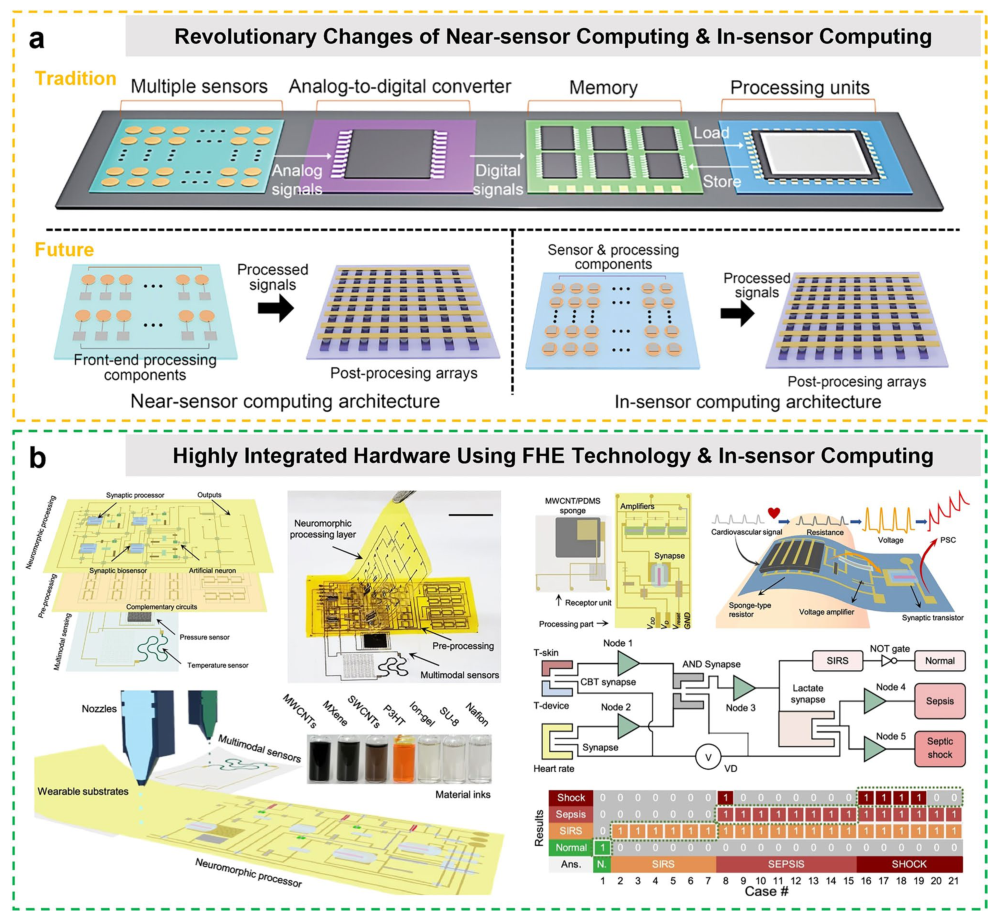

**Original caption:** Fig. 14 a Schematic diagram illustrating the trend toward integrated sensing and neuromorphic computing [265] Copyright 2025, John Wiley and Sons. b Schematic diagram of the system composition and operational logic of the chip-less CSPINS integrated sensing-neuromorphic computing system [160] Copyright 2025, Springer Nature

**中文图注:** Fig. 14 原始图注已提取；逐项含义见下方分图说明。

**Reading note:** 重点查看器件结构、材料层次、信号路径和制备流程。

### Fig. 15

**Source:** p.43

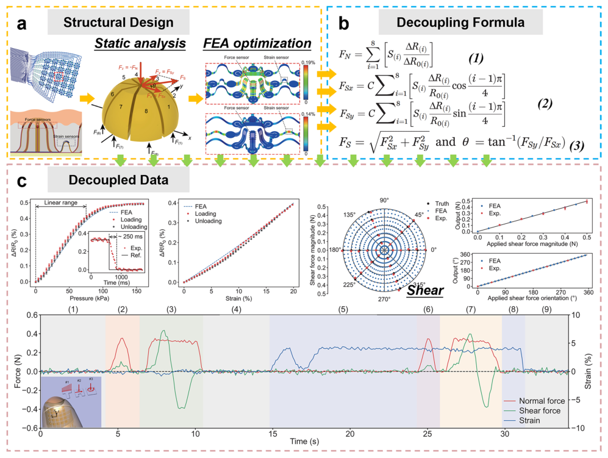

**Original caption:** Fig. 15 Schematic diagram of the mathematical decoupling process (pressure, strain and shear force) for the octopus-inspired, cage-like structured three-dimensional resistive flexible sensor array. a Structural design. b Decoupling formula. c Decoupled data [75] Copyright 2024, The American Association for the Advancement of Science

**中文图注:** Fig. 15 原始图注已提取；逐项含义见下方分图说明。

**Reading note:** 重点查看器件结构、材料层次、信号路径和制备流程。

- (a) 结合正文首次引用位置和原始图注核对该图的证据角色。 原文：Structural design
- (b) 结合正文首次引用位置和原始图注核对该图的证据角色。 原文：Decoupling formula
- (c) 结合正文首次引用位置和原始图注核对该图的证据角色。 原文：Decoupled data [75] Copyright 2024, The American Association for the Advancement of Science

### Fig. 16

**Source:** p.44

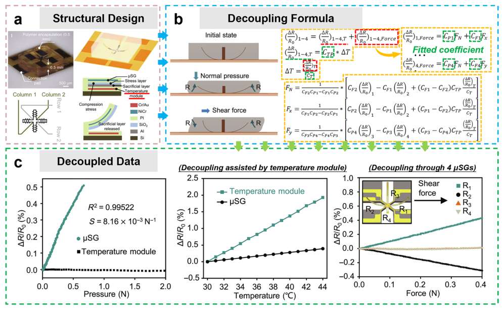

**Original caption:** Fig. 16 Schematic diagram of mathematical decoupling process (normal force, shear force, and temperature) of the μSGs flexible sensor array. a Structural design. b Decoupling formula. c Decoupled data [76] Copyright 2024, The American Association for the Advancement of Science

**中文图注:** Fig. 16 原始图注已提取；逐项含义见下方分图说明。

**Reading note:** 重点查看器件结构、材料层次、信号路径和制备流程。

- (a) 结合正文首次引用位置和原始图注核对该图的证据角色。 原文：Structural design
- (b) 结合正文首次引用位置和原始图注核对该图的证据角色。 原文：Decoupling formula
- (c) 结合正文首次引用位置和原始图注核对该图的证据角色。 原文：Decoupled data [76] Copyright 2024, The American Association for the Advancement of Science

### Fig. 17

**Source:** p.45

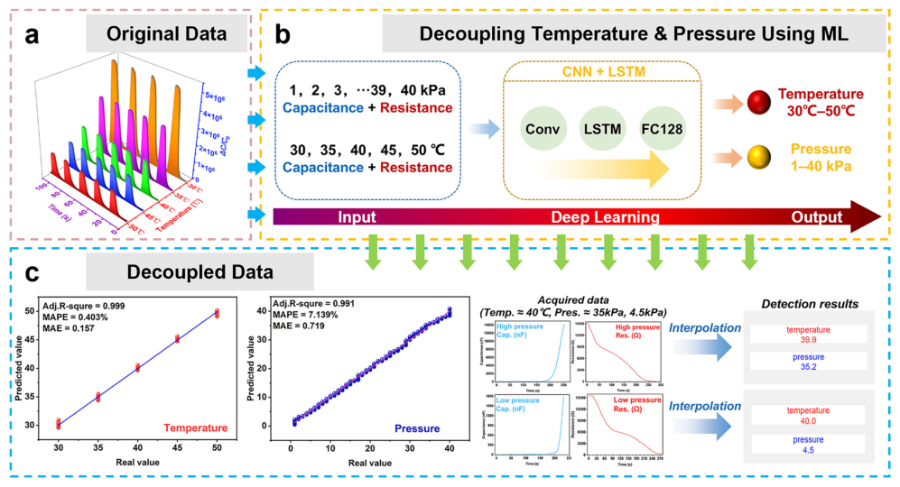

**Original caption:** Fig. 17 Decoupling of pressure and temperature with a CNN-LSTM hybrid network. a Original data. b Decoupling process. c Decoupled data [208] Copyright 2025, John Wiley and Sons

**中文图注:** Fig. 17 原始图注已提取；逐项含义见下方分图说明。

**Reading note:** 结合正文首次引用位置和原始图注核对该图的证据角色。

- (a) 结合正文首次引用位置和原始图注核对该图的证据角色。 原文：Original data
- (b) 结合正文首次引用位置和原始图注核对该图的证据角色。 原文：Decoupling process
- (c) 结合正文首次引用位置和原始图注核对该图的证据角色。 原文：Decoupled data [208] Copyright 2025, John Wiley and Sons

### Fig. 18

**Source:** p.46

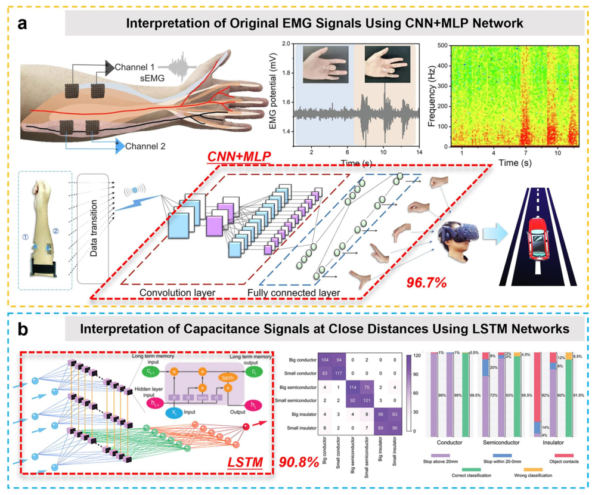

**Original caption:** Fig. 18 a Interpretation of EMG signals using CNN networks [79] Copyright 2025, Springer Nature. b Interpretation of capacitance signal for proximity distance via LSTM Network [89] Copyright 2023, John Wiley and Sons

**中文图注:** Fig. 18 原始图注已提取；逐项含义见下方分图说明。

**Reading note:** 结合正文首次引用位置和原始图注核对该图的证据角色。

### Fig. 19

**Source:** p.47

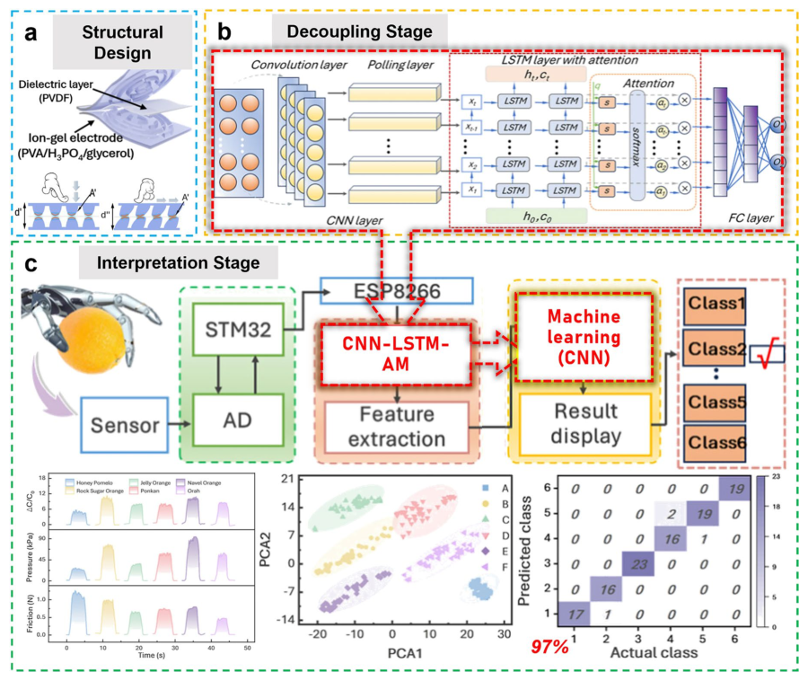

**Original caption:** Fig. 19 Decoupling of pressure and shear via a CNN-LSTM-AM hybrid network, and high-accuracy citrus variety differentiation using a CNN model with the decoupled data in the BFTS sensors. a Structural design. b Decoupling stage. c Interpretation stage [87] Copyright 2025, John Wiley and Sons

**中文图注:** Fig. 19 原始图注已提取；逐项含义见下方分图说明。

**Reading note:** 重点查看机制模型与实验结果是否一致，以及关键结构参数的对照关系。

- (a) 结合正文首次引用位置和原始图注核对该图的证据角色。 原文：Structural design
- (b) 结合正文首次引用位置和原始图注核对该图的证据角色。 原文：Decoupling stage
- (c) 结合正文首次引用位置和原始图注核对该图的证据角色。 原文：Interpretation stage [87] Copyright 2025, John Wiley and Sons

### Fig. 20

**Source:** p.50

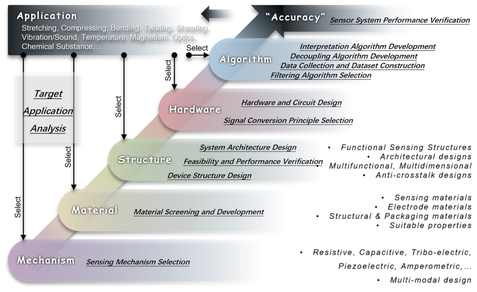

**Original caption:** Fig. 20 Holistic approach to sensor systems throughout the entire process from basic mechanisms, materials, structures, hardware to algorithms

**中文图注:** Fig. 20 原始图注已提取；逐项含义见下方分图说明。

**Reading note:** 重点查看器件结构、材料层次、信号路径和制备流程。

### Fig. 21

**Source:** p.53

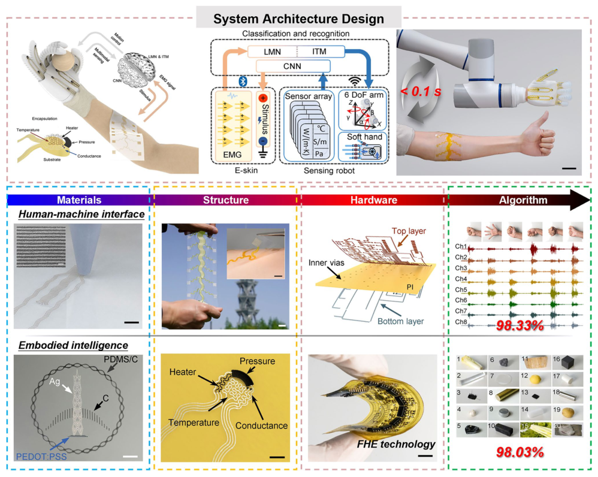

**Original caption:** Fig. 21 Typical examples of hierarchical optimization coupling design: Architecture design of the sensing system. Materials and process selection. Structural designs. Hardware implementation. Algorithmic processing [127] Copyright 2025, The American association for the advancement of science

**中文图注:** Fig. 21 原始图注已提取；逐项含义见下方分图说明。

**Reading note:** 重点查看器件结构、材料层次、信号路径和制备流程。

### Fig. 22

**Source:** p.54

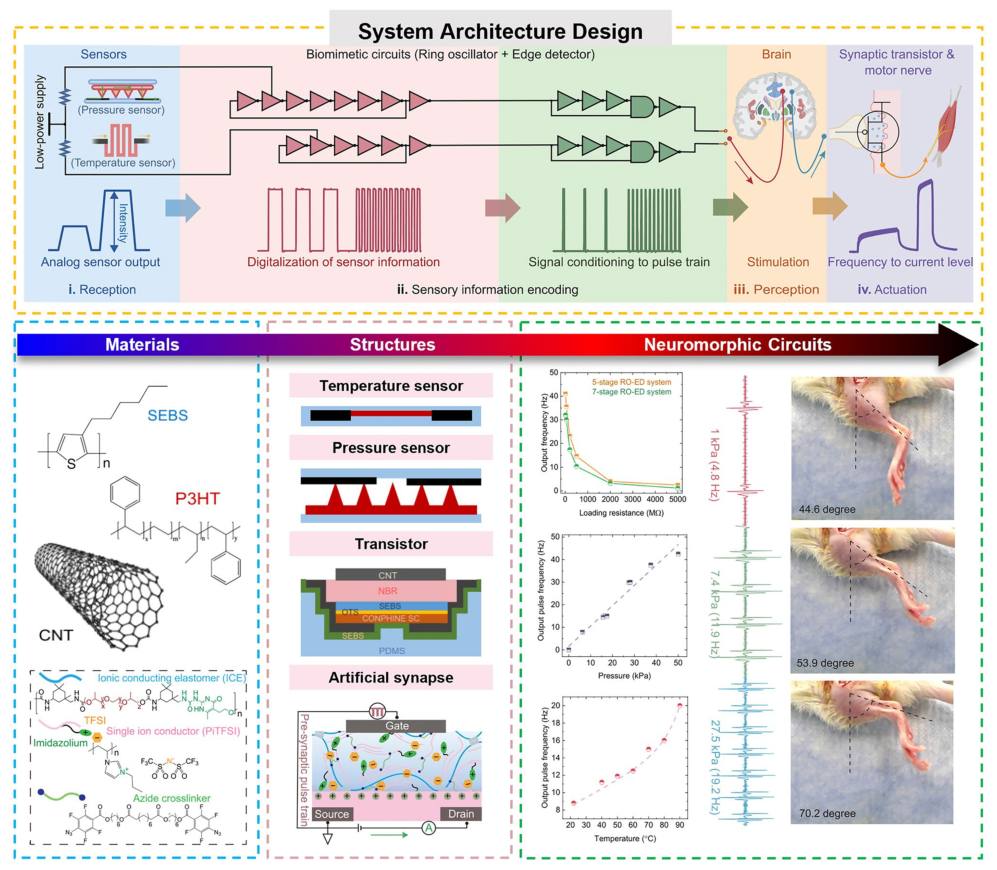

**Original caption:** Fig. 22 Typical examples of hierarchical optimization coupling design: Architecture design of the flexible sensing system. Material selection. Structural design. Signal processing logic and neuromorphic circuits design [132] Copyright 2023, The American association for the advancement of science

**中文图注:** Fig. 22 原始图注已提取；逐项含义见下方分图说明。

**Reading note:** 重点查看器件结构、材料层次、信号路径和制备流程。

### Fig. 23

**Source:** p.56

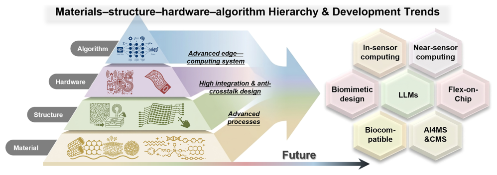

**Original caption:** Fig. 23 Materials–structure–hardware–algorithm co-design paradigm: Mechanism → Material → Structure → Hardware → Algorithm, and related development trends

**中文图注:** Fig. 23 原始图注已提取；逐项含义见下方分图说明。

**Reading note:** 重点查看器件结构、材料层次、信号路径和制备流程。
