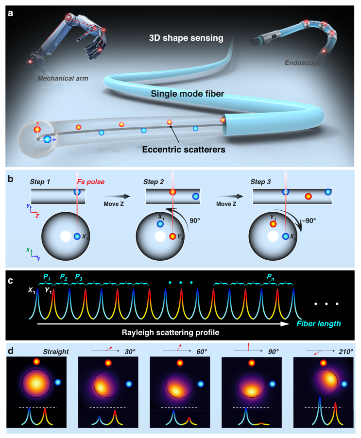
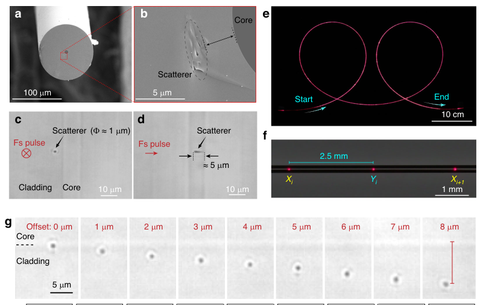
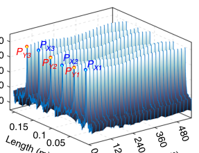
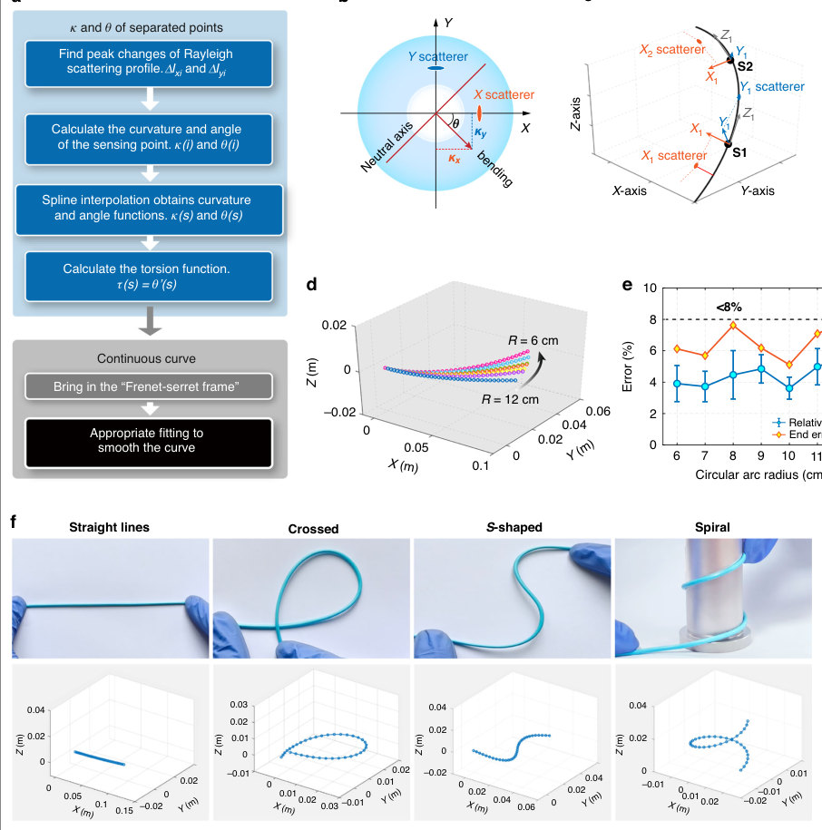
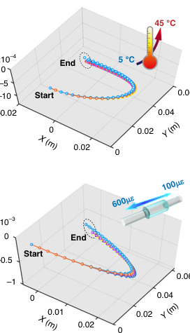

# Single-fiber three-dimensional shape sensing via femtosecond laser inscribed orthogonal eccentric scatterers

- 期刊：Light: Science & Applications
- 日期：2026-08-10
- DOI：10.1038/s41377-026-02425-z
- 解析状态：fulltext_draft

## 摘要与研究价值

**Original:** Abstract Optical fiber sensors have emerged as a powerful platform for high-precision shape detection in soft robotics and minimally invasive medical devices. However, existing fiber-sensing architectures face a long-standing trade-off between device size and spatial resolution. This work reports a miniaturized three-dimensional shape-sensing system based on misplaced orthogonal eccentric scatterers (MOESs) densely inscribed into the cladding of a standard single-mode fiber. The MOESs array is fabricated through a scalable reel-to-reel femtosecond laser writing process. Each MOES element functions as a curvature-dependent Rayleigh scatterer, and their misplaced orthogonal arrangement spatially encodes full 3D deformation information within a single fiber core. Experimental results demonstrate high-fidelity 2D bending and full 3D deformation reconstruction. The intensity-domain reconstruction algorithm further exhibits strong immunity to environmental perturbations. This approach defines a new paradigm for compact, cost-effective, and high-fidelity fiber sensors, paving the way for applications in unstructured and dynamic environments.

**中文:** 提供机器人、可穿戴或电子皮肤系统任务证据。当前未从摘要提取到可比较数值。

## 创新点

- Abstract Optical fiber sensors have emerged as a powerful platform for high-precision shape detection in soft robotics and minimally invasive medical devices.
- 提供机器人、可穿戴或电子皮肤系统任务证据

## 对当前课题的启发

- 提供机器人、可穿戴或电子皮肤系统任务证据

## 制备与实验步骤

### 1. 图形化与结构成形

**Source:** p.10

**Original:** Sensor fabrication The improved reel-to-reel femtosecond laser direct writing system is shown in Figure S1.

**中文:** 图形化与结构成形步骤，关键配比、时间、温度和设备参数以 p.10 原文为准。

### 2. 制备与实验操作

**Source:** p.10

**Original:** The tension in the fiber is set to 40 g by the tension controller, ensuring stable tension and enhancing the consistency of eccentric scatterers fabrication.

**中文:** 制备与实验操作步骤，关键配比、时间、温度和设备参数以 p.10 原文为准。

### 3. 图形化与结构成形

**Source:** p.10

**Original:** The fabrication process of the MOESs array is as follows: After shaping the optical path, the femtosecond laser focus is adjusted to the center of the CCD camera’s field of view.

**中文:** 图形化与结构成形步骤，关键配比、时间、温度和设备参数以 p.10 原文为准。

### 4. 制备与实验操作

**Source:** p.10

**Original:** The preparation of such one set of MOESs takes about 30 s.

**中文:** 制备与实验操作步骤，关键配比、时间、温度和设备参数以 p.10 原文为准。

### 5. 制备与实验操作

**Source:** p.10

**Original:** A video showing the fabrication process of a set of scatterers is provided as Video 1.

**中文:** 制备与实验操作步骤，关键配比、时间、温度和设备参数以 p.10 原文为准。

## 方法原文锚点

**Source:** p.10 M001

**Original:** Sensor fabrication The improved reel-to-reel femtosecond laser direct writing system is shown in Figure S1. The fiber movement control system consists of a fiber spool, cleaning device, tension controller, and limit pulleys. The tension in the fiber is set to 40 g by the tension controller, ensuring stable tension and enhancing the consistency of eccentric scatterers fabrication. The femtosecond laser used (ULTRON Photonics Inc.) has a central wavelength of 515 nm and a pulse width of 300 fs, with single-pulse energy set at 0.5 µJ. After shaping, the femtosecond laser beam is circularly polarized with a spot diameter of approximately 6 mm. A plane light source with a wavelength of approximately 650 nm is used for transmission illumination, and a dichroic mirror separates the femtosecond laser from the illumination light. The illumination light is further shaped to eliminate chromatic aberrations from the lens and objective, ensuring that the focal plane and field of view coincide. A 100× oil immersion objective (NA = 1.25) is used for focusing. The specially designed fiber rotation fixture is fixed on a three-axis air-cushion displacement stage (AUSPRECISION, QFL100-100XY-5Z) to allow precise adjustment of the fiber position. The fabrication process of the MOESs array is as follows: After shaping the optical path, the femtosecond laser focus is adjusted to the center of the CCD camera’s field of view. The fiber is then connected to the spool, and the rotation fixture is used to fix the fiber. The fiber is adjusted with the aid of the synchronized observation camera, ensuring the laser focus is directed at the eccentric position. When the laser is activated, the

**中文:** 该段已进入结构化方法步骤；完整逐段翻译待智能体精读补齐。

**Source:** p.10 M002

**Original:** femtosecond laser interacts with the fiber, forming scatterers. The fiber is moved axially by 2.5 mm using the air-cushion displacement stage, then rotated 90° by the rotation fixture. The relative positions of the fiber and laser focus are adjusted again, completing one set of MOESs. The rotation fixture is then reversed 90° to return the fiber to its initial orientation. The preparation of such one set of MOESs takes about 30 s. The rotation fixture is released, and the fiber is moved to the next position by the spool, repeating the process for subsequent scatterers. A video showing the fabrication process of a set of scatterers is provided as Video 1. The final sensor fiber is completed.

**中文:** 该段已进入结构化方法步骤；完整逐段翻译待智能体精读补齐。

**Source:** p.10 M003

**Original:** OFDR measurement setup The OFDR measurement setup includes a light source with a scanning width of 42 nm and a center wavelength of 1566 nm. The spatial resolution is 100 µm. Here, OFDR serves only to localize and quantify the backscattering intensity from the engineered scatterers, while the 3D deformation information is encoded in the spatial misplacement of the scatterers rather than in wavelengthdomain features.

**中文:** 该段已进入结构化方法步骤；完整逐段翻译待智能体精读补齐。

**Source:** p.10 M004

**Original:** Shape reconstruction method The detailed procedure for shape reconstruction is outlined as follows.: Step 1: The reflected peak intensities of the MOESs array are first recorded in the straight state as a reference. The difference between the reference and the intensities measured during bending yields the energy change, ΔIi. Step 2: The curvature components in the two directions can be obtained from the intensity changes in the two directions. According to the results in Fig. 3d, the intensity variation exhibits a linear relationship with the curvature component, denoted as s; the maximum value of s (i.e., sm) corresponds to the bending direction along the line connecting the fiber axis and the scatterer, which is a key parameter for calculating the two-dimensional bending direction and curvature, and its value in the experiment is 0.05 dB·m-1.

**中文:** 该段已进入结构化方法步骤；完整逐段翻译待智能体精读补齐。

**Source:** p.10 M005

**Original:** κi ¼ ΔIi  sm ð1Þ

**中文:** 该段已进入结构化方法步骤；完整逐段翻译待智能体精读补齐。

**Source:** p.10 M006

**Original:** Step 3: Separate the curvature components along the X-axis and Y-axis: assign the curvatures at odd-numbered positions to the κxi, and those at even-numbered positions to the κyi. Step 4: The total curvature and the bending angle with respect to one of the axes can be simply calculated from the curvature components of the orthogonal type distribution. Here we choose the reference axis as the X-axis, and the angle between the X-axis and the actual reference

**中文:** 该段已进入结构化方法步骤；完整逐段翻译待智能体精读补齐。

**Source:** p.11 M007

**Original:** Luo et al. Light: Science & Applications (2026) 15:343 Page 11 of 12

**中文:** 该段已进入结构化方法步骤；完整逐段翻译待智能体精读补齐。

**Source:** p.11 M008

**Original:** plane can be obtained by a simple calibration. The formulas for curvature calculation and angle calculation are:

**中文:** 该段已进入结构化方法步骤；完整逐段翻译待智能体精读补齐。

**Source:** p.11 M009

**Original:** κj ¼ ffiffiffiffiffiffiffiffiffiffiffiffiffiffiffiffiffiffiffiffiffiffiffiffiffiffiffiffiffiffiffiffiffiffiffiffiffiffiffiffiffiffiffiffiffi ððκxiÞ=2Þ2 þ ððκyiÞ=2Þ2 q ð2Þ

**中文:** 该段已进入结构化方法步骤；完整逐段翻译待智能体精读补齐。

**Source:** p.11 M010

**Original:** θj ¼ arctanðκyi=κxiÞ ð3Þ

**中文:** 该段已进入结构化方法步骤；完整逐段翻译待智能体精读补齐。

**Source:** p.11 M011

**Original:** Among them, i takes the value range of 1-36, representing the scatterers; j takes the value range of 1-35, representing the sensing point. Step 5: Interpolate the spline function on and to get and differentiate on to get the torsion function. Step 6: Bring into the Frenet framework:

**中文:** 该段已进入结构化方法步骤；完整逐段翻译待智能体精读补齐。

**Source:** p.11 M012

**Original:** T0ðjÞ ¼ κðjÞNðjÞ N0ðjÞ ¼ κðjÞTðjÞ þ τðjÞBðjÞ B0ðjÞ ¼ τðjÞNðjÞ ð4Þ

**中文:** 该段已进入结构化方法步骤；完整逐段翻译待智能体精读补齐。

**Source:** p.11 M013

**Original:** where T(j) is the tangent vector, N(j) is the normal vector and B(j) is the sub-normal vector, and the tangent vector function T(j) is obtained by numerical solution. The coordinates of each point in space will then be obtained by integrating over the arc length:

**中文:** 该段已进入结构化方法步骤；完整逐段翻译待智能体精读补齐。

**Source:** p.11 M014

**Original:** RðjÞ ¼ Z TðjÞdj þ R0 ð5Þ

**中文:** 该段已进入结构化方法步骤；完整逐段翻译待智能体精读补齐。

**Source:** p.11 M015

**Original:** Step 7: Fit a spline function to the calculated discrete points to get a smooth curve in space.

**中文:** 该段已进入结构化方法步骤；完整逐段翻译待智能体精读补齐。

**Source:** p.11 M016

**Original:** Error calculation method In order to evaluate the accuracy of the curve reconstruction results, we used two judging criteria: relative error and end error. The relative error, also known as the root-mean-square error, is mainly used to evaluate the overall reconstruction accuracy of the reconstructed curves compared with the standard curves, with smaller values indicating higher reconstruction accuracy. The calculation formula is:

**中文:** 该段已进入结构化方法步骤；完整逐段翻译待智能体精读补齐。

**Source:** p.11 M017

**Original:** ffiffiffiffiffiffiffiffiffiffiffiffiffiffiffiffiffiffiffiffiffiffiffiffiffiffiffiffiffiffiffiffiffiffiffiffiffiffiffiffiffiffiffiffiffiffiffiffiffiffiffiffiffiffiffiffiffiffiffiffiffiffiffiffiffiffiffiffiffiffiffiffiffiffiffi X 35

**中文:** 该段已进入结构化方法步骤；完整逐段翻译待智能体精读补齐。

**Source:** p.11 M018

**Original:** v u u u t

**中文:** 该段已进入结构化方法步骤；完整逐段翻译待智能体精读补齐。

**Source:** p.11 M019

**Original:** i¼1 ðxi  xrÞ2 þ ðyi  yrÞ2 þ ðzi  zrÞ2

**中文:** 该段已进入结构化方法步骤；完整逐段翻译待智能体精读补齐。

**Source:** p.11 M020

**Original:** Relative error ¼

**中文:** 该段已进入结构化方法步骤；完整逐段翻译待智能体精读补齐。

**Source:** p.11 M021

**Original:** n

**中文:** 该段已进入结构化方法步骤；完整逐段翻译待智能体精读补齐。

**Source:** p.11 M022

**Original:** ð6Þ

**中文:** 该段已进入结构化方法步骤；完整逐段翻译待智能体精读补齐。

**Source:** p.11 M023

**Original:** where (xi, yi, zi) denotes the coordinates of the reconstructed points and (xr, yr, zr) denotes the coordinates of the reference curve. The second one is the end error, which is mainly used to evaluate the absolute error between the reconstructed

**中文:** 该段已进入结构化方法步骤；完整逐段翻译待智能体精读补齐。

**Source:** p.11 M024

**Original:** curve and the end point of the reference curve, and the calculation scheme is:

**中文:** 该段已进入结构化方法步骤；完整逐段翻译待智能体精读补齐。

**Source:** p.11 M025

**Original:** ffiffiffiffiffiffiffiffiffiffiffiffiffiffiffiffiffiffiffiffiffiffiffiffiffiffiffiffiffiffiffiffiffiffiffiffiffiffiffiffiffiffiffiffiffiffiffiffiffiffiffiffiffiffiffiffiffiffiffiffiffiffiffiffiffiffiffiffiffiffiffiffiffi ðxe  xreÞ2 þ ðye  yreÞ2 þ ðze  zreÞ2

**中文:** 该段已进入结构化方法步骤；完整逐段翻译待智能体精读补齐。

**Source:** p.11 M026

**Original:** s

**中文:** 该段已进入结构化方法步骤；完整逐段翻译待智能体精读补齐。

**Source:** p.11 M027

**Original:** End error ¼

**中文:** 该段已进入结构化方法步骤；完整逐段翻译待智能体精读补齐。

**Source:** p.11 M028

**Original:** L

**中文:** 该段已进入结构化方法步骤；完整逐段翻译待智能体精读补齐。

**Source:** p.11 M029

**Original:** ð7Þ

**中文:** 该段已进入结构化方法步骤；完整逐段翻译待智能体精读补齐。

**Source:** p.11 M030

**Original:** where (xe, ye, ze) denotes the error at the end of the reconstructed curve and (xre, yre, zre) denotes the error at the end of the reference curve.

**中文:** 该段已进入结构化方法步骤；完整逐段翻译待智能体精读补齐。

## 图表解读

### Fig. 1

**Source:** p.3

**Original caption:** Fig. 1 Design concept for deformation encoding using MOESs array fiber. a Schematic of the deformation encoding scheme based on eccentric scatterers. b The preparation steps for a group of MOESs. c The coding rule for the MOESs array, each scatterer is utilized twice. d Schematic diagram of the distribution of mode fields around the fiber core with bending, including the relative variation of MOESs peak intensity

**中文图注:** Fig. 1 原始图注已提取；逐项含义见下方分图说明。

**Reading note:** 重点查看器件结构、材料层次、信号路径和制备流程。

- (a) 重点查看器件结构、材料层次、信号路径和制备流程。 原文：Schematic of the deformation encoding scheme based on eccentric scatterers
- (b) 结合正文首次引用位置和原始图注核对该图的证据角色。 原文：The preparation steps for a group of MOESs
- (c) 重点查看阵列规模、空间分辨率、串扰、读出通道和空间特征表达。 原文：The coding rule for the MOESs array, each scatterer is utilized twice
- (d) 重点查看器件结构、材料层次、信号路径和制备流程。 原文：Schematic diagram of the distribution of mode fields around the fiber core with bending, including the relative variation of MOESs peak intensity

### Fig. 2

**Source:** p.5

**Original caption:** Fig. 2 The basic properties of the eccentric scatterers. a SEM image of cross section of single mode fiber with scatterer. b SEM image of the scatterer’s morphology, showing the presence of micro-explosions and nanoscale gratings. c, d Micrograph of a refractive index modulation point generated by a femtosecond pulse at the eccentric position of the fiber, observed both perpendicular (c) and parallel (d) to the laser incident direction. e The intuitive scattering effect of red light on the MOESs array fiber, f The amplified part of red light scattering can clearly distinguish the scattering effect of each scatterer. g Backscattering profiles of eccentric scatterers with different offsets, showing that the backscattering signal strength aligns with the intensity distribution of the detected optical field mode

**中文图注:** Fig. 2 原始图注已提取；逐项含义见下方分图说明。

**Reading note:** 重点查看阵列规模、空间分辨率、串扰、读出通道和空间特征表达。

- (a) 重点查看阵列规模、空间分辨率、串扰、读出通道和空间特征表达。 原文：SEM image of cross section of single mode fiber with scatterer
- (b) 重点查看阵列规模、空间分辨率、串扰、读出通道和空间特征表达。 原文：SEM image of the scatterer’s morphology, showing the presence of micro-explosions and nanoscale gratings
- (c,d) 结合正文首次引用位置和原始图注核对该图的证据角色。 原文：Micrograph of a refractive index modulation point generated by a femtosecond pulse at the eccentric position of the fiber, observed both perpendicular (c) and parallel (d) to the laser incident direction
- (e) 重点查看阵列规模、空间分辨率、串扰、读出通道和空间特征表达。 原文：The intuitive scattering effect of red light on the MOESs array fiber, f The amplified part of red light scattering can clearly distinguish the scattering effect of each scatterer. g Backscattering profiles of eccentric scatterers with different offsets, showing that the backscattering signal strength aligns with the intensity distribution of the detected optical field mode

### Fig. 3

**Source:** p.6

**Original caption:** Fig. 3 Scattering profiles of MOESs array and its 2D curvature measurement. a Backscattering profiles of 1.13 m MOESs fiber, with an offset of 4 µm and a misplacement of 2.5 mm. b Backscattering profiles of the tested fiber for demonstration purposes. The total sensor length is 9 cm, with peaks at odd positions representing X-axis scatterers and peaks at even positions representing Y-axis scatterers. c Scattering intensity variations for six adjacent scatterers at a curvature of 20 m−1, as the bending direction changes by 540°. d Bending response of X-axis and Y-axis scatterers, showing the trend of curvature sensitivity s as the rotation device is turned 180°, with a phase difference of approximately 90°. e Curvature sensitivity trends for the X and Y-axis over a 360° rotation, showing a sinusoidal variation with a phase shift of 90°, indicating 2D measurement capability

**中文图注:** Fig. 3 原始图注已提取；逐项含义见下方分图说明。

**Reading note:** 重点查看标定方法、量程、误差、线性和动态响应，避免只比较单一灵敏度。

- (a) 结合正文首次引用位置和原始图注核对该图的证据角色。 原文：Backscattering profiles of 1.13 m MOESs fiber, with an offset of 4 µm and a misplacement of 2.5 mm
- (b) 结合正文首次引用位置和原始图注核对该图的证据角色。 原文：Backscattering profiles of the tested fiber for demonstration purposes. The total sensor length is 9 cm, with peaks at odd positions representing X-axis scatterers and peaks at even positions representing Y-axis scatterers
- (c) 结合正文首次引用位置和原始图注核对该图的证据角色。 原文：Scattering intensity variations for six adjacent scatterers at a curvature of 20 m−1, as the bending direction changes by 540°
- (d) 重点查看标定方法、量程、误差、线性和动态响应，避免只比较单一灵敏度。 原文：Bending response of X-axis and Y-axis scatterers, showing the trend of curvature sensitivity s as the rotation device is turned 180°, with a phase difference of approximately 90°
- (e) 重点查看标定方法、量程、误差、线性和动态响应，避免只比较单一灵敏度。 原文：Curvature sensitivity trends for the X and Y-axis over a 360° rotation, showing a sinusoidal variation with a phase shift of 90°, indicating 2D measurement capability

### Fig. 4

**Source:** p.7

**Original caption:** Fig. 4 Experimental validation of 3D shape sensing. a Deformation reconstruction workflow based on MOESs array fiber. b Spatial relationship between eccentric scatterers, fiber mode fields, and bending directions in the encoding process. c Projection method for scatterers at sensor points, where each pair of adjacent scatterers encodes the deformation at a single sensor point. d Deformation reconstruction results for circular arc shapes with radii of 6, 7, 8, 9, 10, 11, and 12 cm, with a total curve length of 8.75 cm and a sensor resolution of 2.5 mm. e Reconstruction errors for the seven reconstructed curves compared to the standard circular arc, categorized into endpoint errors and relative errors, with all errors less than 8%. f Deformation reconstruction of randomly bending shapes using the MOESs array shape sensor, including straight lines, irregular bending, crossed, and S-shaped bending

**中文图注:** Fig. 4 原始图注已提取；逐项含义见下方分图说明。

**Reading note:** 重点查看标定方法、量程、误差、线性和动态响应，避免只比较单一灵敏度。

- (a) 重点查看阵列规模、空间分辨率、串扰、读出通道和空间特征表达。 原文：Deformation reconstruction workflow based on MOESs array fiber
- (b) 重点查看阵列规模、空间分辨率、串扰、读出通道和空间特征表达。 原文：Spatial relationship between eccentric scatterers, fiber mode fields, and bending directions in the encoding process
- (c) 结合正文首次引用位置和原始图注核对该图的证据角色。 原文：Projection method for scatterers at sensor points, where each pair of adjacent scatterers encodes the deformation at a single sensor point
- (d) 结合正文首次引用位置和原始图注核对该图的证据角色。 原文：Deformation reconstruction results for circular arc shapes with radii of 6, 7, 8, 9, 10, 11, and 12 cm, with a total curve length of 8.75 cm and a sensor resolution of 2.5 mm
- (e) 重点查看标定方法、量程、误差、线性和动态响应，避免只比较单一灵敏度。 原文：Reconstruction errors for the seven reconstructed curves compared to the standard circular arc, categorized into endpoint errors and relative errors, with all errors less than 8%
- (f) 重点查看阵列规模、空间分辨率、串扰、读出通道和空间特征表达。 原文：Deformation reconstruction of randomly bending shapes using the MOESs array shape sensor, including straight lines, irregular bending, crossed, and S-shaped bending

### Fig. 5

**Source:** p.9

**Original caption:** Fig. 5 Influence of environmental interference on deformation encoding. Temperature change: a Corresponding changes in peak scattering intensity. b Reconstructed deformation. c End errors and relative errors as functions of temperature. Strain change: d Corresponding changes in peak scattering intensity. e Reconstructed deformation. f End errors and relative errors as functions of strain

**中文图注:** Fig. 5 原始图注已提取；逐项含义见下方分图说明。

**Reading note:** 重点查看标定方法、量程、误差、线性和动态响应，避免只比较单一灵敏度。
