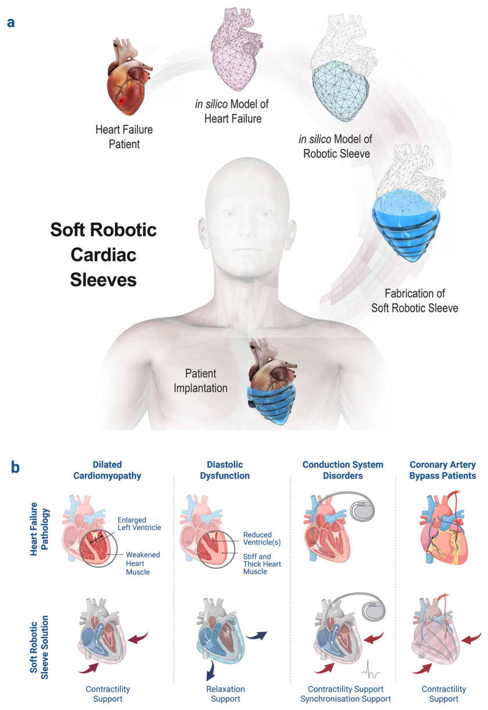
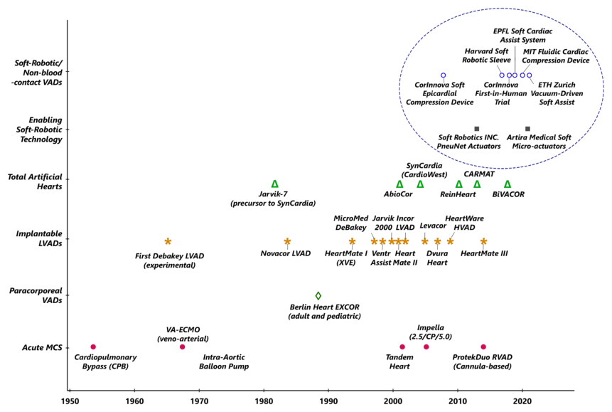
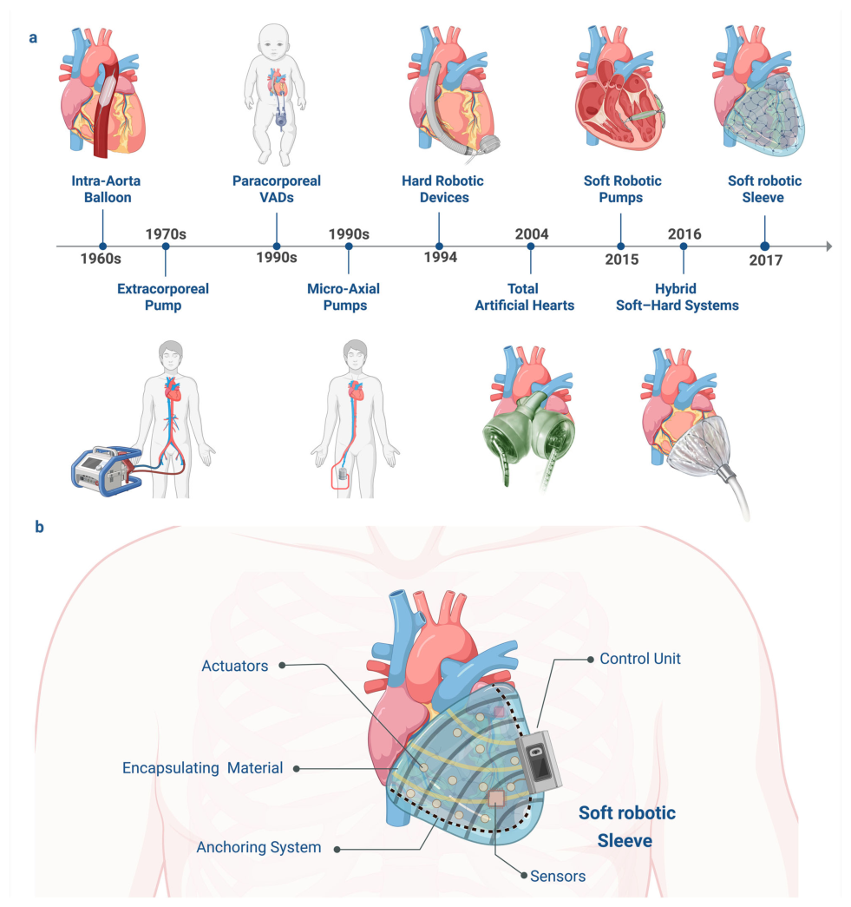
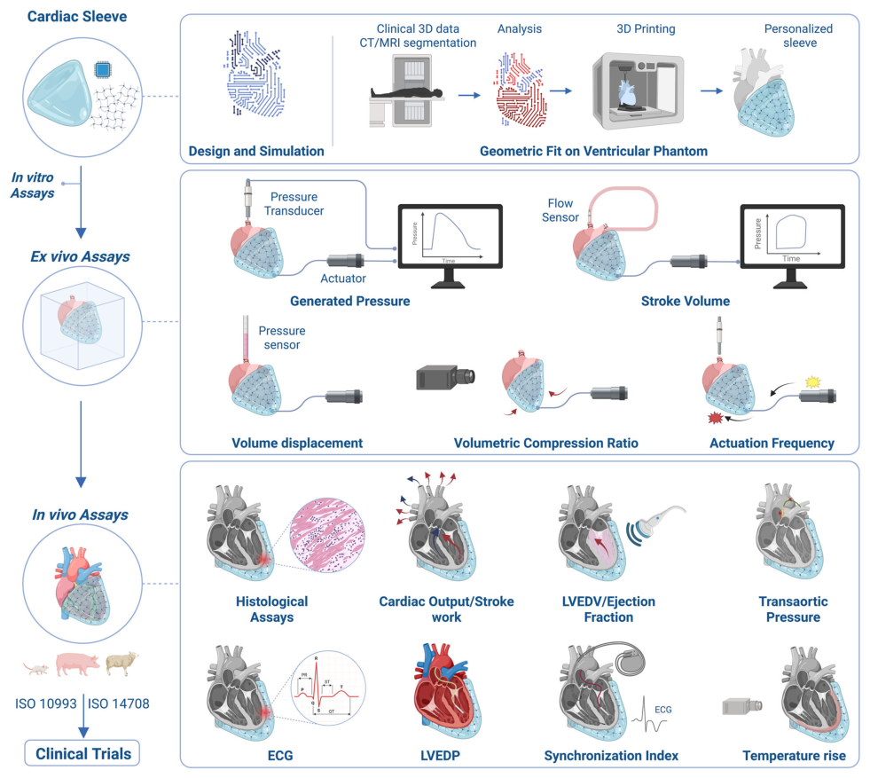
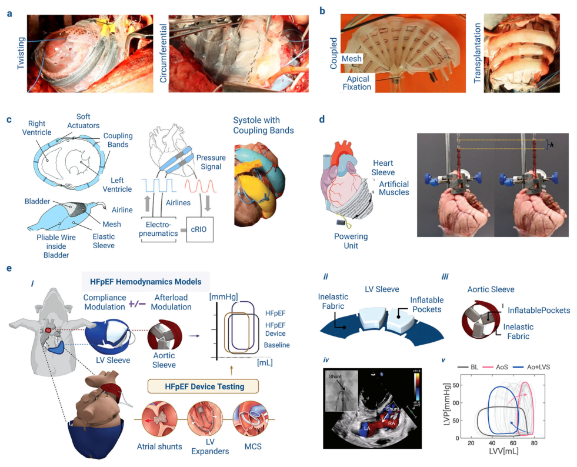

# Clinical translation and engineering challenges of soft robotic cardiac sleeves for heart failure

- 期刊：Nature Communications
- 日期：2026-08-12
- DOI：10.1038/s41467-026-76596-z
- 解析状态：fulltext_draft

## 摘要与研究价值

**Original:** PDF/题录未提供摘要。

**中文:** 与柔性触觉相关，但尚未显示对前端触觉计算的直接贡献。当前未从摘要提取到可比较数值。

## 创新点

- 当前仅获得题录信息，需要打开 DOI/原文核实机制、实验和性能指标。
- 与柔性触觉相关，但尚未显示对前端触觉计算的直接贡献

## 对当前课题的启发

- 提供机器人、可穿戴或电子皮肤系统任务证据

## 制备与实验步骤

### 1. 制备与实验操作

**Source:** p.2

**Original:** a Conceptual development pipeline for soft robotic cardiac sleeves, progressing from patient-specific cardiac modelling and computational design to the fabrication of anatomically tailored devices and their implantation for physiological cardiac assistance.

**中文:** 制备与实验操作步骤，关键配比、时间、温度和设备参数以 p.2 原文为准。

### 2. 图形化与结构成形

**Source:** p.2

**Original:** While cardiac resynchronisation therapy improves electrical synchrony, it does not restore the complex physiological deformation patterns required for efficient ejection.

**中文:** 图形化与结构成形步骤，关键配比、时间、温度和设备参数以 p.2 原文为准。

### 3. 组装与封装

**Source:** p.5

**Original:** architecture of a soft robotic cardiac sleeve, highlighting key components enabling closed-loop cardiac assistance, including actuators, encapsulating materials, anchoring systems, integrated sensors, control unit, and drive line.

**中文:** 组装与封装步骤，关键配比、时间、温度和设备参数以 p.5 原文为准。

### 4. 成膜与沉积

**Source:** p.6

**Original:** Once fabricated (most commonly via three-dimensional (3D) printing, soft lithography, or moulding techniques) the sleeve undergoes geometric and conformational validation using 3D-printed or silicone ventricular phantoms.

**中文:** 成膜与沉积步骤，关键配比、时间、温度和设备参数以 p.6 原文为准。

### 5. 组装与封装

**Source:** p.6

**Original:** Initial in vivo evaluation focuses on histological and biological analyses, examining tissue integration, fibrotic encapsulation, inflammatory cell infiltration, and vascularisation at the sleeve-epicardium interface.

**中文:** 组装与封装步骤，关键配比、时间、温度和设备参数以 p.6 原文为准。

### 6. 成膜与沉积

**Source:** p.6

**Original:** Epicardial electrocardiogram (ECG) electrodes detect R-wave timing to trigger systolic compression and are typically fabricated from platinum-iridium or gold-coated silicone integrated within flexible circuits10.

**中文:** 成膜与沉积步骤，关键配比、时间、温度和设备参数以 p.6 原文为准。

### 7. 组装与封装

**Source:** p.6

**Original:** Encapsulation strategies combining medical-grade silicone with parylene-C or polyurethane barrier layers provide effective multilayer moisture protection49.

**中文:** 组装与封装步骤，关键配比、时间、温度和设备参数以 p.6 原文为准。

### 8. 组装与封装

**Source:** p.6

**Original:** However, the risk of chronic infection has driven the development of fully implantable, wireless interfaces utilising inductive power transfer and telemetry.

**中文:** 组装与封装步骤，关键配比、时间、温度和设备参数以 p.6 原文为准。

### 9. 组装与封装

**Source:** p.6

**Original:** Transcutaneous energy transfer (TET) systems have emerged as a promising strategy for eliminating percutaneous drivelines and reducing the associated risks of chronic infection in implantable cardiac assist devices52,53.

**中文:** 组装与封装步骤，关键配比、时间、温度和设备参数以 p.6 原文为准。

### 10. 组装与封装

**Source:** p.6

**Original:** Despite their significant translational potential, challenges including energy-transfer efficiency, tissue heating, coil misalignment, battery longevity, and long-term system reliability remain important considerations for chronic implantation and clinical translation55,56.

**中文:** 组装与封装步骤，关键配比、时间、温度和设备参数以 p.6 原文为准。

### 11. 组装与封装

**Source:** p.6

**Original:** Thin silicone laminate sleeves integrating circumferential and helical TPU pneumatic artificial muscles (PAMs) enabled simultaneous compressive and torsional assistance that more closely replicated native myocardial fibre orientation and ventricular twist mechanics.

**中文:** 组装与封装步骤，关键配比、时间、温度和设备参数以 p.6 原文为准。

### 12. 制备与实验操作

**Source:** p.6

**Original:** Acute in vivo Fig. 4 | Workflow for the design, fabrication and multi-level evaluation of soft robotic cardiac sleeves.

**中文:** 制备与实验操作步骤，关键配比、时间、温度和设备参数以 p.6 原文为准。

### 13. 组装与封装

**Source:** p.6

**Original:** Surgical mesh interfaces promoted vascularisation and tissue integration, whereas silicone-based interfaces resulted in encapsulation and comparatively poor adhesion46.

**中文:** 组装与封装步骤，关键配比、时间、温度和设备参数以 p.6 原文为准。

### 14. 成膜与沉积

**Source:** p.6

**Original:** d Artificial muscle-based sleeves using silverand silicone-coated actuators tested ex vivo in a lamb heart model, demonstrating blood-free coupling and contractile assistance.

**中文:** 成膜与沉积步骤，关键配比、时间、温度和设备参数以 p.6 原文为准。

### 15. 图形化与结构成形

**Source:** p.8

**Original:** Despite these advances, current sleeve actuation strategies still do not fully replicate the coordinated myocardial pressure generation and deformation patterns of the native myocardium.

**中文:** 图形化与结构成形步骤，关键配比、时间、温度和设备参数以 p.8 原文为准。

### 16. 组装与封装

**Source:** p.8

**Original:** Additional approaches have explored alternative actuation and power-transfer mechanisms.

**中文:** 组装与封装步骤，关键配比、时间、温度和设备参数以 p.8 原文为准。

## 方法原文锚点

**Source:** p.2 M001

**Original:** Fig. 1 | Translational pathway and potential clinical applications of soft robotic cardiac sleeves. a Conceptual development pipeline for soft robotic cardiac sleeves, progressing from patient-specific cardiac modelling and computational design to the fabrication of anatomically tailored devices and their implantation for physiological cardiac assistance. b Potential clinical applications of soft robotic cardiac sleeves. These devices provide non-blood-contact mechanical assistance through external compression, torsion and relaxation to support impaired myocardial function across multiple cardiac pathologies. In dilated cardiomyopathy, sleeve-

**中文:** 该段已进入结构化方法步骤；完整逐段翻译待智能体精读补齐。

**Source:** p.3 M002

**Original:** longitudinal shortening, and torsional deformation, closely replicating the physiological mechanics of systole and diastole9. In dilated cardiomyopathy, the ventricle is enlarged and weakened, with pronounced wall thinning (Fig. 1b), a characteristic of systolic failure in HFrEF, where the left ventricle fails to generate sufficient pressure to maintain systemic perfusion25. Externally applied sleeve actuation may enhance myocardial contractility, augment stroke volume, and improve cardiac output, while restoring wall tension and mechanical synchrony. In diastolic dysfunction, most commonly observed in HFpEF, ventricular stiffening impairs relaxation and elevates filling pressures (Fig. 1b)26. Soft robotic sleeves capable of delivering timed, lowpressure recoil during early diastole could facilitate ventricular relaxation, improve filling, and alleviate pulmonary congestion. In some cases, systolic dysfunction encompasses both acute and chronic ventricular failure states, characterised by overstretched, thinwalled ventricles with limited contractile reserve. While cardiac resynchronisation therapy improves electrical synchrony, it does not restore the complex physiological deformation patterns required for efficient ejection. Patient-specific soft robotic sleeves may enable regionally tailored mechanical actuation, reproducing native myocardial twisting and thereby enhancing systolic ejection while preserving diastolic filling26. Conduction system disorders, including heart block, atrial or ventricular fibrillation, and mechanical dyssynchrony, may similarly benefit from robotic sleeves functioning as mechanical synchronisers, contracting in coordination with intrinsic or paced cardiac rhythms (Fig. 1b)27. Patients with advanced coronary artery disease or ischaemic cardiomyopathy frequently develop severe left ventricular dysfunction (ejection fraction <30%) and may undergo coronary artery bypass grafting (CABG). This high-risk patient population may also benefit from non-blood-contact mechanical assistance27. While the majority of soft robotic cardiac sleeve designs reported to date have primarily targeted left ventricular assistance, growing evidence from both clinical and preclinical studies highlights the critical role of right ventricular function, interventricular septal coupling, and pulmonary circulation in determining overall haemodynamic outcome. Isolated LV support (whether pump-based or externally applied) can unmask or exacerbate right ventricular failure, necessitating secondary RV support in a subset of patients. These considerations highlights the importance of biventricular mechanics when developing sleeve-based assist strategies. Recent studies on left and right atrioventricular coupling highlight the importance of ventricular filling dynamics, chamber compliance, pressure-volume relationships, and electromechanical synchrony in maintaining coordinated cardiac performance28. Improved understanding of ventricular and atrioventricular coupling may contribute to the development of more physiologically adaptive cardiac sleeve systems. Next generation of soft robotic sleeves can benefit from architectures that enable differential, spatially resolved actuation across the left and right ventricles, or adaptive modulation of compression to preserve septal motion and pulmonary haemodynamic, particularly in patients with advanced or biventricular HF28. Broader biomechanical and translational considerations associated with direct cardiac compression technologies have also been comprehensively reviewed elsewhere29. These analyses emphasise the importance of ventricular mechanics, haemodynamic coupling, and synchronised epicardial actuation in the development of physiologically responsive soft robotic cardiac assist systems29.

**中文:** 该段已进入结构化方法步骤；完整逐段翻译待智能体精读补齐。

**Source:** p.5 M003

**Original:** architecture of a soft robotic cardiac sleeve, highlighting key components enabling closed-loop cardiac assistance, including actuators, encapsulating materials, anchoring systems, integrated sensors, control unit, and drive line. Created in BioRender. Nazari, H. (https://BioRender.com/rn98vea).

**中文:** 该段已进入结构化方法步骤；完整逐段翻译待智能体精读补齐。

**Source:** p.6 M004

**Original:** Once fabricated (most commonly via three-dimensional (3D) printing, soft lithography, or moulding techniques) the sleeve undergoes geometric and conformational validation using 3D-printed or silicone ventricular phantoms. The ex vivo characterisation phase subsequently evaluates sleeve performance in a physiologically relevant environment62. The device is mounted onto a compliant ventricular phantom integrated within a closed-loop hydrodynamic circulation system that replicates cardiac filling and ejection. Key performance metrics (including generated pressure, stroke volume, and volumetric compression ratio) are quantified using pressure transducers, flow sensors, and optical motion-tracking systems. The long-term objective of soft robotic cardiac sleeves is to achieve safe, durable, and physiologically synchronised function in the living heart. Although in vitro and ex vivo testing provide essential insight into mechanical performance and fluid dynamics, in vivo evaluation represents the critical translational step linking engineering function with biological response46,63. Initial in vivo evaluation focuses on histological and biological analyses, examining tissue integration, fibrotic encapsulation, inflammatory cell infiltration, and vascularisation at the sleeve-epicardium interface. Effective integration minimises shear stress and motion-induced irritation, while the development of microvascular networks (vasculogenesis) within the interface layer may enhance nutrient exchange and mitigate chronic inflammation. Conversely, excessive fibrosis, immune activation, or local ischaemia can compromise both mechanical performance and myocardial health. Alongside biological assessment, functional performance is evaluated using a combination of invasive and non-invasive cardiological diagnostics. Echocardiography and ultrasound imaging enable realtime quantification of stroke volume, ejection fraction, and left ventricular end-diastolic volume (LVEDV), reflecting the sleeve’s capacity to restore contractility and diastolic filling10,51. Pressure probes inserted into the ventricular and aortic chambers enable measurement of transaortic pressure gradients and ventricular loading conditions. Thermal safety is assessed using infrared thermography or implanted temperature sensors, ensuring that actuation-induced heating remains within clinically acceptable limits for chronic operation (Fig. 4).

**中文:** 该段已进入结构化方法步骤；完整逐段翻译待智能体精读补齐。

**Source:** p.6 M005

**Original:** silicone-based adhesives enhance adhesion while minimising micromotion and fibrotic encapsulation10. Supplementary structural supports, including sutures or polymeric rings positioned at the ventricular base or pericardial margins, provide additional stability for prolonged operation46. Hybrid anchoring strategies, combining suction and limited suturing, have demonstrated improved fixation and durability in large-animal models without compromising epicardial perfusion47. Embedded sensors enable closed-loop control, synchronising sleeve actuation with the native cardiac cycle while providing continuous performance feedback. Epicardial electrocardiogram (ECG) electrodes detect R-wave timing to trigger systolic compression and are typically fabricated from platinum-iridium or gold-coated silicone integrated within flexible circuits10. Mechanical sensors, including piezoresistive, capacitive, and strain-based devices (often using carbon-black or liquid-metal composites) monitor curvature, wall strain, and actuator displacement. Pressure sensors, commonly microelectromechanical systems (MEMS)-based capacitive diaphragms, record internal chamber pressures to support safety monitoring and adaptive control48. Encapsulation strategies combining medical-grade silicone with parylene-C or polyurethane barrier layers provide effective multilayer moisture protection49. Controllers coordinate actuation sequences and synchronise sleeve contraction with ventricular systole, most commonly using ECG-gated control algorithms50. The driveline provides the interface between internal components and external control hardware. Most current prototypes employ percutaneous drivelines, analogous to those used in VAD systems, to transmit pneumatic pressure and sensor signals51. However, the risk of chronic infection has driven the development of fully implantable, wireless interfaces utilising inductive power transfer and telemetry. Transcutaneous energy transfer (TET) systems have emerged as a promising strategy for eliminating percutaneous drivelines and reducing the associated risks of chronic infection in implantable cardiac assist devices52,53. These systems typically utilise inductive coupling between external and implanted coils to wirelessly transmit electrical power across the skin, enabling fully implantable platforms without permanent transcutaneous connections54. In addition to powering pneumatic or electromechanical actuation systems, TET platforms may also support bidirectional telemetry for physiological monitoring, sensor feedback, and closed-loop device control54. Similar concepts have been explored in VADs and other implantable bioelectronic systems to improve patient mobility and reduce infection-related complications. Despite their significant translational potential, challenges including energy-transfer efficiency, tissue heating, coil misalignment, battery longevity, and long-term system reliability remain important considerations for chronic implantation and clinical translation55,56.

**中文:** 该段已进入结构化方法步骤；完整逐段翻译待智能体精读补齐。

**Source:** p.6 M006

**Original:** Current progress in preclinical soft robotic cardiac sleeves Over the past decade, research in soft robotic cardiac assistance has progressed from benchtop feasibility studies to increasingly sophisticated preclinical platforms capable of reproducing the mechanical and haemodynamic signatures of HF. These studies demonstrate a broader transition from proof-of-concept actuation devices towards biologically informed, physiologically adaptive, and translationally oriented cardiac assist systems. The first major step in this direction was reported by Roche and colleagues at the Wyss Institute and Boston Children’s Hospital, who developed a direct cardiac compression (DCC) device designed to replicate native myocardial contraction using soft robotic actuation61. Multiple materials were evaluated for the internal bladders of pneumatic artificial muscles, including silicone, polyethylene terephthalate (PET), nylon, and TPU, to identify optimal mechanical compliance and durability. This study established the feasibility of conformalepicardial soft robotic sleeves capable of generating physiologically relevant volumetric outputs while closely matching cardiac geometry61. Building on this foundation, the translation of this concept into fully implantable soft robotic sleeves tested in vivo in large-animal models represented a major milestone in the field (Fig. 5a)10. Thin silicone laminate sleeves integrating circumferential and helical TPU pneumatic artificial muscles (PAMs) enabled simultaneous compressive and torsional assistance that more closely replicated native myocardial fibre orientation and ventricular twist mechanics. Acute in vivo

**中文:** 该段已进入结构化方法步骤；完整逐段翻译待智能体精读补齐。

**Source:** p.7 M007

**Original:** Fig. 4 | Workflow for the design, fabrication and multi-level evaluation of soft robotic cardiac sleeves. Conceptual framework illustrating the translational development pathway of soft robotic cardiac sleeves. Patient-specific devices are generated through in silico modelling, clinical CT or MRI image segmentation, geometric optimisation and additive manufacturing to produce anatomically tailored sleeves. Ex vivo testing involves mounting the sleeve on ventricular phantoms within hydrodynamic systems to assess pressure generation, stroke volume,

**中文:** 该段已进入结构化方法步骤；完整逐段翻译待智能体精读补齐。

**Source:** p.7 M008

**Original:** studies in Yorkshire swine demonstrated substantial restoration of cardiac output and ventricular performance under pharmacologically induced HF conditions10. At the same time, these investigations identified several critical translational challenges, including inflammatory responses at fixation interfaces, chronic biointegration, and long-term mechanical durability under cyclic loading10. A more conceptual advance was introduced by Horvath and colleagues, who identified stable epicardial integration as a fundamental determinant of long-term device performance (Fig. 5b)46. Their work highlighted that effective haemodynamic support depends not only on actuator force generation, but also on durable mechanical and biological coupling between the device and the epicardial surface. Surgical mesh interfaces promoted vascularisation and tissue integration, whereas silicone-based interfaces resulted in encapsulation and comparatively poor adhesion46. These findings reinforced the

**中文:** 该段已进入结构化方法步骤；完整逐段翻译待智能体精读补齐。

**Source:** p.8 M009

**Original:** architecture. Adapted from ref. 64. d Artificial muscle-based sleeves using silverand silicone-coated actuators tested ex vivo in a lamb heart model, demonstrating blood-free coupling and contractile assistance. Adapted from ref. 67. e Translational large-animal testing platforms for heart failure (HF) with preserved ejection fraction (HFpEF). Tunable porcine haemodynamic models incorporate left ventricular (LV) and aortic sleeves with atrial shunts to modulate compliance and afterload. Structural sleeve designs (i-iii) and representative pressure-volume loop analyses (iv–v) illustrate device-mediated haemodynamic modulation. Adapted from ref. 45.

**中文:** 该段已进入结构化方法步骤；完整逐段翻译待智能体精读补齐。

**Source:** p.8 M010

**Original:** sustained clinical applicability. Despite these advances, current sleeve actuation strategies still do not fully replicate the coordinated myocardial pressure generation and deformation patterns of the native myocardium. In particular, synchronisation between externally applied sleeve actuation and intrinsic ventricular electromechanical activity remains incomplete, remaining a major unresolved engineering challenge for cardiac sleeve systems (Fig. 5c). Chronic epicardial compression may also introduce important physiological risks that remain insufficiently characterised, including impaired coronary perfusion, altered ventricular compliance, arrhythmogenic electromechanical disturbances, or constrictive remodelling over prolonged implantation periods65. In addition to systolic augmentation, several platforms have explored active diastolic assistance through controlled recoil or decompression mechanisms intended to facilitate ventricular filling and reduce diastolic wall stress, although the long-term physiological consequences of such strategies remain incompletely understood.

**中文:** 该段已进入结构化方法步骤；完整逐段翻译待智能体精读补齐。

**Source:** p.8 M011

**Original:** Additional approaches have explored alternative actuation and power-transfer mechanisms. Han and colleagues proposed a musclepowered biventricular assist device (Bi-VAD) coupling a latissimus dorsi-driven muscle energy converter (MEC) to a DCC sleeve66. This biohybrid strategy illustrated the potential for biologically integrated energy-transfer systems capable of generating physiologically relevant ventricular compression while reducing dependence on entirely externalised power systems66. In parallel, Foroughi and colleagues investigated electrothermal artificial muscles capable of generating pressures approaching physiological left ventricular systolic pressure ranges (Fig. 5d)67. Silver-coated nylon actuators embedded within silicone elastomer matrices generated considerable contractile pressures and ventricular-like volumetric displacement in ex vivo models. These studies highlighted the promise of compact electrothermal actuation systems for future soft robotic cardiac devices, while simultaneously underscoring unresolved challenges related to

**中文:** 该段已进入结构化方法步骤；完整逐段翻译待智能体精读补齐。

**Source:** p.10 M012

**Original:** one of the first direct cardiac compression platforms to advance to first-in-human clinical investigation for advanced HF management73. Unlike conventional blood-contacting VADs, the ReBeat system provides synchronised pulsatile epicardial compression using inflatable cushions and epicardial ECG-guided mechanical synchronisation while avoiding direct blood contact73. Recent first-in-human clinical investigations demonstrated the translational feasibility of this biventricular mechanical circulatory support strategy for patients with advanced HF requiring durable ventricular assist support73. Earlier perspectives from Criscione highlighted the emerging potential of soft robotic direct cardiac compression systems capable of restoring cardiac mechanics through biomimetic epicardial actuation while avoiding direct blood contact74. While existing pneumatic, hydraulic, and electroactive sleeves effectively reproduce aspects of cardiac motion, their interaction with the myocardium remains largely mechanical, underscoring the importance of the epicardial interface as a biological determinant of long-term device performance (Supplementary Note 1). Conceptual frameworks proposed by Duffy and Feinberg provide a bridge between soft robotics and regenerative biohybrid systems by emphasising the recreation of cellular microenvironments through controlled scaffold stiffness, extracellular matrix composition, and mechanical or electrical conditioning75. Translating such principles to cardiac applications suggests that future sleeves may require biomimetic architectures capable of promoting synchronised contraction, vascularisation, and long-term myocardial remodelling. Advances in micro- and nanofabrication (including electrospinning, three-dimensional bioprinting, and decellularised tissue processing) enable the construction of layered and fibre-aligned architectures that support compliance, metabolic exchange, and vascular infiltration (Fig. 6a)76. Recent anisotropic elastin-like hydrogels reinforced with silk fibroin fibres demonstrate how fibre orientation combined with stimuli-responsive biopolymers can generate directional actuation and myocardial-like mechanical anisotropy77. Electrically conductive components (including carbon-based nanomaterials, metallic nanoparticles, two-dimensional nanosheets, and electroactive polymers) represent an additional emerging direction to improve electromechanical coupling at the tissue-device interface78,79. However, their long-term biostability, potential cytotoxicity, and mechanical compatibility with dynamic cardiac tissue remain incompletely characterised. Parallel advances in soft bioelectronics, including graphene- and gold-nanowire-based composites, demonstrate enhanced conductivity and reduced interfacial impedance without sacrificing compliance, but chronic in vivo evaluation remains limited80,81. In parallel, textile-integrated fabrication strategies are also emerging as promising approaches in soft robotic systems. Knitted, braided, and woven fibre-based architectures can provide enhanced mechanical anisotropy, structural durability, and deformation control while maintaining flexibility and conformability to dynamic cardiac surfaces82. Such textile-reinforced systems may additionally improve fatigue resistance and support more scalable manufacturing pathways for functional implantable soft robotic cardiac sleeves83. Developments in textile-based soft actuators and sensing platforms highlight the translationalpotential of integrating smart fibre networks within bioinspired cardiac assist devices84. Beyond structural and electrical integration, biofunctionalisation strategies are increasingly explored. Controlled local delivery of growth factors, anti-fibrotic agents, antibiotics, microRNAs, or extracellular vesicles may promote angiogenesis, modulate inflammation, and guide matrix remodelling at the epicardial interface85,86. Incorporation of living cells (such as cardiomyocyte sheets, endothelial layers, or stem-cell-derived progenitors) offers the potential for dynamic biological coupling and paracrine signalling, but substantially increases fabrication complexity, cost, and regulatory burden87,88. Challenges including cell viability during manufacture and

**中文:** 该段已进入结构化方法步骤；完整逐段翻译待智能体精读补齐。

**Source:** p.10 M013

**Original:** Expanding in vitro assays for soft robotic sleeves As sleeve designs incorporate extracellular-matrix-mimetic hydrogels, bioadhesive layers, conductive polymers, anisotropic composites, or cellularised coatings, expanded assays are required to assess degradation behaviour, protein adsorption, oxidative stress, extracellular matrix remodelling, and long-term stability under cyclic loading90,91. In vitro mechanobiology platforms enable systematic evaluation of how imposed compression, torsion, or strain modulate cardiomyocyte coupling, fibroblast activation, and epicardial cell phenotype, thereby identifying risks such as pro-fibrotic signalling or conduction disturbances before animal testing92,93. Electrophysiological in vitro studies are essential for evaluating the interaction between sleeve materials and cardiac electrical function. Culturing primary or induced pluripotent stem cells (iPSC)- derived cardiomyocytes on candidate biomaterials allows quantification of action potential morphology, conduction velocity, calcium handling, gap-junction expression, and cytoskeletal alignment in response to substrate stiffness, viscoelasticity, conductivity, and surface architecture78,94. Dynamic mechanical loading platforms that apply cyclic stretch, compression, or torsion within physiological ranges enable investigation of mechanoelectrical feedback, stretch-activated ion channel responses, and load-dependent arrhythmogenic thresholds95. Additional assessment is required for sleeves incorporating electrical or magnetic actuation, including pacing thresholds, capture reliability, and electromagnetic interference96. Three-dimensional cardiac spheroids and organoids composed of cardiomyocytes, fibroblasts, endothelial cells, and epicardial-like populations provide higher-order models for studying synchronisation between intrinsic tissue contraction and external actuation97. Heart-on-a-chip and related microphysiological systems offer controlled environments that integrate engineered myocardium, microfluidics, and programmable mechanical actuation modules to recapitulate physiologically relevant cardiac microenvironments98. These platforms enable continuous measurement of contractile force, electrophysiological stability, conduction velocity, metabolic activity, oxygen tension, and extracellular matrix remodelling98,99. Co-culture configurations incorporating immune and stromal cells allow interrogation of inflammatory and fibrotic pathways, while integrated biomechanical stimulation systems can replicate sleeve-induced compression, torsional deformation, and cyclic mechanical loading patterns associated with soft robotic cardiac assist devices100. In this context, heart-on-a-chip platforms may provide valuable intermediate preclinical systems for evaluating tissue-device interactions, mechanoresponsive signalling, cardiomyocyte viability, fibrosis, and electromechanical synchronisation under physiologically relevant loading conditions. Furthermore, integration of biosensing modules and patient-specific tissue constructs may facilitate optimisation of actuator timing, compression magnitude, and control strategies prior to animal studies and clinical translation. Such systems can provide higher predictive value than conventional cytotoxicity assays and may enable earlier identification of subtle long-term biological and

**中文:** 该段已进入结构化方法步骤；完整逐段翻译待智能体精读补齐。

**Source:** p.11 M014

**Original:** strategies that are directly translatable to soft robotic cardiac sleeves. The integration of stretchable conductive polymers, nanocomposite elastomers, and microfabricated sensor networks enables the creation of ultra-thin, conformal electronic systems capable of real-time electrophysiological, mechanical, and biochemical monitoring of the beating heart101. Using micro-transfer printing, inkjet lithography, thin-film

**中文:** 该段已进入结构化方法步骤；完整逐段翻译待智能体精读补齐。

**Source:** p.12 M015

**Original:** patient-specific anatomical and functional design based on clinical imaging, advanced fabrication strategies, integration of actuation, sensing and bioelectronic components, and device miniaturisation with optimisation of power delivery and packaging. Subsequent stages involve surgical and tissue-interface integration, preclinical validation through in vitro, ex vivo and large-animal studies and progression to clinical trials and regulatory standardisation. Long-term postmarket surveillance, including remote monitoring, adverse event reporting and assessment of device durability and biocompatibility, supports the pathway toward clinically approved soft robotic cardiac sleeve systems. Created with BioRender.com. Created in BioRender. Nazari, H. (https://BioRender.com/ supcva2).

**中文:** 该段已进入结构化方法步骤；完整逐段翻译待智能体精读补齐。

**Source:** p.12 M016

**Original:** deposition, and additive three-dimensional (3D) manufacturing, these bioelectronic platforms achieve high mechanical compliance while preserving electrical fidelity under cyclic deformation102. Adapting these fabrication principles to cardiac sleeve architectures enables the co-integration of actuation layers, electrophysiological sensors, temperature or pH micro-detectors, and localised therapeutic delivery channels within a single anatomically adaptive construct, thereby extending sleeve functionality beyond mechanical assistance alone. Such approaches are particularly relevant to soft robotic cardiac sleeves, where tether-free operation, continuous monitoring, and adaptive actuation are essential for long-term clinical deployment. However, the integration of wireless power transfer, signal stability, and long-term biocompatibility within mechanically dynamic cardiac environments remains incompletely resolved. Beyond technical integration, the translation of soft bioelectronic cardiac systems requires alignment with regulatory and validation frameworks. The establishment of standardised pathways encompassing materials characterisation, electrical safety, preclinical evaluation, and regulatory compliance (including FDA, EMA, and ISO 10993 guidelines) is critical for ensuring safety, reproducibility, and scalability63. engineered components, regulatory complexity may increase further, requiring consideration of combination product frameworks and additional medical electrical equipment standards, such as IEC 60601, alongside conventional biocompatibility testing.

**中文:** 该段已进入结构化方法步骤；完整逐段翻译待智能体精读补齐。

**Source:** p.12 M017

**Original:** on pneumatic or hydraulic actuation, achieving physiologically relevant stroke volumes but remaining constrained by external compressors, high power demands, and limited implantability61,64. Although these systems demonstrated robust proof-of-concept, factors such as performance, tethered operation and limited actuation bandwidth restricted their suitability for chronic deployment. Current development trajectories increasingly favour electrothermal, EAP, and hybrid actuation strategies67. Electrothermal actuators employ Joule heating of conductive filaments (for example, silver-coated nylon, carbon nanotube fibres, or graphene-based conductors) embedded within elastomeric matrices, enabling programmable deformation without external pressure lines14. Dielectric EAPs provide voltagecontrolled strain with rapid response and minimal acoustic noise, aligning with the rhythmic demands of cardiac pacing43. Integration of anisotropic reinforcement and controlled fibre orientation is essential to reproduce native myocardial torsion and strain distribution104. Stimuli-responsive hydrogels105, shape-memory alloys106, and liquid metal composites107 can further enhance force output and fatigue resistance. Recent studies on left and right atrioventricular coupling emphasise the importance of ventricular filling dynamics, chamber compliance, pressure-volume relationships, and electromechanical synchrony in maintaining coordinated cardiac performance108. Consequently, advanced soft robotic sleeves may benefit from architectures capable of preserving septal motion, interventricular coupling, and pulmonary haemodynamics while dynamically adjusting compression profiles during disease progression or recovery. Manufacturing strategy directly constrains both structural fidelity and functional complexity39. Building on early demonstrations of fully conformal integumentary electronic membranes, contemporary fabrication approaches integrate hybrid additive manufacturing, microchannel embedding, and bioactive hydrogel patterning to enable multifunctional architectures109. Advanced processes such as direct ink writing (DIW), conductive ink embedding, and multi-material printing allow simultaneous fabrication of actuators, sensors, and interconnects, supporting monolithic, functionally graded constructs rather than mechanically assembled components110,111. Recent advances in microand nanofabrication, including electrospinning, textile-based reinforcement, and decellularised tissue processing, have enabled the development of layered and fibre-aligned architectures capable of reproducing myocardial anisotropy and directional force transmission90. Although patient-specific cardiac sleeve architectures may improve anatomical conformity and biomechanical integration, such approaches may also introduce important challenges related to manufacturing scalability, procedural standardisation, and healthcare cost. The requirement for personalised imaging, custom fabrication, integrated bioelectronics, and specialised surgical implantation may initially limit widespread accessibility compared with established heart failure therapies such as durable VADs or transplantation. Clinical translation will therefore likely depend on advances in scalable manufacturing workflows, modular device architectures, automated fabrication strategies, and streamlined regulatory pathways capable of balancing patientspecific optimisation with practical clinical implementation.

**中文:** 该段已进入结构化方法步骤；完整逐段翻译待智能体精读补齐。

**Source:** p.12 M018

**Original:** Toward an ideal soft robotic cardiac sleeve: design principles and translational framework Technical design considerations The development of an ideal soft robotic cardiac sleeve requires the coordinated optimisation of biomedical, engineering, and clinical parameters within a patient-specific design paradigm103. Accurate clinical diagnosis and comprehensive characterisation of cardiac pathology form the foundation of this approach, encompassing 3D cardiac geometry, spatial extent of myocardial injury, disease phenotype, patient age, and residual myocardial function. Adapting sleeve geometry and functional performance to anatomical and physiological variability enables personalised cardiac support that maximises mechanical efficiency while minimising invasiveness and adverse remodelling, establishing a pathway towards bioadaptive, regenerative, and clinically translatable cardiac assist systems. Importantly, the heterogeneous nature of HF, including ischaemic and nonischaemic phenotypes, highlights the need for spatially resolved and patient-specific actuation strategies rather than uniform global compression. In ischaemic HF, regional akinesia or dyskinesia may require localised mechanical augmentation of infarct-adjacent myocardium, whereas diffuse cardiomyopathies may benefit from broader ventricular support profiles. Future sleeve architectures require independently addressable actuator arrays capable of modulating force, timing, and deformation patterns across different ventricular regions. At the core of soft robotic cardiac sleeve function lies the contraction mechanism, which governs the influence on ventricular loading and synchrony. Early-generation sleeves predominantly relied

**中文:** 该段已进入结构化方法步骤；完整逐段翻译待智能体精读补齐。

**Source:** p.13 M019

**Original:** tissue-like density ( < 1 g cm⁻³) and low elastic modulus (10-100 kPa) to minimise mechanical mismatch50. Patient-specific finite element modelling informed by MRI or CT imaging enables tailoring of geometry, actuation strength, and thermal load. Energy-efficient actuation, compact stretchable electronics, and low-profile sensors are essential to ensure reliable long-term operation without overheating or overcompression, while modular connectivity may simplify surgical handling and maintenance50,120. Wireless power transfer, implantable energy storage systems, and low-profile control electronics will likely become increasingly important for fully implantable chronic cardiac support platforms52. Despite advances in implantable bioelectronics and wireless energy transfer, the long-term clinical feasibility of fully implantable soft robotic cardiac assist systems remains uncertain. Major translational challenges include chronic device reliability, infection prevention, battery longevity, thermal safety, surgical reproducibility, and stable long-term electromechanical integration. Importantly, fully wireless ventricular assist or mechanical circulatory support systems have not yet achieved widespread clinical implementation, highlighting the extensive engineering and regulatory barriers that remain for chronically implantable cardiac sleeve platforms. These considerations highlight that successful translation of nonblood-contact cardiac assist technologies extends beyond device mechanics, requiring careful alignment between patient phenotype, therapeutic intent, and timing of intervention. In parallel, heart-on-achip and related microphysiological systems maysupport translational development by enabling controlled evaluation of sleeve-induced mechanical deformation, tissue remodelling, electrophysiological responses, and inflammatory signalling under physiologically relevant conditions. Such systems may provide higher predictive value than conventional cytotoxicity assays while reducing reliance on early-stage animal experimentation. Figure 6b proposes an integrated translational framework that brings together the multidisciplinary engineering, biological, manufacturing, regulatory, and clinical considerations required to advance soft robotic cardiac sleeves from conceptual prototypes towards clinically viable therapeutic platforms. The framework highlights the sequential and interdependent milestones spanning patient-specific anatomical design, advanced manufacturing, bioelectronic integration, device optimisation, preclinical validation, regulatory translation, and long-term clinical surveillance, providing a holistic roadmap for future development and implementation. The major engineering, biological, and translational priorities likely to shape the next generation of clinically viable soft robotic cardiac sleeves are summarised in Box 2.

**中文:** 该段已进入结构化方法步骤；完整逐段翻译待智能体精读补齐。

**Source:** p.13 M020

**Original:** Translational and clinical framework Beyond device design, surgical implantation introduces several translational challenges. Effective clinical adoption requires standardised, reproducible implantation workflows that preserve pericardial integrity, avoid coronary compression, and protect adjacent structures such as the phrenic nerve and atrioventricular groove. While most existing studies employ median sternotomy with partial pericardiotomy, minimally invasive and robot-assisted approaches may become feasible as device profiles and fixation strategies evolve. Achieving uniform epicardial coverage without excessive manipulation or suturing is critical, as epicardial trauma increases the risk of bleeding and postoperative arrhythmias. Clear decision pathways for device explantation or revision are particularly important for biointegrative or adhesive-based designs, where long-term attachment may complicate retrieval. Chronic implantation raises concerns regarding fibrotic encapsulation and persistent inflammatory responses, phenomena observed across long-term cardiac implants and requiring systematic evaluation. One of the most important translational considerations involves the interaction between sleeve-assisted biomechanics and cardiac reverse remodelling during chronic support. Mechanical unloading and externally applied ventricular assistance may progressively alter ventricular geometry, wall stress, chamber compliance, and myocardial strain distribution over time117,118. Consequently, future cardiac sleeves may require adaptive or reconfigurable actuation systems capable of responding to evolving cardiac anatomy and functional recovery during long-term implantation. Appropriate patient selection will also represent a critical determinant of future clinical success119. Soft robotic cardiac sleeves may be particularly suited for patients with advanced systolic heart failure who retain partially recoverable myocardial function and could benefit from mechanical augmentation without direct blood contact. In contrast, patients with severe myocardial fibrosis, restrictive physiology, advanced right ventricular failure, or extensive electrical dyssynchrony may present additional biomechanical and surgical challenges. Miniaturisation and mass optimisation are central to chronic deployment. Sleeve architectures must combine anatomical conformity with low mass and energy demand, favouring materials with

**中文:** 该段已进入结构化方法步骤；完整逐段翻译待智能体精读补齐。

**Source:** p.14 M021

**Original:** • Regionally targeted and patient-specific actuation strategies • Adaptive assistance for ischaemic versus non-ischaemic HF • Closed-loop control integrating haemodynamic and electromechanical feedback • Long-term epicardial biointegration and reduction of inflammatory encapsulation • Miniaturised implantable power delivery and wireless control systems • Chronic large-animal validation and reverse-remodelling assessment • Standardised benchmarking protocols for device comparison • Integration of heart-on-a-chip and biohybrid cardiovascular models for preclinical testing • Scalable manufacturing, sterilisation compatibility, and regulatory readiness • Long-term post-market surveillance and retrievability considerations.

**中文:** 该段已进入结构化方法步骤；完整逐段翻译待智能体精读补齐。

**Source:** p.15 M022

**Original:** 50. Zhou, Y., Morris, G.H.B, & Nair, M. Current and emerging strategies for biocompatible materials for implantable electronics. Cell Rep. Phys. Sci. 5, 101852 (2024). 51. Rocchi, M. et al. A patient-specific echogenic soft robotic left ventricle embedded into a closed-loop cardiovascular simulator for advanced device testing. APL bioengineering 8, 026114 (2024). 52. Iqbal, A., Sura, P. R., Al-Hasan, M., Mabrouk, I. B. & Denidni, T. A. Wireless power transfer system for deep-implanted biomedical devices. Sci. Rep. 12, 13689 (2022). 53. Sun, T., Xie, X. & Wang, Z. Wireless Power Transfer For Medical Microsystems. Springer (2013). 54. Haerinia, M. & Shadid, R. Wireless power transfer approaches for medical implants: A review. Signals 1, 209–229 (2020). 55. Kumar, N. et al. Wireless power transfer: engineering the future of battery-free electronics. Confluence: critical multidisciplinary approaches to 21st century issues, 72 (2025). 56. Lamkaddem, A., El Yousfi, A. & Vargas, D. S. Perspective chapter: challenges and future trends in wireless power transfer for biomedical implants. In: The Challenges of Energy Harvesting. IntechOpen (2025). 57. Cianchetti, M., Laschi, C., Menciassi, A. & Dario, P. Biomedical applications of soft robotics. Nat. Rev. Mater. 3, 143–153 (2018). 58. Han, J., Kubala, M. & Trumble, D. R. Design of a muscle-powered soft robotic Bi-VAD for long-term circulatory support. In: Frontiers in Biomedical Devices. American Society of Mechanical Engineers (2018). 59. Reiss, S. et al. Combination of high resolution MRI with 3D-printed needle guides for ex vivo myocardial biopsies. Sci. Rep. 14, 606 (2024). 60. Zhang, D. et al. Dealing with the foreign-body response to implanted biomaterials: strategies and applications of new materials. Adv. Funct. Mater. 31, 2007226 (2021). 61. Roche, E. T. et al. Design and fabrication of a soft robotic direct cardiac compression device. In: International Design Engineering Technical Conferences and Computers and Information in Engineering Conference. American Society of Mechanical Engineers (2015). 62. Rosalia, L. et al. A soft robotic sleeve mimicking the haemodynamics and biomechanics of left ventricular pressure overload and aortic stenosis. Nat. Biomed. Eng. 6, 1134–1147 (2022). 63. Wang, T., Wu, Y., Yildiz, E., Kanyas, S. & Sitti, M. Clinical translation of wireless soft robotic medical devices. Nat. Rev. Bioeng. 2, 470–485 (2024). 64. Payne, C. J. et al. An implantable extracardiac soft robotic device for the failing heart: mechanical coupling and synchronization. Soft Robot. 4, 241–250 (2017). 65. Simpson, J. et al. Long-term complications related to cardiac implantable electronic devices. J. Clin. Med. 14, 2058 (2025). 66. Trumble, D., Norris, M. & Melvin, A. An implantable muscle energy converter for powering pulsatile cardiac assist devices: design improvements and in vitro testing. ASME. J. Med Devices 4, 035002 (2010). 67. Kongahage, D., Ruhparwar, A. & Foroughi, J. High performance artificial muscles to engineer a ventricular cardiac assist device and future perspectives of a cardiac sleeve. Adv. Mater. Technol. 6, 2000894 (2021). 68. Rosalia, L. et al. Soft robotic patient-specific hydrodynamic model of aortic stenosis and ventricular remodeling. Sci. Robot. 8, eade2184 (2023). 69. Park, C. et al. An organosynthetic dynamic heart model with enhanced biomimicry guided by cardiac diffusion tensor imaging. Sci. Robot. 5, eaay9106 (2020). 70. Kim, M. S., Kim, Y. H., Choi, Y. & Lee, K. Y. Biohybrid actuators in robotics: recent trends and future perspectives of skeletal and cardiac muscle integration. npj Robot. 3, 37 (2025).

**中文:** 该段已进入结构化方法步骤；完整逐段翻译待智能体精读补齐。

**Source:** p.15 M023

**Original:** 28. Singh, M. et al. Robotic right ventricle is a biohybrid platform that simulates right ventricular function in (patho) physiological conditions and intervention. Nat.Cardiovasc. Res. 2, 1310–1326 (2023). 29. Bonnemain, J., Del Nido, P. J. & Roche, E. T. Direct cardiac compression devices to augment heart biomechanics and function. Annu Rev. Biomed. Eng. 24, 137–156 (2022). 30. Salter, B. S. et al. Temporary mechanical circulatory support devices: practical considerations for all stakeholders. Nat. Rev. Cardiol. 20, 263–277 (2023). 31. Holman, W. L., Timpa, J. & Kirklin, J. K. Origins and evolution of extracorporeal circulation: JACC historical breakthroughs in perspective. J. Am. Coll. Cardiol. 79, 1606–1622 (2022). 32. Vis, A. et al. The ongoing quest for the first total artificial heart as destination therapy. Nat. Rev. Cardiol. 19, 813–828 (2022). 33. Kuroda, T., Miyagi, C., Fukamachi, K. & Karimov, J. H. Biventricular assist devices and total artificial heart: Strategies and outcomes. Front. Cardiovasc. Med. 9, 972132 (2023). 34. Mehra, M. R. et al. Five-year outcomes in patients with fully magnetically levitated vs axial-flow left ventricular assist devices in the MOMENTUM 3 randomized trial. JAMA 328, 1233–1242 (2022). 35. Itagaki, S. et al. Total artificial heart implantation as a bridge to transplantation in the United States. J. Thorac. Cardiovasc. Surg. 167, 205–214.e205 (2024). 36. Shah, P., Tantry, U. S., Bliden, K. P. & Gurbel, P. A. Bleeding and thrombosis associated with ventricular assist device therapy. J. Heart Lung Transplant. 36, 1164–1173 (2017). 37. Davies, J. et al. Soft robotic artificial left ventricle simulator capable of reproducing myocardial biomechanics. Sci. Robot. 9, eado4553 (2024). 38. Paternò, L. & Lorenzon, L. Soft robotics in wearable and implantable medical applications: Translational challenges and future outlooks. Front. Robot. AI 10, 1075634 (2023). 39. Mirasadi, K. et al. 4D printing of magnetically responsive shape memory polymers: toward sustainable solutions in soft robotics, wearables, and biomedical devices. Adv. Sci. 13, e13091 (2025). 40. Holman, H., Kavarana, M. N. & Rajab, T. K. Smart materials in cardiovascular implants: Shape memory alloys and shape memory polymers. Artif. organs 45, 454–463 (2021). 41. Kashef Tabrizian, S. et al. Assisted damage closure and healing in soft robots by shape memory alloy wires. Sci. Rep. 13, 8820 (2023). 42. Zhu, Z., Di, J., Liu, X., Qin, J. & Cheng, P. Coiled polymer fibers for artificial muscle and more applications. Matter 5, 1092–1103 (2022). 43. Dewang, Y., Sharma, V., Baliyan, V. K., Soundappan, T. & Singla, Y. K. Research progress in electroactive polymers for soft robotics and artificial muscle applications. Polymers 17, 746 (2025). 44. Bang, J. et al. Bioinspired electronics for intelligent soft robots. Nat. Rev. Electr. Eng. 1, 597–613 (2024). 45. Rosalia, L. et al. Modulating cardiac hemodynamics using tunable soft robotic sleeves in a porcine model of HFPEF physiology for device testing applications. Adv. Funct. Mater. 34, 2310085 (2024). 46. Horvath, M. A. et al. Towards alternative approaches for coupling of a soft robotic sleeve to the heart. Ann. Biomed. Eng. 46, 1534–1547 (2018). 47. Rosalia, L. et al. Soft robotics-enabled large animal model of HFpEF hemodynamics for device testing. Preprint at bioRxiv https://doi.org/10.1101/2023.07.26.550654 (2023). 48. Papani, R., Li, Y. & Wang, S. Soft mechanical sensors for wearable and implantable applications. Wiley Interdiscip. Rev.: Nanomed. Nanobiotechnol. 16, e1961 (2024). 49. Ahn, S.-H., Jeong, J. & Kim, S. J. Emerging encapsulation technologies for long-term reliability of microfabricated implantable devices. Micromachines 10, 508 (2019).

**中文:** 该段已进入结构化方法步骤；完整逐段翻译待智能体精读补齐。

**Source:** p.16 M024

**Original:** 92. Stephanie, G. A. & Vander Roest, A. S. Cardiac disease mechanobiology: advances using hiPSC-CMs. Front. Cardiovasc. Med. 12, 1642931 (2025). 93. Rajendran, A. K. et al. Trends in mechanobiology guided tissue engineering and tools to study cell-substrate interactions: a brief review. Biomater. Res. 27, 55 (2023). 94. Hu, Y.-F. et al. Biomaterial-induced conversion of quiescent cardiomyocytes into pacemaker cells in rats. Nat. Biomed. Eng. 6, 421–434 (2022). 95. Quinn, T. A. & Kohl, P. Cardiac mechano-electric coupling: acute effects of mechanical stimulation on heart rate and rhythm. Physiol. Rev. 101, 37–92 (2021). 96. Ghosheh, M. et al. Electro-metabolic coupling in multi-chambered vascularized human cardiac organoids. Nat. Biomed. Eng. 7, 1493–1513 (2023). 97. Kupfer, M. E. et al. In situ expansion, differentiation, and electromechanical coupling of human cardiac muscle in a 3D bioprinted, chambered organoid. Circulation Res. 127, 207–224 (2020). 98. Han, J. et al. Mechanically matched heart-on-a-chip platform mediated maturation of excitation–contraction coupling. ACS nano, 19, 24052–24066 (2025). 99. Visone, R. et al. Micro-electrode channel guide (µECG) technology: an online method for continuous electrical recording in a human beating heart-on-chip. Biofabrication 13, 035026 (2021). 100. Ji, J. et al. Immune-integrated cardiac fibrosis-on-a-chip: a 3D microfluidic device for region–specific immune–cardiac crosstalk in the fibrotic heart. Lab Chip, 25, 6401–6414 (2025). 101. Sunwoo, S.-H. et al. Soft bioelectronics for the management of cardiovascular diseases. Nat. Rev. Bioeng. 2, 8–24 (2024). 102. Mirzajani, H. & Kraft, M. Soft bioelectronics for heart monitoring. Acs Sens. 9, 4328–4363 (2024). 103. Rosalia, L. et al. Soft Robotic Platforms for the Simulation of Cardiovascular Disease and Device Development. Massachusetts Institute of Technology (2023). 104. Li, P., Sun, A., Guo, C., Peng, Z. & Wang, C. Effects of orientation of myocardial fibers on the contractility of left ventricle. J. Mech. Behav. Biomed. Mater. 168, 107025 (2025). 105. Protsak, I. S. & Morozov, Y. M. Fundamentals and advances in stimuli-responsive hydrogels and their applications: a review. Gels 11, 30 (2025). 106. Ding, A., Tang, F. & Alsberg, E. The emerging 4D printing of shapememory thermomorphs for self-adaptative biomedical implants. Adv. Funct. Mater. 35, 2418348 (2025). 107. Zhang, Q. et al. Liquid metal sensors for soft robots. Adv. Robot. Res. 2, e202500057 (2025). 108. Afana, A. et al. Left and right atrioventricular coupling: state-ofthe-art review. Eur. Heart J.-Cardiovasc. Imaging 27, 504–514 (2026). 109. Xu, L. et al. 3D multifunctional integumentary membranes for spatiotemporal cardiac measurements and stimulation across the entire epicardium. Nat. Commun. 5, 3329 (2014). 110. Zheng, Z. et al. Advancing cardiac regeneration through 3D bioprinting: methods, applications, and future directions. Heart Fail. Rev. 29, 599–613 (2024). 111. Chung, K. Y. et al. Cottonseed-derived reusable bio-carbon gel ink for DIW printing soft electronic textiles. Adv. Mater. 48, 2415702 (2025). 112. Wang, X. et al. Bioinspired intelligent soft robotics: from multidisciplinary integration to next-generation intelligence. Adv. Sci. 32, e06296 (2025). 113. Qu, J. et al. Advanced flexible sensing technologies for soft robots. Adv. Funct. Mater. 34, 2401311 (2024).

**中文:** 该段已进入结构化方法步骤；完整逐段翻译待智能体精读补齐。

**Source:** p.16 M025

**Original:** 71. Arfaee, M. et al. A soft robotic total artificial hybrid heart. Nat. Commun. 16, 5146 (2025). 72. Wildhirt, S. et al. First-in-human experience with a biventricular, pulsatile MCS platform technology avoiding blood contact: translational insights. Basic Transl. Sci. 10, 267–269 (2025). 73. Schueler, S. et al. Results of the first-in-human clinical investigation of the rebeat system, a novel, pulsatile, biventricular mechanical circulatory support system without blood contact, in patients with advanced heart failure (MISSION-reBEAT). J. Heart Lung Transplant. 44, S73 (2025). 74. Criscione, J. C. Cardiovascular devices: soft hugs for healing hearts. Nat. Biomed. Eng. 1, 0046 (2017). 75. Duffy, R. M. & Feinberg, A. W. Engineered skeletal muscle tissue for soft robotics: fabrication strategies, current applications, and future challenges. Wiley Interdiscip. Rev.: Nanomed. Nanobiotechnol. 6, 178–195 (2014). 76. Gomes, M. R., Ferreira, F. C. & Sanjuan-Alberte, P. Electrospun piezoelectric scaffolds for cardiac tissue engineering. Biomater. Adv. 137, 212808 (2022). 77. Sallustio, F. et al. Adaptive elastin-like hydrogel with unidirectional and controllable anisotropic actuation for soft robotics and tissue engineering. Adv. Mater. Technol. 10, e00680 (2025). 78. Ashtari, K. et al. Electrically conductive nanomaterials for cardiac tissue engineering. Adv. drug Deliv. Rev. 144, 162–179 (2019). 79. Kong, C. et al. Electroactive nanomaterials for the prevention and treatment of heart failure: from materials and mechanisms to applications. Small 20, 2406206 (2024). 80. Savchenko, A., Kireev, D., Yin, R. T., Efimov, I. R. & Molokanova, E. Graphene-based cardiac sensors and actuators. Front. Bioeng. Biotechnol. 11, 1168667 (2023). 81. Tang, X., He, Y. & Liu, J. Soft bioelectronics for cardiac interfaces. Biophys. Rev. 3, 011301 (2022). 82. Rus, D. & Tolley, M. T. Design, fabrication and control of soft robots. Nature 521, 467–475 (2015). 83. Peng, C. et al. Recent advances of soft actuators in smart wearable electronic-textile. Adv. Mater. Technol. 9, 2400079 (2024). 84. Ahmed, A. & Ul Hasan, E. Smart and sustainable: a global review of smart textiles, IoT integration, and human-centric design. Sensors 25, 7267 (2025). 85. Ke Re Mu, A.L.M., Abulikemu, M., Liang, Z., Abulikemu, A. & Tuxun, A. Anti-infection efficacy, osteogenesis potential, and biocompatibility of 3D printed PLGA/nano-hydroxyapatite porous scaffolds grafted with vancomycin/DOPA/rhBMP-2 in infected rabbit bone defects. Int. J. Nanomed. 20, 6399–6421 (2025). 86. Saravanan, J. A. M., Ali, A. & Katare, R. Engineering nanoparticles and bioscaffolds for targeted microRNA delivery in cardiovascular regeneration—a comprehensive review. FASEB J. 39, e70871 (2025). 87. Li, J. et al. Epicardial transplantation of antioxidant polyurethane scaffold based human amniotic epithelial stem cell patch for myocardial infarction treatment. Nat. Commun. 15, 9105 (2024). 88. Liu, T. et al. Advanced cardiac patches for the treatment of myocardial infarction. Circulation 149, 2002–2020 (2024). 89. Watanabe, T., Hatayama, N., Guo, M., Yuhara, S. & Shinoka, T. Bridging the Gap: advances and challenges in heart regeneration from in vitro to in vivo applications. Bioengineering 11, 954 (2024). 90. Cho, S., Discher, D. E., Leong, K. W., Vunjak-Novakovic, G. & Wu, J. C. Challenges and opportunities for the next generation of cardiovascular tissue engineering. Nat. Methods 19, 1064–1071 (2022). 91. Jabri, A. et al. Cardiac tissue engineering for translational cardiology: from in vitro models to regenerative therapies. Bioengineering 12, 518 (2025).

**中文:** 该段已进入结构化方法步骤；完整逐段翻译待智能体精读补齐。

**Source:** p.17 M026

**Original:** 114. Villani, A. et al. Robheart: Soft robot for heart-like volumetric stress on seeded cardiac cells. In: 2022 9th IEEE RAS/EMBS International Conference for Biomedical Robotics and Biomechatronics (BioRob)). IEEE (2022). 115. Wu, H. et al. 3D printing of robust, self-healing, and highly sensitive pressure sensor based on an interpenetrating polymer network elastomer. Colloids Surf. A: Physicochem. Eng. Asp. 685, 133248 (2024). 116. Qiu, R. et al. E-cardiac patch to sense and repair infarcted myocardium. Nat. Commun. 15, 4133 (2024). 117. Meani, P. et al. Science of left ventricular unloading. Perfusion 40, 818–831 (2025). 118. Uriel, N., Sayer, G., Annamalai, S., Kapur, N. K. & Burkhoff, D. Mechanical unloading in heart failure. J. Am. Coll. Cardiol. 72, 569–580 (2018). 119. Miller, L. W. & Guglin, M. Patient selection for ventricular assist devices: a moving target. J. Am. Coll. Cardiol. 61, 1209–1221 (2013). 120. Han, W. B. et al. Recent advances in soft, implantable electronics for dynamic organs. Biosens. Bioelectron. 261, 116472 (2024).

**中文:** 该段已进入结构化方法步骤；完整逐段翻译待智能体精读补齐。

**Source:** p.17 M027

**Original:** Author contributions J.F. conceived the Review, supervised the project, and developed the overall framework. H.N. conducted the literature review, prepared the figures, and wrote the manuscript. J.F. and H.N. interpreted the literature and refined the scientific scope of the Review. N.L., C.H., C.H.W., and A.R. discussed, critically revised, and edited the manuscript. All authors approved the final manuscript.

**中文:** 该段已进入结构化方法步骤；完整逐段翻译待智能体精读补齐。

## 图表解读

### Fig. 1

**Source:** p.2

**Original caption:** Fig. 1 | Translational pathway and potential clinical applications of soft robotic cardiac sleeves. a Conceptual development pipeline for soft robotic cardiac sleeves, progressing from patient-specific cardiac modelling and computational design to the fabrication of anatomically tailored devices and their implantation for physiological cardiac assistance. b Potential clinical applications of soft robotic cardiac sleeves. These devices provide non-blood-contact mechanical assistance through external compression, torsion and relaxation to support impaired myocardial function across multiple cardiac pathologies. In dilated cardiomyopathy, sleeve-

**中文图注:** Fig. 1 原始图注已提取；逐项含义见下方分图说明。

**Reading note:** 重点查看器件结构、材料层次、信号路径和制备流程。

- (a) 重点查看器件结构、材料层次、信号路径和制备流程。 原文：Conceptual development pipeline for soft robotic cardiac sleeves, progressing from patient-specific cardiac modelling and computational design to the fabrication of anatomically tailored devices and their implantation for physiological cardiac assistance
- (b) 重点查看任务设置、基线、消融和失败案例，判断系统演示是否真正支撑前端价值。 原文：Potential clinical applications of soft robotic cardiac sleeves. These devices provide non-blood-contact mechanical assistance through external compression, torsion and relaxation to support impaired myocardial function across multiple cardiac pathologies. In dilated cardiomyopathy, sleeve-

### Fig. 2

**Source:** p.4

**Original caption:** Fig. 2 | Evolution of mechanical circulatory support technologies. Timeline of major mechanical circulatory support (MCS) systems from 1953 to 2025, illustrating the progression from acute support devices and paracorporeal ventricular assist devices (VADs) to implantable VADs and total artificial hearts (TAHs). The figure also highlights enabling technologies that have contributed to the development of

**中文图注:** Fig. 2 原始图注已提取；逐项含义见下方分图说明。

**Reading note:** 结合正文首次引用位置和原始图注核对该图的证据角色。

### Fig. 3

**Source:** p.5

**Original caption:** Fig. 3 | Evolution and core components of soft robotic cardiac sleeve systems. a Timeline illustrating the progression of mechanical circulatory support technologies, from extracorporeal pumps and intra-aortic balloon pumps to implantable ventricular assist devices, total artificial hearts and hybrid systems, culminating in the development of non-blood-contact soft robotic cardiac sleeves. b Conceptual

**中文图注:** Fig. 3 原始图注已提取；逐项含义见下方分图说明。

**Reading note:** 重点查看任务设置、基线、消融和失败案例，判断系统演示是否真正支撑前端价值。

- (a) 重点查看任务设置、基线、消融和失败案例，判断系统演示是否真正支撑前端价值。 原文：Timeline illustrating the progression of mechanical circulatory support technologies, from extracorporeal pumps and intra-aortic balloon pumps to implantable ventricular assist devices, total artificial hearts and hybrid systems, culminating in the development of non-blood-contact soft robotic cardiac sleeves
- (b) 结合正文首次引用位置和原始图注核对该图的证据角色。 原文：Conceptual

### Fig. 4

**Source:** p.7

**Original caption:** Fig. 4 | Workflow for the design, fabrication and multi-level evaluation of soft robotic cardiac sleeves. Conceptual framework illustrating the translational development pathway of soft robotic cardiac sleeves. Patient-specific devices are generated through in silico modelling, clinical CT or MRI image segmentation, geometric optimisation and additive manufacturing to produce anatomically tailored sleeves. Ex vivo testing involves mounting the sleeve on ventricular phantoms within hydrodynamic systems to assess pressure generation, stroke volume,

**中文图注:** Fig. 4 原始图注已提取；逐项含义见下方分图说明。

**Reading note:** 重点查看器件结构、材料层次、信号路径和制备流程。

### Fig. 5

**Source:** p.8

**Original caption:** Fig. 5 | Representative soft robotic cardiac sleeve prototypes and translational studies. a Porcine demonstrations of electrocardiogram (ECG)-triggered twisting and circumferential actuation, illustrating synchronised ventricular assistance using soft robotic sleeves. A hydrogel-mediated coupling layer enables conformal, low-friction contact between the device and epicardial surface during in vivo assistance. Adapted from ref. 10. b Implantation of a “coupled” adhesive fixation system in porcine models, enabling direct coupling of the sleeve to the myocardium and restoration of cardiac output. Adapted from ref. 46. c Implantable extracardiac sleeve integrating soft actuators, coupling bands and an elastic bladder for synchronised ventricular assistance, including device layout and control

**中文图注:** Fig. 5 原始图注已提取；逐项含义见下方分图说明。

**Reading note:** 重点查看任务设置、基线、消融和失败案例，判断系统演示是否真正支撑前端价值。

- (a) 重点查看任务设置、基线、消融和失败案例，判断系统演示是否真正支撑前端价值。 原文：Porcine demonstrations of electrocardiogram (ECG)-triggered twisting and circumferential actuation, illustrating synchronised ventricular assistance using soft robotic sleeves. A hydrogel-mediated coupling layer enables conformal, low-friction contact between the device and epicardial surface during in vivo assistance. Adapted from ref. 10
- (b) 重点查看机制模型与实验结果是否一致，以及关键结构参数的对照关系。 原文：Implantation of a “coupled” adhesive fixation system in porcine models, enabling direct coupling of the sleeve to the myocardium and restoration of cardiac output. Adapted from ref. 46
- (c) 结合正文首次引用位置和原始图注核对该图的证据角色。 原文：Implantable extracardiac sleeve integrating soft actuators, coupling bands and an elastic bladder for synchronised ventricular assistance, including device layout and control
