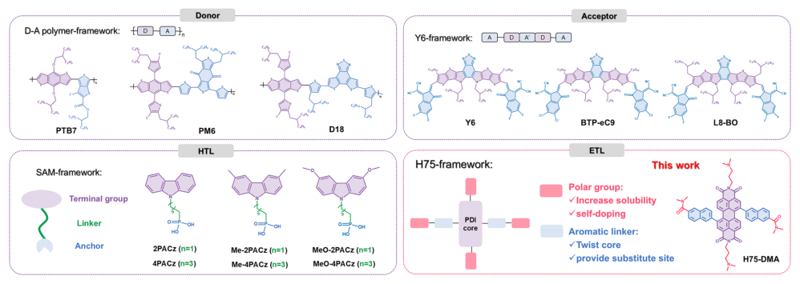
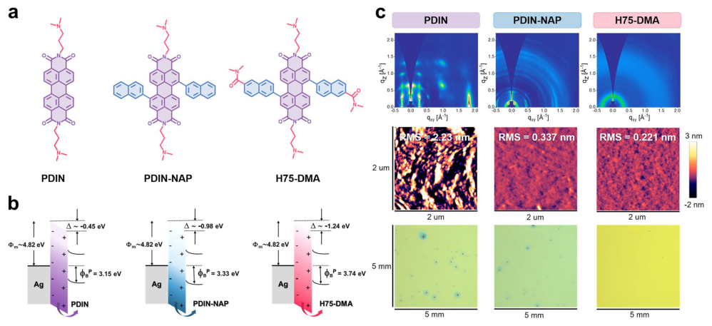
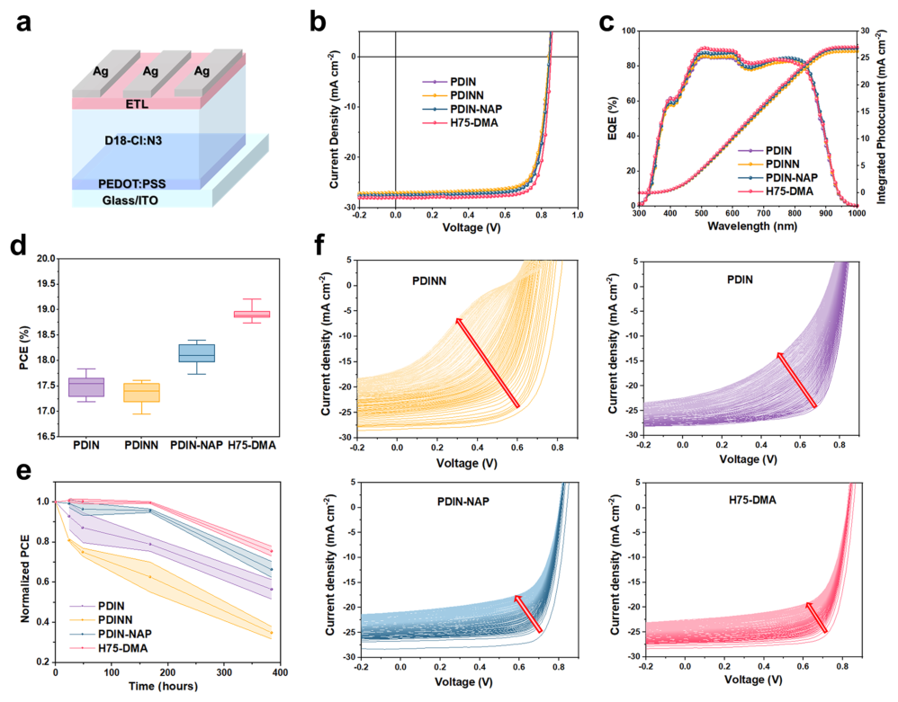
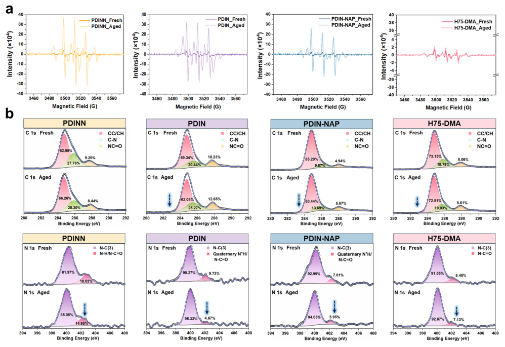
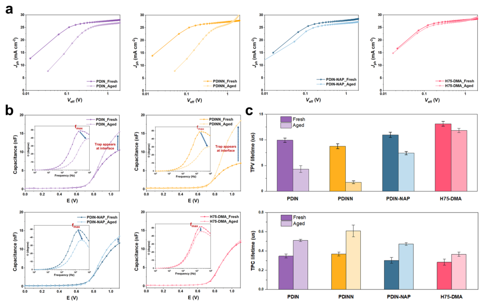
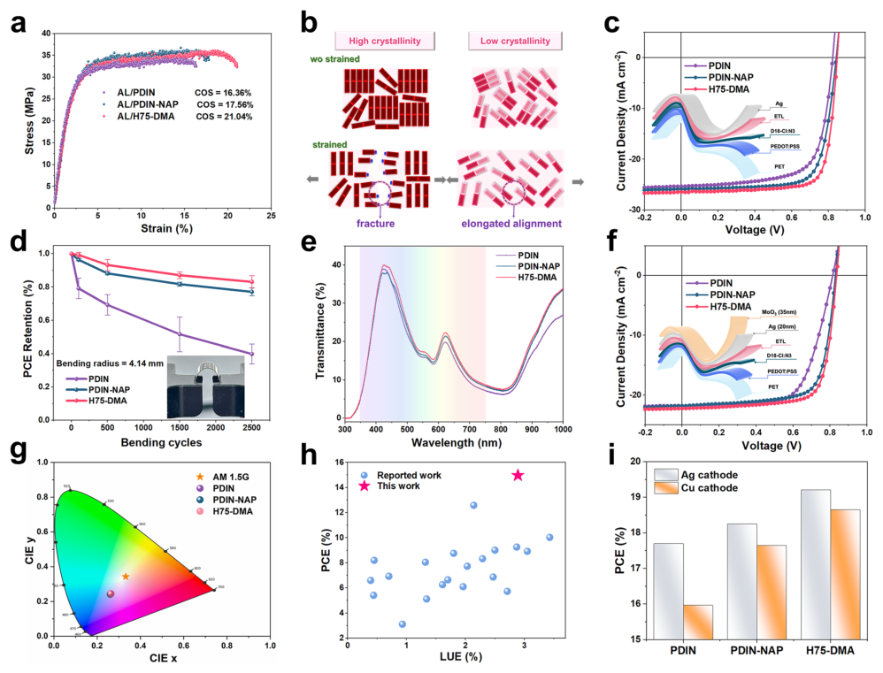

# Polar-Twisted Electron-Transport Layer Simultaneously Breaks Efficiency-Flexibility-Cost Limits in Organic Solar Cells

- 期刊：Nano-Micro Letters
- 日期：2026-08-13
- DOI：10.1007/s40820-026-02330-5
- 解析状态：fulltext_draft

## 摘要与研究价值

**Original:** Abstract Perylene diimide (PDI)-based electron-transport layers (ETLs) are fundamental in governing charge extraction, interfacial recombination, and the operational longevity of organic solar cells (OSCs), yet their molecular design still lacks transferable principles. Here we present a PDI-ETL molecular design framework that couples bay-position engineering with polar, bulky side-chain modulation to improve additive-free alcohol solubility, suppress over-crystallization, and mitigate oxidative degradation. With this framework, H75-DMA suppresses reactive-oxygen-driven chemical evolution and interfacial trap accumulation, thereby stabilizing interfacial energetics and electron transport. Binary OSCs based on H75-DMA achieve a power conversion efficiency (PCE) above 20% and exhibit improved mechanical toughness and bending durability in flexible devices. Its smooth, high-surface-energy interface also induces continuous growth of ultrathin metal cathodes, leading to increased light-utilization efficiency in flexible semitransparent OSCs. In addition, H75-DMA enables cathode substitution from Ag to Cu while retaining about 97% of the PCE of the Ag-based devices, thereby improving cost-effectiveness at the device level.

**中文:** 涉及坏点、漂移、跨器件迁移或少样本校准。摘要可核实数值包括：20%、97%。

## 创新点

- Abstract Perylene diimide (PDI)-based electron-transport layers (ETLs) are fundamental in governing charge extraction, interfacial recombination, and the operational longevity of organic solar cells (OSCs), yet their molecular design still lacks transferable principles.
- 涉及坏点、漂移、跨器件迁移或少样本校准

## 对当前课题的启发

- 涉及坏点、漂移、跨器件迁移或少样本校准
- 可对照 raw pixel、software feature 与 physical projection 的性能/通道/功耗

## 制备与实验步骤

### 1. 组装与封装

**Source:** p.2

**Original:** In the broader context of OSC development, the rapid advancement of other functional layers has been propelled by the establishment of molecular frameworks—such as donor—acceptor (D–A) polymer framework for donors, the Y6-series framework for acceptors, and self-assembled monolayer (SAM) frameworks for hole-transport layers (Fig. 1).

**中文:** 组装与封装步骤，关键配比、时间、温度和设备参数以 p.2 原文为准。

### 2. 成膜与沉积

**Source:** p.2

**Original:** The H75-DMA-based device achieves The thick neat films of the ETL materials were drop-coated on the silicon substrates, and the samples were recorded with a Varian instrument.

**中文:** 成膜与沉积步骤，关键配比、时间、温度和设备参数以 p.2 原文为准。

### 3. 材料混合与分散

**Source:** p.4

**Original:** was used to probe both superoxide and hydroxyl radicals: For superoxide detection, ETL powder was dispersed for 30 min in a DMPO/methanol solution (1: 100 v/v), yielding the DMPO–OOH adduct, whereas hydroxyl radicals were monitored by dispersing ETL powder for 30 min in a DMPO/water solution (1: 100 v/v) to form the DMPO–OH adduct.

**中文:** 材料混合与分散步骤，关键配比、时间、温度和设备参数以 p.4 原文为准。

### 4. 材料混合与分散

**Source:** p.4

**Original:** Each dispersion was analyzed immediately after preparation and again after 168 h of storage under ambient conditions, with the aged samples displaying markedly stronger ESR signals than the fresh ones.

**中文:** 材料混合与分散步骤，关键配比、时间、温度和设备参数以 p.4 原文为准。

### 5. 成膜与沉积

**Source:** p.4

**Original:** ETLs in chloroform were spin-coated at a film thickness (d) of ~ 100 nm on substrates with parallel silver electrodes, and the conductivity of the ETLs was measured by the slope of the I–V plot using the equation I = σ × A × V × d−1, where d is the film thickness and A is the sample area.

**中文:** 成膜与沉积步骤，关键配比、时间、温度和设备参数以 p.4 原文为准。

### 6. 图形化与结构成形

**Source:** p.4

**Original:** Grazing-incidence wide-angle X-ray scattering (GIWAXS) measurements were performed at the Pohang Accelerator Laboratory (Korea) on the PLS-II 6D U-SAXS and 9A beamlines, where scattering patterns were captured with a Rayonix SX165 two-dimensional CCD detector.

**中文:** 图形化与结构成形步骤，关键配比、时间、温度和设备参数以 p.4 原文为准。

### 7. 组装与封装

**Source:** p.5

**Original:** Operational stability examinations of the OSC devices without encapsulation were performed utilizing a white light LED array under continuous illumination simulating an intensity of 100 mW cm–2 in an ambient environment (approximately 55 °C, 40%–60% RH), with J-V curves recorded over time (T3600, McScience).

**中文:** 组装与封装步骤，关键配比、时间、温度和设备参数以 p.5 原文为准。

### 8. 成膜与沉积

**Source:** p.5

**Original:** The ETL was applied via spin-coating onto the glass/PSS/active layer substrate.

**中文:** 成膜与沉积步骤，关键配比、时间、温度和设备参数以 p.5 原文为准。

### 9. 材料混合与分散

**Source:** p.5

**Original:** Following the film deposition, the glass/PSS/active layer/ ETL specimens were cut into a dog-bone configuration using a femtosecond laser, thereafter, transferred onto water by dissolving the underlying PSS sacrificial layer, and then attached to the grips using van der Waals forces.

**中文:** 材料混合与分散步骤，关键配比、时间、温度和设备参数以 p.5 原文为准。

### 10. 制备与实验操作

**Source:** p.5

**Original:** 2.6 Device Fabrication Samples of the Si wafer/active layer/ETL were manufactured for the DCB test.

**中文:** 制备与实验操作步骤，关键配比、时间、温度和设备参数以 p.5 原文为准。

### 11. 制备与实验操作

**Source:** p.5

**Original:** The samples were cut into 8 mm × 40 mm strips and adhered on dummy silicon substrates with epoxy (353ND, EPO-TEK) to fabricate DCB specimens.

**中文:** 制备与实验操作步骤，关键配比、时间、温度和设备参数以 p.5 原文为准。

### 12. 组装与封装

**Source:** p.5

**Original:** The cohesive fracture values were subsequently determined utilizing a high-precision micromechanical testing equipment The organic solar cell devices (OSCs) were constructed using the conventional architecture of ITO/PEDOT:PSS/ active layer/electron-transport layer (ETL)/Ag.

**中文:** 组装与封装步骤，关键配比、时间、温度和设备参数以 p.5 原文为准。

### 13. 材料混合与分散

**Source:** p.5

**Original:** The ITO glasses were sequentially cleaned with detergent, deionized water, acetone, and isopropyl alcohol using a sonication device, and subsequently dried overnight in an oven.

**中文:** 材料混合与分散步骤，关键配比、时间、温度和设备参数以 p.5 原文为准。

### 14. 成膜与沉积

**Source:** p.6

**Original:** (Bayer Baytron 4083) was spin-coated onto ITO glasses at 4000 rpm, resulting in a thickness of approximately 30 nm, and subsequently annealed at 150 °C for 20 min in ambient air.

**中文:** 成膜与沉积步骤，关键配比、时间、温度和设备参数以 p.6 原文为准。

### 15. 成膜与沉积

**Source:** p.6

**Original:** The blend solution of the D18-Cl: N3 system, particularly D18-Cl:N3 (1.0: 1.4) in CF at a concentration of 10 mg mL−1, was spin-coated at 2200 rpm and subsequently annealed at 80 °C for 10 min, with DIB added at a mass fraction of 60%.

**中文:** 成膜与沉积步骤，关键配比、时间、温度和设备参数以 p.6 原文为准。

### 16. 成膜与沉积

**Source:** p.6

**Original:** In case of PM6:L8-BO system, the blend solution of PM6:L8-BO (1.0: 1.2) in CF at 16 mg mL−1 was spin-coated at 2000 rpm before annealing at 100 °C for 10 min.

**中文:** 成膜与沉积步骤，关键配比、时间、温度和设备参数以 p.6 原文为准。

## 方法原文锚点

**Source:** p.2 M001

**Original:** Perylene diimide (PDI) derivatives have emerged as a compelling molecular scaffold for electron-transport layers (ETLs) in organic solar cells (OSCs) owing to their excellent electron-transport characteristics and suitable energylevel alignment [1–12]. However, state-of-the-art PDI-based ETLs suffer from poor chemical stability, particularly under prolonged air exposure and illumination, leading to rapid performance degradation [13–19]. These reliability issues stem from two intertwined challenges. First, limited alcohol solubility is still a practical challenge for many neutral amine PDI ETLs, even though some well-known systems can be processed without acid additives [7, 11]. In such cases, processing aids such as AcOH are often introduced, which can complicate interfacial control and stability [17, 20–22]. Second, strong π–π stacking of planar PDI cores often yields excessive crystalline, edge-on films with rough surfaces that exacerbate interfacial recombination and mechanical brittleness. While crystallinity can facilitate charge transport [11, 23–26], excessive ordering undermines interfacial integrity and stability [16, 27–29]. In the broader context of OSC development, the rapid advancement of other functional layers has been propelled by the establishment of molecular frameworks—such as donor—acceptor (D–A) polymer framework for donors, the Y6-series framework for acceptors, and self-assembled monolayer (SAM) frameworks for hole-transport layers (Fig. 1). These frameworks provide precise molecular design guidelines that have greatly accelerated the discovery of highperformance materials. By contrast, no comparable framework exists for PDI-based ETLs, despite their critical role in charge extraction and interface engineering. This absence of guiding principles for ETL design represents a major bottleneck in achieving simultaneous advances in efficiency, stability, and processability. Here, we introduce an ETL molecular framework, termed the H75-framework that integrates sterically twisted bay substituents with polar functionalities to simultaneously modulate solubility, morphology, and oxidative stability. Using this strategy, we designed H75-DMA, which incorporates polar bulky dimethylnaphthylamide (DMA) units at the bay positions, and benchmarked it against PDIN-NAP with bay-position naphthyl groups and conventional PDIN and PDINN ETLs. The H75-DMA-based device achieves

**中文:** 该段已进入结构化方法步骤；完整逐段翻译待智能体精读补齐。

**Source:** p.3 M002

**Original:** The thick neat films of the ETL materials were drop-coated on the silicon substrates, and the samples were recorded with a Varian instrument.

**中文:** 该段已进入结构化方法步骤；完整逐段翻译待智能体精读补齐。

**Source:** p.4 M003

**Original:** was used to probe both superoxide and hydroxyl radicals: For superoxide detection, ETL powder was dispersed for 30 min in a DMPO/methanol solution (1: 100 v/v), yielding the DMPO–OOH adduct, whereas hydroxyl radicals were monitored by dispersing ETL powder for 30 min in a DMPO/water solution (1: 100 v/v) to form the DMPO–OH adduct. Each dispersion was analyzed immediately after preparation and again after 168 h of storage under ambient conditions, with the aged samples displaying markedly stronger ESR signals than the fresh ones.

**中文:** 该段已进入结构化方法步骤；完整逐段翻译待智能体精读补齐。

**Source:** p.4 M004

**Original:** ETLs in chloroform were spin-coated at a film thickness (d) of ~ 100 nm on substrates with parallel silver electrodes, and the conductivity of the ETLs was measured by the slope of the I–V plot using the equation I = σ × A × V × d−1, where d is the film thickness and A is the sample area.

**中文:** 该段已进入结构化方法步骤；完整逐段翻译待智能体精读补齐。

**Source:** p.4 M005

**Original:** Surface morphology was probed with a Veeco MultiMode V microscope equipped with a NanoScope controller, employing silicon tips from Bruker for AFM imaging and Pt/Ticoated probes (SPARK 70 Pt, Nu Nano Ltd.) for surfacepotential mapping by KPFM. Grazing-incidence wide-angle X-ray scattering (GIWAXS) measurements were performed at the Pohang Accelerator Laboratory (Korea) on the PLS-II 6D U-SAXS and 9A beamlines, where scattering patterns were captured with a Rayonix SX165 two-dimensional CCD detector. An X-ray energy of 11.24 keV was used, and the incidence angle was adjusted between 0.08° and 0.12° to maximize the signal-to-background ratio.

**中文:** 该段已进入结构化方法步骤；完整逐段翻译待智能体精读补齐。

**Source:** p.5 M006

**Original:** an 85 °C temperature setting in a nitrogen-filled glove box. The PCE was occasionally measured after cooling to ambient temperature). In the air stability test, the cells were evaluated in the ambient environment (25 °C and 40%–60% RH), with room light as the light source. Operational stability examinations of the OSC devices without encapsulation were performed utilizing a white light LED array under continuous illumination simulating an intensity of 100 mW cm–2 in an ambient environment (approximately 55 °C, 40%–60% RH), with J-V curves recorded over time (T3600, McScience). The device’s area of 0.0385 cm2 is utilized for stability measurements.

**中文:** 该段已进入结构化方法步骤；完整逐段翻译待智能体精读补齐。

**Source:** p.5 M007

**Original:** The pseudo-freestanding tensile method was carried out in accordance with the experimental protocols described in the previously published research [31]. The ETL was applied via spin-coating onto the glass/PSS/active layer substrate. Following the film deposition, the glass/PSS/active layer/ ETL specimens were cut into a dog-bone configuration using a femtosecond laser, thereafter, transferred onto water by dissolving the underlying PSS sacrificial layer, and then attached to the grips using van der Waals forces. Tensile load values were determined using a load cell (LTS-50GA, KYOWA, Japan), whereas strain values were assessed by a digital image correlation (DIC) system. The strain was applied at a constant strain rate of 0.8 × 10–3 s−1. The elastic modulus was determined by employing the least squares fit to the linear segment of the stress–strain curve up to 1.0% strain. The crack-onset strain was identified as the strain at which the tensile load significantly decreased due to the commencement of cracking (Fig. S32).

**中文:** 该段已进入结构化方法步骤；完整逐段翻译待智能体精读补齐。

**Source:** p.5 M008

**Original:** 2.6 Device Fabrication

**中文:** 该段已进入结构化方法步骤；完整逐段翻译待智能体精读补齐。

**Source:** p.5 M009

**Original:** Samples of the Si wafer/active layer/ETL were manufactured for the DCB test. The samples were cut into 8 mm × 40 mm strips and adhered on dummy silicon substrates with epoxy (353ND, EPO-TEK) to fabricate DCB specimens. The cohesive fracture values were subsequently determined utilizing a high-precision micromechanical testing equipment

**中文:** 该段已进入结构化方法步骤；完整逐段翻译待智能体精读补齐。

**Source:** p.5 M010

**Original:** The organic solar cell devices (OSCs) were constructed using the conventional architecture of ITO/PEDOT:PSS/ active layer/electron-transport layer (ETL)/Ag. The ITO glasses were sequentially cleaned with detergent, deionized water, acetone, and isopropyl alcohol using a sonication device, and subsequently dried overnight in an oven. Following a 20-min UV-Ozone treatment, PEDOT:PSS

**中文:** 该段已进入结构化方法步骤；完整逐段翻译待智能体精读补齐。

**Source:** p.6 M011

**Original:** (Bayer Baytron 4083) was spin-coated onto ITO glasses at 4000 rpm, resulting in a thickness of approximately 30 nm, and subsequently annealed at 150 °C for 20 min in ambient air. The blend solution of the D18-Cl: N3 system, particularly D18-Cl:N3 (1.0: 1.4) in CF at a concentration of 10 mg mL−1, was spin-coated at 2200 rpm and subsequently annealed at 80 °C for 10 min, with DIB added at a mass fraction of 60%. In case of PM6:L8-BO system, the blend solution of PM6:L8-BO (1.0: 1.2) in CF at 16 mg mL−1 was spin-coated at 2000 rpm before annealing at 100 °C for 10 min. Subsequently, a methanol solution of PDIN (2.0 mg mL−1, 0.3% acetic acid), PDIN-NAP (2.0 mg mL−1, 0.1% acetic acid), H75-DMA (2.0 mg mL−1), or PDINN (1.0 mg mL−1) was spin-coated onto the active layer at 3000 rpm for 30 s. Finally, silver cathode (~ 100 nm) was thermally deposited onto the substrates in a high vacuum environment (< 3.0 × 10–6 Pa). The flexible organic solar cells were constructed using PET/ITO/PEDOT:PSS/D18-Cl:N3/ETL/Ag. The flexible electrode (PET/ITO) was attached to glass substrates using tape, followed by the normal spin-coating procedure for the device. The PEDOT:PSS solution was subsequently spincoated and annealed on a hot stage at 100 °C for 15 min. Next, the process conditions match those of the rigid device. The semitransparent flexible organic solar cells (OSCs) with the configuration of PET/ITO/PEDOT:PSS/D18-Cl:N3/ ETL/Ag/MoO3 were fabricated according to the specified process conditions for flexible OSCs. The thickness of the Ag electrode was 20 nm. Finally, 35 nm of MoO3 was thermally vaporized at a rate of 0.3 Å s−1 to form the optical structure.

**中文:** 该段已进入结构化方法步骤；完整逐段翻译待智能体精读补齐。

**Source:** p.6 M012

**Original:** that the NAP units at the bay positions alleviate the planarity of PDI backbone, introducing a twist angle over ~ 19°, which likely leads to reduced intermolecular aggregation (Fig. S8). Notably, H75-DMA can be readily deposited as an ETL from alcohol-based solvents without any acidic additive, whereas AcOH is required for PDIN (0.3 vol%) and PDIN-NAP (0.1 vol%) to form suitable ETL films. These results indicate that both the planarity-broken backbone and polar DMA units at bay-position serve as the primary factor governing alcohol-solvent processibility of the H75-framework. PDIN-NAP and H75-DMA show similar absorption features in both methanol solution and film, with redshifted and broadened spectra relative to PDIN because of the extended bay-position conjugation. Both PDIN-NAP and H75-DMA have higher-lying highest occupied molecular orbitals (HOMOs) and deeper-lying lowest unoccupied molecular orbitals (LUMOs) than PDIN, as determined by cyclic voltammetry. Their frontier energy levels align well with those of commonly used acceptors in OSCs, enabling efficient hole blocking and electron collection. The relevant optical and electrochemical properties are summarized in Figs. S9, S10 and Table S1. Ultraviolet photoelectron spectroscopy (UPS) shows that H75-DMA-deposition more effectively reduces the Ag work function to 3.58 eV, compared to 3.84 eV for PDIN-NAP and 4.37 eV for PDIN (Figs. 2b, S11 and Table S2). This results in a higher hole-injection barrier (3.74 eV) for H75DMA, thereby suppressing interfacial recombination and enhancing VOC [32]. Electron spin resonance (ESR) further indicates that H75-DMA produces the strongest radical signal, reflecting its superior intrinsic self-doping capability relative to PDIN-NAP and PDIN (Fig. S12) [32 33]. These results correlate well with the enhanced charge mobility and conductivity observed in H75-DMA films compared with PDIN-NAP and PDIN (Figs. S13, S14 and Table S3). As shown in Fig. 2c, grazing-incidence wide-angle X-ray scattering (GIWAXS) patterns of PDIN exhibits clear (100) out-of-plane and (010) in-plane peaks, along with numerous diffraction spots, indicating a preferentially edge-on oriented polycrystalline structure. These distinct diffraction patterns became progressively weaker in PDIN-NAP and were virtually absent in H75-DMA, signifying the loss of long-range molecular ordering and crystallinity. Atomic force microscopy (AFM) height images confirm that H75DMA yields the smoothest surface, with an RMS roughness of 0.221 nm, compared with 0.337 nm for PDIN-NAP and

**中文:** 该段已进入结构化方法步骤；完整逐段翻译待智能体精读补齐。

**Source:** p.7 M013

**Original:** Fig. 2 Material properties of ETLs. a Chemical structures of PDIN, PDIN-NAP, and H75-DMA. b Schematic energy-level diagrams illustrating how each ETL lowers the Ag work function via interfacial dipole formation. c Film morphology of the ETLs: 2D GIWAXS patterns (top), AFM height images (middle), and optical-microscopy images (bottom)

**中文:** 该段已进入结构化方法步骤；完整逐段翻译待智能体精读补齐。

**Source:** p.7 M014

**Original:** 2.23 nm for PDIN (Fig. S15). Consistently, optical microscopy reveals a uniform, featureless surface for H75-DMA, whereas particulates are visible in PDIN-NAP and are more pronounced in PDIN (Fig. 2c). This amorphous-like morphology gives H75-DMA a more homogeneous interface, which is expected to favor charge extraction and suppress interfacial recombination (Fig. S16). OSC devices with the architecture ITO/PEDOT:PSS/ D18-Cl:N3/ETL/Ag were fabricated (Fig. 3a). For the following performance and stability studies, we also included PDINN—a highly soluble PDIN analog containing additional secondary amine (–NH–) groups in its side chains— as a reference ETL to better examine the structure–property–stability relationship (Figs. 2a and S17). Notably, PDINN can be processed from alcohol solvents without AcOH, like H75-DMA, and thus serves as an acid-free reference to minimize the influence of AcOH in the stability comparisons. The current density–voltage (J–V) curves and external quantum efficiency (EQE) spectra of the representative devices are presented in Fig. 3b, c, and the corresponding photovoltaic parameters are summarized in Table 1. The H75-DMA-based device showed the highest PCE of 19.21%, with a VOC of 0.847 V, a short-circuit current (JSC) of 27.96 mA cm−2, and a fill factor (FF) of 81.01%. In comparison, devices based on PDIN-NAP, PDIN, and PDINN show

**中文:** 该段已进入结构化方法步骤；完整逐段翻译待智能体精读补齐。

**Source:** p.8 M015

**Original:** To elucidate the oxidative degradation pathway of the ETLs, we performed Laplacian bond order (LBO) calculations to assess their bond stability (Fig. S23) [38]. Compared to the LBOs (0.701–0.719) observed for the side chains of the other ETLs, the PDINN had lower LBO

**中文:** 该段已进入结构化方法步骤；完整逐段翻译待智能体精读补齐。

**Source:** p.8 M016

**Original:** values (0.478–0.694) associated with the secondary amine (N–H) and the neighboring C–H bonds at positions 3 and 4, as shown in Fig. S24. This suggests a high propensity for hydrogen abstraction by reactive-oxygen species (ROS), thereby rationalizing the accelerated degradation observed for PDINN. Notably, for PDIN subjected to AcOH treatment, the LBO values of all bonds within the side chains were reduced (Fig. S25). In a comparison between ETLs with and without bay-position functionalities, the LBO values of the C–H bonds adjacent to the PDI core were found to be similar. Note that in the cases of PDIN-NAP and H75-DMA, the Csp2–Csp2 bonds formed at

**中文:** 该段已进入结构化方法步骤；完整逐段翻译待智能体精读补齐。

**Source:** p.9 M017

**Original:** the bay 1,7-positions of PDI are slightly higher LBOs than the corresponding C–H bonds (Fig. S26). To probe the actual stability of the ETLs, we performed a series of structural characterizations before and after one week (168 h) of storage in air. First, we tracked their NMR spectra using MeOH-d4 (2 mg mL−1) as the solvent (Figs. S27 and S41–S44). All the ETLs showed characteristic aromatic protons of PDI core in the range of 8–6 ppm with imide side-chain protons appearing between 4.5 and 1.5 ppm. After one week of storage in air, both H75-DMA and PDIN-NAP exhibited identical NMR resonance peaks, while PDIN and PDINN showed significant changes in peak intensity, broadening, and multiplicity, suggesting substantial structural and/or chemical alterations. These findings validate that the incorporation of bay-positioned NAP groups plays a critical role in enhancing the intrinsic stability of PDI-based ETLs. ESR spectroscopy with the spin-trapping agent (5,5-dimethyl-1-pyrroline N-oxide (DMPO)) offers a sensitive probe for evaluating chemical stability by directly detecting superoxide and hydroxyl radicals in ETL solutions [39–41]. All the fresh samples displayed the characteristic ESR signals of the DMPO–•OOH and DMPO–•OH adducts (Figs. 4a and S28). Following one week of storage in air, the DMPO adduct signals increased substantially for PDINN, consistent with the high oxidative reactivity of the secondary amine (N–H) moieties in its side chains. PDIN and PDIN-NAP also showed clear increases in adduct intensity, which we attribute to the involvement of AcOH-induced protonation (R3NH+) and related side

**中文:** 该段已进入结构化方法步骤；完整逐段翻译待智能体精读补齐。

**Source:** p.10 M018

**Original:** together, the much smaller spectral changes of H75-DMA confirm its superior resistance to air-induced chemical degradation, in good agreement with the ESR and FTIR results. As illustrated in Fig. S30, photooxidation is, in principle, a light-induced chemical process in which UV or visible photons excite organic materials used in organic solar cells (OSCs), enabling their interaction with molecular oxygen (O2) to generate various ROS such as singlet oxygen (1O2), superoxide (O2 –•), or hydroxyl radicals (•OH) [42–48]. In OSC architectures, organic ETLs are particularly prone to photoexcitation-induced degradation, with specifically vulnerable hydrogen-containing sites such as quaternary N⁺H, secondary amine N–H, and C–H bonds adjacent to nitrogen atoms (excluding those in imide unit) located within the side chains. The air stability trends of the ETLs observed above demonstrate a clear dependence on the content of vulnerable

**中文:** 该段已进入结构化方法步骤；完整逐段翻译待智能体精读补齐。

**Source:** p.12 M019

**Original:** of 4.39 J m–2 for H75-DMA, markedly exceeding those of PDIN-NAP (3.42 J m–2) and PDIN (3.32 J m–2), reinforcing the conclusion that H75-DMA-based film exhibits exceptional mechanical durability. Taken together with the tensilestretching behavior, these results suggest that amorphouslike and less-ordered molecular domains accommodate deformation, enabling higher strain tolerance, as schematically illustrated in Fig. 6b. To verify the advantages of H75-DMA in a flexible device setting, flexible OSCs were fabricated using the same device architecture described above, except with PET substrates instead of ITO. Figure 6c displays the J–V curves.

**中文:** 该段已进入结构化方法步骤；完整逐段翻译待智能体精读补齐。

**Source:** p.13 M020

**Original:** cycles. In sharp contrast, the PDIN-NAP and H75-DMAbased counterparts demonstrated substantially improved bending stability, with H75-DMA in particular retaining 83% of its initial PCE under identical conditions. In semitransparent OSCs, ultrathin Ag cathode was evaporated onto the ETL, and its nucleation and growth behavior (Fig. S38a) were dictated by the underlying ETL surface. This in turn determines whether the Ag film grows continuously or as isolated islands, directly affecting its conductivity and transparency [57]. To directly quantify the ETL surface wettability that governs Ag nucleation/coalescence, we further measured three-liquid contact angles (DI water/ethylene glycol/diiodomethane) on the ETL surfaces and calculated the surface-energy components using the Owens–Wendt method (Fig. S39 and Table S9). Given the higher surface energy and smoother, more uniform surface of H75-DMA (Fig. 2c), we evaluated its templating ability by depositing ~ 20 nm Ag on PDIN, PDIN-NAP, and H75-DMA films and measuring the resulting sheet resistance and transmittance (Figs. 6e and S38b). Ag on PDIN showed high resistance and low transmittance; PDIN-NAP gave only slight gains; Ag on H75-DMA, however, achieved

**中文:** 该段已进入结构化方法步骤；完整逐段翻译待智能体精读补齐。

**Source:** p.13 M021

**Original:** the lowest resistance and highest transmittance, evidencing a continuous film. We also fabricated flexible semitransparent OSCs (see inset of Fig. 6f). All the devices had similar chromatic coordinates located close to the AM 1.5 G reference point in CIE 1931 chromaticity diagram (Fig. 6g), indicating their excellent color-rendering performance. Relative to the other counterpart devices, H75-DMA-based flexible semitransparent device showed the highest LUE (PCE × AVT) around 3%, enabled by its superior PCE and average visible transmission (AVT). This LUE value is among the leading results reported for flexible semitransparent OSCs, with a PCE of ~ 15% (Figs. 6h, S10 and Table 2). To demonstrate device-level cost reduction through cathode replacement, we further fabricated OSCs using a higher-work-function Cu cathode in place of Ag, noting that Ag is approximately 100 times more expensive than Cu by weight. Again, among the Cu-deposited low-cost devices, the H75-DMA-based device achieved the highest PCE of 18.65% (Figs. 6i, S40 and Table 2), approaching that of the Ag-deposited counterpart demonstrated earlier. Collectively, these diverse application studies confirm the broad advantages of H75-DMA for various types of OSC architectures.

**中文:** 该段已进入结构化方法步骤；完整逐段翻译待智能体精读补齐。

**Source:** p.14 M022

**Original:** In summary, we proposed a unified PDI-based ETL framework through comparative investigations of benchmark PDI ETLs and newly designed derivatives (PDIN-NAP and H75-DMA) incorporating NAP and polar DMA units at the bay positions. Notably, H75-DMA afforded methanol solubility without acidic additives, formed uniform low-crystallinity films, and showed exceptional oxidative stability by reducing vulnerable C–H/N–H bonds and disrupting π–π aggregation, thereby suppressing key degradation pathways. H75-DMA-based device delivered a high PCE of 20.07% and enhanced long-term operational stability, retaining ~ 80% of initial PCE after 384 h of air storage. In flexible devices, H75-DMA film exhibited a COS exceeding 21% and toughness of 6.72 MJ m⁻3, delivering 17.89% PCE with nearly 83% retention after 2500 bending cycles. In flexible semitransparent devices, the synergy of high transmittance and low sheet resistance yielded a record-high LUE around 3%, among the highest reported for flexible semitransparent OSCs. Moreover, replacing Ag with a Cu cathode still enabled a competitive PCE of up to 18.65%, approaching that of the Ag-based counterpart and demonstrating improved cost-effectiveness at the device level. This unified molecular framework provides a conceptual foundation for designing high-performance, stable, and scalable ETLs in OSCs.

**中文:** 该段已进入结构化方法步骤；完整逐段翻译待智能体精读补齐。

**Source:** p.14 M023

**Original:** Author Contributions C. Y. supervised the work. T. L. H. M. and Z. S. conceived the ideas and organized the work. T. L. H. M. synthesized and characterized the ETL materials. Z. S. fabricated and characterized the solar cells. J.K conducted the mechanical properties measurement. S. L. performed GIWAXD measurements. C. Y., T. L. H. M., and Z. S. wrote the manuscript, and all authors have commented on this manuscript.

**中文:** 该段已进入结构化方法步骤；完整逐段翻译待智能体精读补齐。

**Source:** p.14 M024

**Original:** 1. L. Feng, Y. Xiang, Z. Li, Q. Li, H. Dong et al., Non-ionic perylene-diimide polymer as universal cathode interlayer for conventional, inverted, and blade-coated organic solar cells. Angew. Chem. Int. Ed. 63(43), e202410857 (2024). https://​ doi.​org/​10.​1002/​anie.​20241​0857 2. Y. Li, M. Han, W. Yang, J. Guo, K. Chang et al., Perylene diimide-based cathode interfacial materials: adjustable molecular structures and conformation, optimized film morphology, and much improved performance of non-fullerene polymer solar cells. Mater. Chem. Front. 3(9), 1840–1848 (2019). https://​doi.​org/​10.​1039/​c9qm0​0236g 3. Y. Wang, X. Jiang, H. Song, N. Wei, Y. Wang et al., Thicknessinsensitive, cyano-modified perylene diimide derivative as a cathode interlayer material for high-efficiency organic solar cells. Acta Phys. Chim. Sin. 41(3), 100027 (2025). https://​doi.​ org/​10.​3866/​PKU.​WHXB2​02406​007 4. Y. Wang, J. Wen, Z. Shang, Y. Zhong, H. Zhang et al., Enhancing the built-in electric field of thickness-insensitive small molecule cathode interlayers for high-efficiency and stable organic solar cells. Angew. Chem. Int. Ed. 64(31), e202506252 (2025). https://​doi.​org/​10.​1002/​anie.​20250​6252 5. Y. Wang, J. Wen, Y. Zhong, L. Fu, Z. You et al., Homologyguided zwitterionic interlayers for 21% efficiency non-fullerene organic solar cells. Adv. Mater. 38(10), e20669 (2026). https://​doi.​org/​10.​1002/​adma.​20252​0669 6. Z. Wang, H. Wang, T. Dai, M. Du, Q. Guo et al., Bay position substituted perylene diimide derivatives as cathode interface materials for high-efficient nonfullerene and fullerene organic photovoltaics. ACS Appl. Energy Mater. 5(5), 6423–6431 (2022). https://​doi.​org/​10.​1021/​acsaem.​2c009​15

**中文:** 该段已进入结构化方法步骤；完整逐段翻译待智能体精读补齐。

**Source:** p.16 M025

**Original:** Chem. Soc. 138(6), 2004–2013 (2016). https://​doi.​org/​10.​ 1021/​jacs.​5b126​64 33. C.G. Tang, M.C.Y. Ang, K.-K. Choo, V. Keerthi, J.-K. Tan et al., Doped polymer semiconductors with ultrahigh and ultralow work functions for ohmic contacts. Nature 539(7630), 536–540 (2016). https://​doi.​org/​10.​1038/​natur​e20133 34. A.K.K. Kyaw, D.H. Wang, V. Gupta, W.L. Leong, L. Ke et al., Intensity dependence of current–voltage characteristics and recombination in high-efficiency solution-processed smallmolecule solar cells. ACS Nano 7(5), 4569–4577 (2013). https://​doi.​org/​10.​1021/​nn401​267s 35. Z. Sun, H. Ma, T. Le Huyen Mai, J. Park, S. Jeong et al., Nanoscale balance of energy loss and quantum efficiency for high-efficiency polythiophene-based organic solar cells. ACS Nano 19(1), 1026–1035 (2025). https://​doi.​org/​10.​1021/​acsna​ no.​4c127​05 36. Z. Sun, H. Ma, S. Yang, Y. Cho, S. Lee et al., Insight into designing high-performance polythiophenes for reduced urbach energy and nonradiative recombination in organic solar cells. Adv. Funct. Mater. 34(39), 2403093 (2024). https://​doi.​ org/​10.​1002/​adfm.​20240​3093 37. Y. Wang, C. Gao, W. Lei, T. Yang, Z. Liang et al., Achieving 20% toluene-processed binary organic solar cells via secondary regulation of donor aggregation in sequential processing. Nano-Micro Lett. 17(1), 206 (2025). https://​doi.​org/​10.​1007/​ s40820-​025-​01715-2 38. T. Lu, F. Chen, Bond order analysis based on the Laplacian of electron density in fuzzy overlap space. J. Phys. Chem. A 117(14), 3100–3108 (2013). https://​doi.​org/​10.​1021/​jp401​ 0345 39. P. Bilski, K. Reszka, M. Bilska, C.F. Chignell, Oxidation of the spin trap 5, 5-dimethyl-1-pyrroline N-oxide by singlet oxygen in aqueous solution. J. Am. Chem. Soc. 118(6), 1330– 1338 (1996). https://​doi.​org/​10.​1021/​ja952​140s 40. E. Braxton, D.J. Fox, B.G. Breeze, J.J. Tully, K.J. Levey et al., Electron paramagnetic resonance for the detection of electrochemically generated hydroxyl radicals: issues associated with electrochemical oxidation of the spin trap. ACS Meas. Sci. Au 3(1), 21–31 (2023). https://​doi.​org/​10.​1021/​acsme​asure​sciau.​ 2c000​49 41. J.-L. Clément, N. Ferré, D. Siri, H. Karoui, A. Rockenbauer et al., Assignment of the EPR spectrum of 5, 5-dimethyl1-pyrroline N-oxide (DMPO) superoxide spin adduct. J. Org. Chem. 70(4), 1198–1203 (2005). https://​doi.​org/​10.​1021/​ jo048​518z 42. K.U. Ingold, D.A. Pratt, Advances in radical-trapping antioxidant chemistry in the 21st century: a kinetics and mechanisms perspective. Chem. Rev. 114(18), 9022–9046 (2014). https://​ doi.​org/​10.​1021/​cr500​226n 43. H.T. Nicolai, M. Kuik, G.A.H. Wetzelaer, B. de Boer, C. Campbell et al., Unification of trap-limited electron transport in semiconducting polymers. Nat. Mater. 11(10), 882–887 (2012). https://​doi.​org/​10.​1038/​nmat3​384

**中文:** 该段已进入结构化方法步骤；完整逐段翻译待智能体精读补齐。

## 图表解读

### Fig. 1

**Source:** p.3

**Original caption:** Fig. 1 Molecular framework for OSC materials design

**中文图注:** Fig. 1 原始图注已提取；逐项含义见下方分图说明。

**Reading note:** 结合正文首次引用位置和原始图注核对该图的证据角色。

### Fig. 2

**Source:** p.7

**Original caption:** Fig. 2 Material properties of ETLs. a Chemical structures of PDIN, PDIN-NAP, and H75-DMA. b Schematic energy-level diagrams illustrating how each ETL lowers the Ag work function via interfacial dipole formation. c Film morphology of the ETLs: 2D GIWAXS patterns (top), AFM height images (middle), and optical-microscopy images (bottom)

**中文图注:** Fig. 2 原始图注已提取；逐项含义见下方分图说明。

**Reading note:** 重点查看器件结构、材料层次、信号路径和制备流程。

- (a) 重点查看器件结构、材料层次、信号路径和制备流程。 原文：Chemical structures of PDIN, PDIN-NAP, and H75-DMA
- (b) 重点查看器件结构、材料层次、信号路径和制备流程。 原文：Schematic energy-level diagrams illustrating how each ETL lowers the Ag work function via interfacial dipole formation
- (c) 重点查看阵列规模、空间分辨率、串扰、读出通道和空间特征表达。 原文：Film morphology of the ETLs: 2D GIWAXS patterns (top), AFM height images (middle), and optical-microscopy images (bottom)

### Fig. 3

**Source:** p.8

**Original caption:** Fig. 3 Photovoltaic performance and stability of optimized OSCs. a Device architecture for performance optimization. b J–V curves of the optimized devices with various ETLs under illumination of AM1.5 G, 100 mW cm−2. c EQE spectra and integrated current densities. d Statistical distribution of initial PCEs. e Normalized PCEs of unencapsulated devices stored under ambient conditions (~ 25 °C, 40%–60% RH). f J − V curves recorded during accelerated light-aging under continuous 1-sun illumination at 55 °C and 40%–60% RH using an automated J − V tracker without an aperture mask. The panel is intended to show the evolution of J–V curve shape during aging

**中文图注:** Fig. 3 原始图注已提取；逐项含义见下方分图说明。

**Reading note:** 重点查看器件结构、材料层次、信号路径和制备流程。

- (a) 重点查看器件结构、材料层次、信号路径和制备流程。 原文：Device architecture for performance optimization
- (b) 结合正文首次引用位置和原始图注核对该图的证据角色。 原文：J–V curves of the optimized devices with various ETLs under illumination of AM1.5 G, 100 mW cm−2
- (c) 结合正文首次引用位置和原始图注核对该图的证据角色。 原文：EQE spectra and integrated current densities
- (d) 结合正文首次引用位置和原始图注核对该图的证据角色。 原文：Statistical distribution of initial PCEs
- (e) 结合正文首次引用位置和原始图注核对该图的证据角色。 原文：Normalized PCEs of unencapsulated devices stored under ambient conditions (~ 25 °C, 40%–60% RH)
- (f) 结合正文首次引用位置和原始图注核对该图的证据角色。 原文：J − V curves recorded during accelerated light-aging under continuous 1-sun illumination at 55 °C and 40%–60% RH using an automated J − V tracker without an aperture mask. The panel is intended to show the evolution of J–V curve shape during aging

### Fig. 4

**Source:** p.10

**Original caption:** Fig. 4 Ambient stability of ETLs (before and after one week (168 h) at 25 °C and 40%-60% relative humidity). a ESR signals of O2 − (DMPO– •OOH) for fresh and aged samples of PDIN, PDINN, PDIN-NAP, and H75-DMA in methanol solution. b XPS profiles of C 1s and N 1s from fresh and aged PDIN, PDINN, PDIN-NAP, and H75-DMA films

**中文图注:** Fig. 4 原始图注已提取；逐项含义见下方分图说明。

**Reading note:** 结合正文首次引用位置和原始图注核对该图的证据角色。

- (a) 结合正文首次引用位置和原始图注核对该图的证据角色。 原文：ESR signals of O2 − (DMPO– •OOH) for fresh and aged samples of PDIN, PDINN, PDIN-NAP, and H75-DMA in methanol solution
- (b) 结合正文首次引用位置和原始图注核对该图的证据角色。 原文：XPS profiles of C 1s and N 1s from fresh and aged PDIN, PDINN, PDIN-NAP, and H75-DMA films

### Fig. 5

**Source:** p.11

**Original caption:** Fig. 5 Charge dynamics analysis of fresh and aged OSCs before and after one week (168 h) at 25 °C and 40%–60% relative humidity. a Jph–Veff curves of devices with different ETLs. b Capacitance versus applied voltage with corresponding Bode plots. c TPV and TPC lifetimes of fresh and aged devices

**中文图注:** Fig. 5 原始图注已提取；逐项含义见下方分图说明。

**Reading note:** 结合正文首次引用位置和原始图注核对该图的证据角色。

- (a) 结合正文首次引用位置和原始图注核对该图的证据角色。 原文：Jph–Veff curves of devices with different ETLs
- (b) 结合正文首次引用位置和原始图注核对该图的证据角色。 原文：Capacitance versus applied voltage with corresponding Bode plots
- (c) 结合正文首次引用位置和原始图注核对该图的证据角色。 原文：TPV and TPC lifetimes of fresh and aged devices

### Fig. 6

**Source:** p.12

**Original caption:** Fig. 6 Versatile applications of ETLs across diverse OSC architectures. a Stress–strain curves of AL/PDIN, AL/PDIN-NAP, and AL/H75DMA films from pseudo-freestanding tensile tests. b Schematic illustration of strain-induced deformation in crystalline versus low-crystallinity ETL films. c J–V curves of the flexible OSCs with different ETLs. d PCE retention for flexible OSCs as a function of bending cycles (radius = 4.14 mm). e Transmittance spectra of the semitransparent flexible OSCs with different ETLs. f J–V curves of the representative semitransparent flexible OSCs. g CIE 1931 chromaticity coordinates of the semitransparent flexible OSCs. h PCE and LUE for comparative literature data of semitransparent flexible OSCs (Supplementary Table 10). i PCE of OSCs employing Ag versus Cu cathodes with various ETLs

**中文图注:** Fig. 6 原始图注已提取；逐项含义见下方分图说明。

**Reading note:** 重点查看器件结构、材料层次、信号路径和制备流程。

- (a) 结合正文首次引用位置和原始图注核对该图的证据角色。 原文：Stress–strain curves of AL/PDIN, AL/PDIN-NAP, and AL/H75DMA films from pseudo-freestanding tensile tests
- (b) 重点查看器件结构、材料层次、信号路径和制备流程。 原文：Schematic illustration of strain-induced deformation in crystalline versus low-crystallinity ETL films
- (c) 结合正文首次引用位置和原始图注核对该图的证据角色。 原文：J–V curves of the flexible OSCs with different ETLs
- (d) 结合正文首次引用位置和原始图注核对该图的证据角色。 原文：PCE retention for flexible OSCs as a function of bending cycles (radius = 4.14 mm)
- (e) 结合正文首次引用位置和原始图注核对该图的证据角色。 原文：Transmittance spectra of the semitransparent flexible OSCs with different ETLs
- (f) 结合正文首次引用位置和原始图注核对该图的证据角色。 原文：J–V curves of the representative semitransparent flexible OSCs
- (g) 结合正文首次引用位置和原始图注核对该图的证据角色。 原文：CIE 1931 chromaticity coordinates of the semitransparent flexible OSCs
- (h) 结合正文首次引用位置和原始图注核对该图的证据角色。 原文：PCE and LUE for comparative literature data of semitransparent flexible OSCs (Supplementary Table 10)
- (i) 结合正文首次引用位置和原始图注核对该图的证据角色。 原文：PCE of OSCs employing Ag versus Cu cathodes with various ETLs
