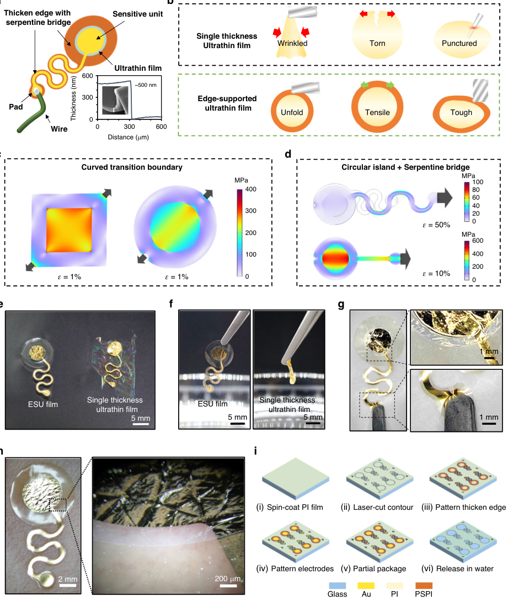
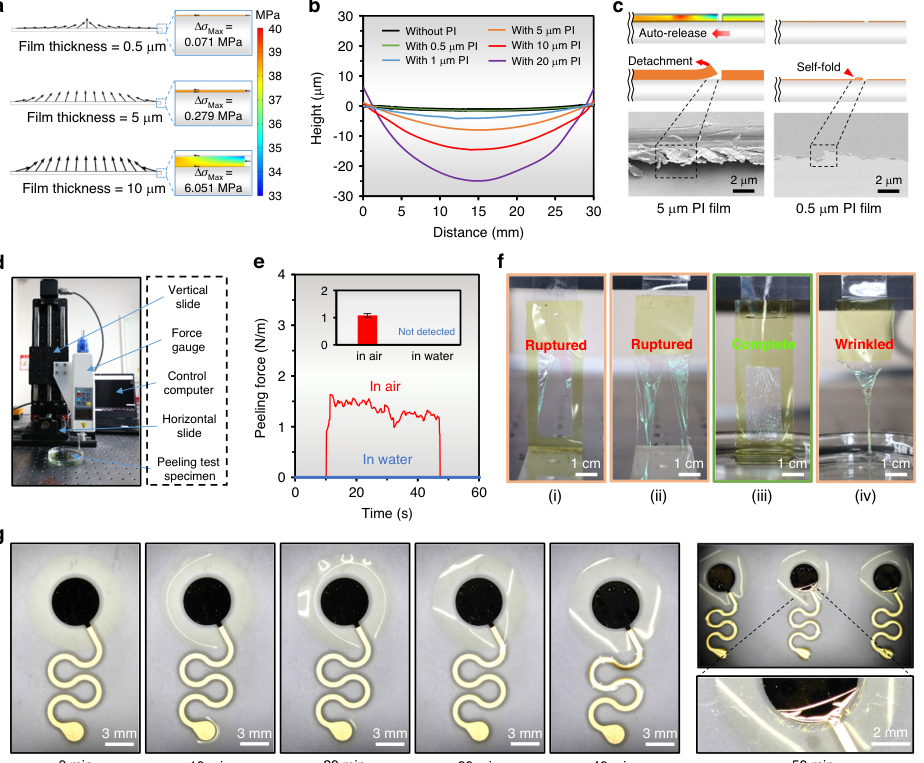
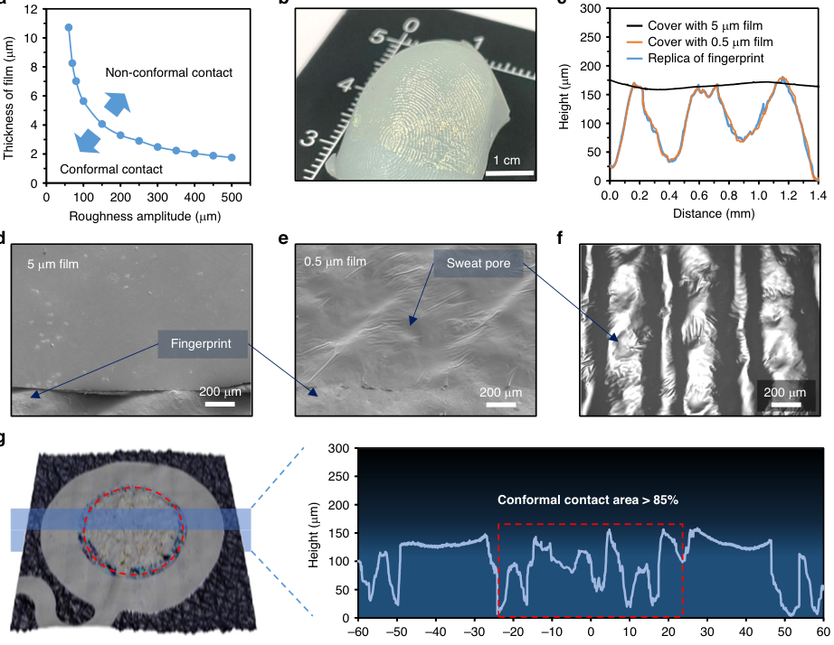
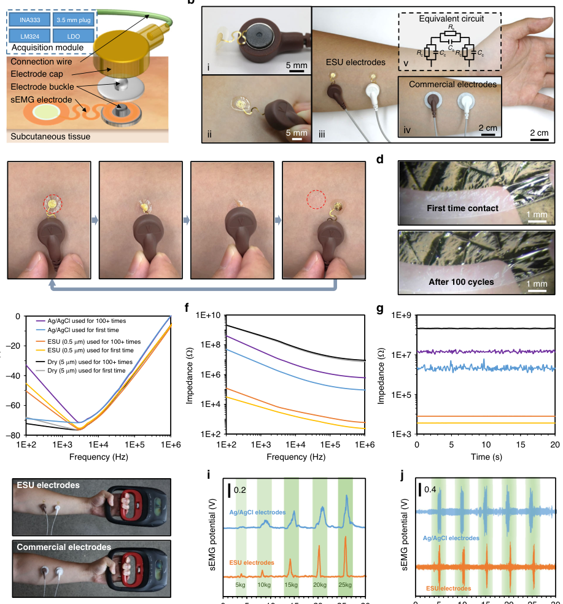
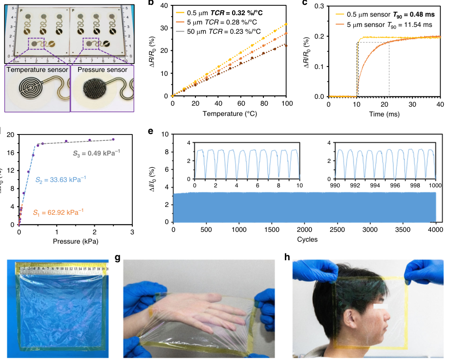

# Nano-thick freestanding and reusable epidermal electronics via edge-supporting strategy

- 期刊：Microsystems & Nanoengineering
- 日期：2026-08-14
- DOI：10.1038/s41378-026-01422-x
- 解析状态：fulltext_draft

## 摘要与研究价值

**Original:** PDF/题录未提供摘要。

**中文:** 与柔性触觉相关，但尚未显示对前端触觉计算的直接贡献。当前未从摘要提取到可比较数值。

## 创新点

- 当前仅获得题录信息，需要打开 DOI/原文核实机制、实验和性能指标。
- 与柔性触觉相关，但尚未显示对前端触觉计算的直接贡献

## 对当前课题的启发

- 提供机器人、可穿戴或电子皮肤系统任务证据

## 制备与实验步骤

### 1. 制备与实验操作

**Source:** p.11

**Original:** Consent to participate Informed consent has been obtained from the volunteers who participated in the experiments Fabrication process of edge-supported nano-thick film with serpentine island-bridge structure First, a PI precursor solution (PAA-1003, Changzhou Yaan New Materials, China) was diluted with NMP solution (Changzhou Yaan New Materials, China) with a volume ratio of 1:2.

**中文:** 制备与实验操作步骤，关键配比、时间、温度和设备参数以 p.11 原文为准。

### 2. 材料混合与分散

**Source:** p.11

**Original:** Then, the mixture was stirred for 30 min and then placed in vacuum for 30 min to remove bubbles.

**中文:** 材料混合与分散步骤，关键配比、时间、温度和设备参数以 p.11 原文为准。

### 3. 成膜与沉积

**Source:** p.11

**Original:** Next, the diluted PI precursor solution was spincoated on a 50 mm × 50 mm glass sheet at 600 rpm for 9 s and 2000 rpm for 30 s, and then was step-cured in an oven from 60 °C to 220 °C with a temperature gradient of 20 °C and a duration of 10 min at each stage.

**中文:** 成膜与沉积步骤，关键配比、时间、温度和设备参数以 p.11 原文为准。

### 4. 图形化与结构成形

**Source:** p.11

**Original:** Subsequently, the releasing edge was cut on the formed ultrathin PI film (~0.5 μm) by a laser cutting machine (ProtoLaser R4, LPKF Laser & Electronics, Germany) with the laser power of 0.1 W and frequency of 100 kHz.

**中文:** 图形化与结构成形步骤，关键配比、时间、温度和设备参数以 p.11 原文为准。

### 5. 成膜与沉积

**Source:** p.11

**Original:** After that, a PI photoresist (BL301, Asahi Kasei, Japan) was spin-coated on ultrathin PI film at 600 rpm for 9 s and 2000 rpm for 30 s, and prebaked on a hot plate at 110 °C for 4 min.

**中文:** 成膜与沉积步骤，关键配比、时间、温度和设备参数以 p.11 原文为准。

### 6. 图形化与结构成形

**Source:** p.11

**Original:** Next, the PI photoresist layer was exposed for 200 mJ/cm2 (MA/ BA6, SUSS Micro Tec, Germany) after being covered with a film mask (Shenzhen Qingyi Photomask, China), and then patterned by developer (RS120, Resemi, China) after post-baking on a hot plate at 110 °C for 15 min.

**中文:** 图形化与结构成形步骤，关键配比、时间、温度和设备参数以 p.11 原文为准。

### 7. 图形化与结构成形

**Source:** p.11

**Original:** At last, the patterned PI photoresist layer was step-baked using the same step-curing procedure as that for the ultrathin PI film.

**中文:** 图形化与结构成形步骤，关键配比、时间、温度和设备参数以 p.11 原文为准。

### 8. 成膜与沉积

**Source:** p.11

**Original:** Fabrication of edge-supported nano-thick sEMG electrode and temperature sensor First, a 50 nm thick Au layer was deposited on the fabricated edge-supported nano-thick PI film by magnetron sputtering (Lab 18, Kurt J.

**中文:** 成膜与沉积步骤，关键配比、时间、温度和设备参数以 p.11 原文为准。

### 9. 成膜与沉积

**Source:** p.11

**Original:** Then, a positive photoresist layer (AZ MIR 703, AZ Electronic Materials, USA) was spin-coated on Au layer at 600 rpm for 9 s and 2500 rpm for 30 s, and soft baked on an 85 °C hot plate for 30 min.

**中文:** 成膜与沉积步骤，关键配比、时间、温度和设备参数以 p.11 原文为准。

### 10. 图形化与结构成形

**Source:** p.11

**Original:** After that, the photoresist layer was exposed for 350 mJ/cm2 (MA/BA6, SUSS Micro Tec, Germany) after covering with a film mask (Shenzhen Qingyi Photomask, China), and patterned in a developer (AZ 400 K, AZ Electronic Materials, USA) to serve as a mask for the wet etching of Au film.

**中文:** 图形化与结构成形步骤，关键配比、时间、温度和设备参数以 p.11 原文为准。

### 11. 材料混合与分散

**Source:** p.11

**Original:** Subsequently, the Au layer was immersed in mixture of KI, I2 and H2O (10 g: 2 g: 100 mL) for 30 s to remove the region without protection of patterned photoresist mask.

**中文:** 材料混合与分散步骤，关键配比、时间、温度和设备参数以 p.11 原文为准。

### 12. 制备与实验操作

**Source:** p.11

**Original:** After above-mentioned process, the fabricated device was released in water.

**中文:** 制备与实验操作步骤，关键配比、时间、温度和设备参数以 p.11 原文为准。

### 13. 图形化与结构成形

**Source:** p.11

**Original:** Fabrication of edge-supported nano-thick pressure sensor First, an edge-supported nano-thick film with patterned Au interdigital electrode on it was fabricated by the previous process.

**中文:** 图形化与结构成形步骤，关键配比、时间、温度和设备参数以 p.11 原文为准。

### 14. 材料混合与分散

**Source:** p.11

**Original:** Next, a polyacrylic acid (PAA) solution (25% in water, Polysciences Inc., USA) was diluted with deionized water with a volume ratio of 1:10 and stirred for 30 min and then placed in vacuum for 30 min to remove bubbles.

**中文:** 材料混合与分散步骤，关键配比、时间、温度和设备参数以 p.11 原文为准。

### 15. 成膜与沉积

**Source:** p.11

**Original:** After that, the diluted PAA solution, which serves as the water solvable sacrificial layer, was spin-coated on a 50 mm × 50 mm glass sheet at 600 rpm for 9 s and 2000 rpm for 30 s, and then cured on a hot plate at 85 oC for 30 min.

**中文:** 成膜与沉积步骤，关键配比、时间、温度和设备参数以 p.11 原文为准。

### 16. 成膜与沉积

**Source:** p.11

**Original:** After that, the diluted PDMS solution was spin-coated on PAA sacrificial layer at 600 rpm for 9 s and 4000 rpm for 30 s, and then cured on a hot plate at 85 °C for 30 min.

**中文:** 成膜与沉积步骤，关键配比、时间、温度和设备参数以 p.11 原文为准。

## 方法原文锚点

**Source:** p.11 M001

**Original:** Consent to participate Informed consent has been obtained from the volunteers who participated in the experiments

**中文:** 该段已进入结构化方法步骤；完整逐段翻译待智能体精读补齐。

**Source:** p.11 M002

**Original:** Fabrication process of edge-supported nano-thick film with serpentine island-bridge structure First, a PI precursor solution (PAA-1003, Changzhou Yaan New Materials, China) was diluted with NMP solution (Changzhou Yaan New Materials, China) with a volume ratio of 1:2. Then, the mixture was stirred for 30 min and then placed in vacuum for 30 min to remove bubbles. Next, the diluted PI precursor solution was spincoated on a 50 mm × 50 mm glass sheet at 600 rpm for 9 s and 2000 rpm for 30 s, and then was step-cured in an oven from 60 °C to 220 °C with a temperature gradient of 20 °C and a duration of 10 min at each stage. Subsequently, the releasing edge was cut on the formed ultrathin PI film (~0.5 μm) by a laser cutting machine (ProtoLaser R4, LPKF Laser & Electronics, Germany) with the laser power of 0.1 W and frequency of 100 kHz. After that, a PI photoresist (BL301, Asahi Kasei, Japan) was spin-coated on ultrathin PI film at 600 rpm for 9 s and 2000 rpm for 30 s, and prebaked on a hot plate at 110 °C for 4 min. Next, the PI photoresist layer was exposed for 200 mJ/cm2 (MA/ BA6, SUSS Micro Tec, Germany) after being covered with a film mask (Shenzhen Qingyi Photomask, China), and then patterned by developer (RS120, Resemi, China) after post-baking on a hot plate at 110 °C for 15 min. At last, the patterned PI photoresist layer was step-baked using the same step-curing procedure as that for the ultrathin PI film.

**中文:** 该段已进入结构化方法步骤；完整逐段翻译待智能体精读补齐。

**Source:** p.11 M003

**Original:** Fabrication of edge-supported nano-thick sEMG electrode and temperature sensor First, a 50 nm thick Au layer was deposited on the fabricated edge-supported nano-thick PI film by magnetron sputtering (Lab 18, Kurt J. Lesker, USA). Then, a positive photoresist layer (AZ MIR 703, AZ Electronic Materials, USA) was spin-coated on Au layer at 600 rpm for 9 s and 2500 rpm for 30 s, and soft baked on an 85 °C hot plate for 30 min. After that, the photoresist layer was exposed for 350 mJ/cm2 (MA/BA6, SUSS Micro Tec, Germany) after covering with a film mask (Shenzhen Qingyi Photomask, China), and patterned in a developer (AZ 400 K, AZ Electronic Materials, USA) to serve as a mask for the wet etching of Au film. Subsequently, the Au layer was immersed in mixture of KI, I2 and H2O (10 g: 2 g: 100 mL) for 30 s to remove the region without protection of patterned photoresist mask. Finally, the photoresist layer was flood-exposed to 350 mJ/cm2 and then removed by developer. After above-mentioned process, the fabricated device was released in water.

**中文:** 该段已进入结构化方法步骤；完整逐段翻译待智能体精读补齐。

**Source:** p.11 M004

**Original:** Fabrication of edge-supported nano-thick pressure sensor First, an edge-supported nano-thick film with patterned Au interdigital electrode on it was fabricated by the previous process. Next, a polyacrylic acid (PAA) solution (25% in water, Polysciences Inc., USA) was diluted with deionized water with a volume ratio of 1:10 and stirred for 30 min and then placed in vacuum for 30 min to remove bubbles. After that, the diluted PAA solution, which serves as the water solvable sacrificial layer, was spin-coated on a 50 mm × 50 mm glass sheet at 600 rpm for 9 s and 2000 rpm for 30 s, and then cured on a hot plate at 85 oC for 30 min. Subsequently, a polydimethylsiloxane (PDMS) (SYLGARD 184, Dow Chemical Company, USA) mixture (precursor and curing agent) with a weight ratio of 10:1 was diluted with toluene (Meryer (Shanghai) Biochemical Technology, China) and placed in vacuum for 30 min to remove bubbles. After that, the diluted PDMS solution was spin-coated on PAA sacrificial layer at 600 rpm for 9 s and 4000 rpm for 30 s, and then cured on a hot plate at 85 °C for 30 min. At last, the single-walled carbon nanotube solution (150 μg/mL, XFNANO Materials Tech Co., Ltd) was spray-coated on the PDMS film through a stencil mask.

**中文:** 该段已进入结构化方法步骤；完整逐段翻译待智能体精读补齐。

**Source:** p.11 M005

**Original:** Water-releasing process of the ESU devices The ESU devices were immersed in DI water until most part of thickened edge departs from substrate, which took for 10–30 min depends on the size and design. Gently stirring the DI water can accelerate the separation of the thickened edge from substrate. Then, the devices could be lifted by clamping the supporting edge using tweezers to completely detach from the substrate and remove from water.

**中文:** 该段已进入结构化方法步骤；完整逐段翻译待智能体精读补齐。

**Source:** p.12 M006

**Original:** Liu et al. Microsystems & Nanoengineering (2026) 12:292 Page 12 of 13

**中文:** 该段已进入结构化方法步骤；完整逐段翻译待智能体精读补齐。

**Source:** p.12 M007

**Original:** Fabrication process of fingertip/skin replica First, a mixture of silicone rubber (Smooth-On, USA) was poured into a square groove without a cover. Then the finger/skin was pressed gently into the semi-cured rubber and held until the rubber was completely cured at room temperature. After that, the rubber mold was slowly peeled off from finger/skin, and a layer of release agent (Ease Release 200, Smooth-On, USA) was sprayed on the surface of the rubber mold. Next, a mixture of silicone rubber was poured into the rubber mold and cured at room temperature. Finally, the replica of fingertip/skin was peeled off carefully from the rubber mold.

**中文:** 该段已进入结构化方法步骤；完整逐段翻译待智能体精读补齐。

**Source:** p.12 M008

**Original:** Characterization of edge-supported nano-thick electrode, temperature sensor and pressure sensor The contact impedance of a physiological electrode was measured by a precision LCR meter (TH2840B, Tonghui, China). The impedance testing of the dry electrodes, wet electrodes, and ESU electrodes lasted for one week. Each day during the test, the electrodes were first attached to the skin surface to acquire and record one set of signals. Then, after repeatedly attaching and detaching the electrodes to the skin surface twenty times, the electrodes were again attached to the skin surface to acquire and record another set of signals. The resistance of the temperature sensor and the pressure sensor was measured by an eight-channel digital multimeter (TRION-2402MULT-8-L0B, Dewetron, Austria).

**中文:** 该段已进入结构化方法步骤；完整逐段翻译待智能体精读补齐。

## 图表解读

### Fig. 1

**Source:** p.3

**Original caption:** Fig. 1 Edge-supporting strategy for nano-thick epidermal electronics. a Schematic diagram of typical edge-supported ultrathin epidermal electronics. b Comparison of nano-thick epidermal electronics with and without reinforced edge in terms of operability. Structural optimization of ESU film at c circular shape sensing area and d serpentine shape leading wire. e Handling of the nano-thick devices when carried in aqueous solution and f picked up by tweezers in air. ESU is short for edge-supported ultrathin. g The functional differentiation design strategy: ultrathin film for sensing, thickened edge for handling and serpentine bridge for stretchability. h Demonstration of conformal contact with human skin. i Fabrication process of the edge-supported nano-thick epidermal electronics. PSPI is short for photosensitive polyimide

**中文图注:** Fig. 1 原始图注已提取；逐项含义见下方分图说明。

**Reading note:** 重点查看器件结构、材料层次、信号路径和制备流程。

- (a) 重点查看器件结构、材料层次、信号路径和制备流程。 原文：Schematic diagram of typical edge-supported ultrathin epidermal electronics
- (b) 重点查看器件结构、材料层次、信号路径和制备流程。 原文：Comparison of nano-thick epidermal electronics with and without reinforced edge in terms of operability. Structural optimization of ESU film at c circular shape sensing area and d serpentine shape leading wire. e Handling of the nano-thick devices when carried in aqueous solution and f picked up by tweezers in air. ESU is short for edge-supported ultrathin. g The functional differentiation design strategy: ultrathin film for sensing, thickened edge for handling and serpentine bridge for stretchability. h Demonstration of conformal contact with human skin. i Fabrication process of the edge-supported nano-thick epidermal electronics. PSPI is short for photosensitive polyimide

### Fig. 2

**Source:** p.5

**Original caption:** Fig. 2 The edge-supporting strategy enables water-releasing of nano-thick epidermal electronics. a Simulation results of thermal mismatch stress distribution for PI films with different thicknesses. b Experimental measurement of thermal mismatch stress by detecting the bending of the glass substrate coated with the PI film of different thicknesses. c Mechanism of auto-release behavior of scratched PI film induced by thermal mismatch stress when the thickness is different. d Measurement configuration and e results of peeling force of different thicknesses film in air and water. f Photographs of released PI film specimens under different conditions: (i), (ii): edge-supported nano-thick PI films released via external peeling force (ruptured); (iii): water-released edge-supported nano-thick PI film (complete); (iv) nano-thick PI film without the edge-supported (wrinkled). g The spontaneous releasing process of the edge-supported nano-thick epidermal device when the device is immersed in water

**中文图注:** Fig. 2 原始图注已提取；逐项含义见下方分图说明。

**Reading note:** 重点查看标定方法、量程、误差、线性和动态响应，避免只比较单一灵敏度。

- (a) 重点查看机制模型与实验结果是否一致，以及关键结构参数的对照关系。 原文：Simulation results of thermal mismatch stress distribution for PI films with different thicknesses
- (b) 结合正文首次引用位置和原始图注核对该图的证据角色。 原文：Experimental measurement of thermal mismatch stress by detecting the bending of the glass substrate coated with the PI film of different thicknesses
- (c) 重点查看机制模型与实验结果是否一致，以及关键结构参数的对照关系。 原文：Mechanism of auto-release behavior of scratched PI film induced by thermal mismatch stress when the thickness is different
- (d) 重点查看标定方法、量程、误差、线性和动态响应，避免只比较单一灵敏度。 原文：Measurement configuration and e results of peeling force of different thicknesses film in air and water. f Photographs of released PI film specimens under different conditions: (i), (ii): edge-supported nano-thick PI films released via external peeling force (ruptured); (iii): water-released edge-supported nano-thick PI film (complete); (iv) nano-thick PI film without the edge-supported (wrinkled). g The spontaneous releasing process of the edge-supported nano-thick epidermal device when the device is immersed in water

### Fig. 3

**Source:** p.7

**Original caption:** Fig. 3 Conformal contact capability of edge-supported nano-thick epidermal electronics. a Critical film thickness required for achieving conformal contact as a function of surface roughness. b Photograph of a submicron-thick PI film conformally attached to a fingertip replica. c Surface topography profiles and SEM image of the fingertip replica covered by PI films with thicknesses of d 5 µm and e 0.5 µm. f Optical image of the replica of fingertip covered by a 0.5 µm thick PI film. g Surface topography of the edge-supported nano-thick device attached to a human forearm skin replica, captured by confocal microscopy. The red circle and the red box mark the 5 mm diameter sensing area and the conformal contact area, respectively

**中文图注:** Fig. 3 原始图注已提取；逐项含义见下方分图说明。

**Reading note:** 重点查看阵列规模、空间分辨率、串扰、读出通道和空间特征表达。

- (a) 结合正文首次引用位置和原始图注核对该图的证据角色。 原文：Critical film thickness required for achieving conformal contact as a function of surface roughness
- (b) 结合正文首次引用位置和原始图注核对该图的证据角色。 原文：Photograph of a submicron-thick PI film conformally attached to a fingertip replica
- (c) 重点查看阵列规模、空间分辨率、串扰、读出通道和空间特征表达。 原文：Surface topography profiles and SEM image of the fingertip replica covered by PI films with thicknesses of d 5 µm and e 0.5 µm. f Optical image of the replica of fingertip covered by a 0.5 µm thick PI film. g Surface topography of the edge-supported nano-thick device attached to a human forearm skin replica, captured by confocal microscopy. The red circle and the red box mark the 5 mm diameter sensing area and the conformal contact area, respectively

### Fig. 4

**Source:** p.8

**Original caption:** Fig. 4 ESU electrodes with low impedance and long-term stability. a Schematic diagram of ESU electrodes integrated with commercial lead. b Configuration of electrical characterization of ESU electrodes, thick dry electrodes and commercial wet electrodes. c The process of removing the device without damage. d The interfacial integrity of the ESU after repeated on-skin application. e Phase shift and f impedance magnitude spectra (100 Hz to 1 MHz) of the three electrode types. g Impedance magnitude at a constant frequency of 1 kHz. Blue, yellow, and gray lines represent the results of wet electrodes, ESU electrodes and thick dry electrodes, respectively, and violet, orange, and black lines represent the results of these electrodes after 1-week of measurement, the details of test can be found in “Experimental section”. h Configuration of electrodes recording sEMG signal on human forearm. sEMG signals recorded during gripping tasks: i under varying grip strength, and j during repeated grips of constant strength. All electrical measurements were conducted at 1 kHz

**中文图注:** Fig. 4 原始图注已提取；逐项含义见下方分图说明。

**Reading note:** 重点查看器件结构、材料层次、信号路径和制备流程。

- (a) 重点查看器件结构、材料层次、信号路径和制备流程。 原文：Schematic diagram of ESU electrodes integrated with commercial lead
- (b) 结合正文首次引用位置和原始图注核对该图的证据角色。 原文：Configuration of electrical characterization of ESU electrodes, thick dry electrodes and commercial wet electrodes
- (c) 结合正文首次引用位置和原始图注核对该图的证据角色。 原文：The process of removing the device without damage
- (d) 重点查看任务设置、基线、消融和失败案例，判断系统演示是否真正支撑前端价值。 原文：The interfacial integrity of the ESU after repeated on-skin application
- (e) 结合正文首次引用位置和原始图注核对该图的证据角色。 原文：Phase shift and f impedance magnitude spectra (100 Hz to 1 MHz) of the three electrode types. g Impedance magnitude at a constant frequency of 1 kHz. Blue, yellow, and gray lines represent the results of wet electrodes, ESU electrodes and thick dry electrodes, respectively, and violet, orange, and black lines represent the results of these electrodes after 1-week of measurement, the details of test can be found in “Experimental section”. h Configuration of electrodes recording sEMG signal on human forearm. sEMG signals recorded during gripping tasks: i under varying grip strength, and j during repeated grips of constant strength. All electrical measurements were conducted at 1 kHz

### Fig. 5

**Source:** p.10

**Original caption:** Fig. 5 Performance of ESU sensors and prospects for large-area applications. a Schematic illustrations of the developed ESU devices: a resistive temperature detector (RTD) and a pressure sensor. b Resistance-temperature relationship and c response time of RTDs with different substrate thicknesses. d Current-pressure response curve and e cycling durability test of the ESU pressure sensor. f–h Demonstration of the ESU film as a largearea, flexible substrate for multifunctional electronic skin, highlighting its potential for scalable wearable applications

**中文图注:** Fig. 5 原始图注已提取；逐项含义见下方分图说明。

**Reading note:** 重点查看器件结构、材料层次、信号路径和制备流程。

- (a) 重点查看器件结构、材料层次、信号路径和制备流程。 原文：Schematic illustrations of the developed ESU devices: a resistive temperature detector (RTD) and a pressure sensor
- (b) 重点查看标定方法、量程、误差、线性和动态响应，避免只比较单一灵敏度。 原文：Resistance-temperature relationship and c response time of RTDs with different substrate thicknesses. d Current-pressure response curve and e cycling durability test of the ESU pressure sensor. f–h Demonstration of the ESU film as a largearea, flexible substrate for multifunctional electronic skin, highlighting its potential for scalable wearable applications
