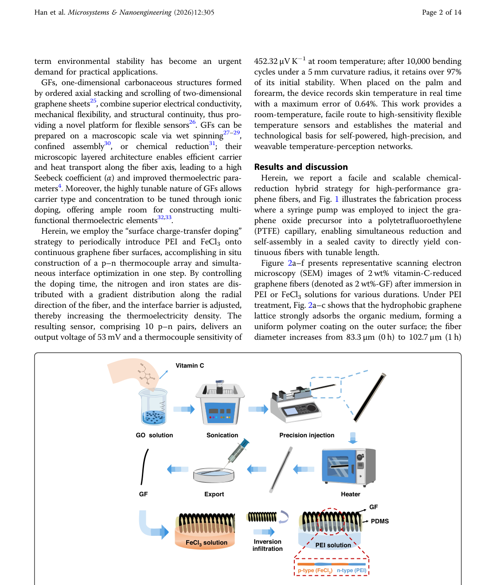
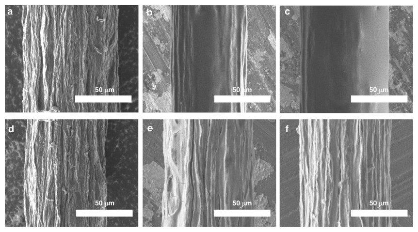
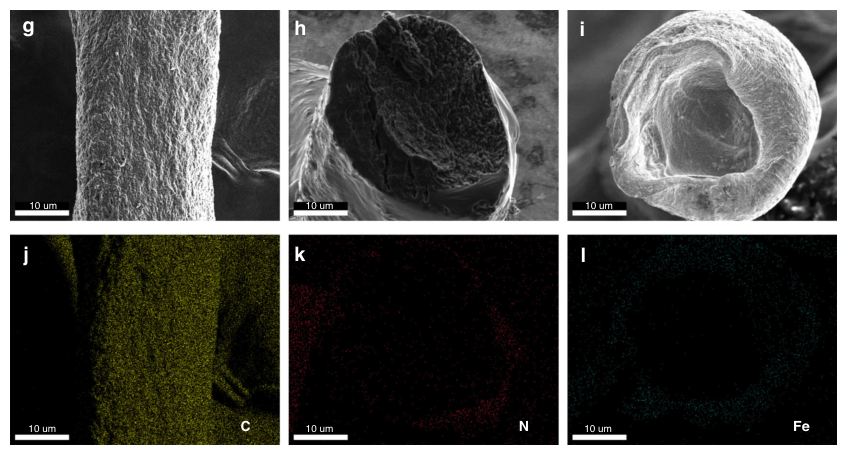
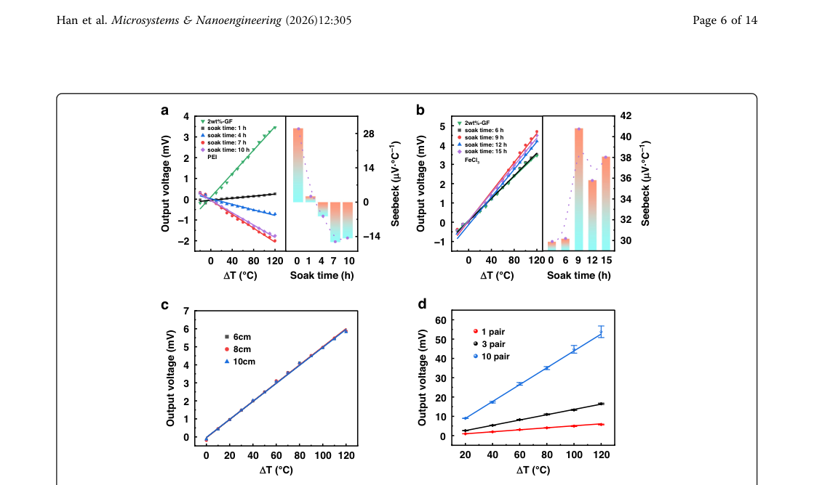
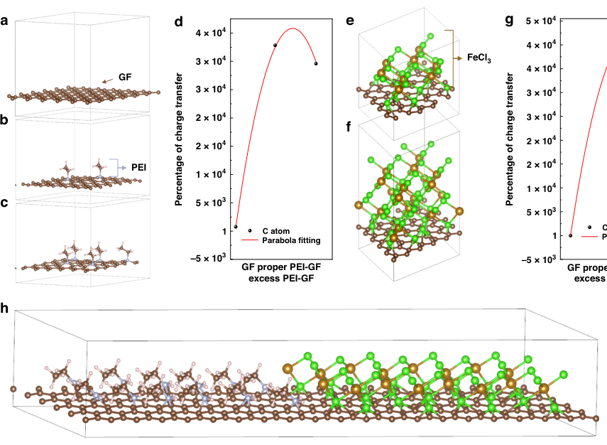
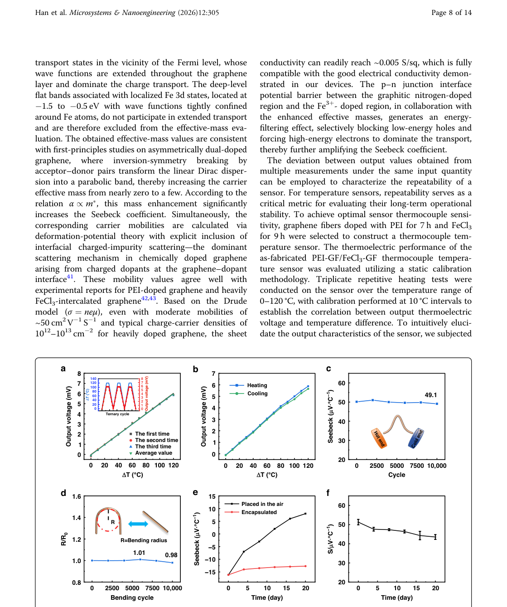
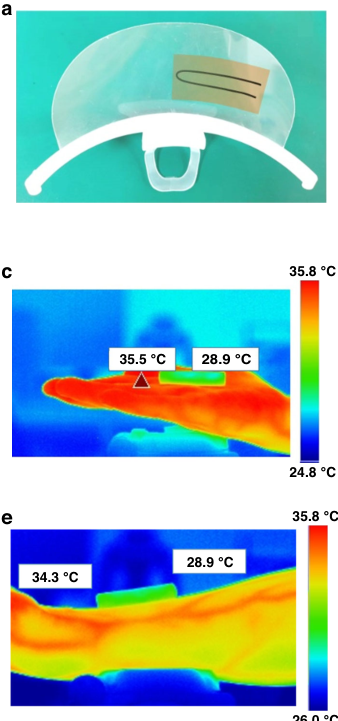

# Dual-doped all-graphene fiber for flexible, high-performance thermoelectric temperature sensing

- 期刊：Microsystems & Nanoengineering
- 日期：2026-08-25
- DOI：10.1038/s41378-026-01412-z
- 解析状态：fulltext_draft

## 摘要与研究价值

**Original:** Abstract High-performance temperature sensors are critical components for emerging Internet-of-Things and biomedical-electronics platforms. However, simultaneously achieving high sensitivity, mechanical compliance, and user-defined integrability remains a formidable materials-and-device challenge. Here, we report a continuous graphene fiber (GF) thermocouple technology where multiple p–n thermocouples are created in situ along a single, unbroken fiber while preserving its structural integrity. By periodically modulating surface charge-transfer doping with polyethyleneimine (PEI) and FeCl 3 , we formed an array of ten p–n pairs that delivered an exceptional thermocouple sensitivity of 452.32 µV K −1 . The device retained ~97.8% of its initial sensitivity after 10,000 bending cycles at a 5-mm radius, confirming robustness under repeated mechanical deformation. When deployed on skin, the sensor tracked dynamic body temperature variations with a measurement error of 0.64%, validating its practical value for real-time, non-invasive health monitoring. These results establish all-carbon GF thermocouples as a high-precision and mechanically adaptable temperature-sensing platform for next-generation wearable electronics and personalized healthcare systems.

**中文:** 可用于低离散/装配容差触觉界面的结构与对照设计；涉及坏点、漂移、跨器件迁移或少样本校准。摘要可核实数值包括：97.8%、0.64%。

## 创新点

- Abstract High-performance temperature sensors are critical components for emerging Internet-of-Things and biomedical-electronics platforms.
- 可用于低离散/装配容差触觉界面的结构与对照设计
- 涉及坏点、漂移、跨器件迁移或少样本校准
- 提供机器人、可穿戴或电子皮肤系统任务证据

## 对当前课题的启发

- 可用于低离散/装配容差触觉界面的结构与对照设计
- 涉及坏点、漂移、跨器件迁移或少样本校准
- 可对照 raw pixel、software feature 与 physical projection 的性能/通道/功耗

## 制备与实验步骤

### 1. 制备与实验操作

**Source:** p.12

**Original:** Materials and reagents GFs were synthesized via a confined hydrothermal assembly route assisted by vitamin C–mediated chemical reduction.

**中文:** 制备与实验操作步骤，关键配比、时间、温度和设备参数以 p.12 原文为准。

### 2. 材料混合与分散

**Source:** p.12

**Original:** In brief, 5 mL of a 12 mg mL−1 graphene oxide (GO) aqueous dispersion was sonicated for 30 min to eliminate aggregates.

**中文:** 材料混合与分散步骤，关键配比、时间、温度和设备参数以 p.12 原文为准。

### 3. 材料混合与分散

**Source:** p.12

**Original:** Subsequently, vitamin C (VC, 2 wt% with respect to GO) was added as a green reducing agent, and the mixture was stirred vigorously to ensure homogeneity.

**中文:** 材料混合与分散步骤，关键配比、时间、温度和设备参数以 p.12 原文为准。

### 4. 组装与封装

**Source:** p.12

**Original:** The degassed solution was then gently injected into a PTFE capillary; both ends were sealed, and the assembly was maintained at 150 °C for 2 h, enabling GO sheets to self-assemble into fibrillar architectures within the confined channel.

**中文:** 组装与封装步骤，关键配比、时间、温度和设备参数以 p.12 原文为准。

### 5. 组装与封装

**Source:** p.12

**Original:** Construction of periodic p–n type structure To engineer a graphene-fiber thermocouple sensor with periodically alternating p–n segments, 2 wt%-GF exhibiting the highest Seebeck coefficients was selected as the active fiber.

**中文:** 组装与封装步骤，关键配比、时间、温度和设备参数以 p.12 原文为准。

### 6. 材料混合与分散

**Source:** p.12

**Original:** A cylindrical PDMS support was first fabricated: PDMS prepolymer and curing agent were mixed at a 10:1 mass ratio, degassed under vacuum until bubble-free, poured into a cylindrical PTFE mold, degassed again, and cured at 60 °C for 3 h to yield a dense PDMS substrate as shown in Fig. S7.

**中文:** 材料混合与分散步骤，关键配比、时间、温度和设备参数以 p.12 原文为准。

### 7. 成膜与沉积

**Source:** p.12

**Original:** Although the current static soaking protocol is effective for laboratory-scale demonstration, it can be translated into a continuous roll-to-roll (R2R) process by unwinding the graphene fiber through sequential modular stations: selective dopant deposition via microfluidic patterning or aerosol-jet printing, in-line rapid curing to suppress interdiffusion, and rotary masking to ensure opposite-side PEI and FeCl3 coating.

**中文:** 成膜与沉积步骤，关键配比、时间、温度和设备参数以 p.12 原文为准。

### 8. 成膜与沉积

**Source:** p.12

**Original:** Sharp p–n boundaries can be preserved by employing segmented gasshielding masks or microfluidic channel isolation between the n-type and p-type deposition zones, thereby minimizing axial dopant diffusion.

**中文:** 成膜与沉积步骤，关键配比、时间、温度和设备参数以 p.12 原文为准。

## 方法原文锚点

**Source:** p.12 M001

**Original:** Materials and reagents GFs were synthesized via a confined hydrothermal assembly route assisted by vitamin C–mediated chemical reduction. In brief, 5 mL of a 12 mg mL−1 graphene oxide (GO) aqueous dispersion was sonicated for 30 min to eliminate aggregates. Subsequently, vitamin C (VC, 2 wt% with respect to GO) was added as a green reducing agent, and the mixture was stirred vigorously to ensure homogeneity. After 5 min of static equilibration, the suspension was degassed under vacuum to remove trapped air bubbles, guaranteeing dense and uniform fiber formation. The degassed solution was then gently injected into a PTFE capillary; both ends were sealed, and the assembly was maintained at 150 °C for 2 h, enabling GO sheets to self-assemble into fibrillar architectures within the confined channel. Owing to the presence of VC, the reaction temperature was deliberately lowered from the conventional 180 °C used for pure GO hydrothermal processing to prevent structural degradation. Upon completion, the resultant fibers were extracted from the PTFE tube and

**中文:** 该段已进入结构化方法步骤；完整逐段翻译待智能体精读补齐。

**Source:** p.12 M002

**Original:** dried under ambient conditions, which afforded graphene oxide fibers and VC-reduced graphene fibers, respectively.

**中文:** 该段已进入结构化方法步骤；完整逐段翻译待智能体精读补齐。

**Source:** p.12 M003

**Original:** Construction of periodic p–n type structure To engineer a graphene-fiber thermocouple sensor with periodically alternating p–n segments, 2 wt%-GF exhibiting the highest Seebeck coefficients was selected as the active fiber. A cylindrical PDMS support was first fabricated: PDMS prepolymer and curing agent were mixed at a 10:1 mass ratio, degassed under vacuum until bubble-free, poured into a cylindrical PTFE mold, degassed again, and cured at 60 °C for 3 h to yield a dense PDMS substrate as shown in Fig. S7. The 2 wt%-GF was then uniformly wound around the PDMS cylinder, and its two ends were subjected to spatially selective doping: one tip was immersed in 30 wt % PEI solution for n-type doping, while the opposite tip was immersed in 45 wt% FeCl3 solution for p-type doping. Doping durations were systematically varied (1, 4, 7, 10 h for PEI; 6, 9, 12, 15 h for FeCl3) to optimize carrier type and concentration. After doping, the fiber was dried on a 50 °C hot plate for 15 min. This protocol creates axially periodic and well-ordered p-type and n-type domains along a single continuous graphene fiber, affording a graphene-fiber thermocouple temperature sensor with tailored thermoelectric response. Although the current static soaking protocol is effective for laboratory-scale demonstration, it can be translated into a continuous roll-to-roll (R2R) process by unwinding the graphene fiber through sequential modular stations: selective dopant deposition via microfluidic patterning or aerosol-jet printing, in-line rapid curing to suppress interdiffusion, and rotary masking to ensure opposite-side PEI and FeCl3 coating. Sharp p–n boundaries can be preserved by employing segmented gasshielding masks or microfluidic channel isolation between the n-type and p-type deposition zones, thereby minimizing axial dopant diffusion. This R2R-compatible strategy has been demonstrated for continuous carbon-nanotube fiber electronics, confirming the scalability of the present approach47.

**中文:** 该段已进入结构化方法步骤；完整逐段翻译待智能体精读补齐。

**Source:** p.12 M004

**Original:** Characterization and measurements Morphological characterization of graphene fibers was performed using a field-emission scanning electron microscope (FESEM, SU-8010, Hitachi, Tokyo, Japan). Raman spectra were acquired with a laser Raman spectrometer (HR800, Horiba Jobin Yvon, Paris, France). Surface chemistry and electronic structure were analyzed by X-ray photoelectron spectroscopy (XPS, ESCALAB Xi+, Thermo Fisher, Waltham, MA, USA). Electrical conductivity was measured with a digital source meter (2450, Keithley, Beaverton, OR, USA), while output voltage was recorded by a data acquisition unit (LR8450, HIOKI, Nagano, Japan). The temperature difference between the hot and cold junctions

**中文:** 该段已进入结构化方法步骤；完整逐段翻译待智能体精读补齐。

**Source:** p.13 M005

**Original:** Han et al. Microsystems & Nanoengineering (2026) 12:305 Page 13 of 14

**中文:** 该段已进入结构化方法步骤；完整逐段翻译待智能体精读补齐。

**Source:** p.13 M006

**Original:** of the sensor was determined from infrared thermal images captured by an IR camera (Fotric 225 s).

**中文:** 该段已进入结构化方法步骤；完整逐段翻译待智能体精读补齐。

## 图表解读

### Fig. 1

**Source:** p.2

**Original caption:** Fig. 1 Schematic illustration of the fabrication process of an all-graphene p-n thermocouple by region-speecific doping. GO solution is prepared with Vitamin C, followed by sonication and precision injection into a tubular mold. After thermal reduction, the resultion GF undergress inversion infiltration and selective immersion in FeCl3 solution to achieve p-type doping, while the adjacent region is n-type doped with PEI, yielding a GF composite with spatially separated p-n thermocouple

**中文图注:** Fig. 1 原始图注已提取；逐项含义见下方分图说明。

**Reading note:** 重点查看器件结构、材料层次、信号路径和制备流程。

### Fig. 2

**Source:** p.3

**Original caption:** Fig. 2 SEM micrographs and Raman spectra of doped graphene fibers. a–c Surface morphology evolution of pristine GF, 4h-PEI-GF, and 10h-PEIGF. d–f Morphology changes in pristine GF, 9h-FeCl3-GF, and 15h-FeCl3-GF. g, h Raman spectra showing D and G bands. i ID/IG ratios indicating defect evolution with doping time

**中文图注:** Fig. 2 原始图注已提取；逐项含义见下方分图说明。

**Reading note:** 结合正文首次引用位置和原始图注核对该图的证据角色。

- (a-c) 结合正文首次引用位置和原始图注核对该图的证据角色。 原文：Surface morphology evolution of pristine GF, 4h-PEI-GF, and 10h-PEIGF
- (d-f) 结合正文首次引用位置和原始图注核对该图的证据角色。 原文：Morphology changes in pristine GF, 9h-FeCl3-GF, and 15h-FeCl3-GF
- (g,h) 结合正文首次引用位置和原始图注核对该图的证据角色。 原文：Raman spectra showing D and G bands
- (i) 结合正文首次引用位置和原始图注核对该图的证据角色。 原文：ID/IG ratios indicating defect evolution with doping time

### Fig. 3

**Source:** p.4

**Original caption:** Fig. 3 XPS and STEM-EDS characterization of doped graphene fibers. a Survey XPS spectra of PEI-GF. b–e High-resolution N1s spectra showing pyridinic, pyrrolic, and graphitic nitrogen components. f Survey spectra of FeCl3-GF revealing Fe incorporation. SEM and STEM-EDS images of g, j pristine GF, h, k PEI-infiltrated GF, and i, l FeCl3-infiltrated GF. SEM images show the axial (g) and radial cross-sectional (h, i) morphologies

**中文图注:** Fig. 3 原始图注已提取；逐项含义见下方分图说明。

**Reading note:** 重点查看阵列规模、空间分辨率、串扰、读出通道和空间特征表达。

- (a) 结合正文首次引用位置和原始图注核对该图的证据角色。 原文：Survey XPS spectra of PEI-GF
- (b-e) 结合正文首次引用位置和原始图注核对该图的证据角色。 原文：High-resolution N1s spectra showing pyridinic, pyrrolic, and graphitic nitrogen components
- (f) 重点查看阵列规模、空间分辨率、串扰、读出通道和空间特征表达。 原文：Survey spectra of FeCl3-GF revealing Fe incorporation. SEM and STEM-EDS images of g, j pristine GF, h, k PEI-infiltrated GF, and i, l FeCl3-infiltrated GF. SEM images show the axial (g) and radial cross-sectional (h, i) morphologies

### Fig. 4

**Source:** p.6

**Original caption:** Fig. 4 Thermoelectric and NTC characteristics of graphene fiber sensors. a, b Output voltage and Seebeck coefficients of PEI-GF and FeCl3-GF thermocouples. c Length-independent thermocouple sensitivity. d Linear scalability with p–n couple number

**中文图注:** Fig. 4 原始图注已提取；逐项含义见下方分图说明。

**Reading note:** 重点查看标定方法、量程、误差、线性和动态响应，避免只比较单一灵敏度。

- (a,b) 结合正文首次引用位置和原始图注核对该图的证据角色。 原文：Output voltage and Seebeck coefficients of PEI-GF and FeCl3-GF thermocouples
- (c) 重点查看标定方法、量程、误差、线性和动态响应，避免只比较单一灵敏度。 原文：Length-independent thermocouple sensitivity
- (d) 结合正文首次引用位置和原始图注核对该图的证据角色。 原文：Linear scalability with p–n couple number

### Fig. 5

**Source:** p.7

**Original caption:** Fig. 5 DFT models and charge transfer analysis. a–c, e, f, h Atomic structure models of pristine graphene film (GF), polyethyleneiminefunctionalized graphene (PEI-GF), ferric chloride-functionalized graphene (FeCl3-GF), and PEI/FeCl3-GF p-n heterojunction, where brown, pink, blue, green, and orange spheres represent carbon, hydrogen, nitrogen, chlorine, and iron atoms, respectively. d, g Bader charge analysis quantitatively revealing the charge transfer efficiency between dopants and graphene and its concentration dependence

**中文图注:** Fig. 5 原始图注已提取；逐项含义见下方分图说明。

**Reading note:** 重点查看器件结构、材料层次、信号路径和制备流程。

- (a-c) 重点查看器件结构、材料层次、信号路径和制备流程。 原文：e, f, h Atomic structure models of pristine graphene film (GF), polyethyleneiminefunctionalized graphene (PEI-GF), ferric chloride-functionalized graphene (FeCl3-GF), and PEI/FeCl3-GF p-n heterojunction, where brown, pink, blue, green, and orange spheres represent carbon, hydrogen, nitrogen, chlorine, and iron atoms, respectively
- (d,g) 结合正文首次引用位置和原始图注核对该图的证据角色。 原文：Bader charge analysis quantitatively revealing the charge transfer efficiency between dopants and graphene and its concentration dependence

### Fig. 6

**Source:** p.8

**Original caption:** Fig. 6 Sensor stability and durability tests. a Triplicate heating repeatability with fitted curves. b Hysteresis error (4.27%). c, d Mechanical stability over 10,000 bending cycles for sensitivity and resistance. e Long-term Seebeck evolution with/without encapsulation. f 20-day sensitivity retention of encapsulated device (87.6%)

**中文图注:** Fig. 6 原始图注已提取；逐项含义见下方分图说明。

**Reading note:** 重点查看标定方法、量程、误差、线性和动态响应，避免只比较单一灵敏度。

- (a) 结合正文首次引用位置和原始图注核对该图的证据角色。 原文：Triplicate heating repeatability with fitted curves
- (b) 重点查看标定方法、量程、误差、线性和动态响应，避免只比较单一灵敏度。 原文：Hysteresis error (4.27%)
- (c,d) 重点查看标定方法、量程、误差、线性和动态响应，避免只比较单一灵敏度。 原文：Mechanical stability over 10,000 bending cycles for sensitivity and resistance
- (e) 结合正文首次引用位置和原始图注核对该图的证据角色。 原文：Long-term Seebeck evolution with/without encapsulation
- (f) 重点查看标定方法、量程、误差、线性和动态响应，避免只比较单一灵敏度。 原文：20-day sensitivity retention of encapsulated device (87.6%)

### Fig. 7

**Source:** p.11

**Original caption:** Fig. 7 The practical applications of the thermocouple sensor. a Schematic illustration of the thermocouple attached to the inner surface of a face mask. b Response and recovery times extracted from consecutive respiration cycles (cycles 3–7) using the 10–90% threshold criterion. Inset: thermoelectric voltage signal generated during periodic breathing. c, e Infrared thermographs of the 10-couple thermocouple for temperature detection on the human palm and forearm, respectively. d, f Cyclic output voltage results when the sensor is placed on the palm and forearm, respectively

**中文图注:** Fig. 7 原始图注已提取；逐项含义见下方分图说明。

**Reading note:** 重点查看器件结构、材料层次、信号路径和制备流程。

- (a) 重点查看器件结构、材料层次、信号路径和制备流程。 原文：Schematic illustration of the thermocouple attached to the inner surface of a face mask
- (b) 重点查看标定方法、量程、误差、线性和动态响应，避免只比较单一灵敏度。 原文：Response and recovery times extracted from consecutive respiration cycles (cycles 3–7) using the 10–90% threshold criterion. Inset: thermoelectric voltage signal generated during periodic breathing
- (c,e) 结合正文首次引用位置和原始图注核对该图的证据角色。 原文：Infrared thermographs of the 10-couple thermocouple for temperature detection on the human palm and forearm, respectively. d, f Cyclic output voltage results when the sensor is placed on the palm and forearm, respectively
