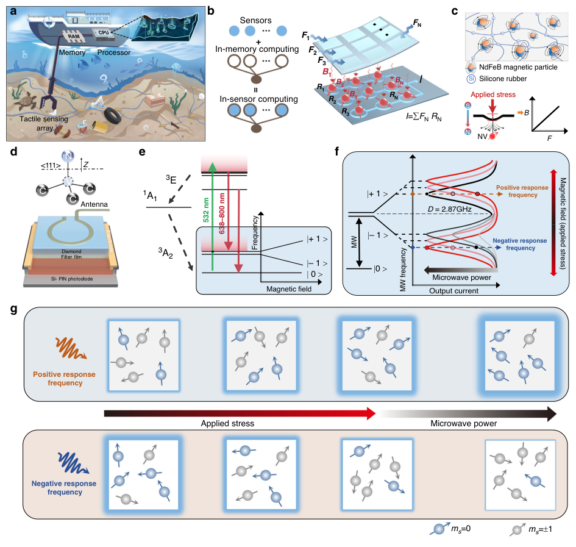
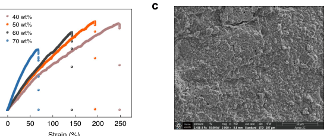
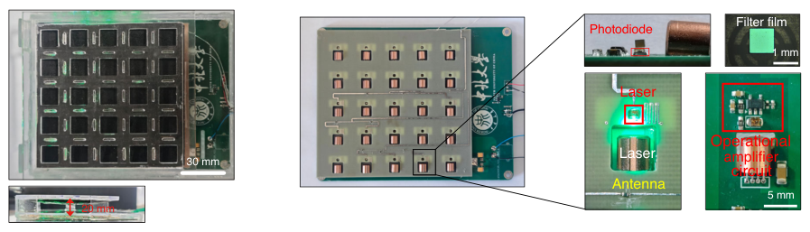
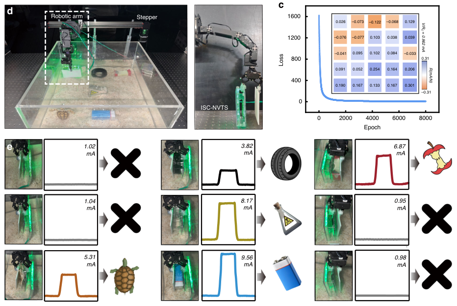

# Spin-based in-sensor computing magnetic tactile sensor for rapid identification of underwater targets

- 期刊：Microsystems & Nanoengineering
- 日期：2026-08-25
- DOI：10.1038/s41378-026-01423-w
- 解析状态：fulltext_draft

## 摘要与研究价值

**Original:** PDF/题录未提供摘要。

**中文:** 涉及 in-sensor/物理计算或可编程触觉前端。当前未从摘要提取到可比较数值。

## 创新点

- 当前仅获得题录信息，需要打开 DOI/原文核实机制、实验和性能指标。
- 涉及 in-sensor/物理计算或可编程触觉前端

## 对当前课题的启发

- 涉及 in-sensor/物理计算或可编程触觉前端
- 可对照 raw pixel、software feature 与 physical projection 的性能/通道/功耗
- 把文中的传感/计算耦合机制映射为可编程物理投影核，增加原始像素、软件投影和硬件投影三组严格消融。

## 制备与实验步骤

### 1. 制备与实验操作

**Source:** p.10

**Original:** Device fabrication The force-magnetic information coupling film of the ISC-NVTS was fabricated by compositing NdFeB magnetic particles with a flexible silicone matrix (Ecoflex 00-30 B).

**中文:** 制备与实验操作步骤，关键配比、时间、温度和设备参数以 p.10 原文为准。

### 2. 材料混合与分散

**Source:** p.10

**Original:** During material preparation, the silicone matrix and NdFeB magnetic powder were first mixed in proportion.

**中文:** 材料混合与分散步骤，关键配比、时间、温度和设备参数以 p.10 原文为准。

### 3. 材料混合与分散

**Source:** p.10

**Original:** Fumed silica was added to improve dispersion and adjust viscosity.

**中文:** 材料混合与分散步骤，关键配比、时间、温度和设备参数以 p.10 原文为准。

### 4. 材料混合与分散

**Source:** p.10

**Original:** After thorough mixing via stirring, casting, leveling, and heat curing, a flexible film with uniform thickness was obtained.

**中文:** 材料混合与分散步骤，关键配比、时间、温度和设备参数以 p.10 原文为准。

### 5. 固化与热处理

**Source:** p.10

**Original:** After irradiation with a 10 MeV electron beam for 4 hours and annealing at 850°C for 2 hours, the nitrogenvacancy concentration in the diamond was approximately 0.8 ppm.

**中文:** 固化与热处理步骤，关键配比、时间、温度和设备参数以 p.10 原文为准。

## 方法原文锚点

**Source:** p.10 M001

**Original:** Device fabrication The force-magnetic information coupling film of the ISC-NVTS was fabricated by compositing NdFeB magnetic particles with a flexible silicone matrix (Ecoflex 00-30 B). During material preparation, the silicone matrix and NdFeB magnetic powder were first mixed in proportion. Fumed silica was added to improve dispersion and adjust viscosity. Subsequently, SE1700 and a catalyst were added to promote crosslinking and curing. After thorough mixing via stirring, casting, leveling, and heat curing, a flexible film with uniform thickness was obtained. Finally, a highstrength pulsed magnetic field of 2 T was applied for vertical magnetization, forming a magnetic film structure with a clear dipole orientation. For the diamond NV magnetic sensing unit array in the ISC-NVTS, the diamond raw material was sourced from Element Six, using the high-temperature high-pressure CD1010 (111) type with a nitrogen content of 100 ppm. After irradiation with a 10 MeV electron beam for 4 hours and annealing at 850°C for 2 hours, the nitrogenvacancy concentration in the diamond was approximately 0.8 ppm. The filter film selected was an OD3 short-pass filter for 600–800 nm. The laser model is GH15130C8C. The photodetector module utilizes a TEMD5010X01 Si-Pin photodiode, and to reduce power consumption, its output employs a two-stage operational amplifier design. Firstly, an OPA380 operational amplifier (GAIN BANDWIDTH: 90 MHz), which boasts high bandwidth, is used to perform the first amplification of the Si-Pin photodiode’s output, enabling it to execute artificial neural network classification algorithms at μA level current. Subsequently, an OPA323 operational amplifier (GAIN BANDWIDTH: 20 MHz), which offers cost advantages, is employed for the second amplification of the operational results, thereby increasing the output amplitude of the device for detection purposes. The ISC-NVTS antenna (Supplementary Fig. 19) adopts a dual-layer structure with a total thickness of 800 μm, capable of simultaneously radiating microwave signals of two different frequencies. The coupling effect of the array elements of the antenna was simulated (Supplementary Fig. 20). The maximum coupling S(3,2)

**中文:** 该段已进入结构化方法步骤；完整逐段翻译待智能体精读补齐。

**Source:** p.11 M002

**Original:** Gao et al. Microsystems & Nanoengineering (2026) 12:304 Page 11 of 12

**中文:** 该段已进入结构化方法步骤；完整逐段翻译待智能体精读补齐。

**Source:** p.11 M003

**Original:** parameter between adjacent antennas at a frequency of 2.87 GHz is −37.2 dB. The microwave generation module incorporates two customized integrated fixedfrequency microwave generators (Supplementary Fig. 21) with a power consumption of 3.54 W. These generators provide microwave signals of different frequencies to the antenna, enabling the adjustment of responsivity for different polarities of the diamond NV color center tactile sensing unit. The adjustment of the responsivity intensity of the sensing unit is achieved by altering the impedance of the antenna unit, and secondary precise adjustment can be achieved by adjusting the amplification factor of the operational amplifier in the photodetection module.

**中文:** 该段已进入结构化方法步骤；完整逐段翻译待智能体精读补齐。

**Source:** p.11 M004

**Original:** Experimental setup The output channels of the ISC-NVTS were all equipped with current-to-voltage conversion circuits. All data were tested using a Tektronix MDO4104C oscilloscope.

**中文:** 该段已进入结构化方法步骤；完整逐段翻译待智能体精读补齐。

## 图表解读

### Fig. 1

**Source:** p.3

**Original caption:** Fig. 1 Overview of the wireless in-sensor computing magnetic tactile sensor (ISC-NVTS) for underwater use. a A typical underwater tactile sensing system. The serial sensing/storage/computation working mode leads to low efficiency, and the electronic tactile sensing elements and wired connection structures directly exposed to water impose stringent requirements on packaging quality. b Schematic of the ISC-NVTS structure: a diamond tactile sensing unit array (connected in parallel) composed of a force-magnetic coupling layer and a magnetic information sensingprocessing layer, performing real-time computation:I = ∑FNRN. c Schematic of the force-magnetic coupling layer structure: NdFeB magnetic particles dispersed in a polymer silicone matrix. The magnetization direction is perpendicular to the top surface, enabling highly linear force-to-magnetic information conversion. d Schematic of the diamond NV center magnetic sensing unit structure, consisting of an antenna, diamond (<111> orientation), filter film, and Si-PIN photodetector. e Energy level diagram of the NV center, showing a triplet state. f Mechanism of ultra-fast response and adjustable responsivity for the diamond NV center magnetic sensing unit. The high linearity of the optically detected magnetic resonance (ODMR) output curve is utilized to achieve ultra-fast magnetic detection using a fixed-frequency mode; multi-parameter control of microwave frequency/power intervenes in the NV center electron spin resonance process, enabling positive/negative and magnitude adjustment of the sensing unit’s magnetic (stress) responsivity. g Electron spin state distribution in diamond under different applied stresses and microwave conditions, illustrating the adjustable stress responsivity characteristic of the sensing unit

**中文图注:** Fig. 1 原始图注已提取；逐项含义见下方分图说明。

**Reading note:** 重点查看器件结构、材料层次、信号路径和制备流程。

- (a) 重点查看器件结构、材料层次、信号路径和制备流程。 原文：A typical underwater tactile sensing system. The serial sensing/storage/computation working mode leads to low efficiency, and the electronic tactile sensing elements and wired connection structures directly exposed to water impose stringent requirements on packaging quality
- (b) 重点查看器件结构、材料层次、信号路径和制备流程。 原文：Schematic of the ISC-NVTS structure: a diamond tactile sensing unit array (connected in parallel) composed of a force-magnetic coupling layer and a magnetic information sensingprocessing layer, performing real-time computation:I = ∑FNRN
- (c) 重点查看器件结构、材料层次、信号路径和制备流程。 原文：Schematic of the force-magnetic coupling layer structure: NdFeB magnetic particles dispersed in a polymer silicone matrix. The magnetization direction is perpendicular to the top surface, enabling highly linear force-to-magnetic information conversion
- (d) 重点查看器件结构、材料层次、信号路径和制备流程。 原文：Schematic of the diamond NV center magnetic sensing unit structure, consisting of an antenna, diamond (<111> orientation), filter film, and Si-PIN photodetector
- (e) 结合正文首次引用位置和原始图注核对该图的证据角色。 原文：Energy level diagram of the NV center, showing a triplet state
- (f) 重点查看标定方法、量程、误差、线性和动态响应，避免只比较单一灵敏度。 原文：Mechanism of ultra-fast response and adjustable responsivity for the diamond NV center magnetic sensing unit. The high linearity of the optically detected magnetic resonance (ODMR) output curve is utilized to achieve ultra-fast magnetic detection using a fixed-frequency mode; multi-parameter control of microwave frequency/power intervenes in the NV center electron spin resonance process, enabling positive/negative and magnitude adjustment of the sensing unit’s magnetic (stress) responsivity
- (g) 结合正文首次引用位置和原始图注核对该图的证据角色。 原文：Electron spin state distribution in diamond under different applied stresses and microwave conditions, illustrating the adjustable stress responsivity characteristic of the sensing unit

### Fig. 2

**Source:** p.6

**Original caption:** Fig. 2 Performance characterization of the diamond NV center tactile sensing unit. a Room-temperature magnetic hysteresis loops of flexible magnetic films with different magnetic particle contents. Saturation magnetization increases significantly with higher particle concentration, while coercivity remains relatively stable. b Stress-strain curves of flexible magnetic films with different magnetic particle contents. Higher particle content results in steeper curves and higher Young’s modulus, indicating greater rigidity. c SEM image of a sample with 60 wt% magnetic particle content. d ODMR frequency-sweep outputs of the sensing unit under different loading forces. Selecting different working frequencies enables positive or negative responses. e Determination of the optimal working frequency. The highly linear regions on both sides of the Lorentzian trough in the ODMR output curve are selected as the sensor’s output response curves. f Relationship between the trough current Ict of the leftmost Lorentzian trough and the loading force. g Relationship between the current difference ΔI (Ict minus baseline current) and microwave power, demonstrating the adjustable magnitude of the sensing unit’s tactile responsivity. h Output response curves of the sensing unit at the positive/negative response frequency under different microwave powers. i Magnetic field noise spectral density of the sensing unit

**中文图注:** Fig. 2 原始图注已提取；逐项含义见下方分图说明。

**Reading note:** 重点查看标定方法、量程、误差、线性和动态响应，避免只比较单一灵敏度。

- (a) 结合正文首次引用位置和原始图注核对该图的证据角色。 原文：Room-temperature magnetic hysteresis loops of flexible magnetic films with different magnetic particle contents. Saturation magnetization increases significantly with higher particle concentration, while coercivity remains relatively stable
- (b) 结合正文首次引用位置和原始图注核对该图的证据角色。 原文：Stress-strain curves of flexible magnetic films with different magnetic particle contents. Higher particle content results in steeper curves and higher Young’s modulus, indicating greater rigidity
- (c) 重点查看阵列规模、空间分辨率、串扰、读出通道和空间特征表达。 原文：SEM image of a sample with 60 wt% magnetic particle content
- (d) 重点查看标定方法、量程、误差、线性和动态响应，避免只比较单一灵敏度。 原文：ODMR frequency-sweep outputs of the sensing unit under different loading forces. Selecting different working frequencies enables positive or negative responses
- (e) 重点查看标定方法、量程、误差、线性和动态响应，避免只比较单一灵敏度。 原文：Determination of the optimal working frequency. The highly linear regions on both sides of the Lorentzian trough in the ODMR output curve are selected as the sensor’s output response curves
- (f) 重点查看标定方法、量程、误差、线性和动态响应，避免只比较单一灵敏度。 原文：Relationship between the trough current Ict of the leftmost Lorentzian trough and the loading force
- (g) 结合正文首次引用位置和原始图注核对该图的证据角色。 原文：Relationship between the current difference ΔI (Ict minus baseline current) and microwave power, demonstrating the adjustable magnitude of the sensing unit’s tactile responsivity
- (h) 重点查看标定方法、量程、误差、线性和动态响应，避免只比较单一灵敏度。 原文：Output response curves of the sensing unit at the positive/negative response frequency under different microwave powers
- (i) 结合正文首次引用位置和原始图注核对该图的证据角色。 原文：Magnetic field noise spectral density of the sensing unit

### Fig. 3

**Source:** p.7

**Original caption:** Fig. 3 Hardware implementation of the ISC-NVTS. a Macroscopic image of the ISC-NVTS. Scale bar: 30 mm. The enlarged view shows a single diamond NV center tactile sensing unit. Scale bar: 5 mm. The scale bar of the diamond filter film image is 1 mm. b Circuit connection scheme of the ISC-NVTS. The array scale is 5 × 5, with zero-offset compensation achieved via a compensation resistor. c Initial responsivity distribution (at 25 dBm) of the 25 diamond NV center tactile sensing units in the ISC-NVTS, with consistency evaluation. d Response time of a diamond NV center tactile sensing unit. e Response time of a diamond NV center magnetic sensing unit. f Output stability of the ISC-NVTS over 200 s. g Relationship between magnetic field strength and distance for the force-magnetic information coupling film of the ISC-NVTS

**中文图注:** Fig. 3 原始图注已提取；逐项含义见下方分图说明。

**Reading note:** 重点查看标定方法、量程、误差、线性和动态响应，避免只比较单一灵敏度。

- (a) 重点查看阵列规模、空间分辨率、串扰、读出通道和空间特征表达。 原文：Macroscopic image of the ISC-NVTS. Scale bar: 30 mm. The enlarged view shows a single diamond NV center tactile sensing unit. Scale bar: 5 mm. The scale bar of the diamond filter film image is 1 mm
- (b) 重点查看阵列规模、空间分辨率、串扰、读出通道和空间特征表达。 原文：Circuit connection scheme of the ISC-NVTS. The array scale is 5 × 5, with zero-offset compensation achieved via a compensation resistor
- (c) 结合正文首次引用位置和原始图注核对该图的证据角色。 原文：Initial responsivity distribution (at 25 dBm) of the 25 diamond NV center tactile sensing units in the ISC-NVTS, with consistency evaluation
- (d) 重点查看标定方法、量程、误差、线性和动态响应，避免只比较单一灵敏度。 原文：Response time of a diamond NV center tactile sensing unit
- (e) 重点查看标定方法、量程、误差、线性和动态响应，避免只比较单一灵敏度。 原文：Response time of a diamond NV center magnetic sensing unit
- (f) 结合正文首次引用位置和原始图注核对该图的证据角色。 原文：Output stability of the ISC-NVTS over 200 s
- (g) 重点查看标定方法、量程、误差、线性和动态响应，避免只比较单一灵敏度。 原文：Relationship between magnetic field strength and distance for the force-magnetic information coupling film of the ISC-NVTS

### Fig. 4

**Source:** p.9

**Original caption:** Fig. 4 ISC-NVTS for underwater tactile recognition. a Robotic arm integrated with the ISC-NVTS, enabling perception and recognition of marine organisms and debris. b Five typical marine organisms and debris, with training feature labels set as: tire (3–4.5 mA), sea turtle (4.5-6 mA), apple (6–7.5 mA), reagent bottle (7.5–9 mA), battery (9–10.5 mA). c Loss function variation over 8000 epochs. The inset shows the responsivity distribution obtained from training the ISC-NVTS. d Photograph of the constructed underwater tactile recognition simulation experimental system. e Left: photos of recognition targets in an underwater 5 × 5 grid. Middle: corresponding ISC-NVTS output currents. Right: recognition results. f Distribution of labeled recognition currents for 1000 trials under 0.1 random noise, showing a recognition rate of 95.1%

**中文图注:** Fig. 4 原始图注已提取；逐项含义见下方分图说明。

**Reading note:** 重点查看任务设置、基线、消融和失败案例，判断系统演示是否真正支撑前端价值。

- (a) 重点查看任务设置、基线、消融和失败案例，判断系统演示是否真正支撑前端价值。 原文：Robotic arm integrated with the ISC-NVTS, enabling perception and recognition of marine organisms and debris
- (b) 结合正文首次引用位置和原始图注核对该图的证据角色。 原文：Five typical marine organisms and debris, with training feature labels set as: tire (3–4.5 mA), sea turtle (4.5-6 mA), apple (6–7.5 mA), reagent bottle (7.5–9 mA), battery (9–10.5 mA)
- (c) 结合正文首次引用位置和原始图注核对该图的证据角色。 原文：Loss function variation over 8000 epochs. The inset shows the responsivity distribution obtained from training the ISC-NVTS
- (d) 重点查看任务设置、基线、消融和失败案例，判断系统演示是否真正支撑前端价值。 原文：Photograph of the constructed underwater tactile recognition simulation experimental system
- (e) 重点查看任务设置、基线、消融和失败案例，判断系统演示是否真正支撑前端价值。 原文：Left: photos of recognition targets in an underwater 5 × 5 grid. Middle: corresponding ISC-NVTS output currents. Right: recognition results
- (f) 重点查看任务设置、基线、消融和失败案例，判断系统演示是否真正支撑前端价值。 原文：Distribution of labeled recognition currents for 1000 trials under 0.1 random noise, showing a recognition rate of 95.1%
