# Single bi-functional flexible sensor device for simultaneous pH and oxygen monitoring during pre-transplant normothermic perfusion

- 期刊：Microsystems & Nanoengineering
- 日期：2026-08-28
- DOI：10.1038/s41378-026-01396-w
- 解析状态：fulltext_draft

## 摘要与研究价值

**Original:** PDF/题录未提供摘要。

**中文:** 与柔性触觉相关，但尚未显示对前端触觉计算的直接贡献。当前未从摘要提取到可比较数值。

## 创新点

- 当前仅获得题录信息，需要打开 DOI/原文核实机制、实验和性能指标。
- 与柔性触觉相关，但尚未显示对前端触觉计算的直接贡献

## 对当前课题的启发

- 提供机器人、可穿戴或电子皮肤系统任务证据

## 制备与实验步骤

### 1. 组装与封装

**Source:** p.3

**Original:** Choice of sensor matrix and sensor probes A polyurethane-based hydrogel (HydroMed D4 from AdvanSource Biomaterials) was selected as the sensor matrix to encapsulate the sensor probes.

**中文:** 组装与封装步骤，关键配比、时间、温度和设备参数以 p.3 原文为准。

### 2. 材料混合与分散

**Source:** p.3

**Original:** The HydroMed D4 is dissolved in ethanol for its development.

**中文:** 材料混合与分散步骤，关键配比、时间、温度和设备参数以 p.3 原文为准。

### 3. 组装与封装

**Source:** p.3

**Original:** fluorescent particles/ complex, are introduced into the hydrogel solution to form an integrated system of sensing elements encapsulated in a sensor matrix.

**中文:** 组装与封装步骤，关键配比、时间、温度和设备参数以 p.3 原文为准。

### 4. 组装与封装

**Source:** p.3

**Original:** The hydrogel layers encapsulating the sensor probes have a lifetime of more than 40 days30.

**中文:** 组装与封装步骤，关键配比、时间、温度和设备参数以 p.3 原文为准。

### 5. 组装与封装

**Source:** p.3

**Original:** Hence, proper encapsulation of the pyranine in the sensor matrix is of utmost importance.

**中文:** 组装与封装步骤，关键配比、时间、温度和设备参数以 p.3 原文为准。

### 6. 固化与热处理

**Source:** p.3

**Original:** Fabrication of sensors For successful fabrication of the sensors, a lubricious hydrophilic polyurethane, HydroMed D4 was procured from AdvanSource Biomaterials, 8-Hydroxypyrene-1,3,6trisulfonic acid (HPTS) and Dichlorotris (1,10-phenanthroline) ruthenium (II) hydrate was procured from Merck Sigma.

**中文:** 固化与热处理步骤，关键配比、时间、温度和设备参数以 p.3 原文为准。

### 7. 制备与实验操作

**Source:** p.3

**Original:** Fabrication of pH-sensing layers The fabrication of the pH sensor is shown in Fig. 2.

**中文:** 制备与实验操作步骤，关键配比、时间、温度和设备参数以 p.3 原文为准。

### 8. 材料混合与分散

**Source:** p.3

**Original:** 35 mg HPTS (pyranine) was dissolved in 100 ml DM water and the microbead solution was added to it.

**中文:** 材料混合与分散步骤，关键配比、时间、温度和设备参数以 p.3 原文为准。

### 9. 材料混合与分散

**Source:** p.3

**Original:** The resulting solution was stirred for 15 h at 400 rpm.

**中文:** 材料混合与分散步骤，关键配比、时间、温度和设备参数以 p.3 原文为准。

### 10. 材料混合与分散

**Source:** p.3

**Original:** The hydrogel matrix was prepared by dissolving 1 g HydroMed D4 precursor into 10 ml 90% ethanol.

**中文:** 材料混合与分散步骤，关键配比、时间、温度和设备参数以 p.3 原文为准。

### 11. 材料混合与分散

**Source:** p.3

**Original:** The solution was stirred for about 6 h to get a uniform hydrogel solution.

**中文:** 材料混合与分散步骤，关键配比、时间、温度和设备参数以 p.3 原文为准。

### 12. 材料混合与分散

**Source:** p.3

**Original:** The mixture was stirred for 6 h to get a welldispersed profile of microbeads in the hydrogel.

**中文:** 材料混合与分散步骤，关键配比、时间、温度和设备参数以 p.3 原文为准。

### 13. 图形化与结构成形

**Source:** p.3

**Original:** The solution was then drop-casted over a glass slide, followed by drying at room temperature to prepare the pH-sensing layer.

**中文:** 图形化与结构成形步骤，关键配比、时间、温度和设备参数以 p.3 原文为准。

### 14. 制备与实验操作

**Source:** p.3

**Original:** Fabrication of oxygen-sensing layers Dichlorotris (1,10-phenanthroline) ruthenium (II) hydrate was selected as the precursor for fabrication of the oxygen sensor, shown in Fig. 3.

**中文:** 制备与实验操作步骤，关键配比、时间、温度和设备参数以 p.3 原文为准。

### 15. 材料混合与分散

**Source:** p.3

**Original:** 50 mg of the ruthenium complex was dissolved in 10 ml solution of methanol and toluene (4:1).

**中文:** 材料混合与分散步骤，关键配比、时间、温度和设备参数以 p.3 原文为准。

### 16. 材料混合与分散

**Source:** p.3

**Original:** The solution was stirred for 1 h at 100 rpm.

**中文:** 材料混合与分散步骤，关键配比、时间、温度和设备参数以 p.3 原文为准。

## 方法原文锚点

**Source:** p.3 M001

**Original:** Choice of sensor matrix and sensor probes

**中文:** 该段已进入结构化方法步骤；完整逐段翻译待智能体精读补齐。

**Source:** p.3 M002

**Original:** A polyurethane-based hydrogel (HydroMed D4 from AdvanSource Biomaterials) was selected as the sensor matrix to encapsulate the sensor probes. The proven biocompatibility and non-essential activation process for HydroMed D4 was significant in choosing the sensor matrix. The HydroMed D4 is dissolved in ethanol for its development. The sensor probes, i.e. fluorescent particles/ complex, are introduced into the hydrogel solution to form an integrated system of sensing elements encapsulated in a sensor matrix. The hydrogel layers encapsulating the sensor probes have a lifetime of more than 40 days30. These attributes make HydroMed D4 a promising candidate in sensor applications31.

**中文:** 该段已进入结构化方法步骤；完整逐段翻译待智能体精读补齐。

**Source:** p.3 M003

**Original:** Pyranine (HPTS) is a phenolic luminophore which contains phenol or phenolates as its functional attachment. Photoexcitation of phenolate groups results in fluorescence. A decrease in pH contributes to smaller absorption of the phenolate form leading to reduction in fluorescence. On the contrary, an increase in pH results in enhancement of fluorescence. Pyranine was selected due to its high sensitivity towards pH alterations, large Stokes shift and ease in processing. However, pyranine suffers from bleaching and alters the ionic strength of the solution. Hence, proper encapsulation of the pyranine in the sensor matrix is of utmost importance.

**中文:** 该段已进入结构化方法步骤；完整逐段翻译待智能体精读补齐。

**Source:** p.3 M004

**Original:** Ruthenium complex is chosen as fluorescent probes for oxygen detection owing to their high sensitivity towards oxygen, large Stokes shift and excellent selectivity. In the absence of oxygen, the ruthenium complex exhibit very high fluorescence intensity after excitation. However, in presence of oxygen, the excited states of the ruthenium complex collide with the triplet state of oxygen molecules, resulting in fluorescence quenching24. The ruthenium complex is embedded within the hydrogel matrix to avoid any possibility of toxicity local to the hydrogel. The decrease in fluorescence intensity with increase in oxygen concentration gives an indication of the oxygen levels in a given media.

**中文:** 该段已进入结构化方法步骤；完整逐段翻译待智能体精读补齐。

**Source:** p.3 M005

**Original:** Fabrication of sensors

**中文:** 该段已进入结构化方法步骤；完整逐段翻译待智能体精读补齐。

**Source:** p.3 M006

**Original:** For successful fabrication of the sensors, a lubricious hydrophilic polyurethane, HydroMed D4 was procured from AdvanSource Biomaterials, 8-Hydroxypyrene-1,3,6trisulfonic acid (HPTS) and Dichlorotris (1,10-phenanthroline) ruthenium (II) hydrate was procured from Merck Sigma. AmberChrom microbeads for HPTS functionalization was supplied by DuPoint.

**中文:** 该段已进入结构化方法步骤；完整逐段翻译待智能体精读补齐。

**Source:** p.3 M007

**Original:** Fabrication of pH-sensing layers

**中文:** 该段已进入结构化方法步骤；完整逐段翻译待智能体精读补齐。

**Source:** p.3 M008

**Original:** The fabrication of the pH sensor is shown in Fig. 2. Initially 10 g of AmberChrom microbeads (from DuPont) were soaked in 10 ml demineralized (DM) water. 35 mg HPTS (pyranine) was dissolved in 100 ml DM water and the microbead solution was added to it. The resulting solution was stirred for 15 h at 400 rpm. During this process, HPTS got functionalized on the microbeads surface. The microbeads with HPTS were collected through filtration. The hydrogel matrix was prepared by dissolving 1 g HydroMed D4 precursor into 10 ml 90% ethanol. The solution was stirred for about 6 h to get a uniform hydrogel solution. 3.5 g of the HPTSfunctionalized microbeads was added to 10 ml of hydrogel solution. The mixture was stirred for 6 h to get a welldispersed profile of microbeads in the hydrogel. The solution was then drop-casted over a glass slide, followed by drying at room temperature to prepare the pH-sensing layer.

**中文:** 该段已进入结构化方法步骤；完整逐段翻译待智能体精读补齐。

**Source:** p.3 M009

**Original:** Fabrication of oxygen-sensing layers

**中文:** 该段已进入结构化方法步骤；完整逐段翻译待智能体精读补齐。

**Source:** p.3 M010

**Original:** Dichlorotris (1,10-phenanthroline) ruthenium (II) hydrate was selected as the precursor for fabrication of the oxygen sensor, shown in Fig. 3. 50 mg of the ruthenium complex was dissolved in 10 ml solution of methanol and toluene (4:1). The solution was stirred for 1 h at 100 rpm. 1 ml of the as-prepared ruthenium solution was added to 10 ml of hydrogel solution. The resulting mixture was stirred for 1 h at 300 rpm to obtain a uniform mixture of ruthenium complex in hydrogel solution. The solution

**中文:** 该段已进入结构化方法步骤；完整逐段翻译待智能体精读补齐。

**Source:** p.4 M011

**Original:** Sett et al. Microsystems & Nanoengineering (2026) 12:309 Page 4 of 13

**中文:** 该段已进入结构化方法步骤；完整逐段翻译待智能体精读补齐。

**Source:** p.4 M012

**Original:** ~1 s In-situ environmental and

**中文:** 该段已进入结构化方法步骤；完整逐段翻译待智能体精读补齐。

**Source:** p.4 M013

**Original:** n/a Anaerobic fermentation

**中文:** 该段已进入结构化方法步骤；完整逐段翻译待智能体精读补齐。

**Source:** p.4 M014

**Original:** O2: 5 s; pH: <20 s In vitro cell metabolism

**中文:** 该段已进入结构化方法步骤；完整逐段翻译待智能体精读补齐。

**Source:** p.4 M015

**Original:** environmental sensing.

**中文:** 该段已进入结构化方法步骤；完整逐段翻译待智能体精读补齐。

**Source:** p.4 M016

**Original:** Sensor Name Sensor Technology Spatial Footprint Sensitivity Cross-Sensitivity/Interferences Response Time Application Context

**中文:** 该段已进入结构化方法步骤；完整逐段翻译待智能体精读补齐。

**Source:** p.4 M017

**Original:** Transient in vivo and

**中文:** 该段已进入结构化方法步骤；完整逐段翻译待智能体精读补齐。

**Source:** p.4 M018

**Original:** 1-2 min In vivo intestinal O2

**中文:** 该段已进入结构化方法步骤；完整逐段翻译待智能体精读补齐。

**Source:** p.4 M019

**Original:** (anastomotic leak

**中文:** 该段已进入结构化方法步骤；完整逐段翻译待智能体精读补齐。

**Source:** p.4 M020

**Original:** biomedical O2.

**中文:** 该段已进入结构化方法步骤；完整逐段翻译待智能体精读补齐。

**Source:** p.4 M021

**Original:** Lab-on-a-chip;

**中文:** 该段已进入结构化方法步骤；完整逐段翻译待智能体精读补齐。

**Source:** p.4 M022

**Original:** monitoring.

**中文:** 该段已进入结构化方法步骤；完整逐段翻译待智能体精读补齐。

**Source:** p.4 M023

**Original:** detection).

**中文:** 该段已进入结构化方法步骤；完整逐段翻译待智能体精读补齐。

**Source:** p.4 M024

**Original:** tracking.

**中文:** 该段已进入结构化方法步骤；完整逐段翻译待智能体精读补齐。

**Source:** p.4 M025

**Original:** pH: Seconds; Water:

**中文:** 该段已进入结构化方法步骤；完整逐段翻译待智能体精读补齐。

**Source:** p.4 M026

**Original:** (requires 2-min

**中文:** 该段已进入结构化方法步骤；完整逐段翻译待智能体精读补齐。

**Source:** p.4 M027

**Original:** recovery step).

**中文:** 该段已进入结构化方法步骤；完整逐段翻译待智能体精读补齐。

**Source:** p.4 M028

**Original:** Steady-state

**中文:** 该段已进入结构化方法步骤；完整逐段翻译待智能体精读补齐。

**Source:** p.4 M029

**Original:** Nafion coating mitigates biofouling

**中文:** 该段已进入结构化方法步骤；完整逐段翻译待智能体精读补齐。

**Source:** p.4 M030

**Original:** leaching; electronic shutter reduces

**中文:** 该段已进入结构化方法步骤；完整逐段翻译待智能体精读补齐。

**Source:** p.4 M031

**Original:** Black filter prevents light scattering

**中文:** 该段已进入结构化方法步骤；完整逐段翻译待智能体精读补齐。

**Source:** p.4 M032

**Original:** Highly cross-sensitive to both ionic

**中文:** 该段已进入结构化方法步骤；完整逐段翻译待智能体精读补齐。

**Source:** p.4 M033

**Original:** and background interference from

**中文:** 该段已进入结构化方法步骤；完整逐段翻译待智能体精读补齐。

**Source:** p.4 M034

**Original:** range). Anode passivation requires high-

**中文:** 该段已进入结构化方法步骤；完整逐段翻译待智能体精读补齐。

**Source:** p.4 M035

**Original:** interference; pH sensor exhibits

**中文:** 该段已进入结构化方法步骤；完整逐段翻译待智能体精读补齐。

**Source:** p.4 M036

**Original:** Reduced voltage avoids redox

**中文:** 该段已进入结构化方法步骤；完整逐段翻译待智能体精读补齐。

**Source:** p.4 M037

**Original:** current cleaning; sensitive to

**中文:** 该段已进入结构化方法步骤；完整逐段翻译待智能体精读补齐。

**Source:** p.4 M038

**Original:** Covalent bonding stops dye

**中文:** 该段已进入结构化方法步骤；完整逐段翻译待智能体精读补齐。

**Source:** p.4 M039

**Original:** and foreign body response.

**中文:** 该段已进入结构化方法步骤；完整逐段翻译待智能体精读补齐。

**Source:** p.4 M040

**Original:** background electrolytes.

**中文:** 该段已进入结构化方法步骤；完整逐段翻译待智能体精读补齐。

**Source:** p.4 M041

**Original:** opaque media/cells.

**中文:** 该段已进入结构化方法步骤；完整逐段翻译待智能体精读补齐。

**Source:** p.4 M042

**Original:** photobleaching.

**中文:** 该段已进入结构化方法步骤；完整逐段翻译待智能体精读补齐。

**Source:** p.4 M043

**Original:** baseline drift.

**中文:** 该段已进入结构化方法步骤；完整逐段翻译待智能体精读补齐。

**Source:** p.4 M044

**Original:** couple) 15 ×18 mm (0.45 cm² active area). ~6 mV / % O2 (0-60 atm%

**中文:** 该段已进入结构化方法步骤；完整逐段翻译待智能体精读补齐。

**Source:** p.4 M045

**Original:** O2: -0.08 to -2.35 nA; pH:

**中文:** 该段已进入结构化方法步骤；完整逐段翻译待智能体精读补齐。

**Source:** p.4 M046

**Original:** 10%, 21%, and 100% O2.

**中文:** 该段已进入结构化方法步骤；完整逐段翻译待智能体精读补齐。

**Source:** p.4 M047

**Original:** 0-15 ppm O2; LOD ~ 0.3

**中文:** 该段已进入结构化方法步骤；完整逐段翻译待智能体精读补齐。

**Source:** p.4 M048

**Original:** IMPACT O2 Sensor36 Electrochemical (Clark-type) 2.8 ×5.0 ×1.4 mm overall. Distinct current shifts at

**中文:** 该段已进入结构化方法步骤；完整逐段翻译待智能体精读补齐。

**Source:** p.4 M049

**Original:** pH 1-8 dynamic range;

**中文:** 该段已进入结构化方法步骤；完整逐段翻译待智能体精读补齐。

**Source:** p.4 M050

**Original:** ±0.1 pH unit accuracy.

**中文:** 该段已进入结构化方法步骤；完整逐段翻译待智能体精读补齐。

**Source:** p.4 M051

**Original:** High contrast (signal

**中文:** 该段已进入结构化方法步骤；完整逐段翻译待智能体精读补齐。

**Source:** p.4 M052

**Original:** ~45 mV / pH step.

**中文:** 该段已进入结构化方法步骤；完整逐段翻译待智能体精读补齐。

**Source:** p.4 M053

**Original:** ppm.

**中文:** 该段已进入结构化方法步骤；完整逐段翻译待智能体精读补齐。

**Source:** p.4 M054

**Original:** O2: 25 μm diameter; pH:

**中文:** 该段已进入结构化方法步骤；完整逐段翻译待智能体精读补齐。

**Source:** p.4 M055

**Original:** (3–100 μm fiber cores).

**中文:** 该段已进入结构化方法步骤；完整逐段翻译待智能体精读补齐。

**Source:** p.4 M056

**Original:** pathlength cuvette).

**中文:** 该段已进入结构化方法步骤；完整逐段翻译待智能体精读补齐。

**Source:** p.4 M057

**Original:** Optrode33 Optical (Luminescence) Macroscopic (1-cm

**中文:** 该段已进入结构化方法步骤；完整逐段翻译待智能体精读补齐。

**Source:** p.4 M058

**Original:** Micrometer-scale

**中文:** 该段已进入结构化方法步骤；完整逐段翻译待智能体精读补齐。

**Source:** p.4 M059

**Original:** 1.24 ×0.46 mm.

**中文:** 该段已进入结构化方法步骤；完整逐段翻译待智能体精读补齐。

**Source:** p.4 M060

**Original:** Table 1 Comparison of existing sensor performances

**中文:** 该段已进入结构化方法步骤；完整逐段翻译待智能体精读补齐。

**Source:** p.4 M061

**Original:** Microsensor32 Electrochemical (Galvanic

**中文:** 该段已进入结构化方法步骤；完整逐段翻译待智能体精读补齐。

**Source:** p.4 M062

**Original:** Fiber-optic O2 Sensor34 Optical (Fluorescence

**中文:** 该段已进入结构化方法步骤；完整逐段翻译待智能体精读补齐。

**Source:** p.4 M063

**Original:** Potentiometric pH)

**中文:** 该段已进入结构化方法步骤；完整逐段翻译待智能体精读补齐。

**Source:** p.4 M064

**Original:** (Amperometric O2,

**中文:** 该段已进入结构化方法步骤；完整逐段翻译待智能体精读补齐。

**Source:** p.4 M065

**Original:** (GC3)35 Electrochemical

**中文:** 该段已进入结构化方法步骤；完整逐段翻译待智能体精读补齐。

**Source:** p.4 M066

**Original:** quenching)

**中文:** 该段已进入结构化方法步骤；完整逐段翻译待智能体精读补齐。

**Source:** p.4 M067

**Original:** Glass Metabolic Chip

**中文:** 该段已进入结构化方法步骤；完整逐段翻译待智能体精读补齐。

**Source:** p.4 M068

**Original:** Luminescence pH

**中文:** 该段已进入结构化方法步骤；完整逐段翻译待智能体精读补齐。

**Source:** p.4 M069

**Original:** Biodegradable

**中文:** 该段已进入结构化方法步骤；完整逐段翻译待智能体精读补齐。

**Source:** p.4 M070

**Original:** 3D Hydrogel

**中文:** 该段已进入结构化方法步骤；完整逐段翻译待智能体精读补齐。

**Source:** p.4 M071

**Original:** normothermic perfusion

**中文:** 该段已进入结构化方法步骤；完整逐段翻译待智能体精读补齐。

**Source:** p.4 M072

**Original:** environmental humidity.

**中文:** 该段已进入结构化方法步骤；完整逐段翻译待智能体精读补齐。

**Source:** p.4 M073

**Original:** ~1 s Cell culture bioreactor

**中文:** 该段已进入结构化方法步骤；完整逐段翻译待智能体精读补齐。

**Source:** p.4 M074

**Original:** ~3 s In vivo tissue vitality

**中文:** 该段已进入结构化方法步骤；完整逐段翻译待智能体精读补齐。

**Source:** p.4 M075

**Original:** pre-transplant

**中文:** 该段已进入结构化方法步骤；完整逐段翻译待智能体精读补齐。

**Source:** p.4 M076

**Original:** Lab-on-a-chip;

**中文:** 该段已进入结构化方法步骤；完整逐段翻译待智能体精读补齐。

**Source:** p.4 M077

**Original:** monitoring.

**中文:** 该段已进入结构化方法步骤；完整逐段翻译待智能体精读补齐。

**Source:** p.4 M078

**Original:** monitoring.

**中文:** 该段已进入结构化方法步骤；完整逐段翻译待智能体精读补齐。

**Source:** p.4 M079

**Original:** pH: Seconds; Water:

**中文:** 该段已进入结构化方法步骤；完整逐段翻译待智能体精读补齐。

**Source:** p.4 M080

**Original:** None 12.5 s for pH and

**中文:** 该段已进入结构化方法步骤；完整逐段翻译待智能体精读补齐。

**Source:** p.4 M081

**Original:** 1.5 s for oxygen

**中文:** 该段已进入结构化方法步骤；完整逐段翻译待智能体精读补齐。

**Source:** p.4 M082

**Original:** ~210 min.

**中文:** 该段已进入结构化方法步骤；完整逐段翻译待智能体精读补齐。

**Source:** p.4 M083

**Original:** modulated LED rejects ambient light.

**中文:** 该段已进入结构化方法步骤；完整逐段翻译待智能体精读补齐。

**Source:** p.4 M084

**Original:** corrected via reflectance subtraction.

**中文:** 该段已进入结构化方法步骤；完整逐段翻译待智能体精读补齐。

**Source:** p.4 M085

**Original:** Highly cross-sensitive to both ionic

**中文:** 该段已进入结构化方法步骤；完整逐段翻译待智能体精读补齐。

**Source:** p.4 M086

**Original:** Blood volume alters NADH signal;

**中文:** 该段已进入结构化方法步骤；完整逐段翻译待智能体精读补齐。

**Source:** p.4 M087

**Original:** PEG-DA minimizes biofouling;

**中文:** 该段已进入结构化方法步骤；完整逐段翻译待智能体精读补齐。

**Source:** p.4 M088

**Original:** strength and humidity/water.

**中文:** 该段已进入结构化方法步骤；完整逐段翻译待智能体精读补齐。

**Source:** p.4 M089

**Original:** Highly linear correlation (R²

**中文:** 该段已进入结构化方法步骤；完整逐段翻译待智能体精读补齐。

**Source:** p.4 M090

**Original:** Optical (Fluorescence) 1 cm x1cm 75.75% for pH and 20.4%

**中文:** 该段已进入结构化方法步骤；完整逐段翻译待智能体精读补齐。

**Source:** p.4 M091

**Original:** intensity drops to ~0 upon

**中文:** 该段已进入结构化方法步骤；完整逐段翻译待智能体精读补齐。

**Source:** p.4 M092

**Original:** 0.995) from 0-21% O2.

**中文:** 该段已进入结构化方法步骤；完整逐段翻译待智能体精读补齐。

**Source:** p.4 M093

**Original:** Linear response (R² =

**中文:** 该段已进入结构化方法步骤；完整逐段翻译待智能体精读补齐。

**Source:** p.4 M094

**Original:** = 0.992) with clinical

**中文:** 该段已进入结构化方法步骤；完整逐段翻译待智能体精读补齐。

**Source:** p.4 M095

**Original:** High contrast (signal

**中文:** 该段已进入结构化方法步骤；完整逐段翻译待智能体精读补齐。

**Source:** p.4 M096

**Original:** fluorometers.

**中文:** 该段已进入结构化方法步骤；完整逐段翻译待智能体精读补齐。

**Source:** p.4 M097

**Original:** for oxygen

**中文:** 该段已进入结构化方法步骤；完整逐段翻译待智能体精读补齐。

**Source:** p.4 M098

**Original:** swelling).

**中文:** 该段已进入结构化方法步骤；完整逐段翻译待智能体精读补齐。

**Source:** p.4 M099

**Original:** 5 μm waveguide width).

**中文:** 该段已进入结构化方法步骤；完整逐段翻译待智能体精读补齐。

**Source:** p.4 M100

**Original:** Macroscopic ( ~ 0.6 mm

**中文:** 该段已进入结构化方法步骤；完整逐段翻译待智能体精读补齐。

## 图表解读

### Fig. 1

**Source:** p.3

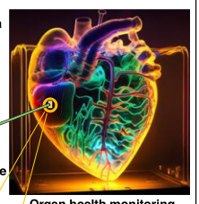

**Original caption:** Fig. 1 Schematic of the overall sensing principle for organ health monitoring

**中文图注:** Fig. 1 原始图注已提取；逐项含义见下方分图说明。

**Reading note:** 重点查看器件结构、材料层次、信号路径和制备流程。

### Fig. 2

**Source:** p.5

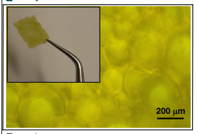

**Original caption:** Fig. 2 Pyranine-functionalized microbeads dispersed in hydrogel matrix. a Fabrication steps for developing the pH-sensitive hydrogel layer (b) microscopic image of the as-prepared pH sensing layer

**中文图注:** Fig. 2 原始图注已提取；逐项含义见下方分图说明。

**Reading note:** 重点查看器件结构、材料层次、信号路径和制备流程。

- (b) 重点查看阵列规模、空间分辨率、串扰、读出通道和空间特征表达。 原文：microscopic image of the as-prepared pH sensing layer

### Fig. 3

**Source:** p.5

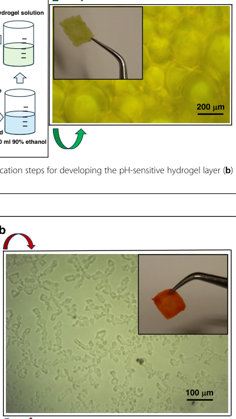

**Original caption:** Fig. 3 Ruthenium complex dispersed in hydrogel matrix. a Fabrication steps for developing the oxygen-sensitive hydrogel layer (b) microscopic image of the as prepared oxygen sensing layer

**中文图注:** Fig. 3 原始图注已提取；逐项含义见下方分图说明。

**Reading note:** 重点查看器件结构、材料层次、信号路径和制备流程。

- (b) 重点查看阵列规模、空间分辨率、串扰、读出通道和空间特征表达。 原文：microscopic image of the as prepared oxygen sensing layer

### Fig. 4

**Source:** p.6

**Original caption:** Fig. 4 Fabrication steps for developing the bi-functional pH- and oxygen-sensitive hydrogel layer. The fabricated sensor layer and its microscopic image are shown in the inset

**中文图注:** Fig. 4 原始图注已提取；逐项含义见下方分图说明。

**Reading note:** 重点查看器件结构、材料层次、信号路径和制备流程。

### Fig. 5

**Source:** p.6

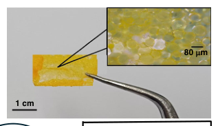

**Original caption:** Fig. 5 The single-sensor setup for simultaneous optical monitoring of both pH and oxygen changes

**中文图注:** Fig. 5 原始图注已提取；逐项含义见下方分图说明。

**Reading note:** 结合正文首次引用位置和原始图注核对该图的证据角色。

### Figure 6

**Source:** p.6

**Original caption:** Figure 6 shows the actual measurement setup used during the experiments. The sensor is connected to the ESP module via power cables to turn the LEDs on and off. The spectrophotometer collects the reflected fluorescence from the sensor for analysis. The sensor is connected to the flame spectrophotometer through an optical fibre to obtain the fluorescent measurements. The spectrophotometer then sends the obtained data to the computer for processing. A MATLAB® script drives the ESP

**中文图注:** Figure 6 原始图注已提取；逐项含义见下方分图说明。

**Reading note:** 结合正文首次引用位置和原始图注核对该图的证据角色。

### Fig. 6

**Source:** p.7

**Original caption:** Fig. 6 Experimental setup. a The measurement setup comprising power supply, spectrophotometer, microcontroller-based IoT module (ESP32), LEDs and laptop (b) zoomed view of the setup with the sensor illuminated with desired wavelength

**中文图注:** Fig. 6 原始图注已提取；逐项含义见下方分图说明。

**Reading note:** 结合正文首次引用位置和原始图注核对该图的证据角色。

- (b) 结合正文首次引用位置和原始图注核对该图的证据角色。 原文：zoomed view of the setup with the sensor illuminated with desired wavelength

### Fig. 7

**Source:** p.7

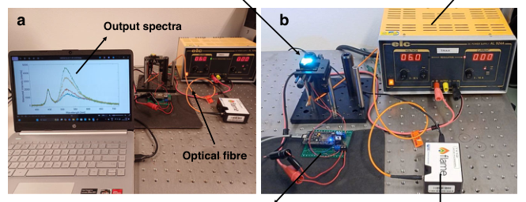

**Original caption:** Fig. 7 Sensing mechanism of pH-sensitive HPTS

**中文图注:** Fig. 7 原始图注已提取；逐项含义见下方分图说明。

**Reading note:** 重点查看机制模型与实验结果是否一致，以及关键结构参数的对照关系。

### Figure 7

**Source:** p.7

**Original caption:** Figure 7 depicts the sensing mechanism of the pHsensitive HPTS probes. When the HPTS-functionalized microbeads are exposed to solutions with higher pH level, the phenolic groups of HPTS absorb more photons when illuminated with 405 nm light. More molecules undergo excitation and relaxation, leading to higher intensity fluorescence at 520 nm. Thereby, lower pH corresponds to lower fluorescence intensity, and conversely higher pH corresponds to higher fluorescence intensity25.

**中文图注:** Figure 7 原始图注已提取；逐项含义见下方分图说明。

**Reading note:** 重点查看机制模型与实验结果是否一致，以及关键结构参数的对照关系。

### Fig. 8

**Source:** p.8

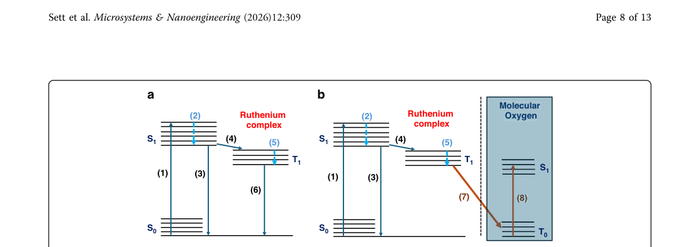

**Original caption:** Fig. 8 Sensing mechanism of oxygen-sensitive ruthenium complex. a In absence of oxygen (b) in presence of oxygen

**中文图注:** Fig. 8 原始图注已提取；逐项含义见下方分图说明。

**Reading note:** 重点查看机制模型与实验结果是否一致，以及关键结构参数的对照关系。

- (b) 结合正文首次引用位置和原始图注核对该图的证据角色。 原文：in presence of oxygen

### Figure 9A

**Source:** p.8

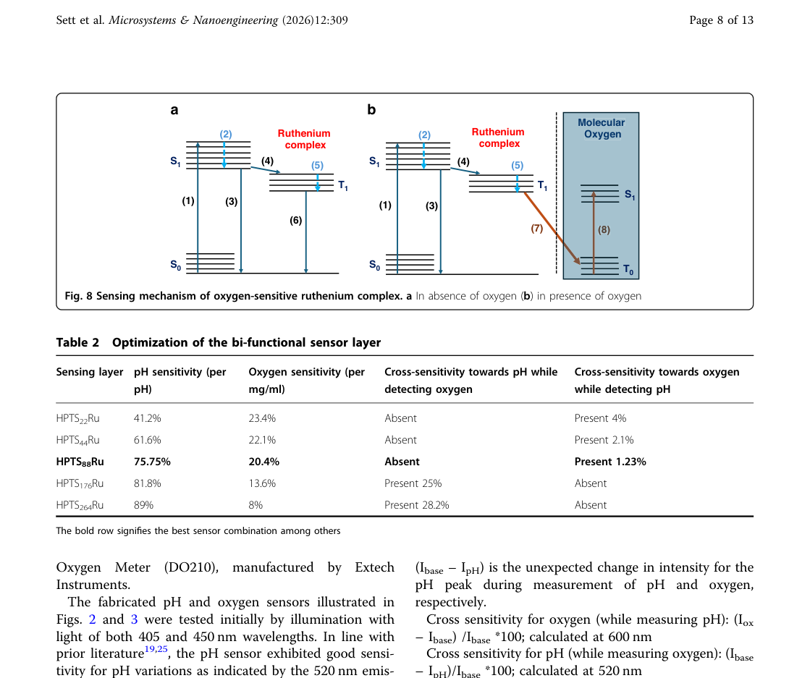

**Original caption:** Figure 9a illustrates the cross-sensitivity of the different sensor layers towards pH and oxygen. Minimum crosssensitivity was observed in the case of HPTS88Ru. The pH and oxygen sensitivity of the different sensors are depicted in Fig. 9b.

**中文图注:** Figure 9A 原始图注已提取；逐项含义见下方分图说明。

**Reading note:** 重点查看标定方法、量程、误差、线性和动态响应，避免只比较单一灵敏度。

### Figure 10

**Source:** p.8

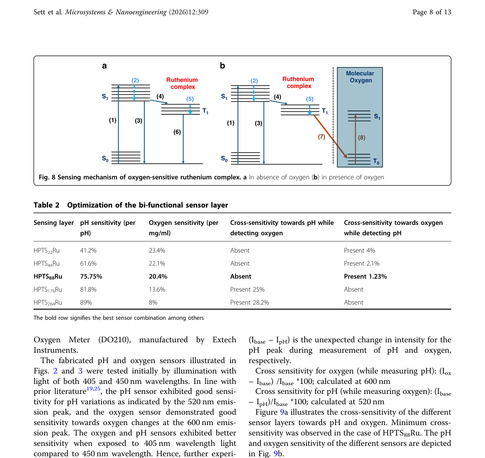

**Original caption:** Figure 10 illustrates the pH and oxygen sensing characteristics for the HPTS176Ru sensing layer. Here, the ratio of ruthenium to HPTS in the sensor is 1:176 by weight (HPTS176Ru). Figure 10a elucidates the pH sensing nature of the sensing layer. During pH changes, the amplitude of the 600 nm oxygen-sensitive emission peak remains almost unaltered. The variations in pH can therefore be visualized in the intensity variations of the 520 nm emission peak. With increase in pH levels, both absorption and fluorescence are seen to increase. However, during oxygen level measurement, cross-sensitivity towards pH was observed.

**中文图注:** Figure 10 原始图注已提取；逐项含义见下方分图说明。

**Reading note:** 重点查看标定方法、量程、误差、线性和动态响应，避免只比较单一灵敏度。

### Figure 10B

**Source:** p.8

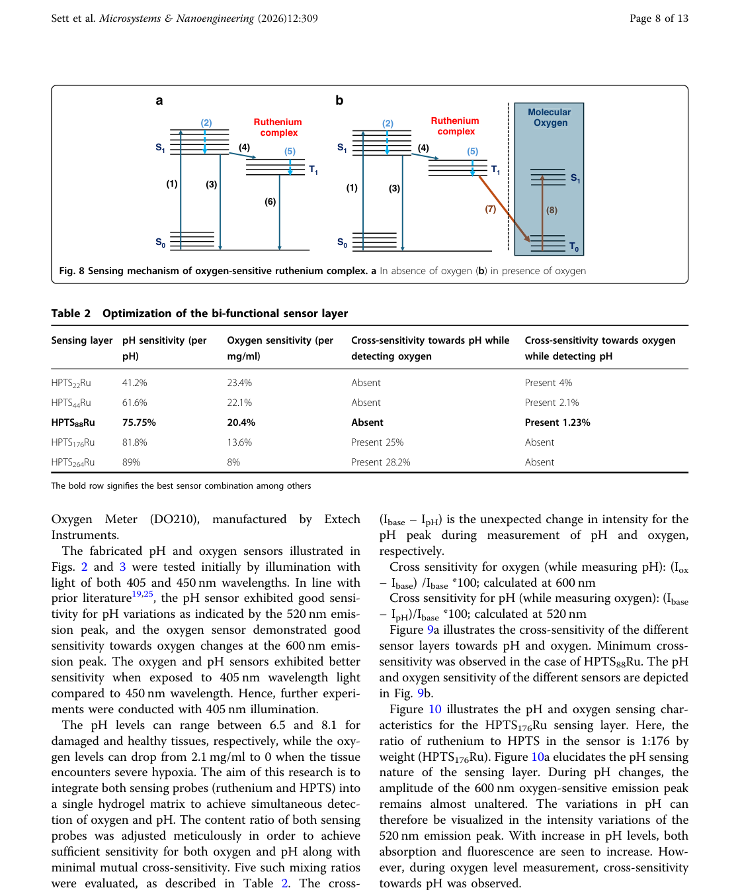

**Original caption:** Figure 10b shows that the changes in oxygen level from 5 mg/ml to 8.5 mg/ml incur reduction of fluorescence intensity at the 600 nm peak. Even though the pH of the

**中文图注:** Figure 10B 原始图注已提取；逐项含义见下方分图说明。

**Reading note:** 结合正文首次引用位置和原始图注核对该图的证据角色。

### Fig. 9

**Source:** p.9

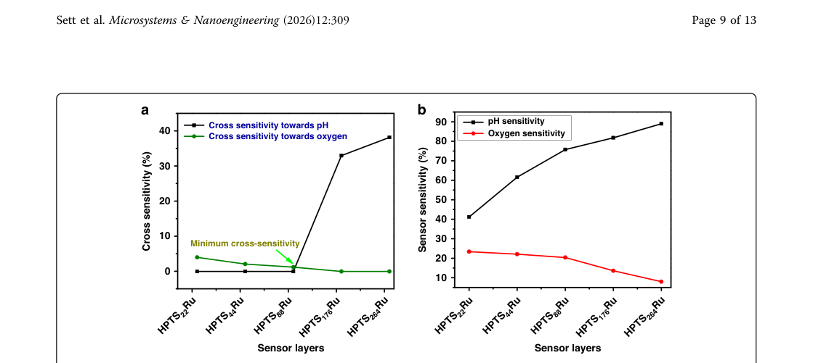

**Original caption:** Fig. 9 Sensitivity of the sensor. a Cross sensitivity of the sensor layers towards pH and oxygen (b) sensor sensitivity towards pH and oxygen

**中文图注:** Fig. 9 原始图注已提取；逐项含义见下方分图说明。

**Reading note:** 重点查看标定方法、量程、误差、线性和动态响应，避免只比较单一灵敏度。

- (b) 重点查看标定方法、量程、误差、线性和动态响应，避免只比较单一灵敏度。 原文：sensor sensitivity towards pH and oxygen

### Fig. 10

**Source:** p.9

**Original caption:** Fig. 10 Test for cross-sensitivity. a Detection of pH (at fixed 5 mg/ml oxygen level) by HPTS176Ru with insensitive 600 nm peak. b Detection of oxygen levels (at fixed pH value of 7.2) by HPTS176Ru with cross-sensitive 520 nm peak

**中文图注:** Fig. 10 原始图注已提取；逐项含义见下方分图说明。

**Reading note:** 重点查看标定方法、量程、误差、线性和动态响应，避免只比较单一灵敏度。

- (a) 结合正文首次引用位置和原始图注核对该图的证据角色。 原文：Detection of pH (at fixed 5 mg/ml oxygen level) by HPTS176Ru with insensitive 600 nm peak
- (b) 结合正文首次引用位置和原始图注核对该图的证据角色。 原文：Detection of oxygen levels (at fixed pH value of 7.2) by HPTS176Ru with cross-sensitive 520 nm peak

### Figure 11

**Source:** p.9

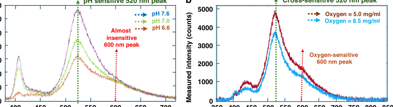

**Original caption:** Figure 11 demonstrates the pH sensing characteristics of HPTS88Ru. This optimized sensing layer exhibits good pH sensitivity at the 520 nm emission peak and shows almost zero sensitivity at the 600 nm one. The pH sensitivity is calculated to be approximately 75.75% per pH, as per Eq. (2). The sensor was tested in the pH range of 6.6 to 8, as this is the common pH physiological range for tissues and organs32.

**中文图注:** Figure 11 原始图注已提取；逐项含义见下方分图说明。

**Reading note:** 重点查看标定方法、量程、误差、线性和动态响应，避免只比较单一灵敏度。

### Figure 12

**Source:** p.9

**Original caption:** Figure 12 illustrates the oxygen sensing characteristics of HPTS88Ru. This optimized sensing layer exhibits excellent oxygen sensitivity at 600 nm and demonstrates

**中文图注:** Figure 12 原始图注已提取；逐项含义见下方分图说明。

**Reading note:** 重点查看标定方法、量程、误差、线性和动态响应，避免只比较单一灵敏度。

### Fig. 13

**Source:** p.10

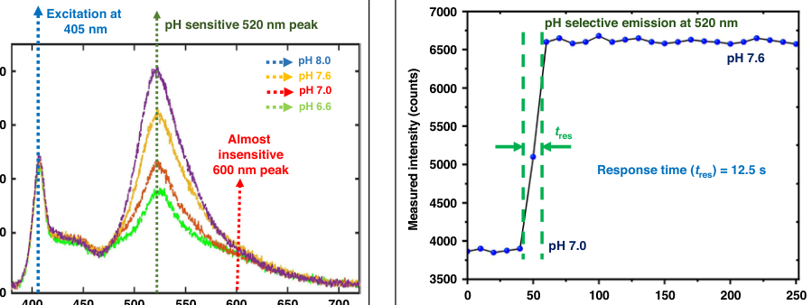

**Original caption:** Fig. 13 Transient response of HPTS88Ru to change in pH from 7.0 to 7.6

**中文图注:** Fig. 13 原始图注已提取；逐项含义见下方分图说明。

**Reading note:** 重点查看标定方法、量程、误差、线性和动态响应，避免只比较单一灵敏度。

### Fig. 11

**Source:** p.10

**Original caption:** Fig. 11 Detection of pH (at fixed 5 mg/ml oxygen level) by HPTS88Ru with insensitive 600 nm peak

**中文图注:** Fig. 11 原始图注已提取；逐项含义见下方分图说明。

**Reading note:** 结合正文首次引用位置和原始图注核对该图的证据角色。

### Fig. 14

**Source:** p.10

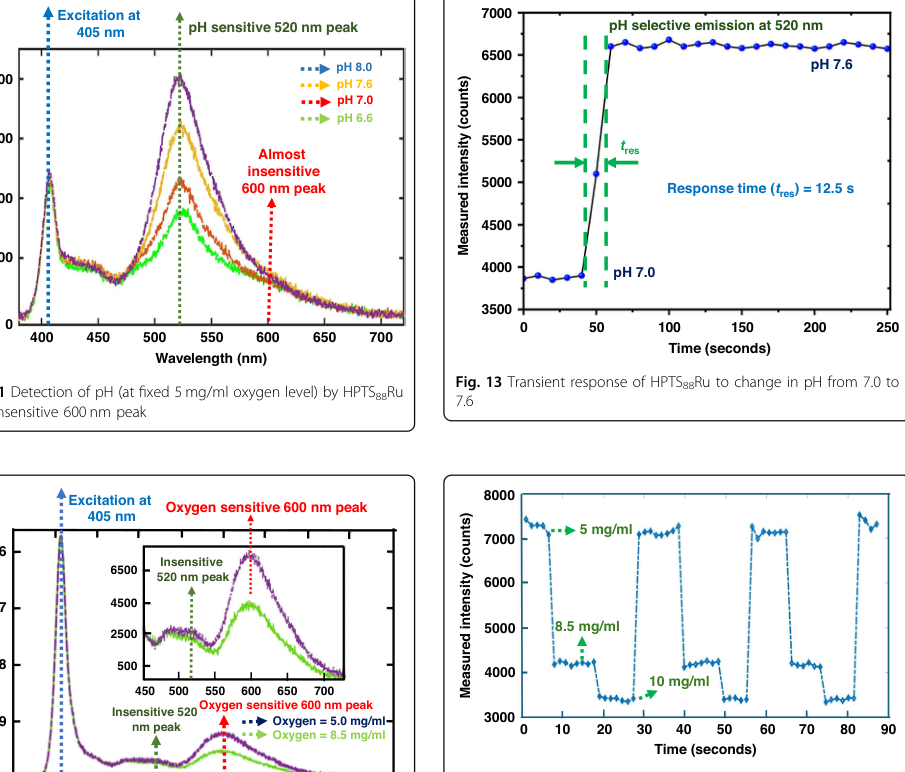

**Original caption:** Fig. 14 Transient response of HPTS88Ru during change in oxygen concentrations from 5.0 to 10.0 mg/ml

**中文图注:** Fig. 14 原始图注已提取；逐项含义见下方分图说明。

**Reading note:** 重点查看标定方法、量程、误差、线性和动态响应，避免只比较单一灵敏度。

### Fig. 12

**Source:** p.10

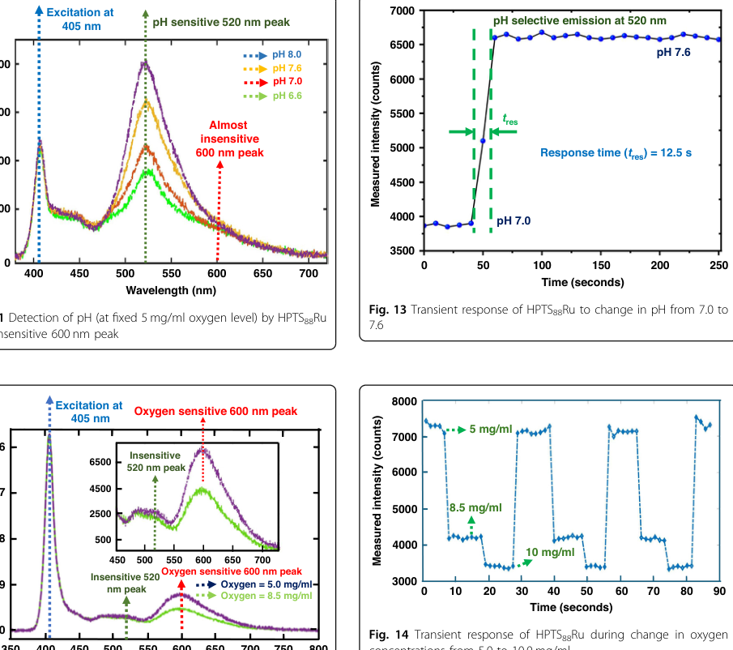

**Original caption:** Fig. 12 Detection of oxygen levels (at fixed pH value of 7.2) by HPTS88Ru with insensitive 520 nm peak

**中文图注:** Fig. 12 原始图注已提取；逐项含义见下方分图说明。

**Reading note:** 结合正文首次引用位置和原始图注核对该图的证据角色。

### Figure 13

**Source:** p.10

**Original caption:** Figure 13 shows the transient real-time response of the HPTS88Ru sensor towards change in pH levels of the solution from 7.0 to 7.6. The sensor was initially exposed to a solution of pH value 7.0 for ten minutes. The sensor was then withdrawn from the 7.0 pH solution and exposed to a solution of pH 7.6. When the sensor is illuminated with 405 nm light, the phenolic groups in the HPTS absorb more light at higher pH. This results in higher fluorescence intensity, as shown in Fig. 10. The sensor exhibits a very-short pH response time of 12.5 s, making it appropriate for medical applications.

**中文图注:** Figure 13 原始图注已提取；逐项含义见下方分图说明。

**Reading note:** 重点查看标定方法、量程、误差、线性和动态响应，避免只比较单一灵敏度。

### Figure 14

**Source:** p.10

**Original caption:** Figure 14 shows the transient real-time response of the HPTS88Ru sensor towards change in oxygen concentration of the solution from 5 mg/ml to 10 mg/ml. The higher the concentration of oxygen in solution, the higher

**中文图注:** Figure 14 原始图注已提取；逐项含义见下方分图说明。

**Reading note:** 重点查看标定方法、量程、误差、线性和动态响应，避免只比较单一灵敏度。

### Fig. 15

**Source:** p.11

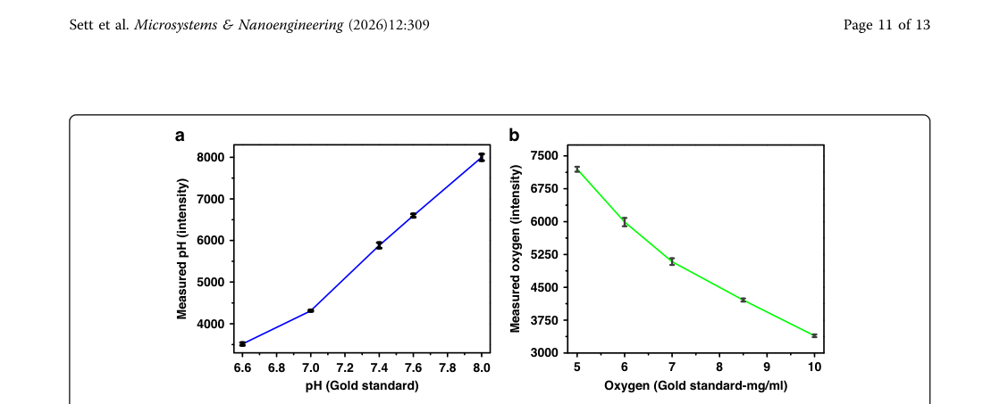

**Original caption:** Fig. 15 Calibration curve of HPTS88Ru. a For pH (b) for oxygen

**中文图注:** Fig. 15 原始图注已提取；逐项含义见下方分图说明。

**Reading note:** 重点查看标定方法、量程、误差、线性和动态响应，避免只比较单一灵敏度。

- (b) 结合正文首次引用位置和原始图注核对该图的证据角色。 原文：for oxygen
