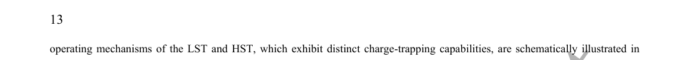
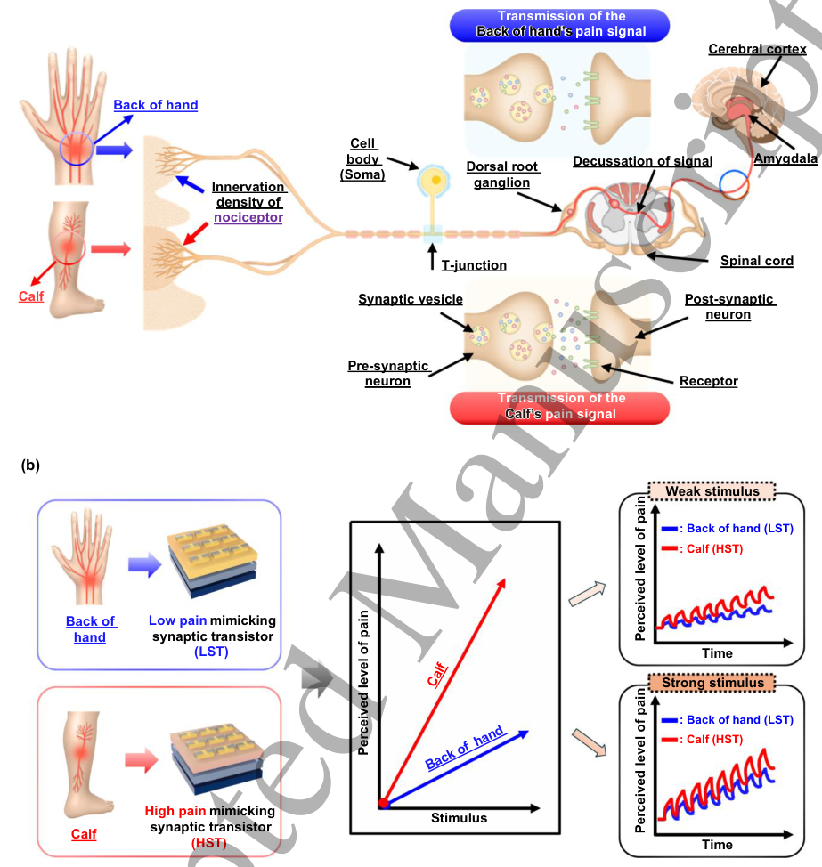
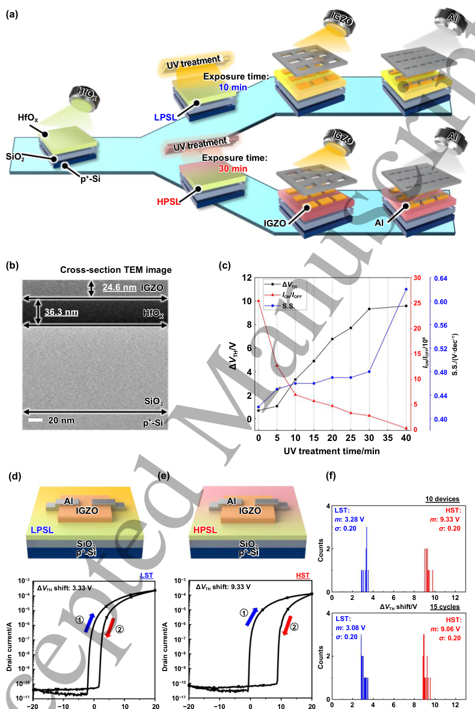
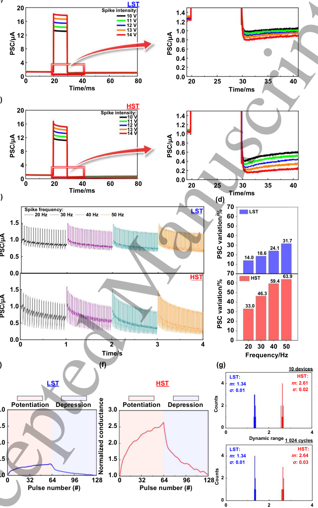
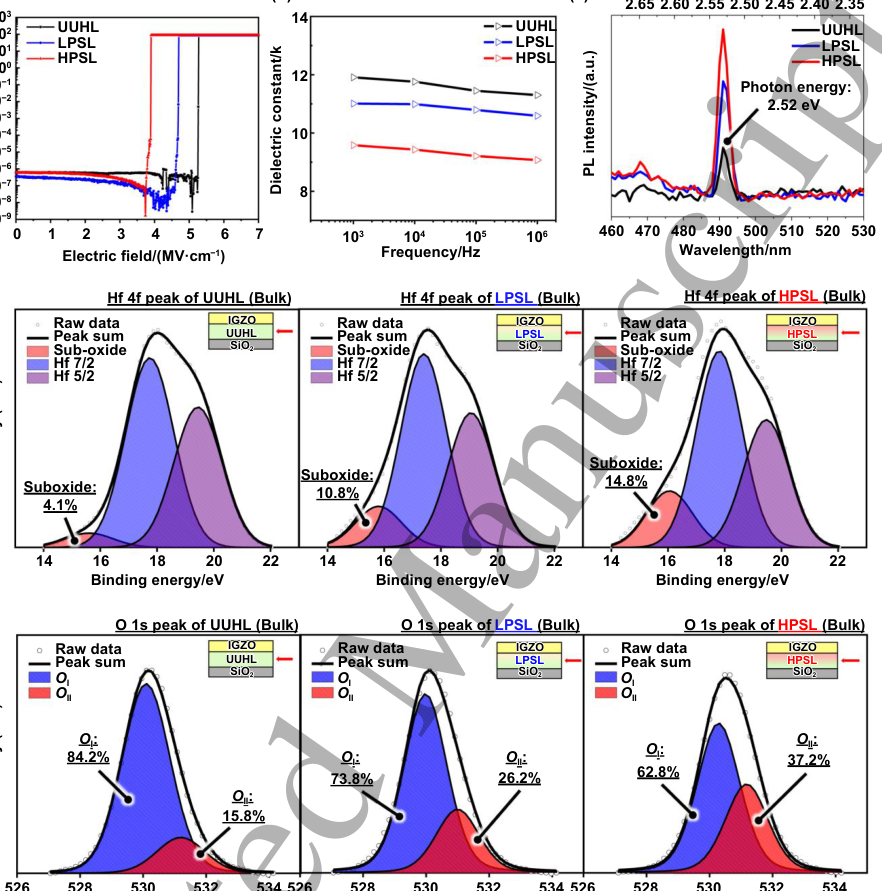
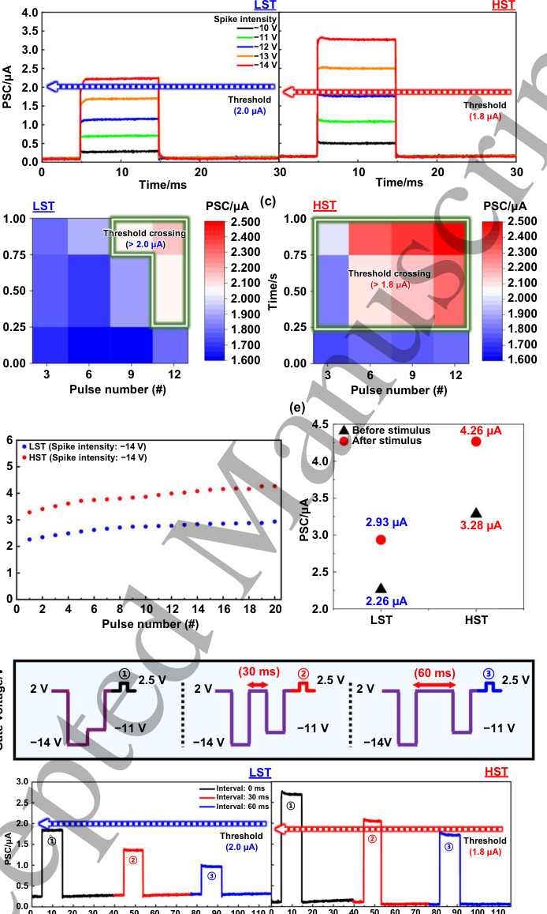
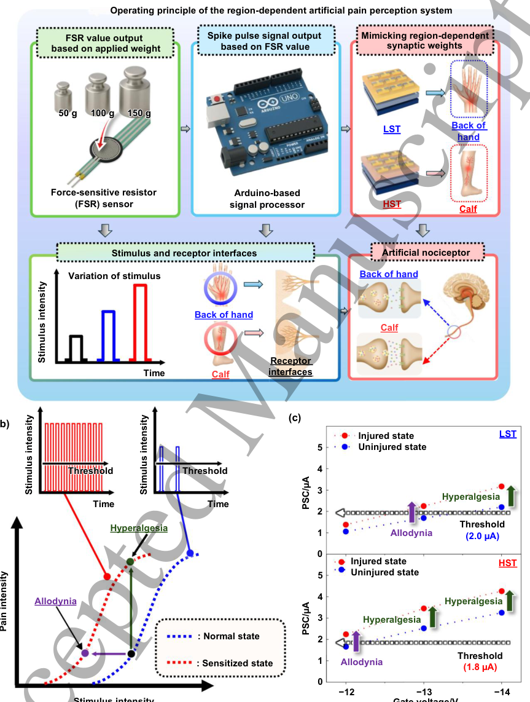

# Region-Dependent Artificial Pain Perception Based on Synaptic Transistors Mimicking Differential Nociceptor Sensitivity

- 期刊：International Journal of Extreme Manufacturing
- 日期：2026-09-03
- DOI：10.1088/2631-7990/aea26f
- 解析状态：fulltext_draft

## 摘要与研究价值

**Original:** Abstract Nociceptors which detect pain against harmful stimuli, exhibit region-dependent sensitivity, leading to variations in perceived pain intensity across different parts of the body. Herein, we propose region-dependent nociceptive responses emulated by reflecting difference of activated number of fibers through low-pain-mimicking synaptic transistor (LST) and high-pain-mimicking synaptic transistor (HST), each characterized by distinct synaptic weights. The variation in synaptic weight is achieved by modulating the charge-trapping capability of high-k HfOX, precisely controlled by ultraviolet treatment time. Under 64 consecutive spike inputs, the LST and HST exhibited average post-synaptic current variations of 135.4% and 264.4%, respectively, across device-to-device measurements. The back of the hand and the calf, which exhibit different pressure pain thresholds, were taken as representative examples to demonstrate that the perceived pain intensity differs across body regions in response to identical stimulus magnitudes. These results validate their capability to emulate region-dependent variations in pain perception across body regions. Furthermore, these results demonstrate that key nociceptive characteristics such as threshold behavior, no adaptation, and sensitization exhibit different firing points depending on the magnitude of the applied stimulus, and that the onset of these characteristics also varies with stimulus frequency. Furthermore, to more realistically emulate nociceptive characteristics of the human body, a region-dependent artificial pain perception system was developed by integrating a force-sensitive resistor sensor, an Arduino-based signal processor, and synaptic transistors. Through this region-dependent artificial pain perception system, realistic pain-like sensory feedback was achieved while emulating sensitization phenomena such as allodynia and hyperalgesia, demonstrating a hardware-level implementation that reproduces region-dependent pain transmission observed in the human body and offering significant potential for neuroprosthetics, robotics, and e-skin applications.

**中文:** 可用于低离散/装配容差触觉界面的结构与对照设计；涉及 in-sensor/物理计算或可编程触觉前端。摘要可核实数值包括：135.4%、264.4%。

## 创新点

- Abstract Nociceptors which detect pain against harmful stimuli, exhibit region-dependent sensitivity, leading to variations in perceived pain intensity across different parts of the body.
- 可用于低离散/装配容差触觉界面的结构与对照设计
- 涉及 in-sensor/物理计算或可编程触觉前端
- 提供机器人、可穿戴或电子皮肤系统任务证据

## 对当前课题的启发

- 可用于低离散/装配容差触觉界面的结构与对照设计
- 涉及 in-sensor/物理计算或可编程触觉前端
- 可对照 raw pixel、software feature 与 physical projection 的性能/通道/功耗
- 把文中的传感/计算耦合机制映射为可编程物理投影核，增加原始像素、软件投影和硬件投影三组严格消融。
- 加入坏点比例、增益漂移和跨器件迁移实验，比较重标定样本量与性能渐进退化，形成可靠性主张。

## 制备与实验步骤

### 1. 制备与实验操作

**Source:** p.7

**Original:** Fabrication procedure of the LST and HST A heavily boron-doped p-type silicon (p+-Si) with a thermally grown silicon dioxide (SiO2) is adopted as the gate and gate insulator, respectively.

**中文:** 制备与实验操作步骤，关键配比、时间、温度和设备参数以 p.7 原文为准。

### 2. 成膜与沉积

**Source:** p.7

**Original:** Next, HfOX was deposited using a radio frequency (RF) magnetron sputtering system under conditions of 20 standard cubic centimeters per minute (sccm) of argon (Ar) gas, a chamber pressure of 1 mTorr, and an RF power of 100 W for 8.5 minutes.

**中文:** 成膜与沉积步骤，关键配比、时间、温度和设备参数以 p.7 原文为准。

### 3. 成膜与沉积

**Source:** p.7

**Original:** After deposition, the sample underwent Ar plasma treatment at 100 W and 30 kHz for 5 minutes, followed by thermal annealing on a hot plate at 300 °C for 1 hour.

**中文:** 成膜与沉积步骤，关键配比、时间、温度和设备参数以 p.7 原文为准。

### 4. 成膜与沉积

**Source:** p.7

**Original:** 1 : 1 was sputtered using an RF magnetron sputtering system under conditions of 60 sccm, 5 m Torr, and 150 W for 5 minutes, with a shadow mask defining a channel width by length (W/L) of 1 000 µm/150 µm.

**中文:** 成膜与沉积步骤，关键配比、时间、温度和设备参数以 p.7 原文为准。

### 5. 固化与热处理

**Source:** p.7

**Original:** Thermal annealing was performed on a hot plate at

**中文:** 固化与热处理步骤，关键配比、时间、温度和设备参数以 p.7 原文为准。

### 6. 成膜与沉积

**Source:** p.7

**Original:** 150 °C for 1 hour following IGZO deposition.

**中文:** 成膜与沉积步骤，关键配比、时间、温度和设备参数以 p.7 原文为准。

### 7. 成膜与沉积

**Source:** p.7

**Original:** Finally, an aluminum (Al) electrode was fabricated via RF magnetron sputtering under sequential conditions of 20 sccm and 5 mTorr, initially at 60 W for 10 minutes and subsequently at 140 W for 20 minutes.

**中文:** 成膜与沉积步骤，关键配比、时间、温度和设备参数以 p.7 原文为准。

### 8. 制备与实验操作

**Source:** p.7

**Original:** Fabrication procedure of HfOX, LPSL, HPSL-based MIM and MOS capacitors Metal±insulator±metal (MIM) and metal±oxide±semiconductor (MOS) structures were fabricated through an identical process, with the only difference being the use of a p+-type silicon substrate for the metal role in the MIM and a lightly boron-doped p-type silicon for the semiconductor role in the MOS.

**中文:** 制备与实验操作步骤，关键配比、时间、温度和设备参数以 p.7 原文为准。

### 9. 成膜与沉积

**Source:** p.7

**Original:** The deposition of HfOX, Ar plasma treatment, and thermal annealing were carried out in the same manner as the fabrication procedure for the LST and HST devices.

**中文:** 成膜与沉积步骤，关键配比、时间、温度和设备参数以 p.7 原文为准。

### 10. 成膜与沉积

**Source:** p.7

**Original:** After the deposition of HfOX, LST, and HST, the Al HOHFWURGHZDVGHSRVLWHGWKURXJKDVKDGRZPDVNZLWKDFLUFXODURSHQLQJRI ×PPUDGLXVXVLQJ5)PDJQHWURQVSXWWHULQJXQGHU the same conditions as previously described.

**中文:** 成膜与沉积步骤，关键配比、时间、温度和设备参数以 p.7 原文为准。

### 11. 成膜与沉积

**Source:** p.7

**Original:** Fabrication procedure of the Sputter and ALD-HfOX film.

**中文:** 成膜与沉积步骤，关键配比、时间、温度和设备参数以 p.7 原文为准。

### 12. 成膜与沉积

**Source:** p.7

**Original:** ALD-HfOX with a thickness of approximately 30 nm was deposited using tetrakis(ethylmethylamido) (TEMAHf) as the hafnium precursor and O3 as the oxidant.

**中文:** 成膜与沉积步骤，关键配比、时间、温度和设备参数以 p.7 原文为准。

### 13. 成膜与沉积

**Source:** p.7

**Original:** The deposition was carried out at a chamber temperature of 280 °C, and the growth per cycle (GPC) of HfO2 was maintained at ~0.12 nm per cycle.

**中文:** 成膜与沉积步骤，关键配比、时间、温度和设备参数以 p.7 原文为准。

### 14. 成膜与沉积

**Source:** p.7

**Original:** Sputter-HfOX with a thickness of approximately 30 nm was deposited under identical conditions for the fabrication of the LST and HST for 9 minutes and annealed on a hot plate for 1 h at 280 °C.

**中文:** 成膜与沉积步骤，关键配比、时间、温度和设备参数以 p.7 原文为准。

### 15. 组装与封装

**Source:** p.7

**Original:** Film density variations in the HfOX were analyzed using X-ray reflectivity (XRR) (SmartLab, Rigaku), and the chemical bonding states between Hf and O were characterized by X-ray photoelectron spectroscopy (XPS) (K-alpha, Thermo Scientific, UK).

**中文:** 组装与封装步骤，关键配比、时间、温度和设备参数以 p.7 原文为准。

### 16. 成膜与沉积

**Source:** p.7

**Original:** Chemical bond configurations were analyzed by Fourier transform infrared spectroscopy (FTIR) (INVENIO, Bruker) for sputter- and ALD-deposited HfOX, as well as for sputter- deposited HfOX subjected to varying UV treatment durations of 10, 20, and 30 min.

**中文:** 成膜与沉积步骤，关键配比、时间、温度和设备参数以 p.7 原文为准。

## 方法原文锚点

**Source:** p.7 M001

**Original:** 2.1. Fabrication procedure of the LST and HST

**中文:** 该段已进入结构化方法步骤；完整逐段翻译待智能体精读补齐。

**Source:** p.7 M002

**Original:** A heavily boron-doped p-type silicon (p+-Si) with a thermally grown silicon dioxide (SiO2) is adopted as the gate and gate insulator,

**中文:** 该段已进入结构化方法步骤；完整逐段翻译待智能体精读补齐。

**Source:** p.7 M003

**Original:** respectively. Next, HfOX was deposited using a radio frequency (RF) magnetron sputtering system under conditions of 20 standard

**中文:** 该段已进入结构化方法步骤；完整逐段翻译待智能体精读补齐。

**Source:** p.7 M004

**Original:** cubic centimeters per minute (sccm) of argon (Ar) gas, a chamber pressure of 1 mTorr, and an RF power of 100 W for 8.5 minutes.

**中文:** 该段已进入结构化方法步骤；完整逐段翻译待智能体精读补齐。

**Source:** p.7 M005

**Original:** After deposition, the sample underwent Ar plasma treatment at 100 W and 30 kHz for 5 minutes, followed by thermal annealing on

**中文:** 该段已进入结构化方法步骤；完整逐段翻译待智能体精读补齐。

**Source:** p.7 M006

**Original:** a hot plate at 300 °C for 1 hour. Subsequently, the HfOX was exposed to an ultraviolet (UV) lamp (wavelengths: 184.9 nm and 253.7

**中文:** 该段已进入结构化方法步骤；完整逐段翻译待智能体精读补齐。

**Source:** p.7 M007

**Original:** nm, power: 20 W) for durations of 10 minutes and 30 minutes, forming a low-pain-sensitivity layer and a high-pain-sensitivity layer

**中文:** 该段已进入结构化方法步骤；完整逐段翻译待智能体精读补齐。

**Source:** p.7 M008

**Original:** (HPSL), respectively. Afterward, indium±gallium±zinc±oxide (IGZO) composed of In2O3, Ga2O3, and ZnO at a molar ratio of 1 :

**中文:** 该段已进入结构化方法步骤；完整逐段翻译待智能体精读补齐。

**Source:** p.7 M009

**Original:** 1 : 1 was sputtered using an RF magnetron sputtering system under conditions of 60 sccm, 5 m Torr, and 150 W for 5 minutes, with

**中文:** 该段已进入结构化方法步骤；完整逐段翻译待智能体精读补齐。

**Source:** p.7 M010

**Original:** a shadow mask defining a channel width by length (W/L) of 1 000 µm/150 µm. Thermal annealing was performed on a hot plate at

**中文:** 该段已进入结构化方法步骤；完整逐段翻译待智能体精读补齐。

**Source:** p.7 M011

**Original:** 150 °C for 1 hour following IGZO deposition. Finally, an aluminum (Al) electrode was fabricated via RF magnetron sputtering

**中文:** 该段已进入结构化方法步骤；完整逐段翻译待智能体精读补齐。

**Source:** p.7 M012

**Original:** under sequential conditions of 20 sccm and 5 mTorr, initially at 60 W for 10 minutes and subsequently at 140 W for 20 minutes.

**中文:** 该段已进入结构化方法步骤；完整逐段翻译待智能体精读补齐。

**Source:** p.7 M013

**Original:** 2.2. Fabrication procedure of HfOX, LPSL, HPSL-based MIM and MOS capacitors

**中文:** 该段已进入结构化方法步骤；完整逐段翻译待智能体精读补齐。

**Source:** p.7 M014

**Original:** Metal±insulator±metal (MIM) and metal±oxide±semiconductor (MOS) structures were fabricated through an identical process, with

**中文:** 该段已进入结构化方法步骤；完整逐段翻译待智能体精读补齐。

**Source:** p.7 M015

**Original:** the only difference being the use of a p+-type silicon substrate for the metal role in the MIM and a lightly boron-doped p-type silicon

**中文:** 该段已进入结构化方法步骤；完整逐段翻译待智能体精读补齐。

**Source:** p.7 M016

**Original:** for the semiconductor role in the MOS. The deposition of HfOX, Ar plasma treatment, and thermal annealing were carried out in

**中文:** 该段已进入结构化方法步骤；完整逐段翻译待智能体精读补齐。

**Source:** p.7 M017

**Original:** the same manner as the fabrication procedure for the LST and HST devices. After the deposition of HfOX, LST, and HST, the Al

**中文:** 该段已进入结构化方法步骤；完整逐段翻译待智能体精读补齐。

**Source:** p.7 M018

**Original:** HOHFWURGHZDVGHSRVLWHGWKURXJKDVKDGRZPDVNZLWKDFLUFXODURSHQLQJRI ×PPUDGLXVXVLQJ5)PDJQHWURQVSXWWHULQJXQGHU

**中文:** 该段已进入结构化方法步骤；完整逐段翻译待智能体精读补齐。

**Source:** p.7 M019

**Original:** the same conditions as previously described.

**中文:** 该段已进入结构化方法步骤；完整逐段翻译待智能体精读补齐。

**Source:** p.7 M020

**Original:** 2.3. Fabrication procedure of the Sputter and ALD-HfOX film.

**中文:** 该段已进入结构化方法步骤；完整逐段翻译待智能体精读补齐。

**Source:** p.7 M021

**Original:** ALD-HfOX with a thickness of approximately 30 nm was deposited using tetrakis(ethylmethylamido) (TEMAHf) as the hafnium

**中文:** 该段已进入结构化方法步骤；完整逐段翻译待智能体精读补齐。

**Source:** p.7 M022

**Original:** precursor and O3 as the oxidant. The deposition was carried out at a chamber temperature of 280 °C, and the growth per cycle (GPC)

**中文:** 该段已进入结构化方法步骤；完整逐段翻译待智能体精读补齐。

**Source:** p.7 M023

**Original:** of HfO2 was maintained at ~0.12 nm per cycle. Sputter-HfOX with a thickness of approximately 30 nm was deposited under identical

**中文:** 该段已进入结构化方法步骤；完整逐段翻译待智能体精读补齐。

**Source:** p.7 M024

**Original:** conditions for the fabrication of the LST and HST for 9 minutes and annealed on a hot plate for 1 h at 280 °C.

**中文:** 该段已进入结构化方法步骤；完整逐段翻译待智能体精读补齐。

**Source:** p.7 M025

**Original:** 2.4. Film and device characterization

**中文:** 该段已进入结构化方法步骤；完整逐段翻译待智能体精读补齐。

**Source:** p.7 M026

**Original:** The electrical characteristics of the synaptic transistors were measured using a parameter analyzer (4200A, Keithley Instruments,

**中文:** 该段已进入结构化方法步骤；完整逐段翻译待智能体精读补齐。

**Source:** p.7 M027

**Original:** USA) under dark conditions. Additionally, capacitance±voltage (C±V) measurements of MOS structures were performed using an

**中文:** 该段已进入结构化方法步骤；完整逐段翻译待智能体精读补齐。

**Source:** p.7 M028

**Original:** LCR meter (4284A, Hewlett-Packard, USA) with a frequency range of 20 Hz to 1 MHz. The cross-sectional device structures of

**中文:** 该段已进入结构化方法步骤；完整逐段翻译待智能体精读补齐。

**Source:** p.7 M029

**Original:** the synaptic transistors were investigated by high-resolution transmission electron microscopy (HR-TEM) (JEM-ARM 200F

**中文:** 该段已进入结构化方法步骤；完整逐段翻译待智能体精读补齐。

**Source:** p.7 M030

**Original:** NEOARM, JEOL). To examine the UV-treatment-dependent surface morphology of the HfOX films, atomic force microscopy

**中文:** 该段已进入结构化方法步骤；完整逐段翻译待智能体精读补齐。

**Source:** p.7 M031

**Original:** (AFM) (NX-10, Park Systems) was employed. Changes in oxygen vacancy-related energy levels as a function of UV treatment time

**中文:** 该段已进入结构化方法步骤；完整逐段翻译待智能体精读补齐。

**Source:** p.7 M032

**Original:** were evaluated by photoluminescence spectroscopy (PL) (FS5, Edinburgh Instruments). Film density variations in the HfOX were

**中文:** 该段已进入结构化方法步骤；完整逐段翻译待智能体精读补齐。

**Source:** p.7 M033

**Original:** analyzed using X-ray reflectivity (XRR) (SmartLab, Rigaku), and the chemical bonding states between Hf and O were characterized

**中文:** 该段已进入结构化方法步骤；完整逐段翻译待智能体精读补齐。

**Source:** p.7 M034

**Original:** by X-ray photoelectron spectroscopy (XPS) (K-alpha, Thermo Scientific, UK). Chemical bond configurations were analyzed by

**中文:** 该段已进入结构化方法步骤；完整逐段翻译待智能体精读补齐。

**Source:** p.7 M035

**Original:** Fourier transform infrared spectroscopy (FTIR) (INVENIO, Bruker) for sputter- and ALD-deposited HfOX, as well as for sputter-

**中文:** 该段已进入结构化方法步骤；完整逐段翻译待智能体精读补齐。

**Source:** p.7 M036

**Original:** deposited HfOX subjected to varying UV treatment durations of 10, 20, and 30 min. To qualitatively compare the charge trap states

**中文:** 该段已进入结构化方法步骤；完整逐段翻译待智能体精读补齐。

**Source:** p.7 M037

**Original:** https://mc04.manuscriptcentral.com/ijem-caep

**中文:** 该段已进入结构化方法步骤；完整逐段翻译待智能体精读补齐。

**Source:** p.7 M038

**Original:** 1 2 3 4 5 6 7 8 9 10 11 12 13 14 15 16 17 18 19 20 21 22 23 24 25 26 27 28 29 30 31 32 33 34 35 36 37 38 39 40 41 42 43 44 45 46 47 48 49 50 51 52 53 54 55 56 57 58 59 60

**中文:** 该段已进入结构化方法步骤；完整逐段翻译待智能体精读补齐。

**Source:** p.7 M039

**Original:** Accepted Manuscript

**中文:** 该段已进入结构化方法步骤；完整逐段翻译待智能体精读补齐。

**Source:** p.8 M040

**Original:** International Journal of Extreme Manufacturing

**中文:** 该段已进入结构化方法步骤；完整逐段翻译待智能体精读补齐。

**Source:** p.8 M041

**Original:** Accepted Manuscript

**中文:** 该段已进入结构化方法步骤；完整逐段翻译待智能体精读补齐。

**Source:** p.8 M042

**Original:** 6 formed in the LPSL and HPSL, time-resolved photoluminescence (TRPL) analysis was performed (Fluorolog-QM, Horiba) by

**中文:** 该段已进入结构化方法步骤；完整逐段翻译待智能体精读补齐。

**Source:** p.8 M043

**Original:** comparing the carrier lifetime of each sample. The absorption characteristics of the UV light source with respect to HfOX were

**中文:** 该段已进入结构化方法步骤；完整逐段翻译待智能体精读补齐。

**Source:** p.8 M044

**Original:** assessed using UV±visible spectrophotometry (UV±vis) (V-650, JASCO). Additionally, the variation in electric field distribution

**中文:** 该段已进入结构化方法步骤；完整逐段翻译待智能体精读补齐。

**Source:** p.8 M045

**Original:** within the HfOX according to UV treatment duration was simulated using technology computer-aided design (TCAD) (Victory

**中文:** 该段已进入结构化方法步骤；完整逐段翻译待智能体精读补齐。

**Source:** p.8 M046

**Original:** 2.5. Electrical signal conversion process of the region-dependent artificial pain perception system

**中文:** 该段已进入结构化方法步骤；完整逐段翻译待智能体精读补齐。

**Source:** p.8 M047

**Original:** A force-sensitive resistor (FSR) 406 sensor was employed to detect external mechanical stimuli corresponding to applied weights

**中文:** 该段已进入结构化方法步骤；完整逐段翻译待智能体精读补齐。

**Source:** p.8 M048

**Original:** of 50, 100, and 150 g. FSR 406 has a measurable weight range of 10±1 020 g, with a repeatability of ±2 % and a hysteresis of +5 %,

**中文:** 该段已进入结构化方法步骤；完整逐段翻译待智能体精读补齐。

**Source:** p.8 M049

**Original:** ensuring reliable and consistent detection of the applied stimuli. The FSR was connected to a microcontroller unit (Arduino UNO

**中文:** 该段已进入结构化方法步骤；完整逐段翻译待智能体精读补齐。

**Source:** p.8 M050

**Original:** R3), which converted the sensor¶s resistance change into a corresponding voltage signal. This voltage signal was transmitted to a

**中文:** 该段已进入结构化方法步骤；完整逐段翻译待智能体精读补齐。

**Source:** p.8 M051

**Original:** digital-to-analog converter (DAC, AD5683RBRMZ-3-RL7), which produced an analog output range of 0$5V. The output was

**中文:** 该段已进入结构化方法步骤；完整逐段翻译待智能体精读补齐。

**Source:** p.8 M052

**Original:** subsequently amplified using a tower-mounted amplifier (TMA, Model: TMA 0515D) to ±15 V. The amplified signal was then

**中文:** 该段已进入结构化方法步骤；完整逐段翻译待智能体精读补齐。

**Source:** p.8 M053

**Original:** FRQYHUWHGLQWRDELSRODUYROWDJHRI“×9XVLQJDQRSHUDWLRQDODPSOLILHU 23$ with a gain of 6 and applied as a pulse to the gate

**中文:** 该段已进入结构化方法步骤；完整逐段翻译待智能体精读补齐。

**Source:** p.8 M054

**Original:** terminal of the synaptic transistor to emulate external nociceptive stimuli. The source terminal of the device was grounded with the

**中文:** 该段已进入结构化方法步骤；完整逐段翻译待智能体精读补齐。

**Source:** p.8 M055

**Original:** Arduino, while the drain terminal was connected to a parameter analyzer for measurement. The post-synaptic current (PSC) was

**中文:** 该段已进入结构化方法步骤；完整逐段翻译待智能体精读补齐。

**Source:** p.8 M056

**Original:** measured as a function of applied weight, enabling the analysis of synaptic response characteristics in relation to stimulus intensity.

**中文:** 该段已进入结构化方法步骤；完整逐段翻译待智能体精读补齐。

**Source:** p.8 M057

**Original:** 3.1. Charge-trapping characteristics of UV-treated HfOX-based synaptic transistors

**中文:** 该段已进入结构化方法步骤；完整逐段翻译待智能体精读补齐。

**Source:** p.8 M058

**Original:** The schematic fabrication process of the PSL-based synaptic transistor is illustrated in Figure 2(a). To modulate the charge trap

**中文:** 该段已进入结构化方法步骤；完整逐段翻译待智能体精读补齐。

**Source:** p.8 M059

**Original:** density of HfOX, the UV treatment was adjusted to 10 and 30 minutes, resulting in the formation of the low-pain-sensitivity layer

**中文:** 该段已进入结构化方法步骤；完整逐段翻译待智能体精读补齐。

**Source:** p.8 M060

**Original:** (LPSL) and high-sensitivity layer (HPSL), respectively. The device structure of the PSL-based synaptic transistor is further

**中文:** 该段已进入结构化方法步骤；完整逐段翻译待智能体精读补齐。

**Source:** p.8 M061

**Original:** confirmed by the cross-sectional high-resolution transmission electron microscopy (HR-TEM) image shown in Figure 2(b). The

**中文:** 该段已进入结构化方法步骤；完整逐段翻译待智能体精读补齐。

**Source:** p.8 M062

**Original:** image distinctly shows well-defined and continuous interfaces between each layer, revealing that the PSL and IGZO channels

**中文:** 该段已进入结构化方法步骤；完整逐段翻译待智能体精读补齐。

**Source:** p.8 M063

**Original:** responsible for charge trap behavior have thicknesses of approximately 36.3 and 24.6 nm, respectively.

**中文:** 该段已进入结构化方法步骤；完整逐段翻译待智能体精读补齐。

**Source:** p.8 M064

**Original:** To emulate region-dependent pain perception, PSL-based synaptic transistors are designed to generate different magnitudes of action

**中文:** 该段已进入结构化方法步骤；完整逐段翻译待智能体精读补齐。

**Source:** p.8 M065

**Original:** potentials in response to identical stimuli, thereby reproducing varying pain intensities. This behavior, which perceives different

**中文:** 该段已进入结构化方法步骤；完整逐段翻译待智能体精读补齐。

**Source:** p.8 M066

**Original:** pain intensities, is emulated by tuning the charge-trapping capability of the PSL through conductance modulation. However, PSL

**中文:** 该段已进入结构化方法步骤；完整逐段翻译待智能体精读补齐。

**Source:** p.8 M067

**Original:** composed of HfOX deposited by sputtering, where high-energy ion bombardment induces nonuniform film growth, increases surface

**中文:** 该段已进入结构化方法步骤；完整逐段翻译待智能体精读补齐。

**Source:** p.8 M068

**Original:** roughness that promotes trap formation at the channel interface and consequently degrades overall device performance [38-41]. To

**中文:** 该段已进入结构化方法步骤；完整逐段翻译待智能体精读补齐。

**Source:** p.8 M069

**Original:** overcome these issues, argon (Ar) plasma treatment was employed to enhance both the electrical properties and surface morphology

**中文:** 该段已进入结构化方法步骤；完整逐段翻译待智能体精读补齐。

**Source:** p.8 M070

**Original:** of the sputter-deposited HfOX, as demonstrated by the hysteresis characteristics shown in Figure S1 and Table S1, and the surface

**中文:** 该段已进入结构化方法步骤；完整逐段翻译待智能体精读补齐。

**Source:** p.8 M071

**Original:** morphology observed in the atomic force microscopy (AFM) images is shown in Figure S2.

**中文:** 该段已进入结构化方法步骤；完整逐段翻译待智能体精读补齐。

**Source:** p.8 M072

**Original:** To investigate the variation in the charge-trapping capability of HfOX with respect to UV treatment, UV light with wavelengths of

**中文:** 该段已进入结构化方法步骤；完整逐段翻译待智能体精读补齐。

**Source:** p.8 M073

**Original:** 184.9 and 253.7 nm was applied under a fixed power of 20 W, with the treatment time precisely adjusted as the sole variable

**中文:** 该段已进入结构化方法步骤；完整逐段翻译待智能体精读补齐。

**Source:** p.8 M074

**Original:** parameter. The degree of charge-trapping capability under different UV treatment times was evaluated by measuring the hysteresis

**中文:** 该段已进入结构化方法步骤；完整逐段翻译待智能体精读补齐。

**Source:** p.8 M075

**Original:** characteristics under bidirectional gate voltage (VG) sweeps of ± 20 V at a fixed drain voltage of 10.1 V. As shown in Figure S3,

**中文:** 该段已进入结构化方法步骤；完整逐段翻译待智能体精读补齐。

**Source:** p.8 M076

**Original:** the devices exhibited clockwise hysteresis loops, indicating the influence of charge-trapping effects [42-45]. The variations in the

**中文:** 该段已进入结构化方法步骤；完整逐段翻译待智能体精读补齐。

**Source:** p.8 M077

**Original:** WKUHVKROGYROWDJHVKLIW û9TH), subthreshold swing (S.S.), and ION/OFF, which are factors associated with charge-trapping behavior,

**中文:** 该段已进入结构化方法步骤；完整逐段翻译待智能体精读补齐。

**Source:** p.8 M078

**Original:** https://mc04.manuscriptcentral.com/ijem-caep

**中文:** 该段已进入结构化方法步骤；完整逐段翻译待智能体精读补齐。

**Source:** p.8 M079

**Original:** 1 2 3 4 5 6 7 8 9 10 11 12 13 14 15 16 17 18 19 20 21 22 23 24 25 26 27 28 29 30 31 32 33 34 35 36 37 38 39 40 41 42 43 44 45 46 47 48 49 50 51 52 53 54 55 56 57 58 59 60

**中文:** 该段已进入结构化方法步骤；完整逐段翻译待智能体精读补齐。

**Source:** p.8 M080

**Original:** Omni 2D, Silvaco).

**中文:** 该段已进入结构化方法步骤；完整逐段翻译待智能体精读补齐。

**Source:** p.8 M081

**Original:** 3. Results and discussion

**中文:** 该段已进入结构化方法步骤；完整逐段翻译待智能体精读补齐。

**Source:** p.8 M082

**Original:** Page 6 of 31

**中文:** 该段已进入结构化方法步骤；完整逐段翻译待智能体精读补齐。

**Source:** p.9 M083

**Original:** Page 7 of 31

**中文:** 该段已进入结构化方法步骤；完整逐段翻译待智能体精读补齐。

**Source:** p.9 M084

**Original:** International Journal of Extreme Manufacturing

**中文:** 该段已进入结构化方法步骤；完整逐段翻译待智能体精读补齐。

**Source:** p.9 M085

**Original:** 7 extracted from the hysteresis curves as a function of the UV treatment time, are presented in Figure 2(c), with the corresponding

**中文:** 该段已进入结构化方法步骤；完整逐段翻译待智能体精读补齐。

**Source:** p.9 M086

**Original:** numerical data summarized in Table S2.

**中文:** 该段已进入结构化方法步骤；完整逐段翻译待智能体精读补齐。

**Source:** p.9 M087

**Original:** $VWKH89WUHDWPHQWWLPHLQFUHDVHGERWKWKHû9TH and S.S. values increased, whereas the ION/OFF decreased, indicating an increase

**中文:** 该段已进入结构化方法步骤；完整逐段翻译待智能体精读补齐。

**Source:** p.9 M088

**Original:** in the charge-trapping capability of HfOX. These variations are attributed to electron trapping in the HfOX originating from the

**中文:** 该段已进入结构化方法步骤；完整逐段翻译待智能体精读补齐。

**Source:** p.9 M089

**Original:** ,*=2FKDQQHO:KHQWKH89WUHDWPHQWWLPHH[FHHGHGPLQXWHVWKHLQFUHDVHLQû9TH, representing the charge-trapping capacity,

**中文:** 该段已进入结构化方法步骤；完整逐段翻译待智能体精读补齐。

**Source:** p.9 M090

**Original:** became less significant and approached saturation, indicating a limit to additional charge trapping. Conversely, a sharp increase in

**中文:** 该段已进入结构化方法步骤；完整逐段翻译待智能体精读补齐。

**Source:** p.9 M091

**Original:** the S.S. value and a noticeable decrease in the ION/OFF were observed. The increase in the S.S. value indicates an increase in the

**中文:** 该段已进入结构化方法步骤；完整逐段翻译待智能体精读补齐。

**Source:** p.9 M092

**Original:** interface trap density (DIT) at the HfOX/IGZO interface, which is likely attributed to the deterioration of the surface morphology of

**中文:** 该段已进入结构化方法步骤；完整逐段翻译待智能体精读补齐。

**Source:** p.9 M093

**Original:** HfOX [46]. To further support this observation, AFM analysis was conducted to evaluate the changes in the surface roughness of

**中文:** 该段已进入结构化方法步骤；完整逐段翻译待智能体精读补齐。

**Source:** p.9 M094

**Original:** HfOX induced by UV treatment. As presented in Figure S4, the root-mean-square roughness (Rrms) values of 0.249 and 0.291 nm

**中文:** 该段已进入结构化方法步骤；完整逐段翻译待智能体精读补齐。

**Source:** p.9 M095

**Original:** for the 30- and 40-minute UV-treated HfOX, respectively, indicate that the surface roughness increases with longer UV treatment

**中文:** 该段已进入结构化方法步骤；完整逐段翻译待智能体精读补齐。

**Source:** p.9 M096

**Original:** duration. Furthermore, the sharp decline in the ION/OFF is attributed to trap-induced screening caused by excessive electron trapping

**中文:** 该段已进入结构化方法步骤；完整逐段翻译待智能体精读补齐。

**Source:** p.9 M097

**Original:** in the HfOX, which reduces the gate electric field and consequently limits electron accumulation in the IGZO channel, leading to

**中文:** 该段已进入结构化方法步骤；完整逐段翻译待智能体精读补齐。

**Source:** p.9 M098

**Original:** degraded switching performance of the transistor [47-49]. Overall, when the UV treatment duration exceeds 30 minutes, charge

**中文:** 该段已进入结构化方法步骤；完整逐段翻译待智能体精读补齐。

**Source:** p.9 M099

**Original:** trap-related states are formed to an extent that significantly contributes to the deterioration of transistor performance, as evidenced

**中文:** 该段已进入结构化方法步骤；完整逐段翻译待智能体精读补齐。

**Source:** p.9 M100

**Original:** by the substantial degradation in the S.S. and ION/OFF characteristics, which indicates that the device is no longer suitable for reliable

**中文:** 该段已进入结构化方法步骤；完整逐段翻译待智能体精读补齐。

## 图表解读

### Figure 5

**Source:** p.15

**Original caption:** Figure 5(c). When VGS > 0 V, electrons in IGZO accumulate and become trapped within the charge trap sites of the LPSL and HPSL,

**中文图注:** Figure 5 原始图注已提取；逐项含义见下方分图说明。

**Reading note:** 结合正文首次引用位置和原始图注核对该图的证据角色。

### Figure 1

**Source:** p.27

**Original caption:** Figure 1. Schematic illustration of distinct pain sensitivities in the body and corresponding synaptic devices emulating these nociceptive responses.

**中文图注:** Figure 1 原始图注已提取；逐项含义见下方分图说明。

**Reading note:** 重点查看器件结构、材料层次、信号路径和制备流程。

### Figure 2

**Source:** p.28

**Original caption:** Figure 2. Fabrication procedure, structural analysis, and electrical characteristics of PSL-based synaptic transistors. (a) Schematic of the fabrication

**中文图注:** Figure 2 原始图注已提取；逐项含义见下方分图说明。

**Reading note:** 重点查看器件结构、材料层次、信号路径和制备流程。

- (a) 重点查看器件结构、材料层次、信号路径和制备流程。 原文：Schematic of the fabrication

### Figure 3

**Source:** p.29

**Original caption:** Figure 3. Synaptic characteristics of the LST and HST under a drain bias of 0.5 V. PSC responses as a function of spike intensity at a fixed duration

**中文图注:** Figure 3 原始图注已提取；逐项含义见下方分图说明。

**Reading note:** 重点查看标定方法、量程、误差、线性和动态响应，避免只比较单一灵敏度。

- (v) 重点查看标定方法、量程、误差、线性和动态响应，避免只比较单一灵敏度。 原文：PSC responses as a function of spike intensity at a fixed duration

### Figure 4

**Source:** p.30

**Original caption:** Figure 4. Analysis of trap density variation in HfOX films as a function of UV treatment duration. Evaluation of charge trap-related state variations

**中文图注:** Figure 4 原始图注已提取；逐项含义见下方分图说明。

**Reading note:** 结合正文首次引用位置和原始图注核对该图的证据角色。

### Figure 6

**Source:** p.32

**Original caption:** Figure 6. Nociceptive characteristics of the LST and HST for emulating region-dependent pain perception under a fixed spike intensity of 10 ms

**中文图注:** Figure 6 原始图注已提取；逐项含义见下方分图说明。

**Reading note:** 结合正文首次引用位置和原始图注核对该图的证据角色。

### Figure 7

**Source:** p.33

**Original caption:** Figure 7. Emulation of a region-dependent artificial pain perception system through different pain thresholds in the LST and HST. (a) Schematic

**中文图注:** Figure 7 原始图注已提取；逐项含义见下方分图说明。

**Reading note:** 重点查看器件结构、材料层次、信号路径和制备流程。

- (a) 重点查看器件结构、材料层次、信号路径和制备流程。 原文：Schematic
