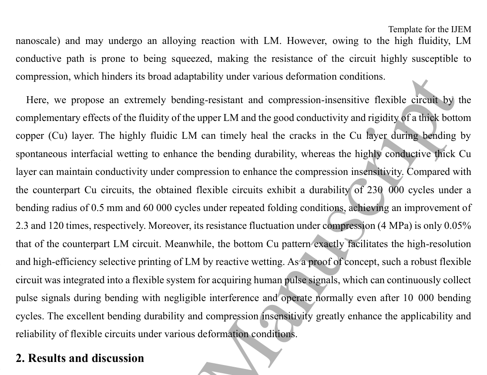
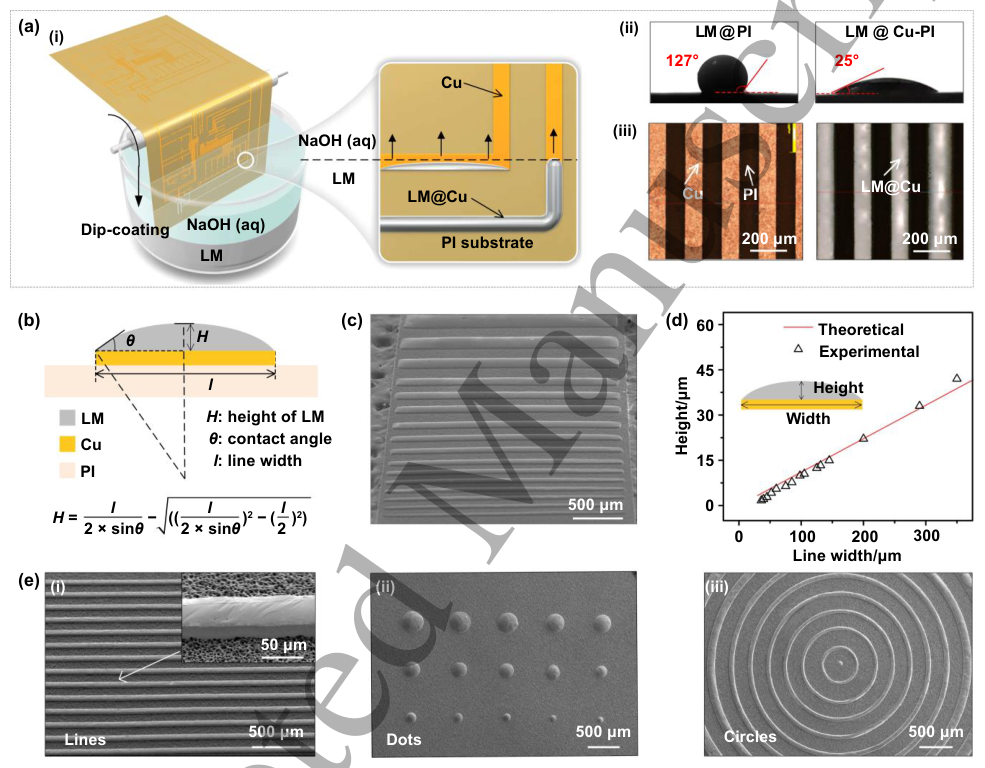
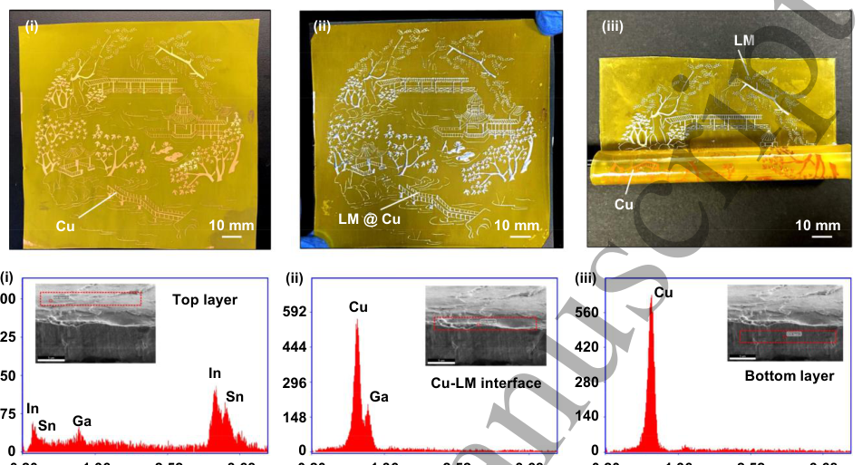
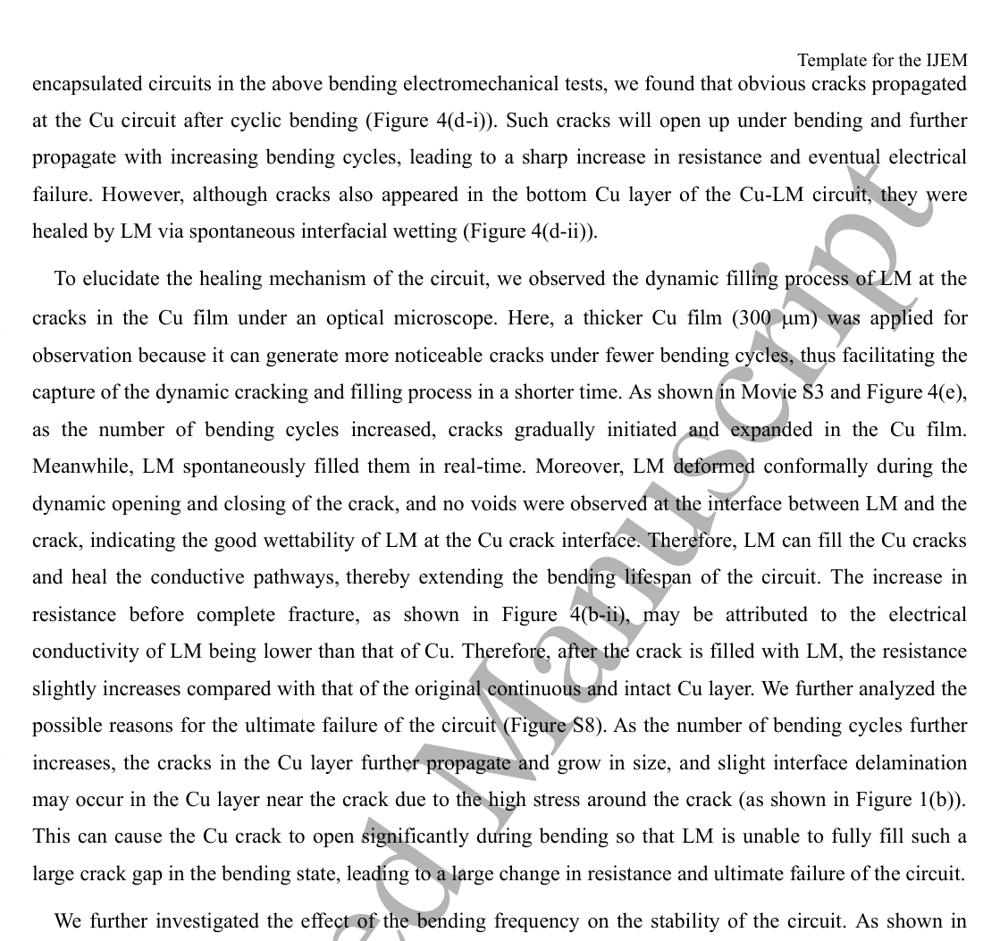
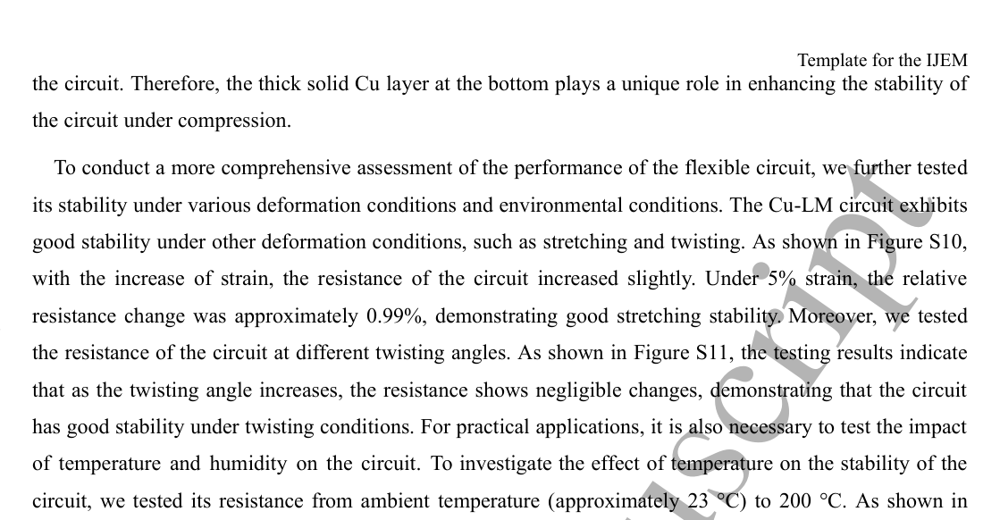
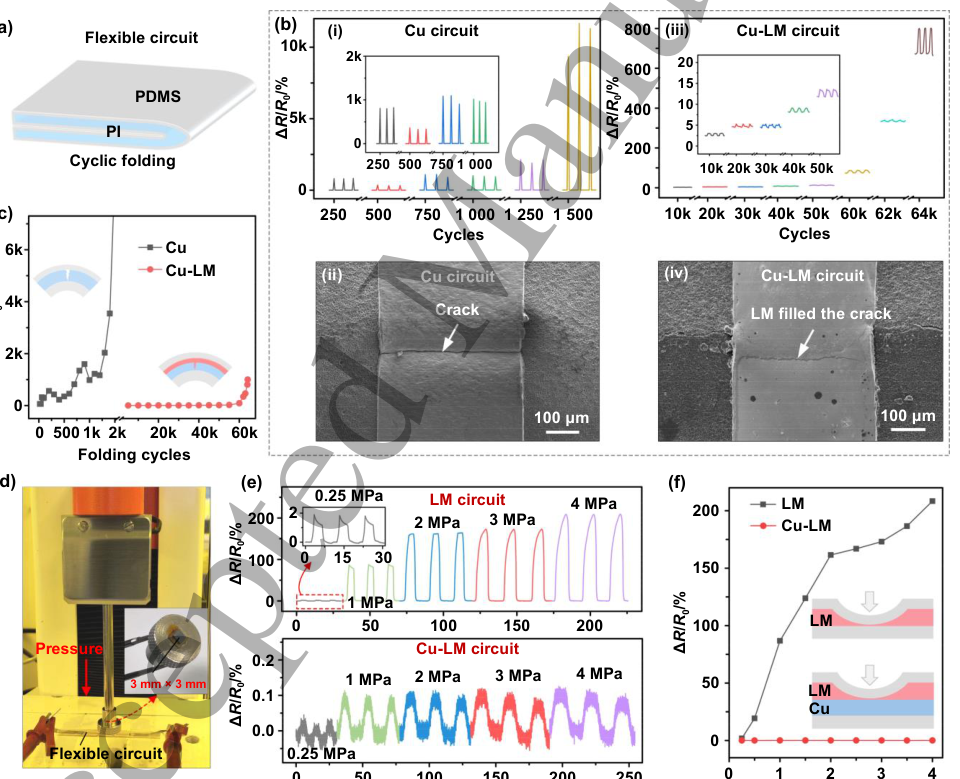
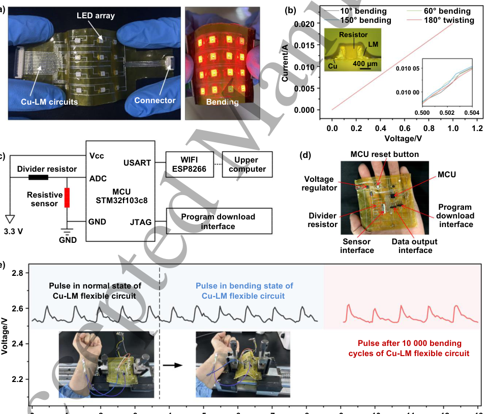

# Extremely bending-resistant and compression-insensitive flexible circuits enabled by real-time crack healing via spontaneous interfacial wetting

- 期刊：International Journal of Extreme Manufacturing
- 日期：2026-09-07
- DOI：10.1088/2631-7990/aea393
- 解析状态：fulltext_draft

## 摘要与研究价值

**Original:** Abstract Flexible circuits that allow stable electrical conductance and signal transmission under deformations are highly required for flexible electronics. However, bending-induced fatigue cracks in solid conductive materials can significantly degrade the stability of flexible circuits. Although liquid metal (LM) is a promising candidate for bending-resistant circuits, LM circuits are prone to being squeezed and susceptible to compression. Here, an extremely bending-resistant and compression-insensitive flexible circuit was achieved by the complementary effects of the fluidity of the upper LM and good conductivity and rigidity of a thick bottom copper (Cu) layer. The fluidic LM can heal Cu cracks in real-time by spontaneous interfacial wetting to enhance the bending durability, while the solid Cu layer can maintain conductivity under compression to enhance the compression-insensitivity. Such flexible circuit achieves a 120-fold improvement in folding lifespan compared to conventional Cu circuit, while its resistance fluctuation under compression is only 0.05% of that of the counterpart LM circuit. Meanwhile, the bottom Cu pattern exactly facilitates the high-resolution selective printing of LM by reactive wetting. As a demonstration, a flexible signal acquisition system constructed with this circuit can continuously capture pulse signals during bending and remains functional after 10000 bending cycles. The simultaneously enhanced bending stability and compression-insensitivity will greatly boost the applicability and reliability of flexible circuits under various deformation conditions.

**中文:** 与柔性触觉相关，但尚未显示对前端触觉计算的直接贡献。摘要可核实数值包括：0.05%。

## 创新点

- Abstract Flexible circuits that allow stable electrical conductance and signal transmission under deformations are highly required for flexible electronics.
- 与柔性触觉相关，但尚未显示对前端触觉计算的直接贡献

## 对当前课题的启发

- 提供机器人、可穿戴或电子皮肤系统任务证据

## 制备与实验步骤

### 1. 成膜与沉积

**Source:** p.4

**Original:** for printing high-resolution pure LM circuits [46-50].

**中文:** 成膜与沉积步骤，关键配比、时间、温度和设备参数以 p.4 原文为准。

### 2. 图形化与结构成形

**Source:** p.4

**Original:** By inheriting the inherent high precision of the photolithography process [51, 52], this method can be used to fabricate very fine LM circuits based on high-precision metal patterns prepared by photolithography.

**中文:** 图形化与结构成形步骤，关键配比、时间、温度和设备参数以 p.4 原文为准。

### 3. 成膜与沉积

**Source:** p.5

**Original:** Meanwhile, the bottom Cu pattern exactly facilitates the high-resolution and high-efficiency selective printing of LM by reactive wetting.

**中文:** 成膜与沉积步骤，关键配比、时间、温度和设备参数以 p.5 原文为准。

### 4. 成膜与沉积

**Source:** p.6

**Original:** Figure 1(f) shows a comparison of the resistance changes between the Cu-LM circuit and the counterpart LM circuit (with only 50 nm of Cu for the selective printing of LM) under compression.

**中文:** 成膜与沉积步骤，关键配比、时间、温度和设备参数以 p.6 原文为准。

## 方法原文锚点

**Source:** p.4 M001

**Original:** for printing high-resolution pure LM circuits [46-50]. By inheriting the inherent high precision of

**中文:** 该段已进入结构化方法步骤；完整逐段翻译待智能体精读补齐。

**Source:** p.4 M002

**Original:** the photolithography process [51, 52], this method can be used to fabricate very fine LM circuits based on

**中文:** 该段已进入结构化方法步骤；完整逐段翻译待智能体精读补齐。

**Source:** p.4 M003

**Original:** high-precision metal patterns prepared by photolithography. Such LM circuits offer excellent stretching and

**中文:** 该段已进入结构化方法步骤；完整逐段翻译待智能体精读补齐。

**Source:** p.4 M004

**Original:** bending performances, but an often neglected issue is their susceptibility to compression. The conductivity

**中文:** 该段已进入结构化方法步骤；完整逐段翻译待智能体精读补齐。

**Source:** p.4 M005

**Original:** of such circuits is provided mainly by the thicker LM layer, as the metal film is often very thin (at the

**中文:** 该段已进入结构化方法步骤；完整逐段翻译待智能体精读补齐。

**Source:** p.4 M006

**Original:** https://mc04.manuscriptcentral.com/ijem-caep

**中文:** 该段已进入结构化方法步骤；完整逐段翻译待智能体精读补齐。

**Source:** p.4 M007

**Original:** 1 2 3 4 5 6 7 8 9 10 11 12 13 14 15 16 17 18 19 20 21 22 23 24 25 26 27 28 29 30 31 32 33 34 35 36 37 38 39 40 41 42 43 44 45 46 47 48 49 50 51 52 53 54 55 56 57 58 59 60

**中文:** 该段已进入结构化方法步骤；完整逐段翻译待智能体精读补齐。

**Source:** p.4 M008

**Original:** 1. Introduction

**中文:** 该段已进入结构化方法步骤；完整逐段翻译待智能体精读补齐。

**Source:** p.4 M009

**Original:** Page 2 of 22

**中文:** 该段已进入结构化方法步骤；完整逐段翻译待智能体精读补齐。

**Source:** p.4 M010

**Original:** 2

**中文:** 该段已进入结构化方法步骤；完整逐段翻译待智能体精读补齐。

**Source:** p.5 M011

**Original:** International Journal of Extreme Manufacturing

**中文:** 该段已进入结构化方法步骤；完整逐段翻译待智能体精读补齐。

**Source:** p.5 M012

**Original:** Template for the IJEM

**中文:** 该段已进入结构化方法步骤；完整逐段翻译待智能体精读补齐。

**Source:** p.5 M013

**Original:** nanoscale) and may undergo an alloying reaction with LM. However, owing to the high fluidity, LM

**中文:** 该段已进入结构化方法步骤；完整逐段翻译待智能体精读补齐。

**Source:** p.5 M014

**Original:** Accepted Manuscript

**中文:** 该段已进入结构化方法步骤；完整逐段翻译待智能体精读补齐。

**Source:** p.5 M015

**Original:** conductive path is prone to being squeezed, making the resistance of the circuit highly susceptible to

**中文:** 该段已进入结构化方法步骤；完整逐段翻译待智能体精读补齐。

**Source:** p.5 M016

**Original:** compression, which hinders its broad adaptability under various deformation conditions.

**中文:** 该段已进入结构化方法步骤；完整逐段翻译待智能体精读补齐。

**Source:** p.5 M017

**Original:** Here, we propose an extremely bending-resistant and compression-insensitive flexible circuit by the

**中文:** 该段已进入结构化方法步骤；完整逐段翻译待智能体精读补齐。

**Source:** p.5 M018

**Original:** complementary effects of the fluidity of the upper LM and the good conductivity and rigidity of a thick bottom

**中文:** 该段已进入结构化方法步骤；完整逐段翻译待智能体精读补齐。

**Source:** p.5 M019

**Original:** copper (Cu) layer. The highly fluidic LM can timely heal the cracks in the Cu layer during bending by

**中文:** 该段已进入结构化方法步骤；完整逐段翻译待智能体精读补齐。

**Source:** p.5 M020

**Original:** spontaneous interfacial wetting to enhance the bending durability, whereas the highly conductive thick Cu

**中文:** 该段已进入结构化方法步骤；完整逐段翻译待智能体精读补齐。

**Source:** p.5 M021

**Original:** layer can maintain conductivity under compression to enhance the compression insensitivity. Compared with

**中文:** 该段已进入结构化方法步骤；完整逐段翻译待智能体精读补齐。

**Source:** p.5 M022

**Original:** the counterpart Cu circuits, the obtained flexible circuits exhibit a durability of 230 000 cycles under a

**中文:** 该段已进入结构化方法步骤；完整逐段翻译待智能体精读补齐。

**Source:** p.5 M023

**Original:** bending radius of 0.5 mm and 60 000 cycles under repeated folding conditions, achieving an improvement of

**中文:** 该段已进入结构化方法步骤；完整逐段翻译待智能体精读补齐。

**Source:** p.5 M024

**Original:** 2.3 and 120 times, respectively. Moreover, its resistance fluctuation under compression (4 MPa) is only 0.05%

**中文:** 该段已进入结构化方法步骤；完整逐段翻译待智能体精读补齐。

**Source:** p.5 M025

**Original:** that of the counterpart LM circuit. Meanwhile, the bottom Cu pattern exactly facilitates the high-resolution

**中文:** 该段已进入结构化方法步骤；完整逐段翻译待智能体精读补齐。

**Source:** p.5 M026

**Original:** and high-efficiency selective printing of LM by reactive wetting. As a proof of concept, such a robust flexible

**中文:** 该段已进入结构化方法步骤；完整逐段翻译待智能体精读补齐。

**Source:** p.5 M027

**Original:** circuit was integrated into a flexible system for acquiring human pulse signals, which can continuously collect

**中文:** 该段已进入结构化方法步骤；完整逐段翻译待智能体精读补齐。

**Source:** p.5 M028

**Original:** pulse signals during bending with negligible interference and operate normally even after 10 000 bending

**中文:** 该段已进入结构化方法步骤；完整逐段翻译待智能体精读补齐。

**Source:** p.5 M029

**Original:** cycles. The excellent bending durability and compression insensitivity greatly enhance the applicability and

**中文:** 该段已进入结构化方法步骤；完整逐段翻译待智能体精读补齐。

**Source:** p.5 M030

**Original:** reliability of flexible circuits under various deformation conditions.

**中文:** 该段已进入结构化方法步骤；完整逐段翻译待智能体精读补齐。

**Source:** p.5 M031

**Original:** Figure 1(a) illustrates the structure and advantage of the bending-resistant and compression-insensitive

**中文:** 该段已进入结构化方法步骤；完整逐段翻译待智能体精读补齐。

**Source:** p.5 M032

**Original:** flexible circuit enabled by real-time crack healing of the bottom Cu layer by spontaneous interfacial wetting of

**中文:** 该段已进入结构化方法步骤；完整逐段翻译待智能体精读补齐。

**Source:** p.5 M033

**Original:** the upper LM. For conventional flexible circuits consisting of rigid metal films and polymer substrates, cracks

**中文:** 该段已进入结构化方法步骤；完整逐段翻译待智能体精读补齐。

**Source:** p.5 M034

**Original:** often propagate in the metal films during repeated bending cycles due to interface delamination, excessive

**中文:** 该段已进入结构化方法步骤；完整逐段翻译待智能体精读补齐。

**Source:** p.5 M035

**Original:** local stress, or fatigue damage (Figure 1(a-i)), leading to abrupt resistance change or even complete loss of

**中文:** 该段已进入结构化方法步骤；完整逐段翻译待智能体精读补齐。

**Source:** p.5 M036

**Original:** electrical functionality, which severely affects the continuous operation stability and lifespan of the electronic

**中文:** 该段已进入结构化方法步骤；完整逐段翻译待智能体精读补齐。

**Source:** p.5 M037

**Original:** systems. As a potential alternative to solid metal circuits, LM circuits exhibit good bending stability owing to

**中文:** 该段已进入结构化方法步骤；完整逐段翻译待智能体精读补齐。

**Source:** p.5 M038

**Original:** their excellent fluidity. However, this also causes the LM channels to be prone to undergoing a significant

**中文:** 该段已进入结构化方法步骤；完整逐段翻译待智能体精读补齐。

**Source:** p.5 M039

**Original:** reduction in cross-sectional area under compression, making the resistance of the circuit highly susceptible to

**中文:** 该段已进入结构化方法步骤；完整逐段翻译待智能体精读补齐。

**Source:** p.5 M040

**Original:** pressure (Figure 1(a-ii)). To address this conflict, we propose a bending-resistant and compression-insensitive

**中文:** 该段已进入结构化方法步骤；完整逐段翻译待智能体精读补齐。

**Source:** p.5 M041

**Original:** flexible circuit consisting of a bottom thick Cu layer and an LM healing layer (Figure 1(a-iii)). When cracks

**中文:** 该段已进入结构化方法步骤；完整逐段翻译待智能体精读补齐。

**Source:** p.5 M042

**Original:** propagate in the Cu film during bending, LM can fill and bridge the cracks in real-time through spontaneous

**中文:** 该段已进入结构化方法步骤；完整逐段翻译待智能体精读补齐。

**Source:** p.5 M043

**Original:** interfacial wetting, thus enhancing the bending stability of the flexible circuits. Meanwhile, the rigid thick Cu

**中文:** 该段已进入结构化方法步骤；完整逐段翻译待智能体精读补齐。

**Source:** p.5 M044

**Original:** layer can withstand higher pressure under compression, which enables the resistance of the circuit being less

**中文:** 该段已进入结构化方法步骤；完整逐段翻译待智能体精读补齐。

**Source:** p.5 M045

**Original:** affected by squeezing, thereby achieving a win-win combination of excellent bending durability and

**中文:** 该段已进入结构化方法步骤；完整逐段翻译待智能体精读补齐。

**Source:** p.5 M046

**Original:** compression insensitivity. A comparison of the scanning electron microscope (SEM) images of the Cu circuit

**中文:** 该段已进入结构化方法步骤；完整逐段翻译待智能体精读补齐。

**Source:** p.5 M047

**Original:** https://mc04.manuscriptcentral.com/ijem-caep

**中文:** 该段已进入结构化方法步骤；完整逐段翻译待智能体精读补齐。

**Source:** p.5 M048

**Original:** Page 3 of 22

**中文:** 该段已进入结构化方法步骤；完整逐段翻译待智能体精读补齐。

**Source:** p.5 M049

**Original:** 1 2 3 4 5 6 7 8 9 10 11 12 13 14 15 16 17 18 19 20 21 22 23 24 25 26 27 28 29 30 31 32 33 34 35 36 37 38 39 40 41 42 43 44 45 46 47 48 49 50 51 52 53 54 55 56 57 58 59 60

**中文:** 该段已进入结构化方法步骤；完整逐段翻译待智能体精读补齐。

**Source:** p.5 M050

**Original:** 2. Results and discussion

**中文:** 该段已进入结构化方法步骤；完整逐段翻译待智能体精读补齐。

**Source:** p.5 M051

**Original:** 3

**中文:** 该段已进入结构化方法步骤；完整逐段翻译待智能体精读补齐。

**Source:** p.6 M052

**Original:** International Journal of Extreme Manufacturing

**中文:** 该段已进入结构化方法步骤；完整逐段翻译待智能体精读补齐。

**Source:** p.6 M053

**Original:** Template for the IJEM

**中文:** 该段已进入结构化方法步骤；完整逐段翻译待智能体精读补齐。

**Source:** p.6 M054

**Original:** and our Cu-LM circuit after bending confirms the role of LM in healing fatigue cracks (Figure 1(b)). Figure

**中文:** 该段已进入结构化方法步骤；完整逐段翻译待智能体精读补齐。

**Source:** p.6 M055

**Original:** Accepted Manuscript

**中文:** 该段已进入结构化方法步骤；完整逐段翻译待智能体精读补齐。

**Source:** p.6 M056

**Original:** 1(c) shows an image of the Cu-LM flexible circuit after being stored for 60 days in an ambient environment.

**中文:** 该段已进入结构化方法步骤；完整逐段翻译待智能体精读补齐。

**Source:** p.6 M057

**Original:** The upper surface and bottom layer of the circuit still exhibited distinguishable colors of LM and Cu, proving

**中文:** 该段已进入结构化方法步骤；完整逐段翻译待智能体精读补齐。

**Source:** p.6 M058

**Original:** that the bilayer metal films can maintain their respective morphologies stably over a long time without

**中文:** 该段已进入结构化方法步骤；完整逐段翻译待智能体精读补齐。

**Source:** p.6 M059

**Original:** undergoing serious alloying reactions (details are discussed in Figure 3). Moreover, the bending-resistant

**中文:** 该段已进入结构化方法步骤；完整逐段翻译待智能体精读补齐。

**Source:** p.6 M060

**Original:** flexible circuits are compatible with different commercial standard connectors to achieve stable electrical

**中文:** 该段已进入结构化方法步骤；完整逐段翻译待智能体精读补齐。

**Source:** p.6 M061

**Original:** interconnection (Figure S1). Taking advantage of the excellent electrical stability, this flexible circuit can

**中文:** 该段已进入结构化方法步骤；完整逐段翻译待智能体精读补齐。

**Source:** p.6 M062

**Original:** interconnect various electronic components to integrate into a flexible signal acquisition system for human

**中文:** 该段已进入结构化方法步骤；完整逐段翻译待智能体精读补齐。

**Source:** p.6 M063

**Original:** pulse (Figure 1(d)), which can stably acquire pulse signals of humans even after 10 000 bending cycles. Figure

**中文:** 该段已进入结构化方法步骤；完整逐段翻译待智能体精读补齐。

**Source:** p.6 M064

**Original:** 1(e) shows the comparison of the cyclic folding durability between the Cu-LM flexible circuit and the

**中文:** 该段已进入结构化方法步骤；完整逐段翻译待智能体精读补齐。

**Source:** p.6 M065

**Original:** conventional Cu circuit. The results show that the resistance of the conventional Cu circuit began to fluctuate

**中文:** 该段已进入结构化方法步骤；完整逐段翻译待智能体精读补齐。

**Source:** p.6 M066

**Original:** dramatically after a few hundred cycles, whereas the Cu-LM circuit maintained extremely high stability over a

**中文:** 该段已进入结构化方法步骤；完整逐段翻译待智能体精读补齐。

**Source:** p.6 M067

**Original:** long period of time. Specifically, the relative resistance change (in the folded state) of the conventional Cu

**中文:** 该段已进入结构化方法步骤；完整逐段翻译待智能体精读补齐。

**Source:** p.6 M068

**Original:** circuit reached more than 300% after just 500 folding cycles, while that of the Cu-LM circuit could remain

**中文:** 该段已进入结构化方法步骤；完整逐段翻译待智能体精读补齐。

**Source:** p.6 M069

**Original:** below 300% even after 60 000 folding cycles, thereby achieving at least a 120-fold improvement in the

**中文:** 该段已进入结构化方法步骤；完整逐段翻译待智能体精读补齐。

**Source:** p.6 M070

**Original:** folding lifespan. These results indicate the significant role of real-time-healing cracks in enhancing stability

**中文:** 该段已进入结构化方法步骤；完整逐段翻译待智能体精读补齐。

**Source:** p.6 M071

**Original:** and prolonging the lifespan of flexible circuits. Figure 1(f) shows a comparison of the resistance changes

**中文:** 该段已进入结构化方法步骤；完整逐段翻译待智能体精读补齐。

**Source:** p.6 M072

**Original:** between the Cu-LM circuit and the counterpart LM circuit (with only 50 nm of Cu for the selective printing of

**中文:** 该段已进入结构化方法步骤；完整逐段翻译待智能体精读补齐。

**Source:** p.6 M073

**Original:** LM) under compression. Under a pressure of 4 MPa, the resistance of the LM circuit increased by 208.4%,

**中文:** 该段已进入结构化方法步骤；完整逐段翻译待智能体精读补齐。

**Source:** p.6 M074

**Original:** whereas that of the Cu-LM circuit increased by only 0.11%, demonstrating that the thick Cu layer plays an

**中文:** 该段已进入结构化方法步骤；完整逐段翻译待智能体精读补齐。

**Source:** p.6 M075

**Original:** important role in enhancing the compression insensitivity of the circuit. As shown in Figure 1(g), the bending

**中文:** 该段已进入结构化方法步骤；完整逐段翻译待智能体精读补齐。

**Source:** p.6 M076

**Original:** durability of our flexible circuit is superior to the reported performances of other flexible circuits [16, 17, 21,

**中文:** 该段已进入结构化方法步骤；完整逐段翻译待智能体精读补齐。

**Source:** p.6 M077

**Original:** 30, 53-59], as it can withstand more bending cycles under extremely small bending radii (<1 mm) while

**中文:** 该段已进入结构化方法步骤；完整逐段翻译待智能体精读补齐。

**Source:** p.6 M078

**Original:** maintaining very low resistance changes. Such excellent bending durability and conductivity are attributed to

**中文:** 该段已进入结构化方法步骤；完整逐段翻译待智能体精读补齐。

**Source:** p.6 M079

**Original:** the real-time healing of cracks by the highly fluidic LM, as well as the inherently excellent electrical

**中文:** 该段已进入结构化方法步骤；完整逐段翻译待智能体精读补齐。

**Source:** p.6 M080

**Original:** conductivity and ability to maintain the shape of solid Cu film under extremely small bending radii, which

**中文:** 该段已进入结构化方法步骤；完整逐段翻译待智能体精读补齐。

**Source:** p.6 M081

**Original:** avoids possible flow interruption of pure LM due to squeezing of the channel under extremely small bending

**中文:** 该段已进入结构化方法步骤；完整逐段翻译待智能体精读补齐。

**Source:** p.6 M082

**Original:** https://mc04.manuscriptcentral.com/ijem-caep

**中文:** 该段已进入结构化方法步骤；完整逐段翻译待智能体精读补齐。

**Source:** p.6 M083

**Original:** 1 2 3 4 5 6 7 8 9 10 11 12 13 14 15 16 17 18 19 20 21 22 23 24 25 26 27 28 29 30 31 32 33 34 35 36 37 38 39 40 41 42 43 44 45 46 47 48 49 50 51 52 53 54 55 56 57 58 59 60

**中文:** 该段已进入结构化方法步骤；完整逐段翻译待智能体精读补齐。

**Source:** p.6 M084

**Original:** radii [56].

**中文:** 该段已进入结构化方法步骤；完整逐段翻译待智能体精读补齐。

**Source:** p.6 M085

**Original:** Page 4 of 22

**中文:** 该段已进入结构化方法步骤；完整逐段翻译待智能体精读补齐。

**Source:** p.6 M086

**Original:** 4

**中文:** 该段已进入结构化方法步骤；完整逐段翻译待智能体精读补齐。

**Source:** p.7 M087

**Original:** International Journal of Extreme Manufacturing

**中文:** 该段已进入结构化方法步骤；完整逐段翻译待智能体精读补齐。

**Source:** p.7 M088

**Original:** Template for the IJEM

**中文:** 该段已进入结构化方法步骤；完整逐段翻译待智能体精读补齐。

**Source:** p.7 M089

**Original:** Liquid metal (LM)

**中文:** 该段已进入结构化方法步骤；完整逐段翻译待智能体精读补齐。

**Source:** p.7 M090

**Original:** Accepted Manuscript

**中文:** 该段已进入结构化方法步骤；完整逐段翻译待智能体精读补齐。

**Source:** p.7 M091

**Original:** Susceptible to compression Compression-insensitive (ii)

**中文:** 该段已进入结构化方法步骤；完整逐段翻译待智能体精读补齐。

**Source:** p.7 M092

**Original:** 10 mm 20 mm

**中文:** 该段已进入结构化方法步骤；完整逐段翻译待智能体精读补齐。

**Source:** p.7 M093

**Original:** Figure 1. Mechanism and structure of the real-time healing bending-resistant and compression-insensitive

**中文:** 该段已进入结构化方法步骤；完整逐段翻译待智能体精读补齐。

**Source:** p.7 M094

**Original:** flexible circuit. (a) Mechanism and advantage of the bending-resistant and compression-insensitive flexible

**中文:** 该段已进入结构化方法步骤；完整逐段翻译待智能体精读补齐。

**Source:** p.7 M095

**Original:** circuit (iii) compared to conventional Cu circuit (i) and LM circuit (ii). (b) SEM images of the conventional

**中文:** 该段已进入结构化方法步骤；完整逐段翻译待智能体精读补齐。

**Source:** p.7 M096

**Original:** Cu circuit and our Cu-LM circuit after cyclic bending. (c) Optical image of the flexible circuit. (d) Application

**中文:** 该段已进入结构化方法步骤；完整逐段翻译待智能体精读补齐。

**Source:** p.7 M097

**Original:** demonstration of the flexible circuit for wearable signal acquisition system for human pulse by

**中文:** 该段已进入结构化方法步骤；完整逐段翻译待智能体精读补齐。

**Source:** p.7 M098

**Original:** interconnecting with multiple electronic components. (e) Enhanced stability and extended lifespan of the

**中文:** 该段已进入结构化方法步骤；完整逐段翻译待智能体精读补齐。

**Source:** p.7 M099

**Original:** Cu-LM flexible circuit compared to conventional Cu circuit. (f) Enhanced compression insensitivity of the

**中文:** 该段已进入结构化方法步骤；完整逐段翻译待智能体精读补齐。

**Source:** p.7 M100

**Original:** Cu-LM flexible circuit compared to conventional LM circuit. (g) Comparison of the bending durability with

**中文:** 该段已进入结构化方法步骤；完整逐段翻译待智能体精读补齐。

## 图表解读

### Figure 1

**Source:** p.5

**Original caption:** Figure 1(a) illustrates the structure and advantage of the bending-resistant and compression-insensitive

**中文图注:** Figure 1 原始图注已提取；逐项含义见下方分图说明。

**Reading note:** 重点查看器件结构、材料层次、信号路径和制备流程。

- (a) 重点查看器件结构、材料层次、信号路径和制备流程。 原文：illustrates the structure and advantage of the bending-resistant and compression-insensitive

### Figure 2

**Source:** p.9

**Original caption:** Figure 2. Patterning LM by a simple dip-coating method via selective interfacial wetting. (a) Patterning

**中文图注:** Figure 2 原始图注已提取；逐项含义见下方分图说明。

**Reading note:** 结合正文首次引用位置和原始图注核对该图的证据角色。

- (a) 结合正文首次引用位置和原始图注核对该图的证据角色。 原文：Patterning

### Figure 3

**Source:** p.11

**Original caption:** Figure 3. Large-area manufacturing and long-term stability of the Cu-LM pattern. (a) Optical images of a

**中文图注:** Figure 3 原始图注已提取；逐项含义见下方分图说明。

**Reading note:** 重点查看阵列规模、空间分辨率、串扰、读出通道和空间特征表达。

- (a) 重点查看阵列规模、空间分辨率、串扰、读出通道和空间特征表达。 原文：Optical images of a

### Figure 4

**Source:** p.12

**Original caption:** Figure 4(f)–(h), with increasing bending frequency, the bending durability of the circuit decreases.

**中文图注:** Figure 4 原始图注已提取；逐项含义见下方分图说明。

**Reading note:** 结合正文首次引用位置和原始图注核对该图的证据角色。

### Figure S12

**Source:** p.15

**Original caption:** Figure S12, the resistance of the circuit increased slightly with increasing temperature. The increase in

**中文图注:** Figure S12 原始图注已提取；逐项含义见下方分图说明。

**Reading note:** 结合正文首次引用位置和原始图注核对该图的证据角色。

### Figure 5

**Source:** p.16

**Original caption:** Figure 5. Folding and compression performances of the Cu-LM flexible circuits. (a) Schematic illustration

**中文图注:** Figure 5 原始图注已提取；逐项含义见下方分图说明。

**Reading note:** 重点查看器件结构、材料层次、信号路径和制备流程。

- (a) 重点查看器件结构、材料层次、信号路径和制备流程。 原文：Schematic illustration

### Figure 6

**Source:** p.18

**Original caption:** Figure 6. Interconnection reliability and robust flexible integrated system for acquiring human pulse signals.

**中文图注:** Figure 6 原始图注已提取；逐项含义见下方分图说明。

**Reading note:** 结合正文首次引用位置和原始图注核对该图的证据角色。
