# Hydrogel-Based Flexible Sensors: From Manufacturing Strategies to Sensing Applications

- 期刊：International Journal of Extreme Manufacturing
- 日期：2026-09-08
- DOI：10.1088/2631-7990/aea3e5
- 解析状态：fulltext_draft

## 摘要与研究价值

**原文摘要:** Abstract Hydrogel-based flexible sensors combine tissue-like mechanical properties with superior sensing performance, showing immense potential in human-machine interaction, soft robotics, and health monitoring. Although significant progress has been made in related research, the fabrication of precision structures, the environmental tolerance of materials, and the heterogeneous integration between materials and devices remain key research challenges. In response to these challenges, this review provides a comprehensive review of the latest progress in hydrogel-based sensors, covering the entire process from material fabrication and functional regulation to interface engineering. First, the impacts of advanced processing techniques such as solution processing, microstructure molding, photolithography, additive manufacturing, and fiber spinning on film structure are discussed in detail. Subsequently, physicochemical strategies for enhancing sensing performance and environmental tolerance are analyzed. Furthermore, diverse assembly schemes and interface engineering strategies are highlighted. Finally, typical applications in pressure, strain, environmental, and physiological signal monitoring are summarized. This review aims to provide guidance for the development of next-generation high-performance and stable flexible electronic systems.

**中文直译:** 等待智能体翻译补充。

**中文总结:** 待基于原文摘要生成中文总结；当前仅完成题录/摘要级筛选。

## 创新点

- Abstract Hydrogel-based flexible sensors combine tissue-like mechanical properties with superior sensing performance, showing immense potential in human-machine interaction, soft robotics, and health monitoring.

## 对当前课题的启发

- 可用于低离散/装配容差触觉界面的结构与对照设计
- 提供机器人、可穿戴或电子皮肤系统任务证据

## 制备与实验步骤

### 1. 组装与封装

**Source:** p.7

**Original:** Second, synergistically optimising synthetic strategies and encapsulation techniques to confer structural integrity and functional stability across diverse environments remains an urgent manufacturing challenge[52].

**中文:** 组装与封装步骤，关键配比、时间、温度和设备参数以 p.7 原文为准。

### 2. 制备与实验操作

**Source:** p.7

**Original:** Moreover, the fabrication of flexible sensors inherently involves a cross-scale heterogeneous integration process.

**中文:** 制备与实验操作步骤，关键配比、时间、温度和设备参数以 p.7 原文为准。

### 3. 组装与封装

**Source:** p.7

**Original:** The unique ‘soft and wet’ properties of hydrogels result in significant mechanical mismatches with rigid electrodes and encapsulation layers[53, 54].

**中文:** 组装与封装步骤，关键配比、时间、温度和设备参数以 p.7 原文为准。

### 4. 制备与实验操作

**Source:** p.7

**Original:** This review comprehensively explores the latest research advances in hydrogel-based flexible sensors and systematically investigates hydrogel synthesis techniques, functional tuning strategies, sensor assembly processes, application domains, as well as current challenges and future development trends (see Figure 2).

**中文:** 制备与实验操作步骤，关键配比、时间、温度和设备参数以 p.7 原文为准。

### 5. 图形化与结构成形

**Source:** p.7

**Original:** The structure of this paper is as follows: section 2 provides a comprehensive overview of advanced manufacturing techniques for hydrogels, encompassing solution processing, microstructure molding, photolithography, additive manufacturing, and fiber spinning, which serve as the cornerstone for achieving customised device structures.

**中文:** 图形化与结构成形步骤，关键配比、时间、温度和设备参数以 p.7 原文为准。

### 6. 组装与封装

**Source:** p.8

**Original:** Section 4 summarizes structural design principles for hydrogel-based sensors, focusing on heterogeneous interface connection strategies and device encapsulation solutions.

**中文:** 组装与封装步骤，关键配比、时间、温度和设备参数以 p.8 原文为准。

### 7. 制备与实验操作

**Source:** p.8

**Original:** This review aims to provide systematic theoretical underpinnings for the preparation of high-performance hydrogels and the design and fabrication of sensors.

**中文:** 制备与实验操作步骤，关键配比、时间、温度和设备参数以 p.8 原文为准。

### 8. 制备与实验操作

**Source:** p.8

**Original:** Image for “first fabrication of

**中文:** 制备与实验操作步骤，关键配比、时间、温度和设备参数以 p.8 原文为准。

### 9. 制备与实验操作

**Source:** p.8

**Original:** Transparent and conformal ‘piezoionic’ touch sensor[25] Hydrogel-based Pressure sensor[24] electrode[32] Ionic hydrogel-based strain sensor[23] PVA hydrogel PDMS Al electrode Ni fabric electrode Hydrogel substrate First fabrication of conductivity hydrogel[11] Triboelectric nanogenerator[26] Intelligent window[12]

**中文:** 制备与实验操作步骤，关键配比、时间、温度和设备参数以 p.8 原文为准。

## 方法原文锚点

**Source:** p.7 M001

**Original:** alone struggles to meet the demand for the precise micro- and nano-scale structural control required

**中文:** 该段已进入结构化方法步骤；完整逐段翻译待智能体精读补齐。

**Source:** p.7 M002

**Original:** by next-generation sensors. Second, synergistically optimising synthetic strategies and encapsulation

**中文:** 该段已进入结构化方法步骤；完整逐段翻译待智能体精读补齐。

**Source:** p.7 M003

**Original:** techniques to confer structural integrity and functional stability across diverse environments remains an urgent

**中文:** 该段已进入结构化方法步骤；完整逐段翻译待智能体精读补齐。

**Source:** p.7 M004

**Original:** manufacturing challenge[52]. Moreover, the fabrication of flexible sensors inherently involves a cross-scale

**中文:** 该段已进入结构化方法步骤；完整逐段翻译待智能体精读补齐。

**Source:** p.7 M005

**Original:** heterogeneous integration process. The unique ‘soft and wet’ properties of hydrogels result in significant

**中文:** 该段已进入结构化方法步骤；完整逐段翻译待智能体精读补齐。

**Source:** p.7 M006

**Original:** mechanical mismatches with rigid electrodes and encapsulation layers[53, 54]. The establishment of robust

**中文:** 该段已进入结构化方法步骤；完整逐段翻译待智能体精读补齐。

**Source:** p.7 M007

**Original:** heterogeneous interfaces during manufacturing to prevent delamination and failure under dynamic loads

**中文:** 该段已进入结构化方法步骤；完整逐段翻译待智能体精读补齐。

**Source:** p.7 M008

**Original:** represents a major technical bottleneck in current device processing.

**中文:** 该段已进入结构化方法步骤；完整逐段翻译待智能体精读补齐。

**Source:** p.7 M009

**Original:** This review comprehensively explores the latest research advances in hydrogel-based flexible sensors

**中文:** 该段已进入结构化方法步骤；完整逐段翻译待智能体精读补齐。

**Source:** p.7 M010

**Original:** and systematically investigates hydrogel synthesis techniques, functional tuning strategies, sensor assembly

**中文:** 该段已进入结构化方法步骤；完整逐段翻译待智能体精读补齐。

**Source:** p.7 M011

**Original:** processes, application domains, as well as current challenges and future development trends (see Figure 2).

**中文:** 该段已进入结构化方法步骤；完整逐段翻译待智能体精读补齐。

**Source:** p.7 M012

**Original:** The structure of this paper is as follows: section 2 provides a comprehensive overview of advanced

**中文:** 该段已进入结构化方法步骤；完整逐段翻译待智能体精读补齐。

**Source:** p.7 M013

**Original:** manufacturing techniques for hydrogels, encompassing solution processing, microstructure molding,

**中文:** 该段已进入结构化方法步骤；完整逐段翻译待智能体精读补齐。

**Source:** p.7 M014

**Original:** photolithography, additive manufacturing, and fiber spinning, which serve as the cornerstone for achieving

**中文:** 该段已进入结构化方法步骤；完整逐段翻译待智能体精读补齐。

**Source:** p.7 M015

**Original:** customised device structures. Section 3 introduces performance-tuning strategies for hydrogels, systematically

**中文:** 该段已进入结构化方法步骤；完整逐段翻译待智能体精读补齐。

**Source:** p.7 M016

**Original:** 1 2 3 4 5 6 7 8 9 10 11 12 13 14 15 16 17 18 19 20 21 22 23 24 25 26 27 28 29 30 31 32 33 34 35 36 37 38 39 40 41 42 43 44 45 46 47 48 49 50 51 52 53 54 55 56 57 58 59 60

**中文:** 该段已进入结构化方法步骤；完整逐段翻译待智能体精读补齐。

**Source:** p.7 M017

**Original:** 5

**中文:** 该段已进入结构化方法步骤；完整逐段翻译待智能体精读补齐。

**Source:** p.7 M018

**Original:** https://mc04.manuscriptcentral.com/ijem-caep

**中文:** 该段已进入结构化方法步骤；完整逐段翻译待智能体精读补齐。

**Source:** p.7 M019

**Original:** Accepted Manuscript

**中文:** 该段已进入结构化方法步骤；完整逐段翻译待智能体精读补齐。

**Source:** p.8 M020

**Original:** International Journal of Extreme Manufacturing

**中文:** 该段已进入结构化方法步骤；完整逐段翻译待智能体精读补齐。

**Source:** p.8 M021

**Original:** examining approaches to constructing conductive networks, designing for extreme environmental adaptability,

**中文:** 该段已进入结构化方法步骤；完整逐段翻译待智能体精读补齐。

**Source:** p.8 M022

**Original:** Accepted Manuscript

**中文:** 该段已进入结构化方法步骤；完整逐段翻译待智能体精读补齐。

**Source:** p.8 M023

**Original:** implementing self-healing mechanisms, achieving biocompatibility, and imparting antimicrobial properties.

**中文:** 该段已进入结构化方法步骤；完整逐段翻译待智能体精读补齐。

**Source:** p.8 M024

**Original:** Section 4 summarizes structural design principles for hydrogel-based sensors, focusing on heterogeneous

**中文:** 该段已进入结构化方法步骤；完整逐段翻译待智能体精读补齐。

**Source:** p.8 M025

**Original:** interface connection strategies and device encapsulation solutions. Section 5 outlines the applications of

**中文:** 该段已进入结构化方法步骤；完整逐段翻译待智能体精读补齐。

**Source:** p.8 M026

**Original:** hydrogel-based sensors in monitoring pressure, strain, environment, and bioelectrical signals, demonstrating

**中文:** 该段已进入结构化方法步骤；完整逐段翻译待智能体精读补齐。

**Source:** p.8 M027

**Original:** their immense potential in flexible electronics and intelligent systems. Finally, Section 6 analyses unresolved

**中文:** 该段已进入结构化方法步骤；完整逐段翻译待智能体精读补齐。

**Source:** p.8 M028

**Original:** key issues and technical bottlenecks in current hydrogel-based sensor research while outlining future

**中文:** 该段已进入结构化方法步骤；完整逐段翻译待智能体精读补齐。

**Source:** p.8 M029

**Original:** development directions. This review aims to provide systematic theoretical underpinnings for the preparation

**中文:** 该段已进入结构化方法步骤；完整逐段翻译待智能体精读补齐。

**Source:** p.8 M030

**Original:** of high-performance hydrogels and the design and fabrication of sensors. Concurrently, it is hoped that this

**中文:** 该段已进入结构化方法步骤；完整逐段翻译待智能体精读补齐。

**Source:** p.8 M031

**Original:** work provides a reference framework for in-depth interdisciplinary research in this field and for engineering

**中文:** 该段已进入结构化方法步骤；完整逐段翻译待智能体精读补齐。

**Source:** p.8 M032

**Original:** 2018 2016 2014

**中文:** 该段已进入结构化方法步骤；完整逐段翻译待智能体精读补齐。

**Source:** p.8 M033

**Original:** Hydrogel-based pH sensors[21]

**中文:** 该段已进入结构化方法步骤；完整逐段翻译待智能体精读补齐。

**Source:** p.8 M034

**Original:** Hydrogel devices for biomedical

**中文:** 该段已进入结构化方法步骤；完整逐段翻译待智能体精读补齐。

**Source:** p.8 M035

**Original:** First report of self-healing hydrogel[15]

**中文:** 该段已进入结构化方法步骤；完整逐段翻译待智能体精读补齐。

**Source:** p.8 M036

**Original:** Undamaged Damaged Healed

**中文:** 该段已进入结构化方法步骤；完整逐段翻译待智能体精读补齐。

**Source:** p.8 M037

**Original:** Low-temperature organohydrogel sensor[20]

**中文:** 该段已进入结构化方法步骤；完整逐段翻译待智能体精读补齐。

**Source:** p.8 M038

**Original:** Figure 1. The timeline of the development of hydrogels and hydrogel-based sensors. Image for “first fabrication of

**中文:** 该段已进入结构化方法步骤；完整逐段翻译待智能体精读补齐。

**Source:** p.8 M039

**Original:** 6

**中文:** 该段已进入结构化方法步骤；完整逐段翻译待智能体精读补齐。

**Source:** p.8 M040

**Original:** https://mc04.manuscriptcentral.com/ijem-caep

**中文:** 该段已进入结构化方法步骤；完整逐段翻译待智能体精读补齐。

**Source:** p.8 M041

**Original:** 1 2 3 4 5 6 7 8 9 10 11 12 13 14 15 16 17 18 19 20 21 22 23 24 25 26 27 28 29 30 31 32 33 34 35 36 37 38 39 40 41 42 43 44 45 46 47 48 49 50 51 52 53 54 55 56 57 58 59 60

**中文:** 该段已进入结构化方法步骤；完整逐段翻译待智能体精读补齐。

**Source:** p.8 M042

**Original:** applications of flexible electronic devices.

**中文:** 该段已进入结构化方法步骤；完整逐段翻译待智能体精读补齐。

**Source:** p.8 M043

**Original:** Transparent and conformal ‘piezoionic’ touch sensor[25]

**中文:** 该段已进入结构化方法步骤；完整逐段翻译待智能体精读补齐。

**Source:** p.8 M044

**Original:** Hydrogel-based

**中文:** 该段已进入结构化方法步骤；完整逐段翻译待智能体精读补齐。

**Source:** p.8 M045

**Original:** Pressure sensor[24]

**中文:** 该段已进入结构化方法步骤；完整逐段翻译待智能体精读补齐。

**Source:** p.8 M046

**Original:** electrode[32]

**中文:** 该段已进入结构化方法步骤；完整逐段翻译待智能体精读补齐。

**Source:** p.8 M047

**Original:** Ionic hydrogel-based strain sensor[23]

**中文:** 该段已进入结构化方法步骤；完整逐段翻译待智能体精读补齐。

**Source:** p.8 M048

**Original:** PVA hydrogel PDMS Al electrode Ni fabric electrode Hydrogel substrate

**中文:** 该段已进入结构化方法步骤；完整逐段翻译待智能体精读补齐。

**Source:** p.8 M049

**Original:** First fabrication of conductivity hydrogel[11]

**中文:** 该段已进入结构化方法步骤；完整逐段翻译待智能体精读补齐。

**Source:** p.8 M050

**Original:** Triboelectric

**中文:** 该段已进入结构化方法步骤；完整逐段翻译待智能体精读补齐。

**Source:** p.8 M051

**Original:** nanogenerator[26]

**中文:** 该段已进入结构化方法步骤；完整逐段翻译待智能体精读补齐。

**Source:** p.8 M052

**Original:** Intelligent window[12]

**中文:** 该段已进入结构化方法步骤；完整逐段翻译待智能体精读补齐。

**Source:** p.8 M053

**Original:** 2010 2012

**中文:** 该段已进入结构化方法步骤；完整逐段翻译待智能体精读补齐。

**Source:** p.8 M054

**Original:** 1894

**中文:** 该段已进入结构化方法步骤；完整逐段翻译待智能体精读补齐。

**Source:** p.8 M055

**Original:** 1960

**中文:** 该段已进入结构化方法步骤；完整逐段翻译待智能体精读补齐。

**Source:** p.8 M056

**Original:** 1990s

**中文:** 该段已进入结构化方法步骤；完整逐段翻译待智能体精读补齐。

**Source:** p.8 M057

**Original:** 2008 2003

**中文:** 该段已进入结构化方法步骤；完整逐段翻译待智能体精读补齐。

**Source:** p.8 M058

**Original:** The term ‘hydrogel’ was initially conceived[8]

**中文:** 该段已进入结构化方法步骤；完整逐段翻译待智能体精读补齐。

**Source:** p.8 M059

**Original:** applications[19]

**中文:** 该段已进入结构化方法步骤；完整逐段翻译待智能体精读补齐。

**Source:** p.8 M060

**Original:** The first biocompatible soft contact lens was designed[9]

**中文:** 该段已进入结构化方法步骤；完整逐段翻译待智能体精读补齐。

**Source:** p.8 M061

**Original:** First proposal of high-strength hydrogels[14]

**中文:** 该段已进入结构化方法步骤；完整逐段翻译待智能体精读补齐。

**Source:** p.8 M062

**Original:** Page 6 of 110

**中文:** 该段已进入结构化方法步骤；完整逐段翻译待智能体精读补齐。

**Source:** p.8 M063

**Original:** Hollow

**中文:** 该段已进入结构化方法步骤；完整逐段翻译待智能体精读补齐。

**Source:** p.8 M064

**Original:** skin

**中文:** 该段已进入结构化方法步骤；完整逐段翻译待智能体精读补齐。

**Source:** p.8 M065

**Original:** Recorder

**中文:** 该段已进入结构化方法步骤；完整逐段翻译待智能体精读补齐。

**Source:** p.8 M066

**Original:** Soft conductive

**中文:** 该段已进入结构化方法步骤；完整逐段翻译待智能体精读补齐。

**Source:** p.8 M067

**Original:** hydrogel

**中文:** 该段已进入结构化方法步骤；完整逐段翻译待智能体精读补齐。

**Source:** p.8 M068

**Original:** 3D skins[47]

**中文:** 该段已进入结构化方法步骤；完整逐段翻译待智能体精读补齐。

**Source:** p.8 M069

**Original:** Multichannel

**中文:** 该段已进入结构化方法步骤；完整逐段翻译待智能体精读补齐。

**Source:** p.8 M070

**Original:** hydrogel electrode[34]

**中文:** 该段已进入结构化方法步骤；完整逐段翻译待智能体精读补齐。

**Source:** p.8 M071

**Original:** This work Biocompatibility

**中文:** 该段已进入结构化方法步骤；完整逐段翻译待智能体精读补齐。

**Source:** p.8 M072

**Original:** Power μLED

**中文:** 该段已进入结构化方法步骤；完整逐段翻译待智能体精读补齐。

**Source:** p.8 M073

**Original:** A B C

**中文:** 该段已进入结构化方法步骤；完整逐段翻译待智能体精读补齐。

**Source:** p.8 M074

**Original:** Thickness Flexibility

**中文:** 该段已进入结构化方法步骤；完整逐段翻译待智能体精读补齐。

**Source:** p.8 M075

**Original:** Unlock

**中文:** 该段已进入结构化方法步骤；完整逐段翻译待智能体精读补齐。

**Source:** p.8 M076

**Original:** Person recognition

**中文:** 该段已进入结构化方法步骤；完整逐段翻译待智能体精读补齐。

**Source:** p.8 M077

**Original:** Smart glove system[43]

**中文:** 该段已进入结构化方法步骤；完整逐段翻译待智能体精读补齐。

**Source:** p.8 M078

**Original:** All-in-one electronic skin[38]

**中文:** 该段已进入结构化方法步骤；完整逐段翻译待智能体精读补齐。

**Source:** p.8 M079

**Original:** 2026

**中文:** 该段已进入结构化方法步骤；完整逐段翻译待智能体精读补齐。

**Source:** p.8 M080

**Original:** 2025 2024

**中文:** 该段已进入结构化方法步骤；完整逐段翻译待智能体精读补齐。

**Source:** p.8 M081

**Original:** Expanding emerging

**中文:** 该段已进入结构化方法步骤；完整逐段翻译待智能体精读补齐。

**Source:** p.8 M082

**Original:** 2022

**中文:** 该段已进入结构化方法步骤；完整逐段翻译待智能体精读补齐。

**Source:** p.8 M083

**Original:** fields

**中文:** 该段已进入结构化方法步骤；完整逐段翻译待智能体精读补齐。

**Source:** p.8 M084

**Original:** 2020

**中文:** 该段已进入结构化方法步骤；完整逐段翻译待智能体精读补齐。

**Source:** p.8 M085

**Original:** Piezoelectric

**中文:** 该段已进入结构化方法步骤；完整逐段翻译待智能体精读补齐。

**Source:** p.8 M086

**Original:** Wearable touch pad[41]

**中文:** 该段已进入结构化方法步骤；完整逐段翻译待智能体精读补齐。

**Source:** p.8 M087

**Original:** sensor[27]

**中文:** 该段已进入结构化方法步骤；完整逐段翻译待智能体精读补齐。

**Source:** p.8 M088

**Original:** Swelling

**中文:** 该段已进入结构化方法步骤；完整逐段翻译待智能体精读补齐。

**Source:** p.8 M089

**Original:** 25 day

**中文:** 该段已进入结构化方法步骤；完整逐段翻译待智能体精读补齐。

**Source:** p.8 M090

**Original:** Anti-swelling hydrogrl sensor[28]

**中文:** 该段已进入结构化方法步骤；完整逐段翻译待智能体精读补齐。

**Source:** p.9 M091

**Original:** Page 7 of 110

**中文:** 该段已进入结构化方法步骤；完整逐段翻译待智能体精读补齐。

**Source:** p.9 M092

**Original:** International Journal of Extreme Manufacturing

**中文:** 该段已进入结构化方法步骤；完整逐段翻译待智能体精读补齐。

**Source:** p.9 M093

**Original:** hydrogel/conductive polymer composites”. Reprinted from[11]. Copyright (1994), with permission from Elsevier. Image for

**中文:** 该段已进入结构化方法步骤；完整逐段翻译待智能体精读补齐。

**Source:** p.9 M094

**Original:** “intelligent window”. Reprinted from[12]. Copyright (1998), with permission from Elsevier. Image for “first proposal of high-strength

**中文:** 该段已进入结构化方法步骤；完整逐段翻译待智能体精读补齐。

**Source:** p.9 M095

**Original:** hydrogels with rubber-like elasticity”. [14] John Wiley & Sons. Copyright © 2003 WILEY-VCH Verlag GmbH & Co. KGaA,

**中文:** 该段已进入结构化方法步骤；完整逐段翻译待智能体精读补齐。

**Source:** p.9 M096

**Original:** Weinheim. Image for “first report of autonomous self-healing in hydrogel films”. [15] John Wiley & Sons. Copyright © 2010 WILEY-

**中文:** 该段已进入结构化方法步骤；完整逐段翻译待智能体精读补齐。

**Source:** p.9 M097

**Original:** VCH Verlag GmbH & Co. KGaA, Weinheim. Image for “Pressure sensor”. Reproduced from [24], with permission from Springer

**中文:** 该段已进入结构化方法步骤；完整逐段翻译待智能体精读补齐。

**Source:** p.9 M098

**Original:** Nature.. Image of “triboelectric nanogenerator”. [26] John Wiley & Sons. © 2016 WILEY-VCH Verlag GmbH & Co. KGaA,

**中文:** 该段已进入结构化方法步骤；完整逐段翻译待智能体精读补齐。

**Source:** p.9 M099

**Original:** Weinheim. Image for “piezoelectric sensor”. Reproduced from [27] with permission from Springer Nature. Image for “hydrogel-

**中文:** 该段已进入结构化方法步骤；完整逐段翻译待智能体精读补齐。

**Source:** p.9 M100

**Original:** based electrode”. Reprinted with permission from [32]. Copyright (2019) American Chemical Society. Image of “anti-swelling

**中文:** 该段已进入结构化方法步骤；完整逐段翻译待智能体精读补齐。

## 图表解读

### Figure 1

**Source:** p.8

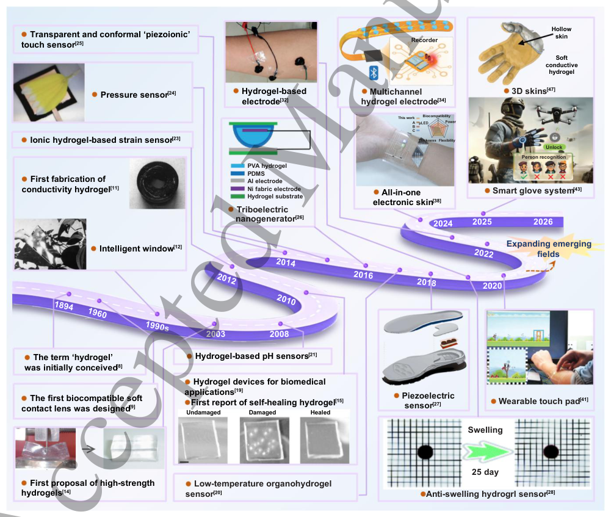

**Original caption:** Figure 1. The timeline of the development of hydrogels and hydrogel-based sensors. Image for “first fabrication of

**中文图注:** Figure 1 原始图注已提取；逐项含义见下方分图说明。

**Reading note:** 重点查看器件结构、材料层次、信号路径和制备流程。

### Figure 2

**Source:** p.10

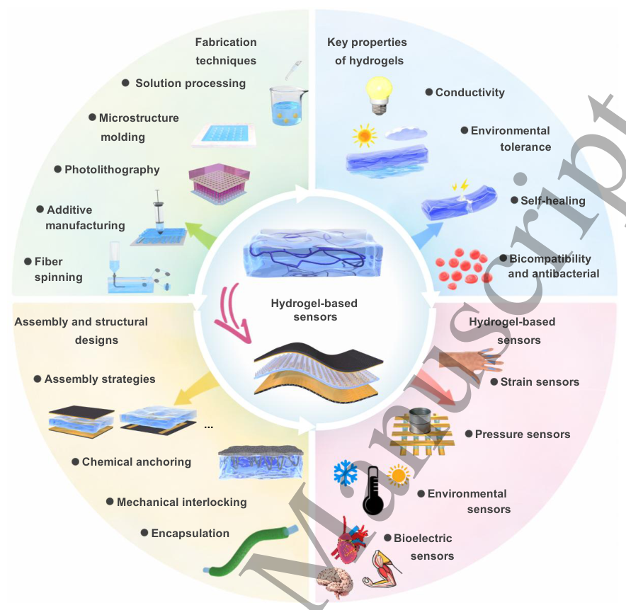

**Original caption:** Figure 2. Schematic overview of the review framework. It systematically covers the fabrication and performance regulation

**中文图注:** Figure 2 原始图注已提取；逐项含义见下方分图说明。

**Reading note:** 重点查看器件结构、材料层次、信号路径和制备流程。

### Figure 3

**Source:** p.14

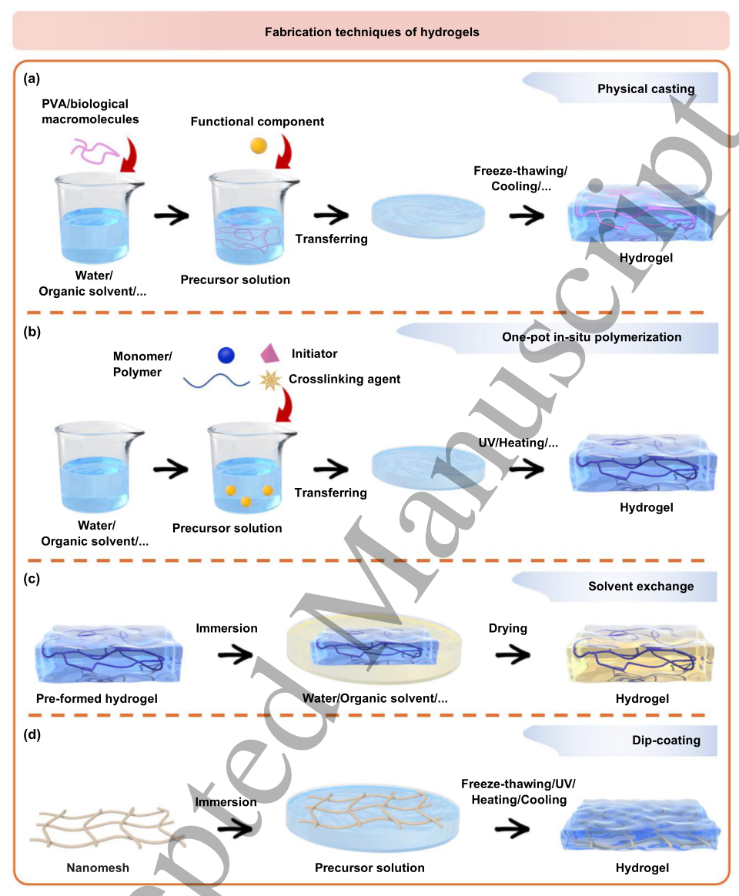

**Original caption:** Figure 3. Various solution processing techniques have been developed for hydrogel fabrication, as illustrated below: (a) physical

**中文图注:** Figure 3 原始图注已提取；逐项含义见下方分图说明。

**Reading note:** 重点查看器件结构、材料层次、信号路径和制备流程。

- (a) 结合正文首次引用位置和原始图注核对该图的证据角色。 原文：physical

### Figure 4

**Source:** p.19

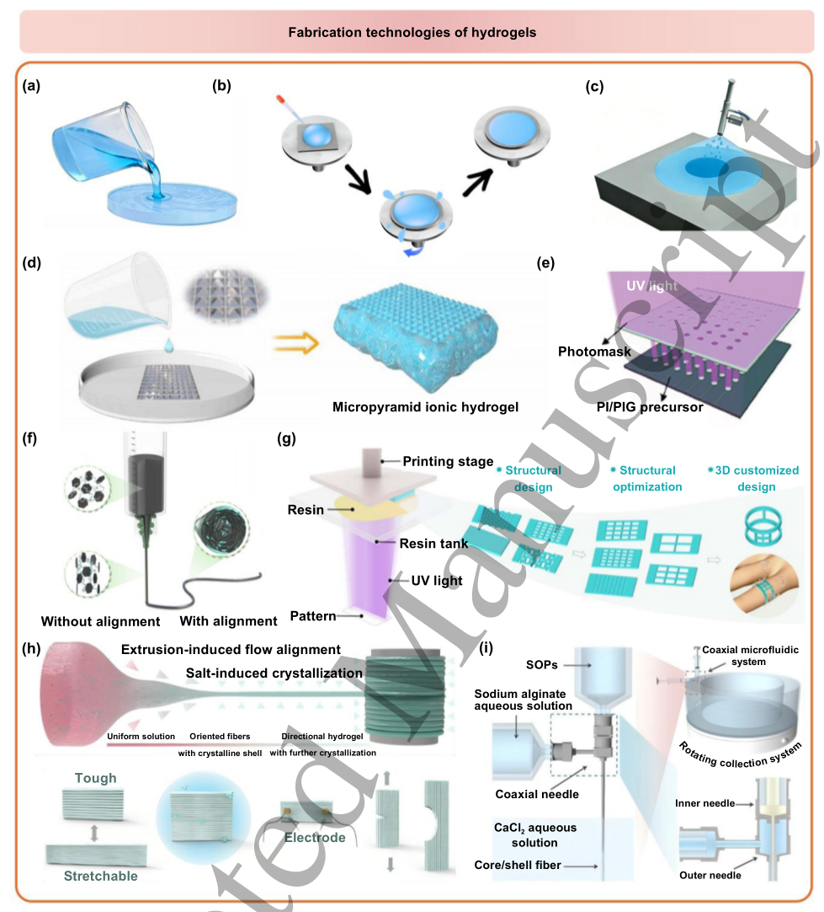

**Original caption:** Figure 4. Hydrogel fabrication techniques. (a) Casting. (b) Spin coating. (c) Spray coating. (d) Ionic hydrogel cast in a pyramid-

**中文图注:** Figure 4 原始图注已提取；逐项含义见下方分图说明。

**Reading note:** 重点查看器件结构、材料层次、信号路径和制备流程。

- (a) 结合正文首次引用位置和原始图注核对该图的证据角色。 原文：Casting
- (b) 结合正文首次引用位置和原始图注核对该图的证据角色。 原文：Spin coating
- (c) 结合正文首次引用位置和原始图注核对该图的证据角色。 原文：Spray coating
- (d) 结合正文首次引用位置和原始图注核对该图的证据角色。 原文：Ionic hydrogel cast in a pyramid-

### Figure 5

**Source:** p.27

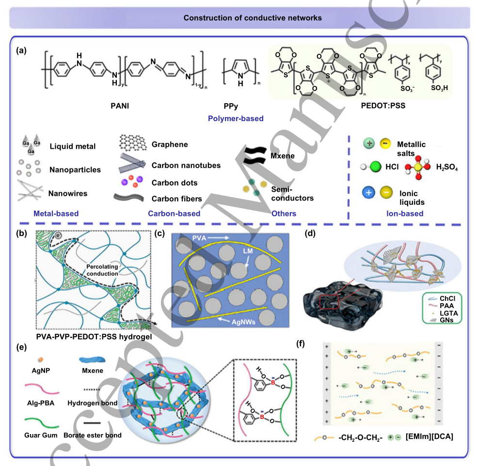

**Original caption:** Figure 5. Conductivity properties of the hydrogels. (a) Different types of conductive hydrogels: polymer-based, metal-based, ion-

**中文图注:** Figure 5 原始图注已提取；逐项含义见下方分图说明。

**Reading note:** 结合正文首次引用位置和原始图注核对该图的证据角色。

- (a) 结合正文首次引用位置和原始图注核对该图的证据角色。 原文：Different types of conductive hydrogels: polymer-based, metal-based, ion-

### Figure 6

**Source:** p.31

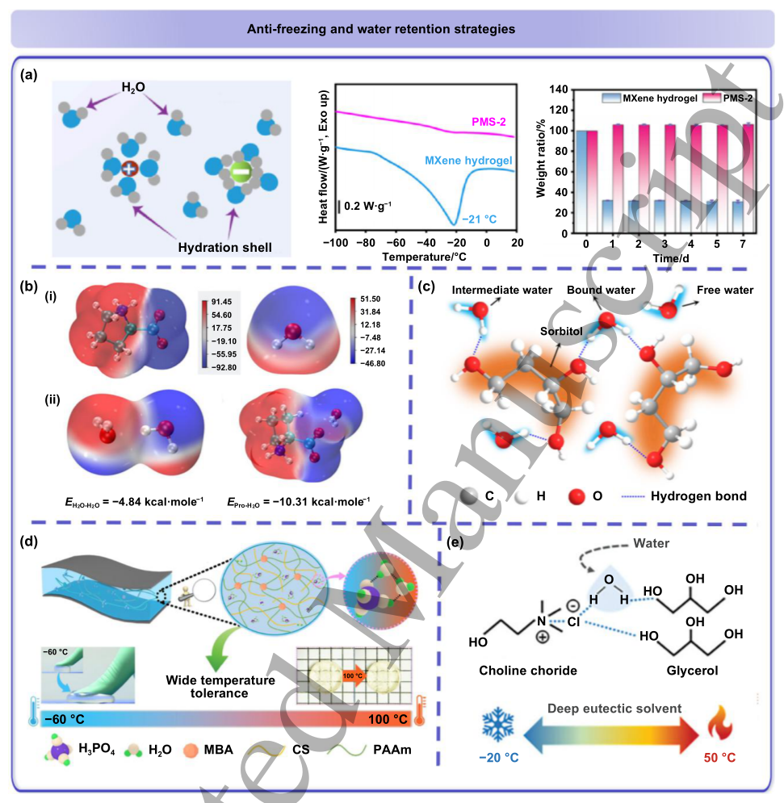

**Original caption:** Figure 6. The anti-freezing and water-retention properties of the hydrogels. (a) Introduction of LiCl imparts anti-freezing and self-

**中文图注:** Figure 6 原始图注已提取；逐项含义见下方分图说明。

**Reading note:** 结合正文首次引用位置和原始图注核对该图的证据角色。

- (a) 结合正文首次引用位置和原始图注核对该图的证据角色。 原文：Introduction of LiCl imparts anti-freezing and self-

### Figure 7

**Source:** p.35

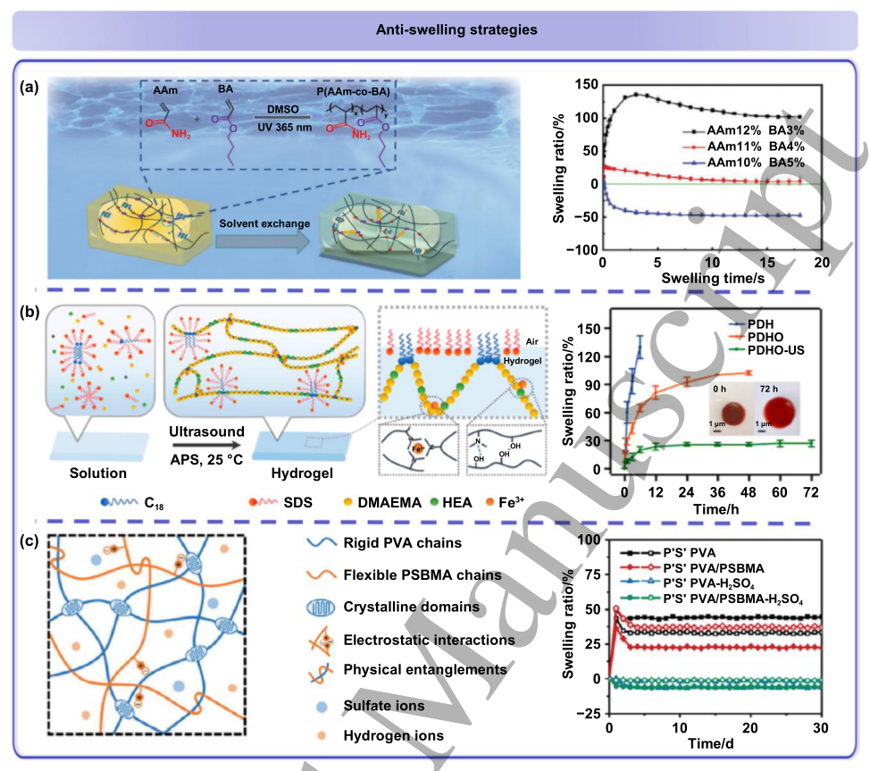

**Original caption:** Figure 7. The anti-swelling property of hydrogels. (a) DMSO-to-water solvent exchange process and the resulting swelling curve

**中文图注:** Figure 7 原始图注已提取；逐项含义见下方分图说明。

**Reading note:** 结合正文首次引用位置和原始图注核对该图的证据角色。

- (a) 结合正文首次引用位置和原始图注核对该图的证据角色。 原文：DMSO-to-water solvent exchange process and the resulting swelling curve

### Figure 8

**Source:** p.41

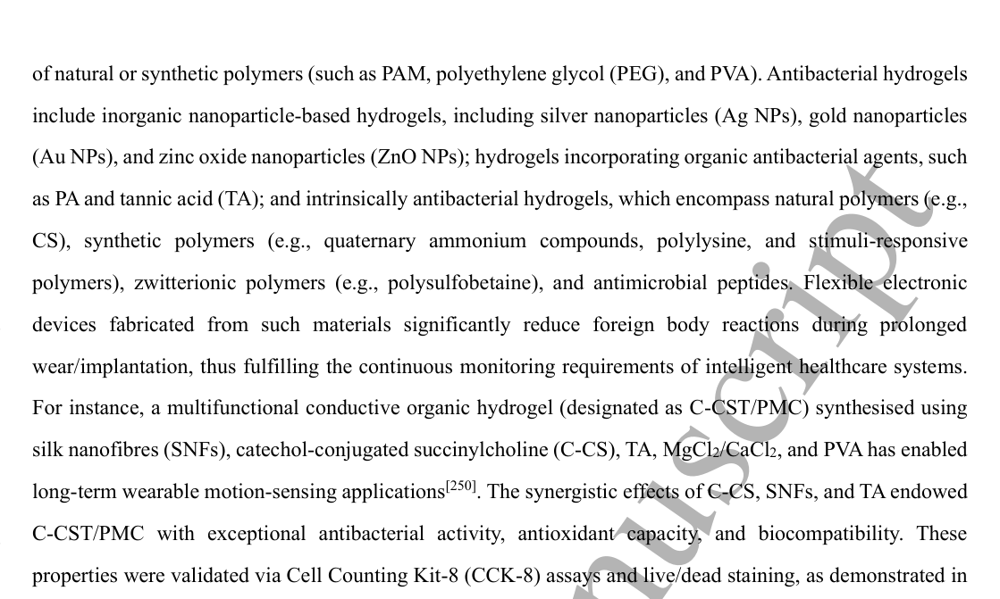

**Original caption:** Figure 8(c). Similarly, incorporating PA into PAM/AA hydrogels confers both tissue-mimetic mechanical

**中文图注:** Figure 8 原始图注已提取；逐项含义见下方分图说明。

**Reading note:** 结合正文首次引用位置和原始图注核对该图的证据角色。

### Figure 9

**Source:** p.50

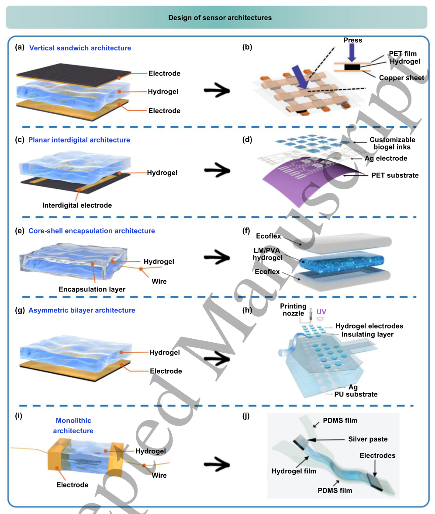

**Original caption:** Figure 9. Assembly strategies of hydrogel-based sensors. (a) Vertical sandwich architecture. (b) Pressure sensor array using a

**中文图注:** Figure 9 原始图注已提取；逐项含义见下方分图说明。

**Reading note:** 重点查看器件结构、材料层次、信号路径和制备流程。

- (a) 重点查看器件结构、材料层次、信号路径和制备流程。 原文：Vertical sandwich architecture
- (b) 重点查看阵列规模、空间分辨率、串扰、读出通道和空间特征表达。 原文：Pressure sensor array using a

### Figure 10

**Source:** p.54

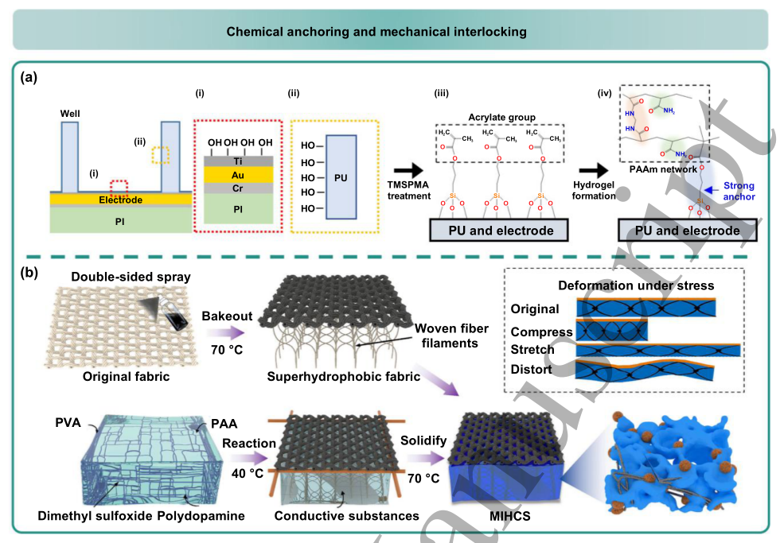

**Original caption:** Figure 10. Chemical anchoring and mechanical interlocking strategies at heterogeneous interfaces. (a) In-situ anchoring via silane

**中文图注:** Figure 10 原始图注已提取；逐项含义见下方分图说明。

**Reading note:** 结合正文首次引用位置和原始图注核对该图的证据角色。

- (a) 结合正文首次引用位置和原始图注核对该图的证据角色。 原文：In-situ anchoring via silane

### Figure 11

**Source:** p.57

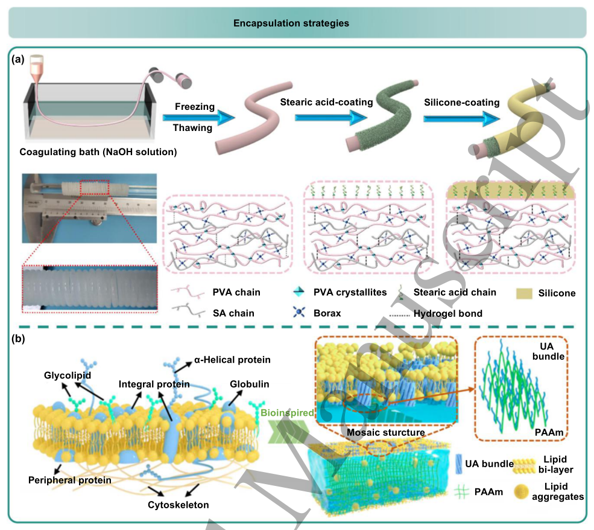

**Original caption:** Figure 11. Encapsulation strategies for hydrogel-based sensors. (a) The preparation process of the silicone rubber-encapsulated

**中文图注:** Figure 11 原始图注已提取；逐项含义见下方分图说明。

**Reading note:** 结合正文首次引用位置和原始图注核对该图的证据角色。

- (a) 结合正文首次引用位置和原始图注核对该图的证据角色。 原文：The preparation process of the silicone rubber-encapsulated

### Figure 12

**Source:** p.60

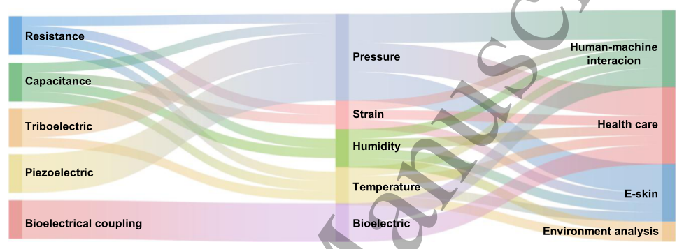

**Original caption:** Figure 12. Connections between sensing mechanisms, perception dimensions and application scenarios.

**中文图注:** Figure 12 原始图注已提取；逐项含义见下方分图说明。

**Reading note:** 重点查看任务设置、基线、消融和失败案例，判断系统演示是否真正支撑前端价值。

### Figure 13

**Source:** p.63

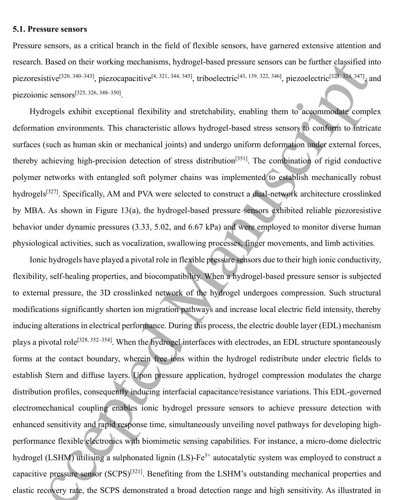

**Original caption:** Figure 13(b), its working principle relied on the EDL capacitance formed between the electrodes and the

**中文图注:** Figure 13 原始图注已提取；逐项含义见下方分图说明。

**Reading note:** 结合正文首次引用位置和原始图注核对该图的证据角色。

### Figure 14

**Source:** p.71

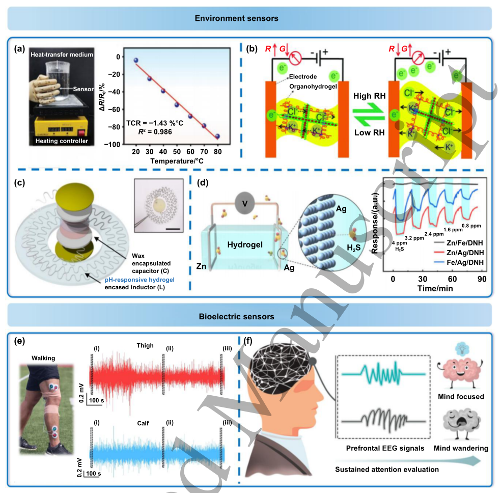

**Original caption:** Figure 14. Multifunctional hydrogels for environmental sensors and bioelectric sensors. (a) Schematic diagram of a hydrogel

**中文图注:** Figure 14 原始图注已提取；逐项含义见下方分图说明。

**Reading note:** 重点查看器件结构、材料层次、信号路径和制备流程。

- (a) 重点查看器件结构、材料层次、信号路径和制备流程。 原文：Schematic diagram of a hydrogel

### Figure 15

**Source:** p.78

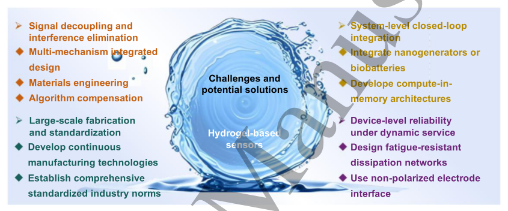

**Original caption:** Figure 15. Current challenges and potential solution strategies for hydrogel-based sensors.

**中文图注:** Figure 15 原始图注已提取；逐项含义见下方分图说明。

**Reading note:** 结合正文首次引用位置和原始图注核对该图的证据角色。
