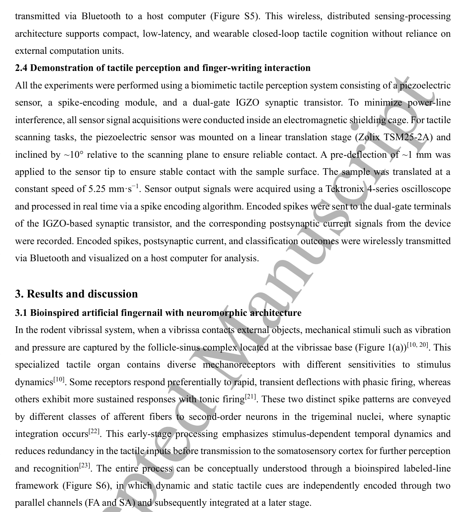
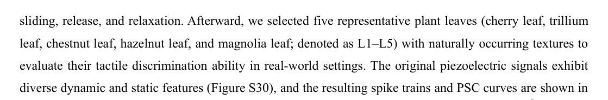
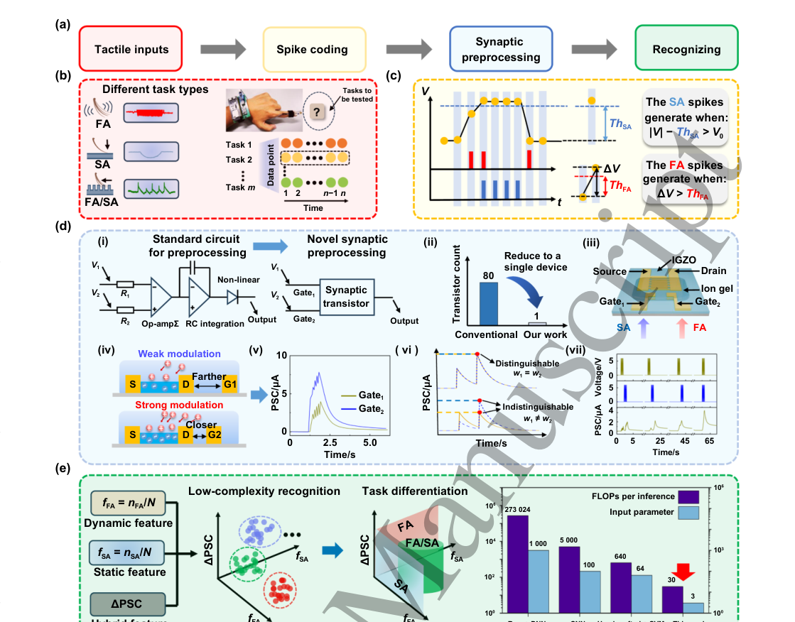
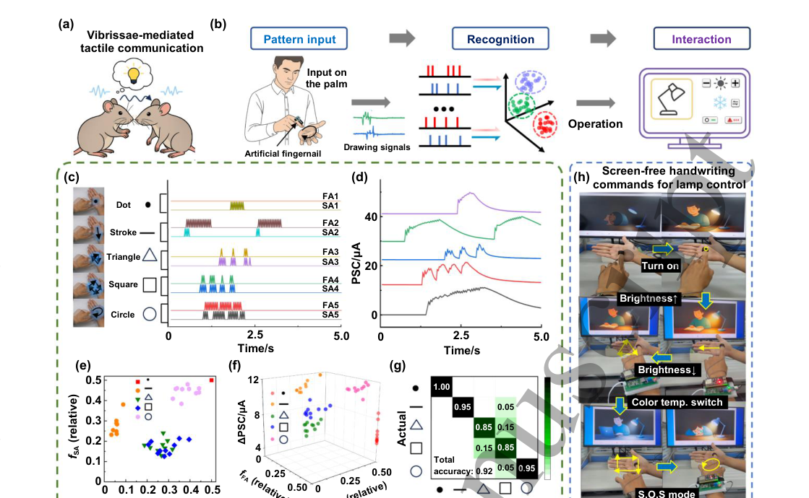

# Vibrissae-inspired wearable neuromorphic artificial fingernail for vibrotactile perception and interfacing

- 期刊：International Journal of Extreme Manufacturing
- 日期：2026-09-10
- DOI：10.1088/2631-7990/aea5fb
- 解析状态：fulltext_draft

## 摘要与研究价值

**原文摘要:** Abstract The rodent vibrissal system exhibits remarkable vibrotactile perception, enabling the discrimination of fine surface features through dynamic spike encoding and efficient synaptic integration. Here, we develop a vibrissae-inspired wearable neuromorphic artificial fingernail that combines piezoelectric sensing, spike encoding, and synaptic processing within a near-sensor computing architecture. A dual-gate synaptic transistor gated by proton-conducting ion gel exhibits excellent air stability, sensory memory, sensory integration, and perceptual weighting capabilities, allowing spatiotemporal recognition of both fast- and slow-adapting tactile spikes. Notably, this synaptic device features multiple preprocessing functions, enabling direct extraction of task-relevant features at the hardware level and thereby minimizing computational requirements. Using this system, we achieve over 90% classification accuracy across multiple tactile tasks, including object contour recognition, surface texture discrimination, and finger-writing trajectory identification. These results demonstrate the potential of our system as a smart wearable interface for low-power, real-time tactile recognition, thereby expanding the applications of neuromorphic electronics.

**中文直译:** 等待智能体翻译补充。

**中文总结:** 待基于原文摘要生成中文总结；当前仅完成题录/摘要级筛选。

## 创新点

- Abstract The rodent vibrissal system exhibits remarkable vibrotactile perception, enabling the discrimination of fine surface features through dynamic spike encoding and efficient synaptic integration.

## 对当前课题的启发

- 涉及 in-sensor/物理计算或可编程触觉前端
- 提供机器人、可穿戴或电子皮肤系统任务证据
- 可对照 raw pixel、software feature 与 physical projection 的性能/通道/功耗
- 把文中的传感/计算耦合机制映射为可编程物理投影核，增加原始像素、软件投影和硬件投影三组严格消融。

## 制备与实验步骤

### 1. 制备与实验操作

**Source:** p.5

**Original:** 2.1 Fabrication of synaptic devices https://mc04.manuscriptcentral.com/ijem-caep Accepted Manuscript International Journal of Extreme Manufacturing Dual-gate IGZO synaptic transistors were fabricated on 1.5 cm ×1.5 cm Si substrates (Figure S1).

**中文:** 制备与实验操作步骤，关键配比、时间、温度和设备参数以 p.5 原文为准。

### 2. 成膜与沉积

**Source:** p.5

**Original:** A 30 nm-thick IGZO (In:Ga:Zn = 2:2:1) Accepted Manuscript semiconductor layer was deposited by radio frequency (RF) magnetron sputtering (100 W, 5 mTorr Ar atmosphere, room temperature).

**中文:** 成膜与沉积步骤，关键配比、时间、温度和设备参数以 p.5 原文为准。

### 3. 成膜与沉积

**Source:** p.5

**Original:** The source, drain, and two lateral gate electrodes were defined through a Ni shadow mask, followed by the sputtering of a 100 nm indium tin oxide (ITO, mass ratio of In2O3 and SnO2 was 9:1) film under identical Ar pressure.

**中文:** 成膜与沉积步骤，关键配比、时间、温度和设备参数以 p.5 原文为准。

### 4. 材料混合与分散

**Source:** p.5

**Original:** The chitosan-based ion-gel electrolyte was prepared by dissolving chitosan (2 wt%) in acetic acid (2 wt%) at 80 °C with continuous stirring, followed by the addition of 1 wt% glycerol.

**中文:** 材料混合与分散步骤，关键配比、时间、温度和设备参数以 p.5 原文为准。

### 5. 图形化与结构成形

**Source:** p.5

**Original:** The resulting solution was cast and thermally cured at 80 °C for 1 h to form a flexible, transparent gel film.

**中文:** 图形化与结构成形步骤，关键配比、时间、温度和设备参数以 p.5 原文为准。

### 6. 组装与封装

**Source:** p.5

**Original:** The ion-gel film was then diced and laminated onto the surface of the oxide channel and planar gates, establishing an electric double layer at the gel/semiconductor interface.

**中文:** 组装与封装步骤，关键配比、时间、温度和设备参数以 p.5 原文为准。

### 7. 成膜与沉积

**Source:** p.5

**Original:** The obtained devices were wire- bonded onto printed circuit boards for testing.

**中文:** 成膜与沉积步骤，关键配比、时间、温度和设备参数以 p.5 原文为准。

### 8. 制备与实验操作

**Source:** p.5

**Original:** The structural morphology and layer configuration of the as- fabricated device were characterized by optical microscopy, cross-sectional scanning electron microscopy

**中文:** 制备与实验操作步骤，关键配比、时间、温度和设备参数以 p.5 原文为准。

### 9. 成膜与沉积

**Source:** p.6

**Original:** The sensor, composed of a 28 μm-thick piezoelectric film bonded to a polyester substrate with screen-printed electrodes, was mounted onto a custom-designed printed circuit board (PCB).

**中文:** 成膜与沉积步骤，关键配比、时间、温度和设备参数以 p.6 原文为准。

### 10. 图形化与结构成形

**Source:** p.7

**Original:** These two distinct spike patterns are conveyed by different classes of afferent fibers to second-order neurons in the trigeminal nuclei, where synaptic integration occurs[22].

**中文:** 图形化与结构成形步骤，关键配比、时间、温度和设备参数以 p.7 原文为准。

### 11. 图形化与结构成形

**Source:** p.7

**Original:** The temporal pattern and correlation of the two spike https://mc04.manuscriptcentral.com/ijem-caep Accepted Manuscript International Journal of Extreme Manufacturing trains modulate the synaptic behavior of the transistor and consequently affect its postsynaptic current output.

**中文:** 图形化与结构成形步骤，关键配比、时间、温度和设备参数以 p.7 原文为准。

## 方法原文锚点

**Source:** p.5 M001

**Original:** 1 2 3 4 5 6 7 8 9 10 11 12 13 14 15 16 17 18 19 20 21 22 23 24 25 26 27 28 29 30 31 32 33 34 35 36 37 38 39 40 41 42 43 44 45 46 47 48 49 50 51 52 53 54 55 56 57 58 59 60

**中文:** 该段已进入结构化方法步骤；完整逐段翻译待智能体精读补齐。

**Source:** p.5 M002

**Original:** 2.1 Fabrication of synaptic devices

**中文:** 该段已进入结构化方法步骤；完整逐段翻译待智能体精读补齐。

**Source:** p.5 M003

**Original:** https://mc04.manuscriptcentral.com/ijem-caep

**中文:** 该段已进入结构化方法步骤；完整逐段翻译待智能体精读补齐。

**Source:** p.5 M004

**Original:** Accepted Manuscript

**中文:** 该段已进入结构化方法步骤；完整逐段翻译待智能体精读补齐。

**Source:** p.6 M005

**Original:** International Journal of Extreme Manufacturing

**中文:** 该段已进入结构化方法步骤；完整逐段翻译待智能体精读补齐。

**Source:** p.6 M006

**Original:** Dual-gate IGZO synaptic transistors were fabricated on 1.5 cm ×1.5 cm Si substrates (Figure S1). Substrates

**中文:** 该段已进入结构化方法步骤；完整逐段翻译待智能体精读补齐。

**Source:** p.6 M007

**Original:** were ultrasonically cleaned in acetone, isopropanol, and deionized water, followed by ultraviolet-ozone (UV-

**中文:** 该段已进入结构化方法步骤；完整逐段翻译待智能体精读补齐。

**Source:** p.6 M008

**Original:** ozone) treatment to improve surface cleanliness and wettability. A 30 nm-thick IGZO (In:Ga:Zn = 2:2:1)

**中文:** 该段已进入结构化方法步骤；完整逐段翻译待智能体精读补齐。

**Source:** p.6 M009

**Original:** Accepted Manuscript

**中文:** 该段已进入结构化方法步骤；完整逐段翻译待智能体精读补齐。

**Source:** p.6 M010

**Original:** semiconductor layer was deposited by radio frequency (RF) magnetron sputtering (100 W, 5 mTorr Ar

**中文:** 该段已进入结构化方法步骤；完整逐段翻译待智能体精读补齐。

**Source:** p.6 M011

**Original:** atmosphere, room temperature). The source, drain, and two lateral gate electrodes were defined through a Ni

**中文:** 该段已进入结构化方法步骤；完整逐段翻译待智能体精读补齐。

**Source:** p.6 M012

**Original:** shadow mask, followed by the sputtering of a 100 nm indium tin oxide (ITO, mass ratio of In2O3 and SnO2

**中文:** 该段已进入结构化方法步骤；完整逐段翻译待智能体精读补齐。

**Source:** p.6 M013

**Original:** was 9:1) film under identical Ar pressure. The chitosan-based ion-gel electrolyte was prepared by dissolving

**中文:** 该段已进入结构化方法步骤；完整逐段翻译待智能体精读补齐。

**Source:** p.6 M014

**Original:** chitosan (2 wt%) in acetic acid (2 wt%) at 80 °C with continuous stirring, followed by the addition of 1 wt%

**中文:** 该段已进入结构化方法步骤；完整逐段翻译待智能体精读补齐。

**Source:** p.6 M015

**Original:** glycerol. The resulting solution was cast and thermally cured at 80 °C for 1 h to form a flexible, transparent

**中文:** 该段已进入结构化方法步骤；完整逐段翻译待智能体精读补齐。

**Source:** p.6 M016

**Original:** gel film. The ion-gel film was then diced and laminated onto the surface of the oxide channel and planar gates,

**中文:** 该段已进入结构化方法步骤；完整逐段翻译待智能体精读补齐。

**Source:** p.6 M017

**Original:** establishing an electric double layer at the gel/semiconductor interface. The obtained devices were wire-

**中文:** 该段已进入结构化方法步骤；完整逐段翻译待智能体精读补齐。

**Source:** p.6 M018

**Original:** bonded onto printed circuit boards for testing. The structural morphology and layer configuration of the as-

**中文:** 该段已进入结构化方法步骤；完整逐段翻译待智能体精读补齐。

**Source:** p.6 M019

**Original:** fabricated device were characterized by optical microscopy, cross-sectional scanning electron microscopy

**中文:** 该段已进入结构化方法步骤；完整逐段翻译待智能体精读补齐。

**Source:** p.6 M020

**Original:** (SEM), and atomic force microscopy (AFM), as provided in Figure S2. The device architecture supports

**中文:** 该段已进入结构化方法步骤；完整逐段翻译待智能体精读补齐。

**Source:** p.6 M021

**Original:** single-gate or dual-gate operation, with synaptic plasticity modulated by electrical spikes.

**中文:** 该段已进入结构化方法步骤；完整逐段翻译待智能体精读补齐。

**Source:** p.6 M022

**Original:** The structural morphology and layer configuration of the artificial synaptic device were examined by optical

**中文:** 该段已进入结构化方法步骤；完整逐段翻译待智能体精读补齐。

**Source:** p.6 M023

**Original:** microscopy (DM500, Leica), cross-sectional field-emission scanning electron microscopy (SEM, ULTRA 55,

**中文:** 该段已进入结构化方法步骤；完整逐段翻译待智能体精读补齐。

**Source:** p.6 M024

**Original:** Carl Zeiss), and atomic force microscopy (AFM, MultiMode 8, Bruker Scientific Instruments). The ionic

**中文:** 该段已进入结构化方法步骤；完整逐段翻译待智能体精读补齐。

**Source:** p.6 M025

**Original:** capacitance of the ion-gel was evaluated using an LCR meter (Agilent E4980A). The synaptic transistor was

**中文:** 该段已进入结构化方法步骤；完整逐段翻译待智能体精读补齐。

**Source:** p.6 M026

**Original:** electrically characterized using a semiconductor parameter analyzer (Keysight B1500A). To characterize the

**中文:** 该段已进入结构化方法步骤；完整逐段翻译待智能体精读补齐。

**Source:** p.6 M027

**Original:** piezoelectric sensor response, mechanical stimulation was applied using a motorized force test stand (ESM301,

**中文:** 该段已进入结构化方法步骤；完整逐段翻译待智能体精读补齐。

**Source:** p.6 M028

**Original:** Mark-10) equipped with a force gauge, and the resulting voltage signals were recorded with a Tektronix 4

**中文:** 该段已进入结构化方法步骤；完整逐段翻译待智能体精读补齐。

**Source:** p.6 M029

**Original:** A flexible piezoelectric vibrotactile sensor (LDT0-028K, TE Connectivity) was employed to transduce

**中文:** 该段已进入结构化方法步骤；完整逐段翻译待智能体精读补齐。

**Source:** p.6 M030

**Original:** mechanical deflection into analog voltage signals. The sensor, composed of a 28 μm-thick piezoelectric film

**中文:** 该段已进入结构化方法步骤；完整逐段翻译待智能体精读补齐。

**Source:** p.6 M031

**Original:** bonded to a polyester substrate with screen-printed electrodes, was mounted onto a custom-designed printed

**中文:** 该段已进入结构化方法步骤；完整逐段翻译待智能体精读补齐。

**Source:** p.6 M032

**Original:** circuit board (PCB). The PCB provided a direct connection to the dual-gate synaptic transistor via a gold-

**中文:** 该段已进入结构化方法步骤；完整逐段翻译待智能体精读补齐。

**Source:** p.6 M033

**Original:** plated interface for real-time signal transmission. The spike-encoded FA/SA signals were routed to the two

**中文:** 该段已进入结构化方法步骤；完整逐段翻译待智能体精读补齐。

**Source:** p.6 M034

**Original:** independent gates of the transistor, which was powered by a 0.1 V supply module controlled by the

**中文:** 该段已进入结构化方法步骤；完整逐段翻译待智能体精读补齐。

**Source:** p.6 M035

**Original:** microcontroller (ESP32). ESP32 also read the drain-source current through an integrated analog front-end

**中文:** 该段已进入结构化方法步骤；完整逐段翻译待智能体精读补齐。

**Source:** p.6 M036

**Original:** module equipped with a low-noise transimpedance amplifier and analog-to-digital converter (ADC) circuitry,

**中文:** 该段已进入结构化方法步骤；完整逐段翻译待智能体精读补齐。

**Source:** p.6 M037

**Original:** enabling precise capture of the postsynaptic current (PSC) (Figure S3). The difference between the maximum

**中文:** 该段已进入结构化方法步骤；完整逐段翻译待智能体精读补齐。

**Source:** p.6 M038

**Original:** and minimum postsynaptic current, denoted as ΔPSC, was extracted to quantify the stimulus intensity.

**中文:** 该段已进入结构化方法步骤；完整逐段翻译待智能体精读补齐。

**Source:** p.6 M039

**Original:** Hardware-derived features, including fFA and fSA, and ΔPSC (Figure S4), were processed by the

**中文:** 该段已进入结构化方法步骤；完整逐段翻译待智能体精读补齐。

**Source:** p.6 M040

**Original:** microcontroller for real-time tactile classification. All feature data and recognition results were wirelessly

**中文:** 该段已进入结构化方法步骤；完整逐段翻译待智能体精读补齐。

**Source:** p.6 M041

**Original:** https://mc04.manuscriptcentral.com/ijem-caep

**中文:** 该段已进入结构化方法步骤；完整逐段翻译待智能体精读补齐。

**Source:** p.6 M042

**Original:** 1 2 3 4 5 6 7 8 9 10 11 12 13 14 15 16 17 18 19 20 21 22 23 24 25 26 27 28 29 30 31 32 33 34 35 36 37 38 39 40 41 42 43 44 45 46 47 48 49 50 51 52 53 54 55 56 57 58 59 60

**中文:** 该段已进入结构化方法步骤；完整逐段翻译待智能体精读补齐。

**Source:** p.6 M043

**Original:** 2.2 Characterization and measurements

**中文:** 该段已进入结构化方法步骤；完整逐段翻译待智能体精读补齐。

**Source:** p.6 M044

**Original:** Series MSO oscilloscope (MSO44).

**中文:** 该段已进入结构化方法步骤；完整逐段翻译待智能体精读补齐。

**Source:** p.6 M045

**Original:** 2.3 Hardware of the neuromorphic system

**中文:** 该段已进入结构化方法步骤；完整逐段翻译待智能体精读补齐。

**Source:** p.6 M046

**Original:** Page 4 of 18

**中文:** 该段已进入结构化方法步骤；完整逐段翻译待智能体精读补齐。

**Source:** p.7 M047

**Original:** Page 5 of 18

**中文:** 该段已进入结构化方法步骤；完整逐段翻译待智能体精读补齐。

**Source:** p.7 M048

**Original:** International Journal of Extreme Manufacturing

**中文:** 该段已进入结构化方法步骤；完整逐段翻译待智能体精读补齐。

**Source:** p.7 M049

**Original:** transmitted via Bluetooth to a host computer (Figure S5). This wireless, distributed sensing-processing

**中文:** 该段已进入结构化方法步骤；完整逐段翻译待智能体精读补齐。

**Source:** p.7 M050

**Original:** architecture supports compact, low-latency, and wearable closed-loop tactile cognition without reliance on

**中文:** 该段已进入结构化方法步骤；完整逐段翻译待智能体精读补齐。

**Source:** p.7 M051

**Original:** external computation units.

**中文:** 该段已进入结构化方法步骤；完整逐段翻译待智能体精读补齐。

**Source:** p.7 M052

**Original:** 2.4 Demonstration of tactile perception and finger-writing interaction

**中文:** 该段已进入结构化方法步骤；完整逐段翻译待智能体精读补齐。

**Source:** p.7 M053

**Original:** All the experiments were performed using a biomimetic tactile perception system consisting of a piezoelectric

**中文:** 该段已进入结构化方法步骤；完整逐段翻译待智能体精读补齐。

**Source:** p.7 M054

**Original:** sensor, a spike-encoding module, and a dual-gate IGZO synaptic transistor. To minimize power-line

**中文:** 该段已进入结构化方法步骤；完整逐段翻译待智能体精读补齐。

**Source:** p.7 M055

**Original:** interference, all sensor signal acquisitions were conducted inside an electromagnetic shielding cage. For tactile

**中文:** 该段已进入结构化方法步骤；完整逐段翻译待智能体精读补齐。

**Source:** p.7 M056

**Original:** scanning tasks, the piezoelectric sensor was mounted on a linear translation stage (Zolix TSM25-2A) and

**中文:** 该段已进入结构化方法步骤；完整逐段翻译待智能体精读补齐。

**Source:** p.7 M057

**Original:** inclined by ~10° relative to the scanning plane to ensure reliable contact. A pre-deflection of ~1 mm was

**中文:** 该段已进入结构化方法步骤；完整逐段翻译待智能体精读补齐。

**Source:** p.7 M058

**Original:** applied to the sensor tip to ensure stable contact with the sample surface. The sample was translated at a

**中文:** 该段已进入结构化方法步骤；完整逐段翻译待智能体精读补齐。

**Source:** p.7 M059

**Original:** constant speed of 5.25 mm·s−1. Sensor output signals were acquired using a Tektronix 4-series oscilloscope

**中文:** 该段已进入结构化方法步骤；完整逐段翻译待智能体精读补齐。

**Source:** p.7 M060

**Original:** and processed in real time via a spike encoding algorithm. Encoded spikes were sent to the dual-gate terminals

**中文:** 该段已进入结构化方法步骤；完整逐段翻译待智能体精读补齐。

**Source:** p.7 M061

**Original:** of the IGZO-based synaptic transistor, and the corresponding postsynaptic current signals from the device

**中文:** 该段已进入结构化方法步骤；完整逐段翻译待智能体精读补齐。

**Source:** p.7 M062

**Original:** were recorded. Encoded spikes, postsynaptic current, and classification outcomes were wirelessly transmitted

**中文:** 该段已进入结构化方法步骤；完整逐段翻译待智能体精读补齐。

**Source:** p.7 M063

**Original:** via Bluetooth and visualized on a host computer for analysis.

**中文:** 该段已进入结构化方法步骤；完整逐段翻译待智能体精读补齐。

**Source:** p.7 M064

**Original:** 3. Results and discussion

**中文:** 该段已进入结构化方法步骤；完整逐段翻译待智能体精读补齐。

**Source:** p.7 M065

**Original:** 3.1 Bioinspired artificial fingernail with neuromorphic architecture

**中文:** 该段已进入结构化方法步骤；完整逐段翻译待智能体精读补齐。

**Source:** p.7 M066

**Original:** In the rodent vibrissal system, when a vibrissa contacts external objects, mechanical stimuli such as vibration

**中文:** 该段已进入结构化方法步骤；完整逐段翻译待智能体精读补齐。

**Source:** p.7 M067

**Original:** and pressure are captured by the follicle-sinus complex located at the vibrissae base (Figure 1(a))[10, 20]. This

**中文:** 该段已进入结构化方法步骤；完整逐段翻译待智能体精读补齐。

**Source:** p.7 M068

**Original:** specialized tactile organ contains diverse mechanoreceptors with different sensitivities to stimulus

**中文:** 该段已进入结构化方法步骤；完整逐段翻译待智能体精读补齐。

**Source:** p.7 M069

**Original:** dynamics[10]. Some receptors respond preferentially to rapid, transient deflections with phasic firing, whereas

**中文:** 该段已进入结构化方法步骤；完整逐段翻译待智能体精读补齐。

**Source:** p.7 M070

**Original:** others exhibit more sustained responses with tonic firing[21]. These two distinct spike patterns are conveyed

**中文:** 该段已进入结构化方法步骤；完整逐段翻译待智能体精读补齐。

**Source:** p.7 M071

**Original:** by different classes of afferent fibers to second-order neurons in the trigeminal nuclei, where synaptic

**中文:** 该段已进入结构化方法步骤；完整逐段翻译待智能体精读补齐。

**Source:** p.7 M072

**Original:** integration occurs[22]. This early-stage processing emphasizes stimulus-dependent temporal dynamics and

**中文:** 该段已进入结构化方法步骤；完整逐段翻译待智能体精读补齐。

**Source:** p.7 M073

**Original:** reduces redundancy in the tactile inputs before transmission to the somatosensory cortex for further perception

**中文:** 该段已进入结构化方法步骤；完整逐段翻译待智能体精读补齐。

**Source:** p.7 M074

**Original:** and recognition[23]. The entire process can be conceptually understood through a bioinspired labeled-line

**中文:** 该段已进入结构化方法步骤；完整逐段翻译待智能体精读补齐。

**Source:** p.7 M075

**Original:** framework (Figure S6), in which dynamic and static tactile cues are independently encoded through two

**中文:** 该段已进入结构化方法步骤；完整逐段翻译待智能体精读补齐。

**Source:** p.7 M076

**Original:** parallel channels (FA and SA) and subsequently integrated at a later stage.

**中文:** 该段已进入结构化方法步骤；完整逐段翻译待智能体精读补齐。

**Source:** p.7 M077

**Original:** Figure 1(b) shows the schematic of our wearable neuromorphic artificial fingernail, which reproduces

**中文:** 该段已进入结构化方法步骤；完整逐段翻译待智能体精读补齐。

**Source:** p.7 M078

**Original:** key structural and functional elements of the rodent vibrissae pathway for sensing, encoding, and

**中文:** 该段已进入结构化方法步骤；完整逐段翻译待智能体精读补齐。

**Source:** p.7 M079

**Original:** preprocessing. Our system employs a flexible piezoelectric sensor that transduces mechanical stimuli such as

**中文:** 该段已进入结构化方法步骤；完整逐段翻译待智能体精读补齐。

**Source:** p.7 M080

**Original:** vibration and pressure into continuous analog voltage signals resembling the receptor potential[24]. We

**中文:** 该段已进入结构化方法步骤；完整逐段翻译待智能体精读补齐。

**Source:** p.7 M081

**Original:** designed a dual-channel spike encoder that converts analog tactile signals into two spike trains corresponding

**中文:** 该段已进入结构化方法步骤；完整逐段翻译待智能体精读补齐。

**Source:** p.7 M082

**Original:** to dynamic (FA) and static (SA) tactile information. These two spike trains are delivered to the two gates of a

**中文:** 该段已进入结构化方法步骤；完整逐段翻译待智能体精读补齐。

**Source:** p.7 M083

**Original:** 1 2 3 4 5 6 7 8 9 10 11 12 13 14 15 16 17 18 19 20 21 22 23 24 25 26 27 28 29 30 31 32 33 34 35 36 37 38 39 40 41 42 43 44 45 46 47 48 49 50 51 52 53 54 55 56 57 58 59 60

**中文:** 该段已进入结构化方法步骤；完整逐段翻译待智能体精读补齐。

**Source:** p.7 M084

**Original:** dual-gate synaptic transistor with asymmetric synaptic weights, reflecting the different perceptual weights

**中文:** 该段已进入结构化方法步骤；完整逐段翻译待智能体精读补齐。

**Source:** p.7 M085

**Original:** among multiple tactile modalities in biological systems. The temporal pattern and correlation of the two spike

**中文:** 该段已进入结构化方法步骤；完整逐段翻译待智能体精读补齐。

**Source:** p.7 M086

**Original:** https://mc04.manuscriptcentral.com/ijem-caep

**中文:** 该段已进入结构化方法步骤；完整逐段翻译待智能体精读补齐。

**Source:** p.7 M087

**Original:** Accepted Manuscript

**中文:** 该段已进入结构化方法步骤；完整逐段翻译待智能体精读补齐。

**Source:** p.8 M088

**Original:** International Journal of Extreme Manufacturing

**中文:** 该段已进入结构化方法步骤；完整逐段翻译待智能体精读补齐。

**Source:** p.8 M089

**Original:** trains modulate the synaptic behavior of the transistor and consequently affect its postsynaptic current output.

**中文:** 该段已进入结构化方法步骤；完整逐段翻译待智能体精读补齐。

**Source:** p.8 M090

**Original:** In this way, the device realizes multisensory integration and synaptic processing of tactile stimuli, analogous

**中文:** 该段已进入结构化方法步骤；完整逐段翻译待智能体精读补齐。

**Source:** p.8 M091

**Original:** to mechanoreceptor pathways in biological tactile perception[25-26].

**中文:** 该段已进入结构化方法步骤；完整逐段翻译待智能体精读补齐。

**Source:** p.8 M092

**Original:** Accepted Manuscript

**中文:** 该段已进入结构化方法步骤；完整逐段翻译待智能体精读补齐。

**Source:** p.8 M093

**Original:** Standard machine learning (ML) pipelines for tactile recognition typically require the preprocessing of

**中文:** 该段已进入结构化方法步骤；完整逐段翻译待智能体精读补齐。

**Source:** p.8 M094

**Original:** temporal signals, which are then unfolded into high-dimensional feature vectors and processed by

**中文:** 该段已进入结构化方法步骤；完整逐段翻译待智能体精读补齐。

**Source:** p.8 M095

**Original:** computationally intensive models such as deep neural networks, spiking neural networks, or other high-

**中文:** 该段已进入结构化方法步骤；完整逐段翻译待智能体精读补齐。

**Source:** p.8 M096

**Original:** dimensional classifiers (left panel of Figure 1(c)) [27-29]. Instead of expanding temporal signals into high-

**中文:** 该段已进入结构化方法步骤；完整逐段翻译待智能体精读补齐。

**Source:** p.8 M097

**Original:** dimensional representations, our strategy (right panel of Figure 1(c)) encodes tactile information at the sensing

**中文:** 该段已进入结构化方法步骤；完整逐段翻译待智能体精读补齐。

**Source:** p.8 M098

**Original:** stage by converting continuous tactile signals into sparse, event-driven spike trains. These spikes are then

**中文:** 该段已进入结构化方法步骤；完整逐段翻译待智能体精读补齐。

**Source:** p.8 M099

**Original:** processed by a dual-gate synaptic transistor to perform weighted integration of the FA and SA pathways,

**中文:** 该段已进入结构化方法步骤；完整逐段翻译待智能体精读补齐。

**Source:** p.8 M100

**Original:** thereby producing synaptic responses that reflect their spike-timing dynamics. The synaptic responses of the

**中文:** 该段已进入结构化方法步骤；完整逐段翻译待智能体精读补齐。

## 图表解读

### Figure 1

**Source:** p.7

**Original caption:** Figure 1(b) shows the schematic of our wearable neuromorphic artificial fingernail, which reproduces

**中文图注:** Figure 1 原始图注已提取；逐项含义见下方分图说明。

**Reading note:** 重点查看器件结构、材料层次、信号路径和制备流程。

- (b) 重点查看器件结构、材料层次、信号路径和制备流程。 原文：shows the schematic of our wearable neuromorphic artificial fingernail, which reproduces

### Figure 3

**Source:** p.12

**Original caption:** Figure 3(k) and (l). In this case, the feature distribution spans all three axes (fFA, fSA, and ΔPSC), and the

**中文图注:** Figure 3 原始图注已提取；逐项含义见下方分图说明。

**Reading note:** 结合正文首次引用位置和原始图注核对该图的证据角色。

- (k) 结合正文首次引用位置和原始图注核对该图的证据角色。 原文：and (l). In this case, the feature distribution spans all three axes (fFA, fSA, and ΔPSC), and the

### Figure 2

**Source:** p.18

**Original caption:** Figure 2. Neuromorphic tactile sensing and recognition framework. (a) Overall workflow of the neuromorphic

**中文图注:** Figure 2 原始图注已提取；逐项含义见下方分图说明。

**Reading note:** 重点查看任务设置、基线、消融和失败案例，判断系统演示是否真正支撑前端价值。

- (a) 结合正文首次引用位置和原始图注核对该图的证据角色。 原文：Overall workflow of the neuromorphic

### Figure 4

**Source:** p.20

**Original caption:** Figure 4. Neuromorphic tactile interface for real-time gesture recognition and control. (a) Bioinspired concept

**中文图注:** Figure 4 原始图注已提取；逐项含义见下方分图说明。

**Reading note:** 重点查看任务设置、基线、消融和失败案例，判断系统演示是否真正支撑前端价值。

- (a) 结合正文首次引用位置和原始图注核对该图的证据角色。 原文：Bioinspired concept
