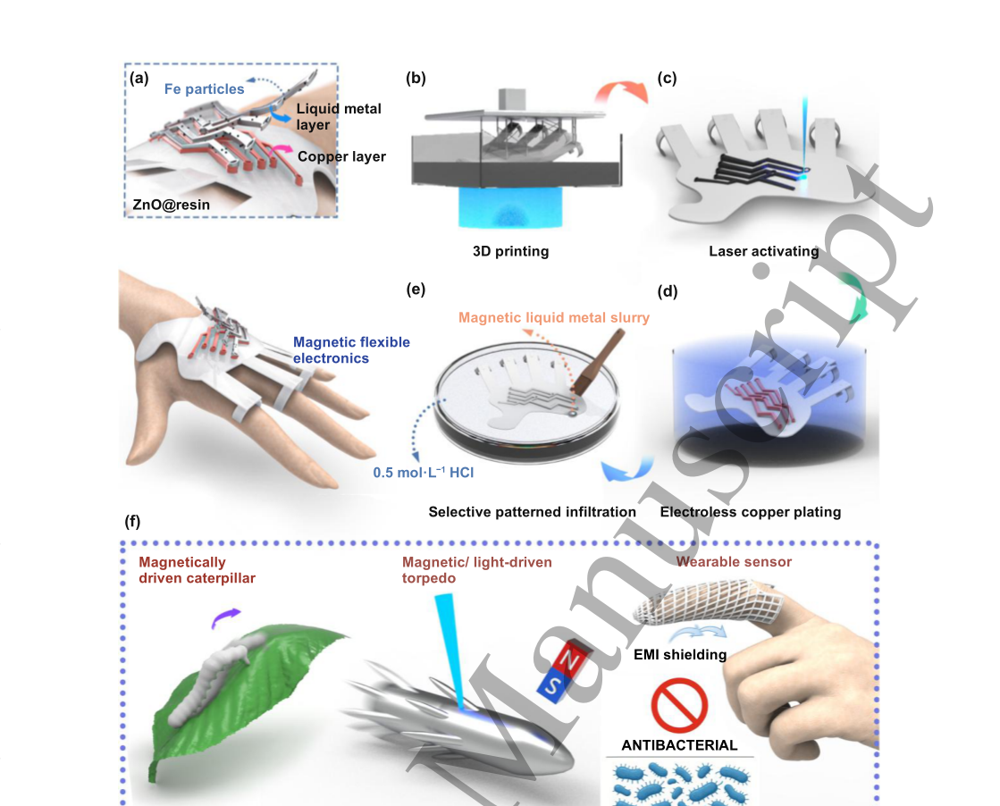
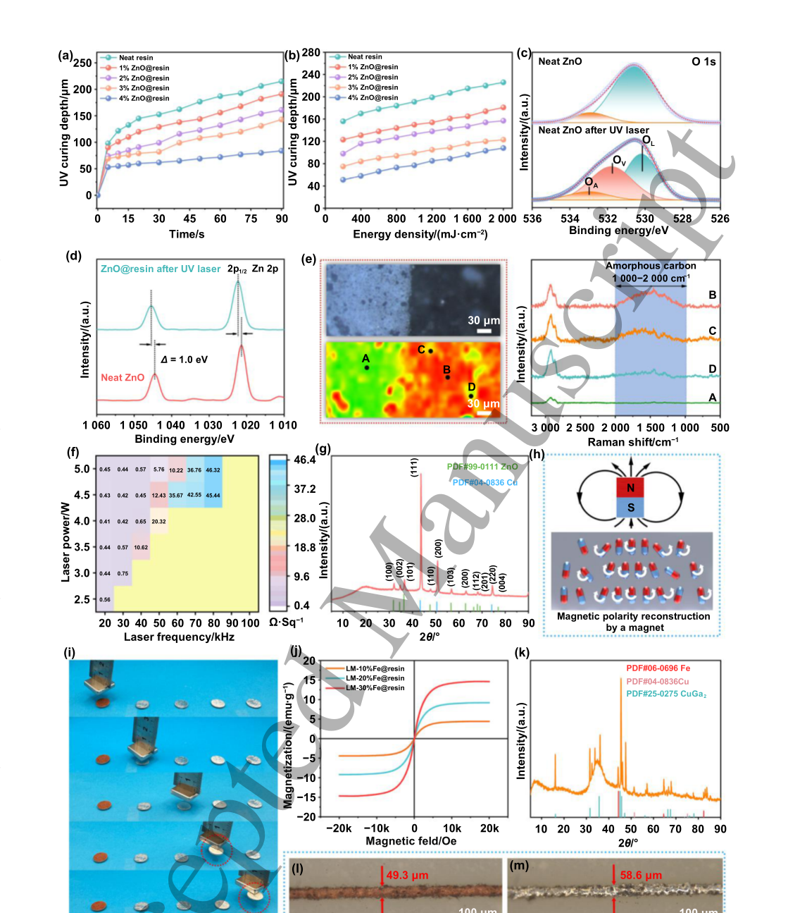
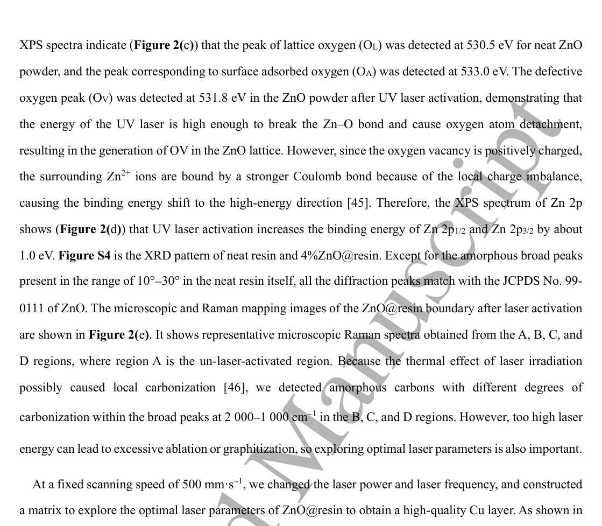
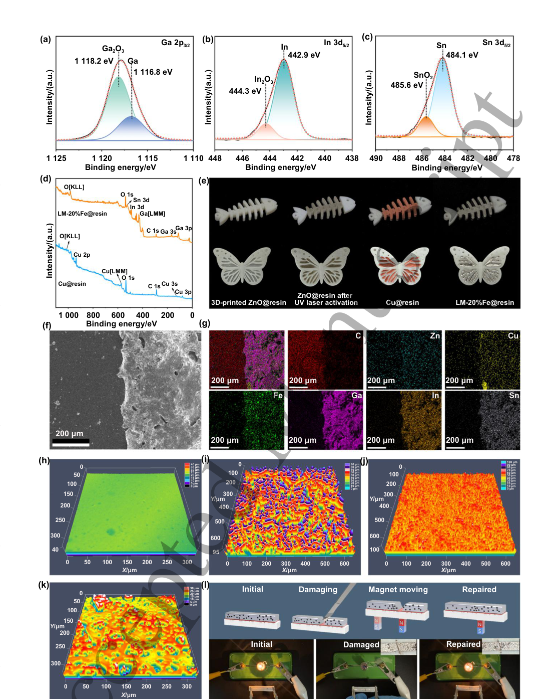
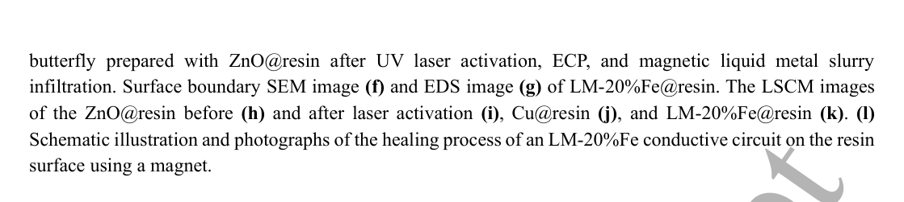
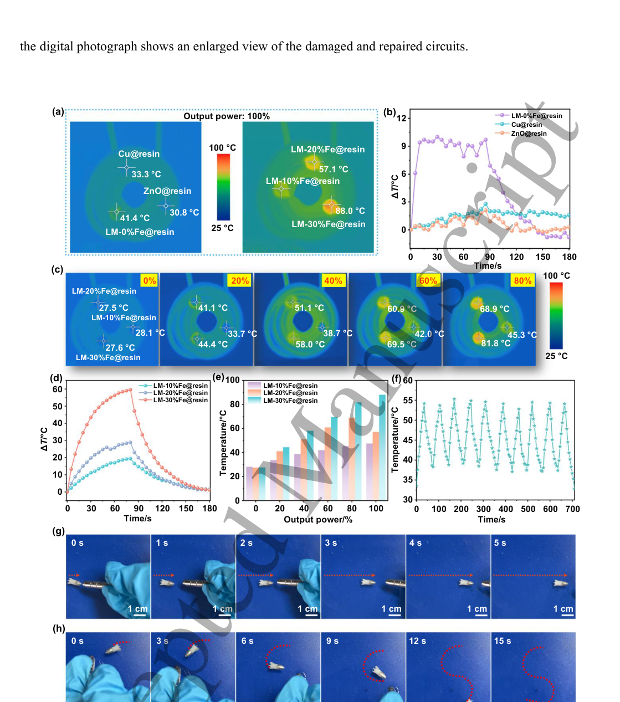
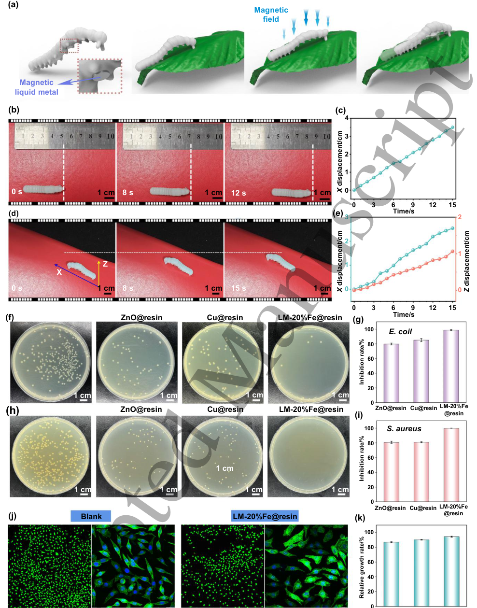
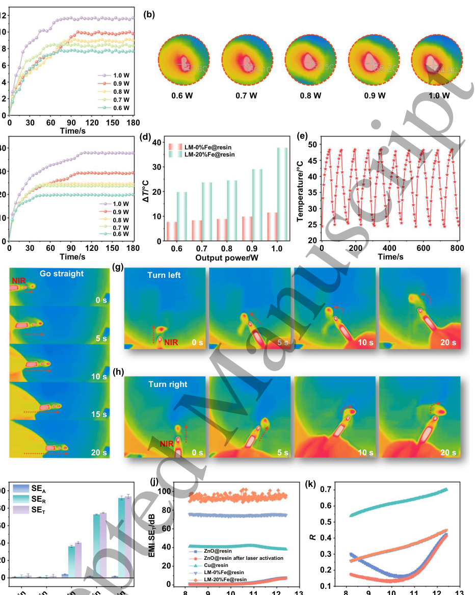
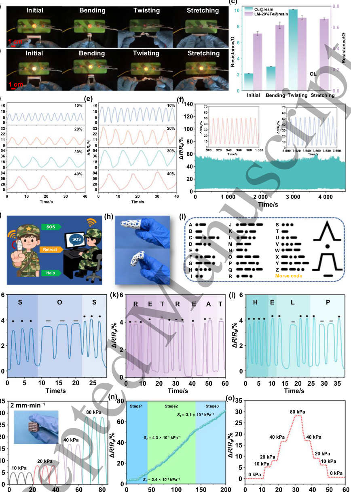

# 3D-Printed Customizable Magnetic Soft Electronics Enabled by Nanometal Oxide-Assisted Laser Activation and Magnetic Liquid Metal

- 期刊：International Journal of Extreme Manufacturing
- 日期：2026-09-11
- DOI：10.1088/2631-7990/aea667
- 解析状态：fulltext_draft

## 摘要与研究价值

**原文摘要:** Abstract This study introduces a novel strategy based on laser-induced selective metallization technology (LISM) and magnetic liquid metal slurry infiltration to customise magnetic patterning on 3D-printed device surfaces. Incorporating nano zinc oxide (ZnO) into 3D printing resin endows the printed devices with laser activation capability and antibacterial properties. The patterned copper layer is obtained by LISM on the resin surface, and the magnetic slurry is formed by dispersing iron (Fe) particles in liquid metal, which can selectively infiltrate the copper layer, thereby imparting robust magnetic properties to the patterned conductive traces. The 3D-printed electronic devices based on LM-20%Fe@resin have excellent magnetic-thermal and light-thermal conversion capabilities. Demonstrated applications include torpedoes that can move flexibly in water through magnetic or light drives, and caterpillars that move directionally on planes and slopes under magnetic fields. Furthermore, the LM-20%Fe@resin possesses significant antibacterial properties, effective EMI shielding, low cytotoxicity, and enhanced sensing sensitivity due to the Fe particles. This enabled the fabrication of functional devices such as a wearable strain-sensing finger cuff for Morse code decryption and a piezoresistive pressure sensor with a 3D porous structure. Therefore, this method has a promising application in the field of soft robotics, wearable devices, and so on.

**中文直译:** 等待智能体翻译补充。

**中文总结:** 待基于原文摘要生成中文总结；当前仅完成题录/摘要级筛选。

## 创新点

- Abstract This study introduces a novel strategy based on laser-induced selective metallization technology (LISM) and magnetic liquid metal slurry infiltration to customise magnetic patterning on 3D-printed device surfaces.

## 对当前课题的启发

- 提供机器人、可穿戴或电子皮肤系统任务证据
- 涉及坏点、漂移、跨器件迁移或少样本校准
- 可对照 raw pixel、software feature 与 physical projection 的性能/通道/功耗

## 制备与实验步骤

### 1. 图形化与结构成形

**Source:** p.7

**Original:** (Table S1) reveals that this strategy simultaneously achieves high pattern resolution, high magnetic loading, strong mechanical flexibility, and high process efficiency, all of which are difficult to achieve simultaneously with conventional techniques.

**中文:** 图形化与结构成形步骤，关键配比、时间、温度和设备参数以 p.7 原文为准。

### 2. 成膜与沉积

**Source:** p.7

**Original:** Moreover, it proposes a practical fabrication route aimed at addressing the challenges of achieving high-resolution magnetic patterning and multifunctional integration on complex 3D-printed device surfaces.

**中文:** 成膜与沉积步骤，关键配比、时间、温度和设备参数以 p.7 原文为准。

### 3. 成膜与沉积

**Source:** p.7

**Original:** By introducing a LISM-derived Cu interfacial layer and selective infiltration of a magnetic liquid metal slurry, this strategy can achieve high-resolution and multifunctional localized magnetic patterning on customizable 3D-printed device surfaces while also fully maintaining the structural deformability of the resin.

**中文:** 成膜与沉积步骤，关键配比、时间、温度和设备参数以 p.7 原文为准。

### 4. 制备与实验操作

**Source:** p.7

**Original:** The work has successfully fabricated personalized soft electronic devices, including a small torpedo that can be magnetically and light thermally driven in the water, a caterpillar that can simulate climbing on land or slopes, and some flexible wearable sensors.

**中文:** 制备与实验操作步骤，关键配比、时间、温度和设备参数以 p.7 原文为准。

### 5. 成膜与沉积

**Source:** p.7

**Original:** This strategy, based on 3D printing combined with LISM technology and magnetic liquid metal slurry infiltration, offers a powerful and promising approach for fabricating multifunctional magnetic 3D-printed electronic devices with multiple materials, multiple sizes, and complex geometries.

**中文:** 成膜与沉积步骤，关键配比、时间、温度和设备参数以 p.7 原文为准。

### 6. 图形化与结构成形

**Source:** p.8

**Original:** (a) (b) (c) Accepted Manuscript Magnetic liquid metal slurry Selective patterned infiltration Magnetic/ light-driven torpedo Figure 1.

**中文:** 图形化与结构成形步骤，关键配比、时间、温度和设备参数以 p.8 原文为准。

### 7. 成膜与沉积

**Source:** p.8

**Original:** Schematic illustration of the fabrication and multifunctional applications of 3D-printed magnetic soft electronic devices.

**中文:** 成膜与沉积步骤，关键配比、时间、温度和设备参数以 p.8 原文为准。

### 8. 成膜与沉积

**Source:** p.8

**Original:** (a) The structure of the multifunctional 3D-printed electronic devices with magnetic patterns.

**中文:** 成膜与沉积步骤，关键配比、时间、温度和设备参数以 p.8 原文为准。

### 9. 成膜与沉积

**Source:** p.8

**Original:** (b) 3D-printed ZnO@resin devices obtained by SLA 3D printing.

**中文:** 成膜与沉积步骤，关键配比、时间、温度和设备参数以 p.8 原文为准。

### 10. 制备与实验操作

**Source:** p.8

**Original:** (d) Cu@resin devices prepared by the electroless copper plating process.

**中文:** 制备与实验操作步骤，关键配比、时间、温度和设备参数以 p.8 原文为准。

### 11. 制备与实验操作

**Source:** p.8

**Original:** (e) LMFe@resin devices prepared by brushing a magnetic liquid metal slurry in a 0.5 mol·L−1 HCl solution.

**中文:** 制备与实验操作步骤，关键配比、时间、温度和设备参数以 p.8 原文为准。

### 12. 成膜与沉积

**Source:** p.8

**Original:** 3D printing Laser activating

**中文:** 成膜与沉积步骤，关键配比、时间、温度和设备参数以 p.8 原文为准。

### 13. 图形化与结构成形

**Source:** p.9

**Original:** UV curing behavior, laser activation mechanism, and magnetic pattern formation during the fabrication of LM-Fe@resin.

**中文:** 图形化与结构成形步骤，关键配比、时间、温度和设备参数以 p.9 原文为准。

## 方法原文锚点

**Source:** p.7 M001

**Original:** (Table S1) reveals that this strategy simultaneously achieves high pattern resolution, high magnetic

**中文:** 该段已进入结构化方法步骤；完整逐段翻译待智能体精读补齐。

**Source:** p.7 M002

**Original:** loading, strong mechanical flexibility, and high process efficiency, all of which are difficult to achieve

**中文:** 该段已进入结构化方法步骤；完整逐段翻译待智能体精读补齐。

**Source:** p.7 M003

**Original:** simultaneously with conventional techniques. Moreover, it proposes a practical fabrication route aimed at

**中文:** 该段已进入结构化方法步骤；完整逐段翻译待智能体精读补齐。

**Source:** p.7 M004

**Original:** addressing the challenges of achieving high-resolution magnetic patterning and multifunctional integration on

**中文:** 该段已进入结构化方法步骤；完整逐段翻译待智能体精读补齐。

**Source:** p.7 M005

**Original:** complex 3D-printed device surfaces. By introducing a LISM-derived Cu interfacial layer and selective

**中文:** 该段已进入结构化方法步骤；完整逐段翻译待智能体精读补齐。

**Source:** p.7 M006

**Original:** infiltration of a magnetic liquid metal slurry, this strategy can achieve high-resolution and multifunctional

**中文:** 该段已进入结构化方法步骤；完整逐段翻译待智能体精读补齐。

**Source:** p.7 M007

**Original:** localized magnetic patterning on customizable 3D-printed device surfaces while also fully maintaining the

**中文:** 该段已进入结构化方法步骤；完整逐段翻译待智能体精读补齐。

**Source:** p.7 M008

**Original:** structural deformability of the resin. Through the magnet’s attraction to Fe particles, it is possible to control

**中文:** 该段已进入结构化方法步骤；完整逐段翻译待智能体精读补齐。

**Source:** p.7 M009

**Original:** the liquid metal to be driven in the magnet’s movement direction, thereby repairing circuits where mechanical

**中文:** 该段已进入结构化方法步骤；完整逐段翻译待智能体精读补齐。

**Source:** p.7 M010

**Original:** damage has occurred. The work has successfully fabricated personalized soft electronic devices, including a

**中文:** 该段已进入结构化方法步骤；完整逐段翻译待智能体精读补齐。

**Source:** p.7 M011

**Original:** small torpedo that can be magnetically and light thermally driven in the water, a caterpillar that can simulate

**中文:** 该段已进入结构化方法步骤；完整逐段翻译待智能体精读补齐。

**Source:** p.7 M012

**Original:** climbing on land or slopes, and some flexible wearable sensors. In addition, the magnetic resin has excellent

**中文:** 该段已进入结构化方法步骤；完整逐段翻译待智能体精读补齐。

**Source:** p.7 M013

**Original:** antibacterial properties and electromagnetic interference (EMI) shielding capabilities and is not toxic to human

**中文:** 该段已进入结构化方法步骤；完整逐段翻译待智能体精读补齐。

**Source:** p.7 M014

**Original:** epidermal cells, which makes it advantageous for applications in the field of flexible wearable devices. This

**中文:** 该段已进入结构化方法步骤；完整逐段翻译待智能体精读补齐。

**Source:** p.7 M015

**Original:** strategy, based on 3D printing combined with LISM technology and magnetic liquid metal slurry infiltration,

**中文:** 该段已进入结构化方法步骤；完整逐段翻译待智能体精读补齐。

**Source:** p.7 M016

**Original:** offers a powerful and promising approach for fabricating multifunctional magnetic 3D-printed electronic

**中文:** 该段已进入结构化方法步骤；完整逐段翻译待智能体精读补齐。

**Source:** p.7 M017

**Original:** devices with multiple materials, multiple sizes, and complex geometries.

**中文:** 该段已进入结构化方法步骤；完整逐段翻译待智能体精读补齐。

**Source:** p.7 M018

**Original:** 1 2 3 4 5 6 7 8 9 10 11 12 13 14 15 16 17 18 19 20 21 22 23 24 25 26 27 28 29 30 31 32 33 34 35 36 37 38 39 40 41 42 43 44 45 46 47 48 49 50 51 52 53 54 55 56 57 58 59 60

**中文:** 该段已进入结构化方法步骤；完整逐段翻译待智能体精读补齐。

**Source:** p.7 M019

**Original:** 5

**中文:** 该段已进入结构化方法步骤；完整逐段翻译待智能体精读补齐。

**Source:** p.7 M020

**Original:** https://mc04.manuscriptcentral.com/ijem-caep

**中文:** 该段已进入结构化方法步骤；完整逐段翻译待智能体精读补齐。

**Source:** p.7 M021

**Original:** Accepted Manuscript

**中文:** 该段已进入结构化方法步骤；完整逐段翻译待智能体精读补齐。

**Source:** p.8 M022

**Original:** International Journal of Extreme Manufacturing

**中文:** 该段已进入结构化方法步骤；完整逐段翻译待智能体精读补齐。

**Source:** p.8 M023

**Original:** (a) (b) (c)

**中文:** 该段已进入结构化方法步骤；完整逐段翻译待智能体精读补齐。

**Source:** p.8 M024

**Original:** Accepted Manuscript

**中文:** 该段已进入结构化方法步骤；完整逐段翻译待智能体精读补齐。

**Source:** p.8 M025

**Original:** Magnetic liquid metal slurry

**中文:** 该段已进入结构化方法步骤；完整逐段翻译待智能体精读补齐。

**Source:** p.8 M026

**Original:** Selective patterned infiltration

**中文:** 该段已进入结构化方法步骤；完整逐段翻译待智能体精读补齐。

**Source:** p.8 M027

**Original:** Magnetic/ light-driven torpedo

**中文:** 该段已进入结构化方法步骤；完整逐段翻译待智能体精读补齐。

**Source:** p.8 M028

**Original:** Figure 1. Schematic illustration of the fabrication and multifunctional applications of 3D-printed magnetic soft electronic devices. (a) The structure of the multifunctional 3D-printed electronic devices with magnetic patterns. (b) 3D-printed ZnO@resin devices obtained by SLA 3D printing. (c) 3D-printed ZnO@resin devices after UV laser activation. (d) Cu@resin devices prepared by the electroless copper plating process. (e) LMFe@resin devices prepared by brushing a magnetic liquid metal slurry in a 0.5 mol·L−1 HCl solution. (f) Representative application demonstrations of the 3D-printed magnetic soft electronic devices.

**中文:** 该段已进入结构化方法步骤；完整逐段翻译待智能体精读补齐。

**Source:** p.8 M029

**Original:** 6

**中文:** 该段已进入结构化方法步骤；完整逐段翻译待智能体精读补齐。

**Source:** p.8 M030

**Original:** https://mc04.manuscriptcentral.com/ijem-caep

**中文:** 该段已进入结构化方法步骤；完整逐段翻译待智能体精读补齐。

**Source:** p.8 M031

**Original:** 1 2 3 4 5 6 7 8 9 10 11 12 13 14 15 16 17 18 19 20 21 22 23 24 25 26 27 28 29 30 31 32 33 34 35 36 37 38 39 40 41 42 43 44 45 46 47 48 49 50 51 52 53 54 55 56 57 58 59 60

**中文:** 该段已进入结构化方法步骤；完整逐段翻译待智能体精读补齐。

**Source:** p.8 M032

**Original:** Fe particles

**中文:** 该段已进入结构化方法步骤；完整逐段翻译待智能体精读补齐。

**Source:** p.8 M033

**Original:** Liquid metal layer

**中文:** 该段已进入结构化方法步骤；完整逐段翻译待智能体精读补齐。

**Source:** p.8 M034

**Original:** Copper layer

**中文:** 该段已进入结构化方法步骤；完整逐段翻译待智能体精读补齐。

**Source:** p.8 M035

**Original:** ZnO@resin

**中文:** 该段已进入结构化方法步骤；完整逐段翻译待智能体精读补齐。

**Source:** p.8 M036

**Original:** (e)

**中文:** 该段已进入结构化方法步骤；完整逐段翻译待智能体精读补齐。

**Source:** p.8 M037

**Original:** Magnetic flexible electronics

**中文:** 该段已进入结构化方法步骤；完整逐段翻译待智能体精读补齐。

**Source:** p.8 M038

**Original:** 0.5 mol·L−1 HCl

**中文:** 该段已进入结构化方法步骤；完整逐段翻译待智能体精读补齐。

**Source:** p.8 M039

**Original:** (f)

**中文:** 该段已进入结构化方法步骤；完整逐段翻译待智能体精读补齐。

**Source:** p.8 M040

**Original:** Magnetically driven caterpillar

**中文:** 该段已进入结构化方法步骤；完整逐段翻译待智能体精读补齐。

**Source:** p.8 M041

**Original:** 2. Results and discussion

**中文:** 该段已进入结构化方法步骤；完整逐段翻译待智能体精读补齐。

**Source:** p.8 M042

**Original:** Page 6 of 34

**中文:** 该段已进入结构化方法步骤；完整逐段翻译待智能体精读补齐。

**Source:** p.8 M043

**Original:** 3D printing

**中文:** 该段已进入结构化方法步骤；完整逐段翻译待智能体精读补齐。

**Source:** p.8 M044

**Original:** Laser activating

**中文:** 该段已进入结构化方法步骤；完整逐段翻译待智能体精读补齐。

**Source:** p.8 M045

**Original:** (d)

**中文:** 该段已进入结构化方法步骤；完整逐段翻译待智能体精读补齐。

**Source:** p.8 M046

**Original:** Electroless copper plating

**中文:** 该段已进入结构化方法步骤；完整逐段翻译待智能体精读补齐。

**Source:** p.8 M047

**Original:** Wearable sensor

**中文:** 该段已进入结构化方法步骤；完整逐段翻译待智能体精读补齐。

**Source:** p.8 M048

**Original:** EMI shielding

**中文:** 该段已进入结构化方法步骤；完整逐段翻译待智能体精读补齐。

**Source:** p.8 M049

**Original:** ANTIBACTERIAL

**中文:** 该段已进入结构化方法步骤；完整逐段翻译待智能体精读补齐。

**Source:** p.9 M050

**Original:** International Journal of Extreme Manufacturing

**中文:** 该段已进入结构化方法步骤；完整逐段翻译待智能体精读补齐。

**Source:** p.9 M051

**Original:** (b) (c)

**中文:** 该段已进入结构化方法步骤；完整逐段翻译待智能体精读补齐。

**Source:** p.9 M052

**Original:** Neat resin 1% ZnO@resin 2% ZnO@resin 3% ZnO@resin 4% ZnO@resin 200

**中文:** 该段已进入结构化方法步骤；完整逐段翻译待智能体精读补齐。

**Source:** p.9 M053

**Original:** Accepted Manuscript

**中文:** 该段已进入结构化方法步骤；完整逐段翻译待智能体精读补齐。

**Source:** p.9 M054

**Original:** 0 400 800 1 200 1 600 2 000

**中文:** 该段已进入结构化方法步骤；完整逐段翻译待智能体精读补齐。

**Source:** p.9 M055

**Original:** Binding energy/eV Energy density/(mJ·cm−2) Time/s

**中文:** 该段已进入结构化方法步骤；完整逐段翻译待智能体精读补齐。

**Source:** p.9 M056

**Original:** 1 020 1 010 3 000 2 500 2 000 1 500 1 000 500 Raman shift/cm−1

**中文:** 该段已进入结构化方法步骤；完整逐段翻译待智能体精读补齐。

**Source:** p.9 M057

**Original:** 70 80 90 100 10 20 30 40 50

**中文:** 该段已进入结构化方法步骤；完整逐段翻译待智能体精读补齐。

**Source:** p.9 M058

**Original:** (i) (j) (k)

**中文:** 该段已进入结构化方法步骤；完整逐段翻译待智能体精读补齐。

**Source:** p.9 M059

**Original:** 20 LM-10%Fe@resin LM-20%Fe@resin LM-30%Fe@resin 15

**中文:** 该段已进入结构化方法步骤；完整逐段翻译待智能体精读补齐。

**Source:** p.9 M060

**Original:** −20k −10k 0 10k 20k

**中文:** 该段已进入结构化方法步骤；完整逐段翻译待智能体精读补齐。

**Source:** p.9 M061

**Original:** Figure 2. UV curing behavior, laser activation mechanism, and magnetic pattern formation during the fabrication of LM-Fe@resin. (a) The curing depth of the neat resin and ZnO@resin with different ZnO additions irradiated by a hand-held UV lamp (power: 3 W; irradiation distance: 5 cm; energy: 1 750 mJ·cm−2). (b) The curing depth of the neat resin and ZnO@resin with different ZnO additions at different UV light energy densities. (c) O 1s XPS spectra of the neat ZnO powder before and after UV laser activation. (d) Zn

**中文:** 该段已进入结构化方法步骤；完整逐段翻译待智能体精读补齐。

**Source:** p.9 M062

**Original:** 7

**中文:** 该段已进入结构化方法步骤；完整逐段翻译待智能体精读补齐。

**Source:** p.9 M063

**Original:** https://mc04.manuscriptcentral.com/ijem-caep

**中文:** 该段已进入结构化方法步骤；完整逐段翻译待智能体精读补齐。

**Source:** p.9 M064

**Original:** Page 7 of 34

**中文:** 该段已进入结构化方法步骤；完整逐段翻译待智能体精读补齐。

**Source:** p.9 M065

**Original:** 1 2 3 4 5 6 7 8 9 10 11 12 13 14 15 16 17 18 19 20 21 22 23 24 25 26 27 28 29 30 31 32 33 34 35 36 37 38 39 40 41 42 43 44 45 46 47 48 49 50 51 52 53 54 55 56 57 58 59 60

**中文:** 该段已进入结构化方法步骤；完整逐段翻译待智能体精读补齐。

**Source:** p.9 M066

**Original:** 280

**中文:** 该段已进入结构化方法步骤；完整逐段翻译待智能体精读补齐。

**Source:** p.9 M067

**Original:** (a)

**中文:** 该段已进入结构化方法步骤；完整逐段翻译待智能体精读补齐。

**Source:** p.9 M068

**Original:** 250 Neat resin 1% ZnO@resin 2% ZnO@resin 3% ZnO@resin 4% ZnO@resin

**中文:** 该段已进入结构化方法步骤；完整逐段翻译待智能体精读补齐。

**Source:** p.9 M069

**Original:** 240

**中文:** 该段已进入结构化方法步骤；完整逐段翻译待智能体精读补齐。

**Source:** p.9 M070

**Original:** UV curing depth/μm

**中文:** 该段已进入结构化方法步骤；完整逐段翻译待智能体精读补齐。

**Source:** p.9 M071

**Original:** UV curing depth/μm

**中文:** 该段已进入结构化方法步骤；完整逐段翻译待智能体精读补齐。

**Source:** p.9 M072

**Original:** 200

**中文:** 该段已进入结构化方法步骤；完整逐段翻译待智能体精读补齐。

**Source:** p.9 M073

**Original:** 150

**中文:** 该段已进入结构化方法步骤；完整逐段翻译待智能体精读补齐。

**Source:** p.9 M074

**Original:** 160

**中文:** 该段已进入结构化方法步骤；完整逐段翻译待智能体精读补齐。

**Source:** p.9 M075

**Original:** 120

**中文:** 该段已进入结构化方法步骤；完整逐段翻译待智能体精读补齐。

**Source:** p.9 M076

**Original:** 100

**中文:** 该段已进入结构化方法步骤；完整逐段翻译待智能体精读补齐。

**Source:** p.9 M077

**Original:** 80

**中文:** 该段已进入结构化方法步骤；完整逐段翻译待智能体精读补齐。

**Source:** p.9 M078

**Original:** 50

**中文:** 该段已进入结构化方法步骤；完整逐段翻译待智能体精读补齐。

**Source:** p.9 M079

**Original:** 40

**中文:** 该段已进入结构化方法步骤；完整逐段翻译待智能体精读补齐。

**Source:** p.9 M080

**Original:** 0

**中文:** 该段已进入结构化方法步骤；完整逐段翻译待智能体精读补齐。

**Source:** p.9 M081

**Original:** 0

**中文:** 该段已进入结构化方法步骤；完整逐段翻译待智能体精读补齐。

**Source:** p.9 M082

**Original:** 0 15 30 45 60 75 90

**中文:** 该段已进入结构化方法步骤；完整逐段翻译待智能体精读补齐。

**Source:** p.9 M083

**Original:** (d) (e)

**中文:** 该段已进入结构化方法步骤；完整逐段翻译待智能体精读补齐。

**Source:** p.9 M084

**Original:** Zn 2p

**中文:** 该段已进入结构化方法步骤；完整逐段翻译待智能体精读补齐。

**Source:** p.9 M085

**Original:** 2p1/2

**中文:** 该段已进入结构化方法步骤；完整逐段翻译待智能体精读补齐。

**Source:** p.9 M086

**Original:** ZnO@resin after UV laser

**中文:** 该段已进入结构化方法步骤；完整逐段翻译待智能体精读补齐。

**Source:** p.9 M087

**Original:** Intensity/(a.u.)

**中文:** 该段已进入结构化方法步骤；完整逐段翻译待智能体精读补齐。

**Source:** p.9 M088

**Original:** A

**中文:** 该段已进入结构化方法步骤；完整逐段翻译待智能体精读补齐。

**Source:** p.9 M089

**Original:** Δ = 1.0 eV

**中文:** 该段已进入结构化方法步骤；完整逐段翻译待智能体精读补齐。

**Source:** p.9 M090

**Original:** Neat ZnO

**中文:** 该段已进入结构化方法步骤；完整逐段翻译待智能体精读补齐。

**Source:** p.9 M091

**Original:** 1 060 1 050 1 040

**中文:** 该段已进入结构化方法步骤；完整逐段翻译待智能体精读补齐。

**Source:** p.9 M092

**Original:** 1 030

**中文:** 该段已进入结构化方法步骤；完整逐段翻译待智能体精读补齐。

**Source:** p.9 M093

**Original:** Binding energy/eV

**中文:** 该段已进入结构化方法步骤；完整逐段翻译待智能体精读补齐。

**Source:** p.9 M094

**Original:** (f) (g)

**中文:** 该段已进入结构化方法步骤；完整逐段翻译待智能体精读补齐。

**Source:** p.9 M095

**Original:** 46.4

**中文:** 该段已进入结构化方法步骤；完整逐段翻译待智能体精读补齐。

**Source:** p.9 M096

**Original:** 5.0

**中文:** 该段已进入结构化方法步骤；完整逐段翻译待智能体精读补齐。

**Source:** p.9 M097

**Original:** 0.45

**中文:** 该段已进入结构化方法步骤；完整逐段翻译待智能体精读补齐。

**Source:** p.9 M098

**Original:** 0.44

**中文:** 该段已进入结构化方法步骤；完整逐段翻译待智能体精读补齐。

**Source:** p.9 M099

**Original:** 0.57

**中文:** 该段已进入结构化方法步骤；完整逐段翻译待智能体精读补齐。

**Source:** p.9 M100

**Original:** 5.76 10.22

**中文:** 该段已进入结构化方法步骤；完整逐段翻译待智能体精读补齐。

## 图表解读

### Figure 1

**Source:** p.8

**Original caption:** Figure 1. Schematic illustration of the fabrication and multifunctional applications of 3D-printed magnetic soft electronic devices. (a) The structure of the multifunctional 3D-printed electronic devices with magnetic patterns. (b) 3D-printed ZnO@resin devices obtained by SLA 3D printing. (c) 3D-printed ZnO@resin devices after UV laser activation. (d) Cu@resin devices prepared by the electroless copper plating process. (e) LMFe@resin devices prepared by brushing a magnetic liquid metal slurry in a 0.5 mol·L−1 HCl solution. (f) Representative application demonstrations of the 3D-printed magnetic soft electronic devices.

**中文图注:** Figure 1 原始图注已提取；逐项含义见下方分图说明。

**Reading note:** 重点查看器件结构、材料层次、信号路径和制备流程。

- (a) 重点查看器件结构、材料层次、信号路径和制备流程。 原文：The structure of the multifunctional 3D-printed electronic devices with magnetic patterns
- (b) 结合正文首次引用位置和原始图注核对该图的证据角色。 原文：3D-printed ZnO@resin devices obtained by SLA 3D printing
- (c) 结合正文首次引用位置和原始图注核对该图的证据角色。 原文：3D-printed ZnO@resin devices after UV laser activation
- (d) 结合正文首次引用位置和原始图注核对该图的证据角色。 原文：Cu@resin devices prepared by the electroless copper plating process
- (e) 结合正文首次引用位置和原始图注核对该图的证据角色。 原文：LMFe@resin devices prepared by brushing a magnetic liquid metal slurry in a 0.5 mol·L−1 HCl solution
- (f) 重点查看任务设置、基线、消融和失败案例，判断系统演示是否真正支撑前端价值。 原文：Representative application demonstrations of the 3D-printed magnetic soft electronic devices

### Figure 2

**Source:** p.9

**Original caption:** Figure 2. UV curing behavior, laser activation mechanism, and magnetic pattern formation during the fabrication of LM-Fe@resin. (a) The curing depth of the neat resin and ZnO@resin with different ZnO additions irradiated by a hand-held UV lamp (power: 3 W; irradiation distance: 5 cm; energy: 1 750 mJ·cm−2). (b) The curing depth of the neat resin and ZnO@resin with different ZnO additions at different UV light energy densities. (c) O 1s XPS spectra of the neat ZnO powder before and after UV laser activation. (d) Zn

**中文图注:** Figure 2 原始图注已提取；逐项含义见下方分图说明。

**Reading note:** 重点查看器件结构、材料层次、信号路径和制备流程。

- (a) 结合正文首次引用位置和原始图注核对该图的证据角色。 原文：The curing depth of the neat resin and ZnO@resin with different ZnO additions irradiated by a hand-held UV lamp (power: 3 W; irradiation distance: 5 cm; energy: 1 750 mJ·cm−2)
- (b) 结合正文首次引用位置和原始图注核对该图的证据角色。 原文：The curing depth of the neat resin and ZnO@resin with different ZnO additions at different UV light energy densities
- (c) 结合正文首次引用位置和原始图注核对该图的证据角色。 原文：O 1s XPS spectra of the neat ZnO powder before and after UV laser activation
- (d) 结合正文首次引用位置和原始图注核对该图的证据角色。 原文：Zn

### Figure S5

**Source:** p.11

**Original caption:** Figure S5, the magnetic liquid metal slurry can only be coated on the high-quality Cu layer surface. The Cu

**中文图注:** Figure S5 原始图注已提取；逐项含义见下方分图说明。

**Reading note:** 结合正文首次引用位置和原始图注核对该图的证据角色。

### Figure 3

**Source:** p.15

**Original caption:** Figure 3. High-resolution XPS spectra of Ga (a), In (b), and Sn (c) on the LM-20%Fe@resin surface. (d) Surface XPS survey spectra of Cu@resin and LM-20%Fe@resin. (e) Photographs of a fish bone and a

**中文图注:** Figure 3 原始图注已提取；逐项含义见下方分图说明。

**Reading note:** 结合正文首次引用位置和原始图注核对该图的证据角色。

- (c) 结合正文首次引用位置和原始图注核对该图的证据角色。 原文：on the LM-20%Fe@resin surface
- (d) 结合正文首次引用位置和原始图注核对该图的证据角色。 原文：Surface XPS survey spectra of Cu@resin and LM-20%Fe@resin
- (e) 结合正文首次引用位置和原始图注核对该图的证据角色。 原文：Photographs of a fish bone and a

### Figure S16

**Source:** p.16

**Original caption:** Figure S16 shows the SEM images of ZnO@resin, Cu@resin, and LM-20%Fe@resin surfaces obtained at

**中文图注:** Figure S16 原始图注已提取；逐项含义见下方分图说明。

**Reading note:** 重点查看阵列规模、空间分辨率、串扰、读出通道和空间特征表达。

### Figure 4

**Source:** p.17

**Original caption:** Figure 4. Magnetic–thermal conversion performance and magnetically driven movement of LM-Fe@resin. (a) Infrared thermal images of different resin samples with an alternating magnetic coil at 100% output power. (b) Changes in the temperature of the ZnO@resin, Cu@resin, and LM-0%Fe@resin tested for 3 min at 100% output power. (c) Infrared thermal images of LM-Fe@resin with different Fe additions under different output powers. (d) Changes in the temperature of LM-Fe@resin with different Fe additions tested for 3 min at 100% output power. (e) The highest temperatures for LM-Fe@resin with different Fe additions under different output

**中文图注:** Figure 4 原始图注已提取；逐项含义见下方分图说明。

**Reading note:** 重点查看阵列规模、空间分辨率、串扰、读出通道和空间特征表达。

- (a) 重点查看阵列规模、空间分辨率、串扰、读出通道和空间特征表达。 原文：Infrared thermal images of different resin samples with an alternating magnetic coil at 100% output power
- (b) 结合正文首次引用位置和原始图注核对该图的证据角色。 原文：Changes in the temperature of the ZnO@resin, Cu@resin, and LM-0%Fe@resin tested for 3 min at 100% output power
- (c) 重点查看阵列规模、空间分辨率、串扰、读出通道和空间特征表达。 原文：Infrared thermal images of LM-Fe@resin with different Fe additions under different output powers
- (d) 结合正文首次引用位置和原始图注核对该图的证据角色。 原文：Changes in the temperature of LM-Fe@resin with different Fe additions tested for 3 min at 100% output power
- (e) 结合正文首次引用位置和原始图注核对该图的证据角色。 原文：The highest temperatures for LM-Fe@resin with different Fe additions under different output

### Figure 5

**Source:** p.21

**Original caption:** Figure 5. Magnetic actuation and biocompatibility of LM-20%Fe@resin and antibacterial comparison of different functional resin samples. (a) Schematic illustration of a 3D-printed caterpillar being driven by a magnetic force. Photographs of a 3D-printed caterpillar being driven on flat ground (b) and the climbing distance along the X-direction (c). Photographs of a 3D-printed caterpillar being driven on a slope (d) and the

**中文图注:** Figure 5 原始图注已提取；逐项含义见下方分图说明。

**Reading note:** 重点查看器件结构、材料层次、信号路径和制备流程。

- (a) 重点查看器件结构、材料层次、信号路径和制备流程。 原文：Schematic illustration of a 3D-printed caterpillar being driven by a magnetic force. Photographs of a 3D-printed caterpillar being driven on flat ground
- (b) 结合正文首次引用位置和原始图注核对该图的证据角色。 原文：and the climbing distance along the X-direction (c). Photographs of a 3D-printed caterpillar being driven on a slope
- (d) 结合正文首次引用位置和原始图注核对该图的证据角色。 原文：and the

### Figure 6

**Source:** p.25

**Original caption:** Figure 6. Light–thermal conversion and light-driven movement of LM-20%Fe@resin and EMI shielding performance comparison of different resin samples. (a) The temperature changes of LM-0%Fe@resin under 808 nm NIR laser irradiation at different powers. (b) Infrared thermal images of LM-20%Fe@resin under different NIR laser powers. (c) The temperature changes of LM-20%Fe@resin under an 808 nm NIR laser

**中文图注:** Figure 6 原始图注已提取；逐项含义见下方分图说明。

**Reading note:** 重点查看阵列规模、空间分辨率、串扰、读出通道和空间特征表达。

- (a) 结合正文首次引用位置和原始图注核对该图的证据角色。 原文：The temperature changes of LM-0%Fe@resin under 808 nm NIR laser irradiation at different powers
- (b) 重点查看阵列规模、空间分辨率、串扰、读出通道和空间特征表达。 原文：Infrared thermal images of LM-20%Fe@resin under different NIR laser powers
- (c) 结合正文首次引用位置和原始图注核对该图的证据角色。 原文：The temperature changes of LM-20%Fe@resin under an 808 nm NIR laser

### Figure 7

**Source:** p.29

**Original caption:** Figure 7. Photographs of the Cu@resin circuit (a) and LM-20%Fe@resin circuit (b) lighting up a small bulb under “initial,” “bending,” “twisting,” and “stretching” states, with the corresponding resistance changes (c). Relative resistance changes of the LM-0%Fe@resin (d) and LM-20%Fe@resin (e) strain sensors under 10%, 20%, 30%, and 40% strain. (f) Long-term stability of the LM-20%Fe@resin strain sensor for 500 cycles at 30% strain. (g) Conceptual diagram of spy communication using an LM-20%Fe@resin strain-sensing finger

**中文图注:** Figure 7 原始图注已提取；逐项含义见下方分图说明。

**Reading note:** 结合正文首次引用位置和原始图注核对该图的证据角色。

- (a) 结合正文首次引用位置和原始图注核对该图的证据角色。 原文：and LM-20%Fe@resin circuit
- (b) 结合正文首次引用位置和原始图注核对该图的证据角色。 原文：lighting up a small bulb under “initial,” “bending,” “twisting,” and “stretching” states, with the corresponding resistance changes (c). Relative resistance changes of the LM-0%Fe@resin
- (d) 结合正文首次引用位置和原始图注核对该图的证据角色。 原文：and LM-20%Fe@resin
- (e) 结合正文首次引用位置和原始图注核对该图的证据角色。 原文：strain sensors under 10%, 20%, 30%, and 40% strain
- (f) 结合正文首次引用位置和原始图注核对该图的证据角色。 原文：Long-term stability of the LM-20%Fe@resin strain sensor for 500 cycles at 30% strain
- (g) 结合正文首次引用位置和原始图注核对该图的证据角色。 原文：Conceptual diagram of spy communication using an LM-20%Fe@resin strain-sensing finger
