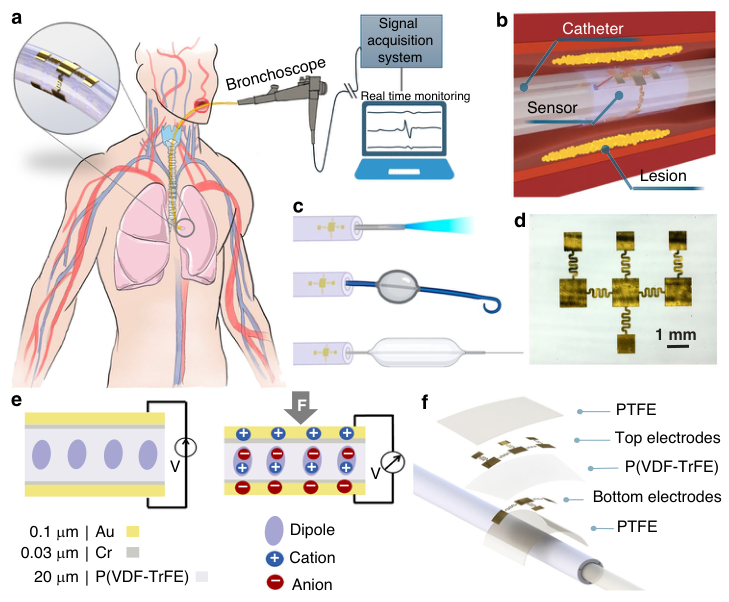
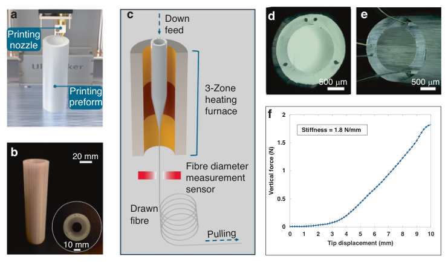
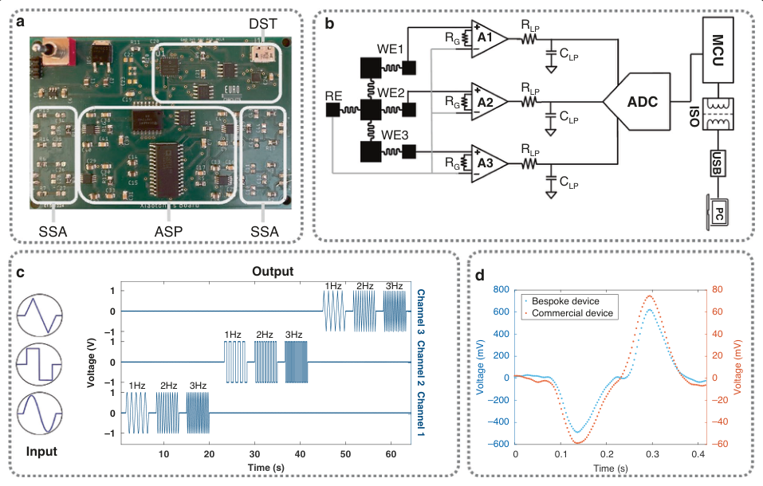
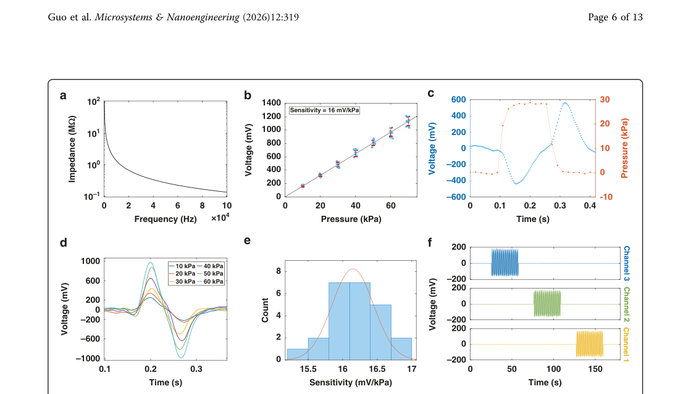
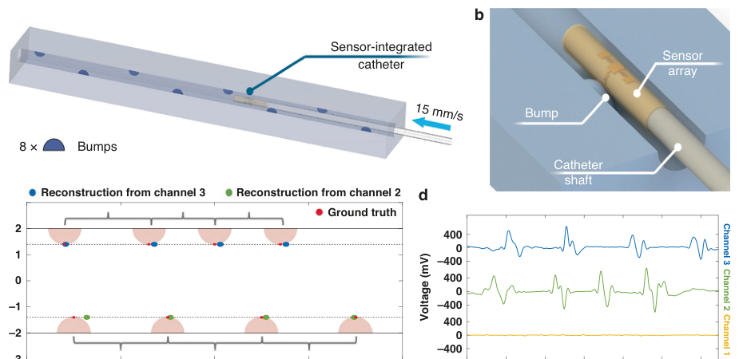
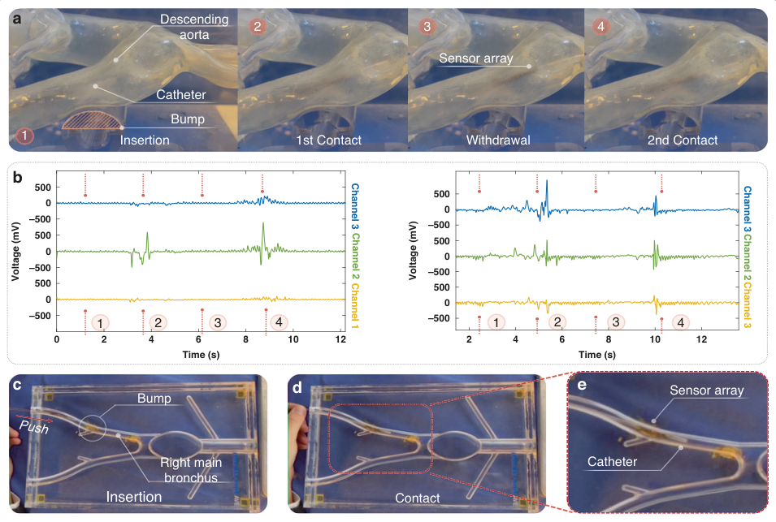

# Multiplexed catheter-integrated pressure sensing system for endoluminal interventions

- 期刊：Microsystems & Nanoengineering
- 日期：2026-09-15
- DOI：10.1038/s41378-026-01411-0
- 解析状态：fulltext_draft

## 摘要与研究价值

**原文摘要:** Abstract Advances in flexible catheters pave the way for minimally invasive diagnosis and treatment of luminal organs and tubular structures through endoluminal interventions. A key challenge is in establishing non-constraining pressure monitoring at the interfaces between medical catheters and intraluminal anatomy, where catheter–tissue interactions may be influenced by lumen curvature, structural variability, and physiological motion. In this work, we present a scalable and multi-purpose pressure sensing system for multidirectional monitoring of tissue interactions, establishing a robust solution for deploying diagnostic and therapeutic instruments in various types of endoluminal interventions. This approach provides an integrated pressure sensing platform that combines a thin-film piezoelectric sensor array with a bespoke multi-lumen catheter and a custom signal acquisition circuit. The sensor array is fabricated from an ultrathin poly (vinylidene fluoride-co-trifluoroethylene) (P(VDF-TrFE)) film using a multilayer sandwich architecture with patterned gold electrodes, resulting in a flexible device with a total thickness of approximately 20 µm and sensing units as small as 2.25 mm 2 . The multi-lumen catheter is fabricated with a cost-effective and highly scalable fiber drawing technology, establishing a means of fast prototyping catheters with bespoke microstructures for sensor integration and medical instrument deployment. Supported by a custom high-impedance acquisition circuit, the system achieves a sensitivity of 16 mV per kPa, which is approximately 25 times higher than state-of-the-art catheter-integrated sensors, while maintaining a sensing range from 0 to 80 kPa. Through in-vitro phantom studies, the system performs precise multi-directional sensing within various clinical endoluminal scenarios, showing its potential in digitalizing tissue interactions during endoluminal interventions.

**中文直译:** 等待智能体翻译补充。

**中文总结:** 待基于原文摘要生成中文总结；当前仅完成题录/摘要级筛选。

## 创新点

- Abstract Advances in flexible catheters pave the way for minimally invasive diagnosis and treatment of luminal organs and tubular structures through endoluminal interventions.

## 对当前课题的启发

- 可用于低离散/装配容差触觉界面的结构与对照设计
- 涉及低冗余阵列、空间特征或读出通道压缩
- 可对照 raw pixel、software feature 与 physical projection 的性能/通道/功耗
- 在同一阵列上比较 raw scanning、software feature 与低通道 hardware macro-pixel，量化通道数、延迟、功耗和任务精度。

## 制备与实验步骤

### 1. 制备与实验操作

**Source:** p.10

**Original:** Fabrication and integration workflow The overall fabrication and integration process of the catheter-integrated sensing system is illustrated in Fig. S1.

**中文:** 制备与实验操作步骤，关键配比、时间、温度和设备参数以 p.10 原文为准。

### 2. 成膜与沉积

**Source:** p.10

**Original:** The workflow follows a modular approach that includes sensor fabrication, multi-lumen catheter thermal drawing from a 3D-printed preform, sensor–catheter integration, and final system assembly with the signal acquisition module.

**中文:** 成膜与沉积步骤，关键配比、时间、温度和设备参数以 p.10 原文为准。

### 3. 组装与封装

**Source:** p.10

**Original:** Sensor fabrication The pressure sensor was constructed by encapsulating a P(VDF-TrFE) thin film between two metallic electrode layers composed of Au/Cr.

**中文:** 组装与封装步骤，关键配比、时间、温度和设备参数以 p.10 原文为准。

### 4. 成膜与沉积

**Source:** p.10

**Original:** The polymer layer was prepared via spin-coating.

**中文:** 成膜与沉积步骤，关键配比、时间、温度和设备参数以 p.10 原文为准。

### 5. 材料混合与分散

**Source:** p.10

**Original:** Specifically, P(VDF-TrFE) was dissolved in dimethylformamide at a concentration of 1%, and the resulting solution was spin-coated onto an atomically flat, highly conductive Si substrate at 2000 rpm for 30 s.

**中文:** 材料混合与分散步骤，关键配比、时间、温度和设备参数以 p.10 原文为准。

### 6. 固化与热处理

**Source:** p.10

**Original:** Following ambient drying, the film was annealed at 140 °C for 10 min to promote crystallization.

**中文:** 固化与热处理步骤，关键配比、时间、温度和设备参数以 p.10 原文为准。

### 7. 固化与热处理

**Source:** p.10

**Original:** The annealed film was subsequently electrically poled at 23 °C under an incrementally increasing alternating-current voltage.

**中文:** 固化与热处理步骤，关键配比、时间、温度和设备参数以 p.10 原文为准。

### 8. 图形化与结构成形

**Source:** p.10

**Original:** Electrode patterning was achieved using stainless-steel masks (100 μm thickness) fabricated via laser cutting, as shown in Fig. S2.

**中文:** 图形化与结构成形步骤，关键配比、时间、温度和设备参数以 p.10 原文为准。

### 9. 成膜与沉积

**Source:** p.10

**Original:** A 2–3 nm Cr adhesion layer was first deposited by thermal evaporation, followed by thermal evaporation of a 100 nm Au layer at a rate of 2 Å/s, yielding a smooth and welldefined electrode surface.

**中文:** 成膜与沉积步骤，关键配比、时间、温度和设备参数以 p.10 原文为准。

### 10. 组装与封装

**Source:** p.10

**Original:** The digitized signals are transmitted through the SPI interface to the MCU in the DST module for data encoding and communication, and subsequently sent via UART to the RTD module, where an isolator and USB interface enable safe data transfer to a computer for visualization and recording.

**中文:** 组装与封装步骤，关键配比、时间、温度和设备参数以 p.10 原文为准。

### 11. 制备与实验操作

**Source:** p.10

**Original:** Sensor-catheter assembly The assembly began with cutting the sides of the fiber to expose the side lumens, gaining access for the conductive wires.

**中文:** 制备与实验操作步骤，关键配比、时间、温度和设备参数以 p.10 原文为准。

### 12. 成膜与沉积

**Source:** p.10

**Original:** Fiber drawing The fiber preform was first conceptualized using 3D computer-aided design software (SolidWorks, Dassault Systèmes, France) and fabricated using a fused-filament fabrication 3D printer (Ultimaker, PC Transparent, 2.85 mm; Netherlands).

**中文:** 成膜与沉积步骤，关键配比、时间、温度和设备参数以 p.10 原文为准。

### 13. 制备与实验操作

**Source:** p.11

**Original:** The fiber drawing process was initiated by securing the prepared preform onto a vertically aligned linear motorized stage positioned above a three-zone cylindrical heating furnace.

**中文:** 制备与实验操作步骤，关键配比、时间、温度和设备参数以 p.11 原文为准。

### 14. 制备与实验操作

**Source:** p.11

**Original:** Finally, fibers with desired diameter were cut into sections with the targeted length for catheter preparation.

**中文:** 制备与实验操作步骤，关键配比、时间、温度和设备参数以 p.11 原文为准。

### 15. 组装与封装

**Source:** p.11

**Original:** This conduit model was constructed to replicate the geometric complexity and luminal irregularities typically encountered in physiological environments, enabling controlled and reproducible assessment of sensor response.

**中文:** 组装与封装步骤，关键配比、时间、温度和设备参数以 p.11 原文为准。

## 方法原文锚点

**Source:** p.10 M001

**Original:** Fabrication and integration workflow

**中文:** 该段已进入结构化方法步骤；完整逐段翻译待智能体精读补齐。

**Source:** p.10 M002

**Original:** The overall fabrication and integration process of the catheter-integrated sensing system is illustrated in Fig. S1. The workflow follows a modular approach that includes sensor fabrication, multi-lumen catheter thermal drawing

**中文:** 该段已进入结构化方法步骤；完整逐段翻译待智能体精读补齐。

**Source:** p.10 M003

**Original:** from a 3D-printed preform, sensor–catheter integration, and final system assembly with the signal acquisition module.

**中文:** 该段已进入结构化方法步骤；完整逐段翻译待智能体精读补齐。

**Source:** p.10 M004

**Original:** Sensor fabrication

**中文:** 该段已进入结构化方法步骤；完整逐段翻译待智能体精读补齐。

**Source:** p.10 M005

**Original:** The pressure sensor was constructed by encapsulating a P(VDF-TrFE) thin film between two metallic electrode layers composed of Au/Cr. The polymer layer was prepared via spin-coating. Specifically, P(VDF-TrFE) was dissolved in dimethylformamide at a concentration of 1%, and the resulting solution was spin-coated onto an atomically flat, highly conductive Si substrate at 2000 rpm for 30 s. Following ambient drying, the film was annealed at 140 °C for 10 min to promote crystallization. The annealed film was subsequently electrically poled at 23 °C under an incrementally increasing alternating-current voltage. Electrode patterning was achieved using stainless-steel masks (100 μm thickness) fabricated via laser cutting, as shown in Fig. S2. A 2–3 nm Cr adhesion layer was first deposited by thermal evaporation, followed by thermal evaporation of a 100 nm Au layer at a rate of 2 Å/s, yielding a smooth and welldefined electrode surface.

**中文:** 该段已进入结构化方法步骤；完整逐段翻译待智能体精读补齐。

**Source:** p.10 M006

**Original:** Custom signal acquisition circuit configuration

**中文:** 该段已进入结构化方法步骤；完整逐段翻译待智能体精读补齐。

**Source:** p.10 M007

**Original:** Within the ASP module, the weak signals generated by the piezoelectric sensor are conditioned using high-inputimpedance instrumentation amplifiers (INA116), followed by low-pass filtering (LPF) and analog-to-digital conversion (ADC). The digitized signals are transmitted through the SPI interface to the MCU in the DST module for data encoding and communication, and subsequently sent via UART to the RTD module, where an isolator and USB interface enable safe data transfer to a computer for visualization and recording.

**中文:** 该段已进入结构化方法步骤；完整逐段翻译待智能体精读补齐。

**Source:** p.10 M008

**Original:** Sensor-catheter assembly

**中文:** 该段已进入结构化方法步骤；完整逐段翻译待智能体精读补齐。

**Source:** p.10 M009

**Original:** The assembly began with cutting the sides of the fiber to expose the side lumens, gaining access for the conductive wires. The electrode pads for anodes and ground of the sensing elements were then connected with the pull-our wires via conductive Cu pads (Fig. S5a). Subsequently, the wires were fed into their corresponding lumens until reaching the preassigned position (Fig. S5b). After that, the sensor was gently bent and wrapped over the distal end of the fiber. The process was finalized by wrapping a layer of PTFE tape (100 μm thickness) over the entire sensor and corresponding wires, as a protective layer preventing sensors from scratch damage and short circuit caused by body fluids.

**中文:** 该段已进入结构化方法步骤；完整逐段翻译待智能体精读补齐。

**Source:** p.10 M010

**Original:** Fiber drawing

**中文:** 该段已进入结构化方法步骤；完整逐段翻译待智能体精读补齐。

**Source:** p.10 M011

**Original:** The fiber preform was first conceptualized using 3D computer-aided design software (SolidWorks, Dassault Systèmes, France) and fabricated using a fused-filament fabrication 3D printer (Ultimaker, PC Transparent, 2.85 mm; Netherlands). The preform allows for consistent

**中文:** 该段已进入结构化方法步骤；完整逐段翻译待智能体精读补齐。

**Source:** p.11 M012

**Original:** Guo et al. Microsystems & Nanoengineering (2026) 12:319 Page 11 of 13

**中文:** 该段已进入结构化方法步骤；完整逐段翻译待智能体精读补齐。

**Source:** p.11 M013

**Original:** reproduction of fine structural features required for subsequent thermal drawing. This fiber preform was then placed in a vacuum oven maintained at 70 °C for 48 h to effectively dehydrate and eliminate residual moisture content that could compromise thermal stability, induce bubble formation, or introduce defects during consolidation.

**中文:** 该段已进入结构化方法步骤；完整逐段翻译待智能体精读补齐。

**Source:** p.11 M014

**Original:** The fiber drawing process was initiated by securing the prepared preform onto a vertically aligned linear motorized stage positioned above a three-zone cylindrical heating furnace. Once the temperature at each zone of the furnace reaching 150 °C, 230 °C, and 85 °C (from top to bottom), the linear stage continuously fed the fiber preform into the furnace at a constant speed of 1 mm/min (Vfeed). After the polymer preform began to neck down, a downward pulling force was applied from the bottom side using a speed-controllable capstan (Vdraw). The resulting diameter of the fiber (Dfiber) can be approximated using the following equation:

**中文:** 该段已进入结构化方法步骤；完整逐段翻译待智能体精读补齐。

**Source:** p.11 M015

**Original:** Dfibre2

**中文:** 该段已进入结构化方法步骤；完整逐段翻译待智能体精读补齐。

**Source:** p.11 M016

**Original:** ¼ Dpreform2

**中文:** 该段已进入结构化方法步骤；完整逐段翻译待智能体精读补齐。

**Source:** p.11 M017

**Original:** ð1Þ

**中文:** 该段已进入结构化方法步骤；完整逐段翻译待智能体精读补齐。

**Source:** p.11 M018

**Original:** V draw

**中文:** 该段已进入结构化方法步骤；完整逐段翻译待智能体精读补齐。

**Source:** p.11 M019

**Original:** V feed

**中文:** 该段已进入结构化方法步骤；完整逐段翻译待智能体精读补齐。

**Source:** p.11 M020

**Original:** Meanwhile, the diameter of the fiber was continuously monitored using a laser measurement device, which provides real-time feedback for the operator to adjust the capstan speed, thereby controlling the fiber diameter. Finally, fibers with desired diameter were cut into sections with the targeted length for catheter preparation.

**中文:** 该段已进入结构化方法步骤；完整逐段翻译待智能体精读补齐。

**Source:** p.11 M021

**Original:** Catheter stiffness characterization

**中文:** 该段已进入结构化方法步骤；完整逐段翻译待智能体精读补齐。

**Source:** p.11 M022

**Original:** The stiffness of the catheter was evaluated by conducting a flexural rigidity test. The distal end section, where the sensor mounted, was tested with wires embedded. The experiment involved vertically displacing the catheter tip (50 mm) by 10 mm deflection, repeated over three trials. A commercial force sensor was used to measure the overall force applied (Nano43, ATI Industrial Automation, USA). The stiffness is calculated with the total force required for different amplitudes of tip deflection and expressed in N/mm.

**中文:** 该段已进入结构化方法步骤；完整逐段翻译待智能体精读补齐。

**Source:** p.11 M023

**Original:** Sensor array characterization

**中文:** 该段已进入结构化方法步骤；完整逐段翻译待智能体精读补齐。

**Source:** p.11 M024

**Original:** The characterization of sensor array was performed on a bespoke platform for force loading and unloading with a controllable cycle frequency, as shown in Fig. S9. The contact area was determined via a customized spring probe mechanism (Fig. S10).

**中文:** 该段已进入结构化方法步骤；完整逐段翻译待智能体精读补齐。

**Source:** p.11 M025

**Original:** The sensitivity of individual sensors was tested by repeatedly applying cycles of various pressures. The effective pressure in each cycle was derived from equation P = F/A, where F is the peak force from the scale and A is the surface area of the probe tip. Pressures ranging from 10 kPa to 70 kPa with a step of 10 kPa were experimented. 10 repeated

**中文:** 该段已进入结构化方法步骤；完整逐段翻译待智能体精读补齐。

**Source:** p.11 M026

**Original:** cycles were conducted for each pressure. The voltage output from the sensor was determined by the positive peak in each loading cycle. Due to the high linearity, a first-order polynomial fitting was used for sensitivity calculation.

**中文:** 该段已进入结构化方法步骤；完整逐段翻译待智能体精读补齐。

**Source:** p.11 M027

**Original:** Biological conduit test

**中文:** 该段已进入结构化方法步骤；完整逐段翻译待智能体精读补齐。

**Source:** p.11 M028

**Original:** The mechanical performance of the catheter-mounted sensor array under multidirectional loading was systematically evaluated using a custom-designed experimental platform incorporating a 3D-printed biological conduit (Fig. S11). This conduit model was constructed to replicate the geometric complexity and luminal irregularities typically encountered in physiological environments, enabling controlled and reproducible assessment of sensor response. During testing, the catheter was advanced exclusively with an axial insertion force, ensuring that the contact force exerted on the sensor array remained consistent as the device traversed each predefined bump along the conduit wall. To maintain a constant and repeatable insertion velocity, the catheter was secured onto a precision linear translation stage driven by a programmable motor. The spatial arrangement of the raised features within the conduit ensured that only two lateral regions of the sensor array were engaged in direct mechanical contact, while the remaining sensing elements experienced minimal or no applied pressure. This controlled asymmetry in loading conditions allowed for isolated characterization of directional sensitivity and crosstalk within the array. Overall, this experimental setup provided an accurate and reproducible means of quantifying the ability of the sensor to detect localized mechanical events during catheter navigation.

**中文:** 该段已进入结构化方法步骤；完整逐段翻译待智能体精读补齐。

**Source:** p.11 M029

**Original:** In-vitro phantom study Endovascular interventions

**中文:** 该段已进入结构化方法步骤；完整逐段翻译待智能体精读补齐。

**Source:** p.11 M030

**Original:** A 1:1 life-sized soft silicone anatomical model of the aortic arch featuring a physiologically accurate three-cusp inflow region (T-S-N-002-v2, Elastrat, Switzerland) was employed to assess the sensorized catheter’s behavior under conditions representative of clinical endovascular procedures (Fig. S12). The experimental protocol began with the insertion of the catheter into the phantom through a unidirectional valve, which served to replicate the functional characteristics of a standard catheter introducer used in vascular access. Once positioned within the phantom, the catheter was advanced and retracted along the curvature of the vascular wall to evaluate the fidelity of sensor–wall interactions, with particular emphasis on detecting contact events with both the endovascular surface and the embedded artificial protrusion designed to simulate pathological irregularities.

**中文:** 该段已进入结构化方法步骤；完整逐段翻译待智能体精读补齐。

**Source:** p.11 M031

**Original:** Bronchial and lung interventions

**中文:** 该段已进入结构化方法步骤；完整逐段翻译待智能体精读补齐。

**Source:** p.11 M032

**Original:** For respiratory system simulations, a simplified yet anatomically relevant bronchial passage model

**中文:** 该段已进入结构化方法步骤；完整逐段翻译待智能体精读补齐。

**Source:** p.12 M033

**Original:** Guo et al. Microsystems & Nanoengineering (2026) 12:319 Page 12 of 13

**中文:** 该段已进入结构化方法步骤；完整逐段翻译待智能体精读补齐。

**Source:** p.12 M034

**Original:** (Medtronic, US) was utilized (Fig. S13). The catheter was initially introduced parallel to the primary bronchial conduit to mimic navigation through branching airways as encountered during bronchoscopy-guided interventions. Subsequent controlled movement of the catheter along the lumen enabled systematic evaluation of sensor response upon encountering an artificial protruded bump integrated into the model.

**中文:** 该段已进入结构化方法步骤；完整逐段翻译待智能体精读补齐。

## 图表解读

### Fig. 1

**Source:** p.3

**Original caption:** Fig. 1 Illustration of the catheter-integrated sensing system. a Overview of the catheter-integrated pressure sensing system as applied in bronchial interventions. b Schematic of the catheter-integrated sensing system being in touch with an aneurysmal protrusion within a confined vascular structure. c Illustration of the catheter-integrated sensing system accommodating various medical devices, including optical catheter (top), urinary catheter (middle), and balloon catheter for stent deployment (bottom). d Microscopic view of the sensor array. e Cross-sectional schematics of the sensor design and piezoelectric mechanism showing the generation of potential difference when mechanical force is applied. f Demonstration of the device array in multilayer format integrated at the distal end of the catheter

**中文图注:** Fig. 1 原始图注已提取；逐项含义见下方分图说明。

**Reading note:** 重点查看器件结构、材料层次、信号路径和制备流程。

- (a) 结合正文首次引用位置和原始图注核对该图的证据角色。 原文：Overview of the catheter-integrated pressure sensing system as applied in bronchial interventions
- (b) 重点查看器件结构、材料层次、信号路径和制备流程。 原文：Schematic of the catheter-integrated sensing system being in touch with an aneurysmal protrusion within a confined vascular structure
- (c) 结合正文首次引用位置和原始图注核对该图的证据角色。 原文：Illustration of the catheter-integrated sensing system accommodating various medical devices, including optical catheter (top), urinary catheter (middle), and balloon catheter for stent deployment (bottom)
- (d) 重点查看阵列规模、空间分辨率、串扰、读出通道和空间特征表达。 原文：Microscopic view of the sensor array
- (e) 重点查看器件结构、材料层次、信号路径和制备流程。 原文：Cross-sectional schematics of the sensor design and piezoelectric mechanism showing the generation of potential difference when mechanical force is applied
- (f) 重点查看阵列规模、空间分辨率、串扰、读出通道和空间特征表达。 原文：Demonstration of the device array in multilayer format integrated at the distal end of the catheter

### Fig. 2

**Source:** p.4

**Original caption:** Fig. 2 Catheter fabrication and characterization. a 3D printing of the preform with designated cross-section prepared for catheter fabrication. b Resulting 3D-print preform. c Schematic illustration of the fiber drawing process, where the colored hollowed cylinder represents the heating furnace. d Labeled microscopic cross-section view of the drawn fiber with channels 1-3 (the wiring channels for connecting anodes), 4 (the wiring channel for connecting cathode), and a central working channel for accommodating medical devices. e Microscopic view of the fiber with wires embedded. f Stiffness measurement of the fiber with a flexural rigidity test

**中文图注:** Fig. 2 原始图注已提取；逐项含义见下方分图说明。

**Reading note:** 重点查看器件结构、材料层次、信号路径和制备流程。

- (a) 重点查看器件结构、材料层次、信号路径和制备流程。 原文：3D printing of the preform with designated cross-section prepared for catheter fabrication
- (b) 结合正文首次引用位置和原始图注核对该图的证据角色。 原文：Resulting 3D-print preform
- (c) 重点查看器件结构、材料层次、信号路径和制备流程。 原文：Schematic illustration of the fiber drawing process, where the colored hollowed cylinder represents the heating furnace
- (d) 结合正文首次引用位置和原始图注核对该图的证据角色。 原文：Labeled microscopic cross-section view of the drawn fiber with channels 1-3 (the wiring channels for connecting anodes), 4 (the wiring channel for connecting cathode), and a central working channel for accommodating medical devices
- (e) 结合正文首次引用位置和原始图注核对该图的证据角色。 原文：Microscopic view of the fiber with wires embedded
- (f) 结合正文首次引用位置和原始图注核对该图的证据角色。 原文：Stiffness measurement of the fiber with a flexural rigidity test

### Figure 2D

**Source:** p.4

**Original caption:** Figure 2d shows the microscopic view of the crosssection of the resulting drawn fiber. The cross-section structure was well retained compared with the design of fiber geometry, allowing passing through the conductive wires therein (Fig. 2e). The layout of the side lumens facilitates streamlined wiring of the integrated sensor that has electrodes uniformly distributed at 120° intervals. Figure 2f illustrates the stiffness characterization results of the fabricated fiber based on a flexural rigidity test. The fiber with embedded wires shows a stiffness of 1.8 N/mm for an identical 2.8 mm diameter and 50 mm length, according to the equation Stiffness ¼ Force=Displacement.

**中文图注:** Figure 2D 原始图注已提取；逐项含义见下方分图说明。

**Reading note:** 重点查看器件结构、材料层次、信号路径和制备流程。

### Fig. 3

**Source:** p.5

**Original caption:** Fig. 3 Customized signal acquisition module for real-time multi-channel readout. a Image of the signal acquisition system board. b Circuit design: RE = reference electrode, WE = working electrode, RG = gain resistor of the instrumentation amplifier, RLP = low-pass filter resistor, CLP = low-pass filter capacitor, MCU = micro controller unit, PC = personal computer; and a graph showcases the processed digital output from the circuit. c Signal readout characterization from three channels under different waveforms (ramp, square, and sinusoid) with different frequencies applied. d Consistency evaluation between the customized module and a commercial recording instrument when measuring the same piezoelectric sensor output

**中文图注:** Fig. 3 原始图注已提取；逐项含义见下方分图说明。

**Reading note:** 重点查看阵列规模、空间分辨率、串扰、读出通道和空间特征表达。

- (a) 重点查看阵列规模、空间分辨率、串扰、读出通道和空间特征表达。 原文：Image of the signal acquisition system board
- (b) 结合正文首次引用位置和原始图注核对该图的证据角色。 原文：Circuit design: RE = reference electrode, WE = working electrode, RG = gain resistor of the instrumentation amplifier, RLP = low-pass filter resistor, CLP = low-pass filter capacitor, MCU = micro controller unit, PC = personal computer; and a graph showcases the processed digital output from the circuit
- (c) 结合正文首次引用位置和原始图注核对该图的证据角色。 原文：Signal readout characterization from three channels under different waveforms (ramp, square, and sinusoid) with different frequencies applied
- (d) 结合正文首次引用位置和原始图注核对该图的证据角色。 原文：Consistency evaluation between the customized module and a commercial recording instrument when measuring the same piezoelectric sensor output

### Fig. 4

**Source:** p.6

**Original caption:** Fig. 4 Characterization of the sensor array. a Semi-logarithmic plot demonstrating impedance variance of the sensor across different frequencies measured with commercial impedance analyzer. b Output peak voltage corresponding to various ranges of pressure. c Voltage response to a single cycle of force loading and unloading. d Voltage response corresponding to various ranges of pressure. e Histogram and approximated Gaussian line of the sensitivity measurements across multiple sensing units. f Force application with a repeated loading and unloading cycle on the sensor array

**中文图注:** Fig. 4 原始图注已提取；逐项含义见下方分图说明。

**Reading note:** 重点查看标定方法、量程、误差、线性和动态响应，避免只比较单一灵敏度。

- (a) 结合正文首次引用位置和原始图注核对该图的证据角色。 原文：Semi-logarithmic plot demonstrating impedance variance of the sensor across different frequencies measured with commercial impedance analyzer
- (b) 结合正文首次引用位置和原始图注核对该图的证据角色。 原文：Output peak voltage corresponding to various ranges of pressure
- (c) 重点查看标定方法、量程、误差、线性和动态响应，避免只比较单一灵敏度。 原文：Voltage response to a single cycle of force loading and unloading
- (d) 重点查看标定方法、量程、误差、线性和动态响应，避免只比较单一灵敏度。 原文：Voltage response corresponding to various ranges of pressure
- (e) 重点查看标定方法、量程、误差、线性和动态响应，避免只比较单一灵敏度。 原文：Histogram and approximated Gaussian line of the sensitivity measurements across multiple sensing units
- (f) 重点查看标定方法、量程、误差、线性和动态响应，避免只比较单一灵敏度。 原文：Force application with a repeated loading and unloading cycle on the sensor array

### Fig. 5

**Source:** p.7

**Original caption:** Fig. 5 Controlled benchmark study of catheter multi-directional sensing and spatial localization. a, b Schematics of the 3D-printed conduit model with periodically arranged protruding bumps used for quantitative evaluation under well-defined geometric constraints. c Reconstruction of in-contact locations of individual bumps from the recorded pressure peaks and comparison with ground-truth bump positions. d Multi-channel sensor output signals recorded during catheter insertion

**中文图注:** Fig. 5 原始图注已提取；逐项含义见下方分图说明。

**Reading note:** 重点查看器件结构、材料层次、信号路径和制备流程。

- (a,b) 重点查看器件结构、材料层次、信号路径和制备流程。 原文：Schematics of the 3D-printed conduit model with periodically arranged protruding bumps used for quantitative evaluation under well-defined geometric constraints
- (c) 结合正文首次引用位置和原始图注核对该图的证据角色。 原文：Reconstruction of in-contact locations of individual bumps from the recorded pressure peaks and comparison with ground-truth bump positions
- (d) 结合正文首次引用位置和原始图注核对该图的证据角色。 原文：Multi-channel sensor output signals recorded during catheter insertion

### Fig. 6

**Source:** p.8

**Original caption:** Fig. 6 Results of in-vitro phantom studies. a Sequential images showing catheter insertion and withdrawal within an aortic arch phantom containing an artificial bump. The labels in red balloons indicate the temporal sequence of the images. b Two representative examples of sensor output signals recorded during the aortic arch phantom study. The timestamps corresponding to the images are labeled in red. c, d Illustrations of catheter manipulation during navigation through a simplified bronchial phantom with a small protruding bump located at the midpoint. e Magnified image showing the catheter in contact with the bump. f Representative sensor array readouts

**中文图注:** Fig. 6 原始图注已提取；逐项含义见下方分图说明。

**Reading note:** 重点查看阵列规模、空间分辨率、串扰、读出通道和空间特征表达。

- (a) 重点查看阵列规模、空间分辨率、串扰、读出通道和空间特征表达。 原文：Sequential images showing catheter insertion and withdrawal within an aortic arch phantom containing an artificial bump. The labels in red balloons indicate the temporal sequence of the images
- (b) 重点查看阵列规模、空间分辨率、串扰、读出通道和空间特征表达。 原文：Two representative examples of sensor output signals recorded during the aortic arch phantom study. The timestamps corresponding to the images are labeled in red
- (c,d) 结合正文首次引用位置和原始图注核对该图的证据角色。 原文：Illustrations of catheter manipulation during navigation through a simplified bronchial phantom with a small protruding bump located at the midpoint
- (e) 重点查看阵列规模、空间分辨率、串扰、读出通道和空间特征表达。 原文：Magnified image showing the catheter in contact with the bump
- (f) 重点查看阵列规模、空间分辨率、串扰、读出通道和空间特征表达。 原文：Representative sensor array readouts
