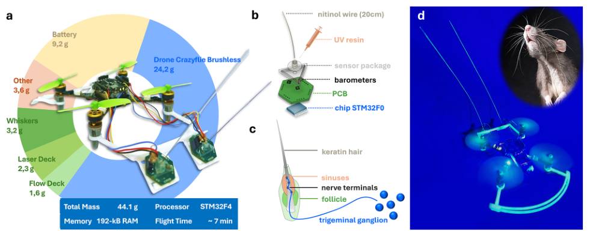
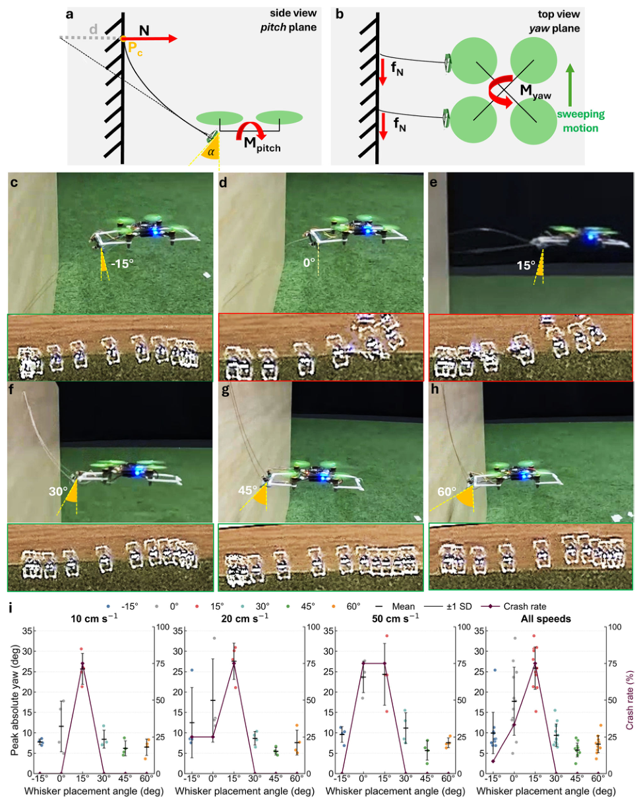
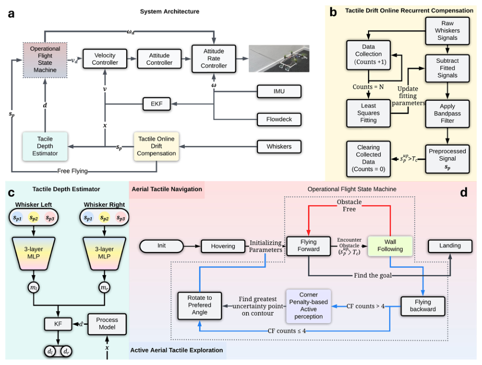
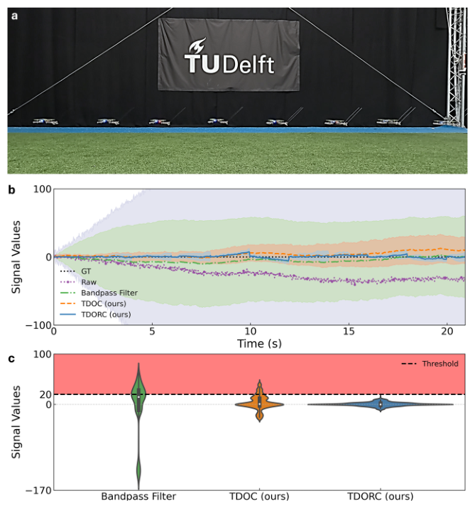
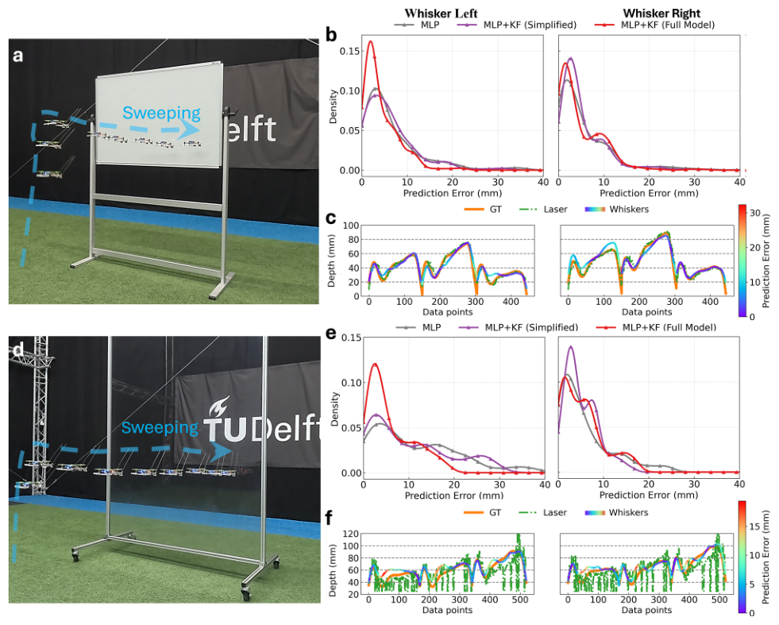
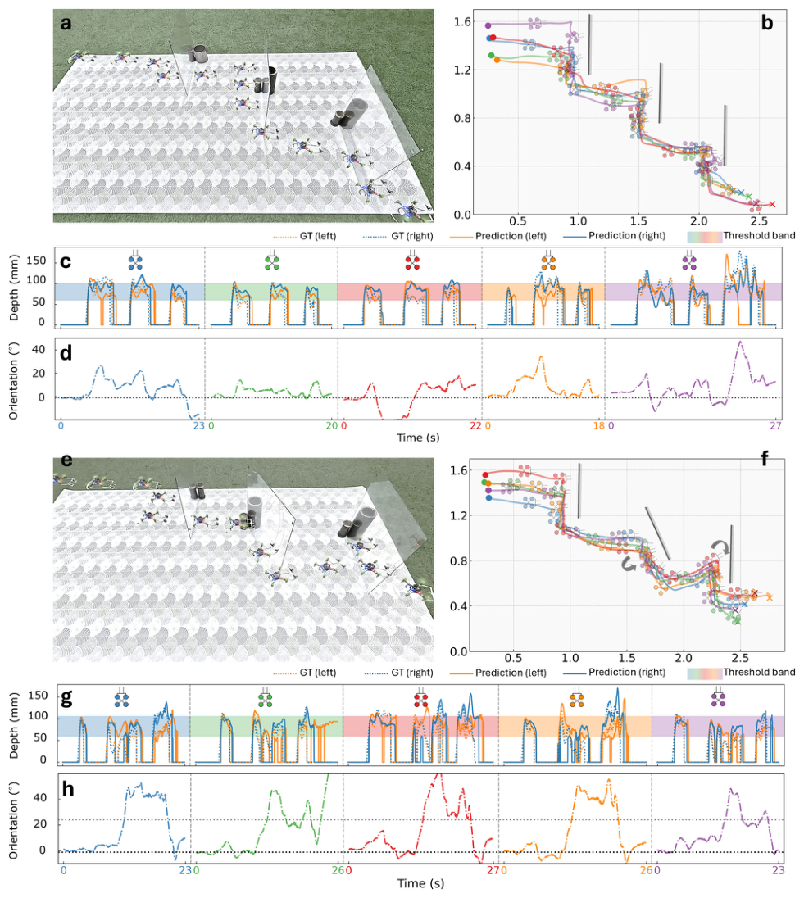
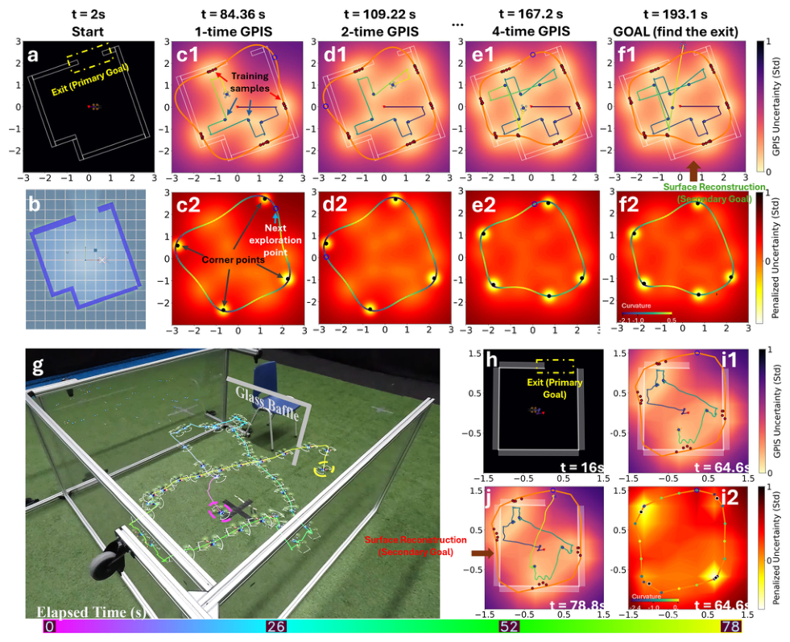
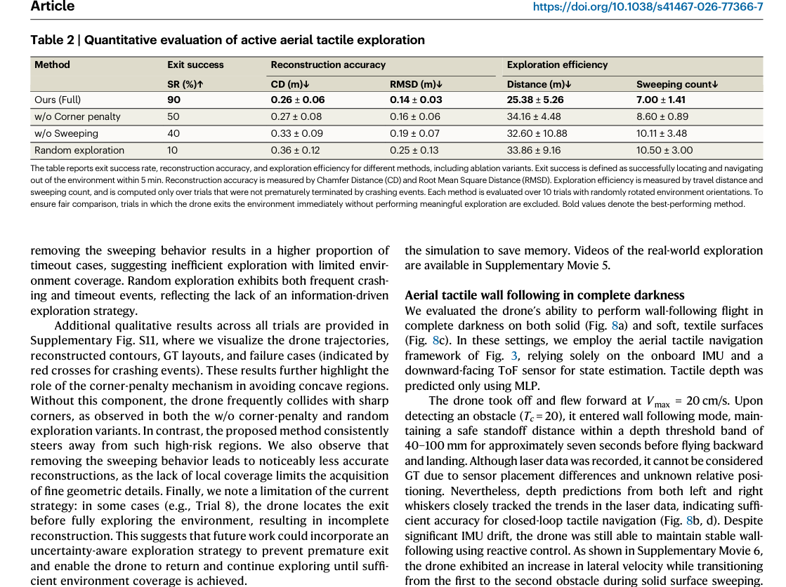

# Whisker-based tactile flight for tiny drones

- 期刊：Nature Communications
- 日期：2026-09-18
- DOI：10.1038/s41467-026-77366-7
- 解析状态：fulltext_draft

## 摘要与研究价值

**原文摘要:** Abstract Tiny flying robots hold great potential for search-and-rescue, safety inspections, and environmental monitoring, but their small size and limited computational resources constrain onboard sensing capabilities. Inspired by animals such as rats and moles which rely on lightweight whiskers to navigate and perceive their surroundings through touch, we present a 3.2-gram whisker-based tactile sensing apparatus that enables tiny drones to perceive and interact with their environment through gentle physical contact, even in complete darkness. The apparatus employs barometers at the base of each whisker to estimate contact depth in flight, enabling obstacle localization while minimizing contact-induced destabilization. To compensate for sensor noise and drift during sustained contact, we develop a tactile depth estimation pipeline that achieves millimeter-scale depth estimation accuracy. Together, these innovations enable tiny drones to autonomously avoid obstacles, contour surfaces, and explore confined spaces, guided by onboard tactile sensing across both rigid and soft environments. Running entirely onboard a microcontroller with just 192 KB of memory, our system demonstrates autonomous tactile flight across various scenarios. This bio-inspired approach extends perception for mobile robots beyond vision, opening new possibilities for autonomous operations in visually degraded and GPS-denied environments.

**中文直译:** 等待智能体翻译补充。

**中文总结:** 待基于原文摘要生成中文总结；当前仅完成题录/摘要级筛选。

## 创新点

- Abstract Tiny flying robots hold great potential for search-and-rescue, safety inspections, and environmental monitoring, but their small size and limited computational resources constrain onboard sensing capabilities.

## 对当前课题的启发

- 涉及坏点、漂移、跨器件迁移或少样本校准
- 可对照 raw pixel、software feature 与 physical projection 的性能/通道/功耗
- 加入坏点比例、增益漂移和跨器件迁移实验，比较重标定样本量与性能渐进退化，形成可靠性主张。

## 制备与实验步骤

### 1. 组装与封装

**Source:** p.10

**Original:** To validate our method in real-world scenarios, we constructed a 2 m × 2 m room with glass walls and an 80 cm-wide exit.

**中文:** 组装与封装步骤，关键配比、时间、温度和设备参数以 p.10 原文为准。

## 方法原文锚点

**Source:** p.10 M001

**Original:** Exit success Reconstruction accuracy Exploration efficiency

**中文:** 该段已进入结构化方法步骤；完整逐段翻译待智能体精读补齐。

**Source:** p.10 M002

**Original:** SR (%)↑ CD (m)↓ RMSD (m)↓ Distance (m)↓ Sweeping count↓

**中文:** 该段已进入结构化方法步骤；完整逐段翻译待智能体精读补齐。

**Source:** p.10 M003

**Original:** Ours (Full) 90 0.26 ± 0.06 0.14 ± 0.03 25.38 ± 5.26 7.00 ± 1.41

**中文:** 该段已进入结构化方法步骤；完整逐段翻译待智能体精读补齐。

**Source:** p.10 M004

**Original:** w/o Corner penalty 50 0.27 ± 0.08 0.16 ± 0.06 34.16 ± 4.48 8.60 ± 0.89

**中文:** 该段已进入结构化方法步骤；完整逐段翻译待智能体精读补齐。

**Source:** p.10 M005

**Original:** w/o Sweeping 40 0.33 ± 0.09 0.19 ± 0.07 32.60 ± 10.88 10.11 ± 3.48

**中文:** 该段已进入结构化方法步骤；完整逐段翻译待智能体精读补齐。

**Source:** p.10 M006

**Original:** Random exploration 10 0.36 ± 0.12 0.25 ± 0.13 33.86 ± 9.16 10.50 ± 3.00

**中文:** 该段已进入结构化方法步骤；完整逐段翻译待智能体精读补齐。

**Source:** p.10 M007

**Original:** The table reports exit success rate, reconstruction accuracy, and exploration efficiency for different methods, including ablation variants. Exit success is defined as successfully locating and navigating out of the environment within 5 min. Reconstruction accuracy is measured by Chamfer Distance (CD) and Root Mean Square Distance (RMSD). Exploration efficiency is measured by travel distance and sweeping count, and is computed only over trials that were not prematurely terminated by crashing events. Each method is evaluated over 10 trials with randomly rotated environment orientations. To ensure fair comparison, trials in which the drone exits the environment immediately without performing meaningful exploration are excluded. Bold values denote the best-performing method.

**中文:** 该段已进入结构化方法步骤；完整逐段翻译待智能体精读补齐。

**Source:** p.10 M008

**Original:** Nature Communications| (2026) 17:9743 10

**中文:** 该段已进入结构化方法步骤；完整逐段翻译待智能体精读补齐。

**Source:** p.10 M009

**Original:** removing the sweeping behavior results in a higher proportion of timeout cases, suggesting inefficient exploration with limited environment coverage. Random exploration exhibits both frequent crashing and timeout events, reflecting the lack of an information-driven exploration strategy.

**中文:** 该段已进入结构化方法步骤；完整逐段翻译待智能体精读补齐。

**Source:** p.10 M010

**Original:** Additional qualitative results across all trials are provided in Supplementary Fig. S11, where we visualize the drone trajectories, reconstructed contours, GT layouts, and failure cases (indicated by red crosses for crashing events). These results further highlight the role of the corner-penalty mechanism in avoiding concave regions. Without this component, the drone frequently collides with sharp corners, as observed in both the w/o corner-penalty and random exploration variants. In contrast, the proposed method consistently steers away from such high-risk regions. We also observe that removing the sweeping behavior leads to noticeably less accurate reconstructions, as the lack of local coverage limits the acquisition of fine geometric details. Finally, we note a limitation of the current strategy: in some cases (e.g., Trial 8), the drone locates the exit before fully exploring the environment, resulting in incomplete reconstruction. This suggests that future work could incorporate an uncertainty-aware exploration strategy to prevent premature exit and enable the drone to return and continue exploring until sufficient environment coverage is achieved.

**中文:** 该段已进入结构化方法步骤；完整逐段翻译待智能体精读补齐。

**Source:** p.10 M011

**Original:** Figure 7 illustrates one successful exploration, which panel Fig. 7c1 shows the first application of GPIS to the uncertainty map after collecting training data in four orthogonal orientations (red dots: surface; blue dots: interior). Compared to Fig. 7a, uncertainty is significantly reduced in the explored regions. The drone’s trajectory and current state are indicated by a small drone icon, with reconstructed contours in orange using the marching squares algorithm. Curvature analysis (Fig. 7c2) highlights high-curvature corners, which are penalized to guide the next exploration target (blue hollow circle). Subsequent GPIS applications and corner penalties (Fig. 7d1–f2) progressively refine the map and reduce uncertainty. For clarity, we omit the third GPIS application from the figure. The drone successfully located the exit after the fourth GPIS application.

**中文:** 该段已进入结构化方法步骤；完整逐段翻译待智能体精读补齐。

**Source:** p.10 M012

**Original:** To validate our method in real-world scenarios, we constructed a 2 m × 2 m room with glass walls and an 80 cm-wide exit. As part of the experimental setup, optical flow is used only for egomotion estimation and flight stabilization, while all environment perception and navigation decisions are driven by tactile sensing onboard. As shown in Fig. 7g, h, the drone successfully explored the environment and located the exit. It began by collecting GPIS training data in four orthogonal directions (Fig. 7i1) to build an initial environmental model. Highcurvature corners were identified and penalized (Fig. 7i2), guiding the drone to explore in safer directions while progressively reducing uncertainty. At each step, the GPIS-based prediction and corner penalties updated the target exploration points, allowing the drone to navigate efficiently and avoid collisions. The final reconstructed map closely aligns with the actual room layout, with minor deviations due to odometry drift. Grid resolution was reduced (10 × 10) compared to

**中文:** 该段已进入结构化方法步骤；完整逐段翻译待智能体精读补齐。

**Source:** p.10 M013

**Original:** the simulation to save memory. Videos of the real-world exploration are available in Supplementary Movie 5.

**中文:** 该段已进入结构化方法步骤；完整逐段翻译待智能体精读补齐。

**Source:** p.10 M014

**Original:** Aerial tactile wall following in complete darkness We evaluated the drone’s ability to perform wall-following flight in complete darkness on both solid (Fig. 8a) and soft, textile surfaces (Fig. 8c). In these settings, we employ the aerial tactile navigation framework of Fig. 3, relying solely on the onboard IMU and a downward-facing ToF sensor for state estimation. Tactile depth was predicted only using MLP.

**中文:** 该段已进入结构化方法步骤；完整逐段翻译待智能体精读补齐。

**Source:** p.10 M015

**Original:** The drone took off and flew forward at V max = 20 cm/s. Upon detecting an obstacle (Tc = 20), it entered wall following mode, maintaining a safe standoff distance within a depth threshold band of 40–100 mm for approximately seven seconds before flying backward and landing. Although laser data was recorded, it cannot be considered GT due to sensor placement differences and unknown relative positioning. Nevertheless, depth predictions from both left and right whiskers closely tracked the trends in the laser data, indicating sufficient accuracy for closed-loop tactile navigation (Fig. 8b, d). Despite significant IMU drift, the drone was still able to maintain stable wallfollowing using reactive control. As shown in Supplementary Movie 6, the drone exhibited an increase in lateral velocity while transitioning from the first to the second obstacle during solid surface sweeping. This may have resulted from a momentary rightward acceleration when losing contact, which the IMU misinterpreted as relative stasis, prompting an excessive corrective command in that direction. Wallfollowing on soft objects proved more challenging due to higher surface friction and the presence of folds on the flag. These factors reduce the reliability of depth estimation and destabilize the controller, resulting in the oscillatory behavior observed in Fig. 8d. The oscillations highlight the controller’s limited robustness under soft-surface conditions. Nevertheless, the system successfully completed wallfollowing on the flag without crashing—a task that remains difficult for other intrusive tactile sensors or aerial manipulators.

**中文:** 该段已进入结构化方法步骤；完整逐段翻译待智能体精读补齐。

## 图表解读

### Fig. 1

**Source:** p.2

**Original caption:** Fig. 1 | Design and biological inspiration of the whiskered drone. a The whiskered drone platform considered here: a tiny, 44.1-g Crazyflie Brushless drone with 2 artificial whiskers. b Structural diagram of the whisker sensor, the STM32F0 is only used for data acquisition and transmission for the three barometers and for

**中文图注:** Fig. 1 原始图注已提取；逐项含义见下方分图说明。

**Reading note:** 结合正文首次引用位置和原始图注核对该图的证据角色。

- (a) 结合正文首次引用位置和原始图注核对该图的证据角色。 原文：The whiskered drone platform considered here: a tiny, 44.1-g Crazyflie Brushless drone with 2 artificial whiskers
- (b) 结合正文首次引用位置和原始图注核对该图的证据角色。 原文：Structural diagram of the whisker sensor, the STM32F0 is only used for data acquisition and transmission for the three barometers and for

### Fig. 2

**Source:** p.3

**Original caption:** Fig. 2 | Effect of the whisker placement angle on the drone’s stability during wall-following interactions. a, b Schematic illustration of forces and moments present on the drone during whisker-based wall sweeping at the positive placement angle. While in contact with a vertical obstacle, the whisker generates a normal force N, which induces a friction force fN. The whisker’s placement angle α influences the resulting N and moment arm, and thus the drone’s pitch Mpitch and yaw Myaw moments. c–h Experimental setup, whisker deflection, and sweeping motion of the drone with whiskers mounted at −15°, 0°, 15°, 30°, 45°, and 60° in the pitch

**中文图注:** Fig. 2 原始图注已提取；逐项含义见下方分图说明。

**Reading note:** 重点查看器件结构、材料层次、信号路径和制备流程。

- (a,b) 重点查看器件结构、材料层次、信号路径和制备流程。 原文：Schematic illustration of forces and moments present on the drone during whisker-based wall sweeping at the positive placement angle. While in contact with a vertical obstacle, the whisker generates a normal force N, which induces a friction force fN. The whisker’s placement angle α influences the resulting N and moment arm, and thus the drone’s pitch Mpitch and yaw Myaw moments
- (c-h) 结合正文首次引用位置和原始图注核对该图的证据角色。 原文：Experimental setup, whisker deflection, and sweeping motion of the drone with whiskers mounted at −15°, 0°, 15°, 30°, 45°, and 60° in the pitch

### Fig. 3

**Source:** p.5

**Original caption:** Fig. 3 | Overview of our whiskered drone system pipeline. a System architecture diagram. b The TODRC module for compensating tactile drift. c The tactile depth estimation module, which fuses the sensor model and process model to predict left and right whisker depths. d The aerial tactile navigation module (highlighted in red), based on wall-following, and the active aerial tactile exploration module

**中文图注:** Fig. 3 原始图注已提取；逐项含义见下方分图说明。

**Reading note:** 重点查看器件结构、材料层次、信号路径和制备流程。

- (a) 重点查看器件结构、材料层次、信号路径和制备流程。 原文：System architecture diagram
- (b) 结合正文首次引用位置和原始图注核对该图的证据角色。 原文：The TODRC module for compensating tactile drift
- (c) 重点查看机制模型与实验结果是否一致，以及关键结构参数的对照关系。 原文：The tactile depth estimation module, which fuses the sensor model and process model to predict left and right whisker depths
- (d) 结合正文首次引用位置和原始图注核对该图的证据角色。 原文：The aerial tactile navigation module (highlighted in red), based on wall-following, and the active aerial tactile exploration module

### Fig. 4

**Source:** p.6

**Original caption:** Fig. 4 | Whisker sensor drift compensation during free flight. a Whiskered drone performing a free flight with TDORC onboard. b The mean and standard deviation bands of the six-channel barometer signals for raw measurements, bandpassfiltered signals, TDOC, and TDORC demonstrate that our proposed methods effectively suppresses signal drift. c Violin plots showing the whisker signal

**中文图注:** Fig. 4 原始图注已提取；逐项含义见下方分图说明。

**Reading note:** 结合正文首次引用位置和原始图注核对该图的证据角色。

- (a) 结合正文首次引用位置和原始图注核对该图的证据角色。 原文：Whiskered drone performing a free flight with TDORC onboard
- (b) 结合正文首次引用位置和原始图注核对该图的证据角色。 原文：The mean and standard deviation bands of the six-channel barometer signals for raw measurements, bandpassfiltered signals, TDOC, and TDORC demonstrate that our proposed methods effectively suppresses signal drift
- (c) 结合正文首次引用位置和原始图注核对该图的证据角色。 原文：Violin plots showing the whisker signal

### Fig. 5

**Source:** p.7

**Original caption:** Fig. 5 | Whisker-based tactile depth estimation evaluated on the test set. a Data collection on a rigid panel (Dataset 1). b Prediction error density across models for Dataset 1. c Predicted depth from MLP + KF (Full Model) vs. GT and laser on Dataset

**中文图注:** Fig. 5 原始图注已提取；逐项含义见下方分图说明。

**Reading note:** 重点查看标定方法、量程、误差、线性和动态响应，避免只比较单一灵敏度。

- (a) 结合正文首次引用位置和原始图注核对该图的证据角色。 原文：Data collection on a rigid panel (Dataset 1)
- (b) 重点查看标定方法、量程、误差、线性和动态响应，避免只比较单一灵敏度。 原文：Prediction error density across models for Dataset 1
- (c) 重点查看机制模型与实验结果是否一致，以及关键结构参数的对照关系。 原文：Predicted depth from MLP + KF (Full Model) vs. GT and laser on Dataset

### Fig. 6

**Source:** p.8

**Original caption:** Fig. 6 | Experimental results of aerial tactile navigation through multiple invisible walls. a Whiskered drone successfully navigating three parallel glass walls. b Trajectories of the drone across five independent trials in the first wall setup, with absolute position and orientation visualized. c Comparison of true and estimatedcontact depths with the corresponding threshold bands in the first setup. d Absolute orientation of the drone in the first setup. e Whiskered drone

**中文图注:** Fig. 6 原始图注已提取；逐项含义见下方分图说明。

**Reading note:** 结合正文首次引用位置和原始图注核对该图的证据角色。

- (a) 结合正文首次引用位置和原始图注核对该图的证据角色。 原文：Whiskered drone successfully navigating three parallel glass walls
- (b) 结合正文首次引用位置和原始图注核对该图的证据角色。 原文：Trajectories of the drone across five independent trials in the first wall setup, with absolute position and orientation visualized
- (c) 结合正文首次引用位置和原始图注核对该图的证据角色。 原文：Comparison of true and estimatedcontact depths with the corresponding threshold bands in the first setup
- (d) 结合正文首次引用位置和原始图注核对该图的证据角色。 原文：Absolute orientation of the drone in the first setup
- (e) 结合正文首次引用位置和原始图注核对该图的证据角色。 原文：Whiskered drone

### Fig. 7

**Source:** p.9

**Original caption:** Fig. 7 | Simulation and real-world results of active aerial tactile exploration. a Initial unexplored environment with maximum uncertainty. b Simulation in ISAAC SIM. c1, d1, e1, f1 Successive GPIS applications after collecting training data (red: surface; blue: interior), showing reduced uncertainty and improved shape reconstruction. The drone’s trajectory (rainbow line), reconstructed contours (orange), and real-time state (drone icon) are shown. The exit is reached after the fourth GPIS. c2, d2, e2, f2 Curvature analysis of extracted contours: brighter colors indicate higher curvature. Identified convex corners (white dots) are penalized, and

**中文图注:** Fig. 7 原始图注已提取；逐项含义见下方分图说明。

**Reading note:** 重点查看任务设置、基线、消融和失败案例，判断系统演示是否真正支撑前端价值。

- (a) 结合正文首次引用位置和原始图注核对该图的证据角色。 原文：Initial unexplored environment with maximum uncertainty
- (b) 重点查看任务设置、基线、消融和失败案例，判断系统演示是否真正支撑前端价值。 原文：Simulation in ISAAC SIM. c1, d1, e1, f1 Successive GPIS applications after collecting training data (red: surface; blue: interior), showing reduced uncertainty and improved shape reconstruction. The drone’s trajectory (rainbow line), reconstructed contours (orange), and real-time state (drone icon) are shown. The exit is reached after the fourth GPIS. c2, d2, e2, f2 Curvature analysis of extracted contours: brighter colors indicate higher curvature. Identified convex corners (white dots) are penalized, and

### Figure 7

**Source:** p.10

**Original caption:** Figure 7 illustrates one successful exploration, which panel Fig. 7c1 shows the first application of GPIS to the uncertainty map after collecting training data in four orthogonal orientations (red dots: surface; blue dots: interior). Compared to Fig. 7a, uncertainty is significantly reduced in the explored regions. The drone’s trajectory and current state are indicated by a small drone icon, with reconstructed contours in orange using the marching squares algorithm. Curvature analysis (Fig. 7c2) highlights high-curvature corners, which are penalized to guide the next exploration target (blue hollow circle). Subsequent GPIS applications and corner penalties (Fig. 7d1–f2) progressively refine the map and reduce uncertainty. For clarity, we omit the third GPIS application from the figure. The drone successfully located the exit after the fourth GPIS application.

**中文图注:** Figure 7 原始图注已提取；逐项含义见下方分图说明。

**Reading note:** 重点查看任务设置、基线、消融和失败案例，判断系统演示是否真正支撑前端价值。

### Fig. 8

**Source:** p.11

**Original caption:** Fig. 8 | Wall-following-based aerial tactile navigation in complete darkness along solid and soft surfaces, using only the onboard IMU and a downwardfacing ToF sensor for state estimation. a Sweeping along a rigid surface for 7 s. b Predicted depth from the whisker MLP model vs. laser measurements during

**中文图注:** Fig. 8 原始图注已提取；逐项含义见下方分图说明。

**Reading note:** 重点查看机制模型与实验结果是否一致，以及关键结构参数的对照关系。

- (a) 结合正文首次引用位置和原始图注核对该图的证据角色。 原文：Sweeping along a rigid surface for 7 s
- (b) 重点查看机制模型与实验结果是否一致，以及关键结构参数的对照关系。 原文：Predicted depth from the whisker MLP model vs. laser measurements during
