# Advances in Bioacoustics Sensing and Signal Processing Technologies

- 期刊：International Journal of Extreme Manufacturing
- 日期：2026-09-18
- DOI：10.1088/2631-7990/aea9da
- 解析状态：fulltext_draft

## 摘要与研究价值

**原文摘要:** Abstract Driven by advances in flexible electronics, microfabrication, and artificial intelligence, bioacoustics is revolutionizing sensing and signal processing across health, ecology, and intelligent systems. This review systematically examines key progress in high-performance acoustic sensors (e.g., piezoelectric, triboelectric, MEMS) and acquisition schemes for multi-scale biological sounds, ranging from heart tones to plant stress emissions. Furthermore, we delve into advanced methodologies for acoustic signal preprocessing, feature extraction, and classification, with a particular emphasis on the powerful analytical capabilities of multimodal data fusion and deep learning algorithms in complex real-world scenarios. Crucially, although the sensing requirements and biological targets vary drastically across medical, ecological, and agricultural domains, this review establishes a unifying framework centered on the shared physical and algorithmic challenges of bioacoustic information flow. By juxtaposing these diverse fields, the potential strategies for the interdisciplinary integration of sensing methodologies are highlighted. We also critically assess the essential roles of acoustic physical modeling, standardized testing frameworks, and gold-standard databases in evaluating system performance. Finally, the review highlights cutting-edge applications of bioacoustics in human health monitoring, medical diagnostics, human-computer interaction, and precision agriculture. By synthesizing current technological convergences and outlining future trajectories, we provide a comprehensive perspective on the promising directions and pivotal challenges facing bioacoustics research.

**中文直译:** 等待智能体翻译补充。

**中文总结:** 待基于原文摘要生成中文总结；当前仅完成题录/摘要级筛选。

## 创新点

- Abstract Driven by advances in flexible electronics, microfabrication, and artificial intelligence, bioacoustics is revolutionizing sensing and signal processing across health, ecology, and intelligent systems.

## 对当前课题的启发

- 涉及 in-sensor/物理计算或可编程触觉前端
- 可对照 raw pixel、software feature 与 physical projection 的性能/通道/功耗

## 制备与实验步骤

## 方法原文锚点

**Source:** p.36 M001

**Original:** Domain

**中文:** 该段已进入结构化方法步骤；完整逐段翻译待智能体精读补齐。

**Source:** p.36 M002

**Original:** category

**中文:** 该段已进入结构化方法步骤；完整逐段翻译待智能体精读补齐。

**Source:** p.36 M003

**Original:** Traditional

**中文:** 该段已进入结构化方法步骤；完整逐段翻译待智能体精读补齐。

**Source:** p.36 M004

**Original:** physical methods

**中文:** 该段已进入结构化方法步骤；完整逐段翻译待智能体精读补齐。

**Source:** p.36 M005

**Original:** [151, 152]

**中文:** 该段已进入结构化方法步骤；完整逐段翻译待智能体精读补齐。

**Source:** p.36 M006

**Original:** Acoustic

**中文:** 该段已进入结构化方法步骤；完整逐段翻译待智能体精读补齐。

**Source:** p.36 M007

**Original:** signal

**中文:** 该段已进入结构化方法步骤；完整逐段翻译待智能体精读补齐。

**Source:** p.36 M008

**Original:** etc.

**中文:** 该段已进入结构化方法步骤；完整逐段翻译待智能体精读补齐。

**Source:** p.36 M009

**Original:** processing

**中文:** 该段已进入结构化方法步骤；完整逐段翻译待智能体精读补齐。

**Source:** p.36 M010

**Original:** Deep learning-

**中文:** 该段已进入结构化方法步骤；完整逐段翻译待智能体精读补齐。

**Source:** p.36 M011

**Original:** based methods

**中文:** 该段已进入结构化方法步骤；完整逐段翻译待智能体精读补齐。

**Source:** p.36 M012

**Original:** [146, 153]

**中文:** 该段已进入结构化方法步骤；完整逐段翻译待智能体精读补齐。

**Source:** p.36 M013

**Original:** transformer, etc.

**中文:** 该段已进入结构化方法步骤；完整逐段翻译待智能体精读补齐。

**Source:** p.36 M014

**Original:** Traditional hand-

**中文:** 该段已进入结构化方法步骤；完整逐段翻译待智能体精读补齐。

**Source:** p.36 M015

**Original:** crafted features

**中文:** 该段已进入结构化方法步骤；完整逐段翻译待智能体精读补齐。

**Source:** p.36 M016

**Original:** teager energy operator, etc.

**中文:** 该段已进入结构化方法步骤；完整逐段翻译待智能体精读补齐。

**Source:** p.36 M017

**Original:** [143, 154]

**中文:** 该段已进入结构化方法步骤；完整逐段翻译待智能体精读补齐。

**Source:** p.36 M018

**Original:** Acoustic

**中文:** 该段已进入结构化方法步骤；完整逐段翻译待智能体精读补齐。

**Source:** p.36 M019

**Original:** feature

**中文:** 该段已进入结构化方法步骤；完整逐段翻译待智能体精读补齐。

**Source:** p.36 M020

**Original:** Deep neural

**中文:** 该段已进入结构化方法步骤；完整逐段翻译待智能体精读补齐。

**Source:** p.36 M021

**Original:** extraction

**中文:** 该段已进入结构化方法步骤；完整逐段翻译待智能体精读补齐。

**Source:** p.36 M022

**Original:** representations

**中文:** 该段已进入结构化方法步骤；完整逐段翻译待智能体精读补齐。

**Source:** p.36 M023

**Original:** [144-146]

**中文:** 该段已进入结构化方法步骤；完整逐段翻译待智能体精读补齐。

**Source:** p.36 M024

**Original:** (Wav2Vec), etc.

**中文:** 该段已进入结构化方法步骤；完整逐段翻译待智能体精读补齐。

**Source:** p.36 M025

**Original:** Statistical

**中文:** 该段已进入结构化方法步骤；完整逐段翻译待智能体精读补齐。

**Source:** p.36 M026

**Original:** models [154]

**中文:** 该段已进入结构化方法步骤；完整逐段翻译待智能体精读补齐。

**Source:** p.36 M027

**Original:** Acoustic

**中文:** 该段已进入结构化方法步骤；完整逐段翻译待智能体精读补齐。

**Source:** p.36 M028

**Original:** random forests, etc.

**中文:** 该段已进入结构化方法步骤；完整逐段翻译待智能体精读补齐。

**Source:** p.36 M029

**Original:** classification

**中文:** 该段已进入结构化方法步骤；完整逐段翻译待智能体精读补齐。

**Source:** p.36 M030

**Original:** Deep learning-

**中文:** 该段已进入结构化方法步骤；完整逐段翻译待智能体精读补齐。

**Source:** p.36 M031

**Original:** based classifiers

**中文:** 该段已进入结构化方法步骤；完整逐段翻译待智能体精读补齐。

**Source:** p.36 M032

**Original:** encoder, self-attention, etc.

**中文:** 该段已进入结构化方法步骤；完整逐段翻译待智能体精读补齐。

**Source:** p.36 M033

**Original:** [145, 155]

**中文:** 该段已进入结构化方法步骤；完整逐段翻译待智能体精读补齐。

**Source:** p.36 M034

**Original:** 4.2.3 Spatial visualization via acoustic cameras

**中文:** 该段已进入结构化方法步骤；完整逐段翻译待智能体精读补齐。

**Source:** p.36 M035

**Original:** Page 34 of 79

**中文:** 该段已进入结构化方法步骤；完整逐段翻译待智能体精读补齐。

**Source:** p.36 M036

**Original:** Low computational

**中文:** 该段已进入结构化方法步骤；完整逐段翻译待智能体精读补齐。

**Source:** p.36 M037

**Original:** Performance degrades in

**中文:** 该段已进入结构化方法步骤；完整逐段翻译待智能体精读补齐。

**Source:** p.36 M038

**Original:** complexity, high

**中文:** 该段已进入结构化方法步骤；完整逐段翻译待智能体精读补齐。

**Source:** p.36 M039

**Original:** nonstationary noise

**中文:** 该段已进入结构化方法步骤；完整逐段翻译待智能体精读补齐。

**Source:** p.36 M040

**Original:** interpretability

**中文:** 该段已进入结构化方法步骤；完整逐段翻译待智能体精读补齐。

**Source:** p.36 M041

**Original:** Robustness to

**中文:** 该段已进入结构化方法步骤；完整逐段翻译待智能体精读补齐。

**Source:** p.36 M042

**Original:** High annotation dependency,

**中文:** 该段已进入结构化方法步骤；完整逐段翻译待智能体精读补齐。

**Source:** p.36 M043

**Original:** nonstationary noise,

**中文:** 该段已进入结构化方法步骤；完整逐段翻译待智能体精读补齐。

**Source:** p.36 M044

**Original:** limited generalization

**中文:** 该段已进入结构化方法步骤；完整逐段翻译待智能体精读补齐。

**Source:** p.36 M045

**Original:** end-to-end optimization

**中文:** 该段已进入结构化方法步骤；完整逐段翻译待智能体精读补齐。

**Source:** p.36 M046

**Original:** Computational

**中文:** 该段已进入结构化方法步骤；完整逐段翻译待智能体精读补齐。

**Source:** p.36 M047

**Original:** Manual design, low

**中文:** 该段已进入结构化方法步骤；完整逐段翻译待智能体精读补齐。

**Source:** p.36 M048

**Original:** efficiency, clear

**中文:** 该段已进入结构化方法步骤；完整逐段翻译待智能体精读补齐。

**Source:** p.36 M049

**Original:** discriminability in complex

**中文:** 该段已进入结构化方法步骤；完整逐段翻译待智能体精读补齐。

**Source:** p.36 M050

**Original:** physical interpretation

**中文:** 该段已进入结构化方法步骤；完整逐段翻译待智能体精读补齐。

**Source:** p.36 M051

**Original:** scenes

**中文:** 该段已进入结构化方法步骤；完整逐段翻译待智能体精读补齐。

**Source:** p.36 M052

**Original:** High-dimensional

**中文:** 该段已进入结构化方法步骤；完整逐段翻译待智能体精读补齐。

**Source:** p.36 M053

**Original:** Weak interpretability, high

**中文:** 该段已进入结构化方法步骤；完整逐段翻译待智能体精读补齐。

**Source:** p.36 M054

**Original:** discriminative features,

**中文:** 该段已进入结构化方法步骤；完整逐段翻译待智能体精读补齐。

**Source:** p.36 M055

**Original:** training costs

**中文:** 该段已进入结构化方法步骤；完整逐段翻译待智能体精读补齐。

**Source:** p.36 M056

**Original:** multiscene adaptability

**中文:** 该段已进入结构化方法步骤；完整逐段翻译待智能体精读补齐。

**Source:** p.36 M057

**Original:** Feature engineering

**中文:** 该段已进入结构化方法步骤；完整逐段翻译待智能体精读补齐。

**Source:** p.36 M058

**Original:** Effective for small

**中文:** 该段已进入结构化方法步骤；完整逐段翻译待智能体精读补齐。

**Source:** p.36 M059

**Original:** dependency, poor nonlinear

**中文:** 该段已进入结构化方法步骤；完整逐段翻译待智能体精读补齐。

**Source:** p.36 M060

**Original:** datasets, lightweight

**中文:** 该段已进入结构化方法步骤；完整逐段翻译待智能体精读补齐。

**Source:** p.36 M061

**Original:** modeling

**中文:** 该段已进入结构化方法步骤；完整逐段翻译待智能体精读补齐。

**Source:** p.36 M062

**Original:** End-to-end

**中文:** 该段已进入结构化方法步骤；完整逐段翻译待智能体精读补齐。

**Source:** p.36 M063

**Original:** Overfitting risk, requires

**中文:** 该段已进入结构化方法步骤；完整逐段翻译待智能体精读补齐。

**Source:** p.36 M064

**Original:** classification, long-

**中文:** 该段已进入结构化方法步骤；完整逐段翻译待智能体精读补齐。

**Source:** p.36 M065

**Original:** regularization

**中文:** 该段已进入结构化方法步骤；完整逐段翻译待智能体精读补齐。

**Source:** p.36 M066

**Original:** sequence modeling

**中文:** 该段已进入结构化方法步骤；完整逐段翻译待智能体精读补齐。

**Source:** p.37 M067

**Original:** Page 35 of 79

**中文:** 该段已进入结构化方法步骤；完整逐段翻译待智能体精读补齐。

**Source:** p.37 M068

**Original:** International Journal of Extreme Manufacturing

**中文:** 该段已进入结构化方法步骤；完整逐段翻译待智能体精读补齐。

**Source:** p.37 M069

**Original:** image data, remarkably enhancing the spatial resolution and analysis efficiency of sound source localization.

**中文:** 该段已进入结构化方法步骤；完整逐段翻译待智能体精读补齐。

**Source:** p.37 M070

**Original:** In terrestrial animal behavior research, acoustic cameras demonstrate unique value. The ultrasonic vocalization camera system (USVCAM) system developed by Matsumoto constructs an ultrasonic vocalization localization model based on the phase-lag principle[156], combined with an improved overlapping vocalization segmentation algorithm, thereby reducing the localization error of mouse ultrasonic vocalizations (Figure 9(a)). This system successfully resolves the dynamic social vocalizations of ICR mice, providing a powerful tool for researching the mechanisms of social behavior.

**中文:** 该段已进入结构化方法步骤；完整逐段翻译待智能体精读补齐。

**Source:** p.37 M071

**Original:** In marine exploration, where traditional optical imaging is often constrained by turbid water and light attenuation, acoustic cameras serve as an ideal alternative by leveraging the favorable propagation characteristics of sound in water. Zhou proposed a convolutional neural network (CNN)-based superresolution reconstruction algorithm for acoustic images, substantially improving underwater target recognition capabilities and laying a technical foundation for applications such as marine debris identification and fish monitoring [157] (Figure 9(b)). Furthermore, researchers, including Garcia and Connolly, have utilized acoustic cameras coupled with CNN models to achieve efficient and automated fish detection and underwater biological monitoring [158, 159] (Figure 9(c) and (d)).

**中文:** 该段已进入结构化方法步骤；完整逐段翻译待智能体精读补齐。

**Source:** p.37 M072

**Original:** Furthermore, the applications of acoustic cameras have extended to the research of marine mammals, aquatic plants, and other aquatic animals. From behavioral surveys of harbor seals and biomass counting in deep scattering layers to tracking the distribution of marine mammals using passive acoustic monitoring techniques and to Rogissart’s real-time observations of winter aggregation behaviors in Hemimysis anomala (Figur 9(e))[160], acoustic cameras have provided new perspectives for acquiring high temporal-resolution data and deepening the understanding of biological behaviors.

**中文:** 该段已进入结构化方法步骤；完整逐段翻译待智能体精读补齐。

**Source:** p.37 M073

**Original:** In specialized and extreme environment monitoring, acoustic cameras effectively circumvent optical interference through their sound-to-image conversion mechanism, demonstrating irreplaceable technical advantages. With the deepening integration of artificial intelligence algorithms, acoustic cameras are evolving from mere localization tools into intelligent monitoring platforms, poised to continuously drive innovative applications in bioacoustics, industrial diagnostics, and ecological conservation.

**中文:** 该段已进入结构化方法步骤；完整逐段翻译待智能体精读补齐。

**Source:** p.37 M074

**Original:** 1 2 3 4 5 6 7 8 9 10 11 12 13 14 15 16 17 18 19 20 21 22 23 24 25 26 27 28 29 30 31 32 33 34 35 36 37 38 39 40 41 42 43 44 45 46 47 48 49 50 51 52 53 54 55 56 57 58 59 60

**中文:** 该段已进入结构化方法步骤；完整逐段翻译待智能体精读补齐。

**Source:** p.37 M075

**Original:** https://mc04.manuscriptcentral.com/ijem-caep

**中文:** 该段已进入结构化方法步骤；完整逐段翻译待智能体精读补齐。

**Source:** p.37 M076

**Original:** Accepted Manuscript

**中文:** 该段已进入结构化方法步骤；完整逐段翻译待智能体精读补齐。

**Source:** p.38 M077

**Original:** International Journal of Extreme Manufacturing

**中文:** 该段已进入结构化方法步骤；完整逐段翻译待智能体精读补齐。

**Source:** p.38 M078

**Original:** Acoustics camera

**中文:** 该段已进入结构化方法步骤；完整逐段翻译待智能体精读补齐。

**Source:** p.38 M079

**Original:** Accepted Manuscript

**中文:** 该段已进入结构化方法步骤；完整逐段翻译待智能体精读补齐。

**Source:** p.38 M080

**Original:** Input image Results

**中文:** 该段已进入结构化方法步骤；完整逐段翻译待智能体精读补齐。

**Source:** p.38 M081

**Original:** (c) (e)

**中文:** 该段已进入结构化方法步骤；完整逐段翻译待智能体精读补齐。

**Source:** p.38 M082

**Original:** Figure 9. Applications of acoustic cameras in underwater target monitoring and detection. (a) USVCAM monitoring custom inner cage. Reproduced from[156], CC BY 4.0. (b) The framework of sonar image SR reconstruction for marine debris detection. Reproduced from[157], CC BY 4.0. (c) Detection with the CNN model. Reproduced from [158], with permission from Springer Nature. (d) Deep learning models trained on acoustic imagery to detect fish and fish shadows. Reproduced from [159], CC BY 4.0. (e) Recording an anomala winter swarm with an acoustic camera. Reprinted from[160], Copyright (2024), with permission from Elsevier.

**中文:** 该段已进入结构化方法步骤；完整逐段翻译待智能体精读补齐。

**Source:** p.38 M083

**Original:** 4.3 Active ultrasonic probing and image analysis

**中文:** 该段已进入结构化方法步骤；完整逐段翻译待智能体精读补齐。

**Source:** p.38 M084

**Original:** Although ultrasonic signals fall within the bioacoustic frequency spectrum by physical definition, their acquisition and analytical paradigms differ fundamentally from the passive listening techniques discussed in the preceding sections. Bioacoustic monitoring of animal vocalizations, cardiopulmonary sounds, and other physiological events primarily relies on passive listening to signals inherently generated by biological processes. In contrast, ultrasonic sensing typically employs active pulse-echo probing, in which the transducer actively emits high-frequency acoustic waves and detects the reflected echoes, combined with B-mode spatial image reconstruction. This transition from one-dimensional time-series data to multidimensional visual

**中文:** 该段已进入结构化方法步骤；完整逐段翻译待智能体精读补齐。

**Source:** p.38 M085

**Original:** https://mc04.manuscriptcentral.com/ijem-caep

**中文:** 该段已进入结构化方法步骤；完整逐段翻译待智能体精读补齐。

**Source:** p.38 M086

**Original:** 1 2 3 4 5 6 7 8 9 10 11 12 13 14 15 16 17 18 19 20 21 22 23 24 25 26 27 28 29 30 31 32 33 34 35 36 37 38 39 40 41 42 43 44 45 46 47 48 49 50 51 52 53 54 55 56 57 58 59 60

**中文:** 该段已进入结构化方法步骤；完整逐段翻译待智能体精读补齐。

**Source:** p.38 M087

**Original:** (a)

**中文:** 该段已进入结构化方法步骤；完整逐段翻译待智能体精读补齐。

**Source:** p.38 M088

**Original:** Fine stainless mesh inner cage

**中文:** 该段已进入结构化方法步骤；完整逐段翻译待智能体精读补齐。

**Source:** p.38 M089

**Original:** 100 mm/12°

**中文:** 该段已进入结构化方法步骤；完整逐段翻译待智能体精读补齐。

**Source:** p.38 M090

**Original:** 10 ms

**中文:** 该段已进入结构化方法步骤；完整逐段翻译待智能体精读补齐。

**Source:** p.38 M091

**Original:** Paper Plastic towel cage

**中文:** 该段已进入结构化方法步骤；完整逐段翻译待智能体精读补齐。

**Source:** p.38 M092

**Original:** 2.0 Z-score 4.0

**中文:** 该段已进入结构化方法步骤；完整逐段翻译待智能体精读补齐。

**Source:** p.38 M093

**Original:** (b)

**中文:** 该段已进入结构化方法步骤；完整逐段翻译待智能体精读补齐。

**Source:** p.38 M094

**Original:** Scale (α)

**中文:** 该段已进入结构化方法步骤；完整逐段翻译待智能体精读补齐。

**Source:** p.38 M095

**Original:** Sonar image sequences HR

**中文:** 该段已进入结构化方法步骤；完整逐段翻译待智能体精读补齐。

**Source:** p.38 M096

**Original:** S R

**中文:** 该段已进入结构化方法步骤；完整逐段翻译待智能体精读补齐。

**Source:** p.38 M097

**Original:** Visual saliency detection model

**中文:** 该段已进入结构化方法步骤；完整逐段翻译待智能体精读补齐。

**Source:** p.38 M098

**Original:** Scale (α) Scale (α) LR image

**中文:** 该段已进入结构化方法步骤；完整逐段翻译待智能体精读补齐。

**Source:** p.38 M099

**Original:** HR images

**中文:** 该段已进入结构化方法步骤；完整逐段翻译待智能体精读补齐。

**Source:** p.38 M100

**Original:** SR image

**中文:** 该段已进入结构化方法步骤；完整逐段翻译待智能体精读补齐。

## 图表解读

### Figure 1

**Source:** p.8

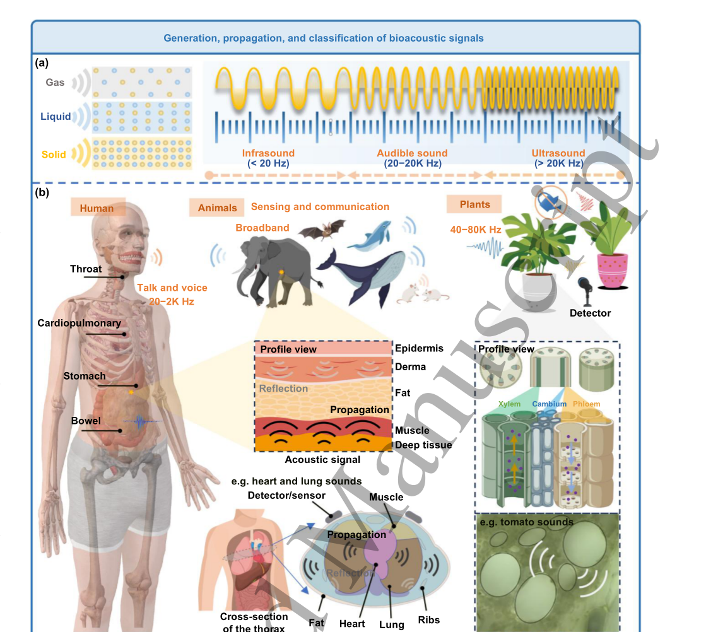

**Original caption:** Figure 1. Overview of the origin, classification, and propagation of bioacoustic signals in biological species. (a) Origin and classification of sound. (b) Sound propagation in biological species. Depicts sound propagation characteristics and acoustic signal acquisition strategies across humans, animals, and plants. For humans, it includes vocal sounds from the throat (ranging from 20 to 2 kHz) and internal acoustic signals generated by organs such as the cardiopulmonary system, stomach, and bowel. For animals, it covers broadband acoustic signals utilized in sensing and communication. For plants (exemplified by tomatoes, etc.), it illustrates acoustic signal propagation within internal structures (e.g., xylem, cambium, phloem) and corresponding detection methods. Additionally, cross-sectional/profiled views (e.g., of the human thorax and plant tissues) visualize how acoustic signals propagate, reflect, and transmit in biological tissues.

**中文图注:** Figure 1 原始图注已提取；逐项含义见下方分图说明。

**Reading note:** 重点查看器件结构、材料层次、信号路径和制备流程。

- (a) 重点查看任务设置、基线、消融和失败案例，判断系统演示是否真正支撑前端价值。 原文：Origin and classification of sound
- (b) 重点查看器件结构、材料层次、信号路径和制备流程。 原文：Sound propagation in biological species. Depicts sound propagation characteristics and acoustic signal acquisition strategies across humans, animals, and plants. For humans, it includes vocal sounds from the throat (ranging from 20 to 2 kHz) and internal acoustic signals generated by organs such as the cardiopulmonary system, stomach, and bowel. For animals, it covers broadband acoustic signals utilized in sensing and communication. For plants (exemplified by tomatoes, etc.), it illustrates acoustic signal propagation within internal structures (e.g., xylem, cambium, phloem) and corresponding detection methods. Additionally, cross-sectional/profiled views (e.g., of the human thorax and plant tissues) visualize how acoustic signals propagate, reflect, and transmit in biological tissues

### Figure 2

**Source:** p.9

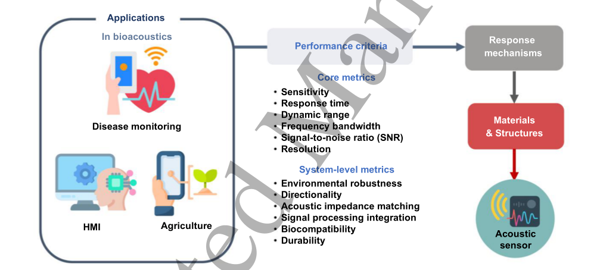

**Original caption:** Figure 2. Performance requirements and selection criteria in various bioacoustic scenarios.

**中文图注:** Figure 2 原始图注已提取；逐项含义见下方分图说明。

**Reading note:** 结合正文首次引用位置和原始图注核对该图的证据角色。

### Figure 3

**Source:** p.13

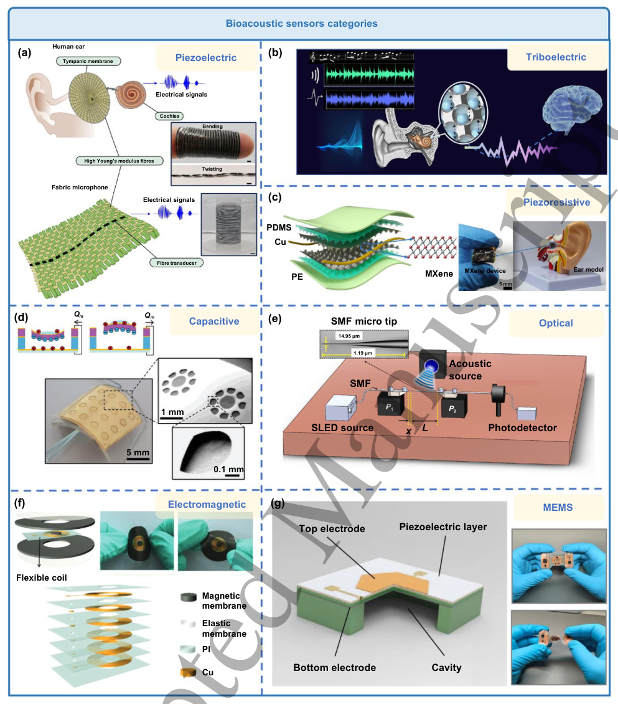

**Original caption:** Figure 3. Overview of bioacoustic sensors based on different sensing mechanisms. (a) Piezoelectric nanofiberbased intelligent hearing system with a spiral trampoline-like structure. Reproduced from[60], with permission from Springer Nature. (b) An acoustic core-shell resonance harvester from nanoscale material optimization. Reproduced with permission from[72]. Copyright © 2022 The Authors, some rights reserved; exclusive licensee American Association for the Advancement of Science. No claim to original U.S. Government Works. Distributed under a Creative Commons Attribution NonCommercial License 4.0 (CC BY-NC). (c) Schematic illustration of the MXene eardrum device with a micropyramid structure. Reproduced with permission from[73]. Copyright © 2022 The Authors, some rights reserved; exclusive licensee American Association for the Advancement of Science. No claim to original U.S. Government Works. Distributed under a Creative Commons Attribution NonCommercial License 4.0 (CC BY-NC). (d) Diagram of a skin-attachable electretpowered capacitive auditory sensor. [74]John Wiley & Sons. © 2022 Wiley-VCH GmbH. (e) Microcantilever acoustic sensor schematic: tapered optical fiber microtip (14.95 μm) and single-mode fiber, with adjustable

**中文图注:** Figure 3 原始图注已提取；逐项含义见下方分图说明。

**Reading note:** 重点查看器件结构、材料层次、信号路径和制备流程。

- (a) 重点查看器件结构、材料层次、信号路径和制备流程。 原文：Piezoelectric nanofiberbased intelligent hearing system with a spiral trampoline-like structure. Reproduced from[60], with permission from Springer Nature
- (b) 结合正文首次引用位置和原始图注核对该图的证据角色。 原文：An acoustic core-shell resonance harvester from nanoscale material optimization. Reproduced with permission from[72]. Copyright © 2022 The Authors, some rights reserved; exclusive licensee American Association for the Advancement of Science. No claim to original U
- (s) 结合正文首次引用位置和原始图注核对该图的证据角色。 原文：Government Works. Distributed under a Creative Commons Attribution NonCommercial License 4.0 (CC BY-NC)
- (c) 重点查看器件结构、材料层次、信号路径和制备流程。 原文：Schematic illustration of the MXene eardrum device with a micropyramid structure. Reproduced with permission from[73]. Copyright © 2022 The Authors, some rights reserved; exclusive licensee American Association for the Advancement of Science. No claim to original U
- (s) 结合正文首次引用位置和原始图注核对该图的证据角色。 原文：Government Works. Distributed under a Creative Commons Attribution NonCommercial License 4.0 (CC BY-NC)
- (d) 结合正文首次引用位置和原始图注核对该图的证据角色。 原文：Diagram of a skin-attachable electretpowered capacitive auditory sensor. [74]John Wiley & Sons. © 2022 Wiley-VCH GmbH
- (e) 重点查看器件结构、材料层次、信号路径和制备流程。 原文：Microcantilever acoustic sensor schematic: tapered optical fiber microtip (14.95 μm) and single-mode fiber, with adjustable

### Figure 4

**Source:** p.18

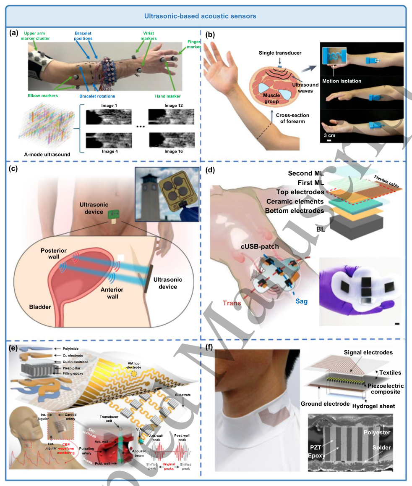

**Original caption:** Figure 4. Ultrasonic-based acoustic sensors. (a) A-mode 32-channel dry-coupling ultrasound bracelet for wrist and hand tracking. Reproduced from[105]. CC BY 4.0. (b) Flexible A-mode ultrasound sensor for wearable echomyography. Reproduced from[106], with permission from Springer Nature. (c) Flexible ultrasound sensor array for bladder volume monitoring. Reproduced with permission from[107]. CC BY-NC-ND 4.0. (d) Flexible ultrasound patch for bladder volume monitoring. Reproduced from[1], with permission from Springer Nature. (e) Flexible ultrasound sensor array for central blood pressure waveform monitoring. Reproduced from[108], with permission from Springer Nature. (f) Fabric-based ultrasound sensor array for vascular monitoring. Reproduced with permission from[109]. CC BY-NC-ND 4.0.

**中文图注:** Figure 4 原始图注已提取；逐项含义见下方分图说明。

**Reading note:** 重点查看阵列规模、空间分辨率、串扰、读出通道和空间特征表达。

- (a) 结合正文首次引用位置和原始图注核对该图的证据角色。 原文：A-mode 32-channel dry-coupling ultrasound bracelet for wrist and hand tracking. Reproduced from[105]. CC BY 4.0
- (b) 结合正文首次引用位置和原始图注核对该图的证据角色。 原文：Flexible A-mode ultrasound sensor for wearable echomyography. Reproduced from[106], with permission from Springer Nature
- (c) 重点查看阵列规模、空间分辨率、串扰、读出通道和空间特征表达。 原文：Flexible ultrasound sensor array for bladder volume monitoring. Reproduced with permission from[107]. CC BY-NC-ND 4.0
- (d) 结合正文首次引用位置和原始图注核对该图的证据角色。 原文：Flexible ultrasound patch for bladder volume monitoring. Reproduced from[1], with permission from Springer Nature
- (e) 重点查看阵列规模、空间分辨率、串扰、读出通道和空间特征表达。 原文：Flexible ultrasound sensor array for central blood pressure waveform monitoring. Reproduced from[108], with permission from Springer Nature
- (f) 重点查看阵列规模、空间分辨率、串扰、读出通道和空间特征表达。 原文：Fabric-based ultrasound sensor array for vascular monitoring. Reproduced with permission from[109]. CC BY-NC-ND 4.0

### Figure 5

**Source:** p.25

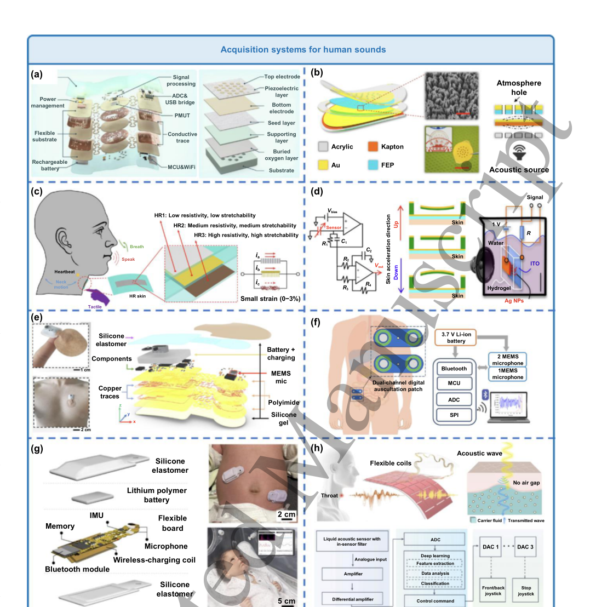

**Original caption:** Figure 5. Acquisition systems for human sounds. (a) A wearable, skin-conformal acoustic system based on piezoelectric ultrasonic transducers. Reproduced from[77], CC BY 4.0. (b) A triboelectric auditory system for human social robotics and hearing aids. From[69]. Reprinted with permission from AAAS. (c) A hierarchical resistive epidermal sensing system for human physiological and bodily activities. Reproduced from[116], with permission from Springer Nature. (d) Capacitive acoustic acquisition system for vibration sensing and speech detection. Reproduced from[118], CC BY 4.0. Reproduced from[117], CC BY 4.0. (e) A soft, wearable stethoscope for health monitoring and clinical assessment. Reproduced with permission from[111]. Copyright © 2022 The Authors, some rights reserved; exclusive licensee American Association for the Advancement of Science. No claim to original U.S. Government Works. Distributed under a Creative Commons Attribution NonCommercial License 4.0 (CC BY-NC). (f) A wireless acoustic patch for auscultation and evaluation of bowel sounds. (g) An epidermal acoustic interface system for monitoring human physiological sounds.

**中文图注:** Figure 5 原始图注已提取；逐项含义见下方分图说明。

**Reading note:** 重点查看任务设置、基线、消融和失败案例，判断系统演示是否真正支撑前端价值。

- (a) 结合正文首次引用位置和原始图注核对该图的证据角色。 原文：A wearable, skin-conformal acoustic system based on piezoelectric ultrasonic transducers. Reproduced from[77], CC BY 4.0
- (b) 重点查看任务设置、基线、消融和失败案例，判断系统演示是否真正支撑前端价值。 原文：A triboelectric auditory system for human social robotics and hearing aids. From[69]. Reprinted with permission from AAAS
- (c) 结合正文首次引用位置和原始图注核对该图的证据角色。 原文：A hierarchical resistive epidermal sensing system for human physiological and bodily activities. Reproduced from[116], with permission from Springer Nature
- (d) 结合正文首次引用位置和原始图注核对该图的证据角色。 原文：Capacitive acoustic acquisition system for vibration sensing and speech detection. Reproduced from[118], CC BY 4.0. Reproduced from[117], CC BY 4.0
- (e) 结合正文首次引用位置和原始图注核对该图的证据角色。 原文：A soft, wearable stethoscope for health monitoring and clinical assessment. Reproduced with permission from[111]. Copyright © 2022 The Authors, some rights reserved; exclusive licensee American Association for the Advancement of Science. No claim to original U
- (s) 结合正文首次引用位置和原始图注核对该图的证据角色。 原文：Government Works. Distributed under a Creative Commons Attribution NonCommercial License 4.0 (CC BY-NC)
- (f) 结合正文首次引用位置和原始图注核对该图的证据角色。 原文：A wireless acoustic patch for auscultation and evaluation of bowel sounds
- (g) 结合正文首次引用位置和原始图注核对该图的证据角色。 原文：An epidermal acoustic interface system for monitoring human physiological sounds

### Figure 6

**Source:** p.28

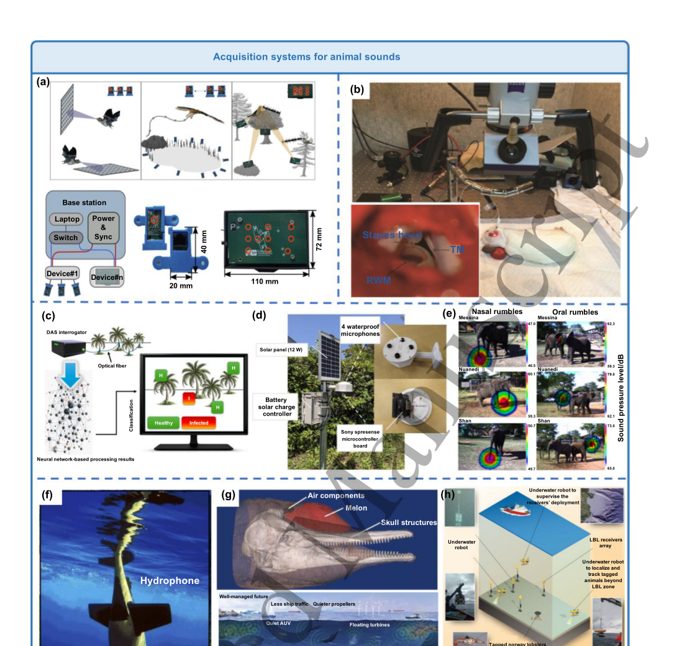

**Original caption:** Figure 6. Acquisition systems for animal sounds. (a) A heterogeneous, scalable, dense microphone array to localize and track vocalizing animals in their natural habitats. Reproduced from[121], CC BY 4.0. (b) Measurement of the impact of endolymphatic hydrops on sound transmission in live guinea pigs using a laser Doppler vibrometer. Reproduced from[123], CC BY 4.0. (c) Recording sounds emitted by cockroaches via a distributed acoustic sensor. Reprinted from[124], CC BY 4.0. (d) An affordable, low-cost microphone array (ChirpArray) for long-term ecoacoustic monitoring. Reproduced with permission from[126], CC BY-NC 4.0. (e) Recording African elephant sounds with acoustic cameras. Reproduced from[127], CC BY 4.0. (f) Nearreal-time acoustic monitoring of deep-sea species with Seaglider™. Reproduced from[128], CC BY 4.0. (g) Computed tomography scanning with ultrasonic measurements to reconstruct the sound velocity distribution in Indo-Pacific humpback dolphins (upper image). Reprinted from[129], with the permission of AIP Publishing. Anthropogenic impacts on the marine soundscape (below image). From[3]. Reprinted with permission from AAAS. (h) An acoustic-based mobile robotic platform for deep ocean benthic fishery track. From[132]. Reprinted with permission from AAAS.

**中文图注:** Figure 6 原始图注已提取；逐项含义见下方分图说明。

**Reading note:** 重点查看阵列规模、空间分辨率、串扰、读出通道和空间特征表达。

- (a) 重点查看阵列规模、空间分辨率、串扰、读出通道和空间特征表达。 原文：A heterogeneous, scalable, dense microphone array to localize and track vocalizing animals in their natural habitats. Reproduced from[121], CC BY 4.0
- (b) 结合正文首次引用位置和原始图注核对该图的证据角色。 原文：Measurement of the impact of endolymphatic hydrops on sound transmission in live guinea pigs using a laser Doppler vibrometer. Reproduced from[123], CC BY 4.0
- (c) 结合正文首次引用位置和原始图注核对该图的证据角色。 原文：Recording sounds emitted by cockroaches via a distributed acoustic sensor. Reprinted from[124], CC BY 4.0
- (d) 重点查看阵列规模、空间分辨率、串扰、读出通道和空间特征表达。 原文：An affordable, low-cost microphone array (ChirpArray) for long-term ecoacoustic monitoring. Reproduced with permission from[126], CC BY-NC 4.0
- (e) 结合正文首次引用位置和原始图注核对该图的证据角色。 原文：Recording African elephant sounds with acoustic cameras. Reproduced from[127], CC BY 4.0
- (f) 结合正文首次引用位置和原始图注核对该图的证据角色。 原文：Nearreal-time acoustic monitoring of deep-sea species with Seaglider™. Reproduced from[128], CC BY 4.0
- (g) 重点查看阵列规模、空间分辨率、串扰、读出通道和空间特征表达。 原文：Computed tomography scanning with ultrasonic measurements to reconstruct the sound velocity distribution in Indo-Pacific humpback dolphins (upper image). Reprinted from[129], with the permission of AIP Publishing. Anthropogenic impacts on the marine soundscape (below image). From[3]. Reprinted with permission from AAAS
- (h) 重点查看任务设置、基线、消融和失败案例，判断系统演示是否真正支撑前端价值。 原文：An acoustic-based mobile robotic platform for deep ocean benthic fishery track. From[132]. Reprinted with permission from AAAS

### Figure 7

**Source:** p.30

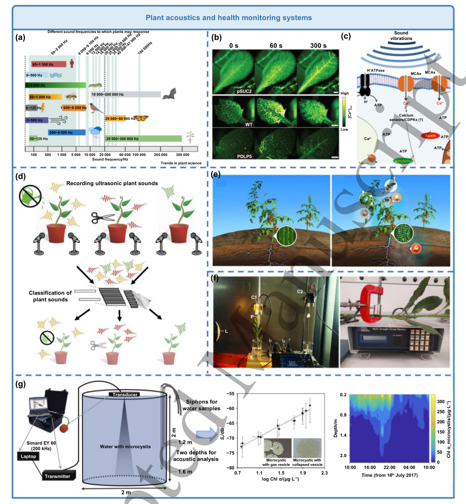

**Original caption:** Figure 7. Plant acoustics and health monitoring systems. (a) Overview of plant sensing of sound frequencies. Reproduced with permission from[133]. CC BY-NC-ND 4.0. (b) Glutamate initiates calcium dependent, longrange signaling for plant defense. From[134]. Reprinted with permission from AAAS. (c) Mechanisms of acoustic signaling in plants. (d) Plants emit acoustic signals under stress and (e) may be detected by other organisms. Reprinted from[135], Copyright (2016), with permission from Oxford University Press. Reproduced from[136], CC BY 4.0. Reprinted from[40], Copyright (2023), with permission from Elsevier. (f) The original setup for measuring plant acoustic emissions. Reproduced from[139], CC BY 4.0. (g) Monitoring of the cyanobacterium Microcystis by a high-frequency echosounder. Reprinted from[140], Copyright (2020), with permission from Elsevier.

**中文图注:** Figure 7 原始图注已提取；逐项含义见下方分图说明。

**Reading note:** 重点查看机制模型与实验结果是否一致，以及关键结构参数的对照关系。

- (a) 结合正文首次引用位置和原始图注核对该图的证据角色。 原文：Overview of plant sensing of sound frequencies. Reproduced with permission from[133]. CC BY-NC-ND 4.0
- (b) 结合正文首次引用位置和原始图注核对该图的证据角色。 原文：Glutamate initiates calcium dependent, longrange signaling for plant defense. From[134]. Reprinted with permission from AAAS
- (c) 重点查看机制模型与实验结果是否一致，以及关键结构参数的对照关系。 原文：Mechanisms of acoustic signaling in plants
- (d) 结合正文首次引用位置和原始图注核对该图的证据角色。 原文：Plants emit acoustic signals under stress and
- (e) 结合正文首次引用位置和原始图注核对该图的证据角色。 原文：may be detected by other organisms. Reprinted from[135], Copyright (2016), with permission from Oxford University Press. Reproduced from[136], CC BY 4.0. Reprinted from[40], Copyright (2023), with permission from Elsevier
- (f) 结合正文首次引用位置和原始图注核对该图的证据角色。 原文：The original setup for measuring plant acoustic emissions. Reproduced from[139], CC BY 4.0
- (g) 结合正文首次引用位置和原始图注核对该图的证据角色。 原文：Monitoring of the cyanobacterium Microcystis by a high-frequency echosounder. Reprinted from[140], Copyright (2020), with permission from Elsevier

### Figure 8

**Source:** p.35

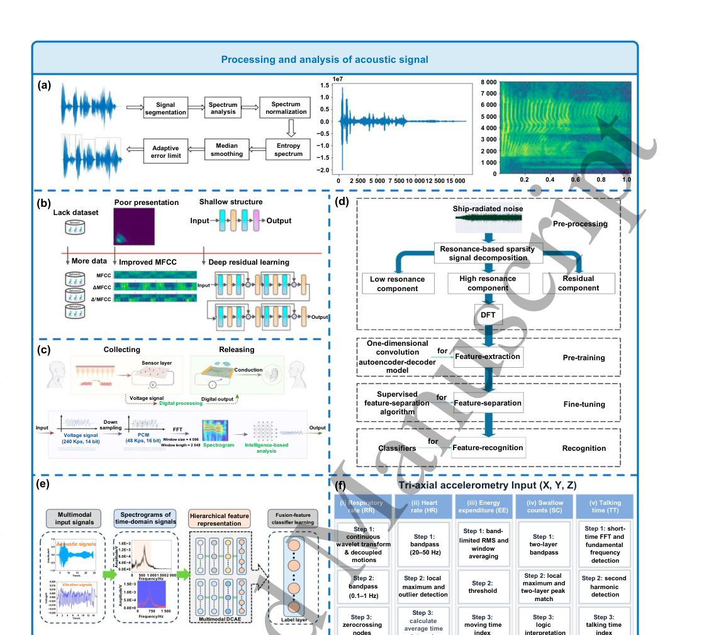

**Original caption:** Figure 8. Processing and analysis of acoustic signal. (a) An ML-based rapid extraction method for MFCC speech feature parameters. Reproduced from[143], CC BY 4.0. (b) Heart sound classification using enhanced MFCC and deep ResNet. Reproduced from[144], CC BY 4.0. (c) Wearable artificial throats for mixed-modal speech recognition and interaction. Reproduced from[145], with permission from Springer Nature. (d) Underwater acoustic target recognition using a supervised feature discrimination approach. Reproduced from[146], CC BY 4.0. (e) Deeply integrated autoencoder for fault detection via multimodal sensor information. (f) Multimodal signal (breathing, heartbeat, swallowing, etc.) analysis based on frequency domain analysis and the ML model.

**中文图注:** Figure 8 原始图注已提取；逐项含义见下方分图说明。

**Reading note:** 重点查看任务设置、基线、消融和失败案例，判断系统演示是否真正支撑前端价值。

- (a) 结合正文首次引用位置和原始图注核对该图的证据角色。 原文：An ML-based rapid extraction method for MFCC speech feature parameters. Reproduced from[143], CC BY 4.0
- (b) 重点查看任务设置、基线、消融和失败案例，判断系统演示是否真正支撑前端价值。 原文：Heart sound classification using enhanced MFCC and deep ResNet. Reproduced from[144], CC BY 4.0
- (c) 重点查看任务设置、基线、消融和失败案例，判断系统演示是否真正支撑前端价值。 原文：Wearable artificial throats for mixed-modal speech recognition and interaction. Reproduced from[145], with permission from Springer Nature
- (d) 重点查看任务设置、基线、消融和失败案例，判断系统演示是否真正支撑前端价值。 原文：Underwater acoustic target recognition using a supervised feature discrimination approach. Reproduced from[146], CC BY 4.0
- (e) 结合正文首次引用位置和原始图注核对该图的证据角色。 原文：Deeply integrated autoencoder for fault detection via multimodal sensor information
- (f) 重点查看机制模型与实验结果是否一致，以及关键结构参数的对照关系。 原文：Multimodal signal (breathing, heartbeat, swallowing, etc.) analysis based on frequency domain analysis and the ML model

### Figure 9

**Source:** p.38

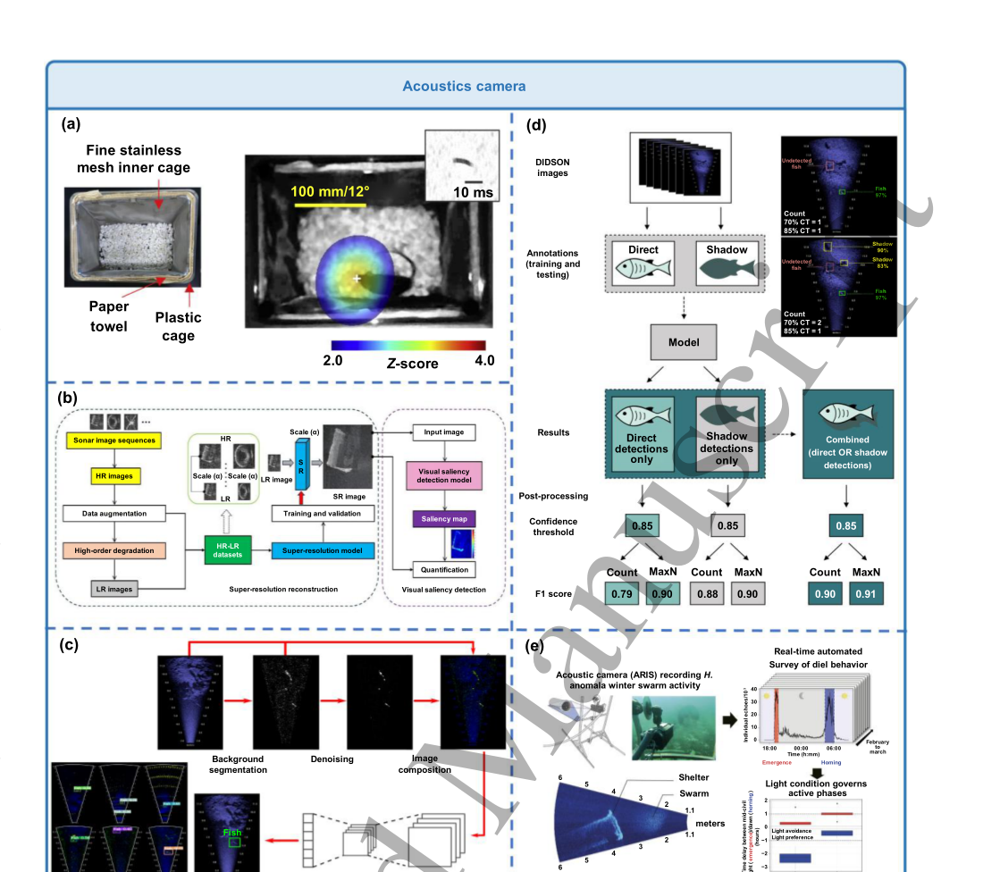

**Original caption:** Figure 9. Applications of acoustic cameras in underwater target monitoring and detection. (a) USVCAM monitoring custom inner cage. Reproduced from[156], CC BY 4.0. (b) The framework of sonar image SR reconstruction for marine debris detection. Reproduced from[157], CC BY 4.0. (c) Detection with the CNN model. Reproduced from [158], with permission from Springer Nature. (d) Deep learning models trained on acoustic imagery to detect fish and fish shadows. Reproduced from [159], CC BY 4.0. (e) Recording an anomala winter swarm with an acoustic camera. Reprinted from[160], Copyright (2024), with permission from Elsevier.

**中文图注:** Figure 9 原始图注已提取；逐项含义见下方分图说明。

**Reading note:** 重点查看阵列规模、空间分辨率、串扰、读出通道和空间特征表达。

- (a) 结合正文首次引用位置和原始图注核对该图的证据角色。 原文：USVCAM monitoring custom inner cage. Reproduced from[156], CC BY 4.0
- (b) 重点查看阵列规模、空间分辨率、串扰、读出通道和空间特征表达。 原文：The framework of sonar image SR reconstruction for marine debris detection. Reproduced from[157], CC BY 4.0
- (c) 重点查看机制模型与实验结果是否一致，以及关键结构参数的对照关系。 原文：Detection with the CNN model. Reproduced from [158], with permission from Springer Nature
- (d) 重点查看阵列规模、空间分辨率、串扰、读出通道和空间特征表达。 原文：Deep learning models trained on acoustic imagery to detect fish and fish shadows. Reproduced from [159], CC BY 4.0
- (e) 结合正文首次引用位置和原始图注核对该图的证据角色。 原文：Recording an anomala winter swarm with an acoustic camera. Reprinted from[160], Copyright (2024), with permission from Elsevier

### Figure 10

**Source:** p.40

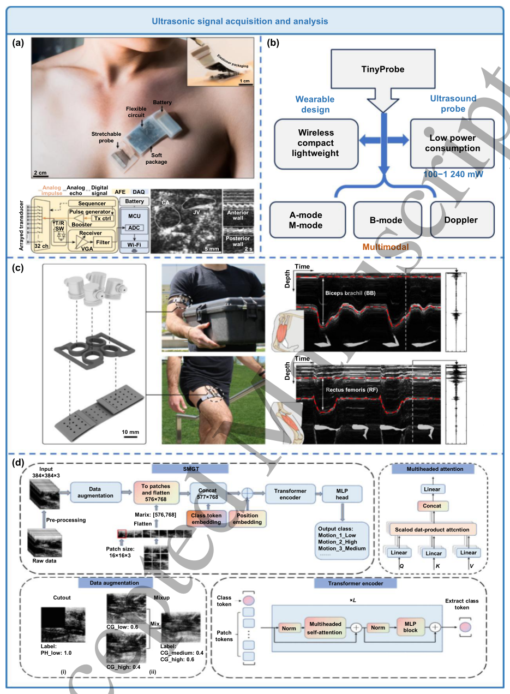

**Original caption:** Figure 10. Ultrasonic signal acquisition and analysis. (a) A fully integrated ultrasound system monitoring deep tissues. Reproduced from[163], with permission from Springer Nature. (b) A compact, lightweight, and low-power wearable multimode ultrasound system (TinyProbe). (c) Estimation of joint torque with the Amode ultrasound system. Reproduced from[166], CC BY 4.0. (d) Transformer-based ultrasound signal processing method. Reproduced from[167], CC BY 4.0.

**中文图注:** Figure 10 原始图注已提取；逐项含义见下方分图说明。

**Reading note:** 结合正文首次引用位置和原始图注核对该图的证据角色。

- (a) 结合正文首次引用位置和原始图注核对该图的证据角色。 原文：A fully integrated ultrasound system monitoring deep tissues. Reproduced from[163], with permission from Springer Nature
- (b) 结合正文首次引用位置和原始图注核对该图的证据角色。 原文：A compact, lightweight, and low-power wearable multimode ultrasound system (TinyProbe)
- (c) 结合正文首次引用位置和原始图注核对该图的证据角色。 原文：Estimation of joint torque with the Amode ultrasound system. Reproduced from[166], CC BY 4.0
- (d) 结合正文首次引用位置和原始图注核对该图的证据角色。 原文：Transformer-based ultrasound signal processing method. Reproduced from[167], CC BY 4.0

### Figure 11

**Source:** p.45

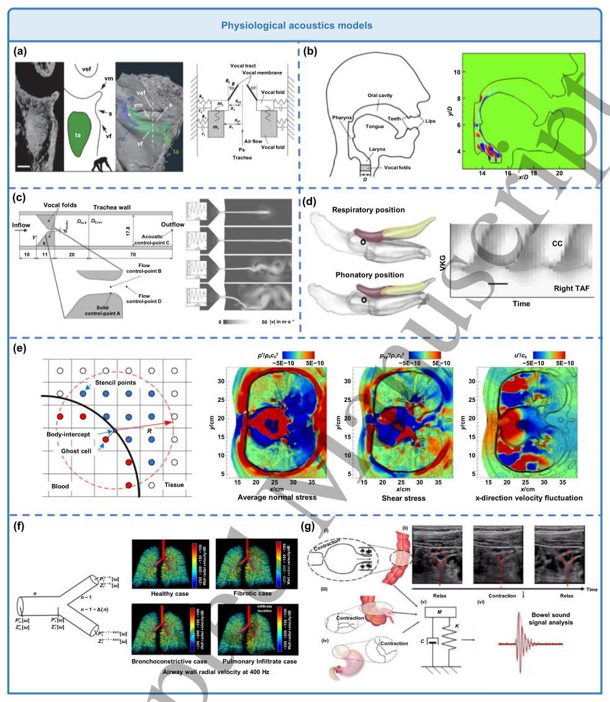

**Original caption:** Figure 11. Physiological acoustics models. (a) 3D vocal tract reconstruction from MRI of chimpanzee (left) and schematic illustration of the nonhuman model with a vocal membrane (right). From[178]. Reprinted with permission from AAAS. (b) Sagittal vocal tract morphology of humans and instantaneous vorticity field of pulsatile jet flow. Reprinted from[180], Copyright (2011), with permission from Elsevier. (c) Fluid-structure interaction model of laryngeal dynamics (left) and development of the Coanda effect within three cycles (right). Reprinted from[181], Copyright (2009), with permission from Elsevier. (d) Airflow-induced self-sustained mucosal oscillation in the baleen whale larynx. Reproduced from[182], with permission from Springer Nature. (e) Direct simulation of flow-induced sound generation and propagation based on the immersed boundary method. Reprinted from[189], Copyright (2017), with permission from Elsevier. (f) Multiscale analytical model

**中文图注:** Figure 11 原始图注已提取；逐项含义见下方分图说明。

**Reading note:** 重点查看器件结构、材料层次、信号路径和制备流程。

- (a) 重点查看器件结构、材料层次、信号路径和制备流程。 原文：3D vocal tract reconstruction from MRI of chimpanzee (left) and schematic illustration of the nonhuman model with a vocal membrane (right). From[178]. Reprinted with permission from AAAS
- (b) 结合正文首次引用位置和原始图注核对该图的证据角色。 原文：Sagittal vocal tract morphology of humans and instantaneous vorticity field of pulsatile jet flow. Reprinted from[180], Copyright (2011), with permission from Elsevier
- (c) 重点查看器件结构、材料层次、信号路径和制备流程。 原文：Fluid-structure interaction model of laryngeal dynamics (left) and development of the Coanda effect within three cycles (right). Reprinted from[181], Copyright (2009), with permission from Elsevier
- (d) 结合正文首次引用位置和原始图注核对该图的证据角色。 原文：Airflow-induced self-sustained mucosal oscillation in the baleen whale larynx. Reproduced from[182], with permission from Springer Nature
- (e) 重点查看机制模型与实验结果是否一致，以及关键结构参数的对照关系。 原文：Direct simulation of flow-induced sound generation and propagation based on the immersed boundary method. Reprinted from[189], Copyright (2017), with permission from Elsevier
- (f) 重点查看机制模型与实验结果是否一致，以及关键结构参数的对照关系。 原文：Multiscale analytical model

### Figure 12

**Source:** p.48

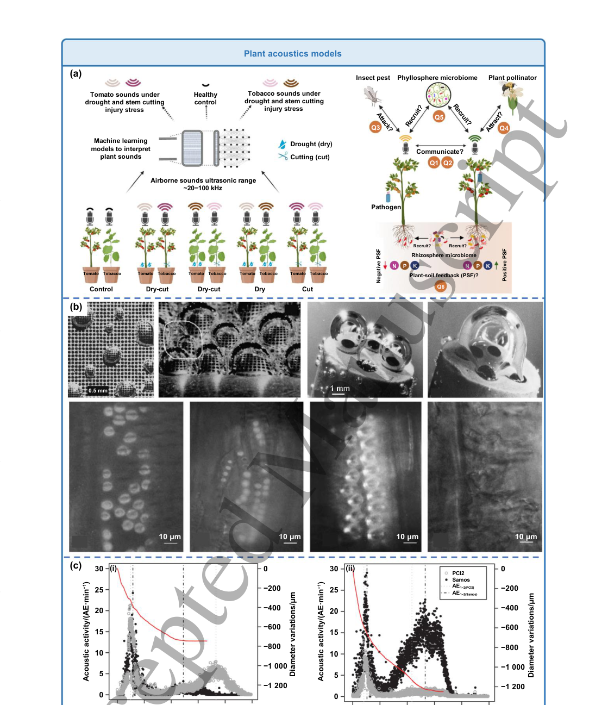

**Original caption:** Figure 12. Plant acoustics models. (a) Stress-induced ultrasounds enable remote detection. Reprinted from[211], Copyright (2023), with permission from Elsevier. (b) Water immersion micrographs: gas accumulations on xylem vessel walls during different expansion stages of Ulmus glabra. Reprinted from[213], Copyright (2006), with permission from Elsevier. (c) Acoustic signals and branch diameter variations (red lines) in two uprooted lavender plants during dehydration stress. The PCI2 (gray points) and Samos (black points) systems are used

**中文图注:** Figure 12 原始图注已提取；逐项含义见下方分图说明。

**Reading note:** 重点查看机制模型与实验结果是否一致，以及关键结构参数的对照关系。

- (a) 结合正文首次引用位置和原始图注核对该图的证据角色。 原文：Stress-induced ultrasounds enable remote detection. Reprinted from[211], Copyright (2023), with permission from Elsevier
- (b) 结合正文首次引用位置和原始图注核对该图的证据角色。 原文：Water immersion micrographs: gas accumulations on xylem vessel walls during different expansion stages of Ulmus glabra. Reprinted from[213], Copyright (2006), with permission from Elsevier
- (c) 结合正文首次引用位置和原始图注核对该图的证据角色。 原文：Acoustic signals and branch diameter variations (red lines) in two uprooted lavender plants during dehydration stress. The PCI2 (gray points) and Samos (black points) systems are used

### Figure 13

**Source:** p.51

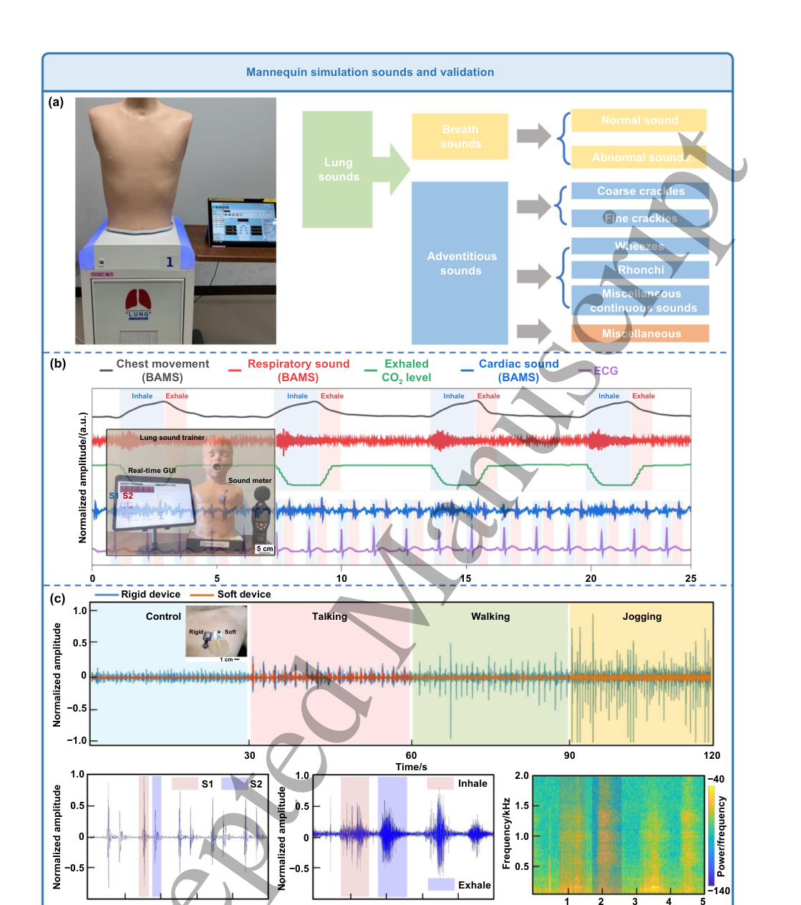

**Original caption:** Figure 13. Mannequin simulation sounds and validation. (a) Lung sound auscultation trainer “LUNG” ver.2, a mannequin simulator for lung sound auscultation. Reproduced with permission from [221]. Copyright © 2011, Mary Ann Liebert, A Division of Sage Publications. (b) Wireless acoustic monitoring systems for neonatal respiration and chronic pulmonary disease patients. Right images indicate the monitoring of respiratory sound intensity in ten neonates in the neonatal intensive care unit (NICU) and comparative respiratory rate monitoring between healthy subjects and chronic pulmonary disease patients. Reproduced from[48], with

**中文图注:** Figure 13 原始图注已提取；逐项含义见下方分图说明。

**Reading note:** 重点查看阵列规模、空间分辨率、串扰、读出通道和空间特征表达。

- (a) 结合正文首次引用位置和原始图注核对该图的证据角色。 原文：Lung sound auscultation trainer “LUNG” ver.2, a mannequin simulator for lung sound auscultation. Reproduced with permission from [221]. Copyright © 2011, Mary Ann Liebert, A Division of Sage Publications
- (b) 重点查看阵列规模、空间分辨率、串扰、读出通道和空间特征表达。 原文：Wireless acoustic monitoring systems for neonatal respiration and chronic pulmonary disease patients. Right images indicate the monitoring of respiratory sound intensity in ten neonates in the neonatal intensive care unit (NICU) and comparative respiratory rate monitoring between healthy subjects and chronic pulmonary disease patients. Reproduced from[48], with

### Figure 14

**Source:** p.59

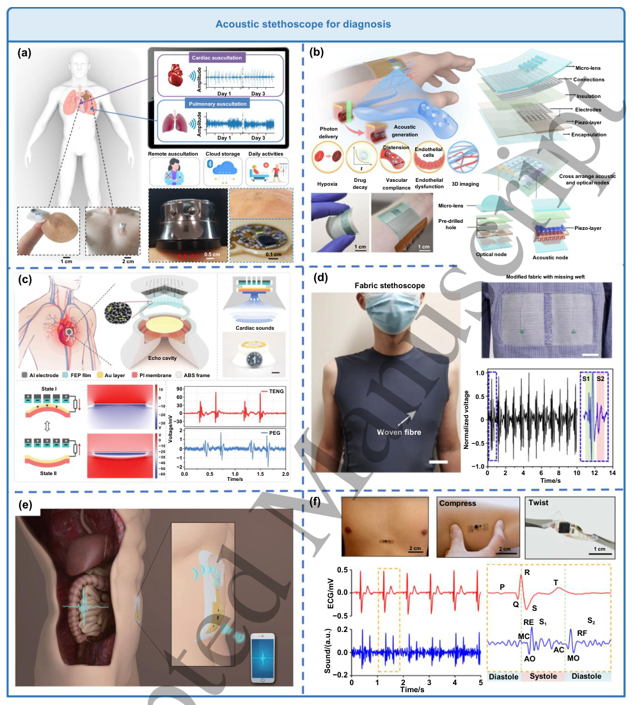

**Original caption:** Figure 14. Acoustic stethoscope for diagnosis. (a) A soft portable stethoscope for automated disease diagnosis. Reproduced with permission from[111]. Copyright © 2022 The Authors, some rights reserved; exclusive licensee American Association for the Advancement of Science. No claim to original U.S. Government Works. Distributed under a Creative Commons Attribution NonCommercial License 4.0 (CC BY-NC). (b) A flexible optoacoustic blood stethoscope for cardiovascular monitoring. Reproduced from[250], CC BY 4.0. (c) Triboelectric-based stethoscope for physiological signal monitoring. [110]John Wiley & Sons. © 2024 WileyVCH GmbH. (d) Acoustic fabrics for source localization and cardiac sound detection. Reproduced from[60], with permission from Springer Nature. (e) A flexible acoustic device for bowel sound monitoring. Reproduced from[251], with permission from Springer Nature. (f) A mechano-acoustic device for cardiovascular diagnostics. Reproduced with permission from[205]. CC BY-NC 4.0.

**中文图注:** Figure 14 原始图注已提取；逐项含义见下方分图说明。

**Reading note:** 结合正文首次引用位置和原始图注核对该图的证据角色。

- (a) 结合正文首次引用位置和原始图注核对该图的证据角色。 原文：A soft portable stethoscope for automated disease diagnosis. Reproduced with permission from[111]. Copyright © 2022 The Authors, some rights reserved; exclusive licensee American Association for the Advancement of Science. No claim to original U
- (s) 结合正文首次引用位置和原始图注核对该图的证据角色。 原文：Government Works. Distributed under a Creative Commons Attribution NonCommercial License 4.0 (CC BY-NC)
- (b) 结合正文首次引用位置和原始图注核对该图的证据角色。 原文：A flexible optoacoustic blood stethoscope for cardiovascular monitoring. Reproduced from[250], CC BY 4.0
- (c) 结合正文首次引用位置和原始图注核对该图的证据角色。 原文：Triboelectric-based stethoscope for physiological signal monitoring. [110]John Wiley & Sons. © 2024 WileyVCH GmbH
- (d) 结合正文首次引用位置和原始图注核对该图的证据角色。 原文：Acoustic fabrics for source localization and cardiac sound detection. Reproduced from[60], with permission from Springer Nature
- (e) 结合正文首次引用位置和原始图注核对该图的证据角色。 原文：A flexible acoustic device for bowel sound monitoring. Reproduced from[251], with permission from Springer Nature
- (f) 结合正文首次引用位置和原始图注核对该图的证据角色。 原文：A mechano-acoustic device for cardiovascular diagnostics. Reproduced with permission from[205]. CC BY-NC 4.0

### Figure 15

**Source:** p.61

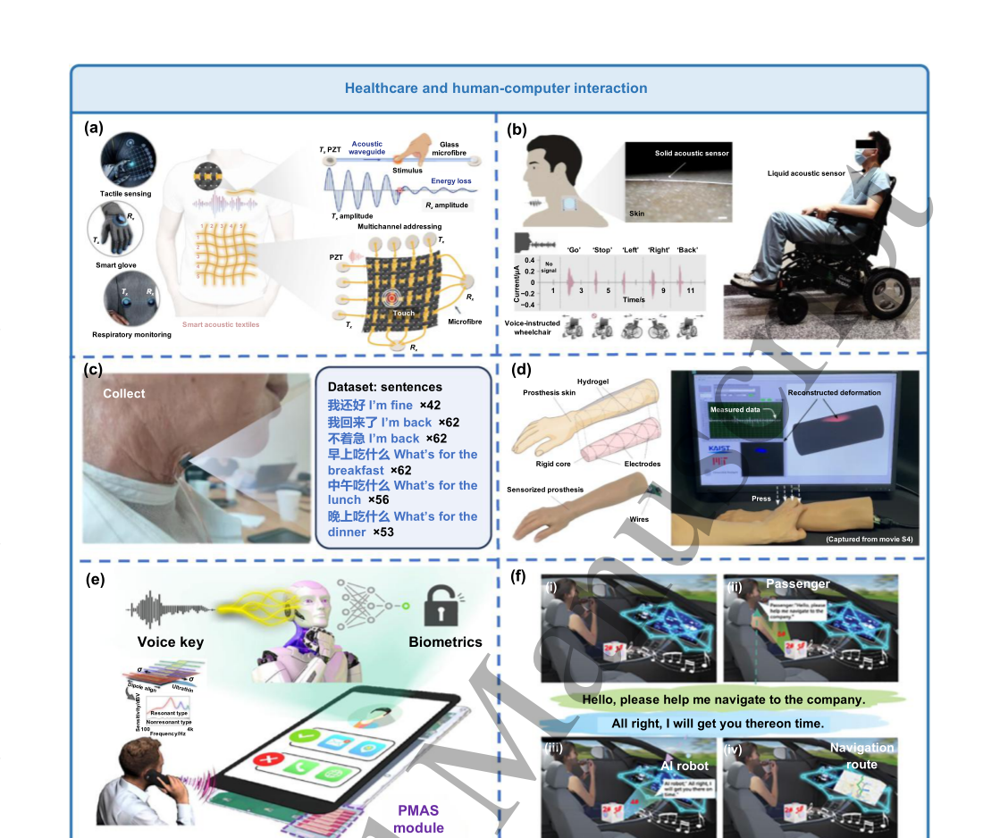

**Original caption:** Figure 15. Acoustic sensor for healthcare and human-computer interaction. (a) A smart acoustic textile for human‒machine interactions. Reproduced from[252], CC BY 4.0. (b) A liquid-based acoustic sensor for human– machine communication. Reproduced from[112], with permission from Springer Nature. (c) A wearable artificial throat for speech recognition and interaction. Reproduced from[145], with permission from Springer Nature. (d) Biomimetic robot skin for human-robot interaction haptic perception. From[253]. Reprinted with permission from AAAS. (e) Biomimetic and flexible piezoelectric acoustic sensors for biometrics and interaction. Reproduced with permission from[254]. Copyright © 2021 The Authors, some rights reserved; exclusive licensee American Association for the Advancement of Science. No claim to original U.S. Government Works. Distributed under a Creative Commons Attribution NonCommercial License 4.0 (CC BYNC). (f) An omnidirectional acoustic sensor for human‒machine interaction. [255]John Wiley & Sons. © 2024 Wiley-VCH GmbH.

**中文图注:** Figure 15 原始图注已提取；逐项含义见下方分图说明。

**Reading note:** 重点查看任务设置、基线、消融和失败案例，判断系统演示是否真正支撑前端价值。

- (a) 结合正文首次引用位置和原始图注核对该图的证据角色。 原文：A smart acoustic textile for human‒machine interactions. Reproduced from[252], CC BY 4.0
- (b) 结合正文首次引用位置和原始图注核对该图的证据角色。 原文：A liquid-based acoustic sensor for human– machine communication. Reproduced from[112], with permission from Springer Nature
- (c) 重点查看任务设置、基线、消融和失败案例，判断系统演示是否真正支撑前端价值。 原文：A wearable artificial throat for speech recognition and interaction. Reproduced from[145], with permission from Springer Nature
- (d) 重点查看任务设置、基线、消融和失败案例，判断系统演示是否真正支撑前端价值。 原文：Biomimetic robot skin for human-robot interaction haptic perception. From[253]. Reprinted with permission from AAAS
- (e) 结合正文首次引用位置和原始图注核对该图的证据角色。 原文：Biomimetic and flexible piezoelectric acoustic sensors for biometrics and interaction. Reproduced with permission from[254]. Copyright © 2021 The Authors, some rights reserved; exclusive licensee American Association for the Advancement of Science. No claim to original U
- (s) 结合正文首次引用位置和原始图注核对该图的证据角色。 原文：Government Works. Distributed under a Creative Commons Attribution NonCommercial License 4.0 (CC BYNC)
- (f) 结合正文首次引用位置和原始图注核对该图的证据角色。 原文：An omnidirectional acoustic sensor for human‒machine interaction. [255]John Wiley & Sons. © 2024 Wiley-VCH GmbH

### Figure 16

**Source:** p.64

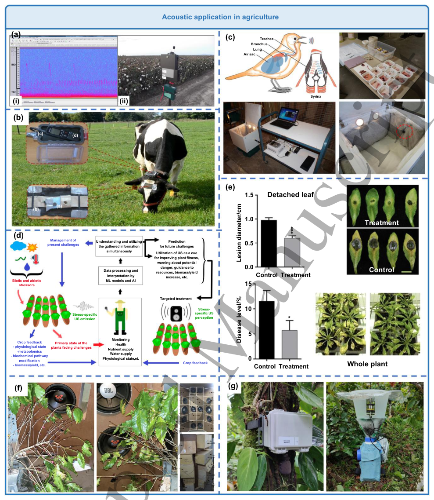

**Original caption:** Figure 16. Acoustic application in agriculture. (a) Acoustic monitoring in agricultural industries. Reprinted from[257], Copyright (2019), with permission from Elsevier. (b) Acoustic signal recording system based on microphones for the identification of grazing cattle activities. Reproduced from[258], CC BY 4.0. (c) Acoustic recording system for poultry health monitoring. Reprinted from[259], Copyright (2021), with permission from Elsevier. (d) Plant ultrasound in horticulture and agriculture. Reproduced from[262], CC BY 4.0. (e) Positive regulation of plant antimicrobial activity by sound vibration treatment. Reproduced from[263], CC BY 4.0. (f) Acoustic technology for coffee harvesting and handling. Reprinted from[264], Copyright (2022), with permission from Elsevier. (g) Acoustic monitoring combined with DL facilitates the assessment of biodiversity restoration in tropical forests. Reproduced from[265], CC BY 4.0.

**中文图注:** Figure 16 原始图注已提取；逐项含义见下方分图说明。

**Reading note:** 重点查看任务设置、基线、消融和失败案例，判断系统演示是否真正支撑前端价值。

- (a) 结合正文首次引用位置和原始图注核对该图的证据角色。 原文：Acoustic monitoring in agricultural industries. Reprinted from[257], Copyright (2019), with permission from Elsevier
- (b) 结合正文首次引用位置和原始图注核对该图的证据角色。 原文：Acoustic signal recording system based on microphones for the identification of grazing cattle activities. Reproduced from[258], CC BY 4.0
- (c) 结合正文首次引用位置和原始图注核对该图的证据角色。 原文：Acoustic recording system for poultry health monitoring. Reprinted from[259], Copyright (2021), with permission from Elsevier
- (d) 结合正文首次引用位置和原始图注核对该图的证据角色。 原文：Plant ultrasound in horticulture and agriculture. Reproduced from[262], CC BY 4.0
- (e) 结合正文首次引用位置和原始图注核对该图的证据角色。 原文：Positive regulation of plant antimicrobial activity by sound vibration treatment. Reproduced from[263], CC BY 4.0
- (f) 结合正文首次引用位置和原始图注核对该图的证据角色。 原文：Acoustic technology for coffee harvesting and handling. Reprinted from[264], Copyright (2022), with permission from Elsevier
- (g) 结合正文首次引用位置和原始图注核对该图的证据角色。 原文：Acoustic monitoring combined with DL facilitates the assessment of biodiversity restoration in tropical forests. Reproduced from[265], CC BY 4.0
