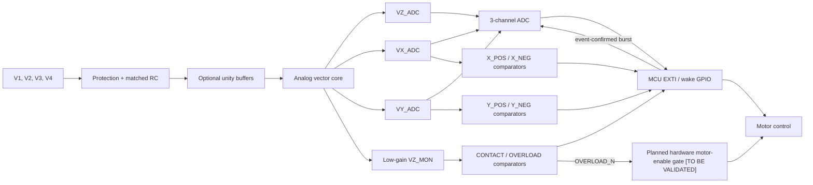

# System architecture

## 1. Proposed A4 pre-ADC event path

The overload comparator monitors `VZ_MON`, not the potentially saturated precision
ADC gain stage. The event outputs are active-low open-drain pins pulled up to the
verified MCU GPIO rail. The A4 digitization-gating claim is valid only if the selected
embedded ADC/reference demonstrably stops or enters standby before the GPIO event.

## 2. Four architectures that must be compared

```mermaid
flowchart TB
  subgraph A1["1. Raw-4 continuous"]
    R1["V1-V4"] --> Q1["4 ADC conversions / sample"] --> M1["MCU computes z, x, y"]
  end
  subgraph A2["2. Vector-3 continuous"]
    R2["Analog z, x, y"] --> Q2["3 ADC conversions / sample"] --> M2["MCU classification"]
  end
  subgraph A3["3. ADC-first event"]
    R3["Analog z, x, y"] --> Q3["Continuous ADC or strongest DMA / analog watchdog / low-power monitor"]
    Q3 --> M3["Post-ADC event; MCU main wake"]
  end
  subgraph A4["4. Pre-ADC vector event"]
    R4["Analog z, x, y"] --> Q4["Always-on comparators"] --> M4["GPIO wake"]
    M4 --> Q5["Start ADC/reference; settle; fixed burst"] --> M5["Fine amplitude + motor update"]
  end
```

Architecture 2 is an implementation baseline, not the large-power-saving claim.
Architecture 3 is the strong digital-event baseline: its embedded ADC/digital monitor
remains active under the frozen configuration, while its MCU main core and
communication may sleep until a post-ADC event. Architecture 4 adds always-on
comparators and may avoid idle quantization. A1-vs-A2 isolates vectorization;
A3-vs-A4 isolates event location. The net result and event-rate break-even must be
measured.

A3 and A4 share the same vector AFE, `VZ_ADC/VX_ADC/VY_ADC` inputs, ADC/reference,
active sampling rate, physical threshold definitions, burst configuration, and
downstream controller. A3 is not a raw-4 path. The intended causal variable is event
formation after versus before quantization.

The ADC/MCU is P10/P12 TBC. Do not assume DMA, analog watchdog, differential input,
PGA, or reference-standby behavior before part selection and bench validation.

## 3. A4 MCU event branches and safety sequence

The tactile MCU can sleep only when the actual motor-control division permits it.
If the same MCU continuously emits low-level motor PWM during approach, its main core
must remain in the required state. Hold/no-disturbance is the clearest candidate
low-duty interval and must be verified with `MCU_ACTIVE` rather than inferred.

On every GPIO wake, atomically snapshot all six logical event bits first. Then branch:

- `CONTACT`: immediately issue the stop/hold command to the motor controller. An
  optional ADC/reference wake, measured settling interval, and short z/x/y burst may
  follow for confirmation/logging; the complete burst is not a prerequisite for the
  stop command.
- `X/Y load event`: use exactly one preregistered policy. Either issue the bounded
  grip/correction command first and capture afterward, or acquire a frozen short
  confirmation burst before the command. Freeze the policy after pilot work and
  measure event-to-command latency.
- `OVERLOAD`: use the planned hardware-disable path only after P13/P14 validation;
  until then it remains `[TO BE VALIDATED]` and firmware follows the approved bench
  safety procedure.

After logging, return the ADC/reference to `standby to be verified` when supported and
return the tactile MCU to the measured low-power or active state required by the real
motor-control division.

The planned `OVERLOAD_N` hardware-disable path is `[TO BE VALIDATED]`. P13 motor
enable/brake polarity, P14 safety action, power-up/down safe state, fault injection,
and overload-to-disable latency must be verified before the paper states that
hardware closes the motor-enable gate first. Firmware logging and subsequent
hold/release/safe-recovery behavior also remain conditional on that interface review.

## 4. Logical event definitions

The physical `_N` output is low when its logical event is true.

| Logical event | Calibrated condition | Physical pin |
|---|---|---|
| CONTACT | `z_corrected > theta_c` | `CONTACT_N = 0` |
| OVERLOAD | `z_corrected > theta_o`, with `theta_o > theta_c` | `OVERLOAD_N = 0` |
| X_POS | `x_corrected > +theta_x` | `X_POS_N = 0` |
| X_NEG | `x_corrected < -theta_x` | `X_NEG_N = 0` |
| Y_POS | `y_corrected > +theta_y` | `Y_POS_N = 0` |
| Y_NEG | `y_corrected < -theta_y` | `Y_NEG_N = 0` |

## 5. Control priority

| Priority | Event pattern | Controller action | ADC use |
|---:|---|---|---|
| 0 | `OVERLOAD` | Planned hardware-disable path `[TO BE VALIDATED]`; until P13/P14 validation, use the approved safe test policy and make no immediate-hardware-stop claim | Post-event capture and measured overload-to-disable latency required |
| 1 | no `CONTACT` | Hold waiting state; ignore isolated direction events except fault logging | A3: digital monitor active; A4: ADC/reference standby only if validated |
| 2 | `CONTACT`, no direction event | Balanced-contact candidate; enter hold or low-speed feedback after optional confirmation | A3 already has samples; A4 captures fixed z/x/y burst |
| 3 | `CONTACT` plus one x or y event | One-dimensional gripper: timed grip increase. x-y platform only: signed axis correction | A3 already has samples; A4 captures fixed burst |
| 4 | `CONTACT` plus x and y events | One-dimensional gripper: bounded grip policy. x-y platform only: mixed/oblique correction | A3 already has samples; A4 captures fixed burst |
| fault | both positive and negative events on the same axis | Threshold/wiring fault; disable or enter diagnostic state | Capture all three vectors |

## 6. State boundary

- `BALANCED` means `CONTACT` is true and no directional threshold is crossed. It
  does not reconstruct the four raw sensor values.
- Ideal `0101` and `1010` both map to `[z,x,y]=[2,0,0]`; this hardware cannot
  distinguish them.
- `1111` means an ideal full equal-amplitude anchor, not overload.
- Mixed/oblique states are combinations of x/y events and can be classified by
  low-cost MCU GPIO logic before any ADC conversion.
- That last property applies to A4. A3 forms the same logical event after ADC
  conversion and can still run event-driven control with its MCU main core asleep.
- If A4 cannot prove embedded ADC/reference standby from `ADC_EN/CS/DRDY` and rail
  traces, describe it as `hardware-thresholded event-driven control`, not
  `ADC-gated acquisition` or `event-triggered acquisition`.
- `ADC_EN/CS/DRDY` are external activity indicators only. P10 selection must provide
  a datasheet-defined standby/power-down state, and ADC/reference rail current must
  verify it. Until then use `standby to be verified`.
